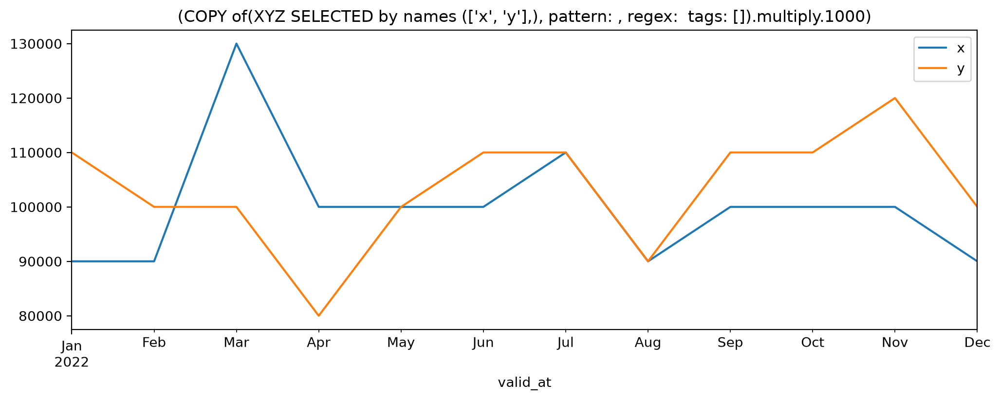

BEGIN GUIDE
<!---->
# Basic Usage

## Introduction

The time series library was created to operate in lieu of a fully blown timeseries system.

Being a code libarary it does not provide any services, of its own, but is built to *manage* or *communicate* with a storage layer, and metadata and workflow orchestration services.

Its main responsibility is to connect an information model and analytic features to loosely coupled services that combines into a complete solution.
It is designed mainly to facilitate quantitative analysis in code, but can also be the foundation for GUI applications for charts, tables and dashboards.

That means it provides (or connects to) all the main building blocks required to build a full, but lightweight, timeseries system.

This guide focuses on the most basic operations: reading and writing `Datasets`, and some basic features and manipulations.
<!---->
Configuration depencency:
The code below assumes access to a working configuration.
See the [Quick start guide](quickstart.md) for how to prepare it.

```python {.marimo}
import ssb_timeseries as ts
```

## Datasets

The statistics production processes are largely batch oriented and encourages writing vectorised code.
The library is therefore constructed to work with *datasets* as a primary unit of analysis.
While it is possible to work on individual series or values, the library is built around the idea that datasets are matrices and series are vectors.

Practically, this means that the `Dataset` class is the very core of the library.
Reads and writes (and most other core functionality) operates on the dataset level.
<!---->
### Create a dataset

To create our first `Dataset` we need some data.
Let us generate a dataframe `df` with some random data for three series.
The library used to create the dataframe (here: Pandas) does not matter, [any Narwhals compatible library will do](interoperability.md).

```python {.marimo}
from ssb_timeseries import sample_data
df = sample_data.xyz_at()
```

```python {.marimo}
df
```

<!-- @output:BYtC -->

| valid_at | x | y | z |
| --- | --- | --- | --- |
| 2022-01-01 | 90.0 | 110.0 | 120.0 |
| 2022-02-01 | 90.0 | 100.0 | 90.0 |
| 2022-03-01 | 130.0 | 100.0 | 90.0 |
| 2022-04-01 | 100.0 | 80.0 | 110.0 |
| 2022-05-01 | 100.0 | 100.0 | 90.0 |
| ... | ... | ... | ... |
| 2022-08-01 | 90.0 | 90.0 | 90.0 |
| 2022-09-01 | 100.0 | 110.0 | 100.0 |
| 2022-10-01 | 100.0 | 110.0 | 100.0 |
| 2022-11-01 | 100.0 | 120.0 | 90.0 |
| 2022-12-01 | 90.0 | 100.0 | 120.0 |

Note the structure: one shared `valid_at` column and one column for each of the series  `x`, `y` and `z`. The single date signifies a "point in time" *temporality*, `Temporality.AT`.

The temporality can be combined with any variant of *versioning* to define a `SeriesType` for a `Dataset`
For now, let us go with `Versioning.NONE`.

```python {.marimo}
from ssb_timeseries.types import SeriesType
POINT_IN_TIME = SeriesType('NONE', 'AT')
```

<!-- @output:emfo -->

`SeriesType('NONE', 'AT')` is a shorthand that resolves to `SeriesType(Versioning.NONE,Temporality.AT)`.

See the [core concepts](..info-model) and [the datatypes tutorial]()-types-and-storage for more about data types.

This is all we need to define a `Dataset` object. Let us call it "XYZ".

```python {.marimo}
from ssb_timeseries.dataset import Dataset
xyz = Dataset("XYZ", data_type=POINT_IN_TIME, data=df,)
```

We now have a `Dataset` object with name "XYZ" assigned to the variable `xyz`.

```python {.marimo}
repr(xyz)
```

<!-- @output:ZHCJ -->

<pre style="white-space: pre-wrap; overflow-wrap: break-word;">Dataset(name=&quot;XYZ&quot;, repository=&quot;tutorials&quot;, data_type=SeriesType(Versioning.NONE,Temporality.AT), as_of_tz=None)</pre>

<!-- @output:ROlb -->

<marimo-json-output data-json-data='{"name":"XYZ","data_type":"text/plain:NONE_AT","tags":{"name":"XYZ","versioning":"NONE","temporality":"AT","series":{"x":{"dataset":"XYZ","name":"x"},"y":{"dataset":"XYZ","name":"y"},"z":{"dataset":"XYZ","name":"z"}},"repository":"tutorials"},"repository":"tutorials","as_of_utc":null,"data":"text/html:\u003ctable border=\"1\" class=\"dataframe\"\u003e\u003cthead\u003e\u003ctr style=\"text-align: right;\"\u003e\u003cth\u003e\u003c/th\u003e\u003cth\u003evalid_at\u003c/th\u003e\u003cth\u003ex\u003c/th\u003e\u003cth\u003ey\u003c/th\u003e\u003cth\u003ez\u003c/th\u003e\u003c/tr\u003e\u003c/thead\u003e\u003ctbody\u003e\u003ctr\u003e\u003cth\u003e0\u003c/th\u003e\u003ctd\u003e2022-01-01\u003c/td\u003e\u003ctd\u003e90.0\u003c/td\u003e\u003ctd\u003e110.0\u003c/td\u003e\u003ctd\u003e120.0\u003c/td\u003e\u003c/tr\u003e\u003ctr\u003e\u003cth\u003e1\u003c/th\u003e\u003ctd\u003e2022-02-01\u003c/td\u003e\u003ctd\u003e90.0\u003c/td\u003e\u003ctd\u003e100.0\u003c/td\u003e\u003ctd\u003e90.0\u003c/td\u003e\u003c/tr\u003e\u003ctr\u003e\u003cth\u003e2\u003c/th\u003e\u003ctd\u003e2022-03-01\u003c/td\u003e\u003ctd\u003e130.0\u003c/td\u003e\u003ctd\u003e100.0\u003c/td\u003e\u003ctd\u003e90.0\u003c/td\u003e\u003c/tr\u003e\u003ctr\u003e\u003cth\u003e3\u003c/th\u003e\u003ctd\u003e2022-04-01\u003c/td\u003e\u003ctd\u003e100.0\u003c/td\u003e\u003ctd\u003e80.0\u003c/td\u003e\u003ctd\u003e110.0\u003c/td\u003e\u003c/tr\u003e\u003ctr\u003e\u003cth\u003e4\u003c/th\u003e\u003ctd\u003e2022-05-01\u003c/td\u003e\u003ctd\u003e100.0\u003c/td\u003e\u003ctd\u003e100.0\u003c/td\u003e\u003ctd\u003e90.0\u003c/td\u003e\u003c/tr\u003e\u003ctr\u003e\u003cth\u003e...\u003c/th\u003e\u003ctd\u003e...\u003c/td\u003e\u003ctd\u003e...\u003c/td\u003e\u003ctd\u003e...\u003c/td\u003e\u003ctd\u003e...\u003c/td\u003e\u003c/tr\u003e\u003ctr\u003e\u003cth\u003e7\u003c/th\u003e\u003ctd\u003e2022-08-01\u003c/td\u003e\u003ctd\u003e90.0\u003c/td\u003e\u003ctd\u003e90.0\u003c/td\u003e\u003ctd\u003e90.0\u003c/td\u003e\u003c/tr\u003e\u003ctr\u003e\u003cth\u003e8\u003c/th\u003e\u003ctd\u003e2022-09-01\u003c/td\u003e\u003ctd\u003e100.0\u003c/td\u003e\u003ctd\u003e110.0\u003c/td\u003e\u003ctd\u003e100.0\u003c/td\u003e\u003c/tr\u003e\u003ctr\u003e\u003cth\u003e9\u003c/th\u003e\u003ctd\u003e2022-10-01\u003c/td\u003e\u003ctd\u003e100.0\u003c/td\u003e\u003ctd\u003e110.0\u003c/td\u003e\u003ctd\u003e100.0\u003c/td\u003e\u003c/tr\u003e\u003ctr\u003e\u003cth\u003e10\u003c/th\u003e\u003ctd\u003e2022-11-01\u003c/td\u003e\u003ctd\u003e100.0\u003c/td\u003e\u003ctd\u003e120.0\u003c/td\u003e\u003ctd\u003e90.0\u003c/td\u003e\u003c/tr\u003e\u003ctr\u003e\u003cth\u003e11\u003c/th\u003e\u003ctd\u003e2022-12-01\u003c/td\u003e\u003ctd\u003e90.0\u003c/td\u003e\u003ctd\u003e100.0\u003c/td\u003e\u003ctd\u003e120.0\u003c/td\u003e\u003c/tr\u003e\u003c/tbody\u003e\u003c/table\u003e\u003cp\u003e12 rows × 4 columns\u003c/p\u003e","auto_tag_config":{"attributes":[],"separator":"_","regex":""},"product":"","process_stage":"","sharing":{}}' data-value-types='"python"'></marimo-json-output>

### Write a dataset
<!---->
The object lives in memory only untill we save it.
Saving relies on configuration to tell which *repositories* it can go into.
<!---->
If more than one repository is configured, we can specify which we want to write to.
If we don't, an existing set will be written to the repository it was read from and a new set will be written to the default repository.

```python {.marimo}
xyz.save()
```

### Dataset .data and .tags
<!---->
We find `df` as `Dataset.data`.

<!-- @output:Pvdt -->

|    | valid_at            |   x |   y |   z |
|---:|:--------------------|----:|----:|----:|
|  0 | 2022-01-01 00:00:00 |  90 | 110 | 120 |
|  1 | 2022-02-01 00:00:00 |  90 | 100 |  90 |
|  2 | 2022-03-01 00:00:00 | 130 | 100 |  90 |
|  3 | 2022-04-01 00:00:00 | 100 |  80 | 110 |
|  4 | 2022-05-01 00:00:00 | 100 | 100 |  90 |
|  5 | 2022-06-01 00:00:00 | 100 | 110 | 100 |
|  6 | 2022-07-01 00:00:00 | 110 | 110 |  80 |
|  7 | 2022-08-01 00:00:00 |  90 |  90 |  90 |
|  8 | 2022-09-01 00:00:00 | 100 | 110 | 100 |
|  9 | 2022-10-01 00:00:00 | 100 | 110 | 100 |
| 10 | 2022-11-01 00:00:00 | 100 | 120 |  90 |
| 11 | 2022-12-01 00:00:00 |  90 | 100 | 120 |

Note that the original type of `.data` is not persisted over saving and reading back, or calculations.
That should not matter for operations on the dataset itself,
and interoperability shorthands like `pa`, `pd` and `pl` are available to request a specific implemewntation.
<!---->
The `.tags` attribute package a dictionary of metadata:

```python {.marimo}
mo.tree(xyz.tags)
```

<!-- @output:nHfw -->

<marimo-json-output data-json-data='{"name":"XYZ","versioning":"NONE","temporality":"AT","series":{"x":{"dataset":"XYZ","name":"x"},"y":{"dataset":"XYZ","name":"y"},"z":{"dataset":"XYZ","name":"z"}},"repository":"tutorials"}' data-value-types='"python"'></marimo-json-output>

For our sample set, we have not made any effort to descrtibe our data, so only a minimal set of technical attributes are applied.
Descriptive attributes, or "tags" can be specified as well. See [tag maintenance](tag-maintenance).

Tags apply at both the `Dataset` and `Series` levels.
The technical implementation for the tags is a key-value structure in the form of a Python `dictionary`.
Some rules and conventions that apply are described in the [core concepts](..info-model), and other guides go deeper into [search and filtering](meta-search-and-filtering), [tag maintenance](meta-tag-maintenance) and [calculations with metadata](calc-with-metadata).
<!---->
### Read a dataset
<!---->
For an existing dataset, initating a `Dataset("<name>")` will read it.
If we do not specify and interval, reading will collect either all the data (for `Versioning.NONE`) or the latest version (for `Versioning.AS_OF`).

```python {.marimo}
read_xyz_back = Dataset("XYZ")
```

You may see several lines of text written to `std_out` for both reading and writing.
The logging behaviour can be modified in the configuration.
The logging of reading and writing provides data lineage, and can be leveraged for orchestration: adding a queue or API logger allows even driven workflows.
<!---->
### Deriving new datasets

The library has built in funcitonality for basic arithmetics and linear algebra, calculations with time and calculations with metadata.
<!---->
Other groups have limited or no functionality at the time of writing, but may be added later:
- Logical functions
- Set functions
- Unit conversion
- Currency conversion
- Indexing

```python {.marimo}
check_equality = (xyz == read_xyz_back)
```

The calculation returns a new `Dataset` object.
Inspect the data to very that all values are equal:

<!-- @output:wAgl -->

|    | valid_at            | x    | y    | z    |
|---:|:--------------------|:-----|:-----|:-----|
|  0 | 2022-01-01 00:00:00 | True | True | True |
|  1 | 2022-02-01 00:00:00 | True | True | True |
|  2 | 2022-03-01 00:00:00 | True | True | True |
|  3 | 2022-04-01 00:00:00 | True | True | True |
|  4 | 2022-05-01 00:00:00 | True | True | True |
|  5 | 2022-06-01 00:00:00 | True | True | True |
|  6 | 2022-07-01 00:00:00 | True | True | True |
|  7 | 2022-08-01 00:00:00 | True | True | True |
|  8 | 2022-09-01 00:00:00 | True | True | True |
|  9 | 2022-10-01 00:00:00 | True | True | True |
| 10 | 2022-11-01 00:00:00 | True | True | True |
| 11 | 2022-12-01 00:00:00 | True | True | True |

The boolean return type is semi-supported for now:
That is sufficient for intermediate calculations, but most functionality will fail and the storage model will require casting to numbers.

A more direct check for the test above is `Dataset.all()` to check if all the values for the series (ie. not the dates) evaluate to `True`.

```python {.marimo}
check_equality.all()
```

<!-- @output:dGlV -->

<pre style="white-space: pre-wrap; overflow-wrap: break-word;">True</pre>

<!-- @output:SdmI -->

```
>>> check_equality.all()

True
```

The new dataset object got a new name automatically generated.
The same thing can be observed for the filter and multiplication below.

A new dataset object with a new name is the standard behaviour for all [calculations](calculations.md) performed by the library.
The new name is an important safeguard against destroying data.
The "lineage naming" that tells which operations were performed hints about the larger topic of [data lineage](lineage.md).

In real production code, the calculation of any dataset that we intend to save should be followed by a `Dataset.rename()` and updating the [descriptive metadata]() to reflect whichever calculations where performed.
Functions and guidelines for [metadata maintenance](meta-tag-maintenance) is a topic in itself.

```python {.marimo}
big_xyz = xyz['x', 'y'] *1000
big_xyz.plot()
```

<!-- @output:yOPj -->



Planned: Iterators
------------------

While many of the most used calculation features are implemented for the `Dataset` objects, iterating over `Series` ... --> TODO.
