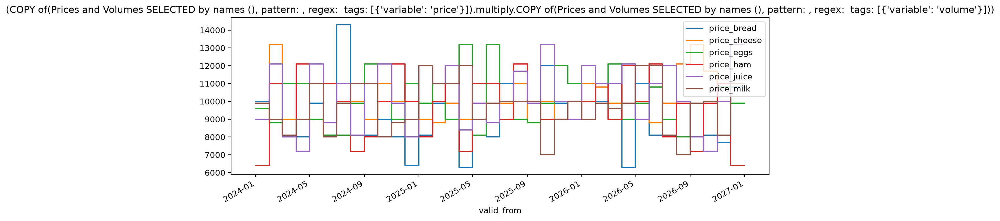
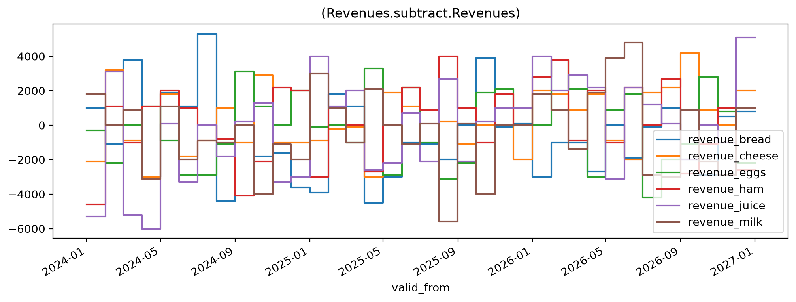

Basic arithmetic
================
<!---->
Scope
-----

This guide illustrates some basic arithmetics and explains some of the general principles for calculations, and touches upon some ways to leverage other libraries.

More specific guides are provided for topics like [calculations with time](calc-with-time) and [metadata centric calculations](calc-with-metadata).
<!---->
Prerequisites
-------------

``` {note}
The guide assumes that the SSB Timeseries library is installed and that a working configuration is active.
See [the quickstart guide](quickstart) for instructions to that.
```

The presented functionality itself relies on `dataset.Dataset`.

```python {.marimo}
from ssb_timeseries.dataset import Dataset
```

Generate some test data

We will generate random data for all permutations of some descriptive metadata,

```python {.marimo}
create_some_example_data(
    set_name="Prices and Volumes",
    as_of_dates = [date(*d) for d in product({2024,2025}, range(1,13), {1})],
    series_tags = {
        "variable": ["price", "volume"],
        "product": ["milk", "eggs", "bread", "juice", "ham", "cheese"],
    }
)
```

```python {.marimo}

```

Element-wise calculations
-------------------------
<!---->
Our dataset "Prices and Volumes" contain *prices* and *volumes* for a number of *products*.
Let us retrieve it for a single version identfied by the `as_of` date:

```python {.marimo}
jul = Dataset(name="Prices and Volumes", as_of_tz="2025-07-01")
```

... and separate *prices* from *volumes* by selecting series with tags, and calculate *revenues* by multiplying them element-wise:

```python {.marimo}
jul_prices = jul[{'variable': 'price'}]
jul_volumes = jul[{'variable': 'volume'}]

jul_revenue = jul_prices * jul_volumes
```

```python {.marimo}
jul_revenue.plot()
```

<!-- @output:qnkX -->



<!-- @output:TqIu -->

It returns a new dataset with a long and unwieldly name:

`(COPY of(Prices and Volumes SELECTED by names (), pattern: , regex:  tags: [{'variable': 'price'}]).multiply.COPY of(Prices and Volumes SELECTED by names (), pattern: , regex:  tags: [{'variable': 'volume'}]))`

The name and tags need to be updated to make sense:

```python {.marimo}
jul_revenue.rename("Revenues", ('price', 'revenue'))
jul_revenue.replace_tags(({'variable':'price'}, {'variable': 'revenue'}))
```

Not only the final calculation, but also the two slices created by the filter operations are new dataset instances.
The same holds if we do not assign the intermediate variables:

```python {.marimo}
feb = Dataset(name="Prices and Volumes", as_of_tz="2025-02-01")
```

```python {.marimo}
feb_revenue = feb[{'variable': 'price'}] * feb[{'variable': 'volume'}]
feb_revenue.rename("Revenues", ('price', 'revenue'))
feb_revenue.replace_tags(({'variable':'price'}, {'variable': 'revenue'}))
```

This copying behaviour is by design:
The library seeks to avoid in place updates.

```python {.marimo}
change_in_revenue = jul_revenue - feb_revenue
change_in_revenue.plot()
```

<!-- @output:aLJB -->



The above examples showed simple arithemetic with `*` and `-`.
These and other *infix* operators for element-wise arithmetic and comparisons work for `Dataaset` objects because the class exposes "dunder" methods to [emulate numeric types](https://docs.python.org/3/reference/datamodel.html#emulating-numeric-types) and [rich comparisons](https://docs.python.org/3/reference/datamodel.html#basic-customization).
<!---->
The behaviour for all of them is element-wise, corresponding to the Numpy defaults.
<!---->
The implementations for the mathematical operators follows a pattern: a wrapper function that uses the [interoperability](nteroperability) library [Narwhals](https://narwhals-dev.github.io/narwhals/) to standardize input and pass on the actual work to Numpy.

There are several points to unpack.
<!---->
[Numpy "broadcasting rules"](https://numpy.org/doc/stable/user/basics.broadcasting.html) apply for different size objects of supported types.
Broadcasting rules and dimensional conditions are avaluated only for the numeric parts - the math functions will ignore the date columns.
Whereas the  multiplication example above had matching dates, the  subtraction had the same size data but different dates.
This means that any required date alignment must be performed explicitly prior to the arithmetic calculations.
<!---->
Narwhals under the hood allow the arithmetic functions to support operating not only on `Dataset` objects, but on combinations of datasets with a large number of other datatypes (scalars, Numpy arrays, dataframes, Arrow tables).
Note that the "dataframe like" objects (including Arrow tables) are all conflated to 'df' in the lineage tracking.
<!---->
Narwhals also brings conversion of `Dataset.data` to other libraries and their functionality within short reach.
Shorthand properties `Dataset.pa`, `.nw`, `.pd`, and `.pl` will return Arrow tables, and Narwhals, Pandas and Polars dataframes.
Each of these comes with their own set of features, but the main point is interoperability.

Some meaningless calculation examples just to illustrate possible combinations of object types and operations:

```python {.marimo}
((jul - feb.pd) / feb.pl).name
```

<!-- @output:TRpd -->

<pre style="white-space: pre-wrap; overflow-wrap: break-word;">((Prices and Volumes.subtract.df).divide.df)</pre>

```python {.marimo}
((jul - feb.pa)/ feb.nw).name
```

<!-- @output:TXez -->

<pre style="white-space: pre-wrap; overflow-wrap: break-word;">((Prices and Volumes.subtract.df).divide.df)</pre>

```python {.marimo}
try:
    feb.pd**2
except  TypeError:
    print("With Pandas `__pow__` and fails for date columns (unless index is set).")
```

<!-- @output:dNNg -->

<pre style="white-space: pre-wrap; overflow-wrap: break-word;">With Pandas `__pow__` and fails for date columns (unless index is set).
</pre>

```python {.marimo}
type(feb.pd.set_index(['valid_from','valid_to'])**2)
```

<!-- @output:yCnT -->

<pre style="white-space: pre-wrap; overflow-wrap: break-word;">&lt;class &#x27;pandas.DataFrame&#x27;&gt;</pre>

```python {.marimo}
feb.pd.iloc[0,:]
#.set_index(['valid_from', 'valid_to']) * 1.2
```

<!-- @output:wlCL -->

| 0 |
| --- |
| 2023-12-31 23:00:00+00:00 |
| 2024-01-31 23:00:00+00:00 |
| 100.0 |
| 120.0 |
| 90.0 |
| ... |
| 100.0 |
| 110.0 |
| 100.0 |
| 110.0 |
| 90.0 |

```python {.marimo}
x = feb
x_tbl = feb.pa
x_pd = feb.pd
x_pl = feb.pl
```

Or, entriely meaninglesss, but it gets be point across:

```python {.marimo}
do_stuff = x**2 / x.pa + x_pd + x_pl - x**2 - 100 + x.data
```

```python {.marimo}
do_stuff.name
```

<!-- @output:lgWD -->

<pre style="white-space: pre-wrap; overflow-wrap: break-word;">(((((((Prices and Volumes.power.2).divide.df).add.df).add.df).subtract.(Prices and Volumes.power.2)).subtract.100).add.df)</pre>

The interoperability also means that for any functionality that is missing in SSB Timeseries, it is easy to fill in the blanks with Pandas, Polars or Arrow.
For example, at the time of writing, interval support and filtering by dates is an underdeveloped area of functionality.

```python {.marimo}
import polars as pl

d_from = date(2024, 2, 22)
d_to = pl.date(2024, 3, 2)
```

```python {.marimo}
x_row = x.pl.filter( pl.col("valid_to").is_between(d_from, d_to) )
```

```python {.marimo}
x_row
```

<!-- @output:urSm -->

| valid_from | valid_to | price_bread | price_cheese | price_eggs | price_ham | price_juice | price_milk | volume_bread | volume_cheese | volume_eggs | volume_ham | volume_juice | volume_milk |
| --- | --- | --- | --- | --- | --- | --- | --- | --- | --- | --- | --- | --- | --- |
| datetime[ns, UTC] | datetime[ns, UTC] | f64 | f64 | f64 | f64 | f64 | f64 | f64 | f64 | f64 | f64 | f64 | f64 |
| 2024-01-31 23:00:00 UTC | 2024-02-29 23:00:00 UTC | 110.0 | 100.0 | 110.0 | 110.0 | 100.0 | 100.0 | 110.0 | 100.0 | 100.0 | 90.0 | 90.0 | 90.0 |

Broadcasting
------------

The difference between broadcasted and element-wise:

```python {.marimo}
elementwise = (x * x)
print(elementwise.name)
print(type(elementwise))
print(elementwise.data.shape)
```

<!-- @output:mWxS -->

<pre style="white-space: pre-wrap; overflow-wrap: break-word;">(Prices and Volumes.multiply.Prices and Volumes)
&lt;class &#x27;ssb_timeseries.dataset.Dataset&#x27;&gt;
(36, 14)
</pre>

```python {.marimo}
broadcast = (x * x_row)
print(broadcast.name)
print(type(broadcast))
print(broadcast.data.shape)
```

<!-- @output:CcZR -->

<pre style="white-space: pre-wrap; overflow-wrap: break-word;">(Prices and Volumes.multiply.df)
&lt;class &#x27;ssb_timeseries.dataset.Dataset&#x27;&gt;
(36, 14)
</pre>

```python {.marimo}
(broadcast == elementwise).data
```

<!-- @output:YWSi -->

<pre style="white-space: pre-wrap; overflow-wrap: break-word;">pyarrow.Table
valid_from: timestamp&#91;ns, tz=UTC&#93; not null
valid_to: timestamp&#91;ns, tz=UTC&#93; not null
price_bread: bool
price_cheese: bool
price_eggs: bool
price_ham: bool
price_juice: bool
price_milk: bool
volume_bread: bool
volume_cheese: bool
volume_eggs: bool
volume_ham: bool
volume_juice: bool
volume_milk: bool
----
valid_from: &#91;&#91;2023-12-31 23:00:00.000000000Z,2024-01-31 23:00:00.000000000Z,2024-02-29 23:00:00.000000000Z,2024-03-31 22:00:00.000000000Z,2024-04-30 22:00:00.000000000Z,...,2026-07-31 22:00:00.000000000Z,2026-08-31 22:00:00.000000000Z,2026-09-30 22:00:00.000000000Z,2026-10-31 23:00:00.000000000Z,2026-11-30 23:00:00.000000000Z&#93;&#93;
valid_to: &#91;&#91;2024-01-31 23:00:00.000000000Z,2024-02-29 23:00:00.000000000Z,2024-03-31 22:00:00.000000000Z,2024-04-30 22:00:00.000000000Z,2024-05-31 22:00:00.000000000Z,...,2026-08-31 22:00:00.000000000Z,2026-09-30 22:00:00.000000000Z,2026-10-31 23:00:00.000000000Z,2026-11-30 23:00:00.000000000Z,2026-12-31 23:00:00.000000000Z&#93;&#93;
price_bread: &#91;&#91;false,true,false,true,false,...,false,false,true,false,false&#93;&#93;
price_cheese: &#91;&#91;false,true,false,true,false,...,false,false,false,true,true&#93;&#93;
price_eggs: &#91;&#91;false,true,true,true,false,...,false,true,false,false,true&#93;&#93;
price_ham: &#91;&#91;true,true,false,false,false,...,false,false,false,false,false&#93;&#93;
price_juice: &#91;&#91;false,true,false,false,false,...,false,true,false,false,false&#93;&#93;
price_milk: &#91;&#91;false,true,false,false,false,...,true,true,false,false,true&#93;&#93;
volume_bread: &#91;&#91;false,true,false,false,false,...,false,false,false,false,false&#93;&#93;
volume_cheese: &#91;&#91;true,true,false,false,false,...,false,true,false,true,false&#93;&#93;
...</pre>

(Note how for the second row, matching `x_row` all values of the comparison are `True`.)

\# bigger example - not needed?
tags = {"Var": ["price", "volume"], \
        "Product": ["milk", "eggs", "bread", "cheese", "ham"], \
        "Store": ["A", "B", "C", "D", "E"], \
        "Region": ["N", "S", "E", "W", "NE", "NW", "SE", "SW"]}

some_data = create_df(
    *[value for value in tags.values()],
    start_date="2000-12-01",
    end_date="2024-01-01",
    freq="MS",
    implementation="pandas").set_index('valid_at')
some_data.info()
<!---->
### Vectors

<!-- @output:YECM -->

We can also get a vector (or more precisely, a Narwhals series) per series in the set. For the `jul_revenue` set from above:

`jul_revenue.series=['revenue_bread', 'revenue_cheese', 'revenue_eggs', 'revenue_ham', 'revenue_juice', 'revenue_milk']`

Let us first record what we already have in memory:

```python {.marimo}
variables_in_memory = set(locals())
```

Then do the incantation (with the right intonation, and swing the magic wand):

```python {.marimo}
jul_revenue.vectors()
```

The impact of this may not be immediately visible, but this method call will have assigned a variable for each of the series names.

... so if we check for new variables:

```python {.marimo}
newly_created  = set(locals())-variables_in_memory - {'variables_in_mamory'}
newly_created
```

<!-- @output:kLmu -->

<pre style="white-space: pre-wrap; overflow-wrap: break-word;">{&#x27;revenue_ham&#x27;, &#x27;revenue_eggs&#x27;, &#x27;revenue_juice&#x27;, &#x27;revenue_bread&#x27;, &#x27;revenue_cheese&#x27;, &#x27;variables_in_memory&#x27;, &#x27;revenue_milk&#x27;, &#x27;valid_to&#x27;, &#x27;valid_from&#x27;}</pre>

<!-- @output:IpqN -->

``` <class 'Warning'>
Be careful!
`.vectors()` blindly assigns to variables outside its own scope.
That can have nasty side effects if column names happen to match to variables or objects that already exist.
```

Vectors accepts filter parameters. The following will behave the same as  `jul['*eggs*'].vectors()`, but will not create an intermediate dataset object.

```python {.marimo}
jul.vectors('eggs')
```

```python {.marimo}
set(locals()) - variables_in_memory - newly_created
```

<!-- @output:TTti -->

<pre style="white-space: pre-wrap; overflow-wrap: break-word;">{&#x27;price_eggs&#x27;, &#x27;newly_created&#x27;, &#x27;volume_eggs&#x27;}</pre>

The vector variables may be used for calculations directly, using Narwhals functionality:

```python {.marimo}
(price_eggs * volume_eggs).mean()
```

<!-- @output:IaQp -->

<pre style="white-space: pre-wrap; overflow-wrap: break-word;">10144.444444444445</pre>

<!-- @output:IWgg -->

``` <class 'Warning'>
Caveats:
Note that `.vectors()` is an experimental feature and the Narwhals library is not aimed at end users.
The behaviour of the `vectors()` and in particular Narwhals series as returntype, is up for consideration and may be changed later.
```

Or, convert with `.to_list()` or `.to_numpy()`.

```python {.marimo}
price_eggs.to_numpy()
```

<!-- @output:LkGn -->

<pre style="white-space: pre-wrap; overflow-wrap: break-word;">array(&#91; 80., 110., 100., 100.,  90.,  90.,  90.,  90., 110., 110., 100.,
       100.,  90., 110.,  90., 110.,  90., 110., 100., 100.,  80., 110.,
       120., 110., 100., 110., 110.,  90., 110., 120.,  90., 100.,  90.,
       100.,  90.,  90.&#93;)</pre>

See also [Calculating with time](calc-with-time) or [Calculating with metadata](calc-with-meta-tags).

```python {.marimo name="test_true"}
# @supress

def test_true():
    assert True
```

<!-- @output:woaO -->

<pre style="white-space: pre-wrap; overflow-wrap: break-word;">&#91;32m.&#91;0m&#91;32m                                                                        &#91;100%&#93;&#91;0m
=================================== Overview ===================================
Passed Tests:
&#91;1m&#91;32m&#91;22m✓&#91;0m&#91;0m notebooks/calc-basic-arithmetic.py::test_true

Summary:
Total: 1, Passed: 1, Failed: 0, Errors: 0, Skipped: 0
</pre>
