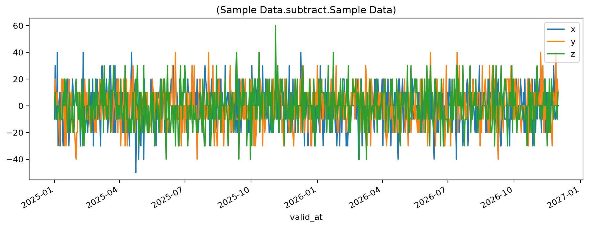
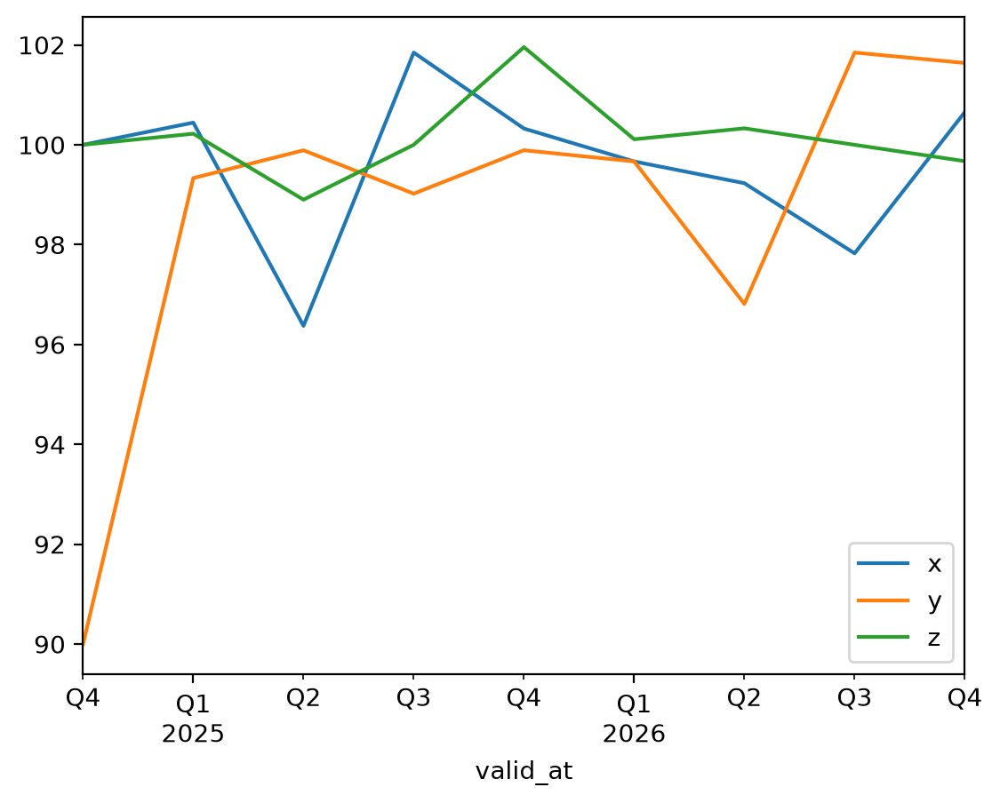

Calculating with time
=====================
<!---->
Scope
-----

This guide demonstrates handling of time.

We repeat ever so briefly some examples are covered in more detail elsewhere.

- Storage implementation: UTC under the hood.
- Calculating differeneces between versions identified by `as_of`-dates is simple arithmetics after retrieving a data.
- Interval for data retrieval and simple filtering after retrieval of the data along the time axis using time aware functionality of other libararies.
- Functions along the time axis:
  - Sampling and aggregations (group by)
  - Changing types.
  - Moving average.

Planned extensions:
  - Indexing
  - Diff, shift, cumsum

Proper timeseries analysis and seasonal adjustment. (Planned integrations.)
<!---->
The quintessential time functions work along the time axis.
<!---->
## Prerequisites

``` {note}
The guide assumes that the SSB Timeseries library is installed and that a working configuration is active.
See [the quickstart guide](quickstart) for instructions to that.
```

The presented functionality relies on `dataset.Dataset`.
Other imports like`types.SeriesType` and external libraries are used only for generating the sample data.

```python {.marimo}
from ssb_timeseries.dataset import Dataset
```

```python {.marimo}
from ssb_timeseries.types import SeriesType
from ssb_timeseries.sample_data import create_df
from itertools import product
from datetime import date
```

Generate some test data

```python {.marimo}
def create_some_example_data(
    set_name: str,
    as_of_dates: list[date],
    series_tags: dict[str,list[str]],
):
    """Generate and save some sample data."""
    set_tags = { "Country": "Norway" }
    for d in as_of_dates:
        df = create_df(
            *[value for value in series_tags.values()],
            temporality= 'AT',
            start_date="2025-01-01",
            end_date="2026-12-01",
            freq="D",
        )
        Dataset(
            name=set_name,
            data_type=SeriesType('AS_OF', 'AT'),
            as_of_tz=str(d),
            data=df,
            tags = set_tags,
            attributes = series_tags.keys(),
        ).save()
```

We will generate random data for all permutations of some descriptive metadata,

```python {.marimo}
create_some_example_data(
    set_name="Sample Data",
    as_of_dates = [date(*d) for d in product({2024,2025}, range(1,13), {1})],
    series_tags = {'area': ["x", "y","z"]}
)
```

Element-wise arithmetic
--------------------------------
<!---->
Our dataset "Prices and Volumes" contain *prices* and *volumes* for a number of *products*.

[Basic arithmetic](calc-basic-arithmetic) may be performed on same size data:

```python {.marimo}
jul = Dataset(name="Sample Data", as_of_tz="2025-07-01")
feb = Dataset(name="Sample Data", as_of_tz="2025-02-01")

change_from_feb_to_july = jul - feb
```

```python {.marimo}
change_from_feb_to_july.plot()
```

<!-- @output:iLit -->



The Numpy implementation means that element-wise calculation is the default, with [Numpy "broadcasting rules"](https://numpy.org/doc/stable/user/basics.broadcasting.html) for different size objects.
Broadcasting rules and dimensional conditions are avaluated only for the numeric parts - the math functions will ignore the date columns.
Date alignment must be performed explicitly prior to the calculation.
<!---->
Narwhals under the hood first and foremost allow the arithmetic functions support operating not only on `Dataset` objects, but on combinations of datasets with a large number of other datatypes (scalars, Numpy arrays, dataframes, Arrow tables).
Note that the "dataframe like" objects are all conflated to 'df' in the lineage tracking.

Filter by dates
---------------------------------------
<!---->
Narwhals also brings conversion of `Dataset.data` to other libraries and their functionality within short reach.
Shorthand properties `Dataset.pa`, `.nw`, `.pd`, and `.pl` return Arrow tables, and Narwhals, Pandas and Polars dataframes.

Interval support and filtering by dates is an underdeveloped area of functionality.

```python {.marimo}
import polars as pl

d_from = date(2024, 2, 22)
d_to = pl.date(2024, 3, 2)
```

```python {.marimo}
x_row = jul.pl.filter( pl.col("valid_at").is_between(d_from, d_to) )
```

```python {.marimo}
x_row
```

<!-- @output:ZBYS -->

| valid_at | x | y | z |
| --- | --- | --- | --- |
| datetime[ns, UTC] | f64 | f64 | f64 |

\# bigger example - not needed?
tags = {"Var": ["price", "volume"], \
        "Product": ["milk", "eggs", "bread", "cheese", "ham"], \
        "Store": ["A", "B", "C", "D", "E"], \
        "Region": ["N", "S", "E", "W", "NE", "NW", "SE", "SW"]}

some_data = create_df(
    *[value for value in tags.values()],
    start_date="2000-12-01",
    end_date="2024-01-01",
    freq="MS",
    implementation="pandas").set_index('valid_at')
some_data.info()

Group by
--------

```python {.marimo}
jul.pl.describe().select(pl.col(["statistic", "valid_at"]))
```

<!-- @output:AjVT -->

| statistic | valid_at |
| --- | --- |
| str | str |
| "count" | "700" |
| "null_count" | "0" |
| "mean" | "2025-12-16 10:24:00+00:00" |
| "std" | null |
| "min" | "2024-12-31 23:00:00+00:00" |
| "25%" | "2025-06-24 22:00:00+00:00" |
| "50%" | "2025-12-16 23:00:00+00:00" |
| "75%" | "2026-06-08 22:00:00+00:00" |
| "max" | "2026-11-30 23:00:00+00:00" |

Group by
--------

```python {.marimo}
jul.data = jul.pd # workaround for BUG!
```

```python {.marimo}
quarterly = jul.groupby('Q','mean')
```

```python {.marimo}
quarterly.data
```

<!-- @output:TRpd -->

| x | y | z |
| --- | --- | --- |
|  |  |  |
| 100.000000 | 90.000000 | 100.000000 |
| 100.444444 | 99.333333 | 100.222222 |
| 96.373626 | 99.890110 | 98.901099 |
| 101.847826 | 99.021739 | 100.000000 |
| 100.326087 | 99.891304 | 101.956522 |
| 99.666667 | 99.666667 | 100.111111 |
| 99.230769 | 96.813187 | 100.329670 |
| 97.826087 | 101.847826 | 100.000000 |
| 100.655738 | 101.639344 | 99.672131 |

```python {.marimo}

```

```python {.marimo}
quarterly.pd.plot()
# sum --> strange first value because of tz conversion / and not full period
```

<!-- @output:dNNg -->



Moving average
--------------

```python {.marimo}
rolling_4q_avg = quarterly.moving_average(-4,-1)
```

```python {.marimo}
rolling_4q_avg.data
```

<!-- @output:kqZH -->

<pre style="white-space: pre-wrap; overflow-wrap: break-word;">pyarrow.Table
x: double
y: double
z: double
valid_at: extension&lt;pandas.period&lt;ArrowPeriodType&gt;&gt;
----
x: &#91;&#91;nan,nan,nan,nan,99.66647422625684,99.74799596538728,99.55355152094282,100.26783723522854,99.26240245261985&#93;&#93;
y: &#91;&#91;nan,nan,nan,nan,97.0612955884695,99.53412167542604,99.61745500875936,98.84822423952859,99.55474597865901&#93;&#93;
z: &#91;&#91;nan,nan,nan,nan,99.78083028083029,100.2699607156129,100.24218293783512,100.59932579497797,100.59932579497797&#93;&#93;
valid_at: &#91;&#91;219,220,221,222,223,224,225,226,227&#93;&#93;</pre>

```python {.marimo}
# Observe BUG: valid_at as period_index converted to number
```

See also [Calculating with time](calc-with-time) or [Calculating with metadata](calc-with-meta-tags).

<!-- @output:dGlV -->

<pre style="white-space: pre-wrap; overflow-wrap: break-word;">&#91;32m.&#91;0m&#91;32m                                                                        &#91;100%&#93;&#91;0m
=================================== Overview ===================================
Passed Tests:
&#91;1m&#91;32m&#91;22m✓&#91;0m&#91;0m notebooks/calc-with-time.py::test_true

Summary:
Total: 1, Passed: 1, Failed: 0, Errors: 0, Skipped: 0
</pre>
