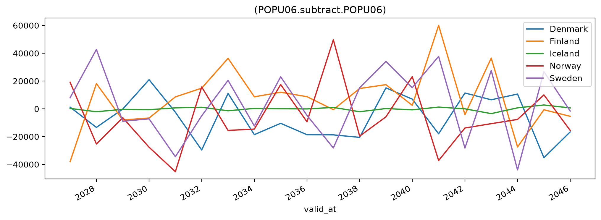
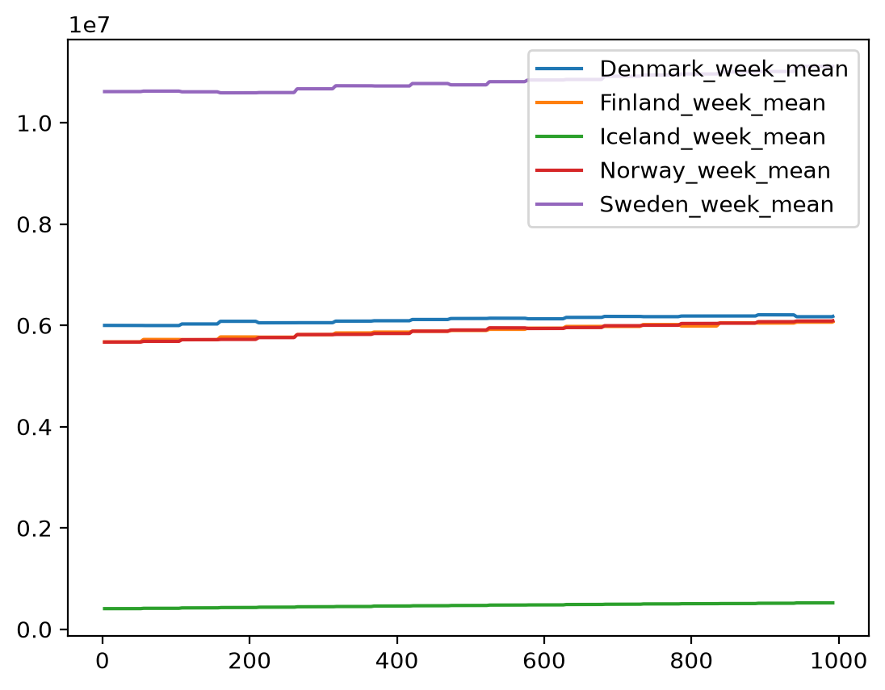

Calculating with time
=====================
<!---->
Scope
-----

This guide demonstrates handling of time.

We repeat ever so briefly some examples are covered in more detail elsewhere.

- Storage implementation: UTC under the hood.
- Calculating differeneces between versions identified by `as_of`-dates is simple arithmetics after retrieving a data.
- Interval for data retrieval and simple filtering after retrieval of the data along the time axis using time aware functionality of other libararies.
- Functions along the time axis:
  - Resampling to other frequencies.
  - Sampling and aggregations (group by).
  - Changing types.
  - Moving average.

Planned extensions:
  - Indexing
  - Diff, shift, cumsum

Proper timeseries analysis and seasonal adjustment are covered by external libraries, demonstrated later in this guide (see Timeseries analysis).
<!---->
The quintessential time functions work along the time axis.
<!---->
## Prerequisites

``` {note}
The guide assumes that the SSB Timeseries library is installed and that a working configuration is active.
See [the quickstart guide](quickstart) for instructions to that.
```

The presented functionality relies on `dataset.Dataset`.
Other imports like`types.SeriesType` and external libraries are used only for generating the sample data.

```python {.marimo}
from ssb_timeseries.dataset import Dataset
```

```python {.marimo}
from datetime import date
from itertools import product

import numpy as np

from ssb_timeseries.sample_data import POPU06_MAIN_COUNTRIES
from ssb_timeseries.sample_data import create_df
from ssb_timeseries.sample_data import popu06
from ssb_timeseries.types import SeriesType
```

Generate some test data

```python {.marimo}
def create_popu06_versions(
    as_of_dates: list[date],
    countries: tuple[str, ...],
    noise: float = 0.002,
    seed: int = 20251001,
):
    """Save one version of the Nordic population projections for each as-of date.

    The projections themselves are static and reproducible, so a small seeded
    perturbation is applied to give each version its own values.
    Without it every version would hold identical numbers and calculating
    between two versions would yield nothing but zeros.
    """
    base = popu06(countries=countries, start_year=2027, end_year=2046)
    generator = np.random.default_rng(seed)
    for as_of in as_of_dates:
        version = base.copy()
        for country in countries:
            jitter = 1 + noise * generator.standard_normal(len(version))
            version[country] = (
                version[country].to_numpy() * jitter
            ).round().astype("int64")
        Dataset(
            name="POPU06",
            data_type=SeriesType("AS_OF", "AT"),
            as_of_tz=str(as_of),
            data=version,
            tags={
                "source": "POPU06",
                "table": "Population projections by age and sex, total",
            },
        ).save()
```

We will store the population projections published in the Nordic Statistics database table
[POPU06](https://pxweb.nordicstatistics.org), one series per country.
The same projections are stored once per `as_of`-date, so that versions can be compared.

```python {.marimo}
create_popu06_versions(
    as_of_dates=[date(*d) for d in product({2024, 2025}, range(1, 13), {1})],
    countries=POPU06_MAIN_COUNTRIES,
)
```

Element-wise arithmetic
--------------------------------
<!---->
Our dataset "POPU06" contains *population projections* for the Nordic countries.

[Basic arithmetic](calc-basic-arithmetic) may be performed on same size data:

```python {.marimo}
jul = Dataset(name="POPU06", as_of_tz="2025-07-01")
feb = Dataset(name="POPU06", as_of_tz="2025-02-01")

change_from_feb_to_july = jul - feb
```

```python {.marimo}
change_from_feb_to_july.plot()
```

<!-- @output:iLit -->



The Numpy implementation means that element-wise calculation is the default, with [Numpy "broadcasting rules"](https://numpy.org/doc/stable/user/basics.broadcasting.html) for different size objects.
Broadcasting rules and dimensional conditions are avaluated only for the numeric parts - the math functions will ignore the date columns.
Date alignment must be performed explicitly prior to the calculation.
<!---->
Narwhals under the hood first and foremost allow the arithmetic functions support operating not only on `Dataset` objects, but on combinations of datasets with a large number of other datatypes (scalars, Numpy arrays, dataframes, Arrow tables).
Note that the "dataframe like" objects are all conflated to 'df' in the lineage tracking.

Filter by dates
---------------------------------------
<!---->
Narwhals also brings conversion of `Dataset.data` to other libraries and their functionality within short reach.
Shorthand properties `Dataset.pa`, `.nw`, `.pd`, and `.pl` return Arrow tables, and Narwhals, Pandas and Polars dataframes.

Interval support and filtering by dates is an underdeveloped area of functionality.

```python {.marimo}
import polars as pl

d_from = date(2035, 1, 1)
d_to = pl.date(2039, 12, 31)
```

```python {.marimo}
x_row = jul.pl.filter( pl.col("valid_at").is_between(d_from, d_to) )
```

```python {.marimo}
x_row
```

<!-- @output:ZBYS -->

| valid_at | Denmark | Finland | Iceland | Norway | Sweden |
| --- | --- | --- | --- | --- | --- |
| datetime[ns, UTC] | f64 | f64 | f64 | f64 | f64 |
| 2035-12-31 23:00:00 UTC | 6.134939e6 | 5.899144e6 | 468533.0 | 5.908382e6 | 1.0749026e7 |
| 2036-12-31 23:00:00 UTC | 6.140989e6 | 5.921987e6 | 476381.0 | 5.95139e6 | 1.0811669e7 |
| 2037-12-31 23:00:00 UTC | 6.130022e6 | 5.944316e6 | 479762.0 | 5.937953e6 | 1.0844831e7 |
| 2038-12-31 23:00:00 UTC | 6.157238e6 | 5.978206e6 | 487794.0 | 5.956446e6 | 1.0855639e7 |

\# bigger example - not needed?
tags = {"Var": ["price", "volume"], \
        "Product": ["milk", "eggs", "bread", "cheese", "ham"], \
        "Store": ["A", "B", "C", "D", "E"], \
        "Region": ["N", "S", "E", "W", "NE", "NW", "SE", "SW"]}

some_data = create_df(
    *[value for value in tags.values()],
    start_date="2000-12-01",
    end_date="2024-01-01",
    freq="MS",
    implementation="pandas").set_index('valid_at')
some_data.info()
<!---->
Resample
--------
<!---->
[`Dataset.resample`](../reference/ssb_timeseries.dataset) alters the frequency of the data itself.
Upsampling to a higher frequency fills in the missing periods with a fill method, `ffill` or `bfill`.
Downsampling to a lower frequency aggregates the periods with one of the simple aggregations listed in the reference
(`min`, `max`, `sum`, `mean`, `median`, `std`, `var`, `count`, `first`, `last`).

```python {.marimo}
yearly_to_daily = jul.resample("D", "ffill")
```

Forward fill carries each annual projection forward day by day until the next annual value arrives.
Backward fill (`bfill`) instead lets the next annual value populate the days before it; it suits calendars where the time point marks the end of a period.
Downsampling the daily data again averages the values inside each new period.
It reproduces the annual levels closely, but not exactly at the boundaries, because the daily grid and the annual time points do not coincide.

```python {.marimo}
daily_to_yearly = yearly_to_daily.resample("YE", "mean")
```

```python {.marimo}
daily_to_yearly.data
```

<!-- @output:aqbW -->

| valid_at | Denmark | Finland | Iceland | Norway | Sweden |
| --- | --- | --- | --- | --- | --- |
| 2027-12-30 23:00:00+00:00 | 5999359.0 | 5672363.0 | 406313.0 | 5669951.0 | 10615636.0 |
| 2028-12-30 23:00:00+00:00 | 5996705.0 | 5721457.0 | 412917.0 | 5684376.0 | 10625613.0 |
| 2029-12-30 23:00:00+00:00 | 6027401.0 | 5716670.0 | 420793.0 | 5716418.0 | 10611853.0 |
| 2030-12-30 23:00:00+00:00 | 6080182.0 | 5771599.0 | 427802.0 | 5722952.0 | 10591888.0 |
| 2031-12-30 23:00:00+00:00 | 6050448.0 | 5766510.0 | 434670.0 | 5758831.0 | 10596849.0 |
| ... | ... | ... | ... | ... | ... |
| 2042-12-30 23:00:00+00:00 | 6183954.0 | 5987105.0 | 503685.0 | 6036619.0 | 10964012.0 |
| 2043-12-30 23:00:00+00:00 | 6182232.0 | 6049960.0 | 506589.0 | 6043889.0 | 11004110.0 |
| 2044-12-30 23:00:00+00:00 | 6208393.0 | 6045014.0 | 512525.0 | 6072128.0 | 11013343.0 |
| 2045-12-30 23:00:00+00:00 | 6170663.0 | 6063181.0 | 519735.0 | 6085844.0 | 11114163.0 |
| 2046-12-30 23:00:00+00:00 | 6195530.0 | 6089520.0 | 521892.0 | 6106436.0 | 11117373.0 |

Group by
--------
<!---->
[`Dataset.group_by`](../reference/ssb_timeseries.dataset) aggregates over *calendar* periods rather than changing the frequency.
`freq` is an alias enumerated in the group_by reference, with the same meaning on all backends:
`year` (`y`/`yr`), `month` (`m`/`mth`), `quarter` (`q`), `week` (`w`/`wk`), or `raw` for already-formatted values.
`func` may be a function name or a list of function names that apply to every series, or `agg_mapping` may map functions to specific series; `tz` converts the time column before grouping, and `time_col` picks the column to group on.

```python {.marimo}
jul.pl.describe().select(pl.col(["statistic", "valid_at"]))
```

<!-- @output:dNNg -->

| statistic | valid_at |
| --- | --- |
| str | str |
| "count" | "20" |
| "null_count" | "0" |
| "mean" | "2036-07-01 23:00:00+00:00" |
| "std" | null |
| "min" | "2026-12-31 23:00:00+00:00" |
| "25%" | "2031-12-31 23:00:00+00:00" |
| "50%" | "2036-12-31 23:00:00+00:00" |
| "75%" | "2040-12-31 23:00:00+00:00" |
| "max" | "2045-12-31 23:00:00+00:00" |

```python {.marimo}
weekly = yearly_to_daily.group_by("week", "mean")
```

```python {.marimo}
weekly.data.head(6)
```

<!-- @output:wlCL -->

| valid_at | Denmark_week_mean | Finland_week_mean | Iceland_week_mean | Norway_week_mean | Sweden_week_mean |
| --- | --- | --- | --- | --- | --- |
| 2026-53 | 5999359.0 | 5672363.0 | 406313.0 | 5669951.0 | 10615636.0 |
| 2027-01 | 5999359.0 | 5672363.0 | 406313.0 | 5669951.0 | 10615636.0 |
| 2027-02 | 5999359.0 | 5672363.0 | 406313.0 | 5669951.0 | 10615636.0 |
| 2027-03 | 5999359.0 | 5672363.0 | 406313.0 | 5669951.0 | 10615636.0 |
| 2027-04 | 5999359.0 | 5672363.0 | 406313.0 | 5669951.0 | 10615636.0 |
| 2027-05 | 5999359.0 | 5672363.0 | 406313.0 | 5669951.0 | 10615636.0 |

```python {.marimo}
quarterly = yearly_to_daily.group_by("quarter", "mean", tz="Europe/Oslo")
```

```python {.marimo}
quarterly.data.head(6)
```

<!-- @output:wAgl -->

| valid_at | Denmark_quarter_mean | Finland_quarter_mean | Iceland_quarter_mean | Norway_quarter_mean | Sweden_quarter_mean |
| --- | --- | --- | --- | --- | --- |
| 2027-Q1 | 5999359.0 | 5672363.0 | 406313.0 | 5669951.0 | 10615636.0 |
| 2027-Q2 | 5999359.0 | 5672363.0 | 406313.0 | 5669951.0 | 10615636.0 |
| 2027-Q3 | 5999359.0 | 5672363.0 | 406313.0 | 5669951.0 | 10615636.0 |
| 2027-Q4 | 5999359.0 | 5672363.0 | 406313.0 | 5669951.0 | 10615636.0 |
| 2028-Q1 | 5996705.0 | 5721457.0 | 412917.0 | 5684376.0 | 10625613.0 |
| 2028-Q2 | 5996705.0 | 5721457.0 | 412917.0 | 5684376.0 | 10625613.0 |

Moving average
--------------

```python {.marimo}
four_week_average = weekly.moving_average(-3, 0)
```

```python {.marimo}
four_week_average.data
```

<!-- @output:SdmI -->

<pre style="white-space: pre-wrap; overflow-wrap: break-word;">pyarrow.Table
valid_at: string
Denmark_week_mean: double
Finland_week_mean: double
Iceland_week_mean: double
Norway_week_mean: double
Sweden_week_mean: double
----
valid_at: &#91;&#91;&quot;2026-53&quot;,&quot;2027-01&quot;,&quot;2027-02&quot;,&quot;2027-03&quot;,&quot;2027-04&quot;,...,&quot;2045-49&quot;,&quot;2045-50&quot;,&quot;2045-51&quot;,&quot;2045-52&quot;,&quot;2046-01&quot;&#93;&#93;
Denmark_week_mean: &#91;&#91;nan,nan,nan,5999359,5999359,...,6170663,6170663,6170663,6170663,6176879.75&#93;&#93;
Finland_week_mean: &#91;&#91;nan,nan,nan,5672363,5672363,...,6063181,6063181,6063181,6063181,6069765.75&#93;&#93;
Iceland_week_mean: &#91;&#91;nan,nan,nan,406313,406313,...,519735,519735,519735,519735,520274.25&#93;&#93;
Norway_week_mean: &#91;&#91;nan,nan,nan,5669951,5669951,...,6085844,6085844,6085844,6085844,6090992&#93;&#93;
Sweden_week_mean: &#91;&#91;nan,nan,nan,10615636,10615636,...,11114163,11114163,11114163,11114163,11114965.5&#93;&#93;</pre>

```python {.marimo}
four_week_average.pd.plot()
```

<!-- @output:lgWD -->



Timeseries analysis
-------------------
<!---->
Proper time series analysis and seasonal adjustment are beyond the scope of the library itself.
SSB Timeseries manages storage, versioning and retrieval of the series, and defers the analysis to specialised libraries from the Python ecosystem:
[Nixtla](https://nixtlaverse.nixtla.io/statsforecast/), [Darts](https://unit8co.github.io/darts/), [statsmodels](https://www.statsmodels.org/) and [Prophet](https://facebook.github.io/prophet/) are common choices.
The [interoperability](interoperability) guide collects the available data exchange surfaces.
The frame adapters, including `nixtla()`, live on the [`Series`](../reference/ssb_timeseries.series) objects that iteration over a `Dataset` yields.

```python {.marimo}
from statsforecast import StatsForecast
from statsforecast.models import AutoARIMA
```

```python {.marimo}
norway_series = next(s for s in jul if s.name == "Norway")
```

```python {.marimo}
forecast = StatsForecast(
    models=[AutoARIMA(season_length=1)],
    freq="YE",
).forecast(df=norway_series.nixtla(), h=5)
```

`nixtla()` returns the Nixtla long format (`unique_id`, `ds`, `y`), one table per series.
Forecasts for several series can be combined by iterating the `Dataset` and calling `nixtla()` for each `Series` in turn.

```python {.marimo}
forecast
```

<!-- @output:CcZR -->

| unique_id | ds | AutoARIMA |
| --- | --- | --- |
| POPU06::Norway | 2046-12-31 23:00:00+00:00 | 6.133891e+06 |
| POPU06::Norway | 2047-12-31 23:00:00+00:00 | 6.157177e+06 |
| POPU06::Norway | 2048-12-31 23:00:00+00:00 | 6.180462e+06 |
| POPU06::Norway | 2049-12-31 23:00:00+00:00 | 6.203748e+06 |
| POPU06::Norway | 2050-12-31 23:00:00+00:00 | 6.227033e+06 |

See also [Calculating with time](calc-with-time) or [Calculating with metadata](calc-with-metadata.md).
