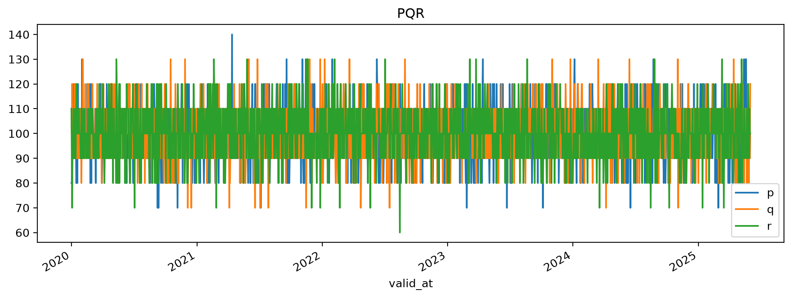

```python {.marimo}
import marimo as mo
```

```python {.marimo}
from filetree import tree
from ssb_timeseries import get_configuration
CONFIG = get_configuration()
```

```python {.marimo}
import subprocess
```

## Setup

```python {.marimo}
# both data and metadata will be stored here
data_path = CONFIG.repositories['tutorials']['directory']['options']['path']
print(data_path)
```

<!-- @output:lEQa -->

<pre style="white-space: pre-wrap; overflow-wrap: break-word;">/home/bernhard/timeseries
</pre>

```python {.marimo}
demo_product = 'demo-data-produkt'
```

```python {.marimo}
# what is there before we start?
print(tree(data_path))
```

<!-- @output:Xref -->

<pre style="white-space: pre-wrap; overflow-wrap: break-word;">timeseries/
├── AS_OF_AT/
│   └── XYZ/
│       ├── XYZ-as_of_2025-04-30T220000+0000-data.parquet
│       ├── XYZ-as_of_2025-05-31T220000+0000-data.parquet
│       ├── XYZ-as_of_2025-08-02T220000+0000-data.parquet
│       ├── XYZ-as_of_2025-08-03T220000+0000-data.parquet
│       ├── XYZ-as_of_2025-08-04T220000+0000-data.parquet
│       ├── XYZ-as_of_2025-08-05T220000+0000-data.parquet
│       └── XYZ-as_of_2025-08-06T220000+0000-data.parquet
├── AS_OF_FROM_TO/
│   └── Prices and Volumes/
│       ├── Prices and Volumes-as_of_2023-12-31T230000+0000-data.parquet
│       ├── Prices and Volumes-as_of_2024-01-31T230000+0000-data.parquet
│       ├── Prices and Volumes-as_of_2024-02-29T230000+0000-data.parquet
│       ├── Prices and Volumes-as_of_2024-03-31T220000+0000-data.parquet
│       ├── Prices and Volumes-as_of_2024-04-30T220000+0000-data.parquet
│       ├── Prices and Volumes-as_of_2024-05-31T220000+0000-data.parquet
│       ├── Prices and Volumes-as_of_2024-06-30T220000+0000-data.parquet
│       ├── Prices and Volumes-as_of_2024-07-31T220000+0000-data.parquet
│       ├── Prices and Volumes-as_of_2024-08-31T220000+0000-data.parquet
│       ├── Prices and Volumes-as_of_2024-09-30T220000+0000-data.parquet
│       ├── Prices and Volumes-as_of_2024-10-31T230000+0000-data.parquet
│       ├── Prices and Volumes-as_of_2024-11-30T230000+0000-data.parquet
│       ├── Prices and Volumes-as_of_2024-12-31T230000+0000-data.parquet
│       ├── Prices and Volumes-as_of_2025-01-31T230000+0000-data.parquet
│       ├── Prices and Volumes-as_of_2025-02-28T230000+0000-data.parquet
│       ├── Prices and Volumes-as_of_2025-03-31T220000+0000-data.parquet
│       ├── Prices and Volumes-as_of_2025-04-30T220000+0000-data.parquet
│       ├── Prices and Volumes-as_of_2025-05-31T220000+0000-data.parquet
│       ├── Prices and Volumes-as_of_2025-06-30T220000+0000-data.parquet
│       ├── Prices and Volumes-as_of_2025-07-31T220000+0000-data.parquet
│       ├── Prices and Volumes-as_of_2025-08-31T220000+0000-data.parquet
│       ├── Prices and Volumes-as_of_2025-09-30T220000+0000-data.parquet
│       ├── Prices and Volumes-as_of_2025-10-31T230000+0000-data.parquet
│       └── Prices and Volumes-as_of_2025-11-30T230000+0000-data.parquet
├── metadata/
│   ├── A Sample Dataset-metadata.json
│   ├── AZ_drikkevarer-metadata.json
│   ├── AZ_drinks-metadata.json
│   ├── AZ_omsetning-metadata.json
│   ├── More Prices and Volumes-metadata.json
│   ├── PQR-metadata.json
│   ├── Prices and Volumes-metadata.json
│   ├── Sample Data-metadata.json
│   └── XYZ-metadata.json
├── NONE_AT/
│   ├── A Sample Dataset/
│   │   └── A Sample Dataset-latest-data.parquet
│   ├── PQR/
│   │   └── PQR-latest-data.parquet
│   ├── Sample Data/
│   │   └── Sample Data-latest-data.parquet
│   └── XYZ/
│       └── XYZ-latest-data.parquet
└── NONE_FROM_TO/
    ├── AZ_drikkevarer/
    │   └── AZ_drikkevarer-latest-data.parquet
    ├── AZ_drinks/
    │   └── AZ_drinks-latest-data.parquet
    ├── AZ_omsetning/
    │   └── AZ_omsetning-latest-data.parquet
    └── More Prices and Volumes/
        └── More Prices and Volumes-latest-data.parquet

</pre>

```python {.marimo}
from ssb_timeseries.dataset import Dataset
from ssb_timeseries.types import SeriesType, Versioning, Temporality
```

```python {.marimo}
from datetime import timedelta

from ssb_timeseries.sample_data import create_df,date_ranges
from ssb_timeseries.dates import ensure_datetime, date_utc
```

```python {.marimo}
import polars as pl
from datetime import datetime
```

## Lasting av data
<!---->
### Eksempel: momentane data, *uten* versjonering

```python {.marimo}
point_in_time_data = SeriesType('NONE', 'AT')
```

```python {.marimo}
def some_simple_data_from_file_or_query(start='2020-01-01', end='2025-06-01'):
    return create_df(['p','q','r'], start_date=start,end_date=end, freq='D')
```

```python {.marimo}
pqr_df = some_simple_data_from_file_or_query()
print(type(pqr_df))
pqr_df
```

<!-- @output:iLit -->

<pre style="white-space: pre-wrap; overflow-wrap: break-word;">&lt;class &#x27;pandas.DataFrame&#x27;&gt;
</pre>

| valid_at | p | q | r |
| --- | --- | --- | --- |
| 2020-01-01 | 80.0 | 110.0 | 110.0 |
| 2020-01-02 | 80.0 | 100.0 | 90.0 |
| 2020-01-03 | 110.0 | 120.0 | 70.0 |
| 2020-01-04 | 110.0 | 100.0 | 90.0 |
| 2020-01-05 | 100.0 | 100.0 | 100.0 |
| ... | ... | ... | ... |
| 2025-05-28 | 90.0 | 80.0 | 90.0 |
| 2025-05-29 | 100.0 | 100.0 | 90.0 |
| 2025-05-30 | 110.0 | 100.0 | 110.0 |
| 2025-05-31 | 90.0 | 90.0 | 100.0 |
| 2025-06-01 | 100.0 | 120.0 | 100.0 |

```python {.marimo}
pqr = Dataset(
    name = 'PQR',
    data_type = point_in_time_data,
    data = pqr_df,
)
```

```python {.marimo}
type(pqr)
```

<!-- @output:ROlb -->

<pre style="white-space: pre-wrap; overflow-wrap: break-word;">&lt;class &#x27;ssb_timeseries.dataset.Dataset&#x27;&gt;</pre>

```python {.marimo}
pqr.data
```

<!-- @output:qnkX -->

| valid_at | p | q | r |
| --- | --- | --- | --- |
| 2020-01-01 | 80.0 | 110.0 | 110.0 |
| 2020-01-02 | 80.0 | 100.0 | 90.0 |
| 2020-01-03 | 110.0 | 120.0 | 70.0 |
| 2020-01-04 | 110.0 | 100.0 | 90.0 |
| 2020-01-05 | 100.0 | 100.0 | 100.0 |
| ... | ... | ... | ... |
| 2025-05-28 | 90.0 | 80.0 | 90.0 |
| 2025-05-29 | 100.0 | 100.0 | 90.0 |
| 2025-05-30 | 110.0 | 100.0 | 110.0 |
| 2025-05-31 | 90.0 | 90.0 | 100.0 |
| 2025-06-01 | 100.0 | 120.0 | 100.0 |

```python {.marimo}
pqr.tags
```

<!-- @output:TqIu -->

<pre style="white-space: pre-wrap; overflow-wrap: break-word;">{&#x27;name&#x27;: &#x27;PQR&#x27;,
 &#x27;repository&#x27;: &#x27;tutorials&#x27;,
 &#x27;series&#x27;: {&#x27;p&#x27;: {&#x27;dataset&#x27;: &#x27;PQR&#x27;,
                  &#x27;name&#x27;: &#x27;p&#x27;,
                  &#x27;repository&#x27;: &#x27;tutorials&#x27;,
                  &#x27;temporality&#x27;: &#x27;AT&#x27;,
                  &#x27;vare&#x27;: &#x27;kaffe&#x27;,
                  &#x27;varegruppe&#x27;: &#x27;nødvendigheter&#x27;,
                  &#x27;variabel&#x27;: &#x27;pris&#x27;,
                  &#x27;versioning&#x27;: &#x27;NONE&#x27;},
            &#x27;q&#x27;: {&#x27;dataset&#x27;: &#x27;PQR&#x27;,
                  &#x27;name&#x27;: &#x27;q&#x27;,
                  &#x27;repository&#x27;: &#x27;tutorials&#x27;,
                  &#x27;temporality&#x27;: &#x27;AT&#x27;,
                  &#x27;vare&#x27;: &#x27;knekkebrød&#x27;,
                  &#x27;varegruppe&#x27;: &#x27;nødvendigheter&#x27;,
                  &#x27;variabel&#x27;: &#x27;pris&#x27;,
                  &#x27;versioning&#x27;: &#x27;NONE&#x27;},
            &#x27;r&#x27;: {&#x27;dataset&#x27;: &#x27;PQR&#x27;,
                  &#x27;name&#x27;: &#x27;r&#x27;,
                  &#x27;repository&#x27;: &#x27;tutorials&#x27;,
                  &#x27;temporality&#x27;: &#x27;AT&#x27;,
                  &#x27;vare&#x27;: &#x27;brunost&#x27;,
                  &#x27;varegruppe&#x27;: &#x27;nødvendigheter&#x27;,
                  &#x27;variabel&#x27;: &#x27;pris&#x27;,
                  &#x27;versioning&#x27;: &#x27;NONE&#x27;}},
 &#x27;temporality&#x27;: &#x27;AT&#x27;,
 &#x27;varegruppe&#x27;: &#x27;nødvendigheter&#x27;,
 &#x27;variabel&#x27;: &#x27;pris&#x27;,
 &#x27;versioning&#x27;: &#x27;NONE&#x27;}</pre>

```python {.marimo}
pqr.tag_dataset(tags={'variabel': 'pris','varegruppe': 'nødvendigheter'})

pqr.tag_series('p',tags={'vare': 'kaffe'})
pqr.tag_series('q',tags={'vare': 'knekkebrød'})
pqr.tag_series('r',tags={'vare': 'brunost'})

pqr.tags
```

<!-- @output:Vxnm -->

<pre style="white-space: pre-wrap; overflow-wrap: break-word;">{&#x27;name&#x27;: &#x27;PQR&#x27;,
 &#x27;repository&#x27;: &#x27;tutorials&#x27;,
 &#x27;series&#x27;: {&#x27;p&#x27;: {&#x27;dataset&#x27;: &#x27;PQR&#x27;,
                  &#x27;name&#x27;: &#x27;p&#x27;,
                  &#x27;repository&#x27;: &#x27;tutorials&#x27;,
                  &#x27;temporality&#x27;: &#x27;AT&#x27;,
                  &#x27;vare&#x27;: &#x27;kaffe&#x27;,
                  &#x27;varegruppe&#x27;: &#x27;nødvendigheter&#x27;,
                  &#x27;variabel&#x27;: &#x27;pris&#x27;,
                  &#x27;versioning&#x27;: &#x27;NONE&#x27;},
            &#x27;q&#x27;: {&#x27;dataset&#x27;: &#x27;PQR&#x27;,
                  &#x27;name&#x27;: &#x27;q&#x27;,
                  &#x27;repository&#x27;: &#x27;tutorials&#x27;,
                  &#x27;temporality&#x27;: &#x27;AT&#x27;,
                  &#x27;vare&#x27;: &#x27;knekkebrød&#x27;,
                  &#x27;varegruppe&#x27;: &#x27;nødvendigheter&#x27;,
                  &#x27;variabel&#x27;: &#x27;pris&#x27;,
                  &#x27;versioning&#x27;: &#x27;NONE&#x27;},
            &#x27;r&#x27;: {&#x27;dataset&#x27;: &#x27;PQR&#x27;,
                  &#x27;name&#x27;: &#x27;r&#x27;,
                  &#x27;repository&#x27;: &#x27;tutorials&#x27;,
                  &#x27;temporality&#x27;: &#x27;AT&#x27;,
                  &#x27;vare&#x27;: &#x27;brunost&#x27;,
                  &#x27;varegruppe&#x27;: &#x27;nødvendigheter&#x27;,
                  &#x27;variabel&#x27;: &#x27;pris&#x27;,
                  &#x27;versioning&#x27;: &#x27;NONE&#x27;}},
 &#x27;temporality&#x27;: &#x27;AT&#x27;,
 &#x27;varegruppe&#x27;: &#x27;nødvendigheter&#x27;,
 &#x27;variabel&#x27;: &#x27;pris&#x27;,
 &#x27;versioning&#x27;: &#x27;NONE&#x27;}</pre>

```python {.marimo}
pqr.save()
```

```python {.marimo}
pqr.io.data_dir
```

<!-- @output:ulZA -->

<pre class="stderr" style="white-space: pre-wrap; overflow-wrap: break-word;">Traceback (most recent call last):
  File &quot;/home/bernhard/code/ssb-timeseries/.nox/docs/tmp/marimo_141697/__marimo__cell_ulZA_.py&quot;, line 1, in
    pqr.io.data_dir
    ^^^^^^
AttributeError: &#x27;Dataset&#x27; object has no attribute &#x27;io&#x27;

</pre>

<pre style="white-space: pre-wrap; overflow-wrap: break-word;">exception: &#x27;Dataset&#x27; object has no attribute &#x27;io&#x27;</pre>

```python {.marimo}
print(tree(data_path))
```

<!-- @output:UmEG -->

<pre style="white-space: pre-wrap; overflow-wrap: break-word;">timeseries/
├── AS_OF_AT/
│   └── XYZ/
│       ├── XYZ-as_of_2025-04-30T220000+0000-data.parquet
│       ├── XYZ-as_of_2025-05-31T220000+0000-data.parquet
│       ├── XYZ-as_of_2025-08-02T220000+0000-data.parquet
│       ├── XYZ-as_of_2025-08-03T220000+0000-data.parquet
│       ├── XYZ-as_of_2025-08-04T220000+0000-data.parquet
│       ├── XYZ-as_of_2025-08-05T220000+0000-data.parquet
│       └── XYZ-as_of_2025-08-06T220000+0000-data.parquet
├── AS_OF_FROM_TO/
│   └── Prices and Volumes/
│       ├── Prices and Volumes-as_of_2023-12-31T230000+0000-data.parquet
│       ├── Prices and Volumes-as_of_2024-01-31T230000+0000-data.parquet
│       ├── Prices and Volumes-as_of_2024-02-29T230000+0000-data.parquet
│       ├── Prices and Volumes-as_of_2024-03-31T220000+0000-data.parquet
│       ├── Prices and Volumes-as_of_2024-04-30T220000+0000-data.parquet
│       ├── Prices and Volumes-as_of_2024-05-31T220000+0000-data.parquet
│       ├── Prices and Volumes-as_of_2024-06-30T220000+0000-data.parquet
│       ├── Prices and Volumes-as_of_2024-07-31T220000+0000-data.parquet
│       ├── Prices and Volumes-as_of_2024-08-31T220000+0000-data.parquet
│       ├── Prices and Volumes-as_of_2024-09-30T220000+0000-data.parquet
│       ├── Prices and Volumes-as_of_2024-10-31T230000+0000-data.parquet
│       ├── Prices and Volumes-as_of_2024-11-30T230000+0000-data.parquet
│       ├── Prices and Volumes-as_of_2024-12-31T230000+0000-data.parquet
│       ├── Prices and Volumes-as_of_2025-01-31T230000+0000-data.parquet
│       ├── Prices and Volumes-as_of_2025-02-28T230000+0000-data.parquet
│       ├── Prices and Volumes-as_of_2025-03-31T220000+0000-data.parquet
│       ├── Prices and Volumes-as_of_2025-04-30T220000+0000-data.parquet
│       ├── Prices and Volumes-as_of_2025-05-31T220000+0000-data.parquet
│       ├── Prices and Volumes-as_of_2025-06-30T220000+0000-data.parquet
│       ├── Prices and Volumes-as_of_2025-07-31T220000+0000-data.parquet
│       ├── Prices and Volumes-as_of_2025-08-31T220000+0000-data.parquet
│       ├── Prices and Volumes-as_of_2025-09-30T220000+0000-data.parquet
│       ├── Prices and Volumes-as_of_2025-10-31T230000+0000-data.parquet
│       └── Prices and Volumes-as_of_2025-11-30T230000+0000-data.parquet
├── metadata/
│   ├── A Sample Dataset-metadata.json
│   ├── AZ_drikkevarer-metadata.json
│   ├── AZ_drinks-metadata.json
│   ├── AZ_omsetning-metadata.json
│   ├── More Prices and Volumes-metadata.json
│   ├── PQR-metadata.json
│   ├── Prices and Volumes-metadata.json
│   ├── Sample Data-metadata.json
│   └── XYZ-metadata.json
├── NONE_AT/
│   ├── A Sample Dataset/
│   │   └── A Sample Dataset-latest-data.parquet
│   ├── PQR/
│   │   └── PQR-latest-data.parquet
│   ├── Sample Data/
│   │   └── Sample Data-latest-data.parquet
│   └── XYZ/
│       └── XYZ-latest-data.parquet
└── NONE_FROM_TO/
    ├── AZ_drikkevarer/
    │   └── AZ_drikkevarer-latest-data.parquet
    ├── AZ_drinks/
    │   └── AZ_drinks-latest-data.parquet
    ├── AZ_omsetning/
    │   └── AZ_omsetning-latest-data.parquet
    └── More Prices and Volumes/
        └── More Prices and Volumes-latest-data.parquet

</pre>

<!-- @output:UmEG -->

<pre style="white-space: pre-wrap; overflow-wrap: break-word;">timeseries/
├── AS_OF_AT/
│   └── XYZ/
│       ├── XYZ-as_of_2025-04-30T220000+0000-data.parquet
│       ├── XYZ-as_of_2025-05-31T220000+0000-data.parquet
│       ├── XYZ-as_of_2025-08-02T220000+0000-data.parquet
│       ├── XYZ-as_of_2025-08-03T220000+0000-data.parquet
│       ├── XYZ-as_of_2025-08-04T220000+0000-data.parquet
│       ├── XYZ-as_of_2025-08-05T220000+0000-data.parquet
│       └── XYZ-as_of_2025-08-06T220000+0000-data.parquet
├── AS_OF_FROM_TO/
│   └── Prices and Volumes/
│       ├── Prices and Volumes-as_of_2023-12-31T230000+0000-data.parquet
│       ├── Prices and Volumes-as_of_2024-01-31T230000+0000-data.parquet
│       ├── Prices and Volumes-as_of_2024-02-29T230000+0000-data.parquet
│       ├── Prices and Volumes-as_of_2024-03-31T220000+0000-data.parquet
│       ├── Prices and Volumes-as_of_2024-04-30T220000+0000-data.parquet
│       ├── Prices and Volumes-as_of_2024-05-31T220000+0000-data.parquet
│       ├── Prices and Volumes-as_of_2024-06-30T220000+0000-data.parquet
│       ├── Prices and Volumes-as_of_2024-07-31T220000+0000-data.parquet
│       ├── Prices and Volumes-as_of_2024-08-31T220000+0000-data.parquet
│       ├── Prices and Volumes-as_of_2024-09-30T220000+0000-data.parquet
│       ├── Prices and Volumes-as_of_2024-10-31T230000+0000-data.parquet
│       ├── Prices and Volumes-as_of_2024-11-30T230000+0000-data.parquet
│       ├── Prices and Volumes-as_of_2024-12-31T230000+0000-data.parquet
│       ├── Prices and Volumes-as_of_2025-01-31T230000+0000-data.parquet
│       ├── Prices and Volumes-as_of_2025-02-28T230000+0000-data.parquet
│       ├── Prices and Volumes-as_of_2025-03-31T220000+0000-data.parquet
│       ├── Prices and Volumes-as_of_2025-04-30T220000+0000-data.parquet
│       ├── Prices and Volumes-as_of_2025-05-31T220000+0000-data.parquet
│       ├── Prices and Volumes-as_of_2025-06-30T220000+0000-data.parquet
│       ├── Prices and Volumes-as_of_2025-07-31T220000+0000-data.parquet
│       ├── Prices and Volumes-as_of_2025-08-31T220000+0000-data.parquet
│       ├── Prices and Volumes-as_of_2025-09-30T220000+0000-data.parquet
│       ├── Prices and Volumes-as_of_2025-10-31T230000+0000-data.parquet
│       └── Prices and Volumes-as_of_2025-11-30T230000+0000-data.parquet
├── metadata/
│   ├── A Sample Dataset-metadata.json
│   ├── AZ_drikkevarer-metadata.json
│   ├── AZ_drinks-metadata.json
│   ├── AZ_omsetning-metadata.json
│   ├── More Prices and Volumes-metadata.json
│   ├── PQR-metadata.json
│   ├── Prices and Volumes-metadata.json
│   ├── Sample Data-metadata.json
│   └── XYZ-metadata.json
├── NONE_AT/
│   ├── A Sample Dataset/
│   │   └── A Sample Dataset-latest-data.parquet
│   ├── PQR/
│   │   └── PQR-latest-data.parquet
│   ├── Sample Data/
│   │   └── Sample Data-latest-data.parquet
│   └── XYZ/
│       └── XYZ-latest-data.parquet
└── NONE_FROM_TO/
    ├── AZ_drikkevarer/
    │   └── AZ_drikkevarer-latest-data.parquet
    ├── AZ_drinks/
    │   └── AZ_drinks-latest-data.parquet
    ├── AZ_omsetning/
    │   └── AZ_omsetning-latest-data.parquet
    └── More Prices and Volumes/
        └── More Prices and Volumes-latest-data.parquet

</pre>

<!-- @output:UmEG -->

<pre style="white-space: pre-wrap; overflow-wrap: break-word;">timeseries/
├── AS_OF_AT/
│   └── XYZ/
│       ├── XYZ-as_of_2025-04-30T220000+0000-data.parquet
│       ├── XYZ-as_of_2025-05-31T220000+0000-data.parquet
│       ├── XYZ-as_of_2025-08-02T220000+0000-data.parquet
│       ├── XYZ-as_of_2025-08-03T220000+0000-data.parquet
│       ├── XYZ-as_of_2025-08-04T220000+0000-data.parquet
│       ├── XYZ-as_of_2025-08-05T220000+0000-data.parquet
│       └── XYZ-as_of_2025-08-06T220000+0000-data.parquet
├── AS_OF_FROM_TO/
│   └── Prices and Volumes/
│       ├── Prices and Volumes-as_of_2023-12-31T230000+0000-data.parquet
│       ├── Prices and Volumes-as_of_2024-01-31T230000+0000-data.parquet
│       ├── Prices and Volumes-as_of_2024-02-29T230000+0000-data.parquet
│       ├── Prices and Volumes-as_of_2024-03-31T220000+0000-data.parquet
│       ├── Prices and Volumes-as_of_2024-04-30T220000+0000-data.parquet
│       ├── Prices and Volumes-as_of_2024-05-31T220000+0000-data.parquet
│       ├── Prices and Volumes-as_of_2024-06-30T220000+0000-data.parquet
│       ├── Prices and Volumes-as_of_2024-07-31T220000+0000-data.parquet
│       ├── Prices and Volumes-as_of_2024-08-31T220000+0000-data.parquet
│       ├── Prices and Volumes-as_of_2024-09-30T220000+0000-data.parquet
│       ├── Prices and Volumes-as_of_2024-10-31T230000+0000-data.parquet
│       ├── Prices and Volumes-as_of_2024-11-30T230000+0000-data.parquet
│       ├── Prices and Volumes-as_of_2024-12-31T230000+0000-data.parquet
│       ├── Prices and Volumes-as_of_2025-01-31T230000+0000-data.parquet
│       ├── Prices and Volumes-as_of_2025-02-28T230000+0000-data.parquet
│       ├── Prices and Volumes-as_of_2025-03-31T220000+0000-data.parquet
│       ├── Prices and Volumes-as_of_2025-04-30T220000+0000-data.parquet
│       ├── Prices and Volumes-as_of_2025-05-31T220000+0000-data.parquet
│       ├── Prices and Volumes-as_of_2025-06-30T220000+0000-data.parquet
│       ├── Prices and Volumes-as_of_2025-07-31T220000+0000-data.parquet
│       ├── Prices and Volumes-as_of_2025-08-31T220000+0000-data.parquet
│       ├── Prices and Volumes-as_of_2025-09-30T220000+0000-data.parquet
│       ├── Prices and Volumes-as_of_2025-10-31T230000+0000-data.parquet
│       └── Prices and Volumes-as_of_2025-11-30T230000+0000-data.parquet
├── metadata/
│   ├── A Sample Dataset-metadata.json
│   ├── AZ_drikkevarer-metadata.json
│   ├── AZ_drinks-metadata.json
│   ├── AZ_omsetning-metadata.json
│   ├── More Prices and Volumes-metadata.json
│   ├── PQR-metadata.json
│   ├── Prices and Volumes-metadata.json
│   ├── Sample Data-metadata.json
│   └── XYZ-metadata.json
├── NONE_AT/
│   ├── A Sample Dataset/
│   │   └── A Sample Dataset-latest-data.parquet
│   ├── PQR/
│   │   └── PQR-latest-data.parquet
│   ├── Sample Data/
│   │   └── Sample Data-latest-data.parquet
│   └── XYZ/
│       └── XYZ-latest-data.parquet
└── NONE_FROM_TO/
    ├── AZ_drikkevarer/
    │   └── AZ_drikkevarer-latest-data.parquet
    ├── AZ_drinks/
    │   └── AZ_drinks-latest-data.parquet
    ├── AZ_omsetning/
    │   └── AZ_omsetning-latest-data.parquet
    └── More Prices and Volumes/
        └── More Prices and Volumes-latest-data.parquet

</pre>

<!-- @output:UmEG -->

<pre style="white-space: pre-wrap; overflow-wrap: break-word;">timeseries/
├── AS_OF_AT/
│   └── XYZ/
│       ├── XYZ-as_of_2025-04-30T220000+0000-data.parquet
│       ├── XYZ-as_of_2025-05-31T220000+0000-data.parquet
│       ├── XYZ-as_of_2025-08-02T220000+0000-data.parquet
│       ├── XYZ-as_of_2025-08-03T220000+0000-data.parquet
│       ├── XYZ-as_of_2025-08-04T220000+0000-data.parquet
│       ├── XYZ-as_of_2025-08-05T220000+0000-data.parquet
│       └── XYZ-as_of_2025-08-06T220000+0000-data.parquet
├── AS_OF_FROM_TO/
│   └── Prices and Volumes/
│       ├── Prices and Volumes-as_of_2023-12-31T230000+0000-data.parquet
│       ├── Prices and Volumes-as_of_2024-01-31T230000+0000-data.parquet
│       ├── Prices and Volumes-as_of_2024-02-29T230000+0000-data.parquet
│       ├── Prices and Volumes-as_of_2024-03-31T220000+0000-data.parquet
│       ├── Prices and Volumes-as_of_2024-04-30T220000+0000-data.parquet
│       ├── Prices and Volumes-as_of_2024-05-31T220000+0000-data.parquet
│       ├── Prices and Volumes-as_of_2024-06-30T220000+0000-data.parquet
│       ├── Prices and Volumes-as_of_2024-07-31T220000+0000-data.parquet
│       ├── Prices and Volumes-as_of_2024-08-31T220000+0000-data.parquet
│       ├── Prices and Volumes-as_of_2024-09-30T220000+0000-data.parquet
│       ├── Prices and Volumes-as_of_2024-10-31T230000+0000-data.parquet
│       ├── Prices and Volumes-as_of_2024-11-30T230000+0000-data.parquet
│       ├── Prices and Volumes-as_of_2024-12-31T230000+0000-data.parquet
│       ├── Prices and Volumes-as_of_2025-01-31T230000+0000-data.parquet
│       ├── Prices and Volumes-as_of_2025-02-28T230000+0000-data.parquet
│       ├── Prices and Volumes-as_of_2025-03-31T220000+0000-data.parquet
│       ├── Prices and Volumes-as_of_2025-04-30T220000+0000-data.parquet
│       ├── Prices and Volumes-as_of_2025-05-31T220000+0000-data.parquet
│       ├── Prices and Volumes-as_of_2025-06-30T220000+0000-data.parquet
│       ├── Prices and Volumes-as_of_2025-07-31T220000+0000-data.parquet
│       ├── Prices and Volumes-as_of_2025-08-31T220000+0000-data.parquet
│       ├── Prices and Volumes-as_of_2025-09-30T220000+0000-data.parquet
│       ├── Prices and Volumes-as_of_2025-10-31T230000+0000-data.parquet
│       └── Prices and Volumes-as_of_2025-11-30T230000+0000-data.parquet
├── metadata/
│   ├── A Sample Dataset-metadata.json
│   ├── AZ_drikkevarer-metadata.json
│   ├── AZ_drinks-metadata.json
│   ├── AZ_omsetning-metadata.json
│   ├── More Prices and Volumes-metadata.json
│   ├── PQR-metadata.json
│   ├── Prices and Volumes-metadata.json
│   ├── Sample Data-metadata.json
│   └── XYZ-metadata.json
├── NONE_AT/
│   ├── A Sample Dataset/
│   │   └── A Sample Dataset-latest-data.parquet
│   ├── PQR/
│   │   └── PQR-latest-data.parquet
│   ├── Sample Data/
│   │   └── Sample Data-latest-data.parquet
│   └── XYZ/
│       └── XYZ-latest-data.parquet
└── NONE_FROM_TO/
    ├── AZ_drikkevarer/
    │   └── AZ_drikkevarer-latest-data.parquet
    ├── AZ_drinks/
    │   └── AZ_drinks-latest-data.parquet
    ├── AZ_omsetning/
    │   └── AZ_omsetning-latest-data.parquet
    └── More Prices and Volumes/
        └── More Prices and Volumes-latest-data.parquet

</pre>

<!-- @output:UmEG -->

<pre style="white-space: pre-wrap; overflow-wrap: break-word;">timeseries/
├── AS_OF_AT/
│   └── XYZ/
│       ├── XYZ-as_of_2025-04-30T220000+0000-data.parquet
│       ├── XYZ-as_of_2025-05-31T220000+0000-data.parquet
│       ├── XYZ-as_of_2025-08-02T220000+0000-data.parquet
│       ├── XYZ-as_of_2025-08-03T220000+0000-data.parquet
│       ├── XYZ-as_of_2025-08-04T220000+0000-data.parquet
│       ├── XYZ-as_of_2025-08-05T220000+0000-data.parquet
│       └── XYZ-as_of_2025-08-06T220000+0000-data.parquet
├── AS_OF_FROM_TO/
│   └── Prices and Volumes/
│       ├── Prices and Volumes-as_of_2023-12-31T230000+0000-data.parquet
│       ├── Prices and Volumes-as_of_2024-01-31T230000+0000-data.parquet
│       ├── Prices and Volumes-as_of_2024-02-29T230000+0000-data.parquet
│       ├── Prices and Volumes-as_of_2024-03-31T220000+0000-data.parquet
│       ├── Prices and Volumes-as_of_2024-04-30T220000+0000-data.parquet
│       ├── Prices and Volumes-as_of_2024-05-31T220000+0000-data.parquet
│       ├── Prices and Volumes-as_of_2024-06-30T220000+0000-data.parquet
│       ├── Prices and Volumes-as_of_2024-07-31T220000+0000-data.parquet
│       ├── Prices and Volumes-as_of_2024-08-31T220000+0000-data.parquet
│       ├── Prices and Volumes-as_of_2024-09-30T220000+0000-data.parquet
│       ├── Prices and Volumes-as_of_2024-10-31T230000+0000-data.parquet
│       ├── Prices and Volumes-as_of_2024-11-30T230000+0000-data.parquet
│       ├── Prices and Volumes-as_of_2024-12-31T230000+0000-data.parquet
│       ├── Prices and Volumes-as_of_2025-01-31T230000+0000-data.parquet
│       ├── Prices and Volumes-as_of_2025-02-28T230000+0000-data.parquet
│       ├── Prices and Volumes-as_of_2025-03-31T220000+0000-data.parquet
│       ├── Prices and Volumes-as_of_2025-04-30T220000+0000-data.parquet
│       ├── Prices and Volumes-as_of_2025-05-31T220000+0000-data.parquet
│       ├── Prices and Volumes-as_of_2025-06-30T220000+0000-data.parquet
│       ├── Prices and Volumes-as_of_2025-07-31T220000+0000-data.parquet
│       ├── Prices and Volumes-as_of_2025-08-31T220000+0000-data.parquet
│       ├── Prices and Volumes-as_of_2025-09-30T220000+0000-data.parquet
│       ├── Prices and Volumes-as_of_2025-10-31T230000+0000-data.parquet
│       └── Prices and Volumes-as_of_2025-11-30T230000+0000-data.parquet
├── metadata/
│   ├── A Sample Dataset-metadata.json
│   ├── AZ_drikkevarer-metadata.json
│   ├── AZ_drinks-metadata.json
│   ├── AZ_omsetning-metadata.json
│   ├── More Prices and Volumes-metadata.json
│   ├── PQR-metadata.json
│   ├── Prices and Volumes-metadata.json
│   ├── Sample Data-metadata.json
│   └── XYZ-metadata.json
├── NONE_AT/
│   ├── A Sample Dataset/
│   │   └── A Sample Dataset-latest-data.parquet
│   ├── PQR/
│   │   └── PQR-latest-data.parquet
│   ├── Sample Data/
│   │   └── Sample Data-latest-data.parquet
│   └── XYZ/
│       └── XYZ-latest-data.parquet
└── NONE_FROM_TO/
    ├── AZ_drikkevarer/
    │   └── AZ_drikkevarer-latest-data.parquet
    ├── AZ_drinks/
    │   └── AZ_drinks-latest-data.parquet
    ├── AZ_omsetning/
    │   └── AZ_omsetning-latest-data.parquet
    └── More Prices and Volumes/
        └── More Prices and Volumes-latest-data.parquet

</pre>

```python {.marimo}
# reading the data back:
x = Dataset('PQR')
x.data    # ... now an Arrow table
```

<!-- @output:Pvdt -->

<pre style="white-space: pre-wrap; overflow-wrap: break-word;">pyarrow.Table
valid_at: timestamp&#91;ns, tz=UTC&#93; not null
p: double
q: double
r: double
----
valid_at: &#91;&#91;2019-12-31 23:00:00.000000000Z,2020-01-01 23:00:00.000000000Z,2020-01-02 23:00:00.000000000Z,2020-01-03 23:00:00.000000000Z,2020-01-04 23:00:00.000000000Z,...,2025-05-27 22:00:00.000000000Z,2025-05-28 22:00:00.000000000Z,2025-05-29 22:00:00.000000000Z,2025-05-30 22:00:00.000000000Z,2025-05-31 22:00:00.000000000Z&#93;&#93;
p: &#91;&#91;80,80,110,110,100,...,90,100,110,90,100&#93;&#93;
q: &#91;&#91;110,100,120,100,100,...,80,100,100,90,120&#93;&#93;
r: &#91;&#91;110,90,70,90,100,...,90,90,110,100,100&#93;&#93;</pre>

```python {.marimo}
x.nw.to_pandas()
```

<!-- @output:ZBYS -->

| valid_at | p | q | r |
| --- | --- | --- | --- |
| 2019-12-31 23:00:00+00:00 | 80.0 | 110.0 | 110.0 |
| 2020-01-01 23:00:00+00:00 | 80.0 | 100.0 | 90.0 |
| 2020-01-02 23:00:00+00:00 | 110.0 | 120.0 | 70.0 |
| 2020-01-03 23:00:00+00:00 | 110.0 | 100.0 | 90.0 |
| 2020-01-04 23:00:00+00:00 | 100.0 | 100.0 | 100.0 |
| ... | ... | ... | ... |
| 2025-05-27 22:00:00+00:00 | 90.0 | 80.0 | 90.0 |
| 2025-05-28 22:00:00+00:00 | 100.0 | 100.0 | 90.0 |
| 2025-05-29 22:00:00+00:00 | 110.0 | 100.0 | 110.0 |
| 2025-05-30 22:00:00+00:00 | 90.0 | 90.0 | 100.0 |
| 2025-05-31 22:00:00+00:00 | 100.0 | 120.0 | 100.0 |

```python {.marimo}
x.plot()
```

<!-- @output:aLJB -->



```python {.marimo}
more_pqr_data = some_simple_data_from_file_or_query('2025-05-29','2025-08-15')
more_pqr_data
```

<!-- @output:nHfw -->

| valid_at | p | q | r |
| --- | --- | --- | --- |
| 2025-05-29 | 100.0 | 100.0 | 100.0 |
| 2025-05-30 | 90.0 | 100.0 | 100.0 |
| 2025-05-31 | 80.0 | 110.0 | 90.0 |
| 2025-06-01 | 100.0 | 100.0 | 90.0 |
| 2025-06-02 | 100.0 | 80.0 | 110.0 |
| ... | ... | ... | ... |
| 2025-08-11 | 100.0 | 90.0 | 110.0 |
| 2025-08-12 | 120.0 | 110.0 | 100.0 |
| 2025-08-13 | 90.0 | 120.0 | 110.0 |
| 2025-08-14 | 90.0 | 100.0 | 90.0 |
| 2025-08-15 | 90.0 | 100.0 | 90.0 |

```python {.marimo}
pqr_second_write = Dataset(
    name = 'PQR',
    data = more_pqr_data,
)
# obj init will retrieve previously saved metadata for an existing set and series:
print(pqr_second_write.tags)
```

<!-- @output:xXTn -->

<pre style="white-space: pre-wrap; overflow-wrap: break-word;">{&#x27;name&#x27;: &#x27;PQR&#x27;, &#x27;versioning&#x27;: &#x27;NONE&#x27;, &#x27;temporality&#x27;: &#x27;AT&#x27;, &#x27;series&#x27;: {&#x27;p&#x27;: {&#x27;dataset&#x27;: &#x27;PQR&#x27;, &#x27;name&#x27;: &#x27;p&#x27;, &#x27;variabel&#x27;: &#x27;pris&#x27;, &#x27;varegruppe&#x27;: &#x27;nødvendigheter&#x27;, &#x27;versioning&#x27;: &#x27;NONE&#x27;, &#x27;temporality&#x27;: &#x27;AT&#x27;, &#x27;repository&#x27;: &#x27;tutorials&#x27;, &#x27;vare&#x27;: &#x27;kaffe&#x27;}, &#x27;q&#x27;: {&#x27;dataset&#x27;: &#x27;PQR&#x27;, &#x27;name&#x27;: &#x27;q&#x27;, &#x27;variabel&#x27;: &#x27;pris&#x27;, &#x27;varegruppe&#x27;: &#x27;nødvendigheter&#x27;, &#x27;versioning&#x27;: &#x27;NONE&#x27;, &#x27;temporality&#x27;: &#x27;AT&#x27;, &#x27;repository&#x27;: &#x27;tutorials&#x27;, &#x27;vare&#x27;: &#x27;knekkebrød&#x27;}, &#x27;r&#x27;: {&#x27;dataset&#x27;: &#x27;PQR&#x27;, &#x27;name&#x27;: &#x27;r&#x27;, &#x27;variabel&#x27;: &#x27;pris&#x27;, &#x27;varegruppe&#x27;: &#x27;nødvendigheter&#x27;, &#x27;versioning&#x27;: &#x27;NONE&#x27;, &#x27;temporality&#x27;: &#x27;AT&#x27;, &#x27;repository&#x27;: &#x27;tutorials&#x27;, &#x27;vare&#x27;: &#x27;brunost&#x27;}}, &#x27;repository&#x27;: &#x27;tutorials&#x27;, &#x27;variabel&#x27;: &#x27;pris&#x27;, &#x27;varegruppe&#x27;: &#x27;nødvendigheter&#x27;}
</pre>

```python {.marimo}
pqr_second_write.save()
```

```python {.marimo}
# in memory object instances do not change
print(pqr.data)
print(pqr_second_write.data)
```

<!-- @output:pHFh -->

<pre style="white-space: pre-wrap; overflow-wrap: break-word;">       valid_at      p      q      r
0    2020-01-01   80.0  110.0  110.0
1    2020-01-02   80.0  100.0   90.0
2    2020-01-03  110.0  120.0   70.0
3    2020-01-04  110.0  100.0   90.0
4    2020-01-05  100.0  100.0  100.0
...         ...    ...    ...    ...
1974 2025-05-28   90.0   80.0   90.0
1975 2025-05-29  100.0  100.0   90.0
1976 2025-05-30  110.0  100.0  110.0
1977 2025-05-31   90.0   90.0  100.0
1978 2025-06-01  100.0  120.0  100.0

&#91;1979 rows x 4 columns&#93;
     valid_at      p      q      r
0  2025-05-29  100.0  100.0  100.0
1  2025-05-30   90.0  100.0  100.0
2  2025-05-31   80.0  110.0   90.0
3  2025-06-01  100.0  100.0   90.0
4  2025-06-02  100.0   80.0  110.0
..        ...    ...    ...    ...
74 2025-08-11  100.0   90.0  110.0
75 2025-08-12  120.0  110.0  100.0
76 2025-08-13   90.0  120.0  110.0
77 2025-08-14   90.0  100.0   90.0
78 2025-08-15   90.0  100.0   90.0

&#91;79 rows x 4 columns&#93;
</pre>

```python {.marimo}
y = Dataset('PQR')
y.nw.to_polars()
```

<!-- @output:NCOB -->

| valid_at | p | q | r |
| --- | --- | --- | --- |
| datetime[ns, UTC] | f64 | f64 | f64 |
| 2019-12-31 23:00:00 UTC | 80.0 | 110.0 | 110.0 |
| 2020-01-01 23:00:00 UTC | 80.0 | 100.0 | 90.0 |
| 2020-01-02 23:00:00 UTC | 110.0 | 120.0 | 70.0 |
| 2020-01-03 23:00:00 UTC | 110.0 | 100.0 | 90.0 |
| 2020-01-04 23:00:00 UTC | 100.0 | 100.0 | 100.0 |
| … | … | … | … |
| 2025-05-27 22:00:00 UTC | 90.0 | 80.0 | 90.0 |
| 2025-05-28 22:00:00 UTC | 100.0 | 100.0 | 90.0 |
| 2025-05-29 22:00:00 UTC | 110.0 | 100.0 | 110.0 |
| 2025-05-30 22:00:00 UTC | 90.0 | 90.0 | 100.0 |
| 2025-05-31 22:00:00 UTC | 100.0 | 120.0 | 100.0 |

```python {.marimo}
# ... but the data file has been overwritten:
y.nw.to_polars().filter(
    pl.col("valid_at").is_between(pl.date(2025, 5, 29), pl.date(2025, 6, 2))
)
```

<!-- @output:aqbW -->

| valid_at | p | q | r |
| --- | --- | --- | --- |
| datetime[ns, UTC] | f64 | f64 | f64 |
| 2025-05-29 22:00:00 UTC | 110.0 | 100.0 | 110.0 |
| 2025-05-30 22:00:00 UTC | 90.0 | 90.0 | 100.0 |
| 2025-05-31 22:00:00 UTC | 100.0 | 120.0 | 100.0 |

```python {.marimo}
# note that for unversioned type: we operate on the same files all the way
print(tree(data_path))
```

<!-- @output:TRpd -->

<pre style="white-space: pre-wrap; overflow-wrap: break-word;">timeseries/
├── AS_OF_AT/
│   └── XYZ/
│       ├── XYZ-as_of_2025-04-30T220000+0000-data.parquet
│       ├── XYZ-as_of_2025-05-31T220000+0000-data.parquet
│       ├── XYZ-as_of_2025-08-02T220000+0000-data.parquet
│       ├── XYZ-as_of_2025-08-03T220000+0000-data.parquet
│       ├── XYZ-as_of_2025-08-04T220000+0000-data.parquet
│       ├── XYZ-as_of_2025-08-05T220000+0000-data.parquet
│       └── XYZ-as_of_2025-08-06T220000+0000-data.parquet
├── AS_OF_FROM_TO/
│   └── Prices and Volumes/
│       ├── Prices and Volumes-as_of_2023-12-31T230000+0000-data.parquet
│       ├── Prices and Volumes-as_of_2024-01-31T230000+0000-data.parquet
│       ├── Prices and Volumes-as_of_2024-02-29T230000+0000-data.parquet
│       ├── Prices and Volumes-as_of_2024-03-31T220000+0000-data.parquet
│       ├── Prices and Volumes-as_of_2024-04-30T220000+0000-data.parquet
│       ├── Prices and Volumes-as_of_2024-05-31T220000+0000-data.parquet
│       ├── Prices and Volumes-as_of_2024-06-30T220000+0000-data.parquet
│       ├── Prices and Volumes-as_of_2024-07-31T220000+0000-data.parquet
│       ├── Prices and Volumes-as_of_2024-08-31T220000+0000-data.parquet
│       ├── Prices and Volumes-as_of_2024-09-30T220000+0000-data.parquet
│       ├── Prices and Volumes-as_of_2024-10-31T230000+0000-data.parquet
│       ├── Prices and Volumes-as_of_2024-11-30T230000+0000-data.parquet
│       ├── Prices and Volumes-as_of_2024-12-31T230000+0000-data.parquet
│       ├── Prices and Volumes-as_of_2025-01-31T230000+0000-data.parquet
│       ├── Prices and Volumes-as_of_2025-02-28T230000+0000-data.parquet
│       ├── Prices and Volumes-as_of_2025-03-31T220000+0000-data.parquet
│       ├── Prices and Volumes-as_of_2025-04-30T220000+0000-data.parquet
│       ├── Prices and Volumes-as_of_2025-05-31T220000+0000-data.parquet
│       ├── Prices and Volumes-as_of_2025-06-30T220000+0000-data.parquet
│       ├── Prices and Volumes-as_of_2025-07-31T220000+0000-data.parquet
│       ├── Prices and Volumes-as_of_2025-08-31T220000+0000-data.parquet
│       ├── Prices and Volumes-as_of_2025-09-30T220000+0000-data.parquet
│       ├── Prices and Volumes-as_of_2025-10-31T230000+0000-data.parquet
│       └── Prices and Volumes-as_of_2025-11-30T230000+0000-data.parquet
├── metadata/
│   ├── A Sample Dataset-metadata.json
│   ├── AZ_drikkevarer-metadata.json
│   ├── AZ_drinks-metadata.json
│   ├── AZ_omsetning-metadata.json
│   ├── More Prices and Volumes-metadata.json
│   ├── PQR-metadata.json
│   ├── Prices and Volumes-metadata.json
│   ├── Sample Data-metadata.json
│   └── XYZ-metadata.json
├── NONE_AT/
│   ├── A Sample Dataset/
│   │   └── A Sample Dataset-latest-data.parquet
│   ├── PQR/
│   │   └── PQR-latest-data.parquet
│   ├── Sample Data/
│   │   └── Sample Data-latest-data.parquet
│   └── XYZ/
│       └── XYZ-latest-data.parquet
└── NONE_FROM_TO/
    ├── AZ_drikkevarer/
    │   └── AZ_drikkevarer-latest-data.parquet
    ├── AZ_drinks/
    │   └── AZ_drinks-latest-data.parquet
    ├── AZ_omsetning/
    │   └── AZ_omsetning-latest-data.parquet
    └── More Prices and Volumes/
        └── More Prices and Volumes-latest-data.parquet

</pre>

```python {.marimo}
print(tree(data_path))
```

```python {.marimo}
x.data = x.nw.to_pandas() # <-- workaround for bug in groupby
xx = x.groupby('Q','sum')

# xx is a new dataset, hence gets a new name on creation:
xx
```

<!-- @output:dNNg -->

<pre style="white-space: pre-wrap; overflow-wrap: break-word;">Dataset(name=&quot;(PQR.groupby(Q,sum)&quot;, repository=&quot;tutorials&quot;, data_type=SeriesType(Versioning.NONE,Temporality.AT), as_of_tz=None)</pre>

```python {.marimo}
xx.data
```

<!-- @output:yCnT -->

| p | q | r |
| --- | --- | --- |
|  |  |  |
| 80.0 | 110.0 | 110.0 |
| 9120.0 | 9210.0 | 9020.0 |
| 9170.0 | 9220.0 | 9150.0 |
| 9180.0 | 9240.0 | 9250.0 |
| 9110.0 | 8980.0 | 9150.0 |
| ... | ... | ... |
| 9190.0 | 9150.0 | 9220.0 |
| 9390.0 | 9310.0 | 9190.0 |
| 9130.0 | 9140.0 | 9020.0 |
| 9100.0 | 9240.0 | 9100.0 |
| 6070.0 | 6180.0 | 6160.0 |

### Eksempel: data for periode / intervall

```python {.marimo}
interval_data = SeriesType(Versioning.NONE, Temporality.FROM_TO)
```

```python {.marimo}
def mock_interval_data_from_file_or_query(start, end):
    a_to_z = [chr(i) for i in range(ord('a'), ord('z') + 1)]
    variables = ['antall', 'pris']
    goods = ['kaffe', 'te', 'brus', 'øl', 'vin']
    return create_df(
        a_to_z, variables, goods,
        start_date=start,
        end_date=end,
        freq='M',
        temporality='FROM_TO',
        implementation='polars'
    )
```

```python {.marimo}
bigger_data = mock_interval_data_from_file_or_query(start='2025-01-01', end='2025-06-01')
bigger_data.shape
```

<!-- @output:rEll -->

<pre style="white-space: pre-wrap; overflow-wrap: break-word;">&#91;6, 262&#93;</pre>

```python {.marimo}
bigger_data
```

<!-- @output:dGlV -->

| valid_from | valid_to | a_antall_kaffe | a_antall_te | a_antall_brus | a_antall_øl | a_antall_vin | a_pris_kaffe | a_pris_te | a_pris_brus | a_pris_øl | a_pris_vin | b_antall_kaffe | b_antall_te | b_antall_brus | b_antall_øl | b_antall_vin | b_pris_kaffe | b_pris_te | b_pris_brus | b_pris_øl | b_pris_vin | c_antall_kaffe | c_antall_te | c_antall_brus | c_antall_øl | c_antall_vin | c_pris_kaffe | c_pris_te | c_pris_brus | c_pris_øl | c_pris_vin | d_antall_kaffe | d_antall_te | d_antall_brus | d_antall_øl | d_antall_vin | … | w_antall_øl | w_antall_vin | w_pris_kaffe | w_pris_te | w_pris_brus | w_pris_øl | w_pris_vin | x_antall_kaffe | x_antall_te | x_antall_brus | x_antall_øl | x_antall_vin | x_pris_kaffe | x_pris_te | x_pris_brus | x_pris_øl | x_pris_vin | y_antall_kaffe | y_antall_te | y_antall_brus | y_antall_øl | y_antall_vin | y_pris_kaffe | y_pris_te | y_pris_brus | y_pris_øl | y_pris_vin | z_antall_kaffe | z_antall_te | z_antall_brus | z_antall_øl | z_antall_vin | z_pris_kaffe | z_pris_te | z_pris_brus | z_pris_øl | z_pris_vin |
| --- | --- | --- | --- | --- | --- | --- | --- | --- | --- | --- | --- | --- | --- | --- | --- | --- | --- | --- | --- | --- | --- | --- | --- | --- | --- | --- | --- | --- | --- | --- | --- | --- | --- | --- | --- | --- | --- | --- | --- | --- | --- | --- | --- | --- | --- | --- | --- | --- | --- | --- | --- | --- | --- | --- | --- | --- | --- | --- | --- | --- | --- | --- | --- | --- | --- | --- | --- | --- | --- | --- | --- | --- | --- | --- |
| datetime[μs] | datetime[μs] | f64 | f64 | f64 | f64 | f64 | f64 | f64 | f64 | f64 | f64 | f64 | f64 | f64 | f64 | f64 | f64 | f64 | f64 | f64 | f64 | f64 | f64 | f64 | f64 | f64 | f64 | f64 | f64 | f64 | f64 | f64 | f64 | f64 | f64 | f64 | … | f64 | f64 | f64 | f64 | f64 | f64 | f64 | f64 | f64 | f64 | f64 | f64 | f64 | f64 | f64 | f64 | f64 | f64 | f64 | f64 | f64 | f64 | f64 | f64 | f64 | f64 | f64 | f64 | f64 | f64 | f64 | f64 | f64 | f64 | f64 | f64 | f64 |
| 2025-01-01 00:00:00 | 2025-02-01 00:00:00 | 100.0 | 100.0 | 100.0 | 90.0 | 100.0 | 100.0 | 110.0 | 100.0 | 100.0 | 110.0 | 100.0 | 100.0 | 90.0 | 90.0 | 100.0 | 100.0 | 90.0 | 100.0 | 100.0 | 110.0 | 100.0 | 110.0 | 100.0 | 100.0 | 120.0 | 90.0 | 90.0 | 100.0 | 100.0 | 100.0 | 100.0 | 110.0 | 100.0 | 100.0 | 100.0 | … | 100.0 | 90.0 | 110.0 | 100.0 | 100.0 | 100.0 | 110.0 | 100.0 | 90.0 | 100.0 | 120.0 | 80.0 | 90.0 | 100.0 | 100.0 | 110.0 | 90.0 | 110.0 | 120.0 | 110.0 | 100.0 | 80.0 | 110.0 | 80.0 | 120.0 | 100.0 | 100.0 | 90.0 | 120.0 | 110.0 | 100.0 | 90.0 | 100.0 | 120.0 | 110.0 | 110.0 | 110.0 |
| 2025-02-01 00:00:00 | 2025-03-01 00:00:00 | 100.0 | 110.0 | 110.0 | 100.0 | 110.0 | 100.0 | 100.0 | 90.0 | 90.0 | 110.0 | 110.0 | 90.0 | 110.0 | 100.0 | 100.0 | 120.0 | 100.0 | 120.0 | 100.0 | 90.0 | 80.0 | 110.0 | 100.0 | 100.0 | 110.0 | 100.0 | 100.0 | 110.0 | 110.0 | 110.0 | 80.0 | 90.0 | 90.0 | 100.0 | 90.0 | … | 90.0 | 100.0 | 100.0 | 90.0 | 100.0 | 100.0 | 90.0 | 90.0 | 100.0 | 100.0 | 100.0 | 100.0 | 100.0 | 100.0 | 90.0 | 110.0 | 100.0 | 80.0 | 100.0 | 90.0 | 110.0 | 90.0 | 110.0 | 100.0 | 100.0 | 120.0 | 110.0 | 100.0 | 100.0 | 100.0 | 130.0 | 110.0 | 100.0 | 100.0 | 100.0 | 100.0 | 100.0 |
| 2025-03-01 00:00:00 | 2025-04-01 00:00:00 | 100.0 | 100.0 | 100.0 | 100.0 | 90.0 | 90.0 | 100.0 | 90.0 | 100.0 | 110.0 | 120.0 | 90.0 | 110.0 | 100.0 | 110.0 | 90.0 | 100.0 | 90.0 | 90.0 | 100.0 | 90.0 | 100.0 | 90.0 | 90.0 | 110.0 | 80.0 | 110.0 | 100.0 | 100.0 | 90.0 | 90.0 | 110.0 | 90.0 | 80.0 | 90.0 | … | 100.0 | 90.0 | 90.0 | 110.0 | 100.0 | 90.0 | 90.0 | 100.0 | 100.0 | 80.0 | 100.0 | 80.0 | 100.0 | 100.0 | 110.0 | 100.0 | 100.0 | 120.0 | 90.0 | 100.0 | 110.0 | 100.0 | 90.0 | 100.0 | 120.0 | 80.0 | 100.0 | 100.0 | 110.0 | 100.0 | 110.0 | 90.0 | 90.0 | 90.0 | 100.0 | 110.0 | 100.0 |
| 2025-04-01 00:00:00 | 2025-05-01 00:00:00 | 80.0 | 100.0 | 100.0 | 90.0 | 90.0 | 100.0 | 110.0 | 100.0 | 90.0 | 100.0 | 110.0 | 100.0 | 110.0 | 90.0 | 90.0 | 70.0 | 100.0 | 100.0 | 110.0 | 90.0 | 100.0 | 100.0 | 80.0 | 100.0 | 100.0 | 90.0 | 100.0 | 90.0 | 90.0 | 100.0 | 100.0 | 100.0 | 80.0 | 90.0 | 100.0 | … | 100.0 | 100.0 | 100.0 | 100.0 | 80.0 | 90.0 | 110.0 | 80.0 | 80.0 | 110.0 | 90.0 | 110.0 | 100.0 | 100.0 | 90.0 | 100.0 | 100.0 | 110.0 | 130.0 | 100.0 | 110.0 | 110.0 | 110.0 | 100.0 | 110.0 | 120.0 | 80.0 | 100.0 | 110.0 | 80.0 | 100.0 | 100.0 | 80.0 | 100.0 | 110.0 | 100.0 | 80.0 |
| 2025-05-01 00:00:00 | 2025-06-01 00:00:00 | 110.0 | 100.0 | 100.0 | 90.0 | 110.0 | 100.0 | 100.0 | 100.0 | 90.0 | 100.0 | 110.0 | 110.0 | 90.0 | 100.0 | 100.0 | 100.0 | 110.0 | 90.0 | 110.0 | 100.0 | 100.0 | 100.0 | 100.0 | 100.0 | 100.0 | 100.0 | 100.0 | 90.0 | 100.0 | 100.0 | 100.0 | 120.0 | 80.0 | 110.0 | 90.0 | … | 110.0 | 90.0 | 110.0 | 110.0 | 100.0 | 90.0 | 100.0 | 90.0 | 90.0 | 100.0 | 90.0 | 120.0 | 90.0 | 100.0 | 90.0 | 100.0 | 100.0 | 80.0 | 120.0 | 90.0 | 110.0 | 110.0 | 100.0 | 100.0 | 110.0 | 80.0 | 100.0 | 100.0 | 110.0 | 100.0 | 110.0 | 100.0 | 100.0 | 80.0 | 100.0 | 100.0 | 120.0 |
| 2025-06-01 00:00:00 | 2025-07-01 00:00:00 | 100.0 | 100.0 | 100.0 | 90.0 | 110.0 | 90.0 | 110.0 | 110.0 | 110.0 | 100.0 | 90.0 | 110.0 | 90.0 | 90.0 | 110.0 | 110.0 | 100.0 | 100.0 | 110.0 | 80.0 | 70.0 | 110.0 | 90.0 | 80.0 | 80.0 | 100.0 | 110.0 | 110.0 | 100.0 | 100.0 | 90.0 | 110.0 | 100.0 | 100.0 | 90.0 | … | 100.0 | 100.0 | 110.0 | 110.0 | 90.0 | 90.0 | 90.0 | 100.0 | 90.0 | 110.0 | 90.0 | 90.0 | 90.0 | 110.0 | 100.0 | 110.0 | 90.0 | 110.0 | 120.0 | 90.0 | 80.0 | 100.0 | 110.0 | 100.0 | 110.0 | 90.0 | 110.0 | 90.0 | 100.0 | 120.0 | 120.0 | 100.0 | 100.0 | 120.0 | 100.0 | 90.0 | 100.0 |

```python {.marimo}
az = Dataset(
    name = 'AZ_drikkevarer',
    data_type = interval_data,
    data = bigger_data,
    attributes=['butikk','variabel','vare'],
)
```

```python {.marimo}
az.tags
```

<!-- @output:urSm -->

<pre style="white-space: pre-wrap; overflow-wrap: break-word;">{&#x27;name&#x27;: &#x27;AZ_drikkevarer&#x27;,
 &#x27;repository&#x27;: &#x27;tutorials&#x27;,
 &#x27;series&#x27;: {&#x27;a_antall_brus&#x27;: {&#x27;butikk&#x27;: &#x27;a&#x27;,
                              &#x27;dataset&#x27;: &#x27;AZ_drikkevarer&#x27;,
                              &#x27;name&#x27;: &#x27;a_antall_brus&#x27;,
                              &#x27;repository&#x27;: &#x27;tutorials&#x27;,
                              &#x27;temporality&#x27;: &#x27;FROM_TO&#x27;,
                              &#x27;vare&#x27;: &#x27;brus&#x27;,
                              &#x27;variabel&#x27;: &#x27;antall&#x27;,
                              &#x27;versioning&#x27;: &#x27;NONE&#x27;},
            &#x27;a_antall_kaffe&#x27;: {&#x27;butikk&#x27;: &#x27;a&#x27;,
                               &#x27;dataset&#x27;: &#x27;AZ_drikkevarer&#x27;,
                               &#x27;name&#x27;: &#x27;a_antall_kaffe&#x27;,
                               &#x27;repository&#x27;: &#x27;tutorials&#x27;,
                               &#x27;temporality&#x27;: &#x27;FROM_TO&#x27;,
                               &#x27;vare&#x27;: &#x27;kaffe&#x27;,
                               &#x27;variabel&#x27;: &#x27;antall&#x27;,
                               &#x27;versioning&#x27;: &#x27;NONE&#x27;},
            &#x27;a_antall_te&#x27;: {&#x27;butikk&#x27;: &#x27;a&#x27;,
                            &#x27;dataset&#x27;: &#x27;AZ_drikkevarer&#x27;,
                            &#x27;name&#x27;: &#x27;a_antall_te&#x27;,
                            &#x27;repository&#x27;: &#x27;tutorials&#x27;,
                            &#x27;temporality&#x27;: &#x27;FROM_TO&#x27;,
                            &#x27;vare&#x27;: &#x27;te&#x27;,
                            &#x27;variabel&#x27;: &#x27;antall&#x27;,
                            &#x27;versioning&#x27;: &#x27;NONE&#x27;},
            &#x27;a_antall_vin&#x27;: {&#x27;butikk&#x27;: &#x27;a&#x27;,
                             &#x27;dataset&#x27;: &#x27;AZ_drikkevarer&#x27;,
                             &#x27;name&#x27;: &#x27;a_antall_vin&#x27;,
                             &#x27;repository&#x27;: &#x27;tutorials&#x27;,
                             &#x27;temporality&#x27;: &#x27;FROM_TO&#x27;,
                             &#x27;vare&#x27;: &#x27;vin&#x27;,
                             &#x27;variabel&#x27;: &#x27;antall&#x27;,
                             &#x27;versioning&#x27;: &#x27;NONE&#x27;},
            &#x27;a_antall_øl&#x27;: {&#x27;butikk&#x27;: &#x27;a&#x27;,
                            &#x27;dataset&#x27;: &#x27;AZ_drikkevarer&#x27;,
                            &#x27;name&#x27;: &#x27;a_antall_øl&#x27;,
                            &#x27;repository&#x27;: &#x27;tutorials&#x27;,
                            &#x27;temporality&#x27;: &#x27;FROM_TO&#x27;,
                            &#x27;vare&#x27;: &#x27;øl&#x27;,
                            &#x27;variabel&#x27;: &#x27;antall&#x27;,
                            &#x27;versioning&#x27;: &#x27;NONE&#x27;},
            &#x27;a_pris_brus&#x27;: {&#x27;butikk&#x27;: &#x27;a&#x27;,
                            &#x27;dataset&#x27;: &#x27;AZ_drikkevarer&#x27;,
                            &#x27;name&#x27;: &#x27;a_pris_brus&#x27;,
                            &#x27;repository&#x27;: &#x27;tutorials&#x27;,
                            &#x27;temporality&#x27;: &#x27;FROM_TO&#x27;,
                            &#x27;vare&#x27;: &#x27;brus&#x27;,
                            &#x27;variabel&#x27;: &#x27;pris&#x27;,
                            &#x27;versioning&#x27;: &#x27;NONE&#x27;},
            &#x27;a_pris_kaffe&#x27;: {&#x27;butikk&#x27;: &#x27;a&#x27;,
                             &#x27;dataset&#x27;: &#x27;AZ_drikkevarer&#x27;,
                             &#x27;name&#x27;: &#x27;a_pris_kaffe&#x27;,
                             &#x27;repository&#x27;: &#x27;tutorials&#x27;,
                             &#x27;temporality&#x27;: &#x27;FROM_TO&#x27;,
                             &#x27;vare&#x27;: &#x27;kaffe&#x27;,
                             &#x27;variabel&#x27;: &#x27;pris&#x27;,
                             &#x27;versioning&#x27;: &#x27;NONE&#x27;},
            &#x27;a_pris_te&#x27;: {&#x27;butikk&#x27;: &#x27;a&#x27;,
                          &#x27;dataset&#x27;: &#x27;AZ_drikkevarer&#x27;,
                          &#x27;name&#x27;: &#x27;a_pris_te&#x27;,
                          &#x27;repository&#x27;: &#x27;tutorials&#x27;,
                          &#x27;temporality&#x27;: &#x27;FROM_TO&#x27;,
                          &#x27;vare&#x27;: &#x27;te&#x27;,
                          &#x27;variabel&#x27;: &#x27;pris&#x27;,
                          &#x27;versioning&#x27;: &#x27;NONE&#x27;},
            &#x27;a_pris_vin&#x27;: {&#x27;butikk&#x27;: &#x27;a&#x27;,
                           &#x27;dataset&#x27;: &#x27;AZ_drikkevarer&#x27;,
                           &#x27;name&#x27;: &#x27;a_pris_vin&#x27;,
                           &#x27;repository&#x27;: &#x27;tutorials&#x27;,
                           &#x27;temporality&#x27;: &#x27;FROM_TO&#x27;,
                           &#x27;vare&#x27;: &#x27;vin&#x27;,
                           &#x27;variabel&#x27;: &#x27;pris&#x27;,
                           &#x27;versioning&#x27;: &#x27;NONE&#x27;},
            &#x27;a_pris_øl&#x27;: {&#x27;butikk&#x27;: &#x27;a&#x27;,
                          &#x27;dataset&#x27;: &#x27;AZ_drikkevarer&#x27;,
                          &#x27;name&#x27;: &#x27;a_pris_øl&#x27;,
                          &#x27;repository&#x27;: &#x27;tutorials&#x27;,
                          &#x27;temporality&#x27;: &#x27;FROM_TO&#x27;,
                          &#x27;vare&#x27;: &#x27;øl&#x27;,
                          &#x27;variabel&#x27;: &#x27;pris&#x27;,
                          &#x27;versioning&#x27;: &#x27;NONE&#x27;},
            &#x27;b_antall_brus&#x27;: {&#x27;butikk&#x27;: &#x27;b&#x27;,
                              &#x27;dataset&#x27;: &#x27;AZ_drikkevarer&#x27;,
                              &#x27;name&#x27;: &#x27;b_antall_brus&#x27;,
                              &#x27;repository&#x27;: &#x27;tutorials&#x27;,
                              &#x27;temporality&#x27;: &#x27;FROM_TO&#x27;,
                              &#x27;vare&#x27;: &#x27;brus&#x27;,
                              &#x27;variabel&#x27;: &#x27;antall&#x27;,
                              &#x27;versioning&#x27;: &#x27;NONE&#x27;},
            &#x27;b_antall_kaffe&#x27;: {&#x27;butikk&#x27;: &#x27;b&#x27;,
                               &#x27;dataset&#x27;: &#x27;AZ_drikkevarer&#x27;,
                               &#x27;name&#x27;: &#x27;b_antall_kaffe&#x27;,
                               &#x27;repository&#x27;: &#x27;tutorials&#x27;,
                               &#x27;temporality&#x27;: &#x27;FROM_TO&#x27;,
                               &#x27;vare&#x27;: &#x27;kaffe&#x27;,
                               &#x27;variabel&#x27;: &#x27;antall&#x27;,
                               &#x27;versioning&#x27;: &#x27;NONE&#x27;},
            &#x27;b_antall_te&#x27;: {&#x27;butikk&#x27;: &#x27;b&#x27;,
                            &#x27;dataset&#x27;: &#x27;AZ_drikkevarer&#x27;,
                            &#x27;name&#x27;: &#x27;b_antall_te&#x27;,
                            &#x27;repository&#x27;: &#x27;tutorials&#x27;,
                            &#x27;temporality&#x27;: &#x27;FROM_TO&#x27;,
                            &#x27;vare&#x27;: &#x27;te&#x27;,
                            &#x27;variabel&#x27;: &#x27;antall&#x27;,
                            &#x27;versioning&#x27;: &#x27;NONE&#x27;},
            &#x27;b_antall_vin&#x27;: {&#x27;butikk&#x27;: &#x27;b&#x27;,
                             &#x27;dataset&#x27;: &#x27;AZ_drikkevarer&#x27;,
                             &#x27;name&#x27;: &#x27;b_antall_vin&#x27;,
                             &#x27;repository&#x27;: &#x27;tutorials&#x27;,
                             &#x27;temporality&#x27;: &#x27;FROM_TO&#x27;,
                             &#x27;vare&#x27;: &#x27;vin&#x27;,
                             &#x27;variabel&#x27;: &#x27;antall&#x27;,
                             &#x27;versioning&#x27;: &#x27;NONE&#x27;},
            &#x27;b_antall_øl&#x27;: {&#x27;butikk&#x27;: &#x27;b&#x27;,
                            &#x27;dataset&#x27;: &#x27;AZ_drikkevarer&#x27;,
                            &#x27;name&#x27;: &#x27;b_antall_øl&#x27;,
                            &#x27;repository&#x27;: &#x27;tutorials&#x27;,
                            &#x27;temporality&#x27;: &#x27;FROM_TO&#x27;,
                            &#x27;vare&#x27;: &#x27;øl&#x27;,
                            &#x27;variabel&#x27;: &#x27;antall&#x27;,
                            &#x27;versioning&#x27;: &#x27;NONE&#x27;},
            &#x27;b_pris_brus&#x27;: {&#x27;butikk&#x27;: &#x27;b&#x27;,
                            &#x27;dataset&#x27;: &#x27;AZ_drikkevarer&#x27;,
                            &#x27;name&#x27;: &#x27;b_pris_brus&#x27;,
                            &#x27;repository&#x27;: &#x27;tutorials&#x27;,
                            &#x27;temporality&#x27;: &#x27;FROM_TO&#x27;,
                            &#x27;vare&#x27;: &#x27;brus&#x27;,
                            &#x27;variabel&#x27;: &#x27;pris&#x27;,
                            &#x27;versioning&#x27;: &#x27;NONE&#x27;},
            &#x27;b_pris_kaffe&#x27;: {&#x27;butikk&#x27;: &#x27;b&#x27;,
                             &#x27;dataset&#x27;: &#x27;AZ_drikkevarer&#x27;,
                             &#x27;name&#x27;: &#x27;b_pris_kaffe&#x27;,
                             &#x27;repository&#x27;: &#x27;tutorials&#x27;,
                             &#x27;temporality&#x27;: &#x27;FROM_TO&#x27;,
                             &#x27;vare&#x27;: &#x27;kaffe&#x27;,
                             &#x27;variabel&#x27;: &#x27;pris&#x27;,
                             &#x27;versioning&#x27;: &#x27;NONE&#x27;},
            &#x27;b_pris_te&#x27;: {&#x27;butikk&#x27;: &#x27;b&#x27;,
                          &#x27;dataset&#x27;: &#x27;AZ_drikkevarer&#x27;,
                          &#x27;name&#x27;: &#x27;b_pris_te&#x27;,
                          &#x27;repository&#x27;: &#x27;tutorials&#x27;,
                          &#x27;temporality&#x27;: &#x27;FROM_TO&#x27;,
                          &#x27;vare&#x27;: &#x27;te&#x27;,
                          &#x27;variabel&#x27;: &#x27;pris&#x27;,
                          &#x27;versioning&#x27;: &#x27;NONE&#x27;},
            &#x27;b_pris_vin&#x27;: {&#x27;butikk&#x27;: &#x27;b&#x27;,
                           &#x27;dataset&#x27;: &#x27;AZ_drikkevarer&#x27;,
                           &#x27;name&#x27;: &#x27;b_pris_vin&#x27;,
                           &#x27;repository&#x27;: &#x27;tutorials&#x27;,
                           &#x27;temporality&#x27;: &#x27;FROM_TO&#x27;,
                           &#x27;vare&#x27;: &#x27;vin&#x27;,
                           &#x27;variabel&#x27;: &#x27;pris&#x27;,
                           &#x27;versioning&#x27;: &#x27;NONE&#x27;},
            &#x27;b_pris_øl&#x27;: {&#x27;butikk&#x27;: &#x27;b&#x27;,
                          &#x27;dataset&#x27;: &#x27;AZ_drikkevarer&#x27;,
                          &#x27;name&#x27;: &#x27;b_pris_øl&#x27;,
                          &#x27;repository&#x27;: &#x27;tutorials&#x27;,
                          &#x27;temporality&#x27;: &#x27;FROM_TO&#x27;,
                          &#x27;vare&#x27;: &#x27;øl&#x27;,
                          &#x27;variabel&#x27;: &#x27;pris&#x27;,
                          &#x27;versioning&#x27;: &#x27;NONE&#x27;},
            &#x27;c_antall_brus&#x27;: {&#x27;butikk&#x27;: &#x27;c&#x27;,
                              &#x27;dataset&#x27;: &#x27;AZ_drikkevarer&#x27;,
                              &#x27;name&#x27;: &#x27;c_antall_brus&#x27;,
                              &#x27;repository&#x27;: &#x27;tutorials&#x27;,
                              &#x27;temporality&#x27;: &#x27;FROM_TO&#x27;,
                              &#x27;vare&#x27;: &#x27;brus&#x27;,
                              &#x27;variabel&#x27;: &#x27;antall&#x27;,
                              &#x27;versioning&#x27;: &#x27;NONE&#x27;},
            &#x27;c_antall_kaffe&#x27;: {&#x27;butikk&#x27;: &#x27;c&#x27;,
                               &#x27;dataset&#x27;: &#x27;AZ_drikkevarer&#x27;,
                               &#x27;name&#x27;: &#x27;c_antall_kaffe&#x27;,
                               &#x27;repository&#x27;: &#x27;tutorials&#x27;,
                               &#x27;temporality&#x27;: &#x27;FROM_TO&#x27;,
                               &#x27;vare&#x27;: &#x27;kaffe&#x27;,
                               &#x27;variabel&#x27;: &#x27;antall&#x27;,
                               &#x27;versioning&#x27;: &#x27;NONE&#x27;},
            &#x27;c_antall_te&#x27;: {&#x27;butikk&#x27;: &#x27;c&#x27;,
                            &#x27;dataset&#x27;: &#x27;AZ_drikkevarer&#x27;,
                            &#x27;name&#x27;: &#x27;c_antall_te&#x27;,
                            &#x27;repository&#x27;: &#x27;tutorials&#x27;,
                            &#x27;temporality&#x27;: &#x27;FROM_TO&#x27;,
                            &#x27;vare&#x27;: &#x27;te&#x27;,
                            &#x27;variabel&#x27;: &#x27;antall&#x27;,
                            &#x27;versioning&#x27;: &#x27;NONE&#x27;},
            &#x27;c_antall_vin&#x27;: {&#x27;butikk&#x27;: &#x27;c&#x27;,
                             &#x27;dataset&#x27;: &#x27;AZ_drikkevarer&#x27;,
                             &#x27;name&#x27;: &#x27;c_antall_vin&#x27;,
                             &#x27;repository&#x27;: &#x27;tutorials&#x27;,
                             &#x27;temporality&#x27;: &#x27;FROM_TO&#x27;,
                             &#x27;vare&#x27;: &#x27;vin&#x27;,
                             &#x27;variabel&#x27;: &#x27;antall&#x27;,
                             &#x27;versioning&#x27;: &#x27;NONE&#x27;},
            &#x27;c_antall_øl&#x27;: {&#x27;butikk&#x27;: &#x27;c&#x27;,
                            &#x27;dataset&#x27;: &#x27;AZ_drikkevarer&#x27;,
                            &#x27;name&#x27;: &#x27;c_antall_øl&#x27;,
                            &#x27;repository&#x27;: &#x27;tutorials&#x27;,
                            &#x27;temporality&#x27;: &#x27;FROM_TO&#x27;,
                            &#x27;vare&#x27;: &#x27;øl&#x27;,
                            &#x27;variabel&#x27;: &#x27;antall&#x27;,
                            &#x27;versioning&#x27;: &#x27;NONE&#x27;},
            &#x27;c_pris_brus&#x27;: {&#x27;butikk&#x27;: &#x27;c&#x27;,
                            &#x27;dataset&#x27;: &#x27;AZ_drikkevarer&#x27;,
                            &#x27;name&#x27;: &#x27;c_pris_brus&#x27;,
                            &#x27;repository&#x27;: &#x27;tutorials&#x27;,
                            &#x27;temporality&#x27;: &#x27;FROM_TO&#x27;,
                            &#x27;vare&#x27;: &#x27;brus&#x27;,
                            &#x27;variabel&#x27;: &#x27;pris&#x27;,
                            &#x27;versioning&#x27;: &#x27;NONE&#x27;},
            &#x27;c_pris_kaffe&#x27;: {&#x27;butikk&#x27;: &#x27;c&#x27;,
                             &#x27;dataset&#x27;: &#x27;AZ_drikkevarer&#x27;,
                             &#x27;name&#x27;: &#x27;c_pris_kaffe&#x27;,
                             &#x27;repository&#x27;: &#x27;tutorials&#x27;,
                             &#x27;temporality&#x27;: &#x27;FROM_TO&#x27;,
                             &#x27;vare&#x27;: &#x27;kaffe&#x27;,
                             &#x27;variabel&#x27;: &#x27;pris&#x27;,
                             &#x27;versioning&#x27;: &#x27;NONE&#x27;},
            &#x27;c_pris_te&#x27;: {&#x27;butikk&#x27;: &#x27;c&#x27;,
                          &#x27;dataset&#x27;: &#x27;AZ_drikkevarer&#x27;,
                          &#x27;name&#x27;: &#x27;c_pris_te&#x27;,
                          &#x27;repository&#x27;: &#x27;tutorials&#x27;,
                          &#x27;temporality&#x27;: &#x27;FROM_TO&#x27;,
                          &#x27;vare&#x27;: &#x27;te&#x27;,
                          &#x27;variabel&#x27;: &#x27;pris&#x27;,
                          &#x27;versioning&#x27;: &#x27;NONE&#x27;},
            &#x27;c_pris_vin&#x27;: {&#x27;butikk&#x27;: &#x27;c&#x27;,
                           &#x27;dataset&#x27;: &#x27;AZ_drikkevarer&#x27;,
                           &#x27;name&#x27;: &#x27;c_pris_vin&#x27;,
                           &#x27;repository&#x27;: &#x27;tutorials&#x27;,
                           &#x27;temporality&#x27;: &#x27;FROM_TO&#x27;,
                           &#x27;vare&#x27;: &#x27;vin&#x27;,
                           &#x27;variabel&#x27;: &#x27;pris&#x27;,
                           &#x27;versioning&#x27;: &#x27;NONE&#x27;},
            &#x27;c_pris_øl&#x27;: {&#x27;butikk&#x27;: &#x27;c&#x27;,
                          &#x27;dataset&#x27;: &#x27;AZ_drikkevarer&#x27;,
                          &#x27;name&#x27;: &#x27;c_pris_øl&#x27;,
                          &#x27;repository&#x27;: &#x27;tutorials&#x27;,
                          &#x27;temporality&#x27;: &#x27;FROM_TO&#x27;,
                          &#x27;vare&#x27;: &#x27;øl&#x27;,
                          &#x27;variabel&#x27;: &#x27;pris&#x27;,
                          &#x27;versioning&#x27;: &#x27;NONE&#x27;},
            &#x27;d_antall_brus&#x27;: {&#x27;butikk&#x27;: &#x27;d&#x27;,
                              &#x27;dataset&#x27;: &#x27;AZ_drikkevarer&#x27;,
                              &#x27;name&#x27;: &#x27;d_antall_brus&#x27;,
                              &#x27;repository&#x27;: &#x27;tutorials&#x27;,
                              &#x27;temporality&#x27;: &#x27;FROM_TO&#x27;,
                              &#x27;vare&#x27;: &#x27;brus&#x27;,
                              &#x27;variabel&#x27;: &#x27;antall&#x27;,
                              &#x27;versioning&#x27;: &#x27;NONE&#x27;},
            &#x27;d_antall_kaffe&#x27;: {&#x27;butikk&#x27;: &#x27;d&#x27;,
                               &#x27;dataset&#x27;: &#x27;AZ_drikkevarer&#x27;,
                               &#x27;name&#x27;: &#x27;d_antall_kaffe&#x27;,
                               &#x27;repository&#x27;: &#x27;tutorials&#x27;,
                               &#x27;temporality&#x27;: &#x27;FROM_TO&#x27;,
                               &#x27;vare&#x27;: &#x27;kaffe&#x27;,
                               &#x27;variabel&#x27;: &#x27;antall&#x27;,
                               &#x27;versioning&#x27;: &#x27;NONE&#x27;},
            &#x27;d_antall_te&#x27;: {&#x27;butikk&#x27;: &#x27;d&#x27;,
                            &#x27;dataset&#x27;: &#x27;AZ_drikkevarer&#x27;,
                            &#x27;name&#x27;: &#x27;d_antall_te&#x27;,
                            &#x27;repository&#x27;: &#x27;tutorials&#x27;,
                            &#x27;temporality&#x27;: &#x27;FROM_TO&#x27;,
                            &#x27;vare&#x27;: &#x27;te&#x27;,
                            &#x27;variabel&#x27;: &#x27;antall&#x27;,
                            &#x27;versioning&#x27;: &#x27;NONE&#x27;},
            &#x27;d_antall_vin&#x27;: {&#x27;butikk&#x27;: &#x27;d&#x27;,
                             &#x27;dataset&#x27;: &#x27;AZ_drikkevarer&#x27;,
                             &#x27;name&#x27;: &#x27;d_antall_vin&#x27;,
                             &#x27;repository&#x27;: &#x27;tutorials&#x27;,
                             &#x27;temporality&#x27;: &#x27;FROM_TO&#x27;,
                             &#x27;vare&#x27;: &#x27;vin&#x27;,
                             &#x27;variabel&#x27;: &#x27;antall&#x27;,
                             &#x27;versioning&#x27;: &#x27;NONE&#x27;},
            &#x27;d_antall_øl&#x27;: {&#x27;butikk&#x27;: &#x27;d&#x27;,
                            &#x27;dataset&#x27;: &#x27;AZ_drikkevarer&#x27;,
                            &#x27;name&#x27;: &#x27;d_antall_øl&#x27;,
                            &#x27;repository&#x27;: &#x27;tutorials&#x27;,
                            &#x27;temporality&#x27;: &#x27;FROM_TO&#x27;,
                            &#x27;vare&#x27;: &#x27;øl&#x27;,
                            &#x27;variabel&#x27;: &#x27;antall&#x27;,
                            &#x27;versioning&#x27;: &#x27;NONE&#x27;},
            &#x27;d_pris_brus&#x27;: {&#x27;butikk&#x27;: &#x27;d&#x27;,
                            &#x27;dataset&#x27;: &#x27;AZ_drikkevarer&#x27;,
                            &#x27;name&#x27;: &#x27;d_pris_brus&#x27;,
                            &#x27;repository&#x27;: &#x27;tutorials&#x27;,
                            &#x27;temporality&#x27;: &#x27;FROM_TO&#x27;,
                            &#x27;vare&#x27;: &#x27;brus&#x27;,
                            &#x27;variabel&#x27;: &#x27;pris&#x27;,
                            &#x27;versioning&#x27;: &#x27;NONE&#x27;},
            &#x27;d_pris_kaffe&#x27;: {&#x27;butikk&#x27;: &#x27;d&#x27;,
                             &#x27;dataset&#x27;: &#x27;AZ_drikkevarer&#x27;,
                             &#x27;name&#x27;: &#x27;d_pris_kaffe&#x27;,
                             &#x27;repository&#x27;: &#x27;tutorials&#x27;,
                             &#x27;temporality&#x27;: &#x27;FROM_TO&#x27;,
                             &#x27;vare&#x27;: &#x27;kaffe&#x27;,
                             &#x27;variabel&#x27;: &#x27;pris&#x27;,
                             &#x27;versioning&#x27;: &#x27;NONE&#x27;},
            &#x27;d_pris_te&#x27;: {&#x27;butikk&#x27;: &#x27;d&#x27;,
                          &#x27;dataset&#x27;: &#x27;AZ_drikkevarer&#x27;,
                          &#x27;name&#x27;: &#x27;d_pris_te&#x27;,
                          &#x27;repository&#x27;: &#x27;tutorials&#x27;,
                          &#x27;temporality&#x27;: &#x27;FROM_TO&#x27;,
                          &#x27;vare&#x27;: &#x27;te&#x27;,
                          &#x27;variabel&#x27;: &#x27;pris&#x27;,
                          &#x27;versioning&#x27;: &#x27;NONE&#x27;},
            &#x27;d_pris_vin&#x27;: {&#x27;butikk&#x27;: &#x27;d&#x27;,
                           &#x27;dataset&#x27;: &#x27;AZ_drikkevarer&#x27;,
                           &#x27;name&#x27;: &#x27;d_pris_vin&#x27;,
                           &#x27;repository&#x27;: &#x27;tutorials&#x27;,
                           &#x27;temporality&#x27;: &#x27;FROM_TO&#x27;,
                           &#x27;vare&#x27;: &#x27;vin&#x27;,
                           &#x27;variabel&#x27;: &#x27;pris&#x27;,
                           &#x27;versioning&#x27;: &#x27;NONE&#x27;},
            &#x27;d_pris_øl&#x27;: {&#x27;butikk&#x27;: &#x27;d&#x27;,
                          &#x27;dataset&#x27;: &#x27;AZ_drikkevarer&#x27;,
                          &#x27;name&#x27;: &#x27;d_pris_øl&#x27;,
                          &#x27;repository&#x27;: &#x27;tutorials&#x27;,
                          &#x27;temporality&#x27;: &#x27;FROM_TO&#x27;,
                          &#x27;vare&#x27;: &#x27;øl&#x27;,
                          &#x27;variabel&#x27;: &#x27;pris&#x27;,
                          &#x27;versioning&#x27;: &#x27;NONE&#x27;},
            &#x27;e_antall_brus&#x27;: {&#x27;butikk&#x27;: &#x27;e&#x27;,
                              &#x27;dataset&#x27;: &#x27;AZ_drikkevarer&#x27;,
                              &#x27;name&#x27;: &#x27;e_antall_brus&#x27;,
                              &#x27;repository&#x27;: &#x27;tutorials&#x27;,
                              &#x27;temporality&#x27;: &#x27;FROM_TO&#x27;,
                              &#x27;vare&#x27;: &#x27;brus&#x27;,
                              &#x27;variabel&#x27;: &#x27;antall&#x27;,
                              &#x27;versioning&#x27;: &#x27;NONE&#x27;},
            &#x27;e_antall_kaffe&#x27;: {&#x27;butikk&#x27;: &#x27;e&#x27;,
                               &#x27;dataset&#x27;: &#x27;AZ_drikkevarer&#x27;,
                               &#x27;name&#x27;: &#x27;e_antall_kaffe&#x27;,
                               &#x27;repository&#x27;: &#x27;tutorials&#x27;,
                               &#x27;temporality&#x27;: &#x27;FROM_TO&#x27;,
                               &#x27;vare&#x27;: &#x27;kaffe&#x27;,
                               &#x27;variabel&#x27;: &#x27;antall&#x27;,
                               &#x27;versioning&#x27;: &#x27;NONE&#x27;},
            &#x27;e_antall_te&#x27;: {&#x27;butikk&#x27;: &#x27;e&#x27;,
                            &#x27;dataset&#x27;: &#x27;AZ_drikkevarer&#x27;,
                            &#x27;name&#x27;: &#x27;e_antall_te&#x27;,
                            &#x27;repository&#x27;: &#x27;tutorials&#x27;,
                            &#x27;temporality&#x27;: &#x27;FROM_TO&#x27;,
                            &#x27;vare&#x27;: &#x27;te&#x27;,
                            &#x27;variabel&#x27;: &#x27;antall&#x27;,
                            &#x27;versioning&#x27;: &#x27;NONE&#x27;},
            &#x27;e_antall_vin&#x27;: {&#x27;butikk&#x27;: &#x27;e&#x27;,
                             &#x27;dataset&#x27;: &#x27;AZ_drikkevarer&#x27;,
                             &#x27;name&#x27;: &#x27;e_antall_vin&#x27;,
                             &#x27;repository&#x27;: &#x27;tutorials&#x27;,
                             &#x27;temporality&#x27;: &#x27;FROM_TO&#x27;,
                             &#x27;vare&#x27;: &#x27;vin&#x27;,
                             &#x27;variabel&#x27;: &#x27;antall&#x27;,
                             &#x27;versioning&#x27;: &#x27;NONE&#x27;},
            &#x27;e_antall_øl&#x27;: {&#x27;butikk&#x27;: &#x27;e&#x27;,
                            &#x27;dataset&#x27;: &#x27;AZ_drikkevarer&#x27;,
                            &#x27;name&#x27;: &#x27;e_antall_øl&#x27;,
                            &#x27;repository&#x27;: &#x27;tutorials&#x27;,
                            &#x27;temporality&#x27;: &#x27;FROM_TO&#x27;,
                            &#x27;vare&#x27;: &#x27;øl&#x27;,
                            &#x27;variabel&#x27;: &#x27;antall&#x27;,
                            &#x27;versioning&#x27;: &#x27;NONE&#x27;},
            &#x27;e_pris_brus&#x27;: {&#x27;butikk&#x27;: &#x27;e&#x27;,
                            &#x27;dataset&#x27;: &#x27;AZ_drikkevarer&#x27;,
                            &#x27;name&#x27;: &#x27;e_pris_brus&#x27;,
                            &#x27;repository&#x27;: &#x27;tutorials&#x27;,
                            &#x27;temporality&#x27;: &#x27;FROM_TO&#x27;,
                            &#x27;vare&#x27;: &#x27;brus&#x27;,
                            &#x27;variabel&#x27;: &#x27;pris&#x27;,
                            &#x27;versioning&#x27;: &#x27;NONE&#x27;},
            &#x27;e_pris_kaffe&#x27;: {&#x27;butikk&#x27;: &#x27;e&#x27;,
                             &#x27;dataset&#x27;: &#x27;AZ_drikkevarer&#x27;,
                             &#x27;name&#x27;: &#x27;e_pris_kaffe&#x27;,
                             &#x27;repository&#x27;: &#x27;tutorials&#x27;,
                             &#x27;temporality&#x27;: &#x27;FROM_TO&#x27;,
                             &#x27;vare&#x27;: &#x27;kaffe&#x27;,
                             &#x27;variabel&#x27;: &#x27;pris&#x27;,
                             &#x27;versioning&#x27;: &#x27;NONE&#x27;},
            &#x27;e_pris_te&#x27;: {&#x27;butikk&#x27;: &#x27;e&#x27;,
                          &#x27;dataset&#x27;: &#x27;AZ_drikkevarer&#x27;,
                          &#x27;name&#x27;: &#x27;e_pris_te&#x27;,
                          &#x27;repository&#x27;: &#x27;tutorials&#x27;,
                          &#x27;temporality&#x27;: &#x27;FROM_TO&#x27;,
                          &#x27;vare&#x27;: &#x27;te&#x27;,
                          &#x27;variabel&#x27;: &#x27;pris&#x27;,
                          &#x27;versioning&#x27;: &#x27;NONE&#x27;},
            &#x27;e_pris_vin&#x27;: {&#x27;butikk&#x27;: &#x27;e&#x27;,
                           &#x27;dataset&#x27;: &#x27;AZ_drikkevarer&#x27;,
                           &#x27;name&#x27;: &#x27;e_pris_vin&#x27;,
                           &#x27;repository&#x27;: &#x27;tutorials&#x27;,
                           &#x27;temporality&#x27;: &#x27;FROM_TO&#x27;,
                           &#x27;vare&#x27;: &#x27;vin&#x27;,
                           &#x27;variabel&#x27;: &#x27;pris&#x27;,
                           &#x27;versioning&#x27;: &#x27;NONE&#x27;},
            &#x27;e_pris_øl&#x27;: {&#x27;butikk&#x27;: &#x27;e&#x27;,
                          &#x27;dataset&#x27;: &#x27;AZ_drikkevarer&#x27;,
                          &#x27;name&#x27;: &#x27;e_pris_øl&#x27;,
                          &#x27;repository&#x27;: &#x27;tutorials&#x27;,
                          &#x27;temporality&#x27;: &#x27;FROM_TO&#x27;,
                          &#x27;vare&#x27;: &#x27;øl&#x27;,
                          &#x27;variabel&#x27;: &#x27;pris&#x27;,
                          &#x27;versioning&#x27;: &#x27;NONE&#x27;},
            &#x27;f_antall_brus&#x27;: {&#x27;butikk&#x27;: &#x27;f&#x27;,
                              &#x27;dataset&#x27;: &#x27;AZ_drikkevarer&#x27;,
                              &#x27;name&#x27;: &#x27;f_antall_brus&#x27;,
                              &#x27;repository&#x27;: &#x27;tutorials&#x27;,
                              &#x27;temporality&#x27;: &#x27;FROM_TO&#x27;,
                              &#x27;vare&#x27;: &#x27;brus&#x27;,
                              &#x27;variabel&#x27;: &#x27;antall&#x27;,
                              &#x27;versioning&#x27;: &#x27;NONE&#x27;},
            &#x27;f_antall_kaffe&#x27;: {&#x27;butikk&#x27;: &#x27;f&#x27;,
                               &#x27;dataset&#x27;: &#x27;AZ_drikkevarer&#x27;,
                               &#x27;name&#x27;: &#x27;f_antall_kaffe&#x27;,
                               &#x27;repository&#x27;: &#x27;tutorials&#x27;,
                               &#x27;temporality&#x27;: &#x27;FROM_TO&#x27;,
                               &#x27;vare&#x27;: &#x27;kaffe&#x27;,
                               &#x27;variabel&#x27;: &#x27;antall&#x27;,
                               &#x27;versioning&#x27;: &#x27;NONE&#x27;},
            &#x27;f_antall_te&#x27;: {&#x27;butikk&#x27;: &#x27;f&#x27;,
                            &#x27;dataset&#x27;: &#x27;AZ_drikkevarer&#x27;,
                            &#x27;name&#x27;: &#x27;f_antall_te&#x27;,
                            &#x27;repository&#x27;: &#x27;tutorials&#x27;,
                            &#x27;temporality&#x27;: &#x27;FROM_TO&#x27;,
                            &#x27;vare&#x27;: &#x27;te&#x27;,
                            &#x27;variabel&#x27;: &#x27;antall&#x27;,
                            &#x27;versioning&#x27;: &#x27;NONE&#x27;},
            &#x27;f_antall_vin&#x27;: {&#x27;butikk&#x27;: &#x27;f&#x27;,
                             &#x27;dataset&#x27;: &#x27;AZ_drikkevarer&#x27;,
                             &#x27;name&#x27;: &#x27;f_antall_vin&#x27;,
                             &#x27;repository&#x27;: &#x27;tutorials&#x27;,
                             &#x27;temporality&#x27;: &#x27;FROM_TO&#x27;,
                             &#x27;vare&#x27;: &#x27;vin&#x27;,
                             &#x27;variabel&#x27;: &#x27;antall&#x27;,
                             &#x27;versioning&#x27;: &#x27;NONE&#x27;},
            &#x27;f_antall_øl&#x27;: {&#x27;butikk&#x27;: &#x27;f&#x27;,
                            &#x27;dataset&#x27;: &#x27;AZ_drikkevarer&#x27;,
                            &#x27;name&#x27;: &#x27;f_antall_øl&#x27;,
                            &#x27;repository&#x27;: &#x27;tutorials&#x27;,
                            &#x27;temporality&#x27;: &#x27;FROM_TO&#x27;,
                            &#x27;vare&#x27;: &#x27;øl&#x27;,
                            &#x27;variabel&#x27;: &#x27;antall&#x27;,
                            &#x27;versioning&#x27;: &#x27;NONE&#x27;},
            &#x27;f_pris_brus&#x27;: {&#x27;butikk&#x27;: &#x27;f&#x27;,
                            &#x27;dataset&#x27;: &#x27;AZ_drikkevarer&#x27;,
                            &#x27;name&#x27;: &#x27;f_pris_brus&#x27;,
                            &#x27;repository&#x27;: &#x27;tutorials&#x27;,
                            &#x27;temporality&#x27;: &#x27;FROM_TO&#x27;,
                            &#x27;vare&#x27;: &#x27;brus&#x27;,
                            &#x27;variabel&#x27;: &#x27;pris&#x27;,
                            &#x27;versioning&#x27;: &#x27;NONE&#x27;},
            &#x27;f_pris_kaffe&#x27;: {&#x27;butikk&#x27;: &#x27;f&#x27;,
                             &#x27;dataset&#x27;: &#x27;AZ_drikkevarer&#x27;,
                             &#x27;name&#x27;: &#x27;f_pris_kaffe&#x27;,
                             &#x27;repository&#x27;: &#x27;tutorials&#x27;,
                             &#x27;temporality&#x27;: &#x27;FROM_TO&#x27;,
                             &#x27;vare&#x27;: &#x27;kaffe&#x27;,
                             &#x27;variabel&#x27;: &#x27;pris&#x27;,
                             &#x27;versioning&#x27;: &#x27;NONE&#x27;},
            &#x27;f_pris_te&#x27;: {&#x27;butikk&#x27;: &#x27;f&#x27;,
                          &#x27;dataset&#x27;: &#x27;AZ_drikkevarer&#x27;,
                          &#x27;name&#x27;: &#x27;f_pris_te&#x27;,
                          &#x27;repository&#x27;: &#x27;tutorials&#x27;,
                          &#x27;temporality&#x27;: &#x27;FROM_TO&#x27;,
                          &#x27;vare&#x27;: &#x27;te&#x27;,
                          &#x27;variabel&#x27;: &#x27;pris&#x27;,
                          &#x27;versioning&#x27;: &#x27;NONE&#x27;},
            &#x27;f_pris_vin&#x27;: {&#x27;butikk&#x27;: &#x27;f&#x27;,
                           &#x27;dataset&#x27;: &#x27;AZ_drikkevarer&#x27;,
                           &#x27;name&#x27;: &#x27;f_pris_vin&#x27;,
                           &#x27;repository&#x27;: &#x27;tutorials&#x27;,
                           &#x27;temporality&#x27;: &#x27;FROM_TO&#x27;,
                           &#x27;vare&#x27;: &#x27;vin&#x27;,
                           &#x27;variabel&#x27;: &#x27;pris&#x27;,
                           &#x27;versioning&#x27;: &#x27;NONE&#x27;},
            &#x27;f_pris_øl&#x27;: {&#x27;butikk&#x27;: &#x27;f&#x27;,
                          &#x27;dataset&#x27;: &#x27;AZ_drikkevarer&#x27;,
                          &#x27;name&#x27;: &#x27;f_pris_øl&#x27;,
                          &#x27;repository&#x27;: &#x27;tutorials&#x27;,
                          &#x27;temporality&#x27;: &#x27;FROM_TO&#x27;,
                          &#x27;vare&#x27;: &#x27;øl&#x27;,
                          &#x27;variabel&#x27;: &#x27;pris&#x27;,
                          &#x27;versioning&#x27;: &#x27;NONE&#x27;},
            &#x27;g_antall_brus&#x27;: {&#x27;butikk&#x27;: &#x27;g&#x27;,
                              &#x27;dataset&#x27;: &#x27;AZ_drikkevarer&#x27;,
                              &#x27;name&#x27;: &#x27;g_antall_brus&#x27;,
                              &#x27;repository&#x27;: &#x27;tutorials&#x27;,
                              &#x27;temporality&#x27;: &#x27;FROM_TO&#x27;,
                              &#x27;vare&#x27;: &#x27;brus&#x27;,
                              &#x27;variabel&#x27;: &#x27;antall&#x27;,
                              &#x27;versioning&#x27;: &#x27;NONE&#x27;},
            &#x27;g_antall_kaffe&#x27;: {&#x27;butikk&#x27;: &#x27;g&#x27;,
                               &#x27;dataset&#x27;: &#x27;AZ_drikkevarer&#x27;,
                               &#x27;name&#x27;: &#x27;g_antall_kaffe&#x27;,
                               &#x27;repository&#x27;: &#x27;tutorials&#x27;,
                               &#x27;temporality&#x27;: &#x27;FROM_TO&#x27;,
                               &#x27;vare&#x27;: &#x27;kaffe&#x27;,
                               &#x27;variabel&#x27;: &#x27;antall&#x27;,
                               &#x27;versioning&#x27;: &#x27;NONE&#x27;},
            &#x27;g_antall_te&#x27;: {&#x27;butikk&#x27;: &#x27;g&#x27;,
                            &#x27;dataset&#x27;: &#x27;AZ_drikkevarer&#x27;,
                            &#x27;name&#x27;: &#x27;g_antall_te&#x27;,
                            &#x27;repository&#x27;: &#x27;tutorials&#x27;,
                            &#x27;temporality&#x27;: &#x27;FROM_TO&#x27;,
                            &#x27;vare&#x27;: &#x27;te&#x27;,
                            &#x27;variabel&#x27;: &#x27;antall&#x27;,
                            &#x27;versioning&#x27;: &#x27;NONE&#x27;},
            &#x27;g_antall_vin&#x27;: {&#x27;butikk&#x27;: &#x27;g&#x27;,
                             &#x27;dataset&#x27;: &#x27;AZ_drikkevarer&#x27;,
                             &#x27;name&#x27;: &#x27;g_antall_vin&#x27;,
                             &#x27;repository&#x27;: &#x27;tutorials&#x27;,
                             &#x27;temporality&#x27;: &#x27;FROM_TO&#x27;,
                             &#x27;vare&#x27;: &#x27;vin&#x27;,
                             &#x27;variabel&#x27;: &#x27;antall&#x27;,
                             &#x27;versioning&#x27;: &#x27;NONE&#x27;},
            &#x27;g_antall_øl&#x27;: {&#x27;butikk&#x27;: &#x27;g&#x27;,
                            &#x27;dataset&#x27;: &#x27;AZ_drikkevarer&#x27;,
                            &#x27;name&#x27;: &#x27;g_antall_øl&#x27;,
                            &#x27;repository&#x27;: &#x27;tutorials&#x27;,
                            &#x27;temporality&#x27;: &#x27;FROM_TO&#x27;,
                            &#x27;vare&#x27;: &#x27;øl&#x27;,
                            &#x27;variabel&#x27;: &#x27;antall&#x27;,
                            &#x27;versioning&#x27;: &#x27;NONE&#x27;},
            &#x27;g_pris_brus&#x27;: {&#x27;butikk&#x27;: &#x27;g&#x27;,
                            &#x27;dataset&#x27;: &#x27;AZ_drikkevarer&#x27;,
                            &#x27;name&#x27;: &#x27;g_pris_brus&#x27;,
                            &#x27;repository&#x27;: &#x27;tutorials&#x27;,
                            &#x27;temporality&#x27;: &#x27;FROM_TO&#x27;,
                            &#x27;vare&#x27;: &#x27;brus&#x27;,
                            &#x27;variabel&#x27;: &#x27;pris&#x27;,
                            &#x27;versioning&#x27;: &#x27;NONE&#x27;},
            &#x27;g_pris_kaffe&#x27;: {&#x27;butikk&#x27;: &#x27;g&#x27;,
                             &#x27;dataset&#x27;: &#x27;AZ_drikkevarer&#x27;,
                             &#x27;name&#x27;: &#x27;g_pris_kaffe&#x27;,
                             &#x27;repository&#x27;: &#x27;tutorials&#x27;,
                             &#x27;temporality&#x27;: &#x27;FROM_TO&#x27;,
                             &#x27;vare&#x27;: &#x27;kaffe&#x27;,
                             &#x27;variabel&#x27;: &#x27;pris&#x27;,
                             &#x27;versioning&#x27;: &#x27;NONE&#x27;},
            &#x27;g_pris_te&#x27;: {&#x27;butikk&#x27;: &#x27;g&#x27;,
                          &#x27;dataset&#x27;: &#x27;AZ_drikkevarer&#x27;,
                          &#x27;name&#x27;: &#x27;g_pris_te&#x27;,
                          &#x27;repository&#x27;: &#x27;tutorials&#x27;,
                          &#x27;temporality&#x27;: &#x27;FROM_TO&#x27;,
                          &#x27;vare&#x27;: &#x27;te&#x27;,
                          &#x27;variabel&#x27;: &#x27;pris&#x27;,
                          &#x27;versioning&#x27;: &#x27;NONE&#x27;},
            &#x27;g_pris_vin&#x27;: {&#x27;butikk&#x27;: &#x27;g&#x27;,
                           &#x27;dataset&#x27;: &#x27;AZ_drikkevarer&#x27;,
                           &#x27;name&#x27;: &#x27;g_pris_vin&#x27;,
                           &#x27;repository&#x27;: &#x27;tutorials&#x27;,
                           &#x27;temporality&#x27;: &#x27;FROM_TO&#x27;,
                           &#x27;vare&#x27;: &#x27;vin&#x27;,
                           &#x27;variabel&#x27;: &#x27;pris&#x27;,
                           &#x27;versioning&#x27;: &#x27;NONE&#x27;},
            &#x27;g_pris_øl&#x27;: {&#x27;butikk&#x27;: &#x27;g&#x27;,
                          &#x27;dataset&#x27;: &#x27;AZ_drikkevarer&#x27;,
                          &#x27;name&#x27;: &#x27;g_pris_øl&#x27;,
                          &#x27;repository&#x27;: &#x27;tutorials&#x27;,
                          &#x27;temporality&#x27;: &#x27;FROM_TO&#x27;,
                          &#x27;vare&#x27;: &#x27;øl&#x27;,
                          &#x27;variabel&#x27;: &#x27;pris&#x27;,
                          &#x27;versioning&#x27;: &#x27;NONE&#x27;},
            &#x27;h_antall_brus&#x27;: {&#x27;butikk&#x27;: &#x27;h&#x27;,
                              &#x27;dataset&#x27;: &#x27;AZ_drikkevarer&#x27;,
                              &#x27;name&#x27;: &#x27;h_antall_brus&#x27;,
                              &#x27;repository&#x27;: &#x27;tutorials&#x27;,
                              &#x27;temporality&#x27;: &#x27;FROM_TO&#x27;,
                              &#x27;vare&#x27;: &#x27;brus&#x27;,
                              &#x27;variabel&#x27;: &#x27;antall&#x27;,
                              &#x27;versioning&#x27;: &#x27;NONE&#x27;},
            &#x27;h_antall_kaffe&#x27;: {&#x27;butikk&#x27;: &#x27;h&#x27;,
                               &#x27;dataset&#x27;: &#x27;AZ_drikkevarer&#x27;,
                               &#x27;name&#x27;: &#x27;h_antall_kaffe&#x27;,
                               &#x27;repository&#x27;: &#x27;tutorials&#x27;,
                               &#x27;temporality&#x27;: &#x27;FROM_TO&#x27;,
                               &#x27;vare&#x27;: &#x27;kaffe&#x27;,
                               &#x27;variabel&#x27;: &#x27;antall&#x27;,
                               &#x27;versioning&#x27;: &#x27;NONE&#x27;},
            &#x27;h_antall_te&#x27;: {&#x27;butikk&#x27;: &#x27;h&#x27;,
                            &#x27;dataset&#x27;: &#x27;AZ_drikkevarer&#x27;,
                            &#x27;name&#x27;: &#x27;h_antall_te&#x27;,
                            &#x27;repository&#x27;: &#x27;tutorials&#x27;,
                            &#x27;temporality&#x27;: &#x27;FROM_TO&#x27;,
                            &#x27;vare&#x27;: &#x27;te&#x27;,
                            &#x27;variabel&#x27;: &#x27;antall&#x27;,
                            &#x27;versioning&#x27;: &#x27;NONE&#x27;},
            &#x27;h_antall_vin&#x27;: {&#x27;butikk&#x27;: &#x27;h&#x27;,
                             &#x27;dataset&#x27;: &#x27;AZ_drikkevarer&#x27;,
                             &#x27;name&#x27;: &#x27;h_antall_vin&#x27;,
                             &#x27;repository&#x27;: &#x27;tutorials&#x27;,
                             &#x27;temporality&#x27;: &#x27;FROM_TO&#x27;,
                             &#x27;vare&#x27;: &#x27;vin&#x27;,
                             &#x27;variabel&#x27;: &#x27;antall&#x27;,
                             &#x27;versioning&#x27;: &#x27;NONE&#x27;},
            &#x27;h_antall_øl&#x27;: {&#x27;butikk&#x27;: &#x27;h&#x27;,
                            &#x27;dataset&#x27;: &#x27;AZ_drikkevarer&#x27;,
                            &#x27;name&#x27;: &#x27;h_antall_øl&#x27;,
                            &#x27;repository&#x27;: &#x27;tutorials&#x27;,
                            &#x27;temporality&#x27;: &#x27;FROM_TO&#x27;,
                            &#x27;vare&#x27;: &#x27;øl&#x27;,
                            &#x27;variabel&#x27;: &#x27;antall&#x27;,
                            &#x27;versioning&#x27;: &#x27;NONE&#x27;},
            &#x27;h_pris_brus&#x27;: {&#x27;butikk&#x27;: &#x27;h&#x27;,
                            &#x27;dataset&#x27;: &#x27;AZ_drikkevarer&#x27;,
                            &#x27;name&#x27;: &#x27;h_pris_brus&#x27;,
                            &#x27;repository&#x27;: &#x27;tutorials&#x27;,
                            &#x27;temporality&#x27;: &#x27;FROM_TO&#x27;,
                            &#x27;vare&#x27;: &#x27;brus&#x27;,
                            &#x27;variabel&#x27;: &#x27;pris&#x27;,
                            &#x27;versioning&#x27;: &#x27;NONE&#x27;},
            &#x27;h_pris_kaffe&#x27;: {&#x27;butikk&#x27;: &#x27;h&#x27;,
                             &#x27;dataset&#x27;: &#x27;AZ_drikkevarer&#x27;,
                             &#x27;name&#x27;: &#x27;h_pris_kaffe&#x27;,
                             &#x27;repository&#x27;: &#x27;tutorials&#x27;,
                             &#x27;temporality&#x27;: &#x27;FROM_TO&#x27;,
                             &#x27;vare&#x27;: &#x27;kaffe&#x27;,
                             &#x27;variabel&#x27;: &#x27;pris&#x27;,
                             &#x27;versioning&#x27;: &#x27;NONE&#x27;},
            &#x27;h_pris_te&#x27;: {&#x27;butikk&#x27;: &#x27;h&#x27;,
                          &#x27;dataset&#x27;: &#x27;AZ_drikkevarer&#x27;,
                          &#x27;name&#x27;: &#x27;h_pris_te&#x27;,
                          &#x27;repository&#x27;: &#x27;tutorials&#x27;,
                          &#x27;temporality&#x27;: &#x27;FROM_TO&#x27;,
                          &#x27;vare&#x27;: &#x27;te&#x27;,
                          &#x27;variabel&#x27;: &#x27;pris&#x27;,
                          &#x27;versioning&#x27;: &#x27;NONE&#x27;},
            &#x27;h_pris_vin&#x27;: {&#x27;butikk&#x27;: &#x27;h&#x27;,
                           &#x27;dataset&#x27;: &#x27;AZ_drikkevarer&#x27;,
                           &#x27;name&#x27;: &#x27;h_pris_vin&#x27;,
                           &#x27;repository&#x27;: &#x27;tutorials&#x27;,
                           &#x27;temporality&#x27;: &#x27;FROM_TO&#x27;,
                           &#x27;vare&#x27;: &#x27;vin&#x27;,
                           &#x27;variabel&#x27;: &#x27;pris&#x27;,
                           &#x27;versioning&#x27;: &#x27;NONE&#x27;},
            &#x27;h_pris_øl&#x27;: {&#x27;butikk&#x27;: &#x27;h&#x27;,
                          &#x27;dataset&#x27;: &#x27;AZ_drikkevarer&#x27;,
                          &#x27;name&#x27;: &#x27;h_pris_øl&#x27;,
                          &#x27;repository&#x27;: &#x27;tutorials&#x27;,
                          &#x27;temporality&#x27;: &#x27;FROM_TO&#x27;,
                          &#x27;vare&#x27;: &#x27;øl&#x27;,
                          &#x27;variabel&#x27;: &#x27;pris&#x27;,
                          &#x27;versioning&#x27;: &#x27;NONE&#x27;},
            &#x27;i_antall_brus&#x27;: {&#x27;butikk&#x27;: &#x27;i&#x27;,
                              &#x27;dataset&#x27;: &#x27;AZ_drikkevarer&#x27;,
                              &#x27;name&#x27;: &#x27;i_antall_brus&#x27;,
                              &#x27;repository&#x27;: &#x27;tutorials&#x27;,
                              &#x27;temporality&#x27;: &#x27;FROM_TO&#x27;,
                              &#x27;vare&#x27;: &#x27;brus&#x27;,
                              &#x27;variabel&#x27;: &#x27;antall&#x27;,
                              &#x27;versioning&#x27;: &#x27;NONE&#x27;},
            &#x27;i_antall_kaffe&#x27;: {&#x27;butikk&#x27;: &#x27;i&#x27;,
                               &#x27;dataset&#x27;: &#x27;AZ_drikkevarer&#x27;,
                               &#x27;name&#x27;: &#x27;i_antall_kaffe&#x27;,
                               &#x27;repository&#x27;: &#x27;tutorials&#x27;,
                               &#x27;temporality&#x27;: &#x27;FROM_TO&#x27;,
                               &#x27;vare&#x27;: &#x27;kaffe&#x27;,
                               &#x27;variabel&#x27;: &#x27;antall&#x27;,
                               &#x27;versioning&#x27;: &#x27;NONE&#x27;},
            &#x27;i_antall_te&#x27;: {&#x27;butikk&#x27;: &#x27;i&#x27;,
                            &#x27;dataset&#x27;: &#x27;AZ_drikkevarer&#x27;,
                            &#x27;name&#x27;: &#x27;i_antall_te&#x27;,
                            &#x27;repository&#x27;: &#x27;tutorials&#x27;,
                            &#x27;temporality&#x27;: &#x27;FROM_TO&#x27;,
                            &#x27;vare&#x27;: &#x27;te&#x27;,
                            &#x27;variabel&#x27;: &#x27;antall&#x27;,
                            &#x27;versioning&#x27;: &#x27;NONE&#x27;},
            &#x27;i_antall_vin&#x27;: {&#x27;butikk&#x27;: &#x27;i&#x27;,
                             &#x27;dataset&#x27;: &#x27;AZ_drikkevarer&#x27;,
                             &#x27;name&#x27;: &#x27;i_antall_vin&#x27;,
                             &#x27;repository&#x27;: &#x27;tutorials&#x27;,
                             &#x27;temporality&#x27;: &#x27;FROM_TO&#x27;,
                             &#x27;vare&#x27;: &#x27;vin&#x27;,
                             &#x27;variabel&#x27;: &#x27;antall&#x27;,
                             &#x27;versioning&#x27;: &#x27;NONE&#x27;},
            &#x27;i_antall_øl&#x27;: {&#x27;butikk&#x27;: &#x27;i&#x27;,
                            &#x27;dataset&#x27;: &#x27;AZ_drikkevarer&#x27;,
                            &#x27;name&#x27;: &#x27;i_antall_øl&#x27;,
                            &#x27;repository&#x27;: &#x27;tutorials&#x27;,
                            &#x27;temporality&#x27;: &#x27;FROM_TO&#x27;,
                            &#x27;vare&#x27;: &#x27;øl&#x27;,
                            &#x27;variabel&#x27;: &#x27;antall&#x27;,
                            &#x27;versioning&#x27;: &#x27;NONE&#x27;},
            &#x27;i_pris_brus&#x27;: {&#x27;butikk&#x27;: &#x27;i&#x27;,
                            &#x27;dataset&#x27;: &#x27;AZ_drikkevarer&#x27;,
                            &#x27;name&#x27;: &#x27;i_pris_brus&#x27;,
                            &#x27;repository&#x27;: &#x27;tutorials&#x27;,
                            &#x27;temporality&#x27;: &#x27;FROM_TO&#x27;,
                            &#x27;vare&#x27;: &#x27;brus&#x27;,
                            &#x27;variabel&#x27;: &#x27;pris&#x27;,
                            &#x27;versioning&#x27;: &#x27;NONE&#x27;},
            &#x27;i_pris_kaffe&#x27;: {&#x27;butikk&#x27;: &#x27;i&#x27;,
                             &#x27;dataset&#x27;: &#x27;AZ_drikkevarer&#x27;,
                             &#x27;name&#x27;: &#x27;i_pris_kaffe&#x27;,
                             &#x27;repository&#x27;: &#x27;tutorials&#x27;,
                             &#x27;temporality&#x27;: &#x27;FROM_TO&#x27;,
                             &#x27;vare&#x27;: &#x27;kaffe&#x27;,
                             &#x27;variabel&#x27;: &#x27;pris&#x27;,
                             &#x27;versioning&#x27;: &#x27;NONE&#x27;},
            &#x27;i_pris_te&#x27;: {&#x27;butikk&#x27;: &#x27;i&#x27;,
                          &#x27;dataset&#x27;: &#x27;AZ_drikkevarer&#x27;,
                          &#x27;name&#x27;: &#x27;i_pris_te&#x27;,
                          &#x27;repository&#x27;: &#x27;tutorials&#x27;,
                          &#x27;temporality&#x27;: &#x27;FROM_TO&#x27;,
                          &#x27;vare&#x27;: &#x27;te&#x27;,
                          &#x27;variabel&#x27;: &#x27;pris&#x27;,
                          &#x27;versioning&#x27;: &#x27;NONE&#x27;},
            &#x27;i_pris_vin&#x27;: {&#x27;butikk&#x27;: &#x27;i&#x27;,
                           &#x27;dataset&#x27;: &#x27;AZ_drikkevarer&#x27;,
                           &#x27;name&#x27;: &#x27;i_pris_vin&#x27;,
                           &#x27;repository&#x27;: &#x27;tutorials&#x27;,
                           &#x27;temporality&#x27;: &#x27;FROM_TO&#x27;,
                           &#x27;vare&#x27;: &#x27;vin&#x27;,
                           &#x27;variabel&#x27;: &#x27;pris&#x27;,
                           &#x27;versioning&#x27;: &#x27;NONE&#x27;},
            &#x27;i_pris_øl&#x27;: {&#x27;butikk&#x27;: &#x27;i&#x27;,
                          &#x27;dataset&#x27;: &#x27;AZ_drikkevarer&#x27;,
                          &#x27;name&#x27;: &#x27;i_pris_øl&#x27;,
                          &#x27;repository&#x27;: &#x27;tutorials&#x27;,
                          &#x27;temporality&#x27;: &#x27;FROM_TO&#x27;,
                          &#x27;vare&#x27;: &#x27;øl&#x27;,
                          &#x27;variabel&#x27;: &#x27;pris&#x27;,
                          &#x27;versioning&#x27;: &#x27;NONE&#x27;},
            &#x27;j_antall_brus&#x27;: {&#x27;butikk&#x27;: &#x27;j&#x27;,
                              &#x27;dataset&#x27;: &#x27;AZ_drikkevarer&#x27;,
                              &#x27;name&#x27;: &#x27;j_antall_brus&#x27;,
                              &#x27;repository&#x27;: &#x27;tutorials&#x27;,
                              &#x27;temporality&#x27;: &#x27;FROM_TO&#x27;,
                              &#x27;vare&#x27;: &#x27;brus&#x27;,
                              &#x27;variabel&#x27;: &#x27;antall&#x27;,
                              &#x27;versioning&#x27;: &#x27;NONE&#x27;},
            &#x27;j_antall_kaffe&#x27;: {&#x27;butikk&#x27;: &#x27;j&#x27;,
                               &#x27;dataset&#x27;: &#x27;AZ_drikkevarer&#x27;,
                               &#x27;name&#x27;: &#x27;j_antall_kaffe&#x27;,
                               &#x27;repository&#x27;: &#x27;tutorials&#x27;,
                               &#x27;temporality&#x27;: &#x27;FROM_TO&#x27;,
                               &#x27;vare&#x27;: &#x27;kaffe&#x27;,
                               &#x27;variabel&#x27;: &#x27;antall&#x27;,
                               &#x27;versioning&#x27;: &#x27;NONE&#x27;},
            &#x27;j_antall_te&#x27;: {&#x27;butikk&#x27;: &#x27;j&#x27;,
                            &#x27;dataset&#x27;: &#x27;AZ_drikkevarer&#x27;,
                            &#x27;name&#x27;: &#x27;j_antall_te&#x27;,
                            &#x27;repository&#x27;: &#x27;tutorials&#x27;,
                            &#x27;temporality&#x27;: &#x27;FROM_TO&#x27;,
                            &#x27;vare&#x27;: &#x27;te&#x27;,
                            &#x27;variabel&#x27;: &#x27;antall&#x27;,
                            &#x27;versioning&#x27;: &#x27;NONE&#x27;},
            &#x27;j_antall_vin&#x27;: {&#x27;butikk&#x27;: &#x27;j&#x27;,
                             &#x27;dataset&#x27;: &#x27;AZ_drikkevarer&#x27;,
                             &#x27;name&#x27;: &#x27;j_antall_vin&#x27;,
                             &#x27;repository&#x27;: &#x27;tutorials&#x27;,
                             &#x27;temporality&#x27;: &#x27;FROM_TO&#x27;,
                             &#x27;vare&#x27;: &#x27;vin&#x27;,
                             &#x27;variabel&#x27;: &#x27;antall&#x27;,
                             &#x27;versioning&#x27;: &#x27;NONE&#x27;},
            &#x27;j_antall_øl&#x27;: {&#x27;butikk&#x27;: &#x27;j&#x27;,
                            &#x27;dataset&#x27;: &#x27;AZ_drikkevarer&#x27;,
                            &#x27;name&#x27;: &#x27;j_antall_øl&#x27;,
                            &#x27;repository&#x27;: &#x27;tutorials&#x27;,
                            &#x27;temporality&#x27;: &#x27;FROM_TO&#x27;,
                            &#x27;vare&#x27;: &#x27;øl&#x27;,
                            &#x27;variabel&#x27;: &#x27;antall&#x27;,
                            &#x27;versioning&#x27;: &#x27;NONE&#x27;},
            &#x27;j_pris_brus&#x27;: {&#x27;butikk&#x27;: &#x27;j&#x27;,
                            &#x27;dataset&#x27;: &#x27;AZ_drikkevarer&#x27;,
                            &#x27;name&#x27;: &#x27;j_pris_brus&#x27;,
                            &#x27;repository&#x27;: &#x27;tutorials&#x27;,
                            &#x27;temporality&#x27;: &#x27;FROM_TO&#x27;,
                            &#x27;vare&#x27;: &#x27;brus&#x27;,
                            &#x27;variabel&#x27;: &#x27;pris&#x27;,
                            &#x27;versioning&#x27;: &#x27;NONE&#x27;},
            &#x27;j_pris_kaffe&#x27;: {&#x27;butikk&#x27;: &#x27;j&#x27;,
                             &#x27;dataset&#x27;: &#x27;AZ_drikkevarer&#x27;,
                             &#x27;name&#x27;: &#x27;j_pris_kaffe&#x27;,
                             &#x27;repository&#x27;: &#x27;tutorials&#x27;,
                             &#x27;temporality&#x27;: &#x27;FROM_TO&#x27;,
                             &#x27;vare&#x27;: &#x27;kaffe&#x27;,
                             &#x27;variabel&#x27;: &#x27;pris&#x27;,
                             &#x27;versioning&#x27;: &#x27;NONE&#x27;},
            &#x27;j_pris_te&#x27;: {&#x27;butikk&#x27;: &#x27;j&#x27;,
                          &#x27;dataset&#x27;: &#x27;AZ_drikkevarer&#x27;,
                          &#x27;name&#x27;: &#x27;j_pris_te&#x27;,
                          &#x27;repository&#x27;: &#x27;tutorials&#x27;,
                          &#x27;temporality&#x27;: &#x27;FROM_TO&#x27;,
                          &#x27;vare&#x27;: &#x27;te&#x27;,
                          &#x27;variabel&#x27;: &#x27;pris&#x27;,
                          &#x27;versioning&#x27;: &#x27;NONE&#x27;},
            &#x27;j_pris_vin&#x27;: {&#x27;butikk&#x27;: &#x27;j&#x27;,
                           &#x27;dataset&#x27;: &#x27;AZ_drikkevarer&#x27;,
                           &#x27;name&#x27;: &#x27;j_pris_vin&#x27;,
                           &#x27;repository&#x27;: &#x27;tutorials&#x27;,
                           &#x27;temporality&#x27;: &#x27;FROM_TO&#x27;,
                           &#x27;vare&#x27;: &#x27;vin&#x27;,
                           &#x27;variabel&#x27;: &#x27;pris&#x27;,
                           &#x27;versioning&#x27;: &#x27;NONE&#x27;},
            &#x27;j_pris_øl&#x27;: {&#x27;butikk&#x27;: &#x27;j&#x27;,
                          &#x27;dataset&#x27;: &#x27;AZ_drikkevarer&#x27;,
                          &#x27;name&#x27;: &#x27;j_pris_øl&#x27;,
                          &#x27;repository&#x27;: &#x27;tutorials&#x27;,
                          &#x27;temporality&#x27;: &#x27;FROM_TO&#x27;,
                          &#x27;vare&#x27;: &#x27;øl&#x27;,
                          &#x27;variabel&#x27;: &#x27;pris&#x27;,
                          &#x27;versioning&#x27;: &#x27;NONE&#x27;},
            &#x27;k_antall_brus&#x27;: {&#x27;butikk&#x27;: &#x27;k&#x27;,
                              &#x27;dataset&#x27;: &#x27;AZ_drikkevarer&#x27;,
                              &#x27;name&#x27;: &#x27;k_antall_brus&#x27;,
                              &#x27;repository&#x27;: &#x27;tutorials&#x27;,
                              &#x27;temporality&#x27;: &#x27;FROM_TO&#x27;,
                              &#x27;vare&#x27;: &#x27;brus&#x27;,
                              &#x27;variabel&#x27;: &#x27;antall&#x27;,
                              &#x27;versioning&#x27;: &#x27;NONE&#x27;},
            &#x27;k_antall_kaffe&#x27;: {&#x27;butikk&#x27;: &#x27;k&#x27;,
                               &#x27;dataset&#x27;: &#x27;AZ_drikkevarer&#x27;,
                               &#x27;name&#x27;: &#x27;k_antall_kaffe&#x27;,
                               &#x27;repository&#x27;: &#x27;tutorials&#x27;,
                               &#x27;temporality&#x27;: &#x27;FROM_TO&#x27;,
                               &#x27;vare&#x27;: &#x27;kaffe&#x27;,
                               &#x27;variabel&#x27;: &#x27;antall&#x27;,
                               &#x27;versioning&#x27;: &#x27;NONE&#x27;},
            &#x27;k_antall_te&#x27;: {&#x27;butikk&#x27;: &#x27;k&#x27;,
                            &#x27;dataset&#x27;: &#x27;AZ_drikkevarer&#x27;,
                            &#x27;name&#x27;: &#x27;k_antall_te&#x27;,
                            &#x27;repository&#x27;: &#x27;tutorials&#x27;,
                            &#x27;temporality&#x27;: &#x27;FROM_TO&#x27;,
                            &#x27;vare&#x27;: &#x27;te&#x27;,
                            &#x27;variabel&#x27;: &#x27;antall&#x27;,
                            &#x27;versioning&#x27;: &#x27;NONE&#x27;},
            &#x27;k_antall_vin&#x27;: {&#x27;butikk&#x27;: &#x27;k&#x27;,
                             &#x27;dataset&#x27;: &#x27;AZ_drikkevarer&#x27;,
                             &#x27;name&#x27;: &#x27;k_antall_vin&#x27;,
                             &#x27;repository&#x27;: &#x27;tutorials&#x27;,
                             &#x27;temporality&#x27;: &#x27;FROM_TO&#x27;,
                             &#x27;vare&#x27;: &#x27;vin&#x27;,
                             &#x27;variabel&#x27;: &#x27;antall&#x27;,
                             &#x27;versioning&#x27;: &#x27;NONE&#x27;},
            &#x27;k_antall_øl&#x27;: {&#x27;butikk&#x27;: &#x27;k&#x27;,
                            &#x27;dataset&#x27;: &#x27;AZ_drikkevarer&#x27;,
                            &#x27;name&#x27;: &#x27;k_antall_øl&#x27;,
                            &#x27;repository&#x27;: &#x27;tutorials&#x27;,
                            &#x27;temporality&#x27;: &#x27;FROM_TO&#x27;,
                            &#x27;vare&#x27;: &#x27;øl&#x27;,
                            &#x27;variabel&#x27;: &#x27;antall&#x27;,
                            &#x27;versioning&#x27;: &#x27;NONE&#x27;},
            &#x27;k_pris_brus&#x27;: {&#x27;butikk&#x27;: &#x27;k&#x27;,
                            &#x27;dataset&#x27;: &#x27;AZ_drikkevarer&#x27;,
                            &#x27;name&#x27;: &#x27;k_pris_brus&#x27;,
                            &#x27;repository&#x27;: &#x27;tutorials&#x27;,
                            &#x27;temporality&#x27;: &#x27;FROM_TO&#x27;,
                            &#x27;vare&#x27;: &#x27;brus&#x27;,
                            &#x27;variabel&#x27;: &#x27;pris&#x27;,
                            &#x27;versioning&#x27;: &#x27;NONE&#x27;},
            &#x27;k_pris_kaffe&#x27;: {&#x27;butikk&#x27;: &#x27;k&#x27;,
                             &#x27;dataset&#x27;: &#x27;AZ_drikkevarer&#x27;,
                             &#x27;name&#x27;: &#x27;k_pris_kaffe&#x27;,
                             &#x27;repository&#x27;: &#x27;tutorials&#x27;,
                             &#x27;temporality&#x27;: &#x27;FROM_TO&#x27;,
                             &#x27;vare&#x27;: &#x27;kaffe&#x27;,
                             &#x27;variabel&#x27;: &#x27;pris&#x27;,
                             &#x27;versioning&#x27;: &#x27;NONE&#x27;},
            &#x27;k_pris_te&#x27;: {&#x27;butikk&#x27;: &#x27;k&#x27;,
                          &#x27;dataset&#x27;: &#x27;AZ_drikkevarer&#x27;,
                          &#x27;name&#x27;: &#x27;k_pris_te&#x27;,
                          &#x27;repository&#x27;: &#x27;tutorials&#x27;,
                          &#x27;temporality&#x27;: &#x27;FROM_TO&#x27;,
                          &#x27;vare&#x27;: &#x27;te&#x27;,
                          &#x27;variabel&#x27;: &#x27;pris&#x27;,
                          &#x27;versioning&#x27;: &#x27;NONE&#x27;},
            &#x27;k_pris_vin&#x27;: {&#x27;butikk&#x27;: &#x27;k&#x27;,
                           &#x27;dataset&#x27;: &#x27;AZ_drikkevarer&#x27;,
                           &#x27;name&#x27;: &#x27;k_pris_vin&#x27;,
                           &#x27;repository&#x27;: &#x27;tutorials&#x27;,
                           &#x27;temporality&#x27;: &#x27;FROM_TO&#x27;,
                           &#x27;vare&#x27;: &#x27;vin&#x27;,
                           &#x27;variabel&#x27;: &#x27;pris&#x27;,
                           &#x27;versioning&#x27;: &#x27;NONE&#x27;},
            &#x27;k_pris_øl&#x27;: {&#x27;butikk&#x27;: &#x27;k&#x27;,
                          &#x27;dataset&#x27;: &#x27;AZ_drikkevarer&#x27;,
                          &#x27;name&#x27;: &#x27;k_pris_øl&#x27;,
                          &#x27;repository&#x27;: &#x27;tutorials&#x27;,
                          &#x27;temporality&#x27;: &#x27;FROM_TO&#x27;,
                          &#x27;vare&#x27;: &#x27;øl&#x27;,
                          &#x27;variabel&#x27;: &#x27;pris&#x27;,
                          &#x27;versioning&#x27;: &#x27;NONE&#x27;},
            &#x27;l_antall_brus&#x27;: {&#x27;butikk&#x27;: &#x27;l&#x27;,
                              &#x27;dataset&#x27;: &#x27;AZ_drikkevarer&#x27;,
                              &#x27;name&#x27;: &#x27;l_antall_brus&#x27;,
                              &#x27;repository&#x27;: &#x27;tutorials&#x27;,
                              &#x27;temporality&#x27;: &#x27;FROM_TO&#x27;,
                              &#x27;vare&#x27;: &#x27;brus&#x27;,
                              &#x27;variabel&#x27;: &#x27;antall&#x27;,
                              &#x27;versioning&#x27;: &#x27;NONE&#x27;},
            &#x27;l_antall_kaffe&#x27;: {&#x27;butikk&#x27;: &#x27;l&#x27;,
                               &#x27;dataset&#x27;: &#x27;AZ_drikkevarer&#x27;,
                               &#x27;name&#x27;: &#x27;l_antall_kaffe&#x27;,
                               &#x27;repository&#x27;: &#x27;tutorials&#x27;,
                               &#x27;temporality&#x27;: &#x27;FROM_TO&#x27;,
                               &#x27;vare&#x27;: &#x27;kaffe&#x27;,
                               &#x27;variabel&#x27;: &#x27;antall&#x27;,
                               &#x27;versioning&#x27;: &#x27;NONE&#x27;},
            &#x27;l_antall_te&#x27;: {&#x27;butikk&#x27;: &#x27;l&#x27;,
                            &#x27;dataset&#x27;: &#x27;AZ_drikkevarer&#x27;,
                            &#x27;name&#x27;: &#x27;l_antall_te&#x27;,
                            &#x27;repository&#x27;: &#x27;tutorials&#x27;,
                            &#x27;temporality&#x27;: &#x27;FROM_TO&#x27;,
                            &#x27;vare&#x27;: &#x27;te&#x27;,
                            &#x27;variabel&#x27;: &#x27;antall&#x27;,
                            &#x27;versioning&#x27;: &#x27;NONE&#x27;},
            &#x27;l_antall_vin&#x27;: {&#x27;butikk&#x27;: &#x27;l&#x27;,
                             &#x27;dataset&#x27;: &#x27;AZ_drikkevarer&#x27;,
                             &#x27;name&#x27;: &#x27;l_antall_vin&#x27;,
                             &#x27;repository&#x27;: &#x27;tutorials&#x27;,
                             &#x27;temporality&#x27;: &#x27;FROM_TO&#x27;,
                             &#x27;vare&#x27;: &#x27;vin&#x27;,
                             &#x27;variabel&#x27;: &#x27;antall&#x27;,
                             &#x27;versioning&#x27;: &#x27;NONE&#x27;},
            &#x27;l_antall_øl&#x27;: {&#x27;butikk&#x27;: &#x27;l&#x27;,
                            &#x27;dataset&#x27;: &#x27;AZ_drikkevarer&#x27;,
                            &#x27;name&#x27;: &#x27;l_antall_øl&#x27;,
                            &#x27;repository&#x27;: &#x27;tutorials&#x27;,
                            &#x27;temporality&#x27;: &#x27;FROM_TO&#x27;,
                            &#x27;vare&#x27;: &#x27;øl&#x27;,
                            &#x27;variabel&#x27;: &#x27;antall&#x27;,
                            &#x27;versioning&#x27;: &#x27;NONE&#x27;},
            &#x27;l_pris_brus&#x27;: {&#x27;butikk&#x27;: &#x27;l&#x27;,
                            &#x27;dataset&#x27;: &#x27;AZ_drikkevarer&#x27;,
                            &#x27;name&#x27;: &#x27;l_pris_brus&#x27;,
                            &#x27;repository&#x27;: &#x27;tutorials&#x27;,
                            &#x27;temporality&#x27;: &#x27;FROM_TO&#x27;,
                            &#x27;vare&#x27;: &#x27;brus&#x27;,
                            &#x27;variabel&#x27;: &#x27;pris&#x27;,
                            &#x27;versioning&#x27;: &#x27;NONE&#x27;},
            &#x27;l_pris_kaffe&#x27;: {&#x27;butikk&#x27;: &#x27;l&#x27;,
                             &#x27;dataset&#x27;: &#x27;AZ_drikkevarer&#x27;,
                             &#x27;name&#x27;: &#x27;l_pris_kaffe&#x27;,
                             &#x27;repository&#x27;: &#x27;tutorials&#x27;,
                             &#x27;temporality&#x27;: &#x27;FROM_TO&#x27;,
                             &#x27;vare&#x27;: &#x27;kaffe&#x27;,
                             &#x27;variabel&#x27;: &#x27;pris&#x27;,
                             &#x27;versioning&#x27;: &#x27;NONE&#x27;},
            &#x27;l_pris_te&#x27;: {&#x27;butikk&#x27;: &#x27;l&#x27;,
                          &#x27;dataset&#x27;: &#x27;AZ_drikkevarer&#x27;,
                          &#x27;name&#x27;: &#x27;l_pris_te&#x27;,
                          &#x27;repository&#x27;: &#x27;tutorials&#x27;,
                          &#x27;temporality&#x27;: &#x27;FROM_TO&#x27;,
                          &#x27;vare&#x27;: &#x27;te&#x27;,
                          &#x27;variabel&#x27;: &#x27;pris&#x27;,
                          &#x27;versioning&#x27;: &#x27;NONE&#x27;},
            &#x27;l_pris_vin&#x27;: {&#x27;butikk&#x27;: &#x27;l&#x27;,
                           &#x27;dataset&#x27;: &#x27;AZ_drikkevarer&#x27;,
                           &#x27;name&#x27;: &#x27;l_pris_vin&#x27;,
                           &#x27;repository&#x27;: &#x27;tutorials&#x27;,
                           &#x27;temporality&#x27;: &#x27;FROM_TO&#x27;,
                           &#x27;vare&#x27;: &#x27;vin&#x27;,
                           &#x27;variabel&#x27;: &#x27;pris&#x27;,
                           &#x27;versioning&#x27;: &#x27;NONE&#x27;},
            &#x27;l_pris_øl&#x27;: {&#x27;butikk&#x27;: &#x27;l&#x27;,
                          &#x27;dataset&#x27;: &#x27;AZ_drikkevarer&#x27;,
                          &#x27;name&#x27;: &#x27;l_pris_øl&#x27;,
                          &#x27;repository&#x27;: &#x27;tutorials&#x27;,
                          &#x27;temporality&#x27;: &#x27;FROM_TO&#x27;,
                          &#x27;vare&#x27;: &#x27;øl&#x27;,
                          &#x27;variabel&#x27;: &#x27;pris&#x27;,
                          &#x27;versioning&#x27;: &#x27;NONE&#x27;},
            &#x27;m_antall_brus&#x27;: {&#x27;butikk&#x27;: &#x27;m&#x27;,
                              &#x27;dataset&#x27;: &#x27;AZ_drikkevarer&#x27;,
                              &#x27;name&#x27;: &#x27;m_antall_brus&#x27;,
                              &#x27;repository&#x27;: &#x27;tutorials&#x27;,
                              &#x27;temporality&#x27;: &#x27;FROM_TO&#x27;,
                              &#x27;vare&#x27;: &#x27;brus&#x27;,
                              &#x27;variabel&#x27;: &#x27;antall&#x27;,
                              &#x27;versioning&#x27;: &#x27;NONE&#x27;},
            &#x27;m_antall_kaffe&#x27;: {&#x27;butikk&#x27;: &#x27;m&#x27;,
                               &#x27;dataset&#x27;: &#x27;AZ_drikkevarer&#x27;,
                               &#x27;name&#x27;: &#x27;m_antall_kaffe&#x27;,
                               &#x27;repository&#x27;: &#x27;tutorials&#x27;,
                               &#x27;temporality&#x27;: &#x27;FROM_TO&#x27;,
                               &#x27;vare&#x27;: &#x27;kaffe&#x27;,
                               &#x27;variabel&#x27;: &#x27;antall&#x27;,
                               &#x27;versioning&#x27;: &#x27;NONE&#x27;},
            &#x27;m_antall_te&#x27;: {&#x27;butikk&#x27;: &#x27;m&#x27;,
                            &#x27;dataset&#x27;: &#x27;AZ_drikkevarer&#x27;,
                            &#x27;name&#x27;: &#x27;m_antall_te&#x27;,
                            &#x27;repository&#x27;: &#x27;tutorials&#x27;,
                            &#x27;temporality&#x27;: &#x27;FROM_TO&#x27;,
                            &#x27;vare&#x27;: &#x27;te&#x27;,
                            &#x27;variabel&#x27;: &#x27;antall&#x27;,
                            &#x27;versioning&#x27;: &#x27;NONE&#x27;},
            &#x27;m_antall_vin&#x27;: {&#x27;butikk&#x27;: &#x27;m&#x27;,
                             &#x27;dataset&#x27;: &#x27;AZ_drikkevarer&#x27;,
                             &#x27;name&#x27;: &#x27;m_antall_vin&#x27;,
                             &#x27;repository&#x27;: &#x27;tutorials&#x27;,
                             &#x27;temporality&#x27;: &#x27;FROM_TO&#x27;,
                             &#x27;vare&#x27;: &#x27;vin&#x27;,
                             &#x27;variabel&#x27;: &#x27;antall&#x27;,
                             &#x27;versioning&#x27;: &#x27;NONE&#x27;},
            &#x27;m_antall_øl&#x27;: {&#x27;butikk&#x27;: &#x27;m&#x27;,
                            &#x27;dataset&#x27;: &#x27;AZ_drikkevarer&#x27;,
                            &#x27;name&#x27;: &#x27;m_antall_øl&#x27;,
                            &#x27;repository&#x27;: &#x27;tutorials&#x27;,
                            &#x27;temporality&#x27;: &#x27;FROM_TO&#x27;,
                            &#x27;vare&#x27;: &#x27;øl&#x27;,
                            &#x27;variabel&#x27;: &#x27;antall&#x27;,
                            &#x27;versioning&#x27;: &#x27;NONE&#x27;},
            &#x27;m_pris_brus&#x27;: {&#x27;butikk&#x27;: &#x27;m&#x27;,
                            &#x27;dataset&#x27;: &#x27;AZ_drikkevarer&#x27;,
                            &#x27;name&#x27;: &#x27;m_pris_brus&#x27;,
                            &#x27;repository&#x27;: &#x27;tutorials&#x27;,
                            &#x27;temporality&#x27;: &#x27;FROM_TO&#x27;,
                            &#x27;vare&#x27;: &#x27;brus&#x27;,
                            &#x27;variabel&#x27;: &#x27;pris&#x27;,
                            &#x27;versioning&#x27;: &#x27;NONE&#x27;},
            &#x27;m_pris_kaffe&#x27;: {&#x27;butikk&#x27;: &#x27;m&#x27;,
                             &#x27;dataset&#x27;: &#x27;AZ_drikkevarer&#x27;,
                             &#x27;name&#x27;: &#x27;m_pris_kaffe&#x27;,
                             &#x27;repository&#x27;: &#x27;tutorials&#x27;,
                             &#x27;temporality&#x27;: &#x27;FROM_TO&#x27;,
                             &#x27;vare&#x27;: &#x27;kaffe&#x27;,
                             &#x27;variabel&#x27;: &#x27;pris&#x27;,
                             &#x27;versioning&#x27;: &#x27;NONE&#x27;},
            &#x27;m_pris_te&#x27;: {&#x27;butikk&#x27;: &#x27;m&#x27;,
                          &#x27;dataset&#x27;: &#x27;AZ_drikkevarer&#x27;,
                          &#x27;name&#x27;: &#x27;m_pris_te&#x27;,
                          &#x27;repository&#x27;: &#x27;tutorials&#x27;,
                          &#x27;temporality&#x27;: &#x27;FROM_TO&#x27;,
                          &#x27;vare&#x27;: &#x27;te&#x27;,
                          &#x27;variabel&#x27;: &#x27;pris&#x27;,
                          &#x27;versioning&#x27;: &#x27;NONE&#x27;},
            &#x27;m_pris_vin&#x27;: {&#x27;butikk&#x27;: &#x27;m&#x27;,
                           &#x27;dataset&#x27;: &#x27;AZ_drikkevarer&#x27;,
                           &#x27;name&#x27;: &#x27;m_pris_vin&#x27;,
                           &#x27;repository&#x27;: &#x27;tutorials&#x27;,
                           &#x27;temporality&#x27;: &#x27;FROM_TO&#x27;,
                           &#x27;vare&#x27;: &#x27;vin&#x27;,
                           &#x27;variabel&#x27;: &#x27;pris&#x27;,
                           &#x27;versioning&#x27;: &#x27;NONE&#x27;},
            &#x27;m_pris_øl&#x27;: {&#x27;butikk&#x27;: &#x27;m&#x27;,
                          &#x27;dataset&#x27;: &#x27;AZ_drikkevarer&#x27;,
                          &#x27;name&#x27;: &#x27;m_pris_øl&#x27;,
                          &#x27;repository&#x27;: &#x27;tutorials&#x27;,
                          &#x27;temporality&#x27;: &#x27;FROM_TO&#x27;,
                          &#x27;vare&#x27;: &#x27;øl&#x27;,
                          &#x27;variabel&#x27;: &#x27;pris&#x27;,
                          &#x27;versioning&#x27;: &#x27;NONE&#x27;},
            &#x27;n_antall_brus&#x27;: {&#x27;butikk&#x27;: &#x27;n&#x27;,
                              &#x27;dataset&#x27;: &#x27;AZ_drikkevarer&#x27;,
                              &#x27;name&#x27;: &#x27;n_antall_brus&#x27;,
                              &#x27;repository&#x27;: &#x27;tutorials&#x27;,
                              &#x27;temporality&#x27;: &#x27;FROM_TO&#x27;,
                              &#x27;vare&#x27;: &#x27;brus&#x27;,
                              &#x27;variabel&#x27;: &#x27;antall&#x27;,
                              &#x27;versioning&#x27;: &#x27;NONE&#x27;},
            &#x27;n_antall_kaffe&#x27;: {&#x27;butikk&#x27;: &#x27;n&#x27;,
                               &#x27;dataset&#x27;: &#x27;AZ_drikkevarer&#x27;,
                               &#x27;name&#x27;: &#x27;n_antall_kaffe&#x27;,
                               &#x27;repository&#x27;: &#x27;tutorials&#x27;,
                               &#x27;temporality&#x27;: &#x27;FROM_TO&#x27;,
                               &#x27;vare&#x27;: &#x27;kaffe&#x27;,
                               &#x27;variabel&#x27;: &#x27;antall&#x27;,
                               &#x27;versioning&#x27;: &#x27;NONE&#x27;},
            &#x27;n_antall_te&#x27;: {&#x27;butikk&#x27;: &#x27;n&#x27;,
                            &#x27;dataset&#x27;: &#x27;AZ_drikkevarer&#x27;,
                            &#x27;name&#x27;: &#x27;n_antall_te&#x27;,
                            &#x27;repository&#x27;: &#x27;tutorials&#x27;,
                            &#x27;temporality&#x27;: &#x27;FROM_TO&#x27;,
                            &#x27;vare&#x27;: &#x27;te&#x27;,
                            &#x27;variabel&#x27;: &#x27;antall&#x27;,
                            &#x27;versioning&#x27;: &#x27;NONE&#x27;},
            &#x27;n_antall_vin&#x27;: {&#x27;butikk&#x27;: &#x27;n&#x27;,
                             &#x27;dataset&#x27;: &#x27;AZ_drikkevarer&#x27;,
                             &#x27;name&#x27;: &#x27;n_antall_vin&#x27;,
                             &#x27;repository&#x27;: &#x27;tutorials&#x27;,
                             &#x27;temporality&#x27;: &#x27;FROM_TO&#x27;,
                             &#x27;vare&#x27;: &#x27;vin&#x27;,
                             &#x27;variabel&#x27;: &#x27;antall&#x27;,
                             &#x27;versioning&#x27;: &#x27;NONE&#x27;},
            &#x27;n_antall_øl&#x27;: {&#x27;butikk&#x27;: &#x27;n&#x27;,
                            &#x27;dataset&#x27;: &#x27;AZ_drikkevarer&#x27;,
                            &#x27;name&#x27;: &#x27;n_antall_øl&#x27;,
                            &#x27;repository&#x27;: &#x27;tutorials&#x27;,
                            &#x27;temporality&#x27;: &#x27;FROM_TO&#x27;,
                            &#x27;vare&#x27;: &#x27;øl&#x27;,
                            &#x27;variabel&#x27;: &#x27;antall&#x27;,
                            &#x27;versioning&#x27;: &#x27;NONE&#x27;},
            &#x27;n_pris_brus&#x27;: {&#x27;butikk&#x27;: &#x27;n&#x27;,
                            &#x27;dataset&#x27;: &#x27;AZ_drikkevarer&#x27;,
                            &#x27;name&#x27;: &#x27;n_pris_brus&#x27;,
                            &#x27;repository&#x27;: &#x27;tutorials&#x27;,
                            &#x27;temporality&#x27;: &#x27;FROM_TO&#x27;,
                            &#x27;vare&#x27;: &#x27;brus&#x27;,
                            &#x27;variabel&#x27;: &#x27;pris&#x27;,
                            &#x27;versioning&#x27;: &#x27;NONE&#x27;},
            &#x27;n_pris_kaffe&#x27;: {&#x27;butikk&#x27;: &#x27;n&#x27;,
                             &#x27;dataset&#x27;: &#x27;AZ_drikkevarer&#x27;,
                             &#x27;name&#x27;: &#x27;n_pris_kaffe&#x27;,
                             &#x27;repository&#x27;: &#x27;tutorials&#x27;,
                             &#x27;temporality&#x27;: &#x27;FROM_TO&#x27;,
                             &#x27;vare&#x27;: &#x27;kaffe&#x27;,
                             &#x27;variabel&#x27;: &#x27;pris&#x27;,
                             &#x27;versioning&#x27;: &#x27;NONE&#x27;},
            &#x27;n_pris_te&#x27;: {&#x27;butikk&#x27;: &#x27;n&#x27;,
                          &#x27;dataset&#x27;: &#x27;AZ_drikkevarer&#x27;,
                          &#x27;name&#x27;: &#x27;n_pris_te&#x27;,
                          &#x27;repository&#x27;: &#x27;tutorials&#x27;,
                          &#x27;temporality&#x27;: &#x27;FROM_TO&#x27;,
                          &#x27;vare&#x27;: &#x27;te&#x27;,
                          &#x27;variabel&#x27;: &#x27;pris&#x27;,
                          &#x27;versioning&#x27;: &#x27;NONE&#x27;},
            &#x27;n_pris_vin&#x27;: {&#x27;butikk&#x27;: &#x27;n&#x27;,
                           &#x27;dataset&#x27;: &#x27;AZ_drikkevarer&#x27;,
                           &#x27;name&#x27;: &#x27;n_pris_vin&#x27;,
                           &#x27;repository&#x27;: &#x27;tutorials&#x27;,
                           &#x27;temporality&#x27;: &#x27;FROM_TO&#x27;,
                           &#x27;vare&#x27;: &#x27;vin&#x27;,
                           &#x27;variabel&#x27;: &#x27;pris&#x27;,
                           &#x27;versioning&#x27;: &#x27;NONE&#x27;},
            &#x27;n_pris_øl&#x27;: {&#x27;butikk&#x27;: &#x27;n&#x27;,
                          &#x27;dataset&#x27;: &#x27;AZ_drikkevarer&#x27;,
                          &#x27;name&#x27;: &#x27;n_pris_øl&#x27;,
                          &#x27;repository&#x27;: &#x27;tutorials&#x27;,
                          &#x27;temporality&#x27;: &#x27;FROM_TO&#x27;,
                          &#x27;vare&#x27;: &#x27;øl&#x27;,
                          &#x27;variabel&#x27;: &#x27;pris&#x27;,
                          &#x27;versioning&#x27;: &#x27;NONE&#x27;},
            &#x27;o_antall_brus&#x27;: {&#x27;butikk&#x27;: &#x27;o&#x27;,
                              &#x27;dataset&#x27;: &#x27;AZ_drikkevarer&#x27;,
                              &#x27;name&#x27;: &#x27;o_antall_brus&#x27;,
                              &#x27;repository&#x27;: &#x27;tutorials&#x27;,
                              &#x27;temporality&#x27;: &#x27;FROM_TO&#x27;,
                              &#x27;vare&#x27;: &#x27;brus&#x27;,
                              &#x27;variabel&#x27;: &#x27;antall&#x27;,
                              &#x27;versioning&#x27;: &#x27;NONE&#x27;},
            &#x27;o_antall_kaffe&#x27;: {&#x27;butikk&#x27;: &#x27;o&#x27;,
                               &#x27;dataset&#x27;: &#x27;AZ_drikkevarer&#x27;,
                               &#x27;name&#x27;: &#x27;o_antall_kaffe&#x27;,
                               &#x27;repository&#x27;: &#x27;tutorials&#x27;,
                               &#x27;temporality&#x27;: &#x27;FROM_TO&#x27;,
                               &#x27;vare&#x27;: &#x27;kaffe&#x27;,
                               &#x27;variabel&#x27;: &#x27;antall&#x27;,
                               &#x27;versioning&#x27;: &#x27;NONE&#x27;},
            &#x27;o_antall_te&#x27;: {&#x27;butikk&#x27;: &#x27;o&#x27;,
                            &#x27;dataset&#x27;: &#x27;AZ_drikkevarer&#x27;,
                            &#x27;name&#x27;: &#x27;o_antall_te&#x27;,
                            &#x27;repository&#x27;: &#x27;tutorials&#x27;,
                            &#x27;temporality&#x27;: &#x27;FROM_TO&#x27;,
                            &#x27;vare&#x27;: &#x27;te&#x27;,
                            &#x27;variabel&#x27;: &#x27;antall&#x27;,
                            &#x27;versioning&#x27;: &#x27;NONE&#x27;},
            &#x27;o_antall_vin&#x27;: {&#x27;butikk&#x27;: &#x27;o&#x27;,
                             &#x27;dataset&#x27;: &#x27;AZ_drikkevarer&#x27;,
                             &#x27;name&#x27;: &#x27;o_antall_vin&#x27;,
                             &#x27;repository&#x27;: &#x27;tutorials&#x27;,
                             &#x27;temporality&#x27;: &#x27;FROM_TO&#x27;,
                             &#x27;vare&#x27;: &#x27;vin&#x27;,
                             &#x27;variabel&#x27;: &#x27;antall&#x27;,
                             &#x27;versioning&#x27;: &#x27;NONE&#x27;},
            &#x27;o_antall_øl&#x27;: {&#x27;butikk&#x27;: &#x27;o&#x27;,
                            &#x27;dataset&#x27;: &#x27;AZ_drikkevarer&#x27;,
                            &#x27;name&#x27;: &#x27;o_antall_øl&#x27;,
                            &#x27;repository&#x27;: &#x27;tutorials&#x27;,
                            &#x27;temporality&#x27;: &#x27;FROM_TO&#x27;,
                            &#x27;vare&#x27;: &#x27;øl&#x27;,
                            &#x27;variabel&#x27;: &#x27;antall&#x27;,
                            &#x27;versioning&#x27;: &#x27;NONE&#x27;},
            &#x27;o_pris_brus&#x27;: {&#x27;butikk&#x27;: &#x27;o&#x27;,
                            &#x27;dataset&#x27;: &#x27;AZ_drikkevarer&#x27;,
                            &#x27;name&#x27;: &#x27;o_pris_brus&#x27;,
                            &#x27;repository&#x27;: &#x27;tutorials&#x27;,
                            &#x27;temporality&#x27;: &#x27;FROM_TO&#x27;,
                            &#x27;vare&#x27;: &#x27;brus&#x27;,
                            &#x27;variabel&#x27;: &#x27;pris&#x27;,
                            &#x27;versioning&#x27;: &#x27;NONE&#x27;},
            &#x27;o_pris_kaffe&#x27;: {&#x27;butikk&#x27;: &#x27;o&#x27;,
                             &#x27;dataset&#x27;: &#x27;AZ_drikkevarer&#x27;,
                             &#x27;name&#x27;: &#x27;o_pris_kaffe&#x27;,
                             &#x27;repository&#x27;: &#x27;tutorials&#x27;,
                             &#x27;temporality&#x27;: &#x27;FROM_TO&#x27;,
                             &#x27;vare&#x27;: &#x27;kaffe&#x27;,
                             &#x27;variabel&#x27;: &#x27;pris&#x27;,
                             &#x27;versioning&#x27;: &#x27;NONE&#x27;},
            &#x27;o_pris_te&#x27;: {&#x27;butikk&#x27;: &#x27;o&#x27;,
                          &#x27;dataset&#x27;: &#x27;AZ_drikkevarer&#x27;,
                          &#x27;name&#x27;: &#x27;o_pris_te&#x27;,
                          &#x27;repository&#x27;: &#x27;tutorials&#x27;,
                          &#x27;temporality&#x27;: &#x27;FROM_TO&#x27;,
                          &#x27;vare&#x27;: &#x27;te&#x27;,
                          &#x27;variabel&#x27;: &#x27;pris&#x27;,
                          &#x27;versioning&#x27;: &#x27;NONE&#x27;},
            &#x27;o_pris_vin&#x27;: {&#x27;butikk&#x27;: &#x27;o&#x27;,
                           &#x27;dataset&#x27;: &#x27;AZ_drikkevarer&#x27;,
                           &#x27;name&#x27;: &#x27;o_pris_vin&#x27;,
                           &#x27;repository&#x27;: &#x27;tutorials&#x27;,
                           &#x27;temporality&#x27;: &#x27;FROM_TO&#x27;,
                           &#x27;vare&#x27;: &#x27;vin&#x27;,
                           &#x27;variabel&#x27;: &#x27;pris&#x27;,
                           &#x27;versioning&#x27;: &#x27;NONE&#x27;},
            &#x27;o_pris_øl&#x27;: {&#x27;butikk&#x27;: &#x27;o&#x27;,
                          &#x27;dataset&#x27;: &#x27;AZ_drikkevarer&#x27;,
                          &#x27;name&#x27;: &#x27;o_pris_øl&#x27;,
                          &#x27;repository&#x27;: &#x27;tutorials&#x27;,
                          &#x27;temporality&#x27;: &#x27;FROM_TO&#x27;,
                          &#x27;vare&#x27;: &#x27;øl&#x27;,
                          &#x27;variabel&#x27;: &#x27;pris&#x27;,
                          &#x27;versioning&#x27;: &#x27;NONE&#x27;},
            &#x27;p_antall_brus&#x27;: {&#x27;butikk&#x27;: &#x27;p&#x27;,
                              &#x27;dataset&#x27;: &#x27;AZ_drikkevarer&#x27;,
                              &#x27;name&#x27;: &#x27;p_antall_brus&#x27;,
                              &#x27;repository&#x27;: &#x27;tutorials&#x27;,
                              &#x27;temporality&#x27;: &#x27;FROM_TO&#x27;,
                              &#x27;vare&#x27;: &#x27;brus&#x27;,
                              &#x27;variabel&#x27;: &#x27;antall&#x27;,
                              &#x27;versioning&#x27;: &#x27;NONE&#x27;},
            &#x27;p_antall_kaffe&#x27;: {&#x27;butikk&#x27;: &#x27;p&#x27;,
                               &#x27;dataset&#x27;: &#x27;AZ_drikkevarer&#x27;,
                               &#x27;name&#x27;: &#x27;p_antall_kaffe&#x27;,
                               &#x27;repository&#x27;: &#x27;tutorials&#x27;,
                               &#x27;temporality&#x27;: &#x27;FROM_TO&#x27;,
                               &#x27;vare&#x27;: &#x27;kaffe&#x27;,
                               &#x27;variabel&#x27;: &#x27;antall&#x27;,
                               &#x27;versioning&#x27;: &#x27;NONE&#x27;},
            &#x27;p_antall_te&#x27;: {&#x27;butikk&#x27;: &#x27;p&#x27;,
                            &#x27;dataset&#x27;: &#x27;AZ_drikkevarer&#x27;,
                            &#x27;name&#x27;: &#x27;p_antall_te&#x27;,
                            &#x27;repository&#x27;: &#x27;tutorials&#x27;,
                            &#x27;temporality&#x27;: &#x27;FROM_TO&#x27;,
                            &#x27;vare&#x27;: &#x27;te&#x27;,
                            &#x27;variabel&#x27;: &#x27;antall&#x27;,
                            &#x27;versioning&#x27;: &#x27;NONE&#x27;},
            &#x27;p_antall_vin&#x27;: {&#x27;butikk&#x27;: &#x27;p&#x27;,
                             &#x27;dataset&#x27;: &#x27;AZ_drikkevarer&#x27;,
                             &#x27;name&#x27;: &#x27;p_antall_vin&#x27;,
                             &#x27;repository&#x27;: &#x27;tutorials&#x27;,
                             &#x27;temporality&#x27;: &#x27;FROM_TO&#x27;,
                             &#x27;vare&#x27;: &#x27;vin&#x27;,
                             &#x27;variabel&#x27;: &#x27;antall&#x27;,
                             &#x27;versioning&#x27;: &#x27;NONE&#x27;},
            &#x27;p_antall_øl&#x27;: {&#x27;butikk&#x27;: &#x27;p&#x27;,
                            &#x27;dataset&#x27;: &#x27;AZ_drikkevarer&#x27;,
                            &#x27;name&#x27;: &#x27;p_antall_øl&#x27;,
                            &#x27;repository&#x27;: &#x27;tutorials&#x27;,
                            &#x27;temporality&#x27;: &#x27;FROM_TO&#x27;,
                            &#x27;vare&#x27;: &#x27;øl&#x27;,
                            &#x27;variabel&#x27;: &#x27;antall&#x27;,
                            &#x27;versioning&#x27;: &#x27;NONE&#x27;},
            &#x27;p_pris_brus&#x27;: {&#x27;butikk&#x27;: &#x27;p&#x27;,
                            &#x27;dataset&#x27;: &#x27;AZ_drikkevarer&#x27;,
                            &#x27;name&#x27;: &#x27;p_pris_brus&#x27;,
                            &#x27;repository&#x27;: &#x27;tutorials&#x27;,
                            &#x27;temporality&#x27;: &#x27;FROM_TO&#x27;,
                            &#x27;vare&#x27;: &#x27;brus&#x27;,
                            &#x27;variabel&#x27;: &#x27;pris&#x27;,
                            &#x27;versioning&#x27;: &#x27;NONE&#x27;},
            &#x27;p_pris_kaffe&#x27;: {&#x27;butikk&#x27;: &#x27;p&#x27;,
                             &#x27;dataset&#x27;: &#x27;AZ_drikkevarer&#x27;,
                             &#x27;name&#x27;: &#x27;p_pris_kaffe&#x27;,
                             &#x27;repository&#x27;: &#x27;tutorials&#x27;,
                             &#x27;temporality&#x27;: &#x27;FROM_TO&#x27;,
                             &#x27;vare&#x27;: &#x27;kaffe&#x27;,
                             &#x27;variabel&#x27;: &#x27;pris&#x27;,
                             &#x27;versioning&#x27;: &#x27;NONE&#x27;},
            &#x27;p_pris_te&#x27;: {&#x27;butikk&#x27;: &#x27;p&#x27;,
                          &#x27;dataset&#x27;: &#x27;AZ_drikkevarer&#x27;,
                          &#x27;name&#x27;: &#x27;p_pris_te&#x27;,
                          &#x27;repository&#x27;: &#x27;tutorials&#x27;,
                          &#x27;temporality&#x27;: &#x27;FROM_TO&#x27;,
                          &#x27;vare&#x27;: &#x27;te&#x27;,
                          &#x27;variabel&#x27;: &#x27;pris&#x27;,
                          &#x27;versioning&#x27;: &#x27;NONE&#x27;},
            &#x27;p_pris_vin&#x27;: {&#x27;butikk&#x27;: &#x27;p&#x27;,
                           &#x27;dataset&#x27;: &#x27;AZ_drikkevarer&#x27;,
                           &#x27;name&#x27;: &#x27;p_pris_vin&#x27;,
                           &#x27;repository&#x27;: &#x27;tutorials&#x27;,
                           &#x27;temporality&#x27;: &#x27;FROM_TO&#x27;,
                           &#x27;vare&#x27;: &#x27;vin&#x27;,
                           &#x27;variabel&#x27;: &#x27;pris&#x27;,
                           &#x27;versioning&#x27;: &#x27;NONE&#x27;},
            &#x27;p_pris_øl&#x27;: {&#x27;butikk&#x27;: &#x27;p&#x27;,
                          &#x27;dataset&#x27;: &#x27;AZ_drikkevarer&#x27;,
                          &#x27;name&#x27;: &#x27;p_pris_øl&#x27;,
                          &#x27;repository&#x27;: &#x27;tutorials&#x27;,
                          &#x27;temporality&#x27;: &#x27;FROM_TO&#x27;,
                          &#x27;vare&#x27;: &#x27;øl&#x27;,
                          &#x27;variabel&#x27;: &#x27;pris&#x27;,
                          &#x27;versioning&#x27;: &#x27;NONE&#x27;},
            &#x27;q_antall_brus&#x27;: {&#x27;butikk&#x27;: &#x27;q&#x27;,
                              &#x27;dataset&#x27;: &#x27;AZ_drikkevarer&#x27;,
                              &#x27;name&#x27;: &#x27;q_antall_brus&#x27;,
                              &#x27;repository&#x27;: &#x27;tutorials&#x27;,
                              &#x27;temporality&#x27;: &#x27;FROM_TO&#x27;,
                              &#x27;vare&#x27;: &#x27;brus&#x27;,
                              &#x27;variabel&#x27;: &#x27;antall&#x27;,
                              &#x27;versioning&#x27;: &#x27;NONE&#x27;},
            &#x27;q_antall_kaffe&#x27;: {&#x27;butikk&#x27;: &#x27;q&#x27;,
                               &#x27;dataset&#x27;: &#x27;AZ_drikkevarer&#x27;,
                               &#x27;name&#x27;: &#x27;q_antall_kaffe&#x27;,
                               &#x27;repository&#x27;: &#x27;tutorials&#x27;,
                               &#x27;temporality&#x27;: &#x27;FROM_TO&#x27;,
                               &#x27;vare&#x27;: &#x27;kaffe&#x27;,
                               &#x27;variabel&#x27;: &#x27;antall&#x27;,
                               &#x27;versioning&#x27;: &#x27;NONE&#x27;},
            &#x27;q_antall_te&#x27;: {&#x27;butikk&#x27;: &#x27;q&#x27;,
                            &#x27;dataset&#x27;: &#x27;AZ_drikkevarer&#x27;,
                            &#x27;name&#x27;: &#x27;q_antall_te&#x27;,
                            &#x27;repository&#x27;: &#x27;tutorials&#x27;,
                            &#x27;temporality&#x27;: &#x27;FROM_TO&#x27;,
                            &#x27;vare&#x27;: &#x27;te&#x27;,
                            &#x27;variabel&#x27;: &#x27;antall&#x27;,
                            &#x27;versioning&#x27;: &#x27;NONE&#x27;},
            &#x27;q_antall_vin&#x27;: {&#x27;butikk&#x27;: &#x27;q&#x27;,
                             &#x27;dataset&#x27;: &#x27;AZ_drikkevarer&#x27;,
                             &#x27;name&#x27;: &#x27;q_antall_vin&#x27;,
                             &#x27;repository&#x27;: &#x27;tutorials&#x27;,
                             &#x27;temporality&#x27;: &#x27;FROM_TO&#x27;,
                             &#x27;vare&#x27;: &#x27;vin&#x27;,
                             &#x27;variabel&#x27;: &#x27;antall&#x27;,
                             &#x27;versioning&#x27;: &#x27;NONE&#x27;},
            &#x27;q_antall_øl&#x27;: {&#x27;butikk&#x27;: &#x27;q&#x27;,
                            &#x27;dataset&#x27;: &#x27;AZ_drikkevarer&#x27;,
                            &#x27;name&#x27;: &#x27;q_antall_øl&#x27;,
                            &#x27;repository&#x27;: &#x27;tutorials&#x27;,
                            &#x27;temporality&#x27;: &#x27;FROM_TO&#x27;,
                            &#x27;vare&#x27;: &#x27;øl&#x27;,
                            &#x27;variabel&#x27;: &#x27;antall&#x27;,
                            &#x27;versioning&#x27;: &#x27;NONE&#x27;},
            &#x27;q_pris_brus&#x27;: {&#x27;butikk&#x27;: &#x27;q&#x27;,
                            &#x27;dataset&#x27;: &#x27;AZ_drikkevarer&#x27;,
                            &#x27;name&#x27;: &#x27;q_pris_brus&#x27;,
                            &#x27;repository&#x27;: &#x27;tutorials&#x27;,
                            &#x27;temporality&#x27;: &#x27;FROM_TO&#x27;,
                            &#x27;vare&#x27;: &#x27;brus&#x27;,
                            &#x27;variabel&#x27;: &#x27;pris&#x27;,
                            &#x27;versioning&#x27;: &#x27;NONE&#x27;},
            &#x27;q_pris_kaffe&#x27;: {&#x27;butikk&#x27;: &#x27;q&#x27;,
                             &#x27;dataset&#x27;: &#x27;AZ_drikkevarer&#x27;,
                             &#x27;name&#x27;: &#x27;q_pris_kaffe&#x27;,
                             &#x27;repository&#x27;: &#x27;tutorials&#x27;,
                             &#x27;temporality&#x27;: &#x27;FROM_TO&#x27;,
                             &#x27;vare&#x27;: &#x27;kaffe&#x27;,
                             &#x27;variabel&#x27;: &#x27;pris&#x27;,
                             &#x27;versioning&#x27;: &#x27;NONE&#x27;},
            &#x27;q_pris_te&#x27;: {&#x27;butikk&#x27;: &#x27;q&#x27;,
                          &#x27;dataset&#x27;: &#x27;AZ_drikkevarer&#x27;,
                          &#x27;name&#x27;: &#x27;q_pris_te&#x27;,
                          &#x27;repository&#x27;: &#x27;tutorials&#x27;,
                          &#x27;temporality&#x27;: &#x27;FROM_TO&#x27;,
                          &#x27;vare&#x27;: &#x27;te&#x27;,
                          &#x27;variabel&#x27;: &#x27;pris&#x27;,
                          &#x27;versioning&#x27;: &#x27;NONE&#x27;},
            &#x27;q_pris_vin&#x27;: {&#x27;butikk&#x27;: &#x27;q&#x27;,
                           &#x27;dataset&#x27;: &#x27;AZ_drikkevarer&#x27;,
                           &#x27;name&#x27;: &#x27;q_pris_vin&#x27;,
                           &#x27;repository&#x27;: &#x27;tutorials&#x27;,
                           &#x27;temporality&#x27;: &#x27;FROM_TO&#x27;,
                           &#x27;vare&#x27;: &#x27;vin&#x27;,
                           &#x27;variabel&#x27;: &#x27;pris&#x27;,
                           &#x27;versioning&#x27;: &#x27;NONE&#x27;},
            &#x27;q_pris_øl&#x27;: {&#x27;butikk&#x27;: &#x27;q&#x27;,
                          &#x27;dataset&#x27;: &#x27;AZ_drikkevarer&#x27;,
                          &#x27;name&#x27;: &#x27;q_pris_øl&#x27;,
                          &#x27;repository&#x27;: &#x27;tutorials&#x27;,
                          &#x27;temporality&#x27;: &#x27;FROM_TO&#x27;,
                          &#x27;vare&#x27;: &#x27;øl&#x27;,
                          &#x27;variabel&#x27;: &#x27;pris&#x27;,
                          &#x27;versioning&#x27;: &#x27;NONE&#x27;},
            &#x27;r_antall_brus&#x27;: {&#x27;butikk&#x27;: &#x27;r&#x27;,
                              &#x27;dataset&#x27;: &#x27;AZ_drikkevarer&#x27;,
                              &#x27;name&#x27;: &#x27;r_antall_brus&#x27;,
                              &#x27;repository&#x27;: &#x27;tutorials&#x27;,
                              &#x27;temporality&#x27;: &#x27;FROM_TO&#x27;,
                              &#x27;vare&#x27;: &#x27;brus&#x27;,
                              &#x27;variabel&#x27;: &#x27;antall&#x27;,
                              &#x27;versioning&#x27;: &#x27;NONE&#x27;},
            &#x27;r_antall_kaffe&#x27;: {&#x27;butikk&#x27;: &#x27;r&#x27;,
                               &#x27;dataset&#x27;: &#x27;AZ_drikkevarer&#x27;,
                               &#x27;name&#x27;: &#x27;r_antall_kaffe&#x27;,
                               &#x27;repository&#x27;: &#x27;tutorials&#x27;,
                               &#x27;temporality&#x27;: &#x27;FROM_TO&#x27;,
                               &#x27;vare&#x27;: &#x27;kaffe&#x27;,
                               &#x27;variabel&#x27;: &#x27;antall&#x27;,
                               &#x27;versioning&#x27;: &#x27;NONE&#x27;},
            &#x27;r_antall_te&#x27;: {&#x27;butikk&#x27;: &#x27;r&#x27;,
                            &#x27;dataset&#x27;: &#x27;AZ_drikkevarer&#x27;,
                            &#x27;name&#x27;: &#x27;r_antall_te&#x27;,
                            &#x27;repository&#x27;: &#x27;tutorials&#x27;,
                            &#x27;temporality&#x27;: &#x27;FROM_TO&#x27;,
                            &#x27;vare&#x27;: &#x27;te&#x27;,
                            &#x27;variabel&#x27;: &#x27;antall&#x27;,
                            &#x27;versioning&#x27;: &#x27;NONE&#x27;},
            &#x27;r_antall_vin&#x27;: {&#x27;butikk&#x27;: &#x27;r&#x27;,
                             &#x27;dataset&#x27;: &#x27;AZ_drikkevarer&#x27;,
                             &#x27;name&#x27;: &#x27;r_antall_vin&#x27;,
                             &#x27;repository&#x27;: &#x27;tutorials&#x27;,
                             &#x27;temporality&#x27;: &#x27;FROM_TO&#x27;,
                             &#x27;vare&#x27;: &#x27;vin&#x27;,
                             &#x27;variabel&#x27;: &#x27;antall&#x27;,
                             &#x27;versioning&#x27;: &#x27;NONE&#x27;},
            &#x27;r_antall_øl&#x27;: {&#x27;butikk&#x27;: &#x27;r&#x27;,
                            &#x27;dataset&#x27;: &#x27;AZ_drikkevarer&#x27;,
                            &#x27;name&#x27;: &#x27;r_antall_øl&#x27;,
                            &#x27;repository&#x27;: &#x27;tutorials&#x27;,
                            &#x27;temporality&#x27;: &#x27;FROM_TO&#x27;,
                            &#x27;vare&#x27;: &#x27;øl&#x27;,
                            &#x27;variabel&#x27;: &#x27;antall&#x27;,
                            &#x27;versioning&#x27;: &#x27;NONE&#x27;},
            &#x27;r_pris_brus&#x27;: {&#x27;butikk&#x27;: &#x27;r&#x27;,
                            &#x27;dataset&#x27;: &#x27;AZ_drikkevarer&#x27;,
                            &#x27;name&#x27;: &#x27;r_pris_brus&#x27;,
                            &#x27;repository&#x27;: &#x27;tutorials&#x27;,
                            &#x27;temporality&#x27;: &#x27;FROM_TO&#x27;,
                            &#x27;vare&#x27;: &#x27;brus&#x27;,
                            &#x27;variabel&#x27;: &#x27;pris&#x27;,
                            &#x27;versioning&#x27;: &#x27;NONE&#x27;},
            &#x27;r_pris_kaffe&#x27;: {&#x27;butikk&#x27;: &#x27;r&#x27;,
                             &#x27;dataset&#x27;: &#x27;AZ_drikkevarer&#x27;,
                             &#x27;name&#x27;: &#x27;r_pris_kaffe&#x27;,
                             &#x27;repository&#x27;: &#x27;tutorials&#x27;,
                             &#x27;temporality&#x27;: &#x27;FROM_TO&#x27;,
                             &#x27;vare&#x27;: &#x27;kaffe&#x27;,
                             &#x27;variabel&#x27;: &#x27;pris&#x27;,
                             &#x27;versioning&#x27;: &#x27;NONE&#x27;},
            &#x27;r_pris_te&#x27;: {&#x27;butikk&#x27;: &#x27;r&#x27;,
                          &#x27;dataset&#x27;: &#x27;AZ_drikkevarer&#x27;,
                          &#x27;name&#x27;: &#x27;r_pris_te&#x27;,
                          &#x27;repository&#x27;: &#x27;tutorials&#x27;,
                          &#x27;temporality&#x27;: &#x27;FROM_TO&#x27;,
                          &#x27;vare&#x27;: &#x27;te&#x27;,
                          &#x27;variabel&#x27;: &#x27;pris&#x27;,
                          &#x27;versioning&#x27;: &#x27;NONE&#x27;},
            &#x27;r_pris_vin&#x27;: {&#x27;butikk&#x27;: &#x27;r&#x27;,
                           &#x27;dataset&#x27;: &#x27;AZ_drikkevarer&#x27;,
                           &#x27;name&#x27;: &#x27;r_pris_vin&#x27;,
                           &#x27;repository&#x27;: &#x27;tutorials&#x27;,
                           &#x27;temporality&#x27;: &#x27;FROM_TO&#x27;,
                           &#x27;vare&#x27;: &#x27;vin&#x27;,
                           &#x27;variabel&#x27;: &#x27;pris&#x27;,
                           &#x27;versioning&#x27;: &#x27;NONE&#x27;},
            &#x27;r_pris_øl&#x27;: {&#x27;butikk&#x27;: &#x27;r&#x27;,
                          &#x27;dataset&#x27;: &#x27;AZ_drikkevarer&#x27;,
                          &#x27;name&#x27;: &#x27;r_pris_øl&#x27;,
                          &#x27;repository&#x27;: &#x27;tutorials&#x27;,
                          &#x27;temporality&#x27;: &#x27;FROM_TO&#x27;,
                          &#x27;vare&#x27;: &#x27;øl&#x27;,
                          &#x27;variabel&#x27;: &#x27;pris&#x27;,
                          &#x27;versioning&#x27;: &#x27;NONE&#x27;},
            &#x27;s_antall_brus&#x27;: {&#x27;butikk&#x27;: &#x27;s&#x27;,
                              &#x27;dataset&#x27;: &#x27;AZ_drikkevarer&#x27;,
                              &#x27;name&#x27;: &#x27;s_antall_brus&#x27;,
                              &#x27;repository&#x27;: &#x27;tutorials&#x27;,
                              &#x27;temporality&#x27;: &#x27;FROM_TO&#x27;,
                              &#x27;vare&#x27;: &#x27;brus&#x27;,
                              &#x27;variabel&#x27;: &#x27;antall&#x27;,
                              &#x27;versioning&#x27;: &#x27;NONE&#x27;},
            &#x27;s_antall_kaffe&#x27;: {&#x27;butikk&#x27;: &#x27;s&#x27;,
                               &#x27;dataset&#x27;: &#x27;AZ_drikkevarer&#x27;,
                               &#x27;name&#x27;: &#x27;s_antall_kaffe&#x27;,
                               &#x27;repository&#x27;: &#x27;tutorials&#x27;,
                               &#x27;temporality&#x27;: &#x27;FROM_TO&#x27;,
                               &#x27;vare&#x27;: &#x27;kaffe&#x27;,
                               &#x27;variabel&#x27;: &#x27;antall&#x27;,
                               &#x27;versioning&#x27;: &#x27;NONE&#x27;},
            &#x27;s_antall_te&#x27;: {&#x27;butikk&#x27;: &#x27;s&#x27;,
                            &#x27;dataset&#x27;: &#x27;AZ_drikkevarer&#x27;,
                            &#x27;name&#x27;: &#x27;s_antall_te&#x27;,
                            &#x27;repository&#x27;: &#x27;tutorials&#x27;,
                            &#x27;temporality&#x27;: &#x27;FROM_TO&#x27;,
                            &#x27;vare&#x27;: &#x27;te&#x27;,
                            &#x27;variabel&#x27;: &#x27;antall&#x27;,
                            &#x27;versioning&#x27;: &#x27;NONE&#x27;},
            &#x27;s_antall_vin&#x27;: {&#x27;butikk&#x27;: &#x27;s&#x27;,
                             &#x27;dataset&#x27;: &#x27;AZ_drikkevarer&#x27;,
                             &#x27;name&#x27;: &#x27;s_antall_vin&#x27;,
                             &#x27;repository&#x27;: &#x27;tutorials&#x27;,
                             &#x27;temporality&#x27;: &#x27;FROM_TO&#x27;,
                             &#x27;vare&#x27;: &#x27;vin&#x27;,
                             &#x27;variabel&#x27;: &#x27;antall&#x27;,
                             &#x27;versioning&#x27;: &#x27;NONE&#x27;},
            &#x27;s_antall_øl&#x27;: {&#x27;butikk&#x27;: &#x27;s&#x27;,
                            &#x27;dataset&#x27;: &#x27;AZ_drikkevarer&#x27;,
                            &#x27;name&#x27;: &#x27;s_antall_øl&#x27;,
                            &#x27;repository&#x27;: &#x27;tutorials&#x27;,
                            &#x27;temporality&#x27;: &#x27;FROM_TO&#x27;,
                            &#x27;vare&#x27;: &#x27;øl&#x27;,
                            &#x27;variabel&#x27;: &#x27;antall&#x27;,
                            &#x27;versioning&#x27;: &#x27;NONE&#x27;},
            &#x27;s_pris_brus&#x27;: {&#x27;butikk&#x27;: &#x27;s&#x27;,
                            &#x27;dataset&#x27;: &#x27;AZ_drikkevarer&#x27;,
                            &#x27;name&#x27;: &#x27;s_pris_brus&#x27;,
                            &#x27;repository&#x27;: &#x27;tutorials&#x27;,
                            &#x27;temporality&#x27;: &#x27;FROM_TO&#x27;,
                            &#x27;vare&#x27;: &#x27;brus&#x27;,
                            &#x27;variabel&#x27;: &#x27;pris&#x27;,
                            &#x27;versioning&#x27;: &#x27;NONE&#x27;},
            &#x27;s_pris_kaffe&#x27;: {&#x27;butikk&#x27;: &#x27;s&#x27;,
                             &#x27;dataset&#x27;: &#x27;AZ_drikkevarer&#x27;,
                             &#x27;name&#x27;: &#x27;s_pris_kaffe&#x27;,
                             &#x27;repository&#x27;: &#x27;tutorials&#x27;,
                             &#x27;temporality&#x27;: &#x27;FROM_TO&#x27;,
                             &#x27;vare&#x27;: &#x27;kaffe&#x27;,
                             &#x27;variabel&#x27;: &#x27;pris&#x27;,
                             &#x27;versioning&#x27;: &#x27;NONE&#x27;},
            &#x27;s_pris_te&#x27;: {&#x27;butikk&#x27;: &#x27;s&#x27;,
                          &#x27;dataset&#x27;: &#x27;AZ_drikkevarer&#x27;,
                          &#x27;name&#x27;: &#x27;s_pris_te&#x27;,
                          &#x27;repository&#x27;: &#x27;tutorials&#x27;,
                          &#x27;temporality&#x27;: &#x27;FROM_TO&#x27;,
                          &#x27;vare&#x27;: &#x27;te&#x27;,
                          &#x27;variabel&#x27;: &#x27;pris&#x27;,
                          &#x27;versioning&#x27;: &#x27;NONE&#x27;},
            &#x27;s_pris_vin&#x27;: {&#x27;butikk&#x27;: &#x27;s&#x27;,
                           &#x27;dataset&#x27;: &#x27;AZ_drikkevarer&#x27;,
                           &#x27;name&#x27;: &#x27;s_pris_vin&#x27;,
                           &#x27;repository&#x27;: &#x27;tutorials&#x27;,
                           &#x27;temporality&#x27;: &#x27;FROM_TO&#x27;,
                           &#x27;vare&#x27;: &#x27;vin&#x27;,
                           &#x27;variabel&#x27;: &#x27;pris&#x27;,
                           &#x27;versioning&#x27;: &#x27;NONE&#x27;},
            &#x27;s_pris_øl&#x27;: {&#x27;butikk&#x27;: &#x27;s&#x27;,
                          &#x27;dataset&#x27;: &#x27;AZ_drikkevarer&#x27;,
                          &#x27;name&#x27;: &#x27;s_pris_øl&#x27;,
                          &#x27;repository&#x27;: &#x27;tutorials&#x27;,
                          &#x27;temporality&#x27;: &#x27;FROM_TO&#x27;,
                          &#x27;vare&#x27;: &#x27;øl&#x27;,
                          &#x27;variabel&#x27;: &#x27;pris&#x27;,
                          &#x27;versioning&#x27;: &#x27;NONE&#x27;},
            &#x27;t_antall_brus&#x27;: {&#x27;butikk&#x27;: &#x27;t&#x27;,
                              &#x27;dataset&#x27;: &#x27;AZ_drikkevarer&#x27;,
                              &#x27;name&#x27;: &#x27;t_antall_brus&#x27;,
                              &#x27;repository&#x27;: &#x27;tutorials&#x27;,
                              &#x27;temporality&#x27;: &#x27;FROM_TO&#x27;,
                              &#x27;vare&#x27;: &#x27;brus&#x27;,
                              &#x27;variabel&#x27;: &#x27;antall&#x27;,
                              &#x27;versioning&#x27;: &#x27;NONE&#x27;},
            &#x27;t_antall_kaffe&#x27;: {&#x27;butikk&#x27;: &#x27;t&#x27;,
                               &#x27;dataset&#x27;: &#x27;AZ_drikkevarer&#x27;,
                               &#x27;name&#x27;: &#x27;t_antall_kaffe&#x27;,
                               &#x27;repository&#x27;: &#x27;tutorials&#x27;,
                               &#x27;temporality&#x27;: &#x27;FROM_TO&#x27;,
                               &#x27;vare&#x27;: &#x27;kaffe&#x27;,
                               &#x27;variabel&#x27;: &#x27;antall&#x27;,
                               &#x27;versioning&#x27;: &#x27;NONE&#x27;},
            &#x27;t_antall_te&#x27;: {&#x27;butikk&#x27;: &#x27;t&#x27;,
                            &#x27;dataset&#x27;: &#x27;AZ_drikkevarer&#x27;,
                            &#x27;name&#x27;: &#x27;t_antall_te&#x27;,
                            &#x27;repository&#x27;: &#x27;tutorials&#x27;,
                            &#x27;temporality&#x27;: &#x27;FROM_TO&#x27;,
                            &#x27;vare&#x27;: &#x27;te&#x27;,
                            &#x27;variabel&#x27;: &#x27;antall&#x27;,
                            &#x27;versioning&#x27;: &#x27;NONE&#x27;},
            &#x27;t_antall_vin&#x27;: {&#x27;butikk&#x27;: &#x27;t&#x27;,
                             &#x27;dataset&#x27;: &#x27;AZ_drikkevarer&#x27;,
                             &#x27;name&#x27;: &#x27;t_antall_vin&#x27;,
                             &#x27;repository&#x27;: &#x27;tutorials&#x27;,
                             &#x27;temporality&#x27;: &#x27;FROM_TO&#x27;,
                             &#x27;vare&#x27;: &#x27;vin&#x27;,
                             &#x27;variabel&#x27;: &#x27;antall&#x27;,
                             &#x27;versioning&#x27;: &#x27;NONE&#x27;},
            &#x27;t_antall_øl&#x27;: {&#x27;butikk&#x27;: &#x27;t&#x27;,
                            &#x27;dataset&#x27;: &#x27;AZ_drikkevarer&#x27;,
                            &#x27;name&#x27;: &#x27;t_antall_øl&#x27;,
                            &#x27;repository&#x27;: &#x27;tutorials&#x27;,
                            &#x27;temporality&#x27;: &#x27;FROM_TO&#x27;,
                            &#x27;vare&#x27;: &#x27;øl&#x27;,
                            &#x27;variabel&#x27;: &#x27;antall&#x27;,
                            &#x27;versioning&#x27;: &#x27;NONE&#x27;},
            &#x27;t_pris_brus&#x27;: {&#x27;butikk&#x27;: &#x27;t&#x27;,
                            &#x27;dataset&#x27;: &#x27;AZ_drikkevarer&#x27;,
                            &#x27;name&#x27;: &#x27;t_pris_brus&#x27;,
                            &#x27;repository&#x27;: &#x27;tutorials&#x27;,
                            &#x27;temporality&#x27;: &#x27;FROM_TO&#x27;,
                            &#x27;vare&#x27;: &#x27;brus&#x27;,
                            &#x27;variabel&#x27;: &#x27;pris&#x27;,
                            &#x27;versioning&#x27;: &#x27;NONE&#x27;},
            &#x27;t_pris_kaffe&#x27;: {&#x27;butikk&#x27;: &#x27;t&#x27;,
                             &#x27;dataset&#x27;: &#x27;AZ_drikkevarer&#x27;,
                             &#x27;name&#x27;: &#x27;t_pris_kaffe&#x27;,
                             &#x27;repository&#x27;: &#x27;tutorials&#x27;,
                             &#x27;temporality&#x27;: &#x27;FROM_TO&#x27;,
                             &#x27;vare&#x27;: &#x27;kaffe&#x27;,
                             &#x27;variabel&#x27;: &#x27;pris&#x27;,
                             &#x27;versioning&#x27;: &#x27;NONE&#x27;},
            &#x27;t_pris_te&#x27;: {&#x27;butikk&#x27;: &#x27;t&#x27;,
                          &#x27;dataset&#x27;: &#x27;AZ_drikkevarer&#x27;,
                          &#x27;name&#x27;: &#x27;t_pris_te&#x27;,
                          &#x27;repository&#x27;: &#x27;tutorials&#x27;,
                          &#x27;temporality&#x27;: &#x27;FROM_TO&#x27;,
                          &#x27;vare&#x27;: &#x27;te&#x27;,
                          &#x27;variabel&#x27;: &#x27;pris&#x27;,
                          &#x27;versioning&#x27;: &#x27;NONE&#x27;},
            &#x27;t_pris_vin&#x27;: {&#x27;butikk&#x27;: &#x27;t&#x27;,
                           &#x27;dataset&#x27;: &#x27;AZ_drikkevarer&#x27;,
                           &#x27;name&#x27;: &#x27;t_pris_vin&#x27;,
                           &#x27;repository&#x27;: &#x27;tutorials&#x27;,
                           &#x27;temporality&#x27;: &#x27;FROM_TO&#x27;,
                           &#x27;vare&#x27;: &#x27;vin&#x27;,
                           &#x27;variabel&#x27;: &#x27;pris&#x27;,
                           &#x27;versioning&#x27;: &#x27;NONE&#x27;},
            &#x27;t_pris_øl&#x27;: {&#x27;butikk&#x27;: &#x27;t&#x27;,
                          &#x27;dataset&#x27;: &#x27;AZ_drikkevarer&#x27;,
                          &#x27;name&#x27;: &#x27;t_pris_øl&#x27;,
                          &#x27;repository&#x27;: &#x27;tutorials&#x27;,
                          &#x27;temporality&#x27;: &#x27;FROM_TO&#x27;,
                          &#x27;vare&#x27;: &#x27;øl&#x27;,
                          &#x27;variabel&#x27;: &#x27;pris&#x27;,
                          &#x27;versioning&#x27;: &#x27;NONE&#x27;},
            &#x27;u_antall_brus&#x27;: {&#x27;butikk&#x27;: &#x27;u&#x27;,
                              &#x27;dataset&#x27;: &#x27;AZ_drikkevarer&#x27;,
                              &#x27;name&#x27;: &#x27;u_antall_brus&#x27;,
                              &#x27;repository&#x27;: &#x27;tutorials&#x27;,
                              &#x27;temporality&#x27;: &#x27;FROM_TO&#x27;,
                              &#x27;vare&#x27;: &#x27;brus&#x27;,
                              &#x27;variabel&#x27;: &#x27;antall&#x27;,
                              &#x27;versioning&#x27;: &#x27;NONE&#x27;},
            &#x27;u_antall_kaffe&#x27;: {&#x27;butikk&#x27;: &#x27;u&#x27;,
                               &#x27;dataset&#x27;: &#x27;AZ_drikkevarer&#x27;,
                               &#x27;name&#x27;: &#x27;u_antall_kaffe&#x27;,
                               &#x27;repository&#x27;: &#x27;tutorials&#x27;,
                               &#x27;temporality&#x27;: &#x27;FROM_TO&#x27;,
                               &#x27;vare&#x27;: &#x27;kaffe&#x27;,
                               &#x27;variabel&#x27;: &#x27;antall&#x27;,
                               &#x27;versioning&#x27;: &#x27;NONE&#x27;},
            &#x27;u_antall_te&#x27;: {&#x27;butikk&#x27;: &#x27;u&#x27;,
                            &#x27;dataset&#x27;: &#x27;AZ_drikkevarer&#x27;,
                            &#x27;name&#x27;: &#x27;u_antall_te&#x27;,
                            &#x27;repository&#x27;: &#x27;tutorials&#x27;,
                            &#x27;temporality&#x27;: &#x27;FROM_TO&#x27;,
                            &#x27;vare&#x27;: &#x27;te&#x27;,
                            &#x27;variabel&#x27;: &#x27;antall&#x27;,
                            &#x27;versioning&#x27;: &#x27;NONE&#x27;},
            &#x27;u_antall_vin&#x27;: {&#x27;butikk&#x27;: &#x27;u&#x27;,
                             &#x27;dataset&#x27;: &#x27;AZ_drikkevarer&#x27;,
                             &#x27;name&#x27;: &#x27;u_antall_vin&#x27;,
                             &#x27;repository&#x27;: &#x27;tutorials&#x27;,
                             &#x27;temporality&#x27;: &#x27;FROM_TO&#x27;,
                             &#x27;vare&#x27;: &#x27;vin&#x27;,
                             &#x27;variabel&#x27;: &#x27;antall&#x27;,
                             &#x27;versioning&#x27;: &#x27;NONE&#x27;},
            &#x27;u_antall_øl&#x27;: {&#x27;butikk&#x27;: &#x27;u&#x27;,
                            &#x27;dataset&#x27;: &#x27;AZ_drikkevarer&#x27;,
                            &#x27;name&#x27;: &#x27;u_antall_øl&#x27;,
                            &#x27;repository&#x27;: &#x27;tutorials&#x27;,
                            &#x27;temporality&#x27;: &#x27;FROM_TO&#x27;,
                            &#x27;vare&#x27;: &#x27;øl&#x27;,
                            &#x27;variabel&#x27;: &#x27;antall&#x27;,
                            &#x27;versioning&#x27;: &#x27;NONE&#x27;},
            &#x27;u_pris_brus&#x27;: {&#x27;butikk&#x27;: &#x27;u&#x27;,
                            &#x27;dataset&#x27;: &#x27;AZ_drikkevarer&#x27;,
                            &#x27;name&#x27;: &#x27;u_pris_brus&#x27;,
                            &#x27;repository&#x27;: &#x27;tutorials&#x27;,
                            &#x27;temporality&#x27;: &#x27;FROM_TO&#x27;,
                            &#x27;vare&#x27;: &#x27;brus&#x27;,
                            &#x27;variabel&#x27;: &#x27;pris&#x27;,
                            &#x27;versioning&#x27;: &#x27;NONE&#x27;},
            &#x27;u_pris_kaffe&#x27;: {&#x27;butikk&#x27;: &#x27;u&#x27;,
                             &#x27;dataset&#x27;: &#x27;AZ_drikkevarer&#x27;,
                             &#x27;name&#x27;: &#x27;u_pris_kaffe&#x27;,
                             &#x27;repository&#x27;: &#x27;tutorials&#x27;,
                             &#x27;temporality&#x27;: &#x27;FROM_TO&#x27;,
                             &#x27;vare&#x27;: &#x27;kaffe&#x27;,
                             &#x27;variabel&#x27;: &#x27;pris&#x27;,
                             &#x27;versioning&#x27;: &#x27;NONE&#x27;},
            &#x27;u_pris_te&#x27;: {&#x27;butikk&#x27;: &#x27;u&#x27;,
                          &#x27;dataset&#x27;: &#x27;AZ_drikkevarer&#x27;,
                          &#x27;name&#x27;: &#x27;u_pris_te&#x27;,
                          &#x27;repository&#x27;: &#x27;tutorials&#x27;,
                          &#x27;temporality&#x27;: &#x27;FROM_TO&#x27;,
                          &#x27;vare&#x27;: &#x27;te&#x27;,
                          &#x27;variabel&#x27;: &#x27;pris&#x27;,
                          &#x27;versioning&#x27;: &#x27;NONE&#x27;},
            &#x27;u_pris_vin&#x27;: {&#x27;butikk&#x27;: &#x27;u&#x27;,
                           &#x27;dataset&#x27;: &#x27;AZ_drikkevarer&#x27;,
                           &#x27;name&#x27;: &#x27;u_pris_vin&#x27;,
                           &#x27;repository&#x27;: &#x27;tutorials&#x27;,
                           &#x27;temporality&#x27;: &#x27;FROM_TO&#x27;,
                           &#x27;vare&#x27;: &#x27;vin&#x27;,
                           &#x27;variabel&#x27;: &#x27;pris&#x27;,
                           &#x27;versioning&#x27;: &#x27;NONE&#x27;},
            &#x27;u_pris_øl&#x27;: {&#x27;butikk&#x27;: &#x27;u&#x27;,
                          &#x27;dataset&#x27;: &#x27;AZ_drikkevarer&#x27;,
                          &#x27;name&#x27;: &#x27;u_pris_øl&#x27;,
                          &#x27;repository&#x27;: &#x27;tutorials&#x27;,
                          &#x27;temporality&#x27;: &#x27;FROM_TO&#x27;,
                          &#x27;vare&#x27;: &#x27;øl&#x27;,
                          &#x27;variabel&#x27;: &#x27;pris&#x27;,
                          &#x27;versioning&#x27;: &#x27;NONE&#x27;},
            &#x27;v_antall_brus&#x27;: {&#x27;butikk&#x27;: &#x27;v&#x27;,
                              &#x27;dataset&#x27;: &#x27;AZ_drikkevarer&#x27;,
                              &#x27;name&#x27;: &#x27;v_antall_brus&#x27;,
                              &#x27;repository&#x27;: &#x27;tutorials&#x27;,
                              &#x27;temporality&#x27;: &#x27;FROM_TO&#x27;,
                              &#x27;vare&#x27;: &#x27;brus&#x27;,
                              &#x27;variabel&#x27;: &#x27;antall&#x27;,
                              &#x27;versioning&#x27;: &#x27;NONE&#x27;},
            &#x27;v_antall_kaffe&#x27;: {&#x27;butikk&#x27;: &#x27;v&#x27;,
                               &#x27;dataset&#x27;: &#x27;AZ_drikkevarer&#x27;,
                               &#x27;name&#x27;: &#x27;v_antall_kaffe&#x27;,
                               &#x27;repository&#x27;: &#x27;tutorials&#x27;,
                               &#x27;temporality&#x27;: &#x27;FROM_TO&#x27;,
                               &#x27;vare&#x27;: &#x27;kaffe&#x27;,
                               &#x27;variabel&#x27;: &#x27;antall&#x27;,
                               &#x27;versioning&#x27;: &#x27;NONE&#x27;},
            &#x27;v_antall_te&#x27;: {&#x27;butikk&#x27;: &#x27;v&#x27;,
                            &#x27;dataset&#x27;: &#x27;AZ_drikkevarer&#x27;,
                            &#x27;name&#x27;: &#x27;v_antall_te&#x27;,
                            &#x27;repository&#x27;: &#x27;tutorials&#x27;,
                            &#x27;temporality&#x27;: &#x27;FROM_TO&#x27;,
                            &#x27;vare&#x27;: &#x27;te&#x27;,
                            &#x27;variabel&#x27;: &#x27;antall&#x27;,
                            &#x27;versioning&#x27;: &#x27;NONE&#x27;},
            &#x27;v_antall_vin&#x27;: {&#x27;butikk&#x27;: &#x27;v&#x27;,
                             &#x27;dataset&#x27;: &#x27;AZ_drikkevarer&#x27;,
                             &#x27;name&#x27;: &#x27;v_antall_vin&#x27;,
                             &#x27;repository&#x27;: &#x27;tutorials&#x27;,
                             &#x27;temporality&#x27;: &#x27;FROM_TO&#x27;,
                             &#x27;vare&#x27;: &#x27;vin&#x27;,
                             &#x27;variabel&#x27;: &#x27;antall&#x27;,
                             &#x27;versioning&#x27;: &#x27;NONE&#x27;},
            &#x27;v_antall_øl&#x27;: {&#x27;butikk&#x27;: &#x27;v&#x27;,
                            &#x27;dataset&#x27;: &#x27;AZ_drikkevarer&#x27;,
                            &#x27;name&#x27;: &#x27;v_antall_øl&#x27;,
                            &#x27;repository&#x27;: &#x27;tutorials&#x27;,
                            &#x27;temporality&#x27;: &#x27;FROM_TO&#x27;,
                            &#x27;vare&#x27;: &#x27;øl&#x27;,
                            &#x27;variabel&#x27;: &#x27;antall&#x27;,
                            &#x27;versioning&#x27;: &#x27;NONE&#x27;},
            &#x27;v_pris_brus&#x27;: {&#x27;butikk&#x27;: &#x27;v&#x27;,
                            &#x27;dataset&#x27;: &#x27;AZ_drikkevarer&#x27;,
                            &#x27;name&#x27;: &#x27;v_pris_brus&#x27;,
                            &#x27;repository&#x27;: &#x27;tutorials&#x27;,
                            &#x27;temporality&#x27;: &#x27;FROM_TO&#x27;,
                            &#x27;vare&#x27;: &#x27;brus&#x27;,
                            &#x27;variabel&#x27;: &#x27;pris&#x27;,
                            &#x27;versioning&#x27;: &#x27;NONE&#x27;},
            &#x27;v_pris_kaffe&#x27;: {&#x27;butikk&#x27;: &#x27;v&#x27;,
                             &#x27;dataset&#x27;: &#x27;AZ_drikkevarer&#x27;,
                             &#x27;name&#x27;: &#x27;v_pris_kaffe&#x27;,
                             &#x27;repository&#x27;: &#x27;tutorials&#x27;,
                             &#x27;temporality&#x27;: &#x27;FROM_TO&#x27;,
                             &#x27;vare&#x27;: &#x27;kaffe&#x27;,
                             &#x27;variabel&#x27;: &#x27;pris&#x27;,
                             &#x27;versioning&#x27;: &#x27;NONE&#x27;},
            &#x27;v_pris_te&#x27;: {&#x27;butikk&#x27;: &#x27;v&#x27;,
                          &#x27;dataset&#x27;: &#x27;AZ_drikkevarer&#x27;,
                          &#x27;name&#x27;: &#x27;v_pris_te&#x27;,
                          &#x27;repository&#x27;: &#x27;tutorials&#x27;,
                          &#x27;temporality&#x27;: &#x27;FROM_TO&#x27;,
                          &#x27;vare&#x27;: &#x27;te&#x27;,
                          &#x27;variabel&#x27;: &#x27;pris&#x27;,
                          &#x27;versioning&#x27;: &#x27;NONE&#x27;},
            &#x27;v_pris_vin&#x27;: {&#x27;butikk&#x27;: &#x27;v&#x27;,
                           &#x27;dataset&#x27;: &#x27;AZ_drikkevarer&#x27;,
                           &#x27;name&#x27;: &#x27;v_pris_vin&#x27;,
                           &#x27;repository&#x27;: &#x27;tutorials&#x27;,
                           &#x27;temporality&#x27;: &#x27;FROM_TO&#x27;,
                           &#x27;vare&#x27;: &#x27;vin&#x27;,
                           &#x27;variabel&#x27;: &#x27;pris&#x27;,
                           &#x27;versioning&#x27;: &#x27;NONE&#x27;},
            &#x27;v_pris_øl&#x27;: {&#x27;butikk&#x27;: &#x27;v&#x27;,
                          &#x27;dataset&#x27;: &#x27;AZ_drikkevarer&#x27;,
                          &#x27;name&#x27;: &#x27;v_pris_øl&#x27;,
                          &#x27;repository&#x27;: &#x27;tutorials&#x27;,
                          &#x27;temporality&#x27;: &#x27;FROM_TO&#x27;,
                          &#x27;vare&#x27;: &#x27;øl&#x27;,
                          &#x27;variabel&#x27;: &#x27;pris&#x27;,
                          &#x27;versioning&#x27;: &#x27;NONE&#x27;},
            &#x27;w_antall_brus&#x27;: {&#x27;butikk&#x27;: &#x27;w&#x27;,
                              &#x27;dataset&#x27;: &#x27;AZ_drikkevarer&#x27;,
                              &#x27;name&#x27;: &#x27;w_antall_brus&#x27;,
                              &#x27;repository&#x27;: &#x27;tutorials&#x27;,
                              &#x27;temporality&#x27;: &#x27;FROM_TO&#x27;,
                              &#x27;vare&#x27;: &#x27;brus&#x27;,
                              &#x27;variabel&#x27;: &#x27;antall&#x27;,
                              &#x27;versioning&#x27;: &#x27;NONE&#x27;},
            &#x27;w_antall_kaffe&#x27;: {&#x27;butikk&#x27;: &#x27;w&#x27;,
                               &#x27;dataset&#x27;: &#x27;AZ_drikkevarer&#x27;,
                               &#x27;name&#x27;: &#x27;w_antall_kaffe&#x27;,
                               &#x27;repository&#x27;: &#x27;tutorials&#x27;,
                               &#x27;temporality&#x27;: &#x27;FROM_TO&#x27;,
                               &#x27;vare&#x27;: &#x27;kaffe&#x27;,
                               &#x27;variabel&#x27;: &#x27;antall&#x27;,
                               &#x27;versioning&#x27;: &#x27;NONE&#x27;},
            &#x27;w_antall_te&#x27;: {&#x27;butikk&#x27;: &#x27;w&#x27;,
                            &#x27;dataset&#x27;: &#x27;AZ_drikkevarer&#x27;,
                            &#x27;name&#x27;: &#x27;w_antall_te&#x27;,
                            &#x27;repository&#x27;: &#x27;tutorials&#x27;,
                            &#x27;temporality&#x27;: &#x27;FROM_TO&#x27;,
                            &#x27;vare&#x27;: &#x27;te&#x27;,
                            &#x27;variabel&#x27;: &#x27;antall&#x27;,
                            &#x27;versioning&#x27;: &#x27;NONE&#x27;},
            &#x27;w_antall_vin&#x27;: {&#x27;butikk&#x27;: &#x27;w&#x27;,
                             &#x27;dataset&#x27;: &#x27;AZ_drikkevarer&#x27;,
                             &#x27;name&#x27;: &#x27;w_antall_vin&#x27;,
                             &#x27;repository&#x27;: &#x27;tutorials&#x27;,
                             &#x27;temporality&#x27;: &#x27;FROM_TO&#x27;,
                             &#x27;vare&#x27;: &#x27;vin&#x27;,
                             &#x27;variabel&#x27;: &#x27;antall&#x27;,
                             &#x27;versioning&#x27;: &#x27;NONE&#x27;},
            &#x27;w_antall_øl&#x27;: {&#x27;butikk&#x27;: &#x27;w&#x27;,
                            &#x27;dataset&#x27;: &#x27;AZ_drikkevarer&#x27;,
                            &#x27;name&#x27;: &#x27;w_antall_øl&#x27;,
                            &#x27;repository&#x27;: &#x27;tutorials&#x27;,
                            &#x27;temporality&#x27;: &#x27;FROM_TO&#x27;,
                            &#x27;vare&#x27;: &#x27;øl&#x27;,
                            &#x27;variabel&#x27;: &#x27;antall&#x27;,
                            &#x27;versioning&#x27;: &#x27;NONE&#x27;},
            &#x27;w_pris_brus&#x27;: {&#x27;butikk&#x27;: &#x27;w&#x27;,
                            &#x27;dataset&#x27;: &#x27;AZ_drikkevarer&#x27;,
                            &#x27;name&#x27;: &#x27;w_pris_brus&#x27;,
                            &#x27;repository&#x27;: &#x27;tutorials&#x27;,
                            &#x27;temporality&#x27;: &#x27;FROM_TO&#x27;,
                            &#x27;vare&#x27;: &#x27;brus&#x27;,
                            &#x27;variabel&#x27;: &#x27;pris&#x27;,
                            &#x27;versioning&#x27;: &#x27;NONE&#x27;},
            &#x27;w_pris_kaffe&#x27;: {&#x27;butikk&#x27;: &#x27;w&#x27;,
                             &#x27;dataset&#x27;: &#x27;AZ_drikkevarer&#x27;,
                             &#x27;name&#x27;: &#x27;w_pris_kaffe&#x27;,
                             &#x27;repository&#x27;: &#x27;tutorials&#x27;,
                             &#x27;temporality&#x27;: &#x27;FROM_TO&#x27;,
                             &#x27;vare&#x27;: &#x27;kaffe&#x27;,
                             &#x27;variabel&#x27;: &#x27;pris&#x27;,
                             &#x27;versioning&#x27;: &#x27;NONE&#x27;},
            &#x27;w_pris_te&#x27;: {&#x27;butikk&#x27;: &#x27;w&#x27;,
                          &#x27;dataset&#x27;: &#x27;AZ_drikkevarer&#x27;,
                          &#x27;name&#x27;: &#x27;w_pris_te&#x27;,
                          &#x27;repository&#x27;: &#x27;tutorials&#x27;,
                          &#x27;temporality&#x27;: &#x27;FROM_TO&#x27;,
                          &#x27;vare&#x27;: &#x27;te&#x27;,
                          &#x27;variabel&#x27;: &#x27;pris&#x27;,
                          &#x27;versioning&#x27;: &#x27;NONE&#x27;},
            &#x27;w_pris_vin&#x27;: {&#x27;butikk&#x27;: &#x27;w&#x27;,
                           &#x27;dataset&#x27;: &#x27;AZ_drikkevarer&#x27;,
                           &#x27;name&#x27;: &#x27;w_pris_vin&#x27;,
                           &#x27;repository&#x27;: &#x27;tutorials&#x27;,
                           &#x27;temporality&#x27;: &#x27;FROM_TO&#x27;,
                           &#x27;vare&#x27;: &#x27;vin&#x27;,
                           &#x27;variabel&#x27;: &#x27;pris&#x27;,
                           &#x27;versioning&#x27;: &#x27;NONE&#x27;},
            &#x27;w_pris_øl&#x27;: {&#x27;butikk&#x27;: &#x27;w&#x27;,
                          &#x27;dataset&#x27;: &#x27;AZ_drikkevarer&#x27;,
                          &#x27;name&#x27;: &#x27;w_pris_øl&#x27;,
                          &#x27;repository&#x27;: &#x27;tutorials&#x27;,
                          &#x27;temporality&#x27;: &#x27;FROM_TO&#x27;,
                          &#x27;vare&#x27;: &#x27;øl&#x27;,
                          &#x27;variabel&#x27;: &#x27;pris&#x27;,
                          &#x27;versioning&#x27;: &#x27;NONE&#x27;},
            &#x27;x_antall_brus&#x27;: {&#x27;butikk&#x27;: &#x27;x&#x27;,
                              &#x27;dataset&#x27;: &#x27;AZ_drikkevarer&#x27;,
                              &#x27;name&#x27;: &#x27;x_antall_brus&#x27;,
                              &#x27;repository&#x27;: &#x27;tutorials&#x27;,
                              &#x27;temporality&#x27;: &#x27;FROM_TO&#x27;,
                              &#x27;vare&#x27;: &#x27;brus&#x27;,
                              &#x27;variabel&#x27;: &#x27;antall&#x27;,
                              &#x27;versioning&#x27;: &#x27;NONE&#x27;},
            &#x27;x_antall_kaffe&#x27;: {&#x27;butikk&#x27;: &#x27;x&#x27;,
                               &#x27;dataset&#x27;: &#x27;AZ_drikkevarer&#x27;,
                               &#x27;name&#x27;: &#x27;x_antall_kaffe&#x27;,
                               &#x27;repository&#x27;: &#x27;tutorials&#x27;,
                               &#x27;temporality&#x27;: &#x27;FROM_TO&#x27;,
                               &#x27;vare&#x27;: &#x27;kaffe&#x27;,
                               &#x27;variabel&#x27;: &#x27;antall&#x27;,
                               &#x27;versioning&#x27;: &#x27;NONE&#x27;},
            &#x27;x_antall_te&#x27;: {&#x27;butikk&#x27;: &#x27;x&#x27;,
                            &#x27;dataset&#x27;: &#x27;AZ_drikkevarer&#x27;,
                            &#x27;name&#x27;: &#x27;x_antall_te&#x27;,
                            &#x27;repository&#x27;: &#x27;tutorials&#x27;,
                            &#x27;temporality&#x27;: &#x27;FROM_TO&#x27;,
                            &#x27;vare&#x27;: &#x27;te&#x27;,
                            &#x27;variabel&#x27;: &#x27;antall&#x27;,
                            &#x27;versioning&#x27;: &#x27;NONE&#x27;},
            &#x27;x_antall_vin&#x27;: {&#x27;butikk&#x27;: &#x27;x&#x27;,
                             &#x27;dataset&#x27;: &#x27;AZ_drikkevarer&#x27;,
                             &#x27;name&#x27;: &#x27;x_antall_vin&#x27;,
                             &#x27;repository&#x27;: &#x27;tutorials&#x27;,
                             &#x27;temporality&#x27;: &#x27;FROM_TO&#x27;,
                             &#x27;vare&#x27;: &#x27;vin&#x27;,
                             &#x27;variabel&#x27;: &#x27;antall&#x27;,
                             &#x27;versioning&#x27;: &#x27;NONE&#x27;},
            &#x27;x_antall_øl&#x27;: {&#x27;butikk&#x27;: &#x27;x&#x27;,
                            &#x27;dataset&#x27;: &#x27;AZ_drikkevarer&#x27;,
                            &#x27;name&#x27;: &#x27;x_antall_øl&#x27;,
                            &#x27;repository&#x27;: &#x27;tutorials&#x27;,
                            &#x27;temporality&#x27;: &#x27;FROM_TO&#x27;,
                            &#x27;vare&#x27;: &#x27;øl&#x27;,
                            &#x27;variabel&#x27;: &#x27;antall&#x27;,
                            &#x27;versioning&#x27;: &#x27;NONE&#x27;},
            &#x27;x_pris_brus&#x27;: {&#x27;butikk&#x27;: &#x27;x&#x27;,
                            &#x27;dataset&#x27;: &#x27;AZ_drikkevarer&#x27;,
                            &#x27;name&#x27;: &#x27;x_pris_brus&#x27;,
                            &#x27;repository&#x27;: &#x27;tutorials&#x27;,
                            &#x27;temporality&#x27;: &#x27;FROM_TO&#x27;,
                            &#x27;vare&#x27;: &#x27;brus&#x27;,
                            &#x27;variabel&#x27;: &#x27;pris&#x27;,
                            &#x27;versioning&#x27;: &#x27;NONE&#x27;},
            &#x27;x_pris_kaffe&#x27;: {&#x27;butikk&#x27;: &#x27;x&#x27;,
                             &#x27;dataset&#x27;: &#x27;AZ_drikkevarer&#x27;,
                             &#x27;name&#x27;: &#x27;x_pris_kaffe&#x27;,
                             &#x27;repository&#x27;: &#x27;tutorials&#x27;,
                             &#x27;temporality&#x27;: &#x27;FROM_TO&#x27;,
                             &#x27;vare&#x27;: &#x27;kaffe&#x27;,
                             &#x27;variabel&#x27;: &#x27;pris&#x27;,
                             &#x27;versioning&#x27;: &#x27;NONE&#x27;},
            &#x27;x_pris_te&#x27;: {&#x27;butikk&#x27;: &#x27;x&#x27;,
                          &#x27;dataset&#x27;: &#x27;AZ_drikkevarer&#x27;,
                          &#x27;name&#x27;: &#x27;x_pris_te&#x27;,
                          &#x27;repository&#x27;: &#x27;tutorials&#x27;,
                          &#x27;temporality&#x27;: &#x27;FROM_TO&#x27;,
                          &#x27;vare&#x27;: &#x27;te&#x27;,
                          &#x27;variabel&#x27;: &#x27;pris&#x27;,
                          &#x27;versioning&#x27;: &#x27;NONE&#x27;},
            &#x27;x_pris_vin&#x27;: {&#x27;butikk&#x27;: &#x27;x&#x27;,
                           &#x27;dataset&#x27;: &#x27;AZ_drikkevarer&#x27;,
                           &#x27;name&#x27;: &#x27;x_pris_vin&#x27;,
                           &#x27;repository&#x27;: &#x27;tutorials&#x27;,
                           &#x27;temporality&#x27;: &#x27;FROM_TO&#x27;,
                           &#x27;vare&#x27;: &#x27;vin&#x27;,
                           &#x27;variabel&#x27;: &#x27;pris&#x27;,
                           &#x27;versioning&#x27;: &#x27;NONE&#x27;},
            &#x27;x_pris_øl&#x27;: {&#x27;butikk&#x27;: &#x27;x&#x27;,
                          &#x27;dataset&#x27;: &#x27;AZ_drikkevarer&#x27;,
                          &#x27;name&#x27;: &#x27;x_pris_øl&#x27;,
                          &#x27;repository&#x27;: &#x27;tutorials&#x27;,
                          &#x27;temporality&#x27;: &#x27;FROM_TO&#x27;,
                          &#x27;vare&#x27;: &#x27;øl&#x27;,
                          &#x27;variabel&#x27;: &#x27;pris&#x27;,
                          &#x27;versioning&#x27;: &#x27;NONE&#x27;},
            &#x27;y_antall_brus&#x27;: {&#x27;butikk&#x27;: &#x27;y&#x27;,
                              &#x27;dataset&#x27;: &#x27;AZ_drikkevarer&#x27;,
                              &#x27;name&#x27;: &#x27;y_antall_brus&#x27;,
                              &#x27;repository&#x27;: &#x27;tutorials&#x27;,
                              &#x27;temporality&#x27;: &#x27;FROM_TO&#x27;,
                              &#x27;vare&#x27;: &#x27;brus&#x27;,
                              &#x27;variabel&#x27;: &#x27;antall&#x27;,
                              &#x27;versioning&#x27;: &#x27;NONE&#x27;},
            &#x27;y_antall_kaffe&#x27;: {&#x27;butikk&#x27;: &#x27;y&#x27;,
                               &#x27;dataset&#x27;: &#x27;AZ_drikkevarer&#x27;,
                               &#x27;name&#x27;: &#x27;y_antall_kaffe&#x27;,
                               &#x27;repository&#x27;: &#x27;tutorials&#x27;,
                               &#x27;temporality&#x27;: &#x27;FROM_TO&#x27;,
                               &#x27;vare&#x27;: &#x27;kaffe&#x27;,
                               &#x27;variabel&#x27;: &#x27;antall&#x27;,
                               &#x27;versioning&#x27;: &#x27;NONE&#x27;},
            &#x27;y_antall_te&#x27;: {&#x27;butikk&#x27;: &#x27;y&#x27;,
                            &#x27;dataset&#x27;: &#x27;AZ_drikkevarer&#x27;,
                            &#x27;name&#x27;: &#x27;y_antall_te&#x27;,
                            &#x27;repository&#x27;: &#x27;tutorials&#x27;,
                            &#x27;temporality&#x27;: &#x27;FROM_TO&#x27;,
                            &#x27;vare&#x27;: &#x27;te&#x27;,
                            &#x27;variabel&#x27;: &#x27;antall&#x27;,
                            &#x27;versioning&#x27;: &#x27;NONE&#x27;},
            &#x27;y_antall_vin&#x27;: {&#x27;butikk&#x27;: &#x27;y&#x27;,
                             &#x27;dataset&#x27;: &#x27;AZ_drikkevarer&#x27;,
                             &#x27;name&#x27;: &#x27;y_antall_vin&#x27;,
                             &#x27;repository&#x27;: &#x27;tutorials&#x27;,
                             &#x27;temporality&#x27;: &#x27;FROM_TO&#x27;,
                             &#x27;vare&#x27;: &#x27;vin&#x27;,
                             &#x27;variabel&#x27;: &#x27;antall&#x27;,
                             &#x27;versioning&#x27;: &#x27;NONE&#x27;},
            &#x27;y_antall_øl&#x27;: {&#x27;butikk&#x27;: &#x27;y&#x27;,
                            &#x27;dataset&#x27;: &#x27;AZ_drikkevarer&#x27;,
                            &#x27;name&#x27;: &#x27;y_antall_øl&#x27;,
                            &#x27;repository&#x27;: &#x27;tutorials&#x27;,
                            &#x27;temporality&#x27;: &#x27;FROM_TO&#x27;,
                            &#x27;vare&#x27;: &#x27;øl&#x27;,
                            &#x27;variabel&#x27;: &#x27;antall&#x27;,
                            &#x27;versioning&#x27;: &#x27;NONE&#x27;},
            &#x27;y_pris_brus&#x27;: {&#x27;butikk&#x27;: &#x27;y&#x27;,
                            &#x27;dataset&#x27;: &#x27;AZ_drikkevarer&#x27;,
                            &#x27;name&#x27;: &#x27;y_pris_brus&#x27;,
                            &#x27;repository&#x27;: &#x27;tutorials&#x27;,
                            &#x27;temporality&#x27;: &#x27;FROM_TO&#x27;,
                            &#x27;vare&#x27;: &#x27;brus&#x27;,
                            &#x27;variabel&#x27;: &#x27;pris&#x27;,
                            &#x27;versioning&#x27;: &#x27;NONE&#x27;},
            &#x27;y_pris_kaffe&#x27;: {&#x27;butikk&#x27;: &#x27;y&#x27;,
                             &#x27;dataset&#x27;: &#x27;AZ_drikkevarer&#x27;,
                             &#x27;name&#x27;: &#x27;y_pris_kaffe&#x27;,
                             &#x27;repository&#x27;: &#x27;tutorials&#x27;,
                             &#x27;temporality&#x27;: &#x27;FROM_TO&#x27;,
                             &#x27;vare&#x27;: &#x27;kaffe&#x27;,
                             &#x27;variabel&#x27;: &#x27;pris&#x27;,
                             &#x27;versioning&#x27;: &#x27;NONE&#x27;},
            &#x27;y_pris_te&#x27;: {&#x27;butikk&#x27;: &#x27;y&#x27;,
                          &#x27;dataset&#x27;: &#x27;AZ_drikkevarer&#x27;,
                          &#x27;name&#x27;: &#x27;y_pris_te&#x27;,
                          &#x27;repository&#x27;: &#x27;tutorials&#x27;,
                          &#x27;temporality&#x27;: &#x27;FROM_TO&#x27;,
                          &#x27;vare&#x27;: &#x27;te&#x27;,
                          &#x27;variabel&#x27;: &#x27;pris&#x27;,
                          &#x27;versioning&#x27;: &#x27;NONE&#x27;},
            &#x27;y_pris_vin&#x27;: {&#x27;butikk&#x27;: &#x27;y&#x27;,
                           &#x27;dataset&#x27;: &#x27;AZ_drikkevarer&#x27;,
                           &#x27;name&#x27;: &#x27;y_pris_vin&#x27;,
                           &#x27;repository&#x27;: &#x27;tutorials&#x27;,
                           &#x27;temporality&#x27;: &#x27;FROM_TO&#x27;,
                           &#x27;vare&#x27;: &#x27;vin&#x27;,
                           &#x27;variabel&#x27;: &#x27;pris&#x27;,
                           &#x27;versioning&#x27;: &#x27;NONE&#x27;},
            &#x27;y_pris_øl&#x27;: {&#x27;butikk&#x27;: &#x27;y&#x27;,
                          &#x27;dataset&#x27;: &#x27;AZ_drikkevarer&#x27;,
                          &#x27;name&#x27;: &#x27;y_pris_øl&#x27;,
                          &#x27;repository&#x27;: &#x27;tutorials&#x27;,
                          &#x27;temporality&#x27;: &#x27;FROM_TO&#x27;,
                          &#x27;vare&#x27;: &#x27;øl&#x27;,
                          &#x27;variabel&#x27;: &#x27;pris&#x27;,
                          &#x27;versioning&#x27;: &#x27;NONE&#x27;},
            &#x27;z_antall_brus&#x27;: {&#x27;butikk&#x27;: &#x27;z&#x27;,
                              &#x27;dataset&#x27;: &#x27;AZ_drikkevarer&#x27;,
                              &#x27;name&#x27;: &#x27;z_antall_brus&#x27;,
                              &#x27;repository&#x27;: &#x27;tutorials&#x27;,
                              &#x27;temporality&#x27;: &#x27;FROM_TO&#x27;,
                              &#x27;vare&#x27;: &#x27;brus&#x27;,
                              &#x27;variabel&#x27;: &#x27;antall&#x27;,
                              &#x27;versioning&#x27;: &#x27;NONE&#x27;},
            &#x27;z_antall_kaffe&#x27;: {&#x27;butikk&#x27;: &#x27;z&#x27;,
                               &#x27;dataset&#x27;: &#x27;AZ_drikkevarer&#x27;,
                               &#x27;name&#x27;: &#x27;z_antall_kaffe&#x27;,
                               &#x27;repository&#x27;: &#x27;tutorials&#x27;,
                               &#x27;temporality&#x27;: &#x27;FROM_TO&#x27;,
                               &#x27;vare&#x27;: &#x27;kaffe&#x27;,
                               &#x27;variabel&#x27;: &#x27;antall&#x27;,
                               &#x27;versioning&#x27;: &#x27;NONE&#x27;},
            &#x27;z_antall_te&#x27;: {&#x27;butikk&#x27;: &#x27;z&#x27;,
                            &#x27;dataset&#x27;: &#x27;AZ_drikkevarer&#x27;,
                            &#x27;name&#x27;: &#x27;z_antall_te&#x27;,
                            &#x27;repository&#x27;: &#x27;tutorials&#x27;,
                            &#x27;temporality&#x27;: &#x27;FROM_TO&#x27;,
                            &#x27;vare&#x27;: &#x27;te&#x27;,
                            &#x27;variabel&#x27;: &#x27;antall&#x27;,
                            &#x27;versioning&#x27;: &#x27;NONE&#x27;},
            &#x27;z_antall_vin&#x27;: {&#x27;butikk&#x27;: &#x27;z&#x27;,
                             &#x27;dataset&#x27;: &#x27;AZ_drikkevarer&#x27;,
                             &#x27;name&#x27;: &#x27;z_antall_vin&#x27;,
                             &#x27;repository&#x27;: &#x27;tutorials&#x27;,
                             &#x27;temporality&#x27;: &#x27;FROM_TO&#x27;,
                             &#x27;vare&#x27;: &#x27;vin&#x27;,
                             &#x27;variabel&#x27;: &#x27;antall&#x27;,
                             &#x27;versioning&#x27;: &#x27;NONE&#x27;},
            &#x27;z_antall_øl&#x27;: {&#x27;butikk&#x27;: &#x27;z&#x27;,
                            &#x27;dataset&#x27;: &#x27;AZ_drikkevarer&#x27;,
                            &#x27;name&#x27;: &#x27;z_antall_øl&#x27;,
                            &#x27;repository&#x27;: &#x27;tutorials&#x27;,
                            &#x27;temporality&#x27;: &#x27;FROM_TO&#x27;,
                            &#x27;vare&#x27;: &#x27;øl&#x27;,
                            &#x27;variabel&#x27;: &#x27;antall&#x27;,
                            &#x27;versioning&#x27;: &#x27;NONE&#x27;},
            &#x27;z_pris_brus&#x27;: {&#x27;butikk&#x27;: &#x27;z&#x27;,
                            &#x27;dataset&#x27;: &#x27;AZ_drikkevarer&#x27;,
                            &#x27;name&#x27;: &#x27;z_pris_brus&#x27;,
                            &#x27;repository&#x27;: &#x27;tutorials&#x27;,
                            &#x27;temporality&#x27;: &#x27;FROM_TO&#x27;,
                            &#x27;vare&#x27;: &#x27;brus&#x27;,
                            &#x27;variabel&#x27;: &#x27;pris&#x27;,
                            &#x27;versioning&#x27;: &#x27;NONE&#x27;},
            &#x27;z_pris_kaffe&#x27;: {&#x27;butikk&#x27;: &#x27;z&#x27;,
                             &#x27;dataset&#x27;: &#x27;AZ_drikkevarer&#x27;,
                             &#x27;name&#x27;: &#x27;z_pris_kaffe&#x27;,
                             &#x27;repository&#x27;: &#x27;tutorials&#x27;,
                             &#x27;temporality&#x27;: &#x27;FROM_TO&#x27;,
                             &#x27;vare&#x27;: &#x27;kaffe&#x27;,
                             &#x27;variabel&#x27;: &#x27;pris&#x27;,
                             &#x27;versioning&#x27;: &#x27;NONE&#x27;},
            &#x27;z_pris_te&#x27;: {&#x27;butikk&#x27;: &#x27;z&#x27;,
                          &#x27;dataset&#x27;: &#x27;AZ_drikkevarer&#x27;,
                          &#x27;name&#x27;: &#x27;z_pris_te&#x27;,
                          &#x27;repository&#x27;: &#x27;tutorials&#x27;,
                          &#x27;temporality&#x27;: &#x27;FROM_TO&#x27;,
                          &#x27;vare&#x27;: &#x27;te&#x27;,
                          &#x27;variabel&#x27;: &#x27;pris&#x27;,
                          &#x27;versioning&#x27;: &#x27;NONE&#x27;},
            &#x27;z_pris_vin&#x27;: {&#x27;butikk&#x27;: &#x27;z&#x27;,
                           &#x27;dataset&#x27;: &#x27;AZ_drikkevarer&#x27;,
                           &#x27;name&#x27;: &#x27;z_pris_vin&#x27;,
                           &#x27;repository&#x27;: &#x27;tutorials&#x27;,
                           &#x27;temporality&#x27;: &#x27;FROM_TO&#x27;,
                           &#x27;vare&#x27;: &#x27;vin&#x27;,
                           &#x27;variabel&#x27;: &#x27;pris&#x27;,
                           &#x27;versioning&#x27;: &#x27;NONE&#x27;},
            &#x27;z_pris_øl&#x27;: {&#x27;butikk&#x27;: &#x27;z&#x27;,
                          &#x27;dataset&#x27;: &#x27;AZ_drikkevarer&#x27;,
                          &#x27;name&#x27;: &#x27;z_pris_øl&#x27;,
                          &#x27;repository&#x27;: &#x27;tutorials&#x27;,
                          &#x27;temporality&#x27;: &#x27;FROM_TO&#x27;,
                          &#x27;vare&#x27;: &#x27;øl&#x27;,
                          &#x27;variabel&#x27;: &#x27;pris&#x27;,
                          &#x27;versioning&#x27;: &#x27;NONE&#x27;}},
 &#x27;temporality&#x27;: &#x27;FROM_TO&#x27;,
 &#x27;versioning&#x27;: &#x27;NONE&#x27;}</pre>

<!-- @output:urSm -->

<pre style="white-space: pre-wrap; overflow-wrap: break-word;">{&#x27;name&#x27;: &#x27;AZ_drikkevarer&#x27;,
 &#x27;repository&#x27;: &#x27;tutorials&#x27;,
 &#x27;series&#x27;: {&#x27;a_antall_brus&#x27;: {&#x27;butikk&#x27;: &#x27;a&#x27;,
                              &#x27;dataset&#x27;: &#x27;AZ_drikkevarer&#x27;,
                              &#x27;name&#x27;: &#x27;a_antall_brus&#x27;,
                              &#x27;repository&#x27;: &#x27;tutorials&#x27;,
                              &#x27;temporality&#x27;: &#x27;FROM_TO&#x27;,
                              &#x27;vare&#x27;: &#x27;brus&#x27;,
                              &#x27;variabel&#x27;: &#x27;antall&#x27;,
                              &#x27;versioning&#x27;: &#x27;NONE&#x27;},
            &#x27;a_antall_kaffe&#x27;: {&#x27;butikk&#x27;: &#x27;a&#x27;,
                               &#x27;dataset&#x27;: &#x27;AZ_drikkevarer&#x27;,
                               &#x27;name&#x27;: &#x27;a_antall_kaffe&#x27;,
                               &#x27;repository&#x27;: &#x27;tutorials&#x27;,
                               &#x27;temporality&#x27;: &#x27;FROM_TO&#x27;,
                               &#x27;vare&#x27;: &#x27;kaffe&#x27;,
                               &#x27;variabel&#x27;: &#x27;antall&#x27;,
                               &#x27;versioning&#x27;: &#x27;NONE&#x27;},
            &#x27;a_antall_te&#x27;: {&#x27;butikk&#x27;: &#x27;a&#x27;,
                            &#x27;dataset&#x27;: &#x27;AZ_drikkevarer&#x27;,
                            &#x27;name&#x27;: &#x27;a_antall_te&#x27;,
                            &#x27;repository&#x27;: &#x27;tutorials&#x27;,
                            &#x27;temporality&#x27;: &#x27;FROM_TO&#x27;,
                            &#x27;vare&#x27;: &#x27;te&#x27;,
                            &#x27;variabel&#x27;: &#x27;antall&#x27;,
                            &#x27;versioning&#x27;: &#x27;NONE&#x27;},
            &#x27;a_antall_vin&#x27;: {&#x27;butikk&#x27;: &#x27;a&#x27;,
                             &#x27;dataset&#x27;: &#x27;AZ_drikkevarer&#x27;,
                             &#x27;name&#x27;: &#x27;a_antall_vin&#x27;,
                             &#x27;repository&#x27;: &#x27;tutorials&#x27;,
                             &#x27;temporality&#x27;: &#x27;FROM_TO&#x27;,
                             &#x27;vare&#x27;: &#x27;vin&#x27;,
                             &#x27;variabel&#x27;: &#x27;antall&#x27;,
                             &#x27;versioning&#x27;: &#x27;NONE&#x27;},
            &#x27;a_antall_øl&#x27;: {&#x27;butikk&#x27;: &#x27;a&#x27;,
                            &#x27;dataset&#x27;: &#x27;AZ_drikkevarer&#x27;,
                            &#x27;name&#x27;: &#x27;a_antall_øl&#x27;,
                            &#x27;repository&#x27;: &#x27;tutorials&#x27;,
                            &#x27;temporality&#x27;: &#x27;FROM_TO&#x27;,
                            &#x27;vare&#x27;: &#x27;øl&#x27;,
                            &#x27;variabel&#x27;: &#x27;antall&#x27;,
                            &#x27;versioning&#x27;: &#x27;NONE&#x27;},
            &#x27;a_pris_brus&#x27;: {&#x27;butikk&#x27;: &#x27;a&#x27;,
                            &#x27;dataset&#x27;: &#x27;AZ_drikkevarer&#x27;,
                            &#x27;name&#x27;: &#x27;a_pris_brus&#x27;,
                            &#x27;repository&#x27;: &#x27;tutorials&#x27;,
                            &#x27;temporality&#x27;: &#x27;FROM_TO&#x27;,
                            &#x27;vare&#x27;: &#x27;brus&#x27;,
                            &#x27;variabel&#x27;: &#x27;pris&#x27;,
                            &#x27;versioning&#x27;: &#x27;NONE&#x27;},
            &#x27;a_pris_kaffe&#x27;: {&#x27;butikk&#x27;: &#x27;a&#x27;,
                             &#x27;dataset&#x27;: &#x27;AZ_drikkevarer&#x27;,
                             &#x27;name&#x27;: &#x27;a_pris_kaffe&#x27;,
                             &#x27;repository&#x27;: &#x27;tutorials&#x27;,
                             &#x27;temporality&#x27;: &#x27;FROM_TO&#x27;,
                             &#x27;vare&#x27;: &#x27;kaffe&#x27;,
                             &#x27;variabel&#x27;: &#x27;pris&#x27;,
                             &#x27;versioning&#x27;: &#x27;NONE&#x27;},
            &#x27;a_pris_te&#x27;: {&#x27;butikk&#x27;: &#x27;a&#x27;,
                          &#x27;dataset&#x27;: &#x27;AZ_drikkevarer&#x27;,
                          &#x27;name&#x27;: &#x27;a_pris_te&#x27;,
                          &#x27;repository&#x27;: &#x27;tutorials&#x27;,
                          &#x27;temporality&#x27;: &#x27;FROM_TO&#x27;,
                          &#x27;vare&#x27;: &#x27;te&#x27;,
                          &#x27;variabel&#x27;: &#x27;pris&#x27;,
                          &#x27;versioning&#x27;: &#x27;NONE&#x27;},
            &#x27;a_pris_vin&#x27;: {&#x27;butikk&#x27;: &#x27;a&#x27;,
                           &#x27;dataset&#x27;: &#x27;AZ_drikkevarer&#x27;,
                           &#x27;name&#x27;: &#x27;a_pris_vin&#x27;,
                           &#x27;repository&#x27;: &#x27;tutorials&#x27;,
                           &#x27;temporality&#x27;: &#x27;FROM_TO&#x27;,
                           &#x27;vare&#x27;: &#x27;vin&#x27;,
                           &#x27;variabel&#x27;: &#x27;pris&#x27;,
                           &#x27;versioning&#x27;: &#x27;NONE&#x27;},
            &#x27;a_pris_øl&#x27;: {&#x27;butikk&#x27;: &#x27;a&#x27;,
                          &#x27;dataset&#x27;: &#x27;AZ_drikkevarer&#x27;,
                          &#x27;name&#x27;: &#x27;a_pris_øl&#x27;,
                          &#x27;repository&#x27;: &#x27;tutorials&#x27;,
                          &#x27;temporality&#x27;: &#x27;FROM_TO&#x27;,
                          &#x27;vare&#x27;: &#x27;øl&#x27;,
                          &#x27;variabel&#x27;: &#x27;pris&#x27;,
                          &#x27;versioning&#x27;: &#x27;NONE&#x27;},
            &#x27;b_antall_brus&#x27;: {&#x27;butikk&#x27;: &#x27;b&#x27;,
                              &#x27;dataset&#x27;: &#x27;AZ_drikkevarer&#x27;,
                              &#x27;name&#x27;: &#x27;b_antall_brus&#x27;,
                              &#x27;repository&#x27;: &#x27;tutorials&#x27;,
                              &#x27;temporality&#x27;: &#x27;FROM_TO&#x27;,
                              &#x27;vare&#x27;: &#x27;brus&#x27;,
                              &#x27;variabel&#x27;: &#x27;antall&#x27;,
                              &#x27;versioning&#x27;: &#x27;NONE&#x27;},
            &#x27;b_antall_kaffe&#x27;: {&#x27;butikk&#x27;: &#x27;b&#x27;,
                               &#x27;dataset&#x27;: &#x27;AZ_drikkevarer&#x27;,
                               &#x27;name&#x27;: &#x27;b_antall_kaffe&#x27;,
                               &#x27;repository&#x27;: &#x27;tutorials&#x27;,
                               &#x27;temporality&#x27;: &#x27;FROM_TO&#x27;,
                               &#x27;vare&#x27;: &#x27;kaffe&#x27;,
                               &#x27;variabel&#x27;: &#x27;antall&#x27;,
                               &#x27;versioning&#x27;: &#x27;NONE&#x27;},
            &#x27;b_antall_te&#x27;: {&#x27;butikk&#x27;: &#x27;b&#x27;,
                            &#x27;dataset&#x27;: &#x27;AZ_drikkevarer&#x27;,
                            &#x27;name&#x27;: &#x27;b_antall_te&#x27;,
                            &#x27;repository&#x27;: &#x27;tutorials&#x27;,
                            &#x27;temporality&#x27;: &#x27;FROM_TO&#x27;,
                            &#x27;vare&#x27;: &#x27;te&#x27;,
                            &#x27;variabel&#x27;: &#x27;antall&#x27;,
                            &#x27;versioning&#x27;: &#x27;NONE&#x27;},
            &#x27;b_antall_vin&#x27;: {&#x27;butikk&#x27;: &#x27;b&#x27;,
                             &#x27;dataset&#x27;: &#x27;AZ_drikkevarer&#x27;,
                             &#x27;name&#x27;: &#x27;b_antall_vin&#x27;,
                             &#x27;repository&#x27;: &#x27;tutorials&#x27;,
                             &#x27;temporality&#x27;: &#x27;FROM_TO&#x27;,
                             &#x27;vare&#x27;: &#x27;vin&#x27;,
                             &#x27;variabel&#x27;: &#x27;antall&#x27;,
                             &#x27;versioning&#x27;: &#x27;NONE&#x27;},
            &#x27;b_antall_øl&#x27;: {&#x27;butikk&#x27;: &#x27;b&#x27;,
                            &#x27;dataset&#x27;: &#x27;AZ_drikkevarer&#x27;,
                            &#x27;name&#x27;: &#x27;b_antall_øl&#x27;,
                            &#x27;repository&#x27;: &#x27;tutorials&#x27;,
                            &#x27;temporality&#x27;: &#x27;FROM_TO&#x27;,
                            &#x27;vare&#x27;: &#x27;øl&#x27;,
                            &#x27;variabel&#x27;: &#x27;antall&#x27;,
                            &#x27;versioning&#x27;: &#x27;NONE&#x27;},
            &#x27;b_pris_brus&#x27;: {&#x27;butikk&#x27;: &#x27;b&#x27;,
                            &#x27;dataset&#x27;: &#x27;AZ_drikkevarer&#x27;,
                            &#x27;name&#x27;: &#x27;b_pris_brus&#x27;,
                            &#x27;repository&#x27;: &#x27;tutorials&#x27;,
                            &#x27;temporality&#x27;: &#x27;FROM_TO&#x27;,
                            &#x27;vare&#x27;: &#x27;brus&#x27;,
                            &#x27;variabel&#x27;: &#x27;pris&#x27;,
                            &#x27;versioning&#x27;: &#x27;NONE&#x27;},
            &#x27;b_pris_kaffe&#x27;: {&#x27;butikk&#x27;: &#x27;b&#x27;,
                             &#x27;dataset&#x27;: &#x27;AZ_drikkevarer&#x27;,
                             &#x27;name&#x27;: &#x27;b_pris_kaffe&#x27;,
                             &#x27;repository&#x27;: &#x27;tutorials&#x27;,
                             &#x27;temporality&#x27;: &#x27;FROM_TO&#x27;,
                             &#x27;vare&#x27;: &#x27;kaffe&#x27;,
                             &#x27;variabel&#x27;: &#x27;pris&#x27;,
                             &#x27;versioning&#x27;: &#x27;NONE&#x27;},
            &#x27;b_pris_te&#x27;: {&#x27;butikk&#x27;: &#x27;b&#x27;,
                          &#x27;dataset&#x27;: &#x27;AZ_drikkevarer&#x27;,
                          &#x27;name&#x27;: &#x27;b_pris_te&#x27;,
                          &#x27;repository&#x27;: &#x27;tutorials&#x27;,
                          &#x27;temporality&#x27;: &#x27;FROM_TO&#x27;,
                          &#x27;vare&#x27;: &#x27;te&#x27;,
                          &#x27;variabel&#x27;: &#x27;pris&#x27;,
                          &#x27;versioning&#x27;: &#x27;NONE&#x27;},
            &#x27;b_pris_vin&#x27;: {&#x27;butikk&#x27;: &#x27;b&#x27;,
                           &#x27;dataset&#x27;: &#x27;AZ_drikkevarer&#x27;,
                           &#x27;name&#x27;: &#x27;b_pris_vin&#x27;,
                           &#x27;repository&#x27;: &#x27;tutorials&#x27;,
                           &#x27;temporality&#x27;: &#x27;FROM_TO&#x27;,
                           &#x27;vare&#x27;: &#x27;vin&#x27;,
                           &#x27;variabel&#x27;: &#x27;pris&#x27;,
                           &#x27;versioning&#x27;: &#x27;NONE&#x27;},
            &#x27;b_pris_øl&#x27;: {&#x27;butikk&#x27;: &#x27;b&#x27;,
                          &#x27;dataset&#x27;: &#x27;AZ_drikkevarer&#x27;,
                          &#x27;name&#x27;: &#x27;b_pris_øl&#x27;,
                          &#x27;repository&#x27;: &#x27;tutorials&#x27;,
                          &#x27;temporality&#x27;: &#x27;FROM_TO&#x27;,
                          &#x27;vare&#x27;: &#x27;øl&#x27;,
                          &#x27;variabel&#x27;: &#x27;pris&#x27;,
                          &#x27;versioning&#x27;: &#x27;NONE&#x27;},
            &#x27;c_antall_brus&#x27;: {&#x27;butikk&#x27;: &#x27;c&#x27;,
                              &#x27;dataset&#x27;: &#x27;AZ_drikkevarer&#x27;,
                              &#x27;name&#x27;: &#x27;c_antall_brus&#x27;,
                              &#x27;repository&#x27;: &#x27;tutorials&#x27;,
                              &#x27;temporality&#x27;: &#x27;FROM_TO&#x27;,
                              &#x27;vare&#x27;: &#x27;brus&#x27;,
                              &#x27;variabel&#x27;: &#x27;antall&#x27;,
                              &#x27;versioning&#x27;: &#x27;NONE&#x27;},
            &#x27;c_antall_kaffe&#x27;: {&#x27;butikk&#x27;: &#x27;c&#x27;,
                               &#x27;dataset&#x27;: &#x27;AZ_drikkevarer&#x27;,
                               &#x27;name&#x27;: &#x27;c_antall_kaffe&#x27;,
                               &#x27;repository&#x27;: &#x27;tutorials&#x27;,
                               &#x27;temporality&#x27;: &#x27;FROM_TO&#x27;,
                               &#x27;vare&#x27;: &#x27;kaffe&#x27;,
                               &#x27;variabel&#x27;: &#x27;antall&#x27;,
                               &#x27;versioning&#x27;: &#x27;NONE&#x27;},
            &#x27;c_antall_te&#x27;: {&#x27;butikk&#x27;: &#x27;c&#x27;,
                            &#x27;dataset&#x27;: &#x27;AZ_drikkevarer&#x27;,
                            &#x27;name&#x27;: &#x27;c_antall_te&#x27;,
                            &#x27;repository&#x27;: &#x27;tutorials&#x27;,
                            &#x27;temporality&#x27;: &#x27;FROM_TO&#x27;,
                            &#x27;vare&#x27;: &#x27;te&#x27;,
                            &#x27;variabel&#x27;: &#x27;antall&#x27;,
                            &#x27;versioning&#x27;: &#x27;NONE&#x27;},
            &#x27;c_antall_vin&#x27;: {&#x27;butikk&#x27;: &#x27;c&#x27;,
                             &#x27;dataset&#x27;: &#x27;AZ_drikkevarer&#x27;,
                             &#x27;name&#x27;: &#x27;c_antall_vin&#x27;,
                             &#x27;repository&#x27;: &#x27;tutorials&#x27;,
                             &#x27;temporality&#x27;: &#x27;FROM_TO&#x27;,
                             &#x27;vare&#x27;: &#x27;vin&#x27;,
                             &#x27;variabel&#x27;: &#x27;antall&#x27;,
                             &#x27;versioning&#x27;: &#x27;NONE&#x27;},
            &#x27;c_antall_øl&#x27;: {&#x27;butikk&#x27;: &#x27;c&#x27;,
                            &#x27;dataset&#x27;: &#x27;AZ_drikkevarer&#x27;,
                            &#x27;name&#x27;: &#x27;c_antall_øl&#x27;,
                            &#x27;repository&#x27;: &#x27;tutorials&#x27;,
                            &#x27;temporality&#x27;: &#x27;FROM_TO&#x27;,
                            &#x27;vare&#x27;: &#x27;øl&#x27;,
                            &#x27;variabel&#x27;: &#x27;antall&#x27;,
                            &#x27;versioning&#x27;: &#x27;NONE&#x27;},
            &#x27;c_pris_brus&#x27;: {&#x27;butikk&#x27;: &#x27;c&#x27;,
                            &#x27;dataset&#x27;: &#x27;AZ_drikkevarer&#x27;,
                            &#x27;name&#x27;: &#x27;c_pris_brus&#x27;,
                            &#x27;repository&#x27;: &#x27;tutorials&#x27;,
                            &#x27;temporality&#x27;: &#x27;FROM_TO&#x27;,
                            &#x27;vare&#x27;: &#x27;brus&#x27;,
                            &#x27;variabel&#x27;: &#x27;pris&#x27;,
                            &#x27;versioning&#x27;: &#x27;NONE&#x27;},
            &#x27;c_pris_kaffe&#x27;: {&#x27;butikk&#x27;: &#x27;c&#x27;,
                             &#x27;dataset&#x27;: &#x27;AZ_drikkevarer&#x27;,
                             &#x27;name&#x27;: &#x27;c_pris_kaffe&#x27;,
                             &#x27;repository&#x27;: &#x27;tutorials&#x27;,
                             &#x27;temporality&#x27;: &#x27;FROM_TO&#x27;,
                             &#x27;vare&#x27;: &#x27;kaffe&#x27;,
                             &#x27;variabel&#x27;: &#x27;pris&#x27;,
                             &#x27;versioning&#x27;: &#x27;NONE&#x27;},
            &#x27;c_pris_te&#x27;: {&#x27;butikk&#x27;: &#x27;c&#x27;,
                          &#x27;dataset&#x27;: &#x27;AZ_drikkevarer&#x27;,
                          &#x27;name&#x27;: &#x27;c_pris_te&#x27;,
                          &#x27;repository&#x27;: &#x27;tutorials&#x27;,
                          &#x27;temporality&#x27;: &#x27;FROM_TO&#x27;,
                          &#x27;vare&#x27;: &#x27;te&#x27;,
                          &#x27;variabel&#x27;: &#x27;pris&#x27;,
                          &#x27;versioning&#x27;: &#x27;NONE&#x27;},
            &#x27;c_pris_vin&#x27;: {&#x27;butikk&#x27;: &#x27;c&#x27;,
                           &#x27;dataset&#x27;: &#x27;AZ_drikkevarer&#x27;,
                           &#x27;name&#x27;: &#x27;c_pris_vin&#x27;,
                           &#x27;repository&#x27;: &#x27;tutorials&#x27;,
                           &#x27;temporality&#x27;: &#x27;FROM_TO&#x27;,
                           &#x27;vare&#x27;: &#x27;vin&#x27;,
                           &#x27;variabel&#x27;: &#x27;pris&#x27;,
                           &#x27;versioning&#x27;: &#x27;NONE&#x27;},
            &#x27;c_pris_øl&#x27;: {&#x27;butikk&#x27;: &#x27;c&#x27;,
                          &#x27;dataset&#x27;: &#x27;AZ_drikkevarer&#x27;,
                          &#x27;name&#x27;: &#x27;c_pris_øl&#x27;,
                          &#x27;repository&#x27;: &#x27;tutorials&#x27;,
                          &#x27;temporality&#x27;: &#x27;FROM_TO&#x27;,
                          &#x27;vare&#x27;: &#x27;øl&#x27;,
                          &#x27;variabel&#x27;: &#x27;pris&#x27;,
                          &#x27;versioning&#x27;: &#x27;NONE&#x27;},
            &#x27;d_antall_brus&#x27;: {&#x27;butikk&#x27;: &#x27;d&#x27;,
                              &#x27;dataset&#x27;: &#x27;AZ_drikkevarer&#x27;,
                              &#x27;name&#x27;: &#x27;d_antall_brus&#x27;,
                              &#x27;repository&#x27;: &#x27;tutorials&#x27;,
                              &#x27;temporality&#x27;: &#x27;FROM_TO&#x27;,
                              &#x27;vare&#x27;: &#x27;brus&#x27;,
                              &#x27;variabel&#x27;: &#x27;antall&#x27;,
                              &#x27;versioning&#x27;: &#x27;NONE&#x27;},
            &#x27;d_antall_kaffe&#x27;: {&#x27;butikk&#x27;: &#x27;d&#x27;,
                               &#x27;dataset&#x27;: &#x27;AZ_drikkevarer&#x27;,
                               &#x27;name&#x27;: &#x27;d_antall_kaffe&#x27;,
                               &#x27;repository&#x27;: &#x27;tutorials&#x27;,
                               &#x27;temporality&#x27;: &#x27;FROM_TO&#x27;,
                               &#x27;vare&#x27;: &#x27;kaffe&#x27;,
                               &#x27;variabel&#x27;: &#x27;antall&#x27;,
                               &#x27;versioning&#x27;: &#x27;NONE&#x27;},
            &#x27;d_antall_te&#x27;: {&#x27;butikk&#x27;: &#x27;d&#x27;,
                            &#x27;dataset&#x27;: &#x27;AZ_drikkevarer&#x27;,
                            &#x27;name&#x27;: &#x27;d_antall_te&#x27;,
                            &#x27;repository&#x27;: &#x27;tutorials&#x27;,
                            &#x27;temporality&#x27;: &#x27;FROM_TO&#x27;,
                            &#x27;vare&#x27;: &#x27;te&#x27;,
                            &#x27;variabel&#x27;: &#x27;antall&#x27;,
                            &#x27;versioning&#x27;: &#x27;NONE&#x27;},
            &#x27;d_antall_vin&#x27;: {&#x27;butikk&#x27;: &#x27;d&#x27;,
                             &#x27;dataset&#x27;: &#x27;AZ_drikkevarer&#x27;,
                             &#x27;name&#x27;: &#x27;d_antall_vin&#x27;,
                             &#x27;repository&#x27;: &#x27;tutorials&#x27;,
                             &#x27;temporality&#x27;: &#x27;FROM_TO&#x27;,
                             &#x27;vare&#x27;: &#x27;vin&#x27;,
                             &#x27;variabel&#x27;: &#x27;antall&#x27;,
                             &#x27;versioning&#x27;: &#x27;NONE&#x27;},
            &#x27;d_antall_øl&#x27;: {&#x27;butikk&#x27;: &#x27;d&#x27;,
                            &#x27;dataset&#x27;: &#x27;AZ_drikkevarer&#x27;,
                            &#x27;name&#x27;: &#x27;d_antall_øl&#x27;,
                            &#x27;repository&#x27;: &#x27;tutorials&#x27;,
                            &#x27;temporality&#x27;: &#x27;FROM_TO&#x27;,
                            &#x27;vare&#x27;: &#x27;øl&#x27;,
                            &#x27;variabel&#x27;: &#x27;antall&#x27;,
                            &#x27;versioning&#x27;: &#x27;NONE&#x27;},
            &#x27;d_pris_brus&#x27;: {&#x27;butikk&#x27;: &#x27;d&#x27;,
                            &#x27;dataset&#x27;: &#x27;AZ_drikkevarer&#x27;,
                            &#x27;name&#x27;: &#x27;d_pris_brus&#x27;,
                            &#x27;repository&#x27;: &#x27;tutorials&#x27;,
                            &#x27;temporality&#x27;: &#x27;FROM_TO&#x27;,
                            &#x27;vare&#x27;: &#x27;brus&#x27;,
                            &#x27;variabel&#x27;: &#x27;pris&#x27;,
                            &#x27;versioning&#x27;: &#x27;NONE&#x27;},
            &#x27;d_pris_kaffe&#x27;: {&#x27;butikk&#x27;: &#x27;d&#x27;,
                             &#x27;dataset&#x27;: &#x27;AZ_drikkevarer&#x27;,
                             &#x27;name&#x27;: &#x27;d_pris_kaffe&#x27;,
                             &#x27;repository&#x27;: &#x27;tutorials&#x27;,
                             &#x27;temporality&#x27;: &#x27;FROM_TO&#x27;,
                             &#x27;vare&#x27;: &#x27;kaffe&#x27;,
                             &#x27;variabel&#x27;: &#x27;pris&#x27;,
                             &#x27;versioning&#x27;: &#x27;NONE&#x27;},
            &#x27;d_pris_te&#x27;: {&#x27;butikk&#x27;: &#x27;d&#x27;,
                          &#x27;dataset&#x27;: &#x27;AZ_drikkevarer&#x27;,
                          &#x27;name&#x27;: &#x27;d_pris_te&#x27;,
                          &#x27;repository&#x27;: &#x27;tutorials&#x27;,
                          &#x27;temporality&#x27;: &#x27;FROM_TO&#x27;,
                          &#x27;vare&#x27;: &#x27;te&#x27;,
                          &#x27;variabel&#x27;: &#x27;pris&#x27;,
                          &#x27;versioning&#x27;: &#x27;NONE&#x27;},
            &#x27;d_pris_vin&#x27;: {&#x27;butikk&#x27;: &#x27;d&#x27;,
                           &#x27;dataset&#x27;: &#x27;AZ_drikkevarer&#x27;,
                           &#x27;name&#x27;: &#x27;d_pris_vin&#x27;,
                           &#x27;repository&#x27;: &#x27;tutorials&#x27;,
                           &#x27;temporality&#x27;: &#x27;FROM_TO&#x27;,
                           &#x27;vare&#x27;: &#x27;vin&#x27;,
                           &#x27;variabel&#x27;: &#x27;pris&#x27;,
                           &#x27;versioning&#x27;: &#x27;NONE&#x27;},
            &#x27;d_pris_øl&#x27;: {&#x27;butikk&#x27;: &#x27;d&#x27;,
                          &#x27;dataset&#x27;: &#x27;AZ_drikkevarer&#x27;,
                          &#x27;name&#x27;: &#x27;d_pris_øl&#x27;,
                          &#x27;repository&#x27;: &#x27;tutorials&#x27;,
                          &#x27;temporality&#x27;: &#x27;FROM_TO&#x27;,
                          &#x27;vare&#x27;: &#x27;øl&#x27;,
                          &#x27;variabel&#x27;: &#x27;pris&#x27;,
                          &#x27;versioning&#x27;: &#x27;NONE&#x27;},
            &#x27;e_antall_brus&#x27;: {&#x27;butikk&#x27;: &#x27;e&#x27;,
                              &#x27;dataset&#x27;: &#x27;AZ_drikkevarer&#x27;,
                              &#x27;name&#x27;: &#x27;e_antall_brus&#x27;,
                              &#x27;repository&#x27;: &#x27;tutorials&#x27;,
                              &#x27;temporality&#x27;: &#x27;FROM_TO&#x27;,
                              &#x27;vare&#x27;: &#x27;brus&#x27;,
                              &#x27;variabel&#x27;: &#x27;antall&#x27;,
                              &#x27;versioning&#x27;: &#x27;NONE&#x27;},
            &#x27;e_antall_kaffe&#x27;: {&#x27;butikk&#x27;: &#x27;e&#x27;,
                               &#x27;dataset&#x27;: &#x27;AZ_drikkevarer&#x27;,
                               &#x27;name&#x27;: &#x27;e_antall_kaffe&#x27;,
                               &#x27;repository&#x27;: &#x27;tutorials&#x27;,
                               &#x27;temporality&#x27;: &#x27;FROM_TO&#x27;,
                               &#x27;vare&#x27;: &#x27;kaffe&#x27;,
                               &#x27;variabel&#x27;: &#x27;antall&#x27;,
                               &#x27;versioning&#x27;: &#x27;NONE&#x27;},
            &#x27;e_antall_te&#x27;: {&#x27;butikk&#x27;: &#x27;e&#x27;,
                            &#x27;dataset&#x27;: &#x27;AZ_drikkevarer&#x27;,
                            &#x27;name&#x27;: &#x27;e_antall_te&#x27;,
                            &#x27;repository&#x27;: &#x27;tutorials&#x27;,
                            &#x27;temporality&#x27;: &#x27;FROM_TO&#x27;,
                            &#x27;vare&#x27;: &#x27;te&#x27;,
                            &#x27;variabel&#x27;: &#x27;antall&#x27;,
                            &#x27;versioning&#x27;: &#x27;NONE&#x27;},
            &#x27;e_antall_vin&#x27;: {&#x27;butikk&#x27;: &#x27;e&#x27;,
                             &#x27;dataset&#x27;: &#x27;AZ_drikkevarer&#x27;,
                             &#x27;name&#x27;: &#x27;e_antall_vin&#x27;,
                             &#x27;repository&#x27;: &#x27;tutorials&#x27;,
                             &#x27;temporality&#x27;: &#x27;FROM_TO&#x27;,
                             &#x27;vare&#x27;: &#x27;vin&#x27;,
                             &#x27;variabel&#x27;: &#x27;antall&#x27;,
                             &#x27;versioning&#x27;: &#x27;NONE&#x27;},
            &#x27;e_antall_øl&#x27;: {&#x27;butikk&#x27;: &#x27;e&#x27;,
                            &#x27;dataset&#x27;: &#x27;AZ_drikkevarer&#x27;,
                            &#x27;name&#x27;: &#x27;e_antall_øl&#x27;,
                            &#x27;repository&#x27;: &#x27;tutorials&#x27;,
                            &#x27;temporality&#x27;: &#x27;FROM_TO&#x27;,
                            &#x27;vare&#x27;: &#x27;øl&#x27;,
                            &#x27;variabel&#x27;: &#x27;antall&#x27;,
                            &#x27;versioning&#x27;: &#x27;NONE&#x27;},
            &#x27;e_pris_brus&#x27;: {&#x27;butikk&#x27;: &#x27;e&#x27;,
                            &#x27;dataset&#x27;: &#x27;AZ_drikkevarer&#x27;,
                            &#x27;name&#x27;: &#x27;e_pris_brus&#x27;,
                            &#x27;repository&#x27;: &#x27;tutorials&#x27;,
                            &#x27;temporality&#x27;: &#x27;FROM_TO&#x27;,
                            &#x27;vare&#x27;: &#x27;brus&#x27;,
                            &#x27;variabel&#x27;: &#x27;pris&#x27;,
                            &#x27;versioning&#x27;: &#x27;NONE&#x27;},
            &#x27;e_pris_kaffe&#x27;: {&#x27;butikk&#x27;: &#x27;e&#x27;,
                             &#x27;dataset&#x27;: &#x27;AZ_drikkevarer&#x27;,
                             &#x27;name&#x27;: &#x27;e_pris_kaffe&#x27;,
                             &#x27;repository&#x27;: &#x27;tutorials&#x27;,
                             &#x27;temporality&#x27;: &#x27;FROM_TO&#x27;,
                             &#x27;vare&#x27;: &#x27;kaffe&#x27;,
                             &#x27;variabel&#x27;: &#x27;pris&#x27;,
                             &#x27;versioning&#x27;: &#x27;NONE&#x27;},
            &#x27;e_pris_te&#x27;: {&#x27;butikk&#x27;: &#x27;e&#x27;,
                          &#x27;dataset&#x27;: &#x27;AZ_drikkevarer&#x27;,
                          &#x27;name&#x27;: &#x27;e_pris_te&#x27;,
                          &#x27;repository&#x27;: &#x27;tutorials&#x27;,
                          &#x27;temporality&#x27;: &#x27;FROM_TO&#x27;,
                          &#x27;vare&#x27;: &#x27;te&#x27;,
                          &#x27;variabel&#x27;: &#x27;pris&#x27;,
                          &#x27;versioning&#x27;: &#x27;NONE&#x27;},
            &#x27;e_pris_vin&#x27;: {&#x27;butikk&#x27;: &#x27;e&#x27;,
                           &#x27;dataset&#x27;: &#x27;AZ_drikkevarer&#x27;,
                           &#x27;name&#x27;: &#x27;e_pris_vin&#x27;,
                           &#x27;repository&#x27;: &#x27;tutorials&#x27;,
                           &#x27;temporality&#x27;: &#x27;FROM_TO&#x27;,
                           &#x27;vare&#x27;: &#x27;vin&#x27;,
                           &#x27;variabel&#x27;: &#x27;pris&#x27;,
                           &#x27;versioning&#x27;: &#x27;NONE&#x27;},
            &#x27;e_pris_øl&#x27;: {&#x27;butikk&#x27;: &#x27;e&#x27;,
                          &#x27;dataset&#x27;: &#x27;AZ_drikkevarer&#x27;,
                          &#x27;name&#x27;: &#x27;e_pris_øl&#x27;,
                          &#x27;repository&#x27;: &#x27;tutorials&#x27;,
                          &#x27;temporality&#x27;: &#x27;FROM_TO&#x27;,
                          &#x27;vare&#x27;: &#x27;øl&#x27;,
                          &#x27;variabel&#x27;: &#x27;pris&#x27;,
                          &#x27;versioning&#x27;: &#x27;NONE&#x27;},
            &#x27;f_antall_brus&#x27;: {&#x27;butikk&#x27;: &#x27;f&#x27;,
                              &#x27;dataset&#x27;: &#x27;AZ_drikkevarer&#x27;,
                              &#x27;name&#x27;: &#x27;f_antall_brus&#x27;,
                              &#x27;repository&#x27;: &#x27;tutorials&#x27;,
                              &#x27;temporality&#x27;: &#x27;FROM_TO&#x27;,
                              &#x27;vare&#x27;: &#x27;brus&#x27;,
                              &#x27;variabel&#x27;: &#x27;antall&#x27;,
                              &#x27;versioning&#x27;: &#x27;NONE&#x27;},
            &#x27;f_antall_kaffe&#x27;: {&#x27;butikk&#x27;: &#x27;f&#x27;,
                               &#x27;dataset&#x27;: &#x27;AZ_drikkevarer&#x27;,
                               &#x27;name&#x27;: &#x27;f_antall_kaffe&#x27;,
                               &#x27;repository&#x27;: &#x27;tutorials&#x27;,
                               &#x27;temporality&#x27;: &#x27;FROM_TO&#x27;,
                               &#x27;vare&#x27;: &#x27;kaffe&#x27;,
                               &#x27;variabel&#x27;: &#x27;antall&#x27;,
                               &#x27;versioning&#x27;: &#x27;NONE&#x27;},
            &#x27;f_antall_te&#x27;: {&#x27;butikk&#x27;: &#x27;f&#x27;,
                            &#x27;dataset&#x27;: &#x27;AZ_drikkevarer&#x27;,
                            &#x27;name&#x27;: &#x27;f_antall_te&#x27;,
                            &#x27;repository&#x27;: &#x27;tutorials&#x27;,
                            &#x27;temporality&#x27;: &#x27;FROM_TO&#x27;,
                            &#x27;vare&#x27;: &#x27;te&#x27;,
                            &#x27;variabel&#x27;: &#x27;antall&#x27;,
                            &#x27;versioning&#x27;: &#x27;NONE&#x27;},
            &#x27;f_antall_vin&#x27;: {&#x27;butikk&#x27;: &#x27;f&#x27;,
                             &#x27;dataset&#x27;: &#x27;AZ_drikkevarer&#x27;,
                             &#x27;name&#x27;: &#x27;f_antall_vin&#x27;,
                             &#x27;repository&#x27;: &#x27;tutorials&#x27;,
                             &#x27;temporality&#x27;: &#x27;FROM_TO&#x27;,
                             &#x27;vare&#x27;: &#x27;vin&#x27;,
                             &#x27;variabel&#x27;: &#x27;antall&#x27;,
                             &#x27;versioning&#x27;: &#x27;NONE&#x27;},
            &#x27;f_antall_øl&#x27;: {&#x27;butikk&#x27;: &#x27;f&#x27;,
                            &#x27;dataset&#x27;: &#x27;AZ_drikkevarer&#x27;,
                            &#x27;name&#x27;: &#x27;f_antall_øl&#x27;,
                            &#x27;repository&#x27;: &#x27;tutorials&#x27;,
                            &#x27;temporality&#x27;: &#x27;FROM_TO&#x27;,
                            &#x27;vare&#x27;: &#x27;øl&#x27;,
                            &#x27;variabel&#x27;: &#x27;antall&#x27;,
                            &#x27;versioning&#x27;: &#x27;NONE&#x27;},
            &#x27;f_pris_brus&#x27;: {&#x27;butikk&#x27;: &#x27;f&#x27;,
                            &#x27;dataset&#x27;: &#x27;AZ_drikkevarer&#x27;,
                            &#x27;name&#x27;: &#x27;f_pris_brus&#x27;,
                            &#x27;repository&#x27;: &#x27;tutorials&#x27;,
                            &#x27;temporality&#x27;: &#x27;FROM_TO&#x27;,
                            &#x27;vare&#x27;: &#x27;brus&#x27;,
                            &#x27;variabel&#x27;: &#x27;pris&#x27;,
                            &#x27;versioning&#x27;: &#x27;NONE&#x27;},
            &#x27;f_pris_kaffe&#x27;: {&#x27;butikk&#x27;: &#x27;f&#x27;,
                             &#x27;dataset&#x27;: &#x27;AZ_drikkevarer&#x27;,
                             &#x27;name&#x27;: &#x27;f_pris_kaffe&#x27;,
                             &#x27;repository&#x27;: &#x27;tutorials&#x27;,
                             &#x27;temporality&#x27;: &#x27;FROM_TO&#x27;,
                             &#x27;vare&#x27;: &#x27;kaffe&#x27;,
                             &#x27;variabel&#x27;: &#x27;pris&#x27;,
                             &#x27;versioning&#x27;: &#x27;NONE&#x27;},
            &#x27;f_pris_te&#x27;: {&#x27;butikk&#x27;: &#x27;f&#x27;,
                          &#x27;dataset&#x27;: &#x27;AZ_drikkevarer&#x27;,
                          &#x27;name&#x27;: &#x27;f_pris_te&#x27;,
                          &#x27;repository&#x27;: &#x27;tutorials&#x27;,
                          &#x27;temporality&#x27;: &#x27;FROM_TO&#x27;,
                          &#x27;vare&#x27;: &#x27;te&#x27;,
                          &#x27;variabel&#x27;: &#x27;pris&#x27;,
                          &#x27;versioning&#x27;: &#x27;NONE&#x27;},
            &#x27;f_pris_vin&#x27;: {&#x27;butikk&#x27;: &#x27;f&#x27;,
                           &#x27;dataset&#x27;: &#x27;AZ_drikkevarer&#x27;,
                           &#x27;name&#x27;: &#x27;f_pris_vin&#x27;,
                           &#x27;repository&#x27;: &#x27;tutorials&#x27;,
                           &#x27;temporality&#x27;: &#x27;FROM_TO&#x27;,
                           &#x27;vare&#x27;: &#x27;vin&#x27;,
                           &#x27;variabel&#x27;: &#x27;pris&#x27;,
                           &#x27;versioning&#x27;: &#x27;NONE&#x27;},
            &#x27;f_pris_øl&#x27;: {&#x27;butikk&#x27;: &#x27;f&#x27;,
                          &#x27;dataset&#x27;: &#x27;AZ_drikkevarer&#x27;,
                          &#x27;name&#x27;: &#x27;f_pris_øl&#x27;,
                          &#x27;repository&#x27;: &#x27;tutorials&#x27;,
                          &#x27;temporality&#x27;: &#x27;FROM_TO&#x27;,
                          &#x27;vare&#x27;: &#x27;øl&#x27;,
                          &#x27;variabel&#x27;: &#x27;pris&#x27;,
                          &#x27;versioning&#x27;: &#x27;NONE&#x27;},
            &#x27;g_antall_brus&#x27;: {&#x27;butikk&#x27;: &#x27;g&#x27;,
                              &#x27;dataset&#x27;: &#x27;AZ_drikkevarer&#x27;,
                              &#x27;name&#x27;: &#x27;g_antall_brus&#x27;,
                              &#x27;repository&#x27;: &#x27;tutorials&#x27;,
                              &#x27;temporality&#x27;: &#x27;FROM_TO&#x27;,
                              &#x27;vare&#x27;: &#x27;brus&#x27;,
                              &#x27;variabel&#x27;: &#x27;antall&#x27;,
                              &#x27;versioning&#x27;: &#x27;NONE&#x27;},
            &#x27;g_antall_kaffe&#x27;: {&#x27;butikk&#x27;: &#x27;g&#x27;,
                               &#x27;dataset&#x27;: &#x27;AZ_drikkevarer&#x27;,
                               &#x27;name&#x27;: &#x27;g_antall_kaffe&#x27;,
                               &#x27;repository&#x27;: &#x27;tutorials&#x27;,
                               &#x27;temporality&#x27;: &#x27;FROM_TO&#x27;,
                               &#x27;vare&#x27;: &#x27;kaffe&#x27;,
                               &#x27;variabel&#x27;: &#x27;antall&#x27;,
                               &#x27;versioning&#x27;: &#x27;NONE&#x27;},
            &#x27;g_antall_te&#x27;: {&#x27;butikk&#x27;: &#x27;g&#x27;,
                            &#x27;dataset&#x27;: &#x27;AZ_drikkevarer&#x27;,
                            &#x27;name&#x27;: &#x27;g_antall_te&#x27;,
                            &#x27;repository&#x27;: &#x27;tutorials&#x27;,
                            &#x27;temporality&#x27;: &#x27;FROM_TO&#x27;,
                            &#x27;vare&#x27;: &#x27;te&#x27;,
                            &#x27;variabel&#x27;: &#x27;antall&#x27;,
                            &#x27;versioning&#x27;: &#x27;NONE&#x27;},
            &#x27;g_antall_vin&#x27;: {&#x27;butikk&#x27;: &#x27;g&#x27;,
                             &#x27;dataset&#x27;: &#x27;AZ_drikkevarer&#x27;,
                             &#x27;name&#x27;: &#x27;g_antall_vin&#x27;,
                             &#x27;repository&#x27;: &#x27;tutorials&#x27;,
                             &#x27;temporality&#x27;: &#x27;FROM_TO&#x27;,
                             &#x27;vare&#x27;: &#x27;vin&#x27;,
                             &#x27;variabel&#x27;: &#x27;antall&#x27;,
                             &#x27;versioning&#x27;: &#x27;NONE&#x27;},
            &#x27;g_antall_øl&#x27;: {&#x27;butikk&#x27;: &#x27;g&#x27;,
                            &#x27;dataset&#x27;: &#x27;AZ_drikkevarer&#x27;,
                            &#x27;name&#x27;: &#x27;g_antall_øl&#x27;,
                            &#x27;repository&#x27;: &#x27;tutorials&#x27;,
                            &#x27;temporality&#x27;: &#x27;FROM_TO&#x27;,
                            &#x27;vare&#x27;: &#x27;øl&#x27;,
                            &#x27;variabel&#x27;: &#x27;antall&#x27;,
                            &#x27;versioning&#x27;: &#x27;NONE&#x27;},
            &#x27;g_pris_brus&#x27;: {&#x27;butikk&#x27;: &#x27;g&#x27;,
                            &#x27;dataset&#x27;: &#x27;AZ_drikkevarer&#x27;,
                            &#x27;name&#x27;: &#x27;g_pris_brus&#x27;,
                            &#x27;repository&#x27;: &#x27;tutorials&#x27;,
                            &#x27;temporality&#x27;: &#x27;FROM_TO&#x27;,
                            &#x27;vare&#x27;: &#x27;brus&#x27;,
                            &#x27;variabel&#x27;: &#x27;pris&#x27;,
                            &#x27;versioning&#x27;: &#x27;NONE&#x27;},
            &#x27;g_pris_kaffe&#x27;: {&#x27;butikk&#x27;: &#x27;g&#x27;,
                             &#x27;dataset&#x27;: &#x27;AZ_drikkevarer&#x27;,
                             &#x27;name&#x27;: &#x27;g_pris_kaffe&#x27;,
                             &#x27;repository&#x27;: &#x27;tutorials&#x27;,
                             &#x27;temporality&#x27;: &#x27;FROM_TO&#x27;,
                             &#x27;vare&#x27;: &#x27;kaffe&#x27;,
                             &#x27;variabel&#x27;: &#x27;pris&#x27;,
                             &#x27;versioning&#x27;: &#x27;NONE&#x27;},
            &#x27;g_pris_te&#x27;: {&#x27;butikk&#x27;: &#x27;g&#x27;,
                          &#x27;dataset&#x27;: &#x27;AZ_drikkevarer&#x27;,
                          &#x27;name&#x27;: &#x27;g_pris_te&#x27;,
                          &#x27;repository&#x27;: &#x27;tutorials&#x27;,
                          &#x27;temporality&#x27;: &#x27;FROM_TO&#x27;,
                          &#x27;vare&#x27;: &#x27;te&#x27;,
                          &#x27;variabel&#x27;: &#x27;pris&#x27;,
                          &#x27;versioning&#x27;: &#x27;NONE&#x27;},
            &#x27;g_pris_vin&#x27;: {&#x27;butikk&#x27;: &#x27;g&#x27;,
                           &#x27;dataset&#x27;: &#x27;AZ_drikkevarer&#x27;,
                           &#x27;name&#x27;: &#x27;g_pris_vin&#x27;,
                           &#x27;repository&#x27;: &#x27;tutorials&#x27;,
                           &#x27;temporality&#x27;: &#x27;FROM_TO&#x27;,
                           &#x27;vare&#x27;: &#x27;vin&#x27;,
                           &#x27;variabel&#x27;: &#x27;pris&#x27;,
                           &#x27;versioning&#x27;: &#x27;NONE&#x27;},
            &#x27;g_pris_øl&#x27;: {&#x27;butikk&#x27;: &#x27;g&#x27;,
                          &#x27;dataset&#x27;: &#x27;AZ_drikkevarer&#x27;,
                          &#x27;name&#x27;: &#x27;g_pris_øl&#x27;,
                          &#x27;repository&#x27;: &#x27;tutorials&#x27;,
                          &#x27;temporality&#x27;: &#x27;FROM_TO&#x27;,
                          &#x27;vare&#x27;: &#x27;øl&#x27;,
                          &#x27;variabel&#x27;: &#x27;pris&#x27;,
                          &#x27;versioning&#x27;: &#x27;NONE&#x27;},
            &#x27;h_antall_brus&#x27;: {&#x27;butikk&#x27;: &#x27;h&#x27;,
                              &#x27;dataset&#x27;: &#x27;AZ_drikkevarer&#x27;,
                              &#x27;name&#x27;: &#x27;h_antall_brus&#x27;,
                              &#x27;repository&#x27;: &#x27;tutorials&#x27;,
                              &#x27;temporality&#x27;: &#x27;FROM_TO&#x27;,
                              &#x27;vare&#x27;: &#x27;brus&#x27;,
                              &#x27;variabel&#x27;: &#x27;antall&#x27;,
                              &#x27;versioning&#x27;: &#x27;NONE&#x27;},
            &#x27;h_antall_kaffe&#x27;: {&#x27;butikk&#x27;: &#x27;h&#x27;,
                               &#x27;dataset&#x27;: &#x27;AZ_drikkevarer&#x27;,
                               &#x27;name&#x27;: &#x27;h_antall_kaffe&#x27;,
                               &#x27;repository&#x27;: &#x27;tutorials&#x27;,
                               &#x27;temporality&#x27;: &#x27;FROM_TO&#x27;,
                               &#x27;vare&#x27;: &#x27;kaffe&#x27;,
                               &#x27;variabel&#x27;: &#x27;antall&#x27;,
                               &#x27;versioning&#x27;: &#x27;NONE&#x27;},
            &#x27;h_antall_te&#x27;: {&#x27;butikk&#x27;: &#x27;h&#x27;,
                            &#x27;dataset&#x27;: &#x27;AZ_drikkevarer&#x27;,
                            &#x27;name&#x27;: &#x27;h_antall_te&#x27;,
                            &#x27;repository&#x27;: &#x27;tutorials&#x27;,
                            &#x27;temporality&#x27;: &#x27;FROM_TO&#x27;,
                            &#x27;vare&#x27;: &#x27;te&#x27;,
                            &#x27;variabel&#x27;: &#x27;antall&#x27;,
                            &#x27;versioning&#x27;: &#x27;NONE&#x27;},
            &#x27;h_antall_vin&#x27;: {&#x27;butikk&#x27;: &#x27;h&#x27;,
                             &#x27;dataset&#x27;: &#x27;AZ_drikkevarer&#x27;,
                             &#x27;name&#x27;: &#x27;h_antall_vin&#x27;,
                             &#x27;repository&#x27;: &#x27;tutorials&#x27;,
                             &#x27;temporality&#x27;: &#x27;FROM_TO&#x27;,
                             &#x27;vare&#x27;: &#x27;vin&#x27;,
                             &#x27;variabel&#x27;: &#x27;antall&#x27;,
                             &#x27;versioning&#x27;: &#x27;NONE&#x27;},
            &#x27;h_antall_øl&#x27;: {&#x27;butikk&#x27;: &#x27;h&#x27;,
                            &#x27;dataset&#x27;: &#x27;AZ_drikkevarer&#x27;,
                            &#x27;name&#x27;: &#x27;h_antall_øl&#x27;,
                            &#x27;repository&#x27;: &#x27;tutorials&#x27;,
                            &#x27;temporality&#x27;: &#x27;FROM_TO&#x27;,
                            &#x27;vare&#x27;: &#x27;øl&#x27;,
                            &#x27;variabel&#x27;: &#x27;antall&#x27;,
                            &#x27;versioning&#x27;: &#x27;NONE&#x27;},
            &#x27;h_pris_brus&#x27;: {&#x27;butikk&#x27;: &#x27;h&#x27;,
                            &#x27;dataset&#x27;: &#x27;AZ_drikkevarer&#x27;,
                            &#x27;name&#x27;: &#x27;h_pris_brus&#x27;,
                            &#x27;repository&#x27;: &#x27;tutorials&#x27;,
                            &#x27;temporality&#x27;: &#x27;FROM_TO&#x27;,
                            &#x27;vare&#x27;: &#x27;brus&#x27;,
                            &#x27;variabel&#x27;: &#x27;pris&#x27;,
                            &#x27;versioning&#x27;: &#x27;NONE&#x27;},
            &#x27;h_pris_kaffe&#x27;: {&#x27;butikk&#x27;: &#x27;h&#x27;,
                             &#x27;dataset&#x27;: &#x27;AZ_drikkevarer&#x27;,
                             &#x27;name&#x27;: &#x27;h_pris_kaffe&#x27;,
                             &#x27;repository&#x27;: &#x27;tutorials&#x27;,
                             &#x27;temporality&#x27;: &#x27;FROM_TO&#x27;,
                             &#x27;vare&#x27;: &#x27;kaffe&#x27;,
                             &#x27;variabel&#x27;: &#x27;pris&#x27;,
                             &#x27;versioning&#x27;: &#x27;NONE&#x27;},
            &#x27;h_pris_te&#x27;: {&#x27;butikk&#x27;: &#x27;h&#x27;,
                          &#x27;dataset&#x27;: &#x27;AZ_drikkevarer&#x27;,
                          &#x27;name&#x27;: &#x27;h_pris_te&#x27;,
                          &#x27;repository&#x27;: &#x27;tutorials&#x27;,
                          &#x27;temporality&#x27;: &#x27;FROM_TO&#x27;,
                          &#x27;vare&#x27;: &#x27;te&#x27;,
                          &#x27;variabel&#x27;: &#x27;pris&#x27;,
                          &#x27;versioning&#x27;: &#x27;NONE&#x27;},
            &#x27;h_pris_vin&#x27;: {&#x27;butikk&#x27;: &#x27;h&#x27;,
                           &#x27;dataset&#x27;: &#x27;AZ_drikkevarer&#x27;,
                           &#x27;name&#x27;: &#x27;h_pris_vin&#x27;,
                           &#x27;repository&#x27;: &#x27;tutorials&#x27;,
                           &#x27;temporality&#x27;: &#x27;FROM_TO&#x27;,
                           &#x27;vare&#x27;: &#x27;vin&#x27;,
                           &#x27;variabel&#x27;: &#x27;pris&#x27;,
                           &#x27;versioning&#x27;: &#x27;NONE&#x27;},
            &#x27;h_pris_øl&#x27;: {&#x27;butikk&#x27;: &#x27;h&#x27;,
                          &#x27;dataset&#x27;: &#x27;AZ_drikkevarer&#x27;,
                          &#x27;name&#x27;: &#x27;h_pris_øl&#x27;,
                          &#x27;repository&#x27;: &#x27;tutorials&#x27;,
                          &#x27;temporality&#x27;: &#x27;FROM_TO&#x27;,
                          &#x27;vare&#x27;: &#x27;øl&#x27;,
                          &#x27;variabel&#x27;: &#x27;pris&#x27;,
                          &#x27;versioning&#x27;: &#x27;NONE&#x27;},
            &#x27;i_antall_brus&#x27;: {&#x27;butikk&#x27;: &#x27;i&#x27;,
                              &#x27;dataset&#x27;: &#x27;AZ_drikkevarer&#x27;,
                              &#x27;name&#x27;: &#x27;i_antall_brus&#x27;,
                              &#x27;repository&#x27;: &#x27;tutorials&#x27;,
                              &#x27;temporality&#x27;: &#x27;FROM_TO&#x27;,
                              &#x27;vare&#x27;: &#x27;brus&#x27;,
                              &#x27;variabel&#x27;: &#x27;antall&#x27;,
                              &#x27;versioning&#x27;: &#x27;NONE&#x27;},
            &#x27;i_antall_kaffe&#x27;: {&#x27;butikk&#x27;: &#x27;i&#x27;,
                               &#x27;dataset&#x27;: &#x27;AZ_drikkevarer&#x27;,
                               &#x27;name&#x27;: &#x27;i_antall_kaffe&#x27;,
                               &#x27;repository&#x27;: &#x27;tutorials&#x27;,
                               &#x27;temporality&#x27;: &#x27;FROM_TO&#x27;,
                               &#x27;vare&#x27;: &#x27;kaffe&#x27;,
                               &#x27;variabel&#x27;: &#x27;antall&#x27;,
                               &#x27;versioning&#x27;: &#x27;NONE&#x27;},
            &#x27;i_antall_te&#x27;: {&#x27;butikk&#x27;: &#x27;i&#x27;,
                            &#x27;dataset&#x27;: &#x27;AZ_drikkevarer&#x27;,
                            &#x27;name&#x27;: &#x27;i_antall_te&#x27;,
                            &#x27;repository&#x27;: &#x27;tutorials&#x27;,
                            &#x27;temporality&#x27;: &#x27;FROM_TO&#x27;,
                            &#x27;vare&#x27;: &#x27;te&#x27;,
                            &#x27;variabel&#x27;: &#x27;antall&#x27;,
                            &#x27;versioning&#x27;: &#x27;NONE&#x27;},
            &#x27;i_antall_vin&#x27;: {&#x27;butikk&#x27;: &#x27;i&#x27;,
                             &#x27;dataset&#x27;: &#x27;AZ_drikkevarer&#x27;,
                             &#x27;name&#x27;: &#x27;i_antall_vin&#x27;,
                             &#x27;repository&#x27;: &#x27;tutorials&#x27;,
                             &#x27;temporality&#x27;: &#x27;FROM_TO&#x27;,
                             &#x27;vare&#x27;: &#x27;vin&#x27;,
                             &#x27;variabel&#x27;: &#x27;antall&#x27;,
                             &#x27;versioning&#x27;: &#x27;NONE&#x27;},
            &#x27;i_antall_øl&#x27;: {&#x27;butikk&#x27;: &#x27;i&#x27;,
                            &#x27;dataset&#x27;: &#x27;AZ_drikkevarer&#x27;,
                            &#x27;name&#x27;: &#x27;i_antall_øl&#x27;,
                            &#x27;repository&#x27;: &#x27;tutorials&#x27;,
                            &#x27;temporality&#x27;: &#x27;FROM_TO&#x27;,
                            &#x27;vare&#x27;: &#x27;øl&#x27;,
                            &#x27;variabel&#x27;: &#x27;antall&#x27;,
                            &#x27;versioning&#x27;: &#x27;NONE&#x27;},
            &#x27;i_pris_brus&#x27;: {&#x27;butikk&#x27;: &#x27;i&#x27;,
                            &#x27;dataset&#x27;: &#x27;AZ_drikkevarer&#x27;,
                            &#x27;name&#x27;: &#x27;i_pris_brus&#x27;,
                            &#x27;repository&#x27;: &#x27;tutorials&#x27;,
                            &#x27;temporality&#x27;: &#x27;FROM_TO&#x27;,
                            &#x27;vare&#x27;: &#x27;brus&#x27;,
                            &#x27;variabel&#x27;: &#x27;pris&#x27;,
                            &#x27;versioning&#x27;: &#x27;NONE&#x27;},
            &#x27;i_pris_kaffe&#x27;: {&#x27;butikk&#x27;: &#x27;i&#x27;,
                             &#x27;dataset&#x27;: &#x27;AZ_drikkevarer&#x27;,
                             &#x27;name&#x27;: &#x27;i_pris_kaffe&#x27;,
                             &#x27;repository&#x27;: &#x27;tutorials&#x27;,
                             &#x27;temporality&#x27;: &#x27;FROM_TO&#x27;,
                             &#x27;vare&#x27;: &#x27;kaffe&#x27;,
                             &#x27;variabel&#x27;: &#x27;pris&#x27;,
                             &#x27;versioning&#x27;: &#x27;NONE&#x27;},
            &#x27;i_pris_te&#x27;: {&#x27;butikk&#x27;: &#x27;i&#x27;,
                          &#x27;dataset&#x27;: &#x27;AZ_drikkevarer&#x27;,
                          &#x27;name&#x27;: &#x27;i_pris_te&#x27;,
                          &#x27;repository&#x27;: &#x27;tutorials&#x27;,
                          &#x27;temporality&#x27;: &#x27;FROM_TO&#x27;,
                          &#x27;vare&#x27;: &#x27;te&#x27;,
                          &#x27;variabel&#x27;: &#x27;pris&#x27;,
                          &#x27;versioning&#x27;: &#x27;NONE&#x27;},
            &#x27;i_pris_vin&#x27;: {&#x27;butikk&#x27;: &#x27;i&#x27;,
                           &#x27;dataset&#x27;: &#x27;AZ_drikkevarer&#x27;,
                           &#x27;name&#x27;: &#x27;i_pris_vin&#x27;,
                           &#x27;repository&#x27;: &#x27;tutorials&#x27;,
                           &#x27;temporality&#x27;: &#x27;FROM_TO&#x27;,
                           &#x27;vare&#x27;: &#x27;vin&#x27;,
                           &#x27;variabel&#x27;: &#x27;pris&#x27;,
                           &#x27;versioning&#x27;: &#x27;NONE&#x27;},
            &#x27;i_pris_øl&#x27;: {&#x27;butikk&#x27;: &#x27;i&#x27;,
                          &#x27;dataset&#x27;: &#x27;AZ_drikkevarer&#x27;,
                          &#x27;name&#x27;: &#x27;i_pris_øl&#x27;,
                          &#x27;repository&#x27;: &#x27;tutorials&#x27;,
                          &#x27;temporality&#x27;: &#x27;FROM_TO&#x27;,
                          &#x27;vare&#x27;: &#x27;øl&#x27;,
                          &#x27;variabel&#x27;: &#x27;pris&#x27;,
                          &#x27;versioning&#x27;: &#x27;NONE&#x27;},
            &#x27;j_antall_brus&#x27;: {&#x27;butikk&#x27;: &#x27;j&#x27;,
                              &#x27;dataset&#x27;: &#x27;AZ_drikkevarer&#x27;,
                              &#x27;name&#x27;: &#x27;j_antall_brus&#x27;,
                              &#x27;repository&#x27;: &#x27;tutorials&#x27;,
                              &#x27;temporality&#x27;: &#x27;FROM_TO&#x27;,
                              &#x27;vare&#x27;: &#x27;brus&#x27;,
                              &#x27;variabel&#x27;: &#x27;antall&#x27;,
                              &#x27;versioning&#x27;: &#x27;NONE&#x27;},
            &#x27;j_antall_kaffe&#x27;: {&#x27;butikk&#x27;: &#x27;j&#x27;,
                               &#x27;dataset&#x27;: &#x27;AZ_drikkevarer&#x27;,
                               &#x27;name&#x27;: &#x27;j_antall_kaffe&#x27;,
                               &#x27;repository&#x27;: &#x27;tutorials&#x27;,
                               &#x27;temporality&#x27;: &#x27;FROM_TO&#x27;,
                               &#x27;vare&#x27;: &#x27;kaffe&#x27;,
                               &#x27;variabel&#x27;: &#x27;antall&#x27;,
                               &#x27;versioning&#x27;: &#x27;NONE&#x27;},
            &#x27;j_antall_te&#x27;: {&#x27;butikk&#x27;: &#x27;j&#x27;,
                            &#x27;dataset&#x27;: &#x27;AZ_drikkevarer&#x27;,
                            &#x27;name&#x27;: &#x27;j_antall_te&#x27;,
                            &#x27;repository&#x27;: &#x27;tutorials&#x27;,
                            &#x27;temporality&#x27;: &#x27;FROM_TO&#x27;,
                            &#x27;vare&#x27;: &#x27;te&#x27;,
                            &#x27;variabel&#x27;: &#x27;antall&#x27;,
                            &#x27;versioning&#x27;: &#x27;NONE&#x27;},
            &#x27;j_antall_vin&#x27;: {&#x27;butikk&#x27;: &#x27;j&#x27;,
                             &#x27;dataset&#x27;: &#x27;AZ_drikkevarer&#x27;,
                             &#x27;name&#x27;: &#x27;j_antall_vin&#x27;,
                             &#x27;repository&#x27;: &#x27;tutorials&#x27;,
                             &#x27;temporality&#x27;: &#x27;FROM_TO&#x27;,
                             &#x27;vare&#x27;: &#x27;vin&#x27;,
                             &#x27;variabel&#x27;: &#x27;antall&#x27;,
                             &#x27;versioning&#x27;: &#x27;NONE&#x27;},
            &#x27;j_antall_øl&#x27;: {&#x27;butikk&#x27;: &#x27;j&#x27;,
                            &#x27;dataset&#x27;: &#x27;AZ_drikkevarer&#x27;,
                            &#x27;name&#x27;: &#x27;j_antall_øl&#x27;,
                            &#x27;repository&#x27;: &#x27;tutorials&#x27;,
                            &#x27;temporality&#x27;: &#x27;FROM_TO&#x27;,
                            &#x27;vare&#x27;: &#x27;øl&#x27;,
                            &#x27;variabel&#x27;: &#x27;antall&#x27;,
                            &#x27;versioning&#x27;: &#x27;NONE&#x27;},
            &#x27;j_pris_brus&#x27;: {&#x27;butikk&#x27;: &#x27;j&#x27;,
                            &#x27;dataset&#x27;: &#x27;AZ_drikkevarer&#x27;,
                            &#x27;name&#x27;: &#x27;j_pris_brus&#x27;,
                            &#x27;repository&#x27;: &#x27;tutorials&#x27;,
                            &#x27;temporality&#x27;: &#x27;FROM_TO&#x27;,
                            &#x27;vare&#x27;: &#x27;brus&#x27;,
                            &#x27;variabel&#x27;: &#x27;pris&#x27;,
                            &#x27;versioning&#x27;: &#x27;NONE&#x27;},
            &#x27;j_pris_kaffe&#x27;: {&#x27;butikk&#x27;: &#x27;j&#x27;,
                             &#x27;dataset&#x27;: &#x27;AZ_drikkevarer&#x27;,
                             &#x27;name&#x27;: &#x27;j_pris_kaffe&#x27;,
                             &#x27;repository&#x27;: &#x27;tutorials&#x27;,
                             &#x27;temporality&#x27;: &#x27;FROM_TO&#x27;,
                             &#x27;vare&#x27;: &#x27;kaffe&#x27;,
                             &#x27;variabel&#x27;: &#x27;pris&#x27;,
                             &#x27;versioning&#x27;: &#x27;NONE&#x27;},
            &#x27;j_pris_te&#x27;: {&#x27;butikk&#x27;: &#x27;j&#x27;,
                          &#x27;dataset&#x27;: &#x27;AZ_drikkevarer&#x27;,
                          &#x27;name&#x27;: &#x27;j_pris_te&#x27;,
                          &#x27;repository&#x27;: &#x27;tutorials&#x27;,
                          &#x27;temporality&#x27;: &#x27;FROM_TO&#x27;,
                          &#x27;vare&#x27;: &#x27;te&#x27;,
                          &#x27;variabel&#x27;: &#x27;pris&#x27;,
                          &#x27;versioning&#x27;: &#x27;NONE&#x27;},
            &#x27;j_pris_vin&#x27;: {&#x27;butikk&#x27;: &#x27;j&#x27;,
                           &#x27;dataset&#x27;: &#x27;AZ_drikkevarer&#x27;,
                           &#x27;name&#x27;: &#x27;j_pris_vin&#x27;,
                           &#x27;repository&#x27;: &#x27;tutorials&#x27;,
                           &#x27;temporality&#x27;: &#x27;FROM_TO&#x27;,
                           &#x27;vare&#x27;: &#x27;vin&#x27;,
                           &#x27;variabel&#x27;: &#x27;pris&#x27;,
                           &#x27;versioning&#x27;: &#x27;NONE&#x27;},
            &#x27;j_pris_øl&#x27;: {&#x27;butikk&#x27;: &#x27;j&#x27;,
                          &#x27;dataset&#x27;: &#x27;AZ_drikkevarer&#x27;,
                          &#x27;name&#x27;: &#x27;j_pris_øl&#x27;,
                          &#x27;repository&#x27;: &#x27;tutorials&#x27;,
                          &#x27;temporality&#x27;: &#x27;FROM_TO&#x27;,
                          &#x27;vare&#x27;: &#x27;øl&#x27;,
                          &#x27;variabel&#x27;: &#x27;pris&#x27;,
                          &#x27;versioning&#x27;: &#x27;NONE&#x27;},
            &#x27;k_antall_brus&#x27;: {&#x27;butikk&#x27;: &#x27;k&#x27;,
                              &#x27;dataset&#x27;: &#x27;AZ_drikkevarer&#x27;,
                              &#x27;name&#x27;: &#x27;k_antall_brus&#x27;,
                              &#x27;repository&#x27;: &#x27;tutorials&#x27;,
                              &#x27;temporality&#x27;: &#x27;FROM_TO&#x27;,
                              &#x27;vare&#x27;: &#x27;brus&#x27;,
                              &#x27;variabel&#x27;: &#x27;antall&#x27;,
                              &#x27;versioning&#x27;: &#x27;NONE&#x27;},
            &#x27;k_antall_kaffe&#x27;: {&#x27;butikk&#x27;: &#x27;k&#x27;,
                               &#x27;dataset&#x27;: &#x27;AZ_drikkevarer&#x27;,
                               &#x27;name&#x27;: &#x27;k_antall_kaffe&#x27;,
                               &#x27;repository&#x27;: &#x27;tutorials&#x27;,
                               &#x27;temporality&#x27;: &#x27;FROM_TO&#x27;,
                               &#x27;vare&#x27;: &#x27;kaffe&#x27;,
                               &#x27;variabel&#x27;: &#x27;antall&#x27;,
                               &#x27;versioning&#x27;: &#x27;NONE&#x27;},
            &#x27;k_antall_te&#x27;: {&#x27;butikk&#x27;: &#x27;k&#x27;,
                            &#x27;dataset&#x27;: &#x27;AZ_drikkevarer&#x27;,
                            &#x27;name&#x27;: &#x27;k_antall_te&#x27;,
                            &#x27;repository&#x27;: &#x27;tutorials&#x27;,
                            &#x27;temporality&#x27;: &#x27;FROM_TO&#x27;,
                            &#x27;vare&#x27;: &#x27;te&#x27;,
                            &#x27;variabel&#x27;: &#x27;antall&#x27;,
                            &#x27;versioning&#x27;: &#x27;NONE&#x27;},
            &#x27;k_antall_vin&#x27;: {&#x27;butikk&#x27;: &#x27;k&#x27;,
                             &#x27;dataset&#x27;: &#x27;AZ_drikkevarer&#x27;,
                             &#x27;name&#x27;: &#x27;k_antall_vin&#x27;,
                             &#x27;repository&#x27;: &#x27;tutorials&#x27;,
                             &#x27;temporality&#x27;: &#x27;FROM_TO&#x27;,
                             &#x27;vare&#x27;: &#x27;vin&#x27;,
                             &#x27;variabel&#x27;: &#x27;antall&#x27;,
                             &#x27;versioning&#x27;: &#x27;NONE&#x27;},
            &#x27;k_antall_øl&#x27;: {&#x27;butikk&#x27;: &#x27;k&#x27;,
                            &#x27;dataset&#x27;: &#x27;AZ_drikkevarer&#x27;,
                            &#x27;name&#x27;: &#x27;k_antall_øl&#x27;,
                            &#x27;repository&#x27;: &#x27;tutorials&#x27;,
                            &#x27;temporality&#x27;: &#x27;FROM_TO&#x27;,
                            &#x27;vare&#x27;: &#x27;øl&#x27;,
                            &#x27;variabel&#x27;: &#x27;antall&#x27;,
                            &#x27;versioning&#x27;: &#x27;NONE&#x27;},
            &#x27;k_pris_brus&#x27;: {&#x27;butikk&#x27;: &#x27;k&#x27;,
                            &#x27;dataset&#x27;: &#x27;AZ_drikkevarer&#x27;,
                            &#x27;name&#x27;: &#x27;k_pris_brus&#x27;,
                            &#x27;repository&#x27;: &#x27;tutorials&#x27;,
                            &#x27;temporality&#x27;: &#x27;FROM_TO&#x27;,
                            &#x27;vare&#x27;: &#x27;brus&#x27;,
                            &#x27;variabel&#x27;: &#x27;pris&#x27;,
                            &#x27;versioning&#x27;: &#x27;NONE&#x27;},
            &#x27;k_pris_kaffe&#x27;: {&#x27;butikk&#x27;: &#x27;k&#x27;,
                             &#x27;dataset&#x27;: &#x27;AZ_drikkevarer&#x27;,
                             &#x27;name&#x27;: &#x27;k_pris_kaffe&#x27;,
                             &#x27;repository&#x27;: &#x27;tutorials&#x27;,
                             &#x27;temporality&#x27;: &#x27;FROM_TO&#x27;,
                             &#x27;vare&#x27;: &#x27;kaffe&#x27;,
                             &#x27;variabel&#x27;: &#x27;pris&#x27;,
                             &#x27;versioning&#x27;: &#x27;NONE&#x27;},
            &#x27;k_pris_te&#x27;: {&#x27;butikk&#x27;: &#x27;k&#x27;,
                          &#x27;dataset&#x27;: &#x27;AZ_drikkevarer&#x27;,
                          &#x27;name&#x27;: &#x27;k_pris_te&#x27;,
                          &#x27;repository&#x27;: &#x27;tutorials&#x27;,
                          &#x27;temporality&#x27;: &#x27;FROM_TO&#x27;,
                          &#x27;vare&#x27;: &#x27;te&#x27;,
                          &#x27;variabel&#x27;: &#x27;pris&#x27;,
                          &#x27;versioning&#x27;: &#x27;NONE&#x27;},
            &#x27;k_pris_vin&#x27;: {&#x27;butikk&#x27;: &#x27;k&#x27;,
                           &#x27;dataset&#x27;: &#x27;AZ_drikkevarer&#x27;,
                           &#x27;name&#x27;: &#x27;k_pris_vin&#x27;,
                           &#x27;repository&#x27;: &#x27;tutorials&#x27;,
                           &#x27;temporality&#x27;: &#x27;FROM_TO&#x27;,
                           &#x27;vare&#x27;: &#x27;vin&#x27;,
                           &#x27;variabel&#x27;: &#x27;pris&#x27;,
                           &#x27;versioning&#x27;: &#x27;NONE&#x27;},
            &#x27;k_pris_øl&#x27;: {&#x27;butikk&#x27;: &#x27;k&#x27;,
                          &#x27;dataset&#x27;: &#x27;AZ_drikkevarer&#x27;,
                          &#x27;name&#x27;: &#x27;k_pris_øl&#x27;,
                          &#x27;repository&#x27;: &#x27;tutorials&#x27;,
                          &#x27;temporality&#x27;: &#x27;FROM_TO&#x27;,
                          &#x27;vare&#x27;: &#x27;øl&#x27;,
                          &#x27;variabel&#x27;: &#x27;pris&#x27;,
                          &#x27;versioning&#x27;: &#x27;NONE&#x27;},
            &#x27;l_antall_brus&#x27;: {&#x27;butikk&#x27;: &#x27;l&#x27;,
                              &#x27;dataset&#x27;: &#x27;AZ_drikkevarer&#x27;,
                              &#x27;name&#x27;: &#x27;l_antall_brus&#x27;,
                              &#x27;repository&#x27;: &#x27;tutorials&#x27;,
                              &#x27;temporality&#x27;: &#x27;FROM_TO&#x27;,
                              &#x27;vare&#x27;: &#x27;brus&#x27;,
                              &#x27;variabel&#x27;: &#x27;antall&#x27;,
                              &#x27;versioning&#x27;: &#x27;NONE&#x27;},
            &#x27;l_antall_kaffe&#x27;: {&#x27;butikk&#x27;: &#x27;l&#x27;,
                               &#x27;dataset&#x27;: &#x27;AZ_drikkevarer&#x27;,
                               &#x27;name&#x27;: &#x27;l_antall_kaffe&#x27;,
                               &#x27;repository&#x27;: &#x27;tutorials&#x27;,
                               &#x27;temporality&#x27;: &#x27;FROM_TO&#x27;,
                               &#x27;vare&#x27;: &#x27;kaffe&#x27;,
                               &#x27;variabel&#x27;: &#x27;antall&#x27;,
                               &#x27;versioning&#x27;: &#x27;NONE&#x27;},
            &#x27;l_antall_te&#x27;: {&#x27;butikk&#x27;: &#x27;l&#x27;,
                            &#x27;dataset&#x27;: &#x27;AZ_drikkevarer&#x27;,
                            &#x27;name&#x27;: &#x27;l_antall_te&#x27;,
                            &#x27;repository&#x27;: &#x27;tutorials&#x27;,
                            &#x27;temporality&#x27;: &#x27;FROM_TO&#x27;,
                            &#x27;vare&#x27;: &#x27;te&#x27;,
                            &#x27;variabel&#x27;: &#x27;antall&#x27;,
                            &#x27;versioning&#x27;: &#x27;NONE&#x27;},
            &#x27;l_antall_vin&#x27;: {&#x27;butikk&#x27;: &#x27;l&#x27;,
                             &#x27;dataset&#x27;: &#x27;AZ_drikkevarer&#x27;,
                             &#x27;name&#x27;: &#x27;l_antall_vin&#x27;,
                             &#x27;repository&#x27;: &#x27;tutorials&#x27;,
                             &#x27;temporality&#x27;: &#x27;FROM_TO&#x27;,
                             &#x27;vare&#x27;: &#x27;vin&#x27;,
                             &#x27;variabel&#x27;: &#x27;antall&#x27;,
                             &#x27;versioning&#x27;: &#x27;NONE&#x27;},
            &#x27;l_antall_øl&#x27;: {&#x27;butikk&#x27;: &#x27;l&#x27;,
                            &#x27;dataset&#x27;: &#x27;AZ_drikkevarer&#x27;,
                            &#x27;name&#x27;: &#x27;l_antall_øl&#x27;,
                            &#x27;repository&#x27;: &#x27;tutorials&#x27;,
                            &#x27;temporality&#x27;: &#x27;FROM_TO&#x27;,
                            &#x27;vare&#x27;: &#x27;øl&#x27;,
                            &#x27;variabel&#x27;: &#x27;antall&#x27;,
                            &#x27;versioning&#x27;: &#x27;NONE&#x27;},
            &#x27;l_pris_brus&#x27;: {&#x27;butikk&#x27;: &#x27;l&#x27;,
                            &#x27;dataset&#x27;: &#x27;AZ_drikkevarer&#x27;,
                            &#x27;name&#x27;: &#x27;l_pris_brus&#x27;,
                            &#x27;repository&#x27;: &#x27;tutorials&#x27;,
                            &#x27;temporality&#x27;: &#x27;FROM_TO&#x27;,
                            &#x27;vare&#x27;: &#x27;brus&#x27;,
                            &#x27;variabel&#x27;: &#x27;pris&#x27;,
                            &#x27;versioning&#x27;: &#x27;NONE&#x27;},
            &#x27;l_pris_kaffe&#x27;: {&#x27;butikk&#x27;: &#x27;l&#x27;,
                             &#x27;dataset&#x27;: &#x27;AZ_drikkevarer&#x27;,
                             &#x27;name&#x27;: &#x27;l_pris_kaffe&#x27;,
                             &#x27;repository&#x27;: &#x27;tutorials&#x27;,
                             &#x27;temporality&#x27;: &#x27;FROM_TO&#x27;,
                             &#x27;vare&#x27;: &#x27;kaffe&#x27;,
                             &#x27;variabel&#x27;: &#x27;pris&#x27;,
                             &#x27;versioning&#x27;: &#x27;NONE&#x27;},
            &#x27;l_pris_te&#x27;: {&#x27;butikk&#x27;: &#x27;l&#x27;,
                          &#x27;dataset&#x27;: &#x27;AZ_drikkevarer&#x27;,
                          &#x27;name&#x27;: &#x27;l_pris_te&#x27;,
                          &#x27;repository&#x27;: &#x27;tutorials&#x27;,
                          &#x27;temporality&#x27;: &#x27;FROM_TO&#x27;,
                          &#x27;vare&#x27;: &#x27;te&#x27;,
                          &#x27;variabel&#x27;: &#x27;pris&#x27;,
                          &#x27;versioning&#x27;: &#x27;NONE&#x27;},
            &#x27;l_pris_vin&#x27;: {&#x27;butikk&#x27;: &#x27;l&#x27;,
                           &#x27;dataset&#x27;: &#x27;AZ_drikkevarer&#x27;,
                           &#x27;name&#x27;: &#x27;l_pris_vin&#x27;,
                           &#x27;repository&#x27;: &#x27;tutorials&#x27;,
                           &#x27;temporality&#x27;: &#x27;FROM_TO&#x27;,
                           &#x27;vare&#x27;: &#x27;vin&#x27;,
                           &#x27;variabel&#x27;: &#x27;pris&#x27;,
                           &#x27;versioning&#x27;: &#x27;NONE&#x27;},
            &#x27;l_pris_øl&#x27;: {&#x27;butikk&#x27;: &#x27;l&#x27;,
                          &#x27;dataset&#x27;: &#x27;AZ_drikkevarer&#x27;,
                          &#x27;name&#x27;: &#x27;l_pris_øl&#x27;,
                          &#x27;repository&#x27;: &#x27;tutorials&#x27;,
                          &#x27;temporality&#x27;: &#x27;FROM_TO&#x27;,
                          &#x27;vare&#x27;: &#x27;øl&#x27;,
                          &#x27;variabel&#x27;: &#x27;pris&#x27;,
                          &#x27;versioning&#x27;: &#x27;NONE&#x27;},
            &#x27;m_antall_brus&#x27;: {&#x27;butikk&#x27;: &#x27;m&#x27;,
                              &#x27;dataset&#x27;: &#x27;AZ_drikkevarer&#x27;,
                              &#x27;name&#x27;: &#x27;m_antall_brus&#x27;,
                              &#x27;repository&#x27;: &#x27;tutorials&#x27;,
                              &#x27;temporality&#x27;: &#x27;FROM_TO&#x27;,
                              &#x27;vare&#x27;: &#x27;brus&#x27;,
                              &#x27;variabel&#x27;: &#x27;antall&#x27;,
                              &#x27;versioning&#x27;: &#x27;NONE&#x27;},
            &#x27;m_antall_kaffe&#x27;: {&#x27;butikk&#x27;: &#x27;m&#x27;,
                               &#x27;dataset&#x27;: &#x27;AZ_drikkevarer&#x27;,
                               &#x27;name&#x27;: &#x27;m_antall_kaffe&#x27;,
                               &#x27;repository&#x27;: &#x27;tutorials&#x27;,
                               &#x27;temporality&#x27;: &#x27;FROM_TO&#x27;,
                               &#x27;vare&#x27;: &#x27;kaffe&#x27;,
                               &#x27;variabel&#x27;: &#x27;antall&#x27;,
                               &#x27;versioning&#x27;: &#x27;NONE&#x27;},
            &#x27;m_antall_te&#x27;: {&#x27;butikk&#x27;: &#x27;m&#x27;,
                            &#x27;dataset&#x27;: &#x27;AZ_drikkevarer&#x27;,
                            &#x27;name&#x27;: &#x27;m_antall_te&#x27;,
                            &#x27;repository&#x27;: &#x27;tutorials&#x27;,
                            &#x27;temporality&#x27;: &#x27;FROM_TO&#x27;,
                            &#x27;vare&#x27;: &#x27;te&#x27;,
                            &#x27;variabel&#x27;: &#x27;antall&#x27;,
                            &#x27;versioning&#x27;: &#x27;NONE&#x27;},
            &#x27;m_antall_vin&#x27;: {&#x27;butikk&#x27;: &#x27;m&#x27;,
                             &#x27;dataset&#x27;: &#x27;AZ_drikkevarer&#x27;,
                             &#x27;name&#x27;: &#x27;m_antall_vin&#x27;,
                             &#x27;repository&#x27;: &#x27;tutorials&#x27;,
                             &#x27;temporality&#x27;: &#x27;FROM_TO&#x27;,
                             &#x27;vare&#x27;: &#x27;vin&#x27;,
                             &#x27;variabel&#x27;: &#x27;antall&#x27;,
                             &#x27;versioning&#x27;: &#x27;NONE&#x27;},
            &#x27;m_antall_øl&#x27;: {&#x27;butikk&#x27;: &#x27;m&#x27;,
                            &#x27;dataset&#x27;: &#x27;AZ_drikkevarer&#x27;,
                            &#x27;name&#x27;: &#x27;m_antall_øl&#x27;,
                            &#x27;repository&#x27;: &#x27;tutorials&#x27;,
                            &#x27;temporality&#x27;: &#x27;FROM_TO&#x27;,
                            &#x27;vare&#x27;: &#x27;øl&#x27;,
                            &#x27;variabel&#x27;: &#x27;antall&#x27;,
                            &#x27;versioning&#x27;: &#x27;NONE&#x27;},
            &#x27;m_pris_brus&#x27;: {&#x27;butikk&#x27;: &#x27;m&#x27;,
                            &#x27;dataset&#x27;: &#x27;AZ_drikkevarer&#x27;,
                            &#x27;name&#x27;: &#x27;m_pris_brus&#x27;,
                            &#x27;repository&#x27;: &#x27;tutorials&#x27;,
                            &#x27;temporality&#x27;: &#x27;FROM_TO&#x27;,
                            &#x27;vare&#x27;: &#x27;brus&#x27;,
                            &#x27;variabel&#x27;: &#x27;pris&#x27;,
                            &#x27;versioning&#x27;: &#x27;NONE&#x27;},
            &#x27;m_pris_kaffe&#x27;: {&#x27;butikk&#x27;: &#x27;m&#x27;,
                             &#x27;dataset&#x27;: &#x27;AZ_drikkevarer&#x27;,
                             &#x27;name&#x27;: &#x27;m_pris_kaffe&#x27;,
                             &#x27;repository&#x27;: &#x27;tutorials&#x27;,
                             &#x27;temporality&#x27;: &#x27;FROM_TO&#x27;,
                             &#x27;vare&#x27;: &#x27;kaffe&#x27;,
                             &#x27;variabel&#x27;: &#x27;pris&#x27;,
                             &#x27;versioning&#x27;: &#x27;NONE&#x27;},
            &#x27;m_pris_te&#x27;: {&#x27;butikk&#x27;: &#x27;m&#x27;,
                          &#x27;dataset&#x27;: &#x27;AZ_drikkevarer&#x27;,
                          &#x27;name&#x27;: &#x27;m_pris_te&#x27;,
                          &#x27;repository&#x27;: &#x27;tutorials&#x27;,
                          &#x27;temporality&#x27;: &#x27;FROM_TO&#x27;,
                          &#x27;vare&#x27;: &#x27;te&#x27;,
                          &#x27;variabel&#x27;: &#x27;pris&#x27;,
                          &#x27;versioning&#x27;: &#x27;NONE&#x27;},
            &#x27;m_pris_vin&#x27;: {&#x27;butikk&#x27;: &#x27;m&#x27;,
                           &#x27;dataset&#x27;: &#x27;AZ_drikkevarer&#x27;,
                           &#x27;name&#x27;: &#x27;m_pris_vin&#x27;,
                           &#x27;repository&#x27;: &#x27;tutorials&#x27;,
                           &#x27;temporality&#x27;: &#x27;FROM_TO&#x27;,
                           &#x27;vare&#x27;: &#x27;vin&#x27;,
                           &#x27;variabel&#x27;: &#x27;pris&#x27;,
                           &#x27;versioning&#x27;: &#x27;NONE&#x27;},
            &#x27;m_pris_øl&#x27;: {&#x27;butikk&#x27;: &#x27;m&#x27;,
                          &#x27;dataset&#x27;: &#x27;AZ_drikkevarer&#x27;,
                          &#x27;name&#x27;: &#x27;m_pris_øl&#x27;,
                          &#x27;repository&#x27;: &#x27;tutorials&#x27;,
                          &#x27;temporality&#x27;: &#x27;FROM_TO&#x27;,
                          &#x27;vare&#x27;: &#x27;øl&#x27;,
                          &#x27;variabel&#x27;: &#x27;pris&#x27;,
                          &#x27;versioning&#x27;: &#x27;NONE&#x27;},
            &#x27;n_antall_brus&#x27;: {&#x27;butikk&#x27;: &#x27;n&#x27;,
                              &#x27;dataset&#x27;: &#x27;AZ_drikkevarer&#x27;,
                              &#x27;name&#x27;: &#x27;n_antall_brus&#x27;,
                              &#x27;repository&#x27;: &#x27;tutorials&#x27;,
                              &#x27;temporality&#x27;: &#x27;FROM_TO&#x27;,
                              &#x27;vare&#x27;: &#x27;brus&#x27;,
                              &#x27;variabel&#x27;: &#x27;antall&#x27;,
                              &#x27;versioning&#x27;: &#x27;NONE&#x27;},
            &#x27;n_antall_kaffe&#x27;: {&#x27;butikk&#x27;: &#x27;n&#x27;,
                               &#x27;dataset&#x27;: &#x27;AZ_drikkevarer&#x27;,
                               &#x27;name&#x27;: &#x27;n_antall_kaffe&#x27;,
                               &#x27;repository&#x27;: &#x27;tutorials&#x27;,
                               &#x27;temporality&#x27;: &#x27;FROM_TO&#x27;,
                               &#x27;vare&#x27;: &#x27;kaffe&#x27;,
                               &#x27;variabel&#x27;: &#x27;antall&#x27;,
                               &#x27;versioning&#x27;: &#x27;NONE&#x27;},
            &#x27;n_antall_te&#x27;: {&#x27;butikk&#x27;: &#x27;n&#x27;,
                            &#x27;dataset&#x27;: &#x27;AZ_drikkevarer&#x27;,
                            &#x27;name&#x27;: &#x27;n_antall_te&#x27;,
                            &#x27;repository&#x27;: &#x27;tutorials&#x27;,
                            &#x27;temporality&#x27;: &#x27;FROM_TO&#x27;,
                            &#x27;vare&#x27;: &#x27;te&#x27;,
                            &#x27;variabel&#x27;: &#x27;antall&#x27;,
                            &#x27;versioning&#x27;: &#x27;NONE&#x27;},
            &#x27;n_antall_vin&#x27;: {&#x27;butikk&#x27;: &#x27;n&#x27;,
                             &#x27;dataset&#x27;: &#x27;AZ_drikkevarer&#x27;,
                             &#x27;name&#x27;: &#x27;n_antall_vin&#x27;,
                             &#x27;repository&#x27;: &#x27;tutorials&#x27;,
                             &#x27;temporality&#x27;: &#x27;FROM_TO&#x27;,
                             &#x27;vare&#x27;: &#x27;vin&#x27;,
                             &#x27;variabel&#x27;: &#x27;antall&#x27;,
                             &#x27;versioning&#x27;: &#x27;NONE&#x27;},
            &#x27;n_antall_øl&#x27;: {&#x27;butikk&#x27;: &#x27;n&#x27;,
                            &#x27;dataset&#x27;: &#x27;AZ_drikkevarer&#x27;,
                            &#x27;name&#x27;: &#x27;n_antall_øl&#x27;,
                            &#x27;repository&#x27;: &#x27;tutorials&#x27;,
                            &#x27;temporality&#x27;: &#x27;FROM_TO&#x27;,
                            &#x27;vare&#x27;: &#x27;øl&#x27;,
                            &#x27;variabel&#x27;: &#x27;antall&#x27;,
                            &#x27;versioning&#x27;: &#x27;NONE&#x27;},
            &#x27;n_pris_brus&#x27;: {&#x27;butikk&#x27;: &#x27;n&#x27;,
                            &#x27;dataset&#x27;: &#x27;AZ_drikkevarer&#x27;,
                            &#x27;name&#x27;: &#x27;n_pris_brus&#x27;,
                            &#x27;repository&#x27;: &#x27;tutorials&#x27;,
                            &#x27;temporality&#x27;: &#x27;FROM_TO&#x27;,
                            &#x27;vare&#x27;: &#x27;brus&#x27;,
                            &#x27;variabel&#x27;: &#x27;pris&#x27;,
                            &#x27;versioning&#x27;: &#x27;NONE&#x27;},
            &#x27;n_pris_kaffe&#x27;: {&#x27;butikk&#x27;: &#x27;n&#x27;,
                             &#x27;dataset&#x27;: &#x27;AZ_drikkevarer&#x27;,
                             &#x27;name&#x27;: &#x27;n_pris_kaffe&#x27;,
                             &#x27;repository&#x27;: &#x27;tutorials&#x27;,
                             &#x27;temporality&#x27;: &#x27;FROM_TO&#x27;,
                             &#x27;vare&#x27;: &#x27;kaffe&#x27;,
                             &#x27;variabel&#x27;: &#x27;pris&#x27;,
                             &#x27;versioning&#x27;: &#x27;NONE&#x27;},
            &#x27;n_pris_te&#x27;: {&#x27;butikk&#x27;: &#x27;n&#x27;,
                          &#x27;dataset&#x27;: &#x27;AZ_drikkevarer&#x27;,
                          &#x27;name&#x27;: &#x27;n_pris_te&#x27;,
                          &#x27;repository&#x27;: &#x27;tutorials&#x27;,
                          &#x27;temporality&#x27;: &#x27;FROM_TO&#x27;,
                          &#x27;vare&#x27;: &#x27;te&#x27;,
                          &#x27;variabel&#x27;: &#x27;pris&#x27;,
                          &#x27;versioning&#x27;: &#x27;NONE&#x27;},
            &#x27;n_pris_vin&#x27;: {&#x27;butikk&#x27;: &#x27;n&#x27;,
                           &#x27;dataset&#x27;: &#x27;AZ_drikkevarer&#x27;,
                           &#x27;name&#x27;: &#x27;n_pris_vin&#x27;,
                           &#x27;repository&#x27;: &#x27;tutorials&#x27;,
                           &#x27;temporality&#x27;: &#x27;FROM_TO&#x27;,
                           &#x27;vare&#x27;: &#x27;vin&#x27;,
                           &#x27;variabel&#x27;: &#x27;pris&#x27;,
                           &#x27;versioning&#x27;: &#x27;NONE&#x27;},
            &#x27;n_pris_øl&#x27;: {&#x27;butikk&#x27;: &#x27;n&#x27;,
                          &#x27;dataset&#x27;: &#x27;AZ_drikkevarer&#x27;,
                          &#x27;name&#x27;: &#x27;n_pris_øl&#x27;,
                          &#x27;repository&#x27;: &#x27;tutorials&#x27;,
                          &#x27;temporality&#x27;: &#x27;FROM_TO&#x27;,
                          &#x27;vare&#x27;: &#x27;øl&#x27;,
                          &#x27;variabel&#x27;: &#x27;pris&#x27;,
                          &#x27;versioning&#x27;: &#x27;NONE&#x27;},
            &#x27;o_antall_brus&#x27;: {&#x27;butikk&#x27;: &#x27;o&#x27;,
                              &#x27;dataset&#x27;: &#x27;AZ_drikkevarer&#x27;,
                              &#x27;name&#x27;: &#x27;o_antall_brus&#x27;,
                              &#x27;repository&#x27;: &#x27;tutorials&#x27;,
                              &#x27;temporality&#x27;: &#x27;FROM_TO&#x27;,
                              &#x27;vare&#x27;: &#x27;brus&#x27;,
                              &#x27;variabel&#x27;: &#x27;antall&#x27;,
                              &#x27;versioning&#x27;: &#x27;NONE&#x27;},
            &#x27;o_antall_kaffe&#x27;: {&#x27;butikk&#x27;: &#x27;o&#x27;,
                               &#x27;dataset&#x27;: &#x27;AZ_drikkevarer&#x27;,
                               &#x27;name&#x27;: &#x27;o_antall_kaffe&#x27;,
                               &#x27;repository&#x27;: &#x27;tutorials&#x27;,
                               &#x27;temporality&#x27;: &#x27;FROM_TO&#x27;,
                               &#x27;vare&#x27;: &#x27;kaffe&#x27;,
                               &#x27;variabel&#x27;: &#x27;antall&#x27;,
                               &#x27;versioning&#x27;: &#x27;NONE&#x27;},
            &#x27;o_antall_te&#x27;: {&#x27;butikk&#x27;: &#x27;o&#x27;,
                            &#x27;dataset&#x27;: &#x27;AZ_drikkevarer&#x27;,
                            &#x27;name&#x27;: &#x27;o_antall_te&#x27;,
                            &#x27;repository&#x27;: &#x27;tutorials&#x27;,
                            &#x27;temporality&#x27;: &#x27;FROM_TO&#x27;,
                            &#x27;vare&#x27;: &#x27;te&#x27;,
                            &#x27;variabel&#x27;: &#x27;antall&#x27;,
                            &#x27;versioning&#x27;: &#x27;NONE&#x27;},
            &#x27;o_antall_vin&#x27;: {&#x27;butikk&#x27;: &#x27;o&#x27;,
                             &#x27;dataset&#x27;: &#x27;AZ_drikkevarer&#x27;,
                             &#x27;name&#x27;: &#x27;o_antall_vin&#x27;,
                             &#x27;repository&#x27;: &#x27;tutorials&#x27;,
                             &#x27;temporality&#x27;: &#x27;FROM_TO&#x27;,
                             &#x27;vare&#x27;: &#x27;vin&#x27;,
                             &#x27;variabel&#x27;: &#x27;antall&#x27;,
                             &#x27;versioning&#x27;: &#x27;NONE&#x27;},
            &#x27;o_antall_øl&#x27;: {&#x27;butikk&#x27;: &#x27;o&#x27;,
                            &#x27;dataset&#x27;: &#x27;AZ_drikkevarer&#x27;,
                            &#x27;name&#x27;: &#x27;o_antall_øl&#x27;,
                            &#x27;repository&#x27;: &#x27;tutorials&#x27;,
                            &#x27;temporality&#x27;: &#x27;FROM_TO&#x27;,
                            &#x27;vare&#x27;: &#x27;øl&#x27;,
                            &#x27;variabel&#x27;: &#x27;antall&#x27;,
                            &#x27;versioning&#x27;: &#x27;NONE&#x27;},
            &#x27;o_pris_brus&#x27;: {&#x27;butikk&#x27;: &#x27;o&#x27;,
                            &#x27;dataset&#x27;: &#x27;AZ_drikkevarer&#x27;,
                            &#x27;name&#x27;: &#x27;o_pris_brus&#x27;,
                            &#x27;repository&#x27;: &#x27;tutorials&#x27;,
                            &#x27;temporality&#x27;: &#x27;FROM_TO&#x27;,
                            &#x27;vare&#x27;: &#x27;brus&#x27;,
                            &#x27;variabel&#x27;: &#x27;pris&#x27;,
                            &#x27;versioning&#x27;: &#x27;NONE&#x27;},
            &#x27;o_pris_kaffe&#x27;: {&#x27;butikk&#x27;: &#x27;o&#x27;,
                             &#x27;dataset&#x27;: &#x27;AZ_drikkevarer&#x27;,
                             &#x27;name&#x27;: &#x27;o_pris_kaffe&#x27;,
                             &#x27;repository&#x27;: &#x27;tutorials&#x27;,
                             &#x27;temporality&#x27;: &#x27;FROM_TO&#x27;,
                             &#x27;vare&#x27;: &#x27;kaffe&#x27;,
                             &#x27;variabel&#x27;: &#x27;pris&#x27;,
                             &#x27;versioning&#x27;: &#x27;NONE&#x27;},
            &#x27;o_pris_te&#x27;: {&#x27;butikk&#x27;: &#x27;o&#x27;,
                          &#x27;dataset&#x27;: &#x27;AZ_drikkevarer&#x27;,
                          &#x27;name&#x27;: &#x27;o_pris_te&#x27;,
                          &#x27;repository&#x27;: &#x27;tutorials&#x27;,
                          &#x27;temporality&#x27;: &#x27;FROM_TO&#x27;,
                          &#x27;vare&#x27;: &#x27;te&#x27;,
                          &#x27;variabel&#x27;: &#x27;pris&#x27;,
                          &#x27;versioning&#x27;: &#x27;NONE&#x27;},
            &#x27;o_pris_vin&#x27;: {&#x27;butikk&#x27;: &#x27;o&#x27;,
                           &#x27;dataset&#x27;: &#x27;AZ_drikkevarer&#x27;,
                           &#x27;name&#x27;: &#x27;o_pris_vin&#x27;,
                           &#x27;repository&#x27;: &#x27;tutorials&#x27;,
                           &#x27;temporality&#x27;: &#x27;FROM_TO&#x27;,
                           &#x27;vare&#x27;: &#x27;vin&#x27;,
                           &#x27;variabel&#x27;: &#x27;pris&#x27;,
                           &#x27;versioning&#x27;: &#x27;NONE&#x27;},
            &#x27;o_pris_øl&#x27;: {&#x27;butikk&#x27;: &#x27;o&#x27;,
                          &#x27;dataset&#x27;: &#x27;AZ_drikkevarer&#x27;,
                          &#x27;name&#x27;: &#x27;o_pris_øl&#x27;,
                          &#x27;repository&#x27;: &#x27;tutorials&#x27;,
                          &#x27;temporality&#x27;: &#x27;FROM_TO&#x27;,
                          &#x27;vare&#x27;: &#x27;øl&#x27;,
                          &#x27;variabel&#x27;: &#x27;pris&#x27;,
                          &#x27;versioning&#x27;: &#x27;NONE&#x27;},
            &#x27;p_antall_brus&#x27;: {&#x27;butikk&#x27;: &#x27;p&#x27;,
                              &#x27;dataset&#x27;: &#x27;AZ_drikkevarer&#x27;,
                              &#x27;name&#x27;: &#x27;p_antall_brus&#x27;,
                              &#x27;repository&#x27;: &#x27;tutorials&#x27;,
                              &#x27;temporality&#x27;: &#x27;FROM_TO&#x27;,
                              &#x27;vare&#x27;: &#x27;brus&#x27;,
                              &#x27;variabel&#x27;: &#x27;antall&#x27;,
                              &#x27;versioning&#x27;: &#x27;NONE&#x27;},
            &#x27;p_antall_kaffe&#x27;: {&#x27;butikk&#x27;: &#x27;p&#x27;,
                               &#x27;dataset&#x27;: &#x27;AZ_drikkevarer&#x27;,
                               &#x27;name&#x27;: &#x27;p_antall_kaffe&#x27;,
                               &#x27;repository&#x27;: &#x27;tutorials&#x27;,
                               &#x27;temporality&#x27;: &#x27;FROM_TO&#x27;,
                               &#x27;vare&#x27;: &#x27;kaffe&#x27;,
                               &#x27;variabel&#x27;: &#x27;antall&#x27;,
                               &#x27;versioning&#x27;: &#x27;NONE&#x27;},
            &#x27;p_antall_te&#x27;: {&#x27;butikk&#x27;: &#x27;p&#x27;,
                            &#x27;dataset&#x27;: &#x27;AZ_drikkevarer&#x27;,
                            &#x27;name&#x27;: &#x27;p_antall_te&#x27;,
                            &#x27;repository&#x27;: &#x27;tutorials&#x27;,
                            &#x27;temporality&#x27;: &#x27;FROM_TO&#x27;,
                            &#x27;vare&#x27;: &#x27;te&#x27;,
                            &#x27;variabel&#x27;: &#x27;antall&#x27;,
                            &#x27;versioning&#x27;: &#x27;NONE&#x27;},
            &#x27;p_antall_vin&#x27;: {&#x27;butikk&#x27;: &#x27;p&#x27;,
                             &#x27;dataset&#x27;: &#x27;AZ_drikkevarer&#x27;,
                             &#x27;name&#x27;: &#x27;p_antall_vin&#x27;,
                             &#x27;repository&#x27;: &#x27;tutorials&#x27;,
                             &#x27;temporality&#x27;: &#x27;FROM_TO&#x27;,
                             &#x27;vare&#x27;: &#x27;vin&#x27;,
                             &#x27;variabel&#x27;: &#x27;antall&#x27;,
                             &#x27;versioning&#x27;: &#x27;NONE&#x27;},
            &#x27;p_antall_øl&#x27;: {&#x27;butikk&#x27;: &#x27;p&#x27;,
                            &#x27;dataset&#x27;: &#x27;AZ_drikkevarer&#x27;,
                            &#x27;name&#x27;: &#x27;p_antall_øl&#x27;,
                            &#x27;repository&#x27;: &#x27;tutorials&#x27;,
                            &#x27;temporality&#x27;: &#x27;FROM_TO&#x27;,
                            &#x27;vare&#x27;: &#x27;øl&#x27;,
                            &#x27;variabel&#x27;: &#x27;antall&#x27;,
                            &#x27;versioning&#x27;: &#x27;NONE&#x27;},
            &#x27;p_pris_brus&#x27;: {&#x27;butikk&#x27;: &#x27;p&#x27;,
                            &#x27;dataset&#x27;: &#x27;AZ_drikkevarer&#x27;,
                            &#x27;name&#x27;: &#x27;p_pris_brus&#x27;,
                            &#x27;repository&#x27;: &#x27;tutorials&#x27;,
                            &#x27;temporality&#x27;: &#x27;FROM_TO&#x27;,
                            &#x27;vare&#x27;: &#x27;brus&#x27;,
                            &#x27;variabel&#x27;: &#x27;pris&#x27;,
                            &#x27;versioning&#x27;: &#x27;NONE&#x27;},
            &#x27;p_pris_kaffe&#x27;: {&#x27;butikk&#x27;: &#x27;p&#x27;,
                             &#x27;dataset&#x27;: &#x27;AZ_drikkevarer&#x27;,
                             &#x27;name&#x27;: &#x27;p_pris_kaffe&#x27;,
                             &#x27;repository&#x27;: &#x27;tutorials&#x27;,
                             &#x27;temporality&#x27;: &#x27;FROM_TO&#x27;,
                             &#x27;vare&#x27;: &#x27;kaffe&#x27;,
                             &#x27;variabel&#x27;: &#x27;pris&#x27;,
                             &#x27;versioning&#x27;: &#x27;NONE&#x27;},
            &#x27;p_pris_te&#x27;: {&#x27;butikk&#x27;: &#x27;p&#x27;,
                          &#x27;dataset&#x27;: &#x27;AZ_drikkevarer&#x27;,
                          &#x27;name&#x27;: &#x27;p_pris_te&#x27;,
                          &#x27;repository&#x27;: &#x27;tutorials&#x27;,
                          &#x27;temporality&#x27;: &#x27;FROM_TO&#x27;,
                          &#x27;vare&#x27;: &#x27;te&#x27;,
                          &#x27;variabel&#x27;: &#x27;pris&#x27;,
                          &#x27;versioning&#x27;: &#x27;NONE&#x27;},
            &#x27;p_pris_vin&#x27;: {&#x27;butikk&#x27;: &#x27;p&#x27;,
                           &#x27;dataset&#x27;: &#x27;AZ_drikkevarer&#x27;,
                           &#x27;name&#x27;: &#x27;p_pris_vin&#x27;,
                           &#x27;repository&#x27;: &#x27;tutorials&#x27;,
                           &#x27;temporality&#x27;: &#x27;FROM_TO&#x27;,
                           &#x27;vare&#x27;: &#x27;vin&#x27;,
                           &#x27;variabel&#x27;: &#x27;pris&#x27;,
                           &#x27;versioning&#x27;: &#x27;NONE&#x27;},
            &#x27;p_pris_øl&#x27;: {&#x27;butikk&#x27;: &#x27;p&#x27;,
                          &#x27;dataset&#x27;: &#x27;AZ_drikkevarer&#x27;,
                          &#x27;name&#x27;: &#x27;p_pris_øl&#x27;,
                          &#x27;repository&#x27;: &#x27;tutorials&#x27;,
                          &#x27;temporality&#x27;: &#x27;FROM_TO&#x27;,
                          &#x27;vare&#x27;: &#x27;øl&#x27;,
                          &#x27;variabel&#x27;: &#x27;pris&#x27;,
                          &#x27;versioning&#x27;: &#x27;NONE&#x27;},
            &#x27;q_antall_brus&#x27;: {&#x27;butikk&#x27;: &#x27;q&#x27;,
                              &#x27;dataset&#x27;: &#x27;AZ_drikkevarer&#x27;,
                              &#x27;name&#x27;: &#x27;q_antall_brus&#x27;,
                              &#x27;repository&#x27;: &#x27;tutorials&#x27;,
                              &#x27;temporality&#x27;: &#x27;FROM_TO&#x27;,
                              &#x27;vare&#x27;: &#x27;brus&#x27;,
                              &#x27;variabel&#x27;: &#x27;antall&#x27;,
                              &#x27;versioning&#x27;: &#x27;NONE&#x27;},
            &#x27;q_antall_kaffe&#x27;: {&#x27;butikk&#x27;: &#x27;q&#x27;,
                               &#x27;dataset&#x27;: &#x27;AZ_drikkevarer&#x27;,
                               &#x27;name&#x27;: &#x27;q_antall_kaffe&#x27;,
                               &#x27;repository&#x27;: &#x27;tutorials&#x27;,
                               &#x27;temporality&#x27;: &#x27;FROM_TO&#x27;,
                               &#x27;vare&#x27;: &#x27;kaffe&#x27;,
                               &#x27;variabel&#x27;: &#x27;antall&#x27;,
                               &#x27;versioning&#x27;: &#x27;NONE&#x27;},
            &#x27;q_antall_te&#x27;: {&#x27;butikk&#x27;: &#x27;q&#x27;,
                            &#x27;dataset&#x27;: &#x27;AZ_drikkevarer&#x27;,
                            &#x27;name&#x27;: &#x27;q_antall_te&#x27;,
                            &#x27;repository&#x27;: &#x27;tutorials&#x27;,
                            &#x27;temporality&#x27;: &#x27;FROM_TO&#x27;,
                            &#x27;vare&#x27;: &#x27;te&#x27;,
                            &#x27;variabel&#x27;: &#x27;antall&#x27;,
                            &#x27;versioning&#x27;: &#x27;NONE&#x27;},
            &#x27;q_antall_vin&#x27;: {&#x27;butikk&#x27;: &#x27;q&#x27;,
                             &#x27;dataset&#x27;: &#x27;AZ_drikkevarer&#x27;,
                             &#x27;name&#x27;: &#x27;q_antall_vin&#x27;,
                             &#x27;repository&#x27;: &#x27;tutorials&#x27;,
                             &#x27;temporality&#x27;: &#x27;FROM_TO&#x27;,
                             &#x27;vare&#x27;: &#x27;vin&#x27;,
                             &#x27;variabel&#x27;: &#x27;antall&#x27;,
                             &#x27;versioning&#x27;: &#x27;NONE&#x27;},
            &#x27;q_antall_øl&#x27;: {&#x27;butikk&#x27;: &#x27;q&#x27;,
                            &#x27;dataset&#x27;: &#x27;AZ_drikkevarer&#x27;,
                            &#x27;name&#x27;: &#x27;q_antall_øl&#x27;,
                            &#x27;repository&#x27;: &#x27;tutorials&#x27;,
                            &#x27;temporality&#x27;: &#x27;FROM_TO&#x27;,
                            &#x27;vare&#x27;: &#x27;øl&#x27;,
                            &#x27;variabel&#x27;: &#x27;antall&#x27;,
                            &#x27;versioning&#x27;: &#x27;NONE&#x27;},
            &#x27;q_pris_brus&#x27;: {&#x27;butikk&#x27;: &#x27;q&#x27;,
                            &#x27;dataset&#x27;: &#x27;AZ_drikkevarer&#x27;,
                            &#x27;name&#x27;: &#x27;q_pris_brus&#x27;,
                            &#x27;repository&#x27;: &#x27;tutorials&#x27;,
                            &#x27;temporality&#x27;: &#x27;FROM_TO&#x27;,
                            &#x27;vare&#x27;: &#x27;brus&#x27;,
                            &#x27;variabel&#x27;: &#x27;pris&#x27;,
                            &#x27;versioning&#x27;: &#x27;NONE&#x27;},
            &#x27;q_pris_kaffe&#x27;: {&#x27;butikk&#x27;: &#x27;q&#x27;,
                             &#x27;dataset&#x27;: &#x27;AZ_drikkevarer&#x27;,
                             &#x27;name&#x27;: &#x27;q_pris_kaffe&#x27;,
                             &#x27;repository&#x27;: &#x27;tutorials&#x27;,
                             &#x27;temporality&#x27;: &#x27;FROM_TO&#x27;,
                             &#x27;vare&#x27;: &#x27;kaffe&#x27;,
                             &#x27;variabel&#x27;: &#x27;pris&#x27;,
                             &#x27;versioning&#x27;: &#x27;NONE&#x27;},
            &#x27;q_pris_te&#x27;: {&#x27;butikk&#x27;: &#x27;q&#x27;,
                          &#x27;dataset&#x27;: &#x27;AZ_drikkevarer&#x27;,
                          &#x27;name&#x27;: &#x27;q_pris_te&#x27;,
                          &#x27;repository&#x27;: &#x27;tutorials&#x27;,
                          &#x27;temporality&#x27;: &#x27;FROM_TO&#x27;,
                          &#x27;vare&#x27;: &#x27;te&#x27;,
                          &#x27;variabel&#x27;: &#x27;pris&#x27;,
                          &#x27;versioning&#x27;: &#x27;NONE&#x27;},
            &#x27;q_pris_vin&#x27;: {&#x27;butikk&#x27;: &#x27;q&#x27;,
                           &#x27;dataset&#x27;: &#x27;AZ_drikkevarer&#x27;,
                           &#x27;name&#x27;: &#x27;q_pris_vin&#x27;,
                           &#x27;repository&#x27;: &#x27;tutorials&#x27;,
                           &#x27;temporality&#x27;: &#x27;FROM_TO&#x27;,
                           &#x27;vare&#x27;: &#x27;vin&#x27;,
                           &#x27;variabel&#x27;: &#x27;pris&#x27;,
                           &#x27;versioning&#x27;: &#x27;NONE&#x27;},
            &#x27;q_pris_øl&#x27;: {&#x27;butikk&#x27;: &#x27;q&#x27;,
                          &#x27;dataset&#x27;: &#x27;AZ_drikkevarer&#x27;,
                          &#x27;name&#x27;: &#x27;q_pris_øl&#x27;,
                          &#x27;repository&#x27;: &#x27;tutorials&#x27;,
                          &#x27;temporality&#x27;: &#x27;FROM_TO&#x27;,
                          &#x27;vare&#x27;: &#x27;øl&#x27;,
                          &#x27;variabel&#x27;: &#x27;pris&#x27;,
                          &#x27;versioning&#x27;: &#x27;NONE&#x27;},
            &#x27;r_antall_brus&#x27;: {&#x27;butikk&#x27;: &#x27;r&#x27;,
                              &#x27;dataset&#x27;: &#x27;AZ_drikkevarer&#x27;,
                              &#x27;name&#x27;: &#x27;r_antall_brus&#x27;,
                              &#x27;repository&#x27;: &#x27;tutorials&#x27;,
                              &#x27;temporality&#x27;: &#x27;FROM_TO&#x27;,
                              &#x27;vare&#x27;: &#x27;brus&#x27;,
                              &#x27;variabel&#x27;: &#x27;antall&#x27;,
                              &#x27;versioning&#x27;: &#x27;NONE&#x27;},
            &#x27;r_antall_kaffe&#x27;: {&#x27;butikk&#x27;: &#x27;r&#x27;,
                               &#x27;dataset&#x27;: &#x27;AZ_drikkevarer&#x27;,
                               &#x27;name&#x27;: &#x27;r_antall_kaffe&#x27;,
                               &#x27;repository&#x27;: &#x27;tutorials&#x27;,
                               &#x27;temporality&#x27;: &#x27;FROM_TO&#x27;,
                               &#x27;vare&#x27;: &#x27;kaffe&#x27;,
                               &#x27;variabel&#x27;: &#x27;antall&#x27;,
                               &#x27;versioning&#x27;: &#x27;NONE&#x27;},
            &#x27;r_antall_te&#x27;: {&#x27;butikk&#x27;: &#x27;r&#x27;,
                            &#x27;dataset&#x27;: &#x27;AZ_drikkevarer&#x27;,
                            &#x27;name&#x27;: &#x27;r_antall_te&#x27;,
                            &#x27;repository&#x27;: &#x27;tutorials&#x27;,
                            &#x27;temporality&#x27;: &#x27;FROM_TO&#x27;,
                            &#x27;vare&#x27;: &#x27;te&#x27;,
                            &#x27;variabel&#x27;: &#x27;antall&#x27;,
                            &#x27;versioning&#x27;: &#x27;NONE&#x27;},
            &#x27;r_antall_vin&#x27;: {&#x27;butikk&#x27;: &#x27;r&#x27;,
                             &#x27;dataset&#x27;: &#x27;AZ_drikkevarer&#x27;,
                             &#x27;name&#x27;: &#x27;r_antall_vin&#x27;,
                             &#x27;repository&#x27;: &#x27;tutorials&#x27;,
                             &#x27;temporality&#x27;: &#x27;FROM_TO&#x27;,
                             &#x27;vare&#x27;: &#x27;vin&#x27;,
                             &#x27;variabel&#x27;: &#x27;antall&#x27;,
                             &#x27;versioning&#x27;: &#x27;NONE&#x27;},
            &#x27;r_antall_øl&#x27;: {&#x27;butikk&#x27;: &#x27;r&#x27;,
                            &#x27;dataset&#x27;: &#x27;AZ_drikkevarer&#x27;,
                            &#x27;name&#x27;: &#x27;r_antall_øl&#x27;,
                            &#x27;repository&#x27;: &#x27;tutorials&#x27;,
                            &#x27;temporality&#x27;: &#x27;FROM_TO&#x27;,
                            &#x27;vare&#x27;: &#x27;øl&#x27;,
                            &#x27;variabel&#x27;: &#x27;antall&#x27;,
                            &#x27;versioning&#x27;: &#x27;NONE&#x27;},
            &#x27;r_pris_brus&#x27;: {&#x27;butikk&#x27;: &#x27;r&#x27;,
                            &#x27;dataset&#x27;: &#x27;AZ_drikkevarer&#x27;,
                            &#x27;name&#x27;: &#x27;r_pris_brus&#x27;,
                            &#x27;repository&#x27;: &#x27;tutorials&#x27;,
                            &#x27;temporality&#x27;: &#x27;FROM_TO&#x27;,
                            &#x27;vare&#x27;: &#x27;brus&#x27;,
                            &#x27;variabel&#x27;: &#x27;pris&#x27;,
                            &#x27;versioning&#x27;: &#x27;NONE&#x27;},
            &#x27;r_pris_kaffe&#x27;: {&#x27;butikk&#x27;: &#x27;r&#x27;,
                             &#x27;dataset&#x27;: &#x27;AZ_drikkevarer&#x27;,
                             &#x27;name&#x27;: &#x27;r_pris_kaffe&#x27;,
                             &#x27;repository&#x27;: &#x27;tutorials&#x27;,
                             &#x27;temporality&#x27;: &#x27;FROM_TO&#x27;,
                             &#x27;vare&#x27;: &#x27;kaffe&#x27;,
                             &#x27;variabel&#x27;: &#x27;pris&#x27;,
                             &#x27;versioning&#x27;: &#x27;NONE&#x27;},
            &#x27;r_pris_te&#x27;: {&#x27;butikk&#x27;: &#x27;r&#x27;,
                          &#x27;dataset&#x27;: &#x27;AZ_drikkevarer&#x27;,
                          &#x27;name&#x27;: &#x27;r_pris_te&#x27;,
                          &#x27;repository&#x27;: &#x27;tutorials&#x27;,
                          &#x27;temporality&#x27;: &#x27;FROM_TO&#x27;,
                          &#x27;vare&#x27;: &#x27;te&#x27;,
                          &#x27;variabel&#x27;: &#x27;pris&#x27;,
                          &#x27;versioning&#x27;: &#x27;NONE&#x27;},
            &#x27;r_pris_vin&#x27;: {&#x27;butikk&#x27;: &#x27;r&#x27;,
                           &#x27;dataset&#x27;: &#x27;AZ_drikkevarer&#x27;,
                           &#x27;name&#x27;: &#x27;r_pris_vin&#x27;,
                           &#x27;repository&#x27;: &#x27;tutorials&#x27;,
                           &#x27;temporality&#x27;: &#x27;FROM_TO&#x27;,
                           &#x27;vare&#x27;: &#x27;vin&#x27;,
                           &#x27;variabel&#x27;: &#x27;pris&#x27;,
                           &#x27;versioning&#x27;: &#x27;NONE&#x27;},
            &#x27;r_pris_øl&#x27;: {&#x27;butikk&#x27;: &#x27;r&#x27;,
                          &#x27;dataset&#x27;: &#x27;AZ_drikkevarer&#x27;,
                          &#x27;name&#x27;: &#x27;r_pris_øl&#x27;,
                          &#x27;repository&#x27;: &#x27;tutorials&#x27;,
                          &#x27;temporality&#x27;: &#x27;FROM_TO&#x27;,
                          &#x27;vare&#x27;: &#x27;øl&#x27;,
                          &#x27;variabel&#x27;: &#x27;pris&#x27;,
                          &#x27;versioning&#x27;: &#x27;NONE&#x27;},
            &#x27;s_antall_brus&#x27;: {&#x27;butikk&#x27;: &#x27;s&#x27;,
                              &#x27;dataset&#x27;: &#x27;AZ_drikkevarer&#x27;,
                              &#x27;name&#x27;: &#x27;s_antall_brus&#x27;,
                              &#x27;repository&#x27;: &#x27;tutorials&#x27;,
                              &#x27;temporality&#x27;: &#x27;FROM_TO&#x27;,
                              &#x27;vare&#x27;: &#x27;brus&#x27;,
                              &#x27;variabel&#x27;: &#x27;antall&#x27;,
                              &#x27;versioning&#x27;: &#x27;NONE&#x27;},
            &#x27;s_antall_kaffe&#x27;: {&#x27;butikk&#x27;: &#x27;s&#x27;,
                               &#x27;dataset&#x27;: &#x27;AZ_drikkevarer&#x27;,
                               &#x27;name&#x27;: &#x27;s_antall_kaffe&#x27;,
                               &#x27;repository&#x27;: &#x27;tutorials&#x27;,
                               &#x27;temporality&#x27;: &#x27;FROM_TO&#x27;,
                               &#x27;vare&#x27;: &#x27;kaffe&#x27;,
                               &#x27;variabel&#x27;: &#x27;antall&#x27;,
                               &#x27;versioning&#x27;: &#x27;NONE&#x27;},
            &#x27;s_antall_te&#x27;: {&#x27;butikk&#x27;: &#x27;s&#x27;,
                            &#x27;dataset&#x27;: &#x27;AZ_drikkevarer&#x27;,
                            &#x27;name&#x27;: &#x27;s_antall_te&#x27;,
                            &#x27;repository&#x27;: &#x27;tutorials&#x27;,
                            &#x27;temporality&#x27;: &#x27;FROM_TO&#x27;,
                            &#x27;vare&#x27;: &#x27;te&#x27;,
                            &#x27;variabel&#x27;: &#x27;antall&#x27;,
                            &#x27;versioning&#x27;: &#x27;NONE&#x27;},
            &#x27;s_antall_vin&#x27;: {&#x27;butikk&#x27;: &#x27;s&#x27;,
                             &#x27;dataset&#x27;: &#x27;AZ_drikkevarer&#x27;,
                             &#x27;name&#x27;: &#x27;s_antall_vin&#x27;,
                             &#x27;repository&#x27;: &#x27;tutorials&#x27;,
                             &#x27;temporality&#x27;: &#x27;FROM_TO&#x27;,
                             &#x27;vare&#x27;: &#x27;vin&#x27;,
                             &#x27;variabel&#x27;: &#x27;antall&#x27;,
                             &#x27;versioning&#x27;: &#x27;NONE&#x27;},
            &#x27;s_antall_øl&#x27;: {&#x27;butikk&#x27;: &#x27;s&#x27;,
                            &#x27;dataset&#x27;: &#x27;AZ_drikkevarer&#x27;,
                            &#x27;name&#x27;: &#x27;s_antall_øl&#x27;,
                            &#x27;repository&#x27;: &#x27;tutorials&#x27;,
                            &#x27;temporality&#x27;: &#x27;FROM_TO&#x27;,
                            &#x27;vare&#x27;: &#x27;øl&#x27;,
                            &#x27;variabel&#x27;: &#x27;antall&#x27;,
                            &#x27;versioning&#x27;: &#x27;NONE&#x27;},
            &#x27;s_pris_brus&#x27;: {&#x27;butikk&#x27;: &#x27;s&#x27;,
                            &#x27;dataset&#x27;: &#x27;AZ_drikkevarer&#x27;,
                            &#x27;name&#x27;: &#x27;s_pris_brus&#x27;,
                            &#x27;repository&#x27;: &#x27;tutorials&#x27;,
                            &#x27;temporality&#x27;: &#x27;FROM_TO&#x27;,
                            &#x27;vare&#x27;: &#x27;brus&#x27;,
                            &#x27;variabel&#x27;: &#x27;pris&#x27;,
                            &#x27;versioning&#x27;: &#x27;NONE&#x27;},
            &#x27;s_pris_kaffe&#x27;: {&#x27;butikk&#x27;: &#x27;s&#x27;,
                             &#x27;dataset&#x27;: &#x27;AZ_drikkevarer&#x27;,
                             &#x27;name&#x27;: &#x27;s_pris_kaffe&#x27;,
                             &#x27;repository&#x27;: &#x27;tutorials&#x27;,
                             &#x27;temporality&#x27;: &#x27;FROM_TO&#x27;,
                             &#x27;vare&#x27;: &#x27;kaffe&#x27;,
                             &#x27;variabel&#x27;: &#x27;pris&#x27;,
                             &#x27;versioning&#x27;: &#x27;NONE&#x27;},
            &#x27;s_pris_te&#x27;: {&#x27;butikk&#x27;: &#x27;s&#x27;,
                          &#x27;dataset&#x27;: &#x27;AZ_drikkevarer&#x27;,
                          &#x27;name&#x27;: &#x27;s_pris_te&#x27;,
                          &#x27;repository&#x27;: &#x27;tutorials&#x27;,
                          &#x27;temporality&#x27;: &#x27;FROM_TO&#x27;,
                          &#x27;vare&#x27;: &#x27;te&#x27;,
                          &#x27;variabel&#x27;: &#x27;pris&#x27;,
                          &#x27;versioning&#x27;: &#x27;NONE&#x27;},
            &#x27;s_pris_vin&#x27;: {&#x27;butikk&#x27;: &#x27;s&#x27;,
                           &#x27;dataset&#x27;: &#x27;AZ_drikkevarer&#x27;,
                           &#x27;name&#x27;: &#x27;s_pris_vin&#x27;,
                           &#x27;repository&#x27;: &#x27;tutorials&#x27;,
                           &#x27;temporality&#x27;: &#x27;FROM_TO&#x27;,
                           &#x27;vare&#x27;: &#x27;vin&#x27;,
                           &#x27;variabel&#x27;: &#x27;pris&#x27;,
                           &#x27;versioning&#x27;: &#x27;NONE&#x27;},
            &#x27;s_pris_øl&#x27;: {&#x27;butikk&#x27;: &#x27;s&#x27;,
                          &#x27;dataset&#x27;: &#x27;AZ_drikkevarer&#x27;,
                          &#x27;name&#x27;: &#x27;s_pris_øl&#x27;,
                          &#x27;repository&#x27;: &#x27;tutorials&#x27;,
                          &#x27;temporality&#x27;: &#x27;FROM_TO&#x27;,
                          &#x27;vare&#x27;: &#x27;øl&#x27;,
                          &#x27;variabel&#x27;: &#x27;pris&#x27;,
                          &#x27;versioning&#x27;: &#x27;NONE&#x27;},
            &#x27;t_antall_brus&#x27;: {&#x27;butikk&#x27;: &#x27;t&#x27;,
                              &#x27;dataset&#x27;: &#x27;AZ_drikkevarer&#x27;,
                              &#x27;name&#x27;: &#x27;t_antall_brus&#x27;,
                              &#x27;repository&#x27;: &#x27;tutorials&#x27;,
                              &#x27;temporality&#x27;: &#x27;FROM_TO&#x27;,
                              &#x27;vare&#x27;: &#x27;brus&#x27;,
                              &#x27;variabel&#x27;: &#x27;antall&#x27;,
                              &#x27;versioning&#x27;: &#x27;NONE&#x27;},
            &#x27;t_antall_kaffe&#x27;: {&#x27;butikk&#x27;: &#x27;t&#x27;,
                               &#x27;dataset&#x27;: &#x27;AZ_drikkevarer&#x27;,
                               &#x27;name&#x27;: &#x27;t_antall_kaffe&#x27;,
                               &#x27;repository&#x27;: &#x27;tutorials&#x27;,
                               &#x27;temporality&#x27;: &#x27;FROM_TO&#x27;,
                               &#x27;vare&#x27;: &#x27;kaffe&#x27;,
                               &#x27;variabel&#x27;: &#x27;antall&#x27;,
                               &#x27;versioning&#x27;: &#x27;NONE&#x27;},
            &#x27;t_antall_te&#x27;: {&#x27;butikk&#x27;: &#x27;t&#x27;,
                            &#x27;dataset&#x27;: &#x27;AZ_drikkevarer&#x27;,
                            &#x27;name&#x27;: &#x27;t_antall_te&#x27;,
                            &#x27;repository&#x27;: &#x27;tutorials&#x27;,
                            &#x27;temporality&#x27;: &#x27;FROM_TO&#x27;,
                            &#x27;vare&#x27;: &#x27;te&#x27;,
                            &#x27;variabel&#x27;: &#x27;antall&#x27;,
                            &#x27;versioning&#x27;: &#x27;NONE&#x27;},
            &#x27;t_antall_vin&#x27;: {&#x27;butikk&#x27;: &#x27;t&#x27;,
                             &#x27;dataset&#x27;: &#x27;AZ_drikkevarer&#x27;,
                             &#x27;name&#x27;: &#x27;t_antall_vin&#x27;,
                             &#x27;repository&#x27;: &#x27;tutorials&#x27;,
                             &#x27;temporality&#x27;: &#x27;FROM_TO&#x27;,
                             &#x27;vare&#x27;: &#x27;vin&#x27;,
                             &#x27;variabel&#x27;: &#x27;antall&#x27;,
                             &#x27;versioning&#x27;: &#x27;NONE&#x27;},
            &#x27;t_antall_øl&#x27;: {&#x27;butikk&#x27;: &#x27;t&#x27;,
                            &#x27;dataset&#x27;: &#x27;AZ_drikkevarer&#x27;,
                            &#x27;name&#x27;: &#x27;t_antall_øl&#x27;,
                            &#x27;repository&#x27;: &#x27;tutorials&#x27;,
                            &#x27;temporality&#x27;: &#x27;FROM_TO&#x27;,
                            &#x27;vare&#x27;: &#x27;øl&#x27;,
                            &#x27;variabel&#x27;: &#x27;antall&#x27;,
                            &#x27;versioning&#x27;: &#x27;NONE&#x27;},
            &#x27;t_pris_brus&#x27;: {&#x27;butikk&#x27;: &#x27;t&#x27;,
                            &#x27;dataset&#x27;: &#x27;AZ_drikkevarer&#x27;,
                            &#x27;name&#x27;: &#x27;t_pris_brus&#x27;,
                            &#x27;repository&#x27;: &#x27;tutorials&#x27;,
                            &#x27;temporality&#x27;: &#x27;FROM_TO&#x27;,
                            &#x27;vare&#x27;: &#x27;brus&#x27;,
                            &#x27;variabel&#x27;: &#x27;pris&#x27;,
                            &#x27;versioning&#x27;: &#x27;NONE&#x27;},
            &#x27;t_pris_kaffe&#x27;: {&#x27;butikk&#x27;: &#x27;t&#x27;,
                             &#x27;dataset&#x27;: &#x27;AZ_drikkevarer&#x27;,
                             &#x27;name&#x27;: &#x27;t_pris_kaffe&#x27;,
                             &#x27;repository&#x27;: &#x27;tutorials&#x27;,
                             &#x27;temporality&#x27;: &#x27;FROM_TO&#x27;,
                             &#x27;vare&#x27;: &#x27;kaffe&#x27;,
                             &#x27;variabel&#x27;: &#x27;pris&#x27;,
                             &#x27;versioning&#x27;: &#x27;NONE&#x27;},
            &#x27;t_pris_te&#x27;: {&#x27;butikk&#x27;: &#x27;t&#x27;,
                          &#x27;dataset&#x27;: &#x27;AZ_drikkevarer&#x27;,
                          &#x27;name&#x27;: &#x27;t_pris_te&#x27;,
                          &#x27;repository&#x27;: &#x27;tutorials&#x27;,
                          &#x27;temporality&#x27;: &#x27;FROM_TO&#x27;,
                          &#x27;vare&#x27;: &#x27;te&#x27;,
                          &#x27;variabel&#x27;: &#x27;pris&#x27;,
                          &#x27;versioning&#x27;: &#x27;NONE&#x27;},
            &#x27;t_pris_vin&#x27;: {&#x27;butikk&#x27;: &#x27;t&#x27;,
                           &#x27;dataset&#x27;: &#x27;AZ_drikkevarer&#x27;,
                           &#x27;name&#x27;: &#x27;t_pris_vin&#x27;,
                           &#x27;repository&#x27;: &#x27;tutorials&#x27;,
                           &#x27;temporality&#x27;: &#x27;FROM_TO&#x27;,
                           &#x27;vare&#x27;: &#x27;vin&#x27;,
                           &#x27;variabel&#x27;: &#x27;pris&#x27;,
                           &#x27;versioning&#x27;: &#x27;NONE&#x27;},
            &#x27;t_pris_øl&#x27;: {&#x27;butikk&#x27;: &#x27;t&#x27;,
                          &#x27;dataset&#x27;: &#x27;AZ_drikkevarer&#x27;,
                          &#x27;name&#x27;: &#x27;t_pris_øl&#x27;,
                          &#x27;repository&#x27;: &#x27;tutorials&#x27;,
                          &#x27;temporality&#x27;: &#x27;FROM_TO&#x27;,
                          &#x27;vare&#x27;: &#x27;øl&#x27;,
                          &#x27;variabel&#x27;: &#x27;pris&#x27;,
                          &#x27;versioning&#x27;: &#x27;NONE&#x27;},
            &#x27;u_antall_brus&#x27;: {&#x27;butikk&#x27;: &#x27;u&#x27;,
                              &#x27;dataset&#x27;: &#x27;AZ_drikkevarer&#x27;,
                              &#x27;name&#x27;: &#x27;u_antall_brus&#x27;,
                              &#x27;repository&#x27;: &#x27;tutorials&#x27;,
                              &#x27;temporality&#x27;: &#x27;FROM_TO&#x27;,
                              &#x27;vare&#x27;: &#x27;brus&#x27;,
                              &#x27;variabel&#x27;: &#x27;antall&#x27;,
                              &#x27;versioning&#x27;: &#x27;NONE&#x27;},
            &#x27;u_antall_kaffe&#x27;: {&#x27;butikk&#x27;: &#x27;u&#x27;,
                               &#x27;dataset&#x27;: &#x27;AZ_drikkevarer&#x27;,
                               &#x27;name&#x27;: &#x27;u_antall_kaffe&#x27;,
                               &#x27;repository&#x27;: &#x27;tutorials&#x27;,
                               &#x27;temporality&#x27;: &#x27;FROM_TO&#x27;,
                               &#x27;vare&#x27;: &#x27;kaffe&#x27;,
                               &#x27;variabel&#x27;: &#x27;antall&#x27;,
                               &#x27;versioning&#x27;: &#x27;NONE&#x27;},
            &#x27;u_antall_te&#x27;: {&#x27;butikk&#x27;: &#x27;u&#x27;,
                            &#x27;dataset&#x27;: &#x27;AZ_drikkevarer&#x27;,
                            &#x27;name&#x27;: &#x27;u_antall_te&#x27;,
                            &#x27;repository&#x27;: &#x27;tutorials&#x27;,
                            &#x27;temporality&#x27;: &#x27;FROM_TO&#x27;,
                            &#x27;vare&#x27;: &#x27;te&#x27;,
                            &#x27;variabel&#x27;: &#x27;antall&#x27;,
                            &#x27;versioning&#x27;: &#x27;NONE&#x27;},
            &#x27;u_antall_vin&#x27;: {&#x27;butikk&#x27;: &#x27;u&#x27;,
                             &#x27;dataset&#x27;: &#x27;AZ_drikkevarer&#x27;,
                             &#x27;name&#x27;: &#x27;u_antall_vin&#x27;,
                             &#x27;repository&#x27;: &#x27;tutorials&#x27;,
                             &#x27;temporality&#x27;: &#x27;FROM_TO&#x27;,
                             &#x27;vare&#x27;: &#x27;vin&#x27;,
                             &#x27;variabel&#x27;: &#x27;antall&#x27;,
                             &#x27;versioning&#x27;: &#x27;NONE&#x27;},
            &#x27;u_antall_øl&#x27;: {&#x27;butikk&#x27;: &#x27;u&#x27;,
                            &#x27;dataset&#x27;: &#x27;AZ_drikkevarer&#x27;,
                            &#x27;name&#x27;: &#x27;u_antall_øl&#x27;,
                            &#x27;repository&#x27;: &#x27;tutorials&#x27;,
                            &#x27;temporality&#x27;: &#x27;FROM_TO&#x27;,
                            &#x27;vare&#x27;: &#x27;øl&#x27;,
                            &#x27;variabel&#x27;: &#x27;antall&#x27;,
                            &#x27;versioning&#x27;: &#x27;NONE&#x27;},
            &#x27;u_pris_brus&#x27;: {&#x27;butikk&#x27;: &#x27;u&#x27;,
                            &#x27;dataset&#x27;: &#x27;AZ_drikkevarer&#x27;,
                            &#x27;name&#x27;: &#x27;u_pris_brus&#x27;,
                            &#x27;repository&#x27;: &#x27;tutorials&#x27;,
                            &#x27;temporality&#x27;: &#x27;FROM_TO&#x27;,
                            &#x27;vare&#x27;: &#x27;brus&#x27;,
                            &#x27;variabel&#x27;: &#x27;pris&#x27;,
                            &#x27;versioning&#x27;: &#x27;NONE&#x27;},
            &#x27;u_pris_kaffe&#x27;: {&#x27;butikk&#x27;: &#x27;u&#x27;,
                             &#x27;dataset&#x27;: &#x27;AZ_drikkevarer&#x27;,
                             &#x27;name&#x27;: &#x27;u_pris_kaffe&#x27;,
                             &#x27;repository&#x27;: &#x27;tutorials&#x27;,
                             &#x27;temporality&#x27;: &#x27;FROM_TO&#x27;,
                             &#x27;vare&#x27;: &#x27;kaffe&#x27;,
                             &#x27;variabel&#x27;: &#x27;pris&#x27;,
                             &#x27;versioning&#x27;: &#x27;NONE&#x27;},
            &#x27;u_pris_te&#x27;: {&#x27;butikk&#x27;: &#x27;u&#x27;,
                          &#x27;dataset&#x27;: &#x27;AZ_drikkevarer&#x27;,
                          &#x27;name&#x27;: &#x27;u_pris_te&#x27;,
                          &#x27;repository&#x27;: &#x27;tutorials&#x27;,
                          &#x27;temporality&#x27;: &#x27;FROM_TO&#x27;,
                          &#x27;vare&#x27;: &#x27;te&#x27;,
                          &#x27;variabel&#x27;: &#x27;pris&#x27;,
                          &#x27;versioning&#x27;: &#x27;NONE&#x27;},
            &#x27;u_pris_vin&#x27;: {&#x27;butikk&#x27;: &#x27;u&#x27;,
                           &#x27;dataset&#x27;: &#x27;AZ_drikkevarer&#x27;,
                           &#x27;name&#x27;: &#x27;u_pris_vin&#x27;,
                           &#x27;repository&#x27;: &#x27;tutorials&#x27;,
                           &#x27;temporality&#x27;: &#x27;FROM_TO&#x27;,
                           &#x27;vare&#x27;: &#x27;vin&#x27;,
                           &#x27;variabel&#x27;: &#x27;pris&#x27;,
                           &#x27;versioning&#x27;: &#x27;NONE&#x27;},
            &#x27;u_pris_øl&#x27;: {&#x27;butikk&#x27;: &#x27;u&#x27;,
                          &#x27;dataset&#x27;: &#x27;AZ_drikkevarer&#x27;,
                          &#x27;name&#x27;: &#x27;u_pris_øl&#x27;,
                          &#x27;repository&#x27;: &#x27;tutorials&#x27;,
                          &#x27;temporality&#x27;: &#x27;FROM_TO&#x27;,
                          &#x27;vare&#x27;: &#x27;øl&#x27;,
                          &#x27;variabel&#x27;: &#x27;pris&#x27;,
                          &#x27;versioning&#x27;: &#x27;NONE&#x27;},
            &#x27;v_antall_brus&#x27;: {&#x27;butikk&#x27;: &#x27;v&#x27;,
                              &#x27;dataset&#x27;: &#x27;AZ_drikkevarer&#x27;,
                              &#x27;name&#x27;: &#x27;v_antall_brus&#x27;,
                              &#x27;repository&#x27;: &#x27;tutorials&#x27;,
                              &#x27;temporality&#x27;: &#x27;FROM_TO&#x27;,
                              &#x27;vare&#x27;: &#x27;brus&#x27;,
                              &#x27;variabel&#x27;: &#x27;antall&#x27;,
                              &#x27;versioning&#x27;: &#x27;NONE&#x27;},
            &#x27;v_antall_kaffe&#x27;: {&#x27;butikk&#x27;: &#x27;v&#x27;,
                               &#x27;dataset&#x27;: &#x27;AZ_drikkevarer&#x27;,
                               &#x27;name&#x27;: &#x27;v_antall_kaffe&#x27;,
                               &#x27;repository&#x27;: &#x27;tutorials&#x27;,
                               &#x27;temporality&#x27;: &#x27;FROM_TO&#x27;,
                               &#x27;vare&#x27;: &#x27;kaffe&#x27;,
                               &#x27;variabel&#x27;: &#x27;antall&#x27;,
                               &#x27;versioning&#x27;: &#x27;NONE&#x27;},
            &#x27;v_antall_te&#x27;: {&#x27;butikk&#x27;: &#x27;v&#x27;,
                            &#x27;dataset&#x27;: &#x27;AZ_drikkevarer&#x27;,
                            &#x27;name&#x27;: &#x27;v_antall_te&#x27;,
                            &#x27;repository&#x27;: &#x27;tutorials&#x27;,
                            &#x27;temporality&#x27;: &#x27;FROM_TO&#x27;,
                            &#x27;vare&#x27;: &#x27;te&#x27;,
                            &#x27;variabel&#x27;: &#x27;antall&#x27;,
                            &#x27;versioning&#x27;: &#x27;NONE&#x27;},
            &#x27;v_antall_vin&#x27;: {&#x27;butikk&#x27;: &#x27;v&#x27;,
                             &#x27;dataset&#x27;: &#x27;AZ_drikkevarer&#x27;,
                             &#x27;name&#x27;: &#x27;v_antall_vin&#x27;,
                             &#x27;repository&#x27;: &#x27;tutorials&#x27;,
                             &#x27;temporality&#x27;: &#x27;FROM_TO&#x27;,
                             &#x27;vare&#x27;: &#x27;vin&#x27;,
                             &#x27;variabel&#x27;: &#x27;antall&#x27;,
                             &#x27;versioning&#x27;: &#x27;NONE&#x27;},
            &#x27;v_antall_øl&#x27;: {&#x27;butikk&#x27;: &#x27;v&#x27;,
                            &#x27;dataset&#x27;: &#x27;AZ_drikkevarer&#x27;,
                            &#x27;name&#x27;: &#x27;v_antall_øl&#x27;,
                            &#x27;repository&#x27;: &#x27;tutorials&#x27;,
                            &#x27;temporality&#x27;: &#x27;FROM_TO&#x27;,
                            &#x27;vare&#x27;: &#x27;øl&#x27;,
                            &#x27;variabel&#x27;: &#x27;antall&#x27;,
                            &#x27;versioning&#x27;: &#x27;NONE&#x27;},
            &#x27;v_pris_brus&#x27;: {&#x27;butikk&#x27;: &#x27;v&#x27;,
                            &#x27;dataset&#x27;: &#x27;AZ_drikkevarer&#x27;,
                            &#x27;name&#x27;: &#x27;v_pris_brus&#x27;,
                            &#x27;repository&#x27;: &#x27;tutorials&#x27;,
                            &#x27;temporality&#x27;: &#x27;FROM_TO&#x27;,
                            &#x27;vare&#x27;: &#x27;brus&#x27;,
                            &#x27;variabel&#x27;: &#x27;pris&#x27;,
                            &#x27;versioning&#x27;: &#x27;NONE&#x27;},
            &#x27;v_pris_kaffe&#x27;: {&#x27;butikk&#x27;: &#x27;v&#x27;,
                             &#x27;dataset&#x27;: &#x27;AZ_drikkevarer&#x27;,
                             &#x27;name&#x27;: &#x27;v_pris_kaffe&#x27;,
                             &#x27;repository&#x27;: &#x27;tutorials&#x27;,
                             &#x27;temporality&#x27;: &#x27;FROM_TO&#x27;,
                             &#x27;vare&#x27;: &#x27;kaffe&#x27;,
                             &#x27;variabel&#x27;: &#x27;pris&#x27;,
                             &#x27;versioning&#x27;: &#x27;NONE&#x27;},
            &#x27;v_pris_te&#x27;: {&#x27;butikk&#x27;: &#x27;v&#x27;,
                          &#x27;dataset&#x27;: &#x27;AZ_drikkevarer&#x27;,
                          &#x27;name&#x27;: &#x27;v_pris_te&#x27;,
                          &#x27;repository&#x27;: &#x27;tutorials&#x27;,
                          &#x27;temporality&#x27;: &#x27;FROM_TO&#x27;,
                          &#x27;vare&#x27;: &#x27;te&#x27;,
                          &#x27;variabel&#x27;: &#x27;pris&#x27;,
                          &#x27;versioning&#x27;: &#x27;NONE&#x27;},
            &#x27;v_pris_vin&#x27;: {&#x27;butikk&#x27;: &#x27;v&#x27;,
                           &#x27;dataset&#x27;: &#x27;AZ_drikkevarer&#x27;,
                           &#x27;name&#x27;: &#x27;v_pris_vin&#x27;,
                           &#x27;repository&#x27;: &#x27;tutorials&#x27;,
                           &#x27;temporality&#x27;: &#x27;FROM_TO&#x27;,
                           &#x27;vare&#x27;: &#x27;vin&#x27;,
                           &#x27;variabel&#x27;: &#x27;pris&#x27;,
                           &#x27;versioning&#x27;: &#x27;NONE&#x27;},
            &#x27;v_pris_øl&#x27;: {&#x27;butikk&#x27;: &#x27;v&#x27;,
                          &#x27;dataset&#x27;: &#x27;AZ_drikkevarer&#x27;,
                          &#x27;name&#x27;: &#x27;v_pris_øl&#x27;,
                          &#x27;repository&#x27;: &#x27;tutorials&#x27;,
                          &#x27;temporality&#x27;: &#x27;FROM_TO&#x27;,
                          &#x27;vare&#x27;: &#x27;øl&#x27;,
                          &#x27;variabel&#x27;: &#x27;pris&#x27;,
                          &#x27;versioning&#x27;: &#x27;NONE&#x27;},
            &#x27;w_antall_brus&#x27;: {&#x27;butikk&#x27;: &#x27;w&#x27;,
                              &#x27;dataset&#x27;: &#x27;AZ_drikkevarer&#x27;,
                              &#x27;name&#x27;: &#x27;w_antall_brus&#x27;,
                              &#x27;repository&#x27;: &#x27;tutorials&#x27;,
                              &#x27;temporality&#x27;: &#x27;FROM_TO&#x27;,
                              &#x27;vare&#x27;: &#x27;brus&#x27;,
                              &#x27;variabel&#x27;: &#x27;antall&#x27;,
                              &#x27;versioning&#x27;: &#x27;NONE&#x27;},
            &#x27;w_antall_kaffe&#x27;: {&#x27;butikk&#x27;: &#x27;w&#x27;,
                               &#x27;dataset&#x27;: &#x27;AZ_drikkevarer&#x27;,
                               &#x27;name&#x27;: &#x27;w_antall_kaffe&#x27;,
                               &#x27;repository&#x27;: &#x27;tutorials&#x27;,
                               &#x27;temporality&#x27;: &#x27;FROM_TO&#x27;,
                               &#x27;vare&#x27;: &#x27;kaffe&#x27;,
                               &#x27;variabel&#x27;: &#x27;antall&#x27;,
                               &#x27;versioning&#x27;: &#x27;NONE&#x27;},
            &#x27;w_antall_te&#x27;: {&#x27;butikk&#x27;: &#x27;w&#x27;,
                            &#x27;dataset&#x27;: &#x27;AZ_drikkevarer&#x27;,
                            &#x27;name&#x27;: &#x27;w_antall_te&#x27;,
                            &#x27;repository&#x27;: &#x27;tutorials&#x27;,
                            &#x27;temporality&#x27;: &#x27;FROM_TO&#x27;,
                            &#x27;vare&#x27;: &#x27;te&#x27;,
                            &#x27;variabel&#x27;: &#x27;antall&#x27;,
                            &#x27;versioning&#x27;: &#x27;NONE&#x27;},
            &#x27;w_antall_vin&#x27;: {&#x27;butikk&#x27;: &#x27;w&#x27;,
                             &#x27;dataset&#x27;: &#x27;AZ_drikkevarer&#x27;,
                             &#x27;name&#x27;: &#x27;w_antall_vin&#x27;,
                             &#x27;repository&#x27;: &#x27;tutorials&#x27;,
                             &#x27;temporality&#x27;: &#x27;FROM_TO&#x27;,
                             &#x27;vare&#x27;: &#x27;vin&#x27;,
                             &#x27;variabel&#x27;: &#x27;antall&#x27;,
                             &#x27;versioning&#x27;: &#x27;NONE&#x27;},
            &#x27;w_antall_øl&#x27;: {&#x27;butikk&#x27;: &#x27;w&#x27;,
                            &#x27;dataset&#x27;: &#x27;AZ_drikkevarer&#x27;,
                            &#x27;name&#x27;: &#x27;w_antall_øl&#x27;,
                            &#x27;repository&#x27;: &#x27;tutorials&#x27;,
                            &#x27;temporality&#x27;: &#x27;FROM_TO&#x27;,
                            &#x27;vare&#x27;: &#x27;øl&#x27;,
                            &#x27;variabel&#x27;: &#x27;antall&#x27;,
                            &#x27;versioning&#x27;: &#x27;NONE&#x27;},
            &#x27;w_pris_brus&#x27;: {&#x27;butikk&#x27;: &#x27;w&#x27;,
                            &#x27;dataset&#x27;: &#x27;AZ_drikkevarer&#x27;,
                            &#x27;name&#x27;: &#x27;w_pris_brus&#x27;,
                            &#x27;repository&#x27;: &#x27;tutorials&#x27;,
                            &#x27;temporality&#x27;: &#x27;FROM_TO&#x27;,
                            &#x27;vare&#x27;: &#x27;brus&#x27;,
                            &#x27;variabel&#x27;: &#x27;pris&#x27;,
                            &#x27;versioning&#x27;: &#x27;NONE&#x27;},
            &#x27;w_pris_kaffe&#x27;: {&#x27;butikk&#x27;: &#x27;w&#x27;,
                             &#x27;dataset&#x27;: &#x27;AZ_drikkevarer&#x27;,
                             &#x27;name&#x27;: &#x27;w_pris_kaffe&#x27;,
                             &#x27;repository&#x27;: &#x27;tutorials&#x27;,
                             &#x27;temporality&#x27;: &#x27;FROM_TO&#x27;,
                             &#x27;vare&#x27;: &#x27;kaffe&#x27;,
                             &#x27;variabel&#x27;: &#x27;pris&#x27;,
                             &#x27;versioning&#x27;: &#x27;NONE&#x27;},
            &#x27;w_pris_te&#x27;: {&#x27;butikk&#x27;: &#x27;w&#x27;,
                          &#x27;dataset&#x27;: &#x27;AZ_drikkevarer&#x27;,
                          &#x27;name&#x27;: &#x27;w_pris_te&#x27;,
                          &#x27;repository&#x27;: &#x27;tutorials&#x27;,
                          &#x27;temporality&#x27;: &#x27;FROM_TO&#x27;,
                          &#x27;vare&#x27;: &#x27;te&#x27;,
                          &#x27;variabel&#x27;: &#x27;pris&#x27;,
                          &#x27;versioning&#x27;: &#x27;NONE&#x27;},
            &#x27;w_pris_vin&#x27;: {&#x27;butikk&#x27;: &#x27;w&#x27;,
                           &#x27;dataset&#x27;: &#x27;AZ_drikkevarer&#x27;,
                           &#x27;name&#x27;: &#x27;w_pris_vin&#x27;,
                           &#x27;repository&#x27;: &#x27;tutorials&#x27;,
                           &#x27;temporality&#x27;: &#x27;FROM_TO&#x27;,
                           &#x27;vare&#x27;: &#x27;vin&#x27;,
                           &#x27;variabel&#x27;: &#x27;pris&#x27;,
                           &#x27;versioning&#x27;: &#x27;NONE&#x27;},
            &#x27;w_pris_øl&#x27;: {&#x27;butikk&#x27;: &#x27;w&#x27;,
                          &#x27;dataset&#x27;: &#x27;AZ_drikkevarer&#x27;,
                          &#x27;name&#x27;: &#x27;w_pris_øl&#x27;,
                          &#x27;repository&#x27;: &#x27;tutorials&#x27;,
                          &#x27;temporality&#x27;: &#x27;FROM_TO&#x27;,
                          &#x27;vare&#x27;: &#x27;øl&#x27;,
                          &#x27;variabel&#x27;: &#x27;pris&#x27;,
                          &#x27;versioning&#x27;: &#x27;NONE&#x27;},
            &#x27;x_antall_brus&#x27;: {&#x27;butikk&#x27;: &#x27;x&#x27;,
                              &#x27;dataset&#x27;: &#x27;AZ_drikkevarer&#x27;,
                              &#x27;name&#x27;: &#x27;x_antall_brus&#x27;,
                              &#x27;repository&#x27;: &#x27;tutorials&#x27;,
                              &#x27;temporality&#x27;: &#x27;FROM_TO&#x27;,
                              &#x27;vare&#x27;: &#x27;brus&#x27;,
                              &#x27;variabel&#x27;: &#x27;antall&#x27;,
                              &#x27;versioning&#x27;: &#x27;NONE&#x27;},
            &#x27;x_antall_kaffe&#x27;: {&#x27;butikk&#x27;: &#x27;x&#x27;,
                               &#x27;dataset&#x27;: &#x27;AZ_drikkevarer&#x27;,
                               &#x27;name&#x27;: &#x27;x_antall_kaffe&#x27;,
                               &#x27;repository&#x27;: &#x27;tutorials&#x27;,
                               &#x27;temporality&#x27;: &#x27;FROM_TO&#x27;,
                               &#x27;vare&#x27;: &#x27;kaffe&#x27;,
                               &#x27;variabel&#x27;: &#x27;antall&#x27;,
                               &#x27;versioning&#x27;: &#x27;NONE&#x27;},
            &#x27;x_antall_te&#x27;: {&#x27;butikk&#x27;: &#x27;x&#x27;,
                            &#x27;dataset&#x27;: &#x27;AZ_drikkevarer&#x27;,
                            &#x27;name&#x27;: &#x27;x_antall_te&#x27;,
                            &#x27;repository&#x27;: &#x27;tutorials&#x27;,
                            &#x27;temporality&#x27;: &#x27;FROM_TO&#x27;,
                            &#x27;vare&#x27;: &#x27;te&#x27;,
                            &#x27;variabel&#x27;: &#x27;antall&#x27;,
                            &#x27;versioning&#x27;: &#x27;NONE&#x27;},
            &#x27;x_antall_vin&#x27;: {&#x27;butikk&#x27;: &#x27;x&#x27;,
                             &#x27;dataset&#x27;: &#x27;AZ_drikkevarer&#x27;,
                             &#x27;name&#x27;: &#x27;x_antall_vin&#x27;,
                             &#x27;repository&#x27;: &#x27;tutorials&#x27;,
                             &#x27;temporality&#x27;: &#x27;FROM_TO&#x27;,
                             &#x27;vare&#x27;: &#x27;vin&#x27;,
                             &#x27;variabel&#x27;: &#x27;antall&#x27;,
                             &#x27;versioning&#x27;: &#x27;NONE&#x27;},
            &#x27;x_antall_øl&#x27;: {&#x27;butikk&#x27;: &#x27;x&#x27;,
                            &#x27;dataset&#x27;: &#x27;AZ_drikkevarer&#x27;,
                            &#x27;name&#x27;: &#x27;x_antall_øl&#x27;,
                            &#x27;repository&#x27;: &#x27;tutorials&#x27;,
                            &#x27;temporality&#x27;: &#x27;FROM_TO&#x27;,
                            &#x27;vare&#x27;: &#x27;øl&#x27;,
                            &#x27;variabel&#x27;: &#x27;antall&#x27;,
                            &#x27;versioning&#x27;: &#x27;NONE&#x27;},
            &#x27;x_pris_brus&#x27;: {&#x27;butikk&#x27;: &#x27;x&#x27;,
                            &#x27;dataset&#x27;: &#x27;AZ_drikkevarer&#x27;,
                            &#x27;name&#x27;: &#x27;x_pris_brus&#x27;,
                            &#x27;repository&#x27;: &#x27;tutorials&#x27;,
                            &#x27;temporality&#x27;: &#x27;FROM_TO&#x27;,
                            &#x27;vare&#x27;: &#x27;brus&#x27;,
                            &#x27;variabel&#x27;: &#x27;pris&#x27;,
                            &#x27;versioning&#x27;: &#x27;NONE&#x27;},
            &#x27;x_pris_kaffe&#x27;: {&#x27;butikk&#x27;: &#x27;x&#x27;,
                             &#x27;dataset&#x27;: &#x27;AZ_drikkevarer&#x27;,
                             &#x27;name&#x27;: &#x27;x_pris_kaffe&#x27;,
                             &#x27;repository&#x27;: &#x27;tutorials&#x27;,
                             &#x27;temporality&#x27;: &#x27;FROM_TO&#x27;,
                             &#x27;vare&#x27;: &#x27;kaffe&#x27;,
                             &#x27;variabel&#x27;: &#x27;pris&#x27;,
                             &#x27;versioning&#x27;: &#x27;NONE&#x27;},
            &#x27;x_pris_te&#x27;: {&#x27;butikk&#x27;: &#x27;x&#x27;,
                          &#x27;dataset&#x27;: &#x27;AZ_drikkevarer&#x27;,
                          &#x27;name&#x27;: &#x27;x_pris_te&#x27;,
                          &#x27;repository&#x27;: &#x27;tutorials&#x27;,
                          &#x27;temporality&#x27;: &#x27;FROM_TO&#x27;,
                          &#x27;vare&#x27;: &#x27;te&#x27;,
                          &#x27;variabel&#x27;: &#x27;pris&#x27;,
                          &#x27;versioning&#x27;: &#x27;NONE&#x27;},
            &#x27;x_pris_vin&#x27;: {&#x27;butikk&#x27;: &#x27;x&#x27;,
                           &#x27;dataset&#x27;: &#x27;AZ_drikkevarer&#x27;,
                           &#x27;name&#x27;: &#x27;x_pris_vin&#x27;,
                           &#x27;repository&#x27;: &#x27;tutorials&#x27;,
                           &#x27;temporality&#x27;: &#x27;FROM_TO&#x27;,
                           &#x27;vare&#x27;: &#x27;vin&#x27;,
                           &#x27;variabel&#x27;: &#x27;pris&#x27;,
                           &#x27;versioning&#x27;: &#x27;NONE&#x27;},
            &#x27;x_pris_øl&#x27;: {&#x27;butikk&#x27;: &#x27;x&#x27;,
                          &#x27;dataset&#x27;: &#x27;AZ_drikkevarer&#x27;,
                          &#x27;name&#x27;: &#x27;x_pris_øl&#x27;,
                          &#x27;repository&#x27;: &#x27;tutorials&#x27;,
                          &#x27;temporality&#x27;: &#x27;FROM_TO&#x27;,
                          &#x27;vare&#x27;: &#x27;øl&#x27;,
                          &#x27;variabel&#x27;: &#x27;pris&#x27;,
                          &#x27;versioning&#x27;: &#x27;NONE&#x27;},
            &#x27;y_antall_brus&#x27;: {&#x27;butikk&#x27;: &#x27;y&#x27;,
                              &#x27;dataset&#x27;: &#x27;AZ_drikkevarer&#x27;,
                              &#x27;name&#x27;: &#x27;y_antall_brus&#x27;,
                              &#x27;repository&#x27;: &#x27;tutorials&#x27;,
                              &#x27;temporality&#x27;: &#x27;FROM_TO&#x27;,
                              &#x27;vare&#x27;: &#x27;brus&#x27;,
                              &#x27;variabel&#x27;: &#x27;antall&#x27;,
                              &#x27;versioning&#x27;: &#x27;NONE&#x27;},
            &#x27;y_antall_kaffe&#x27;: {&#x27;butikk&#x27;: &#x27;y&#x27;,
                               &#x27;dataset&#x27;: &#x27;AZ_drikkevarer&#x27;,
                               &#x27;name&#x27;: &#x27;y_antall_kaffe&#x27;,
                               &#x27;repository&#x27;: &#x27;tutorials&#x27;,
                               &#x27;temporality&#x27;: &#x27;FROM_TO&#x27;,
                               &#x27;vare&#x27;: &#x27;kaffe&#x27;,
                               &#x27;variabel&#x27;: &#x27;antall&#x27;,
                               &#x27;versioning&#x27;: &#x27;NONE&#x27;},
            &#x27;y_antall_te&#x27;: {&#x27;butikk&#x27;: &#x27;y&#x27;,
                            &#x27;dataset&#x27;: &#x27;AZ_drikkevarer&#x27;,
                            &#x27;name&#x27;: &#x27;y_antall_te&#x27;,
                            &#x27;repository&#x27;: &#x27;tutorials&#x27;,
                            &#x27;temporality&#x27;: &#x27;FROM_TO&#x27;,
                            &#x27;vare&#x27;: &#x27;te&#x27;,
                            &#x27;variabel&#x27;: &#x27;antall&#x27;,
                            &#x27;versioning&#x27;: &#x27;NONE&#x27;},
            &#x27;y_antall_vin&#x27;: {&#x27;butikk&#x27;: &#x27;y&#x27;,
                             &#x27;dataset&#x27;: &#x27;AZ_drikkevarer&#x27;,
                             &#x27;name&#x27;: &#x27;y_antall_vin&#x27;,
                             &#x27;repository&#x27;: &#x27;tutorials&#x27;,
                             &#x27;temporality&#x27;: &#x27;FROM_TO&#x27;,
                             &#x27;vare&#x27;: &#x27;vin&#x27;,
                             &#x27;variabel&#x27;: &#x27;antall&#x27;,
                             &#x27;versioning&#x27;: &#x27;NONE&#x27;},
            &#x27;y_antall_øl&#x27;: {&#x27;butikk&#x27;: &#x27;y&#x27;,
                            &#x27;dataset&#x27;: &#x27;AZ_drikkevarer&#x27;,
                            &#x27;name&#x27;: &#x27;y_antall_øl&#x27;,
                            &#x27;repository&#x27;: &#x27;tutorials&#x27;,
                            &#x27;temporality&#x27;: &#x27;FROM_TO&#x27;,
                            &#x27;vare&#x27;: &#x27;øl&#x27;,
                            &#x27;variabel&#x27;: &#x27;antall&#x27;,
                            &#x27;versioning&#x27;: &#x27;NONE&#x27;},
            &#x27;y_pris_brus&#x27;: {&#x27;butikk&#x27;: &#x27;y&#x27;,
                            &#x27;dataset&#x27;: &#x27;AZ_drikkevarer&#x27;,
                            &#x27;name&#x27;: &#x27;y_pris_brus&#x27;,
                            &#x27;repository&#x27;: &#x27;tutorials&#x27;,
                            &#x27;temporality&#x27;: &#x27;FROM_TO&#x27;,
                            &#x27;vare&#x27;: &#x27;brus&#x27;,
                            &#x27;variabel&#x27;: &#x27;pris&#x27;,
                            &#x27;versioning&#x27;: &#x27;NONE&#x27;},
            &#x27;y_pris_kaffe&#x27;: {&#x27;butikk&#x27;: &#x27;y&#x27;,
                             &#x27;dataset&#x27;: &#x27;AZ_drikkevarer&#x27;,
                             &#x27;name&#x27;: &#x27;y_pris_kaffe&#x27;,
                             &#x27;repository&#x27;: &#x27;tutorials&#x27;,
                             &#x27;temporality&#x27;: &#x27;FROM_TO&#x27;,
                             &#x27;vare&#x27;: &#x27;kaffe&#x27;,
                             &#x27;variabel&#x27;: &#x27;pris&#x27;,
                             &#x27;versioning&#x27;: &#x27;NONE&#x27;},
            &#x27;y_pris_te&#x27;: {&#x27;butikk&#x27;: &#x27;y&#x27;,
                          &#x27;dataset&#x27;: &#x27;AZ_drikkevarer&#x27;,
                          &#x27;name&#x27;: &#x27;y_pris_te&#x27;,
                          &#x27;repository&#x27;: &#x27;tutorials&#x27;,
                          &#x27;temporality&#x27;: &#x27;FROM_TO&#x27;,
                          &#x27;vare&#x27;: &#x27;te&#x27;,
                          &#x27;variabel&#x27;: &#x27;pris&#x27;,
                          &#x27;versioning&#x27;: &#x27;NONE&#x27;},
            &#x27;y_pris_vin&#x27;: {&#x27;butikk&#x27;: &#x27;y&#x27;,
                           &#x27;dataset&#x27;: &#x27;AZ_drikkevarer&#x27;,
                           &#x27;name&#x27;: &#x27;y_pris_vin&#x27;,
                           &#x27;repository&#x27;: &#x27;tutorials&#x27;,
                           &#x27;temporality&#x27;: &#x27;FROM_TO&#x27;,
                           &#x27;vare&#x27;: &#x27;vin&#x27;,
                           &#x27;variabel&#x27;: &#x27;pris&#x27;,
                           &#x27;versioning&#x27;: &#x27;NONE&#x27;},
            &#x27;y_pris_øl&#x27;: {&#x27;butikk&#x27;: &#x27;y&#x27;,
                          &#x27;dataset&#x27;: &#x27;AZ_drikkevarer&#x27;,
                          &#x27;name&#x27;: &#x27;y_pris_øl&#x27;,
                          &#x27;repository&#x27;: &#x27;tutorials&#x27;,
                          &#x27;temporality&#x27;: &#x27;FROM_TO&#x27;,
                          &#x27;vare&#x27;: &#x27;øl&#x27;,
                          &#x27;variabel&#x27;: &#x27;pris&#x27;,
                          &#x27;versioning&#x27;: &#x27;NONE&#x27;},
            &#x27;z_antall_brus&#x27;: {&#x27;butikk&#x27;: &#x27;z&#x27;,
                              &#x27;dataset&#x27;: &#x27;AZ_drikkevarer&#x27;,
                              &#x27;name&#x27;: &#x27;z_antall_brus&#x27;,
                              &#x27;repository&#x27;: &#x27;tutorials&#x27;,
                              &#x27;temporality&#x27;: &#x27;FROM_TO&#x27;,
                              &#x27;vare&#x27;: &#x27;brus&#x27;,
                              &#x27;variabel&#x27;: &#x27;antall&#x27;,
                              &#x27;versioning&#x27;: &#x27;NONE&#x27;},
            &#x27;z_antall_kaffe&#x27;: {&#x27;butikk&#x27;: &#x27;z&#x27;,
                               &#x27;dataset&#x27;: &#x27;AZ_drikkevarer&#x27;,
                               &#x27;name&#x27;: &#x27;z_antall_kaffe&#x27;,
                               &#x27;repository&#x27;: &#x27;tutorials&#x27;,
                               &#x27;temporality&#x27;: &#x27;FROM_TO&#x27;,
                               &#x27;vare&#x27;: &#x27;kaffe&#x27;,
                               &#x27;variabel&#x27;: &#x27;antall&#x27;,
                               &#x27;versioning&#x27;: &#x27;NONE&#x27;},
            &#x27;z_antall_te&#x27;: {&#x27;butikk&#x27;: &#x27;z&#x27;,
                            &#x27;dataset&#x27;: &#x27;AZ_drikkevarer&#x27;,
                            &#x27;name&#x27;: &#x27;z_antall_te&#x27;,
                            &#x27;repository&#x27;: &#x27;tutorials&#x27;,
                            &#x27;temporality&#x27;: &#x27;FROM_TO&#x27;,
                            &#x27;vare&#x27;: &#x27;te&#x27;,
                            &#x27;variabel&#x27;: &#x27;antall&#x27;,
                            &#x27;versioning&#x27;: &#x27;NONE&#x27;},
            &#x27;z_antall_vin&#x27;: {&#x27;butikk&#x27;: &#x27;z&#x27;,
                             &#x27;dataset&#x27;: &#x27;AZ_drikkevarer&#x27;,
                             &#x27;name&#x27;: &#x27;z_antall_vin&#x27;,
                             &#x27;repository&#x27;: &#x27;tutorials&#x27;,
                             &#x27;temporality&#x27;: &#x27;FROM_TO&#x27;,
                             &#x27;vare&#x27;: &#x27;vin&#x27;,
                             &#x27;variabel&#x27;: &#x27;antall&#x27;,
                             &#x27;versioning&#x27;: &#x27;NONE&#x27;},
            &#x27;z_antall_øl&#x27;: {&#x27;butikk&#x27;: &#x27;z&#x27;,
                            &#x27;dataset&#x27;: &#x27;AZ_drikkevarer&#x27;,
                            &#x27;name&#x27;: &#x27;z_antall_øl&#x27;,
                            &#x27;repository&#x27;: &#x27;tutorials&#x27;,
                            &#x27;temporality&#x27;: &#x27;FROM_TO&#x27;,
                            &#x27;vare&#x27;: &#x27;øl&#x27;,
                            &#x27;variabel&#x27;: &#x27;antall&#x27;,
                            &#x27;versioning&#x27;: &#x27;NONE&#x27;},
            &#x27;z_pris_brus&#x27;: {&#x27;butikk&#x27;: &#x27;z&#x27;,
                            &#x27;dataset&#x27;: &#x27;AZ_drikkevarer&#x27;,
                            &#x27;name&#x27;: &#x27;z_pris_brus&#x27;,
                            &#x27;repository&#x27;: &#x27;tutorials&#x27;,
                            &#x27;temporality&#x27;: &#x27;FROM_TO&#x27;,
                            &#x27;vare&#x27;: &#x27;brus&#x27;,
                            &#x27;variabel&#x27;: &#x27;pris&#x27;,
                            &#x27;versioning&#x27;: &#x27;NONE&#x27;},
            &#x27;z_pris_kaffe&#x27;: {&#x27;butikk&#x27;: &#x27;z&#x27;,
                             &#x27;dataset&#x27;: &#x27;AZ_drikkevarer&#x27;,
                             &#x27;name&#x27;: &#x27;z_pris_kaffe&#x27;,
                             &#x27;repository&#x27;: &#x27;tutorials&#x27;,
                             &#x27;temporality&#x27;: &#x27;FROM_TO&#x27;,
                             &#x27;vare&#x27;: &#x27;kaffe&#x27;,
                             &#x27;variabel&#x27;: &#x27;pris&#x27;,
                             &#x27;versioning&#x27;: &#x27;NONE&#x27;},
            &#x27;z_pris_te&#x27;: {&#x27;butikk&#x27;: &#x27;z&#x27;,
                          &#x27;dataset&#x27;: &#x27;AZ_drikkevarer&#x27;,
                          &#x27;name&#x27;: &#x27;z_pris_te&#x27;,
                          &#x27;repository&#x27;: &#x27;tutorials&#x27;,
                          &#x27;temporality&#x27;: &#x27;FROM_TO&#x27;,
                          &#x27;vare&#x27;: &#x27;te&#x27;,
                          &#x27;variabel&#x27;: &#x27;pris&#x27;,
                          &#x27;versioning&#x27;: &#x27;NONE&#x27;},
            &#x27;z_pris_vin&#x27;: {&#x27;butikk&#x27;: &#x27;z&#x27;,
                           &#x27;dataset&#x27;: &#x27;AZ_drikkevarer&#x27;,
                           &#x27;name&#x27;: &#x27;z_pris_vin&#x27;,
                           &#x27;repository&#x27;: &#x27;tutorials&#x27;,
                           &#x27;temporality&#x27;: &#x27;FROM_TO&#x27;,
                           &#x27;vare&#x27;: &#x27;vin&#x27;,
                           &#x27;variabel&#x27;: &#x27;pris&#x27;,
                           &#x27;versioning&#x27;: &#x27;NONE&#x27;},
            &#x27;z_pris_øl&#x27;: {&#x27;butikk&#x27;: &#x27;z&#x27;,
                          &#x27;dataset&#x27;: &#x27;AZ_drikkevarer&#x27;,
                          &#x27;name&#x27;: &#x27;z_pris_øl&#x27;,
                          &#x27;repository&#x27;: &#x27;tutorials&#x27;,
                          &#x27;temporality&#x27;: &#x27;FROM_TO&#x27;,
                          &#x27;vare&#x27;: &#x27;øl&#x27;,
                          &#x27;variabel&#x27;: &#x27;pris&#x27;,
                          &#x27;versioning&#x27;: &#x27;NONE&#x27;}},
 &#x27;temporality&#x27;: &#x27;FROM_TO&#x27;,
 &#x27;versioning&#x27;: &#x27;NONE&#x27;}</pre>

```python {.marimo}
print(tree(data_path))
```

```python {.marimo}
az.save()
print(tree(data_path))
```

<!-- @output:fwwy -->

<pre style="white-space: pre-wrap; overflow-wrap: break-word;">timeseries/
├── AS_OF_AT/
│   └── XYZ/
│       ├── XYZ-as_of_2025-04-30T220000+0000-data.parquet
│       ├── XYZ-as_of_2025-05-31T220000+0000-data.parquet
│       ├── XYZ-as_of_2025-08-02T220000+0000-data.parquet
│       ├── XYZ-as_of_2025-08-03T220000+0000-data.parquet
│       ├── XYZ-as_of_2025-08-04T220000+0000-data.parquet
│       ├── XYZ-as_of_2025-08-05T220000+0000-data.parquet
│       └── XYZ-as_of_2025-08-06T220000+0000-data.parquet
├── AS_OF_FROM_TO/
│   └── Prices and Volumes/
│       ├── Prices and Volumes-as_of_2023-12-31T230000+0000-data.parquet
│       ├── Prices and Volumes-as_of_2024-01-31T230000+0000-data.parquet
│       ├── Prices and Volumes-as_of_2024-02-29T230000+0000-data.parquet
│       ├── Prices and Volumes-as_of_2024-03-31T220000+0000-data.parquet
│       ├── Prices and Volumes-as_of_2024-04-30T220000+0000-data.parquet
│       ├── Prices and Volumes-as_of_2024-05-31T220000+0000-data.parquet
│       ├── Prices and Volumes-as_of_2024-06-30T220000+0000-data.parquet
│       ├── Prices and Volumes-as_of_2024-07-31T220000+0000-data.parquet
│       ├── Prices and Volumes-as_of_2024-08-31T220000+0000-data.parquet
│       ├── Prices and Volumes-as_of_2024-09-30T220000+0000-data.parquet
│       ├── Prices and Volumes-as_of_2024-10-31T230000+0000-data.parquet
│       ├── Prices and Volumes-as_of_2024-11-30T230000+0000-data.parquet
│       ├── Prices and Volumes-as_of_2024-12-31T230000+0000-data.parquet
│       ├── Prices and Volumes-as_of_2025-01-31T230000+0000-data.parquet
│       ├── Prices and Volumes-as_of_2025-02-28T230000+0000-data.parquet
│       ├── Prices and Volumes-as_of_2025-03-31T220000+0000-data.parquet
│       ├── Prices and Volumes-as_of_2025-04-30T220000+0000-data.parquet
│       ├── Prices and Volumes-as_of_2025-05-31T220000+0000-data.parquet
│       ├── Prices and Volumes-as_of_2025-06-30T220000+0000-data.parquet
│       ├── Prices and Volumes-as_of_2025-07-31T220000+0000-data.parquet
│       ├── Prices and Volumes-as_of_2025-08-31T220000+0000-data.parquet
│       ├── Prices and Volumes-as_of_2025-09-30T220000+0000-data.parquet
│       ├── Prices and Volumes-as_of_2025-10-31T230000+0000-data.parquet
│       └── Prices and Volumes-as_of_2025-11-30T230000+0000-data.parquet
├── metadata/
│   ├── A Sample Dataset-metadata.json
│   ├── AZ_drikkevarer-metadata.json
│   ├── AZ_drinks-metadata.json
│   ├── AZ_omsetning-metadata.json
│   ├── More Prices and Volumes-metadata.json
│   ├── PQR-metadata.json
│   ├── Prices and Volumes-metadata.json
│   ├── Sample Data-metadata.json
│   └── XYZ-metadata.json
├── NONE_AT/
│   ├── A Sample Dataset/
│   │   └── A Sample Dataset-latest-data.parquet
│   ├── PQR/
│   │   └── PQR-latest-data.parquet
│   ├── Sample Data/
│   │   └── Sample Data-latest-data.parquet
│   └── XYZ/
│       └── XYZ-latest-data.parquet
└── NONE_FROM_TO/
    ├── AZ_drikkevarer/
    │   └── AZ_drikkevarer-latest-data.parquet
    ├── AZ_drinks/
    │   └── AZ_drinks-latest-data.parquet
    ├── AZ_omsetning/
    │   └── AZ_omsetning-latest-data.parquet
    └── More Prices and Volumes/
        └── More Prices and Volumes-latest-data.parquet

</pre>

#### Algebra

```python {.marimo}
az.tags
```

```python {.marimo}
# bug: ValueError: Invalid dir_name: NONE_FROM_TO
# priser = Dataset('AZ_drikkevarer')[{'variabel':'pris'}]
# antall = Dataset('AZ_drikkevarer')[{'variabel':'antall'}]
priser = az[{'variabel':'pris'}]
antall = az[{'variabel':'antall'}]
omsetning = (priser * antall)
print(omsetning.name)
type(omsetning)
```

<!-- @output:jxvo -->

<pre style="white-space: pre-wrap; overflow-wrap: break-word;">(COPY of(AZ_drikkevarer SELECTED by names (), pattern: , regex:  tags: &#91;{&#x27;variabel&#x27;: &#x27;pris&#x27;}&#93;).multiply.COPY of(AZ_drikkevarer SELECTED by names (), pattern: , regex:  tags: &#91;{&#x27;variabel&#x27;: &#x27;antall&#x27;}&#93;))
</pre>

<pre style="white-space: pre-wrap; overflow-wrap: break-word;">&lt;class &#x27;ssb_timeseries.dataset.Dataset&#x27;&gt;</pre>

```python {.marimo}
omsetning.nw.to_pandas()
```

<!-- @output:mWxS -->

| valid_from | valid_to | a_pris_brus | a_pris_kaffe | a_pris_te | a_pris_vin | a_pris_øl | b_pris_brus | b_pris_kaffe | b_pris_te | ... | y_pris_brus | y_pris_kaffe | y_pris_te | y_pris_vin | y_pris_øl | z_pris_brus | z_pris_kaffe | z_pris_te | z_pris_vin | z_pris_øl |
| --- | --- | --- | --- | --- | --- | --- | --- | --- | --- | --- | --- | --- | --- | --- | --- | --- | --- | --- | --- | --- |
| 2025-01-01 | 2025-02-01 | 10000.0 | 10000.0 | 11000.0 | 11000.0 | 9000.0 | 9000.0 | 10000.0 | 9000.0 | ... | 13200.0 | 12100.0 | 9600.0 | 8000.0 | 10000.0 | 12100.0 | 9000.0 | 14400.0 | 9900.0 | 11000.0 |
| 2025-02-01 | 2025-03-01 | 9900.0 | 10000.0 | 11000.0 | 12100.0 | 9000.0 | 13200.0 | 13200.0 | 9000.0 | ... | 9000.0 | 8800.0 | 10000.0 | 9900.0 | 13200.0 | 10000.0 | 10000.0 | 10000.0 | 11000.0 | 13000.0 |
| 2025-03-01 | 2025-04-01 | 9000.0 | 9000.0 | 10000.0 | 9900.0 | 10000.0 | 9900.0 | 10800.0 | 9000.0 | ... | 12000.0 | 10800.0 | 9000.0 | 10000.0 | 8800.0 | 10000.0 | 9000.0 | 9900.0 | 9000.0 | 12100.0 |
| 2025-04-01 | 2025-05-01 | 10000.0 | 8000.0 | 11000.0 | 9000.0 | 8100.0 | 11000.0 | 7700.0 | 10000.0 | ... | 11000.0 | 12100.0 | 13000.0 | 8800.0 | 13200.0 | 8800.0 | 8000.0 | 11000.0 | 8000.0 | 10000.0 |
| 2025-05-01 | 2025-06-01 | 10000.0 | 11000.0 | 10000.0 | 11000.0 | 8100.0 | 8100.0 | 11000.0 | 12100.0 | ... | 9900.0 | 8000.0 | 12000.0 | 11000.0 | 8800.0 | 10000.0 | 10000.0 | 8800.0 | 12000.0 | 11000.0 |
| 2025-06-01 | 2025-07-01 | 11000.0 | 9000.0 | 11000.0 | 11000.0 | 9900.0 | 9000.0 | 9900.0 | 11000.0 | ... | 9900.0 | 12100.0 | 12000.0 | 11000.0 | 7200.0 | 12000.0 | 9000.0 | 12000.0 | 10000.0 | 10800.0 |

```python {.marimo}
omsetning.rename('AZ_omsetning', ('pris', 'omsetning'))
omsetning.replace_tags(({'variabel':'pris'},{'variabel':'omsetning'}))
print(omsetning)
```

<!-- @output:CcZR -->

<pre style="white-space: pre-wrap; overflow-wrap: break-word;">{&#x27;name&#x27;: &#x27;AZ_omsetning&#x27;, &#x27;data_type&#x27;: &#x27;NONE_FROM_TO&#x27;, &#x27;as_of_utc&#x27;: None, &#x27;repository&#x27;: &#x27;tutorials&#x27;, &#x27;series&#x27;: &quot;&#91;&#x27;a_omsetning_brus&#x27;, &#x27;a_omsetning_kaffe&#x27;, &#x27;a_omsetning_te&#x27;, &#x27;a_omsetning_vin&#x27;, &#x27;a_omsetning_øl&#x27;, &#x27;b_omsetning_brus&#x27;, &#x27;b_omsetning_kaffe&#x27;, &#x27;b_omsetning_te&#x27;, &#x27;b_omsetning_vin&#x27;, &#x27;b_omsetning_øl&#x27;, &#x27;c_omsetning_brus&#x27;, &#x27;c_omsetning_kaffe&#x27;, &#x27;c_omsetning_te&#x27;, &#x27;c_omsetning_vin&#x27;, &#x27;c_omsetning_øl&#x27;, &#x27;d_omsetning_brus&#x27;, &#x27;d_omsetning_kaffe&#x27;, &#x27;d_omsetning_te&#x27;, &#x27;d_omsetning_vin&#x27;, &#x27;d_omsetning_øl&#x27;, &#x27;e_omsetning_brus&#x27;, &#x27;e_omsetning_kaffe&#x27;, &#x27;e_omsetning_te&#x27;, &#x27;e_omsetning_vin&#x27;, &#x27;e_omsetning_øl&#x27;, &#x27;f_omsetning_brus&#x27;, &#x27;f_omsetning_kaffe&#x27;, &#x27;f_omsetning_te&#x27;, &#x27;f_omsetning_vin&#x27;, &#x27;f_omsetning_øl&#x27;, &#x27;g_omsetning_brus&#x27;, &#x27;g_omsetning_kaffe&#x27;, &#x27;g_omsetning_te&#x27;, &#x27;g_omsetning_vin&#x27;, &#x27;g_omsetning_øl&#x27;, &#x27;h_omsetning_brus&#x27;, &#x27;h_omsetning_kaffe&#x27;, &#x27;h_omsetning_te&#x27;, &#x27;h_omsetning_vin&#x27;, &#x27;h_omsetning_øl&#x27;, &#x27;i_omsetning_brus&#x27;, &#x27;i_omsetning_kaffe&#x27;, &#x27;i_omsetning_te&#x27;, &#x27;i_omsetning_vin&#x27;, &#x27;i_omsetning_øl&#x27;, &#x27;j_omsetning_brus&#x27;, &#x27;j_omsetning_kaffe&#x27;, &#x27;j_omsetning_te&#x27;, &#x27;j_omsetning_vin&#x27;, &#x27;j_omsetning_øl&#x27;, &#x27;k_omsetning_brus&#x27;, &#x27;k_omsetning_kaffe&#x27;, &#x27;k_omsetning_te&#x27;, &#x27;k_omsetning_vin&#x27;, &#x27;k_omsetning_øl&#x27;, &#x27;l_omsetning_brus&#x27;, &#x27;l_omsetning_kaffe&#x27;, &#x27;l_omsetning_te&#x27;, &#x27;l_omsetning_vin&#x27;, &#x27;l_omsetning_øl&#x27;, &#x27;m_omsetning_brus&#x27;, &#x27;m_omsetning_kaffe&#x27;, &#x27;m_omsetning_te&#x27;, &#x27;m_omsetning_vin&#x27;, &#x27;m_omsetning_øl&#x27;, &#x27;n_omsetning_brus&#x27;, &#x27;n_omsetning_kaffe&#x27;, &#x27;n_omsetning_te&#x27;, &#x27;n_omsetning_vin&#x27;, &#x27;n_omsetning_øl&#x27;, &#x27;o_omsetning_brus&#x27;, &#x27;o_omsetning_kaffe&#x27;, &#x27;o_omsetning_te&#x27;, &#x27;o_omsetning_vin&#x27;, &#x27;o_omsetning_øl&#x27;, &#x27;p_omsetning_brus&#x27;, &#x27;p_omsetning_kaffe&#x27;, &#x27;p_omsetning_te&#x27;, &#x27;p_omsetning_vin&#x27;, &#x27;p_omsetning_øl&#x27;, &#x27;q_omsetning_brus&#x27;, &#x27;q_omsetning_kaffe&#x27;, &#x27;q_omsetning_te&#x27;, &#x27;q_omsetning_vin&#x27;, &#x27;q_omsetning_øl&#x27;, &#x27;r_omsetning_brus&#x27;, &#x27;r_omsetning_kaffe&#x27;, &#x27;r_omsetning_te&#x27;, &#x27;r_omsetning_vin&#x27;, &#x27;r_omsetning_øl&#x27;, &#x27;s_omsetning_brus&#x27;, &#x27;s_omsetning_kaffe&#x27;, &#x27;s_omsetning_te&#x27;, &#x27;s_omsetning_vin&#x27;, &#x27;s_omsetning_øl&#x27;, &#x27;t_omsetning_brus&#x27;, &#x27;t_omsetning_kaffe&#x27;, &#x27;t_omsetning_te&#x27;, &#x27;t_omsetning_vin&#x27;, &#x27;t_omsetning_øl&#x27;, &#x27;u_omsetning_brus&#x27;, &#x27;u_omsetning_kaffe&#x27;, &#x27;u_omsetning_te&#x27;, &#x27;u_omsetning_vin&#x27;, &#x27;u_omsetning_øl&#x27;, &#x27;v_omsetning_brus&#x27;, &#x27;v_omsetning_kaffe&#x27;, &#x27;v_omsetning_te&#x27;, &#x27;v_omsetning_vin&#x27;, &#x27;v_omsetning_øl&#x27;, &#x27;w_omsetning_brus&#x27;, &#x27;w_omsetning_kaffe&#x27;, &#x27;w_omsetning_te&#x27;, &#x27;w_omsetning_vin&#x27;, &#x27;w_omsetning_øl&#x27;, &#x27;x_omsetning_brus&#x27;, &#x27;x_omsetning_kaffe&#x27;, &#x27;x_omsetning_te&#x27;, &#x27;x_omsetning_vin&#x27;, &#x27;x_omsetning_øl&#x27;, &#x27;y_omsetning_brus&#x27;, &#x27;y_omsetning_kaffe&#x27;, &#x27;y_omsetning_te&#x27;, &#x27;y_omsetning_vin&#x27;, &#x27;y_omsetning_øl&#x27;, &#x27;z_omsetning_brus&#x27;, &#x27;z_omsetning_kaffe&#x27;, &#x27;z_omsetning_te&#x27;, &#x27;z_omsetning_vin&#x27;, &#x27;z_omsetning_øl&#x27;&#93;&quot;, &#x27;data&#x27;: (6, 132)}
</pre>

```python {.marimo}
omsetning.save()
print(tree(data_path))
```

<!-- @output:YWSi -->

<pre style="white-space: pre-wrap; overflow-wrap: break-word;">timeseries/
├── AS_OF_AT/
│   └── XYZ/
│       ├── XYZ-as_of_2025-04-30T220000+0000-data.parquet
│       ├── XYZ-as_of_2025-05-31T220000+0000-data.parquet
│       ├── XYZ-as_of_2025-08-02T220000+0000-data.parquet
│       ├── XYZ-as_of_2025-08-03T220000+0000-data.parquet
│       ├── XYZ-as_of_2025-08-04T220000+0000-data.parquet
│       ├── XYZ-as_of_2025-08-05T220000+0000-data.parquet
│       └── XYZ-as_of_2025-08-06T220000+0000-data.parquet
├── AS_OF_FROM_TO/
│   └── Prices and Volumes/
│       ├── Prices and Volumes-as_of_2023-12-31T230000+0000-data.parquet
│       ├── Prices and Volumes-as_of_2024-01-31T230000+0000-data.parquet
│       ├── Prices and Volumes-as_of_2024-02-29T230000+0000-data.parquet
│       ├── Prices and Volumes-as_of_2024-03-31T220000+0000-data.parquet
│       ├── Prices and Volumes-as_of_2024-04-30T220000+0000-data.parquet
│       ├── Prices and Volumes-as_of_2024-05-31T220000+0000-data.parquet
│       ├── Prices and Volumes-as_of_2024-06-30T220000+0000-data.parquet
│       ├── Prices and Volumes-as_of_2024-07-31T220000+0000-data.parquet
│       ├── Prices and Volumes-as_of_2024-08-31T220000+0000-data.parquet
│       ├── Prices and Volumes-as_of_2024-09-30T220000+0000-data.parquet
│       ├── Prices and Volumes-as_of_2024-10-31T230000+0000-data.parquet
│       ├── Prices and Volumes-as_of_2024-11-30T230000+0000-data.parquet
│       ├── Prices and Volumes-as_of_2024-12-31T230000+0000-data.parquet
│       ├── Prices and Volumes-as_of_2025-01-31T230000+0000-data.parquet
│       ├── Prices and Volumes-as_of_2025-02-28T230000+0000-data.parquet
│       ├── Prices and Volumes-as_of_2025-03-31T220000+0000-data.parquet
│       ├── Prices and Volumes-as_of_2025-04-30T220000+0000-data.parquet
│       ├── Prices and Volumes-as_of_2025-05-31T220000+0000-data.parquet
│       ├── Prices and Volumes-as_of_2025-06-30T220000+0000-data.parquet
│       ├── Prices and Volumes-as_of_2025-07-31T220000+0000-data.parquet
│       ├── Prices and Volumes-as_of_2025-08-31T220000+0000-data.parquet
│       ├── Prices and Volumes-as_of_2025-09-30T220000+0000-data.parquet
│       ├── Prices and Volumes-as_of_2025-10-31T230000+0000-data.parquet
│       └── Prices and Volumes-as_of_2025-11-30T230000+0000-data.parquet
├── metadata/
│   ├── A Sample Dataset-metadata.json
│   ├── AZ_drikkevarer-metadata.json
│   ├── AZ_drinks-metadata.json
│   ├── AZ_omsetning-metadata.json
│   ├── More Prices and Volumes-metadata.json
│   ├── PQR-metadata.json
│   ├── Prices and Volumes-metadata.json
│   ├── Sample Data-metadata.json
│   └── XYZ-metadata.json
├── NONE_AT/
│   ├── A Sample Dataset/
│   │   └── A Sample Dataset-latest-data.parquet
│   ├── PQR/
│   │   └── PQR-latest-data.parquet
│   ├── Sample Data/
│   │   └── Sample Data-latest-data.parquet
│   └── XYZ/
│       └── XYZ-latest-data.parquet
└── NONE_FROM_TO/
    ├── AZ_drikkevarer/
    │   └── AZ_drikkevarer-latest-data.parquet
    ├── AZ_drinks/
    │   └── AZ_drinks-latest-data.parquet
    ├── AZ_omsetning/
    │   └── AZ_omsetning-latest-data.parquet
    └── More Prices and Volumes/
        └── More Prices and Volumes-latest-data.parquet

</pre>

```python {.marimo}
# review the data
print(priser.data)
print(antall.data)
print(str(omsetning))
```

<!-- @output:zlud -->

<pre style="white-space: pre-wrap; overflow-wrap: break-word;">shape: (6, 132)
┌───────────┬───────────┬───────────┬───────────┬───┬───────────┬───────────┬───────────┬──────────┐
│ valid_fro ┆ valid_to  ┆ a_pris_br ┆ a_pris_ka ┆ … ┆ z_pris_ka ┆ z_pris_te ┆ z_pris_vi ┆ z_pris_ø │
│ m         ┆ ---       ┆ us        ┆ ffe       ┆   ┆ ffe       ┆ ---       ┆ n         ┆ l        │
│ ---       ┆ datetime&#91; ┆ ---       ┆ ---       ┆   ┆ ---       ┆ f64       ┆ ---       ┆ ---      │
│ datetime&#91; ┆ μs&#93;       ┆ f64       ┆ f64       ┆   ┆ f64       ┆           ┆ f64       ┆ f64      │
│ μs&#93;       ┆           ┆           ┆           ┆   ┆           ┆           ┆           ┆          │
╞═══════════╪═══════════╪═══════════╪═══════════╪═══╪═══════════╪═══════════╪═══════════╪══════════╡
│ 2025-01-0 ┆ 2025-02-0 ┆ 100.0     ┆ 100.0     ┆ … ┆ 100.0     ┆ 120.0     ┆ 110.0     ┆ 110.0    │
│ 1         ┆ 1         ┆           ┆           ┆   ┆           ┆           ┆           ┆          │
│ 00:00:00  ┆ 00:00:00  ┆           ┆           ┆   ┆           ┆           ┆           ┆          │
│ 2025-02-0 ┆ 2025-03-0 ┆ 90.0      ┆ 100.0     ┆ … ┆ 100.0     ┆ 100.0     ┆ 100.0     ┆ 100.0    │
│ 1         ┆ 1         ┆           ┆           ┆   ┆           ┆           ┆           ┆          │
│ 00:00:00  ┆ 00:00:00  ┆           ┆           ┆   ┆           ┆           ┆           ┆          │
│ 2025-03-0 ┆ 2025-04-0 ┆ 90.0      ┆ 90.0      ┆ … ┆ 90.0      ┆ 90.0      ┆ 100.0     ┆ 110.0    │
│ 1         ┆ 1         ┆           ┆           ┆   ┆           ┆           ┆           ┆          │
│ 00:00:00  ┆ 00:00:00  ┆           ┆           ┆   ┆           ┆           ┆           ┆          │
│ 2025-04-0 ┆ 2025-05-0 ┆ 100.0     ┆ 100.0     ┆ … ┆ 80.0      ┆ 100.0     ┆ 80.0      ┆ 100.0    │
│ 1         ┆ 1         ┆           ┆           ┆   ┆           ┆           ┆           ┆          │
│ 00:00:00  ┆ 00:00:00  ┆           ┆           ┆   ┆           ┆           ┆           ┆          │
│ 2025-05-0 ┆ 2025-06-0 ┆ 100.0     ┆ 100.0     ┆ … ┆ 100.0     ┆ 80.0      ┆ 120.0     ┆ 100.0    │
│ 1         ┆ 1         ┆           ┆           ┆   ┆           ┆           ┆           ┆          │
│ 00:00:00  ┆ 00:00:00  ┆           ┆           ┆   ┆           ┆           ┆           ┆          │
│ 2025-06-0 ┆ 2025-07-0 ┆ 110.0     ┆ 90.0      ┆ … ┆ 100.0     ┆ 120.0     ┆ 100.0     ┆ 90.0     │
│ 1         ┆ 1         ┆           ┆           ┆   ┆           ┆           ┆           ┆          │
│ 00:00:00  ┆ 00:00:00  ┆           ┆           ┆   ┆           ┆           ┆           ┆          │
└───────────┴───────────┴───────────┴───────────┴───┴───────────┴───────────┴───────────┴──────────┘
shape: (6, 132)
┌───────────┬───────────┬───────────┬───────────┬───┬───────────┬───────────┬───────────┬──────────┐
│ valid_fro ┆ valid_to  ┆ a_antall_ ┆ a_antall_ ┆ … ┆ z_antall_ ┆ z_antall_ ┆ z_antall_ ┆ z_antall │
│ m         ┆ ---       ┆ brus      ┆ kaffe     ┆   ┆ kaffe     ┆ te        ┆ vin       ┆ _øl      │
│ ---       ┆ datetime&#91; ┆ ---       ┆ ---       ┆   ┆ ---       ┆ ---       ┆ ---       ┆ ---      │
│ datetime&#91; ┆ μs&#93;       ┆ f64       ┆ f64       ┆   ┆ f64       ┆ f64       ┆ f64       ┆ f64      │
│ μs&#93;       ┆           ┆           ┆           ┆   ┆           ┆           ┆           ┆          │
╞═══════════╪═══════════╪═══════════╪═══════════╪═══╪═══════════╪═══════════╪═══════════╪══════════╡
│ 2025-01-0 ┆ 2025-02-0 ┆ 100.0     ┆ 100.0     ┆ … ┆ 90.0      ┆ 120.0     ┆ 90.0      ┆ 100.0    │
│ 1         ┆ 1         ┆           ┆           ┆   ┆           ┆           ┆           ┆          │
│ 00:00:00  ┆ 00:00:00  ┆           ┆           ┆   ┆           ┆           ┆           ┆          │
│ 2025-02-0 ┆ 2025-03-0 ┆ 110.0     ┆ 100.0     ┆ … ┆ 100.0     ┆ 100.0     ┆ 110.0     ┆ 130.0    │
│ 1         ┆ 1         ┆           ┆           ┆   ┆           ┆           ┆           ┆          │
│ 00:00:00  ┆ 00:00:00  ┆           ┆           ┆   ┆           ┆           ┆           ┆          │
│ 2025-03-0 ┆ 2025-04-0 ┆ 100.0     ┆ 100.0     ┆ … ┆ 100.0     ┆ 110.0     ┆ 90.0      ┆ 110.0    │
│ 1         ┆ 1         ┆           ┆           ┆   ┆           ┆           ┆           ┆          │
│ 00:00:00  ┆ 00:00:00  ┆           ┆           ┆   ┆           ┆           ┆           ┆          │
│ 2025-04-0 ┆ 2025-05-0 ┆ 100.0     ┆ 80.0      ┆ … ┆ 100.0     ┆ 110.0     ┆ 100.0     ┆ 100.0    │
│ 1         ┆ 1         ┆           ┆           ┆   ┆           ┆           ┆           ┆          │
│ 00:00:00  ┆ 00:00:00  ┆           ┆           ┆   ┆           ┆           ┆           ┆          │
│ 2025-05-0 ┆ 2025-06-0 ┆ 100.0     ┆ 110.0     ┆ … ┆ 100.0     ┆ 110.0     ┆ 100.0     ┆ 110.0    │
│ 1         ┆ 1         ┆           ┆           ┆   ┆           ┆           ┆           ┆          │
│ 00:00:00  ┆ 00:00:00  ┆           ┆           ┆   ┆           ┆           ┆           ┆          │
│ 2025-06-0 ┆ 2025-07-0 ┆ 100.0     ┆ 100.0     ┆ … ┆ 90.0      ┆ 100.0     ┆ 100.0     ┆ 120.0    │
│ 1         ┆ 1         ┆           ┆           ┆   ┆           ┆           ┆           ┆          │
│ 00:00:00  ┆ 00:00:00  ┆           ┆           ┆   ┆           ┆           ┆           ┆          │
└───────────┴───────────┴───────────┴───────────┴───┴───────────┴───────────┴───────────┴──────────┘
{&#x27;name&#x27;: &#x27;AZ_omsetning&#x27;, &#x27;data_type&#x27;: &#x27;NONE_FROM_TO&#x27;, &#x27;as_of_utc&#x27;: None, &#x27;repository&#x27;: &#x27;tutorials&#x27;, &#x27;series&#x27;: &quot;&#91;&#x27;a_omsetning_brus&#x27;, &#x27;a_omsetning_kaffe&#x27;, &#x27;a_omsetning_te&#x27;, &#x27;a_omsetning_vin&#x27;, &#x27;a_omsetning_øl&#x27;, &#x27;b_omsetning_brus&#x27;, &#x27;b_omsetning_kaffe&#x27;, &#x27;b_omsetning_te&#x27;, &#x27;b_omsetning_vin&#x27;, &#x27;b_omsetning_øl&#x27;, &#x27;c_omsetning_brus&#x27;, &#x27;c_omsetning_kaffe&#x27;, &#x27;c_omsetning_te&#x27;, &#x27;c_omsetning_vin&#x27;, &#x27;c_omsetning_øl&#x27;, &#x27;d_omsetning_brus&#x27;, &#x27;d_omsetning_kaffe&#x27;, &#x27;d_omsetning_te&#x27;, &#x27;d_omsetning_vin&#x27;, &#x27;d_omsetning_øl&#x27;, &#x27;e_omsetning_brus&#x27;, &#x27;e_omsetning_kaffe&#x27;, &#x27;e_omsetning_te&#x27;, &#x27;e_omsetning_vin&#x27;, &#x27;e_omsetning_øl&#x27;, &#x27;f_omsetning_brus&#x27;, &#x27;f_omsetning_kaffe&#x27;, &#x27;f_omsetning_te&#x27;, &#x27;f_omsetning_vin&#x27;, &#x27;f_omsetning_øl&#x27;, &#x27;g_omsetning_brus&#x27;, &#x27;g_omsetning_kaffe&#x27;, &#x27;g_omsetning_te&#x27;, &#x27;g_omsetning_vin&#x27;, &#x27;g_omsetning_øl&#x27;, &#x27;h_omsetning_brus&#x27;, &#x27;h_omsetning_kaffe&#x27;, &#x27;h_omsetning_te&#x27;, &#x27;h_omsetning_vin&#x27;, &#x27;h_omsetning_øl&#x27;, &#x27;i_omsetning_brus&#x27;, &#x27;i_omsetning_kaffe&#x27;, &#x27;i_omsetning_te&#x27;, &#x27;i_omsetning_vin&#x27;, &#x27;i_omsetning_øl&#x27;, &#x27;j_omsetning_brus&#x27;, &#x27;j_omsetning_kaffe&#x27;, &#x27;j_omsetning_te&#x27;, &#x27;j_omsetning_vin&#x27;, &#x27;j_omsetning_øl&#x27;, &#x27;k_omsetning_brus&#x27;, &#x27;k_omsetning_kaffe&#x27;, &#x27;k_omsetning_te&#x27;, &#x27;k_omsetning_vin&#x27;, &#x27;k_omsetning_øl&#x27;, &#x27;l_omsetning_brus&#x27;, &#x27;l_omsetning_kaffe&#x27;, &#x27;l_omsetning_te&#x27;, &#x27;l_omsetning_vin&#x27;, &#x27;l_omsetning_øl&#x27;, &#x27;m_omsetning_brus&#x27;, &#x27;m_omsetning_kaffe&#x27;, &#x27;m_omsetning_te&#x27;, &#x27;m_omsetning_vin&#x27;, &#x27;m_omsetning_øl&#x27;, &#x27;n_omsetning_brus&#x27;, &#x27;n_omsetning_kaffe&#x27;, &#x27;n_omsetning_te&#x27;, &#x27;n_omsetning_vin&#x27;, &#x27;n_omsetning_øl&#x27;, &#x27;o_omsetning_brus&#x27;, &#x27;o_omsetning_kaffe&#x27;, &#x27;o_omsetning_te&#x27;, &#x27;o_omsetning_vin&#x27;, &#x27;o_omsetning_øl&#x27;, &#x27;p_omsetning_brus&#x27;, &#x27;p_omsetning_kaffe&#x27;, &#x27;p_omsetning_te&#x27;, &#x27;p_omsetning_vin&#x27;, &#x27;p_omsetning_øl&#x27;, &#x27;q_omsetning_brus&#x27;, &#x27;q_omsetning_kaffe&#x27;, &#x27;q_omsetning_te&#x27;, &#x27;q_omsetning_vin&#x27;, &#x27;q_omsetning_øl&#x27;, &#x27;r_omsetning_brus&#x27;, &#x27;r_omsetning_kaffe&#x27;, &#x27;r_omsetning_te&#x27;, &#x27;r_omsetning_vin&#x27;, &#x27;r_omsetning_øl&#x27;, &#x27;s_omsetning_brus&#x27;, &#x27;s_omsetning_kaffe&#x27;, &#x27;s_omsetning_te&#x27;, &#x27;s_omsetning_vin&#x27;, &#x27;s_omsetning_øl&#x27;, &#x27;t_omsetning_brus&#x27;, &#x27;t_omsetning_kaffe&#x27;, &#x27;t_omsetning_te&#x27;, &#x27;t_omsetning_vin&#x27;, &#x27;t_omsetning_øl&#x27;, &#x27;u_omsetning_brus&#x27;, &#x27;u_omsetning_kaffe&#x27;, &#x27;u_omsetning_te&#x27;, &#x27;u_omsetning_vin&#x27;, &#x27;u_omsetning_øl&#x27;, &#x27;v_omsetning_brus&#x27;, &#x27;v_omsetning_kaffe&#x27;, &#x27;v_omsetning_te&#x27;, &#x27;v_omsetning_vin&#x27;, &#x27;v_omsetning_øl&#x27;, &#x27;w_omsetning_brus&#x27;, &#x27;w_omsetning_kaffe&#x27;, &#x27;w_omsetning_te&#x27;, &#x27;w_omsetning_vin&#x27;, &#x27;w_omsetning_øl&#x27;, &#x27;x_omsetning_brus&#x27;, &#x27;x_omsetning_kaffe&#x27;, &#x27;x_omsetning_te&#x27;, &#x27;x_omsetning_vin&#x27;, &#x27;x_omsetning_øl&#x27;, &#x27;y_omsetning_brus&#x27;, &#x27;y_omsetning_kaffe&#x27;, &#x27;y_omsetning_te&#x27;, &#x27;y_omsetning_vin&#x27;, &#x27;y_omsetning_øl&#x27;, &#x27;z_omsetning_brus&#x27;, &#x27;z_omsetning_kaffe&#x27;, &#x27;z_omsetning_te&#x27;, &#x27;z_omsetning_vin&#x27;, &#x27;z_omsetning_øl&#x27;&#93;&quot;, &#x27;data&#x27;: (6, 132)}
</pre>

### Eksempel: momentane data, *med* versjonering

```python {.marimo}
estimated_point_in_time = SeriesType(Versioning.AS_OF, Temporality.AT)
```

```python {.marimo}
print(tree(data_path))
```

```python {.marimo}
def data_for_n_days_prior(as_of, n):
    start = ensure_datetime(as_of) - timedelta(days=n)
    end = ensure_datetime(as_of) - timedelta(days=1)
    return create_df(['x','y','z'], start_date=start,end_date=end, freq='D')
```

```python {.marimo}
n = 7
data_for_n_days_prior('2024-03-15', n)
```

<!-- @output:cEAS -->

| valid_at | x | y | z |
| --- | --- | --- | --- |
| 2024-03-08 | 100.0 | 100.0 | 110.0 |
| 2024-03-09 | 100.0 | 80.0 | 100.0 |
| 2024-03-10 | 100.0 | 90.0 | 110.0 |
| 2024-03-11 | 80.0 | 100.0 | 100.0 |
| 2024-03-12 | 90.0 | 110.0 | 90.0 |
| 2024-03-13 | 100.0 | 100.0 | 100.0 |
| 2024-03-14 | 100.0 | 120.0 | 100.0 |

```python {.marimo}
as_of_dates = ['2025-05-01','2025-06-01','2025-08-03','2025-08-04','2025-08-05','2025-08-06','2025-08-07']
```

```python {.marimo}
# update the data for several as of dates
# --> simulates running the production process for several periods
for as_of in as_of_dates:
    xyz_df = data_for_n_days_prior(as_of,n)
    Dataset(
        name = 'XYZ',
        data_type = estimated_point_in_time,
        as_of_tz=date_utc(as_of),
        data = xyz_df,
    ).save()
```

```python {.marimo}
print(tree(data_path))
```

```python {.marimo}
first = Dataset('XYZ', as_of_tz=as_of_dates[0])
last = Dataset('XYZ', as_of_tz=as_of_dates[-1])
```

```python {.marimo}
specific = Dataset('XYZ', as_of_tz='2025-08-04')
specific
```

<!-- @output:kLmu -->

<pre style="white-space: pre-wrap; overflow-wrap: break-word;">Dataset(name=&quot;XYZ&quot;, repository=&quot;tutorials&quot;, data_type=SeriesType(Versioning.NONE,Temporality.AT), as_of_tz=&quot;2025-08-03T22:00:00+00:00&quot;)</pre>

```python {.marimo}
last
```

<!-- @output:IpqN -->

<pre style="white-space: pre-wrap; overflow-wrap: break-word;">Dataset(name=&quot;XYZ&quot;, repository=&quot;tutorials&quot;, data_type=SeriesType(Versioning.NONE,Temporality.AT), as_of_tz=&quot;2025-08-06T22:00:00+00:00&quot;)</pre>

```python {.marimo}
first.nw.to_pandas()
```

<!-- @output:dxZZ -->

| valid_at | x | y | z |
| --- | --- | --- | --- |
| 2021-12-31 23:00:00+00:00 | 110.0 | 110.0 | 100.0 |
| 2022-01-31 23:00:00+00:00 | 100.0 | 90.0 | 100.0 |
| 2022-02-28 23:00:00+00:00 | 100.0 | 110.0 | 100.0 |
| 2022-03-31 22:00:00+00:00 | 100.0 | 90.0 | 80.0 |
| 2022-04-30 22:00:00+00:00 | 90.0 | 100.0 | 80.0 |
| ... | ... | ... | ... |
| 2022-07-31 22:00:00+00:00 | 80.0 | 100.0 | 100.0 |
| 2022-08-31 22:00:00+00:00 | 110.0 | 100.0 | 110.0 |
| 2022-09-30 22:00:00+00:00 | 90.0 | 100.0 | 110.0 |
| 2022-10-31 23:00:00+00:00 | 110.0 | 110.0 | 110.0 |
| 2022-11-30 23:00:00+00:00 | 110.0 | 110.0 | 100.0 |

```python {.marimo}
last.nw.to_pandas()
```

<!-- @output:dlnW -->

| valid_at | x | y | z |
| --- | --- | --- | --- |
| 2021-12-31 23:00:00+00:00 | 110.0 | 110.0 | 100.0 |
| 2022-01-31 23:00:00+00:00 | 100.0 | 90.0 | 100.0 |
| 2022-02-28 23:00:00+00:00 | 100.0 | 110.0 | 100.0 |
| 2022-03-31 22:00:00+00:00 | 100.0 | 90.0 | 80.0 |
| 2022-04-30 22:00:00+00:00 | 90.0 | 100.0 | 80.0 |
| ... | ... | ... | ... |
| 2022-07-31 22:00:00+00:00 | 80.0 | 100.0 | 100.0 |
| 2022-08-31 22:00:00+00:00 | 110.0 | 100.0 | 110.0 |
| 2022-09-30 22:00:00+00:00 | 90.0 | 100.0 | 110.0 |
| 2022-10-31 23:00:00+00:00 | 110.0 | 110.0 | 110.0 |
| 2022-11-30 23:00:00+00:00 | 110.0 | 110.0 | 100.0 |

```python {.marimo}
diff = last - first
diff
```

<!-- @output:TTti -->

<pre style="white-space: pre-wrap; overflow-wrap: break-word;">Dataset(name=&quot;(XYZ.subtract.XYZ)&quot;, repository=&quot;tutorials&quot;, data_type=SeriesType(Versioning.NONE,Temporality.AT), as_of_tz=&quot;2025-08-06T22:00:00+00:00&quot;)</pre>

```python {.marimo}
diff.nw.to_pandas()
```

<!-- @output:RKFZ -->

| valid_at | x | y | z |
| --- | --- | --- | --- |
| 2021-12-31 23:00:00+00:00 | 0.0 | 0.0 | 0.0 |
| 2022-01-31 23:00:00+00:00 | 0.0 | 0.0 | 0.0 |
| 2022-02-28 23:00:00+00:00 | 0.0 | 0.0 | 0.0 |
| 2022-03-31 22:00:00+00:00 | 0.0 | 0.0 | 0.0 |
| 2022-04-30 22:00:00+00:00 | 0.0 | 0.0 | 0.0 |
| ... | ... | ... | ... |
| 2022-07-31 22:00:00+00:00 | 0.0 | 0.0 | 0.0 |
| 2022-08-31 22:00:00+00:00 | 0.0 | 0.0 | 0.0 |
| 2022-09-30 22:00:00+00:00 | 0.0 | 0.0 | 0.0 |
| 2022-10-31 23:00:00+00:00 | 0.0 | 0.0 | 0.0 |
| 2022-11-30 23:00:00+00:00 | 0.0 | 0.0 | 0.0 |

### Eksempel: data for periode/intervall, *med* versjonering

```python {.marimo}
estimated_interval_data = SeriesType(Versioning.AS_OF, Temporality.FROM_TO)
```

... left as an excercise for the reader.
