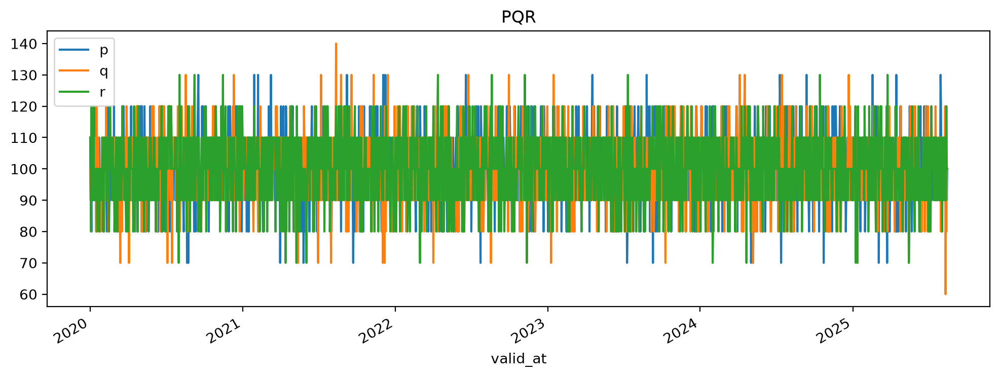

```python {.marimo}
import marimo as mo
```

```python {.marimo}
from filetree import tree
from ssb_timeseries import get_configuration
CONFIG = get_configuration()
```

# Data types and storage

## Setup

```python {.marimo}
# both data and metadata will be stored here
data_path = CONFIG.repositories['tutorials']['directory']['options']['path']
print(data_path)
```

<!-- @output:bkHC -->

<pre style="white-space: pre-wrap; overflow-wrap: break-word;">/home/bernhard/timeseries
</pre>

```python {.marimo}
# what is there before we start?
print(tree(data_path))
```

<!-- @output:lEQa -->

<pre style="white-space: pre-wrap; overflow-wrap: break-word;">timeseries/

</pre>

```python {.marimo}
from ssb_timeseries.dataset import Dataset
from ssb_timeseries.types import SeriesType, Versioning, Temporality
```

```python {.marimo}
from datetime import timedelta

from ssb_timeseries.sample_data import create_df
from ssb_timeseries.dates import ensure_datetime, date_utc
```

```python {.marimo}
import polars as pl
from datetime import datetime
```

## Saving data
<!---->
### Example: point-in-time data, *without* versioning

```python {.marimo}
point_in_time_data = SeriesType('NONE', 'AT')
```

```python {.marimo}
def some_simple_data_from_file_or_query(start='2020-01-01', end='2025-06-01'):
    return create_df(['p','q','r'], start_date=start,end_date=end, freq='D')
```

```python {.marimo}
pqr_df = some_simple_data_from_file_or_query()
print(type(pqr_df))
pqr_df
```

<!-- @output:Hstk -->

<pre style="white-space: pre-wrap; overflow-wrap: break-word;">&lt;class &#x27;pandas.core.frame.DataFrame&#x27;&gt;
</pre>

| valid_at | p | q | r |
| --- | --- | --- | --- |
| 2020-01-01 00:00:00+01:00 | 90.0 | 110.0 | 100.0 |
| 2020-01-02 00:00:00+01:00 | 80.0 | 100.0 | 90.0 |
| 2020-01-03 00:00:00+01:00 | 90.0 | 90.0 | 110.0 |
| 2020-01-04 00:00:00+01:00 | 120.0 | 100.0 | 110.0 |
| 2020-01-05 00:00:00+01:00 | 100.0 | 90.0 | 110.0 |
| ... | ... | ... | ... |
| 2025-05-28 00:00:00+02:00 | 90.0 | 110.0 | 100.0 |
| 2025-05-29 00:00:00+02:00 | 100.0 | 100.0 | 100.0 |
| 2025-05-30 00:00:00+02:00 | 100.0 | 100.0 | 100.0 |
| 2025-05-31 00:00:00+02:00 | 110.0 | 90.0 | 90.0 |
| 2025-06-01 00:00:00+02:00 | 100.0 | 100.0 | 120.0 |

```python {.marimo}
pqr = Dataset(
    name = 'PQR',
    data_type = point_in_time_data,
    data = pqr_df,
)
```

```python {.marimo}
type(pqr)
```

<!-- @output:iLit -->

<pre style="white-space: pre-wrap; overflow-wrap: break-word;">&lt;class &#x27;ssb_timeseries.dataset.Dataset&#x27;&gt;</pre>

```python {.marimo}
pqr.data
```

<!-- @output:ZHCJ -->

| valid_at | p | q | r |
| --- | --- | --- | --- |
| 2019-12-31 23:00:00+00:00 | 90.0 | 110.0 | 100.0 |
| 2020-01-01 23:00:00+00:00 | 80.0 | 100.0 | 90.0 |
| 2020-01-02 23:00:00+00:00 | 90.0 | 90.0 | 110.0 |
| 2020-01-03 23:00:00+00:00 | 120.0 | 100.0 | 110.0 |
| 2020-01-04 23:00:00+00:00 | 100.0 | 90.0 | 110.0 |
| ... | ... | ... | ... |
| 2025-05-27 22:00:00+00:00 | 90.0 | 110.0 | 100.0 |
| 2025-05-28 22:00:00+00:00 | 100.0 | 100.0 | 100.0 |
| 2025-05-29 22:00:00+00:00 | 100.0 | 100.0 | 100.0 |
| 2025-05-30 22:00:00+00:00 | 110.0 | 90.0 | 90.0 |
| 2025-05-31 22:00:00+00:00 | 100.0 | 100.0 | 120.0 |

```python {.marimo}
pqr.tags
```

<!-- @output:ROlb -->

<pre style="white-space: pre-wrap; overflow-wrap: break-word;">{&#x27;name&#x27;: &#x27;PQR&#x27;,
 &#x27;repository&#x27;: &#x27;tutorials&#x27;,
 &#x27;series&#x27;: {&#x27;p&#x27;: {&#x27;dataset&#x27;: &#x27;PQR&#x27;, &#x27;name&#x27;: &#x27;p&#x27;},
            &#x27;q&#x27;: {&#x27;dataset&#x27;: &#x27;PQR&#x27;, &#x27;name&#x27;: &#x27;q&#x27;},
            &#x27;r&#x27;: {&#x27;dataset&#x27;: &#x27;PQR&#x27;, &#x27;name&#x27;: &#x27;r&#x27;}},
 &#x27;temporality&#x27;: &#x27;AT&#x27;,
 &#x27;versioning&#x27;: &#x27;NONE&#x27;}</pre>

```python {.marimo}
pqr.tag_dataset(tags={'variable': 'price','product group': 'essentials'})

pqr.tag_series('p',tags={'product': 'coffee'})
pqr.tag_series('q',tags={'product': 'crispbread'})
pqr.tag_series('r',tags={'product': 'brown cheese'})

pqr.tags
```

<!-- @output:qnkX -->

<pre style="white-space: pre-wrap; overflow-wrap: break-word;">{&#x27;name&#x27;: &#x27;PQR&#x27;,
 &#x27;product group&#x27;: &#x27;essentials&#x27;,
 &#x27;repository&#x27;: &#x27;tutorials&#x27;,
 &#x27;series&#x27;: {&#x27;p&#x27;: {&#x27;dataset&#x27;: &#x27;PQR&#x27;,
                  &#x27;name&#x27;: &#x27;p&#x27;,
                  &#x27;product&#x27;: &#x27;coffee&#x27;,
                  &#x27;product group&#x27;: &#x27;essentials&#x27;,
                  &#x27;repository&#x27;: &#x27;tutorials&#x27;,
                  &#x27;temporality&#x27;: &#x27;AT&#x27;,
                  &#x27;variable&#x27;: &#x27;price&#x27;,
                  &#x27;versioning&#x27;: &#x27;NONE&#x27;},
            &#x27;q&#x27;: {&#x27;dataset&#x27;: &#x27;PQR&#x27;,
                  &#x27;name&#x27;: &#x27;q&#x27;,
                  &#x27;product&#x27;: &#x27;crispbread&#x27;,
                  &#x27;product group&#x27;: &#x27;essentials&#x27;,
                  &#x27;repository&#x27;: &#x27;tutorials&#x27;,
                  &#x27;temporality&#x27;: &#x27;AT&#x27;,
                  &#x27;variable&#x27;: &#x27;price&#x27;,
                  &#x27;versioning&#x27;: &#x27;NONE&#x27;},
            &#x27;r&#x27;: {&#x27;dataset&#x27;: &#x27;PQR&#x27;,
                  &#x27;name&#x27;: &#x27;r&#x27;,
                  &#x27;product&#x27;: &#x27;brown cheese&#x27;,
                  &#x27;product group&#x27;: &#x27;essentials&#x27;,
                  &#x27;repository&#x27;: &#x27;tutorials&#x27;,
                  &#x27;temporality&#x27;: &#x27;AT&#x27;,
                  &#x27;variable&#x27;: &#x27;price&#x27;,
                  &#x27;versioning&#x27;: &#x27;NONE&#x27;}},
 &#x27;temporality&#x27;: &#x27;AT&#x27;,
 &#x27;variable&#x27;: &#x27;price&#x27;,
 &#x27;versioning&#x27;: &#x27;NONE&#x27;}</pre>

```python {.marimo}
pqr.save()
```

```python {.marimo}
print(tree(data_path))
```

<!-- @output:YWSi -->

<pre style="white-space: pre-wrap; overflow-wrap: break-word;">timeseries/
├── AS_OF_AT/
│   └── XYZ/
│       ├── XYZ-as_of_2025-04-30T220000+0000-data.parquet
│       ├── XYZ-as_of_2025-05-31T220000+0000-data.parquet
│       ├── XYZ-as_of_2025-08-02T220000+0000-data.parquet
│       ├── XYZ-as_of_2025-08-03T220000+0000-data.parquet
│       ├── XYZ-as_of_2025-08-04T220000+0000-data.parquet
│       ├── XYZ-as_of_2025-08-05T220000+0000-data.parquet
│       └── XYZ-as_of_2025-08-06T220000+0000-data.parquet
├── metadata/
│   ├── AZ_beverages-metadata.json
│   ├── PQR-metadata.json
│   └── XYZ-metadata.json
├── NONE_AT/
│   └── PQR/
│       └── PQR-latest-data.parquet
└── NONE_FROM_TO/
    └── AZ_beverages/
        └── AZ_beverages-latest-data.parquet

</pre>

<!-- @output:YWSi -->

<pre style="white-space: pre-wrap; overflow-wrap: break-word;">timeseries/
├── AS_OF_AT/
│   └── XYZ/
│       ├── XYZ-as_of_2025-04-30T220000+0000-data.parquet
│       ├── XYZ-as_of_2025-05-31T220000+0000-data.parquet
│       ├── XYZ-as_of_2025-08-02T220000+0000-data.parquet
│       ├── XYZ-as_of_2025-08-03T220000+0000-data.parquet
│       ├── XYZ-as_of_2025-08-04T220000+0000-data.parquet
│       ├── XYZ-as_of_2025-08-05T220000+0000-data.parquet
│       └── XYZ-as_of_2025-08-06T220000+0000-data.parquet
├── metadata/
│   ├── AZ_beverages-metadata.json
│   ├── PQR-metadata.json
│   └── XYZ-metadata.json
├── NONE_AT/
│   └── PQR/
│       └── PQR-latest-data.parquet
└── NONE_FROM_TO/
    └── AZ_beverages/
        └── AZ_beverages-latest-data.parquet

</pre>

<!-- @output:YWSi -->

<pre style="white-space: pre-wrap; overflow-wrap: break-word;">timeseries/
├── AS_OF_AT/
│   └── XYZ/
│       ├── XYZ-as_of_2025-04-30T220000+0000-data.parquet
│       ├── XYZ-as_of_2025-05-31T220000+0000-data.parquet
│       ├── XYZ-as_of_2025-08-02T220000+0000-data.parquet
│       ├── XYZ-as_of_2025-08-03T220000+0000-data.parquet
│       ├── XYZ-as_of_2025-08-04T220000+0000-data.parquet
│       ├── XYZ-as_of_2025-08-05T220000+0000-data.parquet
│       └── XYZ-as_of_2025-08-06T220000+0000-data.parquet
├── metadata/
│   ├── AZ_beverages-metadata.json
│   ├── PQR-metadata.json
│   └── XYZ-metadata.json
├── NONE_AT/
│   └── PQR/
│       └── PQR-latest-data.parquet
└── NONE_FROM_TO/
    └── AZ_beverages/
        └── AZ_beverages-latest-data.parquet

</pre>

<!-- @output:YWSi -->

<pre style="white-space: pre-wrap; overflow-wrap: break-word;">timeseries/
├── AS_OF_AT/
│   └── XYZ/
│       ├── XYZ-as_of_2025-04-30T220000+0000-data.parquet
│       ├── XYZ-as_of_2025-05-31T220000+0000-data.parquet
│       ├── XYZ-as_of_2025-08-02T220000+0000-data.parquet
│       ├── XYZ-as_of_2025-08-03T220000+0000-data.parquet
│       ├── XYZ-as_of_2025-08-04T220000+0000-data.parquet
│       ├── XYZ-as_of_2025-08-05T220000+0000-data.parquet
│       └── XYZ-as_of_2025-08-06T220000+0000-data.parquet
├── metadata/
│   ├── AZ_beverages-metadata.json
│   ├── PQR-metadata.json
│   └── XYZ-metadata.json
├── NONE_AT/
│   └── PQR/
│       └── PQR-latest-data.parquet
└── NONE_FROM_TO/
    └── AZ_beverages/
        └── AZ_beverages-latest-data.parquet

</pre>

<!-- @output:YWSi -->

<pre style="white-space: pre-wrap; overflow-wrap: break-word;">timeseries/
├── AS_OF_AT/
│   └── XYZ/
│       ├── XYZ-as_of_2025-04-30T220000+0000-data.parquet
│       ├── XYZ-as_of_2025-05-31T220000+0000-data.parquet
│       ├── XYZ-as_of_2025-08-02T220000+0000-data.parquet
│       ├── XYZ-as_of_2025-08-03T220000+0000-data.parquet
│       ├── XYZ-as_of_2025-08-04T220000+0000-data.parquet
│       ├── XYZ-as_of_2025-08-05T220000+0000-data.parquet
│       └── XYZ-as_of_2025-08-06T220000+0000-data.parquet
├── metadata/
│   ├── AZ_beverages-metadata.json
│   ├── PQR-metadata.json
│   └── XYZ-metadata.json
├── NONE_AT/
│   └── PQR/
│       └── PQR-latest-data.parquet
└── NONE_FROM_TO/
    └── AZ_beverages/
        └── AZ_beverages-latest-data.parquet

</pre>

```python {.marimo}
# reading the data back:
x = Dataset('PQR')
x.data    # ... now an Arrow table
```

<!-- @output:DnEU -->

<pre style="white-space: pre-wrap; overflow-wrap: break-word;">pyarrow.Table
valid_at: timestamp&#91;ns, tz=UTC&#93;
p: double
q: double
r: double
----
valid_at: &#91;&#91;2019-12-31 23:00:00.000000000Z,2020-01-01 23:00:00.000000000Z,2020-01-02 23:00:00.000000000Z,2020-01-03 23:00:00.000000000Z,2020-01-04 23:00:00.000000000Z,...,2025-05-27 22:00:00.000000000Z,2025-05-28 22:00:00.000000000Z,2025-05-29 22:00:00.000000000Z,2025-05-30 22:00:00.000000000Z,2025-05-31 22:00:00.000000000Z&#93;&#93;
p: &#91;&#91;90,80,90,120,100,...,90,100,100,110,100&#93;&#93;
q: &#91;&#91;110,100,90,100,90,...,110,100,100,90,100&#93;&#93;
r: &#91;&#91;100,90,110,110,110,...,100,100,100,90,120&#93;&#93;</pre>

```python {.marimo}
x.nw.to_pandas()
```

<!-- @output:ulZA -->

| valid_at | p | q | r |
| --- | --- | --- | --- |
| 2019-12-31 23:00:00+00:00 | 90.0 | 110.0 | 100.0 |
| 2020-01-01 23:00:00+00:00 | 80.0 | 100.0 | 90.0 |
| 2020-01-02 23:00:00+00:00 | 90.0 | 90.0 | 110.0 |
| 2020-01-03 23:00:00+00:00 | 120.0 | 100.0 | 110.0 |
| 2020-01-04 23:00:00+00:00 | 100.0 | 90.0 | 110.0 |
| ... | ... | ... | ... |
| 2025-05-27 22:00:00+00:00 | 90.0 | 110.0 | 100.0 |
| 2025-05-28 22:00:00+00:00 | 100.0 | 100.0 | 100.0 |
| 2025-05-29 22:00:00+00:00 | 100.0 | 100.0 | 100.0 |
| 2025-05-30 22:00:00+00:00 | 110.0 | 90.0 | 90.0 |
| 2025-05-31 22:00:00+00:00 | 100.0 | 100.0 | 120.0 |

```python {.marimo}
x.plot()
```

<!-- @output:ecfG -->



```python {.marimo}
more_pqr_data = some_simple_data_from_file_or_query('2025-05-29','2025-08-15')
more_pqr_data
```

<!-- @output:Pvdt -->

| valid_at | p | q | r |
| --- | --- | --- | --- |
| 2025-05-29 00:00:00+02:00 | 90.0 | 100.0 | 100.0 |
| 2025-05-30 00:00:00+02:00 | 100.0 | 100.0 | 100.0 |
| 2025-05-31 00:00:00+02:00 | 110.0 | 110.0 | 130.0 |
| 2025-06-01 00:00:00+02:00 | 110.0 | 100.0 | 100.0 |
| 2025-06-02 00:00:00+02:00 | 100.0 | 120.0 | 100.0 |
| ... | ... | ... | ... |
| 2025-08-11 00:00:00+02:00 | 90.0 | 100.0 | 90.0 |
| 2025-08-12 00:00:00+02:00 | 90.0 | 100.0 | 110.0 |
| 2025-08-13 00:00:00+02:00 | 90.0 | 110.0 | 100.0 |
| 2025-08-14 00:00:00+02:00 | 70.0 | 80.0 | 110.0 |
| 2025-08-15 00:00:00+02:00 | 100.0 | 100.0 | 90.0 |

```python {.marimo}
pqr_second_write = Dataset(
    name = 'PQR',
    data = more_pqr_data,
)
# obj init will retrieve previously saved metadata for an existing set and series:
print(pqr_second_write.tags)
```

<!-- @output:ZBYS -->

<pre style="white-space: pre-wrap; overflow-wrap: break-word;">{&#x27;name&#x27;: &#x27;PQR&#x27;, &#x27;versioning&#x27;: &#x27;NONE&#x27;, &#x27;temporality&#x27;: &#x27;AT&#x27;, &#x27;series&#x27;: {&#x27;p&#x27;: {&#x27;dataset&#x27;: &#x27;PQR&#x27;, &#x27;name&#x27;: &#x27;p&#x27;, &#x27;variable&#x27;: &#x27;price&#x27;, &#x27;product group&#x27;: &#x27;essentials&#x27;, &#x27;versioning&#x27;: &#x27;NONE&#x27;, &#x27;temporality&#x27;: &#x27;AT&#x27;, &#x27;repository&#x27;: &#x27;tutorials&#x27;, &#x27;product&#x27;: &#x27;coffee&#x27;}, &#x27;q&#x27;: {&#x27;dataset&#x27;: &#x27;PQR&#x27;, &#x27;name&#x27;: &#x27;q&#x27;, &#x27;variable&#x27;: &#x27;price&#x27;, &#x27;product group&#x27;: &#x27;essentials&#x27;, &#x27;versioning&#x27;: &#x27;NONE&#x27;, &#x27;temporality&#x27;: &#x27;AT&#x27;, &#x27;repository&#x27;: &#x27;tutorials&#x27;, &#x27;product&#x27;: &#x27;crispbread&#x27;}, &#x27;r&#x27;: {&#x27;dataset&#x27;: &#x27;PQR&#x27;, &#x27;name&#x27;: &#x27;r&#x27;, &#x27;variable&#x27;: &#x27;price&#x27;, &#x27;product group&#x27;: &#x27;essentials&#x27;, &#x27;versioning&#x27;: &#x27;NONE&#x27;, &#x27;temporality&#x27;: &#x27;AT&#x27;, &#x27;repository&#x27;: &#x27;tutorials&#x27;, &#x27;product&#x27;: &#x27;brown cheese&#x27;}}, &#x27;repository&#x27;: &#x27;tutorials&#x27;, &#x27;variable&#x27;: &#x27;price&#x27;, &#x27;product group&#x27;: &#x27;essentials&#x27;}
</pre>

```python {.marimo}
pqr_second_write.save()
```

```python {.marimo}
# in memory object instances do not change
print(pqr.data)
print(pqr_second_write.data)
```

<!-- @output:nHfw -->

<pre style="white-space: pre-wrap; overflow-wrap: break-word;">                      valid_at      p      q      r
0    2019-12-31 23:00:00+00:00   90.0  110.0  100.0
1    2020-01-01 23:00:00+00:00   80.0  100.0   90.0
2    2020-01-02 23:00:00+00:00   90.0   90.0  110.0
3    2020-01-03 23:00:00+00:00  120.0  100.0  110.0
4    2020-01-04 23:00:00+00:00  100.0   90.0  110.0
...                        ...    ...    ...    ...
1974 2025-05-27 22:00:00+00:00   90.0  110.0  100.0
1975 2025-05-28 22:00:00+00:00  100.0  100.0  100.0
1976 2025-05-29 22:00:00+00:00  100.0  100.0  100.0
1977 2025-05-30 22:00:00+00:00  110.0   90.0   90.0
1978 2025-05-31 22:00:00+00:00  100.0  100.0  120.0

&#91;1979 rows x 4 columns&#93;
                    valid_at      p      q      r
0  2025-05-28 22:00:00+00:00   90.0  100.0  100.0
1  2025-05-29 22:00:00+00:00  100.0  100.0  100.0
2  2025-05-30 22:00:00+00:00  110.0  110.0  130.0
3  2025-05-31 22:00:00+00:00  110.0  100.0  100.0
4  2025-06-01 22:00:00+00:00  100.0  120.0  100.0
..                       ...    ...    ...    ...
74 2025-08-10 22:00:00+00:00   90.0  100.0   90.0
75 2025-08-11 22:00:00+00:00   90.0  100.0  110.0
76 2025-08-12 22:00:00+00:00   90.0  110.0  100.0
77 2025-08-13 22:00:00+00:00   70.0   80.0  110.0
78 2025-08-14 22:00:00+00:00  100.0  100.0   90.0

&#91;79 rows x 4 columns&#93;
</pre>

```python {.marimo}
y = Dataset('PQR')
y.nw.to_polars()
```

<!-- @output:xXTn -->

| valid_at | p | q | r |
| --- | --- | --- | --- |
| datetime[ns, UTC] | f64 | f64 | f64 |
| 2019-12-31 23:00:00 UTC | 90.0 | 110.0 | 100.0 |
| 2020-01-01 23:00:00 UTC | 80.0 | 100.0 | 90.0 |
| 2020-01-02 23:00:00 UTC | 90.0 | 90.0 | 110.0 |
| 2020-01-03 23:00:00 UTC | 120.0 | 100.0 | 110.0 |
| 2020-01-04 23:00:00 UTC | 100.0 | 90.0 | 110.0 |
| … | … | … | … |
| 2025-08-10 22:00:00 UTC | 90.0 | 100.0 | 90.0 |
| 2025-08-11 22:00:00 UTC | 90.0 | 100.0 | 110.0 |
| 2025-08-12 22:00:00 UTC | 90.0 | 110.0 | 100.0 |
| 2025-08-13 22:00:00 UTC | 70.0 | 80.0 | 110.0 |
| 2025-08-14 22:00:00 UTC | 100.0 | 100.0 | 90.0 |

```python {.marimo}
# ... but the data file has been overwritten:
y.nw.to_polars().filter(
    pl.col("valid_at").is_between(pl.date(2025, 5, 29), pl.date(2025, 6, 2))
)
```

<!-- @output:AjVT -->

| valid_at | p | q | r |
| --- | --- | --- | --- |
| datetime[ns, UTC] | f64 | f64 | f64 |
| 2025-05-29 22:00:00 UTC | 100.0 | 100.0 | 100.0 |
| 2025-05-30 22:00:00 UTC | 110.0 | 110.0 | 130.0 |
| 2025-05-31 22:00:00 UTC | 110.0 | 100.0 | 100.0 |
| 2025-06-01 22:00:00 UTC | 100.0 | 120.0 | 100.0 |

```python {.marimo}
# note that for unversioned type: we operate on the same files all the way
print(tree(data_path))
```

<!-- @output:pHFh -->

<pre style="white-space: pre-wrap; overflow-wrap: break-word;">timeseries/
├── metadata/
│   └── PQR-metadata.json
└── NONE_AT/
    └── PQR/
        └── PQR-latest-data.parquet

</pre>

```python {.marimo}
print(tree(data_path))
```

```python {.marimo}
x.data = x.nw.to_pandas() # <-- workaround for bug in groupby
xx = x.groupby('Q','sum')

# xx is a new dataset, hence gets a new name on creation:
xx
```

<!-- @output:aqbW -->

<pre style="white-space: pre-wrap; overflow-wrap: break-word;">Dataset(name=&quot;(PQR.groupby(Q,sum))&quot;, repository=&quot;tutorials&quot;, data_type=SeriesType(Versioning.NONE,Temporality.AT), as_of_tz=None)</pre>

```python {.marimo}
xx.data
```

<!-- @output:TRpd -->

| p | q | r |
| --- | --- | --- |
|  |  |  |
| 90.0 | 110.0 | 100.0 |
| 9200.0 | 9110.0 | 9080.0 |
| 9070.0 | 9000.0 | 9100.0 |
| 9300.0 | 9290.0 | 9230.0 |
| 9310.0 | 9360.0 | 9340.0 |
| ... | ... | ... |
| 9090.0 | 8870.0 | 9210.0 |
| 9150.0 | 9350.0 | 9330.0 |
| 9150.0 | 9150.0 | 9240.0 |
| 9050.0 | 8900.0 | 8990.0 |
| 6070.0 | 6130.0 | 5940.0 |

### Example: data for periods, *without* versioning

```python {.marimo}
interval_data = SeriesType(Versioning.NONE, Temporality.FROM_TO)
```

```python {.marimo}
def mock_interval_data_from_file_or_query(start, end):
    a_to_z = [chr(i) for i in range(ord('a'), ord('z') + 1)]
    variables = ['quantity', 'price']
    goods = ['coffee', 'tea', 'soda', 'beer', 'wine']
    return create_df(
        a_to_z, variables, goods,
        start_date=start,
        end_date=end,
        freq='M',
        temporality='FROM_TO',
        implementation='polars'
    )
```

```python {.marimo}
bigger_data = mock_interval_data_from_file_or_query(start='2025-01-01', end='2025-06-01')
bigger_data.shape
```

<!-- @output:wlCL -->

<pre style="white-space: pre-wrap; overflow-wrap: break-word;">&#91;6, 262&#93;</pre>

```python {.marimo}
bigger_data
```

<!-- @output:kqZH -->

| valid_from | valid_to | a_quantity_coffee | a_quantity_tea | a_quantity_soda | a_quantity_beer | a_quantity_wine | a_price_coffee | a_price_tea | a_price_soda | a_price_beer | a_price_wine | b_quantity_coffee | b_quantity_tea | b_quantity_soda | b_quantity_beer | b_quantity_wine | b_price_coffee | b_price_tea | b_price_soda | b_price_beer | b_price_wine | c_quantity_coffee | c_quantity_tea | c_quantity_soda | c_quantity_beer | c_quantity_wine | c_price_coffee | c_price_tea | c_price_soda | c_price_beer | c_price_wine | d_quantity_coffee | d_quantity_tea | d_quantity_soda | d_quantity_beer | d_quantity_wine | … | w_quantity_beer | w_quantity_wine | w_price_coffee | w_price_tea | w_price_soda | w_price_beer | w_price_wine | x_quantity_coffee | x_quantity_tea | x_quantity_soda | x_quantity_beer | x_quantity_wine | x_price_coffee | x_price_tea | x_price_soda | x_price_beer | x_price_wine | y_quantity_coffee | y_quantity_tea | y_quantity_soda | y_quantity_beer | y_quantity_wine | y_price_coffee | y_price_tea | y_price_soda | y_price_beer | y_price_wine | z_quantity_coffee | z_quantity_tea | z_quantity_soda | z_quantity_beer | z_quantity_wine | z_price_coffee | z_price_tea | z_price_soda | z_price_beer | z_price_wine |
| --- | --- | --- | --- | --- | --- | --- | --- | --- | --- | --- | --- | --- | --- | --- | --- | --- | --- | --- | --- | --- | --- | --- | --- | --- | --- | --- | --- | --- | --- | --- | --- | --- | --- | --- | --- | --- | --- | --- | --- | --- | --- | --- | --- | --- | --- | --- | --- | --- | --- | --- | --- | --- | --- | --- | --- | --- | --- | --- | --- | --- | --- | --- | --- | --- | --- | --- | --- | --- | --- | --- | --- | --- | --- | --- |
| datetime[μs, Europe/Oslo] | datetime[μs, Europe/Oslo] | f64 | f64 | f64 | f64 | f64 | f64 | f64 | f64 | f64 | f64 | f64 | f64 | f64 | f64 | f64 | f64 | f64 | f64 | f64 | f64 | f64 | f64 | f64 | f64 | f64 | f64 | f64 | f64 | f64 | f64 | f64 | f64 | f64 | f64 | f64 | … | f64 | f64 | f64 | f64 | f64 | f64 | f64 | f64 | f64 | f64 | f64 | f64 | f64 | f64 | f64 | f64 | f64 | f64 | f64 | f64 | f64 | f64 | f64 | f64 | f64 | f64 | f64 | f64 | f64 | f64 | f64 | f64 | f64 | f64 | f64 | f64 | f64 |
| 2025-01-01 00:00:00 CET | 2025-02-01 00:00:00 CET | 90.0 | 110.0 | 90.0 | 100.0 | 110.0 | 100.0 | 110.0 | 100.0 | 120.0 | 100.0 | 100.0 | 80.0 | 100.0 | 90.0 | 110.0 | 90.0 | 90.0 | 100.0 | 100.0 | 100.0 | 110.0 | 90.0 | 110.0 | 110.0 | 90.0 | 100.0 | 110.0 | 100.0 | 100.0 | 100.0 | 100.0 | 80.0 | 120.0 | 90.0 | 100.0 | … | 110.0 | 100.0 | 100.0 | 100.0 | 90.0 | 100.0 | 110.0 | 90.0 | 90.0 | 90.0 | 100.0 | 100.0 | 110.0 | 100.0 | 70.0 | 110.0 | 100.0 | 90.0 | 100.0 | 120.0 | 110.0 | 100.0 | 100.0 | 110.0 | 80.0 | 100.0 | 100.0 | 90.0 | 90.0 | 90.0 | 100.0 | 110.0 | 110.0 | 110.0 | 100.0 | 70.0 | 90.0 |
| 2025-02-01 00:00:00 CET | 2025-03-01 00:00:00 CET | 100.0 | 90.0 | 80.0 | 100.0 | 90.0 | 110.0 | 120.0 | 110.0 | 120.0 | 100.0 | 100.0 | 90.0 | 100.0 | 100.0 | 100.0 | 110.0 | 100.0 | 100.0 | 100.0 | 110.0 | 100.0 | 90.0 | 100.0 | 110.0 | 100.0 | 100.0 | 80.0 | 110.0 | 90.0 | 100.0 | 100.0 | 110.0 | 80.0 | 110.0 | 100.0 | … | 100.0 | 100.0 | 110.0 | 100.0 | 110.0 | 80.0 | 90.0 | 120.0 | 110.0 | 90.0 | 100.0 | 90.0 | 120.0 | 90.0 | 110.0 | 90.0 | 110.0 | 90.0 | 110.0 | 100.0 | 130.0 | 110.0 | 110.0 | 90.0 | 110.0 | 100.0 | 110.0 | 90.0 | 90.0 | 100.0 | 80.0 | 110.0 | 100.0 | 90.0 | 100.0 | 80.0 | 90.0 |
| 2025-03-01 00:00:00 CET | 2025-04-01 00:00:00 CEST | 110.0 | 100.0 | 100.0 | 100.0 | 120.0 | 100.0 | 110.0 | 100.0 | 100.0 | 100.0 | 100.0 | 110.0 | 100.0 | 100.0 | 90.0 | 100.0 | 100.0 | 110.0 | 100.0 | 100.0 | 90.0 | 110.0 | 100.0 | 90.0 | 110.0 | 120.0 | 100.0 | 100.0 | 90.0 | 80.0 | 100.0 | 100.0 | 100.0 | 90.0 | 90.0 | … | 90.0 | 100.0 | 100.0 | 100.0 | 100.0 | 110.0 | 110.0 | 100.0 | 90.0 | 100.0 | 90.0 | 110.0 | 100.0 | 90.0 | 90.0 | 110.0 | 110.0 | 110.0 | 100.0 | 100.0 | 90.0 | 100.0 | 90.0 | 110.0 | 80.0 | 90.0 | 90.0 | 90.0 | 90.0 | 100.0 | 100.0 | 80.0 | 120.0 | 110.0 | 100.0 | 90.0 | 90.0 |
| 2025-04-01 00:00:00 CEST | 2025-05-01 00:00:00 CEST | 110.0 | 110.0 | 90.0 | 110.0 | 100.0 | 110.0 | 100.0 | 90.0 | 120.0 | 100.0 | 90.0 | 100.0 | 110.0 | 100.0 | 110.0 | 110.0 | 100.0 | 70.0 | 100.0 | 90.0 | 100.0 | 100.0 | 110.0 | 120.0 | 100.0 | 90.0 | 90.0 | 100.0 | 110.0 | 110.0 | 110.0 | 100.0 | 100.0 | 100.0 | 90.0 | … | 90.0 | 90.0 | 110.0 | 90.0 | 100.0 | 100.0 | 90.0 | 110.0 | 90.0 | 100.0 | 100.0 | 100.0 | 110.0 | 80.0 | 90.0 | 100.0 | 100.0 | 110.0 | 90.0 | 110.0 | 90.0 | 100.0 | 110.0 | 90.0 | 90.0 | 80.0 | 100.0 | 100.0 | 80.0 | 80.0 | 120.0 | 100.0 | 90.0 | 90.0 | 100.0 | 90.0 | 100.0 |
| 2025-05-01 00:00:00 CEST | 2025-06-01 00:00:00 CEST | 110.0 | 90.0 | 110.0 | 90.0 | 100.0 | 90.0 | 100.0 | 90.0 | 100.0 | 110.0 | 100.0 | 100.0 | 100.0 | 110.0 | 110.0 | 110.0 | 110.0 | 100.0 | 110.0 | 100.0 | 100.0 | 100.0 | 80.0 | 100.0 | 110.0 | 90.0 | 70.0 | 100.0 | 110.0 | 100.0 | 90.0 | 90.0 | 100.0 | 110.0 | 110.0 | … | 90.0 | 90.0 | 120.0 | 100.0 | 100.0 | 100.0 | 90.0 | 100.0 | 110.0 | 90.0 | 90.0 | 110.0 | 90.0 | 110.0 | 120.0 | 90.0 | 110.0 | 100.0 | 100.0 | 120.0 | 90.0 | 100.0 | 90.0 | 90.0 | 100.0 | 110.0 | 100.0 | 110.0 | 90.0 | 100.0 | 90.0 | 110.0 | 90.0 | 100.0 | 80.0 | 90.0 | 110.0 |
| 2025-06-01 00:00:00 CEST | 2025-07-01 00:00:00 CEST | 100.0 | 90.0 | 100.0 | 110.0 | 110.0 | 90.0 | 120.0 | 90.0 | 100.0 | 100.0 | 90.0 | 90.0 | 110.0 | 80.0 | 100.0 | 90.0 | 110.0 | 110.0 | 90.0 | 110.0 | 100.0 | 100.0 | 90.0 | 80.0 | 110.0 | 90.0 | 100.0 | 100.0 | 80.0 | 100.0 | 100.0 | 130.0 | 120.0 | 110.0 | 110.0 | … | 80.0 | 90.0 | 100.0 | 100.0 | 110.0 | 110.0 | 90.0 | 100.0 | 120.0 | 110.0 | 100.0 | 120.0 | 90.0 | 90.0 | 120.0 | 100.0 | 110.0 | 100.0 | 100.0 | 110.0 | 100.0 | 100.0 | 80.0 | 100.0 | 100.0 | 90.0 | 110.0 | 100.0 | 90.0 | 130.0 | 110.0 | 100.0 | 110.0 | 100.0 | 100.0 | 100.0 | 90.0 |

```python {.marimo}
az = Dataset(
    name = 'AZ_beverages',
    data_type = interval_data,
    data = bigger_data,
    attributes=['store','variable','product'],
)
```

```python {.marimo}
az.tags
```

<!-- @output:rEll -->

<pre style="white-space: pre-wrap; overflow-wrap: break-word;">{&#x27;name&#x27;: &#x27;AZ_beverages&#x27;,
 &#x27;repository&#x27;: &#x27;tutorials&#x27;,
 &#x27;series&#x27;: {&#x27;a_price_beer&#x27;: {&#x27;dataset&#x27;: &#x27;AZ_beverages&#x27;,
                             &#x27;name&#x27;: &#x27;a_price_beer&#x27;,
                             &#x27;product&#x27;: &#x27;beer&#x27;,
                             &#x27;repository&#x27;: &#x27;tutorials&#x27;,
                             &#x27;store&#x27;: &#x27;a&#x27;,
                             &#x27;temporality&#x27;: &#x27;FROM_TO&#x27;,
                             &#x27;variable&#x27;: &#x27;price&#x27;,
                             &#x27;versioning&#x27;: &#x27;NONE&#x27;},
            &#x27;a_price_coffee&#x27;: {&#x27;dataset&#x27;: &#x27;AZ_beverages&#x27;,
                               &#x27;name&#x27;: &#x27;a_price_coffee&#x27;,
                               &#x27;product&#x27;: &#x27;coffee&#x27;,
                               &#x27;repository&#x27;: &#x27;tutorials&#x27;,
                               &#x27;store&#x27;: &#x27;a&#x27;,
                               &#x27;temporality&#x27;: &#x27;FROM_TO&#x27;,
                               &#x27;variable&#x27;: &#x27;price&#x27;,
                               &#x27;versioning&#x27;: &#x27;NONE&#x27;},
            &#x27;a_price_soda&#x27;: {&#x27;dataset&#x27;: &#x27;AZ_beverages&#x27;,
                             &#x27;name&#x27;: &#x27;a_price_soda&#x27;,
                             &#x27;product&#x27;: &#x27;soda&#x27;,
                             &#x27;repository&#x27;: &#x27;tutorials&#x27;,
                             &#x27;store&#x27;: &#x27;a&#x27;,
                             &#x27;temporality&#x27;: &#x27;FROM_TO&#x27;,
                             &#x27;variable&#x27;: &#x27;price&#x27;,
                             &#x27;versioning&#x27;: &#x27;NONE&#x27;},
            &#x27;a_price_tea&#x27;: {&#x27;dataset&#x27;: &#x27;AZ_beverages&#x27;,
                            &#x27;name&#x27;: &#x27;a_price_tea&#x27;,
                            &#x27;product&#x27;: &#x27;tea&#x27;,
                            &#x27;repository&#x27;: &#x27;tutorials&#x27;,
                            &#x27;store&#x27;: &#x27;a&#x27;,
                            &#x27;temporality&#x27;: &#x27;FROM_TO&#x27;,
                            &#x27;variable&#x27;: &#x27;price&#x27;,
                            &#x27;versioning&#x27;: &#x27;NONE&#x27;},
            &#x27;a_price_wine&#x27;: {&#x27;dataset&#x27;: &#x27;AZ_beverages&#x27;,
                             &#x27;name&#x27;: &#x27;a_price_wine&#x27;,
                             &#x27;product&#x27;: &#x27;wine&#x27;,
                             &#x27;repository&#x27;: &#x27;tutorials&#x27;,
                             &#x27;store&#x27;: &#x27;a&#x27;,
                             &#x27;temporality&#x27;: &#x27;FROM_TO&#x27;,
                             &#x27;variable&#x27;: &#x27;price&#x27;,
                             &#x27;versioning&#x27;: &#x27;NONE&#x27;},
            &#x27;a_quantity_beer&#x27;: {&#x27;dataset&#x27;: &#x27;AZ_beverages&#x27;,
                                &#x27;name&#x27;: &#x27;a_quantity_beer&#x27;,
                                &#x27;product&#x27;: &#x27;beer&#x27;,
                                &#x27;repository&#x27;: &#x27;tutorials&#x27;,
                                &#x27;store&#x27;: &#x27;a&#x27;,
                                &#x27;temporality&#x27;: &#x27;FROM_TO&#x27;,
                                &#x27;variable&#x27;: &#x27;quantity&#x27;,
                                &#x27;versioning&#x27;: &#x27;NONE&#x27;},
            &#x27;a_quantity_coffee&#x27;: {&#x27;dataset&#x27;: &#x27;AZ_beverages&#x27;,
                                  &#x27;name&#x27;: &#x27;a_quantity_coffee&#x27;,
                                  &#x27;product&#x27;: &#x27;coffee&#x27;,
                                  &#x27;repository&#x27;: &#x27;tutorials&#x27;,
                                  &#x27;store&#x27;: &#x27;a&#x27;,
                                  &#x27;temporality&#x27;: &#x27;FROM_TO&#x27;,
                                  &#x27;variable&#x27;: &#x27;quantity&#x27;,
                                  &#x27;versioning&#x27;: &#x27;NONE&#x27;},
            &#x27;a_quantity_soda&#x27;: {&#x27;dataset&#x27;: &#x27;AZ_beverages&#x27;,
                                &#x27;name&#x27;: &#x27;a_quantity_soda&#x27;,
                                &#x27;product&#x27;: &#x27;soda&#x27;,
                                &#x27;repository&#x27;: &#x27;tutorials&#x27;,
                                &#x27;store&#x27;: &#x27;a&#x27;,
                                &#x27;temporality&#x27;: &#x27;FROM_TO&#x27;,
                                &#x27;variable&#x27;: &#x27;quantity&#x27;,
                                &#x27;versioning&#x27;: &#x27;NONE&#x27;},
            &#x27;a_quantity_tea&#x27;: {&#x27;dataset&#x27;: &#x27;AZ_beverages&#x27;,
                               &#x27;name&#x27;: &#x27;a_quantity_tea&#x27;,
                               &#x27;product&#x27;: &#x27;tea&#x27;,
                               &#x27;repository&#x27;: &#x27;tutorials&#x27;,
                               &#x27;store&#x27;: &#x27;a&#x27;,
                               &#x27;temporality&#x27;: &#x27;FROM_TO&#x27;,
                               &#x27;variable&#x27;: &#x27;quantity&#x27;,
                               &#x27;versioning&#x27;: &#x27;NONE&#x27;},
            &#x27;a_quantity_wine&#x27;: {&#x27;dataset&#x27;: &#x27;AZ_beverages&#x27;,
                                &#x27;name&#x27;: &#x27;a_quantity_wine&#x27;,
                                &#x27;product&#x27;: &#x27;wine&#x27;,
                                &#x27;repository&#x27;: &#x27;tutorials&#x27;,
                                &#x27;store&#x27;: &#x27;a&#x27;,
                                &#x27;temporality&#x27;: &#x27;FROM_TO&#x27;,
                                &#x27;variable&#x27;: &#x27;quantity&#x27;,
                                &#x27;versioning&#x27;: &#x27;NONE&#x27;},
            &#x27;b_price_beer&#x27;: {&#x27;dataset&#x27;: &#x27;AZ_beverages&#x27;,
                             &#x27;name&#x27;: &#x27;b_price_beer&#x27;,
                             &#x27;product&#x27;: &#x27;beer&#x27;,
                             &#x27;repository&#x27;: &#x27;tutorials&#x27;,
                             &#x27;store&#x27;: &#x27;b&#x27;,
                             &#x27;temporality&#x27;: &#x27;FROM_TO&#x27;,
                             &#x27;variable&#x27;: &#x27;price&#x27;,
                             &#x27;versioning&#x27;: &#x27;NONE&#x27;},
            &#x27;b_price_coffee&#x27;: {&#x27;dataset&#x27;: &#x27;AZ_beverages&#x27;,
                               &#x27;name&#x27;: &#x27;b_price_coffee&#x27;,
                               &#x27;product&#x27;: &#x27;coffee&#x27;,
                               &#x27;repository&#x27;: &#x27;tutorials&#x27;,
                               &#x27;store&#x27;: &#x27;b&#x27;,
                               &#x27;temporality&#x27;: &#x27;FROM_TO&#x27;,
                               &#x27;variable&#x27;: &#x27;price&#x27;,
                               &#x27;versioning&#x27;: &#x27;NONE&#x27;},
            &#x27;b_price_soda&#x27;: {&#x27;dataset&#x27;: &#x27;AZ_beverages&#x27;,
                             &#x27;name&#x27;: &#x27;b_price_soda&#x27;,
                             &#x27;product&#x27;: &#x27;soda&#x27;,
                             &#x27;repository&#x27;: &#x27;tutorials&#x27;,
                             &#x27;store&#x27;: &#x27;b&#x27;,
                             &#x27;temporality&#x27;: &#x27;FROM_TO&#x27;,
                             &#x27;variable&#x27;: &#x27;price&#x27;,
                             &#x27;versioning&#x27;: &#x27;NONE&#x27;},
            &#x27;b_price_tea&#x27;: {&#x27;dataset&#x27;: &#x27;AZ_beverages&#x27;,
                            &#x27;name&#x27;: &#x27;b_price_tea&#x27;,
                            &#x27;product&#x27;: &#x27;tea&#x27;,
                            &#x27;repository&#x27;: &#x27;tutorials&#x27;,
                            &#x27;store&#x27;: &#x27;b&#x27;,
                            &#x27;temporality&#x27;: &#x27;FROM_TO&#x27;,
                            &#x27;variable&#x27;: &#x27;price&#x27;,
                            &#x27;versioning&#x27;: &#x27;NONE&#x27;},
            &#x27;b_price_wine&#x27;: {&#x27;dataset&#x27;: &#x27;AZ_beverages&#x27;,
                             &#x27;name&#x27;: &#x27;b_price_wine&#x27;,
                             &#x27;product&#x27;: &#x27;wine&#x27;,
                             &#x27;repository&#x27;: &#x27;tutorials&#x27;,
                             &#x27;store&#x27;: &#x27;b&#x27;,
                             &#x27;temporality&#x27;: &#x27;FROM_TO&#x27;,
                             &#x27;variable&#x27;: &#x27;price&#x27;,
                             &#x27;versioning&#x27;: &#x27;NONE&#x27;},
            &#x27;b_quantity_beer&#x27;: {&#x27;dataset&#x27;: &#x27;AZ_beverages&#x27;,
                                &#x27;name&#x27;: &#x27;b_quantity_beer&#x27;,
                                &#x27;product&#x27;: &#x27;beer&#x27;,
                                &#x27;repository&#x27;: &#x27;tutorials&#x27;,
                                &#x27;store&#x27;: &#x27;b&#x27;,
                                &#x27;temporality&#x27;: &#x27;FROM_TO&#x27;,
                                &#x27;variable&#x27;: &#x27;quantity&#x27;,
                                &#x27;versioning&#x27;: &#x27;NONE&#x27;},
            &#x27;b_quantity_coffee&#x27;: {&#x27;dataset&#x27;: &#x27;AZ_beverages&#x27;,
                                  &#x27;name&#x27;: &#x27;b_quantity_coffee&#x27;,
                                  &#x27;product&#x27;: &#x27;coffee&#x27;,
                                  &#x27;repository&#x27;: &#x27;tutorials&#x27;,
                                  &#x27;store&#x27;: &#x27;b&#x27;,
                                  &#x27;temporality&#x27;: &#x27;FROM_TO&#x27;,
                                  &#x27;variable&#x27;: &#x27;quantity&#x27;,
                                  &#x27;versioning&#x27;: &#x27;NONE&#x27;},
            &#x27;b_quantity_soda&#x27;: {&#x27;dataset&#x27;: &#x27;AZ_beverages&#x27;,
                                &#x27;name&#x27;: &#x27;b_quantity_soda&#x27;,
                                &#x27;product&#x27;: &#x27;soda&#x27;,
                                &#x27;repository&#x27;: &#x27;tutorials&#x27;,
                                &#x27;store&#x27;: &#x27;b&#x27;,
                                &#x27;temporality&#x27;: &#x27;FROM_TO&#x27;,
                                &#x27;variable&#x27;: &#x27;quantity&#x27;,
                                &#x27;versioning&#x27;: &#x27;NONE&#x27;},
            &#x27;b_quantity_tea&#x27;: {&#x27;dataset&#x27;: &#x27;AZ_beverages&#x27;,
                               &#x27;name&#x27;: &#x27;b_quantity_tea&#x27;,
                               &#x27;product&#x27;: &#x27;tea&#x27;,
                               &#x27;repository&#x27;: &#x27;tutorials&#x27;,
                               &#x27;store&#x27;: &#x27;b&#x27;,
                               &#x27;temporality&#x27;: &#x27;FROM_TO&#x27;,
                               &#x27;variable&#x27;: &#x27;quantity&#x27;,
                               &#x27;versioning&#x27;: &#x27;NONE&#x27;},
            &#x27;b_quantity_wine&#x27;: {&#x27;dataset&#x27;: &#x27;AZ_beverages&#x27;,
                                &#x27;name&#x27;: &#x27;b_quantity_wine&#x27;,
                                &#x27;product&#x27;: &#x27;wine&#x27;,
                                &#x27;repository&#x27;: &#x27;tutorials&#x27;,
                                &#x27;store&#x27;: &#x27;b&#x27;,
                                &#x27;temporality&#x27;: &#x27;FROM_TO&#x27;,
                                &#x27;variable&#x27;: &#x27;quantity&#x27;,
                                &#x27;versioning&#x27;: &#x27;NONE&#x27;},
            &#x27;c_price_beer&#x27;: {&#x27;dataset&#x27;: &#x27;AZ_beverages&#x27;,
                             &#x27;name&#x27;: &#x27;c_price_beer&#x27;,
                             &#x27;product&#x27;: &#x27;beer&#x27;,
                             &#x27;repository&#x27;: &#x27;tutorials&#x27;,
                             &#x27;store&#x27;: &#x27;c&#x27;,
                             &#x27;temporality&#x27;: &#x27;FROM_TO&#x27;,
                             &#x27;variable&#x27;: &#x27;price&#x27;,
                             &#x27;versioning&#x27;: &#x27;NONE&#x27;},
            &#x27;c_price_coffee&#x27;: {&#x27;dataset&#x27;: &#x27;AZ_beverages&#x27;,
                               &#x27;name&#x27;: &#x27;c_price_coffee&#x27;,
                               &#x27;product&#x27;: &#x27;coffee&#x27;,
                               &#x27;repository&#x27;: &#x27;tutorials&#x27;,
                               &#x27;store&#x27;: &#x27;c&#x27;,
                               &#x27;temporality&#x27;: &#x27;FROM_TO&#x27;,
                               &#x27;variable&#x27;: &#x27;price&#x27;,
                               &#x27;versioning&#x27;: &#x27;NONE&#x27;},
            &#x27;c_price_soda&#x27;: {&#x27;dataset&#x27;: &#x27;AZ_beverages&#x27;,
                             &#x27;name&#x27;: &#x27;c_price_soda&#x27;,
                             &#x27;product&#x27;: &#x27;soda&#x27;,
                             &#x27;repository&#x27;: &#x27;tutorials&#x27;,
                             &#x27;store&#x27;: &#x27;c&#x27;,
                             &#x27;temporality&#x27;: &#x27;FROM_TO&#x27;,
                             &#x27;variable&#x27;: &#x27;price&#x27;,
                             &#x27;versioning&#x27;: &#x27;NONE&#x27;},
            &#x27;c_price_tea&#x27;: {&#x27;dataset&#x27;: &#x27;AZ_beverages&#x27;,
                            &#x27;name&#x27;: &#x27;c_price_tea&#x27;,
                            &#x27;product&#x27;: &#x27;tea&#x27;,
                            &#x27;repository&#x27;: &#x27;tutorials&#x27;,
                            &#x27;store&#x27;: &#x27;c&#x27;,
                            &#x27;temporality&#x27;: &#x27;FROM_TO&#x27;,
                            &#x27;variable&#x27;: &#x27;price&#x27;,
                            &#x27;versioning&#x27;: &#x27;NONE&#x27;},
            &#x27;c_price_wine&#x27;: {&#x27;dataset&#x27;: &#x27;AZ_beverages&#x27;,
                             &#x27;name&#x27;: &#x27;c_price_wine&#x27;,
                             &#x27;product&#x27;: &#x27;wine&#x27;,
                             &#x27;repository&#x27;: &#x27;tutorials&#x27;,
                             &#x27;store&#x27;: &#x27;c&#x27;,
                             &#x27;temporality&#x27;: &#x27;FROM_TO&#x27;,
                             &#x27;variable&#x27;: &#x27;price&#x27;,
                             &#x27;versioning&#x27;: &#x27;NONE&#x27;},
            &#x27;c_quantity_beer&#x27;: {&#x27;dataset&#x27;: &#x27;AZ_beverages&#x27;,
                                &#x27;name&#x27;: &#x27;c_quantity_beer&#x27;,
                                &#x27;product&#x27;: &#x27;beer&#x27;,
                                &#x27;repository&#x27;: &#x27;tutorials&#x27;,
                                &#x27;store&#x27;: &#x27;c&#x27;,
                                &#x27;temporality&#x27;: &#x27;FROM_TO&#x27;,
                                &#x27;variable&#x27;: &#x27;quantity&#x27;,
                                &#x27;versioning&#x27;: &#x27;NONE&#x27;},
            &#x27;c_quantity_coffee&#x27;: {&#x27;dataset&#x27;: &#x27;AZ_beverages&#x27;,
                                  &#x27;name&#x27;: &#x27;c_quantity_coffee&#x27;,
                                  &#x27;product&#x27;: &#x27;coffee&#x27;,
                                  &#x27;repository&#x27;: &#x27;tutorials&#x27;,
                                  &#x27;store&#x27;: &#x27;c&#x27;,
                                  &#x27;temporality&#x27;: &#x27;FROM_TO&#x27;,
                                  &#x27;variable&#x27;: &#x27;quantity&#x27;,
                                  &#x27;versioning&#x27;: &#x27;NONE&#x27;},
            &#x27;c_quantity_soda&#x27;: {&#x27;dataset&#x27;: &#x27;AZ_beverages&#x27;,
                                &#x27;name&#x27;: &#x27;c_quantity_soda&#x27;,
                                &#x27;product&#x27;: &#x27;soda&#x27;,
                                &#x27;repository&#x27;: &#x27;tutorials&#x27;,
                                &#x27;store&#x27;: &#x27;c&#x27;,
                                &#x27;temporality&#x27;: &#x27;FROM_TO&#x27;,
                                &#x27;variable&#x27;: &#x27;quantity&#x27;,
                                &#x27;versioning&#x27;: &#x27;NONE&#x27;},
            &#x27;c_quantity_tea&#x27;: {&#x27;dataset&#x27;: &#x27;AZ_beverages&#x27;,
                               &#x27;name&#x27;: &#x27;c_quantity_tea&#x27;,
                               &#x27;product&#x27;: &#x27;tea&#x27;,
                               &#x27;repository&#x27;: &#x27;tutorials&#x27;,
                               &#x27;store&#x27;: &#x27;c&#x27;,
                               &#x27;temporality&#x27;: &#x27;FROM_TO&#x27;,
                               &#x27;variable&#x27;: &#x27;quantity&#x27;,
                               &#x27;versioning&#x27;: &#x27;NONE&#x27;},
            &#x27;c_quantity_wine&#x27;: {&#x27;dataset&#x27;: &#x27;AZ_beverages&#x27;,
                                &#x27;name&#x27;: &#x27;c_quantity_wine&#x27;,
                                &#x27;product&#x27;: &#x27;wine&#x27;,
                                &#x27;repository&#x27;: &#x27;tutorials&#x27;,
                                &#x27;store&#x27;: &#x27;c&#x27;,
                                &#x27;temporality&#x27;: &#x27;FROM_TO&#x27;,
                                &#x27;variable&#x27;: &#x27;quantity&#x27;,
                                &#x27;versioning&#x27;: &#x27;NONE&#x27;},
            &#x27;d_price_beer&#x27;: {&#x27;dataset&#x27;: &#x27;AZ_beverages&#x27;,
                             &#x27;name&#x27;: &#x27;d_price_beer&#x27;,
                             &#x27;product&#x27;: &#x27;beer&#x27;,
                             &#x27;repository&#x27;: &#x27;tutorials&#x27;,
                             &#x27;store&#x27;: &#x27;d&#x27;,
                             &#x27;temporality&#x27;: &#x27;FROM_TO&#x27;,
                             &#x27;variable&#x27;: &#x27;price&#x27;,
                             &#x27;versioning&#x27;: &#x27;NONE&#x27;},
            &#x27;d_price_coffee&#x27;: {&#x27;dataset&#x27;: &#x27;AZ_beverages&#x27;,
                               &#x27;name&#x27;: &#x27;d_price_coffee&#x27;,
                               &#x27;product&#x27;: &#x27;coffee&#x27;,
                               &#x27;repository&#x27;: &#x27;tutorials&#x27;,
                               &#x27;store&#x27;: &#x27;d&#x27;,
                               &#x27;temporality&#x27;: &#x27;FROM_TO&#x27;,
                               &#x27;variable&#x27;: &#x27;price&#x27;,
                               &#x27;versioning&#x27;: &#x27;NONE&#x27;},
            &#x27;d_price_soda&#x27;: {&#x27;dataset&#x27;: &#x27;AZ_beverages&#x27;,
                             &#x27;name&#x27;: &#x27;d_price_soda&#x27;,
                             &#x27;product&#x27;: &#x27;soda&#x27;,
                             &#x27;repository&#x27;: &#x27;tutorials&#x27;,
                             &#x27;store&#x27;: &#x27;d&#x27;,
                             &#x27;temporality&#x27;: &#x27;FROM_TO&#x27;,
                             &#x27;variable&#x27;: &#x27;price&#x27;,
                             &#x27;versioning&#x27;: &#x27;NONE&#x27;},
            &#x27;d_price_tea&#x27;: {&#x27;dataset&#x27;: &#x27;AZ_beverages&#x27;,
                            &#x27;name&#x27;: &#x27;d_price_tea&#x27;,
                            &#x27;product&#x27;: &#x27;tea&#x27;,
                            &#x27;repository&#x27;: &#x27;tutorials&#x27;,
                            &#x27;store&#x27;: &#x27;d&#x27;,
                            &#x27;temporality&#x27;: &#x27;FROM_TO&#x27;,
                            &#x27;variable&#x27;: &#x27;price&#x27;,
                            &#x27;versioning&#x27;: &#x27;NONE&#x27;},
            &#x27;d_price_wine&#x27;: {&#x27;dataset&#x27;: &#x27;AZ_beverages&#x27;,
                             &#x27;name&#x27;: &#x27;d_price_wine&#x27;,
                             &#x27;product&#x27;: &#x27;wine&#x27;,
                             &#x27;repository&#x27;: &#x27;tutorials&#x27;,
                             &#x27;store&#x27;: &#x27;d&#x27;,
                             &#x27;temporality&#x27;: &#x27;FROM_TO&#x27;,
                             &#x27;variable&#x27;: &#x27;price&#x27;,
                             &#x27;versioning&#x27;: &#x27;NONE&#x27;},
            &#x27;d_quantity_beer&#x27;: {&#x27;dataset&#x27;: &#x27;AZ_beverages&#x27;,
                                &#x27;name&#x27;: &#x27;d_quantity_beer&#x27;,
                                &#x27;product&#x27;: &#x27;beer&#x27;,
                                &#x27;repository&#x27;: &#x27;tutorials&#x27;,
                                &#x27;store&#x27;: &#x27;d&#x27;,
                                &#x27;temporality&#x27;: &#x27;FROM_TO&#x27;,
                                &#x27;variable&#x27;: &#x27;quantity&#x27;,
                                &#x27;versioning&#x27;: &#x27;NONE&#x27;},
            &#x27;d_quantity_coffee&#x27;: {&#x27;dataset&#x27;: &#x27;AZ_beverages&#x27;,
                                  &#x27;name&#x27;: &#x27;d_quantity_coffee&#x27;,
                                  &#x27;product&#x27;: &#x27;coffee&#x27;,
                                  &#x27;repository&#x27;: &#x27;tutorials&#x27;,
                                  &#x27;store&#x27;: &#x27;d&#x27;,
                                  &#x27;temporality&#x27;: &#x27;FROM_TO&#x27;,
                                  &#x27;variable&#x27;: &#x27;quantity&#x27;,
                                  &#x27;versioning&#x27;: &#x27;NONE&#x27;},
            &#x27;d_quantity_soda&#x27;: {&#x27;dataset&#x27;: &#x27;AZ_beverages&#x27;,
                                &#x27;name&#x27;: &#x27;d_quantity_soda&#x27;,
                                &#x27;product&#x27;: &#x27;soda&#x27;,
                                &#x27;repository&#x27;: &#x27;tutorials&#x27;,
                                &#x27;store&#x27;: &#x27;d&#x27;,
                                &#x27;temporality&#x27;: &#x27;FROM_TO&#x27;,
                                &#x27;variable&#x27;: &#x27;quantity&#x27;,
                                &#x27;versioning&#x27;: &#x27;NONE&#x27;},
            &#x27;d_quantity_tea&#x27;: {&#x27;dataset&#x27;: &#x27;AZ_beverages&#x27;,
                               &#x27;name&#x27;: &#x27;d_quantity_tea&#x27;,
                               &#x27;product&#x27;: &#x27;tea&#x27;,
                               &#x27;repository&#x27;: &#x27;tutorials&#x27;,
                               &#x27;store&#x27;: &#x27;d&#x27;,
                               &#x27;temporality&#x27;: &#x27;FROM_TO&#x27;,
                               &#x27;variable&#x27;: &#x27;quantity&#x27;,
                               &#x27;versioning&#x27;: &#x27;NONE&#x27;},
            &#x27;d_quantity_wine&#x27;: {&#x27;dataset&#x27;: &#x27;AZ_beverages&#x27;,
                                &#x27;name&#x27;: &#x27;d_quantity_wine&#x27;,
                                &#x27;product&#x27;: &#x27;wine&#x27;,
                                &#x27;repository&#x27;: &#x27;tutorials&#x27;,
                                &#x27;store&#x27;: &#x27;d&#x27;,
                                &#x27;temporality&#x27;: &#x27;FROM_TO&#x27;,
                                &#x27;variable&#x27;: &#x27;quantity&#x27;,
                                &#x27;versioning&#x27;: &#x27;NONE&#x27;},
            &#x27;e_price_beer&#x27;: {&#x27;dataset&#x27;: &#x27;AZ_beverages&#x27;,
                             &#x27;name&#x27;: &#x27;e_price_beer&#x27;,
                             &#x27;product&#x27;: &#x27;beer&#x27;,
                             &#x27;repository&#x27;: &#x27;tutorials&#x27;,
                             &#x27;store&#x27;: &#x27;e&#x27;,
                             &#x27;temporality&#x27;: &#x27;FROM_TO&#x27;,
                             &#x27;variable&#x27;: &#x27;price&#x27;,
                             &#x27;versioning&#x27;: &#x27;NONE&#x27;},
            &#x27;e_price_coffee&#x27;: {&#x27;dataset&#x27;: &#x27;AZ_beverages&#x27;,
                               &#x27;name&#x27;: &#x27;e_price_coffee&#x27;,
                               &#x27;product&#x27;: &#x27;coffee&#x27;,
                               &#x27;repository&#x27;: &#x27;tutorials&#x27;,
                               &#x27;store&#x27;: &#x27;e&#x27;,
                               &#x27;temporality&#x27;: &#x27;FROM_TO&#x27;,
                               &#x27;variable&#x27;: &#x27;price&#x27;,
                               &#x27;versioning&#x27;: &#x27;NONE&#x27;},
            &#x27;e_price_soda&#x27;: {&#x27;dataset&#x27;: &#x27;AZ_beverages&#x27;,
                             &#x27;name&#x27;: &#x27;e_price_soda&#x27;,
                             &#x27;product&#x27;: &#x27;soda&#x27;,
                             &#x27;repository&#x27;: &#x27;tutorials&#x27;,
                             &#x27;store&#x27;: &#x27;e&#x27;,
                             &#x27;temporality&#x27;: &#x27;FROM_TO&#x27;,
                             &#x27;variable&#x27;: &#x27;price&#x27;,
                             &#x27;versioning&#x27;: &#x27;NONE&#x27;},
            &#x27;e_price_tea&#x27;: {&#x27;dataset&#x27;: &#x27;AZ_beverages&#x27;,
                            &#x27;name&#x27;: &#x27;e_price_tea&#x27;,
                            &#x27;product&#x27;: &#x27;tea&#x27;,
                            &#x27;repository&#x27;: &#x27;tutorials&#x27;,
                            &#x27;store&#x27;: &#x27;e&#x27;,
                            &#x27;temporality&#x27;: &#x27;FROM_TO&#x27;,
                            &#x27;variable&#x27;: &#x27;price&#x27;,
                            &#x27;versioning&#x27;: &#x27;NONE&#x27;},
            &#x27;e_price_wine&#x27;: {&#x27;dataset&#x27;: &#x27;AZ_beverages&#x27;,
                             &#x27;name&#x27;: &#x27;e_price_wine&#x27;,
                             &#x27;product&#x27;: &#x27;wine&#x27;,
                             &#x27;repository&#x27;: &#x27;tutorials&#x27;,
                             &#x27;store&#x27;: &#x27;e&#x27;,
                             &#x27;temporality&#x27;: &#x27;FROM_TO&#x27;,
                             &#x27;variable&#x27;: &#x27;price&#x27;,
                             &#x27;versioning&#x27;: &#x27;NONE&#x27;},
            &#x27;e_quantity_beer&#x27;: {&#x27;dataset&#x27;: &#x27;AZ_beverages&#x27;,
                                &#x27;name&#x27;: &#x27;e_quantity_beer&#x27;,
                                &#x27;product&#x27;: &#x27;beer&#x27;,
                                &#x27;repository&#x27;: &#x27;tutorials&#x27;,
                                &#x27;store&#x27;: &#x27;e&#x27;,
                                &#x27;temporality&#x27;: &#x27;FROM_TO&#x27;,
                                &#x27;variable&#x27;: &#x27;quantity&#x27;,
                                &#x27;versioning&#x27;: &#x27;NONE&#x27;},
            &#x27;e_quantity_coffee&#x27;: {&#x27;dataset&#x27;: &#x27;AZ_beverages&#x27;,
                                  &#x27;name&#x27;: &#x27;e_quantity_coffee&#x27;,
                                  &#x27;product&#x27;: &#x27;coffee&#x27;,
                                  &#x27;repository&#x27;: &#x27;tutorials&#x27;,
                                  &#x27;store&#x27;: &#x27;e&#x27;,
                                  &#x27;temporality&#x27;: &#x27;FROM_TO&#x27;,
                                  &#x27;variable&#x27;: &#x27;quantity&#x27;,
                                  &#x27;versioning&#x27;: &#x27;NONE&#x27;},
            &#x27;e_quantity_soda&#x27;: {&#x27;dataset&#x27;: &#x27;AZ_beverages&#x27;,
                                &#x27;name&#x27;: &#x27;e_quantity_soda&#x27;,
                                &#x27;product&#x27;: &#x27;soda&#x27;,
                                &#x27;repository&#x27;: &#x27;tutorials&#x27;,
                                &#x27;store&#x27;: &#x27;e&#x27;,
                                &#x27;temporality&#x27;: &#x27;FROM_TO&#x27;,
                                &#x27;variable&#x27;: &#x27;quantity&#x27;,
                                &#x27;versioning&#x27;: &#x27;NONE&#x27;},
            &#x27;e_quantity_tea&#x27;: {&#x27;dataset&#x27;: &#x27;AZ_beverages&#x27;,
                               &#x27;name&#x27;: &#x27;e_quantity_tea&#x27;,
                               &#x27;product&#x27;: &#x27;tea&#x27;,
                               &#x27;repository&#x27;: &#x27;tutorials&#x27;,
                               &#x27;store&#x27;: &#x27;e&#x27;,
                               &#x27;temporality&#x27;: &#x27;FROM_TO&#x27;,
                               &#x27;variable&#x27;: &#x27;quantity&#x27;,
                               &#x27;versioning&#x27;: &#x27;NONE&#x27;},
            &#x27;e_quantity_wine&#x27;: {&#x27;dataset&#x27;: &#x27;AZ_beverages&#x27;,
                                &#x27;name&#x27;: &#x27;e_quantity_wine&#x27;,
                                &#x27;product&#x27;: &#x27;wine&#x27;,
                                &#x27;repository&#x27;: &#x27;tutorials&#x27;,
                                &#x27;store&#x27;: &#x27;e&#x27;,
                                &#x27;temporality&#x27;: &#x27;FROM_TO&#x27;,
                                &#x27;variable&#x27;: &#x27;quantity&#x27;,
                                &#x27;versioning&#x27;: &#x27;NONE&#x27;},
            &#x27;f_price_beer&#x27;: {&#x27;dataset&#x27;: &#x27;AZ_beverages&#x27;,
                             &#x27;name&#x27;: &#x27;f_price_beer&#x27;,
                             &#x27;product&#x27;: &#x27;beer&#x27;,
                             &#x27;repository&#x27;: &#x27;tutorials&#x27;,
                             &#x27;store&#x27;: &#x27;f&#x27;,
                             &#x27;temporality&#x27;: &#x27;FROM_TO&#x27;,
                             &#x27;variable&#x27;: &#x27;price&#x27;,
                             &#x27;versioning&#x27;: &#x27;NONE&#x27;},
            &#x27;f_price_coffee&#x27;: {&#x27;dataset&#x27;: &#x27;AZ_beverages&#x27;,
                               &#x27;name&#x27;: &#x27;f_price_coffee&#x27;,
                               &#x27;product&#x27;: &#x27;coffee&#x27;,
                               &#x27;repository&#x27;: &#x27;tutorials&#x27;,
                               &#x27;store&#x27;: &#x27;f&#x27;,
                               &#x27;temporality&#x27;: &#x27;FROM_TO&#x27;,
                               &#x27;variable&#x27;: &#x27;price&#x27;,
                               &#x27;versioning&#x27;: &#x27;NONE&#x27;},
            &#x27;f_price_soda&#x27;: {&#x27;dataset&#x27;: &#x27;AZ_beverages&#x27;,
                             &#x27;name&#x27;: &#x27;f_price_soda&#x27;,
                             &#x27;product&#x27;: &#x27;soda&#x27;,
                             &#x27;repository&#x27;: &#x27;tutorials&#x27;,
                             &#x27;store&#x27;: &#x27;f&#x27;,
                             &#x27;temporality&#x27;: &#x27;FROM_TO&#x27;,
                             &#x27;variable&#x27;: &#x27;price&#x27;,
                             &#x27;versioning&#x27;: &#x27;NONE&#x27;},
            &#x27;f_price_tea&#x27;: {&#x27;dataset&#x27;: &#x27;AZ_beverages&#x27;,
                            &#x27;name&#x27;: &#x27;f_price_tea&#x27;,
                            &#x27;product&#x27;: &#x27;tea&#x27;,
                            &#x27;repository&#x27;: &#x27;tutorials&#x27;,
                            &#x27;store&#x27;: &#x27;f&#x27;,
                            &#x27;temporality&#x27;: &#x27;FROM_TO&#x27;,
                            &#x27;variable&#x27;: &#x27;price&#x27;,
                            &#x27;versioning&#x27;: &#x27;NONE&#x27;},
            &#x27;f_price_wine&#x27;: {&#x27;dataset&#x27;: &#x27;AZ_beverages&#x27;,
                             &#x27;name&#x27;: &#x27;f_price_wine&#x27;,
                             &#x27;product&#x27;: &#x27;wine&#x27;,
                             &#x27;repository&#x27;: &#x27;tutorials&#x27;,
                             &#x27;store&#x27;: &#x27;f&#x27;,
                             &#x27;temporality&#x27;: &#x27;FROM_TO&#x27;,
                             &#x27;variable&#x27;: &#x27;price&#x27;,
                             &#x27;versioning&#x27;: &#x27;NONE&#x27;},
            &#x27;f_quantity_beer&#x27;: {&#x27;dataset&#x27;: &#x27;AZ_beverages&#x27;,
                                &#x27;name&#x27;: &#x27;f_quantity_beer&#x27;,
                                &#x27;product&#x27;: &#x27;beer&#x27;,
                                &#x27;repository&#x27;: &#x27;tutorials&#x27;,
                                &#x27;store&#x27;: &#x27;f&#x27;,
                                &#x27;temporality&#x27;: &#x27;FROM_TO&#x27;,
                                &#x27;variable&#x27;: &#x27;quantity&#x27;,
                                &#x27;versioning&#x27;: &#x27;NONE&#x27;},
            &#x27;f_quantity_coffee&#x27;: {&#x27;dataset&#x27;: &#x27;AZ_beverages&#x27;,
                                  &#x27;name&#x27;: &#x27;f_quantity_coffee&#x27;,
                                  &#x27;product&#x27;: &#x27;coffee&#x27;,
                                  &#x27;repository&#x27;: &#x27;tutorials&#x27;,
                                  &#x27;store&#x27;: &#x27;f&#x27;,
                                  &#x27;temporality&#x27;: &#x27;FROM_TO&#x27;,
                                  &#x27;variable&#x27;: &#x27;quantity&#x27;,
                                  &#x27;versioning&#x27;: &#x27;NONE&#x27;},
            &#x27;f_quantity_soda&#x27;: {&#x27;dataset&#x27;: &#x27;AZ_beverages&#x27;,
                                &#x27;name&#x27;: &#x27;f_quantity_soda&#x27;,
                                &#x27;product&#x27;: &#x27;soda&#x27;,
                                &#x27;repository&#x27;: &#x27;tutorials&#x27;,
                                &#x27;store&#x27;: &#x27;f&#x27;,
                                &#x27;temporality&#x27;: &#x27;FROM_TO&#x27;,
                                &#x27;variable&#x27;: &#x27;quantity&#x27;,
                                &#x27;versioning&#x27;: &#x27;NONE&#x27;},
            &#x27;f_quantity_tea&#x27;: {&#x27;dataset&#x27;: &#x27;AZ_beverages&#x27;,
                               &#x27;name&#x27;: &#x27;f_quantity_tea&#x27;,
                               &#x27;product&#x27;: &#x27;tea&#x27;,
                               &#x27;repository&#x27;: &#x27;tutorials&#x27;,
                               &#x27;store&#x27;: &#x27;f&#x27;,
                               &#x27;temporality&#x27;: &#x27;FROM_TO&#x27;,
                               &#x27;variable&#x27;: &#x27;quantity&#x27;,
                               &#x27;versioning&#x27;: &#x27;NONE&#x27;},
            &#x27;f_quantity_wine&#x27;: {&#x27;dataset&#x27;: &#x27;AZ_beverages&#x27;,
                                &#x27;name&#x27;: &#x27;f_quantity_wine&#x27;,
                                &#x27;product&#x27;: &#x27;wine&#x27;,
                                &#x27;repository&#x27;: &#x27;tutorials&#x27;,
                                &#x27;store&#x27;: &#x27;f&#x27;,
                                &#x27;temporality&#x27;: &#x27;FROM_TO&#x27;,
                                &#x27;variable&#x27;: &#x27;quantity&#x27;,
                                &#x27;versioning&#x27;: &#x27;NONE&#x27;},
            &#x27;g_price_beer&#x27;: {&#x27;dataset&#x27;: &#x27;AZ_beverages&#x27;,
                             &#x27;name&#x27;: &#x27;g_price_beer&#x27;,
                             &#x27;product&#x27;: &#x27;beer&#x27;,
                             &#x27;repository&#x27;: &#x27;tutorials&#x27;,
                             &#x27;store&#x27;: &#x27;g&#x27;,
                             &#x27;temporality&#x27;: &#x27;FROM_TO&#x27;,
                             &#x27;variable&#x27;: &#x27;price&#x27;,
                             &#x27;versioning&#x27;: &#x27;NONE&#x27;},
            &#x27;g_price_coffee&#x27;: {&#x27;dataset&#x27;: &#x27;AZ_beverages&#x27;,
                               &#x27;name&#x27;: &#x27;g_price_coffee&#x27;,
                               &#x27;product&#x27;: &#x27;coffee&#x27;,
                               &#x27;repository&#x27;: &#x27;tutorials&#x27;,
                               &#x27;store&#x27;: &#x27;g&#x27;,
                               &#x27;temporality&#x27;: &#x27;FROM_TO&#x27;,
                               &#x27;variable&#x27;: &#x27;price&#x27;,
                               &#x27;versioning&#x27;: &#x27;NONE&#x27;},
            &#x27;g_price_soda&#x27;: {&#x27;dataset&#x27;: &#x27;AZ_beverages&#x27;,
                             &#x27;name&#x27;: &#x27;g_price_soda&#x27;,
                             &#x27;product&#x27;: &#x27;soda&#x27;,
                             &#x27;repository&#x27;: &#x27;tutorials&#x27;,
                             &#x27;store&#x27;: &#x27;g&#x27;,
                             &#x27;temporality&#x27;: &#x27;FROM_TO&#x27;,
                             &#x27;variable&#x27;: &#x27;price&#x27;,
                             &#x27;versioning&#x27;: &#x27;NONE&#x27;},
            &#x27;g_price_tea&#x27;: {&#x27;dataset&#x27;: &#x27;AZ_beverages&#x27;,
                            &#x27;name&#x27;: &#x27;g_price_tea&#x27;,
                            &#x27;product&#x27;: &#x27;tea&#x27;,
                            &#x27;repository&#x27;: &#x27;tutorials&#x27;,
                            &#x27;store&#x27;: &#x27;g&#x27;,
                            &#x27;temporality&#x27;: &#x27;FROM_TO&#x27;,
                            &#x27;variable&#x27;: &#x27;price&#x27;,
                            &#x27;versioning&#x27;: &#x27;NONE&#x27;},
            &#x27;g_price_wine&#x27;: {&#x27;dataset&#x27;: &#x27;AZ_beverages&#x27;,
                             &#x27;name&#x27;: &#x27;g_price_wine&#x27;,
                             &#x27;product&#x27;: &#x27;wine&#x27;,
                             &#x27;repository&#x27;: &#x27;tutorials&#x27;,
                             &#x27;store&#x27;: &#x27;g&#x27;,
                             &#x27;temporality&#x27;: &#x27;FROM_TO&#x27;,
                             &#x27;variable&#x27;: &#x27;price&#x27;,
                             &#x27;versioning&#x27;: &#x27;NONE&#x27;},
            &#x27;g_quantity_beer&#x27;: {&#x27;dataset&#x27;: &#x27;AZ_beverages&#x27;,
                                &#x27;name&#x27;: &#x27;g_quantity_beer&#x27;,
                                &#x27;product&#x27;: &#x27;beer&#x27;,
                                &#x27;repository&#x27;: &#x27;tutorials&#x27;,
                                &#x27;store&#x27;: &#x27;g&#x27;,
                                &#x27;temporality&#x27;: &#x27;FROM_TO&#x27;,
                                &#x27;variable&#x27;: &#x27;quantity&#x27;,
                                &#x27;versioning&#x27;: &#x27;NONE&#x27;},
            &#x27;g_quantity_coffee&#x27;: {&#x27;dataset&#x27;: &#x27;AZ_beverages&#x27;,
                                  &#x27;name&#x27;: &#x27;g_quantity_coffee&#x27;,
                                  &#x27;product&#x27;: &#x27;coffee&#x27;,
                                  &#x27;repository&#x27;: &#x27;tutorials&#x27;,
                                  &#x27;store&#x27;: &#x27;g&#x27;,
                                  &#x27;temporality&#x27;: &#x27;FROM_TO&#x27;,
                                  &#x27;variable&#x27;: &#x27;quantity&#x27;,
                                  &#x27;versioning&#x27;: &#x27;NONE&#x27;},
            &#x27;g_quantity_soda&#x27;: {&#x27;dataset&#x27;: &#x27;AZ_beverages&#x27;,
                                &#x27;name&#x27;: &#x27;g_quantity_soda&#x27;,
                                &#x27;product&#x27;: &#x27;soda&#x27;,
                                &#x27;repository&#x27;: &#x27;tutorials&#x27;,
                                &#x27;store&#x27;: &#x27;g&#x27;,
                                &#x27;temporality&#x27;: &#x27;FROM_TO&#x27;,
                                &#x27;variable&#x27;: &#x27;quantity&#x27;,
                                &#x27;versioning&#x27;: &#x27;NONE&#x27;},
            &#x27;g_quantity_tea&#x27;: {&#x27;dataset&#x27;: &#x27;AZ_beverages&#x27;,
                               &#x27;name&#x27;: &#x27;g_quantity_tea&#x27;,
                               &#x27;product&#x27;: &#x27;tea&#x27;,
                               &#x27;repository&#x27;: &#x27;tutorials&#x27;,
                               &#x27;store&#x27;: &#x27;g&#x27;,
                               &#x27;temporality&#x27;: &#x27;FROM_TO&#x27;,
                               &#x27;variable&#x27;: &#x27;quantity&#x27;,
                               &#x27;versioning&#x27;: &#x27;NONE&#x27;},
            &#x27;g_quantity_wine&#x27;: {&#x27;dataset&#x27;: &#x27;AZ_beverages&#x27;,
                                &#x27;name&#x27;: &#x27;g_quantity_wine&#x27;,
                                &#x27;product&#x27;: &#x27;wine&#x27;,
                                &#x27;repository&#x27;: &#x27;tutorials&#x27;,
                                &#x27;store&#x27;: &#x27;g&#x27;,
                                &#x27;temporality&#x27;: &#x27;FROM_TO&#x27;,
                                &#x27;variable&#x27;: &#x27;quantity&#x27;,
                                &#x27;versioning&#x27;: &#x27;NONE&#x27;},
            &#x27;h_price_beer&#x27;: {&#x27;dataset&#x27;: &#x27;AZ_beverages&#x27;,
                             &#x27;name&#x27;: &#x27;h_price_beer&#x27;,
                             &#x27;product&#x27;: &#x27;beer&#x27;,
                             &#x27;repository&#x27;: &#x27;tutorials&#x27;,
                             &#x27;store&#x27;: &#x27;h&#x27;,
                             &#x27;temporality&#x27;: &#x27;FROM_TO&#x27;,
                             &#x27;variable&#x27;: &#x27;price&#x27;,
                             &#x27;versioning&#x27;: &#x27;NONE&#x27;},
            &#x27;h_price_coffee&#x27;: {&#x27;dataset&#x27;: &#x27;AZ_beverages&#x27;,
                               &#x27;name&#x27;: &#x27;h_price_coffee&#x27;,
                               &#x27;product&#x27;: &#x27;coffee&#x27;,
                               &#x27;repository&#x27;: &#x27;tutorials&#x27;,
                               &#x27;store&#x27;: &#x27;h&#x27;,
                               &#x27;temporality&#x27;: &#x27;FROM_TO&#x27;,
                               &#x27;variable&#x27;: &#x27;price&#x27;,
                               &#x27;versioning&#x27;: &#x27;NONE&#x27;},
            &#x27;h_price_soda&#x27;: {&#x27;dataset&#x27;: &#x27;AZ_beverages&#x27;,
                             &#x27;name&#x27;: &#x27;h_price_soda&#x27;,
                             &#x27;product&#x27;: &#x27;soda&#x27;,
                             &#x27;repository&#x27;: &#x27;tutorials&#x27;,
                             &#x27;store&#x27;: &#x27;h&#x27;,
                             &#x27;temporality&#x27;: &#x27;FROM_TO&#x27;,
                             &#x27;variable&#x27;: &#x27;price&#x27;,
                             &#x27;versioning&#x27;: &#x27;NONE&#x27;},
            &#x27;h_price_tea&#x27;: {&#x27;dataset&#x27;: &#x27;AZ_beverages&#x27;,
                            &#x27;name&#x27;: &#x27;h_price_tea&#x27;,
                            &#x27;product&#x27;: &#x27;tea&#x27;,
                            &#x27;repository&#x27;: &#x27;tutorials&#x27;,
                            &#x27;store&#x27;: &#x27;h&#x27;,
                            &#x27;temporality&#x27;: &#x27;FROM_TO&#x27;,
                            &#x27;variable&#x27;: &#x27;price&#x27;,
                            &#x27;versioning&#x27;: &#x27;NONE&#x27;},
            &#x27;h_price_wine&#x27;: {&#x27;dataset&#x27;: &#x27;AZ_beverages&#x27;,
                             &#x27;name&#x27;: &#x27;h_price_wine&#x27;,
                             &#x27;product&#x27;: &#x27;wine&#x27;,
                             &#x27;repository&#x27;: &#x27;tutorials&#x27;,
                             &#x27;store&#x27;: &#x27;h&#x27;,
                             &#x27;temporality&#x27;: &#x27;FROM_TO&#x27;,
                             &#x27;variable&#x27;: &#x27;price&#x27;,
                             &#x27;versioning&#x27;: &#x27;NONE&#x27;},
            &#x27;h_quantity_beer&#x27;: {&#x27;dataset&#x27;: &#x27;AZ_beverages&#x27;,
                                &#x27;name&#x27;: &#x27;h_quantity_beer&#x27;,
                                &#x27;product&#x27;: &#x27;beer&#x27;,
                                &#x27;repository&#x27;: &#x27;tutorials&#x27;,
                                &#x27;store&#x27;: &#x27;h&#x27;,
                                &#x27;temporality&#x27;: &#x27;FROM_TO&#x27;,
                                &#x27;variable&#x27;: &#x27;quantity&#x27;,
                                &#x27;versioning&#x27;: &#x27;NONE&#x27;},
            &#x27;h_quantity_coffee&#x27;: {&#x27;dataset&#x27;: &#x27;AZ_beverages&#x27;,
                                  &#x27;name&#x27;: &#x27;h_quantity_coffee&#x27;,
                                  &#x27;product&#x27;: &#x27;coffee&#x27;,
                                  &#x27;repository&#x27;: &#x27;tutorials&#x27;,
                                  &#x27;store&#x27;: &#x27;h&#x27;,
                                  &#x27;temporality&#x27;: &#x27;FROM_TO&#x27;,
                                  &#x27;variable&#x27;: &#x27;quantity&#x27;,
                                  &#x27;versioning&#x27;: &#x27;NONE&#x27;},
            &#x27;h_quantity_soda&#x27;: {&#x27;dataset&#x27;: &#x27;AZ_beverages&#x27;,
                                &#x27;name&#x27;: &#x27;h_quantity_soda&#x27;,
                                &#x27;product&#x27;: &#x27;soda&#x27;,
                                &#x27;repository&#x27;: &#x27;tutorials&#x27;,
                                &#x27;store&#x27;: &#x27;h&#x27;,
                                &#x27;temporality&#x27;: &#x27;FROM_TO&#x27;,
                                &#x27;variable&#x27;: &#x27;quantity&#x27;,
                                &#x27;versioning&#x27;: &#x27;NONE&#x27;},
            &#x27;h_quantity_tea&#x27;: {&#x27;dataset&#x27;: &#x27;AZ_beverages&#x27;,
                               &#x27;name&#x27;: &#x27;h_quantity_tea&#x27;,
                               &#x27;product&#x27;: &#x27;tea&#x27;,
                               &#x27;repository&#x27;: &#x27;tutorials&#x27;,
                               &#x27;store&#x27;: &#x27;h&#x27;,
                               &#x27;temporality&#x27;: &#x27;FROM_TO&#x27;,
                               &#x27;variable&#x27;: &#x27;quantity&#x27;,
                               &#x27;versioning&#x27;: &#x27;NONE&#x27;},
            &#x27;h_quantity_wine&#x27;: {&#x27;dataset&#x27;: &#x27;AZ_beverages&#x27;,
                                &#x27;name&#x27;: &#x27;h_quantity_wine&#x27;,
                                &#x27;product&#x27;: &#x27;wine&#x27;,
                                &#x27;repository&#x27;: &#x27;tutorials&#x27;,
                                &#x27;store&#x27;: &#x27;h&#x27;,
                                &#x27;temporality&#x27;: &#x27;FROM_TO&#x27;,
                                &#x27;variable&#x27;: &#x27;quantity&#x27;,
                                &#x27;versioning&#x27;: &#x27;NONE&#x27;},
            &#x27;i_price_beer&#x27;: {&#x27;dataset&#x27;: &#x27;AZ_beverages&#x27;,
                             &#x27;name&#x27;: &#x27;i_price_beer&#x27;,
                             &#x27;product&#x27;: &#x27;beer&#x27;,
                             &#x27;repository&#x27;: &#x27;tutorials&#x27;,
                             &#x27;store&#x27;: &#x27;i&#x27;,
                             &#x27;temporality&#x27;: &#x27;FROM_TO&#x27;,
                             &#x27;variable&#x27;: &#x27;price&#x27;,
                             &#x27;versioning&#x27;: &#x27;NONE&#x27;},
            &#x27;i_price_coffee&#x27;: {&#x27;dataset&#x27;: &#x27;AZ_beverages&#x27;,
                               &#x27;name&#x27;: &#x27;i_price_coffee&#x27;,
                               &#x27;product&#x27;: &#x27;coffee&#x27;,
                               &#x27;repository&#x27;: &#x27;tutorials&#x27;,
                               &#x27;store&#x27;: &#x27;i&#x27;,
                               &#x27;temporality&#x27;: &#x27;FROM_TO&#x27;,
                               &#x27;variable&#x27;: &#x27;price&#x27;,
                               &#x27;versioning&#x27;: &#x27;NONE&#x27;},
            &#x27;i_price_soda&#x27;: {&#x27;dataset&#x27;: &#x27;AZ_beverages&#x27;,
                             &#x27;name&#x27;: &#x27;i_price_soda&#x27;,
                             &#x27;product&#x27;: &#x27;soda&#x27;,
                             &#x27;repository&#x27;: &#x27;tutorials&#x27;,
                             &#x27;store&#x27;: &#x27;i&#x27;,
                             &#x27;temporality&#x27;: &#x27;FROM_TO&#x27;,
                             &#x27;variable&#x27;: &#x27;price&#x27;,
                             &#x27;versioning&#x27;: &#x27;NONE&#x27;},
            &#x27;i_price_tea&#x27;: {&#x27;dataset&#x27;: &#x27;AZ_beverages&#x27;,
                            &#x27;name&#x27;: &#x27;i_price_tea&#x27;,
                            &#x27;product&#x27;: &#x27;tea&#x27;,
                            &#x27;repository&#x27;: &#x27;tutorials&#x27;,
                            &#x27;store&#x27;: &#x27;i&#x27;,
                            &#x27;temporality&#x27;: &#x27;FROM_TO&#x27;,
                            &#x27;variable&#x27;: &#x27;price&#x27;,
                            &#x27;versioning&#x27;: &#x27;NONE&#x27;},
            &#x27;i_price_wine&#x27;: {&#x27;dataset&#x27;: &#x27;AZ_beverages&#x27;,
                             &#x27;name&#x27;: &#x27;i_price_wine&#x27;,
                             &#x27;product&#x27;: &#x27;wine&#x27;,
                             &#x27;repository&#x27;: &#x27;tutorials&#x27;,
                             &#x27;store&#x27;: &#x27;i&#x27;,
                             &#x27;temporality&#x27;: &#x27;FROM_TO&#x27;,
                             &#x27;variable&#x27;: &#x27;price&#x27;,
                             &#x27;versioning&#x27;: &#x27;NONE&#x27;},
            &#x27;i_quantity_beer&#x27;: {&#x27;dataset&#x27;: &#x27;AZ_beverages&#x27;,
                                &#x27;name&#x27;: &#x27;i_quantity_beer&#x27;,
                                &#x27;product&#x27;: &#x27;beer&#x27;,
                                &#x27;repository&#x27;: &#x27;tutorials&#x27;,
                                &#x27;store&#x27;: &#x27;i&#x27;,
                                &#x27;temporality&#x27;: &#x27;FROM_TO&#x27;,
                                &#x27;variable&#x27;: &#x27;quantity&#x27;,
                                &#x27;versioning&#x27;: &#x27;NONE&#x27;},
            &#x27;i_quantity_coffee&#x27;: {&#x27;dataset&#x27;: &#x27;AZ_beverages&#x27;,
                                  &#x27;name&#x27;: &#x27;i_quantity_coffee&#x27;,
                                  &#x27;product&#x27;: &#x27;coffee&#x27;,
                                  &#x27;repository&#x27;: &#x27;tutorials&#x27;,
                                  &#x27;store&#x27;: &#x27;i&#x27;,
                                  &#x27;temporality&#x27;: &#x27;FROM_TO&#x27;,
                                  &#x27;variable&#x27;: &#x27;quantity&#x27;,
                                  &#x27;versioning&#x27;: &#x27;NONE&#x27;},
            &#x27;i_quantity_soda&#x27;: {&#x27;dataset&#x27;: &#x27;AZ_beverages&#x27;,
                                &#x27;name&#x27;: &#x27;i_quantity_soda&#x27;,
                                &#x27;product&#x27;: &#x27;soda&#x27;,
                                &#x27;repository&#x27;: &#x27;tutorials&#x27;,
                                &#x27;store&#x27;: &#x27;i&#x27;,
                                &#x27;temporality&#x27;: &#x27;FROM_TO&#x27;,
                                &#x27;variable&#x27;: &#x27;quantity&#x27;,
                                &#x27;versioning&#x27;: &#x27;NONE&#x27;},
            &#x27;i_quantity_tea&#x27;: {&#x27;dataset&#x27;: &#x27;AZ_beverages&#x27;,
                               &#x27;name&#x27;: &#x27;i_quantity_tea&#x27;,
                               &#x27;product&#x27;: &#x27;tea&#x27;,
                               &#x27;repository&#x27;: &#x27;tutorials&#x27;,
                               &#x27;store&#x27;: &#x27;i&#x27;,
                               &#x27;temporality&#x27;: &#x27;FROM_TO&#x27;,
                               &#x27;variable&#x27;: &#x27;quantity&#x27;,
                               &#x27;versioning&#x27;: &#x27;NONE&#x27;},
            &#x27;i_quantity_wine&#x27;: {&#x27;dataset&#x27;: &#x27;AZ_beverages&#x27;,
                                &#x27;name&#x27;: &#x27;i_quantity_wine&#x27;,
                                &#x27;product&#x27;: &#x27;wine&#x27;,
                                &#x27;repository&#x27;: &#x27;tutorials&#x27;,
                                &#x27;store&#x27;: &#x27;i&#x27;,
                                &#x27;temporality&#x27;: &#x27;FROM_TO&#x27;,
                                &#x27;variable&#x27;: &#x27;quantity&#x27;,
                                &#x27;versioning&#x27;: &#x27;NONE&#x27;},
            &#x27;j_price_beer&#x27;: {&#x27;dataset&#x27;: &#x27;AZ_beverages&#x27;,
                             &#x27;name&#x27;: &#x27;j_price_beer&#x27;,
                             &#x27;product&#x27;: &#x27;beer&#x27;,
                             &#x27;repository&#x27;: &#x27;tutorials&#x27;,
                             &#x27;store&#x27;: &#x27;j&#x27;,
                             &#x27;temporality&#x27;: &#x27;FROM_TO&#x27;,
                             &#x27;variable&#x27;: &#x27;price&#x27;,
                             &#x27;versioning&#x27;: &#x27;NONE&#x27;},
            &#x27;j_price_coffee&#x27;: {&#x27;dataset&#x27;: &#x27;AZ_beverages&#x27;,
                               &#x27;name&#x27;: &#x27;j_price_coffee&#x27;,
                               &#x27;product&#x27;: &#x27;coffee&#x27;,
                               &#x27;repository&#x27;: &#x27;tutorials&#x27;,
                               &#x27;store&#x27;: &#x27;j&#x27;,
                               &#x27;temporality&#x27;: &#x27;FROM_TO&#x27;,
                               &#x27;variable&#x27;: &#x27;price&#x27;,
                               &#x27;versioning&#x27;: &#x27;NONE&#x27;},
            &#x27;j_price_soda&#x27;: {&#x27;dataset&#x27;: &#x27;AZ_beverages&#x27;,
                             &#x27;name&#x27;: &#x27;j_price_soda&#x27;,
                             &#x27;product&#x27;: &#x27;soda&#x27;,
                             &#x27;repository&#x27;: &#x27;tutorials&#x27;,
                             &#x27;store&#x27;: &#x27;j&#x27;,
                             &#x27;temporality&#x27;: &#x27;FROM_TO&#x27;,
                             &#x27;variable&#x27;: &#x27;price&#x27;,
                             &#x27;versioning&#x27;: &#x27;NONE&#x27;},
            &#x27;j_price_tea&#x27;: {&#x27;dataset&#x27;: &#x27;AZ_beverages&#x27;,
                            &#x27;name&#x27;: &#x27;j_price_tea&#x27;,
                            &#x27;product&#x27;: &#x27;tea&#x27;,
                            &#x27;repository&#x27;: &#x27;tutorials&#x27;,
                            &#x27;store&#x27;: &#x27;j&#x27;,
                            &#x27;temporality&#x27;: &#x27;FROM_TO&#x27;,
                            &#x27;variable&#x27;: &#x27;price&#x27;,
                            &#x27;versioning&#x27;: &#x27;NONE&#x27;},
            &#x27;j_price_wine&#x27;: {&#x27;dataset&#x27;: &#x27;AZ_beverages&#x27;,
                             &#x27;name&#x27;: &#x27;j_price_wine&#x27;,
                             &#x27;product&#x27;: &#x27;wine&#x27;,
                             &#x27;repository&#x27;: &#x27;tutorials&#x27;,
                             &#x27;store&#x27;: &#x27;j&#x27;,
                             &#x27;temporality&#x27;: &#x27;FROM_TO&#x27;,
                             &#x27;variable&#x27;: &#x27;price&#x27;,
                             &#x27;versioning&#x27;: &#x27;NONE&#x27;},
            &#x27;j_quantity_beer&#x27;: {&#x27;dataset&#x27;: &#x27;AZ_beverages&#x27;,
                                &#x27;name&#x27;: &#x27;j_quantity_beer&#x27;,
                                &#x27;product&#x27;: &#x27;beer&#x27;,
                                &#x27;repository&#x27;: &#x27;tutorials&#x27;,
                                &#x27;store&#x27;: &#x27;j&#x27;,
                                &#x27;temporality&#x27;: &#x27;FROM_TO&#x27;,
                                &#x27;variable&#x27;: &#x27;quantity&#x27;,
                                &#x27;versioning&#x27;: &#x27;NONE&#x27;},
            &#x27;j_quantity_coffee&#x27;: {&#x27;dataset&#x27;: &#x27;AZ_beverages&#x27;,
                                  &#x27;name&#x27;: &#x27;j_quantity_coffee&#x27;,
                                  &#x27;product&#x27;: &#x27;coffee&#x27;,
                                  &#x27;repository&#x27;: &#x27;tutorials&#x27;,
                                  &#x27;store&#x27;: &#x27;j&#x27;,
                                  &#x27;temporality&#x27;: &#x27;FROM_TO&#x27;,
                                  &#x27;variable&#x27;: &#x27;quantity&#x27;,
                                  &#x27;versioning&#x27;: &#x27;NONE&#x27;},
            &#x27;j_quantity_soda&#x27;: {&#x27;dataset&#x27;: &#x27;AZ_beverages&#x27;,
                                &#x27;name&#x27;: &#x27;j_quantity_soda&#x27;,
                                &#x27;product&#x27;: &#x27;soda&#x27;,
                                &#x27;repository&#x27;: &#x27;tutorials&#x27;,
                                &#x27;store&#x27;: &#x27;j&#x27;,
                                &#x27;temporality&#x27;: &#x27;FROM_TO&#x27;,
                                &#x27;variable&#x27;: &#x27;quantity&#x27;,
                                &#x27;versioning&#x27;: &#x27;NONE&#x27;},
            &#x27;j_quantity_tea&#x27;: {&#x27;dataset&#x27;: &#x27;AZ_beverages&#x27;,
                               &#x27;name&#x27;: &#x27;j_quantity_tea&#x27;,
                               &#x27;product&#x27;: &#x27;tea&#x27;,
                               &#x27;repository&#x27;: &#x27;tutorials&#x27;,
                               &#x27;store&#x27;: &#x27;j&#x27;,
                               &#x27;temporality&#x27;: &#x27;FROM_TO&#x27;,
                               &#x27;variable&#x27;: &#x27;quantity&#x27;,
                               &#x27;versioning&#x27;: &#x27;NONE&#x27;},
            &#x27;j_quantity_wine&#x27;: {&#x27;dataset&#x27;: &#x27;AZ_beverages&#x27;,
                                &#x27;name&#x27;: &#x27;j_quantity_wine&#x27;,
                                &#x27;product&#x27;: &#x27;wine&#x27;,
                                &#x27;repository&#x27;: &#x27;tutorials&#x27;,
                                &#x27;store&#x27;: &#x27;j&#x27;,
                                &#x27;temporality&#x27;: &#x27;FROM_TO&#x27;,
                                &#x27;variable&#x27;: &#x27;quantity&#x27;,
                                &#x27;versioning&#x27;: &#x27;NONE&#x27;},
            &#x27;k_price_beer&#x27;: {&#x27;dataset&#x27;: &#x27;AZ_beverages&#x27;,
                             &#x27;name&#x27;: &#x27;k_price_beer&#x27;,
                             &#x27;product&#x27;: &#x27;beer&#x27;,
                             &#x27;repository&#x27;: &#x27;tutorials&#x27;,
                             &#x27;store&#x27;: &#x27;k&#x27;,
                             &#x27;temporality&#x27;: &#x27;FROM_TO&#x27;,
                             &#x27;variable&#x27;: &#x27;price&#x27;,
                             &#x27;versioning&#x27;: &#x27;NONE&#x27;},
            &#x27;k_price_coffee&#x27;: {&#x27;dataset&#x27;: &#x27;AZ_beverages&#x27;,
                               &#x27;name&#x27;: &#x27;k_price_coffee&#x27;,
                               &#x27;product&#x27;: &#x27;coffee&#x27;,
                               &#x27;repository&#x27;: &#x27;tutorials&#x27;,
                               &#x27;store&#x27;: &#x27;k&#x27;,
                               &#x27;temporality&#x27;: &#x27;FROM_TO&#x27;,
                               &#x27;variable&#x27;: &#x27;price&#x27;,
                               &#x27;versioning&#x27;: &#x27;NONE&#x27;},
            &#x27;k_price_soda&#x27;: {&#x27;dataset&#x27;: &#x27;AZ_beverages&#x27;,
                             &#x27;name&#x27;: &#x27;k_price_soda&#x27;,
                             &#x27;product&#x27;: &#x27;soda&#x27;,
                             &#x27;repository&#x27;: &#x27;tutorials&#x27;,
                             &#x27;store&#x27;: &#x27;k&#x27;,
                             &#x27;temporality&#x27;: &#x27;FROM_TO&#x27;,
                             &#x27;variable&#x27;: &#x27;price&#x27;,
                             &#x27;versioning&#x27;: &#x27;NONE&#x27;},
            &#x27;k_price_tea&#x27;: {&#x27;dataset&#x27;: &#x27;AZ_beverages&#x27;,
                            &#x27;name&#x27;: &#x27;k_price_tea&#x27;,
                            &#x27;product&#x27;: &#x27;tea&#x27;,
                            &#x27;repository&#x27;: &#x27;tutorials&#x27;,
                            &#x27;store&#x27;: &#x27;k&#x27;,
                            &#x27;temporality&#x27;: &#x27;FROM_TO&#x27;,
                            &#x27;variable&#x27;: &#x27;price&#x27;,
                            &#x27;versioning&#x27;: &#x27;NONE&#x27;},
            &#x27;k_price_wine&#x27;: {&#x27;dataset&#x27;: &#x27;AZ_beverages&#x27;,
                             &#x27;name&#x27;: &#x27;k_price_wine&#x27;,
                             &#x27;product&#x27;: &#x27;wine&#x27;,
                             &#x27;repository&#x27;: &#x27;tutorials&#x27;,
                             &#x27;store&#x27;: &#x27;k&#x27;,
                             &#x27;temporality&#x27;: &#x27;FROM_TO&#x27;,
                             &#x27;variable&#x27;: &#x27;price&#x27;,
                             &#x27;versioning&#x27;: &#x27;NONE&#x27;},
            &#x27;k_quantity_beer&#x27;: {&#x27;dataset&#x27;: &#x27;AZ_beverages&#x27;,
                                &#x27;name&#x27;: &#x27;k_quantity_beer&#x27;,
                                &#x27;product&#x27;: &#x27;beer&#x27;,
                                &#x27;repository&#x27;: &#x27;tutorials&#x27;,
                                &#x27;store&#x27;: &#x27;k&#x27;,
                                &#x27;temporality&#x27;: &#x27;FROM_TO&#x27;,
                                &#x27;variable&#x27;: &#x27;quantity&#x27;,
                                &#x27;versioning&#x27;: &#x27;NONE&#x27;},
            &#x27;k_quantity_coffee&#x27;: {&#x27;dataset&#x27;: &#x27;AZ_beverages&#x27;,
                                  &#x27;name&#x27;: &#x27;k_quantity_coffee&#x27;,
                                  &#x27;product&#x27;: &#x27;coffee&#x27;,
                                  &#x27;repository&#x27;: &#x27;tutorials&#x27;,
                                  &#x27;store&#x27;: &#x27;k&#x27;,
                                  &#x27;temporality&#x27;: &#x27;FROM_TO&#x27;,
                                  &#x27;variable&#x27;: &#x27;quantity&#x27;,
                                  &#x27;versioning&#x27;: &#x27;NONE&#x27;},
            &#x27;k_quantity_soda&#x27;: {&#x27;dataset&#x27;: &#x27;AZ_beverages&#x27;,
                                &#x27;name&#x27;: &#x27;k_quantity_soda&#x27;,
                                &#x27;product&#x27;: &#x27;soda&#x27;,
                                &#x27;repository&#x27;: &#x27;tutorials&#x27;,
                                &#x27;store&#x27;: &#x27;k&#x27;,
                                &#x27;temporality&#x27;: &#x27;FROM_TO&#x27;,
                                &#x27;variable&#x27;: &#x27;quantity&#x27;,
                                &#x27;versioning&#x27;: &#x27;NONE&#x27;},
            &#x27;k_quantity_tea&#x27;: {&#x27;dataset&#x27;: &#x27;AZ_beverages&#x27;,
                               &#x27;name&#x27;: &#x27;k_quantity_tea&#x27;,
                               &#x27;product&#x27;: &#x27;tea&#x27;,
                               &#x27;repository&#x27;: &#x27;tutorials&#x27;,
                               &#x27;store&#x27;: &#x27;k&#x27;,
                               &#x27;temporality&#x27;: &#x27;FROM_TO&#x27;,
                               &#x27;variable&#x27;: &#x27;quantity&#x27;,
                               &#x27;versioning&#x27;: &#x27;NONE&#x27;},
            &#x27;k_quantity_wine&#x27;: {&#x27;dataset&#x27;: &#x27;AZ_beverages&#x27;,
                                &#x27;name&#x27;: &#x27;k_quantity_wine&#x27;,
                                &#x27;product&#x27;: &#x27;wine&#x27;,
                                &#x27;repository&#x27;: &#x27;tutorials&#x27;,
                                &#x27;store&#x27;: &#x27;k&#x27;,
                                &#x27;temporality&#x27;: &#x27;FROM_TO&#x27;,
                                &#x27;variable&#x27;: &#x27;quantity&#x27;,
                                &#x27;versioning&#x27;: &#x27;NONE&#x27;},
            &#x27;l_price_beer&#x27;: {&#x27;dataset&#x27;: &#x27;AZ_beverages&#x27;,
                             &#x27;name&#x27;: &#x27;l_price_beer&#x27;,
                             &#x27;product&#x27;: &#x27;beer&#x27;,
                             &#x27;repository&#x27;: &#x27;tutorials&#x27;,
                             &#x27;store&#x27;: &#x27;l&#x27;,
                             &#x27;temporality&#x27;: &#x27;FROM_TO&#x27;,
                             &#x27;variable&#x27;: &#x27;price&#x27;,
                             &#x27;versioning&#x27;: &#x27;NONE&#x27;},
            &#x27;l_price_coffee&#x27;: {&#x27;dataset&#x27;: &#x27;AZ_beverages&#x27;,
                               &#x27;name&#x27;: &#x27;l_price_coffee&#x27;,
                               &#x27;product&#x27;: &#x27;coffee&#x27;,
                               &#x27;repository&#x27;: &#x27;tutorials&#x27;,
                               &#x27;store&#x27;: &#x27;l&#x27;,
                               &#x27;temporality&#x27;: &#x27;FROM_TO&#x27;,
                               &#x27;variable&#x27;: &#x27;price&#x27;,
                               &#x27;versioning&#x27;: &#x27;NONE&#x27;},
            &#x27;l_price_soda&#x27;: {&#x27;dataset&#x27;: &#x27;AZ_beverages&#x27;,
                             &#x27;name&#x27;: &#x27;l_price_soda&#x27;,
                             &#x27;product&#x27;: &#x27;soda&#x27;,
                             &#x27;repository&#x27;: &#x27;tutorials&#x27;,
                             &#x27;store&#x27;: &#x27;l&#x27;,
                             &#x27;temporality&#x27;: &#x27;FROM_TO&#x27;,
                             &#x27;variable&#x27;: &#x27;price&#x27;,
                             &#x27;versioning&#x27;: &#x27;NONE&#x27;},
            &#x27;l_price_tea&#x27;: {&#x27;dataset&#x27;: &#x27;AZ_beverages&#x27;,
                            &#x27;name&#x27;: &#x27;l_price_tea&#x27;,
                            &#x27;product&#x27;: &#x27;tea&#x27;,
                            &#x27;repository&#x27;: &#x27;tutorials&#x27;,
                            &#x27;store&#x27;: &#x27;l&#x27;,
                            &#x27;temporality&#x27;: &#x27;FROM_TO&#x27;,
                            &#x27;variable&#x27;: &#x27;price&#x27;,
                            &#x27;versioning&#x27;: &#x27;NONE&#x27;},
            &#x27;l_price_wine&#x27;: {&#x27;dataset&#x27;: &#x27;AZ_beverages&#x27;,
                             &#x27;name&#x27;: &#x27;l_price_wine&#x27;,
                             &#x27;product&#x27;: &#x27;wine&#x27;,
                             &#x27;repository&#x27;: &#x27;tutorials&#x27;,
                             &#x27;store&#x27;: &#x27;l&#x27;,
                             &#x27;temporality&#x27;: &#x27;FROM_TO&#x27;,
                             &#x27;variable&#x27;: &#x27;price&#x27;,
                             &#x27;versioning&#x27;: &#x27;NONE&#x27;},
            &#x27;l_quantity_beer&#x27;: {&#x27;dataset&#x27;: &#x27;AZ_beverages&#x27;,
                                &#x27;name&#x27;: &#x27;l_quantity_beer&#x27;,
                                &#x27;product&#x27;: &#x27;beer&#x27;,
                                &#x27;repository&#x27;: &#x27;tutorials&#x27;,
                                &#x27;store&#x27;: &#x27;l&#x27;,
                                &#x27;temporality&#x27;: &#x27;FROM_TO&#x27;,
                                &#x27;variable&#x27;: &#x27;quantity&#x27;,
                                &#x27;versioning&#x27;: &#x27;NONE&#x27;},
            &#x27;l_quantity_coffee&#x27;: {&#x27;dataset&#x27;: &#x27;AZ_beverages&#x27;,
                                  &#x27;name&#x27;: &#x27;l_quantity_coffee&#x27;,
                                  &#x27;product&#x27;: &#x27;coffee&#x27;,
                                  &#x27;repository&#x27;: &#x27;tutorials&#x27;,
                                  &#x27;store&#x27;: &#x27;l&#x27;,
                                  &#x27;temporality&#x27;: &#x27;FROM_TO&#x27;,
                                  &#x27;variable&#x27;: &#x27;quantity&#x27;,
                                  &#x27;versioning&#x27;: &#x27;NONE&#x27;},
            &#x27;l_quantity_soda&#x27;: {&#x27;dataset&#x27;: &#x27;AZ_beverages&#x27;,
                                &#x27;name&#x27;: &#x27;l_quantity_soda&#x27;,
                                &#x27;product&#x27;: &#x27;soda&#x27;,
                                &#x27;repository&#x27;: &#x27;tutorials&#x27;,
                                &#x27;store&#x27;: &#x27;l&#x27;,
                                &#x27;temporality&#x27;: &#x27;FROM_TO&#x27;,
                                &#x27;variable&#x27;: &#x27;quantity&#x27;,
                                &#x27;versioning&#x27;: &#x27;NONE&#x27;},
            &#x27;l_quantity_tea&#x27;: {&#x27;dataset&#x27;: &#x27;AZ_beverages&#x27;,
                               &#x27;name&#x27;: &#x27;l_quantity_tea&#x27;,
                               &#x27;product&#x27;: &#x27;tea&#x27;,
                               &#x27;repository&#x27;: &#x27;tutorials&#x27;,
                               &#x27;store&#x27;: &#x27;l&#x27;,
                               &#x27;temporality&#x27;: &#x27;FROM_TO&#x27;,
                               &#x27;variable&#x27;: &#x27;quantity&#x27;,
                               &#x27;versioning&#x27;: &#x27;NONE&#x27;},
            &#x27;l_quantity_wine&#x27;: {&#x27;dataset&#x27;: &#x27;AZ_beverages&#x27;,
                                &#x27;name&#x27;: &#x27;l_quantity_wine&#x27;,
                                &#x27;product&#x27;: &#x27;wine&#x27;,
                                &#x27;repository&#x27;: &#x27;tutorials&#x27;,
                                &#x27;store&#x27;: &#x27;l&#x27;,
                                &#x27;temporality&#x27;: &#x27;FROM_TO&#x27;,
                                &#x27;variable&#x27;: &#x27;quantity&#x27;,
                                &#x27;versioning&#x27;: &#x27;NONE&#x27;},
            &#x27;m_price_beer&#x27;: {&#x27;dataset&#x27;: &#x27;AZ_beverages&#x27;,
                             &#x27;name&#x27;: &#x27;m_price_beer&#x27;,
                             &#x27;product&#x27;: &#x27;beer&#x27;,
                             &#x27;repository&#x27;: &#x27;tutorials&#x27;,
                             &#x27;store&#x27;: &#x27;m&#x27;,
                             &#x27;temporality&#x27;: &#x27;FROM_TO&#x27;,
                             &#x27;variable&#x27;: &#x27;price&#x27;,
                             &#x27;versioning&#x27;: &#x27;NONE&#x27;},
            &#x27;m_price_coffee&#x27;: {&#x27;dataset&#x27;: &#x27;AZ_beverages&#x27;,
                               &#x27;name&#x27;: &#x27;m_price_coffee&#x27;,
                               &#x27;product&#x27;: &#x27;coffee&#x27;,
                               &#x27;repository&#x27;: &#x27;tutorials&#x27;,
                               &#x27;store&#x27;: &#x27;m&#x27;,
                               &#x27;temporality&#x27;: &#x27;FROM_TO&#x27;,
                               &#x27;variable&#x27;: &#x27;price&#x27;,
                               &#x27;versioning&#x27;: &#x27;NONE&#x27;},
            &#x27;m_price_soda&#x27;: {&#x27;dataset&#x27;: &#x27;AZ_beverages&#x27;,
                             &#x27;name&#x27;: &#x27;m_price_soda&#x27;,
                             &#x27;product&#x27;: &#x27;soda&#x27;,
                             &#x27;repository&#x27;: &#x27;tutorials&#x27;,
                             &#x27;store&#x27;: &#x27;m&#x27;,
                             &#x27;temporality&#x27;: &#x27;FROM_TO&#x27;,
                             &#x27;variable&#x27;: &#x27;price&#x27;,
                             &#x27;versioning&#x27;: &#x27;NONE&#x27;},
            &#x27;m_price_tea&#x27;: {&#x27;dataset&#x27;: &#x27;AZ_beverages&#x27;,
                            &#x27;name&#x27;: &#x27;m_price_tea&#x27;,
                            &#x27;product&#x27;: &#x27;tea&#x27;,
                            &#x27;repository&#x27;: &#x27;tutorials&#x27;,
                            &#x27;store&#x27;: &#x27;m&#x27;,
                            &#x27;temporality&#x27;: &#x27;FROM_TO&#x27;,
                            &#x27;variable&#x27;: &#x27;price&#x27;,
                            &#x27;versioning&#x27;: &#x27;NONE&#x27;},
            &#x27;m_price_wine&#x27;: {&#x27;dataset&#x27;: &#x27;AZ_beverages&#x27;,
                             &#x27;name&#x27;: &#x27;m_price_wine&#x27;,
                             &#x27;product&#x27;: &#x27;wine&#x27;,
                             &#x27;repository&#x27;: &#x27;tutorials&#x27;,
                             &#x27;store&#x27;: &#x27;m&#x27;,
                             &#x27;temporality&#x27;: &#x27;FROM_TO&#x27;,
                             &#x27;variable&#x27;: &#x27;price&#x27;,
                             &#x27;versioning&#x27;: &#x27;NONE&#x27;},
            &#x27;m_quantity_beer&#x27;: {&#x27;dataset&#x27;: &#x27;AZ_beverages&#x27;,
                                &#x27;name&#x27;: &#x27;m_quantity_beer&#x27;,
                                &#x27;product&#x27;: &#x27;beer&#x27;,
                                &#x27;repository&#x27;: &#x27;tutorials&#x27;,
                                &#x27;store&#x27;: &#x27;m&#x27;,
                                &#x27;temporality&#x27;: &#x27;FROM_TO&#x27;,
                                &#x27;variable&#x27;: &#x27;quantity&#x27;,
                                &#x27;versioning&#x27;: &#x27;NONE&#x27;},
            &#x27;m_quantity_coffee&#x27;: {&#x27;dataset&#x27;: &#x27;AZ_beverages&#x27;,
                                  &#x27;name&#x27;: &#x27;m_quantity_coffee&#x27;,
                                  &#x27;product&#x27;: &#x27;coffee&#x27;,
                                  &#x27;repository&#x27;: &#x27;tutorials&#x27;,
                                  &#x27;store&#x27;: &#x27;m&#x27;,
                                  &#x27;temporality&#x27;: &#x27;FROM_TO&#x27;,
                                  &#x27;variable&#x27;: &#x27;quantity&#x27;,
                                  &#x27;versioning&#x27;: &#x27;NONE&#x27;},
            &#x27;m_quantity_soda&#x27;: {&#x27;dataset&#x27;: &#x27;AZ_beverages&#x27;,
                                &#x27;name&#x27;: &#x27;m_quantity_soda&#x27;,
                                &#x27;product&#x27;: &#x27;soda&#x27;,
                                &#x27;repository&#x27;: &#x27;tutorials&#x27;,
                                &#x27;store&#x27;: &#x27;m&#x27;,
                                &#x27;temporality&#x27;: &#x27;FROM_TO&#x27;,
                                &#x27;variable&#x27;: &#x27;quantity&#x27;,
                                &#x27;versioning&#x27;: &#x27;NONE&#x27;},
            &#x27;m_quantity_tea&#x27;: {&#x27;dataset&#x27;: &#x27;AZ_beverages&#x27;,
                               &#x27;name&#x27;: &#x27;m_quantity_tea&#x27;,
                               &#x27;product&#x27;: &#x27;tea&#x27;,
                               &#x27;repository&#x27;: &#x27;tutorials&#x27;,
                               &#x27;store&#x27;: &#x27;m&#x27;,
                               &#x27;temporality&#x27;: &#x27;FROM_TO&#x27;,
                               &#x27;variable&#x27;: &#x27;quantity&#x27;,
                               &#x27;versioning&#x27;: &#x27;NONE&#x27;},
            &#x27;m_quantity_wine&#x27;: {&#x27;dataset&#x27;: &#x27;AZ_beverages&#x27;,
                                &#x27;name&#x27;: &#x27;m_quantity_wine&#x27;,
                                &#x27;product&#x27;: &#x27;wine&#x27;,
                                &#x27;repository&#x27;: &#x27;tutorials&#x27;,
                                &#x27;store&#x27;: &#x27;m&#x27;,
                                &#x27;temporality&#x27;: &#x27;FROM_TO&#x27;,
                                &#x27;variable&#x27;: &#x27;quantity&#x27;,
                                &#x27;versioning&#x27;: &#x27;NONE&#x27;},
            &#x27;n_price_beer&#x27;: {&#x27;dataset&#x27;: &#x27;AZ_beverages&#x27;,
                             &#x27;name&#x27;: &#x27;n_price_beer&#x27;,
                             &#x27;product&#x27;: &#x27;beer&#x27;,
                             &#x27;repository&#x27;: &#x27;tutorials&#x27;,
                             &#x27;store&#x27;: &#x27;n&#x27;,
                             &#x27;temporality&#x27;: &#x27;FROM_TO&#x27;,
                             &#x27;variable&#x27;: &#x27;price&#x27;,
                             &#x27;versioning&#x27;: &#x27;NONE&#x27;},
            &#x27;n_price_coffee&#x27;: {&#x27;dataset&#x27;: &#x27;AZ_beverages&#x27;,
                               &#x27;name&#x27;: &#x27;n_price_coffee&#x27;,
                               &#x27;product&#x27;: &#x27;coffee&#x27;,
                               &#x27;repository&#x27;: &#x27;tutorials&#x27;,
                               &#x27;store&#x27;: &#x27;n&#x27;,
                               &#x27;temporality&#x27;: &#x27;FROM_TO&#x27;,
                               &#x27;variable&#x27;: &#x27;price&#x27;,
                               &#x27;versioning&#x27;: &#x27;NONE&#x27;},
            &#x27;n_price_soda&#x27;: {&#x27;dataset&#x27;: &#x27;AZ_beverages&#x27;,
                             &#x27;name&#x27;: &#x27;n_price_soda&#x27;,
                             &#x27;product&#x27;: &#x27;soda&#x27;,
                             &#x27;repository&#x27;: &#x27;tutorials&#x27;,
                             &#x27;store&#x27;: &#x27;n&#x27;,
                             &#x27;temporality&#x27;: &#x27;FROM_TO&#x27;,
                             &#x27;variable&#x27;: &#x27;price&#x27;,
                             &#x27;versioning&#x27;: &#x27;NONE&#x27;},
            &#x27;n_price_tea&#x27;: {&#x27;dataset&#x27;: &#x27;AZ_beverages&#x27;,
                            &#x27;name&#x27;: &#x27;n_price_tea&#x27;,
                            &#x27;product&#x27;: &#x27;tea&#x27;,
                            &#x27;repository&#x27;: &#x27;tutorials&#x27;,
                            &#x27;store&#x27;: &#x27;n&#x27;,
                            &#x27;temporality&#x27;: &#x27;FROM_TO&#x27;,
                            &#x27;variable&#x27;: &#x27;price&#x27;,
                            &#x27;versioning&#x27;: &#x27;NONE&#x27;},
            &#x27;n_price_wine&#x27;: {&#x27;dataset&#x27;: &#x27;AZ_beverages&#x27;,
                             &#x27;name&#x27;: &#x27;n_price_wine&#x27;,
                             &#x27;product&#x27;: &#x27;wine&#x27;,
                             &#x27;repository&#x27;: &#x27;tutorials&#x27;,
                             &#x27;store&#x27;: &#x27;n&#x27;,
                             &#x27;temporality&#x27;: &#x27;FROM_TO&#x27;,
                             &#x27;variable&#x27;: &#x27;price&#x27;,
                             &#x27;versioning&#x27;: &#x27;NONE&#x27;},
            &#x27;n_quantity_beer&#x27;: {&#x27;dataset&#x27;: &#x27;AZ_beverages&#x27;,
                                &#x27;name&#x27;: &#x27;n_quantity_beer&#x27;,
                                &#x27;product&#x27;: &#x27;beer&#x27;,
                                &#x27;repository&#x27;: &#x27;tutorials&#x27;,
                                &#x27;store&#x27;: &#x27;n&#x27;,
                                &#x27;temporality&#x27;: &#x27;FROM_TO&#x27;,
                                &#x27;variable&#x27;: &#x27;quantity&#x27;,
                                &#x27;versioning&#x27;: &#x27;NONE&#x27;},
            &#x27;n_quantity_coffee&#x27;: {&#x27;dataset&#x27;: &#x27;AZ_beverages&#x27;,
                                  &#x27;name&#x27;: &#x27;n_quantity_coffee&#x27;,
                                  &#x27;product&#x27;: &#x27;coffee&#x27;,
                                  &#x27;repository&#x27;: &#x27;tutorials&#x27;,
                                  &#x27;store&#x27;: &#x27;n&#x27;,
                                  &#x27;temporality&#x27;: &#x27;FROM_TO&#x27;,
                                  &#x27;variable&#x27;: &#x27;quantity&#x27;,
                                  &#x27;versioning&#x27;: &#x27;NONE&#x27;},
            &#x27;n_quantity_soda&#x27;: {&#x27;dataset&#x27;: &#x27;AZ_beverages&#x27;,
                                &#x27;name&#x27;: &#x27;n_quantity_soda&#x27;,
                                &#x27;product&#x27;: &#x27;soda&#x27;,
                                &#x27;repository&#x27;: &#x27;tutorials&#x27;,
                                &#x27;store&#x27;: &#x27;n&#x27;,
                                &#x27;temporality&#x27;: &#x27;FROM_TO&#x27;,
                                &#x27;variable&#x27;: &#x27;quantity&#x27;,
                                &#x27;versioning&#x27;: &#x27;NONE&#x27;},
            &#x27;n_quantity_tea&#x27;: {&#x27;dataset&#x27;: &#x27;AZ_beverages&#x27;,
                               &#x27;name&#x27;: &#x27;n_quantity_tea&#x27;,
                               &#x27;product&#x27;: &#x27;tea&#x27;,
                               &#x27;repository&#x27;: &#x27;tutorials&#x27;,
                               &#x27;store&#x27;: &#x27;n&#x27;,
                               &#x27;temporality&#x27;: &#x27;FROM_TO&#x27;,
                               &#x27;variable&#x27;: &#x27;quantity&#x27;,
                               &#x27;versioning&#x27;: &#x27;NONE&#x27;},
            &#x27;n_quantity_wine&#x27;: {&#x27;dataset&#x27;: &#x27;AZ_beverages&#x27;,
                                &#x27;name&#x27;: &#x27;n_quantity_wine&#x27;,
                                &#x27;product&#x27;: &#x27;wine&#x27;,
                                &#x27;repository&#x27;: &#x27;tutorials&#x27;,
                                &#x27;store&#x27;: &#x27;n&#x27;,
                                &#x27;temporality&#x27;: &#x27;FROM_TO&#x27;,
                                &#x27;variable&#x27;: &#x27;quantity&#x27;,
                                &#x27;versioning&#x27;: &#x27;NONE&#x27;},
            &#x27;o_price_beer&#x27;: {&#x27;dataset&#x27;: &#x27;AZ_beverages&#x27;,
                             &#x27;name&#x27;: &#x27;o_price_beer&#x27;,
                             &#x27;product&#x27;: &#x27;beer&#x27;,
                             &#x27;repository&#x27;: &#x27;tutorials&#x27;,
                             &#x27;store&#x27;: &#x27;o&#x27;,
                             &#x27;temporality&#x27;: &#x27;FROM_TO&#x27;,
                             &#x27;variable&#x27;: &#x27;price&#x27;,
                             &#x27;versioning&#x27;: &#x27;NONE&#x27;},
            &#x27;o_price_coffee&#x27;: {&#x27;dataset&#x27;: &#x27;AZ_beverages&#x27;,
                               &#x27;name&#x27;: &#x27;o_price_coffee&#x27;,
                               &#x27;product&#x27;: &#x27;coffee&#x27;,
                               &#x27;repository&#x27;: &#x27;tutorials&#x27;,
                               &#x27;store&#x27;: &#x27;o&#x27;,
                               &#x27;temporality&#x27;: &#x27;FROM_TO&#x27;,
                               &#x27;variable&#x27;: &#x27;price&#x27;,
                               &#x27;versioning&#x27;: &#x27;NONE&#x27;},
            &#x27;o_price_soda&#x27;: {&#x27;dataset&#x27;: &#x27;AZ_beverages&#x27;,
                             &#x27;name&#x27;: &#x27;o_price_soda&#x27;,
                             &#x27;product&#x27;: &#x27;soda&#x27;,
                             &#x27;repository&#x27;: &#x27;tutorials&#x27;,
                             &#x27;store&#x27;: &#x27;o&#x27;,
                             &#x27;temporality&#x27;: &#x27;FROM_TO&#x27;,
                             &#x27;variable&#x27;: &#x27;price&#x27;,
                             &#x27;versioning&#x27;: &#x27;NONE&#x27;},
            &#x27;o_price_tea&#x27;: {&#x27;dataset&#x27;: &#x27;AZ_beverages&#x27;,
                            &#x27;name&#x27;: &#x27;o_price_tea&#x27;,
                            &#x27;product&#x27;: &#x27;tea&#x27;,
                            &#x27;repository&#x27;: &#x27;tutorials&#x27;,
                            &#x27;store&#x27;: &#x27;o&#x27;,
                            &#x27;temporality&#x27;: &#x27;FROM_TO&#x27;,
                            &#x27;variable&#x27;: &#x27;price&#x27;,
                            &#x27;versioning&#x27;: &#x27;NONE&#x27;},
            &#x27;o_price_wine&#x27;: {&#x27;dataset&#x27;: &#x27;AZ_beverages&#x27;,
                             &#x27;name&#x27;: &#x27;o_price_wine&#x27;,
                             &#x27;product&#x27;: &#x27;wine&#x27;,
                             &#x27;repository&#x27;: &#x27;tutorials&#x27;,
                             &#x27;store&#x27;: &#x27;o&#x27;,
                             &#x27;temporality&#x27;: &#x27;FROM_TO&#x27;,
                             &#x27;variable&#x27;: &#x27;price&#x27;,
                             &#x27;versioning&#x27;: &#x27;NONE&#x27;},
            &#x27;o_quantity_beer&#x27;: {&#x27;dataset&#x27;: &#x27;AZ_beverages&#x27;,
                                &#x27;name&#x27;: &#x27;o_quantity_beer&#x27;,
                                &#x27;product&#x27;: &#x27;beer&#x27;,
                                &#x27;repository&#x27;: &#x27;tutorials&#x27;,
                                &#x27;store&#x27;: &#x27;o&#x27;,
                                &#x27;temporality&#x27;: &#x27;FROM_TO&#x27;,
                                &#x27;variable&#x27;: &#x27;quantity&#x27;,
                                &#x27;versioning&#x27;: &#x27;NONE&#x27;},
            &#x27;o_quantity_coffee&#x27;: {&#x27;dataset&#x27;: &#x27;AZ_beverages&#x27;,
                                  &#x27;name&#x27;: &#x27;o_quantity_coffee&#x27;,
                                  &#x27;product&#x27;: &#x27;coffee&#x27;,
                                  &#x27;repository&#x27;: &#x27;tutorials&#x27;,
                                  &#x27;store&#x27;: &#x27;o&#x27;,
                                  &#x27;temporality&#x27;: &#x27;FROM_TO&#x27;,
                                  &#x27;variable&#x27;: &#x27;quantity&#x27;,
                                  &#x27;versioning&#x27;: &#x27;NONE&#x27;},
            &#x27;o_quantity_soda&#x27;: {&#x27;dataset&#x27;: &#x27;AZ_beverages&#x27;,
                                &#x27;name&#x27;: &#x27;o_quantity_soda&#x27;,
                                &#x27;product&#x27;: &#x27;soda&#x27;,
                                &#x27;repository&#x27;: &#x27;tutorials&#x27;,
                                &#x27;store&#x27;: &#x27;o&#x27;,
                                &#x27;temporality&#x27;: &#x27;FROM_TO&#x27;,
                                &#x27;variable&#x27;: &#x27;quantity&#x27;,
                                &#x27;versioning&#x27;: &#x27;NONE&#x27;},
            &#x27;o_quantity_tea&#x27;: {&#x27;dataset&#x27;: &#x27;AZ_beverages&#x27;,
                               &#x27;name&#x27;: &#x27;o_quantity_tea&#x27;,
                               &#x27;product&#x27;: &#x27;tea&#x27;,
                               &#x27;repository&#x27;: &#x27;tutorials&#x27;,
                               &#x27;store&#x27;: &#x27;o&#x27;,
                               &#x27;temporality&#x27;: &#x27;FROM_TO&#x27;,
                               &#x27;variable&#x27;: &#x27;quantity&#x27;,
                               &#x27;versioning&#x27;: &#x27;NONE&#x27;},
            &#x27;o_quantity_wine&#x27;: {&#x27;dataset&#x27;: &#x27;AZ_beverages&#x27;,
                                &#x27;name&#x27;: &#x27;o_quantity_wine&#x27;,
                                &#x27;product&#x27;: &#x27;wine&#x27;,
                                &#x27;repository&#x27;: &#x27;tutorials&#x27;,
                                &#x27;store&#x27;: &#x27;o&#x27;,
                                &#x27;temporality&#x27;: &#x27;FROM_TO&#x27;,
                                &#x27;variable&#x27;: &#x27;quantity&#x27;,
                                &#x27;versioning&#x27;: &#x27;NONE&#x27;},
            &#x27;p_price_beer&#x27;: {&#x27;dataset&#x27;: &#x27;AZ_beverages&#x27;,
                             &#x27;name&#x27;: &#x27;p_price_beer&#x27;,
                             &#x27;product&#x27;: &#x27;beer&#x27;,
                             &#x27;repository&#x27;: &#x27;tutorials&#x27;,
                             &#x27;store&#x27;: &#x27;p&#x27;,
                             &#x27;temporality&#x27;: &#x27;FROM_TO&#x27;,
                             &#x27;variable&#x27;: &#x27;price&#x27;,
                             &#x27;versioning&#x27;: &#x27;NONE&#x27;},
            &#x27;p_price_coffee&#x27;: {&#x27;dataset&#x27;: &#x27;AZ_beverages&#x27;,
                               &#x27;name&#x27;: &#x27;p_price_coffee&#x27;,
                               &#x27;product&#x27;: &#x27;coffee&#x27;,
                               &#x27;repository&#x27;: &#x27;tutorials&#x27;,
                               &#x27;store&#x27;: &#x27;p&#x27;,
                               &#x27;temporality&#x27;: &#x27;FROM_TO&#x27;,
                               &#x27;variable&#x27;: &#x27;price&#x27;,
                               &#x27;versioning&#x27;: &#x27;NONE&#x27;},
            &#x27;p_price_soda&#x27;: {&#x27;dataset&#x27;: &#x27;AZ_beverages&#x27;,
                             &#x27;name&#x27;: &#x27;p_price_soda&#x27;,
                             &#x27;product&#x27;: &#x27;soda&#x27;,
                             &#x27;repository&#x27;: &#x27;tutorials&#x27;,
                             &#x27;store&#x27;: &#x27;p&#x27;,
                             &#x27;temporality&#x27;: &#x27;FROM_TO&#x27;,
                             &#x27;variable&#x27;: &#x27;price&#x27;,
                             &#x27;versioning&#x27;: &#x27;NONE&#x27;},
            &#x27;p_price_tea&#x27;: {&#x27;dataset&#x27;: &#x27;AZ_beverages&#x27;,
                            &#x27;name&#x27;: &#x27;p_price_tea&#x27;,
                            &#x27;product&#x27;: &#x27;tea&#x27;,
                            &#x27;repository&#x27;: &#x27;tutorials&#x27;,
                            &#x27;store&#x27;: &#x27;p&#x27;,
                            &#x27;temporality&#x27;: &#x27;FROM_TO&#x27;,
                            &#x27;variable&#x27;: &#x27;price&#x27;,
                            &#x27;versioning&#x27;: &#x27;NONE&#x27;},
            &#x27;p_price_wine&#x27;: {&#x27;dataset&#x27;: &#x27;AZ_beverages&#x27;,
                             &#x27;name&#x27;: &#x27;p_price_wine&#x27;,
                             &#x27;product&#x27;: &#x27;wine&#x27;,
                             &#x27;repository&#x27;: &#x27;tutorials&#x27;,
                             &#x27;store&#x27;: &#x27;p&#x27;,
                             &#x27;temporality&#x27;: &#x27;FROM_TO&#x27;,
                             &#x27;variable&#x27;: &#x27;price&#x27;,
                             &#x27;versioning&#x27;: &#x27;NONE&#x27;},
            &#x27;p_quantity_beer&#x27;: {&#x27;dataset&#x27;: &#x27;AZ_beverages&#x27;,
                                &#x27;name&#x27;: &#x27;p_quantity_beer&#x27;,
                                &#x27;product&#x27;: &#x27;beer&#x27;,
                                &#x27;repository&#x27;: &#x27;tutorials&#x27;,
                                &#x27;store&#x27;: &#x27;p&#x27;,
                                &#x27;temporality&#x27;: &#x27;FROM_TO&#x27;,
                                &#x27;variable&#x27;: &#x27;quantity&#x27;,
                                &#x27;versioning&#x27;: &#x27;NONE&#x27;},
            &#x27;p_quantity_coffee&#x27;: {&#x27;dataset&#x27;: &#x27;AZ_beverages&#x27;,
                                  &#x27;name&#x27;: &#x27;p_quantity_coffee&#x27;,
                                  &#x27;product&#x27;: &#x27;coffee&#x27;,
                                  &#x27;repository&#x27;: &#x27;tutorials&#x27;,
                                  &#x27;store&#x27;: &#x27;p&#x27;,
                                  &#x27;temporality&#x27;: &#x27;FROM_TO&#x27;,
                                  &#x27;variable&#x27;: &#x27;quantity&#x27;,
                                  &#x27;versioning&#x27;: &#x27;NONE&#x27;},
            &#x27;p_quantity_soda&#x27;: {&#x27;dataset&#x27;: &#x27;AZ_beverages&#x27;,
                                &#x27;name&#x27;: &#x27;p_quantity_soda&#x27;,
                                &#x27;product&#x27;: &#x27;soda&#x27;,
                                &#x27;repository&#x27;: &#x27;tutorials&#x27;,
                                &#x27;store&#x27;: &#x27;p&#x27;,
                                &#x27;temporality&#x27;: &#x27;FROM_TO&#x27;,
                                &#x27;variable&#x27;: &#x27;quantity&#x27;,
                                &#x27;versioning&#x27;: &#x27;NONE&#x27;},
            &#x27;p_quantity_tea&#x27;: {&#x27;dataset&#x27;: &#x27;AZ_beverages&#x27;,
                               &#x27;name&#x27;: &#x27;p_quantity_tea&#x27;,
                               &#x27;product&#x27;: &#x27;tea&#x27;,
                               &#x27;repository&#x27;: &#x27;tutorials&#x27;,
                               &#x27;store&#x27;: &#x27;p&#x27;,
                               &#x27;temporality&#x27;: &#x27;FROM_TO&#x27;,
                               &#x27;variable&#x27;: &#x27;quantity&#x27;,
                               &#x27;versioning&#x27;: &#x27;NONE&#x27;},
            &#x27;p_quantity_wine&#x27;: {&#x27;dataset&#x27;: &#x27;AZ_beverages&#x27;,
                                &#x27;name&#x27;: &#x27;p_quantity_wine&#x27;,
                                &#x27;product&#x27;: &#x27;wine&#x27;,
                                &#x27;repository&#x27;: &#x27;tutorials&#x27;,
                                &#x27;store&#x27;: &#x27;p&#x27;,
                                &#x27;temporality&#x27;: &#x27;FROM_TO&#x27;,
                                &#x27;variable&#x27;: &#x27;quantity&#x27;,
                                &#x27;versioning&#x27;: &#x27;NONE&#x27;},
            &#x27;q_price_beer&#x27;: {&#x27;dataset&#x27;: &#x27;AZ_beverages&#x27;,
                             &#x27;name&#x27;: &#x27;q_price_beer&#x27;,
                             &#x27;product&#x27;: &#x27;beer&#x27;,
                             &#x27;repository&#x27;: &#x27;tutorials&#x27;,
                             &#x27;store&#x27;: &#x27;q&#x27;,
                             &#x27;temporality&#x27;: &#x27;FROM_TO&#x27;,
                             &#x27;variable&#x27;: &#x27;price&#x27;,
                             &#x27;versioning&#x27;: &#x27;NONE&#x27;},
            &#x27;q_price_coffee&#x27;: {&#x27;dataset&#x27;: &#x27;AZ_beverages&#x27;,
                               &#x27;name&#x27;: &#x27;q_price_coffee&#x27;,
                               &#x27;product&#x27;: &#x27;coffee&#x27;,
                               &#x27;repository&#x27;: &#x27;tutorials&#x27;,
                               &#x27;store&#x27;: &#x27;q&#x27;,
                               &#x27;temporality&#x27;: &#x27;FROM_TO&#x27;,
                               &#x27;variable&#x27;: &#x27;price&#x27;,
                               &#x27;versioning&#x27;: &#x27;NONE&#x27;},
            &#x27;q_price_soda&#x27;: {&#x27;dataset&#x27;: &#x27;AZ_beverages&#x27;,
                             &#x27;name&#x27;: &#x27;q_price_soda&#x27;,
                             &#x27;product&#x27;: &#x27;soda&#x27;,
                             &#x27;repository&#x27;: &#x27;tutorials&#x27;,
                             &#x27;store&#x27;: &#x27;q&#x27;,
                             &#x27;temporality&#x27;: &#x27;FROM_TO&#x27;,
                             &#x27;variable&#x27;: &#x27;price&#x27;,
                             &#x27;versioning&#x27;: &#x27;NONE&#x27;},
            &#x27;q_price_tea&#x27;: {&#x27;dataset&#x27;: &#x27;AZ_beverages&#x27;,
                            &#x27;name&#x27;: &#x27;q_price_tea&#x27;,
                            &#x27;product&#x27;: &#x27;tea&#x27;,
                            &#x27;repository&#x27;: &#x27;tutorials&#x27;,
                            &#x27;store&#x27;: &#x27;q&#x27;,
                            &#x27;temporality&#x27;: &#x27;FROM_TO&#x27;,
                            &#x27;variable&#x27;: &#x27;price&#x27;,
                            &#x27;versioning&#x27;: &#x27;NONE&#x27;},
            &#x27;q_price_wine&#x27;: {&#x27;dataset&#x27;: &#x27;AZ_beverages&#x27;,
                             &#x27;name&#x27;: &#x27;q_price_wine&#x27;,
                             &#x27;product&#x27;: &#x27;wine&#x27;,
                             &#x27;repository&#x27;: &#x27;tutorials&#x27;,
                             &#x27;store&#x27;: &#x27;q&#x27;,
                             &#x27;temporality&#x27;: &#x27;FROM_TO&#x27;,
                             &#x27;variable&#x27;: &#x27;price&#x27;,
                             &#x27;versioning&#x27;: &#x27;NONE&#x27;},
            &#x27;q_quantity_beer&#x27;: {&#x27;dataset&#x27;: &#x27;AZ_beverages&#x27;,
                                &#x27;name&#x27;: &#x27;q_quantity_beer&#x27;,
                                &#x27;product&#x27;: &#x27;beer&#x27;,
                                &#x27;repository&#x27;: &#x27;tutorials&#x27;,
                                &#x27;store&#x27;: &#x27;q&#x27;,
                                &#x27;temporality&#x27;: &#x27;FROM_TO&#x27;,
                                &#x27;variable&#x27;: &#x27;quantity&#x27;,
                                &#x27;versioning&#x27;: &#x27;NONE&#x27;},
            &#x27;q_quantity_coffee&#x27;: {&#x27;dataset&#x27;: &#x27;AZ_beverages&#x27;,
                                  &#x27;name&#x27;: &#x27;q_quantity_coffee&#x27;,
                                  &#x27;product&#x27;: &#x27;coffee&#x27;,
                                  &#x27;repository&#x27;: &#x27;tutorials&#x27;,
                                  &#x27;store&#x27;: &#x27;q&#x27;,
                                  &#x27;temporality&#x27;: &#x27;FROM_TO&#x27;,
                                  &#x27;variable&#x27;: &#x27;quantity&#x27;,
                                  &#x27;versioning&#x27;: &#x27;NONE&#x27;},
            &#x27;q_quantity_soda&#x27;: {&#x27;dataset&#x27;: &#x27;AZ_beverages&#x27;,
                                &#x27;name&#x27;: &#x27;q_quantity_soda&#x27;,
                                &#x27;product&#x27;: &#x27;soda&#x27;,
                                &#x27;repository&#x27;: &#x27;tutorials&#x27;,
                                &#x27;store&#x27;: &#x27;q&#x27;,
                                &#x27;temporality&#x27;: &#x27;FROM_TO&#x27;,
                                &#x27;variable&#x27;: &#x27;quantity&#x27;,
                                &#x27;versioning&#x27;: &#x27;NONE&#x27;},
            &#x27;q_quantity_tea&#x27;: {&#x27;dataset&#x27;: &#x27;AZ_beverages&#x27;,
                               &#x27;name&#x27;: &#x27;q_quantity_tea&#x27;,
                               &#x27;product&#x27;: &#x27;tea&#x27;,
                               &#x27;repository&#x27;: &#x27;tutorials&#x27;,
                               &#x27;store&#x27;: &#x27;q&#x27;,
                               &#x27;temporality&#x27;: &#x27;FROM_TO&#x27;,
                               &#x27;variable&#x27;: &#x27;quantity&#x27;,
                               &#x27;versioning&#x27;: &#x27;NONE&#x27;},
            &#x27;q_quantity_wine&#x27;: {&#x27;dataset&#x27;: &#x27;AZ_beverages&#x27;,
                                &#x27;name&#x27;: &#x27;q_quantity_wine&#x27;,
                                &#x27;product&#x27;: &#x27;wine&#x27;,
                                &#x27;repository&#x27;: &#x27;tutorials&#x27;,
                                &#x27;store&#x27;: &#x27;q&#x27;,
                                &#x27;temporality&#x27;: &#x27;FROM_TO&#x27;,
                                &#x27;variable&#x27;: &#x27;quantity&#x27;,
                                &#x27;versioning&#x27;: &#x27;NONE&#x27;},
            &#x27;r_price_beer&#x27;: {&#x27;dataset&#x27;: &#x27;AZ_beverages&#x27;,
                             &#x27;name&#x27;: &#x27;r_price_beer&#x27;,
                             &#x27;product&#x27;: &#x27;beer&#x27;,
                             &#x27;repository&#x27;: &#x27;tutorials&#x27;,
                             &#x27;store&#x27;: &#x27;r&#x27;,
                             &#x27;temporality&#x27;: &#x27;FROM_TO&#x27;,
                             &#x27;variable&#x27;: &#x27;price&#x27;,
                             &#x27;versioning&#x27;: &#x27;NONE&#x27;},
            &#x27;r_price_coffee&#x27;: {&#x27;dataset&#x27;: &#x27;AZ_beverages&#x27;,
                               &#x27;name&#x27;: &#x27;r_price_coffee&#x27;,
                               &#x27;product&#x27;: &#x27;coffee&#x27;,
                               &#x27;repository&#x27;: &#x27;tutorials&#x27;,
                               &#x27;store&#x27;: &#x27;r&#x27;,
                               &#x27;temporality&#x27;: &#x27;FROM_TO&#x27;,
                               &#x27;variable&#x27;: &#x27;price&#x27;,
                               &#x27;versioning&#x27;: &#x27;NONE&#x27;},
            &#x27;r_price_soda&#x27;: {&#x27;dataset&#x27;: &#x27;AZ_beverages&#x27;,
                             &#x27;name&#x27;: &#x27;r_price_soda&#x27;,
                             &#x27;product&#x27;: &#x27;soda&#x27;,
                             &#x27;repository&#x27;: &#x27;tutorials&#x27;,
                             &#x27;store&#x27;: &#x27;r&#x27;,
                             &#x27;temporality&#x27;: &#x27;FROM_TO&#x27;,
                             &#x27;variable&#x27;: &#x27;price&#x27;,
                             &#x27;versioning&#x27;: &#x27;NONE&#x27;},
            &#x27;r_price_tea&#x27;: {&#x27;dataset&#x27;: &#x27;AZ_beverages&#x27;,
                            &#x27;name&#x27;: &#x27;r_price_tea&#x27;,
                            &#x27;product&#x27;: &#x27;tea&#x27;,
                            &#x27;repository&#x27;: &#x27;tutorials&#x27;,
                            &#x27;store&#x27;: &#x27;r&#x27;,
                            &#x27;temporality&#x27;: &#x27;FROM_TO&#x27;,
                            &#x27;variable&#x27;: &#x27;price&#x27;,
                            &#x27;versioning&#x27;: &#x27;NONE&#x27;},
            &#x27;r_price_wine&#x27;: {&#x27;dataset&#x27;: &#x27;AZ_beverages&#x27;,
                             &#x27;name&#x27;: &#x27;r_price_wine&#x27;,
                             &#x27;product&#x27;: &#x27;wine&#x27;,
                             &#x27;repository&#x27;: &#x27;tutorials&#x27;,
                             &#x27;store&#x27;: &#x27;r&#x27;,
                             &#x27;temporality&#x27;: &#x27;FROM_TO&#x27;,
                             &#x27;variable&#x27;: &#x27;price&#x27;,
                             &#x27;versioning&#x27;: &#x27;NONE&#x27;},
            &#x27;r_quantity_beer&#x27;: {&#x27;dataset&#x27;: &#x27;AZ_beverages&#x27;,
                                &#x27;name&#x27;: &#x27;r_quantity_beer&#x27;,
                                &#x27;product&#x27;: &#x27;beer&#x27;,
                                &#x27;repository&#x27;: &#x27;tutorials&#x27;,
                                &#x27;store&#x27;: &#x27;r&#x27;,
                                &#x27;temporality&#x27;: &#x27;FROM_TO&#x27;,
                                &#x27;variable&#x27;: &#x27;quantity&#x27;,
                                &#x27;versioning&#x27;: &#x27;NONE&#x27;},
            &#x27;r_quantity_coffee&#x27;: {&#x27;dataset&#x27;: &#x27;AZ_beverages&#x27;,
                                  &#x27;name&#x27;: &#x27;r_quantity_coffee&#x27;,
                                  &#x27;product&#x27;: &#x27;coffee&#x27;,
                                  &#x27;repository&#x27;: &#x27;tutorials&#x27;,
                                  &#x27;store&#x27;: &#x27;r&#x27;,
                                  &#x27;temporality&#x27;: &#x27;FROM_TO&#x27;,
                                  &#x27;variable&#x27;: &#x27;quantity&#x27;,
                                  &#x27;versioning&#x27;: &#x27;NONE&#x27;},
            &#x27;r_quantity_soda&#x27;: {&#x27;dataset&#x27;: &#x27;AZ_beverages&#x27;,
                                &#x27;name&#x27;: &#x27;r_quantity_soda&#x27;,
                                &#x27;product&#x27;: &#x27;soda&#x27;,
                                &#x27;repository&#x27;: &#x27;tutorials&#x27;,
                                &#x27;store&#x27;: &#x27;r&#x27;,
                                &#x27;temporality&#x27;: &#x27;FROM_TO&#x27;,
                                &#x27;variable&#x27;: &#x27;quantity&#x27;,
                                &#x27;versioning&#x27;: &#x27;NONE&#x27;},
            &#x27;r_quantity_tea&#x27;: {&#x27;dataset&#x27;: &#x27;AZ_beverages&#x27;,
                               &#x27;name&#x27;: &#x27;r_quantity_tea&#x27;,
                               &#x27;product&#x27;: &#x27;tea&#x27;,
                               &#x27;repository&#x27;: &#x27;tutorials&#x27;,
                               &#x27;store&#x27;: &#x27;r&#x27;,
                               &#x27;temporality&#x27;: &#x27;FROM_TO&#x27;,
                               &#x27;variable&#x27;: &#x27;quantity&#x27;,
                               &#x27;versioning&#x27;: &#x27;NONE&#x27;},
            &#x27;r_quantity_wine&#x27;: {&#x27;dataset&#x27;: &#x27;AZ_beverages&#x27;,
                                &#x27;name&#x27;: &#x27;r_quantity_wine&#x27;,
                                &#x27;product&#x27;: &#x27;wine&#x27;,
                                &#x27;repository&#x27;: &#x27;tutorials&#x27;,
                                &#x27;store&#x27;: &#x27;r&#x27;,
                                &#x27;temporality&#x27;: &#x27;FROM_TO&#x27;,
                                &#x27;variable&#x27;: &#x27;quantity&#x27;,
                                &#x27;versioning&#x27;: &#x27;NONE&#x27;},
            &#x27;s_price_beer&#x27;: {&#x27;dataset&#x27;: &#x27;AZ_beverages&#x27;,
                             &#x27;name&#x27;: &#x27;s_price_beer&#x27;,
                             &#x27;product&#x27;: &#x27;beer&#x27;,
                             &#x27;repository&#x27;: &#x27;tutorials&#x27;,
                             &#x27;store&#x27;: &#x27;s&#x27;,
                             &#x27;temporality&#x27;: &#x27;FROM_TO&#x27;,
                             &#x27;variable&#x27;: &#x27;price&#x27;,
                             &#x27;versioning&#x27;: &#x27;NONE&#x27;},
            &#x27;s_price_coffee&#x27;: {&#x27;dataset&#x27;: &#x27;AZ_beverages&#x27;,
                               &#x27;name&#x27;: &#x27;s_price_coffee&#x27;,
                               &#x27;product&#x27;: &#x27;coffee&#x27;,
                               &#x27;repository&#x27;: &#x27;tutorials&#x27;,
                               &#x27;store&#x27;: &#x27;s&#x27;,
                               &#x27;temporality&#x27;: &#x27;FROM_TO&#x27;,
                               &#x27;variable&#x27;: &#x27;price&#x27;,
                               &#x27;versioning&#x27;: &#x27;NONE&#x27;},
            &#x27;s_price_soda&#x27;: {&#x27;dataset&#x27;: &#x27;AZ_beverages&#x27;,
                             &#x27;name&#x27;: &#x27;s_price_soda&#x27;,
                             &#x27;product&#x27;: &#x27;soda&#x27;,
                             &#x27;repository&#x27;: &#x27;tutorials&#x27;,
                             &#x27;store&#x27;: &#x27;s&#x27;,
                             &#x27;temporality&#x27;: &#x27;FROM_TO&#x27;,
                             &#x27;variable&#x27;: &#x27;price&#x27;,
                             &#x27;versioning&#x27;: &#x27;NONE&#x27;},
            &#x27;s_price_tea&#x27;: {&#x27;dataset&#x27;: &#x27;AZ_beverages&#x27;,
                            &#x27;name&#x27;: &#x27;s_price_tea&#x27;,
                            &#x27;product&#x27;: &#x27;tea&#x27;,
                            &#x27;repository&#x27;: &#x27;tutorials&#x27;,
                            &#x27;store&#x27;: &#x27;s&#x27;,
                            &#x27;temporality&#x27;: &#x27;FROM_TO&#x27;,
                            &#x27;variable&#x27;: &#x27;price&#x27;,
                            &#x27;versioning&#x27;: &#x27;NONE&#x27;},
            &#x27;s_price_wine&#x27;: {&#x27;dataset&#x27;: &#x27;AZ_beverages&#x27;,
                             &#x27;name&#x27;: &#x27;s_price_wine&#x27;,
                             &#x27;product&#x27;: &#x27;wine&#x27;,
                             &#x27;repository&#x27;: &#x27;tutorials&#x27;,
                             &#x27;store&#x27;: &#x27;s&#x27;,
                             &#x27;temporality&#x27;: &#x27;FROM_TO&#x27;,
                             &#x27;variable&#x27;: &#x27;price&#x27;,
                             &#x27;versioning&#x27;: &#x27;NONE&#x27;},
            &#x27;s_quantity_beer&#x27;: {&#x27;dataset&#x27;: &#x27;AZ_beverages&#x27;,
                                &#x27;name&#x27;: &#x27;s_quantity_beer&#x27;,
                                &#x27;product&#x27;: &#x27;beer&#x27;,
                                &#x27;repository&#x27;: &#x27;tutorials&#x27;,
                                &#x27;store&#x27;: &#x27;s&#x27;,
                                &#x27;temporality&#x27;: &#x27;FROM_TO&#x27;,
                                &#x27;variable&#x27;: &#x27;quantity&#x27;,
                                &#x27;versioning&#x27;: &#x27;NONE&#x27;},
            &#x27;s_quantity_coffee&#x27;: {&#x27;dataset&#x27;: &#x27;AZ_beverages&#x27;,
                                  &#x27;name&#x27;: &#x27;s_quantity_coffee&#x27;,
                                  &#x27;product&#x27;: &#x27;coffee&#x27;,
                                  &#x27;repository&#x27;: &#x27;tutorials&#x27;,
                                  &#x27;store&#x27;: &#x27;s&#x27;,
                                  &#x27;temporality&#x27;: &#x27;FROM_TO&#x27;,
                                  &#x27;variable&#x27;: &#x27;quantity&#x27;,
                                  &#x27;versioning&#x27;: &#x27;NONE&#x27;},
            &#x27;s_quantity_soda&#x27;: {&#x27;dataset&#x27;: &#x27;AZ_beverages&#x27;,
                                &#x27;name&#x27;: &#x27;s_quantity_soda&#x27;,
                                &#x27;product&#x27;: &#x27;soda&#x27;,
                                &#x27;repository&#x27;: &#x27;tutorials&#x27;,
                                &#x27;store&#x27;: &#x27;s&#x27;,
                                &#x27;temporality&#x27;: &#x27;FROM_TO&#x27;,
                                &#x27;variable&#x27;: &#x27;quantity&#x27;,
                                &#x27;versioning&#x27;: &#x27;NONE&#x27;},
            &#x27;s_quantity_tea&#x27;: {&#x27;dataset&#x27;: &#x27;AZ_beverages&#x27;,
                               &#x27;name&#x27;: &#x27;s_quantity_tea&#x27;,
                               &#x27;product&#x27;: &#x27;tea&#x27;,
                               &#x27;repository&#x27;: &#x27;tutorials&#x27;,
                               &#x27;store&#x27;: &#x27;s&#x27;,
                               &#x27;temporality&#x27;: &#x27;FROM_TO&#x27;,
                               &#x27;variable&#x27;: &#x27;quantity&#x27;,
                               &#x27;versioning&#x27;: &#x27;NONE&#x27;},
            &#x27;s_quantity_wine&#x27;: {&#x27;dataset&#x27;: &#x27;AZ_beverages&#x27;,
                                &#x27;name&#x27;: &#x27;s_quantity_wine&#x27;,
                                &#x27;product&#x27;: &#x27;wine&#x27;,
                                &#x27;repository&#x27;: &#x27;tutorials&#x27;,
                                &#x27;store&#x27;: &#x27;s&#x27;,
                                &#x27;temporality&#x27;: &#x27;FROM_TO&#x27;,
                                &#x27;variable&#x27;: &#x27;quantity&#x27;,
                                &#x27;versioning&#x27;: &#x27;NONE&#x27;},
            &#x27;t_price_beer&#x27;: {&#x27;dataset&#x27;: &#x27;AZ_beverages&#x27;,
                             &#x27;name&#x27;: &#x27;t_price_beer&#x27;,
                             &#x27;product&#x27;: &#x27;beer&#x27;,
                             &#x27;repository&#x27;: &#x27;tutorials&#x27;,
                             &#x27;store&#x27;: &#x27;t&#x27;,
                             &#x27;temporality&#x27;: &#x27;FROM_TO&#x27;,
                             &#x27;variable&#x27;: &#x27;price&#x27;,
                             &#x27;versioning&#x27;: &#x27;NONE&#x27;},
            &#x27;t_price_coffee&#x27;: {&#x27;dataset&#x27;: &#x27;AZ_beverages&#x27;,
                               &#x27;name&#x27;: &#x27;t_price_coffee&#x27;,
                               &#x27;product&#x27;: &#x27;coffee&#x27;,
                               &#x27;repository&#x27;: &#x27;tutorials&#x27;,
                               &#x27;store&#x27;: &#x27;t&#x27;,
                               &#x27;temporality&#x27;: &#x27;FROM_TO&#x27;,
                               &#x27;variable&#x27;: &#x27;price&#x27;,
                               &#x27;versioning&#x27;: &#x27;NONE&#x27;},
            &#x27;t_price_soda&#x27;: {&#x27;dataset&#x27;: &#x27;AZ_beverages&#x27;,
                             &#x27;name&#x27;: &#x27;t_price_soda&#x27;,
                             &#x27;product&#x27;: &#x27;soda&#x27;,
                             &#x27;repository&#x27;: &#x27;tutorials&#x27;,
                             &#x27;store&#x27;: &#x27;t&#x27;,
                             &#x27;temporality&#x27;: &#x27;FROM_TO&#x27;,
                             &#x27;variable&#x27;: &#x27;price&#x27;,
                             &#x27;versioning&#x27;: &#x27;NONE&#x27;},
            &#x27;t_price_tea&#x27;: {&#x27;dataset&#x27;: &#x27;AZ_beverages&#x27;,
                            &#x27;name&#x27;: &#x27;t_price_tea&#x27;,
                            &#x27;product&#x27;: &#x27;tea&#x27;,
                            &#x27;repository&#x27;: &#x27;tutorials&#x27;,
                            &#x27;store&#x27;: &#x27;t&#x27;,
                            &#x27;temporality&#x27;: &#x27;FROM_TO&#x27;,
                            &#x27;variable&#x27;: &#x27;price&#x27;,
                            &#x27;versioning&#x27;: &#x27;NONE&#x27;},
            &#x27;t_price_wine&#x27;: {&#x27;dataset&#x27;: &#x27;AZ_beverages&#x27;,
                             &#x27;name&#x27;: &#x27;t_price_wine&#x27;,
                             &#x27;product&#x27;: &#x27;wine&#x27;,
                             &#x27;repository&#x27;: &#x27;tutorials&#x27;,
                             &#x27;store&#x27;: &#x27;t&#x27;,
                             &#x27;temporality&#x27;: &#x27;FROM_TO&#x27;,
                             &#x27;variable&#x27;: &#x27;price&#x27;,
                             &#x27;versioning&#x27;: &#x27;NONE&#x27;},
            &#x27;t_quantity_beer&#x27;: {&#x27;dataset&#x27;: &#x27;AZ_beverages&#x27;,
                                &#x27;name&#x27;: &#x27;t_quantity_beer&#x27;,
                                &#x27;product&#x27;: &#x27;beer&#x27;,
                                &#x27;repository&#x27;: &#x27;tutorials&#x27;,
                                &#x27;store&#x27;: &#x27;t&#x27;,
                                &#x27;temporality&#x27;: &#x27;FROM_TO&#x27;,
                                &#x27;variable&#x27;: &#x27;quantity&#x27;,
                                &#x27;versioning&#x27;: &#x27;NONE&#x27;},
            &#x27;t_quantity_coffee&#x27;: {&#x27;dataset&#x27;: &#x27;AZ_beverages&#x27;,
                                  &#x27;name&#x27;: &#x27;t_quantity_coffee&#x27;,
                                  &#x27;product&#x27;: &#x27;coffee&#x27;,
                                  &#x27;repository&#x27;: &#x27;tutorials&#x27;,
                                  &#x27;store&#x27;: &#x27;t&#x27;,
                                  &#x27;temporality&#x27;: &#x27;FROM_TO&#x27;,
                                  &#x27;variable&#x27;: &#x27;quantity&#x27;,
                                  &#x27;versioning&#x27;: &#x27;NONE&#x27;},
            &#x27;t_quantity_soda&#x27;: {&#x27;dataset&#x27;: &#x27;AZ_beverages&#x27;,
                                &#x27;name&#x27;: &#x27;t_quantity_soda&#x27;,
                                &#x27;product&#x27;: &#x27;soda&#x27;,
                                &#x27;repository&#x27;: &#x27;tutorials&#x27;,
                                &#x27;store&#x27;: &#x27;t&#x27;,
                                &#x27;temporality&#x27;: &#x27;FROM_TO&#x27;,
                                &#x27;variable&#x27;: &#x27;quantity&#x27;,
                                &#x27;versioning&#x27;: &#x27;NONE&#x27;},
            &#x27;t_quantity_tea&#x27;: {&#x27;dataset&#x27;: &#x27;AZ_beverages&#x27;,
                               &#x27;name&#x27;: &#x27;t_quantity_tea&#x27;,
                               &#x27;product&#x27;: &#x27;tea&#x27;,
                               &#x27;repository&#x27;: &#x27;tutorials&#x27;,
                               &#x27;store&#x27;: &#x27;t&#x27;,
                               &#x27;temporality&#x27;: &#x27;FROM_TO&#x27;,
                               &#x27;variable&#x27;: &#x27;quantity&#x27;,
                               &#x27;versioning&#x27;: &#x27;NONE&#x27;},
            &#x27;t_quantity_wine&#x27;: {&#x27;dataset&#x27;: &#x27;AZ_beverages&#x27;,
                                &#x27;name&#x27;: &#x27;t_quantity_wine&#x27;,
                                &#x27;product&#x27;: &#x27;wine&#x27;,
                                &#x27;repository&#x27;: &#x27;tutorials&#x27;,
                                &#x27;store&#x27;: &#x27;t&#x27;,
                                &#x27;temporality&#x27;: &#x27;FROM_TO&#x27;,
                                &#x27;variable&#x27;: &#x27;quantity&#x27;,
                                &#x27;versioning&#x27;: &#x27;NONE&#x27;},
            &#x27;u_price_beer&#x27;: {&#x27;dataset&#x27;: &#x27;AZ_beverages&#x27;,
                             &#x27;name&#x27;: &#x27;u_price_beer&#x27;,
                             &#x27;product&#x27;: &#x27;beer&#x27;,
                             &#x27;repository&#x27;: &#x27;tutorials&#x27;,
                             &#x27;store&#x27;: &#x27;u&#x27;,
                             &#x27;temporality&#x27;: &#x27;FROM_TO&#x27;,
                             &#x27;variable&#x27;: &#x27;price&#x27;,
                             &#x27;versioning&#x27;: &#x27;NONE&#x27;},
            &#x27;u_price_coffee&#x27;: {&#x27;dataset&#x27;: &#x27;AZ_beverages&#x27;,
                               &#x27;name&#x27;: &#x27;u_price_coffee&#x27;,
                               &#x27;product&#x27;: &#x27;coffee&#x27;,
                               &#x27;repository&#x27;: &#x27;tutorials&#x27;,
                               &#x27;store&#x27;: &#x27;u&#x27;,
                               &#x27;temporality&#x27;: &#x27;FROM_TO&#x27;,
                               &#x27;variable&#x27;: &#x27;price&#x27;,
                               &#x27;versioning&#x27;: &#x27;NONE&#x27;},
            &#x27;u_price_soda&#x27;: {&#x27;dataset&#x27;: &#x27;AZ_beverages&#x27;,
                             &#x27;name&#x27;: &#x27;u_price_soda&#x27;,
                             &#x27;product&#x27;: &#x27;soda&#x27;,
                             &#x27;repository&#x27;: &#x27;tutorials&#x27;,
                             &#x27;store&#x27;: &#x27;u&#x27;,
                             &#x27;temporality&#x27;: &#x27;FROM_TO&#x27;,
                             &#x27;variable&#x27;: &#x27;price&#x27;,
                             &#x27;versioning&#x27;: &#x27;NONE&#x27;},
            &#x27;u_price_tea&#x27;: {&#x27;dataset&#x27;: &#x27;AZ_beverages&#x27;,
                            &#x27;name&#x27;: &#x27;u_price_tea&#x27;,
                            &#x27;product&#x27;: &#x27;tea&#x27;,
                            &#x27;repository&#x27;: &#x27;tutorials&#x27;,
                            &#x27;store&#x27;: &#x27;u&#x27;,
                            &#x27;temporality&#x27;: &#x27;FROM_TO&#x27;,
                            &#x27;variable&#x27;: &#x27;price&#x27;,
                            &#x27;versioning&#x27;: &#x27;NONE&#x27;},
            &#x27;u_price_wine&#x27;: {&#x27;dataset&#x27;: &#x27;AZ_beverages&#x27;,
                             &#x27;name&#x27;: &#x27;u_price_wine&#x27;,
                             &#x27;product&#x27;: &#x27;wine&#x27;,
                             &#x27;repository&#x27;: &#x27;tutorials&#x27;,
                             &#x27;store&#x27;: &#x27;u&#x27;,
                             &#x27;temporality&#x27;: &#x27;FROM_TO&#x27;,
                             &#x27;variable&#x27;: &#x27;price&#x27;,
                             &#x27;versioning&#x27;: &#x27;NONE&#x27;},
            &#x27;u_quantity_beer&#x27;: {&#x27;dataset&#x27;: &#x27;AZ_beverages&#x27;,
                                &#x27;name&#x27;: &#x27;u_quantity_beer&#x27;,
                                &#x27;product&#x27;: &#x27;beer&#x27;,
                                &#x27;repository&#x27;: &#x27;tutorials&#x27;,
                                &#x27;store&#x27;: &#x27;u&#x27;,
                                &#x27;temporality&#x27;: &#x27;FROM_TO&#x27;,
                                &#x27;variable&#x27;: &#x27;quantity&#x27;,
                                &#x27;versioning&#x27;: &#x27;NONE&#x27;},
            &#x27;u_quantity_coffee&#x27;: {&#x27;dataset&#x27;: &#x27;AZ_beverages&#x27;,
                                  &#x27;name&#x27;: &#x27;u_quantity_coffee&#x27;,
                                  &#x27;product&#x27;: &#x27;coffee&#x27;,
                                  &#x27;repository&#x27;: &#x27;tutorials&#x27;,
                                  &#x27;store&#x27;: &#x27;u&#x27;,
                                  &#x27;temporality&#x27;: &#x27;FROM_TO&#x27;,
                                  &#x27;variable&#x27;: &#x27;quantity&#x27;,
                                  &#x27;versioning&#x27;: &#x27;NONE&#x27;},
            &#x27;u_quantity_soda&#x27;: {&#x27;dataset&#x27;: &#x27;AZ_beverages&#x27;,
                                &#x27;name&#x27;: &#x27;u_quantity_soda&#x27;,
                                &#x27;product&#x27;: &#x27;soda&#x27;,
                                &#x27;repository&#x27;: &#x27;tutorials&#x27;,
                                &#x27;store&#x27;: &#x27;u&#x27;,
                                &#x27;temporality&#x27;: &#x27;FROM_TO&#x27;,
                                &#x27;variable&#x27;: &#x27;quantity&#x27;,
                                &#x27;versioning&#x27;: &#x27;NONE&#x27;},
            &#x27;u_quantity_tea&#x27;: {&#x27;dataset&#x27;: &#x27;AZ_beverages&#x27;,
                               &#x27;name&#x27;: &#x27;u_quantity_tea&#x27;,
                               &#x27;product&#x27;: &#x27;tea&#x27;,
                               &#x27;repository&#x27;: &#x27;tutorials&#x27;,
                               &#x27;store&#x27;: &#x27;u&#x27;,
                               &#x27;temporality&#x27;: &#x27;FROM_TO&#x27;,
                               &#x27;variable&#x27;: &#x27;quantity&#x27;,
                               &#x27;versioning&#x27;: &#x27;NONE&#x27;},
            &#x27;u_quantity_wine&#x27;: {&#x27;dataset&#x27;: &#x27;AZ_beverages&#x27;,
                                &#x27;name&#x27;: &#x27;u_quantity_wine&#x27;,
                                &#x27;product&#x27;: &#x27;wine&#x27;,
                                &#x27;repository&#x27;: &#x27;tutorials&#x27;,
                                &#x27;store&#x27;: &#x27;u&#x27;,
                                &#x27;temporality&#x27;: &#x27;FROM_TO&#x27;,
                                &#x27;variable&#x27;: &#x27;quantity&#x27;,
                                &#x27;versioning&#x27;: &#x27;NONE&#x27;},
            &#x27;v_price_beer&#x27;: {&#x27;dataset&#x27;: &#x27;AZ_beverages&#x27;,
                             &#x27;name&#x27;: &#x27;v_price_beer&#x27;,
                             &#x27;product&#x27;: &#x27;beer&#x27;,
                             &#x27;repository&#x27;: &#x27;tutorials&#x27;,
                             &#x27;store&#x27;: &#x27;v&#x27;,
                             &#x27;temporality&#x27;: &#x27;FROM_TO&#x27;,
                             &#x27;variable&#x27;: &#x27;price&#x27;,
                             &#x27;versioning&#x27;: &#x27;NONE&#x27;},
            &#x27;v_price_coffee&#x27;: {&#x27;dataset&#x27;: &#x27;AZ_beverages&#x27;,
                               &#x27;name&#x27;: &#x27;v_price_coffee&#x27;,
                               &#x27;product&#x27;: &#x27;coffee&#x27;,
                               &#x27;repository&#x27;: &#x27;tutorials&#x27;,
                               &#x27;store&#x27;: &#x27;v&#x27;,
                               &#x27;temporality&#x27;: &#x27;FROM_TO&#x27;,
                               &#x27;variable&#x27;: &#x27;price&#x27;,
                               &#x27;versioning&#x27;: &#x27;NONE&#x27;},
            &#x27;v_price_soda&#x27;: {&#x27;dataset&#x27;: &#x27;AZ_beverages&#x27;,
                             &#x27;name&#x27;: &#x27;v_price_soda&#x27;,
                             &#x27;product&#x27;: &#x27;soda&#x27;,
                             &#x27;repository&#x27;: &#x27;tutorials&#x27;,
                             &#x27;store&#x27;: &#x27;v&#x27;,
                             &#x27;temporality&#x27;: &#x27;FROM_TO&#x27;,
                             &#x27;variable&#x27;: &#x27;price&#x27;,
                             &#x27;versioning&#x27;: &#x27;NONE&#x27;},
            &#x27;v_price_tea&#x27;: {&#x27;dataset&#x27;: &#x27;AZ_beverages&#x27;,
                            &#x27;name&#x27;: &#x27;v_price_tea&#x27;,
                            &#x27;product&#x27;: &#x27;tea&#x27;,
                            &#x27;repository&#x27;: &#x27;tutorials&#x27;,
                            &#x27;store&#x27;: &#x27;v&#x27;,
                            &#x27;temporality&#x27;: &#x27;FROM_TO&#x27;,
                            &#x27;variable&#x27;: &#x27;price&#x27;,
                            &#x27;versioning&#x27;: &#x27;NONE&#x27;},
            &#x27;v_price_wine&#x27;: {&#x27;dataset&#x27;: &#x27;AZ_beverages&#x27;,
                             &#x27;name&#x27;: &#x27;v_price_wine&#x27;,
                             &#x27;product&#x27;: &#x27;wine&#x27;,
                             &#x27;repository&#x27;: &#x27;tutorials&#x27;,
                             &#x27;store&#x27;: &#x27;v&#x27;,
                             &#x27;temporality&#x27;: &#x27;FROM_TO&#x27;,
                             &#x27;variable&#x27;: &#x27;price&#x27;,
                             &#x27;versioning&#x27;: &#x27;NONE&#x27;},
            &#x27;v_quantity_beer&#x27;: {&#x27;dataset&#x27;: &#x27;AZ_beverages&#x27;,
                                &#x27;name&#x27;: &#x27;v_quantity_beer&#x27;,
                                &#x27;product&#x27;: &#x27;beer&#x27;,
                                &#x27;repository&#x27;: &#x27;tutorials&#x27;,
                                &#x27;store&#x27;: &#x27;v&#x27;,
                                &#x27;temporality&#x27;: &#x27;FROM_TO&#x27;,
                                &#x27;variable&#x27;: &#x27;quantity&#x27;,
                                &#x27;versioning&#x27;: &#x27;NONE&#x27;},
            &#x27;v_quantity_coffee&#x27;: {&#x27;dataset&#x27;: &#x27;AZ_beverages&#x27;,
                                  &#x27;name&#x27;: &#x27;v_quantity_coffee&#x27;,
                                  &#x27;product&#x27;: &#x27;coffee&#x27;,
                                  &#x27;repository&#x27;: &#x27;tutorials&#x27;,
                                  &#x27;store&#x27;: &#x27;v&#x27;,
                                  &#x27;temporality&#x27;: &#x27;FROM_TO&#x27;,
                                  &#x27;variable&#x27;: &#x27;quantity&#x27;,
                                  &#x27;versioning&#x27;: &#x27;NONE&#x27;},
            &#x27;v_quantity_soda&#x27;: {&#x27;dataset&#x27;: &#x27;AZ_beverages&#x27;,
                                &#x27;name&#x27;: &#x27;v_quantity_soda&#x27;,
                                &#x27;product&#x27;: &#x27;soda&#x27;,
                                &#x27;repository&#x27;: &#x27;tutorials&#x27;,
                                &#x27;store&#x27;: &#x27;v&#x27;,
                                &#x27;temporality&#x27;: &#x27;FROM_TO&#x27;,
                                &#x27;variable&#x27;: &#x27;quantity&#x27;,
                                &#x27;versioning&#x27;: &#x27;NONE&#x27;},
            &#x27;v_quantity_tea&#x27;: {&#x27;dataset&#x27;: &#x27;AZ_beverages&#x27;,
                               &#x27;name&#x27;: &#x27;v_quantity_tea&#x27;,
                               &#x27;product&#x27;: &#x27;tea&#x27;,
                               &#x27;repository&#x27;: &#x27;tutorials&#x27;,
                               &#x27;store&#x27;: &#x27;v&#x27;,
                               &#x27;temporality&#x27;: &#x27;FROM_TO&#x27;,
                               &#x27;variable&#x27;: &#x27;quantity&#x27;,
                               &#x27;versioning&#x27;: &#x27;NONE&#x27;},
            &#x27;v_quantity_wine&#x27;: {&#x27;dataset&#x27;: &#x27;AZ_beverages&#x27;,
                                &#x27;name&#x27;: &#x27;v_quantity_wine&#x27;,
                                &#x27;product&#x27;: &#x27;wine&#x27;,
                                &#x27;repository&#x27;: &#x27;tutorials&#x27;,
                                &#x27;store&#x27;: &#x27;v&#x27;,
                                &#x27;temporality&#x27;: &#x27;FROM_TO&#x27;,
                                &#x27;variable&#x27;: &#x27;quantity&#x27;,
                                &#x27;versioning&#x27;: &#x27;NONE&#x27;},
            &#x27;w_price_beer&#x27;: {&#x27;dataset&#x27;: &#x27;AZ_beverages&#x27;,
                             &#x27;name&#x27;: &#x27;w_price_beer&#x27;,
                             &#x27;product&#x27;: &#x27;beer&#x27;,
                             &#x27;repository&#x27;: &#x27;tutorials&#x27;,
                             &#x27;store&#x27;: &#x27;w&#x27;,
                             &#x27;temporality&#x27;: &#x27;FROM_TO&#x27;,
                             &#x27;variable&#x27;: &#x27;price&#x27;,
                             &#x27;versioning&#x27;: &#x27;NONE&#x27;},
            &#x27;w_price_coffee&#x27;: {&#x27;dataset&#x27;: &#x27;AZ_beverages&#x27;,
                               &#x27;name&#x27;: &#x27;w_price_coffee&#x27;,
                               &#x27;product&#x27;: &#x27;coffee&#x27;,
                               &#x27;repository&#x27;: &#x27;tutorials&#x27;,
                               &#x27;store&#x27;: &#x27;w&#x27;,
                               &#x27;temporality&#x27;: &#x27;FROM_TO&#x27;,
                               &#x27;variable&#x27;: &#x27;price&#x27;,
                               &#x27;versioning&#x27;: &#x27;NONE&#x27;},
            &#x27;w_price_soda&#x27;: {&#x27;dataset&#x27;: &#x27;AZ_beverages&#x27;,
                             &#x27;name&#x27;: &#x27;w_price_soda&#x27;,
                             &#x27;product&#x27;: &#x27;soda&#x27;,
                             &#x27;repository&#x27;: &#x27;tutorials&#x27;,
                             &#x27;store&#x27;: &#x27;w&#x27;,
                             &#x27;temporality&#x27;: &#x27;FROM_TO&#x27;,
                             &#x27;variable&#x27;: &#x27;price&#x27;,
                             &#x27;versioning&#x27;: &#x27;NONE&#x27;},
            &#x27;w_price_tea&#x27;: {&#x27;dataset&#x27;: &#x27;AZ_beverages&#x27;,
                            &#x27;name&#x27;: &#x27;w_price_tea&#x27;,
                            &#x27;product&#x27;: &#x27;tea&#x27;,
                            &#x27;repository&#x27;: &#x27;tutorials&#x27;,
                            &#x27;store&#x27;: &#x27;w&#x27;,
                            &#x27;temporality&#x27;: &#x27;FROM_TO&#x27;,
                            &#x27;variable&#x27;: &#x27;price&#x27;,
                            &#x27;versioning&#x27;: &#x27;NONE&#x27;},
            &#x27;w_price_wine&#x27;: {&#x27;dataset&#x27;: &#x27;AZ_beverages&#x27;,
                             &#x27;name&#x27;: &#x27;w_price_wine&#x27;,
                             &#x27;product&#x27;: &#x27;wine&#x27;,
                             &#x27;repository&#x27;: &#x27;tutorials&#x27;,
                             &#x27;store&#x27;: &#x27;w&#x27;,
                             &#x27;temporality&#x27;: &#x27;FROM_TO&#x27;,
                             &#x27;variable&#x27;: &#x27;price&#x27;,
                             &#x27;versioning&#x27;: &#x27;NONE&#x27;},
            &#x27;w_quantity_beer&#x27;: {&#x27;dataset&#x27;: &#x27;AZ_beverages&#x27;,
                                &#x27;name&#x27;: &#x27;w_quantity_beer&#x27;,
                                &#x27;product&#x27;: &#x27;beer&#x27;,
                                &#x27;repository&#x27;: &#x27;tutorials&#x27;,
                                &#x27;store&#x27;: &#x27;w&#x27;,
                                &#x27;temporality&#x27;: &#x27;FROM_TO&#x27;,
                                &#x27;variable&#x27;: &#x27;quantity&#x27;,
                                &#x27;versioning&#x27;: &#x27;NONE&#x27;},
            &#x27;w_quantity_coffee&#x27;: {&#x27;dataset&#x27;: &#x27;AZ_beverages&#x27;,
                                  &#x27;name&#x27;: &#x27;w_quantity_coffee&#x27;,
                                  &#x27;product&#x27;: &#x27;coffee&#x27;,
                                  &#x27;repository&#x27;: &#x27;tutorials&#x27;,
                                  &#x27;store&#x27;: &#x27;w&#x27;,
                                  &#x27;temporality&#x27;: &#x27;FROM_TO&#x27;,
                                  &#x27;variable&#x27;: &#x27;quantity&#x27;,
                                  &#x27;versioning&#x27;: &#x27;NONE&#x27;},
            &#x27;w_quantity_soda&#x27;: {&#x27;dataset&#x27;: &#x27;AZ_beverages&#x27;,
                                &#x27;name&#x27;: &#x27;w_quantity_soda&#x27;,
                                &#x27;product&#x27;: &#x27;soda&#x27;,
                                &#x27;repository&#x27;: &#x27;tutorials&#x27;,
                                &#x27;store&#x27;: &#x27;w&#x27;,
                                &#x27;temporality&#x27;: &#x27;FROM_TO&#x27;,
                                &#x27;variable&#x27;: &#x27;quantity&#x27;,
                                &#x27;versioning&#x27;: &#x27;NONE&#x27;},
            &#x27;w_quantity_tea&#x27;: {&#x27;dataset&#x27;: &#x27;AZ_beverages&#x27;,
                               &#x27;name&#x27;: &#x27;w_quantity_tea&#x27;,
                               &#x27;product&#x27;: &#x27;tea&#x27;,
                               &#x27;repository&#x27;: &#x27;tutorials&#x27;,
                               &#x27;store&#x27;: &#x27;w&#x27;,
                               &#x27;temporality&#x27;: &#x27;FROM_TO&#x27;,
                               &#x27;variable&#x27;: &#x27;quantity&#x27;,
                               &#x27;versioning&#x27;: &#x27;NONE&#x27;},
            &#x27;w_quantity_wine&#x27;: {&#x27;dataset&#x27;: &#x27;AZ_beverages&#x27;,
                                &#x27;name&#x27;: &#x27;w_quantity_wine&#x27;,
                                &#x27;product&#x27;: &#x27;wine&#x27;,
                                &#x27;repository&#x27;: &#x27;tutorials&#x27;,
                                &#x27;store&#x27;: &#x27;w&#x27;,
                                &#x27;temporality&#x27;: &#x27;FROM_TO&#x27;,
                                &#x27;variable&#x27;: &#x27;quantity&#x27;,
                                &#x27;versioning&#x27;: &#x27;NONE&#x27;},
            &#x27;x_price_beer&#x27;: {&#x27;dataset&#x27;: &#x27;AZ_beverages&#x27;,
                             &#x27;name&#x27;: &#x27;x_price_beer&#x27;,
                             &#x27;product&#x27;: &#x27;beer&#x27;,
                             &#x27;repository&#x27;: &#x27;tutorials&#x27;,
                             &#x27;store&#x27;: &#x27;x&#x27;,
                             &#x27;temporality&#x27;: &#x27;FROM_TO&#x27;,
                             &#x27;variable&#x27;: &#x27;price&#x27;,
                             &#x27;versioning&#x27;: &#x27;NONE&#x27;},
            &#x27;x_price_coffee&#x27;: {&#x27;dataset&#x27;: &#x27;AZ_beverages&#x27;,
                               &#x27;name&#x27;: &#x27;x_price_coffee&#x27;,
                               &#x27;product&#x27;: &#x27;coffee&#x27;,
                               &#x27;repository&#x27;: &#x27;tutorials&#x27;,
                               &#x27;store&#x27;: &#x27;x&#x27;,
                               &#x27;temporality&#x27;: &#x27;FROM_TO&#x27;,
                               &#x27;variable&#x27;: &#x27;price&#x27;,
                               &#x27;versioning&#x27;: &#x27;NONE&#x27;},
            &#x27;x_price_soda&#x27;: {&#x27;dataset&#x27;: &#x27;AZ_beverages&#x27;,
                             &#x27;name&#x27;: &#x27;x_price_soda&#x27;,
                             &#x27;product&#x27;: &#x27;soda&#x27;,
                             &#x27;repository&#x27;: &#x27;tutorials&#x27;,
                             &#x27;store&#x27;: &#x27;x&#x27;,
                             &#x27;temporality&#x27;: &#x27;FROM_TO&#x27;,
                             &#x27;variable&#x27;: &#x27;price&#x27;,
                             &#x27;versioning&#x27;: &#x27;NONE&#x27;},
            &#x27;x_price_tea&#x27;: {&#x27;dataset&#x27;: &#x27;AZ_beverages&#x27;,
                            &#x27;name&#x27;: &#x27;x_price_tea&#x27;,
                            &#x27;product&#x27;: &#x27;tea&#x27;,
                            &#x27;repository&#x27;: &#x27;tutorials&#x27;,
                            &#x27;store&#x27;: &#x27;x&#x27;,
                            &#x27;temporality&#x27;: &#x27;FROM_TO&#x27;,
                            &#x27;variable&#x27;: &#x27;price&#x27;,
                            &#x27;versioning&#x27;: &#x27;NONE&#x27;},
            &#x27;x_price_wine&#x27;: {&#x27;dataset&#x27;: &#x27;AZ_beverages&#x27;,
                             &#x27;name&#x27;: &#x27;x_price_wine&#x27;,
                             &#x27;product&#x27;: &#x27;wine&#x27;,
                             &#x27;repository&#x27;: &#x27;tutorials&#x27;,
                             &#x27;store&#x27;: &#x27;x&#x27;,
                             &#x27;temporality&#x27;: &#x27;FROM_TO&#x27;,
                             &#x27;variable&#x27;: &#x27;price&#x27;,
                             &#x27;versioning&#x27;: &#x27;NONE&#x27;},
            &#x27;x_quantity_beer&#x27;: {&#x27;dataset&#x27;: &#x27;AZ_beverages&#x27;,
                                &#x27;name&#x27;: &#x27;x_quantity_beer&#x27;,
                                &#x27;product&#x27;: &#x27;beer&#x27;,
                                &#x27;repository&#x27;: &#x27;tutorials&#x27;,
                                &#x27;store&#x27;: &#x27;x&#x27;,
                                &#x27;temporality&#x27;: &#x27;FROM_TO&#x27;,
                                &#x27;variable&#x27;: &#x27;quantity&#x27;,
                                &#x27;versioning&#x27;: &#x27;NONE&#x27;},
            &#x27;x_quantity_coffee&#x27;: {&#x27;dataset&#x27;: &#x27;AZ_beverages&#x27;,
                                  &#x27;name&#x27;: &#x27;x_quantity_coffee&#x27;,
                                  &#x27;product&#x27;: &#x27;coffee&#x27;,
                                  &#x27;repository&#x27;: &#x27;tutorials&#x27;,
                                  &#x27;store&#x27;: &#x27;x&#x27;,
                                  &#x27;temporality&#x27;: &#x27;FROM_TO&#x27;,
                                  &#x27;variable&#x27;: &#x27;quantity&#x27;,
                                  &#x27;versioning&#x27;: &#x27;NONE&#x27;},
            &#x27;x_quantity_soda&#x27;: {&#x27;dataset&#x27;: &#x27;AZ_beverages&#x27;,
                                &#x27;name&#x27;: &#x27;x_quantity_soda&#x27;,
                                &#x27;product&#x27;: &#x27;soda&#x27;,
                                &#x27;repository&#x27;: &#x27;tutorials&#x27;,
                                &#x27;store&#x27;: &#x27;x&#x27;,
                                &#x27;temporality&#x27;: &#x27;FROM_TO&#x27;,
                                &#x27;variable&#x27;: &#x27;quantity&#x27;,
                                &#x27;versioning&#x27;: &#x27;NONE&#x27;},
            &#x27;x_quantity_tea&#x27;: {&#x27;dataset&#x27;: &#x27;AZ_beverages&#x27;,
                               &#x27;name&#x27;: &#x27;x_quantity_tea&#x27;,
                               &#x27;product&#x27;: &#x27;tea&#x27;,
                               &#x27;repository&#x27;: &#x27;tutorials&#x27;,
                               &#x27;store&#x27;: &#x27;x&#x27;,
                               &#x27;temporality&#x27;: &#x27;FROM_TO&#x27;,
                               &#x27;variable&#x27;: &#x27;quantity&#x27;,
                               &#x27;versioning&#x27;: &#x27;NONE&#x27;},
            &#x27;x_quantity_wine&#x27;: {&#x27;dataset&#x27;: &#x27;AZ_beverages&#x27;,
                                &#x27;name&#x27;: &#x27;x_quantity_wine&#x27;,
                                &#x27;product&#x27;: &#x27;wine&#x27;,
                                &#x27;repository&#x27;: &#x27;tutorials&#x27;,
                                &#x27;store&#x27;: &#x27;x&#x27;,
                                &#x27;temporality&#x27;: &#x27;FROM_TO&#x27;,
                                &#x27;variable&#x27;: &#x27;quantity&#x27;,
                                &#x27;versioning&#x27;: &#x27;NONE&#x27;},
            &#x27;y_price_beer&#x27;: {&#x27;dataset&#x27;: &#x27;AZ_beverages&#x27;,
                             &#x27;name&#x27;: &#x27;y_price_beer&#x27;,
                             &#x27;product&#x27;: &#x27;beer&#x27;,
                             &#x27;repository&#x27;: &#x27;tutorials&#x27;,
                             &#x27;store&#x27;: &#x27;y&#x27;,
                             &#x27;temporality&#x27;: &#x27;FROM_TO&#x27;,
                             &#x27;variable&#x27;: &#x27;price&#x27;,
                             &#x27;versioning&#x27;: &#x27;NONE&#x27;},
            &#x27;y_price_coffee&#x27;: {&#x27;dataset&#x27;: &#x27;AZ_beverages&#x27;,
                               &#x27;name&#x27;: &#x27;y_price_coffee&#x27;,
                               &#x27;product&#x27;: &#x27;coffee&#x27;,
                               &#x27;repository&#x27;: &#x27;tutorials&#x27;,
                               &#x27;store&#x27;: &#x27;y&#x27;,
                               &#x27;temporality&#x27;: &#x27;FROM_TO&#x27;,
                               &#x27;variable&#x27;: &#x27;price&#x27;,
                               &#x27;versioning&#x27;: &#x27;NONE&#x27;},
            &#x27;y_price_soda&#x27;: {&#x27;dataset&#x27;: &#x27;AZ_beverages&#x27;,
                             &#x27;name&#x27;: &#x27;y_price_soda&#x27;,
                             &#x27;product&#x27;: &#x27;soda&#x27;,
                             &#x27;repository&#x27;: &#x27;tutorials&#x27;,
                             &#x27;store&#x27;: &#x27;y&#x27;,
                             &#x27;temporality&#x27;: &#x27;FROM_TO&#x27;,
                             &#x27;variable&#x27;: &#x27;price&#x27;,
                             &#x27;versioning&#x27;: &#x27;NONE&#x27;},
            &#x27;y_price_tea&#x27;: {&#x27;dataset&#x27;: &#x27;AZ_beverages&#x27;,
                            &#x27;name&#x27;: &#x27;y_price_tea&#x27;,
                            &#x27;product&#x27;: &#x27;tea&#x27;,
                            &#x27;repository&#x27;: &#x27;tutorials&#x27;,
                            &#x27;store&#x27;: &#x27;y&#x27;,
                            &#x27;temporality&#x27;: &#x27;FROM_TO&#x27;,
                            &#x27;variable&#x27;: &#x27;price&#x27;,
                            &#x27;versioning&#x27;: &#x27;NONE&#x27;},
            &#x27;y_price_wine&#x27;: {&#x27;dataset&#x27;: &#x27;AZ_beverages&#x27;,
                             &#x27;name&#x27;: &#x27;y_price_wine&#x27;,
                             &#x27;product&#x27;: &#x27;wine&#x27;,
                             &#x27;repository&#x27;: &#x27;tutorials&#x27;,
                             &#x27;store&#x27;: &#x27;y&#x27;,
                             &#x27;temporality&#x27;: &#x27;FROM_TO&#x27;,
                             &#x27;variable&#x27;: &#x27;price&#x27;,
                             &#x27;versioning&#x27;: &#x27;NONE&#x27;},
            &#x27;y_quantity_beer&#x27;: {&#x27;dataset&#x27;: &#x27;AZ_beverages&#x27;,
                                &#x27;name&#x27;: &#x27;y_quantity_beer&#x27;,
                                &#x27;product&#x27;: &#x27;beer&#x27;,
                                &#x27;repository&#x27;: &#x27;tutorials&#x27;,
                                &#x27;store&#x27;: &#x27;y&#x27;,
                                &#x27;temporality&#x27;: &#x27;FROM_TO&#x27;,
                                &#x27;variable&#x27;: &#x27;quantity&#x27;,
                                &#x27;versioning&#x27;: &#x27;NONE&#x27;},
            &#x27;y_quantity_coffee&#x27;: {&#x27;dataset&#x27;: &#x27;AZ_beverages&#x27;,
                                  &#x27;name&#x27;: &#x27;y_quantity_coffee&#x27;,
                                  &#x27;product&#x27;: &#x27;coffee&#x27;,
                                  &#x27;repository&#x27;: &#x27;tutorials&#x27;,
                                  &#x27;store&#x27;: &#x27;y&#x27;,
                                  &#x27;temporality&#x27;: &#x27;FROM_TO&#x27;,
                                  &#x27;variable&#x27;: &#x27;quantity&#x27;,
                                  &#x27;versioning&#x27;: &#x27;NONE&#x27;},
            &#x27;y_quantity_soda&#x27;: {&#x27;dataset&#x27;: &#x27;AZ_beverages&#x27;,
                                &#x27;name&#x27;: &#x27;y_quantity_soda&#x27;,
                                &#x27;product&#x27;: &#x27;soda&#x27;,
                                &#x27;repository&#x27;: &#x27;tutorials&#x27;,
                                &#x27;store&#x27;: &#x27;y&#x27;,
                                &#x27;temporality&#x27;: &#x27;FROM_TO&#x27;,
                                &#x27;variable&#x27;: &#x27;quantity&#x27;,
                                &#x27;versioning&#x27;: &#x27;NONE&#x27;},
            &#x27;y_quantity_tea&#x27;: {&#x27;dataset&#x27;: &#x27;AZ_beverages&#x27;,
                               &#x27;name&#x27;: &#x27;y_quantity_tea&#x27;,
                               &#x27;product&#x27;: &#x27;tea&#x27;,
                               &#x27;repository&#x27;: &#x27;tutorials&#x27;,
                               &#x27;store&#x27;: &#x27;y&#x27;,
                               &#x27;temporality&#x27;: &#x27;FROM_TO&#x27;,
                               &#x27;variable&#x27;: &#x27;quantity&#x27;,
                               &#x27;versioning&#x27;: &#x27;NONE&#x27;},
            &#x27;y_quantity_wine&#x27;: {&#x27;dataset&#x27;: &#x27;AZ_beverages&#x27;,
                                &#x27;name&#x27;: &#x27;y_quantity_wine&#x27;,
                                &#x27;product&#x27;: &#x27;wine&#x27;,
                                &#x27;repository&#x27;: &#x27;tutorials&#x27;,
                                &#x27;store&#x27;: &#x27;y&#x27;,
                                &#x27;temporality&#x27;: &#x27;FROM_TO&#x27;,
                                &#x27;variable&#x27;: &#x27;quantity&#x27;,
                                &#x27;versioning&#x27;: &#x27;NONE&#x27;},
            &#x27;z_price_beer&#x27;: {&#x27;dataset&#x27;: &#x27;AZ_beverages&#x27;,
                             &#x27;name&#x27;: &#x27;z_price_beer&#x27;,
                             &#x27;product&#x27;: &#x27;beer&#x27;,
                             &#x27;repository&#x27;: &#x27;tutorials&#x27;,
                             &#x27;store&#x27;: &#x27;z&#x27;,
                             &#x27;temporality&#x27;: &#x27;FROM_TO&#x27;,
                             &#x27;variable&#x27;: &#x27;price&#x27;,
                             &#x27;versioning&#x27;: &#x27;NONE&#x27;},
            &#x27;z_price_coffee&#x27;: {&#x27;dataset&#x27;: &#x27;AZ_beverages&#x27;,
                               &#x27;name&#x27;: &#x27;z_price_coffee&#x27;,
                               &#x27;product&#x27;: &#x27;coffee&#x27;,
                               &#x27;repository&#x27;: &#x27;tutorials&#x27;,
                               &#x27;store&#x27;: &#x27;z&#x27;,
                               &#x27;temporality&#x27;: &#x27;FROM_TO&#x27;,
                               &#x27;variable&#x27;: &#x27;price&#x27;,
                               &#x27;versioning&#x27;: &#x27;NONE&#x27;},
            &#x27;z_price_soda&#x27;: {&#x27;dataset&#x27;: &#x27;AZ_beverages&#x27;,
                             &#x27;name&#x27;: &#x27;z_price_soda&#x27;,
                             &#x27;product&#x27;: &#x27;soda&#x27;,
                             &#x27;repository&#x27;: &#x27;tutorials&#x27;,
                             &#x27;store&#x27;: &#x27;z&#x27;,
                             &#x27;temporality&#x27;: &#x27;FROM_TO&#x27;,
                             &#x27;variable&#x27;: &#x27;price&#x27;,
                             &#x27;versioning&#x27;: &#x27;NONE&#x27;},
            &#x27;z_price_tea&#x27;: {&#x27;dataset&#x27;: &#x27;AZ_beverages&#x27;,
                            &#x27;name&#x27;: &#x27;z_price_tea&#x27;,
                            &#x27;product&#x27;: &#x27;tea&#x27;,
                            &#x27;repository&#x27;: &#x27;tutorials&#x27;,
                            &#x27;store&#x27;: &#x27;z&#x27;,
                            &#x27;temporality&#x27;: &#x27;FROM_TO&#x27;,
                            &#x27;variable&#x27;: &#x27;price&#x27;,
                            &#x27;versioning&#x27;: &#x27;NONE&#x27;},
            &#x27;z_price_wine&#x27;: {&#x27;dataset&#x27;: &#x27;AZ_beverages&#x27;,
                             &#x27;name&#x27;: &#x27;z_price_wine&#x27;,
                             &#x27;product&#x27;: &#x27;wine&#x27;,
                             &#x27;repository&#x27;: &#x27;tutorials&#x27;,
                             &#x27;store&#x27;: &#x27;z&#x27;,
                             &#x27;temporality&#x27;: &#x27;FROM_TO&#x27;,
                             &#x27;variable&#x27;: &#x27;price&#x27;,
                             &#x27;versioning&#x27;: &#x27;NONE&#x27;},
            &#x27;z_quantity_beer&#x27;: {&#x27;dataset&#x27;: &#x27;AZ_beverages&#x27;,
                                &#x27;name&#x27;: &#x27;z_quantity_beer&#x27;,
                                &#x27;product&#x27;: &#x27;beer&#x27;,
                                &#x27;repository&#x27;: &#x27;tutorials&#x27;,
                                &#x27;store&#x27;: &#x27;z&#x27;,
                                &#x27;temporality&#x27;: &#x27;FROM_TO&#x27;,
                                &#x27;variable&#x27;: &#x27;quantity&#x27;,
                                &#x27;versioning&#x27;: &#x27;NONE&#x27;},
            &#x27;z_quantity_coffee&#x27;: {&#x27;dataset&#x27;: &#x27;AZ_beverages&#x27;,
                                  &#x27;name&#x27;: &#x27;z_quantity_coffee&#x27;,
                                  &#x27;product&#x27;: &#x27;coffee&#x27;,
                                  &#x27;repository&#x27;: &#x27;tutorials&#x27;,
                                  &#x27;store&#x27;: &#x27;z&#x27;,
                                  &#x27;temporality&#x27;: &#x27;FROM_TO&#x27;,
                                  &#x27;variable&#x27;: &#x27;quantity&#x27;,
                                  &#x27;versioning&#x27;: &#x27;NONE&#x27;},
            &#x27;z_quantity_soda&#x27;: {&#x27;dataset&#x27;: &#x27;AZ_beverages&#x27;,
                                &#x27;name&#x27;: &#x27;z_quantity_soda&#x27;,
                                &#x27;product&#x27;: &#x27;soda&#x27;,
                                &#x27;repository&#x27;: &#x27;tutorials&#x27;,
                                &#x27;store&#x27;: &#x27;z&#x27;,
                                &#x27;temporality&#x27;: &#x27;FROM_TO&#x27;,
                                &#x27;variable&#x27;: &#x27;quantity&#x27;,
                                &#x27;versioning&#x27;: &#x27;NONE&#x27;},
            &#x27;z_quantity_tea&#x27;: {&#x27;dataset&#x27;: &#x27;AZ_beverages&#x27;,
                               &#x27;name&#x27;: &#x27;z_quantity_tea&#x27;,
                               &#x27;product&#x27;: &#x27;tea&#x27;,
                               &#x27;repository&#x27;: &#x27;tutorials&#x27;,
                               &#x27;store&#x27;: &#x27;z&#x27;,
                               &#x27;temporality&#x27;: &#x27;FROM_TO&#x27;,
                               &#x27;variable&#x27;: &#x27;quantity&#x27;,
                               &#x27;versioning&#x27;: &#x27;NONE&#x27;},
            &#x27;z_quantity_wine&#x27;: {&#x27;dataset&#x27;: &#x27;AZ_beverages&#x27;,
                                &#x27;name&#x27;: &#x27;z_quantity_wine&#x27;,
                                &#x27;product&#x27;: &#x27;wine&#x27;,
                                &#x27;repository&#x27;: &#x27;tutorials&#x27;,
                                &#x27;store&#x27;: &#x27;z&#x27;,
                                &#x27;temporality&#x27;: &#x27;FROM_TO&#x27;,
                                &#x27;variable&#x27;: &#x27;quantity&#x27;,
                                &#x27;versioning&#x27;: &#x27;NONE&#x27;}},
 &#x27;temporality&#x27;: &#x27;FROM_TO&#x27;,
 &#x27;versioning&#x27;: &#x27;NONE&#x27;}</pre>

```python {.marimo}
# the periods need two date columns, since they have a duration:
az.data
```

<!-- @output:dGlV -->

| valid_from | valid_to | a_quantity_coffee | a_quantity_tea | a_quantity_soda | a_quantity_beer | a_quantity_wine | a_price_coffee | a_price_tea | a_price_soda | a_price_beer | a_price_wine | b_quantity_coffee | b_quantity_tea | b_quantity_soda | b_quantity_beer | b_quantity_wine | b_price_coffee | b_price_tea | b_price_soda | b_price_beer | b_price_wine | c_quantity_coffee | c_quantity_tea | c_quantity_soda | c_quantity_beer | c_quantity_wine | c_price_coffee | c_price_tea | c_price_soda | c_price_beer | c_price_wine | d_quantity_coffee | d_quantity_tea | d_quantity_soda | d_quantity_beer | d_quantity_wine | … | w_quantity_beer | w_quantity_wine | w_price_coffee | w_price_tea | w_price_soda | w_price_beer | w_price_wine | x_quantity_coffee | x_quantity_tea | x_quantity_soda | x_quantity_beer | x_quantity_wine | x_price_coffee | x_price_tea | x_price_soda | x_price_beer | x_price_wine | y_quantity_coffee | y_quantity_tea | y_quantity_soda | y_quantity_beer | y_quantity_wine | y_price_coffee | y_price_tea | y_price_soda | y_price_beer | y_price_wine | z_quantity_coffee | z_quantity_tea | z_quantity_soda | z_quantity_beer | z_quantity_wine | z_price_coffee | z_price_tea | z_price_soda | z_price_beer | z_price_wine |
| --- | --- | --- | --- | --- | --- | --- | --- | --- | --- | --- | --- | --- | --- | --- | --- | --- | --- | --- | --- | --- | --- | --- | --- | --- | --- | --- | --- | --- | --- | --- | --- | --- | --- | --- | --- | --- | --- | --- | --- | --- | --- | --- | --- | --- | --- | --- | --- | --- | --- | --- | --- | --- | --- | --- | --- | --- | --- | --- | --- | --- | --- | --- | --- | --- | --- | --- | --- | --- | --- | --- | --- | --- | --- | --- |
| datetime[ns, UTC] | datetime[ns, UTC] | f64 | f64 | f64 | f64 | f64 | f64 | f64 | f64 | f64 | f64 | f64 | f64 | f64 | f64 | f64 | f64 | f64 | f64 | f64 | f64 | f64 | f64 | f64 | f64 | f64 | f64 | f64 | f64 | f64 | f64 | f64 | f64 | f64 | f64 | f64 | … | f64 | f64 | f64 | f64 | f64 | f64 | f64 | f64 | f64 | f64 | f64 | f64 | f64 | f64 | f64 | f64 | f64 | f64 | f64 | f64 | f64 | f64 | f64 | f64 | f64 | f64 | f64 | f64 | f64 | f64 | f64 | f64 | f64 | f64 | f64 | f64 | f64 |
| 2024-12-31 23:00:00 UTC | 2025-01-31 23:00:00 UTC | 90.0 | 110.0 | 90.0 | 100.0 | 110.0 | 100.0 | 110.0 | 100.0 | 120.0 | 100.0 | 100.0 | 80.0 | 100.0 | 90.0 | 110.0 | 90.0 | 90.0 | 100.0 | 100.0 | 100.0 | 110.0 | 90.0 | 110.0 | 110.0 | 90.0 | 100.0 | 110.0 | 100.0 | 100.0 | 100.0 | 100.0 | 80.0 | 120.0 | 90.0 | 100.0 | … | 110.0 | 100.0 | 100.0 | 100.0 | 90.0 | 100.0 | 110.0 | 90.0 | 90.0 | 90.0 | 100.0 | 100.0 | 110.0 | 100.0 | 70.0 | 110.0 | 100.0 | 90.0 | 100.0 | 120.0 | 110.0 | 100.0 | 100.0 | 110.0 | 80.0 | 100.0 | 100.0 | 90.0 | 90.0 | 90.0 | 100.0 | 110.0 | 110.0 | 110.0 | 100.0 | 70.0 | 90.0 |
| 2025-01-31 23:00:00 UTC | 2025-02-28 23:00:00 UTC | 100.0 | 90.0 | 80.0 | 100.0 | 90.0 | 110.0 | 120.0 | 110.0 | 120.0 | 100.0 | 100.0 | 90.0 | 100.0 | 100.0 | 100.0 | 110.0 | 100.0 | 100.0 | 100.0 | 110.0 | 100.0 | 90.0 | 100.0 | 110.0 | 100.0 | 100.0 | 80.0 | 110.0 | 90.0 | 100.0 | 100.0 | 110.0 | 80.0 | 110.0 | 100.0 | … | 100.0 | 100.0 | 110.0 | 100.0 | 110.0 | 80.0 | 90.0 | 120.0 | 110.0 | 90.0 | 100.0 | 90.0 | 120.0 | 90.0 | 110.0 | 90.0 | 110.0 | 90.0 | 110.0 | 100.0 | 130.0 | 110.0 | 110.0 | 90.0 | 110.0 | 100.0 | 110.0 | 90.0 | 90.0 | 100.0 | 80.0 | 110.0 | 100.0 | 90.0 | 100.0 | 80.0 | 90.0 |
| 2025-02-28 23:00:00 UTC | 2025-03-31 22:00:00 UTC | 110.0 | 100.0 | 100.0 | 100.0 | 120.0 | 100.0 | 110.0 | 100.0 | 100.0 | 100.0 | 100.0 | 110.0 | 100.0 | 100.0 | 90.0 | 100.0 | 100.0 | 110.0 | 100.0 | 100.0 | 90.0 | 110.0 | 100.0 | 90.0 | 110.0 | 120.0 | 100.0 | 100.0 | 90.0 | 80.0 | 100.0 | 100.0 | 100.0 | 90.0 | 90.0 | … | 90.0 | 100.0 | 100.0 | 100.0 | 100.0 | 110.0 | 110.0 | 100.0 | 90.0 | 100.0 | 90.0 | 110.0 | 100.0 | 90.0 | 90.0 | 110.0 | 110.0 | 110.0 | 100.0 | 100.0 | 90.0 | 100.0 | 90.0 | 110.0 | 80.0 | 90.0 | 90.0 | 90.0 | 90.0 | 100.0 | 100.0 | 80.0 | 120.0 | 110.0 | 100.0 | 90.0 | 90.0 |
| 2025-03-31 22:00:00 UTC | 2025-04-30 22:00:00 UTC | 110.0 | 110.0 | 90.0 | 110.0 | 100.0 | 110.0 | 100.0 | 90.0 | 120.0 | 100.0 | 90.0 | 100.0 | 110.0 | 100.0 | 110.0 | 110.0 | 100.0 | 70.0 | 100.0 | 90.0 | 100.0 | 100.0 | 110.0 | 120.0 | 100.0 | 90.0 | 90.0 | 100.0 | 110.0 | 110.0 | 110.0 | 100.0 | 100.0 | 100.0 | 90.0 | … | 90.0 | 90.0 | 110.0 | 90.0 | 100.0 | 100.0 | 90.0 | 110.0 | 90.0 | 100.0 | 100.0 | 100.0 | 110.0 | 80.0 | 90.0 | 100.0 | 100.0 | 110.0 | 90.0 | 110.0 | 90.0 | 100.0 | 110.0 | 90.0 | 90.0 | 80.0 | 100.0 | 100.0 | 80.0 | 80.0 | 120.0 | 100.0 | 90.0 | 90.0 | 100.0 | 90.0 | 100.0 |
| 2025-04-30 22:00:00 UTC | 2025-05-31 22:00:00 UTC | 110.0 | 90.0 | 110.0 | 90.0 | 100.0 | 90.0 | 100.0 | 90.0 | 100.0 | 110.0 | 100.0 | 100.0 | 100.0 | 110.0 | 110.0 | 110.0 | 110.0 | 100.0 | 110.0 | 100.0 | 100.0 | 100.0 | 80.0 | 100.0 | 110.0 | 90.0 | 70.0 | 100.0 | 110.0 | 100.0 | 90.0 | 90.0 | 100.0 | 110.0 | 110.0 | … | 90.0 | 90.0 | 120.0 | 100.0 | 100.0 | 100.0 | 90.0 | 100.0 | 110.0 | 90.0 | 90.0 | 110.0 | 90.0 | 110.0 | 120.0 | 90.0 | 110.0 | 100.0 | 100.0 | 120.0 | 90.0 | 100.0 | 90.0 | 90.0 | 100.0 | 110.0 | 100.0 | 110.0 | 90.0 | 100.0 | 90.0 | 110.0 | 90.0 | 100.0 | 80.0 | 90.0 | 110.0 |
| 2025-05-31 22:00:00 UTC | 2025-06-30 22:00:00 UTC | 100.0 | 90.0 | 100.0 | 110.0 | 110.0 | 90.0 | 120.0 | 90.0 | 100.0 | 100.0 | 90.0 | 90.0 | 110.0 | 80.0 | 100.0 | 90.0 | 110.0 | 110.0 | 90.0 | 110.0 | 100.0 | 100.0 | 90.0 | 80.0 | 110.0 | 90.0 | 100.0 | 100.0 | 80.0 | 100.0 | 100.0 | 130.0 | 120.0 | 110.0 | 110.0 | … | 80.0 | 90.0 | 100.0 | 100.0 | 110.0 | 110.0 | 90.0 | 100.0 | 120.0 | 110.0 | 100.0 | 120.0 | 90.0 | 90.0 | 120.0 | 100.0 | 110.0 | 100.0 | 100.0 | 110.0 | 100.0 | 100.0 | 80.0 | 100.0 | 100.0 | 90.0 | 110.0 | 100.0 | 90.0 | 130.0 | 110.0 | 100.0 | 110.0 | 100.0 | 100.0 | 100.0 | 90.0 |

```python {.marimo}
print(tree(data_path))
```

```python {.marimo}
az.save()
print(tree(data_path))
```

<!-- @output:lgWD -->

<pre style="white-space: pre-wrap; overflow-wrap: break-word;">timeseries/
├── metadata/
│   ├── AZ_beverages-metadata.json
│   └── PQR-metadata.json
├── NONE_AT/
│   └── PQR/
│       └── PQR-latest-data.parquet
└── NONE_FROM_TO/
    └── AZ_beverages/
        └── AZ_beverages-latest-data.parquet

</pre>

### Example: point-in-time data, *with* versioning

```python {.marimo}
estimated_point_in_time = SeriesType(Versioning.AS_OF, Temporality.AT)
```

```python {.marimo}
print(tree(data_path))
```

```python {.marimo}
def data_for_n_days_prior(as_of, n):
    start = ensure_datetime(as_of) - timedelta(days=n)
    end = ensure_datetime(as_of) - timedelta(days=1)
    return create_df(['x','y','z'], start_date=start,end_date=end, freq='D')
```

```python {.marimo}
n = 7
data_for_n_days_prior('2024-03-15', n)
```

<!-- @output:jxvo -->

| valid_at | x | y | z |
| --- | --- | --- | --- |
| 2024-03-08 00:00:00+01:00 | 90.0 | 100.0 | 100.0 |
| 2024-03-09 00:00:00+01:00 | 90.0 | 100.0 | 100.0 |
| 2024-03-10 00:00:00+01:00 | 80.0 | 100.0 | 90.0 |
| 2024-03-11 00:00:00+01:00 | 110.0 | 100.0 | 100.0 |
| 2024-03-12 00:00:00+01:00 | 100.0 | 90.0 | 100.0 |
| 2024-03-13 00:00:00+01:00 | 90.0 | 100.0 | 100.0 |
| 2024-03-14 00:00:00+01:00 | 100.0 | 100.0 | 90.0 |

```python {.marimo}
as_of_dates = ['2025-05-01','2025-06-01','2025-08-03','2025-08-04','2025-08-05','2025-08-06','2025-08-07']
```

```python {.marimo}
# update the data for several as of dates
# --> simulates running the production process for several periods
for as_of in as_of_dates:
    xyz_df = data_for_n_days_prior(as_of,n)
    Dataset(
        name = 'XYZ',
        data_type = estimated_point_in_time,
        as_of_tz=date_utc(as_of),
        data = xyz_df,
    ).save()
```

```python {.marimo}
print(tree(data_path))
```

```python {.marimo}
first = Dataset('XYZ', as_of_tz=as_of_dates[0])
last = Dataset('XYZ', as_of_tz=as_of_dates[-1])
```

```python {.marimo}
specific = Dataset('XYZ', as_of_tz='2025-08-04')
specific
```

<!-- @output:tZnO -->

<pre style="white-space: pre-wrap; overflow-wrap: break-word;">Dataset(name=&quot;XYZ&quot;, repository=&quot;tutorials&quot;, data_type=SeriesType(Versioning.AS_OF,Temporality.AT), as_of_tz=&quot;2025-08-03T22:00:00+00:00&quot;)</pre>

```python {.marimo}
last
```

<!-- @output:xvXZ -->

<pre style="white-space: pre-wrap; overflow-wrap: break-word;">Dataset(name=&quot;XYZ&quot;, repository=&quot;tutorials&quot;, data_type=SeriesType(Versioning.AS_OF,Temporality.AT), as_of_tz=&quot;2025-08-06T22:00:00+00:00&quot;)</pre>

```python {.marimo}
first.nw.to_pandas()
```

<!-- @output:CLip -->

| valid_at | x | y | z |
| --- | --- | --- | --- |
| 2025-04-23 22:00:00+00:00 | 80.0 | 90.0 | 110.0 |
| 2025-04-24 22:00:00+00:00 | 120.0 | 100.0 | 100.0 |
| 2025-04-25 22:00:00+00:00 | 80.0 | 80.0 | 100.0 |
| 2025-04-26 22:00:00+00:00 | 80.0 | 90.0 | 90.0 |
| 2025-04-27 22:00:00+00:00 | 110.0 | 110.0 | 90.0 |
| 2025-04-28 22:00:00+00:00 | 90.0 | 120.0 | 110.0 |
| 2025-04-29 22:00:00+00:00 | 80.0 | 110.0 | 100.0 |

```python {.marimo}
last.nw.to_pandas()
```

<!-- @output:YECM -->

| valid_at | x | y | z |
| --- | --- | --- | --- |
| 2025-07-30 22:00:00+00:00 | 90.0 | 100.0 | 100.0 |
| 2025-07-31 22:00:00+00:00 | 100.0 | 90.0 | 80.0 |
| 2025-08-01 22:00:00+00:00 | 80.0 | 90.0 | 100.0 |
| 2025-08-02 22:00:00+00:00 | 100.0 | 90.0 | 90.0 |
| 2025-08-03 22:00:00+00:00 | 100.0 | 110.0 | 110.0 |
| 2025-08-04 22:00:00+00:00 | 110.0 | 120.0 | 100.0 |
| 2025-08-05 22:00:00+00:00 | 110.0 | 100.0 | 80.0 |

```python {.marimo}
diff = last - first
diff
```

<!-- @output:cEAS -->

<pre style="white-space: pre-wrap; overflow-wrap: break-word;">Dataset(name=&quot;(XYZ.subtract.XYZ)&quot;, repository=&quot;tutorials&quot;, data_type=SeriesType(Versioning.AS_OF,Temporality.AT), as_of_tz=&quot;2025-08-06T22:00:00+00:00&quot;)</pre>

```python {.marimo}
diff.nw.to_pandas()
```

<!-- @output:iXej -->

| valid_at | x | y | z |
| --- | --- | --- | --- |
| 2025-07-30 22:00:00+00:00 | 10.0 | 10.0 | -10.0 |
| 2025-07-31 22:00:00+00:00 | -20.0 | -10.0 | -20.0 |
| 2025-08-01 22:00:00+00:00 | 0.0 | 10.0 | 0.0 |
| 2025-08-02 22:00:00+00:00 | 20.0 | 0.0 | 0.0 |
| 2025-08-03 22:00:00+00:00 | -10.0 | 0.0 | 20.0 |
| 2025-08-04 22:00:00+00:00 | 20.0 | 0.0 | -10.0 |
| 2025-08-05 22:00:00+00:00 | 30.0 | -10.0 | -20.0 |

### Example: data for periods, *with* versioning

```python {.marimo}
estimated_interval_data = SeriesType(Versioning.AS_OF, Temporality.FROM_TO)
```

```python {.marimo}
def monthly_periods(start, end):
    return create_df(
        ['tea', 'coffee'],
        ['quantity'],
        start_date=start,
        end_date=end,
        freq='M',
        temporality='FROM_TO',
        implementation='polars'
    )
```

```python {.marimo}
beverage_periods = monthly_periods('2025-01-01', '2025-06-01')
beverage_periods
```

<!-- @output:kLmu -->

| valid_from | valid_to | tea_quantity | coffee_quantity |
| --- | --- | --- | --- |
| datetime[μs, Europe/Oslo] | datetime[μs, Europe/Oslo] | f64 | f64 |
| 2025-01-01 00:00:00 CET | 2025-02-01 00:00:00 CET | 80.0 | 110.0 |
| 2025-02-01 00:00:00 CET | 2025-03-01 00:00:00 CET | 120.0 | 110.0 |
| 2025-03-01 00:00:00 CET | 2025-04-01 00:00:00 CEST | 120.0 | 100.0 |
| 2025-04-01 00:00:00 CEST | 2025-05-01 00:00:00 CEST | 100.0 | 90.0 |
| 2025-05-01 00:00:00 CEST | 2025-06-01 00:00:00 CEST | 100.0 | 100.0 |
| 2025-06-01 00:00:00 CEST | 2025-07-01 00:00:00 CEST | 80.0 | 90.0 |

```python {.marimo}
bno = Dataset(
    name = 'BNO',
    data_type = estimated_interval_data,
    data = beverage_periods,
    attributes = ['product', 'variable'],
)
```

```python {.marimo}
bno.tags
```

<!-- @output:dxZZ -->

<pre style="white-space: pre-wrap; overflow-wrap: break-word;">{&#x27;name&#x27;: &#x27;BNO&#x27;,
 &#x27;repository&#x27;: &#x27;tutorials&#x27;,
 &#x27;series&#x27;: {&#x27;coffee_quantity&#x27;: {&#x27;dataset&#x27;: &#x27;BNO&#x27;,
                                &#x27;name&#x27;: &#x27;coffee_quantity&#x27;,
                                &#x27;product&#x27;: &#x27;coffee&#x27;,
                                &#x27;repository&#x27;: &#x27;tutorials&#x27;,
                                &#x27;temporality&#x27;: &#x27;FROM_TO&#x27;,
                                &#x27;variable&#x27;: &#x27;quantity&#x27;,
                                &#x27;versioning&#x27;: &#x27;AS_OF&#x27;},
            &#x27;tea_quantity&#x27;: {&#x27;dataset&#x27;: &#x27;BNO&#x27;,
                             &#x27;name&#x27;: &#x27;tea_quantity&#x27;,
                             &#x27;product&#x27;: &#x27;tea&#x27;,
                             &#x27;repository&#x27;: &#x27;tutorials&#x27;,
                             &#x27;temporality&#x27;: &#x27;FROM_TO&#x27;,
                             &#x27;variable&#x27;: &#x27;quantity&#x27;,
                             &#x27;versioning&#x27;: &#x27;AS_OF&#x27;}},
 &#x27;temporality&#x27;: &#x27;FROM_TO&#x27;,
 &#x27;versioning&#x27;: &#x27;AS_OF&#x27;}</pre>

```python {.marimo}
# the periods need two date columns, since they have a duration:
bno.data
```

<!-- @output:dlnW -->

| valid_from | valid_to | tea_quantity | coffee_quantity |
| --- | --- | --- | --- |
| datetime[ns, UTC] | datetime[ns, UTC] | f64 | f64 |
| 2024-12-31 23:00:00 UTC | 2025-01-31 23:00:00 UTC | 80.0 | 110.0 |
| 2025-01-31 23:00:00 UTC | 2025-02-28 23:00:00 UTC | 120.0 | 110.0 |
| 2025-02-28 23:00:00 UTC | 2025-03-31 22:00:00 UTC | 120.0 | 100.0 |
| 2025-03-31 22:00:00 UTC | 2025-04-30 22:00:00 UTC | 100.0 | 90.0 |
| 2025-04-30 22:00:00 UTC | 2025-05-31 22:00:00 UTC | 100.0 | 100.0 |
| 2025-05-31 22:00:00 UTC | 2025-06-30 22:00:00 UTC | 80.0 | 90.0 |

```python {.marimo}
# every production run writes a new file, named after the as of date
for _as_of in ['2025-06-01', '2025-08-07']:
    Dataset(
        name = 'BNO',
        data_type = estimated_interval_data,
        as_of_tz=date_utc(_as_of),
        data = beverage_periods,
    ).save()
```

```python {.marimo}
# versioning and temporality together decide the folder layout:
print(tree(f'{data_path}/AS_OF_FROM_TO'))
```

<!-- @output:RKFZ -->

<pre style="white-space: pre-wrap; overflow-wrap: break-word;">AS_OF_FROM_TO/
└── BNO/
    ├── BNO-as_of_2025-05-31T220000+0000-data.parquet
    └── BNO-as_of_2025-08-06T220000+0000-data.parquet

</pre>

```python {.marimo}
bno_june = Dataset('BNO', as_of_tz='2025-06-01')
```

```python {.marimo}
bno_june.nw.to_pandas()
```

<!-- @output:IWgg -->

| valid_from | valid_to | coffee_quantity | tea_quantity |
| --- | --- | --- | --- |
| 2024-12-31 23:00:00+00:00 | 2025-01-31 23:00:00+00:00 | 110.0 | 80.0 |
| 2025-01-31 23:00:00+00:00 | 2025-02-28 23:00:00+00:00 | 110.0 | 120.0 |
| 2025-02-28 23:00:00+00:00 | 2025-03-31 22:00:00+00:00 | 100.0 | 120.0 |
| 2025-03-31 22:00:00+00:00 | 2025-04-30 22:00:00+00:00 | 90.0 | 100.0 |
| 2025-04-30 22:00:00+00:00 | 2025-05-31 22:00:00+00:00 | 100.0 | 100.0 |
| 2025-05-31 22:00:00+00:00 | 2025-06-30 22:00:00+00:00 | 90.0 | 80.0 |

```python {.marimo}
# the as of date is not part of the data, it identifies the version:
'as_of' in bno_june.nw.columns
```

<!-- @output:fCoF -->

<pre style="white-space: pre-wrap; overflow-wrap: break-word;">False</pre>

```python {.marimo}
from ssb_timeseries.io import versions

# ... it is the version marker of the file the data is read from:
versions(bno_june)
```

<!-- @output:LkGn -->

<pre style="white-space: pre-wrap; overflow-wrap: break-word;">&#91;&#x27;2025-05-31 22:00:00+00:00&#x27;, &#x27;2025-08-06 22:00:00+00:00&#x27;&#93;</pre>

### What the series type decides

| series type | date columns in `.data` | stored as |
|---|---|---|
| `SeriesType(NONE, AT)` | `valid_at` | one file, `NONE_AT/<name>/<name>-latest-data.parquet` |
| `SeriesType(NONE, FROM_TO)` | `valid_from`, `valid_to` | one file, `NONE_FROM_TO/<name>/<name>-latest-data.parquet` |
| `SeriesType(AS_OF, AT)` | `valid_at` | one file per version, `AS_OF_AT/<name>/<name>-as_of_<timestamp>-data.parquet` |
| `SeriesType(AS_OF, FROM_TO)` | `valid_from`, `valid_to` | one file per version, `AS_OF_FROM_TO/<name>/<name>-as_of_<timestamp>-data.parquet` |

Without versioning, a save merges the new data into the single existing file, as seen above with PQR.
With `AS_OF`, a save never overwrites: it adds a file, and the `as_of` column it writes there is a storage detail that `.data` does not expose.
