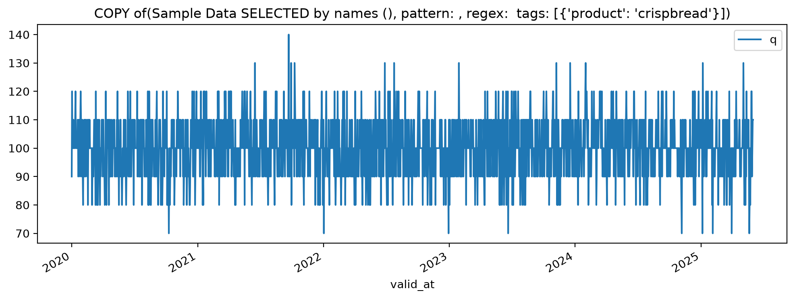
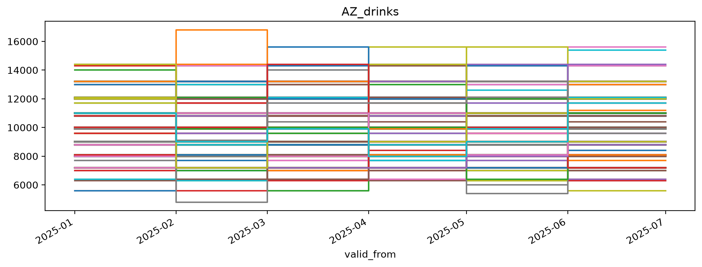

# Metadata fundamentals
<!---->
Scope
-----

This guide explains how metadata works in SSB Timeseries:

- key technical concepts:
  - repository -> dataset -> series
  - the type system
  - tags inheritance from `Dataset` to `Series` objects

Some topics will be covered in more depth in dedicated guides:

- [search and filtering](meta-search-and-filtering) with tags
- [tag maintenance](meta-tag-maintenance)
- consuming taxonomies
- calculations with metadata
<!---->
Prerequisites
-------------

``` {note}
The guide assumes that the SSB Timeseries library is installed and that a working configuration is active.
See [the quickstart guide](quickstart) for instructions to that.
```
<!---->
Technical metadata - the type system
------------------------------------

<!-- @output:Xref -->

SeriesTypes are defined by combinations of attributes that have technical implications for time series datasets.

Notable examples are Versioning and Temporality, but a few more may be added later.

- Versioning refers to how revisions of data are identified (named).
- Temporality describes the time dimensionality of each data point; notably duration or lack thereof.

```python {.marimo}
from ssb_timeseries.dataset import Dataset
from ssb_timeseries.types import SeriesType, Versioning, Temporality
```

```python {.marimo}
some_data = dataframe_like_data_from_file_or_query()
```

When creating a `Dataset` for the first time, a `name`, a `type` and some data are required.

Specifying a `repository` is optional.
If not specified, a default will be applied based on configurations.
Names are assumed to be unique identifiers:
The dataset name must be unique within the repository.
Series names must be unique within the dataset.

```python {.marimo}
sample_set = Dataset(
    name = 'Sample Data',
    data_type = SeriesType(Versioning.NONE, Temporality.AT),
    data = some_data,
)
sample_set.save()
```

```python {.marimo}
print(repr(sample_set))
```

<!-- @output:nWHF -->

<pre style="white-space: pre-wrap; overflow-wrap: break-word;">Dataset(name=&quot;Sample Data&quot;, repository=&quot;tutorials&quot;, data_type=SeriesType(Versioning.NONE,Temporality.AT), as_of_tz=None)
</pre>

These attributes are technically significant.
If any of them are changed, it changes *where* or *how* the data is stored, and how it may be used.

Dataset creation will apply a minimal amount of mandatory metadata as `Dataset.tags`.
The technical attributes are both technical `Dataset` properties and reflected in its `.tags`:

```python {.marimo}
sample_set.tags
```

<!-- @output:ZHCJ -->

<pre style="white-space: pre-wrap; overflow-wrap: break-word;">{&#x27;name&#x27;: &#x27;Sample Data&#x27;,
 &#x27;product group&#x27;: &#x27;essential&#x27;,
 &#x27;repository&#x27;: &#x27;tutorials&#x27;,
 &#x27;series&#x27;: {&#x27;p&#x27;: {&#x27;dataset&#x27;: &#x27;Sample Data&#x27;,
                  &#x27;name&#x27;: &#x27;p&#x27;,
                  &#x27;product&#x27;: &#x27;coffee&#x27;,
                  &#x27;product group&#x27;: &#x27;essential&#x27;,
                  &#x27;repository&#x27;: &#x27;tutorials&#x27;,
                  &#x27;temporality&#x27;: &#x27;AT&#x27;,
                  &#x27;variable&#x27;: &#x27;price&#x27;,
                  &#x27;versioning&#x27;: &#x27;NONE&#x27;},
            &#x27;q&#x27;: {&#x27;dataset&#x27;: &#x27;Sample Data&#x27;,
                  &#x27;name&#x27;: &#x27;q&#x27;,
                  &#x27;product&#x27;: &#x27;crispbread&#x27;,
                  &#x27;product group&#x27;: &#x27;essential&#x27;,
                  &#x27;repository&#x27;: &#x27;tutorials&#x27;,
                  &#x27;temporality&#x27;: &#x27;AT&#x27;,
                  &#x27;variable&#x27;: &#x27;price&#x27;,
                  &#x27;versioning&#x27;: &#x27;NONE&#x27;},
            &#x27;r&#x27;: {&#x27;dataset&#x27;: &#x27;Sample Data&#x27;,
                  &#x27;name&#x27;: &#x27;r&#x27;,
                  &#x27;product&#x27;: &#x27;brown cheese&#x27;,
                  &#x27;product group&#x27;: &#x27;essential&#x27;,
                  &#x27;repository&#x27;: &#x27;tutorials&#x27;,
                  &#x27;temporality&#x27;: &#x27;AT&#x27;,
                  &#x27;variable&#x27;: &#x27;price&#x27;,
                  &#x27;versioning&#x27;: &#x27;NONE&#x27;}},
 &#x27;temporality&#x27;: &#x27;AT&#x27;,
 &#x27;variable&#x27;: &#x27;price&#x27;,
 &#x27;versioning&#x27;: &#x27;NONE&#x27;}</pre>

Note how `Dataset.name` becomes `Series.dataset` in the tags, while the technical properties are inherited directly.
The datatype dimensions are reflected in both in `.versioning` and the single `valid_at` column in `.data`:

```python {.marimo}
sample_set.data
```

<!-- @output:qnkX -->

| valid_at | p | q | r |
| --- | --- | --- | --- |
| 2020-01-01 | 100.0 | 90.0 | 120.0 |
| 2020-01-02 | 100.0 | 120.0 | 110.0 |
| 2020-01-03 | 100.0 | 100.0 | 100.0 |
| 2020-01-04 | 120.0 | 100.0 | 100.0 |
| 2020-01-05 | 90.0 | 100.0 | 110.0 |
| ... | ... | ... | ... |
| 2025-05-28 | 100.0 | 120.0 | 120.0 |
| 2025-05-29 | 100.0 | 90.0 | 90.0 |
| 2025-05-30 | 110.0 | 100.0 | 80.0 |
| 2025-05-31 | 110.0 | 110.0 | 90.0 |
| 2025-06-01 | 90.0 | 110.0 | 90.0 |

To apply more than the minimal set of technical tags, we need to "tag" the dataset and series.

```python {.marimo}
sample_set.tag_dataset(tags={'variable': 'price','product group': 'essential'})

sample_set.tag_series('p',tags={'product': 'coffee'})
sample_set.tag_series('q',tags={'product': 'crispbread'})
sample_set.tag_series('r',tags={'product': 'brown cheese'})

sample_set.save()
sample_set.tags
```

<!-- @output:Vxnm -->

<pre style="white-space: pre-wrap; overflow-wrap: break-word;">{&#x27;name&#x27;: &#x27;Sample Data&#x27;,
 &#x27;product group&#x27;: &#x27;essential&#x27;,
 &#x27;repository&#x27;: &#x27;tutorials&#x27;,
 &#x27;series&#x27;: {&#x27;p&#x27;: {&#x27;dataset&#x27;: &#x27;Sample Data&#x27;,
                  &#x27;name&#x27;: &#x27;p&#x27;,
                  &#x27;product&#x27;: &#x27;coffee&#x27;,
                  &#x27;product group&#x27;: &#x27;essential&#x27;,
                  &#x27;repository&#x27;: &#x27;tutorials&#x27;,
                  &#x27;temporality&#x27;: &#x27;AT&#x27;,
                  &#x27;variable&#x27;: &#x27;price&#x27;,
                  &#x27;versioning&#x27;: &#x27;NONE&#x27;},
            &#x27;q&#x27;: {&#x27;dataset&#x27;: &#x27;Sample Data&#x27;,
                  &#x27;name&#x27;: &#x27;q&#x27;,
                  &#x27;product&#x27;: &#x27;crispbread&#x27;,
                  &#x27;product group&#x27;: &#x27;essential&#x27;,
                  &#x27;repository&#x27;: &#x27;tutorials&#x27;,
                  &#x27;temporality&#x27;: &#x27;AT&#x27;,
                  &#x27;variable&#x27;: &#x27;price&#x27;,
                  &#x27;versioning&#x27;: &#x27;NONE&#x27;},
            &#x27;r&#x27;: {&#x27;dataset&#x27;: &#x27;Sample Data&#x27;,
                  &#x27;name&#x27;: &#x27;r&#x27;,
                  &#x27;product&#x27;: &#x27;brown cheese&#x27;,
                  &#x27;product group&#x27;: &#x27;essential&#x27;,
                  &#x27;repository&#x27;: &#x27;tutorials&#x27;,
                  &#x27;temporality&#x27;: &#x27;AT&#x27;,
                  &#x27;variable&#x27;: &#x27;price&#x27;,
                  &#x27;versioning&#x27;: &#x27;NONE&#x27;}},
 &#x27;temporality&#x27;: &#x27;AT&#x27;,
 &#x27;variable&#x27;: &#x27;price&#x27;,
 &#x27;versioning&#x27;: &#x27;NONE&#x27;}</pre>

Initialising a variable for an existing `Dataset`, we retrieve the previously stored metadata.

```python {.marimo}
x = Dataset('Sample Data')
```

```python {.marimo}
x.tags
```

<!-- @output:ecfG -->

<pre style="white-space: pre-wrap; overflow-wrap: break-word;">{&#x27;name&#x27;: &#x27;Sample Data&#x27;,
 &#x27;product group&#x27;: &#x27;essential&#x27;,
 &#x27;repository&#x27;: &#x27;tutorials&#x27;,
 &#x27;series&#x27;: {&#x27;p&#x27;: {&#x27;dataset&#x27;: &#x27;Sample Data&#x27;,
                  &#x27;name&#x27;: &#x27;p&#x27;,
                  &#x27;product&#x27;: &#x27;coffee&#x27;,
                  &#x27;product group&#x27;: &#x27;essential&#x27;,
                  &#x27;repository&#x27;: &#x27;tutorials&#x27;,
                  &#x27;temporality&#x27;: &#x27;AT&#x27;,
                  &#x27;variable&#x27;: &#x27;price&#x27;,
                  &#x27;versioning&#x27;: &#x27;NONE&#x27;},
            &#x27;q&#x27;: {&#x27;dataset&#x27;: &#x27;Sample Data&#x27;,
                  &#x27;name&#x27;: &#x27;q&#x27;,
                  &#x27;product&#x27;: &#x27;crispbread&#x27;,
                  &#x27;product group&#x27;: &#x27;essential&#x27;,
                  &#x27;repository&#x27;: &#x27;tutorials&#x27;,
                  &#x27;temporality&#x27;: &#x27;AT&#x27;,
                  &#x27;variable&#x27;: &#x27;price&#x27;,
                  &#x27;versioning&#x27;: &#x27;NONE&#x27;},
            &#x27;r&#x27;: {&#x27;dataset&#x27;: &#x27;Sample Data&#x27;,
                  &#x27;name&#x27;: &#x27;r&#x27;,
                  &#x27;product&#x27;: &#x27;brown cheese&#x27;,
                  &#x27;product group&#x27;: &#x27;essential&#x27;,
                  &#x27;repository&#x27;: &#x27;tutorials&#x27;,
                  &#x27;temporality&#x27;: &#x27;AT&#x27;,
                  &#x27;variable&#x27;: &#x27;price&#x27;,
                  &#x27;versioning&#x27;: &#x27;NONE&#x27;}},
 &#x27;temporality&#x27;: &#x27;AT&#x27;,
 &#x27;variable&#x27;: &#x27;price&#x27;,
 &#x27;versioning&#x27;: &#x27;NONE&#x27;}</pre>

## Selecting series

Series can be selected from the dataset by name, regex patterns or tags.

```python {.marimo}
x['q','p'].plot()
```

<!-- @output:ZBYS -->


And tags as well:

```python {.marimo}
x[{'product': 'crispbread'}].plot()
```

<!-- @output:nHfw -->



With the simple "XYZ" dataset this is not so exciting.
However, selection by tags becomes very powerful for bigger datasets.

```python {.marimo}
bigger_data = mock_interval_data_from_file_or_query(start='2025-01-01', end='2025-06-01')
```

```python {.marimo}
az = Dataset(
    name = 'AZ_drinks',
    data_type = SeriesType('NONE', 'FROM_TO'),
    data = bigger_data,
    attributes=['store','variable','product', 'region'],
)
az.save()
```

<!-- @output:aqbW -->

The `az` set has 2080 series.

<!-- @output:TRpd -->

<pre style="white-space: pre-wrap; overflow-wrap: break-word;">{&#x27;name&#x27;: &#x27;AZ_drinks&#x27;,
 &#x27;repository&#x27;: &#x27;tutorials&#x27;,
 &#x27;series&#x27;: {&#x27;a_price_beer_E&#x27;: {&#x27;dataset&#x27;: &#x27;AZ_drinks&#x27;,
                               &#x27;name&#x27;: &#x27;a_price_beer_E&#x27;,
                               &#x27;product&#x27;: &#x27;beer&#x27;,
                               &#x27;region&#x27;: &#x27;E&#x27;,
                               &#x27;repository&#x27;: &#x27;tutorials&#x27;,
                               &#x27;store&#x27;: &#x27;a&#x27;,
                               &#x27;temporality&#x27;: &#x27;FROM_TO&#x27;,
                               &#x27;variable&#x27;: &#x27;price&#x27;,
                               &#x27;versioning&#x27;: &#x27;NONE&#x27;},
            &#x27;a_price_beer_N&#x27;: {&#x27;dataset&#x27;: &#x27;AZ_drinks&#x27;,
                               &#x27;name&#x27;: &#x27;a_price_beer_N&#x27;,
                               &#x27;product&#x27;: &#x27;beer&#x27;,
                               &#x27;region&#x27;: &#x27;N&#x27;,
                               &#x27;repository&#x27;: &#x27;tutorials&#x27;,
                               &#x27;store&#x27;: &#x27;a&#x27;,
                               &#x27;temporality&#x27;: &#x27;FROM_TO&#x27;,
                               &#x27;variable&#x27;: &#x27;price&#x27;,
                               &#x27;versioning&#x27;: &#x27;NONE&#x27;},
            &#x27;a_price_beer_NE&#x27;: {&#x27;dataset&#x27;: &#x27;AZ_drinks&#x27;,
                                &#x27;name&#x27;: &#x27;a_price_beer_NE&#x27;,
                                &#x27;product&#x27;: &#x27;beer&#x27;,
                                &#x27;region&#x27;: &#x27;NE&#x27;,
                                &#x27;repository&#x27;: &#x27;tutorials&#x27;,
                                &#x27;store&#x27;: &#x27;a&#x27;,
                                &#x27;temporality&#x27;: &#x27;FROM_TO&#x27;,
                                &#x27;variable&#x27;: &#x27;price&#x27;,
                                &#x27;versioning&#x27;: &#x27;NONE&#x27;},
            &#x27;a_price_beer_NW&#x27;: {&#x27;dataset&#x27;: &#x27;AZ_drinks&#x27;,
                                &#x27;name&#x27;: &#x27;a_price_beer_NW&#x27;,
                                &#x27;product&#x27;: &#x27;beer&#x27;,
                                &#x27;region&#x27;: &#x27;NW&#x27;,
                                &#x27;repository&#x27;: &#x27;tutorials&#x27;,
                                &#x27;store&#x27;: &#x27;a&#x27;,
                                &#x27;temporality&#x27;: &#x27;FROM_TO&#x27;,
                                &#x27;variable&#x27;: &#x27;price&#x27;,
                                &#x27;versioning&#x27;: &#x27;NONE&#x27;},
            &#x27;a_price_beer_S&#x27;: {&#x27;dataset&#x27;: &#x27;AZ_drinks&#x27;,
                               &#x27;name&#x27;: &#x27;a_price_beer_S&#x27;,
                               &#x27;product&#x27;: &#x27;beer&#x27;,
                               &#x27;region&#x27;: &#x27;S&#x27;,
                               &#x27;repository&#x27;: &#x27;tutorials&#x27;,
                               &#x27;store&#x27;: &#x27;a&#x27;,
                               &#x27;temporality&#x27;: &#x27;FROM_TO&#x27;,
                               &#x27;variable&#x27;: &#x27;price&#x27;,
                               &#x27;versioning&#x27;: &#x27;NONE&#x27;},
            &#x27;a_price_beer_SE&#x27;: {&#x27;dataset&#x27;: &#x27;AZ_drinks&#x27;,
                                &#x27;name&#x27;: &#x27;a_price_beer_SE&#x27;,
                                &#x27;product&#x27;: &#x27;beer&#x27;,
                                &#x27;region&#x27;: &#x27;SE&#x27;,
                                &#x27;repository&#x27;: &#x27;tutorials&#x27;,
                                &#x27;store&#x27;: &#x27;a&#x27;,
                                &#x27;temporality&#x27;: &#x27;FROM_TO&#x27;,
                                &#x27;variable&#x27;: &#x27;price&#x27;,
                                &#x27;versioning&#x27;: &#x27;NONE&#x27;},
            &#x27;a_price_beer_SW&#x27;: {&#x27;dataset&#x27;: &#x27;AZ_drinks&#x27;,
                                &#x27;name&#x27;: &#x27;a_price_beer_SW&#x27;,
                                &#x27;product&#x27;: &#x27;beer&#x27;,
                                &#x27;region&#x27;: &#x27;SW&#x27;,
                                &#x27;repository&#x27;: &#x27;tutorials&#x27;,
                                &#x27;store&#x27;: &#x27;a&#x27;,
                                &#x27;temporality&#x27;: &#x27;FROM_TO&#x27;,
                                &#x27;variable&#x27;: &#x27;price&#x27;,
                                &#x27;versioning&#x27;: &#x27;NONE&#x27;},
            &#x27;a_price_beer_W&#x27;: {&#x27;dataset&#x27;: &#x27;AZ_drinks&#x27;,
                               &#x27;name&#x27;: &#x27;a_price_beer_W&#x27;,
                               &#x27;product&#x27;: &#x27;beer&#x27;,
                               &#x27;region&#x27;: &#x27;W&#x27;,
                               &#x27;repository&#x27;: &#x27;tutorials&#x27;,
                               &#x27;store&#x27;: &#x27;a&#x27;,
                               &#x27;temporality&#x27;: &#x27;FROM_TO&#x27;,
                               &#x27;variable&#x27;: &#x27;price&#x27;,
                               &#x27;versioning&#x27;: &#x27;NONE&#x27;},
            &#x27;a_price_coffee_E&#x27;: {&#x27;dataset&#x27;: &#x27;AZ_drinks&#x27;,
                                 &#x27;name&#x27;: &#x27;a_price_coffee_E&#x27;,
                                 &#x27;product&#x27;: &#x27;coffee&#x27;,
                                 &#x27;region&#x27;: &#x27;E&#x27;,
                                 &#x27;repository&#x27;: &#x27;tutorials&#x27;,
                                 &#x27;store&#x27;: &#x27;a&#x27;,
                                 &#x27;temporality&#x27;: &#x27;FROM_TO&#x27;,
                                 &#x27;variable&#x27;: &#x27;price&#x27;,
                                 &#x27;versioning&#x27;: &#x27;NONE&#x27;},
            &#x27;a_price_coffee_N&#x27;: {&#x27;dataset&#x27;: &#x27;AZ_drinks&#x27;,
                                 &#x27;name&#x27;: &#x27;a_price_coffee_N&#x27;,
                                 &#x27;product&#x27;: &#x27;coffee&#x27;,
                                 &#x27;region&#x27;: &#x27;N&#x27;,
                                 &#x27;repository&#x27;: &#x27;tutorials&#x27;,
                                 &#x27;store&#x27;: &#x27;a&#x27;,
                                 &#x27;temporality&#x27;: &#x27;FROM_TO&#x27;,
                                 &#x27;variable&#x27;: &#x27;price&#x27;,
                                 &#x27;versioning&#x27;: &#x27;NONE&#x27;},
            &#x27;a_price_coffee_NE&#x27;: {&#x27;dataset&#x27;: &#x27;AZ_drinks&#x27;,
                                  &#x27;name&#x27;: &#x27;a_price_coffee_NE&#x27;,
                                  &#x27;product&#x27;: &#x27;coffee&#x27;,
                                  &#x27;region&#x27;: &#x27;NE&#x27;,
                                  &#x27;repository&#x27;: &#x27;tutorials&#x27;,
                                  &#x27;store&#x27;: &#x27;a&#x27;,
                                  &#x27;temporality&#x27;: &#x27;FROM_TO&#x27;,
                                  &#x27;variable&#x27;: &#x27;price&#x27;,
                                  &#x27;versioning&#x27;: &#x27;NONE&#x27;},
            &#x27;a_price_coffee_NW&#x27;: {&#x27;dataset&#x27;: &#x27;AZ_drinks&#x27;,
                                  &#x27;name&#x27;: &#x27;a_price_coffee_NW&#x27;,
                                  &#x27;product&#x27;: &#x27;coffee&#x27;,
                                  &#x27;region&#x27;: &#x27;NW&#x27;,
                                  &#x27;repository&#x27;: &#x27;tutorials&#x27;,
                                  &#x27;store&#x27;: &#x27;a&#x27;,
                                  &#x27;temporality&#x27;: &#x27;FROM_TO&#x27;,
                                  &#x27;variable&#x27;: &#x27;price&#x27;,
                                  &#x27;versioning&#x27;: &#x27;NONE&#x27;},
            &#x27;a_price_coffee_S&#x27;: {&#x27;dataset&#x27;: &#x27;AZ_drinks&#x27;,
                                 &#x27;name&#x27;: &#x27;a_price_coffee_S&#x27;,
                                 &#x27;product&#x27;: &#x27;coffee&#x27;,
                                 &#x27;region&#x27;: &#x27;S&#x27;,
                                 &#x27;repository&#x27;: &#x27;tutorials&#x27;,
                                 &#x27;store&#x27;: &#x27;a&#x27;,
                                 &#x27;temporality&#x27;: &#x27;FROM_TO&#x27;,
                                 &#x27;variable&#x27;: &#x27;price&#x27;,
                                 &#x27;versioning&#x27;: &#x27;NONE&#x27;},
            &#x27;a_price_coffee_SE&#x27;: {&#x27;dataset&#x27;: &#x27;AZ_drinks&#x27;,
                                  &#x27;name&#x27;: &#x27;a_price_coffee_SE&#x27;,
                                  &#x27;product&#x27;: &#x27;coffee&#x27;,
                                  &#x27;region&#x27;: &#x27;SE&#x27;,
                                  &#x27;repository&#x27;: &#x27;tutorials&#x27;,
                                  &#x27;store&#x27;: &#x27;a&#x27;,
                                  &#x27;temporality&#x27;: &#x27;FROM_TO&#x27;,
                                  &#x27;variable&#x27;: &#x27;price&#x27;,
                                  &#x27;versioning&#x27;: &#x27;NONE&#x27;},
            &#x27;a_price_coffee_SW&#x27;: {&#x27;dataset&#x27;: &#x27;AZ_drinks&#x27;,
                                  &#x27;name&#x27;: &#x27;a_price_coffee_SW&#x27;,
                                  &#x27;product&#x27;: &#x27;coffee&#x27;,
                                  &#x27;region&#x27;: &#x27;SW&#x27;,
                                  &#x27;repository&#x27;: &#x27;tutorials&#x27;,
                                  &#x27;store&#x27;: &#x27;a&#x27;,
                                  &#x27;temporality&#x27;: &#x27;FROM_TO&#x27;,
                                  &#x27;variable&#x27;: &#x27;price&#x27;,
                                  &#x27;versioning&#x27;: &#x27;NONE&#x27;},
            &#x27;a_price_coffee_W&#x27;: {&#x27;dataset&#x27;: &#x27;AZ_drinks&#x27;,
                                 &#x27;name&#x27;: &#x27;a_price_coffee_W&#x27;,
                                 &#x27;product&#x27;: &#x27;coffee&#x27;,
                                 &#x27;region&#x27;: &#x27;W&#x27;,
                                 &#x27;repository&#x27;: &#x27;tutorials&#x27;,
                                 &#x27;store&#x27;: &#x27;a&#x27;,
                                 &#x27;temporality&#x27;: &#x27;FROM_TO&#x27;,
                                 &#x27;variable&#x27;: &#x27;price&#x27;,
                                 &#x27;versioning&#x27;: &#x27;NONE&#x27;},
            &#x27;a_price_soft-drinks_E&#x27;: {&#x27;dataset&#x27;: &#x27;AZ_drinks&#x27;,
                                      &#x27;name&#x27;: &#x27;a_price_soft-drinks_E&#x27;,
                                      &#x27;product&#x27;: &#x27;soft-drinks&#x27;,
                                      &#x27;region&#x27;: &#x27;E&#x27;,
                                      &#x27;repository&#x27;: &#x27;tutorials&#x27;,
                                      &#x27;store&#x27;: &#x27;a&#x27;,
                                      &#x27;temporality&#x27;: &#x27;FROM_TO&#x27;,
                                      &#x27;variable&#x27;: &#x27;price&#x27;,
                                      &#x27;versioning&#x27;: &#x27;NONE&#x27;},
            &#x27;a_price_soft-drinks_N&#x27;: {&#x27;dataset&#x27;: &#x27;AZ_drinks&#x27;,
                                      &#x27;name&#x27;: &#x27;a_price_soft-drinks_N&#x27;,
                                      &#x27;product&#x27;: &#x27;soft-drinks&#x27;,
                                      &#x27;region&#x27;: &#x27;N&#x27;,
                                      &#x27;repository&#x27;: &#x27;tutorials&#x27;,
                                      &#x27;store&#x27;: &#x27;a&#x27;,
                                      &#x27;temporality&#x27;: &#x27;FROM_TO&#x27;,
                                      &#x27;variable&#x27;: &#x27;price&#x27;,
                                      &#x27;versioning&#x27;: &#x27;NONE&#x27;},
            &#x27;a_price_soft-drinks_NE&#x27;: {&#x27;dataset&#x27;: &#x27;AZ_drinks&#x27;,
                                       &#x27;name&#x27;: &#x27;a_price_soft-drinks_NE&#x27;,
                                       &#x27;product&#x27;: &#x27;soft-drinks&#x27;,
                                       &#x27;region&#x27;: &#x27;NE&#x27;,
                                       &#x27;repository&#x27;: &#x27;tutorials&#x27;,
                                       &#x27;store&#x27;: &#x27;a&#x27;,
                                       &#x27;temporality&#x27;: &#x27;FROM_TO&#x27;,
                                       &#x27;variable&#x27;: &#x27;price&#x27;,
                                       &#x27;versioning&#x27;: &#x27;NONE&#x27;},
            &#x27;a_price_soft-drinks_NW&#x27;: {&#x27;dataset&#x27;: &#x27;AZ_drinks&#x27;,
                                       &#x27;name&#x27;: &#x27;a_price_soft-drinks_NW&#x27;,
                                       &#x27;product&#x27;: &#x27;soft-drinks&#x27;,
                                       &#x27;region&#x27;: &#x27;NW&#x27;,
                                       &#x27;repository&#x27;: &#x27;tutorials&#x27;,
                                       &#x27;store&#x27;: &#x27;a&#x27;,
                                       &#x27;temporality&#x27;: &#x27;FROM_TO&#x27;,
                                       &#x27;variable&#x27;: &#x27;price&#x27;,
                                       &#x27;versioning&#x27;: &#x27;NONE&#x27;},
            &#x27;a_price_soft-drinks_S&#x27;: {&#x27;dataset&#x27;: &#x27;AZ_drinks&#x27;,
                                      &#x27;name&#x27;: &#x27;a_price_soft-drinks_S&#x27;,
                                      &#x27;product&#x27;: &#x27;soft-drinks&#x27;,
                                      &#x27;region&#x27;: &#x27;S&#x27;,
                                      &#x27;repository&#x27;: &#x27;tutorials&#x27;,
                                      &#x27;store&#x27;: &#x27;a&#x27;,
                                      &#x27;temporality&#x27;: &#x27;FROM_TO&#x27;,
                                      &#x27;variable&#x27;: &#x27;price&#x27;,
                                      &#x27;versioning&#x27;: &#x27;NONE&#x27;},
            &#x27;a_price_soft-drinks_SE&#x27;: {&#x27;dataset&#x27;: &#x27;AZ_drinks&#x27;,
                                       &#x27;name&#x27;: &#x27;a_price_soft-drinks_SE&#x27;,
                                       &#x27;product&#x27;: &#x27;soft-drinks&#x27;,
                                       &#x27;region&#x27;: &#x27;SE&#x27;,
                                       &#x27;repository&#x27;: &#x27;tutorials&#x27;,
                                       &#x27;store&#x27;: &#x27;a&#x27;,
                                       &#x27;temporality&#x27;: &#x27;FROM_TO&#x27;,
                                       &#x27;variable&#x27;: &#x27;price&#x27;,
                                       &#x27;versioning&#x27;: &#x27;NONE&#x27;},
            &#x27;a_price_soft-drinks_SW&#x27;: {&#x27;dataset&#x27;: &#x27;AZ_drinks&#x27;,
                                       &#x27;name&#x27;: &#x27;a_price_soft-drinks_SW&#x27;,
                                       &#x27;product&#x27;: &#x27;soft-drinks&#x27;,
                                       &#x27;region&#x27;: &#x27;SW&#x27;,
                                       &#x27;repository&#x27;: &#x27;tutorials&#x27;,
                                       &#x27;store&#x27;: &#x27;a&#x27;,
                                       &#x27;temporality&#x27;: &#x27;FROM_TO&#x27;,
                                       &#x27;variable&#x27;: &#x27;price&#x27;,
                                       &#x27;versioning&#x27;: &#x27;NONE&#x27;},
            &#x27;a_price_soft-drinks_W&#x27;: {&#x27;dataset&#x27;: &#x27;AZ_drinks&#x27;,
                                      &#x27;name&#x27;: &#x27;a_price_soft-drinks_W&#x27;,
                                      &#x27;product&#x27;: &#x27;soft-drinks&#x27;,
                                      &#x27;region&#x27;: &#x27;W&#x27;,
                                      &#x27;repository&#x27;: &#x27;tutorials&#x27;,
                                      &#x27;store&#x27;: &#x27;a&#x27;,
                                      &#x27;temporality&#x27;: &#x27;FROM_TO&#x27;,
                                      &#x27;variable&#x27;: &#x27;price&#x27;,
                                      &#x27;versioning&#x27;: &#x27;NONE&#x27;},
            &#x27;a_price_tea_E&#x27;: {&#x27;dataset&#x27;: &#x27;AZ_drinks&#x27;,
                              &#x27;name&#x27;: &#x27;a_price_tea_E&#x27;,
                              &#x27;product&#x27;: &#x27;tea&#x27;,
                              &#x27;region&#x27;: &#x27;E&#x27;,
                              &#x27;repository&#x27;: &#x27;tutorials&#x27;,
                              &#x27;store&#x27;: &#x27;a&#x27;,
                              &#x27;temporality&#x27;: &#x27;FROM_TO&#x27;,
                              &#x27;variable&#x27;: &#x27;price&#x27;,
                              &#x27;versioning&#x27;: &#x27;NONE&#x27;},
            &#x27;a_price_tea_N&#x27;: {&#x27;dataset&#x27;: &#x27;AZ_drinks&#x27;,
                              &#x27;name&#x27;: &#x27;a_price_tea_N&#x27;,
                              &#x27;product&#x27;: &#x27;tea&#x27;,
                              &#x27;region&#x27;: &#x27;N&#x27;,
                              &#x27;repository&#x27;: &#x27;tutorials&#x27;,
                              &#x27;store&#x27;: &#x27;a&#x27;,
                              &#x27;temporality&#x27;: &#x27;FROM_TO&#x27;,
                              &#x27;variable&#x27;: &#x27;price&#x27;,
                              &#x27;versioning&#x27;: &#x27;NONE&#x27;},
            &#x27;a_price_tea_NE&#x27;: {&#x27;dataset&#x27;: &#x27;AZ_drinks&#x27;,
                               &#x27;name&#x27;: &#x27;a_price_tea_NE&#x27;,
                               &#x27;product&#x27;: &#x27;tea&#x27;,
                               &#x27;region&#x27;: &#x27;NE&#x27;,
                               &#x27;repository&#x27;: &#x27;tutorials&#x27;,
                               &#x27;store&#x27;: &#x27;a&#x27;,
                               &#x27;temporality&#x27;: &#x27;FROM_TO&#x27;,
                               &#x27;variable&#x27;: &#x27;price&#x27;,
                               &#x27;versioning&#x27;: &#x27;NONE&#x27;},
            &#x27;a_price_tea_NW&#x27;: {&#x27;dataset&#x27;: &#x27;AZ_drinks&#x27;,
                               &#x27;name&#x27;: &#x27;a_price_tea_NW&#x27;,
                               &#x27;product&#x27;: &#x27;tea&#x27;,
                               &#x27;region&#x27;: &#x27;NW&#x27;,
                               &#x27;repository&#x27;: &#x27;tutorials&#x27;,
                               &#x27;store&#x27;: &#x27;a&#x27;,
                               &#x27;temporality&#x27;: &#x27;FROM_TO&#x27;,
                               &#x27;variable&#x27;: &#x27;price&#x27;,
                               &#x27;versioning&#x27;: &#x27;NONE&#x27;},
            &#x27;a_price_tea_S&#x27;: {&#x27;dataset&#x27;: &#x27;AZ_drinks&#x27;,
                              &#x27;name&#x27;: &#x27;a_price_tea_S&#x27;,
                              &#x27;product&#x27;: &#x27;tea&#x27;,
                              &#x27;region&#x27;: &#x27;S&#x27;,
                              &#x27;repository&#x27;: &#x27;tutorials&#x27;,
                              &#x27;store&#x27;: &#x27;a&#x27;,
                              &#x27;temporality&#x27;: &#x27;FROM_TO&#x27;,
                              &#x27;variable&#x27;: &#x27;price&#x27;,
                              &#x27;versioning&#x27;: &#x27;NONE&#x27;},
            &#x27;a_price_tea_SE&#x27;: {&#x27;dataset&#x27;: &#x27;AZ_drinks&#x27;,
                               &#x27;name&#x27;: &#x27;a_price_tea_SE&#x27;,
                               &#x27;product&#x27;: &#x27;tea&#x27;,
                               &#x27;region&#x27;: &#x27;SE&#x27;,
                               &#x27;repository&#x27;: &#x27;tutorials&#x27;,
                               &#x27;store&#x27;: &#x27;a&#x27;,
                               &#x27;temporality&#x27;: &#x27;FROM_TO&#x27;,
                               &#x27;variable&#x27;: &#x27;price&#x27;,
                               &#x27;versioning&#x27;: &#x27;NONE&#x27;},
            &#x27;a_price_tea_SW&#x27;: {&#x27;dataset&#x27;: &#x27;AZ_drinks&#x27;,
                               &#x27;name&#x27;: &#x27;a_price_tea_SW&#x27;,
                               &#x27;product&#x27;: &#x27;tea&#x27;,
                               &#x27;region&#x27;: &#x27;SW&#x27;,
                               &#x27;repository&#x27;: &#x27;tutorials&#x27;,
                               &#x27;store&#x27;: &#x27;a&#x27;,
                               &#x27;temporality&#x27;: &#x27;FROM_TO&#x27;,
                               &#x27;variable&#x27;: &#x27;price&#x27;,
                               &#x27;versioning&#x27;: &#x27;NONE&#x27;},
            &#x27;a_price_tea_W&#x27;: {&#x27;dataset&#x27;: &#x27;AZ_drinks&#x27;,
                              &#x27;name&#x27;: &#x27;a_price_tea_W&#x27;,
                              &#x27;product&#x27;: &#x27;tea&#x27;,
                              &#x27;region&#x27;: &#x27;W&#x27;,
                              &#x27;repository&#x27;: &#x27;tutorials&#x27;,
                              &#x27;store&#x27;: &#x27;a&#x27;,
                              &#x27;temporality&#x27;: &#x27;FROM_TO&#x27;,
                              &#x27;variable&#x27;: &#x27;price&#x27;,
                              &#x27;versioning&#x27;: &#x27;NONE&#x27;},
            &#x27;a_price_wine_E&#x27;: {&#x27;dataset&#x27;: &#x27;AZ_drinks&#x27;,
                               &#x27;name&#x27;: &#x27;a_price_wine_E&#x27;,
                               &#x27;product&#x27;: &#x27;wine&#x27;,
                               &#x27;region&#x27;: &#x27;E&#x27;,
                               &#x27;repository&#x27;: &#x27;tutorials&#x27;,
                               &#x27;store&#x27;: &#x27;a&#x27;,
                               &#x27;temporality&#x27;: &#x27;FROM_TO&#x27;,
                               &#x27;variable&#x27;: &#x27;price&#x27;,
                               &#x27;versioning&#x27;: &#x27;NONE&#x27;},
            &#x27;a_price_wine_N&#x27;: {&#x27;dataset&#x27;: &#x27;AZ_drinks&#x27;,
                               &#x27;name&#x27;: &#x27;a_price_wine_N&#x27;,
                               &#x27;product&#x27;: &#x27;wine&#x27;,
                               &#x27;region&#x27;: &#x27;N&#x27;,
                               &#x27;repository&#x27;: &#x27;tutorials&#x27;,
                               &#x27;store&#x27;: &#x27;a&#x27;,
                               &#x27;temporality&#x27;: &#x27;FROM_TO&#x27;,
                               &#x27;variable&#x27;: &#x27;price&#x27;,
                               &#x27;versioning&#x27;: &#x27;NONE&#x27;},
            &#x27;a_price_wine_NE&#x27;: {&#x27;dataset&#x27;: &#x27;AZ_drinks&#x27;,
                                &#x27;name&#x27;: &#x27;a_price_wine_NE&#x27;,
                                &#x27;product&#x27;: &#x27;wine&#x27;,
                                &#x27;region&#x27;: &#x27;NE&#x27;,
                                &#x27;repository&#x27;: &#x27;tutorials&#x27;,
                                &#x27;store&#x27;: &#x27;a&#x27;,
                                &#x27;temporality&#x27;: &#x27;FROM_TO&#x27;,
                                &#x27;variable&#x27;: &#x27;price&#x27;,
                                &#x27;versioning&#x27;: &#x27;NONE&#x27;},
            &#x27;a_price_wine_NW&#x27;: {&#x27;dataset&#x27;: &#x27;AZ_drinks&#x27;,
                                &#x27;name&#x27;: &#x27;a_price_wine_NW&#x27;,
                                &#x27;product&#x27;: &#x27;wine&#x27;,
                                &#x27;region&#x27;: &#x27;NW&#x27;,
                                &#x27;repository&#x27;: &#x27;tutorials&#x27;,
                                &#x27;store&#x27;: &#x27;a&#x27;,
                                &#x27;temporality&#x27;: &#x27;FROM_TO&#x27;,
                                &#x27;variable&#x27;: &#x27;price&#x27;,
                                &#x27;versioning&#x27;: &#x27;NONE&#x27;},
            &#x27;a_price_wine_S&#x27;: {&#x27;dataset&#x27;: &#x27;AZ_drinks&#x27;,
                               &#x27;name&#x27;: &#x27;a_price_wine_S&#x27;,
                               &#x27;product&#x27;: &#x27;wine&#x27;,
                               &#x27;region&#x27;: &#x27;S&#x27;,
                               &#x27;repository&#x27;: &#x27;tutorials&#x27;,
                               &#x27;store&#x27;: &#x27;a&#x27;,
                               &#x27;temporality&#x27;: &#x27;FROM_TO&#x27;,
                               &#x27;variable&#x27;: &#x27;price&#x27;,
                               &#x27;versioning&#x27;: &#x27;NONE&#x27;},
            &#x27;a_price_wine_SE&#x27;: {&#x27;dataset&#x27;: &#x27;AZ_drinks&#x27;,
                                &#x27;name&#x27;: &#x27;a_price_wine_SE&#x27;,
                                &#x27;product&#x27;: &#x27;wine&#x27;,
                                &#x27;region&#x27;: &#x27;SE&#x27;,
                                &#x27;repository&#x27;: &#x27;tutorials&#x27;,
                                &#x27;store&#x27;: &#x27;a&#x27;,
                                &#x27;temporality&#x27;: &#x27;FROM_TO&#x27;,
                                &#x27;variable&#x27;: &#x27;price&#x27;,
                                &#x27;versioning&#x27;: &#x27;NONE&#x27;},
            &#x27;a_price_wine_SW&#x27;: {&#x27;dataset&#x27;: &#x27;AZ_drinks&#x27;,
                                &#x27;name&#x27;: &#x27;a_price_wine_SW&#x27;,
                                &#x27;product&#x27;: &#x27;wine&#x27;,
                                &#x27;region&#x27;: &#x27;SW&#x27;,
                                &#x27;repository&#x27;: &#x27;tutorials&#x27;,
                                &#x27;store&#x27;: &#x27;a&#x27;,
                                &#x27;temporality&#x27;: &#x27;FROM_TO&#x27;,
                                &#x27;variable&#x27;: &#x27;price&#x27;,
                                &#x27;versioning&#x27;: &#x27;NONE&#x27;},
            &#x27;a_price_wine_W&#x27;: {&#x27;dataset&#x27;: &#x27;AZ_drinks&#x27;,
                               &#x27;name&#x27;: &#x27;a_price_wine_W&#x27;,
                               &#x27;product&#x27;: &#x27;wine&#x27;,
                               &#x27;region&#x27;: &#x27;W&#x27;,
                               &#x27;repository&#x27;: &#x27;tutorials&#x27;,
                               &#x27;store&#x27;: &#x27;a&#x27;,
                               &#x27;temporality&#x27;: &#x27;FROM_TO&#x27;,
                               &#x27;variable&#x27;: &#x27;price&#x27;,
                               &#x27;versioning&#x27;: &#x27;NONE&#x27;},
            &#x27;a_volume_beer_E&#x27;: {&#x27;dataset&#x27;: &#x27;AZ_drinks&#x27;,
                                &#x27;name&#x27;: &#x27;a_volume_beer_E&#x27;,
                                &#x27;product&#x27;: &#x27;beer&#x27;,
                                &#x27;region&#x27;: &#x27;E&#x27;,
                                &#x27;repository&#x27;: &#x27;tutorials&#x27;,
                                &#x27;store&#x27;: &#x27;a&#x27;,
                                &#x27;temporality&#x27;: &#x27;FROM_TO&#x27;,
                                &#x27;variable&#x27;: &#x27;volume&#x27;,
                                &#x27;versioning&#x27;: &#x27;NONE&#x27;},
            &#x27;a_volume_beer_N&#x27;: {&#x27;dataset&#x27;: &#x27;AZ_drinks&#x27;,
                                &#x27;name&#x27;: &#x27;a_volume_beer_N&#x27;,
                                &#x27;product&#x27;: &#x27;beer&#x27;,
                                &#x27;region&#x27;: &#x27;N&#x27;,
                                &#x27;repository&#x27;: &#x27;tutorials&#x27;,
                                &#x27;store&#x27;: &#x27;a&#x27;,
                                &#x27;temporality&#x27;: &#x27;FROM_TO&#x27;,
                                &#x27;variable&#x27;: &#x27;volume&#x27;,
                                &#x27;versioning&#x27;: &#x27;NONE&#x27;},
            &#x27;a_volume_beer_NE&#x27;: {&#x27;dataset&#x27;: &#x27;AZ_drinks&#x27;,
                                 &#x27;name&#x27;: &#x27;a_volume_beer_NE&#x27;,
                                 &#x27;product&#x27;: &#x27;beer&#x27;,
                                 &#x27;region&#x27;: &#x27;NE&#x27;,
                                 &#x27;repository&#x27;: &#x27;tutorials&#x27;,
                                 &#x27;store&#x27;: &#x27;a&#x27;,
                                 &#x27;temporality&#x27;: &#x27;FROM_TO&#x27;,
                                 &#x27;variable&#x27;: &#x27;volume&#x27;,
                                 &#x27;versioning&#x27;: &#x27;NONE&#x27;},
            &#x27;a_volume_beer_NW&#x27;: {&#x27;dataset&#x27;: &#x27;AZ_drinks&#x27;,
                                 &#x27;name&#x27;: &#x27;a_volume_beer_NW&#x27;,
                                 &#x27;product&#x27;: &#x27;beer&#x27;,
                                 &#x27;region&#x27;: &#x27;NW&#x27;,
                                 &#x27;repository&#x27;: &#x27;tutorials&#x27;,
                                 &#x27;store&#x27;: &#x27;a&#x27;,
                                 &#x27;temporality&#x27;: &#x27;FROM_TO&#x27;,
                                 &#x27;variable&#x27;: &#x27;volume&#x27;,
                                 &#x27;versioning&#x27;: &#x27;NONE&#x27;},
            &#x27;a_volume_beer_S&#x27;: {&#x27;dataset&#x27;: &#x27;AZ_drinks&#x27;,
                                &#x27;name&#x27;: &#x27;a_volume_beer_S&#x27;,
                                &#x27;product&#x27;: &#x27;beer&#x27;,
                                &#x27;region&#x27;: &#x27;S&#x27;,
                                &#x27;repository&#x27;: &#x27;tutorials&#x27;,
                                &#x27;store&#x27;: &#x27;a&#x27;,
                                &#x27;temporality&#x27;: &#x27;FROM_TO&#x27;,
                                &#x27;variable&#x27;: &#x27;volume&#x27;,
                                &#x27;versioning&#x27;: &#x27;NONE&#x27;},
            &#x27;a_volume_beer_SE&#x27;: {&#x27;dataset&#x27;: &#x27;AZ_drinks&#x27;,
                                 &#x27;name&#x27;: &#x27;a_volume_beer_SE&#x27;,
                                 &#x27;product&#x27;: &#x27;beer&#x27;,
                                 &#x27;region&#x27;: &#x27;SE&#x27;,
                                 &#x27;repository&#x27;: &#x27;tutorials&#x27;,
                                 &#x27;store&#x27;: &#x27;a&#x27;,
                                 &#x27;temporality&#x27;: &#x27;FROM_TO&#x27;,
                                 &#x27;variable&#x27;: &#x27;volume&#x27;,
                                 &#x27;versioning&#x27;: &#x27;NONE&#x27;},
            &#x27;a_volume_beer_SW&#x27;: {&#x27;dataset&#x27;: &#x27;AZ_drinks&#x27;,
                                 &#x27;name&#x27;: &#x27;a_volume_beer_SW&#x27;,
                                 &#x27;product&#x27;: &#x27;beer&#x27;,
                                 &#x27;region&#x27;: &#x27;SW&#x27;,
                                 &#x27;repository&#x27;: &#x27;tutorials&#x27;,
                                 &#x27;store&#x27;: &#x27;a&#x27;,
                                 &#x27;temporality&#x27;: &#x27;FROM_TO&#x27;,
                                 &#x27;variable&#x27;: &#x27;volume&#x27;,
                                 &#x27;versioning&#x27;: &#x27;NONE&#x27;},
            &#x27;a_volume_beer_W&#x27;: {&#x27;dataset&#x27;: &#x27;AZ_drinks&#x27;,
                                &#x27;name&#x27;: &#x27;a_volume_beer_W&#x27;,
                                &#x27;product&#x27;: &#x27;beer&#x27;,
                                &#x27;region&#x27;: &#x27;W&#x27;,
                                &#x27;repository&#x27;: &#x27;tutorials&#x27;,
                                &#x27;store&#x27;: &#x27;a&#x27;,
                                &#x27;temporality&#x27;: &#x27;FROM_TO&#x27;,
                                &#x27;variable&#x27;: &#x27;volume&#x27;,
                                &#x27;versioning&#x27;: &#x27;NONE&#x27;},
            &#x27;a_volume_coffee_E&#x27;: {&#x27;dataset&#x27;: &#x27;AZ_drinks&#x27;,
                                  &#x27;name&#x27;: &#x27;a_volume_coffee_E&#x27;,
                                  &#x27;product&#x27;: &#x27;coffee&#x27;,
                                  &#x27;region&#x27;: &#x27;E&#x27;,
                                  &#x27;repository&#x27;: &#x27;tutorials&#x27;,
                                  &#x27;store&#x27;: &#x27;a&#x27;,
                                  &#x27;temporality&#x27;: &#x27;FROM_TO&#x27;,
                                  &#x27;variable&#x27;: &#x27;volume&#x27;,
                                  &#x27;versioning&#x27;: &#x27;NONE&#x27;},
            &#x27;a_volume_coffee_N&#x27;: {&#x27;dataset&#x27;: &#x27;AZ_drinks&#x27;,
                                  &#x27;name&#x27;: &#x27;a_volume_coffee_N&#x27;,
                                  &#x27;product&#x27;: &#x27;coffee&#x27;,
                                  &#x27;region&#x27;: &#x27;N&#x27;,
                                  &#x27;repository&#x27;: &#x27;tutorials&#x27;,
                                  &#x27;store&#x27;: &#x27;a&#x27;,
                                  &#x27;temporality&#x27;: &#x27;FROM_TO&#x27;,
                                  &#x27;variable&#x27;: &#x27;volume&#x27;,
                                  &#x27;versioning&#x27;: &#x27;NONE&#x27;},
            &#x27;a_volume_coffee_NE&#x27;: {&#x27;dataset&#x27;: &#x27;AZ_drinks&#x27;,
                                   &#x27;name&#x27;: &#x27;a_volume_coffee_NE&#x27;,
                                   &#x27;product&#x27;: &#x27;coffee&#x27;,
                                   &#x27;region&#x27;: &#x27;NE&#x27;,
                                   &#x27;repository&#x27;: &#x27;tutorials&#x27;,
                                   &#x27;store&#x27;: &#x27;a&#x27;,
                                   &#x27;temporality&#x27;: &#x27;FROM_TO&#x27;,
                                   &#x27;variable&#x27;: &#x27;volume&#x27;,
                                   &#x27;versioning&#x27;: &#x27;NONE&#x27;},
            &#x27;a_volume_coffee_NW&#x27;: {&#x27;dataset&#x27;: &#x27;AZ_drinks&#x27;,
                                   &#x27;name&#x27;: &#x27;a_volume_coffee_NW&#x27;,
                                   &#x27;product&#x27;: &#x27;coffee&#x27;,
                                   &#x27;region&#x27;: &#x27;NW&#x27;,
                                   &#x27;repository&#x27;: &#x27;tutorials&#x27;,
                                   &#x27;store&#x27;: &#x27;a&#x27;,
                                   &#x27;temporality&#x27;: &#x27;FROM_TO&#x27;,
                                   &#x27;variable&#x27;: &#x27;volume&#x27;,
                                   &#x27;versioning&#x27;: &#x27;NONE&#x27;},
            &#x27;a_volume_coffee_S&#x27;: {&#x27;dataset&#x27;: &#x27;AZ_drinks&#x27;,
                                  &#x27;name&#x27;: &#x27;a_volume_coffee_S&#x27;,
                                  &#x27;product&#x27;: &#x27;coffee&#x27;,
                                  &#x27;region&#x27;: &#x27;S&#x27;,
                                  &#x27;repository&#x27;: &#x27;tutorials&#x27;,
                                  &#x27;store&#x27;: &#x27;a&#x27;,
                                  &#x27;temporality&#x27;: &#x27;FROM_TO&#x27;,
                                  &#x27;variable&#x27;: &#x27;volume&#x27;,
                                  &#x27;versioning&#x27;: &#x27;NONE&#x27;},
            &#x27;a_volume_coffee_SE&#x27;: {&#x27;dataset&#x27;: &#x27;AZ_drinks&#x27;,
                                   &#x27;name&#x27;: &#x27;a_volume_coffee_SE&#x27;,
                                   &#x27;product&#x27;: &#x27;coffee&#x27;,
                                   &#x27;region&#x27;: &#x27;SE&#x27;,
                                   &#x27;repository&#x27;: &#x27;tutorials&#x27;,
                                   &#x27;store&#x27;: &#x27;a&#x27;,
                                   &#x27;temporality&#x27;: &#x27;FROM_TO&#x27;,
                                   &#x27;variable&#x27;: &#x27;volume&#x27;,
                                   &#x27;versioning&#x27;: &#x27;NONE&#x27;},
            &#x27;a_volume_coffee_SW&#x27;: {&#x27;dataset&#x27;: &#x27;AZ_drinks&#x27;,
                                   &#x27;name&#x27;: &#x27;a_volume_coffee_SW&#x27;,
                                   &#x27;product&#x27;: &#x27;coffee&#x27;,
                                   &#x27;region&#x27;: &#x27;SW&#x27;,
                                   &#x27;repository&#x27;: &#x27;tutorials&#x27;,
                                   &#x27;store&#x27;: &#x27;a&#x27;,
                                   &#x27;temporality&#x27;: &#x27;FROM_TO&#x27;,
                                   &#x27;variable&#x27;: &#x27;volume&#x27;,
                                   &#x27;versioning&#x27;: &#x27;NONE&#x27;},
            &#x27;a_volume_coffee_W&#x27;: {&#x27;dataset&#x27;: &#x27;AZ_drinks&#x27;,
                                  &#x27;name&#x27;: &#x27;a_volume_coffee_W&#x27;,
                                  &#x27;product&#x27;: &#x27;coffee&#x27;,
                                  &#x27;region&#x27;: &#x27;W&#x27;,
                                  &#x27;repository&#x27;: &#x27;tutorials&#x27;,
                                  &#x27;store&#x27;: &#x27;a&#x27;,
                                  &#x27;temporality&#x27;: &#x27;FROM_TO&#x27;,
                                  &#x27;variable&#x27;: &#x27;volume&#x27;,
                                  &#x27;versioning&#x27;: &#x27;NONE&#x27;},
            &#x27;a_volume_soft-drinks_E&#x27;: {&#x27;dataset&#x27;: &#x27;AZ_drinks&#x27;,
                                       &#x27;name&#x27;: &#x27;a_volume_soft-drinks_E&#x27;,
                                       &#x27;product&#x27;: &#x27;soft-drinks&#x27;,
                                       &#x27;region&#x27;: &#x27;E&#x27;,
                                       &#x27;repository&#x27;: &#x27;tutorials&#x27;,
                                       &#x27;store&#x27;: &#x27;a&#x27;,
                                       &#x27;temporality&#x27;: &#x27;FROM_TO&#x27;,
                                       &#x27;variable&#x27;: &#x27;volume&#x27;,
                                       &#x27;versioning&#x27;: &#x27;NONE&#x27;},
            &#x27;a_volume_soft-drinks_N&#x27;: {&#x27;dataset&#x27;: &#x27;AZ_drinks&#x27;,
                                       &#x27;name&#x27;: &#x27;a_volume_soft-drinks_N&#x27;,
                                       &#x27;product&#x27;: &#x27;soft-drinks&#x27;,
                                       &#x27;region&#x27;: &#x27;N&#x27;,
                                       &#x27;repository&#x27;: &#x27;tutorials&#x27;,
                                       &#x27;store&#x27;: &#x27;a&#x27;,
                                       &#x27;temporality&#x27;: &#x27;FROM_TO&#x27;,
                                       &#x27;variable&#x27;: &#x27;volume&#x27;,
                                       &#x27;versioning&#x27;: &#x27;NONE&#x27;},
            &#x27;a_volume_soft-drinks_NE&#x27;: {&#x27;dataset&#x27;: &#x27;AZ_drinks&#x27;,
                                        &#x27;name&#x27;: &#x27;a_volume_soft-drinks_NE&#x27;,
                                        &#x27;product&#x27;: &#x27;soft-drinks&#x27;,
                                        &#x27;region&#x27;: &#x27;NE&#x27;,
                                        &#x27;repository&#x27;: &#x27;tutorials&#x27;,
                                        &#x27;store&#x27;: &#x27;a&#x27;,
                                        &#x27;temporality&#x27;: &#x27;FROM_TO&#x27;,
                                        &#x27;variable&#x27;: &#x27;volume&#x27;,
                                        &#x27;versioning&#x27;: &#x27;NONE&#x27;},
            &#x27;a_volume_soft-drinks_NW&#x27;: {&#x27;dataset&#x27;: &#x27;AZ_drinks&#x27;,
                                        &#x27;name&#x27;: &#x27;a_volume_soft-drinks_NW&#x27;,
                                        &#x27;product&#x27;: &#x27;soft-drinks&#x27;,
                                        &#x27;region&#x27;: &#x27;NW&#x27;,
                                        &#x27;repository&#x27;: &#x27;tutorials&#x27;,
                                        &#x27;store&#x27;: &#x27;a&#x27;,
                                        &#x27;temporality&#x27;: &#x27;FROM_TO&#x27;,
                                        &#x27;variable&#x27;: &#x27;volume&#x27;,
                                        &#x27;versioning&#x27;: &#x27;NONE&#x27;},
            &#x27;a_volume_soft-drinks_S&#x27;: {&#x27;dataset&#x27;: &#x27;AZ_drinks&#x27;,
                                       &#x27;name&#x27;: &#x27;a_volume_soft-drinks_S&#x27;,
                                       &#x27;product&#x27;: &#x27;soft-drinks&#x27;,
                                       &#x27;region&#x27;: &#x27;S&#x27;,
                                       &#x27;repository&#x27;: &#x27;tutorials&#x27;,
                                       &#x27;store&#x27;: &#x27;a&#x27;,
                                       &#x27;temporality&#x27;: &#x27;FROM_TO&#x27;,
                                       &#x27;variable&#x27;: &#x27;volume&#x27;,
                                       &#x27;versioning&#x27;: &#x27;NONE&#x27;},
            &#x27;a_volume_soft-drinks_SE&#x27;: {&#x27;dataset&#x27;: &#x27;AZ_drinks&#x27;,
                                        &#x27;name&#x27;: &#x27;a_volume_soft-drinks_SE&#x27;,
                                        &#x27;product&#x27;: &#x27;soft-drinks&#x27;,
                                        &#x27;region&#x27;: &#x27;SE&#x27;,
                                        &#x27;repository&#x27;: &#x27;tutorials&#x27;,
                                        &#x27;store&#x27;: &#x27;a&#x27;,
                                        &#x27;temporality&#x27;: &#x27;FROM_TO&#x27;,
                                        &#x27;variable&#x27;: &#x27;volume&#x27;,
                                        &#x27;versioning&#x27;: &#x27;NONE&#x27;},
            &#x27;a_volume_soft-drinks_SW&#x27;: {&#x27;dataset&#x27;: &#x27;AZ_drinks&#x27;,
                                        &#x27;name&#x27;: &#x27;a_volume_soft-drinks_SW&#x27;,
                                        &#x27;product&#x27;: &#x27;soft-drinks&#x27;,
                                        &#x27;region&#x27;: &#x27;SW&#x27;,
                                        &#x27;repository&#x27;: &#x27;tutorials&#x27;,
                                        &#x27;store&#x27;: &#x27;a&#x27;,
                                        &#x27;temporality&#x27;: &#x27;FROM_TO&#x27;,
                                        &#x27;variable&#x27;: &#x27;volume&#x27;,
                                        &#x27;versioning&#x27;: &#x27;NONE&#x27;},
            &#x27;a_volume_soft-drinks_W&#x27;: {&#x27;dataset&#x27;: &#x27;AZ_drinks&#x27;,
                                       &#x27;name&#x27;: &#x27;a_volume_soft-drinks_W&#x27;,
                                       &#x27;product&#x27;: &#x27;soft-drinks&#x27;,
                                       &#x27;region&#x27;: &#x27;W&#x27;,
                                       &#x27;repository&#x27;: &#x27;tutorials&#x27;,
                                       &#x27;store&#x27;: &#x27;a&#x27;,
                                       &#x27;temporality&#x27;: &#x27;FROM_TO&#x27;,
                                       &#x27;variable&#x27;: &#x27;volume&#x27;,
                                       &#x27;versioning&#x27;: &#x27;NONE&#x27;},
            &#x27;a_volume_tea_E&#x27;: {&#x27;dataset&#x27;: &#x27;AZ_drinks&#x27;,
                               &#x27;name&#x27;: &#x27;a_volume_tea_E&#x27;,
                               &#x27;product&#x27;: &#x27;tea&#x27;,
                               &#x27;region&#x27;: &#x27;E&#x27;,
                               &#x27;repository&#x27;: &#x27;tutorials&#x27;,
                               &#x27;store&#x27;: &#x27;a&#x27;,
                               &#x27;temporality&#x27;: &#x27;FROM_TO&#x27;,
                               &#x27;variable&#x27;: &#x27;volume&#x27;,
                               &#x27;versioning&#x27;: &#x27;NONE&#x27;},
            &#x27;a_volume_tea_N&#x27;: {&#x27;dataset&#x27;: &#x27;AZ_drinks&#x27;,
                               &#x27;name&#x27;: &#x27;a_volume_tea_N&#x27;,
                               &#x27;product&#x27;: &#x27;tea&#x27;,
                               &#x27;region&#x27;: &#x27;N&#x27;,
                               &#x27;repository&#x27;: &#x27;tutorials&#x27;,
                               &#x27;store&#x27;: &#x27;a&#x27;,
                               &#x27;temporality&#x27;: &#x27;FROM_TO&#x27;,
                               &#x27;variable&#x27;: &#x27;volume&#x27;,
                               &#x27;versioning&#x27;: &#x27;NONE&#x27;},
            &#x27;a_volume_tea_NE&#x27;: {&#x27;dataset&#x27;: &#x27;AZ_drinks&#x27;,
                                &#x27;name&#x27;: &#x27;a_volume_tea_NE&#x27;,
                                &#x27;product&#x27;: &#x27;tea&#x27;,
                                &#x27;region&#x27;: &#x27;NE&#x27;,
                                &#x27;repository&#x27;: &#x27;tutorials&#x27;,
                                &#x27;store&#x27;: &#x27;a&#x27;,
                                &#x27;temporality&#x27;: &#x27;FROM_TO&#x27;,
                                &#x27;variable&#x27;: &#x27;volume&#x27;,
                                &#x27;versioning&#x27;: &#x27;NONE&#x27;},
            &#x27;a_volume_tea_NW&#x27;: {&#x27;dataset&#x27;: &#x27;AZ_drinks&#x27;,
                                &#x27;name&#x27;: &#x27;a_volume_tea_NW&#x27;,
                                &#x27;product&#x27;: &#x27;tea&#x27;,
                                &#x27;region&#x27;: &#x27;NW&#x27;,
                                &#x27;repository&#x27;: &#x27;tutorials&#x27;,
                                &#x27;store&#x27;: &#x27;a&#x27;,
                                &#x27;temporality&#x27;: &#x27;FROM_TO&#x27;,
                                &#x27;variable&#x27;: &#x27;volume&#x27;,
                                &#x27;versioning&#x27;: &#x27;NONE&#x27;},
            &#x27;a_volume_tea_S&#x27;: {&#x27;dataset&#x27;: &#x27;AZ_drinks&#x27;,
                               &#x27;name&#x27;: &#x27;a_volume_tea_S&#x27;,
                               &#x27;product&#x27;: &#x27;tea&#x27;,
                               &#x27;region&#x27;: &#x27;S&#x27;,
                               &#x27;repository&#x27;: &#x27;tutorials&#x27;,
                               &#x27;store&#x27;: &#x27;a&#x27;,
                               &#x27;temporality&#x27;: &#x27;FROM_TO&#x27;,
                               &#x27;variable&#x27;: &#x27;volume&#x27;,
                               &#x27;versioning&#x27;: &#x27;NONE&#x27;},
            &#x27;a_volume_tea_SE&#x27;: {&#x27;dataset&#x27;: &#x27;AZ_drinks&#x27;,
                                &#x27;name&#x27;: &#x27;a_volume_tea_SE&#x27;,
                                &#x27;product&#x27;: &#x27;tea&#x27;,
                                &#x27;region&#x27;: &#x27;SE&#x27;,
                                &#x27;repository&#x27;: &#x27;tutorials&#x27;,
                                &#x27;store&#x27;: &#x27;a&#x27;,
                                &#x27;temporality&#x27;: &#x27;FROM_TO&#x27;,
                                &#x27;variable&#x27;: &#x27;volume&#x27;,
                                &#x27;versioning&#x27;: &#x27;NONE&#x27;},
            &#x27;a_volume_tea_SW&#x27;: {&#x27;dataset&#x27;: &#x27;AZ_drinks&#x27;,
                                &#x27;name&#x27;: &#x27;a_volume_tea_SW&#x27;,
                                &#x27;product&#x27;: &#x27;tea&#x27;,
                                &#x27;region&#x27;: &#x27;SW&#x27;,
                                &#x27;repository&#x27;: &#x27;tutorials&#x27;,
                                &#x27;store&#x27;: &#x27;a&#x27;,
                                &#x27;temporality&#x27;: &#x27;FROM_TO&#x27;,
                                &#x27;variable&#x27;: &#x27;volume&#x27;,
                                &#x27;versioning&#x27;: &#x27;NONE&#x27;},
            &#x27;a_volume_tea_W&#x27;: {&#x27;dataset&#x27;: &#x27;AZ_drinks&#x27;,
                               &#x27;name&#x27;: &#x27;a_volume_tea_W&#x27;,
                               &#x27;product&#x27;: &#x27;tea&#x27;,
                               &#x27;region&#x27;: &#x27;W&#x27;,
                               &#x27;repository&#x27;: &#x27;tutorials&#x27;,
                               &#x27;store&#x27;: &#x27;a&#x27;,
                               &#x27;temporality&#x27;: &#x27;FROM_TO&#x27;,
                               &#x27;variable&#x27;: &#x27;volume&#x27;,
                               &#x27;versioning&#x27;: &#x27;NONE&#x27;},
            &#x27;a_volume_wine_E&#x27;: {&#x27;dataset&#x27;: &#x27;AZ_drinks&#x27;,
                                &#x27;name&#x27;: &#x27;a_volume_wine_E&#x27;,
                                &#x27;product&#x27;: &#x27;wine&#x27;,
                                &#x27;region&#x27;: &#x27;E&#x27;,
                                &#x27;repository&#x27;: &#x27;tutorials&#x27;,
                                &#x27;store&#x27;: &#x27;a&#x27;,
                                &#x27;temporality&#x27;: &#x27;FROM_TO&#x27;,
                                &#x27;variable&#x27;: &#x27;volume&#x27;,
                                &#x27;versioning&#x27;: &#x27;NONE&#x27;},
            &#x27;a_volume_wine_N&#x27;: {&#x27;dataset&#x27;: &#x27;AZ_drinks&#x27;,
                                &#x27;name&#x27;: &#x27;a_volume_wine_N&#x27;,
                                &#x27;product&#x27;: &#x27;wine&#x27;,
                                &#x27;region&#x27;: &#x27;N&#x27;,
                                &#x27;repository&#x27;: &#x27;tutorials&#x27;,
                                &#x27;store&#x27;: &#x27;a&#x27;,
                                &#x27;temporality&#x27;: &#x27;FROM_TO&#x27;,
                                &#x27;variable&#x27;: &#x27;volume&#x27;,
                                &#x27;versioning&#x27;: &#x27;NONE&#x27;},
            &#x27;a_volume_wine_NE&#x27;: {&#x27;dataset&#x27;: &#x27;AZ_drinks&#x27;,
                                 &#x27;name&#x27;: &#x27;a_volume_wine_NE&#x27;,
                                 &#x27;product&#x27;: &#x27;wine&#x27;,
                                 &#x27;region&#x27;: &#x27;NE&#x27;,
                                 &#x27;repository&#x27;: &#x27;tutorials&#x27;,
                                 &#x27;store&#x27;: &#x27;a&#x27;,
                                 &#x27;temporality&#x27;: &#x27;FROM_TO&#x27;,
                                 &#x27;variable&#x27;: &#x27;volume&#x27;,
                                 &#x27;versioning&#x27;: &#x27;NONE&#x27;},
            &#x27;a_volume_wine_NW&#x27;: {&#x27;dataset&#x27;: &#x27;AZ_drinks&#x27;,
                                 &#x27;name&#x27;: &#x27;a_volume_wine_NW&#x27;,
                                 &#x27;product&#x27;: &#x27;wine&#x27;,
                                 &#x27;region&#x27;: &#x27;NW&#x27;,
                                 &#x27;repository&#x27;: &#x27;tutorials&#x27;,
                                 &#x27;store&#x27;: &#x27;a&#x27;,
                                 &#x27;temporality&#x27;: &#x27;FROM_TO&#x27;,
                                 &#x27;variable&#x27;: &#x27;volume&#x27;,
                                 &#x27;versioning&#x27;: &#x27;NONE&#x27;},
            &#x27;a_volume_wine_S&#x27;: {&#x27;dataset&#x27;: &#x27;AZ_drinks&#x27;,
                                &#x27;name&#x27;: &#x27;a_volume_wine_S&#x27;,
                                &#x27;product&#x27;: &#x27;wine&#x27;,
                                &#x27;region&#x27;: &#x27;S&#x27;,
                                &#x27;repository&#x27;: &#x27;tutorials&#x27;,
                                &#x27;store&#x27;: &#x27;a&#x27;,
                                &#x27;temporality&#x27;: &#x27;FROM_TO&#x27;,
                                &#x27;variable&#x27;: &#x27;volume&#x27;,
                                &#x27;versioning&#x27;: &#x27;NONE&#x27;},
            &#x27;a_volume_wine_SE&#x27;: {&#x27;dataset&#x27;: &#x27;AZ_drinks&#x27;,
                                 &#x27;name&#x27;: &#x27;a_volume_wine_SE&#x27;,
                                 &#x27;product&#x27;: &#x27;wine&#x27;,
                                 &#x27;region&#x27;: &#x27;SE&#x27;,
                                 &#x27;repository&#x27;: &#x27;tutorials&#x27;,
                                 &#x27;store&#x27;: &#x27;a&#x27;,
                                 &#x27;temporality&#x27;: &#x27;FROM_TO&#x27;,
                                 &#x27;variable&#x27;: &#x27;volume&#x27;,
                                 &#x27;versioning&#x27;: &#x27;NONE&#x27;},
            &#x27;a_volume_wine_SW&#x27;: {&#x27;dataset&#x27;: &#x27;AZ_drinks&#x27;,
                                 &#x27;name&#x27;: &#x27;a_volume_wine_SW&#x27;,
                                 &#x27;product&#x27;: &#x27;wine&#x27;,
                                 &#x27;region&#x27;: &#x27;SW&#x27;,
                                 &#x27;repository&#x27;: &#x27;tutorials&#x27;,
                                 &#x27;store&#x27;: &#x27;a&#x27;,
                                 &#x27;temporality&#x27;: &#x27;FROM_TO&#x27;,
                                 &#x27;variable&#x27;: &#x27;volume&#x27;,
                                 &#x27;versioning&#x27;: &#x27;NONE&#x27;},
            &#x27;a_volume_wine_W&#x27;: {&#x27;dataset&#x27;: &#x27;AZ_drinks&#x27;,
                                &#x27;name&#x27;: &#x27;a_volume_wine_W&#x27;,
                                &#x27;product&#x27;: &#x27;wine&#x27;,
                                &#x27;region&#x27;: &#x27;W&#x27;,
                                &#x27;repository&#x27;: &#x27;tutorials&#x27;,
                                &#x27;store&#x27;: &#x27;a&#x27;,
                                &#x27;temporality&#x27;: &#x27;FROM_TO&#x27;,
                                &#x27;variable&#x27;: &#x27;volume&#x27;,
                                &#x27;versioning&#x27;: &#x27;NONE&#x27;},
            &#x27;b_price_beer_E&#x27;: {&#x27;dataset&#x27;: &#x27;AZ_drinks&#x27;,
                               &#x27;name&#x27;: &#x27;b_price_beer_E&#x27;,
                               &#x27;product&#x27;: &#x27;beer&#x27;,
                               &#x27;region&#x27;: &#x27;E&#x27;,
                               &#x27;repository&#x27;: &#x27;tutorials&#x27;,
                               &#x27;store&#x27;: &#x27;b&#x27;,
                               &#x27;temporality&#x27;: &#x27;FROM_TO&#x27;,
                               &#x27;variable&#x27;: &#x27;price&#x27;,
                               &#x27;versioning&#x27;: &#x27;NONE&#x27;},
            &#x27;b_price_beer_N&#x27;: {&#x27;dataset&#x27;: &#x27;AZ_drinks&#x27;,
                               &#x27;name&#x27;: &#x27;b_price_beer_N&#x27;,
                               &#x27;product&#x27;: &#x27;beer&#x27;,
                               &#x27;region&#x27;: &#x27;N&#x27;,
                               &#x27;repository&#x27;: &#x27;tutorials&#x27;,
                               &#x27;store&#x27;: &#x27;b&#x27;,
                               &#x27;temporality&#x27;: &#x27;FROM_TO&#x27;,
                               &#x27;variable&#x27;: &#x27;price&#x27;,
                               &#x27;versioning&#x27;: &#x27;NONE&#x27;},
            &#x27;b_price_beer_NE&#x27;: {&#x27;dataset&#x27;: &#x27;AZ_drinks&#x27;,
                                &#x27;name&#x27;: &#x27;b_price_beer_NE&#x27;,
                                &#x27;product&#x27;: &#x27;beer&#x27;,
                                &#x27;region&#x27;: &#x27;NE&#x27;,
                                &#x27;repository&#x27;: &#x27;tutorials&#x27;,
                                &#x27;store&#x27;: &#x27;b&#x27;,
                                &#x27;temporality&#x27;: &#x27;FROM_TO&#x27;,
                                &#x27;variable&#x27;: &#x27;price&#x27;,
                                &#x27;versioning&#x27;: &#x27;NONE&#x27;},
            &#x27;b_price_beer_NW&#x27;: {&#x27;dataset&#x27;: &#x27;AZ_drinks&#x27;,
                                &#x27;name&#x27;: &#x27;b_price_beer_NW&#x27;,
                                &#x27;product&#x27;: &#x27;beer&#x27;,
                                &#x27;region&#x27;: &#x27;NW&#x27;,
                                &#x27;repository&#x27;: &#x27;tutorials&#x27;,
                                &#x27;store&#x27;: &#x27;b&#x27;,
                                &#x27;temporality&#x27;: &#x27;FROM_TO&#x27;,
                                &#x27;variable&#x27;: &#x27;price&#x27;,
                                &#x27;versioning&#x27;: &#x27;NONE&#x27;},
            &#x27;b_price_beer_S&#x27;: {&#x27;dataset&#x27;: &#x27;AZ_drinks&#x27;,
                               &#x27;name&#x27;: &#x27;b_price_beer_S&#x27;,
                               &#x27;product&#x27;: &#x27;beer&#x27;,
                               &#x27;region&#x27;: &#x27;S&#x27;,
                               &#x27;repository&#x27;: &#x27;tutorials&#x27;,
                               &#x27;store&#x27;: &#x27;b&#x27;,
                               &#x27;temporality&#x27;: &#x27;FROM_TO&#x27;,
                               &#x27;variable&#x27;: &#x27;price&#x27;,
                               &#x27;versioning&#x27;: &#x27;NONE&#x27;},
            &#x27;b_price_beer_SE&#x27;: {&#x27;dataset&#x27;: &#x27;AZ_drinks&#x27;,
                                &#x27;name&#x27;: &#x27;b_price_beer_SE&#x27;,
                                &#x27;product&#x27;: &#x27;beer&#x27;,
                                &#x27;region&#x27;: &#x27;SE&#x27;,
                                &#x27;repository&#x27;: &#x27;tutorials&#x27;,
                                &#x27;store&#x27;: &#x27;b&#x27;,
                                &#x27;temporality&#x27;: &#x27;FROM_TO&#x27;,
                                &#x27;variable&#x27;: &#x27;price&#x27;,
                                &#x27;versioning&#x27;: &#x27;NONE&#x27;},
            &#x27;b_price_beer_SW&#x27;: {&#x27;dataset&#x27;: &#x27;AZ_drinks&#x27;,
                                &#x27;name&#x27;: &#x27;b_price_beer_SW&#x27;,
                                &#x27;product&#x27;: &#x27;beer&#x27;,
                                &#x27;region&#x27;: &#x27;SW&#x27;,
                                &#x27;repository&#x27;: &#x27;tutorials&#x27;,
                                &#x27;store&#x27;: &#x27;b&#x27;,
                                &#x27;temporality&#x27;: &#x27;FROM_TO&#x27;,
                                &#x27;variable&#x27;: &#x27;price&#x27;,
                                &#x27;versioning&#x27;: &#x27;NONE&#x27;},
            &#x27;b_price_beer_W&#x27;: {&#x27;dataset&#x27;: &#x27;AZ_drinks&#x27;,
                               &#x27;name&#x27;: &#x27;b_price_beer_W&#x27;,
                               &#x27;product&#x27;: &#x27;beer&#x27;,
                               &#x27;region&#x27;: &#x27;W&#x27;,
                               &#x27;repository&#x27;: &#x27;tutorials&#x27;,
                               &#x27;store&#x27;: &#x27;b&#x27;,
                               &#x27;temporality&#x27;: &#x27;FROM_TO&#x27;,
                               &#x27;variable&#x27;: &#x27;price&#x27;,
                               &#x27;versioning&#x27;: &#x27;NONE&#x27;},
            &#x27;b_price_coffee_E&#x27;: {&#x27;dataset&#x27;: &#x27;AZ_drinks&#x27;,
                                 &#x27;name&#x27;: &#x27;b_price_coffee_E&#x27;,
                                 &#x27;product&#x27;: &#x27;coffee&#x27;,
                                 &#x27;region&#x27;: &#x27;E&#x27;,
                                 &#x27;repository&#x27;: &#x27;tutorials&#x27;,
                                 &#x27;store&#x27;: &#x27;b&#x27;,
                                 &#x27;temporality&#x27;: &#x27;FROM_TO&#x27;,
                                 &#x27;variable&#x27;: &#x27;price&#x27;,
                                 &#x27;versioning&#x27;: &#x27;NONE&#x27;},
            &#x27;b_price_coffee_N&#x27;: {&#x27;dataset&#x27;: &#x27;AZ_drinks&#x27;,
                                 &#x27;name&#x27;: &#x27;b_price_coffee_N&#x27;,
                                 &#x27;product&#x27;: &#x27;coffee&#x27;,
                                 &#x27;region&#x27;: &#x27;N&#x27;,
                                 &#x27;repository&#x27;: &#x27;tutorials&#x27;,
                                 &#x27;store&#x27;: &#x27;b&#x27;,
                                 &#x27;temporality&#x27;: &#x27;FROM_TO&#x27;,
                                 &#x27;variable&#x27;: &#x27;price&#x27;,
                                 &#x27;versioning&#x27;: &#x27;NONE&#x27;},
            &#x27;b_price_coffee_NE&#x27;: {&#x27;dataset&#x27;: &#x27;AZ_drinks&#x27;,
                                  &#x27;name&#x27;: &#x27;b_price_coffee_NE&#x27;,
                                  &#x27;product&#x27;: &#x27;coffee&#x27;,
                                  &#x27;region&#x27;: &#x27;NE&#x27;,
                                  &#x27;repository&#x27;: &#x27;tutorials&#x27;,
                                  &#x27;store&#x27;: &#x27;b&#x27;,
                                  &#x27;temporality&#x27;: &#x27;FROM_TO&#x27;,
                                  &#x27;variable&#x27;: &#x27;price&#x27;,
                                  &#x27;versioning&#x27;: &#x27;NONE&#x27;},
            &#x27;b_price_coffee_NW&#x27;: {&#x27;dataset&#x27;: &#x27;AZ_drinks&#x27;,
                                  &#x27;name&#x27;: &#x27;b_price_coffee_NW&#x27;,
                                  &#x27;product&#x27;: &#x27;coffee&#x27;,
                                  &#x27;region&#x27;: &#x27;NW&#x27;,
                                  &#x27;repository&#x27;: &#x27;tutorials&#x27;,
                                  &#x27;store&#x27;: &#x27;b&#x27;,
                                  &#x27;temporality&#x27;: &#x27;FROM_TO&#x27;,
                                  &#x27;variable&#x27;: &#x27;price&#x27;,
                                  &#x27;versioning&#x27;: &#x27;NONE&#x27;},
            &#x27;b_price_coffee_S&#x27;: {&#x27;dataset&#x27;: &#x27;AZ_drinks&#x27;,
                                 &#x27;name&#x27;: &#x27;b_price_coffee_S&#x27;,
                                 &#x27;product&#x27;: &#x27;coffee&#x27;,
                                 &#x27;region&#x27;: &#x27;S&#x27;,
                                 &#x27;repository&#x27;: &#x27;tutorials&#x27;,
                                 &#x27;store&#x27;: &#x27;b&#x27;,
                                 &#x27;temporality&#x27;: &#x27;FROM_TO&#x27;,
                                 &#x27;variable&#x27;: &#x27;price&#x27;,
                                 &#x27;versioning&#x27;: &#x27;NONE&#x27;},
            &#x27;b_price_coffee_SE&#x27;: {&#x27;dataset&#x27;: &#x27;AZ_drinks&#x27;,
                                  &#x27;name&#x27;: &#x27;b_price_coffee_SE&#x27;,
                                  &#x27;product&#x27;: &#x27;coffee&#x27;,
                                  &#x27;region&#x27;: &#x27;SE&#x27;,
                                  &#x27;repository&#x27;: &#x27;tutorials&#x27;,
                                  &#x27;store&#x27;: &#x27;b&#x27;,
                                  &#x27;temporality&#x27;: &#x27;FROM_TO&#x27;,
                                  &#x27;variable&#x27;: &#x27;price&#x27;,
                                  &#x27;versioning&#x27;: &#x27;NONE&#x27;},
            &#x27;b_price_coffee_SW&#x27;: {&#x27;dataset&#x27;: &#x27;AZ_drinks&#x27;,
                                  &#x27;name&#x27;: &#x27;b_price_coffee_SW&#x27;,
                                  &#x27;product&#x27;: &#x27;coffee&#x27;,
                                  &#x27;region&#x27;: &#x27;SW&#x27;,
                                  &#x27;repository&#x27;: &#x27;tutorials&#x27;,
                                  &#x27;store&#x27;: &#x27;b&#x27;,
                                  &#x27;temporality&#x27;: &#x27;FROM_TO&#x27;,
                                  &#x27;variable&#x27;: &#x27;price&#x27;,
                                  &#x27;versioning&#x27;: &#x27;NONE&#x27;},
            &#x27;b_price_coffee_W&#x27;: {&#x27;dataset&#x27;: &#x27;AZ_drinks&#x27;,
                                 &#x27;name&#x27;: &#x27;b_price_coffee_W&#x27;,
                                 &#x27;product&#x27;: &#x27;coffee&#x27;,
                                 &#x27;region&#x27;: &#x27;W&#x27;,
                                 &#x27;repository&#x27;: &#x27;tutorials&#x27;,
                                 &#x27;store&#x27;: &#x27;b&#x27;,
                                 &#x27;temporality&#x27;: &#x27;FROM_TO&#x27;,
                                 &#x27;variable&#x27;: &#x27;price&#x27;,
                                 &#x27;versioning&#x27;: &#x27;NONE&#x27;},
            &#x27;b_price_soft-drinks_E&#x27;: {&#x27;dataset&#x27;: &#x27;AZ_drinks&#x27;,
                                      &#x27;name&#x27;: &#x27;b_price_soft-drinks_E&#x27;,
                                      &#x27;product&#x27;: &#x27;soft-drinks&#x27;,
                                      &#x27;region&#x27;: &#x27;E&#x27;,
                                      &#x27;repository&#x27;: &#x27;tutorials&#x27;,
                                      &#x27;store&#x27;: &#x27;b&#x27;,
                                      &#x27;temporality&#x27;: &#x27;FROM_TO&#x27;,
                                      &#x27;variable&#x27;: &#x27;price&#x27;,
                                      &#x27;versioning&#x27;: &#x27;NONE&#x27;},
            &#x27;b_price_soft-drinks_N&#x27;: {&#x27;dataset&#x27;: &#x27;AZ_drinks&#x27;,
                                      &#x27;name&#x27;: &#x27;b_price_soft-drinks_N&#x27;,
                                      &#x27;product&#x27;: &#x27;soft-drinks&#x27;,
                                      &#x27;region&#x27;: &#x27;N&#x27;,
                                      &#x27;repository&#x27;: &#x27;tutorials&#x27;,
                                      &#x27;store&#x27;: &#x27;b&#x27;,
                                      &#x27;temporality&#x27;: &#x27;FROM_TO&#x27;,
                                      &#x27;variable&#x27;: &#x27;price&#x27;,
                                      &#x27;versioning&#x27;: &#x27;NONE&#x27;},
            &#x27;b_price_soft-drinks_NE&#x27;: {&#x27;dataset&#x27;: &#x27;AZ_drinks&#x27;,
                                       &#x27;name&#x27;: &#x27;b_price_soft-drinks_NE&#x27;,
                                       &#x27;product&#x27;: &#x27;soft-drinks&#x27;,
                                       &#x27;region&#x27;: &#x27;NE&#x27;,
                                       &#x27;repository&#x27;: &#x27;tutorials&#x27;,
                                       &#x27;store&#x27;: &#x27;b&#x27;,
                                       &#x27;temporality&#x27;: &#x27;FROM_TO&#x27;,
                                       &#x27;variable&#x27;: &#x27;price&#x27;,
                                       &#x27;versioning&#x27;: &#x27;NONE&#x27;},
            &#x27;b_price_soft-drinks_NW&#x27;: {&#x27;dataset&#x27;: &#x27;AZ_drinks&#x27;,
                                       &#x27;name&#x27;: &#x27;b_price_soft-drinks_NW&#x27;,
                                       &#x27;product&#x27;: &#x27;soft-drinks&#x27;,
                                       &#x27;region&#x27;: &#x27;NW&#x27;,
                                       &#x27;repository&#x27;: &#x27;tutorials&#x27;,
                                       &#x27;store&#x27;: &#x27;b&#x27;,
                                       &#x27;temporality&#x27;: &#x27;FROM_TO&#x27;,
                                       &#x27;variable&#x27;: &#x27;price&#x27;,
                                       &#x27;versioning&#x27;: &#x27;NONE&#x27;},
            &#x27;b_price_soft-drinks_S&#x27;: {&#x27;dataset&#x27;: &#x27;AZ_drinks&#x27;,
                                      &#x27;name&#x27;: &#x27;b_price_soft-drinks_S&#x27;,
                                      &#x27;product&#x27;: &#x27;soft-drinks&#x27;,
                                      &#x27;region&#x27;: &#x27;S&#x27;,
                                      &#x27;repository&#x27;: &#x27;tutorials&#x27;,
                                      &#x27;store&#x27;: &#x27;b&#x27;,
                                      &#x27;temporality&#x27;: &#x27;FROM_TO&#x27;,
                                      &#x27;variable&#x27;: &#x27;price&#x27;,
                                      &#x27;versioning&#x27;: &#x27;NONE&#x27;},
            &#x27;b_price_soft-drinks_SE&#x27;: {&#x27;dataset&#x27;: &#x27;AZ_drinks&#x27;,
                                       &#x27;name&#x27;: &#x27;b_price_soft-drinks_SE&#x27;,
                                       &#x27;product&#x27;: &#x27;soft-drinks&#x27;,
                                       &#x27;region&#x27;: &#x27;SE&#x27;,
                                       &#x27;repository&#x27;: &#x27;tutorials&#x27;,
                                       &#x27;store&#x27;: &#x27;b&#x27;,
                                       &#x27;temporality&#x27;: &#x27;FROM_TO&#x27;,
                                       &#x27;variable&#x27;: &#x27;price&#x27;,
                                       &#x27;versioning&#x27;: &#x27;NONE&#x27;},
            &#x27;b_price_soft-drinks_SW&#x27;: {&#x27;dataset&#x27;: &#x27;AZ_drinks&#x27;,
                                       &#x27;name&#x27;: &#x27;b_price_soft-drinks_SW&#x27;,
                                       &#x27;product&#x27;: &#x27;soft-drinks&#x27;,
                                       &#x27;region&#x27;: &#x27;SW&#x27;,
                                       &#x27;repository&#x27;: &#x27;tutorials&#x27;,
                                       &#x27;store&#x27;: &#x27;b&#x27;,
                                       &#x27;temporality&#x27;: &#x27;FROM_TO&#x27;,
                                       &#x27;variable&#x27;: &#x27;price&#x27;,
                                       &#x27;versioning&#x27;: &#x27;NONE&#x27;},
            &#x27;b_price_soft-drinks_W&#x27;: {&#x27;dataset&#x27;: &#x27;AZ_drinks&#x27;,
                                      &#x27;name&#x27;: &#x27;b_price_soft-drinks_W&#x27;,
                                      &#x27;product&#x27;: &#x27;soft-drinks&#x27;,
                                      &#x27;region&#x27;: &#x27;W&#x27;,
                                      &#x27;repository&#x27;: &#x27;tutorials&#x27;,
                                      &#x27;store&#x27;: &#x27;b&#x27;,
                                      &#x27;temporality&#x27;: &#x27;FROM_TO&#x27;,
                                      &#x27;variable&#x27;: &#x27;price&#x27;,
                                      &#x27;versioning&#x27;: &#x27;NONE&#x27;},
            &#x27;b_price_tea_E&#x27;: {&#x27;dataset&#x27;: &#x27;AZ_drinks&#x27;,
                              &#x27;name&#x27;: &#x27;b_price_tea_E&#x27;,
                              &#x27;product&#x27;: &#x27;tea&#x27;,
                              &#x27;region&#x27;: &#x27;E&#x27;,
                              &#x27;repository&#x27;: &#x27;tutorials&#x27;,
                              &#x27;store&#x27;: &#x27;b&#x27;,
                              &#x27;temporality&#x27;: &#x27;FROM_TO&#x27;,
                              &#x27;variable&#x27;: &#x27;price&#x27;,
                              &#x27;versioning&#x27;: &#x27;NONE&#x27;},
            &#x27;b_price_tea_N&#x27;: {&#x27;dataset&#x27;: &#x27;AZ_drinks&#x27;,
                              &#x27;name&#x27;: &#x27;b_price_tea_N&#x27;,
                              &#x27;product&#x27;: &#x27;tea&#x27;,
                              &#x27;region&#x27;: &#x27;N&#x27;,
                              &#x27;repository&#x27;: &#x27;tutorials&#x27;,
                              &#x27;store&#x27;: &#x27;b&#x27;,
                              &#x27;temporality&#x27;: &#x27;FROM_TO&#x27;,
                              &#x27;variable&#x27;: &#x27;price&#x27;,
                              &#x27;versioning&#x27;: &#x27;NONE&#x27;},
            &#x27;b_price_tea_NE&#x27;: {&#x27;dataset&#x27;: &#x27;AZ_drinks&#x27;,
                               &#x27;name&#x27;: &#x27;b_price_tea_NE&#x27;,
                               &#x27;product&#x27;: &#x27;tea&#x27;,
                               &#x27;region&#x27;: &#x27;NE&#x27;,
                               &#x27;repository&#x27;: &#x27;tutorials&#x27;,
                               &#x27;store&#x27;: &#x27;b&#x27;,
                               &#x27;temporality&#x27;: &#x27;FROM_TO&#x27;,
                               &#x27;variable&#x27;: &#x27;price&#x27;,
                               &#x27;versioning&#x27;: &#x27;NONE&#x27;},
            &#x27;b_price_tea_NW&#x27;: {&#x27;dataset&#x27;: &#x27;AZ_drinks&#x27;,
                               &#x27;name&#x27;: &#x27;b_price_tea_NW&#x27;,
                               &#x27;product&#x27;: &#x27;tea&#x27;,
                               &#x27;region&#x27;: &#x27;NW&#x27;,
                               &#x27;repository&#x27;: &#x27;tutorials&#x27;,
                               &#x27;store&#x27;: &#x27;b&#x27;,
                               &#x27;temporality&#x27;: &#x27;FROM_TO&#x27;,
                               &#x27;variable&#x27;: &#x27;price&#x27;,
                               &#x27;versioning&#x27;: &#x27;NONE&#x27;},
            &#x27;b_price_tea_S&#x27;: {&#x27;dataset&#x27;: &#x27;AZ_drinks&#x27;,
                              &#x27;name&#x27;: &#x27;b_price_tea_S&#x27;,
                              &#x27;product&#x27;: &#x27;tea&#x27;,
                              &#x27;region&#x27;: &#x27;S&#x27;,
                              &#x27;repository&#x27;: &#x27;tutorials&#x27;,
                              &#x27;store&#x27;: &#x27;b&#x27;,
                              &#x27;temporality&#x27;: &#x27;FROM_TO&#x27;,
                              &#x27;variable&#x27;: &#x27;price&#x27;,
                              &#x27;versioning&#x27;: &#x27;NONE&#x27;},
            &#x27;b_price_tea_SE&#x27;: {&#x27;dataset&#x27;: &#x27;AZ_drinks&#x27;,
                               &#x27;name&#x27;: &#x27;b_price_tea_SE&#x27;,
                               &#x27;product&#x27;: &#x27;tea&#x27;,
                               &#x27;region&#x27;: &#x27;SE&#x27;,
                               &#x27;repository&#x27;: &#x27;tutorials&#x27;,
                               &#x27;store&#x27;: &#x27;b&#x27;,
                               &#x27;temporality&#x27;: &#x27;FROM_TO&#x27;,
                               &#x27;variable&#x27;: &#x27;price&#x27;,
                               &#x27;versioning&#x27;: &#x27;NONE&#x27;},
            &#x27;b_price_tea_SW&#x27;: {&#x27;dataset&#x27;: &#x27;AZ_drinks&#x27;,
                               &#x27;name&#x27;: &#x27;b_price_tea_SW&#x27;,
                               &#x27;product&#x27;: &#x27;tea&#x27;,
                               &#x27;region&#x27;: &#x27;SW&#x27;,
                               &#x27;repository&#x27;: &#x27;tutorials&#x27;,
                               &#x27;store&#x27;: &#x27;b&#x27;,
                               &#x27;temporality&#x27;: &#x27;FROM_TO&#x27;,
                               &#x27;variable&#x27;: &#x27;price&#x27;,
                               &#x27;versioning&#x27;: &#x27;NONE&#x27;},
            &#x27;b_price_tea_W&#x27;: {&#x27;dataset&#x27;: &#x27;AZ_drinks&#x27;,
                              &#x27;name&#x27;: &#x27;b_price_tea_W&#x27;,
                              &#x27;product&#x27;: &#x27;tea&#x27;,
                              &#x27;region&#x27;: &#x27;W&#x27;,
                              &#x27;repository&#x27;: &#x27;tutorials&#x27;,
                              &#x27;store&#x27;: &#x27;b&#x27;,
                              &#x27;temporality&#x27;: &#x27;FROM_TO&#x27;,
                              &#x27;variable&#x27;: &#x27;price&#x27;,
                              &#x27;versioning&#x27;: &#x27;NONE&#x27;},
            &#x27;b_price_wine_E&#x27;: {&#x27;dataset&#x27;: &#x27;AZ_drinks&#x27;,
                               &#x27;name&#x27;: &#x27;b_price_wine_E&#x27;,
                               &#x27;product&#x27;: &#x27;wine&#x27;,
                               &#x27;region&#x27;: &#x27;E&#x27;,
                               &#x27;repository&#x27;: &#x27;tutorials&#x27;,
                               &#x27;store&#x27;: &#x27;b&#x27;,
                               &#x27;temporality&#x27;: &#x27;FROM_TO&#x27;,
                               &#x27;variable&#x27;: &#x27;price&#x27;,
                               &#x27;versioning&#x27;: &#x27;NONE&#x27;},
            &#x27;b_price_wine_N&#x27;: {&#x27;dataset&#x27;: &#x27;AZ_drinks&#x27;,
                               &#x27;name&#x27;: &#x27;b_price_wine_N&#x27;,
                               &#x27;product&#x27;: &#x27;wine&#x27;,
                               &#x27;region&#x27;: &#x27;N&#x27;,
                               &#x27;repository&#x27;: &#x27;tutorials&#x27;,
                               &#x27;store&#x27;: &#x27;b&#x27;,
                               &#x27;temporality&#x27;: &#x27;FROM_TO&#x27;,
                               &#x27;variable&#x27;: &#x27;price&#x27;,
                               &#x27;versioning&#x27;: &#x27;NONE&#x27;},
            &#x27;b_price_wine_NE&#x27;: {&#x27;dataset&#x27;: &#x27;AZ_drinks&#x27;,
                                &#x27;name&#x27;: &#x27;b_price_wine_NE&#x27;,
                                &#x27;product&#x27;: &#x27;wine&#x27;,
                                &#x27;region&#x27;: &#x27;NE&#x27;,
                                &#x27;repository&#x27;: &#x27;tutorials&#x27;,
                                &#x27;store&#x27;: &#x27;b&#x27;,
                                &#x27;temporality&#x27;: &#x27;FROM_TO&#x27;,
                                &#x27;variable&#x27;: &#x27;price&#x27;,
                                &#x27;versioning&#x27;: &#x27;NONE&#x27;},
            &#x27;b_price_wine_NW&#x27;: {&#x27;dataset&#x27;: &#x27;AZ_drinks&#x27;,
                                &#x27;name&#x27;: &#x27;b_price_wine_NW&#x27;,
                                &#x27;product&#x27;: &#x27;wine&#x27;,
                                &#x27;region&#x27;: &#x27;NW&#x27;,
                                &#x27;repository&#x27;: &#x27;tutorials&#x27;,
                                &#x27;store&#x27;: &#x27;b&#x27;,
                                &#x27;temporality&#x27;: &#x27;FROM_TO&#x27;,
                                &#x27;variable&#x27;: &#x27;price&#x27;,
                                &#x27;versioning&#x27;: &#x27;NONE&#x27;},
            &#x27;b_price_wine_S&#x27;: {&#x27;dataset&#x27;: &#x27;AZ_drinks&#x27;,
                               &#x27;name&#x27;: &#x27;b_price_wine_S&#x27;,
                               &#x27;product&#x27;: &#x27;wine&#x27;,
                               &#x27;region&#x27;: &#x27;S&#x27;,
                               &#x27;repository&#x27;: &#x27;tutorials&#x27;,
                               &#x27;store&#x27;: &#x27;b&#x27;,
                               &#x27;temporality&#x27;: &#x27;FROM_TO&#x27;,
                               &#x27;variable&#x27;: &#x27;price&#x27;,
                               &#x27;versioning&#x27;: &#x27;NONE&#x27;},
            &#x27;b_price_wine_SE&#x27;: {&#x27;dataset&#x27;: &#x27;AZ_drinks&#x27;,
                                &#x27;name&#x27;: &#x27;b_price_wine_SE&#x27;,
                                &#x27;product&#x27;: &#x27;wine&#x27;,
                                &#x27;region&#x27;: &#x27;SE&#x27;,
                                &#x27;repository&#x27;: &#x27;tutorials&#x27;,
                                &#x27;store&#x27;: &#x27;b&#x27;,
                                &#x27;temporality&#x27;: &#x27;FROM_TO&#x27;,
                                &#x27;variable&#x27;: &#x27;price&#x27;,
                                &#x27;versioning&#x27;: &#x27;NONE&#x27;},
            &#x27;b_price_wine_SW&#x27;: {&#x27;dataset&#x27;: &#x27;AZ_drinks&#x27;,
                                &#x27;name&#x27;: &#x27;b_price_wine_SW&#x27;,
                                &#x27;product&#x27;: &#x27;wine&#x27;,
                                &#x27;region&#x27;: &#x27;SW&#x27;,
                                &#x27;repository&#x27;: &#x27;tutorials&#x27;,
                                &#x27;store&#x27;: &#x27;b&#x27;,
                                &#x27;temporality&#x27;: &#x27;FROM_TO&#x27;,
                                &#x27;variable&#x27;: &#x27;price&#x27;,
                                &#x27;versioning&#x27;: &#x27;NONE&#x27;},
            &#x27;b_price_wine_W&#x27;: {&#x27;dataset&#x27;: &#x27;AZ_drinks&#x27;,
                               &#x27;name&#x27;: &#x27;b_price_wine_W&#x27;,
                               &#x27;product&#x27;: &#x27;wine&#x27;,
                               &#x27;region&#x27;: &#x27;W&#x27;,
                               &#x27;repository&#x27;: &#x27;tutorials&#x27;,
                               &#x27;store&#x27;: &#x27;b&#x27;,
                               &#x27;temporality&#x27;: &#x27;FROM_TO&#x27;,
                               &#x27;variable&#x27;: &#x27;price&#x27;,
                               &#x27;versioning&#x27;: &#x27;NONE&#x27;},
            &#x27;b_volume_beer_E&#x27;: {&#x27;dataset&#x27;: &#x27;AZ_drinks&#x27;,
                                &#x27;name&#x27;: &#x27;b_volume_beer_E&#x27;,
                                &#x27;product&#x27;: &#x27;beer&#x27;,
                                &#x27;region&#x27;: &#x27;E&#x27;,
                                &#x27;repository&#x27;: &#x27;tutorials&#x27;,
                                &#x27;store&#x27;: &#x27;b&#x27;,
                                &#x27;temporality&#x27;: &#x27;FROM_TO&#x27;,
                                &#x27;variable&#x27;: &#x27;volume&#x27;,
                                &#x27;versioning&#x27;: &#x27;NONE&#x27;},
            &#x27;b_volume_beer_N&#x27;: {&#x27;dataset&#x27;: &#x27;AZ_drinks&#x27;,
                                &#x27;name&#x27;: &#x27;b_volume_beer_N&#x27;,
                                &#x27;product&#x27;: &#x27;beer&#x27;,
                                &#x27;region&#x27;: &#x27;N&#x27;,
                                &#x27;repository&#x27;: &#x27;tutorials&#x27;,
                                &#x27;store&#x27;: &#x27;b&#x27;,
                                &#x27;temporality&#x27;: &#x27;FROM_TO&#x27;,
                                &#x27;variable&#x27;: &#x27;volume&#x27;,
                                &#x27;versioning&#x27;: &#x27;NONE&#x27;},
            &#x27;b_volume_beer_NE&#x27;: {&#x27;dataset&#x27;: &#x27;AZ_drinks&#x27;,
                                 &#x27;name&#x27;: &#x27;b_volume_beer_NE&#x27;,
                                 &#x27;product&#x27;: &#x27;beer&#x27;,
                                 &#x27;region&#x27;: &#x27;NE&#x27;,
                                 &#x27;repository&#x27;: &#x27;tutorials&#x27;,
                                 &#x27;store&#x27;: &#x27;b&#x27;,
                                 &#x27;temporality&#x27;: &#x27;FROM_TO&#x27;,
                                 &#x27;variable&#x27;: &#x27;volume&#x27;,
                                 &#x27;versioning&#x27;: &#x27;NONE&#x27;},
            &#x27;b_volume_beer_NW&#x27;: {&#x27;dataset&#x27;: &#x27;AZ_drinks&#x27;,
                                 &#x27;name&#x27;: &#x27;b_volume_beer_NW&#x27;,
                                 &#x27;product&#x27;: &#x27;beer&#x27;,
                                 &#x27;region&#x27;: &#x27;NW&#x27;,
                                 &#x27;repository&#x27;: &#x27;tutorials&#x27;,
                                 &#x27;store&#x27;: &#x27;b&#x27;,
                                 &#x27;temporality&#x27;: &#x27;FROM_TO&#x27;,
                                 &#x27;variable&#x27;: &#x27;volume&#x27;,
                                 &#x27;versioning&#x27;: &#x27;NONE&#x27;},
            &#x27;b_volume_beer_S&#x27;: {&#x27;dataset&#x27;: &#x27;AZ_drinks&#x27;,
                                &#x27;name&#x27;: &#x27;b_volume_beer_S&#x27;,
                                &#x27;product&#x27;: &#x27;beer&#x27;,
                                &#x27;region&#x27;: &#x27;S&#x27;,
                                &#x27;repository&#x27;: &#x27;tutorials&#x27;,
                                &#x27;store&#x27;: &#x27;b&#x27;,
                                &#x27;temporality&#x27;: &#x27;FROM_TO&#x27;,
                                &#x27;variable&#x27;: &#x27;volume&#x27;,
                                &#x27;versioning&#x27;: &#x27;NONE&#x27;},
            &#x27;b_volume_beer_SE&#x27;: {&#x27;dataset&#x27;: &#x27;AZ_drinks&#x27;,
                                 &#x27;name&#x27;: &#x27;b_volume_beer_SE&#x27;,
                                 &#x27;product&#x27;: &#x27;beer&#x27;,
                                 &#x27;region&#x27;: &#x27;SE&#x27;,
                                 &#x27;repository&#x27;: &#x27;tutorials&#x27;,
                                 &#x27;store&#x27;: &#x27;b&#x27;,
                                 &#x27;temporality&#x27;: &#x27;FROM_TO&#x27;,
                                 &#x27;variable&#x27;: &#x27;volume&#x27;,
                                 &#x27;versioning&#x27;: &#x27;NONE&#x27;},
            &#x27;b_volume_beer_SW&#x27;: {&#x27;dataset&#x27;: &#x27;AZ_drinks&#x27;,
                                 &#x27;name&#x27;: &#x27;b_volume_beer_SW&#x27;,
                                 &#x27;product&#x27;: &#x27;beer&#x27;,
                                 &#x27;region&#x27;: &#x27;SW&#x27;,
                                 &#x27;repository&#x27;: &#x27;tutorials&#x27;,
                                 &#x27;store&#x27;: &#x27;b&#x27;,
                                 &#x27;temporality&#x27;: &#x27;FROM_TO&#x27;,
                                 &#x27;variable&#x27;: &#x27;volume&#x27;,
                                 &#x27;versioning&#x27;: &#x27;NONE&#x27;},
            &#x27;b_volume_beer_W&#x27;: {&#x27;dataset&#x27;: &#x27;AZ_drinks&#x27;,
                                &#x27;name&#x27;: &#x27;b_volume_beer_W&#x27;,
                                &#x27;product&#x27;: &#x27;beer&#x27;,
                                &#x27;region&#x27;: &#x27;W&#x27;,
                                &#x27;repository&#x27;: &#x27;tutorials&#x27;,
                                &#x27;store&#x27;: &#x27;b&#x27;,
                                &#x27;temporality&#x27;: &#x27;FROM_TO&#x27;,
                                &#x27;variable&#x27;: &#x27;volume&#x27;,
                                &#x27;versioning&#x27;: &#x27;NONE&#x27;},
            &#x27;b_volume_coffee_E&#x27;: {&#x27;dataset&#x27;: &#x27;AZ_drinks&#x27;,
                                  &#x27;name&#x27;: &#x27;b_volume_coffee_E&#x27;,
                                  &#x27;product&#x27;: &#x27;coffee&#x27;,
                                  &#x27;region&#x27;: &#x27;E&#x27;,
                                  &#x27;repository&#x27;: &#x27;tutorials&#x27;,
                                  &#x27;store&#x27;: &#x27;b&#x27;,
                                  &#x27;temporality&#x27;: &#x27;FROM_TO&#x27;,
                                  &#x27;variable&#x27;: &#x27;volume&#x27;,
                                  &#x27;versioning&#x27;: &#x27;NONE&#x27;},
            &#x27;b_volume_coffee_N&#x27;: {&#x27;dataset&#x27;: &#x27;AZ_drinks&#x27;,
                                  &#x27;name&#x27;: &#x27;b_volume_coffee_N&#x27;,
                                  &#x27;product&#x27;: &#x27;coffee&#x27;,
                                  &#x27;region&#x27;: &#x27;N&#x27;,
                                  &#x27;repository&#x27;: &#x27;tutorials&#x27;,
                                  &#x27;store&#x27;: &#x27;b&#x27;,
                                  &#x27;temporality&#x27;: &#x27;FROM_TO&#x27;,
                                  &#x27;variable&#x27;: &#x27;volume&#x27;,
                                  &#x27;versioning&#x27;: &#x27;NONE&#x27;},
            &#x27;b_volume_coffee_NE&#x27;: {&#x27;dataset&#x27;: &#x27;AZ_drinks&#x27;,
                                   &#x27;name&#x27;: &#x27;b_volume_coffee_NE&#x27;,
                                   &#x27;product&#x27;: &#x27;coffee&#x27;,
                                   &#x27;region&#x27;: &#x27;NE&#x27;,
                                   &#x27;repository&#x27;: &#x27;tutorials&#x27;,
                                   &#x27;store&#x27;: &#x27;b&#x27;,
                                   &#x27;temporality&#x27;: &#x27;FROM_TO&#x27;,
                                   &#x27;variable&#x27;: &#x27;volume&#x27;,
                                   &#x27;versioning&#x27;: &#x27;NONE&#x27;},
            &#x27;b_volume_coffee_NW&#x27;: {&#x27;dataset&#x27;: &#x27;AZ_drinks&#x27;,
                                   &#x27;name&#x27;: &#x27;b_volume_coffee_NW&#x27;,
                                   &#x27;product&#x27;: &#x27;coffee&#x27;,
                                   &#x27;region&#x27;: &#x27;NW&#x27;,
                                   &#x27;repository&#x27;: &#x27;tutorials&#x27;,
                                   &#x27;store&#x27;: &#x27;b&#x27;,
                                   &#x27;temporality&#x27;: &#x27;FROM_TO&#x27;,
                                   &#x27;variable&#x27;: &#x27;volume&#x27;,
                                   &#x27;versioning&#x27;: &#x27;NONE&#x27;},
            &#x27;b_volume_coffee_S&#x27;: {&#x27;dataset&#x27;: &#x27;AZ_drinks&#x27;,
                                  &#x27;name&#x27;: &#x27;b_volume_coffee_S&#x27;,
                                  &#x27;product&#x27;: &#x27;coffee&#x27;,
                                  &#x27;region&#x27;: &#x27;S&#x27;,
                                  &#x27;repository&#x27;: &#x27;tutorials&#x27;,
                                  &#x27;store&#x27;: &#x27;b&#x27;,
                                  &#x27;temporality&#x27;: &#x27;FROM_TO&#x27;,
                                  &#x27;variable&#x27;: &#x27;volume&#x27;,
                                  &#x27;versioning&#x27;: &#x27;NONE&#x27;},
            &#x27;b_volume_coffee_SE&#x27;: {&#x27;dataset&#x27;: &#x27;AZ_drinks&#x27;,
                                   &#x27;name&#x27;: &#x27;b_volume_coffee_SE&#x27;,
                                   &#x27;product&#x27;: &#x27;coffee&#x27;,
                                   &#x27;region&#x27;: &#x27;SE&#x27;,
                                   &#x27;repository&#x27;: &#x27;tutorials&#x27;,
                                   &#x27;store&#x27;: &#x27;b&#x27;,
                                   &#x27;temporality&#x27;: &#x27;FROM_TO&#x27;,
                                   &#x27;variable&#x27;: &#x27;volume&#x27;,
                                   &#x27;versioning&#x27;: &#x27;NONE&#x27;},
            &#x27;b_volume_coffee_SW&#x27;: {&#x27;dataset&#x27;: &#x27;AZ_drinks&#x27;,
                                   &#x27;name&#x27;: &#x27;b_volume_coffee_SW&#x27;,
                                   &#x27;product&#x27;: &#x27;coffee&#x27;,
                                   &#x27;region&#x27;: &#x27;SW&#x27;,
                                   &#x27;repository&#x27;: &#x27;tutorials&#x27;,
                                   &#x27;store&#x27;: &#x27;b&#x27;,
                                   &#x27;temporality&#x27;: &#x27;FROM_TO&#x27;,
                                   &#x27;variable&#x27;: &#x27;volume&#x27;,
                                   &#x27;versioning&#x27;: &#x27;NONE&#x27;},
            &#x27;b_volume_coffee_W&#x27;: {&#x27;dataset&#x27;: &#x27;AZ_drinks&#x27;,
                                  &#x27;name&#x27;: &#x27;b_volume_coffee_W&#x27;,
                                  &#x27;product&#x27;: &#x27;coffee&#x27;,
                                  &#x27;region&#x27;: &#x27;W&#x27;,
                                  &#x27;repository&#x27;: &#x27;tutorials&#x27;,
                                  &#x27;store&#x27;: &#x27;b&#x27;,
                                  &#x27;temporality&#x27;: &#x27;FROM_TO&#x27;,
                                  &#x27;variable&#x27;: &#x27;volume&#x27;,
                                  &#x27;versioning&#x27;: &#x27;NONE&#x27;},
            &#x27;b_volume_soft-drinks_E&#x27;: {&#x27;dataset&#x27;: &#x27;AZ_drinks&#x27;,
                                       &#x27;name&#x27;: &#x27;b_volume_soft-drinks_E&#x27;,
                                       &#x27;product&#x27;: &#x27;soft-drinks&#x27;,
                                       &#x27;region&#x27;: &#x27;E&#x27;,
                                       &#x27;repository&#x27;: &#x27;tutorials&#x27;,
                                       &#x27;store&#x27;: &#x27;b&#x27;,
                                       &#x27;temporality&#x27;: &#x27;FROM_TO&#x27;,
                                       &#x27;variable&#x27;: &#x27;volume&#x27;,
                                       &#x27;versioning&#x27;: &#x27;NONE&#x27;},
            &#x27;b_volume_soft-drinks_N&#x27;: {&#x27;dataset&#x27;: &#x27;AZ_drinks&#x27;,
                                       &#x27;name&#x27;: &#x27;b_volume_soft-drinks_N&#x27;,
                                       &#x27;product&#x27;: &#x27;soft-drinks&#x27;,
                                       &#x27;region&#x27;: &#x27;N&#x27;,
                                       &#x27;repository&#x27;: &#x27;tutorials&#x27;,
                                       &#x27;store&#x27;: &#x27;b&#x27;,
                                       &#x27;temporality&#x27;: &#x27;FROM_TO&#x27;,
                                       &#x27;variable&#x27;: &#x27;volume&#x27;,
                                       &#x27;versioning&#x27;: &#x27;NONE&#x27;},
            &#x27;b_volume_soft-drinks_NE&#x27;: {&#x27;dataset&#x27;: &#x27;AZ_drinks&#x27;,
                                        &#x27;name&#x27;: &#x27;b_volume_soft-drinks_NE&#x27;,
                                        &#x27;product&#x27;: &#x27;soft-drinks&#x27;,
                                        &#x27;region&#x27;: &#x27;NE&#x27;,
                                        &#x27;repository&#x27;: &#x27;tutorials&#x27;,
                                        &#x27;store&#x27;: &#x27;b&#x27;,
                                        &#x27;temporality&#x27;: &#x27;FROM_TO&#x27;,
                                        &#x27;variable&#x27;: &#x27;volume&#x27;,
                                        &#x27;versioning&#x27;: &#x27;NONE&#x27;},
            &#x27;b_volume_soft-drinks_NW&#x27;: {&#x27;dataset&#x27;: &#x27;AZ_drinks&#x27;,
                                        &#x27;name&#x27;: &#x27;b_volume_soft-drinks_NW&#x27;,
                                        &#x27;product&#x27;: &#x27;soft-drinks&#x27;,
                                        &#x27;region&#x27;: &#x27;NW&#x27;,
                                        &#x27;repository&#x27;: &#x27;tutorials&#x27;,
                                        &#x27;store&#x27;: &#x27;b&#x27;,
                                        &#x27;temporality&#x27;: &#x27;FROM_TO&#x27;,
                                        &#x27;variable&#x27;: &#x27;volume&#x27;,
                                        &#x27;versioning&#x27;: &#x27;NONE&#x27;},
            &#x27;b_volume_soft-drinks_S&#x27;: {&#x27;dataset&#x27;: &#x27;AZ_drinks&#x27;,
                                       &#x27;name&#x27;: &#x27;b_volume_soft-drinks_S&#x27;,
                                       &#x27;product&#x27;: &#x27;soft-drinks&#x27;,
                                       &#x27;region&#x27;: &#x27;S&#x27;,
                                       &#x27;repository&#x27;: &#x27;tutorials&#x27;,
                                       &#x27;store&#x27;: &#x27;b&#x27;,
                                       &#x27;temporality&#x27;: &#x27;FROM_TO&#x27;,
                                       &#x27;variable&#x27;: &#x27;volume&#x27;,
                                       &#x27;versioning&#x27;: &#x27;NONE&#x27;},
            &#x27;b_volume_soft-drinks_SE&#x27;: {&#x27;dataset&#x27;: &#x27;AZ_drinks&#x27;,
                                        &#x27;name&#x27;: &#x27;b_volume_soft-drinks_SE&#x27;,
                                        &#x27;product&#x27;: &#x27;soft-drinks&#x27;,
                                        &#x27;region&#x27;: &#x27;SE&#x27;,
                                        &#x27;repository&#x27;: &#x27;tutorials&#x27;,
                                        &#x27;store&#x27;: &#x27;b&#x27;,
                                        &#x27;temporality&#x27;: &#x27;FROM_TO&#x27;,
                                        &#x27;variable&#x27;: &#x27;volume&#x27;,
                                        &#x27;versioning&#x27;: &#x27;NONE&#x27;},
            &#x27;b_volume_soft-drinks_SW&#x27;: {&#x27;dataset&#x27;: &#x27;AZ_drinks&#x27;,
                                        &#x27;name&#x27;: &#x27;b_volume_soft-drinks_SW&#x27;,
                                        &#x27;product&#x27;: &#x27;soft-drinks&#x27;,
                                        &#x27;region&#x27;: &#x27;SW&#x27;,
                                        &#x27;repository&#x27;: &#x27;tutorials&#x27;,
                                        &#x27;store&#x27;: &#x27;b&#x27;,
                                        &#x27;temporality&#x27;: &#x27;FROM_TO&#x27;,
                                        &#x27;variable&#x27;: &#x27;volume&#x27;,
                                        &#x27;versioning&#x27;: &#x27;NONE&#x27;},
            &#x27;b_volume_soft-drinks_W&#x27;: {&#x27;dataset&#x27;: &#x27;AZ_drinks&#x27;,
                                       &#x27;name&#x27;: &#x27;b_volume_soft-drinks_W&#x27;,
                                       &#x27;product&#x27;: &#x27;soft-drinks&#x27;,
                                       &#x27;region&#x27;: &#x27;W&#x27;,
                                       &#x27;repository&#x27;: &#x27;tutorials&#x27;,
                                       &#x27;store&#x27;: &#x27;b&#x27;,
                                       &#x27;temporality&#x27;: &#x27;FROM_TO&#x27;,
                                       &#x27;variable&#x27;: &#x27;volume&#x27;,
                                       &#x27;versioning&#x27;: &#x27;NONE&#x27;},
            &#x27;b_volume_tea_E&#x27;: {&#x27;dataset&#x27;: &#x27;AZ_drinks&#x27;,
                               &#x27;name&#x27;: &#x27;b_volume_tea_E&#x27;,
                               &#x27;product&#x27;: &#x27;tea&#x27;,
                               &#x27;region&#x27;: &#x27;E&#x27;,
                               &#x27;repository&#x27;: &#x27;tutorials&#x27;,
                               &#x27;store&#x27;: &#x27;b&#x27;,
                               &#x27;temporality&#x27;: &#x27;FROM_TO&#x27;,
                               &#x27;variable&#x27;: &#x27;volume&#x27;,
                               &#x27;versioning&#x27;: &#x27;NONE&#x27;},
            &#x27;b_volume_tea_N&#x27;: {&#x27;dataset&#x27;: &#x27;AZ_drinks&#x27;,
                               &#x27;name&#x27;: &#x27;b_volume_tea_N&#x27;,
                               &#x27;product&#x27;: &#x27;tea&#x27;,
                               &#x27;region&#x27;: &#x27;N&#x27;,
                               &#x27;repository&#x27;: &#x27;tutorials&#x27;,
                               &#x27;store&#x27;: &#x27;b&#x27;,
                               &#x27;temporality&#x27;: &#x27;FROM_TO&#x27;,
                               &#x27;variable&#x27;: &#x27;volume&#x27;,
                               &#x27;versioning&#x27;: &#x27;NONE&#x27;},
            &#x27;b_volume_tea_NE&#x27;: {&#x27;dataset&#x27;: &#x27;AZ_drinks&#x27;,
                                &#x27;name&#x27;: &#x27;b_volume_tea_NE&#x27;,
                                &#x27;product&#x27;: &#x27;tea&#x27;,
                                &#x27;region&#x27;: &#x27;NE&#x27;,
                                &#x27;repository&#x27;: &#x27;tutorials&#x27;,
                                &#x27;store&#x27;: &#x27;b&#x27;,
                                &#x27;temporality&#x27;: &#x27;FROM_TO&#x27;,
                                &#x27;variable&#x27;: &#x27;volume&#x27;,
                                &#x27;versioning&#x27;: &#x27;NONE&#x27;},
            &#x27;b_volume_tea_NW&#x27;: {&#x27;dataset&#x27;: &#x27;AZ_drinks&#x27;,
                                &#x27;name&#x27;: &#x27;b_volume_tea_NW&#x27;,
                                &#x27;product&#x27;: &#x27;tea&#x27;,
                                &#x27;region&#x27;: &#x27;NW&#x27;,
                                &#x27;repository&#x27;: &#x27;tutorials&#x27;,
                                &#x27;store&#x27;: &#x27;b&#x27;,
                                &#x27;temporality&#x27;: &#x27;FROM_TO&#x27;,
                                &#x27;variable&#x27;: &#x27;volume&#x27;,
                                &#x27;versioning&#x27;: &#x27;NONE&#x27;},
            &#x27;b_volume_tea_S&#x27;: {&#x27;dataset&#x27;: &#x27;AZ_drinks&#x27;,
                               &#x27;name&#x27;: &#x27;b_volume_tea_S&#x27;,
                               &#x27;product&#x27;: &#x27;tea&#x27;,
                               &#x27;region&#x27;: &#x27;S&#x27;,
                               &#x27;repository&#x27;: &#x27;tutorials&#x27;,
                               &#x27;store&#x27;: &#x27;b&#x27;,
                               &#x27;temporality&#x27;: &#x27;FROM_TO&#x27;,
                               &#x27;variable&#x27;: &#x27;volume&#x27;,
                               &#x27;versioning&#x27;: &#x27;NONE&#x27;},
            &#x27;b_volume_tea_SE&#x27;: {&#x27;dataset&#x27;: &#x27;AZ_drinks&#x27;,
                                &#x27;name&#x27;: &#x27;b_volume_tea_SE&#x27;,
                                &#x27;product&#x27;: &#x27;tea&#x27;,
                                &#x27;region&#x27;: &#x27;SE&#x27;,
                                &#x27;repository&#x27;: &#x27;tutorials&#x27;,
                                &#x27;store&#x27;: &#x27;b&#x27;,
                                &#x27;temporality&#x27;: &#x27;FROM_TO&#x27;,
                                &#x27;variable&#x27;: &#x27;volume&#x27;,
                                &#x27;versioning&#x27;: &#x27;NONE&#x27;},
            &#x27;b_volume_tea_SW&#x27;: {&#x27;dataset&#x27;: &#x27;AZ_drinks&#x27;,
                                &#x27;name&#x27;: &#x27;b_volume_tea_SW&#x27;,
                                &#x27;product&#x27;: &#x27;tea&#x27;,
                                &#x27;region&#x27;: &#x27;SW&#x27;,
                                &#x27;repository&#x27;: &#x27;tutorials&#x27;,
                                &#x27;store&#x27;: &#x27;b&#x27;,
                                &#x27;temporality&#x27;: &#x27;FROM_TO&#x27;,
                                &#x27;variable&#x27;: &#x27;volume&#x27;,
                                &#x27;versioning&#x27;: &#x27;NONE&#x27;},
            &#x27;b_volume_tea_W&#x27;: {&#x27;dataset&#x27;: &#x27;AZ_drinks&#x27;,
                               &#x27;name&#x27;: &#x27;b_volume_tea_W&#x27;,
                               &#x27;product&#x27;: &#x27;tea&#x27;,
                               &#x27;region&#x27;: &#x27;W&#x27;,
                               &#x27;repository&#x27;: &#x27;tutorials&#x27;,
                               &#x27;store&#x27;: &#x27;b&#x27;,
                               &#x27;temporality&#x27;: &#x27;FROM_TO&#x27;,
                               &#x27;variable&#x27;: &#x27;volume&#x27;,
                               &#x27;versioning&#x27;: &#x27;NONE&#x27;},
            &#x27;b_volume_wine_E&#x27;: {&#x27;dataset&#x27;: &#x27;AZ_drinks&#x27;,
                                &#x27;name&#x27;: &#x27;b_volume_wine_E&#x27;,
                                &#x27;product&#x27;: &#x27;wine&#x27;,
                                &#x27;region&#x27;: &#x27;E&#x27;,
                                &#x27;repository&#x27;: &#x27;tutorials&#x27;,
                                &#x27;store&#x27;: &#x27;b&#x27;,
                                &#x27;temporality&#x27;: &#x27;FROM_TO&#x27;,
                                &#x27;variable&#x27;: &#x27;volume&#x27;,
                                &#x27;versioning&#x27;: &#x27;NONE&#x27;},
            &#x27;b_volume_wine_N&#x27;: {&#x27;dataset&#x27;: &#x27;AZ_drinks&#x27;,
                                &#x27;name&#x27;: &#x27;b_volume_wine_N&#x27;,
                                &#x27;product&#x27;: &#x27;wine&#x27;,
                                &#x27;region&#x27;: &#x27;N&#x27;,
                                &#x27;repository&#x27;: &#x27;tutorials&#x27;,
                                &#x27;store&#x27;: &#x27;b&#x27;,
                                &#x27;temporality&#x27;: &#x27;FROM_TO&#x27;,
                                &#x27;variable&#x27;: &#x27;volume&#x27;,
                                &#x27;versioning&#x27;: &#x27;NONE&#x27;},
            &#x27;b_volume_wine_NE&#x27;: {&#x27;dataset&#x27;: &#x27;AZ_drinks&#x27;,
                                 &#x27;name&#x27;: &#x27;b_volume_wine_NE&#x27;,
                                 &#x27;product&#x27;: &#x27;wine&#x27;,
                                 &#x27;region&#x27;: &#x27;NE&#x27;,
                                 &#x27;repository&#x27;: &#x27;tutorials&#x27;,
                                 &#x27;store&#x27;: &#x27;b&#x27;,
                                 &#x27;temporality&#x27;: &#x27;FROM_TO&#x27;,
                                 &#x27;variable&#x27;: &#x27;volume&#x27;,
                                 &#x27;versioning&#x27;: &#x27;NONE&#x27;},
            &#x27;b_volume_wine_NW&#x27;: {&#x27;dataset&#x27;: &#x27;AZ_drinks&#x27;,
                                 &#x27;name&#x27;: &#x27;b_volume_wine_NW&#x27;,
                                 &#x27;product&#x27;: &#x27;wine&#x27;,
                                 &#x27;region&#x27;: &#x27;NW&#x27;,
                                 &#x27;repository&#x27;: &#x27;tutorials&#x27;,
                                 &#x27;store&#x27;: &#x27;b&#x27;,
                                 &#x27;temporality&#x27;: &#x27;FROM_TO&#x27;,
                                 &#x27;variable&#x27;: &#x27;volume&#x27;,
                                 &#x27;versioning&#x27;: &#x27;NONE&#x27;},
            &#x27;b_volume_wine_S&#x27;: {&#x27;dataset&#x27;: &#x27;AZ_drinks&#x27;,
                                &#x27;name&#x27;: &#x27;b_volume_wine_S&#x27;,
                                &#x27;product&#x27;: &#x27;wine&#x27;,
                                &#x27;region&#x27;: &#x27;S&#x27;,
                                &#x27;repository&#x27;: &#x27;tutorials&#x27;,
                                &#x27;store&#x27;: &#x27;b&#x27;,
                                &#x27;temporality&#x27;: &#x27;FROM_TO&#x27;,
                                &#x27;variable&#x27;: &#x27;volume&#x27;,
                                &#x27;versioning&#x27;: &#x27;NONE&#x27;},
            &#x27;b_volume_wine_SE&#x27;: {&#x27;dataset&#x27;: &#x27;AZ_drinks&#x27;,
                                 &#x27;name&#x27;: &#x27;b_volume_wine_SE&#x27;,
                                 &#x27;product&#x27;: &#x27;wine&#x27;,
                                 &#x27;region&#x27;: &#x27;SE&#x27;,
                                 &#x27;repository&#x27;: &#x27;tutorials&#x27;,
                                 &#x27;store&#x27;: &#x27;b&#x27;,
                                 &#x27;temporality&#x27;: &#x27;FROM_TO&#x27;,
                                 &#x27;variable&#x27;: &#x27;volume&#x27;,
                                 &#x27;versioning&#x27;: &#x27;NONE&#x27;},
            &#x27;b_volume_wine_SW&#x27;: {&#x27;dataset&#x27;: &#x27;AZ_drinks&#x27;,
                                 &#x27;name&#x27;: &#x27;b_volume_wine_SW&#x27;,
                                 &#x27;product&#x27;: &#x27;wine&#x27;,
                                 &#x27;region&#x27;: &#x27;SW&#x27;,
                                 &#x27;repository&#x27;: &#x27;tutorials&#x27;,
                                 &#x27;store&#x27;: &#x27;b&#x27;,
                                 &#x27;temporality&#x27;: &#x27;FROM_TO&#x27;,
                                 &#x27;variable&#x27;: &#x27;volume&#x27;,
                                 &#x27;versioning&#x27;: &#x27;NONE&#x27;},
            &#x27;b_volume_wine_W&#x27;: {&#x27;dataset&#x27;: &#x27;AZ_drinks&#x27;,
                                &#x27;name&#x27;: &#x27;b_volume_wine_W&#x27;,
                                &#x27;product&#x27;: &#x27;wine&#x27;,
                                &#x27;region&#x27;: &#x27;W&#x27;,
                                &#x27;repository&#x27;: &#x27;tutorials&#x27;,
                                &#x27;store&#x27;: &#x27;b&#x27;,
                                &#x27;temporality&#x27;: &#x27;FROM_TO&#x27;,
                                &#x27;variable&#x27;: &#x27;volume&#x27;,
                                &#x27;versioning&#x27;: &#x27;NONE&#x27;},
            &#x27;c_price_beer_E&#x27;: {&#x27;dataset&#x27;: &#x27;AZ_drinks&#x27;,
                               &#x27;name&#x27;: &#x27;c_price_beer_E&#x27;,
                               &#x27;product&#x27;: &#x27;beer&#x27;,
                               &#x27;region&#x27;: &#x27;E&#x27;,
                               &#x27;repository&#x27;: &#x27;tutorials&#x27;,
                               &#x27;store&#x27;: &#x27;c&#x27;,
                               &#x27;temporality&#x27;: &#x27;FROM_TO&#x27;,
                               &#x27;variable&#x27;: &#x27;price&#x27;,
                               &#x27;versioning&#x27;: &#x27;NONE&#x27;},
            &#x27;c_price_beer_N&#x27;: {&#x27;dataset&#x27;: &#x27;AZ_drinks&#x27;,
                               &#x27;name&#x27;: &#x27;c_price_beer_N&#x27;,
                               &#x27;product&#x27;: &#x27;beer&#x27;,
                               &#x27;region&#x27;: &#x27;N&#x27;,
                               &#x27;repository&#x27;: &#x27;tutorials&#x27;,
                               &#x27;store&#x27;: &#x27;c&#x27;,
                               &#x27;temporality&#x27;: &#x27;FROM_TO&#x27;,
                               &#x27;variable&#x27;: &#x27;price&#x27;,
                               &#x27;versioning&#x27;: &#x27;NONE&#x27;},
            &#x27;c_price_beer_NE&#x27;: {&#x27;dataset&#x27;: &#x27;AZ_drinks&#x27;,
                                &#x27;name&#x27;: &#x27;c_price_beer_NE&#x27;,
                                &#x27;product&#x27;: &#x27;beer&#x27;,
                                &#x27;region&#x27;: &#x27;NE&#x27;,
                                &#x27;repository&#x27;: &#x27;tutorials&#x27;,
                                &#x27;store&#x27;: &#x27;c&#x27;,
                                &#x27;temporality&#x27;: &#x27;FROM_TO&#x27;,
                                &#x27;variable&#x27;: &#x27;price&#x27;,
                                &#x27;versioning&#x27;: &#x27;NONE&#x27;},
            &#x27;c_price_beer_NW&#x27;: {&#x27;dataset&#x27;: &#x27;AZ_drinks&#x27;,
                                &#x27;name&#x27;: &#x27;c_price_beer_NW&#x27;,
                                &#x27;product&#x27;: &#x27;beer&#x27;,
                                &#x27;region&#x27;: &#x27;NW&#x27;,
                                &#x27;repository&#x27;: &#x27;tutorials&#x27;,
                                &#x27;store&#x27;: &#x27;c&#x27;,
                                &#x27;temporality&#x27;: &#x27;FROM_TO&#x27;,
                                &#x27;variable&#x27;: &#x27;price&#x27;,
                                &#x27;versioning&#x27;: &#x27;NONE&#x27;},
            &#x27;c_price_beer_S&#x27;: {&#x27;dataset&#x27;: &#x27;AZ_drinks&#x27;,
                               &#x27;name&#x27;: &#x27;c_price_beer_S&#x27;,
                               &#x27;product&#x27;: &#x27;beer&#x27;,
                               &#x27;region&#x27;: &#x27;S&#x27;,
                               &#x27;repository&#x27;: &#x27;tutorials&#x27;,
                               &#x27;store&#x27;: &#x27;c&#x27;,
                               &#x27;temporality&#x27;: &#x27;FROM_TO&#x27;,
                               &#x27;variable&#x27;: &#x27;price&#x27;,
                               &#x27;versioning&#x27;: &#x27;NONE&#x27;},
            &#x27;c_price_beer_SE&#x27;: {&#x27;dataset&#x27;: &#x27;AZ_drinks&#x27;,
                                &#x27;name&#x27;: &#x27;c_price_beer_SE&#x27;,
                                &#x27;product&#x27;: &#x27;beer&#x27;,
                                &#x27;region&#x27;: &#x27;SE&#x27;,
                                &#x27;repository&#x27;: &#x27;tutorials&#x27;,
                                &#x27;store&#x27;: &#x27;c&#x27;,
                                &#x27;temporality&#x27;: &#x27;FROM_TO&#x27;,
                                &#x27;variable&#x27;: &#x27;price&#x27;,
                                &#x27;versioning&#x27;: &#x27;NONE&#x27;},
            &#x27;c_price_beer_SW&#x27;: {&#x27;dataset&#x27;: &#x27;AZ_drinks&#x27;,
                                &#x27;name&#x27;: &#x27;c_price_beer_SW&#x27;,
                                &#x27;product&#x27;: &#x27;beer&#x27;,
                                &#x27;region&#x27;: &#x27;SW&#x27;,
                                &#x27;repository&#x27;: &#x27;tutorials&#x27;,
                                &#x27;store&#x27;: &#x27;c&#x27;,
                                &#x27;temporality&#x27;: &#x27;FROM_TO&#x27;,
                                &#x27;variable&#x27;: &#x27;price&#x27;,
                                &#x27;versioning&#x27;: &#x27;NONE&#x27;},
            &#x27;c_price_beer_W&#x27;: {&#x27;dataset&#x27;: &#x27;AZ_drinks&#x27;,
                               &#x27;name&#x27;: &#x27;c_price_beer_W&#x27;,
                               &#x27;product&#x27;: &#x27;beer&#x27;,
                               &#x27;region&#x27;: &#x27;W&#x27;,
                               &#x27;repository&#x27;: &#x27;tutorials&#x27;,
                               &#x27;store&#x27;: &#x27;c&#x27;,
                               &#x27;temporality&#x27;: &#x27;FROM_TO&#x27;,
                               &#x27;variable&#x27;: &#x27;price&#x27;,
                               &#x27;versioning&#x27;: &#x27;NONE&#x27;},
            &#x27;c_price_coffee_E&#x27;: {&#x27;dataset&#x27;: &#x27;AZ_drinks&#x27;,
                                 &#x27;name&#x27;: &#x27;c_price_coffee_E&#x27;,
                                 &#x27;product&#x27;: &#x27;coffee&#x27;,
                                 &#x27;region&#x27;: &#x27;E&#x27;,
                                 &#x27;repository&#x27;: &#x27;tutorials&#x27;,
                                 &#x27;store&#x27;: &#x27;c&#x27;,
                                 &#x27;temporality&#x27;: &#x27;FROM_TO&#x27;,
                                 &#x27;variable&#x27;: &#x27;price&#x27;,
                                 &#x27;versioning&#x27;: &#x27;NONE&#x27;},
            &#x27;c_price_coffee_N&#x27;: {&#x27;dataset&#x27;: &#x27;AZ_drinks&#x27;,
                                 &#x27;name&#x27;: &#x27;c_price_coffee_N&#x27;,
                                 &#x27;product&#x27;: &#x27;coffee&#x27;,
                                 &#x27;region&#x27;: &#x27;N&#x27;,
                                 &#x27;repository&#x27;: &#x27;tutorials&#x27;,
                                 &#x27;store&#x27;: &#x27;c&#x27;,
                                 &#x27;temporality&#x27;: &#x27;FROM_TO&#x27;,
                                 &#x27;variable&#x27;: &#x27;price&#x27;,
                                 &#x27;versioning&#x27;: &#x27;NONE&#x27;},
            &#x27;c_price_coffee_NE&#x27;: {&#x27;dataset&#x27;: &#x27;AZ_drinks&#x27;,
                                  &#x27;name&#x27;: &#x27;c_price_coffee_NE&#x27;,
                                  &#x27;product&#x27;: &#x27;coffee&#x27;,
                                  &#x27;region&#x27;: &#x27;NE&#x27;,
                                  &#x27;repository&#x27;: &#x27;tutorials&#x27;,
                                  &#x27;store&#x27;: &#x27;c&#x27;,
                                  &#x27;temporality&#x27;: &#x27;FROM_TO&#x27;,
                                  &#x27;variable&#x27;: &#x27;price&#x27;,
                                  &#x27;versioning&#x27;: &#x27;NONE&#x27;},
            &#x27;c_price_coffee_NW&#x27;: {&#x27;dataset&#x27;: &#x27;AZ_drinks&#x27;,
                                  &#x27;name&#x27;: &#x27;c_price_coffee_NW&#x27;,
                                  &#x27;product&#x27;: &#x27;coffee&#x27;,
                                  &#x27;region&#x27;: &#x27;NW&#x27;,
                                  &#x27;repository&#x27;: &#x27;tutorials&#x27;,
                                  &#x27;store&#x27;: &#x27;c&#x27;,
                                  &#x27;temporality&#x27;: &#x27;FROM_TO&#x27;,
                                  &#x27;variable&#x27;: &#x27;price&#x27;,
                                  &#x27;versioning&#x27;: &#x27;NONE&#x27;},
            &#x27;c_price_coffee_S&#x27;: {&#x27;dataset&#x27;: &#x27;AZ_drinks&#x27;,
                                 &#x27;name&#x27;: &#x27;c_price_coffee_S&#x27;,
                                 &#x27;product&#x27;: &#x27;coffee&#x27;,
                                 &#x27;region&#x27;: &#x27;S&#x27;,
                                 &#x27;repository&#x27;: &#x27;tutorials&#x27;,
                                 &#x27;store&#x27;: &#x27;c&#x27;,
                                 &#x27;temporality&#x27;: &#x27;FROM_TO&#x27;,
                                 &#x27;variable&#x27;: &#x27;price&#x27;,
                                 &#x27;versioning&#x27;: &#x27;NONE&#x27;},
            &#x27;c_price_coffee_SE&#x27;: {&#x27;dataset&#x27;: &#x27;AZ_drinks&#x27;,
                                  &#x27;name&#x27;: &#x27;c_price_coffee_SE&#x27;,
                                  &#x27;product&#x27;: &#x27;coffee&#x27;,
                                  &#x27;region&#x27;: &#x27;SE&#x27;,
                                  &#x27;repository&#x27;: &#x27;tutorials&#x27;,
                                  &#x27;store&#x27;: &#x27;c&#x27;,
                                  &#x27;temporality&#x27;: &#x27;FROM_TO&#x27;,
                                  &#x27;variable&#x27;: &#x27;price&#x27;,
                                  &#x27;versioning&#x27;: &#x27;NONE&#x27;},
            &#x27;c_price_coffee_SW&#x27;: {&#x27;dataset&#x27;: &#x27;AZ_drinks&#x27;,
                                  &#x27;name&#x27;: &#x27;c_price_coffee_SW&#x27;,
                                  &#x27;product&#x27;: &#x27;coffee&#x27;,
                                  &#x27;region&#x27;: &#x27;SW&#x27;,
                                  &#x27;repository&#x27;: &#x27;tutorials&#x27;,
                                  &#x27;store&#x27;: &#x27;c&#x27;,
                                  &#x27;temporality&#x27;: &#x27;FROM_TO&#x27;,
                                  &#x27;variable&#x27;: &#x27;price&#x27;,
                                  &#x27;versioning&#x27;: &#x27;NONE&#x27;},
            &#x27;c_price_coffee_W&#x27;: {&#x27;dataset&#x27;: &#x27;AZ_drinks&#x27;,
                                 &#x27;name&#x27;: &#x27;c_price_coffee_W&#x27;,
                                 &#x27;product&#x27;: &#x27;coffee&#x27;,
                                 &#x27;region&#x27;: &#x27;W&#x27;,
                                 &#x27;repository&#x27;: &#x27;tutorials&#x27;,
                                 &#x27;store&#x27;: &#x27;c&#x27;,
                                 &#x27;temporality&#x27;: &#x27;FROM_TO&#x27;,
                                 &#x27;variable&#x27;: &#x27;price&#x27;,
                                 &#x27;versioning&#x27;: &#x27;NONE&#x27;},
            &#x27;c_price_soft-drinks_E&#x27;: {&#x27;dataset&#x27;: &#x27;AZ_drinks&#x27;,
                                      &#x27;name&#x27;: &#x27;c_price_soft-drinks_E&#x27;,
                                      &#x27;product&#x27;: &#x27;soft-drinks&#x27;,
                                      &#x27;region&#x27;: &#x27;E&#x27;,
                                      &#x27;repository&#x27;: &#x27;tutorials&#x27;,
                                      &#x27;store&#x27;: &#x27;c&#x27;,
                                      &#x27;temporality&#x27;: &#x27;FROM_TO&#x27;,
                                      &#x27;variable&#x27;: &#x27;price&#x27;,
                                      &#x27;versioning&#x27;: &#x27;NONE&#x27;},
            &#x27;c_price_soft-drinks_N&#x27;: {&#x27;dataset&#x27;: &#x27;AZ_drinks&#x27;,
                                      &#x27;name&#x27;: &#x27;c_price_soft-drinks_N&#x27;,
                                      &#x27;product&#x27;: &#x27;soft-drinks&#x27;,
                                      &#x27;region&#x27;: &#x27;N&#x27;,
                                      &#x27;repository&#x27;: &#x27;tutorials&#x27;,
                                      &#x27;store&#x27;: &#x27;c&#x27;,
                                      &#x27;temporality&#x27;: &#x27;FROM_TO&#x27;,
                                      &#x27;variable&#x27;: &#x27;price&#x27;,
                                      &#x27;versioning&#x27;: &#x27;NONE&#x27;},
            &#x27;c_price_soft-drinks_NE&#x27;: {&#x27;dataset&#x27;: &#x27;AZ_drinks&#x27;,
                                       &#x27;name&#x27;: &#x27;c_price_soft-drinks_NE&#x27;,
                                       &#x27;product&#x27;: &#x27;soft-drinks&#x27;,
                                       &#x27;region&#x27;: &#x27;NE&#x27;,
                                       &#x27;repository&#x27;: &#x27;tutorials&#x27;,
                                       &#x27;store&#x27;: &#x27;c&#x27;,
                                       &#x27;temporality&#x27;: &#x27;FROM_TO&#x27;,
                                       &#x27;variable&#x27;: &#x27;price&#x27;,
                                       &#x27;versioning&#x27;: &#x27;NONE&#x27;},
            &#x27;c_price_soft-drinks_NW&#x27;: {&#x27;dataset&#x27;: &#x27;AZ_drinks&#x27;,
                                       &#x27;name&#x27;: &#x27;c_price_soft-drinks_NW&#x27;,
                                       &#x27;product&#x27;: &#x27;soft-drinks&#x27;,
                                       &#x27;region&#x27;: &#x27;NW&#x27;,
                                       &#x27;repository&#x27;: &#x27;tutorials&#x27;,
                                       &#x27;store&#x27;: &#x27;c&#x27;,
                                       &#x27;temporality&#x27;: &#x27;FROM_TO&#x27;,
                                       &#x27;variable&#x27;: &#x27;price&#x27;,
                                       &#x27;versioning&#x27;: &#x27;NONE&#x27;},
            &#x27;c_price_soft-drinks_S&#x27;: {&#x27;dataset&#x27;: &#x27;AZ_drinks&#x27;,
                                      &#x27;name&#x27;: &#x27;c_price_soft-drinks_S&#x27;,
                                      &#x27;product&#x27;: &#x27;soft-drinks&#x27;,
                                      &#x27;region&#x27;: &#x27;S&#x27;,
                                      &#x27;repository&#x27;: &#x27;tutorials&#x27;,
                                      &#x27;store&#x27;: &#x27;c&#x27;,
                                      &#x27;temporality&#x27;: &#x27;FROM_TO&#x27;,
                                      &#x27;variable&#x27;: &#x27;price&#x27;,
                                      &#x27;versioning&#x27;: &#x27;NONE&#x27;},
            &#x27;c_price_soft-drinks_SE&#x27;: {&#x27;dataset&#x27;: &#x27;AZ_drinks&#x27;,
                                       &#x27;name&#x27;: &#x27;c_price_soft-drinks_SE&#x27;,
                                       &#x27;product&#x27;: &#x27;soft-drinks&#x27;,
                                       &#x27;region&#x27;: &#x27;SE&#x27;,
                                       &#x27;repository&#x27;: &#x27;tutorials&#x27;,
                                       &#x27;store&#x27;: &#x27;c&#x27;,
                                       &#x27;temporality&#x27;: &#x27;FROM_TO&#x27;,
                                       &#x27;variable&#x27;: &#x27;price&#x27;,
                                       &#x27;versioning&#x27;: &#x27;NONE&#x27;},
            &#x27;c_price_soft-drinks_SW&#x27;: {&#x27;dataset&#x27;: &#x27;AZ_drinks&#x27;,
                                       &#x27;name&#x27;: &#x27;c_price_soft-drinks_SW&#x27;,
                                       &#x27;product&#x27;: &#x27;soft-drinks&#x27;,
                                       &#x27;region&#x27;: &#x27;SW&#x27;,
                                       &#x27;repository&#x27;: &#x27;tutorials&#x27;,
                                       &#x27;store&#x27;: &#x27;c&#x27;,
                                       &#x27;temporality&#x27;: &#x27;FROM_TO&#x27;,
                                       &#x27;variable&#x27;: &#x27;price&#x27;,
                                       &#x27;versioning&#x27;: &#x27;NONE&#x27;},
            &#x27;c_price_soft-drinks_W&#x27;: {&#x27;dataset&#x27;: &#x27;AZ_drinks&#x27;,
                                      &#x27;name&#x27;: &#x27;c_price_soft-drinks_W&#x27;,
                                      &#x27;product&#x27;: &#x27;soft-drinks&#x27;,
                                      &#x27;region&#x27;: &#x27;W&#x27;,
                                      &#x27;repository&#x27;: &#x27;tutorials&#x27;,
                                      &#x27;store&#x27;: &#x27;c&#x27;,
                                      &#x27;temporality&#x27;: &#x27;FROM_TO&#x27;,
                                      &#x27;variable&#x27;: &#x27;price&#x27;,
                                      &#x27;versioning&#x27;: &#x27;NONE&#x27;},
            &#x27;c_price_tea_E&#x27;: {&#x27;dataset&#x27;: &#x27;AZ_drinks&#x27;,
                              &#x27;name&#x27;: &#x27;c_price_tea_E&#x27;,
                              &#x27;product&#x27;: &#x27;tea&#x27;,
                              &#x27;region&#x27;: &#x27;E&#x27;,
                              &#x27;repository&#x27;: &#x27;tutorials&#x27;,
                              &#x27;store&#x27;: &#x27;c&#x27;,
                              &#x27;temporality&#x27;: &#x27;FROM_TO&#x27;,
                              &#x27;variable&#x27;: &#x27;price&#x27;,
                              &#x27;versioning&#x27;: &#x27;NONE&#x27;},
            &#x27;c_price_tea_N&#x27;: {&#x27;dataset&#x27;: &#x27;AZ_drinks&#x27;,
                              &#x27;name&#x27;: &#x27;c_price_tea_N&#x27;,
                              &#x27;product&#x27;: &#x27;tea&#x27;,
                              &#x27;region&#x27;: &#x27;N&#x27;,
                              &#x27;repository&#x27;: &#x27;tutorials&#x27;,
                              &#x27;store&#x27;: &#x27;c&#x27;,
                              &#x27;temporality&#x27;: &#x27;FROM_TO&#x27;,
                              &#x27;variable&#x27;: &#x27;price&#x27;,
                              &#x27;versioning&#x27;: &#x27;NONE&#x27;},
            &#x27;c_price_tea_NE&#x27;: {&#x27;dataset&#x27;: &#x27;AZ_drinks&#x27;,
                               &#x27;name&#x27;: &#x27;c_price_tea_NE&#x27;,
                               &#x27;product&#x27;: &#x27;tea&#x27;,
                               &#x27;region&#x27;: &#x27;NE&#x27;,
                               &#x27;repository&#x27;: &#x27;tutorials&#x27;,
                               &#x27;store&#x27;: &#x27;c&#x27;,
                               &#x27;temporality&#x27;: &#x27;FROM_TO&#x27;,
                               &#x27;variable&#x27;: &#x27;price&#x27;,
                               &#x27;versioning&#x27;: &#x27;NONE&#x27;},
            &#x27;c_price_tea_NW&#x27;: {&#x27;dataset&#x27;: &#x27;AZ_drinks&#x27;,
                               &#x27;name&#x27;: &#x27;c_price_tea_NW&#x27;,
                               &#x27;product&#x27;: &#x27;tea&#x27;,
                               &#x27;region&#x27;: &#x27;NW&#x27;,
                               &#x27;repository&#x27;: &#x27;tutorials&#x27;,
                               &#x27;store&#x27;: &#x27;c&#x27;,
                               &#x27;temporality&#x27;: &#x27;FROM_TO&#x27;,
                               &#x27;variable&#x27;: &#x27;price&#x27;,
                               &#x27;versioning&#x27;: &#x27;NONE&#x27;},
            &#x27;c_price_tea_S&#x27;: {&#x27;dataset&#x27;: &#x27;AZ_drinks&#x27;,
                              &#x27;name&#x27;: &#x27;c_price_tea_S&#x27;,
                              &#x27;product&#x27;: &#x27;tea&#x27;,
                              &#x27;region&#x27;: &#x27;S&#x27;,
                              &#x27;repository&#x27;: &#x27;tutorials&#x27;,
                              &#x27;store&#x27;: &#x27;c&#x27;,
                              &#x27;temporality&#x27;: &#x27;FROM_TO&#x27;,
                              &#x27;variable&#x27;: &#x27;price&#x27;,
                              &#x27;versioning&#x27;: &#x27;NONE&#x27;},
            &#x27;c_price_tea_SE&#x27;: {&#x27;dataset&#x27;: &#x27;AZ_drinks&#x27;,
                               &#x27;name&#x27;: &#x27;c_price_tea_SE&#x27;,
                               &#x27;product&#x27;: &#x27;tea&#x27;,
                               &#x27;region&#x27;: &#x27;SE&#x27;,
                               &#x27;repository&#x27;: &#x27;tutorials&#x27;,
                               &#x27;store&#x27;: &#x27;c&#x27;,
                               &#x27;temporality&#x27;: &#x27;FROM_TO&#x27;,
                               &#x27;variable&#x27;: &#x27;price&#x27;,
                               &#x27;versioning&#x27;: &#x27;NONE&#x27;},
            &#x27;c_price_tea_SW&#x27;: {&#x27;dataset&#x27;: &#x27;AZ_drinks&#x27;,
                               &#x27;name&#x27;: &#x27;c_price_tea_SW&#x27;,
                               &#x27;product&#x27;: &#x27;tea&#x27;,
                               &#x27;region&#x27;: &#x27;SW&#x27;,
                               &#x27;repository&#x27;: &#x27;tutorials&#x27;,
                               &#x27;store&#x27;: &#x27;c&#x27;,
                               &#x27;temporality&#x27;: &#x27;FROM_TO&#x27;,
                               &#x27;variable&#x27;: &#x27;price&#x27;,
                               &#x27;versioning&#x27;: &#x27;NONE&#x27;},
            &#x27;c_price_tea_W&#x27;: {&#x27;dataset&#x27;: &#x27;AZ_drinks&#x27;,
                              &#x27;name&#x27;: &#x27;c_price_tea_W&#x27;,
                              &#x27;product&#x27;: &#x27;tea&#x27;,
                              &#x27;region&#x27;: &#x27;W&#x27;,
                              &#x27;repository&#x27;: &#x27;tutorials&#x27;,
                              &#x27;store&#x27;: &#x27;c&#x27;,
                              &#x27;temporality&#x27;: &#x27;FROM_TO&#x27;,
                              &#x27;variable&#x27;: &#x27;price&#x27;,
                              &#x27;versioning&#x27;: &#x27;NONE&#x27;},
            &#x27;c_price_wine_E&#x27;: {&#x27;dataset&#x27;: &#x27;AZ_drinks&#x27;,
                               &#x27;name&#x27;: &#x27;c_price_wine_E&#x27;,
                               &#x27;product&#x27;: &#x27;wine&#x27;,
                               &#x27;region&#x27;: &#x27;E&#x27;,
                               &#x27;repository&#x27;: &#x27;tutorials&#x27;,
                               &#x27;store&#x27;: &#x27;c&#x27;,
                               &#x27;temporality&#x27;: &#x27;FROM_TO&#x27;,
                               &#x27;variable&#x27;: &#x27;price&#x27;,
                               &#x27;versioning&#x27;: &#x27;NONE&#x27;},
            &#x27;c_price_wine_N&#x27;: {&#x27;dataset&#x27;: &#x27;AZ_drinks&#x27;,
                               &#x27;name&#x27;: &#x27;c_price_wine_N&#x27;,
                               &#x27;product&#x27;: &#x27;wine&#x27;,
                               &#x27;region&#x27;: &#x27;N&#x27;,
                               &#x27;repository&#x27;: &#x27;tutorials&#x27;,
                               &#x27;store&#x27;: &#x27;c&#x27;,
                               &#x27;temporality&#x27;: &#x27;FROM_TO&#x27;,
                               &#x27;variable&#x27;: &#x27;price&#x27;,
                               &#x27;versioning&#x27;: &#x27;NONE&#x27;},
            &#x27;c_price_wine_NE&#x27;: {&#x27;dataset&#x27;: &#x27;AZ_drinks&#x27;,
                                &#x27;name&#x27;: &#x27;c_price_wine_NE&#x27;,
                                &#x27;product&#x27;: &#x27;wine&#x27;,
                                &#x27;region&#x27;: &#x27;NE&#x27;,
                                &#x27;repository&#x27;: &#x27;tutorials&#x27;,
                                &#x27;store&#x27;: &#x27;c&#x27;,
                                &#x27;temporality&#x27;: &#x27;FROM_TO&#x27;,
                                &#x27;variable&#x27;: &#x27;price&#x27;,
                                &#x27;versioning&#x27;: &#x27;NONE&#x27;},
            &#x27;c_price_wine_NW&#x27;: {&#x27;dataset&#x27;: &#x27;AZ_drinks&#x27;,
                                &#x27;name&#x27;: &#x27;c_price_wine_NW&#x27;,
                                &#x27;product&#x27;: &#x27;wine&#x27;,
                                &#x27;region&#x27;: &#x27;NW&#x27;,
                                &#x27;repository&#x27;: &#x27;tutorials&#x27;,
                                &#x27;store&#x27;: &#x27;c&#x27;,
                                &#x27;temporality&#x27;: &#x27;FROM_TO&#x27;,
                                &#x27;variable&#x27;: &#x27;price&#x27;,
                                &#x27;versioning&#x27;: &#x27;NONE&#x27;},
            &#x27;c_price_wine_S&#x27;: {&#x27;dataset&#x27;: &#x27;AZ_drinks&#x27;,
                               &#x27;name&#x27;: &#x27;c_price_wine_S&#x27;,
                               &#x27;product&#x27;: &#x27;wine&#x27;,
                               &#x27;region&#x27;: &#x27;S&#x27;,
                               &#x27;repository&#x27;: &#x27;tutorials&#x27;,
                               &#x27;store&#x27;: &#x27;c&#x27;,
                               &#x27;temporality&#x27;: &#x27;FROM_TO&#x27;,
                               &#x27;variable&#x27;: &#x27;price&#x27;,
                               &#x27;versioning&#x27;: &#x27;NONE&#x27;},
            &#x27;c_price_wine_SE&#x27;: {&#x27;dataset&#x27;: &#x27;AZ_drinks&#x27;,
                                &#x27;name&#x27;: &#x27;c_price_wine_SE&#x27;,
                                &#x27;product&#x27;: &#x27;wine&#x27;,
                                &#x27;region&#x27;: &#x27;SE&#x27;,
                                &#x27;repository&#x27;: &#x27;tutorials&#x27;,
                                &#x27;store&#x27;: &#x27;c&#x27;,
                                &#x27;temporality&#x27;: &#x27;FROM_TO&#x27;,
                                &#x27;variable&#x27;: &#x27;price&#x27;,
                                &#x27;versioning&#x27;: &#x27;NONE&#x27;},
            &#x27;c_price_wine_SW&#x27;: {&#x27;dataset&#x27;: &#x27;AZ_drinks&#x27;,
                                &#x27;name&#x27;: &#x27;c_price_wine_SW&#x27;,
                                &#x27;product&#x27;: &#x27;wine&#x27;,
                                &#x27;region&#x27;: &#x27;SW&#x27;,
                                &#x27;repository&#x27;: &#x27;tutorials&#x27;,
                                &#x27;store&#x27;: &#x27;c&#x27;,
                                &#x27;temporality&#x27;: &#x27;FROM_TO&#x27;,
                                &#x27;variable&#x27;: &#x27;price&#x27;,
                                &#x27;versioning&#x27;: &#x27;NONE&#x27;},
            &#x27;c_price_wine_W&#x27;: {&#x27;dataset&#x27;: &#x27;AZ_drinks&#x27;,
                               &#x27;name&#x27;: &#x27;c_price_wine_W&#x27;,
                               &#x27;product&#x27;: &#x27;wine&#x27;,
                               &#x27;region&#x27;: &#x27;W&#x27;,
                               &#x27;repository&#x27;: &#x27;tutorials&#x27;,
                               &#x27;store&#x27;: &#x27;c&#x27;,
                               &#x27;temporality&#x27;: &#x27;FROM_TO&#x27;,
                               &#x27;variable&#x27;: &#x27;price&#x27;,
                               &#x27;versioning&#x27;: &#x27;NONE&#x27;},
            &#x27;c_volume_beer_E&#x27;: {&#x27;dataset&#x27;: &#x27;AZ_drinks&#x27;,
                                &#x27;name&#x27;: &#x27;c_volume_beer_E&#x27;,
                                &#x27;product&#x27;: &#x27;beer&#x27;,
                                &#x27;region&#x27;: &#x27;E&#x27;,
                                &#x27;repository&#x27;: &#x27;tutorials&#x27;,
                                &#x27;store&#x27;: &#x27;c&#x27;,
                                &#x27;temporality&#x27;: &#x27;FROM_TO&#x27;,
                                &#x27;variable&#x27;: &#x27;volume&#x27;,
                                &#x27;versioning&#x27;: &#x27;NONE&#x27;},
            &#x27;c_volume_beer_N&#x27;: {&#x27;dataset&#x27;: &#x27;AZ_drinks&#x27;,
                                &#x27;name&#x27;: &#x27;c_volume_beer_N&#x27;,
                                &#x27;product&#x27;: &#x27;beer&#x27;,
                                &#x27;region&#x27;: &#x27;N&#x27;,
                                &#x27;repository&#x27;: &#x27;tutorials&#x27;,
                                &#x27;store&#x27;: &#x27;c&#x27;,
                                &#x27;temporality&#x27;: &#x27;FROM_TO&#x27;,
                                &#x27;variable&#x27;: &#x27;volume&#x27;,
                                &#x27;versioning&#x27;: &#x27;NONE&#x27;},
            &#x27;c_volume_beer_NE&#x27;: {&#x27;dataset&#x27;: &#x27;AZ_drinks&#x27;,
                                 &#x27;name&#x27;: &#x27;c_volume_beer_NE&#x27;,
                                 &#x27;product&#x27;: &#x27;beer&#x27;,
                                 &#x27;region&#x27;: &#x27;NE&#x27;,
                                 &#x27;repository&#x27;: &#x27;tutorials&#x27;,
                                 &#x27;store&#x27;: &#x27;c&#x27;,
                                 &#x27;temporality&#x27;: &#x27;FROM_TO&#x27;,
                                 &#x27;variable&#x27;: &#x27;volume&#x27;,
                                 &#x27;versioning&#x27;: &#x27;NONE&#x27;},
            &#x27;c_volume_beer_NW&#x27;: {&#x27;dataset&#x27;: &#x27;AZ_drinks&#x27;,
                                 &#x27;name&#x27;: &#x27;c_volume_beer_NW&#x27;,
                                 &#x27;product&#x27;: &#x27;beer&#x27;,
                                 &#x27;region&#x27;: &#x27;NW&#x27;,
                                 &#x27;repository&#x27;: &#x27;tutorials&#x27;,
                                 &#x27;store&#x27;: &#x27;c&#x27;,
                                 &#x27;temporality&#x27;: &#x27;FROM_TO&#x27;,
                                 &#x27;variable&#x27;: &#x27;volume&#x27;,
                                 &#x27;versioning&#x27;: &#x27;NONE&#x27;},
            &#x27;c_volume_beer_S&#x27;: {&#x27;dataset&#x27;: &#x27;AZ_drinks&#x27;,
                                &#x27;name&#x27;: &#x27;c_volume_beer_S&#x27;,
                                &#x27;product&#x27;: &#x27;beer&#x27;,
                                &#x27;region&#x27;: &#x27;S&#x27;,
                                &#x27;repository&#x27;: &#x27;tutorials&#x27;,
                                &#x27;store&#x27;: &#x27;c&#x27;,
                                &#x27;temporality&#x27;: &#x27;FROM_TO&#x27;,
                                &#x27;variable&#x27;: &#x27;volume&#x27;,
                                &#x27;versioning&#x27;: &#x27;NONE&#x27;},
            &#x27;c_volume_beer_SE&#x27;: {&#x27;dataset&#x27;: &#x27;AZ_drinks&#x27;,
                                 &#x27;name&#x27;: &#x27;c_volume_beer_SE&#x27;,
                                 &#x27;product&#x27;: &#x27;beer&#x27;,
                                 &#x27;region&#x27;: &#x27;SE&#x27;,
                                 &#x27;repository&#x27;: &#x27;tutorials&#x27;,
                                 &#x27;store&#x27;: &#x27;c&#x27;,
                                 &#x27;temporality&#x27;: &#x27;FROM_TO&#x27;,
                                 &#x27;variable&#x27;: &#x27;volume&#x27;,
                                 &#x27;versioning&#x27;: &#x27;NONE&#x27;},
            &#x27;c_volume_beer_SW&#x27;: {&#x27;dataset&#x27;: &#x27;AZ_drinks&#x27;,
                                 &#x27;name&#x27;: &#x27;c_volume_beer_SW&#x27;,
                                 &#x27;product&#x27;: &#x27;beer&#x27;,
                                 &#x27;region&#x27;: &#x27;SW&#x27;,
                                 &#x27;repository&#x27;: &#x27;tutorials&#x27;,
                                 &#x27;store&#x27;: &#x27;c&#x27;,
                                 &#x27;temporality&#x27;: &#x27;FROM_TO&#x27;,
                                 &#x27;variable&#x27;: &#x27;volume&#x27;,
                                 &#x27;versioning&#x27;: &#x27;NONE&#x27;},
            &#x27;c_volume_beer_W&#x27;: {&#x27;dataset&#x27;: &#x27;AZ_drinks&#x27;,
                                &#x27;name&#x27;: &#x27;c_volume_beer_W&#x27;,
                                &#x27;product&#x27;: &#x27;beer&#x27;,
                                &#x27;region&#x27;: &#x27;W&#x27;,
                                &#x27;repository&#x27;: &#x27;tutorials&#x27;,
                                &#x27;store&#x27;: &#x27;c&#x27;,
                                &#x27;temporality&#x27;: &#x27;FROM_TO&#x27;,
                                &#x27;variable&#x27;: &#x27;volume&#x27;,
                                &#x27;versioning&#x27;: &#x27;NONE&#x27;},
            &#x27;c_volume_coffee_E&#x27;: {&#x27;dataset&#x27;: &#x27;AZ_drinks&#x27;,
                                  &#x27;name&#x27;: &#x27;c_volume_coffee_E&#x27;,
                                  &#x27;product&#x27;: &#x27;coffee&#x27;,
                                  &#x27;region&#x27;: &#x27;E&#x27;,
                                  &#x27;repository&#x27;: &#x27;tutorials&#x27;,
                                  &#x27;store&#x27;: &#x27;c&#x27;,
                                  &#x27;temporality&#x27;: &#x27;FROM_TO&#x27;,
                                  &#x27;variable&#x27;: &#x27;volume&#x27;,
                                  &#x27;versioning&#x27;: &#x27;NONE&#x27;},
            &#x27;c_volume_coffee_N&#x27;: {&#x27;dataset&#x27;: &#x27;AZ_drinks&#x27;,
                                  &#x27;name&#x27;: &#x27;c_volume_coffee_N&#x27;,
                                  &#x27;product&#x27;: &#x27;coffee&#x27;,
                                  &#x27;region&#x27;: &#x27;N&#x27;,
                                  &#x27;repository&#x27;: &#x27;tutorials&#x27;,
                                  &#x27;store&#x27;: &#x27;c&#x27;,
                                  &#x27;temporality&#x27;: &#x27;FROM_TO&#x27;,
                                  &#x27;variable&#x27;: &#x27;volume&#x27;,
                                  &#x27;versioning&#x27;: &#x27;NONE&#x27;},
            &#x27;c_volume_coffee_NE&#x27;: {&#x27;dataset&#x27;: &#x27;AZ_drinks&#x27;,
                                   &#x27;name&#x27;: &#x27;c_volume_coffee_NE&#x27;,
                                   &#x27;product&#x27;: &#x27;coffee&#x27;,
                                   &#x27;region&#x27;: &#x27;NE&#x27;,
                                   &#x27;repository&#x27;: &#x27;tutorials&#x27;,
                                   &#x27;store&#x27;: &#x27;c&#x27;,
                                   &#x27;temporality&#x27;: &#x27;FROM_TO&#x27;,
                                   &#x27;variable&#x27;: &#x27;volume&#x27;,
                                   &#x27;versioning&#x27;: &#x27;NONE&#x27;},
            &#x27;c_volume_coffee_NW&#x27;: {&#x27;dataset&#x27;: &#x27;AZ_drinks&#x27;,
                                   &#x27;name&#x27;: &#x27;c_volume_coffee_NW&#x27;,
                                   &#x27;product&#x27;: &#x27;coffee&#x27;,
                                   &#x27;region&#x27;: &#x27;NW&#x27;,
                                   &#x27;repository&#x27;: &#x27;tutorials&#x27;,
                                   &#x27;store&#x27;: &#x27;c&#x27;,
                                   &#x27;temporality&#x27;: &#x27;FROM_TO&#x27;,
                                   &#x27;variable&#x27;: &#x27;volume&#x27;,
                                   &#x27;versioning&#x27;: &#x27;NONE&#x27;},
            &#x27;c_volume_coffee_S&#x27;: {&#x27;dataset&#x27;: &#x27;AZ_drinks&#x27;,
                                  &#x27;name&#x27;: &#x27;c_volume_coffee_S&#x27;,
                                  &#x27;product&#x27;: &#x27;coffee&#x27;,
                                  &#x27;region&#x27;: &#x27;S&#x27;,
                                  &#x27;repository&#x27;: &#x27;tutorials&#x27;,
                                  &#x27;store&#x27;: &#x27;c&#x27;,
                                  &#x27;temporality&#x27;: &#x27;FROM_TO&#x27;,
                                  &#x27;variable&#x27;: &#x27;volume&#x27;,
                                  &#x27;versioning&#x27;: &#x27;NONE&#x27;},
            &#x27;c_volume_coffee_SE&#x27;: {&#x27;dataset&#x27;: &#x27;AZ_drinks&#x27;,
                                   &#x27;name&#x27;: &#x27;c_volume_coffee_SE&#x27;,
                                   &#x27;product&#x27;: &#x27;coffee&#x27;,
                                   &#x27;region&#x27;: &#x27;SE&#x27;,
                                   &#x27;repository&#x27;: &#x27;tutorials&#x27;,
                                   &#x27;store&#x27;: &#x27;c&#x27;,
                                   &#x27;temporality&#x27;: &#x27;FROM_TO&#x27;,
                                   &#x27;variable&#x27;: &#x27;volume&#x27;,
                                   &#x27;versioning&#x27;: &#x27;NONE&#x27;},
            &#x27;c_volume_coffee_SW&#x27;: {&#x27;dataset&#x27;: &#x27;AZ_drinks&#x27;,
                                   &#x27;name&#x27;: &#x27;c_volume_coffee_SW&#x27;,
                                   &#x27;product&#x27;: &#x27;coffee&#x27;,
                                   &#x27;region&#x27;: &#x27;SW&#x27;,
                                   &#x27;repository&#x27;: &#x27;tutorials&#x27;,
                                   &#x27;store&#x27;: &#x27;c&#x27;,
                                   &#x27;temporality&#x27;: &#x27;FROM_TO&#x27;,
                                   &#x27;variable&#x27;: &#x27;volume&#x27;,
                                   &#x27;versioning&#x27;: &#x27;NONE&#x27;},
            &#x27;c_volume_coffee_W&#x27;: {&#x27;dataset&#x27;: &#x27;AZ_drinks&#x27;,
                                  &#x27;name&#x27;: &#x27;c_volume_coffee_W&#x27;,
                                  &#x27;product&#x27;: &#x27;coffee&#x27;,
                                  &#x27;region&#x27;: &#x27;W&#x27;,
                                  &#x27;repository&#x27;: &#x27;tutorials&#x27;,
                                  &#x27;store&#x27;: &#x27;c&#x27;,
                                  &#x27;temporality&#x27;: &#x27;FROM_TO&#x27;,
                                  &#x27;variable&#x27;: &#x27;volume&#x27;,
                                  &#x27;versioning&#x27;: &#x27;NONE&#x27;},
            &#x27;c_volume_soft-drinks_E&#x27;: {&#x27;dataset&#x27;: &#x27;AZ_drinks&#x27;,
                                       &#x27;name&#x27;: &#x27;c_volume_soft-drinks_E&#x27;,
                                       &#x27;product&#x27;: &#x27;soft-drinks&#x27;,
                                       &#x27;region&#x27;: &#x27;E&#x27;,
                                       &#x27;repository&#x27;: &#x27;tutorials&#x27;,
                                       &#x27;store&#x27;: &#x27;c&#x27;,
                                       &#x27;temporality&#x27;: &#x27;FROM_TO&#x27;,
                                       &#x27;variable&#x27;: &#x27;volume&#x27;,
                                       &#x27;versioning&#x27;: &#x27;NONE&#x27;},
            &#x27;c_volume_soft-drinks_N&#x27;: {&#x27;dataset&#x27;: &#x27;AZ_drinks&#x27;,
                                       &#x27;name&#x27;: &#x27;c_volume_soft-drinks_N&#x27;,
                                       &#x27;product&#x27;: &#x27;soft-drinks&#x27;,
                                       &#x27;region&#x27;: &#x27;N&#x27;,
                                       &#x27;repository&#x27;: &#x27;tutorials&#x27;,
                                       &#x27;store&#x27;: &#x27;c&#x27;,
                                       &#x27;temporality&#x27;: &#x27;FROM_TO&#x27;,
                                       &#x27;variable&#x27;: &#x27;volume&#x27;,
                                       &#x27;versioning&#x27;: &#x27;NONE&#x27;},
            &#x27;c_volume_soft-drinks_NE&#x27;: {&#x27;dataset&#x27;: &#x27;AZ_drinks&#x27;,
                                        &#x27;name&#x27;: &#x27;c_volume_soft-drinks_NE&#x27;,
                                        &#x27;product&#x27;: &#x27;soft-drinks&#x27;,
                                        &#x27;region&#x27;: &#x27;NE&#x27;,
                                        &#x27;repository&#x27;: &#x27;tutorials&#x27;,
                                        &#x27;store&#x27;: &#x27;c&#x27;,
                                        &#x27;temporality&#x27;: &#x27;FROM_TO&#x27;,
                                        &#x27;variable&#x27;: &#x27;volume&#x27;,
                                        &#x27;versioning&#x27;: &#x27;NONE&#x27;},
            &#x27;c_volume_soft-drinks_NW&#x27;: {&#x27;dataset&#x27;: &#x27;AZ_drinks&#x27;,
                                        &#x27;name&#x27;: &#x27;c_volume_soft-drinks_NW&#x27;,
                                        &#x27;product&#x27;: &#x27;soft-drinks&#x27;,
                                        &#x27;region&#x27;: &#x27;NW&#x27;,
                                        &#x27;repository&#x27;: &#x27;tutorials&#x27;,
                                        &#x27;store&#x27;: &#x27;c&#x27;,
                                        &#x27;temporality&#x27;: &#x27;FROM_TO&#x27;,
                                        &#x27;variable&#x27;: &#x27;volume&#x27;,
                                        &#x27;versioning&#x27;: &#x27;NONE&#x27;},
            &#x27;c_volume_soft-drinks_S&#x27;: {&#x27;dataset&#x27;: &#x27;AZ_drinks&#x27;,
                                       &#x27;name&#x27;: &#x27;c_volume_soft-drinks_S&#x27;,
                                       &#x27;product&#x27;: &#x27;soft-drinks&#x27;,
                                       &#x27;region&#x27;: &#x27;S&#x27;,
                                       &#x27;repository&#x27;: &#x27;tutorials&#x27;,
                                       &#x27;store&#x27;: &#x27;c&#x27;,
                                       &#x27;temporality&#x27;: &#x27;FROM_TO&#x27;,
                                       &#x27;variable&#x27;: &#x27;volume&#x27;,
                                       &#x27;versioning&#x27;: &#x27;NONE&#x27;},
            &#x27;c_volume_soft-drinks_SE&#x27;: {&#x27;dataset&#x27;: &#x27;AZ_drinks&#x27;,
                                        &#x27;name&#x27;: &#x27;c_volume_soft-drinks_SE&#x27;,
                                        &#x27;product&#x27;: &#x27;soft-drinks&#x27;,
                                        &#x27;region&#x27;: &#x27;SE&#x27;,
                                        &#x27;repository&#x27;: &#x27;tutorials&#x27;,
                                        &#x27;store&#x27;: &#x27;c&#x27;,
                                        &#x27;temporality&#x27;: &#x27;FROM_TO&#x27;,
                                        &#x27;variable&#x27;: &#x27;volume&#x27;,
                                        &#x27;versioning&#x27;: &#x27;NONE&#x27;},
            &#x27;c_volume_soft-drinks_SW&#x27;: {&#x27;dataset&#x27;: &#x27;AZ_drinks&#x27;,
                                        &#x27;name&#x27;: &#x27;c_volume_soft-drinks_SW&#x27;,
                                        &#x27;product&#x27;: &#x27;soft-drinks&#x27;,
                                        &#x27;region&#x27;: &#x27;SW&#x27;,
                                        &#x27;repository&#x27;: &#x27;tutorials&#x27;,
                                        &#x27;store&#x27;: &#x27;c&#x27;,
                                        &#x27;temporality&#x27;: &#x27;FROM_TO&#x27;,
                                        &#x27;variable&#x27;: &#x27;volume&#x27;,
                                        &#x27;versioning&#x27;: &#x27;NONE&#x27;},
            &#x27;c_volume_soft-drinks_W&#x27;: {&#x27;dataset&#x27;: &#x27;AZ_drinks&#x27;,
                                       &#x27;name&#x27;: &#x27;c_volume_soft-drinks_W&#x27;,
                                       &#x27;product&#x27;: &#x27;soft-drinks&#x27;,
                                       &#x27;region&#x27;: &#x27;W&#x27;,
                                       &#x27;repository&#x27;: &#x27;tutorials&#x27;,
                                       &#x27;store&#x27;: &#x27;c&#x27;,
                                       &#x27;temporality&#x27;: &#x27;FROM_TO&#x27;,
                                       &#x27;variable&#x27;: &#x27;volume&#x27;,
                                       &#x27;versioning&#x27;: &#x27;NONE&#x27;},
            &#x27;c_volume_tea_E&#x27;: {&#x27;dataset&#x27;: &#x27;AZ_drinks&#x27;,
                               &#x27;name&#x27;: &#x27;c_volume_tea_E&#x27;,
                               &#x27;product&#x27;: &#x27;tea&#x27;,
                               &#x27;region&#x27;: &#x27;E&#x27;,
                               &#x27;repository&#x27;: &#x27;tutorials&#x27;,
                               &#x27;store&#x27;: &#x27;c&#x27;,
                               &#x27;temporality&#x27;: &#x27;FROM_TO&#x27;,
                               &#x27;variable&#x27;: &#x27;volume&#x27;,
                               &#x27;versioning&#x27;: &#x27;NONE&#x27;},
            &#x27;c_volume_tea_N&#x27;: {&#x27;dataset&#x27;: &#x27;AZ_drinks&#x27;,
                               &#x27;name&#x27;: &#x27;c_volume_tea_N&#x27;,
                               &#x27;product&#x27;: &#x27;tea&#x27;,
                               &#x27;region&#x27;: &#x27;N&#x27;,
                               &#x27;repository&#x27;: &#x27;tutorials&#x27;,
                               &#x27;store&#x27;: &#x27;c&#x27;,
                               &#x27;temporality&#x27;: &#x27;FROM_TO&#x27;,
                               &#x27;variable&#x27;: &#x27;volume&#x27;,
                               &#x27;versioning&#x27;: &#x27;NONE&#x27;},
            &#x27;c_volume_tea_NE&#x27;: {&#x27;dataset&#x27;: &#x27;AZ_drinks&#x27;,
                                &#x27;name&#x27;: &#x27;c_volume_tea_NE&#x27;,
                                &#x27;product&#x27;: &#x27;tea&#x27;,
                                &#x27;region&#x27;: &#x27;NE&#x27;,
                                &#x27;repository&#x27;: &#x27;tutorials&#x27;,
                                &#x27;store&#x27;: &#x27;c&#x27;,
                                &#x27;temporality&#x27;: &#x27;FROM_TO&#x27;,
                                &#x27;variable&#x27;: &#x27;volume&#x27;,
                                &#x27;versioning&#x27;: &#x27;NONE&#x27;},
            &#x27;c_volume_tea_NW&#x27;: {&#x27;dataset&#x27;: &#x27;AZ_drinks&#x27;,
                                &#x27;name&#x27;: &#x27;c_volume_tea_NW&#x27;,
                                &#x27;product&#x27;: &#x27;tea&#x27;,
                                &#x27;region&#x27;: &#x27;NW&#x27;,
                                &#x27;repository&#x27;: &#x27;tutorials&#x27;,
                                &#x27;store&#x27;: &#x27;c&#x27;,
                                &#x27;temporality&#x27;: &#x27;FROM_TO&#x27;,
                                &#x27;variable&#x27;: &#x27;volume&#x27;,
                                &#x27;versioning&#x27;: &#x27;NONE&#x27;},
            &#x27;c_volume_tea_S&#x27;: {&#x27;dataset&#x27;: &#x27;AZ_drinks&#x27;,
                               &#x27;name&#x27;: &#x27;c_volume_tea_S&#x27;,
                               &#x27;product&#x27;: &#x27;tea&#x27;,
                               &#x27;region&#x27;: &#x27;S&#x27;,
                               &#x27;repository&#x27;: &#x27;tutorials&#x27;,
                               &#x27;store&#x27;: &#x27;c&#x27;,
                               &#x27;temporality&#x27;: &#x27;FROM_TO&#x27;,
                               &#x27;variable&#x27;: &#x27;volume&#x27;,
                               &#x27;versioning&#x27;: &#x27;NONE&#x27;},
            &#x27;c_volume_tea_SE&#x27;: {&#x27;dataset&#x27;: &#x27;AZ_drinks&#x27;,
                                &#x27;name&#x27;: &#x27;c_volume_tea_SE&#x27;,
                                &#x27;product&#x27;: &#x27;tea&#x27;,
                                &#x27;region&#x27;: &#x27;SE&#x27;,
                                &#x27;repository&#x27;: &#x27;tutorials&#x27;,
                                &#x27;store&#x27;: &#x27;c&#x27;,
                                &#x27;temporality&#x27;: &#x27;FROM_TO&#x27;,
                                &#x27;variable&#x27;: &#x27;volume&#x27;,
                                &#x27;versioning&#x27;: &#x27;NONE&#x27;},
            &#x27;c_volume_tea_SW&#x27;: {&#x27;dataset&#x27;: &#x27;AZ_drinks&#x27;,
                                &#x27;name&#x27;: &#x27;c_volume_tea_SW&#x27;,
                                &#x27;product&#x27;: &#x27;tea&#x27;,
                                &#x27;region&#x27;: &#x27;SW&#x27;,
                                &#x27;repository&#x27;: &#x27;tutorials&#x27;,
                                &#x27;store&#x27;: &#x27;c&#x27;,
                                &#x27;temporality&#x27;: &#x27;FROM_TO&#x27;,
                                &#x27;variable&#x27;: &#x27;volume&#x27;,
                                &#x27;versioning&#x27;: &#x27;NONE&#x27;},
            &#x27;c_volume_tea_W&#x27;: {&#x27;dataset&#x27;: &#x27;AZ_drinks&#x27;,
                               &#x27;name&#x27;: &#x27;c_volume_tea_W&#x27;,
                               &#x27;product&#x27;: &#x27;tea&#x27;,
                               &#x27;region&#x27;: &#x27;W&#x27;,
                               &#x27;repository&#x27;: &#x27;tutorials&#x27;,
                               &#x27;store&#x27;: &#x27;c&#x27;,
                               &#x27;temporality&#x27;: &#x27;FROM_TO&#x27;,
                               &#x27;variable&#x27;: &#x27;volume&#x27;,
                               &#x27;versioning&#x27;: &#x27;NONE&#x27;},
            &#x27;c_volume_wine_E&#x27;: {&#x27;dataset&#x27;: &#x27;AZ_drinks&#x27;,
                                &#x27;name&#x27;: &#x27;c_volume_wine_E&#x27;,
                                &#x27;product&#x27;: &#x27;wine&#x27;,
                                &#x27;region&#x27;: &#x27;E&#x27;,
                                &#x27;repository&#x27;: &#x27;tutorials&#x27;,
                                &#x27;store&#x27;: &#x27;c&#x27;,
                                &#x27;temporality&#x27;: &#x27;FROM_TO&#x27;,
                                &#x27;variable&#x27;: &#x27;volume&#x27;,
                                &#x27;versioning&#x27;: &#x27;NONE&#x27;},
            &#x27;c_volume_wine_N&#x27;: {&#x27;dataset&#x27;: &#x27;AZ_drinks&#x27;,
                                &#x27;name&#x27;: &#x27;c_volume_wine_N&#x27;,
                                &#x27;product&#x27;: &#x27;wine&#x27;,
                                &#x27;region&#x27;: &#x27;N&#x27;,
                                &#x27;repository&#x27;: &#x27;tutorials&#x27;,
                                &#x27;store&#x27;: &#x27;c&#x27;,
                                &#x27;temporality&#x27;: &#x27;FROM_TO&#x27;,
                                &#x27;variable&#x27;: &#x27;volume&#x27;,
                                &#x27;versioning&#x27;: &#x27;NONE&#x27;},
            &#x27;c_volume_wine_NE&#x27;: {&#x27;dataset&#x27;: &#x27;AZ_drinks&#x27;,
                                 &#x27;name&#x27;: &#x27;c_volume_wine_NE&#x27;,
                                 &#x27;product&#x27;: &#x27;wine&#x27;,
                                 &#x27;region&#x27;: &#x27;NE&#x27;,
                                 &#x27;repository&#x27;: &#x27;tutorials&#x27;,
                                 &#x27;store&#x27;: &#x27;c&#x27;,
                                 &#x27;temporality&#x27;: &#x27;FROM_TO&#x27;,
                                 &#x27;variable&#x27;: &#x27;volume&#x27;,
                                 &#x27;versioning&#x27;: &#x27;NONE&#x27;},
            &#x27;c_volume_wine_NW&#x27;: {&#x27;dataset&#x27;: &#x27;AZ_drinks&#x27;,
                                 &#x27;name&#x27;: &#x27;c_volume_wine_NW&#x27;,
                                 &#x27;product&#x27;: &#x27;wine&#x27;,
                                 &#x27;region&#x27;: &#x27;NW&#x27;,
                                 &#x27;repository&#x27;: &#x27;tutorials&#x27;,
                                 &#x27;store&#x27;: &#x27;c&#x27;,
                                 &#x27;temporality&#x27;: &#x27;FROM_TO&#x27;,
                                 &#x27;variable&#x27;: &#x27;volume&#x27;,
                                 &#x27;versioning&#x27;: &#x27;NONE&#x27;},
            &#x27;c_volume_wine_S&#x27;: {&#x27;dataset&#x27;: &#x27;AZ_drinks&#x27;,
                                &#x27;name&#x27;: &#x27;c_volume_wine_S&#x27;,
                                &#x27;product&#x27;: &#x27;wine&#x27;,
                                &#x27;region&#x27;: &#x27;S&#x27;,
                                &#x27;repository&#x27;: &#x27;tutorials&#x27;,
                                &#x27;store&#x27;: &#x27;c&#x27;,
                                &#x27;temporality&#x27;: &#x27;FROM_TO&#x27;,
                                &#x27;variable&#x27;: &#x27;volume&#x27;,
                                &#x27;versioning&#x27;: &#x27;NONE&#x27;},
            &#x27;c_volume_wine_SE&#x27;: {&#x27;dataset&#x27;: &#x27;AZ_drinks&#x27;,
                                 &#x27;name&#x27;: &#x27;c_volume_wine_SE&#x27;,
                                 &#x27;product&#x27;: &#x27;wine&#x27;,
                                 &#x27;region&#x27;: &#x27;SE&#x27;,
                                 &#x27;repository&#x27;: &#x27;tutorials&#x27;,
                                 &#x27;store&#x27;: &#x27;c&#x27;,
                                 &#x27;temporality&#x27;: &#x27;FROM_TO&#x27;,
                                 &#x27;variable&#x27;: &#x27;volume&#x27;,
                                 &#x27;versioning&#x27;: &#x27;NONE&#x27;},
            &#x27;c_volume_wine_SW&#x27;: {&#x27;dataset&#x27;: &#x27;AZ_drinks&#x27;,
                                 &#x27;name&#x27;: &#x27;c_volume_wine_SW&#x27;,
                                 &#x27;product&#x27;: &#x27;wine&#x27;,
                                 &#x27;region&#x27;: &#x27;SW&#x27;,
                                 &#x27;repository&#x27;: &#x27;tutorials&#x27;,
                                 &#x27;store&#x27;: &#x27;c&#x27;,
                                 &#x27;temporality&#x27;: &#x27;FROM_TO&#x27;,
                                 &#x27;variable&#x27;: &#x27;volume&#x27;,
                                 &#x27;versioning&#x27;: &#x27;NONE&#x27;},
            &#x27;c_volume_wine_W&#x27;: {&#x27;dataset&#x27;: &#x27;AZ_drinks&#x27;,
                                &#x27;name&#x27;: &#x27;c_volume_wine_W&#x27;,
                                &#x27;product&#x27;: &#x27;wine&#x27;,
                                &#x27;region&#x27;: &#x27;W&#x27;,
                                &#x27;repository&#x27;: &#x27;tutorials&#x27;,
                                &#x27;store&#x27;: &#x27;c&#x27;,
                                &#x27;temporality&#x27;: &#x27;FROM_TO&#x27;,
                                &#x27;variable&#x27;: &#x27;volume&#x27;,
                                &#x27;versioning&#x27;: &#x27;NONE&#x27;},
            &#x27;d_price_beer_E&#x27;: {&#x27;dataset&#x27;: &#x27;AZ_drinks&#x27;,
                               &#x27;name&#x27;: &#x27;d_price_beer_E&#x27;,
                               &#x27;product&#x27;: &#x27;beer&#x27;,
                               &#x27;region&#x27;: &#x27;E&#x27;,
                               &#x27;repository&#x27;: &#x27;tutorials&#x27;,
                               &#x27;store&#x27;: &#x27;d&#x27;,
                               &#x27;temporality&#x27;: &#x27;FROM_TO&#x27;,
                               &#x27;variable&#x27;: &#x27;price&#x27;,
                               &#x27;versioning&#x27;: &#x27;NONE&#x27;},
            &#x27;d_price_beer_N&#x27;: {&#x27;dataset&#x27;: &#x27;AZ_drinks&#x27;,
                               &#x27;name&#x27;: &#x27;d_price_beer_N&#x27;,
                               &#x27;product&#x27;: &#x27;beer&#x27;,
                               &#x27;region&#x27;: &#x27;N&#x27;,
                               &#x27;repository&#x27;: &#x27;tutorials&#x27;,
                               &#x27;store&#x27;: &#x27;d&#x27;,
                               &#x27;temporality&#x27;: &#x27;FROM_TO&#x27;,
                               &#x27;variable&#x27;: &#x27;price&#x27;,
                               &#x27;versioning&#x27;: &#x27;NONE&#x27;},
            &#x27;d_price_beer_NE&#x27;: {&#x27;dataset&#x27;: &#x27;AZ_drinks&#x27;,
                                &#x27;name&#x27;: &#x27;d_price_beer_NE&#x27;,
                                &#x27;product&#x27;: &#x27;beer&#x27;,
                                &#x27;region&#x27;: &#x27;NE&#x27;,
                                &#x27;repository&#x27;: &#x27;tutorials&#x27;,
                                &#x27;store&#x27;: &#x27;d&#x27;,
                                &#x27;temporality&#x27;: &#x27;FROM_TO&#x27;,
                                &#x27;variable&#x27;: &#x27;price&#x27;,
                                &#x27;versioning&#x27;: &#x27;NONE&#x27;},
            &#x27;d_price_beer_NW&#x27;: {&#x27;dataset&#x27;: &#x27;AZ_drinks&#x27;,
                                &#x27;name&#x27;: &#x27;d_price_beer_NW&#x27;,
                                &#x27;product&#x27;: &#x27;beer&#x27;,
                                &#x27;region&#x27;: &#x27;NW&#x27;,
                                &#x27;repository&#x27;: &#x27;tutorials&#x27;,
                                &#x27;store&#x27;: &#x27;d&#x27;,
                                &#x27;temporality&#x27;: &#x27;FROM_TO&#x27;,
                                &#x27;variable&#x27;: &#x27;price&#x27;,
                                &#x27;versioning&#x27;: &#x27;NONE&#x27;},
            &#x27;d_price_beer_S&#x27;: {&#x27;dataset&#x27;: &#x27;AZ_drinks&#x27;,
                               &#x27;name&#x27;: &#x27;d_price_beer_S&#x27;,
                               &#x27;product&#x27;: &#x27;beer&#x27;,
                               &#x27;region&#x27;: &#x27;S&#x27;,
                               &#x27;repository&#x27;: &#x27;tutorials&#x27;,
                               &#x27;store&#x27;: &#x27;d&#x27;,
                               &#x27;temporality&#x27;: &#x27;FROM_TO&#x27;,
                               &#x27;variable&#x27;: &#x27;price&#x27;,
                               &#x27;versioning&#x27;: &#x27;NONE&#x27;},
            &#x27;d_price_beer_SE&#x27;: {&#x27;dataset&#x27;: &#x27;AZ_drinks&#x27;,
                                &#x27;name&#x27;: &#x27;d_price_beer_SE&#x27;,
                                &#x27;product&#x27;: &#x27;beer&#x27;,
                                &#x27;region&#x27;: &#x27;SE&#x27;,
                                &#x27;repository&#x27;: &#x27;tutorials&#x27;,
                                &#x27;store&#x27;: &#x27;d&#x27;,
                                &#x27;temporality&#x27;: &#x27;FROM_TO&#x27;,
                                &#x27;variable&#x27;: &#x27;price&#x27;,
                                &#x27;versioning&#x27;: &#x27;NONE&#x27;},
            &#x27;d_price_beer_SW&#x27;: {&#x27;dataset&#x27;: &#x27;AZ_drinks&#x27;,
                                &#x27;name&#x27;: &#x27;d_price_beer_SW&#x27;,
                                &#x27;product&#x27;: &#x27;beer&#x27;,
                                &#x27;region&#x27;: &#x27;SW&#x27;,
                                &#x27;repository&#x27;: &#x27;tutorials&#x27;,
                                &#x27;store&#x27;: &#x27;d&#x27;,
                                &#x27;temporality&#x27;: &#x27;FROM_TO&#x27;,
                                &#x27;variable&#x27;: &#x27;price&#x27;,
                                &#x27;versioning&#x27;: &#x27;NONE&#x27;},
            &#x27;d_price_beer_W&#x27;: {&#x27;dataset&#x27;: &#x27;AZ_drinks&#x27;,
                               &#x27;name&#x27;: &#x27;d_price_beer_W&#x27;,
                               &#x27;product&#x27;: &#x27;beer&#x27;,
                               &#x27;region&#x27;: &#x27;W&#x27;,
                               &#x27;repository&#x27;: &#x27;tutorials&#x27;,
                               &#x27;store&#x27;: &#x27;d&#x27;,
                               &#x27;temporality&#x27;: &#x27;FROM_TO&#x27;,
                               &#x27;variable&#x27;: &#x27;price&#x27;,
                               &#x27;versioning&#x27;: &#x27;NONE&#x27;},
            &#x27;d_price_coffee_E&#x27;: {&#x27;dataset&#x27;: &#x27;AZ_drinks&#x27;,
                                 &#x27;name&#x27;: &#x27;d_price_coffee_E&#x27;,
                                 &#x27;product&#x27;: &#x27;coffee&#x27;,
                                 &#x27;region&#x27;: &#x27;E&#x27;,
                                 &#x27;repository&#x27;: &#x27;tutorials&#x27;,
                                 &#x27;store&#x27;: &#x27;d&#x27;,
                                 &#x27;temporality&#x27;: &#x27;FROM_TO&#x27;,
                                 &#x27;variable&#x27;: &#x27;price&#x27;,
                                 &#x27;versioning&#x27;: &#x27;NONE&#x27;},
            &#x27;d_price_coffee_N&#x27;: {&#x27;dataset&#x27;: &#x27;AZ_drinks&#x27;,
                                 &#x27;name&#x27;: &#x27;d_price_coffee_N&#x27;,
                                 &#x27;product&#x27;: &#x27;coffee&#x27;,
                                 &#x27;region&#x27;: &#x27;N&#x27;,
                                 &#x27;repository&#x27;: &#x27;tutorials&#x27;,
                                 &#x27;store&#x27;: &#x27;d&#x27;,
                                 &#x27;temporality&#x27;: &#x27;FROM_TO&#x27;,
                                 &#x27;variable&#x27;: &#x27;price&#x27;,
                                 &#x27;versioning&#x27;: &#x27;NONE&#x27;},
            &#x27;d_price_coffee_NE&#x27;: {&#x27;dataset&#x27;: &#x27;AZ_drinks&#x27;,
                                  &#x27;name&#x27;: &#x27;d_price_coffee_NE&#x27;,
                                  &#x27;product&#x27;: &#x27;coffee&#x27;,
                                  &#x27;region&#x27;: &#x27;NE&#x27;,
                                  &#x27;repository&#x27;: &#x27;tutorials&#x27;,
                                  &#x27;store&#x27;: &#x27;d&#x27;,
                                  &#x27;temporality&#x27;: &#x27;FROM_TO&#x27;,
                                  &#x27;variable&#x27;: &#x27;price&#x27;,
                                  &#x27;versioning&#x27;: &#x27;NONE&#x27;},
            &#x27;d_price_coffee_NW&#x27;: {&#x27;dataset&#x27;: &#x27;AZ_drinks&#x27;,
                                  &#x27;name&#x27;: &#x27;d_price_coffee_NW&#x27;,
                                  &#x27;product&#x27;: &#x27;coffee&#x27;,
                                  &#x27;region&#x27;: &#x27;NW&#x27;,
                                  &#x27;repository&#x27;: &#x27;tutorials&#x27;,
                                  &#x27;store&#x27;: &#x27;d&#x27;,
                                  &#x27;temporality&#x27;: &#x27;FROM_TO&#x27;,
                                  &#x27;variable&#x27;: &#x27;price&#x27;,
                                  &#x27;versioning&#x27;: &#x27;NONE&#x27;},
            &#x27;d_price_coffee_S&#x27;: {&#x27;dataset&#x27;: &#x27;AZ_drinks&#x27;,
                                 &#x27;name&#x27;: &#x27;d_price_coffee_S&#x27;,
                                 &#x27;product&#x27;: &#x27;coffee&#x27;,
                                 &#x27;region&#x27;: &#x27;S&#x27;,
                                 &#x27;repository&#x27;: &#x27;tutorials&#x27;,
                                 &#x27;store&#x27;: &#x27;d&#x27;,
                                 &#x27;temporality&#x27;: &#x27;FROM_TO&#x27;,
                                 &#x27;variable&#x27;: &#x27;price&#x27;,
                                 &#x27;versioning&#x27;: &#x27;NONE&#x27;},
            &#x27;d_price_coffee_SE&#x27;: {&#x27;dataset&#x27;: &#x27;AZ_drinks&#x27;,
                                  &#x27;name&#x27;: &#x27;d_price_coffee_SE&#x27;,
                                  &#x27;product&#x27;: &#x27;coffee&#x27;,
                                  &#x27;region&#x27;: &#x27;SE&#x27;,
                                  &#x27;repository&#x27;: &#x27;tutorials&#x27;,
                                  &#x27;store&#x27;: &#x27;d&#x27;,
                                  &#x27;temporality&#x27;: &#x27;FROM_TO&#x27;,
                                  &#x27;variable&#x27;: &#x27;price&#x27;,
                                  &#x27;versioning&#x27;: &#x27;NONE&#x27;},
            &#x27;d_price_coffee_SW&#x27;: {&#x27;dataset&#x27;: &#x27;AZ_drinks&#x27;,
                                  &#x27;name&#x27;: &#x27;d_price_coffee_SW&#x27;,
                                  &#x27;product&#x27;: &#x27;coffee&#x27;,
                                  &#x27;region&#x27;: &#x27;SW&#x27;,
                                  &#x27;repository&#x27;: &#x27;tutorials&#x27;,
                                  &#x27;store&#x27;: &#x27;d&#x27;,
                                  &#x27;temporality&#x27;: &#x27;FROM_TO&#x27;,
                                  &#x27;variable&#x27;: &#x27;price&#x27;,
                                  &#x27;versioning&#x27;: &#x27;NONE&#x27;},
            &#x27;d_price_coffee_W&#x27;: {&#x27;dataset&#x27;: &#x27;AZ_drinks&#x27;,
                                 &#x27;name&#x27;: &#x27;d_price_coffee_W&#x27;,
                                 &#x27;product&#x27;: &#x27;coffee&#x27;,
                                 &#x27;region&#x27;: &#x27;W&#x27;,
                                 &#x27;repository&#x27;: &#x27;tutorials&#x27;,
                                 &#x27;store&#x27;: &#x27;d&#x27;,
                                 &#x27;temporality&#x27;: &#x27;FROM_TO&#x27;,
                                 &#x27;variable&#x27;: &#x27;price&#x27;,
                                 &#x27;versioning&#x27;: &#x27;NONE&#x27;},
            &#x27;d_price_soft-drinks_E&#x27;: {&#x27;dataset&#x27;: &#x27;AZ_drinks&#x27;,
                                      &#x27;name&#x27;: &#x27;d_price_soft-drinks_E&#x27;,
                                      &#x27;product&#x27;: &#x27;soft-drinks&#x27;,
                                      &#x27;region&#x27;: &#x27;E&#x27;,
                                      &#x27;repository&#x27;: &#x27;tutorials&#x27;,
                                      &#x27;store&#x27;: &#x27;d&#x27;,
                                      &#x27;temporality&#x27;: &#x27;FROM_TO&#x27;,
                                      &#x27;variable&#x27;: &#x27;price&#x27;,
                                      &#x27;versioning&#x27;: &#x27;NONE&#x27;},
            &#x27;d_price_soft-drinks_N&#x27;: {&#x27;dataset&#x27;: &#x27;AZ_drinks&#x27;,
                                      &#x27;name&#x27;: &#x27;d_price_soft-drinks_N&#x27;,
                                      &#x27;product&#x27;: &#x27;soft-drinks&#x27;,
                                      &#x27;region&#x27;: &#x27;N&#x27;,
                                      &#x27;repository&#x27;: &#x27;tutorials&#x27;,
                                      &#x27;store&#x27;: &#x27;d&#x27;,
                                      &#x27;temporality&#x27;: &#x27;FROM_TO&#x27;,
                                      &#x27;variable&#x27;: &#x27;price&#x27;,
                                      &#x27;versioning&#x27;: &#x27;NONE&#x27;},
            &#x27;d_price_soft-drinks_NE&#x27;: {&#x27;dataset&#x27;: &#x27;AZ_drinks&#x27;,
                                       &#x27;name&#x27;: &#x27;d_price_soft-drinks_NE&#x27;,
                                       &#x27;product&#x27;: &#x27;soft-drinks&#x27;,
                                       &#x27;region&#x27;: &#x27;NE&#x27;,
                                       &#x27;repository&#x27;: &#x27;tutorials&#x27;,
                                       &#x27;store&#x27;: &#x27;d&#x27;,
                                       &#x27;temporality&#x27;: &#x27;FROM_TO&#x27;,
                                       &#x27;variable&#x27;: &#x27;price&#x27;,
                                       &#x27;versioning&#x27;: &#x27;NONE&#x27;},
            &#x27;d_price_soft-drinks_NW&#x27;: {&#x27;dataset&#x27;: &#x27;AZ_drinks&#x27;,
                                       &#x27;name&#x27;: &#x27;d_price_soft-drinks_NW&#x27;,
                                       &#x27;product&#x27;: &#x27;soft-drinks&#x27;,
                                       &#x27;region&#x27;: &#x27;NW&#x27;,
                                       &#x27;repository&#x27;: &#x27;tutorials&#x27;,
                                       &#x27;store&#x27;: &#x27;d&#x27;,
                                       &#x27;temporality&#x27;: &#x27;FROM_TO&#x27;,
                                       &#x27;variable&#x27;: &#x27;price&#x27;,
                                       &#x27;versioning&#x27;: &#x27;NONE&#x27;},
            &#x27;d_price_soft-drinks_S&#x27;: {&#x27;dataset&#x27;: &#x27;AZ_drinks&#x27;,
                                      &#x27;name&#x27;: &#x27;d_price_soft-drinks_S&#x27;,
                                      &#x27;product&#x27;: &#x27;soft-drinks&#x27;,
                                      &#x27;region&#x27;: &#x27;S&#x27;,
                                      &#x27;repository&#x27;: &#x27;tutorials&#x27;,
                                      &#x27;store&#x27;: &#x27;d&#x27;,
                                      &#x27;temporality&#x27;: &#x27;FROM_TO&#x27;,
                                      &#x27;variable&#x27;: &#x27;price&#x27;,
                                      &#x27;versioning&#x27;: &#x27;NONE&#x27;},
            &#x27;d_price_soft-drinks_SE&#x27;: {&#x27;dataset&#x27;: &#x27;AZ_drinks&#x27;,
                                       &#x27;name&#x27;: &#x27;d_price_soft-drinks_SE&#x27;,
                                       &#x27;product&#x27;: &#x27;soft-drinks&#x27;,
                                       &#x27;region&#x27;: &#x27;SE&#x27;,
                                       &#x27;repository&#x27;: &#x27;tutorials&#x27;,
                                       &#x27;store&#x27;: &#x27;d&#x27;,
                                       &#x27;temporality&#x27;: &#x27;FROM_TO&#x27;,
                                       &#x27;variable&#x27;: &#x27;price&#x27;,
                                       &#x27;versioning&#x27;: &#x27;NONE&#x27;},
            &#x27;d_price_soft-drinks_SW&#x27;: {&#x27;dataset&#x27;: &#x27;AZ_drinks&#x27;,
                                       &#x27;name&#x27;: &#x27;d_price_soft-drinks_SW&#x27;,
                                       &#x27;product&#x27;: &#x27;soft-drinks&#x27;,
                                       &#x27;region&#x27;: &#x27;SW&#x27;,
                                       &#x27;repository&#x27;: &#x27;tutorials&#x27;,
                                       &#x27;store&#x27;: &#x27;d&#x27;,
                                       &#x27;temporality&#x27;: &#x27;FROM_TO&#x27;,
                                       &#x27;variable&#x27;: &#x27;price&#x27;,
                                       &#x27;versioning&#x27;: &#x27;NONE&#x27;},
            &#x27;d_price_soft-drinks_W&#x27;: {&#x27;dataset&#x27;: &#x27;AZ_drinks&#x27;,
                                      &#x27;name&#x27;: &#x27;d_price_soft-drinks_W&#x27;,
                                      &#x27;product&#x27;: &#x27;soft-drinks&#x27;,
                                      &#x27;region&#x27;: &#x27;W&#x27;,
                                      &#x27;repository&#x27;: &#x27;tutorials&#x27;,
                                      &#x27;store&#x27;: &#x27;d&#x27;,
                                      &#x27;temporality&#x27;: &#x27;FROM_TO&#x27;,
                                      &#x27;variable&#x27;: &#x27;price&#x27;,
                                      &#x27;versioning&#x27;: &#x27;NONE&#x27;},
            &#x27;d_price_tea_E&#x27;: {&#x27;dataset&#x27;: &#x27;AZ_drinks&#x27;,
                              &#x27;name&#x27;: &#x27;d_price_tea_E&#x27;,
                              &#x27;product&#x27;: &#x27;tea&#x27;,
                              &#x27;region&#x27;: &#x27;E&#x27;,
                              &#x27;repository&#x27;: &#x27;tutorials&#x27;,
                              &#x27;store&#x27;: &#x27;d&#x27;,
                              &#x27;temporality&#x27;: &#x27;FROM_TO&#x27;,
                              &#x27;variable&#x27;: &#x27;price&#x27;,
                              &#x27;versioning&#x27;: &#x27;NONE&#x27;},
            &#x27;d_price_tea_N&#x27;: {&#x27;dataset&#x27;: &#x27;AZ_drinks&#x27;,
                              &#x27;name&#x27;: &#x27;d_price_tea_N&#x27;,
                              &#x27;product&#x27;: &#x27;tea&#x27;,
                              &#x27;region&#x27;: &#x27;N&#x27;,
                              &#x27;repository&#x27;: &#x27;tutorials&#x27;,
                              &#x27;store&#x27;: &#x27;d&#x27;,
                              &#x27;temporality&#x27;: &#x27;FROM_TO&#x27;,
                              &#x27;variable&#x27;: &#x27;price&#x27;,
                              &#x27;versioning&#x27;: &#x27;NONE&#x27;},
            &#x27;d_price_tea_NE&#x27;: {&#x27;dataset&#x27;: &#x27;AZ_drinks&#x27;,
                               &#x27;name&#x27;: &#x27;d_price_tea_NE&#x27;,
                               &#x27;product&#x27;: &#x27;tea&#x27;,
                               &#x27;region&#x27;: &#x27;NE&#x27;,
                               &#x27;repository&#x27;: &#x27;tutorials&#x27;,
                               &#x27;store&#x27;: &#x27;d&#x27;,
                               &#x27;temporality&#x27;: &#x27;FROM_TO&#x27;,
                               &#x27;variable&#x27;: &#x27;price&#x27;,
                               &#x27;versioning&#x27;: &#x27;NONE&#x27;},
            &#x27;d_price_tea_NW&#x27;: {&#x27;dataset&#x27;: &#x27;AZ_drinks&#x27;,
                               &#x27;name&#x27;: &#x27;d_price_tea_NW&#x27;,
                               &#x27;product&#x27;: &#x27;tea&#x27;,
                               &#x27;region&#x27;: &#x27;NW&#x27;,
                               &#x27;repository&#x27;: &#x27;tutorials&#x27;,
                               &#x27;store&#x27;: &#x27;d&#x27;,
                               &#x27;temporality&#x27;: &#x27;FROM_TO&#x27;,
                               &#x27;variable&#x27;: &#x27;price&#x27;,
                               &#x27;versioning&#x27;: &#x27;NONE&#x27;},
            &#x27;d_price_tea_S&#x27;: {&#x27;dataset&#x27;: &#x27;AZ_drinks&#x27;,
                              &#x27;name&#x27;: &#x27;d_price_tea_S&#x27;,
                              &#x27;product&#x27;: &#x27;tea&#x27;,
                              &#x27;region&#x27;: &#x27;S&#x27;,
                              &#x27;repository&#x27;: &#x27;tutorials&#x27;,
                              &#x27;store&#x27;: &#x27;d&#x27;,
                              &#x27;temporality&#x27;: &#x27;FROM_TO&#x27;,
                              &#x27;variable&#x27;: &#x27;price&#x27;,
                              &#x27;versioning&#x27;: &#x27;NONE&#x27;},
            &#x27;d_price_tea_SE&#x27;: {&#x27;dataset&#x27;: &#x27;AZ_drinks&#x27;,
                               &#x27;name&#x27;: &#x27;d_price_tea_SE&#x27;,
                               &#x27;product&#x27;: &#x27;tea&#x27;,
                               &#x27;region&#x27;: &#x27;SE&#x27;,
                               &#x27;repository&#x27;: &#x27;tutorials&#x27;,
                               &#x27;store&#x27;: &#x27;d&#x27;,
                               &#x27;temporality&#x27;: &#x27;FROM_TO&#x27;,
                               &#x27;variable&#x27;: &#x27;price&#x27;,
                               &#x27;versioning&#x27;: &#x27;NONE&#x27;},
            &#x27;d_price_tea_SW&#x27;: {&#x27;dataset&#x27;: &#x27;AZ_drinks&#x27;,
                               &#x27;name&#x27;: &#x27;d_price_tea_SW&#x27;,
                               &#x27;product&#x27;: &#x27;tea&#x27;,
                               &#x27;region&#x27;: &#x27;SW&#x27;,
                               &#x27;repository&#x27;: &#x27;tutorials&#x27;,
                               &#x27;store&#x27;: &#x27;d&#x27;,
                               &#x27;temporality&#x27;: &#x27;FROM_TO&#x27;,
                               &#x27;variable&#x27;: &#x27;price&#x27;,
                               &#x27;versioning&#x27;: &#x27;NONE&#x27;},
            &#x27;d_price_tea_W&#x27;: {&#x27;dataset&#x27;: &#x27;AZ_drinks&#x27;,
                              &#x27;name&#x27;: &#x27;d_price_tea_W&#x27;,
                              &#x27;product&#x27;: &#x27;tea&#x27;,
                              &#x27;region&#x27;: &#x27;W&#x27;,
                              &#x27;repository&#x27;: &#x27;tutorials&#x27;,
                              &#x27;store&#x27;: &#x27;d&#x27;,
                              &#x27;temporality&#x27;: &#x27;FROM_TO&#x27;,
                              &#x27;variable&#x27;: &#x27;price&#x27;,
                              &#x27;versioning&#x27;: &#x27;NONE&#x27;},
            &#x27;d_price_wine_E&#x27;: {&#x27;dataset&#x27;: &#x27;AZ_drinks&#x27;,
                               &#x27;name&#x27;: &#x27;d_price_wine_E&#x27;,
                               &#x27;product&#x27;: &#x27;wine&#x27;,
                               &#x27;region&#x27;: &#x27;E&#x27;,
                               &#x27;repository&#x27;: &#x27;tutorials&#x27;,
                               &#x27;store&#x27;: &#x27;d&#x27;,
                               &#x27;temporality&#x27;: &#x27;FROM_TO&#x27;,
                               &#x27;variable&#x27;: &#x27;price&#x27;,
                               &#x27;versioning&#x27;: &#x27;NONE&#x27;},
            &#x27;d_price_wine_N&#x27;: {&#x27;dataset&#x27;: &#x27;AZ_drinks&#x27;,
                               &#x27;name&#x27;: &#x27;d_price_wine_N&#x27;,
                               &#x27;product&#x27;: &#x27;wine&#x27;,
                               &#x27;region&#x27;: &#x27;N&#x27;,
                               &#x27;repository&#x27;: &#x27;tutorials&#x27;,
                               &#x27;store&#x27;: &#x27;d&#x27;,
                               &#x27;temporality&#x27;: &#x27;FROM_TO&#x27;,
                               &#x27;variable&#x27;: &#x27;price&#x27;,
                               &#x27;versioning&#x27;: &#x27;NONE&#x27;},
            &#x27;d_price_wine_NE&#x27;: {&#x27;dataset&#x27;: &#x27;AZ_drinks&#x27;,
                                &#x27;name&#x27;: &#x27;d_price_wine_NE&#x27;,
                                &#x27;product&#x27;: &#x27;wine&#x27;,
                                &#x27;region&#x27;: &#x27;NE&#x27;,
                                &#x27;repository&#x27;: &#x27;tutorials&#x27;,
                                &#x27;store&#x27;: &#x27;d&#x27;,
                                &#x27;temporality&#x27;: &#x27;FROM_TO&#x27;,
                                &#x27;variable&#x27;: &#x27;price&#x27;,
                                &#x27;versioning&#x27;: &#x27;NONE&#x27;},
            &#x27;d_price_wine_NW&#x27;: {&#x27;dataset&#x27;: &#x27;AZ_drinks&#x27;,
                                &#x27;name&#x27;: &#x27;d_price_wine_NW&#x27;,
                                &#x27;product&#x27;: &#x27;wine&#x27;,
                                &#x27;region&#x27;: &#x27;NW&#x27;,
                                &#x27;repository&#x27;: &#x27;tutorials&#x27;,
                                &#x27;store&#x27;: &#x27;d&#x27;,
                                &#x27;temporality&#x27;: &#x27;FROM_TO&#x27;,
                                &#x27;variable&#x27;: &#x27;price&#x27;,
                                &#x27;versioning&#x27;: &#x27;NONE&#x27;},
            &#x27;d_price_wine_S&#x27;: {&#x27;dataset&#x27;: &#x27;AZ_drinks&#x27;,
                               &#x27;name&#x27;: &#x27;d_price_wine_S&#x27;,
                               &#x27;product&#x27;: &#x27;wine&#x27;,
                               &#x27;region&#x27;: &#x27;S&#x27;,
                               &#x27;repository&#x27;: &#x27;tutorials&#x27;,
                               &#x27;store&#x27;: &#x27;d&#x27;,
                               &#x27;temporality&#x27;: &#x27;FROM_TO&#x27;,
                               &#x27;variable&#x27;: &#x27;price&#x27;,
                               &#x27;versioning&#x27;: &#x27;NONE&#x27;},
            &#x27;d_price_wine_SE&#x27;: {&#x27;dataset&#x27;: &#x27;AZ_drinks&#x27;,
                                &#x27;name&#x27;: &#x27;d_price_wine_SE&#x27;,
                                &#x27;product&#x27;: &#x27;wine&#x27;,
                                &#x27;region&#x27;: &#x27;SE&#x27;,
                                &#x27;repository&#x27;: &#x27;tutorials&#x27;,
                                &#x27;store&#x27;: &#x27;d&#x27;,
                                &#x27;temporality&#x27;: &#x27;FROM_TO&#x27;,
                                &#x27;variable&#x27;: &#x27;price&#x27;,
                                &#x27;versioning&#x27;: &#x27;NONE&#x27;},
            &#x27;d_price_wine_SW&#x27;: {&#x27;dataset&#x27;: &#x27;AZ_drinks&#x27;,
                                &#x27;name&#x27;: &#x27;d_price_wine_SW&#x27;,
                                &#x27;product&#x27;: &#x27;wine&#x27;,
                                &#x27;region&#x27;: &#x27;SW&#x27;,
                                &#x27;repository&#x27;: &#x27;tutorials&#x27;,
                                &#x27;store&#x27;: &#x27;d&#x27;,
                                &#x27;temporality&#x27;: &#x27;FROM_TO&#x27;,
                                &#x27;variable&#x27;: &#x27;price&#x27;,
                                &#x27;versioning&#x27;: &#x27;NONE&#x27;},
            &#x27;d_price_wine_W&#x27;: {&#x27;dataset&#x27;: &#x27;AZ_drinks&#x27;,
                               &#x27;name&#x27;: &#x27;d_price_wine_W&#x27;,
                               &#x27;product&#x27;: &#x27;wine&#x27;,
                               &#x27;region&#x27;: &#x27;W&#x27;,
                               &#x27;repository&#x27;: &#x27;tutorials&#x27;,
                               &#x27;store&#x27;: &#x27;d&#x27;,
                               &#x27;temporality&#x27;: &#x27;FROM_TO&#x27;,
                               &#x27;variable&#x27;: &#x27;price&#x27;,
                               &#x27;versioning&#x27;: &#x27;NONE&#x27;},
            &#x27;d_volume_beer_E&#x27;: {&#x27;dataset&#x27;: &#x27;AZ_drinks&#x27;,
                                &#x27;name&#x27;: &#x27;d_volume_beer_E&#x27;,
                                &#x27;product&#x27;: &#x27;beer&#x27;,
                                &#x27;region&#x27;: &#x27;E&#x27;,
                                &#x27;repository&#x27;: &#x27;tutorials&#x27;,
                                &#x27;store&#x27;: &#x27;d&#x27;,
                                &#x27;temporality&#x27;: &#x27;FROM_TO&#x27;,
                                &#x27;variable&#x27;: &#x27;volume&#x27;,
                                &#x27;versioning&#x27;: &#x27;NONE&#x27;},
            &#x27;d_volume_beer_N&#x27;: {&#x27;dataset&#x27;: &#x27;AZ_drinks&#x27;,
                                &#x27;name&#x27;: &#x27;d_volume_beer_N&#x27;,
                                &#x27;product&#x27;: &#x27;beer&#x27;,
                                &#x27;region&#x27;: &#x27;N&#x27;,
                                &#x27;repository&#x27;: &#x27;tutorials&#x27;,
                                &#x27;store&#x27;: &#x27;d&#x27;,
                                &#x27;temporality&#x27;: &#x27;FROM_TO&#x27;,
                                &#x27;variable&#x27;: &#x27;volume&#x27;,
                                &#x27;versioning&#x27;: &#x27;NONE&#x27;},
            &#x27;d_volume_beer_NE&#x27;: {&#x27;dataset&#x27;: &#x27;AZ_drinks&#x27;,
                                 &#x27;name&#x27;: &#x27;d_volume_beer_NE&#x27;,
                                 &#x27;product&#x27;: &#x27;beer&#x27;,
                                 &#x27;region&#x27;: &#x27;NE&#x27;,
                                 &#x27;repository&#x27;: &#x27;tutorials&#x27;,
                                 &#x27;store&#x27;: &#x27;d&#x27;,
                                 &#x27;temporality&#x27;: &#x27;FROM_TO&#x27;,
                                 &#x27;variable&#x27;: &#x27;volume&#x27;,
                                 &#x27;versioning&#x27;: &#x27;NONE&#x27;},
            &#x27;d_volume_beer_NW&#x27;: {&#x27;dataset&#x27;: &#x27;AZ_drinks&#x27;,
                                 &#x27;name&#x27;: &#x27;d_volume_beer_NW&#x27;,
                                 &#x27;product&#x27;: &#x27;beer&#x27;,
                                 &#x27;region&#x27;: &#x27;NW&#x27;,
                                 &#x27;repository&#x27;: &#x27;tutorials&#x27;,
                                 &#x27;store&#x27;: &#x27;d&#x27;,
                                 &#x27;temporality&#x27;: &#x27;FROM_TO&#x27;,
                                 &#x27;variable&#x27;: &#x27;volume&#x27;,
                                 &#x27;versioning&#x27;: &#x27;NONE&#x27;},
            &#x27;d_volume_beer_S&#x27;: {&#x27;dataset&#x27;: &#x27;AZ_drinks&#x27;,
                                &#x27;name&#x27;: &#x27;d_volume_beer_S&#x27;,
                                &#x27;product&#x27;: &#x27;beer&#x27;,
                                &#x27;region&#x27;: &#x27;S&#x27;,
                                &#x27;repository&#x27;: &#x27;tutorials&#x27;,
                                &#x27;store&#x27;: &#x27;d&#x27;,
                                &#x27;temporality&#x27;: &#x27;FROM_TO&#x27;,
                                &#x27;variable&#x27;: &#x27;volume&#x27;,
                                &#x27;versioning&#x27;: &#x27;NONE&#x27;},
            &#x27;d_volume_beer_SE&#x27;: {&#x27;dataset&#x27;: &#x27;AZ_drinks&#x27;,
                                 &#x27;name&#x27;: &#x27;d_volume_beer_SE&#x27;,
                                 &#x27;product&#x27;: &#x27;beer&#x27;,
                                 &#x27;region&#x27;: &#x27;SE&#x27;,
                                 &#x27;repository&#x27;: &#x27;tutorials&#x27;,
                                 &#x27;store&#x27;: &#x27;d&#x27;,
                                 &#x27;temporality&#x27;: &#x27;FROM_TO&#x27;,
                                 &#x27;variable&#x27;: &#x27;volume&#x27;,
                                 &#x27;versioning&#x27;: &#x27;NONE&#x27;},
            &#x27;d_volume_beer_SW&#x27;: {&#x27;dataset&#x27;: &#x27;AZ_drinks&#x27;,
                                 &#x27;name&#x27;: &#x27;d_volume_beer_SW&#x27;,
                                 &#x27;product&#x27;: &#x27;beer&#x27;,
                                 &#x27;region&#x27;: &#x27;SW&#x27;,
                                 &#x27;repository&#x27;: &#x27;tutorials&#x27;,
                                 &#x27;store&#x27;: &#x27;d&#x27;,
                                 &#x27;temporality&#x27;: &#x27;FROM_TO&#x27;,
                                 &#x27;variable&#x27;: &#x27;volume&#x27;,
                                 &#x27;versioning&#x27;: &#x27;NONE&#x27;},
            &#x27;d_volume_beer_W&#x27;: {&#x27;dataset&#x27;: &#x27;AZ_drinks&#x27;,
                                &#x27;name&#x27;: &#x27;d_volume_beer_W&#x27;,
                                &#x27;product&#x27;: &#x27;beer&#x27;,
                                &#x27;region&#x27;: &#x27;W&#x27;,
                                &#x27;repository&#x27;: &#x27;tutorials&#x27;,
                                &#x27;store&#x27;: &#x27;d&#x27;,
                                &#x27;temporality&#x27;: &#x27;FROM_TO&#x27;,
                                &#x27;variable&#x27;: &#x27;volume&#x27;,
                                &#x27;versioning&#x27;: &#x27;NONE&#x27;},
            &#x27;d_volume_coffee_E&#x27;: {&#x27;dataset&#x27;: &#x27;AZ_drinks&#x27;,
                                  &#x27;name&#x27;: &#x27;d_volume_coffee_E&#x27;,
                                  &#x27;product&#x27;: &#x27;coffee&#x27;,
                                  &#x27;region&#x27;: &#x27;E&#x27;,
                                  &#x27;repository&#x27;: &#x27;tutorials&#x27;,
                                  &#x27;store&#x27;: &#x27;d&#x27;,
                                  &#x27;temporality&#x27;: &#x27;FROM_TO&#x27;,
                                  &#x27;variable&#x27;: &#x27;volume&#x27;,
                                  &#x27;versioning&#x27;: &#x27;NONE&#x27;},
            &#x27;d_volume_coffee_N&#x27;: {&#x27;dataset&#x27;: &#x27;AZ_drinks&#x27;,
                                  &#x27;name&#x27;: &#x27;d_volume_coffee_N&#x27;,
                                  &#x27;product&#x27;: &#x27;coffee&#x27;,
                                  &#x27;region&#x27;: &#x27;N&#x27;,
                                  &#x27;repository&#x27;: &#x27;tutorials&#x27;,
                                  &#x27;store&#x27;: &#x27;d&#x27;,
                                  &#x27;temporality&#x27;: &#x27;FROM_TO&#x27;,
                                  &#x27;variable&#x27;: &#x27;volume&#x27;,
                                  &#x27;versioning&#x27;: &#x27;NONE&#x27;},
            &#x27;d_volume_coffee_NE&#x27;: {&#x27;dataset&#x27;: &#x27;AZ_drinks&#x27;,
                                   &#x27;name&#x27;: &#x27;d_volume_coffee_NE&#x27;,
                                   &#x27;product&#x27;: &#x27;coffee&#x27;,
                                   &#x27;region&#x27;: &#x27;NE&#x27;,
                                   &#x27;repository&#x27;: &#x27;tutorials&#x27;,
                                   &#x27;store&#x27;: &#x27;d&#x27;,
                                   &#x27;temporality&#x27;: &#x27;FROM_TO&#x27;,
                                   &#x27;variable&#x27;: &#x27;volume&#x27;,
                                   &#x27;versioning&#x27;: &#x27;NONE&#x27;},
            &#x27;d_volume_coffee_NW&#x27;: {&#x27;dataset&#x27;: &#x27;AZ_drinks&#x27;,
                                   &#x27;name&#x27;: &#x27;d_volume_coffee_NW&#x27;,
                                   &#x27;product&#x27;: &#x27;coffee&#x27;,
                                   &#x27;region&#x27;: &#x27;NW&#x27;,
                                   &#x27;repository&#x27;: &#x27;tutorials&#x27;,
                                   &#x27;store&#x27;: &#x27;d&#x27;,
                                   &#x27;temporality&#x27;: &#x27;FROM_TO&#x27;,
                                   &#x27;variable&#x27;: &#x27;volume&#x27;,
                                   &#x27;versioning&#x27;: &#x27;NONE&#x27;},
            &#x27;d_volume_coffee_S&#x27;: {&#x27;dataset&#x27;: &#x27;AZ_drinks&#x27;,
                                  &#x27;name&#x27;: &#x27;d_volume_coffee_S&#x27;,
                                  &#x27;product&#x27;: &#x27;coffee&#x27;,
                                  &#x27;region&#x27;: &#x27;S&#x27;,
                                  &#x27;repository&#x27;: &#x27;tutorials&#x27;,
                                  &#x27;store&#x27;: &#x27;d&#x27;,
                                  &#x27;temporality&#x27;: &#x27;FROM_TO&#x27;,
                                  &#x27;variable&#x27;: &#x27;volume&#x27;,
                                  &#x27;versioning&#x27;: &#x27;NONE&#x27;},
            &#x27;d_volume_coffee_SE&#x27;: {&#x27;dataset&#x27;: &#x27;AZ_drinks&#x27;,
                                   &#x27;name&#x27;: &#x27;d_volume_coffee_SE&#x27;,
                                   &#x27;product&#x27;: &#x27;coffee&#x27;,
                                   &#x27;region&#x27;: &#x27;SE&#x27;,
                                   &#x27;repository&#x27;: &#x27;tutorials&#x27;,
                                   &#x27;store&#x27;: &#x27;d&#x27;,
                                   &#x27;temporality&#x27;: &#x27;FROM_TO&#x27;,
                                   &#x27;variable&#x27;: &#x27;volume&#x27;,
                                   &#x27;versioning&#x27;: &#x27;NONE&#x27;},
            &#x27;d_volume_coffee_SW&#x27;: {&#x27;dataset&#x27;: &#x27;AZ_drinks&#x27;,
                                   &#x27;name&#x27;: &#x27;d_volume_coffee_SW&#x27;,
                                   &#x27;product&#x27;: &#x27;coffee&#x27;,
                                   &#x27;region&#x27;: &#x27;SW&#x27;,
                                   &#x27;repository&#x27;: &#x27;tutorials&#x27;,
                                   &#x27;store&#x27;: &#x27;d&#x27;,
                                   &#x27;temporality&#x27;: &#x27;FROM_TO&#x27;,
                                   &#x27;variable&#x27;: &#x27;volume&#x27;,
                                   &#x27;versioning&#x27;: &#x27;NONE&#x27;},
            &#x27;d_volume_coffee_W&#x27;: {&#x27;dataset&#x27;: &#x27;AZ_drinks&#x27;,
                                  &#x27;name&#x27;: &#x27;d_volume_coffee_W&#x27;,
                                  &#x27;product&#x27;: &#x27;coffee&#x27;,
                                  &#x27;region&#x27;: &#x27;W&#x27;,
                                  &#x27;repository&#x27;: &#x27;tutorials&#x27;,
                                  &#x27;store&#x27;: &#x27;d&#x27;,
                                  &#x27;temporality&#x27;: &#x27;FROM_TO&#x27;,
                                  &#x27;variable&#x27;: &#x27;volume&#x27;,
                                  &#x27;versioning&#x27;: &#x27;NONE&#x27;},
            &#x27;d_volume_soft-drinks_E&#x27;: {&#x27;dataset&#x27;: &#x27;AZ_drinks&#x27;,
                                       &#x27;name&#x27;: &#x27;d_volume_soft-drinks_E&#x27;,
                                       &#x27;product&#x27;: &#x27;soft-drinks&#x27;,
                                       &#x27;region&#x27;: &#x27;E&#x27;,
                                       &#x27;repository&#x27;: &#x27;tutorials&#x27;,
                                       &#x27;store&#x27;: &#x27;d&#x27;,
                                       &#x27;temporality&#x27;: &#x27;FROM_TO&#x27;,
                                       &#x27;variable&#x27;: &#x27;volume&#x27;,
                                       &#x27;versioning&#x27;: &#x27;NONE&#x27;},
            &#x27;d_volume_soft-drinks_N&#x27;: {&#x27;dataset&#x27;: &#x27;AZ_drinks&#x27;,
                                       &#x27;name&#x27;: &#x27;d_volume_soft-drinks_N&#x27;,
                                       &#x27;product&#x27;: &#x27;soft-drinks&#x27;,
                                       &#x27;region&#x27;: &#x27;N&#x27;,
                                       &#x27;repository&#x27;: &#x27;tutorials&#x27;,
                                       &#x27;store&#x27;: &#x27;d&#x27;,
                                       &#x27;temporality&#x27;: &#x27;FROM_TO&#x27;,
                                       &#x27;variable&#x27;: &#x27;volume&#x27;,
                                       &#x27;versioning&#x27;: &#x27;NONE&#x27;},
            &#x27;d_volume_soft-drinks_NE&#x27;: {&#x27;dataset&#x27;: &#x27;AZ_drinks&#x27;,
                                        &#x27;name&#x27;: &#x27;d_volume_soft-drinks_NE&#x27;,
                                        &#x27;product&#x27;: &#x27;soft-drinks&#x27;,
                                        &#x27;region&#x27;: &#x27;NE&#x27;,
                                        &#x27;repository&#x27;: &#x27;tutorials&#x27;,
                                        &#x27;store&#x27;: &#x27;d&#x27;,
                                        &#x27;temporality&#x27;: &#x27;FROM_TO&#x27;,
                                        &#x27;variable&#x27;: &#x27;volume&#x27;,
                                        &#x27;versioning&#x27;: &#x27;NONE&#x27;},
            &#x27;d_volume_soft-drinks_NW&#x27;: {&#x27;dataset&#x27;: &#x27;AZ_drinks&#x27;,
                                        &#x27;name&#x27;: &#x27;d_volume_soft-drinks_NW&#x27;,
                                        &#x27;product&#x27;: &#x27;soft-drinks&#x27;,
                                        &#x27;region&#x27;: &#x27;NW&#x27;,
                                        &#x27;repository&#x27;: &#x27;tutorials&#x27;,
                                        &#x27;store&#x27;: &#x27;d&#x27;,
                                        &#x27;temporality&#x27;: &#x27;FROM_TO&#x27;,
                                        &#x27;variable&#x27;: &#x27;volume&#x27;,
                                        &#x27;versioning&#x27;: &#x27;NONE&#x27;},
            &#x27;d_volume_soft-drinks_S&#x27;: {&#x27;dataset&#x27;: &#x27;AZ_drinks&#x27;,
                                       &#x27;name&#x27;: &#x27;d_volume_soft-drinks_S&#x27;,
                                       &#x27;product&#x27;: &#x27;soft-drinks&#x27;,
                                       &#x27;region&#x27;: &#x27;S&#x27;,
                                       &#x27;repository&#x27;: &#x27;tutorials&#x27;,
                                       &#x27;store&#x27;: &#x27;d&#x27;,
                                       &#x27;temporality&#x27;: &#x27;FROM_TO&#x27;,
                                       &#x27;variable&#x27;: &#x27;volume&#x27;,
                                       &#x27;versioning&#x27;: &#x27;NONE&#x27;},
            &#x27;d_volume_soft-drinks_SE&#x27;: {&#x27;dataset&#x27;: &#x27;AZ_drinks&#x27;,
                                        &#x27;name&#x27;: &#x27;d_volume_soft-drinks_SE&#x27;,
                                        &#x27;product&#x27;: &#x27;soft-drinks&#x27;,
                                        &#x27;region&#x27;: &#x27;SE&#x27;,
                                        &#x27;repository&#x27;: &#x27;tutorials&#x27;,
                                        &#x27;store&#x27;: &#x27;d&#x27;,
                                        &#x27;temporality&#x27;: &#x27;FROM_TO&#x27;,
                                        &#x27;variable&#x27;: &#x27;volume&#x27;,
                                        &#x27;versioning&#x27;: &#x27;NONE&#x27;},
            &#x27;d_volume_soft-drinks_SW&#x27;: {&#x27;dataset&#x27;: &#x27;AZ_drinks&#x27;,
                                        &#x27;name&#x27;: &#x27;d_volume_soft-drinks_SW&#x27;,
                                        &#x27;product&#x27;: &#x27;soft-drinks&#x27;,
                                        &#x27;region&#x27;: &#x27;SW&#x27;,
                                        &#x27;repository&#x27;: &#x27;tutorials&#x27;,
                                        &#x27;store&#x27;: &#x27;d&#x27;,
                                        &#x27;temporality&#x27;: &#x27;FROM_TO&#x27;,
                                        &#x27;variable&#x27;: &#x27;volume&#x27;,
                                        &#x27;versioning&#x27;: &#x27;NONE&#x27;},
            &#x27;d_volume_soft-drinks_W&#x27;: {&#x27;dataset&#x27;: &#x27;AZ_drinks&#x27;,
                                       &#x27;name&#x27;: &#x27;d_volume_soft-drinks_W&#x27;,
                                       &#x27;product&#x27;: &#x27;soft-drinks&#x27;,
                                       &#x27;region&#x27;: &#x27;W&#x27;,
                                       &#x27;repository&#x27;: &#x27;tutorials&#x27;,
                                       &#x27;store&#x27;: &#x27;d&#x27;,
                                       &#x27;temporality&#x27;: &#x27;FROM_TO&#x27;,
                                       &#x27;variable&#x27;: &#x27;volume&#x27;,
                                       &#x27;versioning&#x27;: &#x27;NONE&#x27;},
            &#x27;d_volume_tea_E&#x27;: {&#x27;dataset&#x27;: &#x27;AZ_drinks&#x27;,
                               &#x27;name&#x27;: &#x27;d_volume_tea_E&#x27;,
                               &#x27;product&#x27;: &#x27;tea&#x27;,
                               &#x27;region&#x27;: &#x27;E&#x27;,
                               &#x27;repository&#x27;: &#x27;tutorials&#x27;,
                               &#x27;store&#x27;: &#x27;d&#x27;,
                               &#x27;temporality&#x27;: &#x27;FROM_TO&#x27;,
                               &#x27;variable&#x27;: &#x27;volume&#x27;,
                               &#x27;versioning&#x27;: &#x27;NONE&#x27;},
            &#x27;d_volume_tea_N&#x27;: {&#x27;dataset&#x27;: &#x27;AZ_drinks&#x27;,
                               &#x27;name&#x27;: &#x27;d_volume_tea_N&#x27;,
                               &#x27;product&#x27;: &#x27;tea&#x27;,
                               &#x27;region&#x27;: &#x27;N&#x27;,
                               &#x27;repository&#x27;: &#x27;tutorials&#x27;,
                               &#x27;store&#x27;: &#x27;d&#x27;,
                               &#x27;temporality&#x27;: &#x27;FROM_TO&#x27;,
                               &#x27;variable&#x27;: &#x27;volume&#x27;,
                               &#x27;versioning&#x27;: &#x27;NONE&#x27;},
            &#x27;d_volume_tea_NE&#x27;: {&#x27;dataset&#x27;: &#x27;AZ_drinks&#x27;,
                                &#x27;name&#x27;: &#x27;d_volume_tea_NE&#x27;,
                                &#x27;product&#x27;: &#x27;tea&#x27;,
                                &#x27;region&#x27;: &#x27;NE&#x27;,
                                &#x27;repository&#x27;: &#x27;tutorials&#x27;,
                                &#x27;store&#x27;: &#x27;d&#x27;,
                                &#x27;temporality&#x27;: &#x27;FROM_TO&#x27;,
                                &#x27;variable&#x27;: &#x27;volume&#x27;,
                                &#x27;versioning&#x27;: &#x27;NONE&#x27;},
            &#x27;d_volume_tea_NW&#x27;: {&#x27;dataset&#x27;: &#x27;AZ_drinks&#x27;,
                                &#x27;name&#x27;: &#x27;d_volume_tea_NW&#x27;,
                                &#x27;product&#x27;: &#x27;tea&#x27;,
                                &#x27;region&#x27;: &#x27;NW&#x27;,
                                &#x27;repository&#x27;: &#x27;tutorials&#x27;,
                                &#x27;store&#x27;: &#x27;d&#x27;,
                                &#x27;temporality&#x27;: &#x27;FROM_TO&#x27;,
                                &#x27;variable&#x27;: &#x27;volume&#x27;,
                                &#x27;versioning&#x27;: &#x27;NONE&#x27;},
            &#x27;d_volume_tea_S&#x27;: {&#x27;dataset&#x27;: &#x27;AZ_drinks&#x27;,
                               &#x27;name&#x27;: &#x27;d_volume_tea_S&#x27;,
                               &#x27;product&#x27;: &#x27;tea&#x27;,
                               &#x27;region&#x27;: &#x27;S&#x27;,
                               &#x27;repository&#x27;: &#x27;tutorials&#x27;,
                               &#x27;store&#x27;: &#x27;d&#x27;,
                               &#x27;temporality&#x27;: &#x27;FROM_TO&#x27;,
                               &#x27;variable&#x27;: &#x27;volume&#x27;,
                               &#x27;versioning&#x27;: &#x27;NONE&#x27;},
            &#x27;d_volume_tea_SE&#x27;: {&#x27;dataset&#x27;: &#x27;AZ_drinks&#x27;,
                                &#x27;name&#x27;: &#x27;d_volume_tea_SE&#x27;,
                                &#x27;product&#x27;: &#x27;tea&#x27;,
                                &#x27;region&#x27;: &#x27;SE&#x27;,
                                &#x27;repository&#x27;: &#x27;tutorials&#x27;,
                                &#x27;store&#x27;: &#x27;d&#x27;,
                                &#x27;temporality&#x27;: &#x27;FROM_TO&#x27;,
                                &#x27;variable&#x27;: &#x27;volume&#x27;,
                                &#x27;versioning&#x27;: &#x27;NONE&#x27;},
            &#x27;d_volume_tea_SW&#x27;: {&#x27;dataset&#x27;: &#x27;AZ_drinks&#x27;,
                                &#x27;name&#x27;: &#x27;d_volume_tea_SW&#x27;,
                                &#x27;product&#x27;: &#x27;tea&#x27;,
                                &#x27;region&#x27;: &#x27;SW&#x27;,
                                &#x27;repository&#x27;: &#x27;tutorials&#x27;,
                                &#x27;store&#x27;: &#x27;d&#x27;,
                                &#x27;temporality&#x27;: &#x27;FROM_TO&#x27;,
                                &#x27;variable&#x27;: &#x27;volume&#x27;,
                                &#x27;versioning&#x27;: &#x27;NONE&#x27;},
            &#x27;d_volume_tea_W&#x27;: {&#x27;dataset&#x27;: &#x27;AZ_drinks&#x27;,
                               &#x27;name&#x27;: &#x27;d_volume_tea_W&#x27;,
                               &#x27;product&#x27;: &#x27;tea&#x27;,
                               &#x27;region&#x27;: &#x27;W&#x27;,
                               &#x27;repository&#x27;: &#x27;tutorials&#x27;,
                               &#x27;store&#x27;: &#x27;d&#x27;,
                               &#x27;temporality&#x27;: &#x27;FROM_TO&#x27;,
                               &#x27;variable&#x27;: &#x27;volume&#x27;,
                               &#x27;versioning&#x27;: &#x27;NONE&#x27;},
            &#x27;d_volume_wine_E&#x27;: {&#x27;dataset&#x27;: &#x27;AZ_drinks&#x27;,
                                &#x27;name&#x27;: &#x27;d_volume_wine_E&#x27;,
                                &#x27;product&#x27;: &#x27;wine&#x27;,
                                &#x27;region&#x27;: &#x27;E&#x27;,
                                &#x27;repository&#x27;: &#x27;tutorials&#x27;,
                                &#x27;store&#x27;: &#x27;d&#x27;,
                                &#x27;temporality&#x27;: &#x27;FROM_TO&#x27;,
                                &#x27;variable&#x27;: &#x27;volume&#x27;,
                                &#x27;versioning&#x27;: &#x27;NONE&#x27;},
            &#x27;d_volume_wine_N&#x27;: {&#x27;dataset&#x27;: &#x27;AZ_drinks&#x27;,
                                &#x27;name&#x27;: &#x27;d_volume_wine_N&#x27;,
                                &#x27;product&#x27;: &#x27;wine&#x27;,
                                &#x27;region&#x27;: &#x27;N&#x27;,
                                &#x27;repository&#x27;: &#x27;tutorials&#x27;,
                                &#x27;store&#x27;: &#x27;d&#x27;,
                                &#x27;temporality&#x27;: &#x27;FROM_TO&#x27;,
                                &#x27;variable&#x27;: &#x27;volume&#x27;,
                                &#x27;versioning&#x27;: &#x27;NONE&#x27;},
            &#x27;d_volume_wine_NE&#x27;: {&#x27;dataset&#x27;: &#x27;AZ_drinks&#x27;,
                                 &#x27;name&#x27;: &#x27;d_volume_wine_NE&#x27;,
                                 &#x27;product&#x27;: &#x27;wine&#x27;,
                                 &#x27;region&#x27;: &#x27;NE&#x27;,
                                 &#x27;repository&#x27;: &#x27;tutorials&#x27;,
                                 &#x27;store&#x27;: &#x27;d&#x27;,
                                 &#x27;temporality&#x27;: &#x27;FROM_TO&#x27;,
                                 &#x27;variable&#x27;: &#x27;volume&#x27;,
                                 &#x27;versioning&#x27;: &#x27;NONE&#x27;},
            &#x27;d_volume_wine_NW&#x27;: {&#x27;dataset&#x27;: &#x27;AZ_drinks&#x27;,
                                 &#x27;name&#x27;: &#x27;d_volume_wine_NW&#x27;,
                                 &#x27;product&#x27;: &#x27;wine&#x27;,
                                 &#x27;region&#x27;: &#x27;NW&#x27;,
                                 &#x27;repository&#x27;: &#x27;tutorials&#x27;,
                                 &#x27;store&#x27;: &#x27;d&#x27;,
                                 &#x27;temporality&#x27;: &#x27;FROM_TO&#x27;,
                                 &#x27;variable&#x27;: &#x27;volume&#x27;,
                                 &#x27;versioning&#x27;: &#x27;NONE&#x27;},
            &#x27;d_volume_wine_S&#x27;: {&#x27;dataset&#x27;: &#x27;AZ_drinks&#x27;,
                                &#x27;name&#x27;: &#x27;d_volume_wine_S&#x27;,
                                &#x27;product&#x27;: &#x27;wine&#x27;,
                                &#x27;region&#x27;: &#x27;S&#x27;,
                                &#x27;repository&#x27;: &#x27;tutorials&#x27;,
                                &#x27;store&#x27;: &#x27;d&#x27;,
                                &#x27;temporality&#x27;: &#x27;FROM_TO&#x27;,
                                &#x27;variable&#x27;: &#x27;volume&#x27;,
                                &#x27;versioning&#x27;: &#x27;NONE&#x27;},
            &#x27;d_volume_wine_SE&#x27;: {&#x27;dataset&#x27;: &#x27;AZ_drinks&#x27;,
                                 &#x27;name&#x27;: &#x27;d_volume_wine_SE&#x27;,
                                 &#x27;product&#x27;: &#x27;wine&#x27;,
                                 &#x27;region&#x27;: &#x27;SE&#x27;,
                                 &#x27;repository&#x27;: &#x27;tutorials&#x27;,
                                 &#x27;store&#x27;: &#x27;d&#x27;,
                                 &#x27;temporality&#x27;: &#x27;FROM_TO&#x27;,
                                 &#x27;variable&#x27;: &#x27;volume&#x27;,
                                 &#x27;versioning&#x27;: &#x27;NONE&#x27;},
            &#x27;d_volume_wine_SW&#x27;: {&#x27;dataset&#x27;: &#x27;AZ_drinks&#x27;,
                                 &#x27;name&#x27;: &#x27;d_volume_wine_SW&#x27;,
                                 &#x27;product&#x27;: &#x27;wine&#x27;,
                                 &#x27;region&#x27;: &#x27;SW&#x27;,
                                 &#x27;repository&#x27;: &#x27;tutorials&#x27;,
                                 &#x27;store&#x27;: &#x27;d&#x27;,
                                 &#x27;temporality&#x27;: &#x27;FROM_TO&#x27;,
                                 &#x27;variable&#x27;: &#x27;volume&#x27;,
                                 &#x27;versioning&#x27;: &#x27;NONE&#x27;},
            &#x27;d_volume_wine_W&#x27;: {&#x27;dataset&#x27;: &#x27;AZ_drinks&#x27;,
                                &#x27;name&#x27;: &#x27;d_volume_wine_W&#x27;,
                                &#x27;product&#x27;: &#x27;wine&#x27;,
                                &#x27;region&#x27;: &#x27;W&#x27;,
                                &#x27;repository&#x27;: &#x27;tutorials&#x27;,
                                &#x27;store&#x27;: &#x27;d&#x27;,
                                &#x27;temporality&#x27;: &#x27;FROM_TO&#x27;,
                                &#x27;variable&#x27;: &#x27;volume&#x27;,
                                &#x27;versioning&#x27;: &#x27;NONE&#x27;},
            &#x27;e_price_beer_E&#x27;: {&#x27;dataset&#x27;: &#x27;AZ_drinks&#x27;,
                               &#x27;name&#x27;: &#x27;e_price_beer_E&#x27;,
                               &#x27;product&#x27;: &#x27;beer&#x27;,
                               &#x27;region&#x27;: &#x27;E&#x27;,
                               &#x27;repository&#x27;: &#x27;tutorials&#x27;,
                               &#x27;store&#x27;: &#x27;e&#x27;,
                               &#x27;temporality&#x27;: &#x27;FROM_TO&#x27;,
                               &#x27;variable&#x27;: &#x27;price&#x27;,
                               &#x27;versioning&#x27;: &#x27;NONE&#x27;},
            &#x27;e_price_beer_N&#x27;: {&#x27;dataset&#x27;: &#x27;AZ_drinks&#x27;,
                               &#x27;name&#x27;: &#x27;e_price_beer_N&#x27;,
                               &#x27;product&#x27;: &#x27;beer&#x27;,
                               &#x27;region&#x27;: &#x27;N&#x27;,
                               &#x27;repository&#x27;: &#x27;tutorials&#x27;,
                               &#x27;store&#x27;: &#x27;e&#x27;,
                               &#x27;temporality&#x27;: &#x27;FROM_TO&#x27;,
                               &#x27;variable&#x27;: &#x27;price&#x27;,
                               &#x27;versioning&#x27;: &#x27;NONE&#x27;},
            &#x27;e_price_beer_NE&#x27;: {&#x27;dataset&#x27;: &#x27;AZ_drinks&#x27;,
                                &#x27;name&#x27;: &#x27;e_price_beer_NE&#x27;,
                                &#x27;product&#x27;: &#x27;beer&#x27;,
                                &#x27;region&#x27;: &#x27;NE&#x27;,
                                &#x27;repository&#x27;: &#x27;tutorials&#x27;,
                                &#x27;store&#x27;: &#x27;e&#x27;,
                                &#x27;temporality&#x27;: &#x27;FROM_TO&#x27;,
                                &#x27;variable&#x27;: &#x27;price&#x27;,
                                &#x27;versioning&#x27;: &#x27;NONE&#x27;},
            &#x27;e_price_beer_NW&#x27;: {&#x27;dataset&#x27;: &#x27;AZ_drinks&#x27;,
                                &#x27;name&#x27;: &#x27;e_price_beer_NW&#x27;,
                                &#x27;product&#x27;: &#x27;beer&#x27;,
                                &#x27;region&#x27;: &#x27;NW&#x27;,
                                &#x27;repository&#x27;: &#x27;tutorials&#x27;,
                                &#x27;store&#x27;: &#x27;e&#x27;,
                                &#x27;temporality&#x27;: &#x27;FROM_TO&#x27;,
                                &#x27;variable&#x27;: &#x27;price&#x27;,
                                &#x27;versioning&#x27;: &#x27;NONE&#x27;},
            &#x27;e_price_beer_S&#x27;: {&#x27;dataset&#x27;: &#x27;AZ_drinks&#x27;,
                               &#x27;name&#x27;: &#x27;e_price_beer_S&#x27;,
                               &#x27;product&#x27;: &#x27;beer&#x27;,
                               &#x27;region&#x27;: &#x27;S&#x27;,
                               &#x27;repository&#x27;: &#x27;tutorials&#x27;,
                               &#x27;store&#x27;: &#x27;e&#x27;,
                               &#x27;temporality&#x27;: &#x27;FROM_TO&#x27;,
                               &#x27;variable&#x27;: &#x27;price&#x27;,
                               &#x27;versioning&#x27;: &#x27;NONE&#x27;},
            &#x27;e_price_beer_SE&#x27;: {&#x27;dataset&#x27;: &#x27;AZ_drinks&#x27;,
                                &#x27;name&#x27;: &#x27;e_price_beer_SE&#x27;,
                                &#x27;product&#x27;: &#x27;beer&#x27;,
                                &#x27;region&#x27;: &#x27;SE&#x27;,
                                &#x27;repository&#x27;: &#x27;tutorials&#x27;,
                                &#x27;store&#x27;: &#x27;e&#x27;,
                                &#x27;temporality&#x27;: &#x27;FROM_TO&#x27;,
                                &#x27;variable&#x27;: &#x27;price&#x27;,
                                &#x27;versioning&#x27;: &#x27;NONE&#x27;},
            &#x27;e_price_beer_SW&#x27;: {&#x27;dataset&#x27;: &#x27;AZ_drinks&#x27;,
                                &#x27;name&#x27;: &#x27;e_price_beer_SW&#x27;,
                                &#x27;product&#x27;: &#x27;beer&#x27;,
                                &#x27;region&#x27;: &#x27;SW&#x27;,
                                &#x27;repository&#x27;: &#x27;tutorials&#x27;,
                                &#x27;store&#x27;: &#x27;e&#x27;,
                                &#x27;temporality&#x27;: &#x27;FROM_TO&#x27;,
                                &#x27;variable&#x27;: &#x27;price&#x27;,
                                &#x27;versioning&#x27;: &#x27;NONE&#x27;},
            &#x27;e_price_beer_W&#x27;: {&#x27;dataset&#x27;: &#x27;AZ_drinks&#x27;,
                               &#x27;name&#x27;: &#x27;e_price_beer_W&#x27;,
                               &#x27;product&#x27;: &#x27;beer&#x27;,
                               &#x27;region&#x27;: &#x27;W&#x27;,
                               &#x27;repository&#x27;: &#x27;tutorials&#x27;,
                               &#x27;store&#x27;: &#x27;e&#x27;,
                               &#x27;temporality&#x27;: &#x27;FROM_TO&#x27;,
                               &#x27;variable&#x27;: &#x27;price&#x27;,
                               &#x27;versioning&#x27;: &#x27;NONE&#x27;},
            &#x27;e_price_coffee_E&#x27;: {&#x27;dataset&#x27;: &#x27;AZ_drinks&#x27;,
                                 &#x27;name&#x27;: &#x27;e_price_coffee_E&#x27;,
                                 &#x27;product&#x27;: &#x27;coffee&#x27;,
                                 &#x27;region&#x27;: &#x27;E&#x27;,
                                 &#x27;repository&#x27;: &#x27;tutorials&#x27;,
                                 &#x27;store&#x27;: &#x27;e&#x27;,
                                 &#x27;temporality&#x27;: &#x27;FROM_TO&#x27;,
                                 &#x27;variable&#x27;: &#x27;price&#x27;,
                                 &#x27;versioning&#x27;: &#x27;NONE&#x27;},
            &#x27;e_price_coffee_N&#x27;: {&#x27;dataset&#x27;: &#x27;AZ_drinks&#x27;,
                                 &#x27;name&#x27;: &#x27;e_price_coffee_N&#x27;,
                                 &#x27;product&#x27;: &#x27;coffee&#x27;,
                                 &#x27;region&#x27;: &#x27;N&#x27;,
                                 &#x27;repository&#x27;: &#x27;tutorials&#x27;,
                                 &#x27;store&#x27;: &#x27;e&#x27;,
                                 &#x27;temporality&#x27;: &#x27;FROM_TO&#x27;,
                                 &#x27;variable&#x27;: &#x27;price&#x27;,
                                 &#x27;versioning&#x27;: &#x27;NONE&#x27;},
            &#x27;e_price_coffee_NE&#x27;: {&#x27;dataset&#x27;: &#x27;AZ_drinks&#x27;,
                                  &#x27;name&#x27;: &#x27;e_price_coffee_NE&#x27;,
                                  &#x27;product&#x27;: &#x27;coffee&#x27;,
                                  &#x27;region&#x27;: &#x27;NE&#x27;,
                                  &#x27;repository&#x27;: &#x27;tutorials&#x27;,
                                  &#x27;store&#x27;: &#x27;e&#x27;,
                                  &#x27;temporality&#x27;: &#x27;FROM_TO&#x27;,
                                  &#x27;variable&#x27;: &#x27;price&#x27;,
                                  &#x27;versioning&#x27;: &#x27;NONE&#x27;},
            &#x27;e_price_coffee_NW&#x27;: {&#x27;dataset&#x27;: &#x27;AZ_drinks&#x27;,
                                  &#x27;name&#x27;: &#x27;e_price_coffee_NW&#x27;,
                                  &#x27;product&#x27;: &#x27;coffee&#x27;,
                                  &#x27;region&#x27;: &#x27;NW&#x27;,
                                  &#x27;repository&#x27;: &#x27;tutorials&#x27;,
                                  &#x27;store&#x27;: &#x27;e&#x27;,
                                  &#x27;temporality&#x27;: &#x27;FROM_TO&#x27;,
                                  &#x27;variable&#x27;: &#x27;price&#x27;,
                                  &#x27;versioning&#x27;: &#x27;NONE&#x27;},
            &#x27;e_price_coffee_S&#x27;: {&#x27;dataset&#x27;: &#x27;AZ_drinks&#x27;,
                                 &#x27;name&#x27;: &#x27;e_price_coffee_S&#x27;,
                                 &#x27;product&#x27;: &#x27;coffee&#x27;,
                                 &#x27;region&#x27;: &#x27;S&#x27;,
                                 &#x27;repository&#x27;: &#x27;tutorials&#x27;,
                                 &#x27;store&#x27;: &#x27;e&#x27;,
                                 &#x27;temporality&#x27;: &#x27;FROM_TO&#x27;,
                                 &#x27;variable&#x27;: &#x27;price&#x27;,
                                 &#x27;versioning&#x27;: &#x27;NONE&#x27;},
            &#x27;e_price_coffee_SE&#x27;: {&#x27;dataset&#x27;: &#x27;AZ_drinks&#x27;,
                                  &#x27;name&#x27;: &#x27;e_price_coffee_SE&#x27;,
                                  &#x27;product&#x27;: &#x27;coffee&#x27;,
                                  &#x27;region&#x27;: &#x27;SE&#x27;,
                                  &#x27;repository&#x27;: &#x27;tutorials&#x27;,
                                  &#x27;store&#x27;: &#x27;e&#x27;,
                                  &#x27;temporality&#x27;: &#x27;FROM_TO&#x27;,
                                  &#x27;variable&#x27;: &#x27;price&#x27;,
                                  &#x27;versioning&#x27;: &#x27;NONE&#x27;},
            &#x27;e_price_coffee_SW&#x27;: {&#x27;dataset&#x27;: &#x27;AZ_drinks&#x27;,
                                  &#x27;name&#x27;: &#x27;e_price_coffee_SW&#x27;,
                                  &#x27;product&#x27;: &#x27;coffee&#x27;,
                                  &#x27;region&#x27;: &#x27;SW&#x27;,
                                  &#x27;repository&#x27;: &#x27;tutorials&#x27;,
                                  &#x27;store&#x27;: &#x27;e&#x27;,
                                  &#x27;temporality&#x27;: &#x27;FROM_TO&#x27;,
                                  &#x27;variable&#x27;: &#x27;price&#x27;,
                                  &#x27;versioning&#x27;: &#x27;NONE&#x27;},
            &#x27;e_price_coffee_W&#x27;: {&#x27;dataset&#x27;: &#x27;AZ_drinks&#x27;,
                                 &#x27;name&#x27;: &#x27;e_price_coffee_W&#x27;,
                                 &#x27;product&#x27;: &#x27;coffee&#x27;,
                                 &#x27;region&#x27;: &#x27;W&#x27;,
                                 &#x27;repository&#x27;: &#x27;tutorials&#x27;,
                                 &#x27;store&#x27;: &#x27;e&#x27;,
                                 &#x27;temporality&#x27;: &#x27;FROM_TO&#x27;,
                                 &#x27;variable&#x27;: &#x27;price&#x27;,
                                 &#x27;versioning&#x27;: &#x27;NONE&#x27;},
            &#x27;e_price_soft-drinks_E&#x27;: {&#x27;dataset&#x27;: &#x27;AZ_drinks&#x27;,
                                      &#x27;name&#x27;: &#x27;e_price_soft-drinks_E&#x27;,
                                      &#x27;product&#x27;: &#x27;soft-drinks&#x27;,
                                      &#x27;region&#x27;: &#x27;E&#x27;,
                                      &#x27;repository&#x27;: &#x27;tutorials&#x27;,
                                      &#x27;store&#x27;: &#x27;e&#x27;,
                                      &#x27;temporality&#x27;: &#x27;FROM_TO&#x27;,
                                      &#x27;variable&#x27;: &#x27;price&#x27;,
                                      &#x27;versioning&#x27;: &#x27;NONE&#x27;},
            &#x27;e_price_soft-drinks_N&#x27;: {&#x27;dataset&#x27;: &#x27;AZ_drinks&#x27;,
                                      &#x27;name&#x27;: &#x27;e_price_soft-drinks_N&#x27;,
                                      &#x27;product&#x27;: &#x27;soft-drinks&#x27;,
                                      &#x27;region&#x27;: &#x27;N&#x27;,
                                      &#x27;repository&#x27;: &#x27;tutorials&#x27;,
                                      &#x27;store&#x27;: &#x27;e&#x27;,
                                      &#x27;temporality&#x27;: &#x27;FROM_TO&#x27;,
                                      &#x27;variable&#x27;: &#x27;price&#x27;,
                                      &#x27;versioning&#x27;: &#x27;NONE&#x27;},
            &#x27;e_price_soft-drinks_NE&#x27;: {&#x27;dataset&#x27;: &#x27;AZ_drinks&#x27;,
                                       &#x27;name&#x27;: &#x27;e_price_soft-drinks_NE&#x27;,
                                       &#x27;product&#x27;: &#x27;soft-drinks&#x27;,
                                       &#x27;region&#x27;: &#x27;NE&#x27;,
                                       &#x27;repository&#x27;: &#x27;tutorials&#x27;,
                                       &#x27;store&#x27;: &#x27;e&#x27;,
                                       &#x27;temporality&#x27;: &#x27;FROM_TO&#x27;,
                                       &#x27;variable&#x27;: &#x27;price&#x27;,
                                       &#x27;versioning&#x27;: &#x27;NONE&#x27;},
            &#x27;e_price_soft-drinks_NW&#x27;: {&#x27;dataset&#x27;: &#x27;AZ_drinks&#x27;,
                                       &#x27;name&#x27;: &#x27;e_price_soft-drinks_NW&#x27;,
                                       &#x27;product&#x27;: &#x27;soft-drinks&#x27;,
                                       &#x27;region&#x27;: &#x27;NW&#x27;,
                                       &#x27;repository&#x27;: &#x27;tutorials&#x27;,
                                       &#x27;store&#x27;: &#x27;e&#x27;,
                                       &#x27;temporality&#x27;: &#x27;FROM_TO&#x27;,
                                       &#x27;variable&#x27;: &#x27;price&#x27;,
                                       &#x27;versioning&#x27;: &#x27;NONE&#x27;},
            &#x27;e_price_soft-drinks_S&#x27;: {&#x27;dataset&#x27;: &#x27;AZ_drinks&#x27;,
                                      &#x27;name&#x27;: &#x27;e_price_soft-drinks_S&#x27;,
                                      &#x27;product&#x27;: &#x27;soft-drinks&#x27;,
                                      &#x27;region&#x27;: &#x27;S&#x27;,
                                      &#x27;repository&#x27;: &#x27;tutorials&#x27;,
                                      &#x27;store&#x27;: &#x27;e&#x27;,
                                      &#x27;temporality&#x27;: &#x27;FROM_TO&#x27;,
                                      &#x27;variable&#x27;: &#x27;price&#x27;,
                                      &#x27;versioning&#x27;: &#x27;NONE&#x27;},
            &#x27;e_price_soft-drinks_SE&#x27;: {&#x27;dataset&#x27;: &#x27;AZ_drinks&#x27;,
                                       &#x27;name&#x27;: &#x27;e_price_soft-drinks_SE&#x27;,
                                       &#x27;product&#x27;: &#x27;soft-drinks&#x27;,
                                       &#x27;region&#x27;: &#x27;SE&#x27;,
                                       &#x27;repository&#x27;: &#x27;tutorials&#x27;,
                                       &#x27;store&#x27;: &#x27;e&#x27;,
                                       &#x27;temporality&#x27;: &#x27;FROM_TO&#x27;,
                                       &#x27;variable&#x27;: &#x27;price&#x27;,
                                       &#x27;versioning&#x27;: &#x27;NONE&#x27;},
            &#x27;e_price_soft-drinks_SW&#x27;: {&#x27;dataset&#x27;: &#x27;AZ_drinks&#x27;,
                                       &#x27;name&#x27;: &#x27;e_price_soft-drinks_SW&#x27;,
                                       &#x27;product&#x27;: &#x27;soft-drinks&#x27;,
                                       &#x27;region&#x27;: &#x27;SW&#x27;,
                                       &#x27;repository&#x27;: &#x27;tutorials&#x27;,
                                       &#x27;store&#x27;: &#x27;e&#x27;,
                                       &#x27;temporality&#x27;: &#x27;FROM_TO&#x27;,
                                       &#x27;variable&#x27;: &#x27;price&#x27;,
                                       &#x27;versioning&#x27;: &#x27;NONE&#x27;},
            &#x27;e_price_soft-drinks_W&#x27;: {&#x27;dataset&#x27;: &#x27;AZ_drinks&#x27;,
                                      &#x27;name&#x27;: &#x27;e_price_soft-drinks_W&#x27;,
                                      &#x27;product&#x27;: &#x27;soft-drinks&#x27;,
                                      &#x27;region&#x27;: &#x27;W&#x27;,
                                      &#x27;repository&#x27;: &#x27;tutorials&#x27;,
                                      &#x27;store&#x27;: &#x27;e&#x27;,
                                      &#x27;temporality&#x27;: &#x27;FROM_TO&#x27;,
                                      &#x27;variable&#x27;: &#x27;price&#x27;,
                                      &#x27;versioning&#x27;: &#x27;NONE&#x27;},
            &#x27;e_price_tea_E&#x27;: {&#x27;dataset&#x27;: &#x27;AZ_drinks&#x27;,
                              &#x27;name&#x27;: &#x27;e_price_tea_E&#x27;,
                              &#x27;product&#x27;: &#x27;tea&#x27;,
                              &#x27;region&#x27;: &#x27;E&#x27;,
                              &#x27;repository&#x27;: &#x27;tutorials&#x27;,
                              &#x27;store&#x27;: &#x27;e&#x27;,
                              &#x27;temporality&#x27;: &#x27;FROM_TO&#x27;,
                              &#x27;variable&#x27;: &#x27;price&#x27;,
                              &#x27;versioning&#x27;: &#x27;NONE&#x27;},
            &#x27;e_price_tea_N&#x27;: {&#x27;dataset&#x27;: &#x27;AZ_drinks&#x27;,
                              &#x27;name&#x27;: &#x27;e_price_tea_N&#x27;,
                              &#x27;product&#x27;: &#x27;tea&#x27;,
                              &#x27;region&#x27;: &#x27;N&#x27;,
                              &#x27;repository&#x27;: &#x27;tutorials&#x27;,
                              &#x27;store&#x27;: &#x27;e&#x27;,
                              &#x27;temporality&#x27;: &#x27;FROM_TO&#x27;,
                              &#x27;variable&#x27;: &#x27;price&#x27;,
                              &#x27;versioning&#x27;: &#x27;NONE&#x27;},
            &#x27;e_price_tea_NE&#x27;: {&#x27;dataset&#x27;: &#x27;AZ_drinks&#x27;,
                               &#x27;name&#x27;: &#x27;e_price_tea_NE&#x27;,
                               &#x27;product&#x27;: &#x27;tea&#x27;,
                               &#x27;region&#x27;: &#x27;NE&#x27;,
                               &#x27;repository&#x27;: &#x27;tutorials&#x27;,
                               &#x27;store&#x27;: &#x27;e&#x27;,
                               &#x27;temporality&#x27;: &#x27;FROM_TO&#x27;,
                               &#x27;variable&#x27;: &#x27;price&#x27;,
                               &#x27;versioning&#x27;: &#x27;NONE&#x27;},
            &#x27;e_price_tea_NW&#x27;: {&#x27;dataset&#x27;: &#x27;AZ_drinks&#x27;,
                               &#x27;name&#x27;: &#x27;e_price_tea_NW&#x27;,
                               &#x27;product&#x27;: &#x27;tea&#x27;,
                               &#x27;region&#x27;: &#x27;NW&#x27;,
                               &#x27;repository&#x27;: &#x27;tutorials&#x27;,
                               &#x27;store&#x27;: &#x27;e&#x27;,
                               &#x27;temporality&#x27;: &#x27;FROM_TO&#x27;,
                               &#x27;variable&#x27;: &#x27;price&#x27;,
                               &#x27;versioning&#x27;: &#x27;NONE&#x27;},
            &#x27;e_price_tea_S&#x27;: {&#x27;dataset&#x27;: &#x27;AZ_drinks&#x27;,
                              &#x27;name&#x27;: &#x27;e_price_tea_S&#x27;,
                              &#x27;product&#x27;: &#x27;tea&#x27;,
                              &#x27;region&#x27;: &#x27;S&#x27;,
                              &#x27;repository&#x27;: &#x27;tutorials&#x27;,
                              &#x27;store&#x27;: &#x27;e&#x27;,
                              &#x27;temporality&#x27;: &#x27;FROM_TO&#x27;,
                              &#x27;variable&#x27;: &#x27;price&#x27;,
                              &#x27;versioning&#x27;: &#x27;NONE&#x27;},
            &#x27;e_price_tea_SE&#x27;: {&#x27;dataset&#x27;: &#x27;AZ_drinks&#x27;,
                               &#x27;name&#x27;: &#x27;e_price_tea_SE&#x27;,
                               &#x27;product&#x27;: &#x27;tea&#x27;,
                               &#x27;region&#x27;: &#x27;SE&#x27;,
                               &#x27;repository&#x27;: &#x27;tutorials&#x27;,
                               &#x27;store&#x27;: &#x27;e&#x27;,
                               &#x27;temporality&#x27;: &#x27;FROM_TO&#x27;,
                               &#x27;variable&#x27;: &#x27;price&#x27;,
                               &#x27;versioning&#x27;: &#x27;NONE&#x27;},
            &#x27;e_price_tea_SW&#x27;: {&#x27;dataset&#x27;: &#x27;AZ_drinks&#x27;,
                               &#x27;name&#x27;: &#x27;e_price_tea_SW&#x27;,
                               &#x27;product&#x27;: &#x27;tea&#x27;,
                               &#x27;region&#x27;: &#x27;SW&#x27;,
                               &#x27;repository&#x27;: &#x27;tutorials&#x27;,
                               &#x27;store&#x27;: &#x27;e&#x27;,
                               &#x27;temporality&#x27;: &#x27;FROM_TO&#x27;,
                               &#x27;variable&#x27;: &#x27;price&#x27;,
                               &#x27;versioning&#x27;: &#x27;NONE&#x27;},
            &#x27;e_price_tea_W&#x27;: {&#x27;dataset&#x27;: &#x27;AZ_drinks&#x27;,
                              &#x27;name&#x27;: &#x27;e_price_tea_W&#x27;,
                              &#x27;product&#x27;: &#x27;tea&#x27;,
                              &#x27;region&#x27;: &#x27;W&#x27;,
                              &#x27;repository&#x27;: &#x27;tutorials&#x27;,
                              &#x27;store&#x27;: &#x27;e&#x27;,
                              &#x27;temporality&#x27;: &#x27;FROM_TO&#x27;,
                              &#x27;variable&#x27;: &#x27;price&#x27;,
                              &#x27;versioning&#x27;: &#x27;NONE&#x27;},
            &#x27;e_price_wine_E&#x27;: {&#x27;dataset&#x27;: &#x27;AZ_drinks&#x27;,
                               &#x27;name&#x27;: &#x27;e_price_wine_E&#x27;,
                               &#x27;product&#x27;: &#x27;wine&#x27;,
                               &#x27;region&#x27;: &#x27;E&#x27;,
                               &#x27;repository&#x27;: &#x27;tutorials&#x27;,
                               &#x27;store&#x27;: &#x27;e&#x27;,
                               &#x27;temporality&#x27;: &#x27;FROM_TO&#x27;,
                               &#x27;variable&#x27;: &#x27;price&#x27;,
                               &#x27;versioning&#x27;: &#x27;NONE&#x27;},
            &#x27;e_price_wine_N&#x27;: {&#x27;dataset&#x27;: &#x27;AZ_drinks&#x27;,
                               &#x27;name&#x27;: &#x27;e_price_wine_N&#x27;,
                               &#x27;product&#x27;: &#x27;wine&#x27;,
                               &#x27;region&#x27;: &#x27;N&#x27;,
                               &#x27;repository&#x27;: &#x27;tutorials&#x27;,
                               &#x27;store&#x27;: &#x27;e&#x27;,
                               &#x27;temporality&#x27;: &#x27;FROM_TO&#x27;,
                               &#x27;variable&#x27;: &#x27;price&#x27;,
                               &#x27;versioning&#x27;: &#x27;NONE&#x27;},
            &#x27;e_price_wine_NE&#x27;: {&#x27;dataset&#x27;: &#x27;AZ_drinks&#x27;,
                                &#x27;name&#x27;: &#x27;e_price_wine_NE&#x27;,
                                &#x27;product&#x27;: &#x27;wine&#x27;,
                                &#x27;region&#x27;: &#x27;NE&#x27;,
                                &#x27;repository&#x27;: &#x27;tutorials&#x27;,
                                &#x27;store&#x27;: &#x27;e&#x27;,
                                &#x27;temporality&#x27;: &#x27;FROM_TO&#x27;,
                                &#x27;variable&#x27;: &#x27;price&#x27;,
                                &#x27;versioning&#x27;: &#x27;NONE&#x27;},
            &#x27;e_price_wine_NW&#x27;: {&#x27;dataset&#x27;: &#x27;AZ_drinks&#x27;,
                                &#x27;name&#x27;: &#x27;e_price_wine_NW&#x27;,
                                &#x27;product&#x27;: &#x27;wine&#x27;,
                                &#x27;region&#x27;: &#x27;NW&#x27;,
                                &#x27;repository&#x27;: &#x27;tutorials&#x27;,
                                &#x27;store&#x27;: &#x27;e&#x27;,
                                &#x27;temporality&#x27;: &#x27;FROM_TO&#x27;,
                                &#x27;variable&#x27;: &#x27;price&#x27;,
                                &#x27;versioning&#x27;: &#x27;NONE&#x27;},
            &#x27;e_price_wine_S&#x27;: {&#x27;dataset&#x27;: &#x27;AZ_drinks&#x27;,
                               &#x27;name&#x27;: &#x27;e_price_wine_S&#x27;,
                               &#x27;product&#x27;: &#x27;wine&#x27;,
                               &#x27;region&#x27;: &#x27;S&#x27;,
                               &#x27;repository&#x27;: &#x27;tutorials&#x27;,
                               &#x27;store&#x27;: &#x27;e&#x27;,
                               &#x27;temporality&#x27;: &#x27;FROM_TO&#x27;,
                               &#x27;variable&#x27;: &#x27;price&#x27;,
                               &#x27;versioning&#x27;: &#x27;NONE&#x27;},
            &#x27;e_price_wine_SE&#x27;: {&#x27;dataset&#x27;: &#x27;AZ_drinks&#x27;,
                                &#x27;name&#x27;: &#x27;e_price_wine_SE&#x27;,
                                &#x27;product&#x27;: &#x27;wine&#x27;,
                                &#x27;region&#x27;: &#x27;SE&#x27;,
                                &#x27;repository&#x27;: &#x27;tutorials&#x27;,
                                &#x27;store&#x27;: &#x27;e&#x27;,
                                &#x27;temporality&#x27;: &#x27;FROM_TO&#x27;,
                                &#x27;variable&#x27;: &#x27;price&#x27;,
                                &#x27;versioning&#x27;: &#x27;NONE&#x27;},
            &#x27;e_price_wine_SW&#x27;: {&#x27;dataset&#x27;: &#x27;AZ_drinks&#x27;,
                                &#x27;name&#x27;: &#x27;e_price_wine_SW&#x27;,
                                &#x27;product&#x27;: &#x27;wine&#x27;,
                                &#x27;region&#x27;: &#x27;SW&#x27;,
                                &#x27;repository&#x27;: &#x27;tutorials&#x27;,
                                &#x27;store&#x27;: &#x27;e&#x27;,
                                &#x27;temporality&#x27;: &#x27;FROM_TO&#x27;,
                                &#x27;variable&#x27;: &#x27;price&#x27;,
                                &#x27;versioning&#x27;: &#x27;NONE&#x27;},
            &#x27;e_price_wine_W&#x27;: {&#x27;dataset&#x27;: &#x27;AZ_drinks&#x27;,
                               &#x27;name&#x27;: &#x27;e_price_wine_W&#x27;,
                               &#x27;product&#x27;: &#x27;wine&#x27;,
                               &#x27;region&#x27;: &#x27;W&#x27;,
                               &#x27;repository&#x27;: &#x27;tutorials&#x27;,
                               &#x27;store&#x27;: &#x27;e&#x27;,
                               &#x27;temporality&#x27;: &#x27;FROM_TO&#x27;,
                               &#x27;variable&#x27;: &#x27;price&#x27;,
                               &#x27;versioning&#x27;: &#x27;NONE&#x27;},
            &#x27;e_volume_beer_E&#x27;: {&#x27;dataset&#x27;: &#x27;AZ_drinks&#x27;,
                                &#x27;name&#x27;: &#x27;e_volume_beer_E&#x27;,
                                &#x27;product&#x27;: &#x27;beer&#x27;,
                                &#x27;region&#x27;: &#x27;E&#x27;,
                                &#x27;repository&#x27;: &#x27;tutorials&#x27;,
                                &#x27;store&#x27;: &#x27;e&#x27;,
                                &#x27;temporality&#x27;: &#x27;FROM_TO&#x27;,
                                &#x27;variable&#x27;: &#x27;volume&#x27;,
                                &#x27;versioning&#x27;: &#x27;NONE&#x27;},
            &#x27;e_volume_beer_N&#x27;: {&#x27;dataset&#x27;: &#x27;AZ_drinks&#x27;,
                                &#x27;name&#x27;: &#x27;e_volume_beer_N&#x27;,
                                &#x27;product&#x27;: &#x27;beer&#x27;,
                                &#x27;region&#x27;: &#x27;N&#x27;,
                                &#x27;repository&#x27;: &#x27;tutorials&#x27;,
                                &#x27;store&#x27;: &#x27;e&#x27;,
                                &#x27;temporality&#x27;: &#x27;FROM_TO&#x27;,
                                &#x27;variable&#x27;: &#x27;volume&#x27;,
                                &#x27;versioning&#x27;: &#x27;NONE&#x27;},
            &#x27;e_volume_beer_NE&#x27;: {&#x27;dataset&#x27;: &#x27;AZ_drinks&#x27;,
                                 &#x27;name&#x27;: &#x27;e_volume_beer_NE&#x27;,
                                 &#x27;product&#x27;: &#x27;beer&#x27;,
                                 &#x27;region&#x27;: &#x27;NE&#x27;,
                                 &#x27;repository&#x27;: &#x27;tutorials&#x27;,
                                 &#x27;store&#x27;: &#x27;e&#x27;,
                                 &#x27;temporality&#x27;: &#x27;FROM_TO&#x27;,
                                 &#x27;variable&#x27;: &#x27;volume&#x27;,
                                 &#x27;versioning&#x27;: &#x27;NONE&#x27;},
            &#x27;e_volume_beer_NW&#x27;: {&#x27;dataset&#x27;: &#x27;AZ_drinks&#x27;,
                                 &#x27;name&#x27;: &#x27;e_volume_beer_NW&#x27;,
                                 &#x27;product&#x27;: &#x27;beer&#x27;,
                                 &#x27;region&#x27;: &#x27;NW&#x27;,
                                 &#x27;repository&#x27;: &#x27;tutorials&#x27;,
                                 &#x27;store&#x27;: &#x27;e&#x27;,
                                 &#x27;temporality&#x27;: &#x27;FROM_TO&#x27;,
                                 &#x27;variable&#x27;: &#x27;volume&#x27;,
                                 &#x27;versioning&#x27;: &#x27;NONE&#x27;},
            &#x27;e_volume_beer_S&#x27;: {&#x27;dataset&#x27;: &#x27;AZ_drinks&#x27;,
                                &#x27;name&#x27;: &#x27;e_volume_beer_S&#x27;,
                                &#x27;product&#x27;: &#x27;beer&#x27;,
                                &#x27;region&#x27;: &#x27;S&#x27;,
                                &#x27;repository&#x27;: &#x27;tutorials&#x27;,
                                &#x27;store&#x27;: &#x27;e&#x27;,
                                &#x27;temporality&#x27;: &#x27;FROM_TO&#x27;,
                                &#x27;variable&#x27;: &#x27;volume&#x27;,
                                &#x27;versioning&#x27;: &#x27;NONE&#x27;},
            &#x27;e_volume_beer_SE&#x27;: {&#x27;dataset&#x27;: &#x27;AZ_drinks&#x27;,
                                 &#x27;name&#x27;: &#x27;e_volume_beer_SE&#x27;,
                                 &#x27;product&#x27;: &#x27;beer&#x27;,
                                 &#x27;region&#x27;: &#x27;SE&#x27;,
                                 &#x27;repository&#x27;: &#x27;tutorials&#x27;,
                                 &#x27;store&#x27;: &#x27;e&#x27;,
                                 &#x27;temporality&#x27;: &#x27;FROM_TO&#x27;,
                                 &#x27;variable&#x27;: &#x27;volume&#x27;,
                                 &#x27;versioning&#x27;: &#x27;NONE&#x27;},
            &#x27;e_volume_beer_SW&#x27;: {&#x27;dataset&#x27;: &#x27;AZ_drinks&#x27;,
                                 &#x27;name&#x27;: &#x27;e_volume_beer_SW&#x27;,
                                 &#x27;product&#x27;: &#x27;beer&#x27;,
                                 &#x27;region&#x27;: &#x27;SW&#x27;,
                                 &#x27;repository&#x27;: &#x27;tutorials&#x27;,
                                 &#x27;store&#x27;: &#x27;e&#x27;,
                                 &#x27;temporality&#x27;: &#x27;FROM_TO&#x27;,
                                 &#x27;variable&#x27;: &#x27;volume&#x27;,
                                 &#x27;versioning&#x27;: &#x27;NONE&#x27;},
            &#x27;e_volume_beer_W&#x27;: {&#x27;dataset&#x27;: &#x27;AZ_drinks&#x27;,
                                &#x27;name&#x27;: &#x27;e_volume_beer_W&#x27;,
                                &#x27;product&#x27;: &#x27;beer&#x27;,
                                &#x27;region&#x27;: &#x27;W&#x27;,
                                &#x27;repository&#x27;: &#x27;tutorials&#x27;,
                                &#x27;store&#x27;: &#x27;e&#x27;,
                                &#x27;temporality&#x27;: &#x27;FROM_TO&#x27;,
                                &#x27;variable&#x27;: &#x27;volume&#x27;,
                                &#x27;versioning&#x27;: &#x27;NONE&#x27;},
            &#x27;e_volume_coffee_E&#x27;: {&#x27;dataset&#x27;: &#x27;AZ_drinks&#x27;,
                                  &#x27;name&#x27;: &#x27;e_volume_coffee_E&#x27;,
                                  &#x27;product&#x27;: &#x27;coffee&#x27;,
                                  &#x27;region&#x27;: &#x27;E&#x27;,
                                  &#x27;repository&#x27;: &#x27;tutorials&#x27;,
                                  &#x27;store&#x27;: &#x27;e&#x27;,
                                  &#x27;temporality&#x27;: &#x27;FROM_TO&#x27;,
                                  &#x27;variable&#x27;: &#x27;volume&#x27;,
                                  &#x27;versioning&#x27;: &#x27;NONE&#x27;},
            &#x27;e_volume_coffee_N&#x27;: {&#x27;dataset&#x27;: &#x27;AZ_drinks&#x27;,
                                  &#x27;name&#x27;: &#x27;e_volume_coffee_N&#x27;,
                                  &#x27;product&#x27;: &#x27;coffee&#x27;,
                                  &#x27;region&#x27;: &#x27;N&#x27;,
                                  &#x27;repository&#x27;: &#x27;tutorials&#x27;,
                                  &#x27;store&#x27;: &#x27;e&#x27;,
                                  &#x27;temporality&#x27;: &#x27;FROM_TO&#x27;,
                                  &#x27;variable&#x27;: &#x27;volume&#x27;,
                                  &#x27;versioning&#x27;: &#x27;NONE&#x27;},
            &#x27;e_volume_coffee_NE&#x27;: {&#x27;dataset&#x27;: &#x27;AZ_drinks&#x27;,
                                   &#x27;name&#x27;: &#x27;e_volume_coffee_NE&#x27;,
                                   &#x27;product&#x27;: &#x27;coffee&#x27;,
                                   &#x27;region&#x27;: &#x27;NE&#x27;,
                                   &#x27;repository&#x27;: &#x27;tutorials&#x27;,
                                   &#x27;store&#x27;: &#x27;e&#x27;,
                                   &#x27;temporality&#x27;: &#x27;FROM_TO&#x27;,
                                   &#x27;variable&#x27;: &#x27;volume&#x27;,
                                   &#x27;versioning&#x27;: &#x27;NONE&#x27;},
            &#x27;e_volume_coffee_NW&#x27;: {&#x27;dataset&#x27;: &#x27;AZ_drinks&#x27;,
                                   &#x27;name&#x27;: &#x27;e_volume_coffee_NW&#x27;,
                                   &#x27;product&#x27;: &#x27;coffee&#x27;,
                                   &#x27;region&#x27;: &#x27;NW&#x27;,
                                   &#x27;repository&#x27;: &#x27;tutorials&#x27;,
                                   &#x27;store&#x27;: &#x27;e&#x27;,
                                   &#x27;temporality&#x27;: &#x27;FROM_TO&#x27;,
                                   &#x27;variable&#x27;: &#x27;volume&#x27;,
                                   &#x27;versioning&#x27;: &#x27;NONE&#x27;},
            &#x27;e_volume_coffee_S&#x27;: {&#x27;dataset&#x27;: &#x27;AZ_drinks&#x27;,
                                  &#x27;name&#x27;: &#x27;e_volume_coffee_S&#x27;,
                                  &#x27;product&#x27;: &#x27;coffee&#x27;,
                                  &#x27;region&#x27;: &#x27;S&#x27;,
                                  &#x27;repository&#x27;: &#x27;tutorials&#x27;,
                                  &#x27;store&#x27;: &#x27;e&#x27;,
                                  &#x27;temporality&#x27;: &#x27;FROM_TO&#x27;,
                                  &#x27;variable&#x27;: &#x27;volume&#x27;,
                                  &#x27;versioning&#x27;: &#x27;NONE&#x27;},
            &#x27;e_volume_coffee_SE&#x27;: {&#x27;dataset&#x27;: &#x27;AZ_drinks&#x27;,
                                   &#x27;name&#x27;: &#x27;e_volume_coffee_SE&#x27;,
                                   &#x27;product&#x27;: &#x27;coffee&#x27;,
                                   &#x27;region&#x27;: &#x27;SE&#x27;,
                                   &#x27;repository&#x27;: &#x27;tutorials&#x27;,
                                   &#x27;store&#x27;: &#x27;e&#x27;,
                                   &#x27;temporality&#x27;: &#x27;FROM_TO&#x27;,
                                   &#x27;variable&#x27;: &#x27;volume&#x27;,
                                   &#x27;versioning&#x27;: &#x27;NONE&#x27;},
            &#x27;e_volume_coffee_SW&#x27;: {&#x27;dataset&#x27;: &#x27;AZ_drinks&#x27;,
                                   &#x27;name&#x27;: &#x27;e_volume_coffee_SW&#x27;,
                                   &#x27;product&#x27;: &#x27;coffee&#x27;,
                                   &#x27;region&#x27;: &#x27;SW&#x27;,
                                   &#x27;repository&#x27;: &#x27;tutorials&#x27;,
                                   &#x27;store&#x27;: &#x27;e&#x27;,
                                   &#x27;temporality&#x27;: &#x27;FROM_TO&#x27;,
                                   &#x27;variable&#x27;: &#x27;volume&#x27;,
                                   &#x27;versioning&#x27;: &#x27;NONE&#x27;},
            &#x27;e_volume_coffee_W&#x27;: {&#x27;dataset&#x27;: &#x27;AZ_drinks&#x27;,
                                  &#x27;name&#x27;: &#x27;e_volume_coffee_W&#x27;,
                                  &#x27;product&#x27;: &#x27;coffee&#x27;,
                                  &#x27;region&#x27;: &#x27;W&#x27;,
                                  &#x27;repository&#x27;: &#x27;tutorials&#x27;,
                                  &#x27;store&#x27;: &#x27;e&#x27;,
                                  &#x27;temporality&#x27;: &#x27;FROM_TO&#x27;,
                                  &#x27;variable&#x27;: &#x27;volume&#x27;,
                                  &#x27;versioning&#x27;: &#x27;NONE&#x27;},
            &#x27;e_volume_soft-drinks_E&#x27;: {&#x27;dataset&#x27;: &#x27;AZ_drinks&#x27;,
                                       &#x27;name&#x27;: &#x27;e_volume_soft-drinks_E&#x27;,
                                       &#x27;product&#x27;: &#x27;soft-drinks&#x27;,
                                       &#x27;region&#x27;: &#x27;E&#x27;,
                                       &#x27;repository&#x27;: &#x27;tutorials&#x27;,
                                       &#x27;store&#x27;: &#x27;e&#x27;,
                                       &#x27;temporality&#x27;: &#x27;FROM_TO&#x27;,
                                       &#x27;variable&#x27;: &#x27;volume&#x27;,
                                       &#x27;versioning&#x27;: &#x27;NONE&#x27;},
            &#x27;e_volume_soft-drinks_N&#x27;: {&#x27;dataset&#x27;: &#x27;AZ_drinks&#x27;,
                                       &#x27;name&#x27;: &#x27;e_volume_soft-drinks_N&#x27;,
                                       &#x27;product&#x27;: &#x27;soft-drinks&#x27;,
                                       &#x27;region&#x27;: &#x27;N&#x27;,
                                       &#x27;repository&#x27;: &#x27;tutorials&#x27;,
                                       &#x27;store&#x27;: &#x27;e&#x27;,
                                       &#x27;temporality&#x27;: &#x27;FROM_TO&#x27;,
                                       &#x27;variable&#x27;: &#x27;volume&#x27;,
                                       &#x27;versioning&#x27;: &#x27;NONE&#x27;},
            &#x27;e_volume_soft-drinks_NE&#x27;: {&#x27;dataset&#x27;: &#x27;AZ_drinks&#x27;,
                                        &#x27;name&#x27;: &#x27;e_volume_soft-drinks_NE&#x27;,
                                        &#x27;product&#x27;: &#x27;soft-drinks&#x27;,
                                        &#x27;region&#x27;: &#x27;NE&#x27;,
                                        &#x27;repository&#x27;: &#x27;tutorials&#x27;,
                                        &#x27;store&#x27;: &#x27;e&#x27;,
                                        &#x27;temporality&#x27;: &#x27;FROM_TO&#x27;,
                                        &#x27;variable&#x27;: &#x27;volume&#x27;,
                                        &#x27;versioning&#x27;: &#x27;NONE&#x27;},
            &#x27;e_volume_soft-drinks_NW&#x27;: {&#x27;dataset&#x27;: &#x27;AZ_drinks&#x27;,
                                        &#x27;name&#x27;: &#x27;e_volume_soft-drinks_NW&#x27;,
                                        &#x27;product&#x27;: &#x27;soft-drinks&#x27;,
                                        &#x27;region&#x27;: &#x27;NW&#x27;,
                                        &#x27;repository&#x27;: &#x27;tutorials&#x27;,
                                        &#x27;store&#x27;: &#x27;e&#x27;,
                                        &#x27;temporality&#x27;: &#x27;FROM_TO&#x27;,
                                        &#x27;variable&#x27;: &#x27;volume&#x27;,
                                        &#x27;versioning&#x27;: &#x27;NONE&#x27;},
            &#x27;e_volume_soft-drinks_S&#x27;: {&#x27;dataset&#x27;: &#x27;AZ_drinks&#x27;,
                                       &#x27;name&#x27;: &#x27;e_volume_soft-drinks_S&#x27;,
                                       &#x27;product&#x27;: &#x27;soft-drinks&#x27;,
                                       &#x27;region&#x27;: &#x27;S&#x27;,
                                       &#x27;repository&#x27;: &#x27;tutorials&#x27;,
                                       &#x27;store&#x27;: &#x27;e&#x27;,
                                       &#x27;temporality&#x27;: &#x27;FROM_TO&#x27;,
                                       &#x27;variable&#x27;: &#x27;volume&#x27;,
                                       &#x27;versioning&#x27;: &#x27;NONE&#x27;},
            &#x27;e_volume_soft-drinks_SE&#x27;: {&#x27;dataset&#x27;: &#x27;AZ_drinks&#x27;,
                                        &#x27;name&#x27;: &#x27;e_volume_soft-drinks_SE&#x27;,
                                        &#x27;product&#x27;: &#x27;soft-drinks&#x27;,
                                        &#x27;region&#x27;: &#x27;SE&#x27;,
                                        &#x27;repository&#x27;: &#x27;tutorials&#x27;,
                                        &#x27;store&#x27;: &#x27;e&#x27;,
                                        &#x27;temporality&#x27;: &#x27;FROM_TO&#x27;,
                                        &#x27;variable&#x27;: &#x27;volume&#x27;,
                                        &#x27;versioning&#x27;: &#x27;NONE&#x27;},
            &#x27;e_volume_soft-drinks_SW&#x27;: {&#x27;dataset&#x27;: &#x27;AZ_drinks&#x27;,
                                        &#x27;name&#x27;: &#x27;e_volume_soft-drinks_SW&#x27;,
                                        &#x27;product&#x27;: &#x27;soft-drinks&#x27;,
                                        &#x27;region&#x27;: &#x27;SW&#x27;,
                                        &#x27;repository&#x27;: &#x27;tutorials&#x27;,
                                        &#x27;store&#x27;: &#x27;e&#x27;,
                                        &#x27;temporality&#x27;: &#x27;FROM_TO&#x27;,
                                        &#x27;variable&#x27;: &#x27;volume&#x27;,
                                        &#x27;versioning&#x27;: &#x27;NONE&#x27;},
            &#x27;e_volume_soft-drinks_W&#x27;: {&#x27;dataset&#x27;: &#x27;AZ_drinks&#x27;,
                                       &#x27;name&#x27;: &#x27;e_volume_soft-drinks_W&#x27;,
                                       &#x27;product&#x27;: &#x27;soft-drinks&#x27;,
                                       &#x27;region&#x27;: &#x27;W&#x27;,
                                       &#x27;repository&#x27;: &#x27;tutorials&#x27;,
                                       &#x27;store&#x27;: &#x27;e&#x27;,
                                       &#x27;temporality&#x27;: &#x27;FROM_TO&#x27;,
                                       &#x27;variable&#x27;: &#x27;volume&#x27;,
                                       &#x27;versioning&#x27;: &#x27;NONE&#x27;},
            &#x27;e_volume_tea_E&#x27;: {&#x27;dataset&#x27;: &#x27;AZ_drinks&#x27;,
                               &#x27;name&#x27;: &#x27;e_volume_tea_E&#x27;,
                               &#x27;product&#x27;: &#x27;tea&#x27;,
                               &#x27;region&#x27;: &#x27;E&#x27;,
                               &#x27;repository&#x27;: &#x27;tutorials&#x27;,
                               &#x27;store&#x27;: &#x27;e&#x27;,
                               &#x27;temporality&#x27;: &#x27;FROM_TO&#x27;,
                               &#x27;variable&#x27;: &#x27;volume&#x27;,
                               &#x27;versioning&#x27;: &#x27;NONE&#x27;},
            &#x27;e_volume_tea_N&#x27;: {&#x27;dataset&#x27;: &#x27;AZ_drinks&#x27;,
                               &#x27;name&#x27;: &#x27;e_volume_tea_N&#x27;,
                               &#x27;product&#x27;: &#x27;tea&#x27;,
                               &#x27;region&#x27;: &#x27;N&#x27;,
                               &#x27;repository&#x27;: &#x27;tutorials&#x27;,
                               &#x27;store&#x27;: &#x27;e&#x27;,
                               &#x27;temporality&#x27;: &#x27;FROM_TO&#x27;,
                               &#x27;variable&#x27;: &#x27;volume&#x27;,
                               &#x27;versioning&#x27;: &#x27;NONE&#x27;},
            &#x27;e_volume_tea_NE&#x27;: {&#x27;dataset&#x27;: &#x27;AZ_drinks&#x27;,
                                &#x27;name&#x27;: &#x27;e_volume_tea_NE&#x27;,
                                &#x27;product&#x27;: &#x27;tea&#x27;,
                                &#x27;region&#x27;: &#x27;NE&#x27;,
                                &#x27;repository&#x27;: &#x27;tutorials&#x27;,
                                &#x27;store&#x27;: &#x27;e&#x27;,
                                &#x27;temporality&#x27;: &#x27;FROM_TO&#x27;,
                                &#x27;variable&#x27;: &#x27;volume&#x27;,
                                &#x27;versioning&#x27;: &#x27;NONE&#x27;},
            &#x27;e_volume_tea_NW&#x27;: {&#x27;dataset&#x27;: &#x27;AZ_drinks&#x27;,
                                &#x27;name&#x27;: &#x27;e_volume_tea_NW&#x27;,
                                &#x27;product&#x27;: &#x27;tea&#x27;,
                                &#x27;region&#x27;: &#x27;NW&#x27;,
                                &#x27;repository&#x27;: &#x27;tutorials&#x27;,
                                &#x27;store&#x27;: &#x27;e&#x27;,
                                &#x27;temporality&#x27;: &#x27;FROM_TO&#x27;,
                                &#x27;variable&#x27;: &#x27;volume&#x27;,
                                &#x27;versioning&#x27;: &#x27;NONE&#x27;},
            &#x27;e_volume_tea_S&#x27;: {&#x27;dataset&#x27;: &#x27;AZ_drinks&#x27;,
                               &#x27;name&#x27;: &#x27;e_volume_tea_S&#x27;,
                               &#x27;product&#x27;: &#x27;tea&#x27;,
                               &#x27;region&#x27;: &#x27;S&#x27;,
                               &#x27;repository&#x27;: &#x27;tutorials&#x27;,
                               &#x27;store&#x27;: &#x27;e&#x27;,
                               &#x27;temporality&#x27;: &#x27;FROM_TO&#x27;,
                               &#x27;variable&#x27;: &#x27;volume&#x27;,
                               &#x27;versioning&#x27;: &#x27;NONE&#x27;},
            &#x27;e_volume_tea_SE&#x27;: {&#x27;dataset&#x27;: &#x27;AZ_drinks&#x27;,
                                &#x27;name&#x27;: &#x27;e_volume_tea_SE&#x27;,
                                &#x27;product&#x27;: &#x27;tea&#x27;,
                                &#x27;region&#x27;: &#x27;SE&#x27;,
                                &#x27;repository&#x27;: &#x27;tutorials&#x27;,
                                &#x27;store&#x27;: &#x27;e&#x27;,
                                &#x27;temporality&#x27;: &#x27;FROM_TO&#x27;,
                                &#x27;variable&#x27;: &#x27;volume&#x27;,
                                &#x27;versioning&#x27;: &#x27;NONE&#x27;},
            &#x27;e_volume_tea_SW&#x27;: {&#x27;dataset&#x27;: &#x27;AZ_drinks&#x27;,
                                &#x27;name&#x27;: &#x27;e_volume_tea_SW&#x27;,
                                &#x27;product&#x27;: &#x27;tea&#x27;,
                                &#x27;region&#x27;: &#x27;SW&#x27;,
                                &#x27;repository&#x27;: &#x27;tutorials&#x27;,
                                &#x27;store&#x27;: &#x27;e&#x27;,
                                &#x27;temporality&#x27;: &#x27;FROM_TO&#x27;,
                                &#x27;variable&#x27;: &#x27;volume&#x27;,
                                &#x27;versioning&#x27;: &#x27;NONE&#x27;},
            &#x27;e_volume_tea_W&#x27;: {&#x27;dataset&#x27;: &#x27;AZ_drinks&#x27;,
                               &#x27;name&#x27;: &#x27;e_volume_tea_W&#x27;,
                               &#x27;product&#x27;: &#x27;tea&#x27;,
                               &#x27;region&#x27;: &#x27;W&#x27;,
                               &#x27;repository&#x27;: &#x27;tutorials&#x27;,
                               &#x27;store&#x27;: &#x27;e&#x27;,
                               &#x27;temporality&#x27;: &#x27;FROM_TO&#x27;,
                               &#x27;variable&#x27;: &#x27;volume&#x27;,
                               &#x27;versioning&#x27;: &#x27;NONE&#x27;},
            &#x27;e_volume_wine_E&#x27;: {&#x27;dataset&#x27;: &#x27;AZ_drinks&#x27;,
                                &#x27;name&#x27;: &#x27;e_volume_wine_E&#x27;,
                                &#x27;product&#x27;: &#x27;wine&#x27;,
                                &#x27;region&#x27;: &#x27;E&#x27;,
                                &#x27;repository&#x27;: &#x27;tutorials&#x27;,
                                &#x27;store&#x27;: &#x27;e&#x27;,
                                &#x27;temporality&#x27;: &#x27;FROM_TO&#x27;,
                                &#x27;variable&#x27;: &#x27;volume&#x27;,
                                &#x27;versioning&#x27;: &#x27;NONE&#x27;},
            &#x27;e_volume_wine_N&#x27;: {&#x27;dataset&#x27;: &#x27;AZ_drinks&#x27;,
                                &#x27;name&#x27;: &#x27;e_volume_wine_N&#x27;,
                                &#x27;product&#x27;: &#x27;wine&#x27;,
                                &#x27;region&#x27;: &#x27;N&#x27;,
                                &#x27;repository&#x27;: &#x27;tutorials&#x27;,
                                &#x27;store&#x27;: &#x27;e&#x27;,
                                &#x27;temporality&#x27;: &#x27;FROM_TO&#x27;,
                                &#x27;variable&#x27;: &#x27;volume&#x27;,
                                &#x27;versioning&#x27;: &#x27;NONE&#x27;},
            &#x27;e_volume_wine_NE&#x27;: {&#x27;dataset&#x27;: &#x27;AZ_drinks&#x27;,
                                 &#x27;name&#x27;: &#x27;e_volume_wine_NE&#x27;,
                                 &#x27;product&#x27;: &#x27;wine&#x27;,
                                 &#x27;region&#x27;: &#x27;NE&#x27;,
                                 &#x27;repository&#x27;: &#x27;tutorials&#x27;,
                                 &#x27;store&#x27;: &#x27;e&#x27;,
                                 &#x27;temporality&#x27;: &#x27;FROM_TO&#x27;,
                                 &#x27;variable&#x27;: &#x27;volume&#x27;,
                                 &#x27;versioning&#x27;: &#x27;NONE&#x27;},
            &#x27;e_volume_wine_NW&#x27;: {&#x27;dataset&#x27;: &#x27;AZ_drinks&#x27;,
                                 &#x27;name&#x27;: &#x27;e_volume_wine_NW&#x27;,
                                 &#x27;product&#x27;: &#x27;wine&#x27;,
                                 &#x27;region&#x27;: &#x27;NW&#x27;,
                                 &#x27;repository&#x27;: &#x27;tutorials&#x27;,
                                 &#x27;store&#x27;: &#x27;e&#x27;,
                                 &#x27;temporality&#x27;: &#x27;FROM_TO&#x27;,
                                 &#x27;variable&#x27;: &#x27;volume&#x27;,
                                 &#x27;versioning&#x27;: &#x27;NONE&#x27;},
            &#x27;e_volume_wine_S&#x27;: {&#x27;dataset&#x27;: &#x27;AZ_drinks&#x27;,
                                &#x27;name&#x27;: &#x27;e_volume_wine_S&#x27;,
                                &#x27;product&#x27;: &#x27;wine&#x27;,
                                &#x27;region&#x27;: &#x27;S&#x27;,
                                &#x27;repository&#x27;: &#x27;tutorials&#x27;,
                                &#x27;store&#x27;: &#x27;e&#x27;,
                                &#x27;temporality&#x27;: &#x27;FROM_TO&#x27;,
                                &#x27;variable&#x27;: &#x27;volume&#x27;,
                                &#x27;versioning&#x27;: &#x27;NONE&#x27;},
            &#x27;e_volume_wine_SE&#x27;: {&#x27;dataset&#x27;: &#x27;AZ_drinks&#x27;,
                                 &#x27;name&#x27;: &#x27;e_volume_wine_SE&#x27;,
                                 &#x27;product&#x27;: &#x27;wine&#x27;,
                                 &#x27;region&#x27;: &#x27;SE&#x27;,
                                 &#x27;repository&#x27;: &#x27;tutorials&#x27;,
                                 &#x27;store&#x27;: &#x27;e&#x27;,
                                 &#x27;temporality&#x27;: &#x27;FROM_TO&#x27;,
                                 &#x27;variable&#x27;: &#x27;volume&#x27;,
                                 &#x27;versioning&#x27;: &#x27;NONE&#x27;},
            &#x27;e_volume_wine_SW&#x27;: {&#x27;dataset&#x27;: &#x27;AZ_drinks&#x27;,
                                 &#x27;name&#x27;: &#x27;e_volume_wine_SW&#x27;,
                                 &#x27;product&#x27;: &#x27;wine&#x27;,
                                 &#x27;region&#x27;: &#x27;SW&#x27;,
                                 &#x27;repository&#x27;: &#x27;tutorials&#x27;,
                                 &#x27;store&#x27;: &#x27;e&#x27;,
                                 &#x27;temporality&#x27;: &#x27;FROM_TO&#x27;,
                                 &#x27;variable&#x27;: &#x27;volume&#x27;,
                                 &#x27;versioning&#x27;: &#x27;NONE&#x27;},
            &#x27;e_volume_wine_W&#x27;: {&#x27;dataset&#x27;: &#x27;AZ_drinks&#x27;,
                                &#x27;name&#x27;: &#x27;e_volume_wine_W&#x27;,
                                &#x27;product&#x27;: &#x27;wine&#x27;,
                                &#x27;region&#x27;: &#x27;W&#x27;,
                                &#x27;repository&#x27;: &#x27;tutorials&#x27;,
                                &#x27;store&#x27;: &#x27;e&#x27;,
                                &#x27;temporality&#x27;: &#x27;FROM_TO&#x27;,
                                &#x27;variable&#x27;: &#x27;volume&#x27;,
                                &#x27;versioning&#x27;: &#x27;NONE&#x27;},
            &#x27;f_price_beer_E&#x27;: {&#x27;dataset&#x27;: &#x27;AZ_drinks&#x27;,
                               &#x27;name&#x27;: &#x27;f_price_beer_E&#x27;,
                               &#x27;product&#x27;: &#x27;beer&#x27;,
                               &#x27;region&#x27;: &#x27;E&#x27;,
                               &#x27;repository&#x27;: &#x27;tutorials&#x27;,
                               &#x27;store&#x27;: &#x27;f&#x27;,
                               &#x27;temporality&#x27;: &#x27;FROM_TO&#x27;,
                               &#x27;variable&#x27;: &#x27;price&#x27;,
                               &#x27;versioning&#x27;: &#x27;NONE&#x27;},
            &#x27;f_price_beer_N&#x27;: {&#x27;dataset&#x27;: &#x27;AZ_drinks&#x27;,
                               &#x27;name&#x27;: &#x27;f_price_beer_N&#x27;,
                               &#x27;product&#x27;: &#x27;beer&#x27;,
                               &#x27;region&#x27;: &#x27;N&#x27;,
                               &#x27;repository&#x27;: &#x27;tutorials&#x27;,
                               &#x27;store&#x27;: &#x27;f&#x27;,
                               &#x27;temporality&#x27;: &#x27;FROM_TO&#x27;,
                               &#x27;variable&#x27;: &#x27;price&#x27;,
                               &#x27;versioning&#x27;: &#x27;NONE&#x27;},
            &#x27;f_price_beer_NE&#x27;: {&#x27;dataset&#x27;: &#x27;AZ_drinks&#x27;,
                                &#x27;name&#x27;: &#x27;f_price_beer_NE&#x27;,
                                &#x27;product&#x27;: &#x27;beer&#x27;,
                                &#x27;region&#x27;: &#x27;NE&#x27;,
                                &#x27;repository&#x27;: &#x27;tutorials&#x27;,
                                &#x27;store&#x27;: &#x27;f&#x27;,
                                &#x27;temporality&#x27;: &#x27;FROM_TO&#x27;,
                                &#x27;variable&#x27;: &#x27;price&#x27;,
                                &#x27;versioning&#x27;: &#x27;NONE&#x27;},
            &#x27;f_price_beer_NW&#x27;: {&#x27;dataset&#x27;: &#x27;AZ_drinks&#x27;,
                                &#x27;name&#x27;: &#x27;f_price_beer_NW&#x27;,
                                &#x27;product&#x27;: &#x27;beer&#x27;,
                                &#x27;region&#x27;: &#x27;NW&#x27;,
                                &#x27;repository&#x27;: &#x27;tutorials&#x27;,
                                &#x27;store&#x27;: &#x27;f&#x27;,
                                &#x27;temporality&#x27;: &#x27;FROM_TO&#x27;,
                                &#x27;variable&#x27;: &#x27;price&#x27;,
                                &#x27;versioning&#x27;: &#x27;NONE&#x27;},
            &#x27;f_price_beer_S&#x27;: {&#x27;dataset&#x27;: &#x27;AZ_drinks&#x27;,
                               &#x27;name&#x27;: &#x27;f_price_beer_S&#x27;,
                               &#x27;product&#x27;: &#x27;beer&#x27;,
                               &#x27;region&#x27;: &#x27;S&#x27;,
                               &#x27;repository&#x27;: &#x27;tutorials&#x27;,
                               &#x27;store&#x27;: &#x27;f&#x27;,
                               &#x27;temporality&#x27;: &#x27;FROM_TO&#x27;,
                               &#x27;variable&#x27;: &#x27;price&#x27;,
                               &#x27;versioning&#x27;: &#x27;NONE&#x27;},
            &#x27;f_price_beer_SE&#x27;: {&#x27;dataset&#x27;: &#x27;AZ_drinks&#x27;,
                                &#x27;name&#x27;: &#x27;f_price_beer_SE&#x27;,
                                &#x27;product&#x27;: &#x27;beer&#x27;,
                                &#x27;region&#x27;: &#x27;SE&#x27;,
                                &#x27;repository&#x27;: &#x27;tutorials&#x27;,
                                &#x27;store&#x27;: &#x27;f&#x27;,
                                &#x27;temporality&#x27;: &#x27;FROM_TO&#x27;,
                                &#x27;variable&#x27;: &#x27;price&#x27;,
                                &#x27;versioning&#x27;: &#x27;NONE&#x27;},
            &#x27;f_price_beer_SW&#x27;: {&#x27;dataset&#x27;: &#x27;AZ_drinks&#x27;,
                                &#x27;name&#x27;: &#x27;f_price_beer_SW&#x27;,
                                &#x27;product&#x27;: &#x27;beer&#x27;,
                                &#x27;region&#x27;: &#x27;SW&#x27;,
                                &#x27;repository&#x27;: &#x27;tutorials&#x27;,
                                &#x27;store&#x27;: &#x27;f&#x27;,
                                &#x27;temporality&#x27;: &#x27;FROM_TO&#x27;,
                                &#x27;variable&#x27;: &#x27;price&#x27;,
                                &#x27;versioning&#x27;: &#x27;NONE&#x27;},
            &#x27;f_price_beer_W&#x27;: {&#x27;dataset&#x27;: &#x27;AZ_drinks&#x27;,
                               &#x27;name&#x27;: &#x27;f_price_beer_W&#x27;,
                               &#x27;product&#x27;: &#x27;beer&#x27;,
                               &#x27;region&#x27;: &#x27;W&#x27;,
                               &#x27;repository&#x27;: &#x27;tutorials&#x27;,
                               &#x27;store&#x27;: &#x27;f&#x27;,
                               &#x27;temporality&#x27;: &#x27;FROM_TO&#x27;,
                               &#x27;variable&#x27;: &#x27;price&#x27;,
                               &#x27;versioning&#x27;: &#x27;NONE&#x27;},
            &#x27;f_price_coffee_E&#x27;: {&#x27;dataset&#x27;: &#x27;AZ_drinks&#x27;,
                                 &#x27;name&#x27;: &#x27;f_price_coffee_E&#x27;,
                                 &#x27;product&#x27;: &#x27;coffee&#x27;,
                                 &#x27;region&#x27;: &#x27;E&#x27;,
                                 &#x27;repository&#x27;: &#x27;tutorials&#x27;,
                                 &#x27;store&#x27;: &#x27;f&#x27;,
                                 &#x27;temporality&#x27;: &#x27;FROM_TO&#x27;,
                                 &#x27;variable&#x27;: &#x27;price&#x27;,
                                 &#x27;versioning&#x27;: &#x27;NONE&#x27;},
            &#x27;f_price_coffee_N&#x27;: {&#x27;dataset&#x27;: &#x27;AZ_drinks&#x27;,
                                 &#x27;name&#x27;: &#x27;f_price_coffee_N&#x27;,
                                 &#x27;product&#x27;: &#x27;coffee&#x27;,
                                 &#x27;region&#x27;: &#x27;N&#x27;,
                                 &#x27;repository&#x27;: &#x27;tutorials&#x27;,
                                 &#x27;store&#x27;: &#x27;f&#x27;,
                                 &#x27;temporality&#x27;: &#x27;FROM_TO&#x27;,
                                 &#x27;variable&#x27;: &#x27;price&#x27;,
                                 &#x27;versioning&#x27;: &#x27;NONE&#x27;},
            &#x27;f_price_coffee_NE&#x27;: {&#x27;dataset&#x27;: &#x27;AZ_drinks&#x27;,
                                  &#x27;name&#x27;: &#x27;f_price_coffee_NE&#x27;,
                                  &#x27;product&#x27;: &#x27;coffee&#x27;,
                                  &#x27;region&#x27;: &#x27;NE&#x27;,
                                  &#x27;repository&#x27;: &#x27;tutorials&#x27;,
                                  &#x27;store&#x27;: &#x27;f&#x27;,
                                  &#x27;temporality&#x27;: &#x27;FROM_TO&#x27;,
                                  &#x27;variable&#x27;: &#x27;price&#x27;,
                                  &#x27;versioning&#x27;: &#x27;NONE&#x27;},
            &#x27;f_price_coffee_NW&#x27;: {&#x27;dataset&#x27;: &#x27;AZ_drinks&#x27;,
                                  &#x27;name&#x27;: &#x27;f_price_coffee_NW&#x27;,
                                  &#x27;product&#x27;: &#x27;coffee&#x27;,
                                  &#x27;region&#x27;: &#x27;NW&#x27;,
                                  &#x27;repository&#x27;: &#x27;tutorials&#x27;,
                                  &#x27;store&#x27;: &#x27;f&#x27;,
                                  &#x27;temporality&#x27;: &#x27;FROM_TO&#x27;,
                                  &#x27;variable&#x27;: &#x27;price&#x27;,
                                  &#x27;versioning&#x27;: &#x27;NONE&#x27;},
            &#x27;f_price_coffee_S&#x27;: {&#x27;dataset&#x27;: &#x27;AZ_drinks&#x27;,
                                 &#x27;name&#x27;: &#x27;f_price_coffee_S&#x27;,
                                 &#x27;product&#x27;: &#x27;coffee&#x27;,
                                 &#x27;region&#x27;: &#x27;S&#x27;,
                                 &#x27;repository&#x27;: &#x27;tutorials&#x27;,
                                 &#x27;store&#x27;: &#x27;f&#x27;,
                                 &#x27;temporality&#x27;: &#x27;FROM_TO&#x27;,
                                 &#x27;variable&#x27;: &#x27;price&#x27;,
                                 &#x27;versioning&#x27;: &#x27;NONE&#x27;},
            &#x27;f_price_coffee_SE&#x27;: {&#x27;dataset&#x27;: &#x27;AZ_drinks&#x27;,
                                  &#x27;name&#x27;: &#x27;f_price_coffee_SE&#x27;,
                                  &#x27;product&#x27;: &#x27;coffee&#x27;,
                                  &#x27;region&#x27;: &#x27;SE&#x27;,
                                  &#x27;repository&#x27;: &#x27;tutorials&#x27;,
                                  &#x27;store&#x27;: &#x27;f&#x27;,
                                  &#x27;temporality&#x27;: &#x27;FROM_TO&#x27;,
                                  &#x27;variable&#x27;: &#x27;price&#x27;,
                                  &#x27;versioning&#x27;: &#x27;NONE&#x27;},
            &#x27;f_price_coffee_SW&#x27;: {&#x27;dataset&#x27;: &#x27;AZ_drinks&#x27;,
                                  &#x27;name&#x27;: &#x27;f_price_coffee_SW&#x27;,
                                  &#x27;product&#x27;: &#x27;coffee&#x27;,
                                  &#x27;region&#x27;: &#x27;SW&#x27;,
                                  &#x27;repository&#x27;: &#x27;tutorials&#x27;,
                                  &#x27;store&#x27;: &#x27;f&#x27;,
                                  &#x27;temporality&#x27;: &#x27;FROM_TO&#x27;,
                                  &#x27;variable&#x27;: &#x27;price&#x27;,
                                  &#x27;versioning&#x27;: &#x27;NONE&#x27;},
            &#x27;f_price_coffee_W&#x27;: {&#x27;dataset&#x27;: &#x27;AZ_drinks&#x27;,
                                 &#x27;name&#x27;: &#x27;f_price_coffee_W&#x27;,
                                 &#x27;product&#x27;: &#x27;coffee&#x27;,
                                 &#x27;region&#x27;: &#x27;W&#x27;,
                                 &#x27;repository&#x27;: &#x27;tutorials&#x27;,
                                 &#x27;store&#x27;: &#x27;f&#x27;,
                                 &#x27;temporality&#x27;: &#x27;FROM_TO&#x27;,
                                 &#x27;variable&#x27;: &#x27;price&#x27;,
                                 &#x27;versioning&#x27;: &#x27;NONE&#x27;},
            &#x27;f_price_soft-drinks_E&#x27;: {&#x27;dataset&#x27;: &#x27;AZ_drinks&#x27;,
                                      &#x27;name&#x27;: &#x27;f_price_soft-drinks_E&#x27;,
                                      &#x27;product&#x27;: &#x27;soft-drinks&#x27;,
                                      &#x27;region&#x27;: &#x27;E&#x27;,
                                      &#x27;repository&#x27;: &#x27;tutorials&#x27;,
                                      &#x27;store&#x27;: &#x27;f&#x27;,
                                      &#x27;temporality&#x27;: &#x27;FROM_TO&#x27;,
                                      &#x27;variable&#x27;: &#x27;price&#x27;,
                                      &#x27;versioning&#x27;: &#x27;NONE&#x27;},
            &#x27;f_price_soft-drinks_N&#x27;: {&#x27;dataset&#x27;: &#x27;AZ_drinks&#x27;,
                                      &#x27;name&#x27;: &#x27;f_price_soft-drinks_N&#x27;,
                                      &#x27;product&#x27;: &#x27;soft-drinks&#x27;,
                                      &#x27;region&#x27;: &#x27;N&#x27;,
                                      &#x27;repository&#x27;: &#x27;tutorials&#x27;,
                                      &#x27;store&#x27;: &#x27;f&#x27;,
                                      &#x27;temporality&#x27;: &#x27;FROM_TO&#x27;,
                                      &#x27;variable&#x27;: &#x27;price&#x27;,
                                      &#x27;versioning&#x27;: &#x27;NONE&#x27;},
            &#x27;f_price_soft-drinks_NE&#x27;: {&#x27;dataset&#x27;: &#x27;AZ_drinks&#x27;,
                                       &#x27;name&#x27;: &#x27;f_price_soft-drinks_NE&#x27;,
                                       &#x27;product&#x27;: &#x27;soft-drinks&#x27;,
                                       &#x27;region&#x27;: &#x27;NE&#x27;,
                                       &#x27;repository&#x27;: &#x27;tutorials&#x27;,
                                       &#x27;store&#x27;: &#x27;f&#x27;,
                                       &#x27;temporality&#x27;: &#x27;FROM_TO&#x27;,
                                       &#x27;variable&#x27;: &#x27;price&#x27;,
                                       &#x27;versioning&#x27;: &#x27;NONE&#x27;},
            &#x27;f_price_soft-drinks_NW&#x27;: {&#x27;dataset&#x27;: &#x27;AZ_drinks&#x27;,
                                       &#x27;name&#x27;: &#x27;f_price_soft-drinks_NW&#x27;,
                                       &#x27;product&#x27;: &#x27;soft-drinks&#x27;,
                                       &#x27;region&#x27;: &#x27;NW&#x27;,
                                       &#x27;repository&#x27;: &#x27;tutorials&#x27;,
                                       &#x27;store&#x27;: &#x27;f&#x27;,
                                       &#x27;temporality&#x27;: &#x27;FROM_TO&#x27;,
                                       &#x27;variable&#x27;: &#x27;price&#x27;,
                                       &#x27;versioning&#x27;: &#x27;NONE&#x27;},
            &#x27;f_price_soft-drinks_S&#x27;: {&#x27;dataset&#x27;: &#x27;AZ_drinks&#x27;,
                                      &#x27;name&#x27;: &#x27;f_price_soft-drinks_S&#x27;,
                                      &#x27;product&#x27;: &#x27;soft-drinks&#x27;,
                                      &#x27;region&#x27;: &#x27;S&#x27;,
                                      &#x27;repository&#x27;: &#x27;tutorials&#x27;,
                                      &#x27;store&#x27;: &#x27;f&#x27;,
                                      &#x27;temporality&#x27;: &#x27;FROM_TO&#x27;,
                                      &#x27;variable&#x27;: &#x27;price&#x27;,
                                      &#x27;versioning&#x27;: &#x27;NONE&#x27;},
            &#x27;f_price_soft-drinks_SE&#x27;: {&#x27;dataset&#x27;: &#x27;AZ_drinks&#x27;,
                                       &#x27;name&#x27;: &#x27;f_price_soft-drinks_SE&#x27;,
                                       &#x27;product&#x27;: &#x27;soft-drinks&#x27;,
                                       &#x27;region&#x27;: &#x27;SE&#x27;,
                                       &#x27;repository&#x27;: &#x27;tutorials&#x27;,
                                       &#x27;store&#x27;: &#x27;f&#x27;,
                                       &#x27;temporality&#x27;: &#x27;FROM_TO&#x27;,
                                       &#x27;variable&#x27;: &#x27;price&#x27;,
                                       &#x27;versioning&#x27;: &#x27;NONE&#x27;},
            &#x27;f_price_soft-drinks_SW&#x27;: {&#x27;dataset&#x27;: &#x27;AZ_drinks&#x27;,
                                       &#x27;name&#x27;: &#x27;f_price_soft-drinks_SW&#x27;,
                                       &#x27;product&#x27;: &#x27;soft-drinks&#x27;,
                                       &#x27;region&#x27;: &#x27;SW&#x27;,
                                       &#x27;repository&#x27;: &#x27;tutorials&#x27;,
                                       &#x27;store&#x27;: &#x27;f&#x27;,
                                       &#x27;temporality&#x27;: &#x27;FROM_TO&#x27;,
                                       &#x27;variable&#x27;: &#x27;price&#x27;,
                                       &#x27;versioning&#x27;: &#x27;NONE&#x27;},
            &#x27;f_price_soft-drinks_W&#x27;: {&#x27;dataset&#x27;: &#x27;AZ_drinks&#x27;,
                                      &#x27;name&#x27;: &#x27;f_price_soft-drinks_W&#x27;,
                                      &#x27;product&#x27;: &#x27;soft-drinks&#x27;,
                                      &#x27;region&#x27;: &#x27;W&#x27;,
                                      &#x27;repository&#x27;: &#x27;tutorials&#x27;,
                                      &#x27;store&#x27;: &#x27;f&#x27;,
                                      &#x27;temporality&#x27;: &#x27;FROM_TO&#x27;,
                                      &#x27;variable&#x27;: &#x27;price&#x27;,
                                      &#x27;versioning&#x27;: &#x27;NONE&#x27;},
            &#x27;f_price_tea_E&#x27;: {&#x27;dataset&#x27;: &#x27;AZ_drinks&#x27;,
                              &#x27;name&#x27;: &#x27;f_price_tea_E&#x27;,
                              &#x27;product&#x27;: &#x27;tea&#x27;,
                              &#x27;region&#x27;: &#x27;E&#x27;,
                              &#x27;repository&#x27;: &#x27;tutorials&#x27;,
                              &#x27;store&#x27;: &#x27;f&#x27;,
                              &#x27;temporality&#x27;: &#x27;FROM_TO&#x27;,
                              &#x27;variable&#x27;: &#x27;price&#x27;,
                              &#x27;versioning&#x27;: &#x27;NONE&#x27;},
            &#x27;f_price_tea_N&#x27;: {&#x27;dataset&#x27;: &#x27;AZ_drinks&#x27;,
                              &#x27;name&#x27;: &#x27;f_price_tea_N&#x27;,
                              &#x27;product&#x27;: &#x27;tea&#x27;,
                              &#x27;region&#x27;: &#x27;N&#x27;,
                              &#x27;repository&#x27;: &#x27;tutorials&#x27;,
                              &#x27;store&#x27;: &#x27;f&#x27;,
                              &#x27;temporality&#x27;: &#x27;FROM_TO&#x27;,
                              &#x27;variable&#x27;: &#x27;price&#x27;,
                              &#x27;versioning&#x27;: &#x27;NONE&#x27;},
            &#x27;f_price_tea_NE&#x27;: {&#x27;dataset&#x27;: &#x27;AZ_drinks&#x27;,
                               &#x27;name&#x27;: &#x27;f_price_tea_NE&#x27;,
                               &#x27;product&#x27;: &#x27;tea&#x27;,
                               &#x27;region&#x27;: &#x27;NE&#x27;,
                               &#x27;repository&#x27;: &#x27;tutorials&#x27;,
                               &#x27;store&#x27;: &#x27;f&#x27;,
                               &#x27;temporality&#x27;: &#x27;FROM_TO&#x27;,
                               &#x27;variable&#x27;: &#x27;price&#x27;,
                               &#x27;versioning&#x27;: &#x27;NONE&#x27;},
            &#x27;f_price_tea_NW&#x27;: {&#x27;dataset&#x27;: &#x27;AZ_drinks&#x27;,
                               &#x27;name&#x27;: &#x27;f_price_tea_NW&#x27;,
                               &#x27;product&#x27;: &#x27;tea&#x27;,
                               &#x27;region&#x27;: &#x27;NW&#x27;,
                               &#x27;repository&#x27;: &#x27;tutorials&#x27;,
                               &#x27;store&#x27;: &#x27;f&#x27;,
                               &#x27;temporality&#x27;: &#x27;FROM_TO&#x27;,
                               &#x27;variable&#x27;: &#x27;price&#x27;,
                               &#x27;versioning&#x27;: &#x27;NONE&#x27;},
            &#x27;f_price_tea_S&#x27;: {&#x27;dataset&#x27;: &#x27;AZ_drinks&#x27;,
                              &#x27;name&#x27;: &#x27;f_price_tea_S&#x27;,
                              &#x27;product&#x27;: &#x27;tea&#x27;,
                              &#x27;region&#x27;: &#x27;S&#x27;,
                              &#x27;repository&#x27;: &#x27;tutorials&#x27;,
                              &#x27;store&#x27;: &#x27;f&#x27;,
                              &#x27;temporality&#x27;: &#x27;FROM_TO&#x27;,
                              &#x27;variable&#x27;: &#x27;price&#x27;,
                              &#x27;versioning&#x27;: &#x27;NONE&#x27;},
            &#x27;f_price_tea_SE&#x27;: {&#x27;dataset&#x27;: &#x27;AZ_drinks&#x27;,
                               &#x27;name&#x27;: &#x27;f_price_tea_SE&#x27;,
                               &#x27;product&#x27;: &#x27;tea&#x27;,
                               &#x27;region&#x27;: &#x27;SE&#x27;,
                               &#x27;repository&#x27;: &#x27;tutorials&#x27;,
                               &#x27;store&#x27;: &#x27;f&#x27;,
                               &#x27;temporality&#x27;: &#x27;FROM_TO&#x27;,
                               &#x27;variable&#x27;: &#x27;price&#x27;,
                               &#x27;versioning&#x27;: &#x27;NONE&#x27;},
            &#x27;f_price_tea_SW&#x27;: {&#x27;dataset&#x27;: &#x27;AZ_drinks&#x27;,
                               &#x27;name&#x27;: &#x27;f_price_tea_SW&#x27;,
                               &#x27;product&#x27;: &#x27;tea&#x27;,
                               &#x27;region&#x27;: &#x27;SW&#x27;,
                               &#x27;repository&#x27;: &#x27;tutorials&#x27;,
                               &#x27;store&#x27;: &#x27;f&#x27;,
                               &#x27;temporality&#x27;: &#x27;FROM_TO&#x27;,
                               &#x27;variable&#x27;: &#x27;price&#x27;,
                               &#x27;versioning&#x27;: &#x27;NONE&#x27;},
            &#x27;f_price_tea_W&#x27;: {&#x27;dataset&#x27;: &#x27;AZ_drinks&#x27;,
                              &#x27;name&#x27;: &#x27;f_price_tea_W&#x27;,
                              &#x27;product&#x27;: &#x27;tea&#x27;,
                              &#x27;region&#x27;: &#x27;W&#x27;,
                              &#x27;repository&#x27;: &#x27;tutorials&#x27;,
                              &#x27;store&#x27;: &#x27;f&#x27;,
                              &#x27;temporality&#x27;: &#x27;FROM_TO&#x27;,
                              &#x27;variable&#x27;: &#x27;price&#x27;,
                              &#x27;versioning&#x27;: &#x27;NONE&#x27;},
            &#x27;f_price_wine_E&#x27;: {&#x27;dataset&#x27;: &#x27;AZ_drinks&#x27;,
                               &#x27;name&#x27;: &#x27;f_price_wine_E&#x27;,
                               &#x27;product&#x27;: &#x27;wine&#x27;,
                               &#x27;region&#x27;: &#x27;E&#x27;,
                               &#x27;repository&#x27;: &#x27;tutorials&#x27;,
                               &#x27;store&#x27;: &#x27;f&#x27;,
                               &#x27;temporality&#x27;: &#x27;FROM_TO&#x27;,
                               &#x27;variable&#x27;: &#x27;price&#x27;,
                               &#x27;versioning&#x27;: &#x27;NONE&#x27;},
            &#x27;f_price_wine_N&#x27;: {&#x27;dataset&#x27;: &#x27;AZ_drinks&#x27;,
                               &#x27;name&#x27;: &#x27;f_price_wine_N&#x27;,
                               &#x27;product&#x27;: &#x27;wine&#x27;,
                               &#x27;region&#x27;: &#x27;N&#x27;,
                               &#x27;repository&#x27;: &#x27;tutorials&#x27;,
                               &#x27;store&#x27;: &#x27;f&#x27;,
                               &#x27;temporality&#x27;: &#x27;FROM_TO&#x27;,
                               &#x27;variable&#x27;: &#x27;price&#x27;,
                               &#x27;versioning&#x27;: &#x27;NONE&#x27;},
            &#x27;f_price_wine_NE&#x27;: {&#x27;dataset&#x27;: &#x27;AZ_drinks&#x27;,
                                &#x27;name&#x27;: &#x27;f_price_wine_NE&#x27;,
                                &#x27;product&#x27;: &#x27;wine&#x27;,
                                &#x27;region&#x27;: &#x27;NE&#x27;,
                                &#x27;repository&#x27;: &#x27;tutorials&#x27;,
                                &#x27;store&#x27;: &#x27;f&#x27;,
                                &#x27;temporality&#x27;: &#x27;FROM_TO&#x27;,
                                &#x27;variable&#x27;: &#x27;price&#x27;,
                                &#x27;versioning&#x27;: &#x27;NONE&#x27;},
            &#x27;f_price_wine_NW&#x27;: {&#x27;dataset&#x27;: &#x27;AZ_drinks&#x27;,
                                &#x27;name&#x27;: &#x27;f_price_wine_NW&#x27;,
                                &#x27;product&#x27;: &#x27;wine&#x27;,
                                &#x27;region&#x27;: &#x27;NW&#x27;,
                                &#x27;repository&#x27;: &#x27;tutorials&#x27;,
                                &#x27;store&#x27;: &#x27;f&#x27;,
                                &#x27;temporality&#x27;: &#x27;FROM_TO&#x27;,
                                &#x27;variable&#x27;: &#x27;price&#x27;,
                                &#x27;versioning&#x27;: &#x27;NONE&#x27;},
            &#x27;f_price_wine_S&#x27;: {&#x27;dataset&#x27;: &#x27;AZ_drinks&#x27;,
                               &#x27;name&#x27;: &#x27;f_price_wine_S&#x27;,
                               &#x27;product&#x27;: &#x27;wine&#x27;,
                               &#x27;region&#x27;: &#x27;S&#x27;,
                               &#x27;repository&#x27;: &#x27;tutorials&#x27;,
                               &#x27;store&#x27;: &#x27;f&#x27;,
                               &#x27;temporality&#x27;: &#x27;FROM_TO&#x27;,
                               &#x27;variable&#x27;: &#x27;price&#x27;,
                               &#x27;versioning&#x27;: &#x27;NONE&#x27;},
            &#x27;f_price_wine_SE&#x27;: {&#x27;dataset&#x27;: &#x27;AZ_drinks&#x27;,
                                &#x27;name&#x27;: &#x27;f_price_wine_SE&#x27;,
                                &#x27;product&#x27;: &#x27;wine&#x27;,
                                &#x27;region&#x27;: &#x27;SE&#x27;,
                                &#x27;repository&#x27;: &#x27;tutorials&#x27;,
                                &#x27;store&#x27;: &#x27;f&#x27;,
                                &#x27;temporality&#x27;: &#x27;FROM_TO&#x27;,
                                &#x27;variable&#x27;: &#x27;price&#x27;,
                                &#x27;versioning&#x27;: &#x27;NONE&#x27;},
            &#x27;f_price_wine_SW&#x27;: {&#x27;dataset&#x27;: &#x27;AZ_drinks&#x27;,
                                &#x27;name&#x27;: &#x27;f_price_wine_SW&#x27;,
                                &#x27;product&#x27;: &#x27;wine&#x27;,
                                &#x27;region&#x27;: &#x27;SW&#x27;,
                                &#x27;repository&#x27;: &#x27;tutorials&#x27;,
                                &#x27;store&#x27;: &#x27;f&#x27;,
                                &#x27;temporality&#x27;: &#x27;FROM_TO&#x27;,
                                &#x27;variable&#x27;: &#x27;price&#x27;,
                                &#x27;versioning&#x27;: &#x27;NONE&#x27;},
            &#x27;f_price_wine_W&#x27;: {&#x27;dataset&#x27;: &#x27;AZ_drinks&#x27;,
                               &#x27;name&#x27;: &#x27;f_price_wine_W&#x27;,
                               &#x27;product&#x27;: &#x27;wine&#x27;,
                               &#x27;region&#x27;: &#x27;W&#x27;,
                               &#x27;repository&#x27;: &#x27;tutorials&#x27;,
                               &#x27;store&#x27;: &#x27;f&#x27;,
                               &#x27;temporality&#x27;: &#x27;FROM_TO&#x27;,
                               &#x27;variable&#x27;: &#x27;price&#x27;,
                               &#x27;versioning&#x27;: &#x27;NONE&#x27;},
            &#x27;f_volume_beer_E&#x27;: {&#x27;dataset&#x27;: &#x27;AZ_drinks&#x27;,
                                &#x27;name&#x27;: &#x27;f_volume_beer_E&#x27;,
                                &#x27;product&#x27;: &#x27;beer&#x27;,
                                &#x27;region&#x27;: &#x27;E&#x27;,
                                &#x27;repository&#x27;: &#x27;tutorials&#x27;,
                                &#x27;store&#x27;: &#x27;f&#x27;,
                                &#x27;temporality&#x27;: &#x27;FROM_TO&#x27;,
                                &#x27;variable&#x27;: &#x27;volume&#x27;,
                                &#x27;versioning&#x27;: &#x27;NONE&#x27;},
            &#x27;f_volume_beer_N&#x27;: {&#x27;dataset&#x27;: &#x27;AZ_drinks&#x27;,
                                &#x27;name&#x27;: &#x27;f_volume_beer_N&#x27;,
                                &#x27;product&#x27;: &#x27;beer&#x27;,
                                &#x27;region&#x27;: &#x27;N&#x27;,
                                &#x27;repository&#x27;: &#x27;tutorials&#x27;,
                                &#x27;store&#x27;: &#x27;f&#x27;,
                                &#x27;temporality&#x27;: &#x27;FROM_TO&#x27;,
                                &#x27;variable&#x27;: &#x27;volume&#x27;,
                                &#x27;versioning&#x27;: &#x27;NONE&#x27;},
            &#x27;f_volume_beer_NE&#x27;: {&#x27;dataset&#x27;: &#x27;AZ_drinks&#x27;,
                                 &#x27;name&#x27;: &#x27;f_volume_beer_NE&#x27;,
                                 &#x27;product&#x27;: &#x27;beer&#x27;,
                                 &#x27;region&#x27;: &#x27;NE&#x27;,
                                 &#x27;repository&#x27;: &#x27;tutorials&#x27;,
                                 &#x27;store&#x27;: &#x27;f&#x27;,
                                 &#x27;temporality&#x27;: &#x27;FROM_TO&#x27;,
                                 &#x27;variable&#x27;: &#x27;volume&#x27;,
                                 &#x27;versioning&#x27;: &#x27;NONE&#x27;},
            &#x27;f_volume_beer_NW&#x27;: {&#x27;dataset&#x27;: &#x27;AZ_drinks&#x27;,
                                 &#x27;name&#x27;: &#x27;f_volume_beer_NW&#x27;,
                                 &#x27;product&#x27;: &#x27;beer&#x27;,
                                 &#x27;region&#x27;: &#x27;NW&#x27;,
                                 &#x27;repository&#x27;: &#x27;tutorials&#x27;,
                                 &#x27;store&#x27;: &#x27;f&#x27;,
                                 &#x27;temporality&#x27;: &#x27;FROM_TO&#x27;,
                                 &#x27;variable&#x27;: &#x27;volume&#x27;,
                                 &#x27;versioning&#x27;: &#x27;NONE&#x27;},
            &#x27;f_volume_beer_S&#x27;: {&#x27;dataset&#x27;: &#x27;AZ_drinks&#x27;,
                                &#x27;name&#x27;: &#x27;f_volume_beer_S&#x27;,
                                &#x27;product&#x27;: &#x27;beer&#x27;,
                                &#x27;region&#x27;: &#x27;S&#x27;,
                                &#x27;repository&#x27;: &#x27;tutorials&#x27;,
                                &#x27;store&#x27;: &#x27;f&#x27;,
                                &#x27;temporality&#x27;: &#x27;FROM_TO&#x27;,
                                &#x27;variable&#x27;: &#x27;volume&#x27;,
                                &#x27;versioning&#x27;: &#x27;NONE&#x27;},
            &#x27;f_volume_beer_SE&#x27;: {&#x27;dataset&#x27;: &#x27;AZ_drinks&#x27;,
                                 &#x27;name&#x27;: &#x27;f_volume_beer_SE&#x27;,
                                 &#x27;product&#x27;: &#x27;beer&#x27;,
                                 &#x27;region&#x27;: &#x27;SE&#x27;,
                                 &#x27;repository&#x27;: &#x27;tutorials&#x27;,
                                 &#x27;store&#x27;: &#x27;f&#x27;,
                                 &#x27;temporality&#x27;: &#x27;FROM_TO&#x27;,
                                 &#x27;variable&#x27;: &#x27;volume&#x27;,
                                 &#x27;versioning&#x27;: &#x27;NONE&#x27;},
            &#x27;f_volume_beer_SW&#x27;: {&#x27;dataset&#x27;: &#x27;AZ_drinks&#x27;,
                                 &#x27;name&#x27;: &#x27;f_volume_beer_SW&#x27;,
                                 &#x27;product&#x27;: &#x27;beer&#x27;,
                                 &#x27;region&#x27;: &#x27;SW&#x27;,
                                 &#x27;repository&#x27;: &#x27;tutorials&#x27;,
                                 &#x27;store&#x27;: &#x27;f&#x27;,
                                 &#x27;temporality&#x27;: &#x27;FROM_TO&#x27;,
                                 &#x27;variable&#x27;: &#x27;volume&#x27;,
                                 &#x27;versioning&#x27;: &#x27;NONE&#x27;},
            &#x27;f_volume_beer_W&#x27;: {&#x27;dataset&#x27;: &#x27;AZ_drinks&#x27;,
                                &#x27;name&#x27;: &#x27;f_volume_beer_W&#x27;,
                                &#x27;product&#x27;: &#x27;beer&#x27;,
                                &#x27;region&#x27;: &#x27;W&#x27;,
                                &#x27;repository&#x27;: &#x27;tutorials&#x27;,
                                &#x27;store&#x27;: &#x27;f&#x27;,
                                &#x27;temporality&#x27;: &#x27;FROM_TO&#x27;,
                                &#x27;variable&#x27;: &#x27;volume&#x27;,
                                &#x27;versioning&#x27;: &#x27;NONE&#x27;},
            &#x27;f_volume_coffee_E&#x27;: {&#x27;dataset&#x27;: &#x27;AZ_drinks&#x27;,
                                  &#x27;name&#x27;: &#x27;f_volume_coffee_E&#x27;,
                                  &#x27;product&#x27;: &#x27;coffee&#x27;,
                                  &#x27;region&#x27;: &#x27;E&#x27;,
                                  &#x27;repository&#x27;: &#x27;tutorials&#x27;,
                                  &#x27;store&#x27;: &#x27;f&#x27;,
                                  &#x27;temporality&#x27;: &#x27;FROM_TO&#x27;,
                                  &#x27;variable&#x27;: &#x27;volume&#x27;,
                                  &#x27;versioning&#x27;: &#x27;NONE&#x27;},
            &#x27;f_volume_coffee_N&#x27;: {&#x27;dataset&#x27;: &#x27;AZ_drinks&#x27;,
                                  &#x27;name&#x27;: &#x27;f_volume_coffee_N&#x27;,
                                  &#x27;product&#x27;: &#x27;coffee&#x27;,
                                  &#x27;region&#x27;: &#x27;N&#x27;,
                                  &#x27;repository&#x27;: &#x27;tutorials&#x27;,
                                  &#x27;store&#x27;: &#x27;f&#x27;,
                                  &#x27;temporality&#x27;: &#x27;FROM_TO&#x27;,
                                  &#x27;variable&#x27;: &#x27;volume&#x27;,
                                  &#x27;versioning&#x27;: &#x27;NONE&#x27;},
            &#x27;f_volume_coffee_NE&#x27;: {&#x27;dataset&#x27;: &#x27;AZ_drinks&#x27;,
                                   &#x27;name&#x27;: &#x27;f_volume_coffee_NE&#x27;,
                                   &#x27;product&#x27;: &#x27;coffee&#x27;,
                                   &#x27;region&#x27;: &#x27;NE&#x27;,
                                   &#x27;repository&#x27;: &#x27;tutorials&#x27;,
                                   &#x27;store&#x27;: &#x27;f&#x27;,
                                   &#x27;temporality&#x27;: &#x27;FROM_TO&#x27;,
                                   &#x27;variable&#x27;: &#x27;volume&#x27;,
                                   &#x27;versioning&#x27;: &#x27;NONE&#x27;},
            &#x27;f_volume_coffee_NW&#x27;: {&#x27;dataset&#x27;: &#x27;AZ_drinks&#x27;,
                                   &#x27;name&#x27;: &#x27;f_volume_coffee_NW&#x27;,
                                   &#x27;product&#x27;: &#x27;coffee&#x27;,
                                   &#x27;region&#x27;: &#x27;NW&#x27;,
                                   &#x27;repository&#x27;: &#x27;tutorials&#x27;,
                                   &#x27;store&#x27;: &#x27;f&#x27;,
                                   &#x27;temporality&#x27;: &#x27;FROM_TO&#x27;,
                                   &#x27;variable&#x27;: &#x27;volume&#x27;,
                                   &#x27;versioning&#x27;: &#x27;NONE&#x27;},
            &#x27;f_volume_coffee_S&#x27;: {&#x27;dataset&#x27;: &#x27;AZ_drinks&#x27;,
                                  &#x27;name&#x27;: &#x27;f_volume_coffee_S&#x27;,
                                  &#x27;product&#x27;: &#x27;coffee&#x27;,
                                  &#x27;region&#x27;: &#x27;S&#x27;,
                                  &#x27;repository&#x27;: &#x27;tutorials&#x27;,
                                  &#x27;store&#x27;: &#x27;f&#x27;,
                                  &#x27;temporality&#x27;: &#x27;FROM_TO&#x27;,
                                  &#x27;variable&#x27;: &#x27;volume&#x27;,
                                  &#x27;versioning&#x27;: &#x27;NONE&#x27;},
            &#x27;f_volume_coffee_SE&#x27;: {&#x27;dataset&#x27;: &#x27;AZ_drinks&#x27;,
                                   &#x27;name&#x27;: &#x27;f_volume_coffee_SE&#x27;,
                                   &#x27;product&#x27;: &#x27;coffee&#x27;,
                                   &#x27;region&#x27;: &#x27;SE&#x27;,
                                   &#x27;repository&#x27;: &#x27;tutorials&#x27;,
                                   &#x27;store&#x27;: &#x27;f&#x27;,
                                   &#x27;temporality&#x27;: &#x27;FROM_TO&#x27;,
                                   &#x27;variable&#x27;: &#x27;volume&#x27;,
                                   &#x27;versioning&#x27;: &#x27;NONE&#x27;},
            &#x27;f_volume_coffee_SW&#x27;: {&#x27;dataset&#x27;: &#x27;AZ_drinks&#x27;,
                                   &#x27;name&#x27;: &#x27;f_volume_coffee_SW&#x27;,
                                   &#x27;product&#x27;: &#x27;coffee&#x27;,
                                   &#x27;region&#x27;: &#x27;SW&#x27;,
                                   &#x27;repository&#x27;: &#x27;tutorials&#x27;,
                                   &#x27;store&#x27;: &#x27;f&#x27;,
                                   &#x27;temporality&#x27;: &#x27;FROM_TO&#x27;,
                                   &#x27;variable&#x27;: &#x27;volume&#x27;,
                                   &#x27;versioning&#x27;: &#x27;NONE&#x27;},
            &#x27;f_volume_coffee_W&#x27;: {&#x27;dataset&#x27;: &#x27;AZ_drinks&#x27;,
                                  &#x27;name&#x27;: &#x27;f_volume_coffee_W&#x27;,
                                  &#x27;product&#x27;: &#x27;coffee&#x27;,
                                  &#x27;region&#x27;: &#x27;W&#x27;,
                                  &#x27;repository&#x27;: &#x27;tutorials&#x27;,
                                  &#x27;store&#x27;: &#x27;f&#x27;,
                                  &#x27;temporality&#x27;: &#x27;FROM_TO&#x27;,
                                  &#x27;variable&#x27;: &#x27;volume&#x27;,
                                  &#x27;versioning&#x27;: &#x27;NONE&#x27;},
            &#x27;f_volume_soft-drinks_E&#x27;: {&#x27;dataset&#x27;: &#x27;AZ_drinks&#x27;,
                                       &#x27;name&#x27;: &#x27;f_volume_soft-drinks_E&#x27;,
                                       &#x27;product&#x27;: &#x27;soft-drinks&#x27;,
                                       &#x27;region&#x27;: &#x27;E&#x27;,
                                       &#x27;repository&#x27;: &#x27;tutorials&#x27;,
                                       &#x27;store&#x27;: &#x27;f&#x27;,
                                       &#x27;temporality&#x27;: &#x27;FROM_TO&#x27;,
                                       &#x27;variable&#x27;: &#x27;volume&#x27;,
                                       &#x27;versioning&#x27;: &#x27;NONE&#x27;},
            &#x27;f_volume_soft-drinks_N&#x27;: {&#x27;dataset&#x27;: &#x27;AZ_drinks&#x27;,
                                       &#x27;name&#x27;: &#x27;f_volume_soft-drinks_N&#x27;,
                                       &#x27;product&#x27;: &#x27;soft-drinks&#x27;,
                                       &#x27;region&#x27;: &#x27;N&#x27;,
                                       &#x27;repository&#x27;: &#x27;tutorials&#x27;,
                                       &#x27;store&#x27;: &#x27;f&#x27;,
                                       &#x27;temporality&#x27;: &#x27;FROM_TO&#x27;,
                                       &#x27;variable&#x27;: &#x27;volume&#x27;,
                                       &#x27;versioning&#x27;: &#x27;NONE&#x27;},
            &#x27;f_volume_soft-drinks_NE&#x27;: {&#x27;dataset&#x27;: &#x27;AZ_drinks&#x27;,
                                        &#x27;name&#x27;: &#x27;f_volume_soft-drinks_NE&#x27;,
                                        &#x27;product&#x27;: &#x27;soft-drinks&#x27;,
                                        &#x27;region&#x27;: &#x27;NE&#x27;,
                                        &#x27;repository&#x27;: &#x27;tutorials&#x27;,
                                        &#x27;store&#x27;: &#x27;f&#x27;,
                                        &#x27;temporality&#x27;: &#x27;FROM_TO&#x27;,
                                        &#x27;variable&#x27;: &#x27;volume&#x27;,
                                        &#x27;versioning&#x27;: &#x27;NONE&#x27;},
            &#x27;f_volume_soft-drinks_NW&#x27;: {&#x27;dataset&#x27;: &#x27;AZ_drinks&#x27;,
                                        &#x27;name&#x27;: &#x27;f_volume_soft-drinks_NW&#x27;,
                                        &#x27;product&#x27;: &#x27;soft-drinks&#x27;,
                                        &#x27;region&#x27;: &#x27;NW&#x27;,
                                        &#x27;repository&#x27;: &#x27;tutorials&#x27;,
                                        &#x27;store&#x27;: &#x27;f&#x27;,
                                        &#x27;temporality&#x27;: &#x27;FROM_TO&#x27;,
                                        &#x27;variable&#x27;: &#x27;volume&#x27;,
                                        &#x27;versioning&#x27;: &#x27;NONE&#x27;},
            &#x27;f_volume_soft-drinks_S&#x27;: {&#x27;dataset&#x27;: &#x27;AZ_drinks&#x27;,
                                       &#x27;name&#x27;: &#x27;f_volume_soft-drinks_S&#x27;,
                                       &#x27;product&#x27;: &#x27;soft-drinks&#x27;,
                                       &#x27;region&#x27;: &#x27;S&#x27;,
                                       &#x27;repository&#x27;: &#x27;tutorials&#x27;,
                                       &#x27;store&#x27;: &#x27;f&#x27;,
                                       &#x27;temporality&#x27;: &#x27;FROM_TO&#x27;,
                                       &#x27;variable&#x27;: &#x27;volume&#x27;,
                                       &#x27;versioning&#x27;: &#x27;NONE&#x27;},
            &#x27;f_volume_soft-drinks_SE&#x27;: {&#x27;dataset&#x27;: &#x27;AZ_drinks&#x27;,
                                        &#x27;name&#x27;: &#x27;f_volume_soft-drinks_SE&#x27;,
                                        &#x27;product&#x27;: &#x27;soft-drinks&#x27;,
                                        &#x27;region&#x27;: &#x27;SE&#x27;,
                                        &#x27;repository&#x27;: &#x27;tutorials&#x27;,
                                        &#x27;store&#x27;: &#x27;f&#x27;,
                                        &#x27;temporality&#x27;: &#x27;FROM_TO&#x27;,
                                        &#x27;variable&#x27;: &#x27;volume&#x27;,
                                        &#x27;versioning&#x27;: &#x27;NONE&#x27;},
            &#x27;f_volume_soft-drinks_SW&#x27;: {&#x27;dataset&#x27;: &#x27;AZ_drinks&#x27;,
                                        &#x27;name&#x27;: &#x27;f_volume_soft-drinks_SW&#x27;,
                                        &#x27;product&#x27;: &#x27;soft-drinks&#x27;,
                                        &#x27;region&#x27;: &#x27;SW&#x27;,
                                        &#x27;repository&#x27;: &#x27;tutorials&#x27;,
                                        &#x27;store&#x27;: &#x27;f&#x27;,
                                        &#x27;temporality&#x27;: &#x27;FROM_TO&#x27;,
                                        &#x27;variable&#x27;: &#x27;volume&#x27;,
                                        &#x27;versioning&#x27;: &#x27;NONE&#x27;},
            &#x27;f_volume_soft-drinks_W&#x27;: {&#x27;dataset&#x27;: &#x27;AZ_drinks&#x27;,
                                       &#x27;name&#x27;: &#x27;f_volume_soft-drinks_W&#x27;,
                                       &#x27;product&#x27;: &#x27;soft-drinks&#x27;,
                                       &#x27;region&#x27;: &#x27;W&#x27;,
                                       &#x27;repository&#x27;: &#x27;tutorials&#x27;,
                                       &#x27;store&#x27;: &#x27;f&#x27;,
                                       &#x27;temporality&#x27;: &#x27;FROM_TO&#x27;,
                                       &#x27;variable&#x27;: &#x27;volume&#x27;,
                                       &#x27;versioning&#x27;: &#x27;NONE&#x27;},
            &#x27;f_volume_tea_E&#x27;: {&#x27;dataset&#x27;: &#x27;AZ_drinks&#x27;,
                               &#x27;name&#x27;: &#x27;f_volume_tea_E&#x27;,
                               &#x27;product&#x27;: &#x27;tea&#x27;,
                               &#x27;region&#x27;: &#x27;E&#x27;,
                               &#x27;repository&#x27;: &#x27;tutorials&#x27;,
                               &#x27;store&#x27;: &#x27;f&#x27;,
                               &#x27;temporality&#x27;: &#x27;FROM_TO&#x27;,
                               &#x27;variable&#x27;: &#x27;volume&#x27;,
                               &#x27;versioning&#x27;: &#x27;NONE&#x27;},
            &#x27;f_volume_tea_N&#x27;: {&#x27;dataset&#x27;: &#x27;AZ_drinks&#x27;,
                               &#x27;name&#x27;: &#x27;f_volume_tea_N&#x27;,
                               &#x27;product&#x27;: &#x27;tea&#x27;,
                               &#x27;region&#x27;: &#x27;N&#x27;,
                               &#x27;repository&#x27;: &#x27;tutorials&#x27;,
                               &#x27;store&#x27;: &#x27;f&#x27;,
                               &#x27;temporality&#x27;: &#x27;FROM_TO&#x27;,
                               &#x27;variable&#x27;: &#x27;volume&#x27;,
                               &#x27;versioning&#x27;: &#x27;NONE&#x27;},
            &#x27;f_volume_tea_NE&#x27;: {&#x27;dataset&#x27;: &#x27;AZ_drinks&#x27;,
                                &#x27;name&#x27;: &#x27;f_volume_tea_NE&#x27;,
                                &#x27;product&#x27;: &#x27;tea&#x27;,
                                &#x27;region&#x27;: &#x27;NE&#x27;,
                                &#x27;repository&#x27;: &#x27;tutorials&#x27;,
                                &#x27;store&#x27;: &#x27;f&#x27;,
                                &#x27;temporality&#x27;: &#x27;FROM_TO&#x27;,
                                &#x27;variable&#x27;: &#x27;volume&#x27;,
                                &#x27;versioning&#x27;: &#x27;NONE&#x27;},
            &#x27;f_volume_tea_NW&#x27;: {&#x27;dataset&#x27;: &#x27;AZ_drinks&#x27;,
                                &#x27;name&#x27;: &#x27;f_volume_tea_NW&#x27;,
                                &#x27;product&#x27;: &#x27;tea&#x27;,
                                &#x27;region&#x27;: &#x27;NW&#x27;,
                                &#x27;repository&#x27;: &#x27;tutorials&#x27;,
                                &#x27;store&#x27;: &#x27;f&#x27;,
                                &#x27;temporality&#x27;: &#x27;FROM_TO&#x27;,
                                &#x27;variable&#x27;: &#x27;volume&#x27;,
                                &#x27;versioning&#x27;: &#x27;NONE&#x27;},
            &#x27;f_volume_tea_S&#x27;: {&#x27;dataset&#x27;: &#x27;AZ_drinks&#x27;,
                               &#x27;name&#x27;: &#x27;f_volume_tea_S&#x27;,
                               &#x27;product&#x27;: &#x27;tea&#x27;,
                               &#x27;region&#x27;: &#x27;S&#x27;,
                               &#x27;repository&#x27;: &#x27;tutorials&#x27;,
                               &#x27;store&#x27;: &#x27;f&#x27;,
                               &#x27;temporality&#x27;: &#x27;FROM_TO&#x27;,
                               &#x27;variable&#x27;: &#x27;volume&#x27;,
                               &#x27;versioning&#x27;: &#x27;NONE&#x27;},
            &#x27;f_volume_tea_SE&#x27;: {&#x27;dataset&#x27;: &#x27;AZ_drinks&#x27;,
                                &#x27;name&#x27;: &#x27;f_volume_tea_SE&#x27;,
                                &#x27;product&#x27;: &#x27;tea&#x27;,
                                &#x27;region&#x27;: &#x27;SE&#x27;,
                                &#x27;repository&#x27;: &#x27;tutorials&#x27;,
                                &#x27;store&#x27;: &#x27;f&#x27;,
                                &#x27;temporality&#x27;: &#x27;FROM_TO&#x27;,
                                &#x27;variable&#x27;: &#x27;volume&#x27;,
                                &#x27;versioning&#x27;: &#x27;NONE&#x27;},
            &#x27;f_volume_tea_SW&#x27;: {&#x27;dataset&#x27;: &#x27;AZ_drinks&#x27;,
                                &#x27;name&#x27;: &#x27;f_volume_tea_SW&#x27;,
                                &#x27;product&#x27;: &#x27;tea&#x27;,
                                &#x27;region&#x27;: &#x27;SW&#x27;,
                                &#x27;repository&#x27;: &#x27;tutorials&#x27;,
                                &#x27;store&#x27;: &#x27;f&#x27;,
                                &#x27;temporality&#x27;: &#x27;FROM_TO&#x27;,
                                &#x27;variable&#x27;: &#x27;volume&#x27;,
                                &#x27;versioning&#x27;: &#x27;NONE&#x27;},
            &#x27;f_volume_tea_W&#x27;: {&#x27;dataset&#x27;: &#x27;AZ_drinks&#x27;,
                               &#x27;name&#x27;: &#x27;f_volume_tea_W&#x27;,
                               &#x27;product&#x27;: &#x27;tea&#x27;,
                               &#x27;region&#x27;: &#x27;W&#x27;,
                               &#x27;repository&#x27;: &#x27;tutorials&#x27;,
                               &#x27;store&#x27;: &#x27;f&#x27;,
                               &#x27;temporality&#x27;: &#x27;FROM_TO&#x27;,
                               &#x27;variable&#x27;: &#x27;volume&#x27;,
                               &#x27;versioning&#x27;: &#x27;NONE&#x27;},
            &#x27;f_volume_wine_E&#x27;: {&#x27;dataset&#x27;: &#x27;AZ_drinks&#x27;,
                                &#x27;name&#x27;: &#x27;f_volume_wine_E&#x27;,
                                &#x27;product&#x27;: &#x27;wine&#x27;,
                                &#x27;region&#x27;: &#x27;E&#x27;,
                                &#x27;repository&#x27;: &#x27;tutorials&#x27;,
                                &#x27;store&#x27;: &#x27;f&#x27;,
                                &#x27;temporality&#x27;: &#x27;FROM_TO&#x27;,
                                &#x27;variable&#x27;: &#x27;volume&#x27;,
                                &#x27;versioning&#x27;: &#x27;NONE&#x27;},
            &#x27;f_volume_wine_N&#x27;: {&#x27;dataset&#x27;: &#x27;AZ_drinks&#x27;,
                                &#x27;name&#x27;: &#x27;f_volume_wine_N&#x27;,
                                &#x27;product&#x27;: &#x27;wine&#x27;,
                                &#x27;region&#x27;: &#x27;N&#x27;,
                                &#x27;repository&#x27;: &#x27;tutorials&#x27;,
                                &#x27;store&#x27;: &#x27;f&#x27;,
                                &#x27;temporality&#x27;: &#x27;FROM_TO&#x27;,
                                &#x27;variable&#x27;: &#x27;volume&#x27;,
                                &#x27;versioning&#x27;: &#x27;NONE&#x27;},
            &#x27;f_volume_wine_NE&#x27;: {&#x27;dataset&#x27;: &#x27;AZ_drinks&#x27;,
                                 &#x27;name&#x27;: &#x27;f_volume_wine_NE&#x27;,
                                 &#x27;product&#x27;: &#x27;wine&#x27;,
                                 &#x27;region&#x27;: &#x27;NE&#x27;,
                                 &#x27;repository&#x27;: &#x27;tutorials&#x27;,
                                 &#x27;store&#x27;: &#x27;f&#x27;,
                                 &#x27;temporality&#x27;: &#x27;FROM_TO&#x27;,
                                 &#x27;variable&#x27;: &#x27;volume&#x27;,
                                 &#x27;versioning&#x27;: &#x27;NONE&#x27;},
            &#x27;f_volume_wine_NW&#x27;: {&#x27;dataset&#x27;: &#x27;AZ_drinks&#x27;,
                                 &#x27;name&#x27;: &#x27;f_volume_wine_NW&#x27;,
                                 &#x27;product&#x27;: &#x27;wine&#x27;,
                                 &#x27;region&#x27;: &#x27;NW&#x27;,
                                 &#x27;repository&#x27;: &#x27;tutorials&#x27;,
                                 &#x27;store&#x27;: &#x27;f&#x27;,
                                 &#x27;temporality&#x27;: &#x27;FROM_TO&#x27;,
                                 &#x27;variable&#x27;: &#x27;volume&#x27;,
                                 &#x27;versioning&#x27;: &#x27;NONE&#x27;},
            &#x27;f_volume_wine_S&#x27;: {&#x27;dataset&#x27;: &#x27;AZ_drinks&#x27;,
                                &#x27;name&#x27;: &#x27;f_volume_wine_S&#x27;,
                                &#x27;product&#x27;: &#x27;wine&#x27;,
                                &#x27;region&#x27;: &#x27;S&#x27;,
                                &#x27;repository&#x27;: &#x27;tutorials&#x27;,
                                &#x27;store&#x27;: &#x27;f&#x27;,
                                &#x27;temporality&#x27;: &#x27;FROM_TO&#x27;,
                                &#x27;variable&#x27;: &#x27;volume&#x27;,
                                &#x27;versioning&#x27;: &#x27;NONE&#x27;},
            &#x27;f_volume_wine_SE&#x27;: {&#x27;dataset&#x27;: &#x27;AZ_drinks&#x27;,
                                 &#x27;name&#x27;: &#x27;f_volume_wine_SE&#x27;,
                                 &#x27;product&#x27;: &#x27;wine&#x27;,
                                 &#x27;region&#x27;: &#x27;SE&#x27;,
                                 &#x27;repository&#x27;: &#x27;tutorials&#x27;,
                                 &#x27;store&#x27;: &#x27;f&#x27;,
                                 &#x27;temporality&#x27;: &#x27;FROM_TO&#x27;,
                                 &#x27;variable&#x27;: &#x27;volume&#x27;,
                                 &#x27;versioning&#x27;: &#x27;NONE&#x27;},
            &#x27;f_volume_wine_SW&#x27;: {&#x27;dataset&#x27;: &#x27;AZ_drinks&#x27;,
                                 &#x27;name&#x27;: &#x27;f_volume_wine_SW&#x27;,
                                 &#x27;product&#x27;: &#x27;wine&#x27;,
                                 &#x27;region&#x27;: &#x27;SW&#x27;,
                                 &#x27;repository&#x27;: &#x27;tutorials&#x27;,
                                 &#x27;store&#x27;: &#x27;f&#x27;,
                                 &#x27;temporality&#x27;: &#x27;FROM_TO&#x27;,
                                 &#x27;variable&#x27;: &#x27;volume&#x27;,
                                 &#x27;versioning&#x27;: &#x27;NONE&#x27;},
            &#x27;f_volume_wine_W&#x27;: {&#x27;dataset&#x27;: &#x27;AZ_drinks&#x27;,
                                &#x27;name&#x27;: &#x27;f_volume_wine_W&#x27;,
                                &#x27;product&#x27;: &#x27;wine&#x27;,
                                &#x27;region&#x27;: &#x27;W&#x27;,
                                &#x27;repository&#x27;: &#x27;tutorials&#x27;,
                                &#x27;store&#x27;: &#x27;f&#x27;,
                                &#x27;temporality&#x27;: &#x27;FROM_TO&#x27;,
                                &#x27;variable&#x27;: &#x27;volume&#x27;,
                                &#x27;versioning&#x27;: &#x27;NONE&#x27;},
            &#x27;g_price_beer_E&#x27;: {&#x27;dataset&#x27;: &#x27;AZ_drinks&#x27;,
                               &#x27;name&#x27;: &#x27;g_price_beer_E&#x27;,
                               &#x27;product&#x27;: &#x27;beer&#x27;,
                               &#x27;region&#x27;: &#x27;E&#x27;,
                               &#x27;repository&#x27;: &#x27;tutorials&#x27;,
                               &#x27;store&#x27;: &#x27;g&#x27;,
                               &#x27;temporality&#x27;: &#x27;FROM_TO&#x27;,
                               &#x27;variable&#x27;: &#x27;price&#x27;,
                               &#x27;versioning&#x27;: &#x27;NONE&#x27;},
            &#x27;g_price_beer_N&#x27;: {&#x27;dataset&#x27;: &#x27;AZ_drinks&#x27;,
                               &#x27;name&#x27;: &#x27;g_price_beer_N&#x27;,
                               &#x27;product&#x27;: &#x27;beer&#x27;,
                               &#x27;region&#x27;: &#x27;N&#x27;,
                               &#x27;repository&#x27;: &#x27;tutorials&#x27;,
                               &#x27;store&#x27;: &#x27;g&#x27;,
                               &#x27;temporality&#x27;: &#x27;FROM_TO&#x27;,
                               &#x27;variable&#x27;: &#x27;price&#x27;,
                               &#x27;versioning&#x27;: &#x27;NONE&#x27;},
            &#x27;g_price_beer_NE&#x27;: {&#x27;dataset&#x27;: &#x27;AZ_drinks&#x27;,
                                &#x27;name&#x27;: &#x27;g_price_beer_NE&#x27;,
                                &#x27;product&#x27;: &#x27;beer&#x27;,
                                &#x27;region&#x27;: &#x27;NE&#x27;,
                                &#x27;repository&#x27;: &#x27;tutorials&#x27;,
                                &#x27;store&#x27;: &#x27;g&#x27;,
                                &#x27;temporality&#x27;: &#x27;FROM_TO&#x27;,
                                &#x27;variable&#x27;: &#x27;price&#x27;,
                                &#x27;versioning&#x27;: &#x27;NONE&#x27;},
            &#x27;g_price_beer_NW&#x27;: {&#x27;dataset&#x27;: &#x27;AZ_drinks&#x27;,
                                &#x27;name&#x27;: &#x27;g_price_beer_NW&#x27;,
                                &#x27;product&#x27;: &#x27;beer&#x27;,
                                &#x27;region&#x27;: &#x27;NW&#x27;,
                                &#x27;repository&#x27;: &#x27;tutorials&#x27;,
                                &#x27;store&#x27;: &#x27;g&#x27;,
                                &#x27;temporality&#x27;: &#x27;FROM_TO&#x27;,
                                &#x27;variable&#x27;: &#x27;price&#x27;,
                                &#x27;versioning&#x27;: &#x27;NONE&#x27;},
            &#x27;g_price_beer_S&#x27;: {&#x27;dataset&#x27;: &#x27;AZ_drinks&#x27;,
                               &#x27;name&#x27;: &#x27;g_price_beer_S&#x27;,
                               &#x27;product&#x27;: &#x27;beer&#x27;,
                               &#x27;region&#x27;: &#x27;S&#x27;,
                               &#x27;repository&#x27;: &#x27;tutorials&#x27;,
                               &#x27;store&#x27;: &#x27;g&#x27;,
                               &#x27;temporality&#x27;: &#x27;FROM_TO&#x27;,
                               &#x27;variable&#x27;: &#x27;price&#x27;,
                               &#x27;versioning&#x27;: &#x27;NONE&#x27;},
            &#x27;g_price_beer_SE&#x27;: {&#x27;dataset&#x27;: &#x27;AZ_drinks&#x27;,
                                &#x27;name&#x27;: &#x27;g_price_beer_SE&#x27;,
                                &#x27;product&#x27;: &#x27;beer&#x27;,
                                &#x27;region&#x27;: &#x27;SE&#x27;,
                                &#x27;repository&#x27;: &#x27;tutorials&#x27;,
                                &#x27;store&#x27;: &#x27;g&#x27;,
                                &#x27;temporality&#x27;: &#x27;FROM_TO&#x27;,
                                &#x27;variable&#x27;: &#x27;price&#x27;,
                                &#x27;versioning&#x27;: &#x27;NONE&#x27;},
            &#x27;g_price_beer_SW&#x27;: {&#x27;dataset&#x27;: &#x27;AZ_drinks&#x27;,
                                &#x27;name&#x27;: &#x27;g_price_beer_SW&#x27;,
                                &#x27;product&#x27;: &#x27;beer&#x27;,
                                &#x27;region&#x27;: &#x27;SW&#x27;,
                                &#x27;repository&#x27;: &#x27;tutorials&#x27;,
                                &#x27;store&#x27;: &#x27;g&#x27;,
                                &#x27;temporality&#x27;: &#x27;FROM_TO&#x27;,
                                &#x27;variable&#x27;: &#x27;price&#x27;,
                                &#x27;versioning&#x27;: &#x27;NONE&#x27;},
            &#x27;g_price_beer_W&#x27;: {&#x27;dataset&#x27;: &#x27;AZ_drinks&#x27;,
                               &#x27;name&#x27;: &#x27;g_price_beer_W&#x27;,
                               &#x27;product&#x27;: &#x27;beer&#x27;,
                               &#x27;region&#x27;: &#x27;W&#x27;,
                               &#x27;repository&#x27;: &#x27;tutorials&#x27;,
                               &#x27;store&#x27;: &#x27;g&#x27;,
                               &#x27;temporality&#x27;: &#x27;FROM_TO&#x27;,
                               &#x27;variable&#x27;: &#x27;price&#x27;,
                               &#x27;versioning&#x27;: &#x27;NONE&#x27;},
            &#x27;g_price_coffee_E&#x27;: {&#x27;dataset&#x27;: &#x27;AZ_drinks&#x27;,
                                 &#x27;name&#x27;: &#x27;g_price_coffee_E&#x27;,
                                 &#x27;product&#x27;: &#x27;coffee&#x27;,
                                 &#x27;region&#x27;: &#x27;E&#x27;,
                                 &#x27;repository&#x27;: &#x27;tutorials&#x27;,
                                 &#x27;store&#x27;: &#x27;g&#x27;,
                                 &#x27;temporality&#x27;: &#x27;FROM_TO&#x27;,
                                 &#x27;variable&#x27;: &#x27;price&#x27;,
                                 &#x27;versioning&#x27;: &#x27;NONE&#x27;},
            &#x27;g_price_coffee_N&#x27;: {&#x27;dataset&#x27;: &#x27;AZ_drinks&#x27;,
                                 &#x27;name&#x27;: &#x27;g_price_coffee_N&#x27;,
                                 &#x27;product&#x27;: &#x27;coffee&#x27;,
                                 &#x27;region&#x27;: &#x27;N&#x27;,
                                 &#x27;repository&#x27;: &#x27;tutorials&#x27;,
                                 &#x27;store&#x27;: &#x27;g&#x27;,
                                 &#x27;temporality&#x27;: &#x27;FROM_TO&#x27;,
                                 &#x27;variable&#x27;: &#x27;price&#x27;,
                                 &#x27;versioning&#x27;: &#x27;NONE&#x27;},
            &#x27;g_price_coffee_NE&#x27;: {&#x27;dataset&#x27;: &#x27;AZ_drinks&#x27;,
                                  &#x27;name&#x27;: &#x27;g_price_coffee_NE&#x27;,
                                  &#x27;product&#x27;: &#x27;coffee&#x27;,
                                  &#x27;region&#x27;: &#x27;NE&#x27;,
                                  &#x27;repository&#x27;: &#x27;tutorials&#x27;,
                                  &#x27;store&#x27;: &#x27;g&#x27;,
                                  &#x27;temporality&#x27;: &#x27;FROM_TO&#x27;,
                                  &#x27;variable&#x27;: &#x27;price&#x27;,
                                  &#x27;versioning&#x27;: &#x27;NONE&#x27;},
            &#x27;g_price_coffee_NW&#x27;: {&#x27;dataset&#x27;: &#x27;AZ_drinks&#x27;,
                                  &#x27;name&#x27;: &#x27;g_price_coffee_NW&#x27;,
                                  &#x27;product&#x27;: &#x27;coffee&#x27;,
                                  &#x27;region&#x27;: &#x27;NW&#x27;,
                                  &#x27;repository&#x27;: &#x27;tutorials&#x27;,
                                  &#x27;store&#x27;: &#x27;g&#x27;,
                                  &#x27;temporality&#x27;: &#x27;FROM_TO&#x27;,
                                  &#x27;variable&#x27;: &#x27;price&#x27;,
                                  &#x27;versioning&#x27;: &#x27;NONE&#x27;},
            &#x27;g_price_coffee_S&#x27;: {&#x27;dataset&#x27;: &#x27;AZ_drinks&#x27;,
                                 &#x27;name&#x27;: &#x27;g_price_coffee_S&#x27;,
                                 &#x27;product&#x27;: &#x27;coffee&#x27;,
                                 &#x27;region&#x27;: &#x27;S&#x27;,
                                 &#x27;repository&#x27;: &#x27;tutorials&#x27;,
                                 &#x27;store&#x27;: &#x27;g&#x27;,
                                 &#x27;temporality&#x27;: &#x27;FROM_TO&#x27;,
                                 &#x27;variable&#x27;: &#x27;price&#x27;,
                                 &#x27;versioning&#x27;: &#x27;NONE&#x27;},
            &#x27;g_price_coffee_SE&#x27;: {&#x27;dataset&#x27;: &#x27;AZ_drinks&#x27;,
                                  &#x27;name&#x27;: &#x27;g_price_coffee_SE&#x27;,
                                  &#x27;product&#x27;: &#x27;coffee&#x27;,
                                  &#x27;region&#x27;: &#x27;SE&#x27;,
                                  &#x27;repository&#x27;: &#x27;tutorials&#x27;,
                                  &#x27;store&#x27;: &#x27;g&#x27;,
                                  &#x27;temporality&#x27;: &#x27;FROM_TO&#x27;,
                                  &#x27;variable&#x27;: &#x27;price&#x27;,
                                  &#x27;versioning&#x27;: &#x27;NONE&#x27;},
            &#x27;g_price_coffee_SW&#x27;: {&#x27;dataset&#x27;: &#x27;AZ_drinks&#x27;,
                                  &#x27;name&#x27;: &#x27;g_price_coffee_SW&#x27;,
                                  &#x27;product&#x27;: &#x27;coffee&#x27;,
                                  &#x27;region&#x27;: &#x27;SW&#x27;,
                                  &#x27;repository&#x27;: &#x27;tutorials&#x27;,
                                  &#x27;store&#x27;: &#x27;g&#x27;,
                                  &#x27;temporality&#x27;: &#x27;FROM_TO&#x27;,
                                  &#x27;variable&#x27;: &#x27;price&#x27;,
                                  &#x27;versioning&#x27;: &#x27;NONE&#x27;},
            &#x27;g_price_coffee_W&#x27;: {&#x27;dataset&#x27;: &#x27;AZ_drinks&#x27;,
                                 &#x27;name&#x27;: &#x27;g_price_coffee_W&#x27;,
                                 &#x27;product&#x27;: &#x27;coffee&#x27;,
                                 &#x27;region&#x27;: &#x27;W&#x27;,
                                 &#x27;repository&#x27;: &#x27;tutorials&#x27;,
                                 &#x27;store&#x27;: &#x27;g&#x27;,
                                 &#x27;temporality&#x27;: &#x27;FROM_TO&#x27;,
                                 &#x27;variable&#x27;: &#x27;price&#x27;,
                                 &#x27;versioning&#x27;: &#x27;NONE&#x27;},
            &#x27;g_price_soft-drinks_E&#x27;: {&#x27;dataset&#x27;: &#x27;AZ_drinks&#x27;,
                                      &#x27;name&#x27;: &#x27;g_price_soft-drinks_E&#x27;,
                                      &#x27;product&#x27;: &#x27;soft-drinks&#x27;,
                                      &#x27;region&#x27;: &#x27;E&#x27;,
                                      &#x27;repository&#x27;: &#x27;tutorials&#x27;,
                                      &#x27;store&#x27;: &#x27;g&#x27;,
                                      &#x27;temporality&#x27;: &#x27;FROM_TO&#x27;,
                                      &#x27;variable&#x27;: &#x27;price&#x27;,
                                      &#x27;versioning&#x27;: &#x27;NONE&#x27;},
            &#x27;g_price_soft-drinks_N&#x27;: {&#x27;dataset&#x27;: &#x27;AZ_drinks&#x27;,
                                      &#x27;name&#x27;: &#x27;g_price_soft-drinks_N&#x27;,
                                      &#x27;product&#x27;: &#x27;soft-drinks&#x27;,
                                      &#x27;region&#x27;: &#x27;N&#x27;,
                                      &#x27;repository&#x27;: &#x27;tutorials&#x27;,
                                      &#x27;store&#x27;: &#x27;g&#x27;,
                                      &#x27;temporality&#x27;: &#x27;FROM_TO&#x27;,
                                      &#x27;variable&#x27;: &#x27;price&#x27;,
                                      &#x27;versioning&#x27;: &#x27;NONE&#x27;},
            &#x27;g_price_soft-drinks_NE&#x27;: {&#x27;dataset&#x27;: &#x27;AZ_drinks&#x27;,
                                       &#x27;name&#x27;: &#x27;g_price_soft-drinks_NE&#x27;,
                                       &#x27;product&#x27;: &#x27;soft-drinks&#x27;,
                                       &#x27;region&#x27;: &#x27;NE&#x27;,
                                       &#x27;repository&#x27;: &#x27;tutorials&#x27;,
                                       &#x27;store&#x27;: &#x27;g&#x27;,
                                       &#x27;temporality&#x27;: &#x27;FROM_TO&#x27;,
                                       &#x27;variable&#x27;: &#x27;price&#x27;,
                                       &#x27;versioning&#x27;: &#x27;NONE&#x27;},
            &#x27;g_price_soft-drinks_NW&#x27;: {&#x27;dataset&#x27;: &#x27;AZ_drinks&#x27;,
                                       &#x27;name&#x27;: &#x27;g_price_soft-drinks_NW&#x27;,
                                       &#x27;product&#x27;: &#x27;soft-drinks&#x27;,
                                       &#x27;region&#x27;: &#x27;NW&#x27;,
                                       &#x27;repository&#x27;: &#x27;tutorials&#x27;,
                                       &#x27;store&#x27;: &#x27;g&#x27;,
                                       &#x27;temporality&#x27;: &#x27;FROM_TO&#x27;,
                                       &#x27;variable&#x27;: &#x27;price&#x27;,
                                       &#x27;versioning&#x27;: &#x27;NONE&#x27;},
            &#x27;g_price_soft-drinks_S&#x27;: {&#x27;dataset&#x27;: &#x27;AZ_drinks&#x27;,
                                      &#x27;name&#x27;: &#x27;g_price_soft-drinks_S&#x27;,
                                      &#x27;product&#x27;: &#x27;soft-drinks&#x27;,
                                      &#x27;region&#x27;: &#x27;S&#x27;,
                                      &#x27;repository&#x27;: &#x27;tutorials&#x27;,
                                      &#x27;store&#x27;: &#x27;g&#x27;,
                                      &#x27;temporality&#x27;: &#x27;FROM_TO&#x27;,
                                      &#x27;variable&#x27;: &#x27;price&#x27;,
                                      &#x27;versioning&#x27;: &#x27;NONE&#x27;},
            &#x27;g_price_soft-drinks_SE&#x27;: {&#x27;dataset&#x27;: &#x27;AZ_drinks&#x27;,
                                       &#x27;name&#x27;: &#x27;g_price_soft-drinks_SE&#x27;,
                                       &#x27;product&#x27;: &#x27;soft-drinks&#x27;,
                                       &#x27;region&#x27;: &#x27;SE&#x27;,
                                       &#x27;repository&#x27;: &#x27;tutorials&#x27;,
                                       &#x27;store&#x27;: &#x27;g&#x27;,
                                       &#x27;temporality&#x27;: &#x27;FROM_TO&#x27;,
                                       &#x27;variable&#x27;: &#x27;price&#x27;,
                                       &#x27;versioning&#x27;: &#x27;NONE&#x27;},
            &#x27;g_price_soft-drinks_SW&#x27;: {&#x27;dataset&#x27;: &#x27;AZ_drinks&#x27;,
                                       &#x27;name&#x27;: &#x27;g_price_soft-drinks_SW&#x27;,
                                       &#x27;product&#x27;: &#x27;soft-drinks&#x27;,
                                       &#x27;region&#x27;: &#x27;SW&#x27;,
                                       &#x27;repository&#x27;: &#x27;tutorials&#x27;,
                                       &#x27;store&#x27;: &#x27;g&#x27;,
                                       &#x27;temporality&#x27;: &#x27;FROM_TO&#x27;,
                                       &#x27;variable&#x27;: &#x27;price&#x27;,
                                       &#x27;versioning&#x27;: &#x27;NONE&#x27;},
            &#x27;g_price_soft-drinks_W&#x27;: {&#x27;dataset&#x27;: &#x27;AZ_drinks&#x27;,
                                      &#x27;name&#x27;: &#x27;g_price_soft-drinks_W&#x27;,
                                      &#x27;product&#x27;: &#x27;soft-drinks&#x27;,
                                      &#x27;region&#x27;: &#x27;W&#x27;,
                                      &#x27;repository&#x27;: &#x27;tutorials&#x27;,
                                      &#x27;store&#x27;: &#x27;g&#x27;,
                                      &#x27;temporality&#x27;: &#x27;FROM_TO&#x27;,
                                      &#x27;variable&#x27;: &#x27;price&#x27;,
                                      &#x27;versioning&#x27;: &#x27;NONE&#x27;},
            &#x27;g_price_tea_E&#x27;: {&#x27;dataset&#x27;: &#x27;AZ_drinks&#x27;,
                              &#x27;name&#x27;: &#x27;g_price_tea_E&#x27;,
                              &#x27;product&#x27;: &#x27;tea&#x27;,
                              &#x27;region&#x27;: &#x27;E&#x27;,
                              &#x27;repository&#x27;: &#x27;tutorials&#x27;,
                              &#x27;store&#x27;: &#x27;g&#x27;,
                              &#x27;temporality&#x27;: &#x27;FROM_TO&#x27;,
                              &#x27;variable&#x27;: &#x27;price&#x27;,
                              &#x27;versioning&#x27;: &#x27;NONE&#x27;},
            &#x27;g_price_tea_N&#x27;: {&#x27;dataset&#x27;: &#x27;AZ_drinks&#x27;,
                              &#x27;name&#x27;: &#x27;g_price_tea_N&#x27;,
                              &#x27;product&#x27;: &#x27;tea&#x27;,
                              &#x27;region&#x27;: &#x27;N&#x27;,
                              &#x27;repository&#x27;: &#x27;tutorials&#x27;,
                              &#x27;store&#x27;: &#x27;g&#x27;,
                              &#x27;temporality&#x27;: &#x27;FROM_TO&#x27;,
                              &#x27;variable&#x27;: &#x27;price&#x27;,
                              &#x27;versioning&#x27;: &#x27;NONE&#x27;},
            &#x27;g_price_tea_NE&#x27;: {&#x27;dataset&#x27;: &#x27;AZ_drinks&#x27;,
                               &#x27;name&#x27;: &#x27;g_price_tea_NE&#x27;,
                               &#x27;product&#x27;: &#x27;tea&#x27;,
                               &#x27;region&#x27;: &#x27;NE&#x27;,
                               &#x27;repository&#x27;: &#x27;tutorials&#x27;,
                               &#x27;store&#x27;: &#x27;g&#x27;,
                               &#x27;temporality&#x27;: &#x27;FROM_TO&#x27;,
                               &#x27;variable&#x27;: &#x27;price&#x27;,
                               &#x27;versioning&#x27;: &#x27;NONE&#x27;},
            &#x27;g_price_tea_NW&#x27;: {&#x27;dataset&#x27;: &#x27;AZ_drinks&#x27;,
                               &#x27;name&#x27;: &#x27;g_price_tea_NW&#x27;,
                               &#x27;product&#x27;: &#x27;tea&#x27;,
                               &#x27;region&#x27;: &#x27;NW&#x27;,
                               &#x27;repository&#x27;: &#x27;tutorials&#x27;,
                               &#x27;store&#x27;: &#x27;g&#x27;,
                               &#x27;temporality&#x27;: &#x27;FROM_TO&#x27;,
                               &#x27;variable&#x27;: &#x27;price&#x27;,
                               &#x27;versioning&#x27;: &#x27;NONE&#x27;},
            &#x27;g_price_tea_S&#x27;: {&#x27;dataset&#x27;: &#x27;AZ_drinks&#x27;,
                              &#x27;name&#x27;: &#x27;g_price_tea_S&#x27;,
                              &#x27;product&#x27;: &#x27;tea&#x27;,
                              &#x27;region&#x27;: &#x27;S&#x27;,
                              &#x27;repository&#x27;: &#x27;tutorials&#x27;,
                              &#x27;store&#x27;: &#x27;g&#x27;,
                              &#x27;temporality&#x27;: &#x27;FROM_TO&#x27;,
                              &#x27;variable&#x27;: &#x27;price&#x27;,
                              &#x27;versioning&#x27;: &#x27;NONE&#x27;},
            &#x27;g_price_tea_SE&#x27;: {&#x27;dataset&#x27;: &#x27;AZ_drinks&#x27;,
                               &#x27;name&#x27;: &#x27;g_price_tea_SE&#x27;,
                               &#x27;product&#x27;: &#x27;tea&#x27;,
                               &#x27;region&#x27;: &#x27;SE&#x27;,
                               &#x27;repository&#x27;: &#x27;tutorials&#x27;,
                               &#x27;store&#x27;: &#x27;g&#x27;,
                               &#x27;temporality&#x27;: &#x27;FROM_TO&#x27;,
                               &#x27;variable&#x27;: &#x27;price&#x27;,
                               &#x27;versioning&#x27;: &#x27;NONE&#x27;},
            &#x27;g_price_tea_SW&#x27;: {&#x27;dataset&#x27;: &#x27;AZ_drinks&#x27;,
                               &#x27;name&#x27;: &#x27;g_price_tea_SW&#x27;,
                               &#x27;product&#x27;: &#x27;tea&#x27;,
                               &#x27;region&#x27;: &#x27;SW&#x27;,
                               &#x27;repository&#x27;: &#x27;tutorials&#x27;,
                               &#x27;store&#x27;: &#x27;g&#x27;,
                               &#x27;temporality&#x27;: &#x27;FROM_TO&#x27;,
                               &#x27;variable&#x27;: &#x27;price&#x27;,
                               &#x27;versioning&#x27;: &#x27;NONE&#x27;},
            &#x27;g_price_tea_W&#x27;: {&#x27;dataset&#x27;: &#x27;AZ_drinks&#x27;,
                              &#x27;name&#x27;: &#x27;g_price_tea_W&#x27;,
                              &#x27;product&#x27;: &#x27;tea&#x27;,
                              &#x27;region&#x27;: &#x27;W&#x27;,
                              &#x27;repository&#x27;: &#x27;tutorials&#x27;,
                              &#x27;store&#x27;: &#x27;g&#x27;,
                              &#x27;temporality&#x27;: &#x27;FROM_TO&#x27;,
                              &#x27;variable&#x27;: &#x27;price&#x27;,
                              &#x27;versioning&#x27;: &#x27;NONE&#x27;},
            &#x27;g_price_wine_E&#x27;: {&#x27;dataset&#x27;: &#x27;AZ_drinks&#x27;,
                               &#x27;name&#x27;: &#x27;g_price_wine_E&#x27;,
                               &#x27;product&#x27;: &#x27;wine&#x27;,
                               &#x27;region&#x27;: &#x27;E&#x27;,
                               &#x27;repository&#x27;: &#x27;tutorials&#x27;,
                               &#x27;store&#x27;: &#x27;g&#x27;,
                               &#x27;temporality&#x27;: &#x27;FROM_TO&#x27;,
                               &#x27;variable&#x27;: &#x27;price&#x27;,
                               &#x27;versioning&#x27;: &#x27;NONE&#x27;},
            &#x27;g_price_wine_N&#x27;: {&#x27;dataset&#x27;: &#x27;AZ_drinks&#x27;,
                               &#x27;name&#x27;: &#x27;g_price_wine_N&#x27;,
                               &#x27;product&#x27;: &#x27;wine&#x27;,
                               &#x27;region&#x27;: &#x27;N&#x27;,
                               &#x27;repository&#x27;: &#x27;tutorials&#x27;,
                               &#x27;store&#x27;: &#x27;g&#x27;,
                               &#x27;temporality&#x27;: &#x27;FROM_TO&#x27;,
                               &#x27;variable&#x27;: &#x27;price&#x27;,
                               &#x27;versioning&#x27;: &#x27;NONE&#x27;},
            &#x27;g_price_wine_NE&#x27;: {&#x27;dataset&#x27;: &#x27;AZ_drinks&#x27;,
                                &#x27;name&#x27;: &#x27;g_price_wine_NE&#x27;,
                                &#x27;product&#x27;: &#x27;wine&#x27;,
                                &#x27;region&#x27;: &#x27;NE&#x27;,
                                &#x27;repository&#x27;: &#x27;tutorials&#x27;,
                                &#x27;store&#x27;: &#x27;g&#x27;,
                                &#x27;temporality&#x27;: &#x27;FROM_TO&#x27;,
                                &#x27;variable&#x27;: &#x27;price&#x27;,
                                &#x27;versioning&#x27;: &#x27;NONE&#x27;},
            &#x27;g_price_wine_NW&#x27;: {&#x27;dataset&#x27;: &#x27;AZ_drinks&#x27;,
                                &#x27;name&#x27;: &#x27;g_price_wine_NW&#x27;,
                                &#x27;product&#x27;: &#x27;wine&#x27;,
                                &#x27;region&#x27;: &#x27;NW&#x27;,
                                &#x27;repository&#x27;: &#x27;tutorials&#x27;,
                                &#x27;store&#x27;: &#x27;g&#x27;,
                                &#x27;temporality&#x27;: &#x27;FROM_TO&#x27;,
                                &#x27;variable&#x27;: &#x27;price&#x27;,
                                &#x27;versioning&#x27;: &#x27;NONE&#x27;},
            &#x27;g_price_wine_S&#x27;: {&#x27;dataset&#x27;: &#x27;AZ_drinks&#x27;,
                               &#x27;name&#x27;: &#x27;g_price_wine_S&#x27;,
                               &#x27;product&#x27;: &#x27;wine&#x27;,
                               &#x27;region&#x27;: &#x27;S&#x27;,
                               &#x27;repository&#x27;: &#x27;tutorials&#x27;,
                               &#x27;store&#x27;: &#x27;g&#x27;,
                               &#x27;temporality&#x27;: &#x27;FROM_TO&#x27;,
                               &#x27;variable&#x27;: &#x27;price&#x27;,
                               &#x27;versioning&#x27;: &#x27;NONE&#x27;},
            &#x27;g_price_wine_SE&#x27;: {&#x27;dataset&#x27;: &#x27;AZ_drinks&#x27;,
                                &#x27;name&#x27;: &#x27;g_price_wine_SE&#x27;,
                                &#x27;product&#x27;: &#x27;wine&#x27;,
                                &#x27;region&#x27;: &#x27;SE&#x27;,
                                &#x27;repository&#x27;: &#x27;tutorials&#x27;,
                                &#x27;store&#x27;: &#x27;g&#x27;,
                                &#x27;temporality&#x27;: &#x27;FROM_TO&#x27;,
                                &#x27;variable&#x27;: &#x27;price&#x27;,
                                &#x27;versioning&#x27;: &#x27;NONE&#x27;},
            &#x27;g_price_wine_SW&#x27;: {&#x27;dataset&#x27;: &#x27;AZ_drinks&#x27;,
                                &#x27;name&#x27;: &#x27;g_price_wine_SW&#x27;,
                                &#x27;product&#x27;: &#x27;wine&#x27;,
                                &#x27;region&#x27;: &#x27;SW&#x27;,
                                &#x27;repository&#x27;: &#x27;tutorials&#x27;,
                                &#x27;store&#x27;: &#x27;g&#x27;,
                                &#x27;temporality&#x27;: &#x27;FROM_TO&#x27;,
                                &#x27;variable&#x27;: &#x27;price&#x27;,
                                &#x27;versioning&#x27;: &#x27;NONE&#x27;},
            &#x27;g_price_wine_W&#x27;: {&#x27;dataset&#x27;: &#x27;AZ_drinks&#x27;,
                               &#x27;name&#x27;: &#x27;g_price_wine_W&#x27;,
                               &#x27;product&#x27;: &#x27;wine&#x27;,
                               &#x27;region&#x27;: &#x27;W&#x27;,
                               &#x27;repository&#x27;: &#x27;tutorials&#x27;,
                               &#x27;store&#x27;: &#x27;g&#x27;,
                               &#x27;temporality&#x27;: &#x27;FROM_TO&#x27;,
                               &#x27;variable&#x27;: &#x27;price&#x27;,
                               &#x27;versioning&#x27;: &#x27;NONE&#x27;},
            &#x27;g_volume_beer_E&#x27;: {&#x27;dataset&#x27;: &#x27;AZ_drinks&#x27;,
                                &#x27;name&#x27;: &#x27;g_volume_beer_E&#x27;,
                                &#x27;product&#x27;: &#x27;beer&#x27;,
                                &#x27;region&#x27;: &#x27;E&#x27;,
                                &#x27;repository&#x27;: &#x27;tutorials&#x27;,
                                &#x27;store&#x27;: &#x27;g&#x27;,
                                &#x27;temporality&#x27;: &#x27;FROM_TO&#x27;,
                                &#x27;variable&#x27;: &#x27;volume&#x27;,
                                &#x27;versioning&#x27;: &#x27;NONE&#x27;},
            &#x27;g_volume_beer_N&#x27;: {&#x27;dataset&#x27;: &#x27;AZ_drinks&#x27;,
                                &#x27;name&#x27;: &#x27;g_volume_beer_N&#x27;,
                                &#x27;product&#x27;: &#x27;beer&#x27;,
                                &#x27;region&#x27;: &#x27;N&#x27;,
                                &#x27;repository&#x27;: &#x27;tutorials&#x27;,
                                &#x27;store&#x27;: &#x27;g&#x27;,
                                &#x27;temporality&#x27;: &#x27;FROM_TO&#x27;,
                                &#x27;variable&#x27;: &#x27;volume&#x27;,
                                &#x27;versioning&#x27;: &#x27;NONE&#x27;},
            &#x27;g_volume_beer_NE&#x27;: {&#x27;dataset&#x27;: &#x27;AZ_drinks&#x27;,
                                 &#x27;name&#x27;: &#x27;g_volume_beer_NE&#x27;,
                                 &#x27;product&#x27;: &#x27;beer&#x27;,
                                 &#x27;region&#x27;: &#x27;NE&#x27;,
                                 &#x27;repository&#x27;: &#x27;tutorials&#x27;,
                                 &#x27;store&#x27;: &#x27;g&#x27;,
                                 &#x27;temporality&#x27;: &#x27;FROM_TO&#x27;,
                                 &#x27;variable&#x27;: &#x27;volume&#x27;,
                                 &#x27;versioning&#x27;: &#x27;NONE&#x27;},
            &#x27;g_volume_beer_NW&#x27;: {&#x27;dataset&#x27;: &#x27;AZ_drinks&#x27;,
                                 &#x27;name&#x27;: &#x27;g_volume_beer_NW&#x27;,
                                 &#x27;product&#x27;: &#x27;beer&#x27;,
                                 &#x27;region&#x27;: &#x27;NW&#x27;,
                                 &#x27;repository&#x27;: &#x27;tutorials&#x27;,
                                 &#x27;store&#x27;: &#x27;g&#x27;,
                                 &#x27;temporality&#x27;: &#x27;FROM_TO&#x27;,
                                 &#x27;variable&#x27;: &#x27;volume&#x27;,
                                 &#x27;versioning&#x27;: &#x27;NONE&#x27;},
            &#x27;g_volume_beer_S&#x27;: {&#x27;dataset&#x27;: &#x27;AZ_drinks&#x27;,
                                &#x27;name&#x27;: &#x27;g_volume_beer_S&#x27;,
                                &#x27;product&#x27;: &#x27;beer&#x27;,
                                &#x27;region&#x27;: &#x27;S&#x27;,
                                &#x27;repository&#x27;: &#x27;tutorials&#x27;,
                                &#x27;store&#x27;: &#x27;g&#x27;,
                                &#x27;temporality&#x27;: &#x27;FROM_TO&#x27;,
                                &#x27;variable&#x27;: &#x27;volume&#x27;,
                                &#x27;versioning&#x27;: &#x27;NONE&#x27;},
            &#x27;g_volume_beer_SE&#x27;: {&#x27;dataset&#x27;: &#x27;AZ_drinks&#x27;,
                                 &#x27;name&#x27;: &#x27;g_volume_beer_SE&#x27;,
                                 &#x27;product&#x27;: &#x27;beer&#x27;,
                                 &#x27;region&#x27;: &#x27;SE&#x27;,
                                 &#x27;repository&#x27;: &#x27;tutorials&#x27;,
                                 &#x27;store&#x27;: &#x27;g&#x27;,
                                 &#x27;temporality&#x27;: &#x27;FROM_TO&#x27;,
                                 &#x27;variable&#x27;: &#x27;volume&#x27;,
                                 &#x27;versioning&#x27;: &#x27;NONE&#x27;},
            &#x27;g_volume_beer_SW&#x27;: {&#x27;dataset&#x27;: &#x27;AZ_drinks&#x27;,
                                 &#x27;name&#x27;: &#x27;g_volume_beer_SW&#x27;,
                                 &#x27;product&#x27;: &#x27;beer&#x27;,
                                 &#x27;region&#x27;: &#x27;SW&#x27;,
                                 &#x27;repository&#x27;: &#x27;tutorials&#x27;,
                                 &#x27;store&#x27;: &#x27;g&#x27;,
                                 &#x27;temporality&#x27;: &#x27;FROM_TO&#x27;,
                                 &#x27;variable&#x27;: &#x27;volume&#x27;,
                                 &#x27;versioning&#x27;: &#x27;NONE&#x27;},
            &#x27;g_volume_beer_W&#x27;: {&#x27;dataset&#x27;: &#x27;AZ_drinks&#x27;,
                                &#x27;name&#x27;: &#x27;g_volume_beer_W&#x27;,
                                &#x27;product&#x27;: &#x27;beer&#x27;,
                                &#x27;region&#x27;: &#x27;W&#x27;,
                                &#x27;repository&#x27;: &#x27;tutorials&#x27;,
                                &#x27;store&#x27;: &#x27;g&#x27;,
                                &#x27;temporality&#x27;: &#x27;FROM_TO&#x27;,
                                &#x27;variable&#x27;: &#x27;volume&#x27;,
                                &#x27;versioning&#x27;: &#x27;NONE&#x27;},
            &#x27;g_volume_coffee_E&#x27;: {&#x27;dataset&#x27;: &#x27;AZ_drinks&#x27;,
                                  &#x27;name&#x27;: &#x27;g_volume_coffee_E&#x27;,
                                  &#x27;product&#x27;: &#x27;coffee&#x27;,
                                  &#x27;region&#x27;: &#x27;E&#x27;,
                                  &#x27;repository&#x27;: &#x27;tutorials&#x27;,
                                  &#x27;store&#x27;: &#x27;g&#x27;,
                                  &#x27;temporality&#x27;: &#x27;FROM_TO&#x27;,
                                  &#x27;variable&#x27;: &#x27;volume&#x27;,
                                  &#x27;versioning&#x27;: &#x27;NONE&#x27;},
            &#x27;g_volume_coffee_N&#x27;: {&#x27;dataset&#x27;: &#x27;AZ_drinks&#x27;,
                                  &#x27;name&#x27;: &#x27;g_volume_coffee_N&#x27;,
                                  &#x27;product&#x27;: &#x27;coffee&#x27;,
                                  &#x27;region&#x27;: &#x27;N&#x27;,
                                  &#x27;repository&#x27;: &#x27;tutorials&#x27;,
                                  &#x27;store&#x27;: &#x27;g&#x27;,
                                  &#x27;temporality&#x27;: &#x27;FROM_TO&#x27;,
                                  &#x27;variable&#x27;: &#x27;volume&#x27;,
                                  &#x27;versioning&#x27;: &#x27;NONE&#x27;},
            &#x27;g_volume_coffee_NE&#x27;: {&#x27;dataset&#x27;: &#x27;AZ_drinks&#x27;,
                                   &#x27;name&#x27;: &#x27;g_volume_coffee_NE&#x27;,
                                   &#x27;product&#x27;: &#x27;coffee&#x27;,
                                   &#x27;region&#x27;: &#x27;NE&#x27;,
                                   &#x27;repository&#x27;: &#x27;tutorials&#x27;,
                                   &#x27;store&#x27;: &#x27;g&#x27;,
                                   &#x27;temporality&#x27;: &#x27;FROM_TO&#x27;,
                                   &#x27;variable&#x27;: &#x27;volume&#x27;,
                                   &#x27;versioning&#x27;: &#x27;NONE&#x27;},
            &#x27;g_volume_coffee_NW&#x27;: {&#x27;dataset&#x27;: &#x27;AZ_drinks&#x27;,
                                   &#x27;name&#x27;: &#x27;g_volume_coffee_NW&#x27;,
                                   &#x27;product&#x27;: &#x27;coffee&#x27;,
                                   &#x27;region&#x27;: &#x27;NW&#x27;,
                                   &#x27;repository&#x27;: &#x27;tutorials&#x27;,
                                   &#x27;store&#x27;: &#x27;g&#x27;,
                                   &#x27;temporality&#x27;: &#x27;FROM_TO&#x27;,
                                   &#x27;variable&#x27;: &#x27;volume&#x27;,
                                   &#x27;versioning&#x27;: &#x27;NONE&#x27;},
            &#x27;g_volume_coffee_S&#x27;: {&#x27;dataset&#x27;: &#x27;AZ_drinks&#x27;,
                                  &#x27;name&#x27;: &#x27;g_volume_coffee_S&#x27;,
                                  &#x27;product&#x27;: &#x27;coffee&#x27;,
                                  &#x27;region&#x27;: &#x27;S&#x27;,
                                  &#x27;repository&#x27;: &#x27;tutorials&#x27;,
                                  &#x27;store&#x27;: &#x27;g&#x27;,
                                  &#x27;temporality&#x27;: &#x27;FROM_TO&#x27;,
                                  &#x27;variable&#x27;: &#x27;volume&#x27;,
                                  &#x27;versioning&#x27;: &#x27;NONE&#x27;},
            &#x27;g_volume_coffee_SE&#x27;: {&#x27;dataset&#x27;: &#x27;AZ_drinks&#x27;,
                                   &#x27;name&#x27;: &#x27;g_volume_coffee_SE&#x27;,
                                   &#x27;product&#x27;: &#x27;coffee&#x27;,
                                   &#x27;region&#x27;: &#x27;SE&#x27;,
                                   &#x27;repository&#x27;: &#x27;tutorials&#x27;,
                                   &#x27;store&#x27;: &#x27;g&#x27;,
                                   &#x27;temporality&#x27;: &#x27;FROM_TO&#x27;,
                                   &#x27;variable&#x27;: &#x27;volume&#x27;,
                                   &#x27;versioning&#x27;: &#x27;NONE&#x27;},
            &#x27;g_volume_coffee_SW&#x27;: {&#x27;dataset&#x27;: &#x27;AZ_drinks&#x27;,
                                   &#x27;name&#x27;: &#x27;g_volume_coffee_SW&#x27;,
                                   &#x27;product&#x27;: &#x27;coffee&#x27;,
                                   &#x27;region&#x27;: &#x27;SW&#x27;,
                                   &#x27;repository&#x27;: &#x27;tutorials&#x27;,
                                   &#x27;store&#x27;: &#x27;g&#x27;,
                                   &#x27;temporality&#x27;: &#x27;FROM_TO&#x27;,
                                   &#x27;variable&#x27;: &#x27;volume&#x27;,
                                   &#x27;versioning&#x27;: &#x27;NONE&#x27;},
            &#x27;g_volume_coffee_W&#x27;: {&#x27;dataset&#x27;: &#x27;AZ_drinks&#x27;,
                                  &#x27;name&#x27;: &#x27;g_volume_coffee_W&#x27;,
                                  &#x27;product&#x27;: &#x27;coffee&#x27;,
                                  &#x27;region&#x27;: &#x27;W&#x27;,
                                  &#x27;repository&#x27;: &#x27;tutorials&#x27;,
                                  &#x27;store&#x27;: &#x27;g&#x27;,
                                  &#x27;temporality&#x27;: &#x27;FROM_TO&#x27;,
                                  &#x27;variable&#x27;: &#x27;volume&#x27;,
                                  &#x27;versioning&#x27;: &#x27;NONE&#x27;},
            &#x27;g_volume_soft-drinks_E&#x27;: {&#x27;dataset&#x27;: &#x27;AZ_drinks&#x27;,
                                       &#x27;name&#x27;: &#x27;g_volume_soft-drinks_E&#x27;,
                                       &#x27;product&#x27;: &#x27;soft-drinks&#x27;,
                                       &#x27;region&#x27;: &#x27;E&#x27;,
                                       &#x27;repository&#x27;: &#x27;tutorials&#x27;,
                                       &#x27;store&#x27;: &#x27;g&#x27;,
                                       &#x27;temporality&#x27;: &#x27;FROM_TO&#x27;,
                                       &#x27;variable&#x27;: &#x27;volume&#x27;,
                                       &#x27;versioning&#x27;: &#x27;NONE&#x27;},
            &#x27;g_volume_soft-drinks_N&#x27;: {&#x27;dataset&#x27;: &#x27;AZ_drinks&#x27;,
                                       &#x27;name&#x27;: &#x27;g_volume_soft-drinks_N&#x27;,
                                       &#x27;product&#x27;: &#x27;soft-drinks&#x27;,
                                       &#x27;region&#x27;: &#x27;N&#x27;,
                                       &#x27;repository&#x27;: &#x27;tutorials&#x27;,
                                       &#x27;store&#x27;: &#x27;g&#x27;,
                                       &#x27;temporality&#x27;: &#x27;FROM_TO&#x27;,
                                       &#x27;variable&#x27;: &#x27;volume&#x27;,
                                       &#x27;versioning&#x27;: &#x27;NONE&#x27;},
            &#x27;g_volume_soft-drinks_NE&#x27;: {&#x27;dataset&#x27;: &#x27;AZ_drinks&#x27;,
                                        &#x27;name&#x27;: &#x27;g_volume_soft-drinks_NE&#x27;,
                                        &#x27;product&#x27;: &#x27;soft-drinks&#x27;,
                                        &#x27;region&#x27;: &#x27;NE&#x27;,
                                        &#x27;repository&#x27;: &#x27;tutorials&#x27;,
                                        &#x27;store&#x27;: &#x27;g&#x27;,
                                        &#x27;temporality&#x27;: &#x27;FROM_TO&#x27;,
                                        &#x27;variable&#x27;: &#x27;volume&#x27;,
                                        &#x27;versioning&#x27;: &#x27;NONE&#x27;},
            &#x27;g_volume_soft-drinks_NW&#x27;: {&#x27;dataset&#x27;: &#x27;AZ_drinks&#x27;,
                                        &#x27;name&#x27;: &#x27;g_volume_soft-drinks_NW&#x27;,
                                        &#x27;product&#x27;: &#x27;soft-drinks&#x27;,
                                        &#x27;region&#x27;: &#x27;NW&#x27;,
                                        &#x27;repository&#x27;: &#x27;tutorials&#x27;,
                                        &#x27;store&#x27;: &#x27;g&#x27;,
                                        &#x27;temporality&#x27;: &#x27;FROM_TO&#x27;,
                                        &#x27;variable&#x27;: &#x27;volume&#x27;,
                                        &#x27;versioning&#x27;: &#x27;NONE&#x27;},
            &#x27;g_volume_soft-drinks_S&#x27;: {&#x27;dataset&#x27;: &#x27;AZ_drinks&#x27;,
                                       &#x27;name&#x27;: &#x27;g_volume_soft-drinks_S&#x27;,
                                       &#x27;product&#x27;: &#x27;soft-drinks&#x27;,
                                       &#x27;region&#x27;: &#x27;S&#x27;,
                                       &#x27;repository&#x27;: &#x27;tutorials&#x27;,
                                       &#x27;store&#x27;: &#x27;g&#x27;,
                                       &#x27;temporality&#x27;: &#x27;FROM_TO&#x27;,
                                       &#x27;variable&#x27;: &#x27;volume&#x27;,
                                       &#x27;versioning&#x27;: &#x27;NONE&#x27;},
            &#x27;g_volume_soft-drinks_SE&#x27;: {&#x27;dataset&#x27;: &#x27;AZ_drinks&#x27;,
                                        &#x27;name&#x27;: &#x27;g_volume_soft-drinks_SE&#x27;,
                                        &#x27;product&#x27;: &#x27;soft-drinks&#x27;,
                                        &#x27;region&#x27;: &#x27;SE&#x27;,
                                        &#x27;repository&#x27;: &#x27;tutorials&#x27;,
                                        &#x27;store&#x27;: &#x27;g&#x27;,
                                        &#x27;temporality&#x27;: &#x27;FROM_TO&#x27;,
                                        &#x27;variable&#x27;: &#x27;volume&#x27;,
                                        &#x27;versioning&#x27;: &#x27;NONE&#x27;},
            &#x27;g_volume_soft-drinks_SW&#x27;: {&#x27;dataset&#x27;: &#x27;AZ_drinks&#x27;,
                                        &#x27;name&#x27;: &#x27;g_volume_soft-drinks_SW&#x27;,
                                        &#x27;product&#x27;: &#x27;soft-drinks&#x27;,
                                        &#x27;region&#x27;: &#x27;SW&#x27;,
                                        &#x27;repository&#x27;: &#x27;tutorials&#x27;,
                                        &#x27;store&#x27;: &#x27;g&#x27;,
                                        &#x27;temporality&#x27;: &#x27;FROM_TO&#x27;,
                                        &#x27;variable&#x27;: &#x27;volume&#x27;,
                                        &#x27;versioning&#x27;: &#x27;NONE&#x27;},
            &#x27;g_volume_soft-drinks_W&#x27;: {&#x27;dataset&#x27;: &#x27;AZ_drinks&#x27;,
                                       &#x27;name&#x27;: &#x27;g_volume_soft-drinks_W&#x27;,
                                       &#x27;product&#x27;: &#x27;soft-drinks&#x27;,
                                       &#x27;region&#x27;: &#x27;W&#x27;,
                                       &#x27;repository&#x27;: &#x27;tutorials&#x27;,
                                       &#x27;store&#x27;: &#x27;g&#x27;,
                                       &#x27;temporality&#x27;: &#x27;FROM_TO&#x27;,
                                       &#x27;variable&#x27;: &#x27;volume&#x27;,
                                       &#x27;versioning&#x27;: &#x27;NONE&#x27;},
            &#x27;g_volume_tea_E&#x27;: {&#x27;dataset&#x27;: &#x27;AZ_drinks&#x27;,
                               &#x27;name&#x27;: &#x27;g_volume_tea_E&#x27;,
                               &#x27;product&#x27;: &#x27;tea&#x27;,
                               &#x27;region&#x27;: &#x27;E&#x27;,
                               &#x27;repository&#x27;: &#x27;tutorials&#x27;,
                               &#x27;store&#x27;: &#x27;g&#x27;,
                               &#x27;temporality&#x27;: &#x27;FROM_TO&#x27;,
                               &#x27;variable&#x27;: &#x27;volume&#x27;,
                               &#x27;versioning&#x27;: &#x27;NONE&#x27;},
            &#x27;g_volume_tea_N&#x27;: {&#x27;dataset&#x27;: &#x27;AZ_drinks&#x27;,
                               &#x27;name&#x27;: &#x27;g_volume_tea_N&#x27;,
                               &#x27;product&#x27;: &#x27;tea&#x27;,
                               &#x27;region&#x27;: &#x27;N&#x27;,
                               &#x27;repository&#x27;: &#x27;tutorials&#x27;,
                               &#x27;store&#x27;: &#x27;g&#x27;,
                               &#x27;temporality&#x27;: &#x27;FROM_TO&#x27;,
                               &#x27;variable&#x27;: &#x27;volume&#x27;,
                               &#x27;versioning&#x27;: &#x27;NONE&#x27;},
            &#x27;g_volume_tea_NE&#x27;: {&#x27;dataset&#x27;: &#x27;AZ_drinks&#x27;,
                                &#x27;name&#x27;: &#x27;g_volume_tea_NE&#x27;,
                                &#x27;product&#x27;: &#x27;tea&#x27;,
                                &#x27;region&#x27;: &#x27;NE&#x27;,
                                &#x27;repository&#x27;: &#x27;tutorials&#x27;,
                                &#x27;store&#x27;: &#x27;g&#x27;,
                                &#x27;temporality&#x27;: &#x27;FROM_TO&#x27;,
                                &#x27;variable&#x27;: &#x27;volume&#x27;,
                                &#x27;versioning&#x27;: &#x27;NONE&#x27;},
            &#x27;g_volume_tea_NW&#x27;: {&#x27;dataset&#x27;: &#x27;AZ_drinks&#x27;,
                                &#x27;name&#x27;: &#x27;g_volume_tea_NW&#x27;,
                                &#x27;product&#x27;: &#x27;tea&#x27;,
                                &#x27;region&#x27;: &#x27;NW&#x27;,
                                &#x27;repository&#x27;: &#x27;tutorials&#x27;,
                                &#x27;store&#x27;: &#x27;g&#x27;,
                                &#x27;temporality&#x27;: &#x27;FROM_TO&#x27;,
                                &#x27;variable&#x27;: &#x27;volume&#x27;,
                                &#x27;versioning&#x27;: &#x27;NONE&#x27;},
            &#x27;g_volume_tea_S&#x27;: {&#x27;dataset&#x27;: &#x27;AZ_drinks&#x27;,
                               &#x27;name&#x27;: &#x27;g_volume_tea_S&#x27;,
                               &#x27;product&#x27;: &#x27;tea&#x27;,
                               &#x27;region&#x27;: &#x27;S&#x27;,
                               &#x27;repository&#x27;: &#x27;tutorials&#x27;,
                               &#x27;store&#x27;: &#x27;g&#x27;,
                               &#x27;temporality&#x27;: &#x27;FROM_TO&#x27;,
                               &#x27;variable&#x27;: &#x27;volume&#x27;,
                               &#x27;versioning&#x27;: &#x27;NONE&#x27;},
            &#x27;g_volume_tea_SE&#x27;: {&#x27;dataset&#x27;: &#x27;AZ_drinks&#x27;,
                                &#x27;name&#x27;: &#x27;g_volume_tea_SE&#x27;,
                                &#x27;product&#x27;: &#x27;tea&#x27;,
                                &#x27;region&#x27;: &#x27;SE&#x27;,
                                &#x27;repository&#x27;: &#x27;tutorials&#x27;,
                                &#x27;store&#x27;: &#x27;g&#x27;,
                                &#x27;temporality&#x27;: &#x27;FROM_TO&#x27;,
                                &#x27;variable&#x27;: &#x27;volume&#x27;,
                                &#x27;versioning&#x27;: &#x27;NONE&#x27;},
            &#x27;g_volume_tea_SW&#x27;: {&#x27;dataset&#x27;: &#x27;AZ_drinks&#x27;,
                                &#x27;name&#x27;: &#x27;g_volume_tea_SW&#x27;,
                                &#x27;product&#x27;: &#x27;tea&#x27;,
                                &#x27;region&#x27;: &#x27;SW&#x27;,
                                &#x27;repository&#x27;: &#x27;tutorials&#x27;,
                                &#x27;store&#x27;: &#x27;g&#x27;,
                                &#x27;temporality&#x27;: &#x27;FROM_TO&#x27;,
                                &#x27;variable&#x27;: &#x27;volume&#x27;,
                                &#x27;versioning&#x27;: &#x27;NONE&#x27;},
            &#x27;g_volume_tea_W&#x27;: {&#x27;dataset&#x27;: &#x27;AZ_drinks&#x27;,
                               &#x27;name&#x27;: &#x27;g_volume_tea_W&#x27;,
                               &#x27;product&#x27;: &#x27;tea&#x27;,
                               &#x27;region&#x27;: &#x27;W&#x27;,
                               &#x27;repository&#x27;: &#x27;tutorials&#x27;,
                               &#x27;store&#x27;: &#x27;g&#x27;,
                               &#x27;temporality&#x27;: &#x27;FROM_TO&#x27;,
                               &#x27;variable&#x27;: &#x27;volume&#x27;,
                               &#x27;versioning&#x27;: &#x27;NONE&#x27;},
            &#x27;g_volume_wine_E&#x27;: {&#x27;dataset&#x27;: &#x27;AZ_drinks&#x27;,
                                &#x27;name&#x27;: &#x27;g_volume_wine_E&#x27;,
                                &#x27;product&#x27;: &#x27;wine&#x27;,
                                &#x27;region&#x27;: &#x27;E&#x27;,
                                &#x27;repository&#x27;: &#x27;tutorials&#x27;,
                                &#x27;store&#x27;: &#x27;g&#x27;,
                                &#x27;temporality&#x27;: &#x27;FROM_TO&#x27;,
                                &#x27;variable&#x27;: &#x27;volume&#x27;,
                                &#x27;versioning&#x27;: &#x27;NONE&#x27;},
            &#x27;g_volume_wine_N&#x27;: {&#x27;dataset&#x27;: &#x27;AZ_drinks&#x27;,
                                &#x27;name&#x27;: &#x27;g_volume_wine_N&#x27;,
                                &#x27;product&#x27;: &#x27;wine&#x27;,
                                &#x27;region&#x27;: &#x27;N&#x27;,
                                &#x27;repository&#x27;: &#x27;tutorials&#x27;,
                                &#x27;store&#x27;: &#x27;g&#x27;,
                                &#x27;temporality&#x27;: &#x27;FROM_TO&#x27;,
                                &#x27;variable&#x27;: &#x27;volume&#x27;,
                                &#x27;versioning&#x27;: &#x27;NONE&#x27;},
            &#x27;g_volume_wine_NE&#x27;: {&#x27;dataset&#x27;: &#x27;AZ_drinks&#x27;,
                                 &#x27;name&#x27;: &#x27;g_volume_wine_NE&#x27;,
                                 &#x27;product&#x27;: &#x27;wine&#x27;,
                                 &#x27;region&#x27;: &#x27;NE&#x27;,
                                 &#x27;repository&#x27;: &#x27;tutorials&#x27;,
                                 &#x27;store&#x27;: &#x27;g&#x27;,
                                 &#x27;temporality&#x27;: &#x27;FROM_TO&#x27;,
                                 &#x27;variable&#x27;: &#x27;volume&#x27;,
                                 &#x27;versioning&#x27;: &#x27;NONE&#x27;},
            &#x27;g_volume_wine_NW&#x27;: {&#x27;dataset&#x27;: &#x27;AZ_drinks&#x27;,
                                 &#x27;name&#x27;: &#x27;g_volume_wine_NW&#x27;,
                                 &#x27;product&#x27;: &#x27;wine&#x27;,
                                 &#x27;region&#x27;: &#x27;NW&#x27;,
                                 &#x27;repository&#x27;: &#x27;tutorials&#x27;,
                                 &#x27;store&#x27;: &#x27;g&#x27;,
                                 &#x27;temporality&#x27;: &#x27;FROM_TO&#x27;,
                                 &#x27;variable&#x27;: &#x27;volume&#x27;,
                                 &#x27;versioning&#x27;: &#x27;NONE&#x27;},
            &#x27;g_volume_wine_S&#x27;: {&#x27;dataset&#x27;: &#x27;AZ_drinks&#x27;,
                                &#x27;name&#x27;: &#x27;g_volume_wine_S&#x27;,
                                &#x27;product&#x27;: &#x27;wine&#x27;,
                                &#x27;region&#x27;: &#x27;S&#x27;,
                                &#x27;repository&#x27;: &#x27;tutorials&#x27;,
                                &#x27;store&#x27;: &#x27;g&#x27;,
                                &#x27;temporality&#x27;: &#x27;FROM_TO&#x27;,
                                &#x27;variable&#x27;: &#x27;volume&#x27;,
                                &#x27;versioning&#x27;: &#x27;NONE&#x27;},
            &#x27;g_volume_wine_SE&#x27;: {&#x27;dataset&#x27;: &#x27;AZ_drinks&#x27;,
                                 &#x27;name&#x27;: &#x27;g_volume_wine_SE&#x27;,
                                 &#x27;product&#x27;: &#x27;wine&#x27;,
                                 &#x27;region&#x27;: &#x27;SE&#x27;,
                                 &#x27;repository&#x27;: &#x27;tutorials&#x27;,
                                 &#x27;store&#x27;: &#x27;g&#x27;,
                                 &#x27;temporality&#x27;: &#x27;FROM_TO&#x27;,
                                 &#x27;variable&#x27;: &#x27;volume&#x27;,
                                 &#x27;versioning&#x27;: &#x27;NONE&#x27;},
            &#x27;g_volume_wine_SW&#x27;: {&#x27;dataset&#x27;: &#x27;AZ_drinks&#x27;,
                                 &#x27;name&#x27;: &#x27;g_volume_wine_SW&#x27;,
                                 &#x27;product&#x27;: &#x27;wine&#x27;,
                                 &#x27;region&#x27;: &#x27;SW&#x27;,
                                 &#x27;repository&#x27;: &#x27;tutorials&#x27;,
                                 &#x27;store&#x27;: &#x27;g&#x27;,
                                 &#x27;temporality&#x27;: &#x27;FROM_TO&#x27;,
                                 &#x27;variable&#x27;: &#x27;volume&#x27;,
                                 &#x27;versioning&#x27;: &#x27;NONE&#x27;},
            &#x27;g_volume_wine_W&#x27;: {&#x27;dataset&#x27;: &#x27;AZ_drinks&#x27;,
                                &#x27;name&#x27;: &#x27;g_volume_wine_W&#x27;,
                                &#x27;product&#x27;: &#x27;wine&#x27;,
                                &#x27;region&#x27;: &#x27;W&#x27;,
                                &#x27;repository&#x27;: &#x27;tutorials&#x27;,
                                &#x27;store&#x27;: &#x27;g&#x27;,
                                &#x27;temporality&#x27;: &#x27;FROM_TO&#x27;,
                                &#x27;variable&#x27;: &#x27;volume&#x27;,
                                &#x27;versioning&#x27;: &#x27;NONE&#x27;},
            &#x27;h_price_beer_E&#x27;: {&#x27;dataset&#x27;: &#x27;AZ_drinks&#x27;,
                               &#x27;name&#x27;: &#x27;h_price_beer_E&#x27;,
                               &#x27;product&#x27;: &#x27;beer&#x27;,
                               &#x27;region&#x27;: &#x27;E&#x27;,
                               &#x27;repository&#x27;: &#x27;tutorials&#x27;,
                               &#x27;store&#x27;: &#x27;h&#x27;,
                               &#x27;temporality&#x27;: &#x27;FROM_TO&#x27;,
                               &#x27;variable&#x27;: &#x27;price&#x27;,
                               &#x27;versioning&#x27;: &#x27;NONE&#x27;},
            &#x27;h_price_beer_N&#x27;: {&#x27;dataset&#x27;: &#x27;AZ_drinks&#x27;,
                               &#x27;name&#x27;: &#x27;h_price_beer_N&#x27;,
                               &#x27;product&#x27;: &#x27;beer&#x27;,
                               &#x27;region&#x27;: &#x27;N&#x27;,
                               &#x27;repository&#x27;: &#x27;tutorials&#x27;,
                               &#x27;store&#x27;: &#x27;h&#x27;,
                               &#x27;temporality&#x27;: &#x27;FROM_TO&#x27;,
                               &#x27;variable&#x27;: &#x27;price&#x27;,
                               &#x27;versioning&#x27;: &#x27;NONE&#x27;},
            &#x27;h_price_beer_NE&#x27;: {&#x27;dataset&#x27;: &#x27;AZ_drinks&#x27;,
                                &#x27;name&#x27;: &#x27;h_price_beer_NE&#x27;,
                                &#x27;product&#x27;: &#x27;beer&#x27;,
                                &#x27;region&#x27;: &#x27;NE&#x27;,
                                &#x27;repository&#x27;: &#x27;tutorials&#x27;,
                                &#x27;store&#x27;: &#x27;h&#x27;,
                                &#x27;temporality&#x27;: &#x27;FROM_TO&#x27;,
                                &#x27;variable&#x27;: &#x27;price&#x27;,
                                &#x27;versioning&#x27;: &#x27;NONE&#x27;},
            &#x27;h_price_beer_NW&#x27;: {&#x27;dataset&#x27;: &#x27;AZ_drinks&#x27;,
                                &#x27;name&#x27;: &#x27;h_price_beer_NW&#x27;,
                                &#x27;product&#x27;: &#x27;beer&#x27;,
                                &#x27;region&#x27;: &#x27;NW&#x27;,
                                &#x27;repository&#x27;: &#x27;tutorials&#x27;,
                                &#x27;store&#x27;: &#x27;h&#x27;,
                                &#x27;temporality&#x27;: &#x27;FROM_TO&#x27;,
                                &#x27;variable&#x27;: &#x27;price&#x27;,
                                &#x27;versioning&#x27;: &#x27;NONE&#x27;},
            &#x27;h_price_beer_S&#x27;: {&#x27;dataset&#x27;: &#x27;AZ_drinks&#x27;,
                               &#x27;name&#x27;: &#x27;h_price_beer_S&#x27;,
                               &#x27;product&#x27;: &#x27;beer&#x27;,
                               &#x27;region&#x27;: &#x27;S&#x27;,
                               &#x27;repository&#x27;: &#x27;tutorials&#x27;,
                               &#x27;store&#x27;: &#x27;h&#x27;,
                               &#x27;temporality&#x27;: &#x27;FROM_TO&#x27;,
                               &#x27;variable&#x27;: &#x27;price&#x27;,
                               &#x27;versioning&#x27;: &#x27;NONE&#x27;},
            &#x27;h_price_beer_SE&#x27;: {&#x27;dataset&#x27;: &#x27;AZ_drinks&#x27;,
                                &#x27;name&#x27;: &#x27;h_price_beer_SE&#x27;,
                                &#x27;product&#x27;: &#x27;beer&#x27;,
                                &#x27;region&#x27;: &#x27;SE&#x27;,
                                &#x27;repository&#x27;: &#x27;tutorials&#x27;,
                                &#x27;store&#x27;: &#x27;h&#x27;,
                                &#x27;temporality&#x27;: &#x27;FROM_TO&#x27;,
                                &#x27;variable&#x27;: &#x27;price&#x27;,
                                &#x27;versioning&#x27;: &#x27;NONE&#x27;},
            &#x27;h_price_beer_SW&#x27;: {&#x27;dataset&#x27;: &#x27;AZ_drinks&#x27;,
                                &#x27;name&#x27;: &#x27;h_price_beer_SW&#x27;,
                                &#x27;product&#x27;: &#x27;beer&#x27;,
                                &#x27;region&#x27;: &#x27;SW&#x27;,
                                &#x27;repository&#x27;: &#x27;tutorials&#x27;,
                                &#x27;store&#x27;: &#x27;h&#x27;,
                                &#x27;temporality&#x27;: &#x27;FROM_TO&#x27;,
                                &#x27;variable&#x27;: &#x27;price&#x27;,
                                &#x27;versioning&#x27;: &#x27;NONE&#x27;},
            &#x27;h_price_beer_W&#x27;: {&#x27;dataset&#x27;: &#x27;AZ_drinks&#x27;,
                               &#x27;name&#x27;: &#x27;h_price_beer_W&#x27;,
                               &#x27;product&#x27;: &#x27;beer&#x27;,
                               &#x27;region&#x27;: &#x27;W&#x27;,
                               &#x27;repository&#x27;: &#x27;tutorials&#x27;,
                               &#x27;store&#x27;: &#x27;h&#x27;,
                               &#x27;temporality&#x27;: &#x27;FROM_TO&#x27;,
                               &#x27;variable&#x27;: &#x27;price&#x27;,
                               &#x27;versioning&#x27;: &#x27;NONE&#x27;},
            &#x27;h_price_coffee_E&#x27;: {&#x27;dataset&#x27;: &#x27;AZ_drinks&#x27;,
                                 &#x27;name&#x27;: &#x27;h_price_coffee_E&#x27;,
                                 &#x27;product&#x27;: &#x27;coffee&#x27;,
                                 &#x27;region&#x27;: &#x27;E&#x27;,
                                 &#x27;repository&#x27;: &#x27;tutorials&#x27;,
                                 &#x27;store&#x27;: &#x27;h&#x27;,
                                 &#x27;temporality&#x27;: &#x27;FROM_TO&#x27;,
                                 &#x27;variable&#x27;: &#x27;price&#x27;,
                                 &#x27;versioning&#x27;: &#x27;NONE&#x27;},
            &#x27;h_price_coffee_N&#x27;: {&#x27;dataset&#x27;: &#x27;AZ_drinks&#x27;,
                                 &#x27;name&#x27;: &#x27;h_price_coffee_N&#x27;,
                                 &#x27;product&#x27;: &#x27;coffee&#x27;,
                                 &#x27;region&#x27;: &#x27;N&#x27;,
                                 &#x27;repository&#x27;: &#x27;tutorials&#x27;,
                                 &#x27;store&#x27;: &#x27;h&#x27;,
                                 &#x27;temporality&#x27;: &#x27;FROM_TO&#x27;,
                                 &#x27;variable&#x27;: &#x27;price&#x27;,
                                 &#x27;versioning&#x27;: &#x27;NONE&#x27;},
            &#x27;h_price_coffee_NE&#x27;: {&#x27;dataset&#x27;: &#x27;AZ_drinks&#x27;,
                                  &#x27;name&#x27;: &#x27;h_price_coffee_NE&#x27;,
                                  &#x27;product&#x27;: &#x27;coffee&#x27;,
                                  &#x27;region&#x27;: &#x27;NE&#x27;,
                                  &#x27;repository&#x27;: &#x27;tutorials&#x27;,
                                  &#x27;store&#x27;: &#x27;h&#x27;,
                                  &#x27;temporality&#x27;: &#x27;FROM_TO&#x27;,
                                  &#x27;variable&#x27;: &#x27;price&#x27;,
                                  &#x27;versioning&#x27;: &#x27;NONE&#x27;},
            &#x27;h_price_coffee_NW&#x27;: {&#x27;dataset&#x27;: &#x27;AZ_drinks&#x27;,
                                  &#x27;name&#x27;: &#x27;h_price_coffee_NW&#x27;,
                                  &#x27;product&#x27;: &#x27;coffee&#x27;,
                                  &#x27;region&#x27;: &#x27;NW&#x27;,
                                  &#x27;repository&#x27;: &#x27;tutorials&#x27;,
                                  &#x27;store&#x27;: &#x27;h&#x27;,
                                  &#x27;temporality&#x27;: &#x27;FROM_TO&#x27;,
                                  &#x27;variable&#x27;: &#x27;price&#x27;,
                                  &#x27;versioning&#x27;: &#x27;NONE&#x27;},
            &#x27;h_price_coffee_S&#x27;: {&#x27;dataset&#x27;: &#x27;AZ_drinks&#x27;,
                                 &#x27;name&#x27;: &#x27;h_price_coffee_S&#x27;,
                                 &#x27;product&#x27;: &#x27;coffee&#x27;,
                                 &#x27;region&#x27;: &#x27;S&#x27;,
                                 &#x27;repository&#x27;: &#x27;tutorials&#x27;,
                                 &#x27;store&#x27;: &#x27;h&#x27;,
                                 &#x27;temporality&#x27;: &#x27;FROM_TO&#x27;,
                                 &#x27;variable&#x27;: &#x27;price&#x27;,
                                 &#x27;versioning&#x27;: &#x27;NONE&#x27;},
            &#x27;h_price_coffee_SE&#x27;: {&#x27;dataset&#x27;: &#x27;AZ_drinks&#x27;,
                                  &#x27;name&#x27;: &#x27;h_price_coffee_SE&#x27;,
                                  &#x27;product&#x27;: &#x27;coffee&#x27;,
                                  &#x27;region&#x27;: &#x27;SE&#x27;,
                                  &#x27;repository&#x27;: &#x27;tutorials&#x27;,
                                  &#x27;store&#x27;: &#x27;h&#x27;,
                                  &#x27;temporality&#x27;: &#x27;FROM_TO&#x27;,
                                  &#x27;variable&#x27;: &#x27;price&#x27;,
                                  &#x27;versioning&#x27;: &#x27;NONE&#x27;},
            &#x27;h_price_coffee_SW&#x27;: {&#x27;dataset&#x27;: &#x27;AZ_drinks&#x27;,
                                  &#x27;name&#x27;: &#x27;h_price_coffee_SW&#x27;,
                                  &#x27;product&#x27;: &#x27;coffee&#x27;,
                                  &#x27;region&#x27;: &#x27;SW&#x27;,
                                  &#x27;repository&#x27;: &#x27;tutorials&#x27;,
                                  &#x27;store&#x27;: &#x27;h&#x27;,
                                  &#x27;temporality&#x27;: &#x27;FROM_TO&#x27;,
                                  &#x27;variable&#x27;: &#x27;price&#x27;,
                                  &#x27;versioning&#x27;: &#x27;NONE&#x27;},
            &#x27;h_price_coffee_W&#x27;: {&#x27;dataset&#x27;: &#x27;AZ_drinks&#x27;,
                                 &#x27;name&#x27;: &#x27;h_price_coffee_W&#x27;,
                                 &#x27;product&#x27;: &#x27;coffee&#x27;,
                                 &#x27;region&#x27;: &#x27;W&#x27;,
                                 &#x27;repository&#x27;: &#x27;tutorials&#x27;,
                                 &#x27;store&#x27;: &#x27;h&#x27;,
                                 &#x27;temporality&#x27;: &#x27;FROM_TO&#x27;,
                                 &#x27;variable&#x27;: &#x27;price&#x27;,
                                 &#x27;versioning&#x27;: &#x27;NONE&#x27;},
            &#x27;h_price_soft-drinks_E&#x27;: {&#x27;dataset&#x27;: &#x27;AZ_drinks&#x27;,
                                      &#x27;name&#x27;: &#x27;h_price_soft-drinks_E&#x27;,
                                      &#x27;product&#x27;: &#x27;soft-drinks&#x27;,
                                      &#x27;region&#x27;: &#x27;E&#x27;,
                                      &#x27;repository&#x27;: &#x27;tutorials&#x27;,
                                      &#x27;store&#x27;: &#x27;h&#x27;,
                                      &#x27;temporality&#x27;: &#x27;FROM_TO&#x27;,
                                      &#x27;variable&#x27;: &#x27;price&#x27;,
                                      &#x27;versioning&#x27;: &#x27;NONE&#x27;},
            &#x27;h_price_soft-drinks_N&#x27;: {&#x27;dataset&#x27;: &#x27;AZ_drinks&#x27;,
                                      &#x27;name&#x27;: &#x27;h_price_soft-drinks_N&#x27;,
                                      &#x27;product&#x27;: &#x27;soft-drinks&#x27;,
                                      &#x27;region&#x27;: &#x27;N&#x27;,
                                      &#x27;repository&#x27;: &#x27;tutorials&#x27;,
                                      &#x27;store&#x27;: &#x27;h&#x27;,
                                      &#x27;temporality&#x27;: &#x27;FROM_TO&#x27;,
                                      &#x27;variable&#x27;: &#x27;price&#x27;,
                                      &#x27;versioning&#x27;: &#x27;NONE&#x27;},
            &#x27;h_price_soft-drinks_NE&#x27;: {&#x27;dataset&#x27;: &#x27;AZ_drinks&#x27;,
                                       &#x27;name&#x27;: &#x27;h_price_soft-drinks_NE&#x27;,
                                       &#x27;product&#x27;: &#x27;soft-drinks&#x27;,
                                       &#x27;region&#x27;: &#x27;NE&#x27;,
                                       &#x27;repository&#x27;: &#x27;tutorials&#x27;,
                                       &#x27;store&#x27;: &#x27;h&#x27;,
                                       &#x27;temporality&#x27;: &#x27;FROM_TO&#x27;,
                                       &#x27;variable&#x27;: &#x27;price&#x27;,
                                       &#x27;versioning&#x27;: &#x27;NONE&#x27;},
            &#x27;h_price_soft-drinks_NW&#x27;: {&#x27;dataset&#x27;: &#x27;AZ_drinks&#x27;,
                                       &#x27;name&#x27;: &#x27;h_price_soft-drinks_NW&#x27;,
                                       &#x27;product&#x27;: &#x27;soft-drinks&#x27;,
                                       &#x27;region&#x27;: &#x27;NW&#x27;,
                                       &#x27;repository&#x27;: &#x27;tutorials&#x27;,
                                       &#x27;store&#x27;: &#x27;h&#x27;,
                                       &#x27;temporality&#x27;: &#x27;FROM_TO&#x27;,
                                       &#x27;variable&#x27;: &#x27;price&#x27;,
                                       &#x27;versioning&#x27;: &#x27;NONE&#x27;},
            &#x27;h_price_soft-drinks_S&#x27;: {&#x27;dataset&#x27;: &#x27;AZ_drinks&#x27;,
                                      &#x27;name&#x27;: &#x27;h_price_soft-drinks_S&#x27;,
                                      &#x27;product&#x27;: &#x27;soft-drinks&#x27;,
                                      &#x27;region&#x27;: &#x27;S&#x27;,
                                      &#x27;repository&#x27;: &#x27;tutorials&#x27;,
                                      &#x27;store&#x27;: &#x27;h&#x27;,
                                      &#x27;temporality&#x27;: &#x27;FROM_TO&#x27;,
                                      &#x27;variable&#x27;: &#x27;price&#x27;,
                                      &#x27;versioning&#x27;: &#x27;NONE&#x27;},
            &#x27;h_price_soft-drinks_SE&#x27;: {&#x27;dataset&#x27;: &#x27;AZ_drinks&#x27;,
                                       &#x27;name&#x27;: &#x27;h_price_soft-drinks_SE&#x27;,
                                       &#x27;product&#x27;: &#x27;soft-drinks&#x27;,
                                       &#x27;region&#x27;: &#x27;SE&#x27;,
                                       &#x27;repository&#x27;: &#x27;tutorials&#x27;,
                                       &#x27;store&#x27;: &#x27;h&#x27;,
                                       &#x27;temporality&#x27;: &#x27;FROM_TO&#x27;,
                                       &#x27;variable&#x27;: &#x27;price&#x27;,
                                       &#x27;versioning&#x27;: &#x27;NONE&#x27;},
            &#x27;h_price_soft-drinks_SW&#x27;: {&#x27;dataset&#x27;: &#x27;AZ_drinks&#x27;,
                                       &#x27;name&#x27;: &#x27;h_price_soft-drinks_SW&#x27;,
                                       &#x27;product&#x27;: &#x27;soft-drinks&#x27;,
                                       &#x27;region&#x27;: &#x27;SW&#x27;,
                                       &#x27;repository&#x27;: &#x27;tutorials&#x27;,
                                       &#x27;store&#x27;: &#x27;h&#x27;,
                                       &#x27;temporality&#x27;: &#x27;FROM_TO&#x27;,
                                       &#x27;variable&#x27;: &#x27;price&#x27;,
                                       &#x27;versioning&#x27;: &#x27;NONE&#x27;},
            &#x27;h_price_soft-drinks_W&#x27;: {&#x27;dataset&#x27;: &#x27;AZ_drinks&#x27;,
                                      &#x27;name&#x27;: &#x27;h_price_soft-drinks_W&#x27;,
                                      &#x27;product&#x27;: &#x27;soft-drinks&#x27;,
                                      &#x27;region&#x27;: &#x27;W&#x27;,
                                      &#x27;repository&#x27;: &#x27;tutorials&#x27;,
                                      &#x27;store&#x27;: &#x27;h&#x27;,
                                      &#x27;temporality&#x27;: &#x27;FROM_TO&#x27;,
                                      &#x27;variable&#x27;: &#x27;price&#x27;,
                                      &#x27;versioning&#x27;: &#x27;NONE&#x27;},
            &#x27;h_price_tea_E&#x27;: {&#x27;dataset&#x27;: &#x27;AZ_drinks&#x27;,
                              &#x27;name&#x27;: &#x27;h_price_tea_E&#x27;,
                              &#x27;product&#x27;: &#x27;tea&#x27;,
                              &#x27;region&#x27;: &#x27;E&#x27;,
                              &#x27;repository&#x27;: &#x27;tutorials&#x27;,
                              &#x27;store&#x27;: &#x27;h&#x27;,
                              &#x27;temporality&#x27;: &#x27;FROM_TO&#x27;,
                              &#x27;variable&#x27;: &#x27;price&#x27;,
                              &#x27;versioning&#x27;: &#x27;NONE&#x27;},
            &#x27;h_price_tea_N&#x27;: {&#x27;dataset&#x27;: &#x27;AZ_drinks&#x27;,
                              &#x27;name&#x27;: &#x27;h_price_tea_N&#x27;,
                              &#x27;product&#x27;: &#x27;tea&#x27;,
                              &#x27;region&#x27;: &#x27;N&#x27;,
                              &#x27;repository&#x27;: &#x27;tutorials&#x27;,
                              &#x27;store&#x27;: &#x27;h&#x27;,
                              &#x27;temporality&#x27;: &#x27;FROM_TO&#x27;,
                              &#x27;variable&#x27;: &#x27;price&#x27;,
                              &#x27;versioning&#x27;: &#x27;NONE&#x27;},
            &#x27;h_price_tea_NE&#x27;: {&#x27;dataset&#x27;: &#x27;AZ_drinks&#x27;,
                               &#x27;name&#x27;: &#x27;h_price_tea_NE&#x27;,
                               &#x27;product&#x27;: &#x27;tea&#x27;,
                               &#x27;region&#x27;: &#x27;NE&#x27;,
                               &#x27;repository&#x27;: &#x27;tutorials&#x27;,
                               &#x27;store&#x27;: &#x27;h&#x27;,
                               &#x27;temporality&#x27;: &#x27;FROM_TO&#x27;,
                               &#x27;variable&#x27;: &#x27;price&#x27;,
                               &#x27;versioning&#x27;: &#x27;NONE&#x27;},
            &#x27;h_price_tea_NW&#x27;: {&#x27;dataset&#x27;: &#x27;AZ_drinks&#x27;,
                               &#x27;name&#x27;: &#x27;h_price_tea_NW&#x27;,
                               &#x27;product&#x27;: &#x27;tea&#x27;,
                               &#x27;region&#x27;: &#x27;NW&#x27;,
                               &#x27;repository&#x27;: &#x27;tutorials&#x27;,
                               &#x27;store&#x27;: &#x27;h&#x27;,
                               &#x27;temporality&#x27;: &#x27;FROM_TO&#x27;,
                               &#x27;variable&#x27;: &#x27;price&#x27;,
                               &#x27;versioning&#x27;: &#x27;NONE&#x27;},
            &#x27;h_price_tea_S&#x27;: {&#x27;dataset&#x27;: &#x27;AZ_drinks&#x27;,
                              &#x27;name&#x27;: &#x27;h_price_tea_S&#x27;,
                              &#x27;product&#x27;: &#x27;tea&#x27;,
                              &#x27;region&#x27;: &#x27;S&#x27;,
                              &#x27;repository&#x27;: &#x27;tutorials&#x27;,
                              &#x27;store&#x27;: &#x27;h&#x27;,
                              &#x27;temporality&#x27;: &#x27;FROM_TO&#x27;,
                              &#x27;variable&#x27;: &#x27;price&#x27;,
                              &#x27;versioning&#x27;: &#x27;NONE&#x27;},
            &#x27;h_price_tea_SE&#x27;: {&#x27;dataset&#x27;: &#x27;AZ_drinks&#x27;,
                               &#x27;name&#x27;: &#x27;h_price_tea_SE&#x27;,
                               &#x27;product&#x27;: &#x27;tea&#x27;,
                               &#x27;region&#x27;: &#x27;SE&#x27;,
                               &#x27;repository&#x27;: &#x27;tutorials&#x27;,
                               &#x27;store&#x27;: &#x27;h&#x27;,
                               &#x27;temporality&#x27;: &#x27;FROM_TO&#x27;,
                               &#x27;variable&#x27;: &#x27;price&#x27;,
                               &#x27;versioning&#x27;: &#x27;NONE&#x27;},
            &#x27;h_price_tea_SW&#x27;: {&#x27;dataset&#x27;: &#x27;AZ_drinks&#x27;,
                               &#x27;name&#x27;: &#x27;h_price_tea_SW&#x27;,
                               &#x27;product&#x27;: &#x27;tea&#x27;,
                               &#x27;region&#x27;: &#x27;SW&#x27;,
                               &#x27;repository&#x27;: &#x27;tutorials&#x27;,
                               &#x27;store&#x27;: &#x27;h&#x27;,
                               &#x27;temporality&#x27;: &#x27;FROM_TO&#x27;,
                               &#x27;variable&#x27;: &#x27;price&#x27;,
                               &#x27;versioning&#x27;: &#x27;NONE&#x27;},
            &#x27;h_price_tea_W&#x27;: {&#x27;dataset&#x27;: &#x27;AZ_drinks&#x27;,
                              &#x27;name&#x27;: &#x27;h_price_tea_W&#x27;,
                              &#x27;product&#x27;: &#x27;tea&#x27;,
                              &#x27;region&#x27;: &#x27;W&#x27;,
                              &#x27;repository&#x27;: &#x27;tutorials&#x27;,
                              &#x27;store&#x27;: &#x27;h&#x27;,
                              &#x27;temporality&#x27;: &#x27;FROM_TO&#x27;,
                              &#x27;variable&#x27;: &#x27;price&#x27;,
                              &#x27;versioning&#x27;: &#x27;NONE&#x27;},
            &#x27;h_price_wine_E&#x27;: {&#x27;dataset&#x27;: &#x27;AZ_drinks&#x27;,
                               &#x27;name&#x27;: &#x27;h_price_wine_E&#x27;,
                               &#x27;product&#x27;: &#x27;wine&#x27;,
                               &#x27;region&#x27;: &#x27;E&#x27;,
                               &#x27;repository&#x27;: &#x27;tutorials&#x27;,
                               &#x27;store&#x27;: &#x27;h&#x27;,
                               &#x27;temporality&#x27;: &#x27;FROM_TO&#x27;,
                               &#x27;variable&#x27;: &#x27;price&#x27;,
                               &#x27;versioning&#x27;: &#x27;NONE&#x27;},
            &#x27;h_price_wine_N&#x27;: {&#x27;dataset&#x27;: &#x27;AZ_drinks&#x27;,
                               &#x27;name&#x27;: &#x27;h_price_wine_N&#x27;,
                               &#x27;product&#x27;: &#x27;wine&#x27;,
                               &#x27;region&#x27;: &#x27;N&#x27;,
                               &#x27;repository&#x27;: &#x27;tutorials&#x27;,
                               &#x27;store&#x27;: &#x27;h&#x27;,
                               &#x27;temporality&#x27;: &#x27;FROM_TO&#x27;,
                               &#x27;variable&#x27;: &#x27;price&#x27;,
                               &#x27;versioning&#x27;: &#x27;NONE&#x27;},
            &#x27;h_price_wine_NE&#x27;: {&#x27;dataset&#x27;: &#x27;AZ_drinks&#x27;,
                                &#x27;name&#x27;: &#x27;h_price_wine_NE&#x27;,
                                &#x27;product&#x27;: &#x27;wine&#x27;,
                                &#x27;region&#x27;: &#x27;NE&#x27;,
                                &#x27;repository&#x27;: &#x27;tutorials&#x27;,
                                &#x27;store&#x27;: &#x27;h&#x27;,
                                &#x27;temporality&#x27;: &#x27;FROM_TO&#x27;,
                                &#x27;variable&#x27;: &#x27;price&#x27;,
                                &#x27;versioning&#x27;: &#x27;NONE&#x27;},
            &#x27;h_price_wine_NW&#x27;: {&#x27;dataset&#x27;: &#x27;AZ_drinks&#x27;,
                                &#x27;name&#x27;: &#x27;h_price_wine_NW&#x27;,
                                &#x27;product&#x27;: &#x27;wine&#x27;,
                                &#x27;region&#x27;: &#x27;NW&#x27;,
                                &#x27;repository&#x27;: &#x27;tutorials&#x27;,
                                &#x27;store&#x27;: &#x27;h&#x27;,
                                &#x27;temporality&#x27;: &#x27;FROM_TO&#x27;,
                                &#x27;variable&#x27;: &#x27;price&#x27;,
                                &#x27;versioning&#x27;: &#x27;NONE&#x27;},
            &#x27;h_price_wine_S&#x27;: {&#x27;dataset&#x27;: &#x27;AZ_drinks&#x27;,
                               &#x27;name&#x27;: &#x27;h_price_wine_S&#x27;,
                               &#x27;product&#x27;: &#x27;wine&#x27;,
                               &#x27;region&#x27;: &#x27;S&#x27;,
                               &#x27;repository&#x27;: &#x27;tutorials&#x27;,
                               &#x27;store&#x27;: &#x27;h&#x27;,
                               &#x27;temporality&#x27;: &#x27;FROM_TO&#x27;,
                               &#x27;variable&#x27;: &#x27;price&#x27;,
                               &#x27;versioning&#x27;: &#x27;NONE&#x27;},
            &#x27;h_price_wine_SE&#x27;: {&#x27;dataset&#x27;: &#x27;AZ_drinks&#x27;,
                                &#x27;name&#x27;: &#x27;h_price_wine_SE&#x27;,
                                &#x27;product&#x27;: &#x27;wine&#x27;,
                                &#x27;region&#x27;: &#x27;SE&#x27;,
                                &#x27;repository&#x27;: &#x27;tutorials&#x27;,
                                &#x27;store&#x27;: &#x27;h&#x27;,
                                &#x27;temporality&#x27;: &#x27;FROM_TO&#x27;,
                                &#x27;variable&#x27;: &#x27;price&#x27;,
                                &#x27;versioning&#x27;: &#x27;NONE&#x27;},
            &#x27;h_price_wine_SW&#x27;: {&#x27;dataset&#x27;: &#x27;AZ_drinks&#x27;,
                                &#x27;name&#x27;: &#x27;h_price_wine_SW&#x27;,
                                &#x27;product&#x27;: &#x27;wine&#x27;,
                                &#x27;region&#x27;: &#x27;SW&#x27;,
                                &#x27;repository&#x27;: &#x27;tutorials&#x27;,
                                &#x27;store&#x27;: &#x27;h&#x27;,
                                &#x27;temporality&#x27;: &#x27;FROM_TO&#x27;,
                                &#x27;variable&#x27;: &#x27;price&#x27;,
                                &#x27;versioning&#x27;: &#x27;NONE&#x27;},
            &#x27;h_price_wine_W&#x27;: {&#x27;dataset&#x27;: &#x27;AZ_drinks&#x27;,
                               &#x27;name&#x27;: &#x27;h_price_wine_W&#x27;,
                               &#x27;product&#x27;: &#x27;wine&#x27;,
                               &#x27;region&#x27;: &#x27;W&#x27;,
                               &#x27;repository&#x27;: &#x27;tutorials&#x27;,
                               &#x27;store&#x27;: &#x27;h&#x27;,
                               &#x27;temporality&#x27;: &#x27;FROM_TO&#x27;,
                               &#x27;variable&#x27;: &#x27;price&#x27;,
                               &#x27;versioning&#x27;: &#x27;NONE&#x27;},
            &#x27;h_volume_beer_E&#x27;: {&#x27;dataset&#x27;: &#x27;AZ_drinks&#x27;,
                                &#x27;name&#x27;: &#x27;h_volume_beer_E&#x27;,
                                &#x27;product&#x27;: &#x27;beer&#x27;,
                                &#x27;region&#x27;: &#x27;E&#x27;,
                                &#x27;repository&#x27;: &#x27;tutorials&#x27;,
                                &#x27;store&#x27;: &#x27;h&#x27;,
                                &#x27;temporality&#x27;: &#x27;FROM_TO&#x27;,
                                &#x27;variable&#x27;: &#x27;volume&#x27;,
                                &#x27;versioning&#x27;: &#x27;NONE&#x27;},
            &#x27;h_volume_beer_N&#x27;: {&#x27;dataset&#x27;: &#x27;AZ_drinks&#x27;,
                                &#x27;name&#x27;: &#x27;h_volume_beer_N&#x27;,
                                &#x27;product&#x27;: &#x27;beer&#x27;,
                                &#x27;region&#x27;: &#x27;N&#x27;,
                                &#x27;repository&#x27;: &#x27;tutorials&#x27;,
                                &#x27;store&#x27;: &#x27;h&#x27;,
                                &#x27;temporality&#x27;: &#x27;FROM_TO&#x27;,
                                &#x27;variable&#x27;: &#x27;volume&#x27;,
                                &#x27;versioning&#x27;: &#x27;NONE&#x27;},
            &#x27;h_volume_beer_NE&#x27;: {&#x27;dataset&#x27;: &#x27;AZ_drinks&#x27;,
                                 &#x27;name&#x27;: &#x27;h_volume_beer_NE&#x27;,
                                 &#x27;product&#x27;: &#x27;beer&#x27;,
                                 &#x27;region&#x27;: &#x27;NE&#x27;,
                                 &#x27;repository&#x27;: &#x27;tutorials&#x27;,
                                 &#x27;store&#x27;: &#x27;h&#x27;,
                                 &#x27;temporality&#x27;: &#x27;FROM_TO&#x27;,
                                 &#x27;variable&#x27;: &#x27;volume&#x27;,
                                 &#x27;versioning&#x27;: &#x27;NONE&#x27;},
            &#x27;h_volume_beer_NW&#x27;: {&#x27;dataset&#x27;: &#x27;AZ_drinks&#x27;,
                                 &#x27;name&#x27;: &#x27;h_volume_beer_NW&#x27;,
                                 &#x27;product&#x27;: &#x27;beer&#x27;,
                                 &#x27;region&#x27;: &#x27;NW&#x27;,
                                 &#x27;repository&#x27;: &#x27;tutorials&#x27;,
                                 &#x27;store&#x27;: &#x27;h&#x27;,
                                 &#x27;temporality&#x27;: &#x27;FROM_TO&#x27;,
                                 &#x27;variable&#x27;: &#x27;volume&#x27;,
                                 &#x27;versioning&#x27;: &#x27;NONE&#x27;},
            &#x27;h_volume_beer_S&#x27;: {&#x27;dataset&#x27;: &#x27;AZ_drinks&#x27;,
                                &#x27;name&#x27;: &#x27;h_volume_beer_S&#x27;,
                                &#x27;product&#x27;: &#x27;beer&#x27;,
                                &#x27;region&#x27;: &#x27;S&#x27;,
                                &#x27;repository&#x27;: &#x27;tutorials&#x27;,
                                &#x27;store&#x27;: &#x27;h&#x27;,
                                &#x27;temporality&#x27;: &#x27;FROM_TO&#x27;,
                                &#x27;variable&#x27;: &#x27;volume&#x27;,
                                &#x27;versioning&#x27;: &#x27;NONE&#x27;},
            &#x27;h_volume_beer_SE&#x27;: {&#x27;dataset&#x27;: &#x27;AZ_drinks&#x27;,
                                 &#x27;name&#x27;: &#x27;h_volume_beer_SE&#x27;,
                                 &#x27;product&#x27;: &#x27;beer&#x27;,
                                 &#x27;region&#x27;: &#x27;SE&#x27;,
                                 &#x27;repository&#x27;: &#x27;tutorials&#x27;,
                                 &#x27;store&#x27;: &#x27;h&#x27;,
                                 &#x27;temporality&#x27;: &#x27;FROM_TO&#x27;,
                                 &#x27;variable&#x27;: &#x27;volume&#x27;,
                                 &#x27;versioning&#x27;: &#x27;NONE&#x27;},
            &#x27;h_volume_beer_SW&#x27;: {&#x27;dataset&#x27;: &#x27;AZ_drinks&#x27;,
                                 &#x27;name&#x27;: &#x27;h_volume_beer_SW&#x27;,
                                 &#x27;product&#x27;: &#x27;beer&#x27;,
                                 &#x27;region&#x27;: &#x27;SW&#x27;,
                                 &#x27;repository&#x27;: &#x27;tutorials&#x27;,
                                 &#x27;store&#x27;: &#x27;h&#x27;,
                                 &#x27;temporality&#x27;: &#x27;FROM_TO&#x27;,
                                 &#x27;variable&#x27;: &#x27;volume&#x27;,
                                 &#x27;versioning&#x27;: &#x27;NONE&#x27;},
            &#x27;h_volume_beer_W&#x27;: {&#x27;dataset&#x27;: &#x27;AZ_drinks&#x27;,
                                &#x27;name&#x27;: &#x27;h_volume_beer_W&#x27;,
                                &#x27;product&#x27;: &#x27;beer&#x27;,
                                &#x27;region&#x27;: &#x27;W&#x27;,
                                &#x27;repository&#x27;: &#x27;tutorials&#x27;,
                                &#x27;store&#x27;: &#x27;h&#x27;,
                                &#x27;temporality&#x27;: &#x27;FROM_TO&#x27;,
                                &#x27;variable&#x27;: &#x27;volume&#x27;,
                                &#x27;versioning&#x27;: &#x27;NONE&#x27;},
            &#x27;h_volume_coffee_E&#x27;: {&#x27;dataset&#x27;: &#x27;AZ_drinks&#x27;,
                                  &#x27;name&#x27;: &#x27;h_volume_coffee_E&#x27;,
                                  &#x27;product&#x27;: &#x27;coffee&#x27;,
                                  &#x27;region&#x27;: &#x27;E&#x27;,
                                  &#x27;repository&#x27;: &#x27;tutorials&#x27;,
                                  &#x27;store&#x27;: &#x27;h&#x27;,
                                  &#x27;temporality&#x27;: &#x27;FROM_TO&#x27;,
                                  &#x27;variable&#x27;: &#x27;volume&#x27;,
                                  &#x27;versioning&#x27;: &#x27;NONE&#x27;},
            &#x27;h_volume_coffee_N&#x27;: {&#x27;dataset&#x27;: &#x27;AZ_drinks&#x27;,
                                  &#x27;name&#x27;: &#x27;h_volume_coffee_N&#x27;,
                                  &#x27;product&#x27;: &#x27;coffee&#x27;,
                                  &#x27;region&#x27;: &#x27;N&#x27;,
                                  &#x27;repository&#x27;: &#x27;tutorials&#x27;,
                                  &#x27;store&#x27;: &#x27;h&#x27;,
                                  &#x27;temporality&#x27;: &#x27;FROM_TO&#x27;,
                                  &#x27;variable&#x27;: &#x27;volume&#x27;,
                                  &#x27;versioning&#x27;: &#x27;NONE&#x27;},
            &#x27;h_volume_coffee_NE&#x27;: {&#x27;dataset&#x27;: &#x27;AZ_drinks&#x27;,
                                   &#x27;name&#x27;: &#x27;h_volume_coffee_NE&#x27;,
                                   &#x27;product&#x27;: &#x27;coffee&#x27;,
                                   &#x27;region&#x27;: &#x27;NE&#x27;,
                                   &#x27;repository&#x27;: &#x27;tutorials&#x27;,
                                   &#x27;store&#x27;: &#x27;h&#x27;,
                                   &#x27;temporality&#x27;: &#x27;FROM_TO&#x27;,
                                   &#x27;variable&#x27;: &#x27;volume&#x27;,
                                   &#x27;versioning&#x27;: &#x27;NONE&#x27;},
            &#x27;h_volume_coffee_NW&#x27;: {&#x27;dataset&#x27;: &#x27;AZ_drinks&#x27;,
                                   &#x27;name&#x27;: &#x27;h_volume_coffee_NW&#x27;,
                                   &#x27;product&#x27;: &#x27;coffee&#x27;,
                                   &#x27;region&#x27;: &#x27;NW&#x27;,
                                   &#x27;repository&#x27;: &#x27;tutorials&#x27;,
                                   &#x27;store&#x27;: &#x27;h&#x27;,
                                   &#x27;temporality&#x27;: &#x27;FROM_TO&#x27;,
                                   &#x27;variable&#x27;: &#x27;volume&#x27;,
                                   &#x27;versioning&#x27;: &#x27;NONE&#x27;},
            &#x27;h_volume_coffee_S&#x27;: {&#x27;dataset&#x27;: &#x27;AZ_drinks&#x27;,
                                  &#x27;name&#x27;: &#x27;h_volume_coffee_S&#x27;,
                                  &#x27;product&#x27;: &#x27;coffee&#x27;,
                                  &#x27;region&#x27;: &#x27;S&#x27;,
                                  &#x27;repository&#x27;: &#x27;tutorials&#x27;,
                                  &#x27;store&#x27;: &#x27;h&#x27;,
                                  &#x27;temporality&#x27;: &#x27;FROM_TO&#x27;,
                                  &#x27;variable&#x27;: &#x27;volume&#x27;,
                                  &#x27;versioning&#x27;: &#x27;NONE&#x27;},
            &#x27;h_volume_coffee_SE&#x27;: {&#x27;dataset&#x27;: &#x27;AZ_drinks&#x27;,
                                   &#x27;name&#x27;: &#x27;h_volume_coffee_SE&#x27;,
                                   &#x27;product&#x27;: &#x27;coffee&#x27;,
                                   &#x27;region&#x27;: &#x27;SE&#x27;,
                                   &#x27;repository&#x27;: &#x27;tutorials&#x27;,
                                   &#x27;store&#x27;: &#x27;h&#x27;,
                                   &#x27;temporality&#x27;: &#x27;FROM_TO&#x27;,
                                   &#x27;variable&#x27;: &#x27;volume&#x27;,
                                   &#x27;versioning&#x27;: &#x27;NONE&#x27;},
            &#x27;h_volume_coffee_SW&#x27;: {&#x27;dataset&#x27;: &#x27;AZ_drinks&#x27;,
                                   &#x27;name&#x27;: &#x27;h_volume_coffee_SW&#x27;,
                                   &#x27;product&#x27;: &#x27;coffee&#x27;,
                                   &#x27;region&#x27;: &#x27;SW&#x27;,
                                   &#x27;repository&#x27;: &#x27;tutorials&#x27;,
                                   &#x27;store&#x27;: &#x27;h&#x27;,
                                   &#x27;temporality&#x27;: &#x27;FROM_TO&#x27;,
                                   &#x27;variable&#x27;: &#x27;volume&#x27;,
                                   &#x27;versioning&#x27;: &#x27;NONE&#x27;},
            &#x27;h_volume_coffee_W&#x27;: {&#x27;dataset&#x27;: &#x27;AZ_drinks&#x27;,
                                  &#x27;name&#x27;: &#x27;h_volume_coffee_W&#x27;,
                                  &#x27;product&#x27;: &#x27;coffee&#x27;,
                                  &#x27;region&#x27;: &#x27;W&#x27;,
                                  &#x27;repository&#x27;: &#x27;tutorials&#x27;,
                                  &#x27;store&#x27;: &#x27;h&#x27;,
                                  &#x27;temporality&#x27;: &#x27;FROM_TO&#x27;,
                                  &#x27;variable&#x27;: &#x27;volume&#x27;,
                                  &#x27;versioning&#x27;: &#x27;NONE&#x27;},
            &#x27;h_volume_soft-drinks_E&#x27;: {&#x27;dataset&#x27;: &#x27;AZ_drinks&#x27;,
                                       &#x27;name&#x27;: &#x27;h_volume_soft-drinks_E&#x27;,
                                       &#x27;product&#x27;: &#x27;soft-drinks&#x27;,
                                       &#x27;region&#x27;: &#x27;E&#x27;,
                                       &#x27;repository&#x27;: &#x27;tutorials&#x27;,
                                       &#x27;store&#x27;: &#x27;h&#x27;,
                                       &#x27;temporality&#x27;: &#x27;FROM_TO&#x27;,
                                       &#x27;variable&#x27;: &#x27;volume&#x27;,
                                       &#x27;versioning&#x27;: &#x27;NONE&#x27;},
            &#x27;h_volume_soft-drinks_N&#x27;: {&#x27;dataset&#x27;: &#x27;AZ_drinks&#x27;,
                                       &#x27;name&#x27;: &#x27;h_volume_soft-drinks_N&#x27;,
                                       &#x27;product&#x27;: &#x27;soft-drinks&#x27;,
                                       &#x27;region&#x27;: &#x27;N&#x27;,
                                       &#x27;repository&#x27;: &#x27;tutorials&#x27;,
                                       &#x27;store&#x27;: &#x27;h&#x27;,
                                       &#x27;temporality&#x27;: &#x27;FROM_TO&#x27;,
                                       &#x27;variable&#x27;: &#x27;volume&#x27;,
                                       &#x27;versioning&#x27;: &#x27;NONE&#x27;},
            &#x27;h_volume_soft-drinks_NE&#x27;: {&#x27;dataset&#x27;: &#x27;AZ_drinks&#x27;,
                                        &#x27;name&#x27;: &#x27;h_volume_soft-drinks_NE&#x27;,
                                        &#x27;product&#x27;: &#x27;soft-drinks&#x27;,
                                        &#x27;region&#x27;: &#x27;NE&#x27;,
                                        &#x27;repository&#x27;: &#x27;tutorials&#x27;,
                                        &#x27;store&#x27;: &#x27;h&#x27;,
                                        &#x27;temporality&#x27;: &#x27;FROM_TO&#x27;,
                                        &#x27;variable&#x27;: &#x27;volume&#x27;,
                                        &#x27;versioning&#x27;: &#x27;NONE&#x27;},
            &#x27;h_volume_soft-drinks_NW&#x27;: {&#x27;dataset&#x27;: &#x27;AZ_drinks&#x27;,
                                        &#x27;name&#x27;: &#x27;h_volume_soft-drinks_NW&#x27;,
                                        &#x27;product&#x27;: &#x27;soft-drinks&#x27;,
                                        &#x27;region&#x27;: &#x27;NW&#x27;,
                                        &#x27;repository&#x27;: &#x27;tutorials&#x27;,
                                        &#x27;store&#x27;: &#x27;h&#x27;,
                                        &#x27;temporality&#x27;: &#x27;FROM_TO&#x27;,
                                        &#x27;variable&#x27;: &#x27;volume&#x27;,
                                        &#x27;versioning&#x27;: &#x27;NONE&#x27;},
            &#x27;h_volume_soft-drinks_S&#x27;: {&#x27;dataset&#x27;: &#x27;AZ_drinks&#x27;,
                                       &#x27;name&#x27;: &#x27;h_volume_soft-drinks_S&#x27;,
                                       &#x27;product&#x27;: &#x27;soft-drinks&#x27;,
                                       &#x27;region&#x27;: &#x27;S&#x27;,
                                       &#x27;repository&#x27;: &#x27;tutorials&#x27;,
                                       &#x27;store&#x27;: &#x27;h&#x27;,
                                       &#x27;temporality&#x27;: &#x27;FROM_TO&#x27;,
                                       &#x27;variable&#x27;: &#x27;volume&#x27;,
                                       &#x27;versioning&#x27;: &#x27;NONE&#x27;},
            &#x27;h_volume_soft-drinks_SE&#x27;: {&#x27;dataset&#x27;: &#x27;AZ_drinks&#x27;,
                                        &#x27;name&#x27;: &#x27;h_volume_soft-drinks_SE&#x27;,
                                        &#x27;product&#x27;: &#x27;soft-drinks&#x27;,
                                        &#x27;region&#x27;: &#x27;SE&#x27;,
                                        &#x27;repository&#x27;: &#x27;tutorials&#x27;,
                                        &#x27;store&#x27;: &#x27;h&#x27;,
                                        &#x27;temporality&#x27;: &#x27;FROM_TO&#x27;,
                                        &#x27;variable&#x27;: &#x27;volume&#x27;,
                                        &#x27;versioning&#x27;: &#x27;NONE&#x27;},
            &#x27;h_volume_soft-drinks_SW&#x27;: {&#x27;dataset&#x27;: &#x27;AZ_drinks&#x27;,
                                        &#x27;name&#x27;: &#x27;h_volume_soft-drinks_SW&#x27;,
                                        &#x27;product&#x27;: &#x27;soft-drinks&#x27;,
                                        &#x27;region&#x27;: &#x27;SW&#x27;,
                                        &#x27;repository&#x27;: &#x27;tutorials&#x27;,
                                        &#x27;store&#x27;: &#x27;h&#x27;,
                                        &#x27;temporality&#x27;: &#x27;FROM_TO&#x27;,
                                        &#x27;variable&#x27;: &#x27;volume&#x27;,
                                        &#x27;versioning&#x27;: &#x27;NONE&#x27;},
            &#x27;h_volume_soft-drinks_W&#x27;: {&#x27;dataset&#x27;: &#x27;AZ_drinks&#x27;,
                                       &#x27;name&#x27;: &#x27;h_volume_soft-drinks_W&#x27;,
                                       &#x27;product&#x27;: &#x27;soft-drinks&#x27;,
                                       &#x27;region&#x27;: &#x27;W&#x27;,
                                       &#x27;repository&#x27;: &#x27;tutorials&#x27;,
                                       &#x27;store&#x27;: &#x27;h&#x27;,
                                       &#x27;temporality&#x27;: &#x27;FROM_TO&#x27;,
                                       &#x27;variable&#x27;: &#x27;volume&#x27;,
                                       &#x27;versioning&#x27;: &#x27;NONE&#x27;},
            &#x27;h_volume_tea_E&#x27;: {&#x27;dataset&#x27;: &#x27;AZ_drinks&#x27;,
                               &#x27;name&#x27;: &#x27;h_volume_tea_E&#x27;,
                               &#x27;product&#x27;: &#x27;tea&#x27;,
                               &#x27;region&#x27;: &#x27;E&#x27;,
                               &#x27;repository&#x27;: &#x27;tutorials&#x27;,
                               &#x27;store&#x27;: &#x27;h&#x27;,
                               &#x27;temporality&#x27;: &#x27;FROM_TO&#x27;,
                               &#x27;variable&#x27;: &#x27;volume&#x27;,
                               &#x27;versioning&#x27;: &#x27;NONE&#x27;},
            &#x27;h_volume_tea_N&#x27;: {&#x27;dataset&#x27;: &#x27;AZ_drinks&#x27;,
                               &#x27;name&#x27;: &#x27;h_volume_tea_N&#x27;,
                               &#x27;product&#x27;: &#x27;tea&#x27;,
                               &#x27;region&#x27;: &#x27;N&#x27;,
                               &#x27;repository&#x27;: &#x27;tutorials&#x27;,
                               &#x27;store&#x27;: &#x27;h&#x27;,
                               &#x27;temporality&#x27;: &#x27;FROM_TO&#x27;,
                               &#x27;variable&#x27;: &#x27;volume&#x27;,
                               &#x27;versioning&#x27;: &#x27;NONE&#x27;},
            &#x27;h_volume_tea_NE&#x27;: {&#x27;dataset&#x27;: &#x27;AZ_drinks&#x27;,
                                &#x27;name&#x27;: &#x27;h_volume_tea_NE&#x27;,
                                &#x27;product&#x27;: &#x27;tea&#x27;,
                                &#x27;region&#x27;: &#x27;NE&#x27;,
                                &#x27;repository&#x27;: &#x27;tutorials&#x27;,
                                &#x27;store&#x27;: &#x27;h&#x27;,
                                &#x27;temporality&#x27;: &#x27;FROM_TO&#x27;,
                                &#x27;variable&#x27;: &#x27;volume&#x27;,
                                &#x27;versioning&#x27;: &#x27;NONE&#x27;},
            &#x27;h_volume_tea_NW&#x27;: {&#x27;dataset&#x27;: &#x27;AZ_drinks&#x27;,
                                &#x27;name&#x27;: &#x27;h_volume_tea_NW&#x27;,
                                &#x27;product&#x27;: &#x27;tea&#x27;,
                                &#x27;region&#x27;: &#x27;NW&#x27;,
                                &#x27;repository&#x27;: &#x27;tutorials&#x27;,
                                &#x27;store&#x27;: &#x27;h&#x27;,
                                &#x27;temporality&#x27;: &#x27;FROM_TO&#x27;,
                                &#x27;variable&#x27;: &#x27;volume&#x27;,
                                &#x27;versioning&#x27;: &#x27;NONE&#x27;},
            &#x27;h_volume_tea_S&#x27;: {&#x27;dataset&#x27;: &#x27;AZ_drinks&#x27;,
                               &#x27;name&#x27;: &#x27;h_volume_tea_S&#x27;,
                               &#x27;product&#x27;: &#x27;tea&#x27;,
                               &#x27;region&#x27;: &#x27;S&#x27;,
                               &#x27;repository&#x27;: &#x27;tutorials&#x27;,
                               &#x27;store&#x27;: &#x27;h&#x27;,
                               &#x27;temporality&#x27;: &#x27;FROM_TO&#x27;,
                               &#x27;variable&#x27;: &#x27;volume&#x27;,
                               &#x27;versioning&#x27;: &#x27;NONE&#x27;},
            &#x27;h_volume_tea_SE&#x27;: {&#x27;dataset&#x27;: &#x27;AZ_drinks&#x27;,
                                &#x27;name&#x27;: &#x27;h_volume_tea_SE&#x27;,
                                &#x27;product&#x27;: &#x27;tea&#x27;,
                                &#x27;region&#x27;: &#x27;SE&#x27;,
                                &#x27;repository&#x27;: &#x27;tutorials&#x27;,
                                &#x27;store&#x27;: &#x27;h&#x27;,
                                &#x27;temporality&#x27;: &#x27;FROM_TO&#x27;,
                                &#x27;variable&#x27;: &#x27;volume&#x27;,
                                &#x27;versioning&#x27;: &#x27;NONE&#x27;},
            &#x27;h_volume_tea_SW&#x27;: {&#x27;dataset&#x27;: &#x27;AZ_drinks&#x27;,
                                &#x27;name&#x27;: &#x27;h_volume_tea_SW&#x27;,
                                &#x27;product&#x27;: &#x27;tea&#x27;,
                                &#x27;region&#x27;: &#x27;SW&#x27;,
                                &#x27;repository&#x27;: &#x27;tutorials&#x27;,
                                &#x27;store&#x27;: &#x27;h&#x27;,
                                &#x27;temporality&#x27;: &#x27;FROM_TO&#x27;,
                                &#x27;variable&#x27;: &#x27;volume&#x27;,
                                &#x27;versioning&#x27;: &#x27;NONE&#x27;},
            &#x27;h_volume_tea_W&#x27;: {&#x27;dataset&#x27;: &#x27;AZ_drinks&#x27;,
                               &#x27;name&#x27;: &#x27;h_volume_tea_W&#x27;,
                               &#x27;product&#x27;: &#x27;tea&#x27;,
                               &#x27;region&#x27;: &#x27;W&#x27;,
                               &#x27;repository&#x27;: &#x27;tutorials&#x27;,
                               &#x27;store&#x27;: &#x27;h&#x27;,
                               &#x27;temporality&#x27;: &#x27;FROM_TO&#x27;,
                               &#x27;variable&#x27;: &#x27;volume&#x27;,
                               &#x27;versioning&#x27;: &#x27;NONE&#x27;},
            &#x27;h_volume_wine_E&#x27;: {&#x27;dataset&#x27;: &#x27;AZ_drinks&#x27;,
                                &#x27;name&#x27;: &#x27;h_volume_wine_E&#x27;,
                                &#x27;product&#x27;: &#x27;wine&#x27;,
                                &#x27;region&#x27;: &#x27;E&#x27;,
                                &#x27;repository&#x27;: &#x27;tutorials&#x27;,
                                &#x27;store&#x27;: &#x27;h&#x27;,
                                &#x27;temporality&#x27;: &#x27;FROM_TO&#x27;,
                                &#x27;variable&#x27;: &#x27;volume&#x27;,
                                &#x27;versioning&#x27;: &#x27;NONE&#x27;},
            &#x27;h_volume_wine_N&#x27;: {&#x27;dataset&#x27;: &#x27;AZ_drinks&#x27;,
                                &#x27;name&#x27;: &#x27;h_volume_wine_N&#x27;,
                                &#x27;product&#x27;: &#x27;wine&#x27;,
                                &#x27;region&#x27;: &#x27;N&#x27;,
                                &#x27;repository&#x27;: &#x27;tutorials&#x27;,
                                &#x27;store&#x27;: &#x27;h&#x27;,
                                &#x27;temporality&#x27;: &#x27;FROM_TO&#x27;,
                                &#x27;variable&#x27;: &#x27;volume&#x27;,
                                &#x27;versioning&#x27;: &#x27;NONE&#x27;},
            &#x27;h_volume_wine_NE&#x27;: {&#x27;dataset&#x27;: &#x27;AZ_drinks&#x27;,
                                 &#x27;name&#x27;: &#x27;h_volume_wine_NE&#x27;,
                                 &#x27;product&#x27;: &#x27;wine&#x27;,
                                 &#x27;region&#x27;: &#x27;NE&#x27;,
                                 &#x27;repository&#x27;: &#x27;tutorials&#x27;,
                                 &#x27;store&#x27;: &#x27;h&#x27;,
                                 &#x27;temporality&#x27;: &#x27;FROM_TO&#x27;,
                                 &#x27;variable&#x27;: &#x27;volume&#x27;,
                                 &#x27;versioning&#x27;: &#x27;NONE&#x27;},
            &#x27;h_volume_wine_NW&#x27;: {&#x27;dataset&#x27;: &#x27;AZ_drinks&#x27;,
                                 &#x27;name&#x27;: &#x27;h_volume_wine_NW&#x27;,
                                 &#x27;product&#x27;: &#x27;wine&#x27;,
                                 &#x27;region&#x27;: &#x27;NW&#x27;,
                                 &#x27;repository&#x27;: &#x27;tutorials&#x27;,
                                 &#x27;store&#x27;: &#x27;h&#x27;,
                                 &#x27;temporality&#x27;: &#x27;FROM_TO&#x27;,
                                 &#x27;variable&#x27;: &#x27;volume&#x27;,
                                 &#x27;versioning&#x27;: &#x27;NONE&#x27;},
            &#x27;h_volume_wine_S&#x27;: {&#x27;dataset&#x27;: &#x27;AZ_drinks&#x27;,
                                &#x27;name&#x27;: &#x27;h_volume_wine_S&#x27;,
                                &#x27;product&#x27;: &#x27;wine&#x27;,
                                &#x27;region&#x27;: &#x27;S&#x27;,
                                &#x27;repository&#x27;: &#x27;tutorials&#x27;,
                                &#x27;store&#x27;: &#x27;h&#x27;,
                                &#x27;temporality&#x27;: &#x27;FROM_TO&#x27;,
                                &#x27;variable&#x27;: &#x27;volume&#x27;,
                                &#x27;versioning&#x27;: &#x27;NONE&#x27;},
            &#x27;h_volume_wine_SE&#x27;: {&#x27;dataset&#x27;: &#x27;AZ_drinks&#x27;,
                                 &#x27;name&#x27;: &#x27;h_volume_wine_SE&#x27;,
                                 &#x27;product&#x27;: &#x27;wine&#x27;,
                                 &#x27;region&#x27;: &#x27;SE&#x27;,
                                 &#x27;repository&#x27;: &#x27;tutorials&#x27;,
                                 &#x27;store&#x27;: &#x27;h&#x27;,
                                 &#x27;temporality&#x27;: &#x27;FROM_TO&#x27;,
                                 &#x27;variable&#x27;: &#x27;volume&#x27;,
                                 &#x27;versioning&#x27;: &#x27;NONE&#x27;},
            &#x27;h_volume_wine_SW&#x27;: {&#x27;dataset&#x27;: &#x27;AZ_drinks&#x27;,
                                 &#x27;name&#x27;: &#x27;h_volume_wine_SW&#x27;,
                                 &#x27;product&#x27;: &#x27;wine&#x27;,
                                 &#x27;region&#x27;: &#x27;SW&#x27;,
                                 &#x27;repository&#x27;: &#x27;tutorials&#x27;,
                                 &#x27;store&#x27;: &#x27;h&#x27;,
                                 &#x27;temporality&#x27;: &#x27;FROM_TO&#x27;,
                                 &#x27;variable&#x27;: &#x27;volume&#x27;,
                                 &#x27;versioning&#x27;: &#x27;NONE&#x27;},
            &#x27;h_volume_wine_W&#x27;: {&#x27;dataset&#x27;: &#x27;AZ_drinks&#x27;,
                                &#x27;name&#x27;: &#x27;h_volume_wine_W&#x27;,
                                &#x27;product&#x27;: &#x27;wine&#x27;,
                                &#x27;region&#x27;: &#x27;W&#x27;,
                                &#x27;repository&#x27;: &#x27;tutorials&#x27;,
                                &#x27;store&#x27;: &#x27;h&#x27;,
                                &#x27;temporality&#x27;: &#x27;FROM_TO&#x27;,
                                &#x27;variable&#x27;: &#x27;volume&#x27;,
                                &#x27;versioning&#x27;: &#x27;NONE&#x27;},
            &#x27;i_price_beer_E&#x27;: {&#x27;dataset&#x27;: &#x27;AZ_drinks&#x27;,
                               &#x27;name&#x27;: &#x27;i_price_beer_E&#x27;,
                               &#x27;product&#x27;: &#x27;beer&#x27;,
                               &#x27;region&#x27;: &#x27;E&#x27;,
                               &#x27;repository&#x27;: &#x27;tutorials&#x27;,
                               &#x27;store&#x27;: &#x27;i&#x27;,
                               &#x27;temporality&#x27;: &#x27;FROM_TO&#x27;,
                               &#x27;variable&#x27;: &#x27;price&#x27;,
                               &#x27;versioning&#x27;: &#x27;NONE&#x27;},
            &#x27;i_price_beer_N&#x27;: {&#x27;dataset&#x27;: &#x27;AZ_drinks&#x27;,
                               &#x27;name&#x27;: &#x27;i_price_beer_N&#x27;,
                               &#x27;product&#x27;: &#x27;beer&#x27;,
                               &#x27;region&#x27;: &#x27;N&#x27;,
                               &#x27;repository&#x27;: &#x27;tutorials&#x27;,
                               &#x27;store&#x27;: &#x27;i&#x27;,
                               &#x27;temporality&#x27;: &#x27;FROM_TO&#x27;,
                               &#x27;variable&#x27;: &#x27;price&#x27;,
                               &#x27;versioning&#x27;: &#x27;NONE&#x27;},
            &#x27;i_price_beer_NE&#x27;: {&#x27;dataset&#x27;: &#x27;AZ_drinks&#x27;,
                                &#x27;name&#x27;: &#x27;i_price_beer_NE&#x27;,
                                &#x27;product&#x27;: &#x27;beer&#x27;,
                                &#x27;region&#x27;: &#x27;NE&#x27;,
                                &#x27;repository&#x27;: &#x27;tutorials&#x27;,
                                &#x27;store&#x27;: &#x27;i&#x27;,
                                &#x27;temporality&#x27;: &#x27;FROM_TO&#x27;,
                                &#x27;variable&#x27;: &#x27;price&#x27;,
                                &#x27;versioning&#x27;: &#x27;NONE&#x27;},
            &#x27;i_price_beer_NW&#x27;: {&#x27;dataset&#x27;: &#x27;AZ_drinks&#x27;,
                                &#x27;name&#x27;: &#x27;i_price_beer_NW&#x27;,
                                &#x27;product&#x27;: &#x27;beer&#x27;,
                                &#x27;region&#x27;: &#x27;NW&#x27;,
                                &#x27;repository&#x27;: &#x27;tutorials&#x27;,
                                &#x27;store&#x27;: &#x27;i&#x27;,
                                &#x27;temporality&#x27;: &#x27;FROM_TO&#x27;,
                                &#x27;variable&#x27;: &#x27;price&#x27;,
                                &#x27;versioning&#x27;: &#x27;NONE&#x27;},
            &#x27;i_price_beer_S&#x27;: {&#x27;dataset&#x27;: &#x27;AZ_drinks&#x27;,
                               &#x27;name&#x27;: &#x27;i_price_beer_S&#x27;,
                               &#x27;product&#x27;: &#x27;beer&#x27;,
                               &#x27;region&#x27;: &#x27;S&#x27;,
                               &#x27;repository&#x27;: &#x27;tutorials&#x27;,
                               &#x27;store&#x27;: &#x27;i&#x27;,
                               &#x27;temporality&#x27;: &#x27;FROM_TO&#x27;,
                               &#x27;variable&#x27;: &#x27;price&#x27;,
                               &#x27;versioning&#x27;: &#x27;NONE&#x27;},
            &#x27;i_price_beer_SE&#x27;: {&#x27;dataset&#x27;: &#x27;AZ_drinks&#x27;,
                                &#x27;name&#x27;: &#x27;i_price_beer_SE&#x27;,
                                &#x27;product&#x27;: &#x27;beer&#x27;,
                                &#x27;region&#x27;: &#x27;SE&#x27;,
                                &#x27;repository&#x27;: &#x27;tutorials&#x27;,
                                &#x27;store&#x27;: &#x27;i&#x27;,
                                &#x27;temporality&#x27;: &#x27;FROM_TO&#x27;,
                                &#x27;variable&#x27;: &#x27;price&#x27;,
                                &#x27;versioning&#x27;: &#x27;NONE&#x27;},
            &#x27;i_price_beer_SW&#x27;: {&#x27;dataset&#x27;: &#x27;AZ_drinks&#x27;,
                                &#x27;name&#x27;: &#x27;i_price_beer_SW&#x27;,
                                &#x27;product&#x27;: &#x27;beer&#x27;,
                                &#x27;region&#x27;: &#x27;SW&#x27;,
                                &#x27;repository&#x27;: &#x27;tutorials&#x27;,
                                &#x27;store&#x27;: &#x27;i&#x27;,
                                &#x27;temporality&#x27;: &#x27;FROM_TO&#x27;,
                                &#x27;variable&#x27;: &#x27;price&#x27;,
                                &#x27;versioning&#x27;: &#x27;NONE&#x27;},
            &#x27;i_price_beer_W&#x27;: {&#x27;dataset&#x27;: &#x27;AZ_drinks&#x27;,
                               &#x27;name&#x27;: &#x27;i_price_beer_W&#x27;,
                               &#x27;product&#x27;: &#x27;beer&#x27;,
                               &#x27;region&#x27;: &#x27;W&#x27;,
                               &#x27;repository&#x27;: &#x27;tutorials&#x27;,
                               &#x27;store&#x27;: &#x27;i&#x27;,
                               &#x27;temporality&#x27;: &#x27;FROM_TO&#x27;,
                               &#x27;variable&#x27;: &#x27;price&#x27;,
                               &#x27;versioning&#x27;: &#x27;NONE&#x27;},
            &#x27;i_price_coffee_E&#x27;: {&#x27;dataset&#x27;: &#x27;AZ_drinks&#x27;,
                                 &#x27;name&#x27;: &#x27;i_price_coffee_E&#x27;,
                                 &#x27;product&#x27;: &#x27;coffee&#x27;,
                                 &#x27;region&#x27;: &#x27;E&#x27;,
                                 &#x27;repository&#x27;: &#x27;tutorials&#x27;,
                                 &#x27;store&#x27;: &#x27;i&#x27;,
                                 &#x27;temporality&#x27;: &#x27;FROM_TO&#x27;,
                                 &#x27;variable&#x27;: &#x27;price&#x27;,
                                 &#x27;versioning&#x27;: &#x27;NONE&#x27;},
            &#x27;i_price_coffee_N&#x27;: {&#x27;dataset&#x27;: &#x27;AZ_drinks&#x27;,
                                 &#x27;name&#x27;: &#x27;i_price_coffee_N&#x27;,
                                 &#x27;product&#x27;: &#x27;coffee&#x27;,
                                 &#x27;region&#x27;: &#x27;N&#x27;,
                                 &#x27;repository&#x27;: &#x27;tutorials&#x27;,
                                 &#x27;store&#x27;: &#x27;i&#x27;,
                                 &#x27;temporality&#x27;: &#x27;FROM_TO&#x27;,
                                 &#x27;variable&#x27;: &#x27;price&#x27;,
                                 &#x27;versioning&#x27;: &#x27;NONE&#x27;},
            &#x27;i_price_coffee_NE&#x27;: {&#x27;dataset&#x27;: &#x27;AZ_drinks&#x27;,
                                  &#x27;name&#x27;: &#x27;i_price_coffee_NE&#x27;,
                                  &#x27;product&#x27;: &#x27;coffee&#x27;,
                                  &#x27;region&#x27;: &#x27;NE&#x27;,
                                  &#x27;repository&#x27;: &#x27;tutorials&#x27;,
                                  &#x27;store&#x27;: &#x27;i&#x27;,
                                  &#x27;temporality&#x27;: &#x27;FROM_TO&#x27;,
                                  &#x27;variable&#x27;: &#x27;price&#x27;,
                                  &#x27;versioning&#x27;: &#x27;NONE&#x27;},
            &#x27;i_price_coffee_NW&#x27;: {&#x27;dataset&#x27;: &#x27;AZ_drinks&#x27;,
                                  &#x27;name&#x27;: &#x27;i_price_coffee_NW&#x27;,
                                  &#x27;product&#x27;: &#x27;coffee&#x27;,
                                  &#x27;region&#x27;: &#x27;NW&#x27;,
                                  &#x27;repository&#x27;: &#x27;tutorials&#x27;,
                                  &#x27;store&#x27;: &#x27;i&#x27;,
                                  &#x27;temporality&#x27;: &#x27;FROM_TO&#x27;,
                                  &#x27;variable&#x27;: &#x27;price&#x27;,
                                  &#x27;versioning&#x27;: &#x27;NONE&#x27;},
            &#x27;i_price_coffee_S&#x27;: {&#x27;dataset&#x27;: &#x27;AZ_drinks&#x27;,
                                 &#x27;name&#x27;: &#x27;i_price_coffee_S&#x27;,
                                 &#x27;product&#x27;: &#x27;coffee&#x27;,
                                 &#x27;region&#x27;: &#x27;S&#x27;,
                                 &#x27;repository&#x27;: &#x27;tutorials&#x27;,
                                 &#x27;store&#x27;: &#x27;i&#x27;,
                                 &#x27;temporality&#x27;: &#x27;FROM_TO&#x27;,
                                 &#x27;variable&#x27;: &#x27;price&#x27;,
                                 &#x27;versioning&#x27;: &#x27;NONE&#x27;},
            &#x27;i_price_coffee_SE&#x27;: {&#x27;dataset&#x27;: &#x27;AZ_drinks&#x27;,
                                  &#x27;name&#x27;: &#x27;i_price_coffee_SE&#x27;,
                                  &#x27;product&#x27;: &#x27;coffee&#x27;,
                                  &#x27;region&#x27;: &#x27;SE&#x27;,
                                  &#x27;repository&#x27;: &#x27;tutorials&#x27;,
                                  &#x27;store&#x27;: &#x27;i&#x27;,
                                  &#x27;temporality&#x27;: &#x27;FROM_TO&#x27;,
                                  &#x27;variable&#x27;: &#x27;price&#x27;,
                                  &#x27;versioning&#x27;: &#x27;NONE&#x27;},
            &#x27;i_price_coffee_SW&#x27;: {&#x27;dataset&#x27;: &#x27;AZ_drinks&#x27;,
                                  &#x27;name&#x27;: &#x27;i_price_coffee_SW&#x27;,
                                  &#x27;product&#x27;: &#x27;coffee&#x27;,
                                  &#x27;region&#x27;: &#x27;SW&#x27;,
                                  &#x27;repository&#x27;: &#x27;tutorials&#x27;,
                                  &#x27;store&#x27;: &#x27;i&#x27;,
                                  &#x27;temporality&#x27;: &#x27;FROM_TO&#x27;,
                                  &#x27;variable&#x27;: &#x27;price&#x27;,
                                  &#x27;versioning&#x27;: &#x27;NONE&#x27;},
            &#x27;i_price_coffee_W&#x27;: {&#x27;dataset&#x27;: &#x27;AZ_drinks&#x27;,
                                 &#x27;name&#x27;: &#x27;i_price_coffee_W&#x27;,
                                 &#x27;product&#x27;: &#x27;coffee&#x27;,
                                 &#x27;region&#x27;: &#x27;W&#x27;,
                                 &#x27;repository&#x27;: &#x27;tutorials&#x27;,
                                 &#x27;store&#x27;: &#x27;i&#x27;,
                                 &#x27;temporality&#x27;: &#x27;FROM_TO&#x27;,
                                 &#x27;variable&#x27;: &#x27;price&#x27;,
                                 &#x27;versioning&#x27;: &#x27;NONE&#x27;},
            &#x27;i_price_soft-drinks_E&#x27;: {&#x27;dataset&#x27;: &#x27;AZ_drinks&#x27;,
                                      &#x27;name&#x27;: &#x27;i_price_soft-drinks_E&#x27;,
                                      &#x27;product&#x27;: &#x27;soft-drinks&#x27;,
                                      &#x27;region&#x27;: &#x27;E&#x27;,
                                      &#x27;repository&#x27;: &#x27;tutorials&#x27;,
                                      &#x27;store&#x27;: &#x27;i&#x27;,
                                      &#x27;temporality&#x27;: &#x27;FROM_TO&#x27;,
                                      &#x27;variable&#x27;: &#x27;price&#x27;,
                                      &#x27;versioning&#x27;: &#x27;NONE&#x27;},
            &#x27;i_price_soft-drinks_N&#x27;: {&#x27;dataset&#x27;: &#x27;AZ_drinks&#x27;,
                                      &#x27;name&#x27;: &#x27;i_price_soft-drinks_N&#x27;,
                                      &#x27;product&#x27;: &#x27;soft-drinks&#x27;,
                                      &#x27;region&#x27;: &#x27;N&#x27;,
                                      &#x27;repository&#x27;: &#x27;tutorials&#x27;,
                                      &#x27;store&#x27;: &#x27;i&#x27;,
                                      &#x27;temporality&#x27;: &#x27;FROM_TO&#x27;,
                                      &#x27;variable&#x27;: &#x27;price&#x27;,
                                      &#x27;versioning&#x27;: &#x27;NONE&#x27;},
            &#x27;i_price_soft-drinks_NE&#x27;: {&#x27;dataset&#x27;: &#x27;AZ_drinks&#x27;,
                                       &#x27;name&#x27;: &#x27;i_price_soft-drinks_NE&#x27;,
                                       &#x27;product&#x27;: &#x27;soft-drinks&#x27;,
                                       &#x27;region&#x27;: &#x27;NE&#x27;,
                                       &#x27;repository&#x27;: &#x27;tutorials&#x27;,
                                       &#x27;store&#x27;: &#x27;i&#x27;,
                                       &#x27;temporality&#x27;: &#x27;FROM_TO&#x27;,
                                       &#x27;variable&#x27;: &#x27;price&#x27;,
                                       &#x27;versioning&#x27;: &#x27;NONE&#x27;},
            &#x27;i_price_soft-drinks_NW&#x27;: {&#x27;dataset&#x27;: &#x27;AZ_drinks&#x27;,
                                       &#x27;name&#x27;: &#x27;i_price_soft-drinks_NW&#x27;,
                                       &#x27;product&#x27;: &#x27;soft-drinks&#x27;,
                                       &#x27;region&#x27;: &#x27;NW&#x27;,
                                       &#x27;repository&#x27;: &#x27;tutorials&#x27;,
                                       &#x27;store&#x27;: &#x27;i&#x27;,
                                       &#x27;temporality&#x27;: &#x27;FROM_TO&#x27;,
                                       &#x27;variable&#x27;: &#x27;price&#x27;,
                                       &#x27;versioning&#x27;: &#x27;NONE&#x27;},
            &#x27;i_price_soft-drinks_S&#x27;: {&#x27;dataset&#x27;: &#x27;AZ_drinks&#x27;,
                                      &#x27;name&#x27;: &#x27;i_price_soft-drinks_S&#x27;,
                                      &#x27;product&#x27;: &#x27;soft-drinks&#x27;,
                                      &#x27;region&#x27;: &#x27;S&#x27;,
                                      &#x27;repository&#x27;: &#x27;tutorials&#x27;,
                                      &#x27;store&#x27;: &#x27;i&#x27;,
                                      &#x27;temporality&#x27;: &#x27;FROM_TO&#x27;,
                                      &#x27;variable&#x27;: &#x27;price&#x27;,
                                      &#x27;versioning&#x27;: &#x27;NONE&#x27;},
            &#x27;i_price_soft-drinks_SE&#x27;: {&#x27;dataset&#x27;: &#x27;AZ_drinks&#x27;,
                                       &#x27;name&#x27;: &#x27;i_price_soft-drinks_SE&#x27;,
                                       &#x27;product&#x27;: &#x27;soft-drinks&#x27;,
                                       &#x27;region&#x27;: &#x27;SE&#x27;,
                                       &#x27;repository&#x27;: &#x27;tutorials&#x27;,
                                       &#x27;store&#x27;: &#x27;i&#x27;,
                                       &#x27;temporality&#x27;: &#x27;FROM_TO&#x27;,
                                       &#x27;variable&#x27;: &#x27;price&#x27;,
                                       &#x27;versioning&#x27;: &#x27;NONE&#x27;},
            &#x27;i_price_soft-drinks_SW&#x27;: {&#x27;dataset&#x27;: &#x27;AZ_drinks&#x27;,
                                       &#x27;name&#x27;: &#x27;i_price_soft-drinks_SW&#x27;,
                                       &#x27;product&#x27;: &#x27;soft-drinks&#x27;,
                                       &#x27;region&#x27;: &#x27;SW&#x27;,
                                       &#x27;repository&#x27;: &#x27;tutorials&#x27;,
                                       &#x27;store&#x27;: &#x27;i&#x27;,
                                       &#x27;temporality&#x27;: &#x27;FROM_TO&#x27;,
                                       &#x27;variable&#x27;: &#x27;price&#x27;,
                                       &#x27;versioning&#x27;: &#x27;NONE&#x27;},
            &#x27;i_price_soft-drinks_W&#x27;: {&#x27;dataset&#x27;: &#x27;AZ_drinks&#x27;,
                                      &#x27;name&#x27;: &#x27;i_price_soft-drinks_W&#x27;,
                                      &#x27;product&#x27;: &#x27;soft-drinks&#x27;,
                                      &#x27;region&#x27;: &#x27;W&#x27;,
                                      &#x27;repository&#x27;: &#x27;tutorials&#x27;,
                                      &#x27;store&#x27;: &#x27;i&#x27;,
                                      &#x27;temporality&#x27;: &#x27;FROM_TO&#x27;,
                                      &#x27;variable&#x27;: &#x27;price&#x27;,
                                      &#x27;versioning&#x27;: &#x27;NONE&#x27;},
            &#x27;i_price_tea_E&#x27;: {&#x27;dataset&#x27;: &#x27;AZ_drinks&#x27;,
                              &#x27;name&#x27;: &#x27;i_price_tea_E&#x27;,
                              &#x27;product&#x27;: &#x27;tea&#x27;,
                              &#x27;region&#x27;: &#x27;E&#x27;,
                              &#x27;repository&#x27;: &#x27;tutorials&#x27;,
                              &#x27;store&#x27;: &#x27;i&#x27;,
                              &#x27;temporality&#x27;: &#x27;FROM_TO&#x27;,
                              &#x27;variable&#x27;: &#x27;price&#x27;,
                              &#x27;versioning&#x27;: &#x27;NONE&#x27;},
            &#x27;i_price_tea_N&#x27;: {&#x27;dataset&#x27;: &#x27;AZ_drinks&#x27;,
                              &#x27;name&#x27;: &#x27;i_price_tea_N&#x27;,
                              &#x27;product&#x27;: &#x27;tea&#x27;,
                              &#x27;region&#x27;: &#x27;N&#x27;,
                              &#x27;repository&#x27;: &#x27;tutorials&#x27;,
                              &#x27;store&#x27;: &#x27;i&#x27;,
                              &#x27;temporality&#x27;: &#x27;FROM_TO&#x27;,
                              &#x27;variable&#x27;: &#x27;price&#x27;,
                              &#x27;versioning&#x27;: &#x27;NONE&#x27;},
            &#x27;i_price_tea_NE&#x27;: {&#x27;dataset&#x27;: &#x27;AZ_drinks&#x27;,
                               &#x27;name&#x27;: &#x27;i_price_tea_NE&#x27;,
                               &#x27;product&#x27;: &#x27;tea&#x27;,
                               &#x27;region&#x27;: &#x27;NE&#x27;,
                               &#x27;repository&#x27;: &#x27;tutorials&#x27;,
                               &#x27;store&#x27;: &#x27;i&#x27;,
                               &#x27;temporality&#x27;: &#x27;FROM_TO&#x27;,
                               &#x27;variable&#x27;: &#x27;price&#x27;,
                               &#x27;versioning&#x27;: &#x27;NONE&#x27;},
            &#x27;i_price_tea_NW&#x27;: {&#x27;dataset&#x27;: &#x27;AZ_drinks&#x27;,
                               &#x27;name&#x27;: &#x27;i_price_tea_NW&#x27;,
                               &#x27;product&#x27;: &#x27;tea&#x27;,
                               &#x27;region&#x27;: &#x27;NW&#x27;,
                               &#x27;repository&#x27;: &#x27;tutorials&#x27;,
                               &#x27;store&#x27;: &#x27;i&#x27;,
                               &#x27;temporality&#x27;: &#x27;FROM_TO&#x27;,
                               &#x27;variable&#x27;: &#x27;price&#x27;,
                               &#x27;versioning&#x27;: &#x27;NONE&#x27;},
            &#x27;i_price_tea_S&#x27;: {&#x27;dataset&#x27;: &#x27;AZ_drinks&#x27;,
                              &#x27;name&#x27;: &#x27;i_price_tea_S&#x27;,
                              &#x27;product&#x27;: &#x27;tea&#x27;,
                              &#x27;region&#x27;: &#x27;S&#x27;,
                              &#x27;repository&#x27;: &#x27;tutorials&#x27;,
                              &#x27;store&#x27;: &#x27;i&#x27;,
                              &#x27;temporality&#x27;: &#x27;FROM_TO&#x27;,
                              &#x27;variable&#x27;: &#x27;price&#x27;,
                              &#x27;versioning&#x27;: &#x27;NONE&#x27;},
            &#x27;i_price_tea_SE&#x27;: {&#x27;dataset&#x27;: &#x27;AZ_drinks&#x27;,
                               &#x27;name&#x27;: &#x27;i_price_tea_SE&#x27;,
                               &#x27;product&#x27;: &#x27;tea&#x27;,
                               &#x27;region&#x27;: &#x27;SE&#x27;,
                               &#x27;repository&#x27;: &#x27;tutorials&#x27;,
                               &#x27;store&#x27;: &#x27;i&#x27;,
                               &#x27;temporality&#x27;: &#x27;FROM_TO&#x27;,
                               &#x27;variable&#x27;: &#x27;price&#x27;,
                               &#x27;versioning&#x27;: &#x27;NONE&#x27;},
            &#x27;i_price_tea_SW&#x27;: {&#x27;dataset&#x27;: &#x27;AZ_drinks&#x27;,
                               &#x27;name&#x27;: &#x27;i_price_tea_SW&#x27;,
                               &#x27;product&#x27;: &#x27;tea&#x27;,
                               &#x27;region&#x27;: &#x27;SW&#x27;,
                               &#x27;repository&#x27;: &#x27;tutorials&#x27;,
                               &#x27;store&#x27;: &#x27;i&#x27;,
                               &#x27;temporality&#x27;: &#x27;FROM_TO&#x27;,
                               &#x27;variable&#x27;: &#x27;price&#x27;,
                               &#x27;versioning&#x27;: &#x27;NONE&#x27;},
            &#x27;i_price_tea_W&#x27;: {&#x27;dataset&#x27;: &#x27;AZ_drinks&#x27;,
                              &#x27;name&#x27;: &#x27;i_price_tea_W&#x27;,
                              &#x27;product&#x27;: &#x27;tea&#x27;,
                              &#x27;region&#x27;: &#x27;W&#x27;,
                              &#x27;repository&#x27;: &#x27;tutorials&#x27;,
                              &#x27;store&#x27;: &#x27;i&#x27;,
                              &#x27;temporality&#x27;: &#x27;FROM_TO&#x27;,
                              &#x27;variable&#x27;: &#x27;price&#x27;,
                              &#x27;versioning&#x27;: &#x27;NONE&#x27;},
            &#x27;i_price_wine_E&#x27;: {&#x27;dataset&#x27;: &#x27;AZ_drinks&#x27;,
                               &#x27;name&#x27;: &#x27;i_price_wine_E&#x27;,
                               &#x27;product&#x27;: &#x27;wine&#x27;,
                               &#x27;region&#x27;: &#x27;E&#x27;,
                               &#x27;repository&#x27;: &#x27;tutorials&#x27;,
                               &#x27;store&#x27;: &#x27;i&#x27;,
                               &#x27;temporality&#x27;: &#x27;FROM_TO&#x27;,
                               &#x27;variable&#x27;: &#x27;price&#x27;,
                               &#x27;versioning&#x27;: &#x27;NONE&#x27;},
            &#x27;i_price_wine_N&#x27;: {&#x27;dataset&#x27;: &#x27;AZ_drinks&#x27;,
                               &#x27;name&#x27;: &#x27;i_price_wine_N&#x27;,
                               &#x27;product&#x27;: &#x27;wine&#x27;,
                               &#x27;region&#x27;: &#x27;N&#x27;,
                               &#x27;repository&#x27;: &#x27;tutorials&#x27;,
                               &#x27;store&#x27;: &#x27;i&#x27;,
                               &#x27;temporality&#x27;: &#x27;FROM_TO&#x27;,
                               &#x27;variable&#x27;: &#x27;price&#x27;,
                               &#x27;versioning&#x27;: &#x27;NONE&#x27;},
            &#x27;i_price_wine_NE&#x27;: {&#x27;dataset&#x27;: &#x27;AZ_drinks&#x27;,
                                &#x27;name&#x27;: &#x27;i_price_wine_NE&#x27;,
                                &#x27;product&#x27;: &#x27;wine&#x27;,
                                &#x27;region&#x27;: &#x27;NE&#x27;,
                                &#x27;repository&#x27;: &#x27;tutorials&#x27;,
                                &#x27;store&#x27;: &#x27;i&#x27;,
                                &#x27;temporality&#x27;: &#x27;FROM_TO&#x27;,
                                &#x27;variable&#x27;: &#x27;price&#x27;,
                                &#x27;versioning&#x27;: &#x27;NONE&#x27;},
            &#x27;i_price_wine_NW&#x27;: {&#x27;dataset&#x27;: &#x27;AZ_drinks&#x27;,
                                &#x27;name&#x27;: &#x27;i_price_wine_NW&#x27;,
                                &#x27;product&#x27;: &#x27;wine&#x27;,
                                &#x27;region&#x27;: &#x27;NW&#x27;,
                                &#x27;repository&#x27;: &#x27;tutorials&#x27;,
                                &#x27;store&#x27;: &#x27;i&#x27;,
                                &#x27;temporality&#x27;: &#x27;FROM_TO&#x27;,
                                &#x27;variable&#x27;: &#x27;price&#x27;,
                                &#x27;versioning&#x27;: &#x27;NONE&#x27;},
            &#x27;i_price_wine_S&#x27;: {&#x27;dataset&#x27;: &#x27;AZ_drinks&#x27;,
                               &#x27;name&#x27;: &#x27;i_price_wine_S&#x27;,
                               &#x27;product&#x27;: &#x27;wine&#x27;,
                               &#x27;region&#x27;: &#x27;S&#x27;,
                               &#x27;repository&#x27;: &#x27;tutorials&#x27;,
                               &#x27;store&#x27;: &#x27;i&#x27;,
                               &#x27;temporality&#x27;: &#x27;FROM_TO&#x27;,
                               &#x27;variable&#x27;: &#x27;price&#x27;,
                               &#x27;versioning&#x27;: &#x27;NONE&#x27;},
            &#x27;i_price_wine_SE&#x27;: {&#x27;dataset&#x27;: &#x27;AZ_drinks&#x27;,
                                &#x27;name&#x27;: &#x27;i_price_wine_SE&#x27;,
                                &#x27;product&#x27;: &#x27;wine&#x27;,
                                &#x27;region&#x27;: &#x27;SE&#x27;,
                                &#x27;repository&#x27;: &#x27;tutorials&#x27;,
                                &#x27;store&#x27;: &#x27;i&#x27;,
                                &#x27;temporality&#x27;: &#x27;FROM_TO&#x27;,
                                &#x27;variable&#x27;: &#x27;price&#x27;,
                                &#x27;versioning&#x27;: &#x27;NONE&#x27;},
            &#x27;i_price_wine_SW&#x27;: {&#x27;dataset&#x27;: &#x27;AZ_drinks&#x27;,
                                &#x27;name&#x27;: &#x27;i_price_wine_SW&#x27;,
                                &#x27;product&#x27;: &#x27;wine&#x27;,
                                &#x27;region&#x27;: &#x27;SW&#x27;,
                                &#x27;repository&#x27;: &#x27;tutorials&#x27;,
                                &#x27;store&#x27;: &#x27;i&#x27;,
                                &#x27;temporality&#x27;: &#x27;FROM_TO&#x27;,
                                &#x27;variable&#x27;: &#x27;price&#x27;,
                                &#x27;versioning&#x27;: &#x27;NONE&#x27;},
            &#x27;i_price_wine_W&#x27;: {&#x27;dataset&#x27;: &#x27;AZ_drinks&#x27;,
                               &#x27;name&#x27;: &#x27;i_price_wine_W&#x27;,
                               &#x27;product&#x27;: &#x27;wine&#x27;,
                               &#x27;region&#x27;: &#x27;W&#x27;,
                               &#x27;repository&#x27;: &#x27;tutorials&#x27;,
                               &#x27;store&#x27;: &#x27;i&#x27;,
                               &#x27;temporality&#x27;: &#x27;FROM_TO&#x27;,
                               &#x27;variable&#x27;: &#x27;price&#x27;,
                               &#x27;versioning&#x27;: &#x27;NONE&#x27;},
            &#x27;i_volume_beer_E&#x27;: {&#x27;dataset&#x27;: &#x27;AZ_drinks&#x27;,
                                &#x27;name&#x27;: &#x27;i_volume_beer_E&#x27;,
                                &#x27;product&#x27;: &#x27;beer&#x27;,
                                &#x27;region&#x27;: &#x27;E&#x27;,
                                &#x27;repository&#x27;: &#x27;tutorials&#x27;,
                                &#x27;store&#x27;: &#x27;i&#x27;,
                                &#x27;temporality&#x27;: &#x27;FROM_TO&#x27;,
                                &#x27;variable&#x27;: &#x27;volume&#x27;,
                                &#x27;versioning&#x27;: &#x27;NONE&#x27;},
            &#x27;i_volume_beer_N&#x27;: {&#x27;dataset&#x27;: &#x27;AZ_drinks&#x27;,
                                &#x27;name&#x27;: &#x27;i_volume_beer_N&#x27;,
                                &#x27;product&#x27;: &#x27;beer&#x27;,
                                &#x27;region&#x27;: &#x27;N&#x27;,
                                &#x27;repository&#x27;: &#x27;tutorials&#x27;,
                                &#x27;store&#x27;: &#x27;i&#x27;,
                                &#x27;temporality&#x27;: &#x27;FROM_TO&#x27;,
                                &#x27;variable&#x27;: &#x27;volume&#x27;,
                                &#x27;versioning&#x27;: &#x27;NONE&#x27;},
            &#x27;i_volume_beer_NE&#x27;: {&#x27;dataset&#x27;: &#x27;AZ_drinks&#x27;,
                                 &#x27;name&#x27;: &#x27;i_volume_beer_NE&#x27;,
                                 &#x27;product&#x27;: &#x27;beer&#x27;,
                                 &#x27;region&#x27;: &#x27;NE&#x27;,
                                 &#x27;repository&#x27;: &#x27;tutorials&#x27;,
                                 &#x27;store&#x27;: &#x27;i&#x27;,
                                 &#x27;temporality&#x27;: &#x27;FROM_TO&#x27;,
                                 &#x27;variable&#x27;: &#x27;volume&#x27;,
                                 &#x27;versioning&#x27;: &#x27;NONE&#x27;},
            &#x27;i_volume_beer_NW&#x27;: {&#x27;dataset&#x27;: &#x27;AZ_drinks&#x27;,
                                 &#x27;name&#x27;: &#x27;i_volume_beer_NW&#x27;,
                                 &#x27;product&#x27;: &#x27;beer&#x27;,
                                 &#x27;region&#x27;: &#x27;NW&#x27;,
                                 &#x27;repository&#x27;: &#x27;tutorials&#x27;,
                                 &#x27;store&#x27;: &#x27;i&#x27;,
                                 &#x27;temporality&#x27;: &#x27;FROM_TO&#x27;,
                                 &#x27;variable&#x27;: &#x27;volume&#x27;,
                                 &#x27;versioning&#x27;: &#x27;NONE&#x27;},
            &#x27;i_volume_beer_S&#x27;: {&#x27;dataset&#x27;: &#x27;AZ_drinks&#x27;,
                                &#x27;name&#x27;: &#x27;i_volume_beer_S&#x27;,
                                &#x27;product&#x27;: &#x27;beer&#x27;,
                                &#x27;region&#x27;: &#x27;S&#x27;,
                                &#x27;repository&#x27;: &#x27;tutorials&#x27;,
                                &#x27;store&#x27;: &#x27;i&#x27;,
                                &#x27;temporality&#x27;: &#x27;FROM_TO&#x27;,
                                &#x27;variable&#x27;: &#x27;volume&#x27;,
                                &#x27;versioning&#x27;: &#x27;NONE&#x27;},
            &#x27;i_volume_beer_SE&#x27;: {&#x27;dataset&#x27;: &#x27;AZ_drinks&#x27;,
                                 &#x27;name&#x27;: &#x27;i_volume_beer_SE&#x27;,
                                 &#x27;product&#x27;: &#x27;beer&#x27;,
                                 &#x27;region&#x27;: &#x27;SE&#x27;,
                                 &#x27;repository&#x27;: &#x27;tutorials&#x27;,
                                 &#x27;store&#x27;: &#x27;i&#x27;,
                                 &#x27;temporality&#x27;: &#x27;FROM_TO&#x27;,
                                 &#x27;variable&#x27;: &#x27;volume&#x27;,
                                 &#x27;versioning&#x27;: &#x27;NONE&#x27;},
            &#x27;i_volume_beer_SW&#x27;: {&#x27;dataset&#x27;: &#x27;AZ_drinks&#x27;,
                                 &#x27;name&#x27;: &#x27;i_volume_beer_SW&#x27;,
                                 &#x27;product&#x27;: &#x27;beer&#x27;,
                                 &#x27;region&#x27;: &#x27;SW&#x27;,
                                 &#x27;repository&#x27;: &#x27;tutorials&#x27;,
                                 &#x27;store&#x27;: &#x27;i&#x27;,
                                 &#x27;temporality&#x27;: &#x27;FROM_TO&#x27;,
                                 &#x27;variable&#x27;: &#x27;volume&#x27;,
                                 &#x27;versioning&#x27;: &#x27;NONE&#x27;},
            &#x27;i_volume_beer_W&#x27;: {&#x27;dataset&#x27;: &#x27;AZ_drinks&#x27;,
                                &#x27;name&#x27;: &#x27;i_volume_beer_W&#x27;,
                                &#x27;product&#x27;: &#x27;beer&#x27;,
                                &#x27;region&#x27;: &#x27;W&#x27;,
                                &#x27;repository&#x27;: &#x27;tutorials&#x27;,
                                &#x27;store&#x27;: &#x27;i&#x27;,
                                &#x27;temporality&#x27;: &#x27;FROM_TO&#x27;,
                                &#x27;variable&#x27;: &#x27;volume&#x27;,
                                &#x27;versioning&#x27;: &#x27;NONE&#x27;},
            &#x27;i_volume_coffee_E&#x27;: {&#x27;dataset&#x27;: &#x27;AZ_drinks&#x27;,
                                  &#x27;name&#x27;: &#x27;i_volume_coffee_E&#x27;,
                                  &#x27;product&#x27;: &#x27;coffee&#x27;,
                                  &#x27;region&#x27;: &#x27;E&#x27;,
                                  &#x27;repository&#x27;: &#x27;tutorials&#x27;,
                                  &#x27;store&#x27;: &#x27;i&#x27;,
                                  &#x27;temporality&#x27;: &#x27;FROM_TO&#x27;,
                                  &#x27;variable&#x27;: &#x27;volume&#x27;,
                                  &#x27;versioning&#x27;: &#x27;NONE&#x27;},
            &#x27;i_volume_coffee_N&#x27;: {&#x27;dataset&#x27;: &#x27;AZ_drinks&#x27;,
                                  &#x27;name&#x27;: &#x27;i_volume_coffee_N&#x27;,
                                  &#x27;product&#x27;: &#x27;coffee&#x27;,
                                  &#x27;region&#x27;: &#x27;N&#x27;,
                                  &#x27;repository&#x27;: &#x27;tutorials&#x27;,
                                  &#x27;store&#x27;: &#x27;i&#x27;,
                                  &#x27;temporality&#x27;: &#x27;FROM_TO&#x27;,
                                  &#x27;variable&#x27;: &#x27;volume&#x27;,
                                  &#x27;versioning&#x27;: &#x27;NONE&#x27;},
            &#x27;i_volume_coffee_NE&#x27;: {&#x27;dataset&#x27;: &#x27;AZ_drinks&#x27;,
                                   &#x27;name&#x27;: &#x27;i_volume_coffee_NE&#x27;,
                                   &#x27;product&#x27;: &#x27;coffee&#x27;,
                                   &#x27;region&#x27;: &#x27;NE&#x27;,
                                   &#x27;repository&#x27;: &#x27;tutorials&#x27;,
                                   &#x27;store&#x27;: &#x27;i&#x27;,
                                   &#x27;temporality&#x27;: &#x27;FROM_TO&#x27;,
                                   &#x27;variable&#x27;: &#x27;volume&#x27;,
                                   &#x27;versioning&#x27;: &#x27;NONE&#x27;},
            &#x27;i_volume_coffee_NW&#x27;: {&#x27;dataset&#x27;: &#x27;AZ_drinks&#x27;,
                                   &#x27;name&#x27;: &#x27;i_volume_coffee_NW&#x27;,
                                   &#x27;product&#x27;: &#x27;coffee&#x27;,
                                   &#x27;region&#x27;: &#x27;NW&#x27;,
                                   &#x27;repository&#x27;: &#x27;tutorials&#x27;,
                                   &#x27;store&#x27;: &#x27;i&#x27;,
                                   &#x27;temporality&#x27;: &#x27;FROM_TO&#x27;,
                                   &#x27;variable&#x27;: &#x27;volume&#x27;,
                                   &#x27;versioning&#x27;: &#x27;NONE&#x27;},
            &#x27;i_volume_coffee_S&#x27;: {&#x27;dataset&#x27;: &#x27;AZ_drinks&#x27;,
                                  &#x27;name&#x27;: &#x27;i_volume_coffee_S&#x27;,
                                  &#x27;product&#x27;: &#x27;coffee&#x27;,
                                  &#x27;region&#x27;: &#x27;S&#x27;,
                                  &#x27;repository&#x27;: &#x27;tutorials&#x27;,
                                  &#x27;store&#x27;: &#x27;i&#x27;,
                                  &#x27;temporality&#x27;: &#x27;FROM_TO&#x27;,
                                  &#x27;variable&#x27;: &#x27;volume&#x27;,
                                  &#x27;versioning&#x27;: &#x27;NONE&#x27;},
            &#x27;i_volume_coffee_SE&#x27;: {&#x27;dataset&#x27;: &#x27;AZ_drinks&#x27;,
                                   &#x27;name&#x27;: &#x27;i_volume_coffee_SE&#x27;,
                                   &#x27;product&#x27;: &#x27;coffee&#x27;,
                                   &#x27;region&#x27;: &#x27;SE&#x27;,
                                   &#x27;repository&#x27;: &#x27;tutorials&#x27;,
                                   &#x27;store&#x27;: &#x27;i&#x27;,
                                   &#x27;temporality&#x27;: &#x27;FROM_TO&#x27;,
                                   &#x27;variable&#x27;: &#x27;volume&#x27;,
                                   &#x27;versioning&#x27;: &#x27;NONE&#x27;},
            &#x27;i_volume_coffee_SW&#x27;: {&#x27;dataset&#x27;: &#x27;AZ_drinks&#x27;,
                                   &#x27;name&#x27;: &#x27;i_volume_coffee_SW&#x27;,
                                   &#x27;product&#x27;: &#x27;coffee&#x27;,
                                   &#x27;region&#x27;: &#x27;SW&#x27;,
                                   &#x27;repository&#x27;: &#x27;tutorials&#x27;,
                                   &#x27;store&#x27;: &#x27;i&#x27;,
                                   &#x27;temporality&#x27;: &#x27;FROM_TO&#x27;,
                                   &#x27;variable&#x27;: &#x27;volume&#x27;,
                                   &#x27;versioning&#x27;: &#x27;NONE&#x27;},
            &#x27;i_volume_coffee_W&#x27;: {&#x27;dataset&#x27;: &#x27;AZ_drinks&#x27;,
                                  &#x27;name&#x27;: &#x27;i_volume_coffee_W&#x27;,
                                  &#x27;product&#x27;: &#x27;coffee&#x27;,
                                  &#x27;region&#x27;: &#x27;W&#x27;,
                                  &#x27;repository&#x27;: &#x27;tutorials&#x27;,
                                  &#x27;store&#x27;: &#x27;i&#x27;,
                                  &#x27;temporality&#x27;: &#x27;FROM_TO&#x27;,
                                  &#x27;variable&#x27;: &#x27;volume&#x27;,
                                  &#x27;versioning&#x27;: &#x27;NONE&#x27;},
            &#x27;i_volume_soft-drinks_E&#x27;: {&#x27;dataset&#x27;: &#x27;AZ_drinks&#x27;,
                                       &#x27;name&#x27;: &#x27;i_volume_soft-drinks_E&#x27;,
                                       &#x27;product&#x27;: &#x27;soft-drinks&#x27;,
                                       &#x27;region&#x27;: &#x27;E&#x27;,
                                       &#x27;repository&#x27;: &#x27;tutorials&#x27;,
                                       &#x27;store&#x27;: &#x27;i&#x27;,
                                       &#x27;temporality&#x27;: &#x27;FROM_TO&#x27;,
                                       &#x27;variable&#x27;: &#x27;volume&#x27;,
                                       &#x27;versioning&#x27;: &#x27;NONE&#x27;},
            &#x27;i_volume_soft-drinks_N&#x27;: {&#x27;dataset&#x27;: &#x27;AZ_drinks&#x27;,
                                       &#x27;name&#x27;: &#x27;i_volume_soft-drinks_N&#x27;,
                                       &#x27;product&#x27;: &#x27;soft-drinks&#x27;,
                                       &#x27;region&#x27;: &#x27;N&#x27;,
                                       &#x27;repository&#x27;: &#x27;tutorials&#x27;,
                                       &#x27;store&#x27;: &#x27;i&#x27;,
                                       &#x27;temporality&#x27;: &#x27;FROM_TO&#x27;,
                                       &#x27;variable&#x27;: &#x27;volume&#x27;,
                                       &#x27;versioning&#x27;: &#x27;NONE&#x27;},
            &#x27;i_volume_soft-drinks_NE&#x27;: {&#x27;dataset&#x27;: &#x27;AZ_drinks&#x27;,
                                        &#x27;name&#x27;: &#x27;i_volume_soft-drinks_NE&#x27;,
                                        &#x27;product&#x27;: &#x27;soft-drinks&#x27;,
                                        &#x27;region&#x27;: &#x27;NE&#x27;,
                                        &#x27;repository&#x27;: &#x27;tutorials&#x27;,
                                        &#x27;store&#x27;: &#x27;i&#x27;,
                                        &#x27;temporality&#x27;: &#x27;FROM_TO&#x27;,
                                        &#x27;variable&#x27;: &#x27;volume&#x27;,
                                        &#x27;versioning&#x27;: &#x27;NONE&#x27;},
            &#x27;i_volume_soft-drinks_NW&#x27;: {&#x27;dataset&#x27;: &#x27;AZ_drinks&#x27;,
                                        &#x27;name&#x27;: &#x27;i_volume_soft-drinks_NW&#x27;,
                                        &#x27;product&#x27;: &#x27;soft-drinks&#x27;,
                                        &#x27;region&#x27;: &#x27;NW&#x27;,
                                        &#x27;repository&#x27;: &#x27;tutorials&#x27;,
                                        &#x27;store&#x27;: &#x27;i&#x27;,
                                        &#x27;temporality&#x27;: &#x27;FROM_TO&#x27;,
                                        &#x27;variable&#x27;: &#x27;volume&#x27;,
                                        &#x27;versioning&#x27;: &#x27;NONE&#x27;},
            &#x27;i_volume_soft-drinks_S&#x27;: {&#x27;dataset&#x27;: &#x27;AZ_drinks&#x27;,
                                       &#x27;name&#x27;: &#x27;i_volume_soft-drinks_S&#x27;,
                                       &#x27;product&#x27;: &#x27;soft-drinks&#x27;,
                                       &#x27;region&#x27;: &#x27;S&#x27;,
                                       &#x27;repository&#x27;: &#x27;tutorials&#x27;,
                                       &#x27;store&#x27;: &#x27;i&#x27;,
                                       &#x27;temporality&#x27;: &#x27;FROM_TO&#x27;,
                                       &#x27;variable&#x27;: &#x27;volume&#x27;,
                                       &#x27;versioning&#x27;: &#x27;NONE&#x27;},
            &#x27;i_volume_soft-drinks_SE&#x27;: {&#x27;dataset&#x27;: &#x27;AZ_drinks&#x27;,
                                        &#x27;name&#x27;: &#x27;i_volume_soft-drinks_SE&#x27;,
                                        &#x27;product&#x27;: &#x27;soft-drinks&#x27;,
                                        &#x27;region&#x27;: &#x27;SE&#x27;,
                                        &#x27;repository&#x27;: &#x27;tutorials&#x27;,
                                        &#x27;store&#x27;: &#x27;i&#x27;,
                                        &#x27;temporality&#x27;: &#x27;FROM_TO&#x27;,
                                        &#x27;variable&#x27;: &#x27;volume&#x27;,
                                        &#x27;versioning&#x27;: &#x27;NONE&#x27;},
            &#x27;i_volume_soft-drinks_SW&#x27;: {&#x27;dataset&#x27;: &#x27;AZ_drinks&#x27;,
                                        &#x27;name&#x27;: &#x27;i_volume_soft-drinks_SW&#x27;,
                                        &#x27;product&#x27;: &#x27;soft-drinks&#x27;,
                                        &#x27;region&#x27;: &#x27;SW&#x27;,
                                        &#x27;repository&#x27;: &#x27;tutorials&#x27;,
                                        &#x27;store&#x27;: &#x27;i&#x27;,
                                        &#x27;temporality&#x27;: &#x27;FROM_TO&#x27;,
                                        &#x27;variable&#x27;: &#x27;volume&#x27;,
                                        &#x27;versioning&#x27;: &#x27;NONE&#x27;},
            &#x27;i_volume_soft-drinks_W&#x27;: {&#x27;dataset&#x27;: &#x27;AZ_drinks&#x27;,
                                       &#x27;name&#x27;: &#x27;i_volume_soft-drinks_W&#x27;,
                                       &#x27;product&#x27;: &#x27;soft-drinks&#x27;,
                                       &#x27;region&#x27;: &#x27;W&#x27;,
                                       &#x27;repository&#x27;: &#x27;tutorials&#x27;,
                                       &#x27;store&#x27;: &#x27;i&#x27;,
                                       &#x27;temporality&#x27;: &#x27;FROM_TO&#x27;,
                                       &#x27;variable&#x27;: &#x27;volume&#x27;,
                                       &#x27;versioning&#x27;: &#x27;NONE&#x27;},
            &#x27;i_volume_tea_E&#x27;: {&#x27;dataset&#x27;: &#x27;AZ_drinks&#x27;,
                               &#x27;name&#x27;: &#x27;i_volume_tea_E&#x27;,
                               &#x27;product&#x27;: &#x27;tea&#x27;,
                               &#x27;region&#x27;: &#x27;E&#x27;,
                               &#x27;repository&#x27;: &#x27;tutorials&#x27;,
                               &#x27;store&#x27;: &#x27;i&#x27;,
                               &#x27;temporality&#x27;: &#x27;FROM_TO&#x27;,
                               &#x27;variable&#x27;: &#x27;volume&#x27;,
                               &#x27;versioning&#x27;: &#x27;NONE&#x27;},
            &#x27;i_volume_tea_N&#x27;: {&#x27;dataset&#x27;: &#x27;AZ_drinks&#x27;,
                               &#x27;name&#x27;: &#x27;i_volume_tea_N&#x27;,
                               &#x27;product&#x27;: &#x27;tea&#x27;,
                               &#x27;region&#x27;: &#x27;N&#x27;,
                               &#x27;repository&#x27;: &#x27;tutorials&#x27;,
                               &#x27;store&#x27;: &#x27;i&#x27;,
                               &#x27;temporality&#x27;: &#x27;FROM_TO&#x27;,
                               &#x27;variable&#x27;: &#x27;volume&#x27;,
                               &#x27;versioning&#x27;: &#x27;NONE&#x27;},
            &#x27;i_volume_tea_NE&#x27;: {&#x27;dataset&#x27;: &#x27;AZ_drinks&#x27;,
                                &#x27;name&#x27;: &#x27;i_volume_tea_NE&#x27;,
                                &#x27;product&#x27;: &#x27;tea&#x27;,
                                &#x27;region&#x27;: &#x27;NE&#x27;,
                                &#x27;repository&#x27;: &#x27;tutorials&#x27;,
                                &#x27;store&#x27;: &#x27;i&#x27;,
                                &#x27;temporality&#x27;: &#x27;FROM_TO&#x27;,
                                &#x27;variable&#x27;: &#x27;volume&#x27;,
                                &#x27;versioning&#x27;: &#x27;NONE&#x27;},
            &#x27;i_volume_tea_NW&#x27;: {&#x27;dataset&#x27;: &#x27;AZ_drinks&#x27;,
                                &#x27;name&#x27;: &#x27;i_volume_tea_NW&#x27;,
                                &#x27;product&#x27;: &#x27;tea&#x27;,
                                &#x27;region&#x27;: &#x27;NW&#x27;,
                                &#x27;repository&#x27;: &#x27;tutorials&#x27;,
                                &#x27;store&#x27;: &#x27;i&#x27;,
                                &#x27;temporality&#x27;: &#x27;FROM_TO&#x27;,
                                &#x27;variable&#x27;: &#x27;volume&#x27;,
                                &#x27;versioning&#x27;: &#x27;NONE&#x27;},
            &#x27;i_volume_tea_S&#x27;: {&#x27;dataset&#x27;: &#x27;AZ_drinks&#x27;,
                               &#x27;name&#x27;: &#x27;i_volume_tea_S&#x27;,
                               &#x27;product&#x27;: &#x27;tea&#x27;,
                               &#x27;region&#x27;: &#x27;S&#x27;,
                               &#x27;repository&#x27;: &#x27;tutorials&#x27;,
                               &#x27;store&#x27;: &#x27;i&#x27;,
                               &#x27;temporality&#x27;: &#x27;FROM_TO&#x27;,
                               &#x27;variable&#x27;: &#x27;volume&#x27;,
                               &#x27;versioning&#x27;: &#x27;NONE&#x27;},
            &#x27;i_volume_tea_SE&#x27;: {&#x27;dataset&#x27;: &#x27;AZ_drinks&#x27;,
                                &#x27;name&#x27;: &#x27;i_volume_tea_SE&#x27;,
                                &#x27;product&#x27;: &#x27;tea&#x27;,
                                &#x27;region&#x27;: &#x27;SE&#x27;,
                                &#x27;repository&#x27;: &#x27;tutorials&#x27;,
                                &#x27;store&#x27;: &#x27;i&#x27;,
                                &#x27;temporality&#x27;: &#x27;FROM_TO&#x27;,
                                &#x27;variable&#x27;: &#x27;volume&#x27;,
                                &#x27;versioning&#x27;: &#x27;NONE&#x27;},
            &#x27;i_volume_tea_SW&#x27;: {&#x27;dataset&#x27;: &#x27;AZ_drinks&#x27;,
                                &#x27;name&#x27;: &#x27;i_volume_tea_SW&#x27;,
                                &#x27;product&#x27;: &#x27;tea&#x27;,
                                &#x27;region&#x27;: &#x27;SW&#x27;,
                                &#x27;repository&#x27;: &#x27;tutorials&#x27;,
                                &#x27;store&#x27;: &#x27;i&#x27;,
                                &#x27;temporality&#x27;: &#x27;FROM_TO&#x27;,
                                &#x27;variable&#x27;: &#x27;volume&#x27;,
                                &#x27;versioning&#x27;: &#x27;NONE&#x27;},
            &#x27;i_volume_tea_W&#x27;: {&#x27;dataset&#x27;: &#x27;AZ_drinks&#x27;,
                               &#x27;name&#x27;: &#x27;i_volume_tea_W&#x27;,
                               &#x27;product&#x27;: &#x27;tea&#x27;,
                               &#x27;region&#x27;: &#x27;W&#x27;,
                               &#x27;repository&#x27;: &#x27;tutorials&#x27;,
                               &#x27;store&#x27;: &#x27;i&#x27;,
                               &#x27;temporality&#x27;: &#x27;FROM_TO&#x27;,
                               &#x27;variable&#x27;: &#x27;volume&#x27;,
                               &#x27;versioning&#x27;: &#x27;NONE&#x27;},
            &#x27;i_volume_wine_E&#x27;: {&#x27;dataset&#x27;: &#x27;AZ_drinks&#x27;,
                                &#x27;name&#x27;: &#x27;i_volume_wine_E&#x27;,
                                &#x27;product&#x27;: &#x27;wine&#x27;,
                                &#x27;region&#x27;: &#x27;E&#x27;,
                                &#x27;repository&#x27;: &#x27;tutorials&#x27;,
                                &#x27;store&#x27;: &#x27;i&#x27;,
                                &#x27;temporality&#x27;: &#x27;FROM_TO&#x27;,
                                &#x27;variable&#x27;: &#x27;volume&#x27;,
                                &#x27;versioning&#x27;: &#x27;NONE&#x27;},
            &#x27;i_volume_wine_N&#x27;: {&#x27;dataset&#x27;: &#x27;AZ_drinks&#x27;,
                                &#x27;name&#x27;: &#x27;i_volume_wine_N&#x27;,
                                &#x27;product&#x27;: &#x27;wine&#x27;,
                                &#x27;region&#x27;: &#x27;N&#x27;,
                                &#x27;repository&#x27;: &#x27;tutorials&#x27;,
                                &#x27;store&#x27;: &#x27;i&#x27;,
                                &#x27;temporality&#x27;: &#x27;FROM_TO&#x27;,
                                &#x27;variable&#x27;: &#x27;volume&#x27;,
                                &#x27;versioning&#x27;: &#x27;NONE&#x27;},
            &#x27;i_volume_wine_NE&#x27;: {&#x27;dataset&#x27;: &#x27;AZ_drinks&#x27;,
                                 &#x27;name&#x27;: &#x27;i_volume_wine_NE&#x27;,
                                 &#x27;product&#x27;: &#x27;wine&#x27;,
                                 &#x27;region&#x27;: &#x27;NE&#x27;,
                                 &#x27;repository&#x27;: &#x27;tutorials&#x27;,
                                 &#x27;store&#x27;: &#x27;i&#x27;,
                                 &#x27;temporality&#x27;: &#x27;FROM_TO&#x27;,
                                 &#x27;variable&#x27;: &#x27;volume&#x27;,
                                 &#x27;versioning&#x27;: &#x27;NONE&#x27;},
            &#x27;i_volume_wine_NW&#x27;: {&#x27;dataset&#x27;: &#x27;AZ_drinks&#x27;,
                                 &#x27;name&#x27;: &#x27;i_volume_wine_NW&#x27;,
                                 &#x27;product&#x27;: &#x27;wine&#x27;,
                                 &#x27;region&#x27;: &#x27;NW&#x27;,
                                 &#x27;repository&#x27;: &#x27;tutorials&#x27;,
                                 &#x27;store&#x27;: &#x27;i&#x27;,
                                 &#x27;temporality&#x27;: &#x27;FROM_TO&#x27;,
                                 &#x27;variable&#x27;: &#x27;volume&#x27;,
                                 &#x27;versioning&#x27;: &#x27;NONE&#x27;},
            &#x27;i_volume_wine_S&#x27;: {&#x27;dataset&#x27;: &#x27;AZ_drinks&#x27;,
                                &#x27;name&#x27;: &#x27;i_volume_wine_S&#x27;,
                                &#x27;product&#x27;: &#x27;wine&#x27;,
                                &#x27;region&#x27;: &#x27;S&#x27;,
                                &#x27;repository&#x27;: &#x27;tutorials&#x27;,
                                &#x27;store&#x27;: &#x27;i&#x27;,
                                &#x27;temporality&#x27;: &#x27;FROM_TO&#x27;,
                                &#x27;variable&#x27;: &#x27;volume&#x27;,
                                &#x27;versioning&#x27;: &#x27;NONE&#x27;},
            &#x27;i_volume_wine_SE&#x27;: {&#x27;dataset&#x27;: &#x27;AZ_drinks&#x27;,
                                 &#x27;name&#x27;: &#x27;i_volume_wine_SE&#x27;,
                                 &#x27;product&#x27;: &#x27;wine&#x27;,
                                 &#x27;region&#x27;: &#x27;SE&#x27;,
                                 &#x27;repository&#x27;: &#x27;tutorials&#x27;,
                                 &#x27;store&#x27;: &#x27;i&#x27;,
                                 &#x27;temporality&#x27;: &#x27;FROM_TO&#x27;,
                                 &#x27;variable&#x27;: &#x27;volume&#x27;,
                                 &#x27;versioning&#x27;: &#x27;NONE&#x27;},
            &#x27;i_volume_wine_SW&#x27;: {&#x27;dataset&#x27;: &#x27;AZ_drinks&#x27;,
                                 &#x27;name&#x27;: &#x27;i_volume_wine_SW&#x27;,
                                 &#x27;product&#x27;: &#x27;wine&#x27;,
                                 &#x27;region&#x27;: &#x27;SW&#x27;,
                                 &#x27;repository&#x27;: &#x27;tutorials&#x27;,
                                 &#x27;store&#x27;: &#x27;i&#x27;,
                                 &#x27;temporality&#x27;: &#x27;FROM_TO&#x27;,
                                 &#x27;variable&#x27;: &#x27;volume&#x27;,
                                 &#x27;versioning&#x27;: &#x27;NONE&#x27;},
            &#x27;i_volume_wine_W&#x27;: {&#x27;dataset&#x27;: &#x27;AZ_drinks&#x27;,
                                &#x27;name&#x27;: &#x27;i_volume_wine_W&#x27;,
                                &#x27;product&#x27;: &#x27;wine&#x27;,
                                &#x27;region&#x27;: &#x27;W&#x27;,
                                &#x27;repository&#x27;: &#x27;tutorials&#x27;,
                                &#x27;store&#x27;: &#x27;i&#x27;,
                                &#x27;temporality&#x27;: &#x27;FROM_TO&#x27;,
                                &#x27;variable&#x27;: &#x27;volume&#x27;,
                                &#x27;versioning&#x27;: &#x27;NONE&#x27;},
            &#x27;j_price_beer_E&#x27;: {&#x27;dataset&#x27;: &#x27;AZ_drinks&#x27;,
                               &#x27;name&#x27;: &#x27;j_price_beer_E&#x27;,
                               &#x27;product&#x27;: &#x27;beer&#x27;,
                               &#x27;region&#x27;: &#x27;E&#x27;,
                               &#x27;repository&#x27;: &#x27;tutorials&#x27;,
                               &#x27;store&#x27;: &#x27;j&#x27;,
                               &#x27;temporality&#x27;: &#x27;FROM_TO&#x27;,
                               &#x27;variable&#x27;: &#x27;price&#x27;,
                               &#x27;versioning&#x27;: &#x27;NONE&#x27;},
            &#x27;j_price_beer_N&#x27;: {&#x27;dataset&#x27;: &#x27;AZ_drinks&#x27;,
                               &#x27;name&#x27;: &#x27;j_price_beer_N&#x27;,
                               &#x27;product&#x27;: &#x27;beer&#x27;,
                               &#x27;region&#x27;: &#x27;N&#x27;,
                               &#x27;repository&#x27;: &#x27;tutorials&#x27;,
                               &#x27;store&#x27;: &#x27;j&#x27;,
                               &#x27;temporality&#x27;: &#x27;FROM_TO&#x27;,
                               &#x27;variable&#x27;: &#x27;price&#x27;,
                               &#x27;versioning&#x27;: &#x27;NONE&#x27;},
            &#x27;j_price_beer_NE&#x27;: {&#x27;dataset&#x27;: &#x27;AZ_drinks&#x27;,
                                &#x27;name&#x27;: &#x27;j_price_beer_NE&#x27;,
                                &#x27;product&#x27;: &#x27;beer&#x27;,
                                &#x27;region&#x27;: &#x27;NE&#x27;,
                                &#x27;repository&#x27;: &#x27;tutorials&#x27;,
                                &#x27;store&#x27;: &#x27;j&#x27;,
                                &#x27;temporality&#x27;: &#x27;FROM_TO&#x27;,
                                &#x27;variable&#x27;: &#x27;price&#x27;,
                                &#x27;versioning&#x27;: &#x27;NONE&#x27;},
            &#x27;j_price_beer_NW&#x27;: {&#x27;dataset&#x27;: &#x27;AZ_drinks&#x27;,
                                &#x27;name&#x27;: &#x27;j_price_beer_NW&#x27;,
                                &#x27;product&#x27;: &#x27;beer&#x27;,
                                &#x27;region&#x27;: &#x27;NW&#x27;,
                                &#x27;repository&#x27;: &#x27;tutorials&#x27;,
                                &#x27;store&#x27;: &#x27;j&#x27;,
                                &#x27;temporality&#x27;: &#x27;FROM_TO&#x27;,
                                &#x27;variable&#x27;: &#x27;price&#x27;,
                                &#x27;versioning&#x27;: &#x27;NONE&#x27;},
            &#x27;j_price_beer_S&#x27;: {&#x27;dataset&#x27;: &#x27;AZ_drinks&#x27;,
                               &#x27;name&#x27;: &#x27;j_price_beer_S&#x27;,
                               &#x27;product&#x27;: &#x27;beer&#x27;,
                               &#x27;region&#x27;: &#x27;S&#x27;,
                               &#x27;repository&#x27;: &#x27;tutorials&#x27;,
                               &#x27;store&#x27;: &#x27;j&#x27;,
                               &#x27;temporality&#x27;: &#x27;FROM_TO&#x27;,
                               &#x27;variable&#x27;: &#x27;price&#x27;,
                               &#x27;versioning&#x27;: &#x27;NONE&#x27;},
            &#x27;j_price_beer_SE&#x27;: {&#x27;dataset&#x27;: &#x27;AZ_drinks&#x27;,
                                &#x27;name&#x27;: &#x27;j_price_beer_SE&#x27;,
                                &#x27;product&#x27;: &#x27;beer&#x27;,
                                &#x27;region&#x27;: &#x27;SE&#x27;,
                                &#x27;repository&#x27;: &#x27;tutorials&#x27;,
                                &#x27;store&#x27;: &#x27;j&#x27;,
                                &#x27;temporality&#x27;: &#x27;FROM_TO&#x27;,
                                &#x27;variable&#x27;: &#x27;price&#x27;,
                                &#x27;versioning&#x27;: &#x27;NONE&#x27;},
            &#x27;j_price_beer_SW&#x27;: {&#x27;dataset&#x27;: &#x27;AZ_drinks&#x27;,
                                &#x27;name&#x27;: &#x27;j_price_beer_SW&#x27;,
                                &#x27;product&#x27;: &#x27;beer&#x27;,
                                &#x27;region&#x27;: &#x27;SW&#x27;,
                                &#x27;repository&#x27;: &#x27;tutorials&#x27;,
                                &#x27;store&#x27;: &#x27;j&#x27;,
                                &#x27;temporality&#x27;: &#x27;FROM_TO&#x27;,
                                &#x27;variable&#x27;: &#x27;price&#x27;,
                                &#x27;versioning&#x27;: &#x27;NONE&#x27;},
            &#x27;j_price_beer_W&#x27;: {&#x27;dataset&#x27;: &#x27;AZ_drinks&#x27;,
                               &#x27;name&#x27;: &#x27;j_price_beer_W&#x27;,
                               &#x27;product&#x27;: &#x27;beer&#x27;,
                               &#x27;region&#x27;: &#x27;W&#x27;,
                               &#x27;repository&#x27;: &#x27;tutorials&#x27;,
                               &#x27;store&#x27;: &#x27;j&#x27;,
                               &#x27;temporality&#x27;: &#x27;FROM_TO&#x27;,
                               &#x27;variable&#x27;: &#x27;price&#x27;,
                               &#x27;versioning&#x27;: &#x27;NONE&#x27;},
            &#x27;j_price_coffee_E&#x27;: {&#x27;dataset&#x27;: &#x27;AZ_drinks&#x27;,
                                 &#x27;name&#x27;: &#x27;j_price_coffee_E&#x27;,
                                 &#x27;product&#x27;: &#x27;coffee&#x27;,
                                 &#x27;region&#x27;: &#x27;E&#x27;,
                                 &#x27;repository&#x27;: &#x27;tutorials&#x27;,
                                 &#x27;store&#x27;: &#x27;j&#x27;,
                                 &#x27;temporality&#x27;: &#x27;FROM_TO&#x27;,
                                 &#x27;variable&#x27;: &#x27;price&#x27;,
                                 &#x27;versioning&#x27;: &#x27;NONE&#x27;},
            &#x27;j_price_coffee_N&#x27;: {&#x27;dataset&#x27;: &#x27;AZ_drinks&#x27;,
                                 &#x27;name&#x27;: &#x27;j_price_coffee_N&#x27;,
                                 &#x27;product&#x27;: &#x27;coffee&#x27;,
                                 &#x27;region&#x27;: &#x27;N&#x27;,
                                 &#x27;repository&#x27;: &#x27;tutorials&#x27;,
                                 &#x27;store&#x27;: &#x27;j&#x27;,
                                 &#x27;temporality&#x27;: &#x27;FROM_TO&#x27;,
                                 &#x27;variable&#x27;: &#x27;price&#x27;,
                                 &#x27;versioning&#x27;: &#x27;NONE&#x27;},
            &#x27;j_price_coffee_NE&#x27;: {&#x27;dataset&#x27;: &#x27;AZ_drinks&#x27;,
                                  &#x27;name&#x27;: &#x27;j_price_coffee_NE&#x27;,
                                  &#x27;product&#x27;: &#x27;coffee&#x27;,
                                  &#x27;region&#x27;: &#x27;NE&#x27;,
                                  &#x27;repository&#x27;: &#x27;tutorials&#x27;,
                                  &#x27;store&#x27;: &#x27;j&#x27;,
                                  &#x27;temporality&#x27;: &#x27;FROM_TO&#x27;,
                                  &#x27;variable&#x27;: &#x27;price&#x27;,
                                  &#x27;versioning&#x27;: &#x27;NONE&#x27;},
            &#x27;j_price_coffee_NW&#x27;: {&#x27;dataset&#x27;: &#x27;AZ_drinks&#x27;,
                                  &#x27;name&#x27;: &#x27;j_price_coffee_NW&#x27;,
                                  &#x27;product&#x27;: &#x27;coffee&#x27;,
                                  &#x27;region&#x27;: &#x27;NW&#x27;,
                                  &#x27;repository&#x27;: &#x27;tutorials&#x27;,
                                  &#x27;store&#x27;: &#x27;j&#x27;,
                                  &#x27;temporality&#x27;: &#x27;FROM_TO&#x27;,
                                  &#x27;variable&#x27;: &#x27;price&#x27;,
                                  &#x27;versioning&#x27;: &#x27;NONE&#x27;},
            &#x27;j_price_coffee_S&#x27;: {&#x27;dataset&#x27;: &#x27;AZ_drinks&#x27;,
                                 &#x27;name&#x27;: &#x27;j_price_coffee_S&#x27;,
                                 &#x27;product&#x27;: &#x27;coffee&#x27;,
                                 &#x27;region&#x27;: &#x27;S&#x27;,
                                 &#x27;repository&#x27;: &#x27;tutorials&#x27;,
                                 &#x27;store&#x27;: &#x27;j&#x27;,
                                 &#x27;temporality&#x27;: &#x27;FROM_TO&#x27;,
                                 &#x27;variable&#x27;: &#x27;price&#x27;,
                                 &#x27;versioning&#x27;: &#x27;NONE&#x27;},
            &#x27;j_price_coffee_SE&#x27;: {&#x27;dataset&#x27;: &#x27;AZ_drinks&#x27;,
                                  &#x27;name&#x27;: &#x27;j_price_coffee_SE&#x27;,
                                  &#x27;product&#x27;: &#x27;coffee&#x27;,
                                  &#x27;region&#x27;: &#x27;SE&#x27;,
                                  &#x27;repository&#x27;: &#x27;tutorials&#x27;,
                                  &#x27;store&#x27;: &#x27;j&#x27;,
                                  &#x27;temporality&#x27;: &#x27;FROM_TO&#x27;,
                                  &#x27;variable&#x27;: &#x27;price&#x27;,
                                  &#x27;versioning&#x27;: &#x27;NONE&#x27;},
            &#x27;j_price_coffee_SW&#x27;: {&#x27;dataset&#x27;: &#x27;AZ_drinks&#x27;,
                                  &#x27;name&#x27;: &#x27;j_price_coffee_SW&#x27;,
                                  &#x27;product&#x27;: &#x27;coffee&#x27;,
                                  &#x27;region&#x27;: &#x27;SW&#x27;,
                                  &#x27;repository&#x27;: &#x27;tutorials&#x27;,
                                  &#x27;store&#x27;: &#x27;j&#x27;,
                                  &#x27;temporality&#x27;: &#x27;FROM_TO&#x27;,
                                  &#x27;variable&#x27;: &#x27;price&#x27;,
                                  &#x27;versioning&#x27;: &#x27;NONE&#x27;},
            &#x27;j_price_coffee_W&#x27;: {&#x27;dataset&#x27;: &#x27;AZ_drinks&#x27;,
                                 &#x27;name&#x27;: &#x27;j_price_coffee_W&#x27;,
                                 &#x27;product&#x27;: &#x27;coffee&#x27;,
                                 &#x27;region&#x27;: &#x27;W&#x27;,
                                 &#x27;repository&#x27;: &#x27;tutorials&#x27;,
                                 &#x27;store&#x27;: &#x27;j&#x27;,
                                 &#x27;temporality&#x27;: &#x27;FROM_TO&#x27;,
                                 &#x27;variable&#x27;: &#x27;price&#x27;,
                                 &#x27;versioning&#x27;: &#x27;NONE&#x27;},
            &#x27;j_price_soft-drinks_E&#x27;: {&#x27;dataset&#x27;: &#x27;AZ_drinks&#x27;,
                                      &#x27;name&#x27;: &#x27;j_price_soft-drinks_E&#x27;,
                                      &#x27;product&#x27;: &#x27;soft-drinks&#x27;,
                                      &#x27;region&#x27;: &#x27;E&#x27;,
                                      &#x27;repository&#x27;: &#x27;tutorials&#x27;,
                                      &#x27;store&#x27;: &#x27;j&#x27;,
                                      &#x27;temporality&#x27;: &#x27;FROM_TO&#x27;,
                                      &#x27;variable&#x27;: &#x27;price&#x27;,
                                      &#x27;versioning&#x27;: &#x27;NONE&#x27;},
            &#x27;j_price_soft-drinks_N&#x27;: {&#x27;dataset&#x27;: &#x27;AZ_drinks&#x27;,
                                      &#x27;name&#x27;: &#x27;j_price_soft-drinks_N&#x27;,
                                      &#x27;product&#x27;: &#x27;soft-drinks&#x27;,
                                      &#x27;region&#x27;: &#x27;N&#x27;,
                                      &#x27;repository&#x27;: &#x27;tutorials&#x27;,
                                      &#x27;store&#x27;: &#x27;j&#x27;,
                                      &#x27;temporality&#x27;: &#x27;FROM_TO&#x27;,
                                      &#x27;variable&#x27;: &#x27;price&#x27;,
                                      &#x27;versioning&#x27;: &#x27;NONE&#x27;},
            &#x27;j_price_soft-drinks_NE&#x27;: {&#x27;dataset&#x27;: &#x27;AZ_drinks&#x27;,
                                       &#x27;name&#x27;: &#x27;j_price_soft-drinks_NE&#x27;,
                                       &#x27;product&#x27;: &#x27;soft-drinks&#x27;,
                                       &#x27;region&#x27;: &#x27;NE&#x27;,
                                       &#x27;repository&#x27;: &#x27;tutorials&#x27;,
                                       &#x27;store&#x27;: &#x27;j&#x27;,
                                       &#x27;temporality&#x27;: &#x27;FROM_TO&#x27;,
                                       &#x27;variable&#x27;: &#x27;price&#x27;,
                                       &#x27;versioning&#x27;: &#x27;NONE&#x27;},
            &#x27;j_price_soft-drinks_NW&#x27;: {&#x27;dataset&#x27;: &#x27;AZ_drinks&#x27;,
                                       &#x27;name&#x27;: &#x27;j_price_soft-drinks_NW&#x27;,
                                       &#x27;product&#x27;: &#x27;soft-drinks&#x27;,
                                       &#x27;region&#x27;: &#x27;NW&#x27;,
                                       &#x27;repository&#x27;: &#x27;tutorials&#x27;,
                                       &#x27;store&#x27;: &#x27;j&#x27;,
                                       &#x27;temporality&#x27;: &#x27;FROM_TO&#x27;,
                                       &#x27;variable&#x27;: &#x27;price&#x27;,
                                       &#x27;versioning&#x27;: &#x27;NONE&#x27;},
            &#x27;j_price_soft-drinks_S&#x27;: {&#x27;dataset&#x27;: &#x27;AZ_drinks&#x27;,
                                      &#x27;name&#x27;: &#x27;j_price_soft-drinks_S&#x27;,
                                      &#x27;product&#x27;: &#x27;soft-drinks&#x27;,
                                      &#x27;region&#x27;: &#x27;S&#x27;,
                                      &#x27;repository&#x27;: &#x27;tutorials&#x27;,
                                      &#x27;store&#x27;: &#x27;j&#x27;,
                                      &#x27;temporality&#x27;: &#x27;FROM_TO&#x27;,
                                      &#x27;variable&#x27;: &#x27;price&#x27;,
                                      &#x27;versioning&#x27;: &#x27;NONE&#x27;},
            &#x27;j_price_soft-drinks_SE&#x27;: {&#x27;dataset&#x27;: &#x27;AZ_drinks&#x27;,
                                       &#x27;name&#x27;: &#x27;j_price_soft-drinks_SE&#x27;,
                                       &#x27;product&#x27;: &#x27;soft-drinks&#x27;,
                                       &#x27;region&#x27;: &#x27;SE&#x27;,
                                       &#x27;repository&#x27;: &#x27;tutorials&#x27;,
                                       &#x27;store&#x27;: &#x27;j&#x27;,
                                       &#x27;temporality&#x27;: &#x27;FROM_TO&#x27;,
                                       &#x27;variable&#x27;: &#x27;price&#x27;,
                                       &#x27;versioning&#x27;: &#x27;NONE&#x27;},
            &#x27;j_price_soft-drinks_SW&#x27;: {&#x27;dataset&#x27;: &#x27;AZ_drinks&#x27;,
                                       &#x27;name&#x27;: &#x27;j_price_soft-drinks_SW&#x27;,
                                       &#x27;product&#x27;: &#x27;soft-drinks&#x27;,
                                       &#x27;region&#x27;: &#x27;SW&#x27;,
                                       &#x27;repository&#x27;: &#x27;tutorials&#x27;,
                                       &#x27;store&#x27;: &#x27;j&#x27;,
                                       &#x27;temporality&#x27;: &#x27;FROM_TO&#x27;,
                                       &#x27;variable&#x27;: &#x27;price&#x27;,
                                       &#x27;versioning&#x27;: &#x27;NONE&#x27;},
            &#x27;j_price_soft-drinks_W&#x27;: {&#x27;dataset&#x27;: &#x27;AZ_drinks&#x27;,
                                      &#x27;name&#x27;: &#x27;j_price_soft-drinks_W&#x27;,
                                      &#x27;product&#x27;: &#x27;soft-drinks&#x27;,
                                      &#x27;region&#x27;: &#x27;W&#x27;,
                                      &#x27;repository&#x27;: &#x27;tutorials&#x27;,
                                      &#x27;store&#x27;: &#x27;j&#x27;,
                                      &#x27;temporality&#x27;: &#x27;FROM_TO&#x27;,
                                      &#x27;variable&#x27;: &#x27;price&#x27;,
                                      &#x27;versioning&#x27;: &#x27;NONE&#x27;},
            &#x27;j_price_tea_E&#x27;: {&#x27;dataset&#x27;: &#x27;AZ_drinks&#x27;,
                              &#x27;name&#x27;: &#x27;j_price_tea_E&#x27;,
                              &#x27;product&#x27;: &#x27;tea&#x27;,
                              &#x27;region&#x27;: &#x27;E&#x27;,
                              &#x27;repository&#x27;: &#x27;tutorials&#x27;,
                              &#x27;store&#x27;: &#x27;j&#x27;,
                              &#x27;temporality&#x27;: &#x27;FROM_TO&#x27;,
                              &#x27;variable&#x27;: &#x27;price&#x27;,
                              &#x27;versioning&#x27;: &#x27;NONE&#x27;},
            &#x27;j_price_tea_N&#x27;: {&#x27;dataset&#x27;: &#x27;AZ_drinks&#x27;,
                              &#x27;name&#x27;: &#x27;j_price_tea_N&#x27;,
                              &#x27;product&#x27;: &#x27;tea&#x27;,
                              &#x27;region&#x27;: &#x27;N&#x27;,
                              &#x27;repository&#x27;: &#x27;tutorials&#x27;,
                              &#x27;store&#x27;: &#x27;j&#x27;,
                              &#x27;temporality&#x27;: &#x27;FROM_TO&#x27;,
                              &#x27;variable&#x27;: &#x27;price&#x27;,
                              &#x27;versioning&#x27;: &#x27;NONE&#x27;},
            &#x27;j_price_tea_NE&#x27;: {&#x27;dataset&#x27;: &#x27;AZ_drinks&#x27;,
                               &#x27;name&#x27;: &#x27;j_price_tea_NE&#x27;,
                               &#x27;product&#x27;: &#x27;tea&#x27;,
                               &#x27;region&#x27;: &#x27;NE&#x27;,
                               &#x27;repository&#x27;: &#x27;tutorials&#x27;,
                               &#x27;store&#x27;: &#x27;j&#x27;,
                               &#x27;temporality&#x27;: &#x27;FROM_TO&#x27;,
                               &#x27;variable&#x27;: &#x27;price&#x27;,
                               &#x27;versioning&#x27;: &#x27;NONE&#x27;},
            &#x27;j_price_tea_NW&#x27;: {&#x27;dataset&#x27;: &#x27;AZ_drinks&#x27;,
                               &#x27;name&#x27;: &#x27;j_price_tea_NW&#x27;,
                               &#x27;product&#x27;: &#x27;tea&#x27;,
                               &#x27;region&#x27;: &#x27;NW&#x27;,
                               &#x27;repository&#x27;: &#x27;tutorials&#x27;,
                               &#x27;store&#x27;: &#x27;j&#x27;,
                               &#x27;temporality&#x27;: &#x27;FROM_TO&#x27;,
                               &#x27;variable&#x27;: &#x27;price&#x27;,
                               &#x27;versioning&#x27;: &#x27;NONE&#x27;},
            &#x27;j_price_tea_S&#x27;: {&#x27;dataset&#x27;: &#x27;AZ_drinks&#x27;,
                              &#x27;name&#x27;: &#x27;j_price_tea_S&#x27;,
                              &#x27;product&#x27;: &#x27;tea&#x27;,
                              &#x27;region&#x27;: &#x27;S&#x27;,
                              &#x27;repository&#x27;: &#x27;tutorials&#x27;,
                              &#x27;store&#x27;: &#x27;j&#x27;,
                              &#x27;temporality&#x27;: &#x27;FROM_TO&#x27;,
                              &#x27;variable&#x27;: &#x27;price&#x27;,
                              &#x27;versioning&#x27;: &#x27;NONE&#x27;},
            &#x27;j_price_tea_SE&#x27;: {&#x27;dataset&#x27;: &#x27;AZ_drinks&#x27;,
                               &#x27;name&#x27;: &#x27;j_price_tea_SE&#x27;,
                               &#x27;product&#x27;: &#x27;tea&#x27;,
                               &#x27;region&#x27;: &#x27;SE&#x27;,
                               &#x27;repository&#x27;: &#x27;tutorials&#x27;,
                               &#x27;store&#x27;: &#x27;j&#x27;,
                               &#x27;temporality&#x27;: &#x27;FROM_TO&#x27;,
                               &#x27;variable&#x27;: &#x27;price&#x27;,
                               &#x27;versioning&#x27;: &#x27;NONE&#x27;},
            &#x27;j_price_tea_SW&#x27;: {&#x27;dataset&#x27;: &#x27;AZ_drinks&#x27;,
                               &#x27;name&#x27;: &#x27;j_price_tea_SW&#x27;,
                               &#x27;product&#x27;: &#x27;tea&#x27;,
                               &#x27;region&#x27;: &#x27;SW&#x27;,
                               &#x27;repository&#x27;: &#x27;tutorials&#x27;,
                               &#x27;store&#x27;: &#x27;j&#x27;,
                               &#x27;temporality&#x27;: &#x27;FROM_TO&#x27;,
                               &#x27;variable&#x27;: &#x27;price&#x27;,
                               &#x27;versioning&#x27;: &#x27;NONE&#x27;},
            &#x27;j_price_tea_W&#x27;: {&#x27;dataset&#x27;: &#x27;AZ_drinks&#x27;,
                              &#x27;name&#x27;: &#x27;j_price_tea_W&#x27;,
                              &#x27;product&#x27;: &#x27;tea&#x27;,
                              &#x27;region&#x27;: &#x27;W&#x27;,
                              &#x27;repository&#x27;: &#x27;tutorials&#x27;,
                              &#x27;store&#x27;: &#x27;j&#x27;,
                              &#x27;temporality&#x27;: &#x27;FROM_TO&#x27;,
                              &#x27;variable&#x27;: &#x27;price&#x27;,
                              &#x27;versioning&#x27;: &#x27;NONE&#x27;},
            &#x27;j_price_wine_E&#x27;: {&#x27;dataset&#x27;: &#x27;AZ_drinks&#x27;,
                               &#x27;name&#x27;: &#x27;j_price_wine_E&#x27;,
                               &#x27;product&#x27;: &#x27;wine&#x27;,
                               &#x27;region&#x27;: &#x27;E&#x27;,
                               &#x27;repository&#x27;: &#x27;tutorials&#x27;,
                               &#x27;store&#x27;: &#x27;j&#x27;,
                               &#x27;temporality&#x27;: &#x27;FROM_TO&#x27;,
                               &#x27;variable&#x27;: &#x27;price&#x27;,
                               &#x27;versioning&#x27;: &#x27;NONE&#x27;},
            &#x27;j_price_wine_N&#x27;: {&#x27;dataset&#x27;: &#x27;AZ_drinks&#x27;,
                               &#x27;name&#x27;: &#x27;j_price_wine_N&#x27;,
                               &#x27;product&#x27;: &#x27;wine&#x27;,
                               &#x27;region&#x27;: &#x27;N&#x27;,
                               &#x27;repository&#x27;: &#x27;tutorials&#x27;,
                               &#x27;store&#x27;: &#x27;j&#x27;,
                               &#x27;temporality&#x27;: &#x27;FROM_TO&#x27;,
                               &#x27;variable&#x27;: &#x27;price&#x27;,
                               &#x27;versioning&#x27;: &#x27;NONE&#x27;},
            &#x27;j_price_wine_NE&#x27;: {&#x27;dataset&#x27;: &#x27;AZ_drinks&#x27;,
                                &#x27;name&#x27;: &#x27;j_price_wine_NE&#x27;,
                                &#x27;product&#x27;: &#x27;wine&#x27;,
                                &#x27;region&#x27;: &#x27;NE&#x27;,
                                &#x27;repository&#x27;: &#x27;tutorials&#x27;,
                                &#x27;store&#x27;: &#x27;j&#x27;,
                                &#x27;temporality&#x27;: &#x27;FROM_TO&#x27;,
                                &#x27;variable&#x27;: &#x27;price&#x27;,
                                &#x27;versioning&#x27;: &#x27;NONE&#x27;},
            &#x27;j_price_wine_NW&#x27;: {&#x27;dataset&#x27;: &#x27;AZ_drinks&#x27;,
                                &#x27;name&#x27;: &#x27;j_price_wine_NW&#x27;,
                                &#x27;product&#x27;: &#x27;wine&#x27;,
                                &#x27;region&#x27;: &#x27;NW&#x27;,
                                &#x27;repository&#x27;: &#x27;tutorials&#x27;,
                                &#x27;store&#x27;: &#x27;j&#x27;,
                                &#x27;temporality&#x27;: &#x27;FROM_TO&#x27;,
                                &#x27;variable&#x27;: &#x27;price&#x27;,
                                &#x27;versioning&#x27;: &#x27;NONE&#x27;},
            &#x27;j_price_wine_S&#x27;: {&#x27;dataset&#x27;: &#x27;AZ_drinks&#x27;,
                               &#x27;name&#x27;: &#x27;j_price_wine_S&#x27;,
                               &#x27;product&#x27;: &#x27;wine&#x27;,
                               &#x27;region&#x27;: &#x27;S&#x27;,
                               &#x27;repository&#x27;: &#x27;tutorials&#x27;,
                               &#x27;store&#x27;: &#x27;j&#x27;,
                               &#x27;temporality&#x27;: &#x27;FROM_TO&#x27;,
                               &#x27;variable&#x27;: &#x27;price&#x27;,
                               &#x27;versioning&#x27;: &#x27;NONE&#x27;},
            &#x27;j_price_wine_SE&#x27;: {&#x27;dataset&#x27;: &#x27;AZ_drinks&#x27;,
                                &#x27;name&#x27;: &#x27;j_price_wine_SE&#x27;,
                                &#x27;product&#x27;: &#x27;wine&#x27;,
                                &#x27;region&#x27;: &#x27;SE&#x27;,
                                &#x27;repository&#x27;: &#x27;tutorials&#x27;,
                                &#x27;store&#x27;: &#x27;j&#x27;,
                                &#x27;temporality&#x27;: &#x27;FROM_TO&#x27;,
                                &#x27;variable&#x27;: &#x27;price&#x27;,
                                &#x27;versioning&#x27;: &#x27;NONE&#x27;},
            &#x27;j_price_wine_SW&#x27;: {&#x27;dataset&#x27;: &#x27;AZ_drinks&#x27;,
                                &#x27;name&#x27;: &#x27;j_price_wine_SW&#x27;,
                                &#x27;product&#x27;: &#x27;wine&#x27;,
                                &#x27;region&#x27;: &#x27;SW&#x27;,
                                &#x27;repository&#x27;: &#x27;tutorials&#x27;,
                                &#x27;store&#x27;: &#x27;j&#x27;,
                                &#x27;temporality&#x27;: &#x27;FROM_TO&#x27;,
                                &#x27;variable&#x27;: &#x27;price&#x27;,
                                &#x27;versioning&#x27;: &#x27;NONE&#x27;},
            &#x27;j_price_wine_W&#x27;: {&#x27;dataset&#x27;: &#x27;AZ_drinks&#x27;,
                               &#x27;name&#x27;: &#x27;j_price_wine_W&#x27;,
                               &#x27;product&#x27;: &#x27;wine&#x27;,
                               &#x27;region&#x27;: &#x27;W&#x27;,
                               &#x27;repository&#x27;: &#x27;tutorials&#x27;,
                               &#x27;store&#x27;: &#x27;j&#x27;,
                               &#x27;temporality&#x27;: &#x27;FROM_TO&#x27;,
                               &#x27;variable&#x27;: &#x27;price&#x27;,
                               &#x27;versioning&#x27;: &#x27;NONE&#x27;},
            &#x27;j_volume_beer_E&#x27;: {&#x27;dataset&#x27;: &#x27;AZ_drinks&#x27;,
                                &#x27;name&#x27;: &#x27;j_volume_beer_E&#x27;,
                                &#x27;product&#x27;: &#x27;beer&#x27;,
                                &#x27;region&#x27;: &#x27;E&#x27;,
                                &#x27;repository&#x27;: &#x27;tutorials&#x27;,
                                &#x27;store&#x27;: &#x27;j&#x27;,
                                &#x27;temporality&#x27;: &#x27;FROM_TO&#x27;,
                                &#x27;variable&#x27;: &#x27;volume&#x27;,
                                &#x27;versioning&#x27;: &#x27;NONE&#x27;},
            &#x27;j_volume_beer_N&#x27;: {&#x27;dataset&#x27;: &#x27;AZ_drinks&#x27;,
                                &#x27;name&#x27;: &#x27;j_volume_beer_N&#x27;,
                                &#x27;product&#x27;: &#x27;beer&#x27;,
                                &#x27;region&#x27;: &#x27;N&#x27;,
                                &#x27;repository&#x27;: &#x27;tutorials&#x27;,
                                &#x27;store&#x27;: &#x27;j&#x27;,
                                &#x27;temporality&#x27;: &#x27;FROM_TO&#x27;,
                                &#x27;variable&#x27;: &#x27;volume&#x27;,
                                &#x27;versioning&#x27;: &#x27;NONE&#x27;},
            &#x27;j_volume_beer_NE&#x27;: {&#x27;dataset&#x27;: &#x27;AZ_drinks&#x27;,
                                 &#x27;name&#x27;: &#x27;j_volume_beer_NE&#x27;,
                                 &#x27;product&#x27;: &#x27;beer&#x27;,
                                 &#x27;region&#x27;: &#x27;NE&#x27;,
                                 &#x27;repository&#x27;: &#x27;tutorials&#x27;,
                                 &#x27;store&#x27;: &#x27;j&#x27;,
                                 &#x27;temporality&#x27;: &#x27;FROM_TO&#x27;,
                                 &#x27;variable&#x27;: &#x27;volume&#x27;,
                                 &#x27;versioning&#x27;: &#x27;NONE&#x27;},
            &#x27;j_volume_beer_NW&#x27;: {&#x27;dataset&#x27;: &#x27;AZ_drinks&#x27;,
                                 &#x27;name&#x27;: &#x27;j_volume_beer_NW&#x27;,
                                 &#x27;product&#x27;: &#x27;beer&#x27;,
                                 &#x27;region&#x27;: &#x27;NW&#x27;,
                                 &#x27;repository&#x27;: &#x27;tutorials&#x27;,
                                 &#x27;store&#x27;: &#x27;j&#x27;,
                                 &#x27;temporality&#x27;: &#x27;FROM_TO&#x27;,
                                 &#x27;variable&#x27;: &#x27;volume&#x27;,
                                 &#x27;versioning&#x27;: &#x27;NONE&#x27;},
            &#x27;j_volume_beer_S&#x27;: {&#x27;dataset&#x27;: &#x27;AZ_drinks&#x27;,
                                &#x27;name&#x27;: &#x27;j_volume_beer_S&#x27;,
                                &#x27;product&#x27;: &#x27;beer&#x27;,
                                &#x27;region&#x27;: &#x27;S&#x27;,
                                &#x27;repository&#x27;: &#x27;tutorials&#x27;,
                                &#x27;store&#x27;: &#x27;j&#x27;,
                                &#x27;temporality&#x27;: &#x27;FROM_TO&#x27;,
                                &#x27;variable&#x27;: &#x27;volume&#x27;,
                                &#x27;versioning&#x27;: &#x27;NONE&#x27;},
            &#x27;j_volume_beer_SE&#x27;: {&#x27;dataset&#x27;: &#x27;AZ_drinks&#x27;,
                                 &#x27;name&#x27;: &#x27;j_volume_beer_SE&#x27;,
                                 &#x27;product&#x27;: &#x27;beer&#x27;,
                                 &#x27;region&#x27;: &#x27;SE&#x27;,
                                 &#x27;repository&#x27;: &#x27;tutorials&#x27;,
                                 &#x27;store&#x27;: &#x27;j&#x27;,
                                 &#x27;temporality&#x27;: &#x27;FROM_TO&#x27;,
                                 &#x27;variable&#x27;: &#x27;volume&#x27;,
                                 &#x27;versioning&#x27;: &#x27;NONE&#x27;},
            &#x27;j_volume_beer_SW&#x27;: {&#x27;dataset&#x27;: &#x27;AZ_drinks&#x27;,
                                 &#x27;name&#x27;: &#x27;j_volume_beer_SW&#x27;,
                                 &#x27;product&#x27;: &#x27;beer&#x27;,
                                 &#x27;region&#x27;: &#x27;SW&#x27;,
                                 &#x27;repository&#x27;: &#x27;tutorials&#x27;,
                                 &#x27;store&#x27;: &#x27;j&#x27;,
                                 &#x27;temporality&#x27;: &#x27;FROM_TO&#x27;,
                                 &#x27;variable&#x27;: &#x27;volume&#x27;,
                                 &#x27;versioning&#x27;: &#x27;NONE&#x27;},
            &#x27;j_volume_beer_W&#x27;: {&#x27;dataset&#x27;: &#x27;AZ_drinks&#x27;,
                                &#x27;name&#x27;: &#x27;j_volume_beer_W&#x27;,
                                &#x27;product&#x27;: &#x27;beer&#x27;,
                                &#x27;region&#x27;: &#x27;W&#x27;,
                                &#x27;repository&#x27;: &#x27;tutorials&#x27;,
                                &#x27;store&#x27;: &#x27;j&#x27;,
                                &#x27;temporality&#x27;: &#x27;FROM_TO&#x27;,
                                &#x27;variable&#x27;: &#x27;volume&#x27;,
                                &#x27;versioning&#x27;: &#x27;NONE&#x27;},
            &#x27;j_volume_coffee_E&#x27;: {&#x27;dataset&#x27;: &#x27;AZ_drinks&#x27;,
                                  &#x27;name&#x27;: &#x27;j_volume_coffee_E&#x27;,
                                  &#x27;product&#x27;: &#x27;coffee&#x27;,
                                  &#x27;region&#x27;: &#x27;E&#x27;,
                                  &#x27;repository&#x27;: &#x27;tutorials&#x27;,
                                  &#x27;store&#x27;: &#x27;j&#x27;,
                                  &#x27;temporality&#x27;: &#x27;FROM_TO&#x27;,
                                  &#x27;variable&#x27;: &#x27;volume&#x27;,
                                  &#x27;versioning&#x27;: &#x27;NONE&#x27;},
            &#x27;j_volume_coffee_N&#x27;: {&#x27;dataset&#x27;: &#x27;AZ_drinks&#x27;,
                                  &#x27;name&#x27;: &#x27;j_volume_coffee_N&#x27;,
                                  &#x27;product&#x27;: &#x27;coffee&#x27;,
                                  &#x27;region&#x27;: &#x27;N&#x27;,
                                  &#x27;repository&#x27;: &#x27;tutorials&#x27;,
                                  &#x27;store&#x27;: &#x27;j&#x27;,
                                  &#x27;temporality&#x27;: &#x27;FROM_TO&#x27;,
                                  &#x27;variable&#x27;: &#x27;volume&#x27;,
                                  &#x27;versioning&#x27;: &#x27;NONE&#x27;},
            &#x27;j_volume_coffee_NE&#x27;: {&#x27;dataset&#x27;: &#x27;AZ_drinks&#x27;,
                                   &#x27;name&#x27;: &#x27;j_volume_coffee_NE&#x27;,
                                   &#x27;product&#x27;: &#x27;coffee&#x27;,
                                   &#x27;region&#x27;: &#x27;NE&#x27;,
                                   &#x27;repository&#x27;: &#x27;tutorials&#x27;,
                                   &#x27;store&#x27;: &#x27;j&#x27;,
                                   &#x27;temporality&#x27;: &#x27;FROM_TO&#x27;,
                                   &#x27;variable&#x27;: &#x27;volume&#x27;,
                                   &#x27;versioning&#x27;: &#x27;NONE&#x27;},
            &#x27;j_volume_coffee_NW&#x27;: {&#x27;dataset&#x27;: &#x27;AZ_drinks&#x27;,
                                   &#x27;name&#x27;: &#x27;j_volume_coffee_NW&#x27;,
                                   &#x27;product&#x27;: &#x27;coffee&#x27;,
                                   &#x27;region&#x27;: &#x27;NW&#x27;,
                                   &#x27;repository&#x27;: &#x27;tutorials&#x27;,
                                   &#x27;store&#x27;: &#x27;j&#x27;,
                                   &#x27;temporality&#x27;: &#x27;FROM_TO&#x27;,
                                   &#x27;variable&#x27;: &#x27;volume&#x27;,
                                   &#x27;versioning&#x27;: &#x27;NONE&#x27;},
            &#x27;j_volume_coffee_S&#x27;: {&#x27;dataset&#x27;: &#x27;AZ_drinks&#x27;,
                                  &#x27;name&#x27;: &#x27;j_volume_coffee_S&#x27;,
                                  &#x27;product&#x27;: &#x27;coffee&#x27;,
                                  &#x27;region&#x27;: &#x27;S&#x27;,
                                  &#x27;repository&#x27;: &#x27;tutorials&#x27;,
                                  &#x27;store&#x27;: &#x27;j&#x27;,
                                  &#x27;temporality&#x27;: &#x27;FROM_TO&#x27;,
                                  &#x27;variable&#x27;: &#x27;volume&#x27;,
                                  &#x27;versioning&#x27;: &#x27;NONE&#x27;},
            &#x27;j_volume_coffee_SE&#x27;: {&#x27;dataset&#x27;: &#x27;AZ_drinks&#x27;,
                                   &#x27;name&#x27;: &#x27;j_volume_coffee_SE&#x27;,
                                   &#x27;product&#x27;: &#x27;coffee&#x27;,
                                   &#x27;region&#x27;: &#x27;SE&#x27;,
                                   &#x27;repository&#x27;: &#x27;tutorials&#x27;,
                                   &#x27;store&#x27;: &#x27;j&#x27;,
                                   &#x27;temporality&#x27;: &#x27;FROM_TO&#x27;,
                                   &#x27;variable&#x27;: &#x27;volume&#x27;,
                                   &#x27;versioning&#x27;: &#x27;NONE&#x27;},
            &#x27;j_volume_coffee_SW&#x27;: {&#x27;dataset&#x27;: &#x27;AZ_drinks&#x27;,
                                   &#x27;name&#x27;: &#x27;j_volume_coffee_SW&#x27;,
                                   &#x27;product&#x27;: &#x27;coffee&#x27;,
                                   &#x27;region&#x27;: &#x27;SW&#x27;,
                                   &#x27;repository&#x27;: &#x27;tutorials&#x27;,
                                   &#x27;store&#x27;: &#x27;j&#x27;,
                                   &#x27;temporality&#x27;: &#x27;FROM_TO&#x27;,
                                   &#x27;variable&#x27;: &#x27;volume&#x27;,
                                   &#x27;versioning&#x27;: &#x27;NONE&#x27;},
            &#x27;j_volume_coffee_W&#x27;: {&#x27;dataset&#x27;: &#x27;AZ_drinks&#x27;,
                                  &#x27;name&#x27;: &#x27;j_volume_coffee_W&#x27;,
                                  &#x27;product&#x27;: &#x27;coffee&#x27;,
                                  &#x27;region&#x27;: &#x27;W&#x27;,
                                  &#x27;repository&#x27;: &#x27;tutorials&#x27;,
                                  &#x27;store&#x27;: &#x27;j&#x27;,
                                  &#x27;temporality&#x27;: &#x27;FROM_TO&#x27;,
                                  &#x27;variable&#x27;: &#x27;volume&#x27;,
                                  &#x27;versioning&#x27;: &#x27;NONE&#x27;},
            &#x27;j_volume_soft-drinks_E&#x27;: {&#x27;dataset&#x27;: &#x27;AZ_drinks&#x27;,
                                       &#x27;name&#x27;: &#x27;j_volume_soft-drinks_E&#x27;,
                                       &#x27;product&#x27;: &#x27;soft-drinks&#x27;,
                                       &#x27;region&#x27;: &#x27;E&#x27;,
                                       &#x27;repository&#x27;: &#x27;tutorials&#x27;,
                                       &#x27;store&#x27;: &#x27;j&#x27;,
                                       &#x27;temporality&#x27;: &#x27;FROM_TO&#x27;,
                                       &#x27;variable&#x27;: &#x27;volume&#x27;,
                                       &#x27;versioning&#x27;: &#x27;NONE&#x27;},
            &#x27;j_volume_soft-drinks_N&#x27;: {&#x27;dataset&#x27;: &#x27;AZ_drinks&#x27;,
                                       &#x27;name&#x27;: &#x27;j_volume_soft-drinks_N&#x27;,
                                       &#x27;product&#x27;: &#x27;soft-drinks&#x27;,
                                       &#x27;region&#x27;: &#x27;N&#x27;,
                                       &#x27;repository&#x27;: &#x27;tutorials&#x27;,
                                       &#x27;store&#x27;: &#x27;j&#x27;,
                                       &#x27;temporality&#x27;: &#x27;FROM_TO&#x27;,
                                       &#x27;variable&#x27;: &#x27;volume&#x27;,
                                       &#x27;versioning&#x27;: &#x27;NONE&#x27;},
            &#x27;j_volume_soft-drinks_NE&#x27;: {&#x27;dataset&#x27;: &#x27;AZ_drinks&#x27;,
                                        &#x27;name&#x27;: &#x27;j_volume_soft-drinks_NE&#x27;,
                                        &#x27;product&#x27;: &#x27;soft-drinks&#x27;,
                                        &#x27;region&#x27;: &#x27;NE&#x27;,
                                        &#x27;repository&#x27;: &#x27;tutorials&#x27;,
                                        &#x27;store&#x27;: &#x27;j&#x27;,
                                        &#x27;temporality&#x27;: &#x27;FROM_TO&#x27;,
                                        &#x27;variable&#x27;: &#x27;volume&#x27;,
                                        &#x27;versioning&#x27;: &#x27;NONE&#x27;},
            &#x27;j_volume_soft-drinks_NW&#x27;: {&#x27;dataset&#x27;: &#x27;AZ_drinks&#x27;,
                                        &#x27;name&#x27;: &#x27;j_volume_soft-drinks_NW&#x27;,
                                        &#x27;product&#x27;: &#x27;soft-drinks&#x27;,
                                        &#x27;region&#x27;: &#x27;NW&#x27;,
                                        &#x27;repository&#x27;: &#x27;tutorials&#x27;,
                                        &#x27;store&#x27;: &#x27;j&#x27;,
                                        &#x27;temporality&#x27;: &#x27;FROM_TO&#x27;,
                                        &#x27;variable&#x27;: &#x27;volume&#x27;,
                                        &#x27;versioning&#x27;: &#x27;NONE&#x27;},
            &#x27;j_volume_soft-drinks_S&#x27;: {&#x27;dataset&#x27;: &#x27;AZ_drinks&#x27;,
                                       &#x27;name&#x27;: &#x27;j_volume_soft-drinks_S&#x27;,
                                       &#x27;product&#x27;: &#x27;soft-drinks&#x27;,
                                       &#x27;region&#x27;: &#x27;S&#x27;,
                                       &#x27;repository&#x27;: &#x27;tutorials&#x27;,
                                       &#x27;store&#x27;: &#x27;j&#x27;,
                                       &#x27;temporality&#x27;: &#x27;FROM_TO&#x27;,
                                       &#x27;variable&#x27;: &#x27;volume&#x27;,
                                       &#x27;versioning&#x27;: &#x27;NONE&#x27;},
            &#x27;j_volume_soft-drinks_SE&#x27;: {&#x27;dataset&#x27;: &#x27;AZ_drinks&#x27;,
                                        &#x27;name&#x27;: &#x27;j_volume_soft-drinks_SE&#x27;,
                                        &#x27;product&#x27;: &#x27;soft-drinks&#x27;,
                                        &#x27;region&#x27;: &#x27;SE&#x27;,
                                        &#x27;repository&#x27;: &#x27;tutorials&#x27;,
                                        &#x27;store&#x27;: &#x27;j&#x27;,
                                        &#x27;temporality&#x27;: &#x27;FROM_TO&#x27;,
                                        &#x27;variable&#x27;: &#x27;volume&#x27;,
                                        &#x27;versioning&#x27;: &#x27;NONE&#x27;},
            &#x27;j_volume_soft-drinks_SW&#x27;: {&#x27;dataset&#x27;: &#x27;AZ_drinks&#x27;,
                                        &#x27;name&#x27;: &#x27;j_volume_soft-drinks_SW&#x27;,
                                        &#x27;product&#x27;: &#x27;soft-drinks&#x27;,
                                        &#x27;region&#x27;: &#x27;SW&#x27;,
                                        &#x27;repository&#x27;: &#x27;tutorials&#x27;,
                                        &#x27;store&#x27;: &#x27;j&#x27;,
                                        &#x27;temporality&#x27;: &#x27;FROM_TO&#x27;,
                                        &#x27;variable&#x27;: &#x27;volume&#x27;,
                                        &#x27;versioning&#x27;: &#x27;NONE&#x27;},
            &#x27;j_volume_soft-drinks_W&#x27;: {&#x27;dataset&#x27;: &#x27;AZ_drinks&#x27;,
                                       &#x27;name&#x27;: &#x27;j_volume_soft-drinks_W&#x27;,
                                       &#x27;product&#x27;: &#x27;soft-drinks&#x27;,
                                       &#x27;region&#x27;: &#x27;W&#x27;,
                                       &#x27;repository&#x27;: &#x27;tutorials&#x27;,
                                       &#x27;store&#x27;: &#x27;j&#x27;,
                                       &#x27;temporality&#x27;: &#x27;FROM_TO&#x27;,
                                       &#x27;variable&#x27;: &#x27;volume&#x27;,
                                       &#x27;versioning&#x27;: &#x27;NONE&#x27;},
            &#x27;j_volume_tea_E&#x27;: {&#x27;dataset&#x27;: &#x27;AZ_drinks&#x27;,
                               &#x27;name&#x27;: &#x27;j_volume_tea_E&#x27;,
                               &#x27;product&#x27;: &#x27;tea&#x27;,
                               &#x27;region&#x27;: &#x27;E&#x27;,
                               &#x27;repository&#x27;: &#x27;tutorials&#x27;,
                               &#x27;store&#x27;: &#x27;j&#x27;,
                               &#x27;temporality&#x27;: &#x27;FROM_TO&#x27;,
                               &#x27;variable&#x27;: &#x27;volume&#x27;,
                               &#x27;versioning&#x27;: &#x27;NONE&#x27;},
            &#x27;j_volume_tea_N&#x27;: {&#x27;dataset&#x27;: &#x27;AZ_drinks&#x27;,
                               &#x27;name&#x27;: &#x27;j_volume_tea_N&#x27;,
                               &#x27;product&#x27;: &#x27;tea&#x27;,
                               &#x27;region&#x27;: &#x27;N&#x27;,
                               &#x27;repository&#x27;: &#x27;tutorials&#x27;,
                               &#x27;store&#x27;: &#x27;j&#x27;,
                               &#x27;temporality&#x27;: &#x27;FROM_TO&#x27;,
                               &#x27;variable&#x27;: &#x27;volume&#x27;,
                               &#x27;versioning&#x27;: &#x27;NONE&#x27;},
            &#x27;j_volume_tea_NE&#x27;: {&#x27;dataset&#x27;: &#x27;AZ_drinks&#x27;,
                                &#x27;name&#x27;: &#x27;j_volume_tea_NE&#x27;,
                                &#x27;product&#x27;: &#x27;tea&#x27;,
                                &#x27;region&#x27;: &#x27;NE&#x27;,
                                &#x27;repository&#x27;: &#x27;tutorials&#x27;,
                                &#x27;store&#x27;: &#x27;j&#x27;,
                                &#x27;temporality&#x27;: &#x27;FROM_TO&#x27;,
                                &#x27;variable&#x27;: &#x27;volume&#x27;,
                                &#x27;versioning&#x27;: &#x27;NONE&#x27;},
            &#x27;j_volume_tea_NW&#x27;: {&#x27;dataset&#x27;: &#x27;AZ_drinks&#x27;,
                                &#x27;name&#x27;: &#x27;j_volume_tea_NW&#x27;,
                                &#x27;product&#x27;: &#x27;tea&#x27;,
                                &#x27;region&#x27;: &#x27;NW&#x27;,
                                &#x27;repository&#x27;: &#x27;tutorials&#x27;,
                                &#x27;store&#x27;: &#x27;j&#x27;,
                                &#x27;temporality&#x27;: &#x27;FROM_TO&#x27;,
                                &#x27;variable&#x27;: &#x27;volume&#x27;,
                                &#x27;versioning&#x27;: &#x27;NONE&#x27;},
            &#x27;j_volume_tea_S&#x27;: {&#x27;dataset&#x27;: &#x27;AZ_drinks&#x27;,
                               &#x27;name&#x27;: &#x27;j_volume_tea_S&#x27;,
                               &#x27;product&#x27;: &#x27;tea&#x27;,
                               &#x27;region&#x27;: &#x27;S&#x27;,
                               &#x27;repository&#x27;: &#x27;tutorials&#x27;,
                               &#x27;store&#x27;: &#x27;j&#x27;,
                               &#x27;temporality&#x27;: &#x27;FROM_TO&#x27;,
                               &#x27;variable&#x27;: &#x27;volume&#x27;,
                               &#x27;versioning&#x27;: &#x27;NONE&#x27;},
            &#x27;j_volume_tea_SE&#x27;: {&#x27;dataset&#x27;: &#x27;AZ_drinks&#x27;,
                                &#x27;name&#x27;: &#x27;j_volume_tea_SE&#x27;,
                                &#x27;product&#x27;: &#x27;tea&#x27;,
                                &#x27;region&#x27;: &#x27;SE&#x27;,
                                &#x27;repository&#x27;: &#x27;tutorials&#x27;,
                                &#x27;store&#x27;: &#x27;j&#x27;,
                                &#x27;temporality&#x27;: &#x27;FROM_TO&#x27;,
                                &#x27;variable&#x27;: &#x27;volume&#x27;,
                                &#x27;versioning&#x27;: &#x27;NONE&#x27;},
            &#x27;j_volume_tea_SW&#x27;: {&#x27;dataset&#x27;: &#x27;AZ_drinks&#x27;,
                                &#x27;name&#x27;: &#x27;j_volume_tea_SW&#x27;,
                                &#x27;product&#x27;: &#x27;tea&#x27;,
                                &#x27;region&#x27;: &#x27;SW&#x27;,
                                &#x27;repository&#x27;: &#x27;tutorials&#x27;,
                                &#x27;store&#x27;: &#x27;j&#x27;,
                                &#x27;temporality&#x27;: &#x27;FROM_TO&#x27;,
                                &#x27;variable&#x27;: &#x27;volume&#x27;,
                                &#x27;versioning&#x27;: &#x27;NONE&#x27;},
            &#x27;j_volume_tea_W&#x27;: {&#x27;dataset&#x27;: &#x27;AZ_drinks&#x27;,
                               &#x27;name&#x27;: &#x27;j_volume_tea_W&#x27;,
                               &#x27;product&#x27;: &#x27;tea&#x27;,
                               &#x27;region&#x27;: &#x27;W&#x27;,
                               &#x27;repository&#x27;: &#x27;tutorials&#x27;,
                               &#x27;store&#x27;: &#x27;j&#x27;,
                               &#x27;temporality&#x27;: &#x27;FROM_TO&#x27;,
                               &#x27;variable&#x27;: &#x27;volume&#x27;,
                               &#x27;versioning&#x27;: &#x27;NONE&#x27;},
            &#x27;j_volume_wine_E&#x27;: {&#x27;dataset&#x27;: &#x27;AZ_drinks&#x27;,
                                &#x27;name&#x27;: &#x27;j_volume_wine_E&#x27;,
                                &#x27;product&#x27;: &#x27;wine&#x27;,
                                &#x27;region&#x27;: &#x27;E&#x27;,
                                &#x27;repository&#x27;: &#x27;tutorials&#x27;,
                                &#x27;store&#x27;: &#x27;j&#x27;,
                                &#x27;temporality&#x27;: &#x27;FROM_TO&#x27;,
                                &#x27;variable&#x27;: &#x27;volume&#x27;,
                                &#x27;versioning&#x27;: &#x27;NONE&#x27;},
            &#x27;j_volume_wine_N&#x27;: {&#x27;dataset&#x27;: &#x27;AZ_drinks&#x27;,
                                &#x27;name&#x27;: &#x27;j_volume_wine_N&#x27;,
                                &#x27;product&#x27;: &#x27;wine&#x27;,
                                &#x27;region&#x27;: &#x27;N&#x27;,
                                &#x27;repository&#x27;: &#x27;tutorials&#x27;,
                                &#x27;store&#x27;: &#x27;j&#x27;,
                                &#x27;temporality&#x27;: &#x27;FROM_TO&#x27;,
                                &#x27;variable&#x27;: &#x27;volume&#x27;,
                                &#x27;versioning&#x27;: &#x27;NONE&#x27;},
            &#x27;j_volume_wine_NE&#x27;: {&#x27;dataset&#x27;: &#x27;AZ_drinks&#x27;,
                                 &#x27;name&#x27;: &#x27;j_volume_wine_NE&#x27;,
                                 &#x27;product&#x27;: &#x27;wine&#x27;,
                                 &#x27;region&#x27;: &#x27;NE&#x27;,
                                 &#x27;repository&#x27;: &#x27;tutorials&#x27;,
                                 &#x27;store&#x27;: &#x27;j&#x27;,
                                 &#x27;temporality&#x27;: &#x27;FROM_TO&#x27;,
                                 &#x27;variable&#x27;: &#x27;volume&#x27;,
                                 &#x27;versioning&#x27;: &#x27;NONE&#x27;},
            &#x27;j_volume_wine_NW&#x27;: {&#x27;dataset&#x27;: &#x27;AZ_drinks&#x27;,
                                 &#x27;name&#x27;: &#x27;j_volume_wine_NW&#x27;,
                                 &#x27;product&#x27;: &#x27;wine&#x27;,
                                 &#x27;region&#x27;: &#x27;NW&#x27;,
                                 &#x27;repository&#x27;: &#x27;tutorials&#x27;,
                                 &#x27;store&#x27;: &#x27;j&#x27;,
                                 &#x27;temporality&#x27;: &#x27;FROM_TO&#x27;,
                                 &#x27;variable&#x27;: &#x27;volume&#x27;,
                                 &#x27;versioning&#x27;: &#x27;NONE&#x27;},
            &#x27;j_volume_wine_S&#x27;: {&#x27;dataset&#x27;: &#x27;AZ_drinks&#x27;,
                                &#x27;name&#x27;: &#x27;j_volume_wine_S&#x27;,
                                &#x27;product&#x27;: &#x27;wine&#x27;,
                                &#x27;region&#x27;: &#x27;S&#x27;,
                                &#x27;repository&#x27;: &#x27;tutorials&#x27;,
                                &#x27;store&#x27;: &#x27;j&#x27;,
                                &#x27;temporality&#x27;: &#x27;FROM_TO&#x27;,
                                &#x27;variable&#x27;: &#x27;volume&#x27;,
                                &#x27;versioning&#x27;: &#x27;NONE&#x27;},
            &#x27;j_volume_wine_SE&#x27;: {&#x27;dataset&#x27;: &#x27;AZ_drinks&#x27;,
                                 &#x27;name&#x27;: &#x27;j_volume_wine_SE&#x27;,
                                 &#x27;product&#x27;: &#x27;wine&#x27;,
                                 &#x27;region&#x27;: &#x27;SE&#x27;,
                                 &#x27;repository&#x27;: &#x27;tutorials&#x27;,
                                 &#x27;store&#x27;: &#x27;j&#x27;,
                                 &#x27;temporality&#x27;: &#x27;FROM_TO&#x27;,
                                 &#x27;variable&#x27;: &#x27;volume&#x27;,
                                 &#x27;versioning&#x27;: &#x27;NONE&#x27;},
            &#x27;j_volume_wine_SW&#x27;: {&#x27;dataset&#x27;: &#x27;AZ_drinks&#x27;,
                                 &#x27;name&#x27;: &#x27;j_volume_wine_SW&#x27;,
                                 &#x27;product&#x27;: &#x27;wine&#x27;,
                                 &#x27;region&#x27;: &#x27;SW&#x27;,
                                 &#x27;repository&#x27;: &#x27;tutorials&#x27;,
                                 &#x27;store&#x27;: &#x27;j&#x27;,
                                 &#x27;temporality&#x27;: &#x27;FROM_TO&#x27;,
                                 &#x27;variable&#x27;: &#x27;volume&#x27;,
                                 &#x27;versioning&#x27;: &#x27;NONE&#x27;},
            &#x27;j_volume_wine_W&#x27;: {&#x27;dataset&#x27;: &#x27;AZ_drinks&#x27;,
                                &#x27;name&#x27;: &#x27;j_volume_wine_W&#x27;,
                                &#x27;product&#x27;: &#x27;wine&#x27;,
                                &#x27;region&#x27;: &#x27;W&#x27;,
                                &#x27;repository&#x27;: &#x27;tutorials&#x27;,
                                &#x27;store&#x27;: &#x27;j&#x27;,
                                &#x27;temporality&#x27;: &#x27;FROM_TO&#x27;,
                                &#x27;variable&#x27;: &#x27;volume&#x27;,
                                &#x27;versioning&#x27;: &#x27;NONE&#x27;},
            &#x27;k_price_beer_E&#x27;: {&#x27;dataset&#x27;: &#x27;AZ_drinks&#x27;,
                               &#x27;name&#x27;: &#x27;k_price_beer_E&#x27;,
                               &#x27;product&#x27;: &#x27;beer&#x27;,
                               &#x27;region&#x27;: &#x27;E&#x27;,
                               &#x27;repository&#x27;: &#x27;tutorials&#x27;,
                               &#x27;store&#x27;: &#x27;k&#x27;,
                               &#x27;temporality&#x27;: &#x27;FROM_TO&#x27;,
                               &#x27;variable&#x27;: &#x27;price&#x27;,
                               &#x27;versioning&#x27;: &#x27;NONE&#x27;},
            &#x27;k_price_beer_N&#x27;: {&#x27;dataset&#x27;: &#x27;AZ_drinks&#x27;,
                               &#x27;name&#x27;: &#x27;k_price_beer_N&#x27;,
                               &#x27;product&#x27;: &#x27;beer&#x27;,
                               &#x27;region&#x27;: &#x27;N&#x27;,
                               &#x27;repository&#x27;: &#x27;tutorials&#x27;,
                               &#x27;store&#x27;: &#x27;k&#x27;,
                               &#x27;temporality&#x27;: &#x27;FROM_TO&#x27;,
                               &#x27;variable&#x27;: &#x27;price&#x27;,
                               &#x27;versioning&#x27;: &#x27;NONE&#x27;},
            &#x27;k_price_beer_NE&#x27;: {&#x27;dataset&#x27;: &#x27;AZ_drinks&#x27;,
                                &#x27;name&#x27;: &#x27;k_price_beer_NE&#x27;,
                                &#x27;product&#x27;: &#x27;beer&#x27;,
                                &#x27;region&#x27;: &#x27;NE&#x27;,
                                &#x27;repository&#x27;: &#x27;tutorials&#x27;,
                                &#x27;store&#x27;: &#x27;k&#x27;,
                                &#x27;temporality&#x27;: &#x27;FROM_TO&#x27;,
                                &#x27;variable&#x27;: &#x27;price&#x27;,
                                &#x27;versioning&#x27;: &#x27;NONE&#x27;},
            &#x27;k_price_beer_NW&#x27;: {&#x27;dataset&#x27;: &#x27;AZ_drinks&#x27;,
                                &#x27;name&#x27;: &#x27;k_price_beer_NW&#x27;,
                                &#x27;product&#x27;: &#x27;beer&#x27;,
                                &#x27;region&#x27;: &#x27;NW&#x27;,
                                &#x27;repository&#x27;: &#x27;tutorials&#x27;,
                                &#x27;store&#x27;: &#x27;k&#x27;,
                                &#x27;temporality&#x27;: &#x27;FROM_TO&#x27;,
                                &#x27;variable&#x27;: &#x27;price&#x27;,
                                &#x27;versioning&#x27;: &#x27;NONE&#x27;},
            &#x27;k_price_beer_S&#x27;: {&#x27;dataset&#x27;: &#x27;AZ_drinks&#x27;,
                               &#x27;name&#x27;: &#x27;k_price_beer_S&#x27;,
                               &#x27;product&#x27;: &#x27;beer&#x27;,
                               &#x27;region&#x27;: &#x27;S&#x27;,
                               &#x27;repository&#x27;: &#x27;tutorials&#x27;,
                               &#x27;store&#x27;: &#x27;k&#x27;,
                               &#x27;temporality&#x27;: &#x27;FROM_TO&#x27;,
                               &#x27;variable&#x27;: &#x27;price&#x27;,
                               &#x27;versioning&#x27;: &#x27;NONE&#x27;},
            &#x27;k_price_beer_SE&#x27;: {&#x27;dataset&#x27;: &#x27;AZ_drinks&#x27;,
                                &#x27;name&#x27;: &#x27;k_price_beer_SE&#x27;,
                                &#x27;product&#x27;: &#x27;beer&#x27;,
                                &#x27;region&#x27;: &#x27;SE&#x27;,
                                &#x27;repository&#x27;: &#x27;tutorials&#x27;,
                                &#x27;store&#x27;: &#x27;k&#x27;,
                                &#x27;temporality&#x27;: &#x27;FROM_TO&#x27;,
                                &#x27;variable&#x27;: &#x27;price&#x27;,
                                &#x27;versioning&#x27;: &#x27;NONE&#x27;},
            &#x27;k_price_beer_SW&#x27;: {&#x27;dataset&#x27;: &#x27;AZ_drinks&#x27;,
                                &#x27;name&#x27;: &#x27;k_price_beer_SW&#x27;,
                                &#x27;product&#x27;: &#x27;beer&#x27;,
                                &#x27;region&#x27;: &#x27;SW&#x27;,
                                &#x27;repository&#x27;: &#x27;tutorials&#x27;,
                                &#x27;store&#x27;: &#x27;k&#x27;,
                                &#x27;temporality&#x27;: &#x27;FROM_TO&#x27;,
                                &#x27;variable&#x27;: &#x27;price&#x27;,
                                &#x27;versioning&#x27;: &#x27;NONE&#x27;},
            &#x27;k_price_beer_W&#x27;: {&#x27;dataset&#x27;: &#x27;AZ_drinks&#x27;,
                               &#x27;name&#x27;: &#x27;k_price_beer_W&#x27;,
                               &#x27;product&#x27;: &#x27;beer&#x27;,
                               &#x27;region&#x27;: &#x27;W&#x27;,
                               &#x27;repository&#x27;: &#x27;tutorials&#x27;,
                               &#x27;store&#x27;: &#x27;k&#x27;,
                               &#x27;temporality&#x27;: &#x27;FROM_TO&#x27;,
                               &#x27;variable&#x27;: &#x27;price&#x27;,
                               &#x27;versioning&#x27;: &#x27;NONE&#x27;},
            &#x27;k_price_coffee_E&#x27;: {&#x27;dataset&#x27;: &#x27;AZ_drinks&#x27;,
                                 &#x27;name&#x27;: &#x27;k_price_coffee_E&#x27;,
                                 &#x27;product&#x27;: &#x27;coffee&#x27;,
                                 &#x27;region&#x27;: &#x27;E&#x27;,
                                 &#x27;repository&#x27;: &#x27;tutorials&#x27;,
                                 &#x27;store&#x27;: &#x27;k&#x27;,
                                 &#x27;temporality&#x27;: &#x27;FROM_TO&#x27;,
                                 &#x27;variable&#x27;: &#x27;price&#x27;,
                                 &#x27;versioning&#x27;: &#x27;NONE&#x27;},
            &#x27;k_price_coffee_N&#x27;: {&#x27;dataset&#x27;: &#x27;AZ_drinks&#x27;,
                                 &#x27;name&#x27;: &#x27;k_price_coffee_N&#x27;,
                                 &#x27;product&#x27;: &#x27;coffee&#x27;,
                                 &#x27;region&#x27;: &#x27;N&#x27;,
                                 &#x27;repository&#x27;: &#x27;tutorials&#x27;,
                                 &#x27;store&#x27;: &#x27;k&#x27;,
                                 &#x27;temporality&#x27;: &#x27;FROM_TO&#x27;,
                                 &#x27;variable&#x27;: &#x27;price&#x27;,
                                 &#x27;versioning&#x27;: &#x27;NONE&#x27;},
            &#x27;k_price_coffee_NE&#x27;: {&#x27;dataset&#x27;: &#x27;AZ_drinks&#x27;,
                                  &#x27;name&#x27;: &#x27;k_price_coffee_NE&#x27;,
                                  &#x27;product&#x27;: &#x27;coffee&#x27;,
                                  &#x27;region&#x27;: &#x27;NE&#x27;,
                                  &#x27;repository&#x27;: &#x27;tutorials&#x27;,
                                  &#x27;store&#x27;: &#x27;k&#x27;,
                                  &#x27;temporality&#x27;: &#x27;FROM_TO&#x27;,
                                  &#x27;variable&#x27;: &#x27;price&#x27;,
                                  &#x27;versioning&#x27;: &#x27;NONE&#x27;},
            &#x27;k_price_coffee_NW&#x27;: {&#x27;dataset&#x27;: &#x27;AZ_drinks&#x27;,
                                  &#x27;name&#x27;: &#x27;k_price_coffee_NW&#x27;,
                                  &#x27;product&#x27;: &#x27;coffee&#x27;,
                                  &#x27;region&#x27;: &#x27;NW&#x27;,
                                  &#x27;repository&#x27;: &#x27;tutorials&#x27;,
                                  &#x27;store&#x27;: &#x27;k&#x27;,
                                  &#x27;temporality&#x27;: &#x27;FROM_TO&#x27;,
                                  &#x27;variable&#x27;: &#x27;price&#x27;,
                                  &#x27;versioning&#x27;: &#x27;NONE&#x27;},
            &#x27;k_price_coffee_S&#x27;: {&#x27;dataset&#x27;: &#x27;AZ_drinks&#x27;,
                                 &#x27;name&#x27;: &#x27;k_price_coffee_S&#x27;,
                                 &#x27;product&#x27;: &#x27;coffee&#x27;,
                                 &#x27;region&#x27;: &#x27;S&#x27;,
                                 &#x27;repository&#x27;: &#x27;tutorials&#x27;,
                                 &#x27;store&#x27;: &#x27;k&#x27;,
                                 &#x27;temporality&#x27;: &#x27;FROM_TO&#x27;,
                                 &#x27;variable&#x27;: &#x27;price&#x27;,
                                 &#x27;versioning&#x27;: &#x27;NONE&#x27;},
            &#x27;k_price_coffee_SE&#x27;: {&#x27;dataset&#x27;: &#x27;AZ_drinks&#x27;,
                                  &#x27;name&#x27;: &#x27;k_price_coffee_SE&#x27;,
                                  &#x27;product&#x27;: &#x27;coffee&#x27;,
                                  &#x27;region&#x27;: &#x27;SE&#x27;,
                                  &#x27;repository&#x27;: &#x27;tutorials&#x27;,
                                  &#x27;store&#x27;: &#x27;k&#x27;,
                                  &#x27;temporality&#x27;: &#x27;FROM_TO&#x27;,
                                  &#x27;variable&#x27;: &#x27;price&#x27;,
                                  &#x27;versioning&#x27;: &#x27;NONE&#x27;},
            &#x27;k_price_coffee_SW&#x27;: {&#x27;dataset&#x27;: &#x27;AZ_drinks&#x27;,
                                  &#x27;name&#x27;: &#x27;k_price_coffee_SW&#x27;,
                                  &#x27;product&#x27;: &#x27;coffee&#x27;,
                                  &#x27;region&#x27;: &#x27;SW&#x27;,
                                  &#x27;repository&#x27;: &#x27;tutorials&#x27;,
                                  &#x27;store&#x27;: &#x27;k&#x27;,
                                  &#x27;temporality&#x27;: &#x27;FROM_TO&#x27;,
                                  &#x27;variable&#x27;: &#x27;price&#x27;,
                                  &#x27;versioning&#x27;: &#x27;NONE&#x27;},
            &#x27;k_price_coffee_W&#x27;: {&#x27;dataset&#x27;: &#x27;AZ_drinks&#x27;,
                                 &#x27;name&#x27;: &#x27;k_price_coffee_W&#x27;,
                                 &#x27;product&#x27;: &#x27;coffee&#x27;,
                                 &#x27;region&#x27;: &#x27;W&#x27;,
                                 &#x27;repository&#x27;: &#x27;tutorials&#x27;,
                                 &#x27;store&#x27;: &#x27;k&#x27;,
                                 &#x27;temporality&#x27;: &#x27;FROM_TO&#x27;,
                                 &#x27;variable&#x27;: &#x27;price&#x27;,
                                 &#x27;versioning&#x27;: &#x27;NONE&#x27;},
            &#x27;k_price_soft-drinks_E&#x27;: {&#x27;dataset&#x27;: &#x27;AZ_drinks&#x27;,
                                      &#x27;name&#x27;: &#x27;k_price_soft-drinks_E&#x27;,
                                      &#x27;product&#x27;: &#x27;soft-drinks&#x27;,
                                      &#x27;region&#x27;: &#x27;E&#x27;,
                                      &#x27;repository&#x27;: &#x27;tutorials&#x27;,
                                      &#x27;store&#x27;: &#x27;k&#x27;,
                                      &#x27;temporality&#x27;: &#x27;FROM_TO&#x27;,
                                      &#x27;variable&#x27;: &#x27;price&#x27;,
                                      &#x27;versioning&#x27;: &#x27;NONE&#x27;},
            &#x27;k_price_soft-drinks_N&#x27;: {&#x27;dataset&#x27;: &#x27;AZ_drinks&#x27;,
                                      &#x27;name&#x27;: &#x27;k_price_soft-drinks_N&#x27;,
                                      &#x27;product&#x27;: &#x27;soft-drinks&#x27;,
                                      &#x27;region&#x27;: &#x27;N&#x27;,
                                      &#x27;repository&#x27;: &#x27;tutorials&#x27;,
                                      &#x27;store&#x27;: &#x27;k&#x27;,
                                      &#x27;temporality&#x27;: &#x27;FROM_TO&#x27;,
                                      &#x27;variable&#x27;: &#x27;price&#x27;,
                                      &#x27;versioning&#x27;: &#x27;NONE&#x27;},
            &#x27;k_price_soft-drinks_NE&#x27;: {&#x27;dataset&#x27;: &#x27;AZ_drinks&#x27;,
                                       &#x27;name&#x27;: &#x27;k_price_soft-drinks_NE&#x27;,
                                       &#x27;product&#x27;: &#x27;soft-drinks&#x27;,
                                       &#x27;region&#x27;: &#x27;NE&#x27;,
                                       &#x27;repository&#x27;: &#x27;tutorials&#x27;,
                                       &#x27;store&#x27;: &#x27;k&#x27;,
                                       &#x27;temporality&#x27;: &#x27;FROM_TO&#x27;,
                                       &#x27;variable&#x27;: &#x27;price&#x27;,
                                       &#x27;versioning&#x27;: &#x27;NONE&#x27;},
            &#x27;k_price_soft-drinks_NW&#x27;: {&#x27;dataset&#x27;: &#x27;AZ_drinks&#x27;,
                                       &#x27;name&#x27;: &#x27;k_price_soft-drinks_NW&#x27;,
                                       &#x27;product&#x27;: &#x27;soft-drinks&#x27;,
                                       &#x27;region&#x27;: &#x27;NW&#x27;,
                                       &#x27;repository&#x27;: &#x27;tutorials&#x27;,
                                       &#x27;store&#x27;: &#x27;k&#x27;,
                                       &#x27;temporality&#x27;: &#x27;FROM_TO&#x27;,
                                       &#x27;variable&#x27;: &#x27;price&#x27;,
                                       &#x27;versioning&#x27;: &#x27;NONE&#x27;},
            &#x27;k_price_soft-drinks_S&#x27;: {&#x27;dataset&#x27;: &#x27;AZ_drinks&#x27;,
                                      &#x27;name&#x27;: &#x27;k_price_soft-drinks_S&#x27;,
                                      &#x27;product&#x27;: &#x27;soft-drinks&#x27;,
                                      &#x27;region&#x27;: &#x27;S&#x27;,
                                      &#x27;repository&#x27;: &#x27;tutorials&#x27;,
                                      &#x27;store&#x27;: &#x27;k&#x27;,
                                      &#x27;temporality&#x27;: &#x27;FROM_TO&#x27;,
                                      &#x27;variable&#x27;: &#x27;price&#x27;,
                                      &#x27;versioning&#x27;: &#x27;NONE&#x27;},
            &#x27;k_price_soft-drinks_SE&#x27;: {&#x27;dataset&#x27;: &#x27;AZ_drinks&#x27;,
                                       &#x27;name&#x27;: &#x27;k_price_soft-drinks_SE&#x27;,
                                       &#x27;product&#x27;: &#x27;soft-drinks&#x27;,
                                       &#x27;region&#x27;: &#x27;SE&#x27;,
                                       &#x27;repository&#x27;: &#x27;tutorials&#x27;,
                                       &#x27;store&#x27;: &#x27;k&#x27;,
                                       &#x27;temporality&#x27;: &#x27;FROM_TO&#x27;,
                                       &#x27;variable&#x27;: &#x27;price&#x27;,
                                       &#x27;versioning&#x27;: &#x27;NONE&#x27;},
            &#x27;k_price_soft-drinks_SW&#x27;: {&#x27;dataset&#x27;: &#x27;AZ_drinks&#x27;,
                                       &#x27;name&#x27;: &#x27;k_price_soft-drinks_SW&#x27;,
                                       &#x27;product&#x27;: &#x27;soft-drinks&#x27;,
                                       &#x27;region&#x27;: &#x27;SW&#x27;,
                                       &#x27;repository&#x27;: &#x27;tutorials&#x27;,
                                       &#x27;store&#x27;: &#x27;k&#x27;,
                                       &#x27;temporality&#x27;: &#x27;FROM_TO&#x27;,
                                       &#x27;variable&#x27;: &#x27;price&#x27;,
                                       &#x27;versioning&#x27;: &#x27;NONE&#x27;},
            &#x27;k_price_soft-drinks_W&#x27;: {&#x27;dataset&#x27;: &#x27;AZ_drinks&#x27;,
                                      &#x27;name&#x27;: &#x27;k_price_soft-drinks_W&#x27;,
                                      &#x27;product&#x27;: &#x27;soft-drinks&#x27;,
                                      &#x27;region&#x27;: &#x27;W&#x27;,
                                      &#x27;repository&#x27;: &#x27;tutorials&#x27;,
                                      &#x27;store&#x27;: &#x27;k&#x27;,
                                      &#x27;temporality&#x27;: &#x27;FROM_TO&#x27;,
                                      &#x27;variable&#x27;: &#x27;price&#x27;,
                                      &#x27;versioning&#x27;: &#x27;NONE&#x27;},
            &#x27;k_price_tea_E&#x27;: {&#x27;dataset&#x27;: &#x27;AZ_drinks&#x27;,
                              &#x27;name&#x27;: &#x27;k_price_tea_E&#x27;,
                              &#x27;product&#x27;: &#x27;tea&#x27;,
                              &#x27;region&#x27;: &#x27;E&#x27;,
                              &#x27;repository&#x27;: &#x27;tutorials&#x27;,
                              &#x27;store&#x27;: &#x27;k&#x27;,
                              &#x27;temporality&#x27;: &#x27;FROM_TO&#x27;,
                              &#x27;variable&#x27;: &#x27;price&#x27;,
                              &#x27;versioning&#x27;: &#x27;NONE&#x27;},
            &#x27;k_price_tea_N&#x27;: {&#x27;dataset&#x27;: &#x27;AZ_drinks&#x27;,
                              &#x27;name&#x27;: &#x27;k_price_tea_N&#x27;,
                              &#x27;product&#x27;: &#x27;tea&#x27;,
                              &#x27;region&#x27;: &#x27;N&#x27;,
                              &#x27;repository&#x27;: &#x27;tutorials&#x27;,
                              &#x27;store&#x27;: &#x27;k&#x27;,
                              &#x27;temporality&#x27;: &#x27;FROM_TO&#x27;,
                              &#x27;variable&#x27;: &#x27;price&#x27;,
                              &#x27;versioning&#x27;: &#x27;NONE&#x27;},
            &#x27;k_price_tea_NE&#x27;: {&#x27;dataset&#x27;: &#x27;AZ_drinks&#x27;,
                               &#x27;name&#x27;: &#x27;k_price_tea_NE&#x27;,
                               &#x27;product&#x27;: &#x27;tea&#x27;,
                               &#x27;region&#x27;: &#x27;NE&#x27;,
                               &#x27;repository&#x27;: &#x27;tutorials&#x27;,
                               &#x27;store&#x27;: &#x27;k&#x27;,
                               &#x27;temporality&#x27;: &#x27;FROM_TO&#x27;,
                               &#x27;variable&#x27;: &#x27;price&#x27;,
                               &#x27;versioning&#x27;: &#x27;NONE&#x27;},
            &#x27;k_price_tea_NW&#x27;: {&#x27;dataset&#x27;: &#x27;AZ_drinks&#x27;,
                               &#x27;name&#x27;: &#x27;k_price_tea_NW&#x27;,
                               &#x27;product&#x27;: &#x27;tea&#x27;,
                               &#x27;region&#x27;: &#x27;NW&#x27;,
                               &#x27;repository&#x27;: &#x27;tutorials&#x27;,
                               &#x27;store&#x27;: &#x27;k&#x27;,
                               &#x27;temporality&#x27;: &#x27;FROM_TO&#x27;,
                               &#x27;variable&#x27;: &#x27;price&#x27;,
                               &#x27;versioning&#x27;: &#x27;NONE&#x27;},
            &#x27;k_price_tea_S&#x27;: {&#x27;dataset&#x27;: &#x27;AZ_drinks&#x27;,
                              &#x27;name&#x27;: &#x27;k_price_tea_S&#x27;,
                              &#x27;product&#x27;: &#x27;tea&#x27;,
                              &#x27;region&#x27;: &#x27;S&#x27;,
                              &#x27;repository&#x27;: &#x27;tutorials&#x27;,
                              &#x27;store&#x27;: &#x27;k&#x27;,
                              &#x27;temporality&#x27;: &#x27;FROM_TO&#x27;,
                              &#x27;variable&#x27;: &#x27;price&#x27;,
                              &#x27;versioning&#x27;: &#x27;NONE&#x27;},
            &#x27;k_price_tea_SE&#x27;: {&#x27;dataset&#x27;: &#x27;AZ_drinks&#x27;,
                               &#x27;name&#x27;: &#x27;k_price_tea_SE&#x27;,
                               &#x27;product&#x27;: &#x27;tea&#x27;,
                               &#x27;region&#x27;: &#x27;SE&#x27;,
                               &#x27;repository&#x27;: &#x27;tutorials&#x27;,
                               &#x27;store&#x27;: &#x27;k&#x27;,
                               &#x27;temporality&#x27;: &#x27;FROM_TO&#x27;,
                               &#x27;variable&#x27;: &#x27;price&#x27;,
                               &#x27;versioning&#x27;: &#x27;NONE&#x27;},
            &#x27;k_price_tea_SW&#x27;: {&#x27;dataset&#x27;: &#x27;AZ_drinks&#x27;,
                               &#x27;name&#x27;: &#x27;k_price_tea_SW&#x27;,
                               &#x27;product&#x27;: &#x27;tea&#x27;,
                               &#x27;region&#x27;: &#x27;SW&#x27;,
                               &#x27;repository&#x27;: &#x27;tutorials&#x27;,
                               &#x27;store&#x27;: &#x27;k&#x27;,
                               &#x27;temporality&#x27;: &#x27;FROM_TO&#x27;,
                               &#x27;variable&#x27;: &#x27;price&#x27;,
                               &#x27;versioning&#x27;: &#x27;NONE&#x27;},
            &#x27;k_price_tea_W&#x27;: {&#x27;dataset&#x27;: &#x27;AZ_drinks&#x27;,
                              &#x27;name&#x27;: &#x27;k_price_tea_W&#x27;,
                              &#x27;product&#x27;: &#x27;tea&#x27;,
                              &#x27;region&#x27;: &#x27;W&#x27;,
                              &#x27;repository&#x27;: &#x27;tutorials&#x27;,
                              &#x27;store&#x27;: &#x27;k&#x27;,
                              &#x27;temporality&#x27;: &#x27;FROM_TO&#x27;,
                              &#x27;variable&#x27;: &#x27;price&#x27;,
                              &#x27;versioning&#x27;: &#x27;NONE&#x27;},
            &#x27;k_price_wine_E&#x27;: {&#x27;dataset&#x27;: &#x27;AZ_drinks&#x27;,
                               &#x27;name&#x27;: &#x27;k_price_wine_E&#x27;,
                               &#x27;product&#x27;: &#x27;wine&#x27;,
                               &#x27;region&#x27;: &#x27;E&#x27;,
                               &#x27;repository&#x27;: &#x27;tutorials&#x27;,
                               &#x27;store&#x27;: &#x27;k&#x27;,
                               &#x27;temporality&#x27;: &#x27;FROM_TO&#x27;,
                               &#x27;variable&#x27;: &#x27;price&#x27;,
                               &#x27;versioning&#x27;: &#x27;NONE&#x27;},
            &#x27;k_price_wine_N&#x27;: {&#x27;dataset&#x27;: &#x27;AZ_drinks&#x27;,
                               &#x27;name&#x27;: &#x27;k_price_wine_N&#x27;,
                               &#x27;product&#x27;: &#x27;wine&#x27;,
                               &#x27;region&#x27;: &#x27;N&#x27;,
                               &#x27;repository&#x27;: &#x27;tutorials&#x27;,
                               &#x27;store&#x27;: &#x27;k&#x27;,
                               &#x27;temporality&#x27;: &#x27;FROM_TO&#x27;,
                               &#x27;variable&#x27;: &#x27;price&#x27;,
                               &#x27;versioning&#x27;: &#x27;NONE&#x27;},
            &#x27;k_price_wine_NE&#x27;: {&#x27;dataset&#x27;: &#x27;AZ_drinks&#x27;,
                                &#x27;name&#x27;: &#x27;k_price_wine_NE&#x27;,
                                &#x27;product&#x27;: &#x27;wine&#x27;,
                                &#x27;region&#x27;: &#x27;NE&#x27;,
                                &#x27;repository&#x27;: &#x27;tutorials&#x27;,
                                &#x27;store&#x27;: &#x27;k&#x27;,
                                &#x27;temporality&#x27;: &#x27;FROM_TO&#x27;,
                                &#x27;variable&#x27;: &#x27;price&#x27;,
                                &#x27;versioning&#x27;: &#x27;NONE&#x27;},
            &#x27;k_price_wine_NW&#x27;: {&#x27;dataset&#x27;: &#x27;AZ_drinks&#x27;,
                                &#x27;name&#x27;: &#x27;k_price_wine_NW&#x27;,
                                &#x27;product&#x27;: &#x27;wine&#x27;,
                                &#x27;region&#x27;: &#x27;NW&#x27;,
                                &#x27;repository&#x27;: &#x27;tutorials&#x27;,
                                &#x27;store&#x27;: &#x27;k&#x27;,
                                &#x27;temporality&#x27;: &#x27;FROM_TO&#x27;,
                                &#x27;variable&#x27;: &#x27;price&#x27;,
                                &#x27;versioning&#x27;: &#x27;NONE&#x27;},
            &#x27;k_price_wine_S&#x27;: {&#x27;dataset&#x27;: &#x27;AZ_drinks&#x27;,
                               &#x27;name&#x27;: &#x27;k_price_wine_S&#x27;,
                               &#x27;product&#x27;: &#x27;wine&#x27;,
                               &#x27;region&#x27;: &#x27;S&#x27;,
                               &#x27;repository&#x27;: &#x27;tutorials&#x27;,
                               &#x27;store&#x27;: &#x27;k&#x27;,
                               &#x27;temporality&#x27;: &#x27;FROM_TO&#x27;,
                               &#x27;variable&#x27;: &#x27;price&#x27;,
                               &#x27;versioning&#x27;: &#x27;NONE&#x27;},
            &#x27;k_price_wine_SE&#x27;: {&#x27;dataset&#x27;: &#x27;AZ_drinks&#x27;,
                                &#x27;name&#x27;: &#x27;k_price_wine_SE&#x27;,
                                &#x27;product&#x27;: &#x27;wine&#x27;,
                                &#x27;region&#x27;: &#x27;SE&#x27;,
                                &#x27;repository&#x27;: &#x27;tutorials&#x27;,
                                &#x27;store&#x27;: &#x27;k&#x27;,
                                &#x27;temporality&#x27;: &#x27;FROM_TO&#x27;,
                                &#x27;variable&#x27;: &#x27;price&#x27;,
                                &#x27;versioning&#x27;: &#x27;NONE&#x27;},
            &#x27;k_price_wine_SW&#x27;: {&#x27;dataset&#x27;: &#x27;AZ_drinks&#x27;,
                                &#x27;name&#x27;: &#x27;k_price_wine_SW&#x27;,
                                &#x27;product&#x27;: &#x27;wine&#x27;,
                                &#x27;region&#x27;: &#x27;SW&#x27;,
                                &#x27;repository&#x27;: &#x27;tutorials&#x27;,
                                &#x27;store&#x27;: &#x27;k&#x27;,
                                &#x27;temporality&#x27;: &#x27;FROM_TO&#x27;,
                                &#x27;variable&#x27;: &#x27;price&#x27;,
                                &#x27;versioning&#x27;: &#x27;NONE&#x27;},
            &#x27;k_price_wine_W&#x27;: {&#x27;dataset&#x27;: &#x27;AZ_drinks&#x27;,
                               &#x27;name&#x27;: &#x27;k_price_wine_W&#x27;,
                               &#x27;product&#x27;: &#x27;wine&#x27;,
                               &#x27;region&#x27;: &#x27;W&#x27;,
                               &#x27;repository&#x27;: &#x27;tutorials&#x27;,
                               &#x27;store&#x27;: &#x27;k&#x27;,
                               &#x27;temporality&#x27;: &#x27;FROM_TO&#x27;,
                               &#x27;variable&#x27;: &#x27;price&#x27;,
                               &#x27;versioning&#x27;: &#x27;NONE&#x27;},
            &#x27;k_volume_beer_E&#x27;: {&#x27;dataset&#x27;: &#x27;AZ_drinks&#x27;,
                                &#x27;name&#x27;: &#x27;k_volume_beer_E&#x27;,
                                &#x27;product&#x27;: &#x27;beer&#x27;,
                                &#x27;region&#x27;: &#x27;E&#x27;,
                                &#x27;repository&#x27;: &#x27;tutorials&#x27;,
                                &#x27;store&#x27;: &#x27;k&#x27;,
                                &#x27;temporality&#x27;: &#x27;FROM_TO&#x27;,
                                &#x27;variable&#x27;: &#x27;volume&#x27;,
                                &#x27;versioning&#x27;: &#x27;NONE&#x27;},
            &#x27;k_volume_beer_N&#x27;: {&#x27;dataset&#x27;: &#x27;AZ_drinks&#x27;,
                                &#x27;name&#x27;: &#x27;k_volume_beer_N&#x27;,
                                &#x27;product&#x27;: &#x27;beer&#x27;,
                                &#x27;region&#x27;: &#x27;N&#x27;,
                                &#x27;repository&#x27;: &#x27;tutorials&#x27;,
                                &#x27;store&#x27;: &#x27;k&#x27;,
                                &#x27;temporality&#x27;: &#x27;FROM_TO&#x27;,
                                &#x27;variable&#x27;: &#x27;volume&#x27;,
                                &#x27;versioning&#x27;: &#x27;NONE&#x27;},
            &#x27;k_volume_beer_NE&#x27;: {&#x27;dataset&#x27;: &#x27;AZ_drinks&#x27;,
                                 &#x27;name&#x27;: &#x27;k_volume_beer_NE&#x27;,
                                 &#x27;product&#x27;: &#x27;beer&#x27;,
                                 &#x27;region&#x27;: &#x27;NE&#x27;,
                                 &#x27;repository&#x27;: &#x27;tutorials&#x27;,
                                 &#x27;store&#x27;: &#x27;k&#x27;,
                                 &#x27;temporality&#x27;: &#x27;FROM_TO&#x27;,
                                 &#x27;variable&#x27;: &#x27;volume&#x27;,
                                 &#x27;versioning&#x27;: &#x27;NONE&#x27;},
            &#x27;k_volume_beer_NW&#x27;: {&#x27;dataset&#x27;: &#x27;AZ_drinks&#x27;,
                                 &#x27;name&#x27;: &#x27;k_volume_beer_NW&#x27;,
                                 &#x27;product&#x27;: &#x27;beer&#x27;,
                                 &#x27;region&#x27;: &#x27;NW&#x27;,
                                 &#x27;repository&#x27;: &#x27;tutorials&#x27;,
                                 &#x27;store&#x27;: &#x27;k&#x27;,
                                 &#x27;temporality&#x27;: &#x27;FROM_TO&#x27;,
                                 &#x27;variable&#x27;: &#x27;volume&#x27;,
                                 &#x27;versioning&#x27;: &#x27;NONE&#x27;},
            &#x27;k_volume_beer_S&#x27;: {&#x27;dataset&#x27;: &#x27;AZ_drinks&#x27;,
                                &#x27;name&#x27;: &#x27;k_volume_beer_S&#x27;,
                                &#x27;product&#x27;: &#x27;beer&#x27;,
                                &#x27;region&#x27;: &#x27;S&#x27;,
                                &#x27;repository&#x27;: &#x27;tutorials&#x27;,
                                &#x27;store&#x27;: &#x27;k&#x27;,
                                &#x27;temporality&#x27;: &#x27;FROM_TO&#x27;,
                                &#x27;variable&#x27;: &#x27;volume&#x27;,
                                &#x27;versioning&#x27;: &#x27;NONE&#x27;},
            &#x27;k_volume_beer_SE&#x27;: {&#x27;dataset&#x27;: &#x27;AZ_drinks&#x27;,
                                 &#x27;name&#x27;: &#x27;k_volume_beer_SE&#x27;,
                                 &#x27;product&#x27;: &#x27;beer&#x27;,
                                 &#x27;region&#x27;: &#x27;SE&#x27;,
                                 &#x27;repository&#x27;: &#x27;tutorials&#x27;,
                                 &#x27;store&#x27;: &#x27;k&#x27;,
                                 &#x27;temporality&#x27;: &#x27;FROM_TO&#x27;,
                                 &#x27;variable&#x27;: &#x27;volume&#x27;,
                                 &#x27;versioning&#x27;: &#x27;NONE&#x27;},
            &#x27;k_volume_beer_SW&#x27;: {&#x27;dataset&#x27;: &#x27;AZ_drinks&#x27;,
                                 &#x27;name&#x27;: &#x27;k_volume_beer_SW&#x27;,
                                 &#x27;product&#x27;: &#x27;beer&#x27;,
                                 &#x27;region&#x27;: &#x27;SW&#x27;,
                                 &#x27;repository&#x27;: &#x27;tutorials&#x27;,
                                 &#x27;store&#x27;: &#x27;k&#x27;,
                                 &#x27;temporality&#x27;: &#x27;FROM_TO&#x27;,
                                 &#x27;variable&#x27;: &#x27;volume&#x27;,
                                 &#x27;versioning&#x27;: &#x27;NONE&#x27;},
            &#x27;k_volume_beer_W&#x27;: {&#x27;dataset&#x27;: &#x27;AZ_drinks&#x27;,
                                &#x27;name&#x27;: &#x27;k_volume_beer_W&#x27;,
                                &#x27;product&#x27;: &#x27;beer&#x27;,
                                &#x27;region&#x27;: &#x27;W&#x27;,
                                &#x27;repository&#x27;: &#x27;tutorials&#x27;,
                                &#x27;store&#x27;: &#x27;k&#x27;,
                                &#x27;temporality&#x27;: &#x27;FROM_TO&#x27;,
                                &#x27;variable&#x27;: &#x27;volume&#x27;,
                                &#x27;versioning&#x27;: &#x27;NONE&#x27;},
            &#x27;k_volume_coffee_E&#x27;: {&#x27;dataset&#x27;: &#x27;AZ_drinks&#x27;,
                                  &#x27;name&#x27;: &#x27;k_volume_coffee_E&#x27;,
                                  &#x27;product&#x27;: &#x27;coffee&#x27;,
                                  &#x27;region&#x27;: &#x27;E&#x27;,
                                  &#x27;repository&#x27;: &#x27;tutorials&#x27;,
                                  &#x27;store&#x27;: &#x27;k&#x27;,
                                  &#x27;temporality&#x27;: &#x27;FROM_TO&#x27;,
                                  &#x27;variable&#x27;: &#x27;volume&#x27;,
                                  &#x27;versioning&#x27;: &#x27;NONE&#x27;},
            &#x27;k_volume_coffee_N&#x27;: {&#x27;dataset&#x27;: &#x27;AZ_drinks&#x27;,
                                  &#x27;name&#x27;: &#x27;k_volume_coffee_N&#x27;,
                                  &#x27;product&#x27;: &#x27;coffee&#x27;,
                                  &#x27;region&#x27;: &#x27;N&#x27;,
                                  &#x27;repository&#x27;: &#x27;tutorials&#x27;,
                                  &#x27;store&#x27;: &#x27;k&#x27;,
                                  &#x27;temporality&#x27;: &#x27;FROM_TO&#x27;,
                                  &#x27;variable&#x27;: &#x27;volume&#x27;,
                                  &#x27;versioning&#x27;: &#x27;NONE&#x27;},
            &#x27;k_volume_coffee_NE&#x27;: {&#x27;dataset&#x27;: &#x27;AZ_drinks&#x27;,
                                   &#x27;name&#x27;: &#x27;k_volume_coffee_NE&#x27;,
                                   &#x27;product&#x27;: &#x27;coffee&#x27;,
                                   &#x27;region&#x27;: &#x27;NE&#x27;,
                                   &#x27;repository&#x27;: &#x27;tutorials&#x27;,
                                   &#x27;store&#x27;: &#x27;k&#x27;,
                                   &#x27;temporality&#x27;: &#x27;FROM_TO&#x27;,
                                   &#x27;variable&#x27;: &#x27;volume&#x27;,
                                   &#x27;versioning&#x27;: &#x27;NONE&#x27;},
            &#x27;k_volume_coffee_NW&#x27;: {&#x27;dataset&#x27;: &#x27;AZ_drinks&#x27;,
                                   &#x27;name&#x27;: &#x27;k_volume_coffee_NW&#x27;,
                                   &#x27;product&#x27;: &#x27;coffee&#x27;,
                                   &#x27;region&#x27;: &#x27;NW&#x27;,
                                   &#x27;repository&#x27;: &#x27;tutorials&#x27;,
                                   &#x27;store&#x27;: &#x27;k&#x27;,
                                   &#x27;temporality&#x27;: &#x27;FROM_TO&#x27;,
                                   &#x27;variable&#x27;: &#x27;volume&#x27;,
                                   &#x27;versioning&#x27;: &#x27;NONE&#x27;},
            &#x27;k_volume_coffee_S&#x27;: {&#x27;dataset&#x27;: &#x27;AZ_drinks&#x27;,
                                  &#x27;name&#x27;: &#x27;k_volume_coffee_S&#x27;,
                                  &#x27;product&#x27;: &#x27;coffee&#x27;,
                                  &#x27;region&#x27;: &#x27;S&#x27;,
                                  &#x27;repository&#x27;: &#x27;tutorials&#x27;,
                                  &#x27;store&#x27;: &#x27;k&#x27;,
                                  &#x27;temporality&#x27;: &#x27;FROM_TO&#x27;,
                                  &#x27;variable&#x27;: &#x27;volume&#x27;,
                                  &#x27;versioning&#x27;: &#x27;NONE&#x27;},
            &#x27;k_volume_coffee_SE&#x27;: {&#x27;dataset&#x27;: &#x27;AZ_drinks&#x27;,
                                   &#x27;name&#x27;: &#x27;k_volume_coffee_SE&#x27;,
                                   &#x27;product&#x27;: &#x27;coffee&#x27;,
                                   &#x27;region&#x27;: &#x27;SE&#x27;,
                                   &#x27;repository&#x27;: &#x27;tutorials&#x27;,
                                   &#x27;store&#x27;: &#x27;k&#x27;,
                                   &#x27;temporality&#x27;: &#x27;FROM_TO&#x27;,
                                   &#x27;variable&#x27;: &#x27;volume&#x27;,
                                   &#x27;versioning&#x27;: &#x27;NONE&#x27;},
            &#x27;k_volume_coffee_SW&#x27;: {&#x27;dataset&#x27;: &#x27;AZ_drinks&#x27;,
                                   &#x27;name&#x27;: &#x27;k_volume_coffee_SW&#x27;,
                                   &#x27;product&#x27;: &#x27;coffee&#x27;,
                                   &#x27;region&#x27;: &#x27;SW&#x27;,
                                   &#x27;repository&#x27;: &#x27;tutorials&#x27;,
                                   &#x27;store&#x27;: &#x27;k&#x27;,
                                   &#x27;temporality&#x27;: &#x27;FROM_TO&#x27;,
                                   &#x27;variable&#x27;: &#x27;volume&#x27;,
                                   &#x27;versioning&#x27;: &#x27;NONE&#x27;},
            &#x27;k_volume_coffee_W&#x27;: {&#x27;dataset&#x27;: &#x27;AZ_drinks&#x27;,
                                  &#x27;name&#x27;: &#x27;k_volume_coffee_W&#x27;,
                                  &#x27;product&#x27;: &#x27;coffee&#x27;,
                                  &#x27;region&#x27;: &#x27;W&#x27;,
                                  &#x27;repository&#x27;: &#x27;tutorials&#x27;,
                                  &#x27;store&#x27;: &#x27;k&#x27;,
                                  &#x27;temporality&#x27;: &#x27;FROM_TO&#x27;,
                                  &#x27;variable&#x27;: &#x27;volume&#x27;,
                                  &#x27;versioning&#x27;: &#x27;NONE&#x27;},
            &#x27;k_volume_soft-drinks_E&#x27;: {&#x27;dataset&#x27;: &#x27;AZ_drinks&#x27;,
                                       &#x27;name&#x27;: &#x27;k_volume_soft-drinks_E&#x27;,
                                       &#x27;product&#x27;: &#x27;soft-drinks&#x27;,
                                       &#x27;region&#x27;: &#x27;E&#x27;,
                                       &#x27;repository&#x27;: &#x27;tutorials&#x27;,
                                       &#x27;store&#x27;: &#x27;k&#x27;,
                                       &#x27;temporality&#x27;: &#x27;FROM_TO&#x27;,
                                       &#x27;variable&#x27;: &#x27;volume&#x27;,
                                       &#x27;versioning&#x27;: &#x27;NONE&#x27;},
            &#x27;k_volume_soft-drinks_N&#x27;: {&#x27;dataset&#x27;: &#x27;AZ_drinks&#x27;,
                                       &#x27;name&#x27;: &#x27;k_volume_soft-drinks_N&#x27;,
                                       &#x27;product&#x27;: &#x27;soft-drinks&#x27;,
                                       &#x27;region&#x27;: &#x27;N&#x27;,
                                       &#x27;repository&#x27;: &#x27;tutorials&#x27;,
                                       &#x27;store&#x27;: &#x27;k&#x27;,
                                       &#x27;temporality&#x27;: &#x27;FROM_TO&#x27;,
                                       &#x27;variable&#x27;: &#x27;volume&#x27;,
                                       &#x27;versioning&#x27;: &#x27;NONE&#x27;},
            &#x27;k_volume_soft-drinks_NE&#x27;: {&#x27;dataset&#x27;: &#x27;AZ_drinks&#x27;,
                                        &#x27;name&#x27;: &#x27;k_volume_soft-drinks_NE&#x27;,
                                        &#x27;product&#x27;: &#x27;soft-drinks&#x27;,
                                        &#x27;region&#x27;: &#x27;NE&#x27;,
                                        &#x27;repository&#x27;: &#x27;tutorials&#x27;,
                                        &#x27;store&#x27;: &#x27;k&#x27;,
                                        &#x27;temporality&#x27;: &#x27;FROM_TO&#x27;,
                                        &#x27;variable&#x27;: &#x27;volume&#x27;,
                                        &#x27;versioning&#x27;: &#x27;NONE&#x27;},
            &#x27;k_volume_soft-drinks_NW&#x27;: {&#x27;dataset&#x27;: &#x27;AZ_drinks&#x27;,
                                        &#x27;name&#x27;: &#x27;k_volume_soft-drinks_NW&#x27;,
                                        &#x27;product&#x27;: &#x27;soft-drinks&#x27;,
                                        &#x27;region&#x27;: &#x27;NW&#x27;,
                                        &#x27;repository&#x27;: &#x27;tutorials&#x27;,
                                        &#x27;store&#x27;: &#x27;k&#x27;,
                                        &#x27;temporality&#x27;: &#x27;FROM_TO&#x27;,
                                        &#x27;variable&#x27;: &#x27;volume&#x27;,
                                        &#x27;versioning&#x27;: &#x27;NONE&#x27;},
            &#x27;k_volume_soft-drinks_S&#x27;: {&#x27;dataset&#x27;: &#x27;AZ_drinks&#x27;,
                                       &#x27;name&#x27;: &#x27;k_volume_soft-drinks_S&#x27;,
                                       &#x27;product&#x27;: &#x27;soft-drinks&#x27;,
                                       &#x27;region&#x27;: &#x27;S&#x27;,
                                       &#x27;repository&#x27;: &#x27;tutorials&#x27;,
                                       &#x27;store&#x27;: &#x27;k&#x27;,
                                       &#x27;temporality&#x27;: &#x27;FROM_TO&#x27;,
                                       &#x27;variable&#x27;: &#x27;volume&#x27;,
                                       &#x27;versioning&#x27;: &#x27;NONE&#x27;},
            &#x27;k_volume_soft-drinks_SE&#x27;: {&#x27;dataset&#x27;: &#x27;AZ_drinks&#x27;,
                                        &#x27;name&#x27;: &#x27;k_volume_soft-drinks_SE&#x27;,
                                        &#x27;product&#x27;: &#x27;soft-drinks&#x27;,
                                        &#x27;region&#x27;: &#x27;SE&#x27;,
                                        &#x27;repository&#x27;: &#x27;tutorials&#x27;,
                                        &#x27;store&#x27;: &#x27;k&#x27;,
                                        &#x27;temporality&#x27;: &#x27;FROM_TO&#x27;,
                                        &#x27;variable&#x27;: &#x27;volume&#x27;,
                                        &#x27;versioning&#x27;: &#x27;NONE&#x27;},
            &#x27;k_volume_soft-drinks_SW&#x27;: {&#x27;dataset&#x27;: &#x27;AZ_drinks&#x27;,
                                        &#x27;name&#x27;: &#x27;k_volume_soft-drinks_SW&#x27;,
                                        &#x27;product&#x27;: &#x27;soft-drinks&#x27;,
                                        &#x27;region&#x27;: &#x27;SW&#x27;,
                                        &#x27;repository&#x27;: &#x27;tutorials&#x27;,
                                        &#x27;store&#x27;: &#x27;k&#x27;,
                                        &#x27;temporality&#x27;: &#x27;FROM_TO&#x27;,
                                        &#x27;variable&#x27;: &#x27;volume&#x27;,
                                        &#x27;versioning&#x27;: &#x27;NONE&#x27;},
            &#x27;k_volume_soft-drinks_W&#x27;: {&#x27;dataset&#x27;: &#x27;AZ_drinks&#x27;,
                                       &#x27;name&#x27;: &#x27;k_volume_soft-drinks_W&#x27;,
                                       &#x27;product&#x27;: &#x27;soft-drinks&#x27;,
                                       &#x27;region&#x27;: &#x27;W&#x27;,
                                       &#x27;repository&#x27;: &#x27;tutorials&#x27;,
                                       &#x27;store&#x27;: &#x27;k&#x27;,
                                       &#x27;temporality&#x27;: &#x27;FROM_TO&#x27;,
                                       &#x27;variable&#x27;: &#x27;volume&#x27;,
                                       &#x27;versioning&#x27;: &#x27;NONE&#x27;},
            &#x27;k_volume_tea_E&#x27;: {&#x27;dataset&#x27;: &#x27;AZ_drinks&#x27;,
                               &#x27;name&#x27;: &#x27;k_volume_tea_E&#x27;,
                               &#x27;product&#x27;: &#x27;tea&#x27;,
                               &#x27;region&#x27;: &#x27;E&#x27;,
                               &#x27;repository&#x27;: &#x27;tutorials&#x27;,
                               &#x27;store&#x27;: &#x27;k&#x27;,
                               &#x27;temporality&#x27;: &#x27;FROM_TO&#x27;,
                               &#x27;variable&#x27;: &#x27;volume&#x27;,
                               &#x27;versioning&#x27;: &#x27;NONE&#x27;},
            &#x27;k_volume_tea_N&#x27;: {&#x27;dataset&#x27;: &#x27;AZ_drinks&#x27;,
                               &#x27;name&#x27;: &#x27;k_volume_tea_N&#x27;,
                               &#x27;product&#x27;: &#x27;tea&#x27;,
                               &#x27;region&#x27;: &#x27;N&#x27;,
                               &#x27;repository&#x27;: &#x27;tutorials&#x27;,
                               &#x27;store&#x27;: &#x27;k&#x27;,
                               &#x27;temporality&#x27;: &#x27;FROM_TO&#x27;,
                               &#x27;variable&#x27;: &#x27;volume&#x27;,
                               &#x27;versioning&#x27;: &#x27;NONE&#x27;},
            &#x27;k_volume_tea_NE&#x27;: {&#x27;dataset&#x27;: &#x27;AZ_drinks&#x27;,
                                &#x27;name&#x27;: &#x27;k_volume_tea_NE&#x27;,
                                &#x27;product&#x27;: &#x27;tea&#x27;,
                                &#x27;region&#x27;: &#x27;NE&#x27;,
                                &#x27;repository&#x27;: &#x27;tutorials&#x27;,
                                &#x27;store&#x27;: &#x27;k&#x27;,
                                &#x27;temporality&#x27;: &#x27;FROM_TO&#x27;,
                                &#x27;variable&#x27;: &#x27;volume&#x27;,
                                &#x27;versioning&#x27;: &#x27;NONE&#x27;},
            &#x27;k_volume_tea_NW&#x27;: {&#x27;dataset&#x27;: &#x27;AZ_drinks&#x27;,
                                &#x27;name&#x27;: &#x27;k_volume_tea_NW&#x27;,
                                &#x27;product&#x27;: &#x27;tea&#x27;,
                                &#x27;region&#x27;: &#x27;NW&#x27;,
                                &#x27;repository&#x27;: &#x27;tutorials&#x27;,
                                &#x27;store&#x27;: &#x27;k&#x27;,
                                &#x27;temporality&#x27;: &#x27;FROM_TO&#x27;,
                                &#x27;variable&#x27;: &#x27;volume&#x27;,
                                &#x27;versioning&#x27;: &#x27;NONE&#x27;},
            &#x27;k_volume_tea_S&#x27;: {&#x27;dataset&#x27;: &#x27;AZ_drinks&#x27;,
                               &#x27;name&#x27;: &#x27;k_volume_tea_S&#x27;,
                               &#x27;product&#x27;: &#x27;tea&#x27;,
                               &#x27;region&#x27;: &#x27;S&#x27;,
                               &#x27;repository&#x27;: &#x27;tutorials&#x27;,
                               &#x27;store&#x27;: &#x27;k&#x27;,
                               &#x27;temporality&#x27;: &#x27;FROM_TO&#x27;,
                               &#x27;variable&#x27;: &#x27;volume&#x27;,
                               &#x27;versioning&#x27;: &#x27;NONE&#x27;},
            &#x27;k_volume_tea_SE&#x27;: {&#x27;dataset&#x27;: &#x27;AZ_drinks&#x27;,
                                &#x27;name&#x27;: &#x27;k_volume_tea_SE&#x27;,
                                &#x27;product&#x27;: &#x27;tea&#x27;,
                                &#x27;region&#x27;: &#x27;SE&#x27;,
                                &#x27;repository&#x27;: &#x27;tutorials&#x27;,
                                &#x27;store&#x27;: &#x27;k&#x27;,
                                &#x27;temporality&#x27;: &#x27;FROM_TO&#x27;,
                                &#x27;variable&#x27;: &#x27;volume&#x27;,
                                &#x27;versioning&#x27;: &#x27;NONE&#x27;},
            &#x27;k_volume_tea_SW&#x27;: {&#x27;dataset&#x27;: &#x27;AZ_drinks&#x27;,
                                &#x27;name&#x27;: &#x27;k_volume_tea_SW&#x27;,
                                &#x27;product&#x27;: &#x27;tea&#x27;,
                                &#x27;region&#x27;: &#x27;SW&#x27;,
                                &#x27;repository&#x27;: &#x27;tutorials&#x27;,
                                &#x27;store&#x27;: &#x27;k&#x27;,
                                &#x27;temporality&#x27;: &#x27;FROM_TO&#x27;,
                                &#x27;variable&#x27;: &#x27;volume&#x27;,
                                &#x27;versioning&#x27;: &#x27;NONE&#x27;},
            &#x27;k_volume_tea_W&#x27;: {&#x27;dataset&#x27;: &#x27;AZ_drinks&#x27;,
                               &#x27;name&#x27;: &#x27;k_volume_tea_W&#x27;,
                               &#x27;product&#x27;: &#x27;tea&#x27;,
                               &#x27;region&#x27;: &#x27;W&#x27;,
                               &#x27;repository&#x27;: &#x27;tutorials&#x27;,
                               &#x27;store&#x27;: &#x27;k&#x27;,
                               &#x27;temporality&#x27;: &#x27;FROM_TO&#x27;,
                               &#x27;variable&#x27;: &#x27;volume&#x27;,
                               &#x27;versioning&#x27;: &#x27;NONE&#x27;},
            &#x27;k_volume_wine_E&#x27;: {&#x27;dataset&#x27;: &#x27;AZ_drinks&#x27;,
                                &#x27;name&#x27;: &#x27;k_volume_wine_E&#x27;,
                                &#x27;product&#x27;: &#x27;wine&#x27;,
                                &#x27;region&#x27;: &#x27;E&#x27;,
                                &#x27;repository&#x27;: &#x27;tutorials&#x27;,
                                &#x27;store&#x27;: &#x27;k&#x27;,
                                &#x27;temporality&#x27;: &#x27;FROM_TO&#x27;,
                                &#x27;variable&#x27;: &#x27;volume&#x27;,
                                &#x27;versioning&#x27;: &#x27;NONE&#x27;},
            &#x27;k_volume_wine_N&#x27;: {&#x27;dataset&#x27;: &#x27;AZ_drinks&#x27;,
                                &#x27;name&#x27;: &#x27;k_volume_wine_N&#x27;,
                                &#x27;product&#x27;: &#x27;wine&#x27;,
                                &#x27;region&#x27;: &#x27;N&#x27;,
                                &#x27;repository&#x27;: &#x27;tutorials&#x27;,
                                &#x27;store&#x27;: &#x27;k&#x27;,
                                &#x27;temporality&#x27;: &#x27;FROM_TO&#x27;,
                                &#x27;variable&#x27;: &#x27;volume&#x27;,
                                &#x27;versioning&#x27;: &#x27;NONE&#x27;},
            &#x27;k_volume_wine_NE&#x27;: {&#x27;dataset&#x27;: &#x27;AZ_drinks&#x27;,
                                 &#x27;name&#x27;: &#x27;k_volume_wine_NE&#x27;,
                                 &#x27;product&#x27;: &#x27;wine&#x27;,
                                 &#x27;region&#x27;: &#x27;NE&#x27;,
                                 &#x27;repository&#x27;: &#x27;tutorials&#x27;,
                                 &#x27;store&#x27;: &#x27;k&#x27;,
                                 &#x27;temporality&#x27;: &#x27;FROM_TO&#x27;,
                                 &#x27;variable&#x27;: &#x27;volume&#x27;,
                                 &#x27;versioning&#x27;: &#x27;NONE&#x27;},
            &#x27;k_volume_wine_NW&#x27;: {&#x27;dataset&#x27;: &#x27;AZ_drinks&#x27;,
                                 &#x27;name&#x27;: &#x27;k_volume_wine_NW&#x27;,
                                 &#x27;product&#x27;: &#x27;wine&#x27;,
                                 &#x27;region&#x27;: &#x27;NW&#x27;,
                                 &#x27;repository&#x27;: &#x27;tutorials&#x27;,
                                 &#x27;store&#x27;: &#x27;k&#x27;,
                                 &#x27;temporality&#x27;: &#x27;FROM_TO&#x27;,
                                 &#x27;variable&#x27;: &#x27;volume&#x27;,
                                 &#x27;versioning&#x27;: &#x27;NONE&#x27;},
            &#x27;k_volume_wine_S&#x27;: {&#x27;dataset&#x27;: &#x27;AZ_drinks&#x27;,
                                &#x27;name&#x27;: &#x27;k_volume_wine_S&#x27;,
                                &#x27;product&#x27;: &#x27;wine&#x27;,
                                &#x27;region&#x27;: &#x27;S&#x27;,
                                &#x27;repository&#x27;: &#x27;tutorials&#x27;,
                                &#x27;store&#x27;: &#x27;k&#x27;,
                                &#x27;temporality&#x27;: &#x27;FROM_TO&#x27;,
                                &#x27;variable&#x27;: &#x27;volume&#x27;,
                                &#x27;versioning&#x27;: &#x27;NONE&#x27;},
            &#x27;k_volume_wine_SE&#x27;: {&#x27;dataset&#x27;: &#x27;AZ_drinks&#x27;,
                                 &#x27;name&#x27;: &#x27;k_volume_wine_SE&#x27;,
                                 &#x27;product&#x27;: &#x27;wine&#x27;,
                                 &#x27;region&#x27;: &#x27;SE&#x27;,
                                 &#x27;repository&#x27;: &#x27;tutorials&#x27;,
                                 &#x27;store&#x27;: &#x27;k&#x27;,
                                 &#x27;temporality&#x27;: &#x27;FROM_TO&#x27;,
                                 &#x27;variable&#x27;: &#x27;volume&#x27;,
                                 &#x27;versioning&#x27;: &#x27;NONE&#x27;},
            &#x27;k_volume_wine_SW&#x27;: {&#x27;dataset&#x27;: &#x27;AZ_drinks&#x27;,
                                 &#x27;name&#x27;: &#x27;k_volume_wine_SW&#x27;,
                                 &#x27;product&#x27;: &#x27;wine&#x27;,
                                 &#x27;region&#x27;: &#x27;SW&#x27;,
                                 &#x27;repository&#x27;: &#x27;tutorials&#x27;,
                                 &#x27;store&#x27;: &#x27;k&#x27;,
                                 &#x27;temporality&#x27;: &#x27;FROM_TO&#x27;,
                                 &#x27;variable&#x27;: &#x27;volume&#x27;,
                                 &#x27;versioning&#x27;: &#x27;NONE&#x27;},
            &#x27;k_volume_wine_W&#x27;: {&#x27;dataset&#x27;: &#x27;AZ_drinks&#x27;,
                                &#x27;name&#x27;: &#x27;k_volume_wine_W&#x27;,
                                &#x27;product&#x27;: &#x27;wine&#x27;,
                                &#x27;region&#x27;: &#x27;W&#x27;,
                                &#x27;repository&#x27;: &#x27;tutorials&#x27;,
                                &#x27;store&#x27;: &#x27;k&#x27;,
                                &#x27;temporality&#x27;: &#x27;FROM_TO&#x27;,
                                &#x27;variable&#x27;: &#x27;volume&#x27;,
                                &#x27;versioning&#x27;: &#x27;NONE&#x27;},
            &#x27;l_price_beer_E&#x27;: {&#x27;dataset&#x27;: &#x27;AZ_drinks&#x27;,
                               &#x27;name&#x27;: &#x27;l_price_beer_E&#x27;,
                               &#x27;product&#x27;: &#x27;beer&#x27;,
                               &#x27;region&#x27;: &#x27;E&#x27;,
                               &#x27;repository&#x27;: &#x27;tutorials&#x27;,
                               &#x27;store&#x27;: &#x27;l&#x27;,
                               &#x27;temporality&#x27;: &#x27;FROM_TO&#x27;,
                               &#x27;variable&#x27;: &#x27;price&#x27;,
                               &#x27;versioning&#x27;: &#x27;NONE&#x27;},
            &#x27;l_price_beer_N&#x27;: {&#x27;dataset&#x27;: &#x27;AZ_drinks&#x27;,
                               &#x27;name&#x27;: &#x27;l_price_beer_N&#x27;,
                               &#x27;product&#x27;: &#x27;beer&#x27;,
                               &#x27;region&#x27;: &#x27;N&#x27;,
                               &#x27;repository&#x27;: &#x27;tutorials&#x27;,
                               &#x27;store&#x27;: &#x27;l&#x27;,
                               &#x27;temporality&#x27;: &#x27;FROM_TO&#x27;,
                               &#x27;variable&#x27;: &#x27;price&#x27;,
                               &#x27;versioning&#x27;: &#x27;NONE&#x27;},
            &#x27;l_price_beer_NE&#x27;: {&#x27;dataset&#x27;: &#x27;AZ_drinks&#x27;,
                                &#x27;name&#x27;: &#x27;l_price_beer_NE&#x27;,
                                &#x27;product&#x27;: &#x27;beer&#x27;,
                                &#x27;region&#x27;: &#x27;NE&#x27;,
                                &#x27;repository&#x27;: &#x27;tutorials&#x27;,
                                &#x27;store&#x27;: &#x27;l&#x27;,
                                &#x27;temporality&#x27;: &#x27;FROM_TO&#x27;,
                                &#x27;variable&#x27;: &#x27;price&#x27;,
                                &#x27;versioning&#x27;: &#x27;NONE&#x27;},
            &#x27;l_price_beer_NW&#x27;: {&#x27;dataset&#x27;: &#x27;AZ_drinks&#x27;,
                                &#x27;name&#x27;: &#x27;l_price_beer_NW&#x27;,
                                &#x27;product&#x27;: &#x27;beer&#x27;,
                                &#x27;region&#x27;: &#x27;NW&#x27;,
                                &#x27;repository&#x27;: &#x27;tutorials&#x27;,
                                &#x27;store&#x27;: &#x27;l&#x27;,
                                &#x27;temporality&#x27;: &#x27;FROM_TO&#x27;,
                                &#x27;variable&#x27;: &#x27;price&#x27;,
                                &#x27;versioning&#x27;: &#x27;NONE&#x27;},
            &#x27;l_price_beer_S&#x27;: {&#x27;dataset&#x27;: &#x27;AZ_drinks&#x27;,
                               &#x27;name&#x27;: &#x27;l_price_beer_S&#x27;,
                               &#x27;product&#x27;: &#x27;beer&#x27;,
                               &#x27;region&#x27;: &#x27;S&#x27;,
                               &#x27;repository&#x27;: &#x27;tutorials&#x27;,
                               &#x27;store&#x27;: &#x27;l&#x27;,
                               &#x27;temporality&#x27;: &#x27;FROM_TO&#x27;,
                               &#x27;variable&#x27;: &#x27;price&#x27;,
                               &#x27;versioning&#x27;: &#x27;NONE&#x27;},
            &#x27;l_price_beer_SE&#x27;: {&#x27;dataset&#x27;: &#x27;AZ_drinks&#x27;,
                                &#x27;name&#x27;: &#x27;l_price_beer_SE&#x27;,
                                &#x27;product&#x27;: &#x27;beer&#x27;,
                                &#x27;region&#x27;: &#x27;SE&#x27;,
                                &#x27;repository&#x27;: &#x27;tutorials&#x27;,
                                &#x27;store&#x27;: &#x27;l&#x27;,
                                &#x27;temporality&#x27;: &#x27;FROM_TO&#x27;,
                                &#x27;variable&#x27;: &#x27;price&#x27;,
                                &#x27;versioning&#x27;: &#x27;NONE&#x27;},
            &#x27;l_price_beer_SW&#x27;: {&#x27;dataset&#x27;: &#x27;AZ_drinks&#x27;,
                                &#x27;name&#x27;: &#x27;l_price_beer_SW&#x27;,
                                &#x27;product&#x27;: &#x27;beer&#x27;,
                                &#x27;region&#x27;: &#x27;SW&#x27;,
                                &#x27;repository&#x27;: &#x27;tutorials&#x27;,
                                &#x27;store&#x27;: &#x27;l&#x27;,
                                &#x27;temporality&#x27;: &#x27;FROM_TO&#x27;,
                                &#x27;variable&#x27;: &#x27;price&#x27;,
                                &#x27;versioning&#x27;: &#x27;NONE&#x27;},
            &#x27;l_price_beer_W&#x27;: {&#x27;dataset&#x27;: &#x27;AZ_drinks&#x27;,
                               &#x27;name&#x27;: &#x27;l_price_beer_W&#x27;,
                               &#x27;product&#x27;: &#x27;beer&#x27;,
                               &#x27;region&#x27;: &#x27;W&#x27;,
                               &#x27;repository&#x27;: &#x27;tutorials&#x27;,
                               &#x27;store&#x27;: &#x27;l&#x27;,
                               &#x27;temporality&#x27;: &#x27;FROM_TO&#x27;,
                               &#x27;variable&#x27;: &#x27;price&#x27;,
                               &#x27;versioning&#x27;: &#x27;NONE&#x27;},
            &#x27;l_price_coffee_E&#x27;: {&#x27;dataset&#x27;: &#x27;AZ_drinks&#x27;,
                                 &#x27;name&#x27;: &#x27;l_price_coffee_E&#x27;,
                                 &#x27;product&#x27;: &#x27;coffee&#x27;,
                                 &#x27;region&#x27;: &#x27;E&#x27;,
                                 &#x27;repository&#x27;: &#x27;tutorials&#x27;,
                                 &#x27;store&#x27;: &#x27;l&#x27;,
                                 &#x27;temporality&#x27;: &#x27;FROM_TO&#x27;,
                                 &#x27;variable&#x27;: &#x27;price&#x27;,
                                 &#x27;versioning&#x27;: &#x27;NONE&#x27;},
            &#x27;l_price_coffee_N&#x27;: {&#x27;dataset&#x27;: &#x27;AZ_drinks&#x27;,
                                 &#x27;name&#x27;: &#x27;l_price_coffee_N&#x27;,
                                 &#x27;product&#x27;: &#x27;coffee&#x27;,
                                 &#x27;region&#x27;: &#x27;N&#x27;,
                                 &#x27;repository&#x27;: &#x27;tutorials&#x27;,
                                 &#x27;store&#x27;: &#x27;l&#x27;,
                                 &#x27;temporality&#x27;: &#x27;FROM_TO&#x27;,
                                 &#x27;variable&#x27;: &#x27;price&#x27;,
                                 &#x27;versioning&#x27;: &#x27;NONE&#x27;},
            &#x27;l_price_coffee_NE&#x27;: {&#x27;dataset&#x27;: &#x27;AZ_drinks&#x27;,
                                  &#x27;name&#x27;: &#x27;l_price_coffee_NE&#x27;,
                                  &#x27;product&#x27;: &#x27;coffee&#x27;,
                                  &#x27;region&#x27;: &#x27;NE&#x27;,
                                  &#x27;repository&#x27;: &#x27;tutorials&#x27;,
                                  &#x27;store&#x27;: &#x27;l&#x27;,
                                  &#x27;temporality&#x27;: &#x27;FROM_TO&#x27;,
                                  &#x27;variable&#x27;: &#x27;price&#x27;,
                                  &#x27;versioning&#x27;: &#x27;NONE&#x27;},
            &#x27;l_price_coffee_NW&#x27;: {&#x27;dataset&#x27;: &#x27;AZ_drinks&#x27;,
                                  &#x27;name&#x27;: &#x27;l_price_coffee_NW&#x27;,
                                  &#x27;product&#x27;: &#x27;coffee&#x27;,
                                  &#x27;region&#x27;: &#x27;NW&#x27;,
                                  &#x27;repository&#x27;: &#x27;tutorials&#x27;,
                                  &#x27;store&#x27;: &#x27;l&#x27;,
                                  &#x27;temporality&#x27;: &#x27;FROM_TO&#x27;,
                                  &#x27;variable&#x27;: &#x27;price&#x27;,
                                  &#x27;versioning&#x27;: &#x27;NONE&#x27;},
            &#x27;l_price_coffee_S&#x27;: {&#x27;dataset&#x27;: &#x27;AZ_drinks&#x27;,
                                 &#x27;name&#x27;: &#x27;l_price_coffee_S&#x27;,
                                 &#x27;product&#x27;: &#x27;coffee&#x27;,
                                 &#x27;region&#x27;: &#x27;S&#x27;,
                                 &#x27;repository&#x27;: &#x27;tutorials&#x27;,
                                 &#x27;store&#x27;: &#x27;l&#x27;,
                                 &#x27;temporality&#x27;: &#x27;FROM_TO&#x27;,
                                 &#x27;variable&#x27;: &#x27;price&#x27;,
                                 &#x27;versioning&#x27;: &#x27;NONE&#x27;},
            &#x27;l_price_coffee_SE&#x27;: {&#x27;dataset&#x27;: &#x27;AZ_drinks&#x27;,
                                  &#x27;name&#x27;: &#x27;l_price_coffee_SE&#x27;,
                                  &#x27;product&#x27;: &#x27;coffee&#x27;,
                                  &#x27;region&#x27;: &#x27;SE&#x27;,
                                  &#x27;repository&#x27;: &#x27;tutorials&#x27;,
                                  &#x27;store&#x27;: &#x27;l&#x27;,
                                  &#x27;temporality&#x27;: &#x27;FROM_TO&#x27;,
                                  &#x27;variable&#x27;: &#x27;price&#x27;,
                                  &#x27;versioning&#x27;: &#x27;NONE&#x27;},
            &#x27;l_price_coffee_SW&#x27;: {&#x27;dataset&#x27;: &#x27;AZ_drinks&#x27;,
                                  &#x27;name&#x27;: &#x27;l_price_coffee_SW&#x27;,
                                  &#x27;product&#x27;: &#x27;coffee&#x27;,
                                  &#x27;region&#x27;: &#x27;SW&#x27;,
                                  &#x27;repository&#x27;: &#x27;tutorials&#x27;,
                                  &#x27;store&#x27;: &#x27;l&#x27;,
                                  &#x27;temporality&#x27;: &#x27;FROM_TO&#x27;,
                                  &#x27;variable&#x27;: &#x27;price&#x27;,
                                  &#x27;versioning&#x27;: &#x27;NONE&#x27;},
            &#x27;l_price_coffee_W&#x27;: {&#x27;dataset&#x27;: &#x27;AZ_drinks&#x27;,
                                 &#x27;name&#x27;: &#x27;l_price_coffee_W&#x27;,
                                 &#x27;product&#x27;: &#x27;coffee&#x27;,
                                 &#x27;region&#x27;: &#x27;W&#x27;,
                                 &#x27;repository&#x27;: &#x27;tutorials&#x27;,
                                 &#x27;store&#x27;: &#x27;l&#x27;,
                                 &#x27;temporality&#x27;: &#x27;FROM_TO&#x27;,
                                 &#x27;variable&#x27;: &#x27;price&#x27;,
                                 &#x27;versioning&#x27;: &#x27;NONE&#x27;},
            &#x27;l_price_soft-drinks_E&#x27;: {&#x27;dataset&#x27;: &#x27;AZ_drinks&#x27;,
                                      &#x27;name&#x27;: &#x27;l_price_soft-drinks_E&#x27;,
                                      &#x27;product&#x27;: &#x27;soft-drinks&#x27;,
                                      &#x27;region&#x27;: &#x27;E&#x27;,
                                      &#x27;repository&#x27;: &#x27;tutorials&#x27;,
                                      &#x27;store&#x27;: &#x27;l&#x27;,
                                      &#x27;temporality&#x27;: &#x27;FROM_TO&#x27;,
                                      &#x27;variable&#x27;: &#x27;price&#x27;,
                                      &#x27;versioning&#x27;: &#x27;NONE&#x27;},
            &#x27;l_price_soft-drinks_N&#x27;: {&#x27;dataset&#x27;: &#x27;AZ_drinks&#x27;,
                                      &#x27;name&#x27;: &#x27;l_price_soft-drinks_N&#x27;,
                                      &#x27;product&#x27;: &#x27;soft-drinks&#x27;,
                                      &#x27;region&#x27;: &#x27;N&#x27;,
                                      &#x27;repository&#x27;: &#x27;tutorials&#x27;,
                                      &#x27;store&#x27;: &#x27;l&#x27;,
                                      &#x27;temporality&#x27;: &#x27;FROM_TO&#x27;,
                                      &#x27;variable&#x27;: &#x27;price&#x27;,
                                      &#x27;versioning&#x27;: &#x27;NONE&#x27;},
            &#x27;l_price_soft-drinks_NE&#x27;: {&#x27;dataset&#x27;: &#x27;AZ_drinks&#x27;,
                                       &#x27;name&#x27;: &#x27;l_price_soft-drinks_NE&#x27;,
                                       &#x27;product&#x27;: &#x27;soft-drinks&#x27;,
                                       &#x27;region&#x27;: &#x27;NE&#x27;,
                                       &#x27;repository&#x27;: &#x27;tutorials&#x27;,
                                       &#x27;store&#x27;: &#x27;l&#x27;,
                                       &#x27;temporality&#x27;: &#x27;FROM_TO&#x27;,
                                       &#x27;variable&#x27;: &#x27;price&#x27;,
                                       &#x27;versioning&#x27;: &#x27;NONE&#x27;},
            &#x27;l_price_soft-drinks_NW&#x27;: {&#x27;dataset&#x27;: &#x27;AZ_drinks&#x27;,
                                       &#x27;name&#x27;: &#x27;l_price_soft-drinks_NW&#x27;,
                                       &#x27;product&#x27;: &#x27;soft-drinks&#x27;,
                                       &#x27;region&#x27;: &#x27;NW&#x27;,
                                       &#x27;repository&#x27;: &#x27;tutorials&#x27;,
                                       &#x27;store&#x27;: &#x27;l&#x27;,
                                       &#x27;temporality&#x27;: &#x27;FROM_TO&#x27;,
                                       &#x27;variable&#x27;: &#x27;price&#x27;,
                                       &#x27;versioning&#x27;: &#x27;NONE&#x27;},
            &#x27;l_price_soft-drinks_S&#x27;: {&#x27;dataset&#x27;: &#x27;AZ_drinks&#x27;,
                                      &#x27;name&#x27;: &#x27;l_price_soft-drinks_S&#x27;,
                                      &#x27;product&#x27;: &#x27;soft-drinks&#x27;,
                                      &#x27;region&#x27;: &#x27;S&#x27;,
                                      &#x27;repository&#x27;: &#x27;tutorials&#x27;,
                                      &#x27;store&#x27;: &#x27;l&#x27;,
                                      &#x27;temporality&#x27;: &#x27;FROM_TO&#x27;,
                                      &#x27;variable&#x27;: &#x27;price&#x27;,
                                      &#x27;versioning&#x27;: &#x27;NONE&#x27;},
            &#x27;l_price_soft-drinks_SE&#x27;: {&#x27;dataset&#x27;: &#x27;AZ_drinks&#x27;,
                                       &#x27;name&#x27;: &#x27;l_price_soft-drinks_SE&#x27;,
                                       &#x27;product&#x27;: &#x27;soft-drinks&#x27;,
                                       &#x27;region&#x27;: &#x27;SE&#x27;,
                                       &#x27;repository&#x27;: &#x27;tutorials&#x27;,
                                       &#x27;store&#x27;: &#x27;l&#x27;,
                                       &#x27;temporality&#x27;: &#x27;FROM_TO&#x27;,
                                       &#x27;variable&#x27;: &#x27;price&#x27;,
                                       &#x27;versioning&#x27;: &#x27;NONE&#x27;},
            &#x27;l_price_soft-drinks_SW&#x27;: {&#x27;dataset&#x27;: &#x27;AZ_drinks&#x27;,
                                       &#x27;name&#x27;: &#x27;l_price_soft-drinks_SW&#x27;,
                                       &#x27;product&#x27;: &#x27;soft-drinks&#x27;,
                                       &#x27;region&#x27;: &#x27;SW&#x27;,
                                       &#x27;repository&#x27;: &#x27;tutorials&#x27;,
                                       &#x27;store&#x27;: &#x27;l&#x27;,
                                       &#x27;temporality&#x27;: &#x27;FROM_TO&#x27;,
                                       &#x27;variable&#x27;: &#x27;price&#x27;,
                                       &#x27;versioning&#x27;: &#x27;NONE&#x27;},
            &#x27;l_price_soft-drinks_W&#x27;: {&#x27;dataset&#x27;: &#x27;AZ_drinks&#x27;,
                                      &#x27;name&#x27;: &#x27;l_price_soft-drinks_W&#x27;,
                                      &#x27;product&#x27;: &#x27;soft-drinks&#x27;,
                                      &#x27;region&#x27;: &#x27;W&#x27;,
                                      &#x27;repository&#x27;: &#x27;tutorials&#x27;,
                                      &#x27;store&#x27;: &#x27;l&#x27;,
                                      &#x27;temporality&#x27;: &#x27;FROM_TO&#x27;,
                                      &#x27;variable&#x27;: &#x27;price&#x27;,
                                      &#x27;versioning&#x27;: &#x27;NONE&#x27;},
            &#x27;l_price_tea_E&#x27;: {&#x27;dataset&#x27;: &#x27;AZ_drinks&#x27;,
                              &#x27;name&#x27;: &#x27;l_price_tea_E&#x27;,
                              &#x27;product&#x27;: &#x27;tea&#x27;,
                              &#x27;region&#x27;: &#x27;E&#x27;,
                              &#x27;repository&#x27;: &#x27;tutorials&#x27;,
                              &#x27;store&#x27;: &#x27;l&#x27;,
                              &#x27;temporality&#x27;: &#x27;FROM_TO&#x27;,
                              &#x27;variable&#x27;: &#x27;price&#x27;,
                              &#x27;versioning&#x27;: &#x27;NONE&#x27;},
            &#x27;l_price_tea_N&#x27;: {&#x27;dataset&#x27;: &#x27;AZ_drinks&#x27;,
                              &#x27;name&#x27;: &#x27;l_price_tea_N&#x27;,
                              &#x27;product&#x27;: &#x27;tea&#x27;,
                              &#x27;region&#x27;: &#x27;N&#x27;,
                              &#x27;repository&#x27;: &#x27;tutorials&#x27;,
                              &#x27;store&#x27;: &#x27;l&#x27;,
                              &#x27;temporality&#x27;: &#x27;FROM_TO&#x27;,
                              &#x27;variable&#x27;: &#x27;price&#x27;,
                              &#x27;versioning&#x27;: &#x27;NONE&#x27;},
            &#x27;l_price_tea_NE&#x27;: {&#x27;dataset&#x27;: &#x27;AZ_drinks&#x27;,
                               &#x27;name&#x27;: &#x27;l_price_tea_NE&#x27;,
                               &#x27;product&#x27;: &#x27;tea&#x27;,
                               &#x27;region&#x27;: &#x27;NE&#x27;,
                               &#x27;repository&#x27;: &#x27;tutorials&#x27;,
                               &#x27;store&#x27;: &#x27;l&#x27;,
                               &#x27;temporality&#x27;: &#x27;FROM_TO&#x27;,
                               &#x27;variable&#x27;: &#x27;price&#x27;,
                               &#x27;versioning&#x27;: &#x27;NONE&#x27;},
            &#x27;l_price_tea_NW&#x27;: {&#x27;dataset&#x27;: &#x27;AZ_drinks&#x27;,
                               &#x27;name&#x27;: &#x27;l_price_tea_NW&#x27;,
                               &#x27;product&#x27;: &#x27;tea&#x27;,
                               &#x27;region&#x27;: &#x27;NW&#x27;,
                               &#x27;repository&#x27;: &#x27;tutorials&#x27;,
                               &#x27;store&#x27;: &#x27;l&#x27;,
                               &#x27;temporality&#x27;: &#x27;FROM_TO&#x27;,
                               &#x27;variable&#x27;: &#x27;price&#x27;,
                               &#x27;versioning&#x27;: &#x27;NONE&#x27;},
            &#x27;l_price_tea_S&#x27;: {&#x27;dataset&#x27;: &#x27;AZ_drinks&#x27;,
                              &#x27;name&#x27;: &#x27;l_price_tea_S&#x27;,
                              &#x27;product&#x27;: &#x27;tea&#x27;,
                              &#x27;region&#x27;: &#x27;S&#x27;,
                              &#x27;repository&#x27;: &#x27;tutorials&#x27;,
                              &#x27;store&#x27;: &#x27;l&#x27;,
                              &#x27;temporality&#x27;: &#x27;FROM_TO&#x27;,
                              &#x27;variable&#x27;: &#x27;price&#x27;,
                              &#x27;versioning&#x27;: &#x27;NONE&#x27;},
            &#x27;l_price_tea_SE&#x27;: {&#x27;dataset&#x27;: &#x27;AZ_drinks&#x27;,
                               &#x27;name&#x27;: &#x27;l_price_tea_SE&#x27;,
                               &#x27;product&#x27;: &#x27;tea&#x27;,
                               &#x27;region&#x27;: &#x27;SE&#x27;,
                               &#x27;repository&#x27;: &#x27;tutorials&#x27;,
                               &#x27;store&#x27;: &#x27;l&#x27;,
                               &#x27;temporality&#x27;: &#x27;FROM_TO&#x27;,
                               &#x27;variable&#x27;: &#x27;price&#x27;,
                               &#x27;versioning&#x27;: &#x27;NONE&#x27;},
            &#x27;l_price_tea_SW&#x27;: {&#x27;dataset&#x27;: &#x27;AZ_drinks&#x27;,
                               &#x27;name&#x27;: &#x27;l_price_tea_SW&#x27;,
                               &#x27;product&#x27;: &#x27;tea&#x27;,
                               &#x27;region&#x27;: &#x27;SW&#x27;,
                               &#x27;repository&#x27;: &#x27;tutorials&#x27;,
                               &#x27;store&#x27;: &#x27;l&#x27;,
                               &#x27;temporality&#x27;: &#x27;FROM_TO&#x27;,
                               &#x27;variable&#x27;: &#x27;price&#x27;,
                               &#x27;versioning&#x27;: &#x27;NONE&#x27;},
            &#x27;l_price_tea_W&#x27;: {&#x27;dataset&#x27;: &#x27;AZ_drinks&#x27;,
                              &#x27;name&#x27;: &#x27;l_price_tea_W&#x27;,
                              &#x27;product&#x27;: &#x27;tea&#x27;,
                              &#x27;region&#x27;: &#x27;W&#x27;,
                              &#x27;repository&#x27;: &#x27;tutorials&#x27;,
                              &#x27;store&#x27;: &#x27;l&#x27;,
                              &#x27;temporality&#x27;: &#x27;FROM_TO&#x27;,
                              &#x27;variable&#x27;: &#x27;price&#x27;,
                              &#x27;versioning&#x27;: &#x27;NONE&#x27;},
            &#x27;l_price_wine_E&#x27;: {&#x27;dataset&#x27;: &#x27;AZ_drinks&#x27;,
                               &#x27;name&#x27;: &#x27;l_price_wine_E&#x27;,
                               &#x27;product&#x27;: &#x27;wine&#x27;,
                               &#x27;region&#x27;: &#x27;E&#x27;,
                               &#x27;repository&#x27;: &#x27;tutorials&#x27;,
                               &#x27;store&#x27;: &#x27;l&#x27;,
                               &#x27;temporality&#x27;: &#x27;FROM_TO&#x27;,
                               &#x27;variable&#x27;: &#x27;price&#x27;,
                               &#x27;versioning&#x27;: &#x27;NONE&#x27;},
            &#x27;l_price_wine_N&#x27;: {&#x27;dataset&#x27;: &#x27;AZ_drinks&#x27;,
                               &#x27;name&#x27;: &#x27;l_price_wine_N&#x27;,
                               &#x27;product&#x27;: &#x27;wine&#x27;,
                               &#x27;region&#x27;: &#x27;N&#x27;,
                               &#x27;repository&#x27;: &#x27;tutorials&#x27;,
                               &#x27;store&#x27;: &#x27;l&#x27;,
                               &#x27;temporality&#x27;: &#x27;FROM_TO&#x27;,
                               &#x27;variable&#x27;: &#x27;price&#x27;,
                               &#x27;versioning&#x27;: &#x27;NONE&#x27;},
            &#x27;l_price_wine_NE&#x27;: {&#x27;dataset&#x27;: &#x27;AZ_drinks&#x27;,
                                &#x27;name&#x27;: &#x27;l_price_wine_NE&#x27;,
                                &#x27;product&#x27;: &#x27;wine&#x27;,
                                &#x27;region&#x27;: &#x27;NE&#x27;,
                                &#x27;repository&#x27;: &#x27;tutorials&#x27;,
                                &#x27;store&#x27;: &#x27;l&#x27;,
                                &#x27;temporality&#x27;: &#x27;FROM_TO&#x27;,
                                &#x27;variable&#x27;: &#x27;price&#x27;,
                                &#x27;versioning&#x27;: &#x27;NONE&#x27;},
            &#x27;l_price_wine_NW&#x27;: {&#x27;dataset&#x27;: &#x27;AZ_drinks&#x27;,
                                &#x27;name&#x27;: &#x27;l_price_wine_NW&#x27;,
                                &#x27;product&#x27;: &#x27;wine&#x27;,
                                &#x27;region&#x27;: &#x27;NW&#x27;,
                                &#x27;repository&#x27;: &#x27;tutorials&#x27;,
                                &#x27;store&#x27;: &#x27;l&#x27;,
                                &#x27;temporality&#x27;: &#x27;FROM_TO&#x27;,
                                &#x27;variable&#x27;: &#x27;price&#x27;,
                                &#x27;versioning&#x27;: &#x27;NONE&#x27;},
            &#x27;l_price_wine_S&#x27;: {&#x27;dataset&#x27;: &#x27;AZ_drinks&#x27;,
                               &#x27;name&#x27;: &#x27;l_price_wine_S&#x27;,
                               &#x27;product&#x27;: &#x27;wine&#x27;,
                               &#x27;region&#x27;: &#x27;S&#x27;,
                               &#x27;repository&#x27;: &#x27;tutorials&#x27;,
                               &#x27;store&#x27;: &#x27;l&#x27;,
                               &#x27;temporality&#x27;: &#x27;FROM_TO&#x27;,
                               &#x27;variable&#x27;: &#x27;price&#x27;,
                               &#x27;versioning&#x27;: &#x27;NONE&#x27;},
            &#x27;l_price_wine_SE&#x27;: {&#x27;dataset&#x27;: &#x27;AZ_drinks&#x27;,
                                &#x27;name&#x27;: &#x27;l_price_wine_SE&#x27;,
                                &#x27;product&#x27;: &#x27;wine&#x27;,
                                &#x27;region&#x27;: &#x27;SE&#x27;,
                                &#x27;repository&#x27;: &#x27;tutorials&#x27;,
                                &#x27;store&#x27;: &#x27;l&#x27;,
                                &#x27;temporality&#x27;: &#x27;FROM_TO&#x27;,
                                &#x27;variable&#x27;: &#x27;price&#x27;,
                                &#x27;versioning&#x27;: &#x27;NONE&#x27;},
            &#x27;l_price_wine_SW&#x27;: {&#x27;dataset&#x27;: &#x27;AZ_drinks&#x27;,
                                &#x27;name&#x27;: &#x27;l_price_wine_SW&#x27;,
                                &#x27;product&#x27;: &#x27;wine&#x27;,
                                &#x27;region&#x27;: &#x27;SW&#x27;,
                                &#x27;repository&#x27;: &#x27;tutorials&#x27;,
                                &#x27;store&#x27;: &#x27;l&#x27;,
                                &#x27;temporality&#x27;: &#x27;FROM_TO&#x27;,
                                &#x27;variable&#x27;: &#x27;price&#x27;,
                                &#x27;versioning&#x27;: &#x27;NONE&#x27;},
            &#x27;l_price_wine_W&#x27;: {&#x27;dataset&#x27;: &#x27;AZ_drinks&#x27;,
                               &#x27;name&#x27;: &#x27;l_price_wine_W&#x27;,
                               &#x27;product&#x27;: &#x27;wine&#x27;,
                               &#x27;region&#x27;: &#x27;W&#x27;,
                               &#x27;repository&#x27;: &#x27;tutorials&#x27;,
                               &#x27;store&#x27;: &#x27;l&#x27;,
                               &#x27;temporality&#x27;: &#x27;FROM_TO&#x27;,
                               &#x27;variable&#x27;: &#x27;price&#x27;,
                               &#x27;versioning&#x27;: &#x27;NONE&#x27;},
            &#x27;l_volume_beer_E&#x27;: {&#x27;dataset&#x27;: &#x27;AZ_drinks&#x27;,
                                &#x27;name&#x27;: &#x27;l_volume_beer_E&#x27;,
                                &#x27;product&#x27;: &#x27;beer&#x27;,
                                &#x27;region&#x27;: &#x27;E&#x27;,
                                &#x27;repository&#x27;: &#x27;tutorials&#x27;,
                                &#x27;store&#x27;: &#x27;l&#x27;,
                                &#x27;temporality&#x27;: &#x27;FROM_TO&#x27;,
                                &#x27;variable&#x27;: &#x27;volume&#x27;,
                                &#x27;versioning&#x27;: &#x27;NONE&#x27;},
            &#x27;l_volume_beer_N&#x27;: {&#x27;dataset&#x27;: &#x27;AZ_drinks&#x27;,
                                &#x27;name&#x27;: &#x27;l_volume_beer_N&#x27;,
                                &#x27;product&#x27;: &#x27;beer&#x27;,
                                &#x27;region&#x27;: &#x27;N&#x27;,
                                &#x27;repository&#x27;: &#x27;tutorials&#x27;,
                                &#x27;store&#x27;: &#x27;l&#x27;,
                                &#x27;temporality&#x27;: &#x27;FROM_TO&#x27;,
                                &#x27;variable&#x27;: &#x27;volume&#x27;,
                                &#x27;versioning&#x27;: &#x27;NONE&#x27;},
            &#x27;l_volume_beer_NE&#x27;: {&#x27;dataset&#x27;: &#x27;AZ_drinks&#x27;,
                                 &#x27;name&#x27;: &#x27;l_volume_beer_NE&#x27;,
                                 &#x27;product&#x27;: &#x27;beer&#x27;,
                                 &#x27;region&#x27;: &#x27;NE&#x27;,
                                 &#x27;repository&#x27;: &#x27;tutorials&#x27;,
                                 &#x27;store&#x27;: &#x27;l&#x27;,
                                 &#x27;temporality&#x27;: &#x27;FROM_TO&#x27;,
                                 &#x27;variable&#x27;: &#x27;volume&#x27;,
                                 &#x27;versioning&#x27;: &#x27;NONE&#x27;},
            &#x27;l_volume_beer_NW&#x27;: {&#x27;dataset&#x27;: &#x27;AZ_drinks&#x27;,
                                 &#x27;name&#x27;: &#x27;l_volume_beer_NW&#x27;,
                                 &#x27;product&#x27;: &#x27;beer&#x27;,
                                 &#x27;region&#x27;: &#x27;NW&#x27;,
                                 &#x27;repository&#x27;: &#x27;tutorials&#x27;,
                                 &#x27;store&#x27;: &#x27;l&#x27;,
                                 &#x27;temporality&#x27;: &#x27;FROM_TO&#x27;,
                                 &#x27;variable&#x27;: &#x27;volume&#x27;,
                                 &#x27;versioning&#x27;: &#x27;NONE&#x27;},
            &#x27;l_volume_beer_S&#x27;: {&#x27;dataset&#x27;: &#x27;AZ_drinks&#x27;,
                                &#x27;name&#x27;: &#x27;l_volume_beer_S&#x27;,
                                &#x27;product&#x27;: &#x27;beer&#x27;,
                                &#x27;region&#x27;: &#x27;S&#x27;,
                                &#x27;repository&#x27;: &#x27;tutorials&#x27;,
                                &#x27;store&#x27;: &#x27;l&#x27;,
                                &#x27;temporality&#x27;: &#x27;FROM_TO&#x27;,
                                &#x27;variable&#x27;: &#x27;volume&#x27;,
                                &#x27;versioning&#x27;: &#x27;NONE&#x27;},
            &#x27;l_volume_beer_SE&#x27;: {&#x27;dataset&#x27;: &#x27;AZ_drinks&#x27;,
                                 &#x27;name&#x27;: &#x27;l_volume_beer_SE&#x27;,
                                 &#x27;product&#x27;: &#x27;beer&#x27;,
                                 &#x27;region&#x27;: &#x27;SE&#x27;,
                                 &#x27;repository&#x27;: &#x27;tutorials&#x27;,
                                 &#x27;store&#x27;: &#x27;l&#x27;,
                                 &#x27;temporality&#x27;: &#x27;FROM_TO&#x27;,
                                 &#x27;variable&#x27;: &#x27;volume&#x27;,
                                 &#x27;versioning&#x27;: &#x27;NONE&#x27;},
            &#x27;l_volume_beer_SW&#x27;: {&#x27;dataset&#x27;: &#x27;AZ_drinks&#x27;,
                                 &#x27;name&#x27;: &#x27;l_volume_beer_SW&#x27;,
                                 &#x27;product&#x27;: &#x27;beer&#x27;,
                                 &#x27;region&#x27;: &#x27;SW&#x27;,
                                 &#x27;repository&#x27;: &#x27;tutorials&#x27;,
                                 &#x27;store&#x27;: &#x27;l&#x27;,
                                 &#x27;temporality&#x27;: &#x27;FROM_TO&#x27;,
                                 &#x27;variable&#x27;: &#x27;volume&#x27;,
                                 &#x27;versioning&#x27;: &#x27;NONE&#x27;},
            &#x27;l_volume_beer_W&#x27;: {&#x27;dataset&#x27;: &#x27;AZ_drinks&#x27;,
                                &#x27;name&#x27;: &#x27;l_volume_beer_W&#x27;,
                                &#x27;product&#x27;: &#x27;beer&#x27;,
                                &#x27;region&#x27;: &#x27;W&#x27;,
                                &#x27;repository&#x27;: &#x27;tutorials&#x27;,
                                &#x27;store&#x27;: &#x27;l&#x27;,
                                &#x27;temporality&#x27;: &#x27;FROM_TO&#x27;,
                                &#x27;variable&#x27;: &#x27;volume&#x27;,
                                &#x27;versioning&#x27;: &#x27;NONE&#x27;},
            &#x27;l_volume_coffee_E&#x27;: {&#x27;dataset&#x27;: &#x27;AZ_drinks&#x27;,
                                  &#x27;name&#x27;: &#x27;l_volume_coffee_E&#x27;,
                                  &#x27;product&#x27;: &#x27;coffee&#x27;,
                                  &#x27;region&#x27;: &#x27;E&#x27;,
                                  &#x27;repository&#x27;: &#x27;tutorials&#x27;,
                                  &#x27;store&#x27;: &#x27;l&#x27;,
                                  &#x27;temporality&#x27;: &#x27;FROM_TO&#x27;,
                                  &#x27;variable&#x27;: &#x27;volume&#x27;,
                                  &#x27;versioning&#x27;: &#x27;NONE&#x27;},
            &#x27;l_volume_coffee_N&#x27;: {&#x27;dataset&#x27;: &#x27;AZ_drinks&#x27;,
                                  &#x27;name&#x27;: &#x27;l_volume_coffee_N&#x27;,
                                  &#x27;product&#x27;: &#x27;coffee&#x27;,
                                  &#x27;region&#x27;: &#x27;N&#x27;,
                                  &#x27;repository&#x27;: &#x27;tutorials&#x27;,
                                  &#x27;store&#x27;: &#x27;l&#x27;,
                                  &#x27;temporality&#x27;: &#x27;FROM_TO&#x27;,
                                  &#x27;variable&#x27;: &#x27;volume&#x27;,
                                  &#x27;versioning&#x27;: &#x27;NONE&#x27;},
            &#x27;l_volume_coffee_NE&#x27;: {&#x27;dataset&#x27;: &#x27;AZ_drinks&#x27;,
                                   &#x27;name&#x27;: &#x27;l_volume_coffee_NE&#x27;,
                                   &#x27;product&#x27;: &#x27;coffee&#x27;,
                                   &#x27;region&#x27;: &#x27;NE&#x27;,
                                   &#x27;repository&#x27;: &#x27;tutorials&#x27;,
                                   &#x27;store&#x27;: &#x27;l&#x27;,
                                   &#x27;temporality&#x27;: &#x27;FROM_TO&#x27;,
                                   &#x27;variable&#x27;: &#x27;volume&#x27;,
                                   &#x27;versioning&#x27;: &#x27;NONE&#x27;},
            &#x27;l_volume_coffee_NW&#x27;: {&#x27;dataset&#x27;: &#x27;AZ_drinks&#x27;,
                                   &#x27;name&#x27;: &#x27;l_volume_coffee_NW&#x27;,
                                   &#x27;product&#x27;: &#x27;coffee&#x27;,
                                   &#x27;region&#x27;: &#x27;NW&#x27;,
                                   &#x27;repository&#x27;: &#x27;tutorials&#x27;,
                                   &#x27;store&#x27;: &#x27;l&#x27;,
                                   &#x27;temporality&#x27;: &#x27;FROM_TO&#x27;,
                                   &#x27;variable&#x27;: &#x27;volume&#x27;,
                                   &#x27;versioning&#x27;: &#x27;NONE&#x27;},
            &#x27;l_volume_coffee_S&#x27;: {&#x27;dataset&#x27;: &#x27;AZ_drinks&#x27;,
                                  &#x27;name&#x27;: &#x27;l_volume_coffee_S&#x27;,
                                  &#x27;product&#x27;: &#x27;coffee&#x27;,
                                  &#x27;region&#x27;: &#x27;S&#x27;,
                                  &#x27;repository&#x27;: &#x27;tutorials&#x27;,
                                  &#x27;store&#x27;: &#x27;l&#x27;,
                                  &#x27;temporality&#x27;: &#x27;FROM_TO&#x27;,
                                  &#x27;variable&#x27;: &#x27;volume&#x27;,
                                  &#x27;versioning&#x27;: &#x27;NONE&#x27;},
            &#x27;l_volume_coffee_SE&#x27;: {&#x27;dataset&#x27;: &#x27;AZ_drinks&#x27;,
                                   &#x27;name&#x27;: &#x27;l_volume_coffee_SE&#x27;,
                                   &#x27;product&#x27;: &#x27;coffee&#x27;,
                                   &#x27;region&#x27;: &#x27;SE&#x27;,
                                   &#x27;repository&#x27;: &#x27;tutorials&#x27;,
                                   &#x27;store&#x27;: &#x27;l&#x27;,
                                   &#x27;temporality&#x27;: &#x27;FROM_TO&#x27;,
                                   &#x27;variable&#x27;: &#x27;volume&#x27;,
                                   &#x27;versioning&#x27;: &#x27;NONE&#x27;},
            &#x27;l_volume_coffee_SW&#x27;: {&#x27;dataset&#x27;: &#x27;AZ_drinks&#x27;,
                                   &#x27;name&#x27;: &#x27;l_volume_coffee_SW&#x27;,
                                   &#x27;product&#x27;: &#x27;coffee&#x27;,
                                   &#x27;region&#x27;: &#x27;SW&#x27;,
                                   &#x27;repository&#x27;: &#x27;tutorials&#x27;,
                                   &#x27;store&#x27;: &#x27;l&#x27;,
                                   &#x27;temporality&#x27;: &#x27;FROM_TO&#x27;,
                                   &#x27;variable&#x27;: &#x27;volume&#x27;,
                                   &#x27;versioning&#x27;: &#x27;NONE&#x27;},
            &#x27;l_volume_coffee_W&#x27;: {&#x27;dataset&#x27;: &#x27;AZ_drinks&#x27;,
                                  &#x27;name&#x27;: &#x27;l_volume_coffee_W&#x27;,
                                  &#x27;product&#x27;: &#x27;coffee&#x27;,
                                  &#x27;region&#x27;: &#x27;W&#x27;,
                                  &#x27;repository&#x27;: &#x27;tutorials&#x27;,
                                  &#x27;store&#x27;: &#x27;l&#x27;,
                                  &#x27;temporality&#x27;: &#x27;FROM_TO&#x27;,
                                  &#x27;variable&#x27;: &#x27;volume&#x27;,
                                  &#x27;versioning&#x27;: &#x27;NONE&#x27;},
            &#x27;l_volume_soft-drinks_E&#x27;: {&#x27;dataset&#x27;: &#x27;AZ_drinks&#x27;,
                                       &#x27;name&#x27;: &#x27;l_volume_soft-drinks_E&#x27;,
                                       &#x27;product&#x27;: &#x27;soft-drinks&#x27;,
                                       &#x27;region&#x27;: &#x27;E&#x27;,
                                       &#x27;repository&#x27;: &#x27;tutorials&#x27;,
                                       &#x27;store&#x27;: &#x27;l&#x27;,
                                       &#x27;temporality&#x27;: &#x27;FROM_TO&#x27;,
                                       &#x27;variable&#x27;: &#x27;volume&#x27;,
                                       &#x27;versioning&#x27;: &#x27;NONE&#x27;},
            &#x27;l_volume_soft-drinks_N&#x27;: {&#x27;dataset&#x27;: &#x27;AZ_drinks&#x27;,
                                       &#x27;name&#x27;: &#x27;l_volume_soft-drinks_N&#x27;,
                                       &#x27;product&#x27;: &#x27;soft-drinks&#x27;,
                                       &#x27;region&#x27;: &#x27;N&#x27;,
                                       &#x27;repository&#x27;: &#x27;tutorials&#x27;,
                                       &#x27;store&#x27;: &#x27;l&#x27;,
                                       &#x27;temporality&#x27;: &#x27;FROM_TO&#x27;,
                                       &#x27;variable&#x27;: &#x27;volume&#x27;,
                                       &#x27;versioning&#x27;: &#x27;NONE&#x27;},
            &#x27;l_volume_soft-drinks_NE&#x27;: {&#x27;dataset&#x27;: &#x27;AZ_drinks&#x27;,
                                        &#x27;name&#x27;: &#x27;l_volume_soft-drinks_NE&#x27;,
                                        &#x27;product&#x27;: &#x27;soft-drinks&#x27;,
                                        &#x27;region&#x27;: &#x27;NE&#x27;,
                                        &#x27;repository&#x27;: &#x27;tutorials&#x27;,
                                        &#x27;store&#x27;: &#x27;l&#x27;,
                                        &#x27;temporality&#x27;: &#x27;FROM_TO&#x27;,
                                        &#x27;variable&#x27;: &#x27;volume&#x27;,
                                        &#x27;versioning&#x27;: &#x27;NONE&#x27;},
            &#x27;l_volume_soft-drinks_NW&#x27;: {&#x27;dataset&#x27;: &#x27;AZ_drinks&#x27;,
                                        &#x27;name&#x27;: &#x27;l_volume_soft-drinks_NW&#x27;,
                                        &#x27;product&#x27;: &#x27;soft-drinks&#x27;,
                                        &#x27;region&#x27;: &#x27;NW&#x27;,
                                        &#x27;repository&#x27;: &#x27;tutorials&#x27;,
                                        &#x27;store&#x27;: &#x27;l&#x27;,
                                        &#x27;temporality&#x27;: &#x27;FROM_TO&#x27;,
                                        &#x27;variable&#x27;: &#x27;volume&#x27;,
                                        &#x27;versioning&#x27;: &#x27;NONE&#x27;},
            &#x27;l_volume_soft-drinks_S&#x27;: {&#x27;dataset&#x27;: &#x27;AZ_drinks&#x27;,
                                       &#x27;name&#x27;: &#x27;l_volume_soft-drinks_S&#x27;,
                                       &#x27;product&#x27;: &#x27;soft-drinks&#x27;,
                                       &#x27;region&#x27;: &#x27;S&#x27;,
                                       &#x27;repository&#x27;: &#x27;tutorials&#x27;,
                                       &#x27;store&#x27;: &#x27;l&#x27;,
                                       &#x27;temporality&#x27;: &#x27;FROM_TO&#x27;,
                                       &#x27;variable&#x27;: &#x27;volume&#x27;,
                                       &#x27;versioning&#x27;: &#x27;NONE&#x27;},
            &#x27;l_volume_soft-drinks_SE&#x27;: {&#x27;dataset&#x27;: &#x27;AZ_drinks&#x27;,
                                        &#x27;name&#x27;: &#x27;l_volume_soft-drinks_SE&#x27;,
                                        &#x27;product&#x27;: &#x27;soft-drinks&#x27;,
                                        &#x27;region&#x27;: &#x27;SE&#x27;,
                                        &#x27;repository&#x27;: &#x27;tutorials&#x27;,
                                        &#x27;store&#x27;: &#x27;l&#x27;,
                                        &#x27;temporality&#x27;: &#x27;FROM_TO&#x27;,
                                        &#x27;variable&#x27;: &#x27;volume&#x27;,
                                        &#x27;versioning&#x27;: &#x27;NONE&#x27;},
            &#x27;l_volume_soft-drinks_SW&#x27;: {&#x27;dataset&#x27;: &#x27;AZ_drinks&#x27;,
                                        &#x27;name&#x27;: &#x27;l_volume_soft-drinks_SW&#x27;,
                                        &#x27;product&#x27;: &#x27;soft-drinks&#x27;,
                                        &#x27;region&#x27;: &#x27;SW&#x27;,
                                        &#x27;repository&#x27;: &#x27;tutorials&#x27;,
                                        &#x27;store&#x27;: &#x27;l&#x27;,
                                        &#x27;temporality&#x27;: &#x27;FROM_TO&#x27;,
                                        &#x27;variable&#x27;: &#x27;volume&#x27;,
                                        &#x27;versioning&#x27;: &#x27;NONE&#x27;},
            &#x27;l_volume_soft-drinks_W&#x27;: {&#x27;dataset&#x27;: &#x27;AZ_drinks&#x27;,
                                       &#x27;name&#x27;: &#x27;l_volume_soft-drinks_W&#x27;,
                                       &#x27;product&#x27;: &#x27;soft-drinks&#x27;,
                                       &#x27;region&#x27;: &#x27;W&#x27;,
                                       &#x27;repository&#x27;: &#x27;tutorials&#x27;,
                                       &#x27;store&#x27;: &#x27;l&#x27;,
                                       &#x27;temporality&#x27;: &#x27;FROM_TO&#x27;,
                                       &#x27;variable&#x27;: &#x27;volume&#x27;,
                                       &#x27;versioning&#x27;: &#x27;NONE&#x27;},
            &#x27;l_volume_tea_E&#x27;: {&#x27;dataset&#x27;: &#x27;AZ_drinks&#x27;,
                               &#x27;name&#x27;: &#x27;l_volume_tea_E&#x27;,
                               &#x27;product&#x27;: &#x27;tea&#x27;,
                               &#x27;region&#x27;: &#x27;E&#x27;,
                               &#x27;repository&#x27;: &#x27;tutorials&#x27;,
                               &#x27;store&#x27;: &#x27;l&#x27;,
                               &#x27;temporality&#x27;: &#x27;FROM_TO&#x27;,
                               &#x27;variable&#x27;: &#x27;volume&#x27;,
                               &#x27;versioning&#x27;: &#x27;NONE&#x27;},
            &#x27;l_volume_tea_N&#x27;: {&#x27;dataset&#x27;: &#x27;AZ_drinks&#x27;,
                               &#x27;name&#x27;: &#x27;l_volume_tea_N&#x27;,
                               &#x27;product&#x27;: &#x27;tea&#x27;,
                               &#x27;region&#x27;: &#x27;N&#x27;,
                               &#x27;repository&#x27;: &#x27;tutorials&#x27;,
                               &#x27;store&#x27;: &#x27;l&#x27;,
                               &#x27;temporality&#x27;: &#x27;FROM_TO&#x27;,
                               &#x27;variable&#x27;: &#x27;volume&#x27;,
                               &#x27;versioning&#x27;: &#x27;NONE&#x27;},
            &#x27;l_volume_tea_NE&#x27;: {&#x27;dataset&#x27;: &#x27;AZ_drinks&#x27;,
                                &#x27;name&#x27;: &#x27;l_volume_tea_NE&#x27;,
                                &#x27;product&#x27;: &#x27;tea&#x27;,
                                &#x27;region&#x27;: &#x27;NE&#x27;,
                                &#x27;repository&#x27;: &#x27;tutorials&#x27;,
                                &#x27;store&#x27;: &#x27;l&#x27;,
                                &#x27;temporality&#x27;: &#x27;FROM_TO&#x27;,
                                &#x27;variable&#x27;: &#x27;volume&#x27;,
                                &#x27;versioning&#x27;: &#x27;NONE&#x27;},
            &#x27;l_volume_tea_NW&#x27;: {&#x27;dataset&#x27;: &#x27;AZ_drinks&#x27;,
                                &#x27;name&#x27;: &#x27;l_volume_tea_NW&#x27;,
                                &#x27;product&#x27;: &#x27;tea&#x27;,
                                &#x27;region&#x27;: &#x27;NW&#x27;,
                                &#x27;repository&#x27;: &#x27;tutorials&#x27;,
                                &#x27;store&#x27;: &#x27;l&#x27;,
                                &#x27;temporality&#x27;: &#x27;FROM_TO&#x27;,
                                &#x27;variable&#x27;: &#x27;volume&#x27;,
                                &#x27;versioning&#x27;: &#x27;NONE&#x27;},
            &#x27;l_volume_tea_S&#x27;: {&#x27;dataset&#x27;: &#x27;AZ_drinks&#x27;,
                               &#x27;name&#x27;: &#x27;l_volume_tea_S&#x27;,
                               &#x27;product&#x27;: &#x27;tea&#x27;,
                               &#x27;region&#x27;: &#x27;S&#x27;,
                               &#x27;repository&#x27;: &#x27;tutorials&#x27;,
                               &#x27;store&#x27;: &#x27;l&#x27;,
                               &#x27;temporality&#x27;: &#x27;FROM_TO&#x27;,
                               &#x27;variable&#x27;: &#x27;volume&#x27;,
                               &#x27;versioning&#x27;: &#x27;NONE&#x27;},
            &#x27;l_volume_tea_SE&#x27;: {&#x27;dataset&#x27;: &#x27;AZ_drinks&#x27;,
                                &#x27;name&#x27;: &#x27;l_volume_tea_SE&#x27;,
                                &#x27;product&#x27;: &#x27;tea&#x27;,
                                &#x27;region&#x27;: &#x27;SE&#x27;,
                                &#x27;repository&#x27;: &#x27;tutorials&#x27;,
                                &#x27;store&#x27;: &#x27;l&#x27;,
                                &#x27;temporality&#x27;: &#x27;FROM_TO&#x27;,
                                &#x27;variable&#x27;: &#x27;volume&#x27;,
                                &#x27;versioning&#x27;: &#x27;NONE&#x27;},
            &#x27;l_volume_tea_SW&#x27;: {&#x27;dataset&#x27;: &#x27;AZ_drinks&#x27;,
                                &#x27;name&#x27;: &#x27;l_volume_tea_SW&#x27;,
                                &#x27;product&#x27;: &#x27;tea&#x27;,
                                &#x27;region&#x27;: &#x27;SW&#x27;,
                                &#x27;repository&#x27;: &#x27;tutorials&#x27;,
                                &#x27;store&#x27;: &#x27;l&#x27;,
                                &#x27;temporality&#x27;: &#x27;FROM_TO&#x27;,
                                &#x27;variable&#x27;: &#x27;volume&#x27;,
                                &#x27;versioning&#x27;: &#x27;NONE&#x27;},
            &#x27;l_volume_tea_W&#x27;: {&#x27;dataset&#x27;: &#x27;AZ_drinks&#x27;,
                               &#x27;name&#x27;: &#x27;l_volume_tea_W&#x27;,
                               &#x27;product&#x27;: &#x27;tea&#x27;,
                               &#x27;region&#x27;: &#x27;W&#x27;,
                               &#x27;repository&#x27;: &#x27;tutorials&#x27;,
                               &#x27;store&#x27;: &#x27;l&#x27;,
                               &#x27;temporality&#x27;: &#x27;FROM_TO&#x27;,
                               &#x27;variable&#x27;: &#x27;volume&#x27;,
                               &#x27;versioning&#x27;: &#x27;NONE&#x27;},
            &#x27;l_volume_wine_E&#x27;: {&#x27;dataset&#x27;: &#x27;AZ_drinks&#x27;,
                                &#x27;name&#x27;: &#x27;l_volume_wine_E&#x27;,
                                &#x27;product&#x27;: &#x27;wine&#x27;,
                                &#x27;region&#x27;: &#x27;E&#x27;,
                                &#x27;repository&#x27;: &#x27;tutorials&#x27;,
                                &#x27;store&#x27;: &#x27;l&#x27;,
                                &#x27;temporality&#x27;: &#x27;FROM_TO&#x27;,
                                &#x27;variable&#x27;: &#x27;volume&#x27;,
                                &#x27;versioning&#x27;: &#x27;NONE&#x27;},
            &#x27;l_volume_wine_N&#x27;: {&#x27;dataset&#x27;: &#x27;AZ_drinks&#x27;,
                                &#x27;name&#x27;: &#x27;l_volume_wine_N&#x27;,
                                &#x27;product&#x27;: &#x27;wine&#x27;,
                                &#x27;region&#x27;: &#x27;N&#x27;,
                                &#x27;repository&#x27;: &#x27;tutorials&#x27;,
                                &#x27;store&#x27;: &#x27;l&#x27;,
                                &#x27;temporality&#x27;: &#x27;FROM_TO&#x27;,
                                &#x27;variable&#x27;: &#x27;volume&#x27;,
                                &#x27;versioning&#x27;: &#x27;NONE&#x27;},
            &#x27;l_volume_wine_NE&#x27;: {&#x27;dataset&#x27;: &#x27;AZ_drinks&#x27;,
                                 &#x27;name&#x27;: &#x27;l_volume_wine_NE&#x27;,
                                 &#x27;product&#x27;: &#x27;wine&#x27;,
                                 &#x27;region&#x27;: &#x27;NE&#x27;,
                                 &#x27;repository&#x27;: &#x27;tutorials&#x27;,
                                 &#x27;store&#x27;: &#x27;l&#x27;,
                                 &#x27;temporality&#x27;: &#x27;FROM_TO&#x27;,
                                 &#x27;variable&#x27;: &#x27;volume&#x27;,
                                 &#x27;versioning&#x27;: &#x27;NONE&#x27;},
            &#x27;l_volume_wine_NW&#x27;: {&#x27;dataset&#x27;: &#x27;AZ_drinks&#x27;,
                                 &#x27;name&#x27;: &#x27;l_volume_wine_NW&#x27;,
                                 &#x27;product&#x27;: &#x27;wine&#x27;,
                                 &#x27;region&#x27;: &#x27;NW&#x27;,
                                 &#x27;repository&#x27;: &#x27;tutorials&#x27;,
                                 &#x27;store&#x27;: &#x27;l&#x27;,
                                 &#x27;temporality&#x27;: &#x27;FROM_TO&#x27;,
                                 &#x27;variable&#x27;: &#x27;volume&#x27;,
                                 &#x27;versioning&#x27;: &#x27;NONE&#x27;},
            &#x27;l_volume_wine_S&#x27;: {&#x27;dataset&#x27;: &#x27;AZ_drinks&#x27;,
                                &#x27;name&#x27;: &#x27;l_volume_wine_S&#x27;,
                                &#x27;product&#x27;: &#x27;wine&#x27;,
                                &#x27;region&#x27;: &#x27;S&#x27;,
                                &#x27;repository&#x27;: &#x27;tutorials&#x27;,
                                &#x27;store&#x27;: &#x27;l&#x27;,
                                &#x27;temporality&#x27;: &#x27;FROM_TO&#x27;,
                                &#x27;variable&#x27;: &#x27;volume&#x27;,
                                &#x27;versioning&#x27;: &#x27;NONE&#x27;},
            &#x27;l_volume_wine_SE&#x27;: {&#x27;dataset&#x27;: &#x27;AZ_drinks&#x27;,
                                 &#x27;name&#x27;: &#x27;l_volume_wine_SE&#x27;,
                                 &#x27;product&#x27;: &#x27;wine&#x27;,
                                 &#x27;region&#x27;: &#x27;SE&#x27;,
                                 &#x27;repository&#x27;: &#x27;tutorials&#x27;,
                                 &#x27;store&#x27;: &#x27;l&#x27;,
                                 &#x27;temporality&#x27;: &#x27;FROM_TO&#x27;,
                                 &#x27;variable&#x27;: &#x27;volume&#x27;,
                                 &#x27;versioning&#x27;: &#x27;NONE&#x27;},
            &#x27;l_volume_wine_SW&#x27;: {&#x27;dataset&#x27;: &#x27;AZ_drinks&#x27;,
                                 &#x27;name&#x27;: &#x27;l_volume_wine_SW&#x27;,
                                 &#x27;product&#x27;: &#x27;wine&#x27;,
                                 &#x27;region&#x27;: &#x27;SW&#x27;,
                                 &#x27;repository&#x27;: &#x27;tutorials&#x27;,
                                 &#x27;store&#x27;: &#x27;l&#x27;,
                                 &#x27;temporality&#x27;: &#x27;FROM_TO&#x27;,
                                 &#x27;variable&#x27;: &#x27;volume&#x27;,
                                 &#x27;versioning&#x27;: &#x27;NONE&#x27;},
            &#x27;l_volume_wine_W&#x27;: {&#x27;dataset&#x27;: &#x27;AZ_drinks&#x27;,
                                &#x27;name&#x27;: &#x27;l_volume_wine_W&#x27;,
                                &#x27;product&#x27;: &#x27;wine&#x27;,
                                &#x27;region&#x27;: &#x27;W&#x27;,
                                &#x27;repository&#x27;: &#x27;tutorials&#x27;,
                                &#x27;store&#x27;: &#x27;l&#x27;,
                                &#x27;temporality&#x27;: &#x27;FROM_TO&#x27;,
                                &#x27;variable&#x27;: &#x27;volume&#x27;,
                                &#x27;versioning&#x27;: &#x27;NONE&#x27;},
            &#x27;m_price_beer_E&#x27;: {&#x27;dataset&#x27;: &#x27;AZ_drinks&#x27;,
                               &#x27;name&#x27;: &#x27;m_price_beer_E&#x27;,
                               &#x27;product&#x27;: &#x27;beer&#x27;,
                               &#x27;region&#x27;: &#x27;E&#x27;,
                               &#x27;repository&#x27;: &#x27;tutorials&#x27;,
                               &#x27;store&#x27;: &#x27;m&#x27;,
                               &#x27;temporality&#x27;: &#x27;FROM_TO&#x27;,
                               &#x27;variable&#x27;: &#x27;price&#x27;,
                               &#x27;versioning&#x27;: &#x27;NONE&#x27;},
            &#x27;m_price_beer_N&#x27;: {&#x27;dataset&#x27;: &#x27;AZ_drinks&#x27;,
                               &#x27;name&#x27;: &#x27;m_price_beer_N&#x27;,
                               &#x27;product&#x27;: &#x27;beer&#x27;,
                               &#x27;region&#x27;: &#x27;N&#x27;,
                               &#x27;repository&#x27;: &#x27;tutorials&#x27;,
                               &#x27;store&#x27;: &#x27;m&#x27;,
                               &#x27;temporality&#x27;: &#x27;FROM_TO&#x27;,
                               &#x27;variable&#x27;: &#x27;price&#x27;,
                               &#x27;versioning&#x27;: &#x27;NONE&#x27;},
            &#x27;m_price_beer_NE&#x27;: {&#x27;dataset&#x27;: &#x27;AZ_drinks&#x27;,
                                &#x27;name&#x27;: &#x27;m_price_beer_NE&#x27;,
                                &#x27;product&#x27;: &#x27;beer&#x27;,
                                &#x27;region&#x27;: &#x27;NE&#x27;,
                                &#x27;repository&#x27;: &#x27;tutorials&#x27;,
                                &#x27;store&#x27;: &#x27;m&#x27;,
                                &#x27;temporality&#x27;: &#x27;FROM_TO&#x27;,
                                &#x27;variable&#x27;: &#x27;price&#x27;,
                                &#x27;versioning&#x27;: &#x27;NONE&#x27;},
            &#x27;m_price_beer_NW&#x27;: {&#x27;dataset&#x27;: &#x27;AZ_drinks&#x27;,
                                &#x27;name&#x27;: &#x27;m_price_beer_NW&#x27;,
                                &#x27;product&#x27;: &#x27;beer&#x27;,
                                &#x27;region&#x27;: &#x27;NW&#x27;,
                                &#x27;repository&#x27;: &#x27;tutorials&#x27;,
                                &#x27;store&#x27;: &#x27;m&#x27;,
                                &#x27;temporality&#x27;: &#x27;FROM_TO&#x27;,
                                &#x27;variable&#x27;: &#x27;price&#x27;,
                                &#x27;versioning&#x27;: &#x27;NONE&#x27;},
            &#x27;m_price_beer_S&#x27;: {&#x27;dataset&#x27;: &#x27;AZ_drinks&#x27;,
                               &#x27;name&#x27;: &#x27;m_price_beer_S&#x27;,
                               &#x27;product&#x27;: &#x27;beer&#x27;,
                               &#x27;region&#x27;: &#x27;S&#x27;,
                               &#x27;repository&#x27;: &#x27;tutorials&#x27;,
                               &#x27;store&#x27;: &#x27;m&#x27;,
                               &#x27;temporality&#x27;: &#x27;FROM_TO&#x27;,
                               &#x27;variable&#x27;: &#x27;price&#x27;,
                               &#x27;versioning&#x27;: &#x27;NONE&#x27;},
            &#x27;m_price_beer_SE&#x27;: {&#x27;dataset&#x27;: &#x27;AZ_drinks&#x27;,
                                &#x27;name&#x27;: &#x27;m_price_beer_SE&#x27;,
                                &#x27;product&#x27;: &#x27;beer&#x27;,
                                &#x27;region&#x27;: &#x27;SE&#x27;,
                                &#x27;repository&#x27;: &#x27;tutorials&#x27;,
                                &#x27;store&#x27;: &#x27;m&#x27;,
                                &#x27;temporality&#x27;: &#x27;FROM_TO&#x27;,
                                &#x27;variable&#x27;: &#x27;price&#x27;,
                                &#x27;versioning&#x27;: &#x27;NONE&#x27;},
            &#x27;m_price_beer_SW&#x27;: {&#x27;dataset&#x27;: &#x27;AZ_drinks&#x27;,
                                &#x27;name&#x27;: &#x27;m_price_beer_SW&#x27;,
                                &#x27;product&#x27;: &#x27;beer&#x27;,
                                &#x27;region&#x27;: &#x27;SW&#x27;,
                                &#x27;repository&#x27;: &#x27;tutorials&#x27;,
                                &#x27;store&#x27;: &#x27;m&#x27;,
                                &#x27;temporality&#x27;: &#x27;FROM_TO&#x27;,
                                &#x27;variable&#x27;: &#x27;price&#x27;,
                                &#x27;versioning&#x27;: &#x27;NONE&#x27;},
            &#x27;m_price_beer_W&#x27;: {&#x27;dataset&#x27;: &#x27;AZ_drinks&#x27;,
                               &#x27;name&#x27;: &#x27;m_price_beer_W&#x27;,
                               &#x27;product&#x27;: &#x27;beer&#x27;,
                               &#x27;region&#x27;: &#x27;W&#x27;,
                               &#x27;repository&#x27;: &#x27;tutorials&#x27;,
                               &#x27;store&#x27;: &#x27;m&#x27;,
                               &#x27;temporality&#x27;: &#x27;FROM_TO&#x27;,
                               &#x27;variable&#x27;: &#x27;price&#x27;,
                               &#x27;versioning&#x27;: &#x27;NONE&#x27;},
            &#x27;m_price_coffee_E&#x27;: {&#x27;dataset&#x27;: &#x27;AZ_drinks&#x27;,
                                 &#x27;name&#x27;: &#x27;m_price_coffee_E&#x27;,
                                 &#x27;product&#x27;: &#x27;coffee&#x27;,
                                 &#x27;region&#x27;: &#x27;E&#x27;,
                                 &#x27;repository&#x27;: &#x27;tutorials&#x27;,
                                 &#x27;store&#x27;: &#x27;m&#x27;,
                                 &#x27;temporality&#x27;: &#x27;FROM_TO&#x27;,
                                 &#x27;variable&#x27;: &#x27;price&#x27;,
                                 &#x27;versioning&#x27;: &#x27;NONE&#x27;},
            &#x27;m_price_coffee_N&#x27;: {&#x27;dataset&#x27;: &#x27;AZ_drinks&#x27;,
                                 &#x27;name&#x27;: &#x27;m_price_coffee_N&#x27;,
                                 &#x27;product&#x27;: &#x27;coffee&#x27;,
                                 &#x27;region&#x27;: &#x27;N&#x27;,
                                 &#x27;repository&#x27;: &#x27;tutorials&#x27;,
                                 &#x27;store&#x27;: &#x27;m&#x27;,
                                 &#x27;temporality&#x27;: &#x27;FROM_TO&#x27;,
                                 &#x27;variable&#x27;: &#x27;price&#x27;,
                                 &#x27;versioning&#x27;: &#x27;NONE&#x27;},
            &#x27;m_price_coffee_NE&#x27;: {&#x27;dataset&#x27;: &#x27;AZ_drinks&#x27;,
                                  &#x27;name&#x27;: &#x27;m_price_coffee_NE&#x27;,
                                  &#x27;product&#x27;: &#x27;coffee&#x27;,
                                  &#x27;region&#x27;: &#x27;NE&#x27;,
                                  &#x27;repository&#x27;: &#x27;tutorials&#x27;,
                                  &#x27;store&#x27;: &#x27;m&#x27;,
                                  &#x27;temporality&#x27;: &#x27;FROM_TO&#x27;,
                                  &#x27;variable&#x27;: &#x27;price&#x27;,
                                  &#x27;versioning&#x27;: &#x27;NONE&#x27;},
            &#x27;m_price_coffee_NW&#x27;: {&#x27;dataset&#x27;: &#x27;AZ_drinks&#x27;,
                                  &#x27;name&#x27;: &#x27;m_price_coffee_NW&#x27;,
                                  &#x27;product&#x27;: &#x27;coffee&#x27;,
                                  &#x27;region&#x27;: &#x27;NW&#x27;,
                                  &#x27;repository&#x27;: &#x27;tutorials&#x27;,
                                  &#x27;store&#x27;: &#x27;m&#x27;,
                                  &#x27;temporality&#x27;: &#x27;FROM_TO&#x27;,
                                  &#x27;variable&#x27;: &#x27;price&#x27;,
                                  &#x27;versioning&#x27;: &#x27;NONE&#x27;},
            &#x27;m_price_coffee_S&#x27;: {&#x27;dataset&#x27;: &#x27;AZ_drinks&#x27;,
                                 &#x27;name&#x27;: &#x27;m_price_coffee_S&#x27;,
                                 &#x27;product&#x27;: &#x27;coffee&#x27;,
                                 &#x27;region&#x27;: &#x27;S&#x27;,
                                 &#x27;repository&#x27;: &#x27;tutorials&#x27;,
                                 &#x27;store&#x27;: &#x27;m&#x27;,
                                 &#x27;temporality&#x27;: &#x27;FROM_TO&#x27;,
                                 &#x27;variable&#x27;: &#x27;price&#x27;,
                                 &#x27;versioning&#x27;: &#x27;NONE&#x27;},
            &#x27;m_price_coffee_SE&#x27;: {&#x27;dataset&#x27;: &#x27;AZ_drinks&#x27;,
                                  &#x27;name&#x27;: &#x27;m_price_coffee_SE&#x27;,
                                  &#x27;product&#x27;: &#x27;coffee&#x27;,
                                  &#x27;region&#x27;: &#x27;SE&#x27;,
                                  &#x27;repository&#x27;: &#x27;tutorials&#x27;,
                                  &#x27;store&#x27;: &#x27;m&#x27;,
                                  &#x27;temporality&#x27;: &#x27;FROM_TO&#x27;,
                                  &#x27;variable&#x27;: &#x27;price&#x27;,
                                  &#x27;versioning&#x27;: &#x27;NONE&#x27;},
            &#x27;m_price_coffee_SW&#x27;: {&#x27;dataset&#x27;: &#x27;AZ_drinks&#x27;,
                                  &#x27;name&#x27;: &#x27;m_price_coffee_SW&#x27;,
                                  &#x27;product&#x27;: &#x27;coffee&#x27;,
                                  &#x27;region&#x27;: &#x27;SW&#x27;,
                                  &#x27;repository&#x27;: &#x27;tutorials&#x27;,
                                  &#x27;store&#x27;: &#x27;m&#x27;,
                                  &#x27;temporality&#x27;: &#x27;FROM_TO&#x27;,
                                  &#x27;variable&#x27;: &#x27;price&#x27;,
                                  &#x27;versioning&#x27;: &#x27;NONE&#x27;},
            &#x27;m_price_coffee_W&#x27;: {&#x27;dataset&#x27;: &#x27;AZ_drinks&#x27;,
                                 &#x27;name&#x27;: &#x27;m_price_coffee_W&#x27;,
                                 &#x27;product&#x27;: &#x27;coffee&#x27;,
                                 &#x27;region&#x27;: &#x27;W&#x27;,
                                 &#x27;repository&#x27;: &#x27;tutorials&#x27;,
                                 &#x27;store&#x27;: &#x27;m&#x27;,
                                 &#x27;temporality&#x27;: &#x27;FROM_TO&#x27;,
                                 &#x27;variable&#x27;: &#x27;price&#x27;,
                                 &#x27;versioning&#x27;: &#x27;NONE&#x27;},
            &#x27;m_price_soft-drinks_E&#x27;: {&#x27;dataset&#x27;: &#x27;AZ_drinks&#x27;,
                                      &#x27;name&#x27;: &#x27;m_price_soft-drinks_E&#x27;,
                                      &#x27;product&#x27;: &#x27;soft-drinks&#x27;,
                                      &#x27;region&#x27;: &#x27;E&#x27;,
                                      &#x27;repository&#x27;: &#x27;tutorials&#x27;,
                                      &#x27;store&#x27;: &#x27;m&#x27;,
                                      &#x27;temporality&#x27;: &#x27;FROM_TO&#x27;,
                                      &#x27;variable&#x27;: &#x27;price&#x27;,
                                      &#x27;versioning&#x27;: &#x27;NONE&#x27;},
            &#x27;m_price_soft-drinks_N&#x27;: {&#x27;dataset&#x27;: &#x27;AZ_drinks&#x27;,
                                      &#x27;name&#x27;: &#x27;m_price_soft-drinks_N&#x27;,
                                      &#x27;product&#x27;: &#x27;soft-drinks&#x27;,
                                      &#x27;region&#x27;: &#x27;N&#x27;,
                                      &#x27;repository&#x27;: &#x27;tutorials&#x27;,
                                      &#x27;store&#x27;: &#x27;m&#x27;,
                                      &#x27;temporality&#x27;: &#x27;FROM_TO&#x27;,
                                      &#x27;variable&#x27;: &#x27;price&#x27;,
                                      &#x27;versioning&#x27;: &#x27;NONE&#x27;},
            &#x27;m_price_soft-drinks_NE&#x27;: {&#x27;dataset&#x27;: &#x27;AZ_drinks&#x27;,
                                       &#x27;name&#x27;: &#x27;m_price_soft-drinks_NE&#x27;,
                                       &#x27;product&#x27;: &#x27;soft-drinks&#x27;,
                                       &#x27;region&#x27;: &#x27;NE&#x27;,
                                       &#x27;repository&#x27;: &#x27;tutorials&#x27;,
                                       &#x27;store&#x27;: &#x27;m&#x27;,
                                       &#x27;temporality&#x27;: &#x27;FROM_TO&#x27;,
                                       &#x27;variable&#x27;: &#x27;price&#x27;,
                                       &#x27;versioning&#x27;: &#x27;NONE&#x27;},
            &#x27;m_price_soft-drinks_NW&#x27;: {&#x27;dataset&#x27;: &#x27;AZ_drinks&#x27;,
                                       &#x27;name&#x27;: &#x27;m_price_soft-drinks_NW&#x27;,
                                       &#x27;product&#x27;: &#x27;soft-drinks&#x27;,
                                       &#x27;region&#x27;: &#x27;NW&#x27;,
                                       &#x27;repository&#x27;: &#x27;tutorials&#x27;,
                                       &#x27;store&#x27;: &#x27;m&#x27;,
                                       &#x27;temporality&#x27;: &#x27;FROM_TO&#x27;,
                                       &#x27;variable&#x27;: &#x27;price&#x27;,
                                       &#x27;versioning&#x27;: &#x27;NONE&#x27;},
            &#x27;m_price_soft-drinks_S&#x27;: {&#x27;dataset&#x27;: &#x27;AZ_drinks&#x27;,
                                      &#x27;name&#x27;: &#x27;m_price_soft-drinks_S&#x27;,
                                      &#x27;product&#x27;: &#x27;soft-drinks&#x27;,
                                      &#x27;region&#x27;: &#x27;S&#x27;,
                                      &#x27;repository&#x27;: &#x27;tutorials&#x27;,
                                      &#x27;store&#x27;: &#x27;m&#x27;,
                                      &#x27;temporality&#x27;: &#x27;FROM_TO&#x27;,
                                      &#x27;variable&#x27;: &#x27;price&#x27;,
                                      &#x27;versioning&#x27;: &#x27;NONE&#x27;},
            &#x27;m_price_soft-drinks_SE&#x27;: {&#x27;dataset&#x27;: &#x27;AZ_drinks&#x27;,
                                       &#x27;name&#x27;: &#x27;m_price_soft-drinks_SE&#x27;,
                                       &#x27;product&#x27;: &#x27;soft-drinks&#x27;,
                                       &#x27;region&#x27;: &#x27;SE&#x27;,
                                       &#x27;repository&#x27;: &#x27;tutorials&#x27;,
                                       &#x27;store&#x27;: &#x27;m&#x27;,
                                       &#x27;temporality&#x27;: &#x27;FROM_TO&#x27;,
                                       &#x27;variable&#x27;: &#x27;price&#x27;,
                                       &#x27;versioning&#x27;: &#x27;NONE&#x27;},
            &#x27;m_price_soft-drinks_SW&#x27;: {&#x27;dataset&#x27;: &#x27;AZ_drinks&#x27;,
                                       &#x27;name&#x27;: &#x27;m_price_soft-drinks_SW&#x27;,
                                       &#x27;product&#x27;: &#x27;soft-drinks&#x27;,
                                       &#x27;region&#x27;: &#x27;SW&#x27;,
                                       &#x27;repository&#x27;: &#x27;tutorials&#x27;,
                                       &#x27;store&#x27;: &#x27;m&#x27;,
                                       &#x27;temporality&#x27;: &#x27;FROM_TO&#x27;,
                                       &#x27;variable&#x27;: &#x27;price&#x27;,
                                       &#x27;versioning&#x27;: &#x27;NONE&#x27;},
            &#x27;m_price_soft-drinks_W&#x27;: {&#x27;dataset&#x27;: &#x27;AZ_drinks&#x27;,
                                      &#x27;name&#x27;: &#x27;m_price_soft-drinks_W&#x27;,
                                      &#x27;product&#x27;: &#x27;soft-drinks&#x27;,
                                      &#x27;region&#x27;: &#x27;W&#x27;,
                                      &#x27;repository&#x27;: &#x27;tutorials&#x27;,
                                      &#x27;store&#x27;: &#x27;m&#x27;,
                                      &#x27;temporality&#x27;: &#x27;FROM_TO&#x27;,
                                      &#x27;variable&#x27;: &#x27;price&#x27;,
                                      &#x27;versioning&#x27;: &#x27;NONE&#x27;},
            &#x27;m_price_tea_E&#x27;: {&#x27;dataset&#x27;: &#x27;AZ_drinks&#x27;,
                              &#x27;name&#x27;: &#x27;m_price_tea_E&#x27;,
                              &#x27;product&#x27;: &#x27;tea&#x27;,
                              &#x27;region&#x27;: &#x27;E&#x27;,
                              &#x27;repository&#x27;: &#x27;tutorials&#x27;,
                              &#x27;store&#x27;: &#x27;m&#x27;,
                              &#x27;temporality&#x27;: &#x27;FROM_TO&#x27;,
                              &#x27;variable&#x27;: &#x27;price&#x27;,
                              &#x27;versioning&#x27;: &#x27;NONE&#x27;},
            &#x27;m_price_tea_N&#x27;: {&#x27;dataset&#x27;: &#x27;AZ_drinks&#x27;,
                              &#x27;name&#x27;: &#x27;m_price_tea_N&#x27;,
                              &#x27;product&#x27;: &#x27;tea&#x27;,
                              &#x27;region&#x27;: &#x27;N&#x27;,
                              &#x27;repository&#x27;: &#x27;tutorials&#x27;,
                              &#x27;store&#x27;: &#x27;m&#x27;,
                              &#x27;temporality&#x27;: &#x27;FROM_TO&#x27;,
                              &#x27;variable&#x27;: &#x27;price&#x27;,
                              &#x27;versioning&#x27;: &#x27;NONE&#x27;},
            &#x27;m_price_tea_NE&#x27;: {&#x27;dataset&#x27;: &#x27;AZ_drinks&#x27;,
                               &#x27;name&#x27;: &#x27;m_price_tea_NE&#x27;,
                               &#x27;product&#x27;: &#x27;tea&#x27;,
                               &#x27;region&#x27;: &#x27;NE&#x27;,
                               &#x27;repository&#x27;: &#x27;tutorials&#x27;,
                               &#x27;store&#x27;: &#x27;m&#x27;,
                               &#x27;temporality&#x27;: &#x27;FROM_TO&#x27;,
                               &#x27;variable&#x27;: &#x27;price&#x27;,
                               &#x27;versioning&#x27;: &#x27;NONE&#x27;},
            &#x27;m_price_tea_NW&#x27;: {&#x27;dataset&#x27;: &#x27;AZ_drinks&#x27;,
                               &#x27;name&#x27;: &#x27;m_price_tea_NW&#x27;,
                               &#x27;product&#x27;: &#x27;tea&#x27;,
                               &#x27;region&#x27;: &#x27;NW&#x27;,
                               &#x27;repository&#x27;: &#x27;tutorials&#x27;,
                               &#x27;store&#x27;: &#x27;m&#x27;,
                               &#x27;temporality&#x27;: &#x27;FROM_TO&#x27;,
                               &#x27;variable&#x27;: &#x27;price&#x27;,
                               &#x27;versioning&#x27;: &#x27;NONE&#x27;},
            &#x27;m_price_tea_S&#x27;: {&#x27;dataset&#x27;: &#x27;AZ_drinks&#x27;,
                              &#x27;name&#x27;: &#x27;m_price_tea_S&#x27;,
                              &#x27;product&#x27;: &#x27;tea&#x27;,
                              &#x27;region&#x27;: &#x27;S&#x27;,
                              &#x27;repository&#x27;: &#x27;tutorials&#x27;,
                              &#x27;store&#x27;: &#x27;m&#x27;,
                              &#x27;temporality&#x27;: &#x27;FROM_TO&#x27;,
                              &#x27;variable&#x27;: &#x27;price&#x27;,
                              &#x27;versioning&#x27;: &#x27;NONE&#x27;},
            &#x27;m_price_tea_SE&#x27;: {&#x27;dataset&#x27;: &#x27;AZ_drinks&#x27;,
                               &#x27;name&#x27;: &#x27;m_price_tea_SE&#x27;,
                               &#x27;product&#x27;: &#x27;tea&#x27;,
                               &#x27;region&#x27;: &#x27;SE&#x27;,
                               &#x27;repository&#x27;: &#x27;tutorials&#x27;,
                               &#x27;store&#x27;: &#x27;m&#x27;,
                               &#x27;temporality&#x27;: &#x27;FROM_TO&#x27;,
                               &#x27;variable&#x27;: &#x27;price&#x27;,
                               &#x27;versioning&#x27;: &#x27;NONE&#x27;},
            &#x27;m_price_tea_SW&#x27;: {&#x27;dataset&#x27;: &#x27;AZ_drinks&#x27;,
                               &#x27;name&#x27;: &#x27;m_price_tea_SW&#x27;,
                               &#x27;product&#x27;: &#x27;tea&#x27;,
                               &#x27;region&#x27;: &#x27;SW&#x27;,
                               &#x27;repository&#x27;: &#x27;tutorials&#x27;,
                               &#x27;store&#x27;: &#x27;m&#x27;,
                               &#x27;temporality&#x27;: &#x27;FROM_TO&#x27;,
                               &#x27;variable&#x27;: &#x27;price&#x27;,
                               &#x27;versioning&#x27;: &#x27;NONE&#x27;},
            &#x27;m_price_tea_W&#x27;: {&#x27;dataset&#x27;: &#x27;AZ_drinks&#x27;,
                              &#x27;name&#x27;: &#x27;m_price_tea_W&#x27;,
                              &#x27;product&#x27;: &#x27;tea&#x27;,
                              &#x27;region&#x27;: &#x27;W&#x27;,
                              &#x27;repository&#x27;: &#x27;tutorials&#x27;,
                              &#x27;store&#x27;: &#x27;m&#x27;,
                              &#x27;temporality&#x27;: &#x27;FROM_TO&#x27;,
                              &#x27;variable&#x27;: &#x27;price&#x27;,
                              &#x27;versioning&#x27;: &#x27;NONE&#x27;},
            &#x27;m_price_wine_E&#x27;: {&#x27;dataset&#x27;: &#x27;AZ_drinks&#x27;,
                               &#x27;name&#x27;: &#x27;m_price_wine_E&#x27;,
                               &#x27;product&#x27;: &#x27;wine&#x27;,
                               &#x27;region&#x27;: &#x27;E&#x27;,
                               &#x27;repository&#x27;: &#x27;tutorials&#x27;,
                               &#x27;store&#x27;: &#x27;m&#x27;,
                               &#x27;temporality&#x27;: &#x27;FROM_TO&#x27;,
                               &#x27;variable&#x27;: &#x27;price&#x27;,
                               &#x27;versioning&#x27;: &#x27;NONE&#x27;},
            &#x27;m_price_wine_N&#x27;: {&#x27;dataset&#x27;: &#x27;AZ_drinks&#x27;,
                               &#x27;name&#x27;: &#x27;m_price_wine_N&#x27;,
                               &#x27;product&#x27;: &#x27;wine&#x27;,
                               &#x27;region&#x27;: &#x27;N&#x27;,
                               &#x27;repository&#x27;: &#x27;tutorials&#x27;,
                               &#x27;store&#x27;: &#x27;m&#x27;,
                               &#x27;temporality&#x27;: &#x27;FROM_TO&#x27;,
                               &#x27;variable&#x27;: &#x27;price&#x27;,
                               &#x27;versioning&#x27;: &#x27;NONE&#x27;},
            &#x27;m_price_wine_NE&#x27;: {&#x27;dataset&#x27;: &#x27;AZ_drinks&#x27;,
                                &#x27;name&#x27;: &#x27;m_price_wine_NE&#x27;,
                                &#x27;product&#x27;: &#x27;wine&#x27;,
                                &#x27;region&#x27;: &#x27;NE&#x27;,
                                &#x27;repository&#x27;: &#x27;tutorials&#x27;,
                                &#x27;store&#x27;: &#x27;m&#x27;,
                                &#x27;temporality&#x27;: &#x27;FROM_TO&#x27;,
                                &#x27;variable&#x27;: &#x27;price&#x27;,
                                &#x27;versioning&#x27;: &#x27;NONE&#x27;},
            &#x27;m_price_wine_NW&#x27;: {&#x27;dataset&#x27;: &#x27;AZ_drinks&#x27;,
                                &#x27;name&#x27;: &#x27;m_price_wine_NW&#x27;,
                                &#x27;product&#x27;: &#x27;wine&#x27;,
                                &#x27;region&#x27;: &#x27;NW&#x27;,
                                &#x27;repository&#x27;: &#x27;tutorials&#x27;,
                                &#x27;store&#x27;: &#x27;m&#x27;,
                                &#x27;temporality&#x27;: &#x27;FROM_TO&#x27;,
                                &#x27;variable&#x27;: &#x27;price&#x27;,
                                &#x27;versioning&#x27;: &#x27;NONE&#x27;},
            &#x27;m_price_wine_S&#x27;: {&#x27;dataset&#x27;: &#x27;AZ_drinks&#x27;,
                               &#x27;name&#x27;: &#x27;m_price_wine_S&#x27;,
                               &#x27;product&#x27;: &#x27;wine&#x27;,
                               &#x27;region&#x27;: &#x27;S&#x27;,
                               &#x27;repository&#x27;: &#x27;tutorials&#x27;,
                               &#x27;store&#x27;: &#x27;m&#x27;,
                               &#x27;temporality&#x27;: &#x27;FROM_TO&#x27;,
                               &#x27;variable&#x27;: &#x27;price&#x27;,
                               &#x27;versioning&#x27;: &#x27;NONE&#x27;},
            &#x27;m_price_wine_SE&#x27;: {&#x27;dataset&#x27;: &#x27;AZ_drinks&#x27;,
                                &#x27;name&#x27;: &#x27;m_price_wine_SE&#x27;,
                                &#x27;product&#x27;: &#x27;wine&#x27;,
                                &#x27;region&#x27;: &#x27;SE&#x27;,
                                &#x27;repository&#x27;: &#x27;tutorials&#x27;,
                                &#x27;store&#x27;: &#x27;m&#x27;,
                                &#x27;temporality&#x27;: &#x27;FROM_TO&#x27;,
                                &#x27;variable&#x27;: &#x27;price&#x27;,
                                &#x27;versioning&#x27;: &#x27;NONE&#x27;},
            &#x27;m_price_wine_SW&#x27;: {&#x27;dataset&#x27;: &#x27;AZ_drinks&#x27;,
                                &#x27;name&#x27;: &#x27;m_price_wine_SW&#x27;,
                                &#x27;product&#x27;: &#x27;wine&#x27;,
                                &#x27;region&#x27;: &#x27;SW&#x27;,
                                &#x27;repository&#x27;: &#x27;tutorials&#x27;,
                                &#x27;store&#x27;: &#x27;m&#x27;,
                                &#x27;temporality&#x27;: &#x27;FROM_TO&#x27;,
                                &#x27;variable&#x27;: &#x27;price&#x27;,
                                &#x27;versioning&#x27;: &#x27;NONE&#x27;},
            &#x27;m_price_wine_W&#x27;: {&#x27;dataset&#x27;: &#x27;AZ_drinks&#x27;,
                               &#x27;name&#x27;: &#x27;m_price_wine_W&#x27;,
                               &#x27;product&#x27;: &#x27;wine&#x27;,
                               &#x27;region&#x27;: &#x27;W&#x27;,
                               &#x27;repository&#x27;: &#x27;tutorials&#x27;,
                               &#x27;store&#x27;: &#x27;m&#x27;,
                               &#x27;temporality&#x27;: &#x27;FROM_TO&#x27;,
                               &#x27;variable&#x27;: &#x27;price&#x27;,
                               &#x27;versioning&#x27;: &#x27;NONE&#x27;},
            &#x27;m_volume_beer_E&#x27;: {&#x27;dataset&#x27;: &#x27;AZ_drinks&#x27;,
                                &#x27;name&#x27;: &#x27;m_volume_beer_E&#x27;,
                                &#x27;product&#x27;: &#x27;beer&#x27;,
                                &#x27;region&#x27;: &#x27;E&#x27;,
                                &#x27;repository&#x27;: &#x27;tutorials&#x27;,
                                &#x27;store&#x27;: &#x27;m&#x27;,
                                &#x27;temporality&#x27;: &#x27;FROM_TO&#x27;,
                                &#x27;variable&#x27;: &#x27;volume&#x27;,
                                &#x27;versioning&#x27;: &#x27;NONE&#x27;},
            &#x27;m_volume_beer_N&#x27;: {&#x27;dataset&#x27;: &#x27;AZ_drinks&#x27;,
                                &#x27;name&#x27;: &#x27;m_volume_beer_N&#x27;,
                                &#x27;product&#x27;: &#x27;beer&#x27;,
                                &#x27;region&#x27;: &#x27;N&#x27;,
                                &#x27;repository&#x27;: &#x27;tutorials&#x27;,
                                &#x27;store&#x27;: &#x27;m&#x27;,
                                &#x27;temporality&#x27;: &#x27;FROM_TO&#x27;,
                                &#x27;variable&#x27;: &#x27;volume&#x27;,
                                &#x27;versioning&#x27;: &#x27;NONE&#x27;},
            &#x27;m_volume_beer_NE&#x27;: {&#x27;dataset&#x27;: &#x27;AZ_drinks&#x27;,
                                 &#x27;name&#x27;: &#x27;m_volume_beer_NE&#x27;,
                                 &#x27;product&#x27;: &#x27;beer&#x27;,
                                 &#x27;region&#x27;: &#x27;NE&#x27;,
                                 &#x27;repository&#x27;: &#x27;tutorials&#x27;,
                                 &#x27;store&#x27;: &#x27;m&#x27;,
                                 &#x27;temporality&#x27;: &#x27;FROM_TO&#x27;,
                                 &#x27;variable&#x27;: &#x27;volume&#x27;,
                                 &#x27;versioning&#x27;: &#x27;NONE&#x27;},
            &#x27;m_volume_beer_NW&#x27;: {&#x27;dataset&#x27;: &#x27;AZ_drinks&#x27;,
                                 &#x27;name&#x27;: &#x27;m_volume_beer_NW&#x27;,
                                 &#x27;product&#x27;: &#x27;beer&#x27;,
                                 &#x27;region&#x27;: &#x27;NW&#x27;,
                                 &#x27;repository&#x27;: &#x27;tutorials&#x27;,
                                 &#x27;store&#x27;: &#x27;m&#x27;,
                                 &#x27;temporality&#x27;: &#x27;FROM_TO&#x27;,
                                 &#x27;variable&#x27;: &#x27;volume&#x27;,
                                 &#x27;versioning&#x27;: &#x27;NONE&#x27;},
            &#x27;m_volume_beer_S&#x27;: {&#x27;dataset&#x27;: &#x27;AZ_drinks&#x27;,
                                &#x27;name&#x27;: &#x27;m_volume_beer_S&#x27;,
                                &#x27;product&#x27;: &#x27;beer&#x27;,
                                &#x27;region&#x27;: &#x27;S&#x27;,
                                &#x27;repository&#x27;: &#x27;tutorials&#x27;,
                                &#x27;store&#x27;: &#x27;m&#x27;,
                                &#x27;temporality&#x27;: &#x27;FROM_TO&#x27;,
                                &#x27;variable&#x27;: &#x27;volume&#x27;,
                                &#x27;versioning&#x27;: &#x27;NONE&#x27;},
            &#x27;m_volume_beer_SE&#x27;: {&#x27;dataset&#x27;: &#x27;AZ_drinks&#x27;,
                                 &#x27;name&#x27;: &#x27;m_volume_beer_SE&#x27;,
                                 &#x27;product&#x27;: &#x27;beer&#x27;,
                                 &#x27;region&#x27;: &#x27;SE&#x27;,
                                 &#x27;repository&#x27;: &#x27;tutorials&#x27;,
                                 &#x27;store&#x27;: &#x27;m&#x27;,
                                 &#x27;temporality&#x27;: &#x27;FROM_TO&#x27;,
                                 &#x27;variable&#x27;: &#x27;volume&#x27;,
                                 &#x27;versioning&#x27;: &#x27;NONE&#x27;},
            &#x27;m_volume_beer_SW&#x27;: {&#x27;dataset&#x27;: &#x27;AZ_drinks&#x27;,
                                 &#x27;name&#x27;: &#x27;m_volume_beer_SW&#x27;,
                                 &#x27;product&#x27;: &#x27;beer&#x27;,
                                 &#x27;region&#x27;: &#x27;SW&#x27;,
                                 &#x27;repository&#x27;: &#x27;tutorials&#x27;,
                                 &#x27;store&#x27;: &#x27;m&#x27;,
                                 &#x27;temporality&#x27;: &#x27;FROM_TO&#x27;,
                                 &#x27;variable&#x27;: &#x27;volume&#x27;,
                                 &#x27;versioning&#x27;: &#x27;NONE&#x27;},
            &#x27;m_volume_beer_W&#x27;: {&#x27;dataset&#x27;: &#x27;AZ_drinks&#x27;,
                                &#x27;name&#x27;: &#x27;m_volume_beer_W&#x27;,
                                &#x27;product&#x27;: &#x27;beer&#x27;,
                                &#x27;region&#x27;: &#x27;W&#x27;,
                                &#x27;repository&#x27;: &#x27;tutorials&#x27;,
                                &#x27;store&#x27;: &#x27;m&#x27;,
                                &#x27;temporality&#x27;: &#x27;FROM_TO&#x27;,
                                &#x27;variable&#x27;: &#x27;volume&#x27;,
                                &#x27;versioning&#x27;: &#x27;NONE&#x27;},
            &#x27;m_volume_coffee_E&#x27;: {&#x27;dataset&#x27;: &#x27;AZ_drinks&#x27;,
                                  &#x27;name&#x27;: &#x27;m_volume_coffee_E&#x27;,
                                  &#x27;product&#x27;: &#x27;coffee&#x27;,
                                  &#x27;region&#x27;: &#x27;E&#x27;,
                                  &#x27;repository&#x27;: &#x27;tutorials&#x27;,
                                  &#x27;store&#x27;: &#x27;m&#x27;,
                                  &#x27;temporality&#x27;: &#x27;FROM_TO&#x27;,
                                  &#x27;variable&#x27;: &#x27;volume&#x27;,
                                  &#x27;versioning&#x27;: &#x27;NONE&#x27;},
            &#x27;m_volume_coffee_N&#x27;: {&#x27;dataset&#x27;: &#x27;AZ_drinks&#x27;,
                                  &#x27;name&#x27;: &#x27;m_volume_coffee_N&#x27;,
                                  &#x27;product&#x27;: &#x27;coffee&#x27;,
                                  &#x27;region&#x27;: &#x27;N&#x27;,
                                  &#x27;repository&#x27;: &#x27;tutorials&#x27;,
                                  &#x27;store&#x27;: &#x27;m&#x27;,
                                  &#x27;temporality&#x27;: &#x27;FROM_TO&#x27;,
                                  &#x27;variable&#x27;: &#x27;volume&#x27;,
                                  &#x27;versioning&#x27;: &#x27;NONE&#x27;},
            &#x27;m_volume_coffee_NE&#x27;: {&#x27;dataset&#x27;: &#x27;AZ_drinks&#x27;,
                                   &#x27;name&#x27;: &#x27;m_volume_coffee_NE&#x27;,
                                   &#x27;product&#x27;: &#x27;coffee&#x27;,
                                   &#x27;region&#x27;: &#x27;NE&#x27;,
                                   &#x27;repository&#x27;: &#x27;tutorials&#x27;,
                                   &#x27;store&#x27;: &#x27;m&#x27;,
                                   &#x27;temporality&#x27;: &#x27;FROM_TO&#x27;,
                                   &#x27;variable&#x27;: &#x27;volume&#x27;,
                                   &#x27;versioning&#x27;: &#x27;NONE&#x27;},
            &#x27;m_volume_coffee_NW&#x27;: {&#x27;dataset&#x27;: &#x27;AZ_drinks&#x27;,
                                   &#x27;name&#x27;: &#x27;m_volume_coffee_NW&#x27;,
                                   &#x27;product&#x27;: &#x27;coffee&#x27;,
                                   &#x27;region&#x27;: &#x27;NW&#x27;,
                                   &#x27;repository&#x27;: &#x27;tutorials&#x27;,
                                   &#x27;store&#x27;: &#x27;m&#x27;,
                                   &#x27;temporality&#x27;: &#x27;FROM_TO&#x27;,
                                   &#x27;variable&#x27;: &#x27;volume&#x27;,
                                   &#x27;versioning&#x27;: &#x27;NONE&#x27;},
            &#x27;m_volume_coffee_S&#x27;: {&#x27;dataset&#x27;: &#x27;AZ_drinks&#x27;,
                                  &#x27;name&#x27;: &#x27;m_volume_coffee_S&#x27;,
                                  &#x27;product&#x27;: &#x27;coffee&#x27;,
                                  &#x27;region&#x27;: &#x27;S&#x27;,
                                  &#x27;repository&#x27;: &#x27;tutorials&#x27;,
                                  &#x27;store&#x27;: &#x27;m&#x27;,
                                  &#x27;temporality&#x27;: &#x27;FROM_TO&#x27;,
                                  &#x27;variable&#x27;: &#x27;volume&#x27;,
                                  &#x27;versioning&#x27;: &#x27;NONE&#x27;},
            &#x27;m_volume_coffee_SE&#x27;: {&#x27;dataset&#x27;: &#x27;AZ_drinks&#x27;,
                                   &#x27;name&#x27;: &#x27;m_volume_coffee_SE&#x27;,
                                   &#x27;product&#x27;: &#x27;coffee&#x27;,
                                   &#x27;region&#x27;: &#x27;SE&#x27;,
                                   &#x27;repository&#x27;: &#x27;tutorials&#x27;,
                                   &#x27;store&#x27;: &#x27;m&#x27;,
                                   &#x27;temporality&#x27;: &#x27;FROM_TO&#x27;,
                                   &#x27;variable&#x27;: &#x27;volume&#x27;,
                                   &#x27;versioning&#x27;: &#x27;NONE&#x27;},
            &#x27;m_volume_coffee_SW&#x27;: {&#x27;dataset&#x27;: &#x27;AZ_drinks&#x27;,
                                   &#x27;name&#x27;: &#x27;m_volume_coffee_SW&#x27;,
                                   &#x27;product&#x27;: &#x27;coffee&#x27;,
                                   &#x27;region&#x27;: &#x27;SW&#x27;,
                                   &#x27;repository&#x27;: &#x27;tutorials&#x27;,
                                   &#x27;store&#x27;: &#x27;m&#x27;,
                                   &#x27;temporality&#x27;: &#x27;FROM_TO&#x27;,
                                   &#x27;variable&#x27;: &#x27;volume&#x27;,
                                   &#x27;versioning&#x27;: &#x27;NONE&#x27;},
            &#x27;m_volume_coffee_W&#x27;: {&#x27;dataset&#x27;: &#x27;AZ_drinks&#x27;,
                                  &#x27;name&#x27;: &#x27;m_volume_coffee_W&#x27;,
                                  &#x27;product&#x27;: &#x27;coffee&#x27;,
                                  &#x27;region&#x27;: &#x27;W&#x27;,
                                  &#x27;repository&#x27;: &#x27;tutorials&#x27;,
                                  &#x27;store&#x27;: &#x27;m&#x27;,
                                  &#x27;temporality&#x27;: &#x27;FROM_TO&#x27;,
                                  &#x27;variable&#x27;: &#x27;volume&#x27;,
                                  &#x27;versioning&#x27;: &#x27;NONE&#x27;},
            &#x27;m_volume_soft-drinks_E&#x27;: {&#x27;dataset&#x27;: &#x27;AZ_drinks&#x27;,
                                       &#x27;name&#x27;: &#x27;m_volume_soft-drinks_E&#x27;,
                                       &#x27;product&#x27;: &#x27;soft-drinks&#x27;,
                                       &#x27;region&#x27;: &#x27;E&#x27;,
                                       &#x27;repository&#x27;: &#x27;tutorials&#x27;,
                                       &#x27;store&#x27;: &#x27;m&#x27;,
                                       &#x27;temporality&#x27;: &#x27;FROM_TO&#x27;,
                                       &#x27;variable&#x27;: &#x27;volume&#x27;,
                                       &#x27;versioning&#x27;: &#x27;NONE&#x27;},
            &#x27;m_volume_soft-drinks_N&#x27;: {&#x27;dataset&#x27;: &#x27;AZ_drinks&#x27;,
                                       &#x27;name&#x27;: &#x27;m_volume_soft-drinks_N&#x27;,
                                       &#x27;product&#x27;: &#x27;soft-drinks&#x27;,
                                       &#x27;region&#x27;: &#x27;N&#x27;,
                                       &#x27;repository&#x27;: &#x27;tutorials&#x27;,
                                       &#x27;store&#x27;: &#x27;m&#x27;,
                                       &#x27;temporality&#x27;: &#x27;FROM_TO&#x27;,
                                       &#x27;variable&#x27;: &#x27;volume&#x27;,
                                       &#x27;versioning&#x27;: &#x27;NONE&#x27;},
            &#x27;m_volume_soft-drinks_NE&#x27;: {&#x27;dataset&#x27;: &#x27;AZ_drinks&#x27;,
                                        &#x27;name&#x27;: &#x27;m_volume_soft-drinks_NE&#x27;,
                                        &#x27;product&#x27;: &#x27;soft-drinks&#x27;,
                                        &#x27;region&#x27;: &#x27;NE&#x27;,
                                        &#x27;repository&#x27;: &#x27;tutorials&#x27;,
                                        &#x27;store&#x27;: &#x27;m&#x27;,
                                        &#x27;temporality&#x27;: &#x27;FROM_TO&#x27;,
                                        &#x27;variable&#x27;: &#x27;volume&#x27;,
                                        &#x27;versioning&#x27;: &#x27;NONE&#x27;},
            &#x27;m_volume_soft-drinks_NW&#x27;: {&#x27;dataset&#x27;: &#x27;AZ_drinks&#x27;,
                                        &#x27;name&#x27;: &#x27;m_volume_soft-drinks_NW&#x27;,
                                        &#x27;product&#x27;: &#x27;soft-drinks&#x27;,
                                        &#x27;region&#x27;: &#x27;NW&#x27;,
                                        &#x27;repository&#x27;: &#x27;tutorials&#x27;,
                                        &#x27;store&#x27;: &#x27;m&#x27;,
                                        &#x27;temporality&#x27;: &#x27;FROM_TO&#x27;,
                                        &#x27;variable&#x27;: &#x27;volume&#x27;,
                                        &#x27;versioning&#x27;: &#x27;NONE&#x27;},
            &#x27;m_volume_soft-drinks_S&#x27;: {&#x27;dataset&#x27;: &#x27;AZ_drinks&#x27;,
                                       &#x27;name&#x27;: &#x27;m_volume_soft-drinks_S&#x27;,
                                       &#x27;product&#x27;: &#x27;soft-drinks&#x27;,
                                       &#x27;region&#x27;: &#x27;S&#x27;,
                                       &#x27;repository&#x27;: &#x27;tutorials&#x27;,
                                       &#x27;store&#x27;: &#x27;m&#x27;,
                                       &#x27;temporality&#x27;: &#x27;FROM_TO&#x27;,
                                       &#x27;variable&#x27;: &#x27;volume&#x27;,
                                       &#x27;versioning&#x27;: &#x27;NONE&#x27;},
            &#x27;m_volume_soft-drinks_SE&#x27;: {&#x27;dataset&#x27;: &#x27;AZ_drinks&#x27;,
                                        &#x27;name&#x27;: &#x27;m_volume_soft-drinks_SE&#x27;,
                                        &#x27;product&#x27;: &#x27;soft-drinks&#x27;,
                                        &#x27;region&#x27;: &#x27;SE&#x27;,
                                        &#x27;repository&#x27;: &#x27;tutorials&#x27;,
                                        &#x27;store&#x27;: &#x27;m&#x27;,
                                        &#x27;temporality&#x27;: &#x27;FROM_TO&#x27;,
                                        &#x27;variable&#x27;: &#x27;volume&#x27;,
                                        &#x27;versioning&#x27;: &#x27;NONE&#x27;},
            &#x27;m_volume_soft-drinks_SW&#x27;: {&#x27;dataset&#x27;: &#x27;AZ_drinks&#x27;,
                                        &#x27;name&#x27;: &#x27;m_volume_soft-drinks_SW&#x27;,
                                        &#x27;product&#x27;: &#x27;soft-drinks&#x27;,
                                        &#x27;region&#x27;: &#x27;SW&#x27;,
                                        &#x27;repository&#x27;: &#x27;tutorials&#x27;,
                                        &#x27;store&#x27;: &#x27;m&#x27;,
                                        &#x27;temporality&#x27;: &#x27;FROM_TO&#x27;,
                                        &#x27;variable&#x27;: &#x27;volume&#x27;,
                                        &#x27;versioning&#x27;: &#x27;NONE&#x27;},
            &#x27;m_volume_soft-drinks_W&#x27;: {&#x27;dataset&#x27;: &#x27;AZ_drinks&#x27;,
                                       &#x27;name&#x27;: &#x27;m_volume_soft-drinks_W&#x27;,
                                       &#x27;product&#x27;: &#x27;soft-drinks&#x27;,
                                       &#x27;region&#x27;: &#x27;W&#x27;,
                                       &#x27;repository&#x27;: &#x27;tutorials&#x27;,
                                       &#x27;store&#x27;: &#x27;m&#x27;,
                                       &#x27;temporality&#x27;: &#x27;FROM_TO&#x27;,
                                       &#x27;variable&#x27;: &#x27;volume&#x27;,
                                       &#x27;versioning&#x27;: &#x27;NONE&#x27;},
            &#x27;m_volume_tea_E&#x27;: {&#x27;dataset&#x27;: &#x27;AZ_drinks&#x27;,
                               &#x27;name&#x27;: &#x27;m_volume_tea_E&#x27;,
                               &#x27;product&#x27;: &#x27;tea&#x27;,
                               &#x27;region&#x27;: &#x27;E&#x27;,
                               &#x27;repository&#x27;: &#x27;tutorials&#x27;,
                               &#x27;store&#x27;: &#x27;m&#x27;,
                               &#x27;temporality&#x27;: &#x27;FROM_TO&#x27;,
                               &#x27;variable&#x27;: &#x27;volume&#x27;,
                               &#x27;versioning&#x27;: &#x27;NONE&#x27;},
            &#x27;m_volume_tea_N&#x27;: {&#x27;dataset&#x27;: &#x27;AZ_drinks&#x27;,
                               &#x27;name&#x27;: &#x27;m_volume_tea_N&#x27;,
                               &#x27;product&#x27;: &#x27;tea&#x27;,
                               &#x27;region&#x27;: &#x27;N&#x27;,
                               &#x27;repository&#x27;: &#x27;tutorials&#x27;,
                               &#x27;store&#x27;: &#x27;m&#x27;,
                               &#x27;temporality&#x27;: &#x27;FROM_TO&#x27;,
                               &#x27;variable&#x27;: &#x27;volume&#x27;,
                               &#x27;versioning&#x27;: &#x27;NONE&#x27;},
            &#x27;m_volume_tea_NE&#x27;: {&#x27;dataset&#x27;: &#x27;AZ_drinks&#x27;,
                                &#x27;name&#x27;: &#x27;m_volume_tea_NE&#x27;,
                                &#x27;product&#x27;: &#x27;tea&#x27;,
                                &#x27;region&#x27;: &#x27;NE&#x27;,
                                &#x27;repository&#x27;: &#x27;tutorials&#x27;,
                                &#x27;store&#x27;: &#x27;m&#x27;,
                                &#x27;temporality&#x27;: &#x27;FROM_TO&#x27;,
                                &#x27;variable&#x27;: &#x27;volume&#x27;,
                                &#x27;versioning&#x27;: &#x27;NONE&#x27;},
            &#x27;m_volume_tea_NW&#x27;: {&#x27;dataset&#x27;: &#x27;AZ_drinks&#x27;,
                                &#x27;name&#x27;: &#x27;m_volume_tea_NW&#x27;,
                                &#x27;product&#x27;: &#x27;tea&#x27;,
                                &#x27;region&#x27;: &#x27;NW&#x27;,
                                &#x27;repository&#x27;: &#x27;tutorials&#x27;,
                                &#x27;store&#x27;: &#x27;m&#x27;,
                                &#x27;temporality&#x27;: &#x27;FROM_TO&#x27;,
                                &#x27;variable&#x27;: &#x27;volume&#x27;,
                                &#x27;versioning&#x27;: &#x27;NONE&#x27;},
            &#x27;m_volume_tea_S&#x27;: {&#x27;dataset&#x27;: &#x27;AZ_drinks&#x27;,
                               &#x27;name&#x27;: &#x27;m_volume_tea_S&#x27;,
                               &#x27;product&#x27;: &#x27;tea&#x27;,
                               &#x27;region&#x27;: &#x27;S&#x27;,
                               &#x27;repository&#x27;: &#x27;tutorials&#x27;,
                               &#x27;store&#x27;: &#x27;m&#x27;,
                               &#x27;temporality&#x27;: &#x27;FROM_TO&#x27;,
                               &#x27;variable&#x27;: &#x27;volume&#x27;,
                               &#x27;versioning&#x27;: &#x27;NONE&#x27;},
            &#x27;m_volume_tea_SE&#x27;: {&#x27;dataset&#x27;: &#x27;AZ_drinks&#x27;,
                                &#x27;name&#x27;: &#x27;m_volume_tea_SE&#x27;,
                                &#x27;product&#x27;: &#x27;tea&#x27;,
                                &#x27;region&#x27;: &#x27;SE&#x27;,
                                &#x27;repository&#x27;: &#x27;tutorials&#x27;,
                                &#x27;store&#x27;: &#x27;m&#x27;,
                                &#x27;temporality&#x27;: &#x27;FROM_TO&#x27;,
                                &#x27;variable&#x27;: &#x27;volume&#x27;,
                                &#x27;versioning&#x27;: &#x27;NONE&#x27;},
            &#x27;m_volume_tea_SW&#x27;: {&#x27;dataset&#x27;: &#x27;AZ_drinks&#x27;,
                                &#x27;name&#x27;: &#x27;m_volume_tea_SW&#x27;,
                                &#x27;product&#x27;: &#x27;tea&#x27;,
                                &#x27;region&#x27;: &#x27;SW&#x27;,
                                &#x27;repository&#x27;: &#x27;tutorials&#x27;,
                                &#x27;store&#x27;: &#x27;m&#x27;,
                                &#x27;temporality&#x27;: &#x27;FROM_TO&#x27;,
                                &#x27;variable&#x27;: &#x27;volume&#x27;,
                                &#x27;versioning&#x27;: &#x27;NONE&#x27;},
            &#x27;m_volume_tea_W&#x27;: {&#x27;dataset&#x27;: &#x27;AZ_drinks&#x27;,
                               &#x27;name&#x27;: &#x27;m_volume_tea_W&#x27;,
                               &#x27;product&#x27;: &#x27;tea&#x27;,
                               &#x27;region&#x27;: &#x27;W&#x27;,
                               &#x27;repository&#x27;: &#x27;tutorials&#x27;,
                               &#x27;store&#x27;: &#x27;m&#x27;,
                               &#x27;temporality&#x27;: &#x27;FROM_TO&#x27;,
                               &#x27;variable&#x27;: &#x27;volume&#x27;,
                               &#x27;versioning&#x27;: &#x27;NONE&#x27;},
            &#x27;m_volume_wine_E&#x27;: {&#x27;dataset&#x27;: &#x27;AZ_drinks&#x27;,
                                &#x27;name&#x27;: &#x27;m_volume_wine_E&#x27;,
                                &#x27;product&#x27;: &#x27;wine&#x27;,
                                &#x27;region&#x27;: &#x27;E&#x27;,
                                &#x27;repository&#x27;: &#x27;tutorials&#x27;,
                                &#x27;store&#x27;: &#x27;m&#x27;,
                                &#x27;temporality&#x27;: &#x27;FROM_TO&#x27;,
                                &#x27;variable&#x27;: &#x27;volume&#x27;,
                                &#x27;versioning&#x27;: &#x27;NONE&#x27;},
            &#x27;m_volume_wine_N&#x27;: {&#x27;dataset&#x27;: &#x27;AZ_drinks&#x27;,
                                &#x27;name&#x27;: &#x27;m_volume_wine_N&#x27;,
                                &#x27;product&#x27;: &#x27;wine&#x27;,
                                &#x27;region&#x27;: &#x27;N&#x27;,
                                &#x27;repository&#x27;: &#x27;tutorials&#x27;,
                                &#x27;store&#x27;: &#x27;m&#x27;,
                                &#x27;temporality&#x27;: &#x27;FROM_TO&#x27;,
                                &#x27;variable&#x27;: &#x27;volume&#x27;,
                                &#x27;versioning&#x27;: &#x27;NONE&#x27;},
            &#x27;m_volume_wine_NE&#x27;: {&#x27;dataset&#x27;: &#x27;AZ_drinks&#x27;,
                                 &#x27;name&#x27;: &#x27;m_volume_wine_NE&#x27;,
                                 &#x27;product&#x27;: &#x27;wine&#x27;,
                                 &#x27;region&#x27;: &#x27;NE&#x27;,
                                 &#x27;repository&#x27;: &#x27;tutorials&#x27;,
                                 &#x27;store&#x27;: &#x27;m&#x27;,
                                 &#x27;temporality&#x27;: &#x27;FROM_TO&#x27;,
                                 &#x27;variable&#x27;: &#x27;volume&#x27;,
                                 &#x27;versioning&#x27;: &#x27;NONE&#x27;},
            &#x27;m_volume_wine_NW&#x27;: {&#x27;dataset&#x27;: &#x27;AZ_drinks&#x27;,
                                 &#x27;name&#x27;: &#x27;m_volume_wine_NW&#x27;,
                                 &#x27;product&#x27;: &#x27;wine&#x27;,
                                 &#x27;region&#x27;: &#x27;NW&#x27;,
                                 &#x27;repository&#x27;: &#x27;tutorials&#x27;,
                                 &#x27;store&#x27;: &#x27;m&#x27;,
                                 &#x27;temporality&#x27;: &#x27;FROM_TO&#x27;,
                                 &#x27;variable&#x27;: &#x27;volume&#x27;,
                                 &#x27;versioning&#x27;: &#x27;NONE&#x27;},
            &#x27;m_volume_wine_S&#x27;: {&#x27;dataset&#x27;: &#x27;AZ_drinks&#x27;,
                                &#x27;name&#x27;: &#x27;m_volume_wine_S&#x27;,
                                &#x27;product&#x27;: &#x27;wine&#x27;,
                                &#x27;region&#x27;: &#x27;S&#x27;,
                                &#x27;repository&#x27;: &#x27;tutorials&#x27;,
                                &#x27;store&#x27;: &#x27;m&#x27;,
                                &#x27;temporality&#x27;: &#x27;FROM_TO&#x27;,
                                &#x27;variable&#x27;: &#x27;volume&#x27;,
                                &#x27;versioning&#x27;: &#x27;NONE&#x27;},
            &#x27;m_volume_wine_SE&#x27;: {&#x27;dataset&#x27;: &#x27;AZ_drinks&#x27;,
                                 &#x27;name&#x27;: &#x27;m_volume_wine_SE&#x27;,
                                 &#x27;product&#x27;: &#x27;wine&#x27;,
                                 &#x27;region&#x27;: &#x27;SE&#x27;,
                                 &#x27;repository&#x27;: &#x27;tutorials&#x27;,
                                 &#x27;store&#x27;: &#x27;m&#x27;,
                                 &#x27;temporality&#x27;: &#x27;FROM_TO&#x27;,
                                 &#x27;variable&#x27;: &#x27;volume&#x27;,
                                 &#x27;versioning&#x27;: &#x27;NONE&#x27;},
            &#x27;m_volume_wine_SW&#x27;: {&#x27;dataset&#x27;: &#x27;AZ_drinks&#x27;,
                                 &#x27;name&#x27;: &#x27;m_volume_wine_SW&#x27;,
                                 &#x27;product&#x27;: &#x27;wine&#x27;,
                                 &#x27;region&#x27;: &#x27;SW&#x27;,
                                 &#x27;repository&#x27;: &#x27;tutorials&#x27;,
                                 &#x27;store&#x27;: &#x27;m&#x27;,
                                 &#x27;temporality&#x27;: &#x27;FROM_TO&#x27;,
                                 &#x27;variable&#x27;: &#x27;volume&#x27;,
                                 &#x27;versioning&#x27;: &#x27;NONE&#x27;},
            &#x27;m_volume_wine_W&#x27;: {&#x27;dataset&#x27;: &#x27;AZ_drinks&#x27;,
                                &#x27;name&#x27;: &#x27;m_volume_wine_W&#x27;,
                                &#x27;product&#x27;: &#x27;wine&#x27;,
                                &#x27;region&#x27;: &#x27;W&#x27;,
                                &#x27;repository&#x27;: &#x27;tutorials&#x27;,
                                &#x27;store&#x27;: &#x27;m&#x27;,
                                &#x27;temporality&#x27;: &#x27;FROM_TO&#x27;,
                                &#x27;variable&#x27;: &#x27;volume&#x27;,
                                &#x27;versioning&#x27;: &#x27;NONE&#x27;},
            &#x27;n_price_beer_E&#x27;: {&#x27;dataset&#x27;: &#x27;AZ_drinks&#x27;,
                               &#x27;name&#x27;: &#x27;n_price_beer_E&#x27;,
                               &#x27;product&#x27;: &#x27;beer&#x27;,
                               &#x27;region&#x27;: &#x27;E&#x27;,
                               &#x27;repository&#x27;: &#x27;tutorials&#x27;,
                               &#x27;store&#x27;: &#x27;n&#x27;,
                               &#x27;temporality&#x27;: &#x27;FROM_TO&#x27;,
                               &#x27;variable&#x27;: &#x27;price&#x27;,
                               &#x27;versioning&#x27;: &#x27;NONE&#x27;},
            &#x27;n_price_beer_N&#x27;: {&#x27;dataset&#x27;: &#x27;AZ_drinks&#x27;,
                               &#x27;name&#x27;: &#x27;n_price_beer_N&#x27;,
                               &#x27;product&#x27;: &#x27;beer&#x27;,
                               &#x27;region&#x27;: &#x27;N&#x27;,
                               &#x27;repository&#x27;: &#x27;tutorials&#x27;,
                               &#x27;store&#x27;: &#x27;n&#x27;,
                               &#x27;temporality&#x27;: &#x27;FROM_TO&#x27;,
                               &#x27;variable&#x27;: &#x27;price&#x27;,
                               &#x27;versioning&#x27;: &#x27;NONE&#x27;},
            &#x27;n_price_beer_NE&#x27;: {&#x27;dataset&#x27;: &#x27;AZ_drinks&#x27;,
                                &#x27;name&#x27;: &#x27;n_price_beer_NE&#x27;,
                                &#x27;product&#x27;: &#x27;beer&#x27;,
                                &#x27;region&#x27;: &#x27;NE&#x27;,
                                &#x27;repository&#x27;: &#x27;tutorials&#x27;,
                                &#x27;store&#x27;: &#x27;n&#x27;,
                                &#x27;temporality&#x27;: &#x27;FROM_TO&#x27;,
                                &#x27;variable&#x27;: &#x27;price&#x27;,
                                &#x27;versioning&#x27;: &#x27;NONE&#x27;},
            &#x27;n_price_beer_NW&#x27;: {&#x27;dataset&#x27;: &#x27;AZ_drinks&#x27;,
                                &#x27;name&#x27;: &#x27;n_price_beer_NW&#x27;,
                                &#x27;product&#x27;: &#x27;beer&#x27;,
                                &#x27;region&#x27;: &#x27;NW&#x27;,
                                &#x27;repository&#x27;: &#x27;tutorials&#x27;,
                                &#x27;store&#x27;: &#x27;n&#x27;,
                                &#x27;temporality&#x27;: &#x27;FROM_TO&#x27;,
                                &#x27;variable&#x27;: &#x27;price&#x27;,
                                &#x27;versioning&#x27;: &#x27;NONE&#x27;},
            &#x27;n_price_beer_S&#x27;: {&#x27;dataset&#x27;: &#x27;AZ_drinks&#x27;,
                               &#x27;name&#x27;: &#x27;n_price_beer_S&#x27;,
                               &#x27;product&#x27;: &#x27;beer&#x27;,
                               &#x27;region&#x27;: &#x27;S&#x27;,
                               &#x27;repository&#x27;: &#x27;tutorials&#x27;,
                               &#x27;store&#x27;: &#x27;n&#x27;,
                               &#x27;temporality&#x27;: &#x27;FROM_TO&#x27;,
                               &#x27;variable&#x27;: &#x27;price&#x27;,
                               &#x27;versioning&#x27;: &#x27;NONE&#x27;},
            &#x27;n_price_beer_SE&#x27;: {&#x27;dataset&#x27;: &#x27;AZ_drinks&#x27;,
                                &#x27;name&#x27;: &#x27;n_price_beer_SE&#x27;,
                                &#x27;product&#x27;: &#x27;beer&#x27;,
                                &#x27;region&#x27;: &#x27;SE&#x27;,
                                &#x27;repository&#x27;: &#x27;tutorials&#x27;,
                                &#x27;store&#x27;: &#x27;n&#x27;,
                                &#x27;temporality&#x27;: &#x27;FROM_TO&#x27;,
                                &#x27;variable&#x27;: &#x27;price&#x27;,
                                &#x27;versioning&#x27;: &#x27;NONE&#x27;},
            &#x27;n_price_beer_SW&#x27;: {&#x27;dataset&#x27;: &#x27;AZ_drinks&#x27;,
                                &#x27;name&#x27;: &#x27;n_price_beer_SW&#x27;,
                                &#x27;product&#x27;: &#x27;beer&#x27;,
                                &#x27;region&#x27;: &#x27;SW&#x27;,
                                &#x27;repository&#x27;: &#x27;tutorials&#x27;,
                                &#x27;store&#x27;: &#x27;n&#x27;,
                                &#x27;temporality&#x27;: &#x27;FROM_TO&#x27;,
                                &#x27;variable&#x27;: &#x27;price&#x27;,
                                &#x27;versioning&#x27;: &#x27;NONE&#x27;},
            &#x27;n_price_beer_W&#x27;: {&#x27;dataset&#x27;: &#x27;AZ_drinks&#x27;,
                               &#x27;name&#x27;: &#x27;n_price_beer_W&#x27;,
                               &#x27;product&#x27;: &#x27;beer&#x27;,
                               &#x27;region&#x27;: &#x27;W&#x27;,
                               &#x27;repository&#x27;: &#x27;tutorials&#x27;,
                               &#x27;store&#x27;: &#x27;n&#x27;,
                               &#x27;temporality&#x27;: &#x27;FROM_TO&#x27;,
                               &#x27;variable&#x27;: &#x27;price&#x27;,
                               &#x27;versioning&#x27;: &#x27;NONE&#x27;},
            &#x27;n_price_coffee_E&#x27;: {&#x27;dataset&#x27;: &#x27;AZ_drinks&#x27;,
                                 &#x27;name&#x27;: &#x27;n_price_coffee_E&#x27;,
                                 &#x27;product&#x27;: &#x27;coffee&#x27;,
                                 &#x27;region&#x27;: &#x27;E&#x27;,
                                 &#x27;repository&#x27;: &#x27;tutorials&#x27;,
                                 &#x27;store&#x27;: &#x27;n&#x27;,
                                 &#x27;temporality&#x27;: &#x27;FROM_TO&#x27;,
                                 &#x27;variable&#x27;: &#x27;price&#x27;,
                                 &#x27;versioning&#x27;: &#x27;NONE&#x27;},
            &#x27;n_price_coffee_N&#x27;: {&#x27;dataset&#x27;: &#x27;AZ_drinks&#x27;,
                                 &#x27;name&#x27;: &#x27;n_price_coffee_N&#x27;,
                                 &#x27;product&#x27;: &#x27;coffee&#x27;,
                                 &#x27;region&#x27;: &#x27;N&#x27;,
                                 &#x27;repository&#x27;: &#x27;tutorials&#x27;,
                                 &#x27;store&#x27;: &#x27;n&#x27;,
                                 &#x27;temporality&#x27;: &#x27;FROM_TO&#x27;,
                                 &#x27;variable&#x27;: &#x27;price&#x27;,
                                 &#x27;versioning&#x27;: &#x27;NONE&#x27;},
            &#x27;n_price_coffee_NE&#x27;: {&#x27;dataset&#x27;: &#x27;AZ_drinks&#x27;,
                                  &#x27;name&#x27;: &#x27;n_price_coffee_NE&#x27;,
                                  &#x27;product&#x27;: &#x27;coffee&#x27;,
                                  &#x27;region&#x27;: &#x27;NE&#x27;,
                                  &#x27;repository&#x27;: &#x27;tutorials&#x27;,
                                  &#x27;store&#x27;: &#x27;n&#x27;,
                                  &#x27;temporality&#x27;: &#x27;FROM_TO&#x27;,
                                  &#x27;variable&#x27;: &#x27;price&#x27;,
                                  &#x27;versioning&#x27;: &#x27;NONE&#x27;},
            &#x27;n_price_coffee_NW&#x27;: {&#x27;dataset&#x27;: &#x27;AZ_drinks&#x27;,
                                  &#x27;name&#x27;: &#x27;n_price_coffee_NW&#x27;,
                                  &#x27;product&#x27;: &#x27;coffee&#x27;,
                                  &#x27;region&#x27;: &#x27;NW&#x27;,
                                  &#x27;repository&#x27;: &#x27;tutorials&#x27;,
                                  &#x27;store&#x27;: &#x27;n&#x27;,
                                  &#x27;temporality&#x27;: &#x27;FROM_TO&#x27;,
                                  &#x27;variable&#x27;: &#x27;price&#x27;,
                                  &#x27;versioning&#x27;: &#x27;NONE&#x27;},
            &#x27;n_price_coffee_S&#x27;: {&#x27;dataset&#x27;: &#x27;AZ_drinks&#x27;,
                                 &#x27;name&#x27;: &#x27;n_price_coffee_S&#x27;,
                                 &#x27;product&#x27;: &#x27;coffee&#x27;,
                                 &#x27;region&#x27;: &#x27;S&#x27;,
                                 &#x27;repository&#x27;: &#x27;tutorials&#x27;,
                                 &#x27;store&#x27;: &#x27;n&#x27;,
                                 &#x27;temporality&#x27;: &#x27;FROM_TO&#x27;,
                                 &#x27;variable&#x27;: &#x27;price&#x27;,
                                 &#x27;versioning&#x27;: &#x27;NONE&#x27;},
            &#x27;n_price_coffee_SE&#x27;: {&#x27;dataset&#x27;: &#x27;AZ_drinks&#x27;,
                                  &#x27;name&#x27;: &#x27;n_price_coffee_SE&#x27;,
                                  &#x27;product&#x27;: &#x27;coffee&#x27;,
                                  &#x27;region&#x27;: &#x27;SE&#x27;,
                                  &#x27;repository&#x27;: &#x27;tutorials&#x27;,
                                  &#x27;store&#x27;: &#x27;n&#x27;,
                                  &#x27;temporality&#x27;: &#x27;FROM_TO&#x27;,
                                  &#x27;variable&#x27;: &#x27;price&#x27;,
                                  &#x27;versioning&#x27;: &#x27;NONE&#x27;},
            &#x27;n_price_coffee_SW&#x27;: {&#x27;dataset&#x27;: &#x27;AZ_drinks&#x27;,
                                  &#x27;name&#x27;: &#x27;n_price_coffee_SW&#x27;,
                                  &#x27;product&#x27;: &#x27;coffee&#x27;,
                                  &#x27;region&#x27;: &#x27;SW&#x27;,
                                  &#x27;repository&#x27;: &#x27;tutorials&#x27;,
                                  &#x27;store&#x27;: &#x27;n&#x27;,
                                  &#x27;temporality&#x27;: &#x27;FROM_TO&#x27;,
                                  &#x27;variable&#x27;: &#x27;price&#x27;,
                                  &#x27;versioning&#x27;: &#x27;NONE&#x27;},
            &#x27;n_price_coffee_W&#x27;: {&#x27;dataset&#x27;: &#x27;AZ_drinks&#x27;,
                                 &#x27;name&#x27;: &#x27;n_price_coffee_W&#x27;,
                                 &#x27;product&#x27;: &#x27;coffee&#x27;,
                                 &#x27;region&#x27;: &#x27;W&#x27;,
                                 &#x27;repository&#x27;: &#x27;tutorials&#x27;,
                                 &#x27;store&#x27;: &#x27;n&#x27;,
                                 &#x27;temporality&#x27;: &#x27;FROM_TO&#x27;,
                                 &#x27;variable&#x27;: &#x27;price&#x27;,
                                 &#x27;versioning&#x27;: &#x27;NONE&#x27;},
            &#x27;n_price_soft-drinks_E&#x27;: {&#x27;dataset&#x27;: &#x27;AZ_drinks&#x27;,
                                      &#x27;name&#x27;: &#x27;n_price_soft-drinks_E&#x27;,
                                      &#x27;product&#x27;: &#x27;soft-drinks&#x27;,
                                      &#x27;region&#x27;: &#x27;E&#x27;,
                                      &#x27;repository&#x27;: &#x27;tutorials&#x27;,
                                      &#x27;store&#x27;: &#x27;n&#x27;,
                                      &#x27;temporality&#x27;: &#x27;FROM_TO&#x27;,
                                      &#x27;variable&#x27;: &#x27;price&#x27;,
                                      &#x27;versioning&#x27;: &#x27;NONE&#x27;},
            &#x27;n_price_soft-drinks_N&#x27;: {&#x27;dataset&#x27;: &#x27;AZ_drinks&#x27;,
                                      &#x27;name&#x27;: &#x27;n_price_soft-drinks_N&#x27;,
                                      &#x27;product&#x27;: &#x27;soft-drinks&#x27;,
                                      &#x27;region&#x27;: &#x27;N&#x27;,
                                      &#x27;repository&#x27;: &#x27;tutorials&#x27;,
                                      &#x27;store&#x27;: &#x27;n&#x27;,
                                      &#x27;temporality&#x27;: &#x27;FROM_TO&#x27;,
                                      &#x27;variable&#x27;: &#x27;price&#x27;,
                                      &#x27;versioning&#x27;: &#x27;NONE&#x27;},
            &#x27;n_price_soft-drinks_NE&#x27;: {&#x27;dataset&#x27;: &#x27;AZ_drinks&#x27;,
                                       &#x27;name&#x27;: &#x27;n_price_soft-drinks_NE&#x27;,
                                       &#x27;product&#x27;: &#x27;soft-drinks&#x27;,
                                       &#x27;region&#x27;: &#x27;NE&#x27;,
                                       &#x27;repository&#x27;: &#x27;tutorials&#x27;,
                                       &#x27;store&#x27;: &#x27;n&#x27;,
                                       &#x27;temporality&#x27;: &#x27;FROM_TO&#x27;,
                                       &#x27;variable&#x27;: &#x27;price&#x27;,
                                       &#x27;versioning&#x27;: &#x27;NONE&#x27;},
            &#x27;n_price_soft-drinks_NW&#x27;: {&#x27;dataset&#x27;: &#x27;AZ_drinks&#x27;,
                                       &#x27;name&#x27;: &#x27;n_price_soft-drinks_NW&#x27;,
                                       &#x27;product&#x27;: &#x27;soft-drinks&#x27;,
                                       &#x27;region&#x27;: &#x27;NW&#x27;,
                                       &#x27;repository&#x27;: &#x27;tutorials&#x27;,
                                       &#x27;store&#x27;: &#x27;n&#x27;,
                                       &#x27;temporality&#x27;: &#x27;FROM_TO&#x27;,
                                       &#x27;variable&#x27;: &#x27;price&#x27;,
                                       &#x27;versioning&#x27;: &#x27;NONE&#x27;},
            &#x27;n_price_soft-drinks_S&#x27;: {&#x27;dataset&#x27;: &#x27;AZ_drinks&#x27;,
                                      &#x27;name&#x27;: &#x27;n_price_soft-drinks_S&#x27;,
                                      &#x27;product&#x27;: &#x27;soft-drinks&#x27;,
                                      &#x27;region&#x27;: &#x27;S&#x27;,
                                      &#x27;repository&#x27;: &#x27;tutorials&#x27;,
                                      &#x27;store&#x27;: &#x27;n&#x27;,
                                      &#x27;temporality&#x27;: &#x27;FROM_TO&#x27;,
                                      &#x27;variable&#x27;: &#x27;price&#x27;,
                                      &#x27;versioning&#x27;: &#x27;NONE&#x27;},
            &#x27;n_price_soft-drinks_SE&#x27;: {&#x27;dataset&#x27;: &#x27;AZ_drinks&#x27;,
                                       &#x27;name&#x27;: &#x27;n_price_soft-drinks_SE&#x27;,
                                       &#x27;product&#x27;: &#x27;soft-drinks&#x27;,
                                       &#x27;region&#x27;: &#x27;SE&#x27;,
                                       &#x27;repository&#x27;: &#x27;tutorials&#x27;,
                                       &#x27;store&#x27;: &#x27;n&#x27;,
                                       &#x27;temporality&#x27;: &#x27;FROM_TO&#x27;,
                                       &#x27;variable&#x27;: &#x27;price&#x27;,
                                       &#x27;versioning&#x27;: &#x27;NONE&#x27;},
            &#x27;n_price_soft-drinks_SW&#x27;: {&#x27;dataset&#x27;: &#x27;AZ_drinks&#x27;,
                                       &#x27;name&#x27;: &#x27;n_price_soft-drinks_SW&#x27;,
                                       &#x27;product&#x27;: &#x27;soft-drinks&#x27;,
                                       &#x27;region&#x27;: &#x27;SW&#x27;,
                                       &#x27;repository&#x27;: &#x27;tutorials&#x27;,
                                       &#x27;store&#x27;: &#x27;n&#x27;,
                                       &#x27;temporality&#x27;: &#x27;FROM_TO&#x27;,
                                       &#x27;variable&#x27;: &#x27;price&#x27;,
                                       &#x27;versioning&#x27;: &#x27;NONE&#x27;},
            &#x27;n_price_soft-drinks_W&#x27;: {&#x27;dataset&#x27;: &#x27;AZ_drinks&#x27;,
                                      &#x27;name&#x27;: &#x27;n_price_soft-drinks_W&#x27;,
                                      &#x27;product&#x27;: &#x27;soft-drinks&#x27;,
                                      &#x27;region&#x27;: &#x27;W&#x27;,
                                      &#x27;repository&#x27;: &#x27;tutorials&#x27;,
                                      &#x27;store&#x27;: &#x27;n&#x27;,
                                      &#x27;temporality&#x27;: &#x27;FROM_TO&#x27;,
                                      &#x27;variable&#x27;: &#x27;price&#x27;,
                                      &#x27;versioning&#x27;: &#x27;NONE&#x27;},
            &#x27;n_price_tea_E&#x27;: {&#x27;dataset&#x27;: &#x27;AZ_drinks&#x27;,
                              &#x27;name&#x27;: &#x27;n_price_tea_E&#x27;,
                              &#x27;product&#x27;: &#x27;tea&#x27;,
                              &#x27;region&#x27;: &#x27;E&#x27;,
                              &#x27;repository&#x27;: &#x27;tutorials&#x27;,
                              &#x27;store&#x27;: &#x27;n&#x27;,
                              &#x27;temporality&#x27;: &#x27;FROM_TO&#x27;,
                              &#x27;variable&#x27;: &#x27;price&#x27;,
                              &#x27;versioning&#x27;: &#x27;NONE&#x27;},
            &#x27;n_price_tea_N&#x27;: {&#x27;dataset&#x27;: &#x27;AZ_drinks&#x27;,
                              &#x27;name&#x27;: &#x27;n_price_tea_N&#x27;,
                              &#x27;product&#x27;: &#x27;tea&#x27;,
                              &#x27;region&#x27;: &#x27;N&#x27;,
                              &#x27;repository&#x27;: &#x27;tutorials&#x27;,
                              &#x27;store&#x27;: &#x27;n&#x27;,
                              &#x27;temporality&#x27;: &#x27;FROM_TO&#x27;,
                              &#x27;variable&#x27;: &#x27;price&#x27;,
                              &#x27;versioning&#x27;: &#x27;NONE&#x27;},
            &#x27;n_price_tea_NE&#x27;: {&#x27;dataset&#x27;: &#x27;AZ_drinks&#x27;,
                               &#x27;name&#x27;: &#x27;n_price_tea_NE&#x27;,
                               &#x27;product&#x27;: &#x27;tea&#x27;,
                               &#x27;region&#x27;: &#x27;NE&#x27;,
                               &#x27;repository&#x27;: &#x27;tutorials&#x27;,
                               &#x27;store&#x27;: &#x27;n&#x27;,
                               &#x27;temporality&#x27;: &#x27;FROM_TO&#x27;,
                               &#x27;variable&#x27;: &#x27;price&#x27;,
                               &#x27;versioning&#x27;: &#x27;NONE&#x27;},
            &#x27;n_price_tea_NW&#x27;: {&#x27;dataset&#x27;: &#x27;AZ_drinks&#x27;,
                               &#x27;name&#x27;: &#x27;n_price_tea_NW&#x27;,
                               &#x27;product&#x27;: &#x27;tea&#x27;,
                               &#x27;region&#x27;: &#x27;NW&#x27;,
                               &#x27;repository&#x27;: &#x27;tutorials&#x27;,
                               &#x27;store&#x27;: &#x27;n&#x27;,
                               &#x27;temporality&#x27;: &#x27;FROM_TO&#x27;,
                               &#x27;variable&#x27;: &#x27;price&#x27;,
                               &#x27;versioning&#x27;: &#x27;NONE&#x27;},
            &#x27;n_price_tea_S&#x27;: {&#x27;dataset&#x27;: &#x27;AZ_drinks&#x27;,
                              &#x27;name&#x27;: &#x27;n_price_tea_S&#x27;,
                              &#x27;product&#x27;: &#x27;tea&#x27;,
                              &#x27;region&#x27;: &#x27;S&#x27;,
                              &#x27;repository&#x27;: &#x27;tutorials&#x27;,
                              &#x27;store&#x27;: &#x27;n&#x27;,
                              &#x27;temporality&#x27;: &#x27;FROM_TO&#x27;,
                              &#x27;variable&#x27;: &#x27;price&#x27;,
                              &#x27;versioning&#x27;: &#x27;NONE&#x27;},
            &#x27;n_price_tea_SE&#x27;: {&#x27;dataset&#x27;: &#x27;AZ_drinks&#x27;,
                               &#x27;name&#x27;: &#x27;n_price_tea_SE&#x27;,
                               &#x27;product&#x27;: &#x27;tea&#x27;,
                               &#x27;region&#x27;: &#x27;SE&#x27;,
                               &#x27;repository&#x27;: &#x27;tutorials&#x27;,
                               &#x27;store&#x27;: &#x27;n&#x27;,
                               &#x27;temporality&#x27;: &#x27;FROM_TO&#x27;,
                               &#x27;variable&#x27;: &#x27;price&#x27;,
                               &#x27;versioning&#x27;: &#x27;NONE&#x27;},
            &#x27;n_price_tea_SW&#x27;: {&#x27;dataset&#x27;: &#x27;AZ_drinks&#x27;,
                               &#x27;name&#x27;: &#x27;n_price_tea_SW&#x27;,
                               &#x27;product&#x27;: &#x27;tea&#x27;,
                               &#x27;region&#x27;: &#x27;SW&#x27;,
                               &#x27;repository&#x27;: &#x27;tutorials&#x27;,
                               &#x27;store&#x27;: &#x27;n&#x27;,
                               &#x27;temporality&#x27;: &#x27;FROM_TO&#x27;,
                               &#x27;variable&#x27;: &#x27;price&#x27;,
                               &#x27;versioning&#x27;: &#x27;NONE&#x27;},
            &#x27;n_price_tea_W&#x27;: {&#x27;dataset&#x27;: &#x27;AZ_drinks&#x27;,
                              &#x27;name&#x27;: &#x27;n_price_tea_W&#x27;,
                              &#x27;product&#x27;: &#x27;tea&#x27;,
                              &#x27;region&#x27;: &#x27;W&#x27;,
                              &#x27;repository&#x27;: &#x27;tutorials&#x27;,
                              &#x27;store&#x27;: &#x27;n&#x27;,
                              &#x27;temporality&#x27;: &#x27;FROM_TO&#x27;,
                              &#x27;variable&#x27;: &#x27;price&#x27;,
                              &#x27;versioning&#x27;: &#x27;NONE&#x27;},
            &#x27;n_price_wine_E&#x27;: {&#x27;dataset&#x27;: &#x27;AZ_drinks&#x27;,
                               &#x27;name&#x27;: &#x27;n_price_wine_E&#x27;,
                               &#x27;product&#x27;: &#x27;wine&#x27;,
                               &#x27;region&#x27;: &#x27;E&#x27;,
                               &#x27;repository&#x27;: &#x27;tutorials&#x27;,
                               &#x27;store&#x27;: &#x27;n&#x27;,
                               &#x27;temporality&#x27;: &#x27;FROM_TO&#x27;,
                               &#x27;variable&#x27;: &#x27;price&#x27;,
                               &#x27;versioning&#x27;: &#x27;NONE&#x27;},
            &#x27;n_price_wine_N&#x27;: {&#x27;dataset&#x27;: &#x27;AZ_drinks&#x27;,
                               &#x27;name&#x27;: &#x27;n_price_wine_N&#x27;,
                               &#x27;product&#x27;: &#x27;wine&#x27;,
                               &#x27;region&#x27;: &#x27;N&#x27;,
                               &#x27;repository&#x27;: &#x27;tutorials&#x27;,
                               &#x27;store&#x27;: &#x27;n&#x27;,
                               &#x27;temporality&#x27;: &#x27;FROM_TO&#x27;,
                               &#x27;variable&#x27;: &#x27;price&#x27;,
                               &#x27;versioning&#x27;: &#x27;NONE&#x27;},
            &#x27;n_price_wine_NE&#x27;: {&#x27;dataset&#x27;: &#x27;AZ_drinks&#x27;,
                                &#x27;name&#x27;: &#x27;n_price_wine_NE&#x27;,
                                &#x27;product&#x27;: &#x27;wine&#x27;,
                                &#x27;region&#x27;: &#x27;NE&#x27;,
                                &#x27;repository&#x27;: &#x27;tutorials&#x27;,
                                &#x27;store&#x27;: &#x27;n&#x27;,
                                &#x27;temporality&#x27;: &#x27;FROM_TO&#x27;,
                                &#x27;variable&#x27;: &#x27;price&#x27;,
                                &#x27;versioning&#x27;: &#x27;NONE&#x27;},
            &#x27;n_price_wine_NW&#x27;: {&#x27;dataset&#x27;: &#x27;AZ_drinks&#x27;,
                                &#x27;name&#x27;: &#x27;n_price_wine_NW&#x27;,
                                &#x27;product&#x27;: &#x27;wine&#x27;,
                                &#x27;region&#x27;: &#x27;NW&#x27;,
                                &#x27;repository&#x27;: &#x27;tutorials&#x27;,
                                &#x27;store&#x27;: &#x27;n&#x27;,
                                &#x27;temporality&#x27;: &#x27;FROM_TO&#x27;,
                                &#x27;variable&#x27;: &#x27;price&#x27;,
                                &#x27;versioning&#x27;: &#x27;NONE&#x27;},
            &#x27;n_price_wine_S&#x27;: {&#x27;dataset&#x27;: &#x27;AZ_drinks&#x27;,
                               &#x27;name&#x27;: &#x27;n_price_wine_S&#x27;,
                               &#x27;product&#x27;: &#x27;wine&#x27;,
                               &#x27;region&#x27;: &#x27;S&#x27;,
                               &#x27;repository&#x27;: &#x27;tutorials&#x27;,
                               &#x27;store&#x27;: &#x27;n&#x27;,
                               &#x27;temporality&#x27;: &#x27;FROM_TO&#x27;,
                               &#x27;variable&#x27;: &#x27;price&#x27;,
                               &#x27;versioning&#x27;: &#x27;NONE&#x27;},
            &#x27;n_price_wine_SE&#x27;: {&#x27;dataset&#x27;: &#x27;AZ_drinks&#x27;,
                                &#x27;name&#x27;: &#x27;n_price_wine_SE&#x27;,
                                &#x27;product&#x27;: &#x27;wine&#x27;,
                                &#x27;region&#x27;: &#x27;SE&#x27;,
                                &#x27;repository&#x27;: &#x27;tutorials&#x27;,
                                &#x27;store&#x27;: &#x27;n&#x27;,
                                &#x27;temporality&#x27;: &#x27;FROM_TO&#x27;,
                                &#x27;variable&#x27;: &#x27;price&#x27;,
                                &#x27;versioning&#x27;: &#x27;NONE&#x27;},
            &#x27;n_price_wine_SW&#x27;: {&#x27;dataset&#x27;: &#x27;AZ_drinks&#x27;,
                                &#x27;name&#x27;: &#x27;n_price_wine_SW&#x27;,
                                &#x27;product&#x27;: &#x27;wine&#x27;,
                                &#x27;region&#x27;: &#x27;SW&#x27;,
                                &#x27;repository&#x27;: &#x27;tutorials&#x27;,
                                &#x27;store&#x27;: &#x27;n&#x27;,
                                &#x27;temporality&#x27;: &#x27;FROM_TO&#x27;,
                                &#x27;variable&#x27;: &#x27;price&#x27;,
                                &#x27;versioning&#x27;: &#x27;NONE&#x27;},
            &#x27;n_price_wine_W&#x27;: {&#x27;dataset&#x27;: &#x27;AZ_drinks&#x27;,
                               &#x27;name&#x27;: &#x27;n_price_wine_W&#x27;,
                               &#x27;product&#x27;: &#x27;wine&#x27;,
                               &#x27;region&#x27;: &#x27;W&#x27;,
                               &#x27;repository&#x27;: &#x27;tutorials&#x27;,
                               &#x27;store&#x27;: &#x27;n&#x27;,
                               &#x27;temporality&#x27;: &#x27;FROM_TO&#x27;,
                               &#x27;variable&#x27;: &#x27;price&#x27;,
                               &#x27;versioning&#x27;: &#x27;NONE&#x27;},
            &#x27;n_volume_beer_E&#x27;: {&#x27;dataset&#x27;: &#x27;AZ_drinks&#x27;,
                                &#x27;name&#x27;: &#x27;n_volume_beer_E&#x27;,
                                &#x27;product&#x27;: &#x27;beer&#x27;,
                                &#x27;region&#x27;: &#x27;E&#x27;,
                                &#x27;repository&#x27;: &#x27;tutorials&#x27;,
                                &#x27;store&#x27;: &#x27;n&#x27;,
                                &#x27;temporality&#x27;: &#x27;FROM_TO&#x27;,
                                &#x27;variable&#x27;: &#x27;volume&#x27;,
                                &#x27;versioning&#x27;: &#x27;NONE&#x27;},
            &#x27;n_volume_beer_N&#x27;: {&#x27;dataset&#x27;: &#x27;AZ_drinks&#x27;,
                                &#x27;name&#x27;: &#x27;n_volume_beer_N&#x27;,
                                &#x27;product&#x27;: &#x27;beer&#x27;,
                                &#x27;region&#x27;: &#x27;N&#x27;,
                                &#x27;repository&#x27;: &#x27;tutorials&#x27;,
                                &#x27;store&#x27;: &#x27;n&#x27;,
                                &#x27;temporality&#x27;: &#x27;FROM_TO&#x27;,
                                &#x27;variable&#x27;: &#x27;volume&#x27;,
                                &#x27;versioning&#x27;: &#x27;NONE&#x27;},
            &#x27;n_volume_beer_NE&#x27;: {&#x27;dataset&#x27;: &#x27;AZ_drinks&#x27;,
                                 &#x27;name&#x27;: &#x27;n_volume_beer_NE&#x27;,
                                 &#x27;product&#x27;: &#x27;beer&#x27;,
                                 &#x27;region&#x27;: &#x27;NE&#x27;,
                                 &#x27;repository&#x27;: &#x27;tutorials&#x27;,
                                 &#x27;store&#x27;: &#x27;n&#x27;,
                                 &#x27;temporality&#x27;: &#x27;FROM_TO&#x27;,
                                 &#x27;variable&#x27;: &#x27;volume&#x27;,
                                 &#x27;versioning&#x27;: &#x27;NONE&#x27;},
            &#x27;n_volume_beer_NW&#x27;: {&#x27;dataset&#x27;: &#x27;AZ_drinks&#x27;,
                                 &#x27;name&#x27;: &#x27;n_volume_beer_NW&#x27;,
                                 &#x27;product&#x27;: &#x27;beer&#x27;,
                                 &#x27;region&#x27;: &#x27;NW&#x27;,
                                 &#x27;repository&#x27;: &#x27;tutorials&#x27;,
                                 &#x27;store&#x27;: &#x27;n&#x27;,
                                 &#x27;temporality&#x27;: &#x27;FROM_TO&#x27;,
                                 &#x27;variable&#x27;: &#x27;volume&#x27;,
                                 &#x27;versioning&#x27;: &#x27;NONE&#x27;},
            &#x27;n_volume_beer_S&#x27;: {&#x27;dataset&#x27;: &#x27;AZ_drinks&#x27;,
                                &#x27;name&#x27;: &#x27;n_volume_beer_S&#x27;,
                                &#x27;product&#x27;: &#x27;beer&#x27;,
                                &#x27;region&#x27;: &#x27;S&#x27;,
                                &#x27;repository&#x27;: &#x27;tutorials&#x27;,
                                &#x27;store&#x27;: &#x27;n&#x27;,
                                &#x27;temporality&#x27;: &#x27;FROM_TO&#x27;,
                                &#x27;variable&#x27;: &#x27;volume&#x27;,
                                &#x27;versioning&#x27;: &#x27;NONE&#x27;},
            &#x27;n_volume_beer_SE&#x27;: {&#x27;dataset&#x27;: &#x27;AZ_drinks&#x27;,
                                 &#x27;name&#x27;: &#x27;n_volume_beer_SE&#x27;,
                                 &#x27;product&#x27;: &#x27;beer&#x27;,
                                 &#x27;region&#x27;: &#x27;SE&#x27;,
                                 &#x27;repository&#x27;: &#x27;tutorials&#x27;,
                                 &#x27;store&#x27;: &#x27;n&#x27;,
                                 &#x27;temporality&#x27;: &#x27;FROM_TO&#x27;,
                                 &#x27;variable&#x27;: &#x27;volume&#x27;,
                                 &#x27;versioning&#x27;: &#x27;NONE&#x27;},
            &#x27;n_volume_beer_SW&#x27;: {&#x27;dataset&#x27;: &#x27;AZ_drinks&#x27;,
                                 &#x27;name&#x27;: &#x27;n_volume_beer_SW&#x27;,
                                 &#x27;product&#x27;: &#x27;beer&#x27;,
                                 &#x27;region&#x27;: &#x27;SW&#x27;,
                                 &#x27;repository&#x27;: &#x27;tutorials&#x27;,
                                 &#x27;store&#x27;: &#x27;n&#x27;,
                                 &#x27;temporality&#x27;: &#x27;FROM_TO&#x27;,
                                 &#x27;variable&#x27;: &#x27;volume&#x27;,
                                 &#x27;versioning&#x27;: &#x27;NONE&#x27;},
            &#x27;n_volume_beer_W&#x27;: {&#x27;dataset&#x27;: &#x27;AZ_drinks&#x27;,
                                &#x27;name&#x27;: &#x27;n_volume_beer_W&#x27;,
                                &#x27;product&#x27;: &#x27;beer&#x27;,
                                &#x27;region&#x27;: &#x27;W&#x27;,
                                &#x27;repository&#x27;: &#x27;tutorials&#x27;,
                                &#x27;store&#x27;: &#x27;n&#x27;,
                                &#x27;temporality&#x27;: &#x27;FROM_TO&#x27;,
                                &#x27;variable&#x27;: &#x27;volume&#x27;,
                                &#x27;versioning&#x27;: &#x27;NONE&#x27;},
            &#x27;n_volume_coffee_E&#x27;: {&#x27;dataset&#x27;: &#x27;AZ_drinks&#x27;,
                                  &#x27;name&#x27;: &#x27;n_volume_coffee_E&#x27;,
                                  &#x27;product&#x27;: &#x27;coffee&#x27;,
                                  &#x27;region&#x27;: &#x27;E&#x27;,
                                  &#x27;repository&#x27;: &#x27;tutorials&#x27;,
                                  &#x27;store&#x27;: &#x27;n&#x27;,
                                  &#x27;temporality&#x27;: &#x27;FROM_TO&#x27;,
                                  &#x27;variable&#x27;: &#x27;volume&#x27;,
                                  &#x27;versioning&#x27;: &#x27;NONE&#x27;},
            &#x27;n_volume_coffee_N&#x27;: {&#x27;dataset&#x27;: &#x27;AZ_drinks&#x27;,
                                  &#x27;name&#x27;: &#x27;n_volume_coffee_N&#x27;,
                                  &#x27;product&#x27;: &#x27;coffee&#x27;,
                                  &#x27;region&#x27;: &#x27;N&#x27;,
                                  &#x27;repository&#x27;: &#x27;tutorials&#x27;,
                                  &#x27;store&#x27;: &#x27;n&#x27;,
                                  &#x27;temporality&#x27;: &#x27;FROM_TO&#x27;,
                                  &#x27;variable&#x27;: &#x27;volume&#x27;,
                                  &#x27;versioning&#x27;: &#x27;NONE&#x27;},
            &#x27;n_volume_coffee_NE&#x27;: {&#x27;dataset&#x27;: &#x27;AZ_drinks&#x27;,
                                   &#x27;name&#x27;: &#x27;n_volume_coffee_NE&#x27;,
                                   &#x27;product&#x27;: &#x27;coffee&#x27;,
                                   &#x27;region&#x27;: &#x27;NE&#x27;,
                                   &#x27;repository&#x27;: &#x27;tutorials&#x27;,
                                   &#x27;store&#x27;: &#x27;n&#x27;,
                                   &#x27;temporality&#x27;: &#x27;FROM_TO&#x27;,
                                   &#x27;variable&#x27;: &#x27;volume&#x27;,
                                   &#x27;versioning&#x27;: &#x27;NONE&#x27;},
            &#x27;n_volume_coffee_NW&#x27;: {&#x27;dataset&#x27;: &#x27;AZ_drinks&#x27;,
                                   &#x27;name&#x27;: &#x27;n_volume_coffee_NW&#x27;,
                                   &#x27;product&#x27;: &#x27;coffee&#x27;,
                                   &#x27;region&#x27;: &#x27;NW&#x27;,
                                   &#x27;repository&#x27;: &#x27;tutorials&#x27;,
                                   &#x27;store&#x27;: &#x27;n&#x27;,
                                   &#x27;temporality&#x27;: &#x27;FROM_TO&#x27;,
                                   &#x27;variable&#x27;: &#x27;volume&#x27;,
                                   &#x27;versioning&#x27;: &#x27;NONE&#x27;},
            &#x27;n_volume_coffee_S&#x27;: {&#x27;dataset&#x27;: &#x27;AZ_drinks&#x27;,
                                  &#x27;name&#x27;: &#x27;n_volume_coffee_S&#x27;,
                                  &#x27;product&#x27;: &#x27;coffee&#x27;,
                                  &#x27;region&#x27;: &#x27;S&#x27;,
                                  &#x27;repository&#x27;: &#x27;tutorials&#x27;,
                                  &#x27;store&#x27;: &#x27;n&#x27;,
                                  &#x27;temporality&#x27;: &#x27;FROM_TO&#x27;,
                                  &#x27;variable&#x27;: &#x27;volume&#x27;,
                                  &#x27;versioning&#x27;: &#x27;NONE&#x27;},
            &#x27;n_volume_coffee_SE&#x27;: {&#x27;dataset&#x27;: &#x27;AZ_drinks&#x27;,
                                   &#x27;name&#x27;: &#x27;n_volume_coffee_SE&#x27;,
                                   &#x27;product&#x27;: &#x27;coffee&#x27;,
                                   &#x27;region&#x27;: &#x27;SE&#x27;,
                                   &#x27;repository&#x27;: &#x27;tutorials&#x27;,
                                   &#x27;store&#x27;: &#x27;n&#x27;,
                                   &#x27;temporality&#x27;: &#x27;FROM_TO&#x27;,
                                   &#x27;variable&#x27;: &#x27;volume&#x27;,
                                   &#x27;versioning&#x27;: &#x27;NONE&#x27;},
            &#x27;n_volume_coffee_SW&#x27;: {&#x27;dataset&#x27;: &#x27;AZ_drinks&#x27;,
                                   &#x27;name&#x27;: &#x27;n_volume_coffee_SW&#x27;,
                                   &#x27;product&#x27;: &#x27;coffee&#x27;,
                                   &#x27;region&#x27;: &#x27;SW&#x27;,
                                   &#x27;repository&#x27;: &#x27;tutorials&#x27;,
                                   &#x27;store&#x27;: &#x27;n&#x27;,
                                   &#x27;temporality&#x27;: &#x27;FROM_TO&#x27;,
                                   &#x27;variable&#x27;: &#x27;volume&#x27;,
                                   &#x27;versioning&#x27;: &#x27;NONE&#x27;},
            &#x27;n_volume_coffee_W&#x27;: {&#x27;dataset&#x27;: &#x27;AZ_drinks&#x27;,
                                  &#x27;name&#x27;: &#x27;n_volume_coffee_W&#x27;,
                                  &#x27;product&#x27;: &#x27;coffee&#x27;,
                                  &#x27;region&#x27;: &#x27;W&#x27;,
                                  &#x27;repository&#x27;: &#x27;tutorials&#x27;,
                                  &#x27;store&#x27;: &#x27;n&#x27;,
                                  &#x27;temporality&#x27;: &#x27;FROM_TO&#x27;,
                                  &#x27;variable&#x27;: &#x27;volume&#x27;,
                                  &#x27;versioning&#x27;: &#x27;NONE&#x27;},
            &#x27;n_volume_soft-drinks_E&#x27;: {&#x27;dataset&#x27;: &#x27;AZ_drinks&#x27;,
                                       &#x27;name&#x27;: &#x27;n_volume_soft-drinks_E&#x27;,
                                       &#x27;product&#x27;: &#x27;soft-drinks&#x27;,
                                       &#x27;region&#x27;: &#x27;E&#x27;,
                                       &#x27;repository&#x27;: &#x27;tutorials&#x27;,
                                       &#x27;store&#x27;: &#x27;n&#x27;,
                                       &#x27;temporality&#x27;: &#x27;FROM_TO&#x27;,
                                       &#x27;variable&#x27;: &#x27;volume&#x27;,
                                       &#x27;versioning&#x27;: &#x27;NONE&#x27;},
            &#x27;n_volume_soft-drinks_N&#x27;: {&#x27;dataset&#x27;: &#x27;AZ_drinks&#x27;,
                                       &#x27;name&#x27;: &#x27;n_volume_soft-drinks_N&#x27;,
                                       &#x27;product&#x27;: &#x27;soft-drinks&#x27;,
                                       &#x27;region&#x27;: &#x27;N&#x27;,
                                       &#x27;repository&#x27;: &#x27;tutorials&#x27;,
                                       &#x27;store&#x27;: &#x27;n&#x27;,
                                       &#x27;temporality&#x27;: &#x27;FROM_TO&#x27;,
                                       &#x27;variable&#x27;: &#x27;volume&#x27;,
                                       &#x27;versioning&#x27;: &#x27;NONE&#x27;},
            &#x27;n_volume_soft-drinks_NE&#x27;: {&#x27;dataset&#x27;: &#x27;AZ_drinks&#x27;,
                                        &#x27;name&#x27;: &#x27;n_volume_soft-drinks_NE&#x27;,
                                        &#x27;product&#x27;: &#x27;soft-drinks&#x27;,
                                        &#x27;region&#x27;: &#x27;NE&#x27;,
                                        &#x27;repository&#x27;: &#x27;tutorials&#x27;,
                                        &#x27;store&#x27;: &#x27;n&#x27;,
                                        &#x27;temporality&#x27;: &#x27;FROM_TO&#x27;,
                                        &#x27;variable&#x27;: &#x27;volume&#x27;,
                                        &#x27;versioning&#x27;: &#x27;NONE&#x27;},
            &#x27;n_volume_soft-drinks_NW&#x27;: {&#x27;dataset&#x27;: &#x27;AZ_drinks&#x27;,
                                        &#x27;name&#x27;: &#x27;n_volume_soft-drinks_NW&#x27;,
                                        &#x27;product&#x27;: &#x27;soft-drinks&#x27;,
                                        &#x27;region&#x27;: &#x27;NW&#x27;,
                                        &#x27;repository&#x27;: &#x27;tutorials&#x27;,
                                        &#x27;store&#x27;: &#x27;n&#x27;,
                                        &#x27;temporality&#x27;: &#x27;FROM_TO&#x27;,
                                        &#x27;variable&#x27;: &#x27;volume&#x27;,
                                        &#x27;versioning&#x27;: &#x27;NONE&#x27;},
            &#x27;n_volume_soft-drinks_S&#x27;: {&#x27;dataset&#x27;: &#x27;AZ_drinks&#x27;,
                                       &#x27;name&#x27;: &#x27;n_volume_soft-drinks_S&#x27;,
                                       &#x27;product&#x27;: &#x27;soft-drinks&#x27;,
                                       &#x27;region&#x27;: &#x27;S&#x27;,
                                       &#x27;repository&#x27;: &#x27;tutorials&#x27;,
                                       &#x27;store&#x27;: &#x27;n&#x27;,
                                       &#x27;temporality&#x27;: &#x27;FROM_TO&#x27;,
                                       &#x27;variable&#x27;: &#x27;volume&#x27;,
                                       &#x27;versioning&#x27;: &#x27;NONE&#x27;},
            &#x27;n_volume_soft-drinks_SE&#x27;: {&#x27;dataset&#x27;: &#x27;AZ_drinks&#x27;,
                                        &#x27;name&#x27;: &#x27;n_volume_soft-drinks_SE&#x27;,
                                        &#x27;product&#x27;: &#x27;soft-drinks&#x27;,
                                        &#x27;region&#x27;: &#x27;SE&#x27;,
                                        &#x27;repository&#x27;: &#x27;tutorials&#x27;,
                                        &#x27;store&#x27;: &#x27;n&#x27;,
                                        &#x27;temporality&#x27;: &#x27;FROM_TO&#x27;,
                                        &#x27;variable&#x27;: &#x27;volume&#x27;,
                                        &#x27;versioning&#x27;: &#x27;NONE&#x27;},
            &#x27;n_volume_soft-drinks_SW&#x27;: {&#x27;dataset&#x27;: &#x27;AZ_drinks&#x27;,
                                        &#x27;name&#x27;: &#x27;n_volume_soft-drinks_SW&#x27;,
                                        &#x27;product&#x27;: &#x27;soft-drinks&#x27;,
                                        &#x27;region&#x27;: &#x27;SW&#x27;,
                                        &#x27;repository&#x27;: &#x27;tutorials&#x27;,
                                        &#x27;store&#x27;: &#x27;n&#x27;,
                                        &#x27;temporality&#x27;: &#x27;FROM_TO&#x27;,
                                        &#x27;variable&#x27;: &#x27;volume&#x27;,
                                        &#x27;versioning&#x27;: &#x27;NONE&#x27;},
            &#x27;n_volume_soft-drinks_W&#x27;: {&#x27;dataset&#x27;: &#x27;AZ_drinks&#x27;,
                                       &#x27;name&#x27;: &#x27;n_volume_soft-drinks_W&#x27;,
                                       &#x27;product&#x27;: &#x27;soft-drinks&#x27;,
                                       &#x27;region&#x27;: &#x27;W&#x27;,
                                       &#x27;repository&#x27;: &#x27;tutorials&#x27;,
                                       &#x27;store&#x27;: &#x27;n&#x27;,
                                       &#x27;temporality&#x27;: &#x27;FROM_TO&#x27;,
                                       &#x27;variable&#x27;: &#x27;volume&#x27;,
                                       &#x27;versioning&#x27;: &#x27;NONE&#x27;},
            &#x27;n_volume_tea_E&#x27;: {&#x27;dataset&#x27;: &#x27;AZ_drinks&#x27;,
                               &#x27;name&#x27;: &#x27;n_volume_tea_E&#x27;,
                               &#x27;product&#x27;: &#x27;tea&#x27;,
                               &#x27;region&#x27;: &#x27;E&#x27;,
                               &#x27;repository&#x27;: &#x27;tutorials&#x27;,
                               &#x27;store&#x27;: &#x27;n&#x27;,
                               &#x27;temporality&#x27;: &#x27;FROM_TO&#x27;,
                               &#x27;variable&#x27;: &#x27;volume&#x27;,
                               &#x27;versioning&#x27;: &#x27;NONE&#x27;},
            &#x27;n_volume_tea_N&#x27;: {&#x27;dataset&#x27;: &#x27;AZ_drinks&#x27;,
                               &#x27;name&#x27;: &#x27;n_volume_tea_N&#x27;,
                               &#x27;product&#x27;: &#x27;tea&#x27;,
                               &#x27;region&#x27;: &#x27;N&#x27;,
                               &#x27;repository&#x27;: &#x27;tutorials&#x27;,
                               &#x27;store&#x27;: &#x27;n&#x27;,
                               &#x27;temporality&#x27;: &#x27;FROM_TO&#x27;,
                               &#x27;variable&#x27;: &#x27;volume&#x27;,
                               &#x27;versioning&#x27;: &#x27;NONE&#x27;},
            &#x27;n_volume_tea_NE&#x27;: {&#x27;dataset&#x27;: &#x27;AZ_drinks&#x27;,
                                &#x27;name&#x27;: &#x27;n_volume_tea_NE&#x27;,
                                &#x27;product&#x27;: &#x27;tea&#x27;,
                                &#x27;region&#x27;: &#x27;NE&#x27;,
                                &#x27;repository&#x27;: &#x27;tutorials&#x27;,
                                &#x27;store&#x27;: &#x27;n&#x27;,
                                &#x27;temporality&#x27;: &#x27;FROM_TO&#x27;,
                                &#x27;variable&#x27;: &#x27;volume&#x27;,
                                &#x27;versioning&#x27;: &#x27;NONE&#x27;},
            &#x27;n_volume_tea_NW&#x27;: {&#x27;dataset&#x27;: &#x27;AZ_drinks&#x27;,
                                &#x27;name&#x27;: &#x27;n_volume_tea_NW&#x27;,
                                &#x27;product&#x27;: &#x27;tea&#x27;,
                                &#x27;region&#x27;: &#x27;NW&#x27;,
                                &#x27;repository&#x27;: &#x27;tutorials&#x27;,
                                &#x27;store&#x27;: &#x27;n&#x27;,
                                &#x27;temporality&#x27;: &#x27;FROM_TO&#x27;,
                                &#x27;variable&#x27;: &#x27;volume&#x27;,
                                &#x27;versioning&#x27;: &#x27;NONE&#x27;},
            &#x27;n_volume_tea_S&#x27;: {&#x27;dataset&#x27;: &#x27;AZ_drinks&#x27;,
                               &#x27;name&#x27;: &#x27;n_volume_tea_S&#x27;,
                               &#x27;product&#x27;: &#x27;tea&#x27;,
                               &#x27;region&#x27;: &#x27;S&#x27;,
                               &#x27;repository&#x27;: &#x27;tutorials&#x27;,
                               &#x27;store&#x27;: &#x27;n&#x27;,
                               &#x27;temporality&#x27;: &#x27;FROM_TO&#x27;,
                               &#x27;variable&#x27;: &#x27;volume&#x27;,
                               &#x27;versioning&#x27;: &#x27;NONE&#x27;},
            &#x27;n_volume_tea_SE&#x27;: {&#x27;dataset&#x27;: &#x27;AZ_drinks&#x27;,
                                &#x27;name&#x27;: &#x27;n_volume_tea_SE&#x27;,
                                &#x27;product&#x27;: &#x27;tea&#x27;,
                                &#x27;region&#x27;: &#x27;SE&#x27;,
                                &#x27;repository&#x27;: &#x27;tutorials&#x27;,
                                &#x27;store&#x27;: &#x27;n&#x27;,
                                &#x27;temporality&#x27;: &#x27;FROM_TO&#x27;,
                                &#x27;variable&#x27;: &#x27;volume&#x27;,
                                &#x27;versioning&#x27;: &#x27;NONE&#x27;},
            &#x27;n_volume_tea_SW&#x27;: {&#x27;dataset&#x27;: &#x27;AZ_drinks&#x27;,
                                &#x27;name&#x27;: &#x27;n_volume_tea_SW&#x27;,
                                &#x27;product&#x27;: &#x27;tea&#x27;,
                                &#x27;region&#x27;: &#x27;SW&#x27;,
                                &#x27;repository&#x27;: &#x27;tutorials&#x27;,
                                &#x27;store&#x27;: &#x27;n&#x27;,
                                &#x27;temporality&#x27;: &#x27;FROM_TO&#x27;,
                                &#x27;variable&#x27;: &#x27;volume&#x27;,
                                &#x27;versioning&#x27;: &#x27;NONE&#x27;},
            &#x27;n_volume_tea_W&#x27;: {&#x27;dataset&#x27;: &#x27;AZ_drinks&#x27;,
                               &#x27;name&#x27;: &#x27;n_volume_tea_W&#x27;,
                               &#x27;product&#x27;: &#x27;tea&#x27;,
                               &#x27;region&#x27;: &#x27;W&#x27;,
                               &#x27;repository&#x27;: &#x27;tutorials&#x27;,
                               &#x27;store&#x27;: &#x27;n&#x27;,
                               &#x27;temporality&#x27;: &#x27;FROM_TO&#x27;,
                               &#x27;variable&#x27;: &#x27;volume&#x27;,
                               &#x27;versioning&#x27;: &#x27;NONE&#x27;},
            &#x27;n_volume_wine_E&#x27;: {&#x27;dataset&#x27;: &#x27;AZ_drinks&#x27;,
                                &#x27;name&#x27;: &#x27;n_volume_wine_E&#x27;,
                                &#x27;product&#x27;: &#x27;wine&#x27;,
                                &#x27;region&#x27;: &#x27;E&#x27;,
                                &#x27;repository&#x27;: &#x27;tutorials&#x27;,
                                &#x27;store&#x27;: &#x27;n&#x27;,
                                &#x27;temporality&#x27;: &#x27;FROM_TO&#x27;,
                                &#x27;variable&#x27;: &#x27;volume&#x27;,
                                &#x27;versioning&#x27;: &#x27;NONE&#x27;},
            &#x27;n_volume_wine_N&#x27;: {&#x27;dataset&#x27;: &#x27;AZ_drinks&#x27;,
                                &#x27;name&#x27;: &#x27;n_volume_wine_N&#x27;,
                                &#x27;product&#x27;: &#x27;wine&#x27;,
                                &#x27;region&#x27;: &#x27;N&#x27;,
                                &#x27;repository&#x27;: &#x27;tutorials&#x27;,
                                &#x27;store&#x27;: &#x27;n&#x27;,
                                &#x27;temporality&#x27;: &#x27;FROM_TO&#x27;,
                                &#x27;variable&#x27;: &#x27;volume&#x27;,
                                &#x27;versioning&#x27;: &#x27;NONE&#x27;},
            &#x27;n_volume_wine_NE&#x27;: {&#x27;dataset&#x27;: &#x27;AZ_drinks&#x27;,
                                 &#x27;name&#x27;: &#x27;n_volume_wine_NE&#x27;,
                                 &#x27;product&#x27;: &#x27;wine&#x27;,
                                 &#x27;region&#x27;: &#x27;NE&#x27;,
                                 &#x27;repository&#x27;: &#x27;tutorials&#x27;,
                                 &#x27;store&#x27;: &#x27;n&#x27;,
                                 &#x27;temporality&#x27;: &#x27;FROM_TO&#x27;,
                                 &#x27;variable&#x27;: &#x27;volume&#x27;,
                                 &#x27;versioning&#x27;: &#x27;NONE&#x27;},
            &#x27;n_volume_wine_NW&#x27;: {&#x27;dataset&#x27;: &#x27;AZ_drinks&#x27;,
                                 &#x27;name&#x27;: &#x27;n_volume_wine_NW&#x27;,
                                 &#x27;product&#x27;: &#x27;wine&#x27;,
                                 &#x27;region&#x27;: &#x27;NW&#x27;,
                                 &#x27;repository&#x27;: &#x27;tutorials&#x27;,
                                 &#x27;store&#x27;: &#x27;n&#x27;,
                                 &#x27;temporality&#x27;: &#x27;FROM_TO&#x27;,
                                 &#x27;variable&#x27;: &#x27;volume&#x27;,
                                 &#x27;versioning&#x27;: &#x27;NONE&#x27;},
            &#x27;n_volume_wine_S&#x27;: {&#x27;dataset&#x27;: &#x27;AZ_drinks&#x27;,
                                &#x27;name&#x27;: &#x27;n_volume_wine_S&#x27;,
                                &#x27;product&#x27;: &#x27;wine&#x27;,
                                &#x27;region&#x27;: &#x27;S&#x27;,
                                &#x27;repository&#x27;: &#x27;tutorials&#x27;,
                                &#x27;store&#x27;: &#x27;n&#x27;,
                                &#x27;temporality&#x27;: &#x27;FROM_TO&#x27;,
                                &#x27;variable&#x27;: &#x27;volume&#x27;,
                                &#x27;versioning&#x27;: &#x27;NONE&#x27;},
            &#x27;n_volume_wine_SE&#x27;: {&#x27;dataset&#x27;: &#x27;AZ_drinks&#x27;,
                                 &#x27;name&#x27;: &#x27;n_volume_wine_SE&#x27;,
                                 &#x27;product&#x27;: &#x27;wine&#x27;,
                                 &#x27;region&#x27;: &#x27;SE&#x27;,
                                 &#x27;repository&#x27;: &#x27;tutorials&#x27;,
                                 &#x27;store&#x27;: &#x27;n&#x27;,
                                 &#x27;temporality&#x27;: &#x27;FROM_TO&#x27;,
                                 &#x27;variable&#x27;: &#x27;volume&#x27;,
                                 &#x27;versioning&#x27;: &#x27;NONE&#x27;},
            &#x27;n_volume_wine_SW&#x27;: {&#x27;dataset&#x27;: &#x27;AZ_drinks&#x27;,
                                 &#x27;name&#x27;: &#x27;n_volume_wine_SW&#x27;,
                                 &#x27;product&#x27;: &#x27;wine&#x27;,
                                 &#x27;region&#x27;: &#x27;SW&#x27;,
                                 &#x27;repository&#x27;: &#x27;tutorials&#x27;,
                                 &#x27;store&#x27;: &#x27;n&#x27;,
                                 &#x27;temporality&#x27;: &#x27;FROM_TO&#x27;,
                                 &#x27;variable&#x27;: &#x27;volume&#x27;,
                                 &#x27;versioning&#x27;: &#x27;NONE&#x27;},
            &#x27;n_volume_wine_W&#x27;: {&#x27;dataset&#x27;: &#x27;AZ_drinks&#x27;,
                                &#x27;name&#x27;: &#x27;n_volume_wine_W&#x27;,
                                &#x27;product&#x27;: &#x27;wine&#x27;,
                                &#x27;region&#x27;: &#x27;W&#x27;,
                                &#x27;repository&#x27;: &#x27;tutorials&#x27;,
                                &#x27;store&#x27;: &#x27;n&#x27;,
                                &#x27;temporality&#x27;: &#x27;FROM_TO&#x27;,
                                &#x27;variable&#x27;: &#x27;volume&#x27;,
                                &#x27;versioning&#x27;: &#x27;NONE&#x27;},
            &#x27;o_price_beer_E&#x27;: {&#x27;dataset&#x27;: &#x27;AZ_drinks&#x27;,
                               &#x27;name&#x27;: &#x27;o_price_beer_E&#x27;,
                               &#x27;product&#x27;: &#x27;beer&#x27;,
                               &#x27;region&#x27;: &#x27;E&#x27;,
                               &#x27;repository&#x27;: &#x27;tutorials&#x27;,
                               &#x27;store&#x27;: &#x27;o&#x27;,
                               &#x27;temporality&#x27;: &#x27;FROM_TO&#x27;,
                               &#x27;variable&#x27;: &#x27;price&#x27;,
                               &#x27;versioning&#x27;: &#x27;NONE&#x27;},
            &#x27;o_price_beer_N&#x27;: {&#x27;dataset&#x27;: &#x27;AZ_drinks&#x27;,
                               &#x27;name&#x27;: &#x27;o_price_beer_N&#x27;,
                               &#x27;product&#x27;: &#x27;beer&#x27;,
                               &#x27;region&#x27;: &#x27;N&#x27;,
                               &#x27;repository&#x27;: &#x27;tutorials&#x27;,
                               &#x27;store&#x27;: &#x27;o&#x27;,
                               &#x27;temporality&#x27;: &#x27;FROM_TO&#x27;,
                               &#x27;variable&#x27;: &#x27;price&#x27;,
                               &#x27;versioning&#x27;: &#x27;NONE&#x27;},
            &#x27;o_price_beer_NE&#x27;: {&#x27;dataset&#x27;: &#x27;AZ_drinks&#x27;,
                                &#x27;name&#x27;: &#x27;o_price_beer_NE&#x27;,
                                &#x27;product&#x27;: &#x27;beer&#x27;,
                                &#x27;region&#x27;: &#x27;NE&#x27;,
                                &#x27;repository&#x27;: &#x27;tutorials&#x27;,
                                &#x27;store&#x27;: &#x27;o&#x27;,
                                &#x27;temporality&#x27;: &#x27;FROM_TO&#x27;,
                                &#x27;variable&#x27;: &#x27;price&#x27;,
                                &#x27;versioning&#x27;: &#x27;NONE&#x27;},
            &#x27;o_price_beer_NW&#x27;: {&#x27;dataset&#x27;: &#x27;AZ_drinks&#x27;,
                                &#x27;name&#x27;: &#x27;o_price_beer_NW&#x27;,
                                &#x27;product&#x27;: &#x27;beer&#x27;,
                                &#x27;region&#x27;: &#x27;NW&#x27;,
                                &#x27;repository&#x27;: &#x27;tutorials&#x27;,
                                &#x27;store&#x27;: &#x27;o&#x27;,
                                &#x27;temporality&#x27;: &#x27;FROM_TO&#x27;,
                                &#x27;variable&#x27;: &#x27;price&#x27;,
                                &#x27;versioning&#x27;: &#x27;NONE&#x27;},
            &#x27;o_price_beer_S&#x27;: {&#x27;dataset&#x27;: &#x27;AZ_drinks&#x27;,
                               &#x27;name&#x27;: &#x27;o_price_beer_S&#x27;,
                               &#x27;product&#x27;: &#x27;beer&#x27;,
                               &#x27;region&#x27;: &#x27;S&#x27;,
                               &#x27;repository&#x27;: &#x27;tutorials&#x27;,
                               &#x27;store&#x27;: &#x27;o&#x27;,
                               &#x27;temporality&#x27;: &#x27;FROM_TO&#x27;,
                               &#x27;variable&#x27;: &#x27;price&#x27;,
                               &#x27;versioning&#x27;: &#x27;NONE&#x27;},
            &#x27;o_price_beer_SE&#x27;: {&#x27;dataset&#x27;: &#x27;AZ_drinks&#x27;,
                                &#x27;name&#x27;: &#x27;o_price_beer_SE&#x27;,
                                &#x27;product&#x27;: &#x27;beer&#x27;,
                                &#x27;region&#x27;: &#x27;SE&#x27;,
                                &#x27;repository&#x27;: &#x27;tutorials&#x27;,
                                &#x27;store&#x27;: &#x27;o&#x27;,
                                &#x27;temporality&#x27;: &#x27;FROM_TO&#x27;,
                                &#x27;variable&#x27;: &#x27;price&#x27;,
                                &#x27;versioning&#x27;: &#x27;NONE&#x27;},
            &#x27;o_price_beer_SW&#x27;: {&#x27;dataset&#x27;: &#x27;AZ_drinks&#x27;,
                                &#x27;name&#x27;: &#x27;o_price_beer_SW&#x27;,
                                &#x27;product&#x27;: &#x27;beer&#x27;,
                                &#x27;region&#x27;: &#x27;SW&#x27;,
                                &#x27;repository&#x27;: &#x27;tutorials&#x27;,
                                &#x27;store&#x27;: &#x27;o&#x27;,
                                &#x27;temporality&#x27;: &#x27;FROM_TO&#x27;,
                                &#x27;variable&#x27;: &#x27;price&#x27;,
                                &#x27;versioning&#x27;: &#x27;NONE&#x27;},
            &#x27;o_price_beer_W&#x27;: {&#x27;dataset&#x27;: &#x27;AZ_drinks&#x27;,
                               &#x27;name&#x27;: &#x27;o_price_beer_W&#x27;,
                               &#x27;product&#x27;: &#x27;beer&#x27;,
                               &#x27;region&#x27;: &#x27;W&#x27;,
                               &#x27;repository&#x27;: &#x27;tutorials&#x27;,
                               &#x27;store&#x27;: &#x27;o&#x27;,
                               &#x27;temporality&#x27;: &#x27;FROM_TO&#x27;,
                               &#x27;variable&#x27;: &#x27;price&#x27;,
                               &#x27;versioning&#x27;: &#x27;NONE&#x27;},
            &#x27;o_price_coffee_E&#x27;: {&#x27;dataset&#x27;: &#x27;AZ_drinks&#x27;,
                                 &#x27;name&#x27;: &#x27;o_price_coffee_E&#x27;,
                                 &#x27;product&#x27;: &#x27;coffee&#x27;,
                                 &#x27;region&#x27;: &#x27;E&#x27;,
                                 &#x27;repository&#x27;: &#x27;tutorials&#x27;,
                                 &#x27;store&#x27;: &#x27;o&#x27;,
                                 &#x27;temporality&#x27;: &#x27;FROM_TO&#x27;,
                                 &#x27;variable&#x27;: &#x27;price&#x27;,
                                 &#x27;versioning&#x27;: &#x27;NONE&#x27;},
            &#x27;o_price_coffee_N&#x27;: {&#x27;dataset&#x27;: &#x27;AZ_drinks&#x27;,
                                 &#x27;name&#x27;: &#x27;o_price_coffee_N&#x27;,
                                 &#x27;product&#x27;: &#x27;coffee&#x27;,
                                 &#x27;region&#x27;: &#x27;N&#x27;,
                                 &#x27;repository&#x27;: &#x27;tutorials&#x27;,
                                 &#x27;store&#x27;: &#x27;o&#x27;,
                                 &#x27;temporality&#x27;: &#x27;FROM_TO&#x27;,
                                 &#x27;variable&#x27;: &#x27;price&#x27;,
                                 &#x27;versioning&#x27;: &#x27;NONE&#x27;},
            &#x27;o_price_coffee_NE&#x27;: {&#x27;dataset&#x27;: &#x27;AZ_drinks&#x27;,
                                  &#x27;name&#x27;: &#x27;o_price_coffee_NE&#x27;,
                                  &#x27;product&#x27;: &#x27;coffee&#x27;,
                                  &#x27;region&#x27;: &#x27;NE&#x27;,
                                  &#x27;repository&#x27;: &#x27;tutorials&#x27;,
                                  &#x27;store&#x27;: &#x27;o&#x27;,
                                  &#x27;temporality&#x27;: &#x27;FROM_TO&#x27;,
                                  &#x27;variable&#x27;: &#x27;price&#x27;,
                                  &#x27;versioning&#x27;: &#x27;NONE&#x27;},
            &#x27;o_price_coffee_NW&#x27;: {&#x27;dataset&#x27;: &#x27;AZ_drinks&#x27;,
                                  &#x27;name&#x27;: &#x27;o_price_coffee_NW&#x27;,
                                  &#x27;product&#x27;: &#x27;coffee&#x27;,
                                  &#x27;region&#x27;: &#x27;NW&#x27;,
                                  &#x27;repository&#x27;: &#x27;tutorials&#x27;,
                                  &#x27;store&#x27;: &#x27;o&#x27;,
                                  &#x27;temporality&#x27;: &#x27;FROM_TO&#x27;,
                                  &#x27;variable&#x27;: &#x27;price&#x27;,
                                  &#x27;versioning&#x27;: &#x27;NONE&#x27;},
            &#x27;o_price_coffee_S&#x27;: {&#x27;dataset&#x27;: &#x27;AZ_drinks&#x27;,
                                 &#x27;name&#x27;: &#x27;o_price_coffee_S&#x27;,
                                 &#x27;product&#x27;: &#x27;coffee&#x27;,
                                 &#x27;region&#x27;: &#x27;S&#x27;,
                                 &#x27;repository&#x27;: &#x27;tutorials&#x27;,
                                 &#x27;store&#x27;: &#x27;o&#x27;,
                                 &#x27;temporality&#x27;: &#x27;FROM_TO&#x27;,
                                 &#x27;variable&#x27;: &#x27;price&#x27;,
                                 &#x27;versioning&#x27;: &#x27;NONE&#x27;},
            &#x27;o_price_coffee_SE&#x27;: {&#x27;dataset&#x27;: &#x27;AZ_drinks&#x27;,
                                  &#x27;name&#x27;: &#x27;o_price_coffee_SE&#x27;,
                                  &#x27;product&#x27;: &#x27;coffee&#x27;,
                                  &#x27;region&#x27;: &#x27;SE&#x27;,
                                  &#x27;repository&#x27;: &#x27;tutorials&#x27;,
                                  &#x27;store&#x27;: &#x27;o&#x27;,
                                  &#x27;temporality&#x27;: &#x27;FROM_TO&#x27;,
                                  &#x27;variable&#x27;: &#x27;price&#x27;,
                                  &#x27;versioning&#x27;: &#x27;NONE&#x27;},
            &#x27;o_price_coffee_SW&#x27;: {&#x27;dataset&#x27;: &#x27;AZ_drinks&#x27;,
                                  &#x27;name&#x27;: &#x27;o_price_coffee_SW&#x27;,
                                  &#x27;product&#x27;: &#x27;coffee&#x27;,
                                  &#x27;region&#x27;: &#x27;SW&#x27;,
                                  &#x27;repository&#x27;: &#x27;tutorials&#x27;,
                                  &#x27;store&#x27;: &#x27;o&#x27;,
                                  &#x27;temporality&#x27;: &#x27;FROM_TO&#x27;,
                                  &#x27;variable&#x27;: &#x27;price&#x27;,
                                  &#x27;versioning&#x27;: &#x27;NONE&#x27;},
            &#x27;o_price_coffee_W&#x27;: {&#x27;dataset&#x27;: &#x27;AZ_drinks&#x27;,
                                 &#x27;name&#x27;: &#x27;o_price_coffee_W&#x27;,
                                 &#x27;product&#x27;: &#x27;coffee&#x27;,
                                 &#x27;region&#x27;: &#x27;W&#x27;,
                                 &#x27;repository&#x27;: &#x27;tutorials&#x27;,
                                 &#x27;store&#x27;: &#x27;o&#x27;,
                                 &#x27;temporality&#x27;: &#x27;FROM_TO&#x27;,
                                 &#x27;variable&#x27;: &#x27;price&#x27;,
                                 &#x27;versioning&#x27;: &#x27;NONE&#x27;},
            &#x27;o_price_soft-drinks_E&#x27;: {&#x27;dataset&#x27;: &#x27;AZ_drinks&#x27;,
                                      &#x27;name&#x27;: &#x27;o_price_soft-drinks_E&#x27;,
                                      &#x27;product&#x27;: &#x27;soft-drinks&#x27;,
                                      &#x27;region&#x27;: &#x27;E&#x27;,
                                      &#x27;repository&#x27;: &#x27;tutorials&#x27;,
                                      &#x27;store&#x27;: &#x27;o&#x27;,
                                      &#x27;temporality&#x27;: &#x27;FROM_TO&#x27;,
                                      &#x27;variable&#x27;: &#x27;price&#x27;,
                                      &#x27;versioning&#x27;: &#x27;NONE&#x27;},
            &#x27;o_price_soft-drinks_N&#x27;: {&#x27;dataset&#x27;: &#x27;AZ_drinks&#x27;,
                                      &#x27;name&#x27;: &#x27;o_price_soft-drinks_N&#x27;,
                                      &#x27;product&#x27;: &#x27;soft-drinks&#x27;,
                                      &#x27;region&#x27;: &#x27;N&#x27;,
                                      &#x27;repository&#x27;: &#x27;tutorials&#x27;,
                                      &#x27;store&#x27;: &#x27;o&#x27;,
                                      &#x27;temporality&#x27;: &#x27;FROM_TO&#x27;,
                                      &#x27;variable&#x27;: &#x27;price&#x27;,
                                      &#x27;versioning&#x27;: &#x27;NONE&#x27;},
            &#x27;o_price_soft-drinks_NE&#x27;: {&#x27;dataset&#x27;: &#x27;AZ_drinks&#x27;,
                                       &#x27;name&#x27;: &#x27;o_price_soft-drinks_NE&#x27;,
                                       &#x27;product&#x27;: &#x27;soft-drinks&#x27;,
                                       &#x27;region&#x27;: &#x27;NE&#x27;,
                                       &#x27;repository&#x27;: &#x27;tutorials&#x27;,
                                       &#x27;store&#x27;: &#x27;o&#x27;,
                                       &#x27;temporality&#x27;: &#x27;FROM_TO&#x27;,
                                       &#x27;variable&#x27;: &#x27;price&#x27;,
                                       &#x27;versioning&#x27;: &#x27;NONE&#x27;},
            &#x27;o_price_soft-drinks_NW&#x27;: {&#x27;dataset&#x27;: &#x27;AZ_drinks&#x27;,
                                       &#x27;name&#x27;: &#x27;o_price_soft-drinks_NW&#x27;,
                                       &#x27;product&#x27;: &#x27;soft-drinks&#x27;,
                                       &#x27;region&#x27;: &#x27;NW&#x27;,
                                       &#x27;repository&#x27;: &#x27;tutorials&#x27;,
                                       &#x27;store&#x27;: &#x27;o&#x27;,
                                       &#x27;temporality&#x27;: &#x27;FROM_TO&#x27;,
                                       &#x27;variable&#x27;: &#x27;price&#x27;,
                                       &#x27;versioning&#x27;: &#x27;NONE&#x27;},
            &#x27;o_price_soft-drinks_S&#x27;: {&#x27;dataset&#x27;: &#x27;AZ_drinks&#x27;,
                                      &#x27;name&#x27;: &#x27;o_price_soft-drinks_S&#x27;,
                                      &#x27;product&#x27;: &#x27;soft-drinks&#x27;,
                                      &#x27;region&#x27;: &#x27;S&#x27;,
                                      &#x27;repository&#x27;: &#x27;tutorials&#x27;,
                                      &#x27;store&#x27;: &#x27;o&#x27;,
                                      &#x27;temporality&#x27;: &#x27;FROM_TO&#x27;,
                                      &#x27;variable&#x27;: &#x27;price&#x27;,
                                      &#x27;versioning&#x27;: &#x27;NONE&#x27;},
            &#x27;o_price_soft-drinks_SE&#x27;: {&#x27;dataset&#x27;: &#x27;AZ_drinks&#x27;,
                                       &#x27;name&#x27;: &#x27;o_price_soft-drinks_SE&#x27;,
                                       &#x27;product&#x27;: &#x27;soft-drinks&#x27;,
                                       &#x27;region&#x27;: &#x27;SE&#x27;,
                                       &#x27;repository&#x27;: &#x27;tutorials&#x27;,
                                       &#x27;store&#x27;: &#x27;o&#x27;,
                                       &#x27;temporality&#x27;: &#x27;FROM_TO&#x27;,
                                       &#x27;variable&#x27;: &#x27;price&#x27;,
                                       &#x27;versioning&#x27;: &#x27;NONE&#x27;},
            &#x27;o_price_soft-drinks_SW&#x27;: {&#x27;dataset&#x27;: &#x27;AZ_drinks&#x27;,
                                       &#x27;name&#x27;: &#x27;o_price_soft-drinks_SW&#x27;,
                                       &#x27;product&#x27;: &#x27;soft-drinks&#x27;,
                                       &#x27;region&#x27;: &#x27;SW&#x27;,
                                       &#x27;repository&#x27;: &#x27;tutorials&#x27;,
                                       &#x27;store&#x27;: &#x27;o&#x27;,
                                       &#x27;temporality&#x27;: &#x27;FROM_TO&#x27;,
                                       &#x27;variable&#x27;: &#x27;price&#x27;,
                                       &#x27;versioning&#x27;: &#x27;NONE&#x27;},
            &#x27;o_price_soft-drinks_W&#x27;: {&#x27;dataset&#x27;: &#x27;AZ_drinks&#x27;,
                                      &#x27;name&#x27;: &#x27;o_price_soft-drinks_W&#x27;,
                                      &#x27;product&#x27;: &#x27;soft-drinks&#x27;,
                                      &#x27;region&#x27;: &#x27;W&#x27;,
                                      &#x27;repository&#x27;: &#x27;tutorials&#x27;,
                                      &#x27;store&#x27;: &#x27;o&#x27;,
                                      &#x27;temporality&#x27;: &#x27;FROM_TO&#x27;,
                                      &#x27;variable&#x27;: &#x27;price&#x27;,
                                      &#x27;versioning&#x27;: &#x27;NONE&#x27;},
            &#x27;o_price_tea_E&#x27;: {&#x27;dataset&#x27;: &#x27;AZ_drinks&#x27;,
                              &#x27;name&#x27;: &#x27;o_price_tea_E&#x27;,
                              &#x27;product&#x27;: &#x27;tea&#x27;,
                              &#x27;region&#x27;: &#x27;E&#x27;,
                              &#x27;repository&#x27;: &#x27;tutorials&#x27;,
                              &#x27;store&#x27;: &#x27;o&#x27;,
                              &#x27;temporality&#x27;: &#x27;FROM_TO&#x27;,
                              &#x27;variable&#x27;: &#x27;price&#x27;,
                              &#x27;versioning&#x27;: &#x27;NONE&#x27;},
            &#x27;o_price_tea_N&#x27;: {&#x27;dataset&#x27;: &#x27;AZ_drinks&#x27;,
                              &#x27;name&#x27;: &#x27;o_price_tea_N&#x27;,
                              &#x27;product&#x27;: &#x27;tea&#x27;,
                              &#x27;region&#x27;: &#x27;N&#x27;,
                              &#x27;repository&#x27;: &#x27;tutorials&#x27;,
                              &#x27;store&#x27;: &#x27;o&#x27;,
                              &#x27;temporality&#x27;: &#x27;FROM_TO&#x27;,
                              &#x27;variable&#x27;: &#x27;price&#x27;,
                              &#x27;versioning&#x27;: &#x27;NONE&#x27;},
            &#x27;o_price_tea_NE&#x27;: {&#x27;dataset&#x27;: &#x27;AZ_drinks&#x27;,
                               &#x27;name&#x27;: &#x27;o_price_tea_NE&#x27;,
                               &#x27;product&#x27;: &#x27;tea&#x27;,
                               &#x27;region&#x27;: &#x27;NE&#x27;,
                               &#x27;repository&#x27;: &#x27;tutorials&#x27;,
                               &#x27;store&#x27;: &#x27;o&#x27;,
                               &#x27;temporality&#x27;: &#x27;FROM_TO&#x27;,
                               &#x27;variable&#x27;: &#x27;price&#x27;,
                               &#x27;versioning&#x27;: &#x27;NONE&#x27;},
            &#x27;o_price_tea_NW&#x27;: {&#x27;dataset&#x27;: &#x27;AZ_drinks&#x27;,
                               &#x27;name&#x27;: &#x27;o_price_tea_NW&#x27;,
                               &#x27;product&#x27;: &#x27;tea&#x27;,
                               &#x27;region&#x27;: &#x27;NW&#x27;,
                               &#x27;repository&#x27;: &#x27;tutorials&#x27;,
                               &#x27;store&#x27;: &#x27;o&#x27;,
                               &#x27;temporality&#x27;: &#x27;FROM_TO&#x27;,
                               &#x27;variable&#x27;: &#x27;price&#x27;,
                               &#x27;versioning&#x27;: &#x27;NONE&#x27;},
            &#x27;o_price_tea_S&#x27;: {&#x27;dataset&#x27;: &#x27;AZ_drinks&#x27;,
                              &#x27;name&#x27;: &#x27;o_price_tea_S&#x27;,
                              &#x27;product&#x27;: &#x27;tea&#x27;,
                              &#x27;region&#x27;: &#x27;S&#x27;,
                              &#x27;repository&#x27;: &#x27;tutorials&#x27;,
                              &#x27;store&#x27;: &#x27;o&#x27;,
                              &#x27;temporality&#x27;: &#x27;FROM_TO&#x27;,
                              &#x27;variable&#x27;: &#x27;price&#x27;,
                              &#x27;versioning&#x27;: &#x27;NONE&#x27;},
            &#x27;o_price_tea_SE&#x27;: {&#x27;dataset&#x27;: &#x27;AZ_drinks&#x27;,
                               &#x27;name&#x27;: &#x27;o_price_tea_SE&#x27;,
                               &#x27;product&#x27;: &#x27;tea&#x27;,
                               &#x27;region&#x27;: &#x27;SE&#x27;,
                               &#x27;repository&#x27;: &#x27;tutorials&#x27;,
                               &#x27;store&#x27;: &#x27;o&#x27;,
                               &#x27;temporality&#x27;: &#x27;FROM_TO&#x27;,
                               &#x27;variable&#x27;: &#x27;price&#x27;,
                               &#x27;versioning&#x27;: &#x27;NONE&#x27;},
            &#x27;o_price_tea_SW&#x27;: {&#x27;dataset&#x27;: &#x27;AZ_drinks&#x27;,
                               &#x27;name&#x27;: &#x27;o_price_tea_SW&#x27;,
                               &#x27;product&#x27;: &#x27;tea&#x27;,
                               &#x27;region&#x27;: &#x27;SW&#x27;,
                               &#x27;repository&#x27;: &#x27;tutorials&#x27;,
                               &#x27;store&#x27;: &#x27;o&#x27;,
                               &#x27;temporality&#x27;: &#x27;FROM_TO&#x27;,
                               &#x27;variable&#x27;: &#x27;price&#x27;,
                               &#x27;versioning&#x27;: &#x27;NONE&#x27;},
            &#x27;o_price_tea_W&#x27;: {&#x27;dataset&#x27;: &#x27;AZ_drinks&#x27;,
                              &#x27;name&#x27;: &#x27;o_price_tea_W&#x27;,
                              &#x27;product&#x27;: &#x27;tea&#x27;,
                              &#x27;region&#x27;: &#x27;W&#x27;,
                              &#x27;repository&#x27;: &#x27;tutorials&#x27;,
                              &#x27;store&#x27;: &#x27;o&#x27;,
                              &#x27;temporality&#x27;: &#x27;FROM_TO&#x27;,
                              &#x27;variable&#x27;: &#x27;price&#x27;,
                              &#x27;versioning&#x27;: &#x27;NONE&#x27;},
            &#x27;o_price_wine_E&#x27;: {&#x27;dataset&#x27;: &#x27;AZ_drinks&#x27;,
                               &#x27;name&#x27;: &#x27;o_price_wine_E&#x27;,
                               &#x27;product&#x27;: &#x27;wine&#x27;,
                               &#x27;region&#x27;: &#x27;E&#x27;,
                               &#x27;repository&#x27;: &#x27;tutorials&#x27;,
                               &#x27;store&#x27;: &#x27;o&#x27;,
                               &#x27;temporality&#x27;: &#x27;FROM_TO&#x27;,
                               &#x27;variable&#x27;: &#x27;price&#x27;,
                               &#x27;versioning&#x27;: &#x27;NONE&#x27;},
            &#x27;o_price_wine_N&#x27;: {&#x27;dataset&#x27;: &#x27;AZ_drinks&#x27;,
                               &#x27;name&#x27;: &#x27;o_price_wine_N&#x27;,
                               &#x27;product&#x27;: &#x27;wine&#x27;,
                               &#x27;region&#x27;: &#x27;N&#x27;,
                               &#x27;repository&#x27;: &#x27;tutorials&#x27;,
                               &#x27;store&#x27;: &#x27;o&#x27;,
                               &#x27;temporality&#x27;: &#x27;FROM_TO&#x27;,
                               &#x27;variable&#x27;: &#x27;price&#x27;,
                               &#x27;versioning&#x27;: &#x27;NONE&#x27;},
            &#x27;o_price_wine_NE&#x27;: {&#x27;dataset&#x27;: &#x27;AZ_drinks&#x27;,
                                &#x27;name&#x27;: &#x27;o_price_wine_NE&#x27;,
                                &#x27;product&#x27;: &#x27;wine&#x27;,
                                &#x27;region&#x27;: &#x27;NE&#x27;,
                                &#x27;repository&#x27;: &#x27;tutorials&#x27;,
                                &#x27;store&#x27;: &#x27;o&#x27;,
                                &#x27;temporality&#x27;: &#x27;FROM_TO&#x27;,
                                &#x27;variable&#x27;: &#x27;price&#x27;,
                                &#x27;versioning&#x27;: &#x27;NONE&#x27;},
            &#x27;o_price_wine_NW&#x27;: {&#x27;dataset&#x27;: &#x27;AZ_drinks&#x27;,
                                &#x27;name&#x27;: &#x27;o_price_wine_NW&#x27;,
                                &#x27;product&#x27;: &#x27;wine&#x27;,
                                &#x27;region&#x27;: &#x27;NW&#x27;,
                                &#x27;repository&#x27;: &#x27;tutorials&#x27;,
                                &#x27;store&#x27;: &#x27;o&#x27;,
                                &#x27;temporality&#x27;: &#x27;FROM_TO&#x27;,
                                &#x27;variable&#x27;: &#x27;price&#x27;,
                                &#x27;versioning&#x27;: &#x27;NONE&#x27;},
            &#x27;o_price_wine_S&#x27;: {&#x27;dataset&#x27;: &#x27;AZ_drinks&#x27;,
                               &#x27;name&#x27;: &#x27;o_price_wine_S&#x27;,
                               &#x27;product&#x27;: &#x27;wine&#x27;,
                               &#x27;region&#x27;: &#x27;S&#x27;,
                               &#x27;repository&#x27;: &#x27;tutorials&#x27;,
                               &#x27;store&#x27;: &#x27;o&#x27;,
                               &#x27;temporality&#x27;: &#x27;FROM_TO&#x27;,
                               &#x27;variable&#x27;: &#x27;price&#x27;,
                               &#x27;versioning&#x27;: &#x27;NONE&#x27;},
            &#x27;o_price_wine_SE&#x27;: {&#x27;dataset&#x27;: &#x27;AZ_drinks&#x27;,
                                &#x27;name&#x27;: &#x27;o_price_wine_SE&#x27;,
                                &#x27;product&#x27;: &#x27;wine&#x27;,
                                &#x27;region&#x27;: &#x27;SE&#x27;,
                                &#x27;repository&#x27;: &#x27;tutorials&#x27;,
                                &#x27;store&#x27;: &#x27;o&#x27;,
                                &#x27;temporality&#x27;: &#x27;FROM_TO&#x27;,
                                &#x27;variable&#x27;: &#x27;price&#x27;,
                                &#x27;versioning&#x27;: &#x27;NONE&#x27;},
            &#x27;o_price_wine_SW&#x27;: {&#x27;dataset&#x27;: &#x27;AZ_drinks&#x27;,
                                &#x27;name&#x27;: &#x27;o_price_wine_SW&#x27;,
                                &#x27;product&#x27;: &#x27;wine&#x27;,
                                &#x27;region&#x27;: &#x27;SW&#x27;,
                                &#x27;repository&#x27;: &#x27;tutorials&#x27;,
                                &#x27;store&#x27;: &#x27;o&#x27;,
                                &#x27;temporality&#x27;: &#x27;FROM_TO&#x27;,
                                &#x27;variable&#x27;: &#x27;price&#x27;,
                                &#x27;versioning&#x27;: &#x27;NONE&#x27;},
            &#x27;o_price_wine_W&#x27;: {&#x27;dataset&#x27;: &#x27;AZ_drinks&#x27;,
                               &#x27;name&#x27;: &#x27;o_price_wine_W&#x27;,
                               &#x27;product&#x27;: &#x27;wine&#x27;,
                               &#x27;region&#x27;: &#x27;W&#x27;,
                               &#x27;repository&#x27;: &#x27;tutorials&#x27;,
                               &#x27;store&#x27;: &#x27;o&#x27;,
                               &#x27;temporality&#x27;: &#x27;FROM_TO&#x27;,
                               &#x27;variable&#x27;: &#x27;price&#x27;,
                               &#x27;versioning&#x27;: &#x27;NONE&#x27;},
            &#x27;o_volume_beer_E&#x27;: {&#x27;dataset&#x27;: &#x27;AZ_drinks&#x27;,
                                &#x27;name&#x27;: &#x27;o_volume_beer_E&#x27;,
                                &#x27;product&#x27;: &#x27;beer&#x27;,
                                &#x27;region&#x27;: &#x27;E&#x27;,
                                &#x27;repository&#x27;: &#x27;tutorials&#x27;,
                                &#x27;store&#x27;: &#x27;o&#x27;,
                                &#x27;temporality&#x27;: &#x27;FROM_TO&#x27;,
                                &#x27;variable&#x27;: &#x27;volume&#x27;,
                                &#x27;versioning&#x27;: &#x27;NONE&#x27;},
            &#x27;o_volume_beer_N&#x27;: {&#x27;dataset&#x27;: &#x27;AZ_drinks&#x27;,
                                &#x27;name&#x27;: &#x27;o_volume_beer_N&#x27;,
                                &#x27;product&#x27;: &#x27;beer&#x27;,
                                &#x27;region&#x27;: &#x27;N&#x27;,
                                &#x27;repository&#x27;: &#x27;tutorials&#x27;,
                                &#x27;store&#x27;: &#x27;o&#x27;,
                                &#x27;temporality&#x27;: &#x27;FROM_TO&#x27;,
                                &#x27;variable&#x27;: &#x27;volume&#x27;,
                                &#x27;versioning&#x27;: &#x27;NONE&#x27;},
            &#x27;o_volume_beer_NE&#x27;: {&#x27;dataset&#x27;: &#x27;AZ_drinks&#x27;,
                                 &#x27;name&#x27;: &#x27;o_volume_beer_NE&#x27;,
                                 &#x27;product&#x27;: &#x27;beer&#x27;,
                                 &#x27;region&#x27;: &#x27;NE&#x27;,
                                 &#x27;repository&#x27;: &#x27;tutorials&#x27;,
                                 &#x27;store&#x27;: &#x27;o&#x27;,
                                 &#x27;temporality&#x27;: &#x27;FROM_TO&#x27;,
                                 &#x27;variable&#x27;: &#x27;volume&#x27;,
                                 &#x27;versioning&#x27;: &#x27;NONE&#x27;},
            &#x27;o_volume_beer_NW&#x27;: {&#x27;dataset&#x27;: &#x27;AZ_drinks&#x27;,
                                 &#x27;name&#x27;: &#x27;o_volume_beer_NW&#x27;,
                                 &#x27;product&#x27;: &#x27;beer&#x27;,
                                 &#x27;region&#x27;: &#x27;NW&#x27;,
                                 &#x27;repository&#x27;: &#x27;tutorials&#x27;,
                                 &#x27;store&#x27;: &#x27;o&#x27;,
                                 &#x27;temporality&#x27;: &#x27;FROM_TO&#x27;,
                                 &#x27;variable&#x27;: &#x27;volume&#x27;,
                                 &#x27;versioning&#x27;: &#x27;NONE&#x27;},
            &#x27;o_volume_beer_S&#x27;: {&#x27;dataset&#x27;: &#x27;AZ_drinks&#x27;,
                                &#x27;name&#x27;: &#x27;o_volume_beer_S&#x27;,
                                &#x27;product&#x27;: &#x27;beer&#x27;,
                                &#x27;region&#x27;: &#x27;S&#x27;,
                                &#x27;repository&#x27;: &#x27;tutorials&#x27;,
                                &#x27;store&#x27;: &#x27;o&#x27;,
                                &#x27;temporality&#x27;: &#x27;FROM_TO&#x27;,
                                &#x27;variable&#x27;: &#x27;volume&#x27;,
                                &#x27;versioning&#x27;: &#x27;NONE&#x27;},
            &#x27;o_volume_beer_SE&#x27;: {&#x27;dataset&#x27;: &#x27;AZ_drinks&#x27;,
                                 &#x27;name&#x27;: &#x27;o_volume_beer_SE&#x27;,
                                 &#x27;product&#x27;: &#x27;beer&#x27;,
                                 &#x27;region&#x27;: &#x27;SE&#x27;,
                                 &#x27;repository&#x27;: &#x27;tutorials&#x27;,
                                 &#x27;store&#x27;: &#x27;o&#x27;,
                                 &#x27;temporality&#x27;: &#x27;FROM_TO&#x27;,
                                 &#x27;variable&#x27;: &#x27;volume&#x27;,
                                 &#x27;versioning&#x27;: &#x27;NONE&#x27;},
            &#x27;o_volume_beer_SW&#x27;: {&#x27;dataset&#x27;: &#x27;AZ_drinks&#x27;,
                                 &#x27;name&#x27;: &#x27;o_volume_beer_SW&#x27;,
                                 &#x27;product&#x27;: &#x27;beer&#x27;,
                                 &#x27;region&#x27;: &#x27;SW&#x27;,
                                 &#x27;repository&#x27;: &#x27;tutorials&#x27;,
                                 &#x27;store&#x27;: &#x27;o&#x27;,
                                 &#x27;temporality&#x27;: &#x27;FROM_TO&#x27;,
                                 &#x27;variable&#x27;: &#x27;volume&#x27;,
                                 &#x27;versioning&#x27;: &#x27;NONE&#x27;},
            &#x27;o_volume_beer_W&#x27;: {&#x27;dataset&#x27;: &#x27;AZ_drinks&#x27;,
                                &#x27;name&#x27;: &#x27;o_volume_beer_W&#x27;,
                                &#x27;product&#x27;: &#x27;beer&#x27;,
                                &#x27;region&#x27;: &#x27;W&#x27;,
                                &#x27;repository&#x27;: &#x27;tutorials&#x27;,
                                &#x27;store&#x27;: &#x27;o&#x27;,
                                &#x27;temporality&#x27;: &#x27;FROM_TO&#x27;,
                                &#x27;variable&#x27;: &#x27;volume&#x27;,
                                &#x27;versioning&#x27;: &#x27;NONE&#x27;},
            &#x27;o_volume_coffee_E&#x27;: {&#x27;dataset&#x27;: &#x27;AZ_drinks&#x27;,
                                  &#x27;name&#x27;: &#x27;o_volume_coffee_E&#x27;,
                                  &#x27;product&#x27;: &#x27;coffee&#x27;,
                                  &#x27;region&#x27;: &#x27;E&#x27;,
                                  &#x27;repository&#x27;: &#x27;tutorials&#x27;,
                                  &#x27;store&#x27;: &#x27;o&#x27;,
                                  &#x27;temporality&#x27;: &#x27;FROM_TO&#x27;,
                                  &#x27;variable&#x27;: &#x27;volume&#x27;,
                                  &#x27;versioning&#x27;: &#x27;NONE&#x27;},
            &#x27;o_volume_coffee_N&#x27;: {&#x27;dataset&#x27;: &#x27;AZ_drinks&#x27;,
                                  &#x27;name&#x27;: &#x27;o_volume_coffee_N&#x27;,
                                  &#x27;product&#x27;: &#x27;coffee&#x27;,
                                  &#x27;region&#x27;: &#x27;N&#x27;,
                                  &#x27;repository&#x27;: &#x27;tutorials&#x27;,
                                  &#x27;store&#x27;: &#x27;o&#x27;,
                                  &#x27;temporality&#x27;: &#x27;FROM_TO&#x27;,
                                  &#x27;variable&#x27;: &#x27;volume&#x27;,
                                  &#x27;versioning&#x27;: &#x27;NONE&#x27;},
            &#x27;o_volume_coffee_NE&#x27;: {&#x27;dataset&#x27;: &#x27;AZ_drinks&#x27;,
                                   &#x27;name&#x27;: &#x27;o_volume_coffee_NE&#x27;,
                                   &#x27;product&#x27;: &#x27;coffee&#x27;,
                                   &#x27;region&#x27;: &#x27;NE&#x27;,
                                   &#x27;repository&#x27;: &#x27;tutorials&#x27;,
                                   &#x27;store&#x27;: &#x27;o&#x27;,
                                   &#x27;temporality&#x27;: &#x27;FROM_TO&#x27;,
                                   &#x27;variable&#x27;: &#x27;volume&#x27;,
                                   &#x27;versioning&#x27;: &#x27;NONE&#x27;},
            &#x27;o_volume_coffee_NW&#x27;: {&#x27;dataset&#x27;: &#x27;AZ_drinks&#x27;,
                                   &#x27;name&#x27;: &#x27;o_volume_coffee_NW&#x27;,
                                   &#x27;product&#x27;: &#x27;coffee&#x27;,
                                   &#x27;region&#x27;: &#x27;NW&#x27;,
                                   &#x27;repository&#x27;: &#x27;tutorials&#x27;,
                                   &#x27;store&#x27;: &#x27;o&#x27;,
                                   &#x27;temporality&#x27;: &#x27;FROM_TO&#x27;,
                                   &#x27;variable&#x27;: &#x27;volume&#x27;,
                                   &#x27;versioning&#x27;: &#x27;NONE&#x27;},
            &#x27;o_volume_coffee_S&#x27;: {&#x27;dataset&#x27;: &#x27;AZ_drinks&#x27;,
                                  &#x27;name&#x27;: &#x27;o_volume_coffee_S&#x27;,
                                  &#x27;product&#x27;: &#x27;coffee&#x27;,
                                  &#x27;region&#x27;: &#x27;S&#x27;,
                                  &#x27;repository&#x27;: &#x27;tutorials&#x27;,
                                  &#x27;store&#x27;: &#x27;o&#x27;,
                                  &#x27;temporality&#x27;: &#x27;FROM_TO&#x27;,
                                  &#x27;variable&#x27;: &#x27;volume&#x27;,
                                  &#x27;versioning&#x27;: &#x27;NONE&#x27;},
            &#x27;o_volume_coffee_SE&#x27;: {&#x27;dataset&#x27;: &#x27;AZ_drinks&#x27;,
                                   &#x27;name&#x27;: &#x27;o_volume_coffee_SE&#x27;,
                                   &#x27;product&#x27;: &#x27;coffee&#x27;,
                                   &#x27;region&#x27;: &#x27;SE&#x27;,
                                   &#x27;repository&#x27;: &#x27;tutorials&#x27;,
                                   &#x27;store&#x27;: &#x27;o&#x27;,
                                   &#x27;temporality&#x27;: &#x27;FROM_TO&#x27;,
                                   &#x27;variable&#x27;: &#x27;volume&#x27;,
                                   &#x27;versioning&#x27;: &#x27;NONE&#x27;},
            &#x27;o_volume_coffee_SW&#x27;: {&#x27;dataset&#x27;: &#x27;AZ_drinks&#x27;,
                                   &#x27;name&#x27;: &#x27;o_volume_coffee_SW&#x27;,
                                   &#x27;product&#x27;: &#x27;coffee&#x27;,
                                   &#x27;region&#x27;: &#x27;SW&#x27;,
                                   &#x27;repository&#x27;: &#x27;tutorials&#x27;,
                                   &#x27;store&#x27;: &#x27;o&#x27;,
                                   &#x27;temporality&#x27;: &#x27;FROM_TO&#x27;,
                                   &#x27;variable&#x27;: &#x27;volume&#x27;,
                                   &#x27;versioning&#x27;: &#x27;NONE&#x27;},
            &#x27;o_volume_coffee_W&#x27;: {&#x27;dataset&#x27;: &#x27;AZ_drinks&#x27;,
                                  &#x27;name&#x27;: &#x27;o_volume_coffee_W&#x27;,
                                  &#x27;product&#x27;: &#x27;coffee&#x27;,
                                  &#x27;region&#x27;: &#x27;W&#x27;,
                                  &#x27;repository&#x27;: &#x27;tutorials&#x27;,
                                  &#x27;store&#x27;: &#x27;o&#x27;,
                                  &#x27;temporality&#x27;: &#x27;FROM_TO&#x27;,
                                  &#x27;variable&#x27;: &#x27;volume&#x27;,
                                  &#x27;versioning&#x27;: &#x27;NONE&#x27;},
            &#x27;o_volume_soft-drinks_E&#x27;: {&#x27;dataset&#x27;: &#x27;AZ_drinks&#x27;,
                                       &#x27;name&#x27;: &#x27;o_volume_soft-drinks_E&#x27;,
                                       &#x27;product&#x27;: &#x27;soft-drinks&#x27;,
                                       &#x27;region&#x27;: &#x27;E&#x27;,
                                       &#x27;repository&#x27;: &#x27;tutorials&#x27;,
                                       &#x27;store&#x27;: &#x27;o&#x27;,
                                       &#x27;temporality&#x27;: &#x27;FROM_TO&#x27;,
                                       &#x27;variable&#x27;: &#x27;volume&#x27;,
                                       &#x27;versioning&#x27;: &#x27;NONE&#x27;},
            &#x27;o_volume_soft-drinks_N&#x27;: {&#x27;dataset&#x27;: &#x27;AZ_drinks&#x27;,
                                       &#x27;name&#x27;: &#x27;o_volume_soft-drinks_N&#x27;,
                                       &#x27;product&#x27;: &#x27;soft-drinks&#x27;,
                                       &#x27;region&#x27;: &#x27;N&#x27;,
                                       &#x27;repository&#x27;: &#x27;tutorials&#x27;,
                                       &#x27;store&#x27;: &#x27;o&#x27;,
                                       &#x27;temporality&#x27;: &#x27;FROM_TO&#x27;,
                                       &#x27;variable&#x27;: &#x27;volume&#x27;,
                                       &#x27;versioning&#x27;: &#x27;NONE&#x27;},
            &#x27;o_volume_soft-drinks_NE&#x27;: {&#x27;dataset&#x27;: &#x27;AZ_drinks&#x27;,
                                        &#x27;name&#x27;: &#x27;o_volume_soft-drinks_NE&#x27;,
                                        &#x27;product&#x27;: &#x27;soft-drinks&#x27;,
                                        &#x27;region&#x27;: &#x27;NE&#x27;,
                                        &#x27;repository&#x27;: &#x27;tutorials&#x27;,
                                        &#x27;store&#x27;: &#x27;o&#x27;,
                                        &#x27;temporality&#x27;: &#x27;FROM_TO&#x27;,
                                        &#x27;variable&#x27;: &#x27;volume&#x27;,
                                        &#x27;versioning&#x27;: &#x27;NONE&#x27;},
            &#x27;o_volume_soft-drinks_NW&#x27;: {&#x27;dataset&#x27;: &#x27;AZ_drinks&#x27;,
                                        &#x27;name&#x27;: &#x27;o_volume_soft-drinks_NW&#x27;,
                                        &#x27;product&#x27;: &#x27;soft-drinks&#x27;,
                                        &#x27;region&#x27;: &#x27;NW&#x27;,
                                        &#x27;repository&#x27;: &#x27;tutorials&#x27;,
                                        &#x27;store&#x27;: &#x27;o&#x27;,
                                        &#x27;temporality&#x27;: &#x27;FROM_TO&#x27;,
                                        &#x27;variable&#x27;: &#x27;volume&#x27;,
                                        &#x27;versioning&#x27;: &#x27;NONE&#x27;},
            &#x27;o_volume_soft-drinks_S&#x27;: {&#x27;dataset&#x27;: &#x27;AZ_drinks&#x27;,
                                       &#x27;name&#x27;: &#x27;o_volume_soft-drinks_S&#x27;,
                                       &#x27;product&#x27;: &#x27;soft-drinks&#x27;,
                                       &#x27;region&#x27;: &#x27;S&#x27;,
                                       &#x27;repository&#x27;: &#x27;tutorials&#x27;,
                                       &#x27;store&#x27;: &#x27;o&#x27;,
                                       &#x27;temporality&#x27;: &#x27;FROM_TO&#x27;,
                                       &#x27;variable&#x27;: &#x27;volume&#x27;,
                                       &#x27;versioning&#x27;: &#x27;NONE&#x27;},
            &#x27;o_volume_soft-drinks_SE&#x27;: {&#x27;dataset&#x27;: &#x27;AZ_drinks&#x27;,
                                        &#x27;name&#x27;: &#x27;o_volume_soft-drinks_SE&#x27;,
                                        &#x27;product&#x27;: &#x27;soft-drinks&#x27;,
                                        &#x27;region&#x27;: &#x27;SE&#x27;,
                                        &#x27;repository&#x27;: &#x27;tutorials&#x27;,
                                        &#x27;store&#x27;: &#x27;o&#x27;,
                                        &#x27;temporality&#x27;: &#x27;FROM_TO&#x27;,
                                        &#x27;variable&#x27;: &#x27;volume&#x27;,
                                        &#x27;versioning&#x27;: &#x27;NONE&#x27;},
            &#x27;o_volume_soft-drinks_SW&#x27;: {&#x27;dataset&#x27;: &#x27;AZ_drinks&#x27;,
                                        &#x27;name&#x27;: &#x27;o_volume_soft-drinks_SW&#x27;,
                                        &#x27;product&#x27;: &#x27;soft-drinks&#x27;,
                                        &#x27;region&#x27;: &#x27;SW&#x27;,
                                        &#x27;repository&#x27;: &#x27;tutorials&#x27;,
                                        &#x27;store&#x27;: &#x27;o&#x27;,
                                        &#x27;temporality&#x27;: &#x27;FROM_TO&#x27;,
                                        &#x27;variable&#x27;: &#x27;volume&#x27;,
                                        &#x27;versioning&#x27;: &#x27;NONE&#x27;},
            &#x27;o_volume_soft-drinks_W&#x27;: {&#x27;dataset&#x27;: &#x27;AZ_drinks&#x27;,
                                       &#x27;name&#x27;: &#x27;o_volume_soft-drinks_W&#x27;,
                                       &#x27;product&#x27;: &#x27;soft-drinks&#x27;,
                                       &#x27;region&#x27;: &#x27;W&#x27;,
                                       &#x27;repository&#x27;: &#x27;tutorials&#x27;,
                                       &#x27;store&#x27;: &#x27;o&#x27;,
                                       &#x27;temporality&#x27;: &#x27;FROM_TO&#x27;,
                                       &#x27;variable&#x27;: &#x27;volume&#x27;,
                                       &#x27;versioning&#x27;: &#x27;NONE&#x27;},
            &#x27;o_volume_tea_E&#x27;: {&#x27;dataset&#x27;: &#x27;AZ_drinks&#x27;,
                               &#x27;name&#x27;: &#x27;o_volume_tea_E&#x27;,
                               &#x27;product&#x27;: &#x27;tea&#x27;,
                               &#x27;region&#x27;: &#x27;E&#x27;,
                               &#x27;repository&#x27;: &#x27;tutorials&#x27;,
                               &#x27;store&#x27;: &#x27;o&#x27;,
                               &#x27;temporality&#x27;: &#x27;FROM_TO&#x27;,
                               &#x27;variable&#x27;: &#x27;volume&#x27;,
                               &#x27;versioning&#x27;: &#x27;NONE&#x27;},
            &#x27;o_volume_tea_N&#x27;: {&#x27;dataset&#x27;: &#x27;AZ_drinks&#x27;,
                               &#x27;name&#x27;: &#x27;o_volume_tea_N&#x27;,
                               &#x27;product&#x27;: &#x27;tea&#x27;,
                               &#x27;region&#x27;: &#x27;N&#x27;,
                               &#x27;repository&#x27;: &#x27;tutorials&#x27;,
                               &#x27;store&#x27;: &#x27;o&#x27;,
                               &#x27;temporality&#x27;: &#x27;FROM_TO&#x27;,
                               &#x27;variable&#x27;: &#x27;volume&#x27;,
                               &#x27;versioning&#x27;: &#x27;NONE&#x27;},
            &#x27;o_volume_tea_NE&#x27;: {&#x27;dataset&#x27;: &#x27;AZ_drinks&#x27;,
                                &#x27;name&#x27;: &#x27;o_volume_tea_NE&#x27;,
                                &#x27;product&#x27;: &#x27;tea&#x27;,
                                &#x27;region&#x27;: &#x27;NE&#x27;,
                                &#x27;repository&#x27;: &#x27;tutorials&#x27;,
                                &#x27;store&#x27;: &#x27;o&#x27;,
                                &#x27;temporality&#x27;: &#x27;FROM_TO&#x27;,
                                &#x27;variable&#x27;: &#x27;volume&#x27;,
                                &#x27;versioning&#x27;: &#x27;NONE&#x27;},
            &#x27;o_volume_tea_NW&#x27;: {&#x27;dataset&#x27;: &#x27;AZ_drinks&#x27;,
                                &#x27;name&#x27;: &#x27;o_volume_tea_NW&#x27;,
                                &#x27;product&#x27;: &#x27;tea&#x27;,
                                &#x27;region&#x27;: &#x27;NW&#x27;,
                                &#x27;repository&#x27;: &#x27;tutorials&#x27;,
                                &#x27;store&#x27;: &#x27;o&#x27;,
                                &#x27;temporality&#x27;: &#x27;FROM_TO&#x27;,
                                &#x27;variable&#x27;: &#x27;volume&#x27;,
                                &#x27;versioning&#x27;: &#x27;NONE&#x27;},
            &#x27;o_volume_tea_S&#x27;: {&#x27;dataset&#x27;: &#x27;AZ_drinks&#x27;,
                               &#x27;name&#x27;: &#x27;o_volume_tea_S&#x27;,
                               &#x27;product&#x27;: &#x27;tea&#x27;,
                               &#x27;region&#x27;: &#x27;S&#x27;,
                               &#x27;repository&#x27;: &#x27;tutorials&#x27;,
                               &#x27;store&#x27;: &#x27;o&#x27;,
                               &#x27;temporality&#x27;: &#x27;FROM_TO&#x27;,
                               &#x27;variable&#x27;: &#x27;volume&#x27;,
                               &#x27;versioning&#x27;: &#x27;NONE&#x27;},
            &#x27;o_volume_tea_SE&#x27;: {&#x27;dataset&#x27;: &#x27;AZ_drinks&#x27;,
                                &#x27;name&#x27;: &#x27;o_volume_tea_SE&#x27;,
                                &#x27;product&#x27;: &#x27;tea&#x27;,
                                &#x27;region&#x27;: &#x27;SE&#x27;,
                                &#x27;repository&#x27;: &#x27;tutorials&#x27;,
                                &#x27;store&#x27;: &#x27;o&#x27;,
                                &#x27;temporality&#x27;: &#x27;FROM_TO&#x27;,
                                &#x27;variable&#x27;: &#x27;volume&#x27;,
                                &#x27;versioning&#x27;: &#x27;NONE&#x27;},
            &#x27;o_volume_tea_SW&#x27;: {&#x27;dataset&#x27;: &#x27;AZ_drinks&#x27;,
                                &#x27;name&#x27;: &#x27;o_volume_tea_SW&#x27;,
                                &#x27;product&#x27;: &#x27;tea&#x27;,
                                &#x27;region&#x27;: &#x27;SW&#x27;,
                                &#x27;repository&#x27;: &#x27;tutorials&#x27;,
                                &#x27;store&#x27;: &#x27;o&#x27;,
                                &#x27;temporality&#x27;: &#x27;FROM_TO&#x27;,
                                &#x27;variable&#x27;: &#x27;volume&#x27;,
                                &#x27;versioning&#x27;: &#x27;NONE&#x27;},
            &#x27;o_volume_tea_W&#x27;: {&#x27;dataset&#x27;: &#x27;AZ_drinks&#x27;,
                               &#x27;name&#x27;: &#x27;o_volume_tea_W&#x27;,
                               &#x27;product&#x27;: &#x27;tea&#x27;,
                               &#x27;region&#x27;: &#x27;W&#x27;,
                               &#x27;repository&#x27;: &#x27;tutorials&#x27;,
                               &#x27;store&#x27;: &#x27;o&#x27;,
                               &#x27;temporality&#x27;: &#x27;FROM_TO&#x27;,
                               &#x27;variable&#x27;: &#x27;volume&#x27;,
                               &#x27;versioning&#x27;: &#x27;NONE&#x27;},
            &#x27;o_volume_wine_E&#x27;: {&#x27;dataset&#x27;: &#x27;AZ_drinks&#x27;,
                                &#x27;name&#x27;: &#x27;o_volume_wine_E&#x27;,
                                &#x27;product&#x27;: &#x27;wine&#x27;,
                                &#x27;region&#x27;: &#x27;E&#x27;,
                                &#x27;repository&#x27;: &#x27;tutorials&#x27;,
                                &#x27;store&#x27;: &#x27;o&#x27;,
                                &#x27;temporality&#x27;: &#x27;FROM_TO&#x27;,
                                &#x27;variable&#x27;: &#x27;volume&#x27;,
                                &#x27;versioning&#x27;: &#x27;NONE&#x27;},
            &#x27;o_volume_wine_N&#x27;: {&#x27;dataset&#x27;: &#x27;AZ_drinks&#x27;,
                                &#x27;name&#x27;: &#x27;o_volume_wine_N&#x27;,
                                &#x27;product&#x27;: &#x27;wine&#x27;,
                                &#x27;region&#x27;: &#x27;N&#x27;,
                                &#x27;repository&#x27;: &#x27;tutorials&#x27;,
                                &#x27;store&#x27;: &#x27;o&#x27;,
                                &#x27;temporality&#x27;: &#x27;FROM_TO&#x27;,
                                &#x27;variable&#x27;: &#x27;volume&#x27;,
                                &#x27;versioning&#x27;: &#x27;NONE&#x27;},
            &#x27;o_volume_wine_NE&#x27;: {&#x27;dataset&#x27;: &#x27;AZ_drinks&#x27;,
                                 &#x27;name&#x27;: &#x27;o_volume_wine_NE&#x27;,
                                 &#x27;product&#x27;: &#x27;wine&#x27;,
                                 &#x27;region&#x27;: &#x27;NE&#x27;,
                                 &#x27;repository&#x27;: &#x27;tutorials&#x27;,
                                 &#x27;store&#x27;: &#x27;o&#x27;,
                                 &#x27;temporality&#x27;: &#x27;FROM_TO&#x27;,
                                 &#x27;variable&#x27;: &#x27;volume&#x27;,
                                 &#x27;versioning&#x27;: &#x27;NONE&#x27;},
            &#x27;o_volume_wine_NW&#x27;: {&#x27;dataset&#x27;: &#x27;AZ_drinks&#x27;,
                                 &#x27;name&#x27;: &#x27;o_volume_wine_NW&#x27;,
                                 &#x27;product&#x27;: &#x27;wine&#x27;,
                                 &#x27;region&#x27;: &#x27;NW&#x27;,
                                 &#x27;repository&#x27;: &#x27;tutorials&#x27;,
                                 &#x27;store&#x27;: &#x27;o&#x27;,
                                 &#x27;temporality&#x27;: &#x27;FROM_TO&#x27;,
                                 &#x27;variable&#x27;: &#x27;volume&#x27;,
                                 &#x27;versioning&#x27;: &#x27;NONE&#x27;},
            &#x27;o_volume_wine_S&#x27;: {&#x27;dataset&#x27;: &#x27;AZ_drinks&#x27;,
                                &#x27;name&#x27;: &#x27;o_volume_wine_S&#x27;,
                                &#x27;product&#x27;: &#x27;wine&#x27;,
                                &#x27;region&#x27;: &#x27;S&#x27;,
                                &#x27;repository&#x27;: &#x27;tutorials&#x27;,
                                &#x27;store&#x27;: &#x27;o&#x27;,
                                &#x27;temporality&#x27;: &#x27;FROM_TO&#x27;,
                                &#x27;variable&#x27;: &#x27;volume&#x27;,
                                &#x27;versioning&#x27;: &#x27;NONE&#x27;},
            &#x27;o_volume_wine_SE&#x27;: {&#x27;dataset&#x27;: &#x27;AZ_drinks&#x27;,
                                 &#x27;name&#x27;: &#x27;o_volume_wine_SE&#x27;,
                                 &#x27;product&#x27;: &#x27;wine&#x27;,
                                 &#x27;region&#x27;: &#x27;SE&#x27;,
                                 &#x27;repository&#x27;: &#x27;tutorials&#x27;,
                                 &#x27;store&#x27;: &#x27;o&#x27;,
                                 &#x27;temporality&#x27;: &#x27;FROM_TO&#x27;,
                                 &#x27;variable&#x27;: &#x27;volume&#x27;,
                                 &#x27;versioning&#x27;: &#x27;NONE&#x27;},
            &#x27;o_volume_wine_SW&#x27;: {&#x27;dataset&#x27;: &#x27;AZ_drinks&#x27;,
                                 &#x27;name&#x27;: &#x27;o_volume_wine_SW&#x27;,
                                 &#x27;product&#x27;: &#x27;wine&#x27;,
                                 &#x27;region&#x27;: &#x27;SW&#x27;,
                                 &#x27;repository&#x27;: &#x27;tutorials&#x27;,
                                 &#x27;store&#x27;: &#x27;o&#x27;,
                                 &#x27;temporality&#x27;: &#x27;FROM_TO&#x27;,
                                 &#x27;variable&#x27;: &#x27;volume&#x27;,
                                 &#x27;versioning&#x27;: &#x27;NONE&#x27;},
            &#x27;o_volume_wine_W&#x27;: {&#x27;dataset&#x27;: &#x27;AZ_drinks&#x27;,
                                &#x27;name&#x27;: &#x27;o_volume_wine_W&#x27;,
                                &#x27;product&#x27;: &#x27;wine&#x27;,
                                &#x27;region&#x27;: &#x27;W&#x27;,
                                &#x27;repository&#x27;: &#x27;tutorials&#x27;,
                                &#x27;store&#x27;: &#x27;o&#x27;,
                                &#x27;temporality&#x27;: &#x27;FROM_TO&#x27;,
                                &#x27;variable&#x27;: &#x27;volume&#x27;,
                                &#x27;versioning&#x27;: &#x27;NONE&#x27;},
            &#x27;p_price_beer_E&#x27;: {&#x27;dataset&#x27;: &#x27;AZ_drinks&#x27;,
                               &#x27;name&#x27;: &#x27;p_price_beer_E&#x27;,
                               &#x27;product&#x27;: &#x27;beer&#x27;,
                               &#x27;region&#x27;: &#x27;E&#x27;,
                               &#x27;repository&#x27;: &#x27;tutorials&#x27;,
                               &#x27;store&#x27;: &#x27;p&#x27;,
                               &#x27;temporality&#x27;: &#x27;FROM_TO&#x27;,
                               &#x27;variable&#x27;: &#x27;price&#x27;,
                               &#x27;versioning&#x27;: &#x27;NONE&#x27;},
            &#x27;p_price_beer_N&#x27;: {&#x27;dataset&#x27;: &#x27;AZ_drinks&#x27;,
                               &#x27;name&#x27;: &#x27;p_price_beer_N&#x27;,
                               &#x27;product&#x27;: &#x27;beer&#x27;,
                               &#x27;region&#x27;: &#x27;N&#x27;,
                               &#x27;repository&#x27;: &#x27;tutorials&#x27;,
                               &#x27;store&#x27;: &#x27;p&#x27;,
                               &#x27;temporality&#x27;: &#x27;FROM_TO&#x27;,
                               &#x27;variable&#x27;: &#x27;price&#x27;,
                               &#x27;versioning&#x27;: &#x27;NONE&#x27;},
            &#x27;p_price_beer_NE&#x27;: {&#x27;dataset&#x27;: &#x27;AZ_drinks&#x27;,
                                &#x27;name&#x27;: &#x27;p_price_beer_NE&#x27;,
                                &#x27;product&#x27;: &#x27;beer&#x27;,
                                &#x27;region&#x27;: &#x27;NE&#x27;,
                                &#x27;repository&#x27;: &#x27;tutorials&#x27;,
                                &#x27;store&#x27;: &#x27;p&#x27;,
                                &#x27;temporality&#x27;: &#x27;FROM_TO&#x27;,
                                &#x27;variable&#x27;: &#x27;price&#x27;,
                                &#x27;versioning&#x27;: &#x27;NONE&#x27;},
            &#x27;p_price_beer_NW&#x27;: {&#x27;dataset&#x27;: &#x27;AZ_drinks&#x27;,
                                &#x27;name&#x27;: &#x27;p_price_beer_NW&#x27;,
                                &#x27;product&#x27;: &#x27;beer&#x27;,
                                &#x27;region&#x27;: &#x27;NW&#x27;,
                                &#x27;repository&#x27;: &#x27;tutorials&#x27;,
                                &#x27;store&#x27;: &#x27;p&#x27;,
                                &#x27;temporality&#x27;: &#x27;FROM_TO&#x27;,
                                &#x27;variable&#x27;: &#x27;price&#x27;,
                                &#x27;versioning&#x27;: &#x27;NONE&#x27;},
            &#x27;p_price_beer_S&#x27;: {&#x27;dataset&#x27;: &#x27;AZ_drinks&#x27;,
                               &#x27;name&#x27;: &#x27;p_price_beer_S&#x27;,
                               &#x27;product&#x27;: &#x27;beer&#x27;,
                               &#x27;region&#x27;: &#x27;S&#x27;,
                               &#x27;repository&#x27;: &#x27;tutorials&#x27;,
                               &#x27;store&#x27;: &#x27;p&#x27;,
                               &#x27;temporality&#x27;: &#x27;FROM_TO&#x27;,
                               &#x27;variable&#x27;: &#x27;price&#x27;,
                               &#x27;versioning&#x27;: &#x27;NONE&#x27;},
            &#x27;p_price_beer_SE&#x27;: {&#x27;dataset&#x27;: &#x27;AZ_drinks&#x27;,
                                &#x27;name&#x27;: &#x27;p_price_beer_SE&#x27;,
                                &#x27;product&#x27;: &#x27;beer&#x27;,
                                &#x27;region&#x27;: &#x27;SE&#x27;,
                                &#x27;repository&#x27;: &#x27;tutorials&#x27;,
                                &#x27;store&#x27;: &#x27;p&#x27;,
                                &#x27;temporality&#x27;: &#x27;FROM_TO&#x27;,
                                &#x27;variable&#x27;: &#x27;price&#x27;,
                                &#x27;versioning&#x27;: &#x27;NONE&#x27;},
            &#x27;p_price_beer_SW&#x27;: {&#x27;dataset&#x27;: &#x27;AZ_drinks&#x27;,
                                &#x27;name&#x27;: &#x27;p_price_beer_SW&#x27;,
                                &#x27;product&#x27;: &#x27;beer&#x27;,
                                &#x27;region&#x27;: &#x27;SW&#x27;,
                                &#x27;repository&#x27;: &#x27;tutorials&#x27;,
                                &#x27;store&#x27;: &#x27;p&#x27;,
                                &#x27;temporality&#x27;: &#x27;FROM_TO&#x27;,
                                &#x27;variable&#x27;: &#x27;price&#x27;,
                                &#x27;versioning&#x27;: &#x27;NONE&#x27;},
            &#x27;p_price_beer_W&#x27;: {&#x27;dataset&#x27;: &#x27;AZ_drinks&#x27;,
                               &#x27;name&#x27;: &#x27;p_price_beer_W&#x27;,
                               &#x27;product&#x27;: &#x27;beer&#x27;,
                               &#x27;region&#x27;: &#x27;W&#x27;,
                               &#x27;repository&#x27;: &#x27;tutorials&#x27;,
                               &#x27;store&#x27;: &#x27;p&#x27;,
                               &#x27;temporality&#x27;: &#x27;FROM_TO&#x27;,
                               &#x27;variable&#x27;: &#x27;price&#x27;,
                               &#x27;versioning&#x27;: &#x27;NONE&#x27;},
            &#x27;p_price_coffee_E&#x27;: {&#x27;dataset&#x27;: &#x27;AZ_drinks&#x27;,
                                 &#x27;name&#x27;: &#x27;p_price_coffee_E&#x27;,
                                 &#x27;product&#x27;: &#x27;coffee&#x27;,
                                 &#x27;region&#x27;: &#x27;E&#x27;,
                                 &#x27;repository&#x27;: &#x27;tutorials&#x27;,
                                 &#x27;store&#x27;: &#x27;p&#x27;,
                                 &#x27;temporality&#x27;: &#x27;FROM_TO&#x27;,
                                 &#x27;variable&#x27;: &#x27;price&#x27;,
                                 &#x27;versioning&#x27;: &#x27;NONE&#x27;},
            &#x27;p_price_coffee_N&#x27;: {&#x27;dataset&#x27;: &#x27;AZ_drinks&#x27;,
                                 &#x27;name&#x27;: &#x27;p_price_coffee_N&#x27;,
                                 &#x27;product&#x27;: &#x27;coffee&#x27;,
                                 &#x27;region&#x27;: &#x27;N&#x27;,
                                 &#x27;repository&#x27;: &#x27;tutorials&#x27;,
                                 &#x27;store&#x27;: &#x27;p&#x27;,
                                 &#x27;temporality&#x27;: &#x27;FROM_TO&#x27;,
                                 &#x27;variable&#x27;: &#x27;price&#x27;,
                                 &#x27;versioning&#x27;: &#x27;NONE&#x27;},
            &#x27;p_price_coffee_NE&#x27;: {&#x27;dataset&#x27;: &#x27;AZ_drinks&#x27;,
                                  &#x27;name&#x27;: &#x27;p_price_coffee_NE&#x27;,
                                  &#x27;product&#x27;: &#x27;coffee&#x27;,
                                  &#x27;region&#x27;: &#x27;NE&#x27;,
                                  &#x27;repository&#x27;: &#x27;tutorials&#x27;,
                                  &#x27;store&#x27;: &#x27;p&#x27;,
                                  &#x27;temporality&#x27;: &#x27;FROM_TO&#x27;,
                                  &#x27;variable&#x27;: &#x27;price&#x27;,
                                  &#x27;versioning&#x27;: &#x27;NONE&#x27;},
            &#x27;p_price_coffee_NW&#x27;: {&#x27;dataset&#x27;: &#x27;AZ_drinks&#x27;,
                                  &#x27;name&#x27;: &#x27;p_price_coffee_NW&#x27;,
                                  &#x27;product&#x27;: &#x27;coffee&#x27;,
                                  &#x27;region&#x27;: &#x27;NW&#x27;,
                                  &#x27;repository&#x27;: &#x27;tutorials&#x27;,
                                  &#x27;store&#x27;: &#x27;p&#x27;,
                                  &#x27;temporality&#x27;: &#x27;FROM_TO&#x27;,
                                  &#x27;variable&#x27;: &#x27;price&#x27;,
                                  &#x27;versioning&#x27;: &#x27;NONE&#x27;},
            &#x27;p_price_coffee_S&#x27;: {&#x27;dataset&#x27;: &#x27;AZ_drinks&#x27;,
                                 &#x27;name&#x27;: &#x27;p_price_coffee_S&#x27;,
                                 &#x27;product&#x27;: &#x27;coffee&#x27;,
                                 &#x27;region&#x27;: &#x27;S&#x27;,
                                 &#x27;repository&#x27;: &#x27;tutorials&#x27;,
                                 &#x27;store&#x27;: &#x27;p&#x27;,
                                 &#x27;temporality&#x27;: &#x27;FROM_TO&#x27;,
                                 &#x27;variable&#x27;: &#x27;price&#x27;,
                                 &#x27;versioning&#x27;: &#x27;NONE&#x27;},
            &#x27;p_price_coffee_SE&#x27;: {&#x27;dataset&#x27;: &#x27;AZ_drinks&#x27;,
                                  &#x27;name&#x27;: &#x27;p_price_coffee_SE&#x27;,
                                  &#x27;product&#x27;: &#x27;coffee&#x27;,
                                  &#x27;region&#x27;: &#x27;SE&#x27;,
                                  &#x27;repository&#x27;: &#x27;tutorials&#x27;,
                                  &#x27;store&#x27;: &#x27;p&#x27;,
                                  &#x27;temporality&#x27;: &#x27;FROM_TO&#x27;,
                                  &#x27;variable&#x27;: &#x27;price&#x27;,
                                  &#x27;versioning&#x27;: &#x27;NONE&#x27;},
            &#x27;p_price_coffee_SW&#x27;: {&#x27;dataset&#x27;: &#x27;AZ_drinks&#x27;,
                                  &#x27;name&#x27;: &#x27;p_price_coffee_SW&#x27;,
                                  &#x27;product&#x27;: &#x27;coffee&#x27;,
                                  &#x27;region&#x27;: &#x27;SW&#x27;,
                                  &#x27;repository&#x27;: &#x27;tutorials&#x27;,
                                  &#x27;store&#x27;: &#x27;p&#x27;,
                                  &#x27;temporality&#x27;: &#x27;FROM_TO&#x27;,
                                  &#x27;variable&#x27;: &#x27;price&#x27;,
                                  &#x27;versioning&#x27;: &#x27;NONE&#x27;},
            &#x27;p_price_coffee_W&#x27;: {&#x27;dataset&#x27;: &#x27;AZ_drinks&#x27;,
                                 &#x27;name&#x27;: &#x27;p_price_coffee_W&#x27;,
                                 &#x27;product&#x27;: &#x27;coffee&#x27;,
                                 &#x27;region&#x27;: &#x27;W&#x27;,
                                 &#x27;repository&#x27;: &#x27;tutorials&#x27;,
                                 &#x27;store&#x27;: &#x27;p&#x27;,
                                 &#x27;temporality&#x27;: &#x27;FROM_TO&#x27;,
                                 &#x27;variable&#x27;: &#x27;price&#x27;,
                                 &#x27;versioning&#x27;: &#x27;NONE&#x27;},
            &#x27;p_price_soft-drinks_E&#x27;: {&#x27;dataset&#x27;: &#x27;AZ_drinks&#x27;,
                                      &#x27;name&#x27;: &#x27;p_price_soft-drinks_E&#x27;,
                                      &#x27;product&#x27;: &#x27;soft-drinks&#x27;,
                                      &#x27;region&#x27;: &#x27;E&#x27;,
                                      &#x27;repository&#x27;: &#x27;tutorials&#x27;,
                                      &#x27;store&#x27;: &#x27;p&#x27;,
                                      &#x27;temporality&#x27;: &#x27;FROM_TO&#x27;,
                                      &#x27;variable&#x27;: &#x27;price&#x27;,
                                      &#x27;versioning&#x27;: &#x27;NONE&#x27;},
            &#x27;p_price_soft-drinks_N&#x27;: {&#x27;dataset&#x27;: &#x27;AZ_drinks&#x27;,
                                      &#x27;name&#x27;: &#x27;p_price_soft-drinks_N&#x27;,
                                      &#x27;product&#x27;: &#x27;soft-drinks&#x27;,
                                      &#x27;region&#x27;: &#x27;N&#x27;,
                                      &#x27;repository&#x27;: &#x27;tutorials&#x27;,
                                      &#x27;store&#x27;: &#x27;p&#x27;,
                                      &#x27;temporality&#x27;: &#x27;FROM_TO&#x27;,
                                      &#x27;variable&#x27;: &#x27;price&#x27;,
                                      &#x27;versioning&#x27;: &#x27;NONE&#x27;},
            &#x27;p_price_soft-drinks_NE&#x27;: {&#x27;dataset&#x27;: &#x27;AZ_drinks&#x27;,
                                       &#x27;name&#x27;: &#x27;p_price_soft-drinks_NE&#x27;,
                                       &#x27;product&#x27;: &#x27;soft-drinks&#x27;,
                                       &#x27;region&#x27;: &#x27;NE&#x27;,
                                       &#x27;repository&#x27;: &#x27;tutorials&#x27;,
                                       &#x27;store&#x27;: &#x27;p&#x27;,
                                       &#x27;temporality&#x27;: &#x27;FROM_TO&#x27;,
                                       &#x27;variable&#x27;: &#x27;price&#x27;,
                                       &#x27;versioning&#x27;: &#x27;NONE&#x27;},
            &#x27;p_price_soft-drinks_NW&#x27;: {&#x27;dataset&#x27;: &#x27;AZ_drinks&#x27;,
                                       &#x27;name&#x27;: &#x27;p_price_soft-drinks_NW&#x27;,
                                       &#x27;product&#x27;: &#x27;soft-drinks&#x27;,
                                       &#x27;region&#x27;: &#x27;NW&#x27;,
                                       &#x27;repository&#x27;: &#x27;tutorials&#x27;,
                                       &#x27;store&#x27;: &#x27;p&#x27;,
                                       &#x27;temporality&#x27;: &#x27;FROM_TO&#x27;,
                                       &#x27;variable&#x27;: &#x27;price&#x27;,
                                       &#x27;versioning&#x27;: &#x27;NONE&#x27;},
            &#x27;p_price_soft-drinks_S&#x27;: {&#x27;dataset&#x27;: &#x27;AZ_drinks&#x27;,
                                      &#x27;name&#x27;: &#x27;p_price_soft-drinks_S&#x27;,
                                      &#x27;product&#x27;: &#x27;soft-drinks&#x27;,
                                      &#x27;region&#x27;: &#x27;S&#x27;,
                                      &#x27;repository&#x27;: &#x27;tutorials&#x27;,
                                      &#x27;store&#x27;: &#x27;p&#x27;,
                                      &#x27;temporality&#x27;: &#x27;FROM_TO&#x27;,
                                      &#x27;variable&#x27;: &#x27;price&#x27;,
                                      &#x27;versioning&#x27;: &#x27;NONE&#x27;},
            &#x27;p_price_soft-drinks_SE&#x27;: {&#x27;dataset&#x27;: &#x27;AZ_drinks&#x27;,
                                       &#x27;name&#x27;: &#x27;p_price_soft-drinks_SE&#x27;,
                                       &#x27;product&#x27;: &#x27;soft-drinks&#x27;,
                                       &#x27;region&#x27;: &#x27;SE&#x27;,
                                       &#x27;repository&#x27;: &#x27;tutorials&#x27;,
                                       &#x27;store&#x27;: &#x27;p&#x27;,
                                       &#x27;temporality&#x27;: &#x27;FROM_TO&#x27;,
                                       &#x27;variable&#x27;: &#x27;price&#x27;,
                                       &#x27;versioning&#x27;: &#x27;NONE&#x27;},
            &#x27;p_price_soft-drinks_SW&#x27;: {&#x27;dataset&#x27;: &#x27;AZ_drinks&#x27;,
                                       &#x27;name&#x27;: &#x27;p_price_soft-drinks_SW&#x27;,
                                       &#x27;product&#x27;: &#x27;soft-drinks&#x27;,
                                       &#x27;region&#x27;: &#x27;SW&#x27;,
                                       &#x27;repository&#x27;: &#x27;tutorials&#x27;,
                                       &#x27;store&#x27;: &#x27;p&#x27;,
                                       &#x27;temporality&#x27;: &#x27;FROM_TO&#x27;,
                                       &#x27;variable&#x27;: &#x27;price&#x27;,
                                       &#x27;versioning&#x27;: &#x27;NONE&#x27;},
            &#x27;p_price_soft-drinks_W&#x27;: {&#x27;dataset&#x27;: &#x27;AZ_drinks&#x27;,
                                      &#x27;name&#x27;: &#x27;p_price_soft-drinks_W&#x27;,
                                      &#x27;product&#x27;: &#x27;soft-drinks&#x27;,
                                      &#x27;region&#x27;: &#x27;W&#x27;,
                                      &#x27;repository&#x27;: &#x27;tutorials&#x27;,
                                      &#x27;store&#x27;: &#x27;p&#x27;,
                                      &#x27;temporality&#x27;: &#x27;FROM_TO&#x27;,
                                      &#x27;variable&#x27;: &#x27;price&#x27;,
                                      &#x27;versioning&#x27;: &#x27;NONE&#x27;},
            &#x27;p_price_tea_E&#x27;: {&#x27;dataset&#x27;: &#x27;AZ_drinks&#x27;,
                              &#x27;name&#x27;: &#x27;p_price_tea_E&#x27;,
                              &#x27;product&#x27;: &#x27;tea&#x27;,
                              &#x27;region&#x27;: &#x27;E&#x27;,
                              &#x27;repository&#x27;: &#x27;tutorials&#x27;,
                              &#x27;store&#x27;: &#x27;p&#x27;,
                              &#x27;temporality&#x27;: &#x27;FROM_TO&#x27;,
                              &#x27;variable&#x27;: &#x27;price&#x27;,
                              &#x27;versioning&#x27;: &#x27;NONE&#x27;},
            &#x27;p_price_tea_N&#x27;: {&#x27;dataset&#x27;: &#x27;AZ_drinks&#x27;,
                              &#x27;name&#x27;: &#x27;p_price_tea_N&#x27;,
                              &#x27;product&#x27;: &#x27;tea&#x27;,
                              &#x27;region&#x27;: &#x27;N&#x27;,
                              &#x27;repository&#x27;: &#x27;tutorials&#x27;,
                              &#x27;store&#x27;: &#x27;p&#x27;,
                              &#x27;temporality&#x27;: &#x27;FROM_TO&#x27;,
                              &#x27;variable&#x27;: &#x27;price&#x27;,
                              &#x27;versioning&#x27;: &#x27;NONE&#x27;},
            &#x27;p_price_tea_NE&#x27;: {&#x27;dataset&#x27;: &#x27;AZ_drinks&#x27;,
                               &#x27;name&#x27;: &#x27;p_price_tea_NE&#x27;,
                               &#x27;product&#x27;: &#x27;tea&#x27;,
                               &#x27;region&#x27;: &#x27;NE&#x27;,
                               &#x27;repository&#x27;: &#x27;tutorials&#x27;,
                               &#x27;store&#x27;: &#x27;p&#x27;,
                               &#x27;temporality&#x27;: &#x27;FROM_TO&#x27;,
                               &#x27;variable&#x27;: &#x27;price&#x27;,
                               &#x27;versioning&#x27;: &#x27;NONE&#x27;},
            &#x27;p_price_tea_NW&#x27;: {&#x27;dataset&#x27;: &#x27;AZ_drinks&#x27;,
                               &#x27;name&#x27;: &#x27;p_price_tea_NW&#x27;,
                               &#x27;product&#x27;: &#x27;tea&#x27;,
                               &#x27;region&#x27;: &#x27;NW&#x27;,
                               &#x27;repository&#x27;: &#x27;tutorials&#x27;,
                               &#x27;store&#x27;: &#x27;p&#x27;,
                               &#x27;temporality&#x27;: &#x27;FROM_TO&#x27;,
                               &#x27;variable&#x27;: &#x27;price&#x27;,
                               &#x27;versioning&#x27;: &#x27;NONE&#x27;},
            &#x27;p_price_tea_S&#x27;: {&#x27;dataset&#x27;: &#x27;AZ_drinks&#x27;,
                              &#x27;name&#x27;: &#x27;p_price_tea_S&#x27;,
                              &#x27;product&#x27;: &#x27;tea&#x27;,
                              &#x27;region&#x27;: &#x27;S&#x27;,
                              &#x27;repository&#x27;: &#x27;tutorials&#x27;,
                              &#x27;store&#x27;: &#x27;p&#x27;,
                              &#x27;temporality&#x27;: &#x27;FROM_TO&#x27;,
                              &#x27;variable&#x27;: &#x27;price&#x27;,
                              &#x27;versioning&#x27;: &#x27;NONE&#x27;},
            &#x27;p_price_tea_SE&#x27;: {&#x27;dataset&#x27;: &#x27;AZ_drinks&#x27;,
                               &#x27;name&#x27;: &#x27;p_price_tea_SE&#x27;,
                               &#x27;product&#x27;: &#x27;tea&#x27;,
                               &#x27;region&#x27;: &#x27;SE&#x27;,
                               &#x27;repository&#x27;: &#x27;tutorials&#x27;,
                               &#x27;store&#x27;: &#x27;p&#x27;,
                               &#x27;temporality&#x27;: &#x27;FROM_TO&#x27;,
                               &#x27;variable&#x27;: &#x27;price&#x27;,
                               &#x27;versioning&#x27;: &#x27;NONE&#x27;},
            &#x27;p_price_tea_SW&#x27;: {&#x27;dataset&#x27;: &#x27;AZ_drinks&#x27;,
                               &#x27;name&#x27;: &#x27;p_price_tea_SW&#x27;,
                               &#x27;product&#x27;: &#x27;tea&#x27;,
                               &#x27;region&#x27;: &#x27;SW&#x27;,
                               &#x27;repository&#x27;: &#x27;tutorials&#x27;,
                               &#x27;store&#x27;: &#x27;p&#x27;,
                               &#x27;temporality&#x27;: &#x27;FROM_TO&#x27;,
                               &#x27;variable&#x27;: &#x27;price&#x27;,
                               &#x27;versioning&#x27;: &#x27;NONE&#x27;},
            &#x27;p_price_tea_W&#x27;: {&#x27;dataset&#x27;: &#x27;AZ_drinks&#x27;,
                              &#x27;name&#x27;: &#x27;p_price_tea_W&#x27;,
                              &#x27;product&#x27;: &#x27;tea&#x27;,
                              &#x27;region&#x27;: &#x27;W&#x27;,
                              &#x27;repository&#x27;: &#x27;tutorials&#x27;,
                              &#x27;store&#x27;: &#x27;p&#x27;,
                              &#x27;temporality&#x27;: &#x27;FROM_TO&#x27;,
                              &#x27;variable&#x27;: &#x27;price&#x27;,
                              &#x27;versioning&#x27;: &#x27;NONE&#x27;},
            &#x27;p_price_wine_E&#x27;: {&#x27;dataset&#x27;: &#x27;AZ_drinks&#x27;,
                               &#x27;name&#x27;: &#x27;p_price_wine_E&#x27;,
                               &#x27;product&#x27;: &#x27;wine&#x27;,
                               &#x27;region&#x27;: &#x27;E&#x27;,
                               &#x27;repository&#x27;: &#x27;tutorials&#x27;,
                               &#x27;store&#x27;: &#x27;p&#x27;,
                               &#x27;temporality&#x27;: &#x27;FROM_TO&#x27;,
                               &#x27;variable&#x27;: &#x27;price&#x27;,
                               &#x27;versioning&#x27;: &#x27;NONE&#x27;},
            &#x27;p_price_wine_N&#x27;: {&#x27;dataset&#x27;: &#x27;AZ_drinks&#x27;,
                               &#x27;name&#x27;: &#x27;p_price_wine_N&#x27;,
                               &#x27;product&#x27;: &#x27;wine&#x27;,
                               &#x27;region&#x27;: &#x27;N&#x27;,
                               &#x27;repository&#x27;: &#x27;tutorials&#x27;,
                               &#x27;store&#x27;: &#x27;p&#x27;,
                               &#x27;temporality&#x27;: &#x27;FROM_TO&#x27;,
                               &#x27;variable&#x27;: &#x27;price&#x27;,
                               &#x27;versioning&#x27;: &#x27;NONE&#x27;},
            &#x27;p_price_wine_NE&#x27;: {&#x27;dataset&#x27;: &#x27;AZ_drinks&#x27;,
                                &#x27;name&#x27;: &#x27;p_price_wine_NE&#x27;,
                                &#x27;product&#x27;: &#x27;wine&#x27;,
                                &#x27;region&#x27;: &#x27;NE&#x27;,
                                &#x27;repository&#x27;: &#x27;tutorials&#x27;,
                                &#x27;store&#x27;: &#x27;p&#x27;,
                                &#x27;temporality&#x27;: &#x27;FROM_TO&#x27;,
                                &#x27;variable&#x27;: &#x27;price&#x27;,
                                &#x27;versioning&#x27;: &#x27;NONE&#x27;},
            &#x27;p_price_wine_NW&#x27;: {&#x27;dataset&#x27;: &#x27;AZ_drinks&#x27;,
                                &#x27;name&#x27;: &#x27;p_price_wine_NW&#x27;,
                                &#x27;product&#x27;: &#x27;wine&#x27;,
                                &#x27;region&#x27;: &#x27;NW&#x27;,
                                &#x27;repository&#x27;: &#x27;tutorials&#x27;,
                                &#x27;store&#x27;: &#x27;p&#x27;,
                                &#x27;temporality&#x27;: &#x27;FROM_TO&#x27;,
                                &#x27;variable&#x27;: &#x27;price&#x27;,
                                &#x27;versioning&#x27;: &#x27;NONE&#x27;},
            &#x27;p_price_wine_S&#x27;: {&#x27;dataset&#x27;: &#x27;AZ_drinks&#x27;,
                               &#x27;name&#x27;: &#x27;p_price_wine_S&#x27;,
                               &#x27;product&#x27;: &#x27;wine&#x27;,
                               &#x27;region&#x27;: &#x27;S&#x27;,
                               &#x27;repository&#x27;: &#x27;tutorials&#x27;,
                               &#x27;store&#x27;: &#x27;p&#x27;,
                               &#x27;temporality&#x27;: &#x27;FROM_TO&#x27;,
                               &#x27;variable&#x27;: &#x27;price&#x27;,
                               &#x27;versioning&#x27;: &#x27;NONE&#x27;},
            &#x27;p_price_wine_SE&#x27;: {&#x27;dataset&#x27;: &#x27;AZ_drinks&#x27;,
                                &#x27;name&#x27;: &#x27;p_price_wine_SE&#x27;,
                                &#x27;product&#x27;: &#x27;wine&#x27;,
                                &#x27;region&#x27;: &#x27;SE&#x27;,
                                &#x27;repository&#x27;: &#x27;tutorials&#x27;,
                                &#x27;store&#x27;: &#x27;p&#x27;,
                                &#x27;temporality&#x27;: &#x27;FROM_TO&#x27;,
                                &#x27;variable&#x27;: &#x27;price&#x27;,
                                &#x27;versioning&#x27;: &#x27;NONE&#x27;},
            &#x27;p_price_wine_SW&#x27;: {&#x27;dataset&#x27;: &#x27;AZ_drinks&#x27;,
                                &#x27;name&#x27;: &#x27;p_price_wine_SW&#x27;,
                                &#x27;product&#x27;: &#x27;wine&#x27;,
                                &#x27;region&#x27;: &#x27;SW&#x27;,
                                &#x27;repository&#x27;: &#x27;tutorials&#x27;,
                                &#x27;store&#x27;: &#x27;p&#x27;,
                                &#x27;temporality&#x27;: &#x27;FROM_TO&#x27;,
                                &#x27;variable&#x27;: &#x27;price&#x27;,
                                &#x27;versioning&#x27;: &#x27;NONE&#x27;},
            &#x27;p_price_wine_W&#x27;: {&#x27;dataset&#x27;: &#x27;AZ_drinks&#x27;,
                               &#x27;name&#x27;: &#x27;p_price_wine_W&#x27;,
                               &#x27;product&#x27;: &#x27;wine&#x27;,
                               &#x27;region&#x27;: &#x27;W&#x27;,
                               &#x27;repository&#x27;: &#x27;tutorials&#x27;,
                               &#x27;store&#x27;: &#x27;p&#x27;,
                               &#x27;temporality&#x27;: &#x27;FROM_TO&#x27;,
                               &#x27;variable&#x27;: &#x27;price&#x27;,
                               &#x27;versioning&#x27;: &#x27;NONE&#x27;},
            &#x27;p_volume_beer_E&#x27;: {&#x27;dataset&#x27;: &#x27;AZ_drinks&#x27;,
                                &#x27;name&#x27;: &#x27;p_volume_beer_E&#x27;,
                                &#x27;product&#x27;: &#x27;beer&#x27;,
                                &#x27;region&#x27;: &#x27;E&#x27;,
                                &#x27;repository&#x27;: &#x27;tutorials&#x27;,
                                &#x27;store&#x27;: &#x27;p&#x27;,
                                &#x27;temporality&#x27;: &#x27;FROM_TO&#x27;,
                                &#x27;variable&#x27;: &#x27;volume&#x27;,
                                &#x27;versioning&#x27;: &#x27;NONE&#x27;},
            &#x27;p_volume_beer_N&#x27;: {&#x27;dataset&#x27;: &#x27;AZ_drinks&#x27;,
                                &#x27;name&#x27;: &#x27;p_volume_beer_N&#x27;,
                                &#x27;product&#x27;: &#x27;beer&#x27;,
                                &#x27;region&#x27;: &#x27;N&#x27;,
                                &#x27;repository&#x27;: &#x27;tutorials&#x27;,
                                &#x27;store&#x27;: &#x27;p&#x27;,
                                &#x27;temporality&#x27;: &#x27;FROM_TO&#x27;,
                                &#x27;variable&#x27;: &#x27;volume&#x27;,
                                &#x27;versioning&#x27;: &#x27;NONE&#x27;},
            &#x27;p_volume_beer_NE&#x27;: {&#x27;dataset&#x27;: &#x27;AZ_drinks&#x27;,
                                 &#x27;name&#x27;: &#x27;p_volume_beer_NE&#x27;,
                                 &#x27;product&#x27;: &#x27;beer&#x27;,
                                 &#x27;region&#x27;: &#x27;NE&#x27;,
                                 &#x27;repository&#x27;: &#x27;tutorials&#x27;,
                                 &#x27;store&#x27;: &#x27;p&#x27;,
                                 &#x27;temporality&#x27;: &#x27;FROM_TO&#x27;,
                                 &#x27;variable&#x27;: &#x27;volume&#x27;,
                                 &#x27;versioning&#x27;: &#x27;NONE&#x27;},
            &#x27;p_volume_beer_NW&#x27;: {&#x27;dataset&#x27;: &#x27;AZ_drinks&#x27;,
                                 &#x27;name&#x27;: &#x27;p_volume_beer_NW&#x27;,
                                 &#x27;product&#x27;: &#x27;beer&#x27;,
                                 &#x27;region&#x27;: &#x27;NW&#x27;,
                                 &#x27;repository&#x27;: &#x27;tutorials&#x27;,
                                 &#x27;store&#x27;: &#x27;p&#x27;,
                                 &#x27;temporality&#x27;: &#x27;FROM_TO&#x27;,
                                 &#x27;variable&#x27;: &#x27;volume&#x27;,
                                 &#x27;versioning&#x27;: &#x27;NONE&#x27;},
            &#x27;p_volume_beer_S&#x27;: {&#x27;dataset&#x27;: &#x27;AZ_drinks&#x27;,
                                &#x27;name&#x27;: &#x27;p_volume_beer_S&#x27;,
                                &#x27;product&#x27;: &#x27;beer&#x27;,
                                &#x27;region&#x27;: &#x27;S&#x27;,
                                &#x27;repository&#x27;: &#x27;tutorials&#x27;,
                                &#x27;store&#x27;: &#x27;p&#x27;,
                                &#x27;temporality&#x27;: &#x27;FROM_TO&#x27;,
                                &#x27;variable&#x27;: &#x27;volume&#x27;,
                                &#x27;versioning&#x27;: &#x27;NONE&#x27;},
            &#x27;p_volume_beer_SE&#x27;: {&#x27;dataset&#x27;: &#x27;AZ_drinks&#x27;,
                                 &#x27;name&#x27;: &#x27;p_volume_beer_SE&#x27;,
                                 &#x27;product&#x27;: &#x27;beer&#x27;,
                                 &#x27;region&#x27;: &#x27;SE&#x27;,
                                 &#x27;repository&#x27;: &#x27;tutorials&#x27;,
                                 &#x27;store&#x27;: &#x27;p&#x27;,
                                 &#x27;temporality&#x27;: &#x27;FROM_TO&#x27;,
                                 &#x27;variable&#x27;: &#x27;volume&#x27;,
                                 &#x27;versioning&#x27;: &#x27;NONE&#x27;},
            &#x27;p_volume_beer_SW&#x27;: {&#x27;dataset&#x27;: &#x27;AZ_drinks&#x27;,
                                 &#x27;name&#x27;: &#x27;p_volume_beer_SW&#x27;,
                                 &#x27;product&#x27;: &#x27;beer&#x27;,
                                 &#x27;region&#x27;: &#x27;SW&#x27;,
                                 &#x27;repository&#x27;: &#x27;tutorials&#x27;,
                                 &#x27;store&#x27;: &#x27;p&#x27;,
                                 &#x27;temporality&#x27;: &#x27;FROM_TO&#x27;,
                                 &#x27;variable&#x27;: &#x27;volume&#x27;,
                                 &#x27;versioning&#x27;: &#x27;NONE&#x27;},
            &#x27;p_volume_beer_W&#x27;: {&#x27;dataset&#x27;: &#x27;AZ_drinks&#x27;,
                                &#x27;name&#x27;: &#x27;p_volume_beer_W&#x27;,
                                &#x27;product&#x27;: &#x27;beer&#x27;,
                                &#x27;region&#x27;: &#x27;W&#x27;,
                                &#x27;repository&#x27;: &#x27;tutorials&#x27;,
                                &#x27;store&#x27;: &#x27;p&#x27;,
                                &#x27;temporality&#x27;: &#x27;FROM_TO&#x27;,
                                &#x27;variable&#x27;: &#x27;volume&#x27;,
                                &#x27;versioning&#x27;: &#x27;NONE&#x27;},
            &#x27;p_volume_coffee_E&#x27;: {&#x27;dataset&#x27;: &#x27;AZ_drinks&#x27;,
                                  &#x27;name&#x27;: &#x27;p_volume_coffee_E&#x27;,
                                  &#x27;product&#x27;: &#x27;coffee&#x27;,
                                  &#x27;region&#x27;: &#x27;E&#x27;,
                                  &#x27;repository&#x27;: &#x27;tutorials&#x27;,
                                  &#x27;store&#x27;: &#x27;p&#x27;,
                                  &#x27;temporality&#x27;: &#x27;FROM_TO&#x27;,
                                  &#x27;variable&#x27;: &#x27;volume&#x27;,
                                  &#x27;versioning&#x27;: &#x27;NONE&#x27;},
            &#x27;p_volume_coffee_N&#x27;: {&#x27;dataset&#x27;: &#x27;AZ_drinks&#x27;,
                                  &#x27;name&#x27;: &#x27;p_volume_coffee_N&#x27;,
                                  &#x27;product&#x27;: &#x27;coffee&#x27;,
                                  &#x27;region&#x27;: &#x27;N&#x27;,
                                  &#x27;repository&#x27;: &#x27;tutorials&#x27;,
                                  &#x27;store&#x27;: &#x27;p&#x27;,
                                  &#x27;temporality&#x27;: &#x27;FROM_TO&#x27;,
                                  &#x27;variable&#x27;: &#x27;volume&#x27;,
                                  &#x27;versioning&#x27;: &#x27;NONE&#x27;},
            &#x27;p_volume_coffee_NE&#x27;: {&#x27;dataset&#x27;: &#x27;AZ_drinks&#x27;,
                                   &#x27;name&#x27;: &#x27;p_volume_coffee_NE&#x27;,
                                   &#x27;product&#x27;: &#x27;coffee&#x27;,
                                   &#x27;region&#x27;: &#x27;NE&#x27;,
                                   &#x27;repository&#x27;: &#x27;tutorials&#x27;,
                                   &#x27;store&#x27;: &#x27;p&#x27;,
                                   &#x27;temporality&#x27;: &#x27;FROM_TO&#x27;,
                                   &#x27;variable&#x27;: &#x27;volume&#x27;,
                                   &#x27;versioning&#x27;: &#x27;NONE&#x27;},
            &#x27;p_volume_coffee_NW&#x27;: {&#x27;dataset&#x27;: &#x27;AZ_drinks&#x27;,
                                   &#x27;name&#x27;: &#x27;p_volume_coffee_NW&#x27;,
                                   &#x27;product&#x27;: &#x27;coffee&#x27;,
                                   &#x27;region&#x27;: &#x27;NW&#x27;,
                                   &#x27;repository&#x27;: &#x27;tutorials&#x27;,
                                   &#x27;store&#x27;: &#x27;p&#x27;,
                                   &#x27;temporality&#x27;: &#x27;FROM_TO&#x27;,
                                   &#x27;variable&#x27;: &#x27;volume&#x27;,
                                   &#x27;versioning&#x27;: &#x27;NONE&#x27;},
            &#x27;p_volume_coffee_S&#x27;: {&#x27;dataset&#x27;: &#x27;AZ_drinks&#x27;,
                                  &#x27;name&#x27;: &#x27;p_volume_coffee_S&#x27;,
                                  &#x27;product&#x27;: &#x27;coffee&#x27;,
                                  &#x27;region&#x27;: &#x27;S&#x27;,
                                  &#x27;repository&#x27;: &#x27;tutorials&#x27;,
                                  &#x27;store&#x27;: &#x27;p&#x27;,
                                  &#x27;temporality&#x27;: &#x27;FROM_TO&#x27;,
                                  &#x27;variable&#x27;: &#x27;volume&#x27;,
                                  &#x27;versioning&#x27;: &#x27;NONE&#x27;},
            &#x27;p_volume_coffee_SE&#x27;: {&#x27;dataset&#x27;: &#x27;AZ_drinks&#x27;,
                                   &#x27;name&#x27;: &#x27;p_volume_coffee_SE&#x27;,
                                   &#x27;product&#x27;: &#x27;coffee&#x27;,
                                   &#x27;region&#x27;: &#x27;SE&#x27;,
                                   &#x27;repository&#x27;: &#x27;tutorials&#x27;,
                                   &#x27;store&#x27;: &#x27;p&#x27;,
                                   &#x27;temporality&#x27;: &#x27;FROM_TO&#x27;,
                                   &#x27;variable&#x27;: &#x27;volume&#x27;,
                                   &#x27;versioning&#x27;: &#x27;NONE&#x27;},
            &#x27;p_volume_coffee_SW&#x27;: {&#x27;dataset&#x27;: &#x27;AZ_drinks&#x27;,
                                   &#x27;name&#x27;: &#x27;p_volume_coffee_SW&#x27;,
                                   &#x27;product&#x27;: &#x27;coffee&#x27;,
                                   &#x27;region&#x27;: &#x27;SW&#x27;,
                                   &#x27;repository&#x27;: &#x27;tutorials&#x27;,
                                   &#x27;store&#x27;: &#x27;p&#x27;,
                                   &#x27;temporality&#x27;: &#x27;FROM_TO&#x27;,
                                   &#x27;variable&#x27;: &#x27;volume&#x27;,
                                   &#x27;versioning&#x27;: &#x27;NONE&#x27;},
            &#x27;p_volume_coffee_W&#x27;: {&#x27;dataset&#x27;: &#x27;AZ_drinks&#x27;,
                                  &#x27;name&#x27;: &#x27;p_volume_coffee_W&#x27;,
                                  &#x27;product&#x27;: &#x27;coffee&#x27;,
                                  &#x27;region&#x27;: &#x27;W&#x27;,
                                  &#x27;repository&#x27;: &#x27;tutorials&#x27;,
                                  &#x27;store&#x27;: &#x27;p&#x27;,
                                  &#x27;temporality&#x27;: &#x27;FROM_TO&#x27;,
                                  &#x27;variable&#x27;: &#x27;volume&#x27;,
                                  &#x27;versioning&#x27;: &#x27;NONE&#x27;},
            &#x27;p_volume_soft-drinks_E&#x27;: {&#x27;dataset&#x27;: &#x27;AZ_drinks&#x27;,
                                       &#x27;name&#x27;: &#x27;p_volume_soft-drinks_E&#x27;,
                                       &#x27;product&#x27;: &#x27;soft-drinks&#x27;,
                                       &#x27;region&#x27;: &#x27;E&#x27;,
                                       &#x27;repository&#x27;: &#x27;tutorials&#x27;,
                                       &#x27;store&#x27;: &#x27;p&#x27;,
                                       &#x27;temporality&#x27;: &#x27;FROM_TO&#x27;,
                                       &#x27;variable&#x27;: &#x27;volume&#x27;,
                                       &#x27;versioning&#x27;: &#x27;NONE&#x27;},
            &#x27;p_volume_soft-drinks_N&#x27;: {&#x27;dataset&#x27;: &#x27;AZ_drinks&#x27;,
                                       &#x27;name&#x27;: &#x27;p_volume_soft-drinks_N&#x27;,
                                       &#x27;product&#x27;: &#x27;soft-drinks&#x27;,
                                       &#x27;region&#x27;: &#x27;N&#x27;,
                                       &#x27;repository&#x27;: &#x27;tutorials&#x27;,
                                       &#x27;store&#x27;: &#x27;p&#x27;,
                                       &#x27;temporality&#x27;: &#x27;FROM_TO&#x27;,
                                       &#x27;variable&#x27;: &#x27;volume&#x27;,
                                       &#x27;versioning&#x27;: &#x27;NONE&#x27;},
            &#x27;p_volume_soft-drinks_NE&#x27;: {&#x27;dataset&#x27;: &#x27;AZ_drinks&#x27;,
                                        &#x27;name&#x27;: &#x27;p_volume_soft-drinks_NE&#x27;,
                                        &#x27;product&#x27;: &#x27;soft-drinks&#x27;,
                                        &#x27;region&#x27;: &#x27;NE&#x27;,
                                        &#x27;repository&#x27;: &#x27;tutorials&#x27;,
                                        &#x27;store&#x27;: &#x27;p&#x27;,
                                        &#x27;temporality&#x27;: &#x27;FROM_TO&#x27;,
                                        &#x27;variable&#x27;: &#x27;volume&#x27;,
                                        &#x27;versioning&#x27;: &#x27;NONE&#x27;},
            &#x27;p_volume_soft-drinks_NW&#x27;: {&#x27;dataset&#x27;: &#x27;AZ_drinks&#x27;,
                                        &#x27;name&#x27;: &#x27;p_volume_soft-drinks_NW&#x27;,
                                        &#x27;product&#x27;: &#x27;soft-drinks&#x27;,
                                        &#x27;region&#x27;: &#x27;NW&#x27;,
                                        &#x27;repository&#x27;: &#x27;tutorials&#x27;,
                                        &#x27;store&#x27;: &#x27;p&#x27;,
                                        &#x27;temporality&#x27;: &#x27;FROM_TO&#x27;,
                                        &#x27;variable&#x27;: &#x27;volume&#x27;,
                                        &#x27;versioning&#x27;: &#x27;NONE&#x27;},
            &#x27;p_volume_soft-drinks_S&#x27;: {&#x27;dataset&#x27;: &#x27;AZ_drinks&#x27;,
                                       &#x27;name&#x27;: &#x27;p_volume_soft-drinks_S&#x27;,
                                       &#x27;product&#x27;: &#x27;soft-drinks&#x27;,
                                       &#x27;region&#x27;: &#x27;S&#x27;,
                                       &#x27;repository&#x27;: &#x27;tutorials&#x27;,
                                       &#x27;store&#x27;: &#x27;p&#x27;,
                                       &#x27;temporality&#x27;: &#x27;FROM_TO&#x27;,
                                       &#x27;variable&#x27;: &#x27;volume&#x27;,
                                       &#x27;versioning&#x27;: &#x27;NONE&#x27;},
            &#x27;p_volume_soft-drinks_SE&#x27;: {&#x27;dataset&#x27;: &#x27;AZ_drinks&#x27;,
                                        &#x27;name&#x27;: &#x27;p_volume_soft-drinks_SE&#x27;,
                                        &#x27;product&#x27;: &#x27;soft-drinks&#x27;,
                                        &#x27;region&#x27;: &#x27;SE&#x27;,
                                        &#x27;repository&#x27;: &#x27;tutorials&#x27;,
                                        &#x27;store&#x27;: &#x27;p&#x27;,
                                        &#x27;temporality&#x27;: &#x27;FROM_TO&#x27;,
                                        &#x27;variable&#x27;: &#x27;volume&#x27;,
                                        &#x27;versioning&#x27;: &#x27;NONE&#x27;},
            &#x27;p_volume_soft-drinks_SW&#x27;: {&#x27;dataset&#x27;: &#x27;AZ_drinks&#x27;,
                                        &#x27;name&#x27;: &#x27;p_volume_soft-drinks_SW&#x27;,
                                        &#x27;product&#x27;: &#x27;soft-drinks&#x27;,
                                        &#x27;region&#x27;: &#x27;SW&#x27;,
                                        &#x27;repository&#x27;: &#x27;tutorials&#x27;,
                                        &#x27;store&#x27;: &#x27;p&#x27;,
                                        &#x27;temporality&#x27;: &#x27;FROM_TO&#x27;,
                                        &#x27;variable&#x27;: &#x27;volume&#x27;,
                                        &#x27;versioning&#x27;: &#x27;NONE&#x27;},
            &#x27;p_volume_soft-drinks_W&#x27;: {&#x27;dataset&#x27;: &#x27;AZ_drinks&#x27;,
                                       &#x27;name&#x27;: &#x27;p_volume_soft-drinks_W&#x27;,
                                       &#x27;product&#x27;: &#x27;soft-drinks&#x27;,
                                       &#x27;region&#x27;: &#x27;W&#x27;,
                                       &#x27;repository&#x27;: &#x27;tutorials&#x27;,
                                       &#x27;store&#x27;: &#x27;p&#x27;,
                                       &#x27;temporality&#x27;: &#x27;FROM_TO&#x27;,
                                       &#x27;variable&#x27;: &#x27;volume&#x27;,
                                       &#x27;versioning&#x27;: &#x27;NONE&#x27;},
            &#x27;p_volume_tea_E&#x27;: {&#x27;dataset&#x27;: &#x27;AZ_drinks&#x27;,
                               &#x27;name&#x27;: &#x27;p_volume_tea_E&#x27;,
                               &#x27;product&#x27;: &#x27;tea&#x27;,
                               &#x27;region&#x27;: &#x27;E&#x27;,
                               &#x27;repository&#x27;: &#x27;tutorials&#x27;,
                               &#x27;store&#x27;: &#x27;p&#x27;,
                               &#x27;temporality&#x27;: &#x27;FROM_TO&#x27;,
                               &#x27;variable&#x27;: &#x27;volume&#x27;,
                               &#x27;versioning&#x27;: &#x27;NONE&#x27;},
            &#x27;p_volume_tea_N&#x27;: {&#x27;dataset&#x27;: &#x27;AZ_drinks&#x27;,
                               &#x27;name&#x27;: &#x27;p_volume_tea_N&#x27;,
                               &#x27;product&#x27;: &#x27;tea&#x27;,
                               &#x27;region&#x27;: &#x27;N&#x27;,
                               &#x27;repository&#x27;: &#x27;tutorials&#x27;,
                               &#x27;store&#x27;: &#x27;p&#x27;,
                               &#x27;temporality&#x27;: &#x27;FROM_TO&#x27;,
                               &#x27;variable&#x27;: &#x27;volume&#x27;,
                               &#x27;versioning&#x27;: &#x27;NONE&#x27;},
            &#x27;p_volume_tea_NE&#x27;: {&#x27;dataset&#x27;: &#x27;AZ_drinks&#x27;,
                                &#x27;name&#x27;: &#x27;p_volume_tea_NE&#x27;,
                                &#x27;product&#x27;: &#x27;tea&#x27;,
                                &#x27;region&#x27;: &#x27;NE&#x27;,
                                &#x27;repository&#x27;: &#x27;tutorials&#x27;,
                                &#x27;store&#x27;: &#x27;p&#x27;,
                                &#x27;temporality&#x27;: &#x27;FROM_TO&#x27;,
                                &#x27;variable&#x27;: &#x27;volume&#x27;,
                                &#x27;versioning&#x27;: &#x27;NONE&#x27;},
            &#x27;p_volume_tea_NW&#x27;: {&#x27;dataset&#x27;: &#x27;AZ_drinks&#x27;,
                                &#x27;name&#x27;: &#x27;p_volume_tea_NW&#x27;,
                                &#x27;product&#x27;: &#x27;tea&#x27;,
                                &#x27;region&#x27;: &#x27;NW&#x27;,
                                &#x27;repository&#x27;: &#x27;tutorials&#x27;,
                                &#x27;store&#x27;: &#x27;p&#x27;,
                                &#x27;temporality&#x27;: &#x27;FROM_TO&#x27;,
                                &#x27;variable&#x27;: &#x27;volume&#x27;,
                                &#x27;versioning&#x27;: &#x27;NONE&#x27;},
            &#x27;p_volume_tea_S&#x27;: {&#x27;dataset&#x27;: &#x27;AZ_drinks&#x27;,
                               &#x27;name&#x27;: &#x27;p_volume_tea_S&#x27;,
                               &#x27;product&#x27;: &#x27;tea&#x27;,
                               &#x27;region&#x27;: &#x27;S&#x27;,
                               &#x27;repository&#x27;: &#x27;tutorials&#x27;,
                               &#x27;store&#x27;: &#x27;p&#x27;,
                               &#x27;temporality&#x27;: &#x27;FROM_TO&#x27;,
                               &#x27;variable&#x27;: &#x27;volume&#x27;,
                               &#x27;versioning&#x27;: &#x27;NONE&#x27;},
            &#x27;p_volume_tea_SE&#x27;: {&#x27;dataset&#x27;: &#x27;AZ_drinks&#x27;,
                                &#x27;name&#x27;: &#x27;p_volume_tea_SE&#x27;,
                                &#x27;product&#x27;: &#x27;tea&#x27;,
                                &#x27;region&#x27;: &#x27;SE&#x27;,
                                &#x27;repository&#x27;: &#x27;tutorials&#x27;,
                                &#x27;store&#x27;: &#x27;p&#x27;,
                                &#x27;temporality&#x27;: &#x27;FROM_TO&#x27;,
                                &#x27;variable&#x27;: &#x27;volume&#x27;,
                                &#x27;versioning&#x27;: &#x27;NONE&#x27;},
            &#x27;p_volume_tea_SW&#x27;: {&#x27;dataset&#x27;: &#x27;AZ_drinks&#x27;,
                                &#x27;name&#x27;: &#x27;p_volume_tea_SW&#x27;,
                                &#x27;product&#x27;: &#x27;tea&#x27;,
                                &#x27;region&#x27;: &#x27;SW&#x27;,
                                &#x27;repository&#x27;: &#x27;tutorials&#x27;,
                                &#x27;store&#x27;: &#x27;p&#x27;,
                                &#x27;temporality&#x27;: &#x27;FROM_TO&#x27;,
                                &#x27;variable&#x27;: &#x27;volume&#x27;,
                                &#x27;versioning&#x27;: &#x27;NONE&#x27;},
            &#x27;p_volume_tea_W&#x27;: {&#x27;dataset&#x27;: &#x27;AZ_drinks&#x27;,
                               &#x27;name&#x27;: &#x27;p_volume_tea_W&#x27;,
                               &#x27;product&#x27;: &#x27;tea&#x27;,
                               &#x27;region&#x27;: &#x27;W&#x27;,
                               &#x27;repository&#x27;: &#x27;tutorials&#x27;,
                               &#x27;store&#x27;: &#x27;p&#x27;,
                               &#x27;temporality&#x27;: &#x27;FROM_TO&#x27;,
                               &#x27;variable&#x27;: &#x27;volume&#x27;,
                               &#x27;versioning&#x27;: &#x27;NONE&#x27;},
            &#x27;p_volume_wine_E&#x27;: {&#x27;dataset&#x27;: &#x27;AZ_drinks&#x27;,
                                &#x27;name&#x27;: &#x27;p_volume_wine_E&#x27;,
                                &#x27;product&#x27;: &#x27;wine&#x27;,
                                &#x27;region&#x27;: &#x27;E&#x27;,
                                &#x27;repository&#x27;: &#x27;tutorials&#x27;,
                                &#x27;store&#x27;: &#x27;p&#x27;,
                                &#x27;temporality&#x27;: &#x27;FROM_TO&#x27;,
                                &#x27;variable&#x27;: &#x27;volume&#x27;,
                                &#x27;versioning&#x27;: &#x27;NONE&#x27;},
            &#x27;p_volume_wine_N&#x27;: {&#x27;dataset&#x27;: &#x27;AZ_drinks&#x27;,
                                &#x27;name&#x27;: &#x27;p_volume_wine_N&#x27;,
                                &#x27;product&#x27;: &#x27;wine&#x27;,
                                &#x27;region&#x27;: &#x27;N&#x27;,
                                &#x27;repository&#x27;: &#x27;tutorials&#x27;,
                                &#x27;store&#x27;: &#x27;p&#x27;,
                                &#x27;temporality&#x27;: &#x27;FROM_TO&#x27;,
                                &#x27;variable&#x27;: &#x27;volume&#x27;,
                                &#x27;versioning&#x27;: &#x27;NONE&#x27;},
            &#x27;p_volume_wine_NE&#x27;: {&#x27;dataset&#x27;: &#x27;AZ_drinks&#x27;,
                                 &#x27;name&#x27;: &#x27;p_volume_wine_NE&#x27;,
                                 &#x27;product&#x27;: &#x27;wine&#x27;,
                                 &#x27;region&#x27;: &#x27;NE&#x27;,
                                 &#x27;repository&#x27;: &#x27;tutorials&#x27;,
                                 &#x27;store&#x27;: &#x27;p&#x27;,
                                 &#x27;temporality&#x27;: &#x27;FROM_TO&#x27;,
                                 &#x27;variable&#x27;: &#x27;volume&#x27;,
                                 &#x27;versioning&#x27;: &#x27;NONE&#x27;},
            &#x27;p_volume_wine_NW&#x27;: {&#x27;dataset&#x27;: &#x27;AZ_drinks&#x27;,
                                 &#x27;name&#x27;: &#x27;p_volume_wine_NW&#x27;,
                                 &#x27;product&#x27;: &#x27;wine&#x27;,
                                 &#x27;region&#x27;: &#x27;NW&#x27;,
                                 &#x27;repository&#x27;: &#x27;tutorials&#x27;,
                                 &#x27;store&#x27;: &#x27;p&#x27;,
                                 &#x27;temporality&#x27;: &#x27;FROM_TO&#x27;,
                                 &#x27;variable&#x27;: &#x27;volume&#x27;,
                                 &#x27;versioning&#x27;: &#x27;NONE&#x27;},
            &#x27;p_volume_wine_S&#x27;: {&#x27;dataset&#x27;: &#x27;AZ_drinks&#x27;,
                                &#x27;name&#x27;: &#x27;p_volume_wine_S&#x27;,
                                &#x27;product&#x27;: &#x27;wine&#x27;,
                                &#x27;region&#x27;: &#x27;S&#x27;,
                                &#x27;repository&#x27;: &#x27;tutorials&#x27;,
                                &#x27;store&#x27;: &#x27;p&#x27;,
                                &#x27;temporality&#x27;: &#x27;FROM_TO&#x27;,
                                &#x27;variable&#x27;: &#x27;volume&#x27;,
                                &#x27;versioning&#x27;: &#x27;NONE&#x27;},
            &#x27;p_volume_wine_SE&#x27;: {&#x27;dataset&#x27;: &#x27;AZ_drinks&#x27;,
                                 &#x27;name&#x27;: &#x27;p_volume_wine_SE&#x27;,
                                 &#x27;product&#x27;: &#x27;wine&#x27;,
                                 &#x27;region&#x27;: &#x27;SE&#x27;,
                                 &#x27;repository&#x27;: &#x27;tutorials&#x27;,
                                 &#x27;store&#x27;: &#x27;p&#x27;,
                                 &#x27;temporality&#x27;: &#x27;FROM_TO&#x27;,
                                 &#x27;variable&#x27;: &#x27;volume&#x27;,
                                 &#x27;versioning&#x27;: &#x27;NONE&#x27;},
            &#x27;p_volume_wine_SW&#x27;: {&#x27;dataset&#x27;: &#x27;AZ_drinks&#x27;,
                                 &#x27;name&#x27;: &#x27;p_volume_wine_SW&#x27;,
                                 &#x27;product&#x27;: &#x27;wine&#x27;,
                                 &#x27;region&#x27;: &#x27;SW&#x27;,
                                 &#x27;repository&#x27;: &#x27;tutorials&#x27;,
                                 &#x27;store&#x27;: &#x27;p&#x27;,
                                 &#x27;temporality&#x27;: &#x27;FROM_TO&#x27;,
                                 &#x27;variable&#x27;: &#x27;volume&#x27;,
                                 &#x27;versioning&#x27;: &#x27;NONE&#x27;},
            &#x27;p_volume_wine_W&#x27;: {&#x27;dataset&#x27;: &#x27;AZ_drinks&#x27;,
                                &#x27;name&#x27;: &#x27;p_volume_wine_W&#x27;,
                                &#x27;product&#x27;: &#x27;wine&#x27;,
                                &#x27;region&#x27;: &#x27;W&#x27;,
                                &#x27;repository&#x27;: &#x27;tutorials&#x27;,
                                &#x27;store&#x27;: &#x27;p&#x27;,
                                &#x27;temporality&#x27;: &#x27;FROM_TO&#x27;,
                                &#x27;variable&#x27;: &#x27;volume&#x27;,
                                &#x27;versioning&#x27;: &#x27;NONE&#x27;},
            &#x27;q_price_beer_E&#x27;: {&#x27;dataset&#x27;: &#x27;AZ_drinks&#x27;,
                               &#x27;name&#x27;: &#x27;q_price_beer_E&#x27;,
                               &#x27;product&#x27;: &#x27;beer&#x27;,
                               &#x27;region&#x27;: &#x27;E&#x27;,
                               &#x27;repository&#x27;: &#x27;tutorials&#x27;,
                               &#x27;store&#x27;: &#x27;q&#x27;,
                               &#x27;temporality&#x27;: &#x27;FROM_TO&#x27;,
                               &#x27;variable&#x27;: &#x27;price&#x27;,
                               &#x27;versioning&#x27;: &#x27;NONE&#x27;},
            &#x27;q_price_beer_N&#x27;: {&#x27;dataset&#x27;: &#x27;AZ_drinks&#x27;,
                               &#x27;name&#x27;: &#x27;q_price_beer_N&#x27;,
                               &#x27;product&#x27;: &#x27;beer&#x27;,
                               &#x27;region&#x27;: &#x27;N&#x27;,
                               &#x27;repository&#x27;: &#x27;tutorials&#x27;,
                               &#x27;store&#x27;: &#x27;q&#x27;,
                               &#x27;temporality&#x27;: &#x27;FROM_TO&#x27;,
                               &#x27;variable&#x27;: &#x27;price&#x27;,
                               &#x27;versioning&#x27;: &#x27;NONE&#x27;},
            &#x27;q_price_beer_NE&#x27;: {&#x27;dataset&#x27;: &#x27;AZ_drinks&#x27;,
                                &#x27;name&#x27;: &#x27;q_price_beer_NE&#x27;,
                                &#x27;product&#x27;: &#x27;beer&#x27;,
                                &#x27;region&#x27;: &#x27;NE&#x27;,
                                &#x27;repository&#x27;: &#x27;tutorials&#x27;,
                                &#x27;store&#x27;: &#x27;q&#x27;,
                                &#x27;temporality&#x27;: &#x27;FROM_TO&#x27;,
                                &#x27;variable&#x27;: &#x27;price&#x27;,
                                &#x27;versioning&#x27;: &#x27;NONE&#x27;},
            &#x27;q_price_beer_NW&#x27;: {&#x27;dataset&#x27;: &#x27;AZ_drinks&#x27;,
                                &#x27;name&#x27;: &#x27;q_price_beer_NW&#x27;,
                                &#x27;product&#x27;: &#x27;beer&#x27;,
                                &#x27;region&#x27;: &#x27;NW&#x27;,
                                &#x27;repository&#x27;: &#x27;tutorials&#x27;,
                                &#x27;store&#x27;: &#x27;q&#x27;,
                                &#x27;temporality&#x27;: &#x27;FROM_TO&#x27;,
                                &#x27;variable&#x27;: &#x27;price&#x27;,
                                &#x27;versioning&#x27;: &#x27;NONE&#x27;},
            &#x27;q_price_beer_S&#x27;: {&#x27;dataset&#x27;: &#x27;AZ_drinks&#x27;,
                               &#x27;name&#x27;: &#x27;q_price_beer_S&#x27;,
                               &#x27;product&#x27;: &#x27;beer&#x27;,
                               &#x27;region&#x27;: &#x27;S&#x27;,
                               &#x27;repository&#x27;: &#x27;tutorials&#x27;,
                               &#x27;store&#x27;: &#x27;q&#x27;,
                               &#x27;temporality&#x27;: &#x27;FROM_TO&#x27;,
                               &#x27;variable&#x27;: &#x27;price&#x27;,
                               &#x27;versioning&#x27;: &#x27;NONE&#x27;},
            &#x27;q_price_beer_SE&#x27;: {&#x27;dataset&#x27;: &#x27;AZ_drinks&#x27;,
                                &#x27;name&#x27;: &#x27;q_price_beer_SE&#x27;,
                                &#x27;product&#x27;: &#x27;beer&#x27;,
                                &#x27;region&#x27;: &#x27;SE&#x27;,
                                &#x27;repository&#x27;: &#x27;tutorials&#x27;,
                                &#x27;store&#x27;: &#x27;q&#x27;,
                                &#x27;temporality&#x27;: &#x27;FROM_TO&#x27;,
                                &#x27;variable&#x27;: &#x27;price&#x27;,
                                &#x27;versioning&#x27;: &#x27;NONE&#x27;},
            &#x27;q_price_beer_SW&#x27;: {&#x27;dataset&#x27;: &#x27;AZ_drinks&#x27;,
                                &#x27;name&#x27;: &#x27;q_price_beer_SW&#x27;,
                                &#x27;product&#x27;: &#x27;beer&#x27;,
                                &#x27;region&#x27;: &#x27;SW&#x27;,
                                &#x27;repository&#x27;: &#x27;tutorials&#x27;,
                                &#x27;store&#x27;: &#x27;q&#x27;,
                                &#x27;temporality&#x27;: &#x27;FROM_TO&#x27;,
                                &#x27;variable&#x27;: &#x27;price&#x27;,
                                &#x27;versioning&#x27;: &#x27;NONE&#x27;},
            &#x27;q_price_beer_W&#x27;: {&#x27;dataset&#x27;: &#x27;AZ_drinks&#x27;,
                               &#x27;name&#x27;: &#x27;q_price_beer_W&#x27;,
                               &#x27;product&#x27;: &#x27;beer&#x27;,
                               &#x27;region&#x27;: &#x27;W&#x27;,
                               &#x27;repository&#x27;: &#x27;tutorials&#x27;,
                               &#x27;store&#x27;: &#x27;q&#x27;,
                               &#x27;temporality&#x27;: &#x27;FROM_TO&#x27;,
                               &#x27;variable&#x27;: &#x27;price&#x27;,
                               &#x27;versioning&#x27;: &#x27;NONE&#x27;},
            &#x27;q_price_coffee_E&#x27;: {&#x27;dataset&#x27;: &#x27;AZ_drinks&#x27;,
                                 &#x27;name&#x27;: &#x27;q_price_coffee_E&#x27;,
                                 &#x27;product&#x27;: &#x27;coffee&#x27;,
                                 &#x27;region&#x27;: &#x27;E&#x27;,
                                 &#x27;repository&#x27;: &#x27;tutorials&#x27;,
                                 &#x27;store&#x27;: &#x27;q&#x27;,
                                 &#x27;temporality&#x27;: &#x27;FROM_TO&#x27;,
                                 &#x27;variable&#x27;: &#x27;price&#x27;,
                                 &#x27;versioning&#x27;: &#x27;NONE&#x27;},
            &#x27;q_price_coffee_N&#x27;: {&#x27;dataset&#x27;: &#x27;AZ_drinks&#x27;,
                                 &#x27;name&#x27;: &#x27;q_price_coffee_N&#x27;,
                                 &#x27;product&#x27;: &#x27;coffee&#x27;,
                                 &#x27;region&#x27;: &#x27;N&#x27;,
                                 &#x27;repository&#x27;: &#x27;tutorials&#x27;,
                                 &#x27;store&#x27;: &#x27;q&#x27;,
                                 &#x27;temporality&#x27;: &#x27;FROM_TO&#x27;,
                                 &#x27;variable&#x27;: &#x27;price&#x27;,
                                 &#x27;versioning&#x27;: &#x27;NONE&#x27;},
            &#x27;q_price_coffee_NE&#x27;: {&#x27;dataset&#x27;: &#x27;AZ_drinks&#x27;,
                                  &#x27;name&#x27;: &#x27;q_price_coffee_NE&#x27;,
                                  &#x27;product&#x27;: &#x27;coffee&#x27;,
                                  &#x27;region&#x27;: &#x27;NE&#x27;,
                                  &#x27;repository&#x27;: &#x27;tutorials&#x27;,
                                  &#x27;store&#x27;: &#x27;q&#x27;,
                                  &#x27;temporality&#x27;: &#x27;FROM_TO&#x27;,
                                  &#x27;variable&#x27;: &#x27;price&#x27;,
                                  &#x27;versioning&#x27;: &#x27;NONE&#x27;},
            &#x27;q_price_coffee_NW&#x27;: {&#x27;dataset&#x27;: &#x27;AZ_drinks&#x27;,
                                  &#x27;name&#x27;: &#x27;q_price_coffee_NW&#x27;,
                                  &#x27;product&#x27;: &#x27;coffee&#x27;,
                                  &#x27;region&#x27;: &#x27;NW&#x27;,
                                  &#x27;repository&#x27;: &#x27;tutorials&#x27;,
                                  &#x27;store&#x27;: &#x27;q&#x27;,
                                  &#x27;temporality&#x27;: &#x27;FROM_TO&#x27;,
                                  &#x27;variable&#x27;: &#x27;price&#x27;,
                                  &#x27;versioning&#x27;: &#x27;NONE&#x27;},
            &#x27;q_price_coffee_S&#x27;: {&#x27;dataset&#x27;: &#x27;AZ_drinks&#x27;,
                                 &#x27;name&#x27;: &#x27;q_price_coffee_S&#x27;,
                                 &#x27;product&#x27;: &#x27;coffee&#x27;,
                                 &#x27;region&#x27;: &#x27;S&#x27;,
                                 &#x27;repository&#x27;: &#x27;tutorials&#x27;,
                                 &#x27;store&#x27;: &#x27;q&#x27;,
                                 &#x27;temporality&#x27;: &#x27;FROM_TO&#x27;,
                                 &#x27;variable&#x27;: &#x27;price&#x27;,
                                 &#x27;versioning&#x27;: &#x27;NONE&#x27;},
            &#x27;q_price_coffee_SE&#x27;: {&#x27;dataset&#x27;: &#x27;AZ_drinks&#x27;,
                                  &#x27;name&#x27;: &#x27;q_price_coffee_SE&#x27;,
                                  &#x27;product&#x27;: &#x27;coffee&#x27;,
                                  &#x27;region&#x27;: &#x27;SE&#x27;,
                                  &#x27;repository&#x27;: &#x27;tutorials&#x27;,
                                  &#x27;store&#x27;: &#x27;q&#x27;,
                                  &#x27;temporality&#x27;: &#x27;FROM_TO&#x27;,
                                  &#x27;variable&#x27;: &#x27;price&#x27;,
                                  &#x27;versioning&#x27;: &#x27;NONE&#x27;},
            &#x27;q_price_coffee_SW&#x27;: {&#x27;dataset&#x27;: &#x27;AZ_drinks&#x27;,
                                  &#x27;name&#x27;: &#x27;q_price_coffee_SW&#x27;,
                                  &#x27;product&#x27;: &#x27;coffee&#x27;,
                                  &#x27;region&#x27;: &#x27;SW&#x27;,
                                  &#x27;repository&#x27;: &#x27;tutorials&#x27;,
                                  &#x27;store&#x27;: &#x27;q&#x27;,
                                  &#x27;temporality&#x27;: &#x27;FROM_TO&#x27;,
                                  &#x27;variable&#x27;: &#x27;price&#x27;,
                                  &#x27;versioning&#x27;: &#x27;NONE&#x27;},
            &#x27;q_price_coffee_W&#x27;: {&#x27;dataset&#x27;: &#x27;AZ_drinks&#x27;,
                                 &#x27;name&#x27;: &#x27;q_price_coffee_W&#x27;,
                                 &#x27;product&#x27;: &#x27;coffee&#x27;,
                                 &#x27;region&#x27;: &#x27;W&#x27;,
                                 &#x27;repository&#x27;: &#x27;tutorials&#x27;,
                                 &#x27;store&#x27;: &#x27;q&#x27;,
                                 &#x27;temporality&#x27;: &#x27;FROM_TO&#x27;,
                                 &#x27;variable&#x27;: &#x27;price&#x27;,
                                 &#x27;versioning&#x27;: &#x27;NONE&#x27;},
            &#x27;q_price_soft-drinks_E&#x27;: {&#x27;dataset&#x27;: &#x27;AZ_drinks&#x27;,
                                      &#x27;name&#x27;: &#x27;q_price_soft-drinks_E&#x27;,
                                      &#x27;product&#x27;: &#x27;soft-drinks&#x27;,
                                      &#x27;region&#x27;: &#x27;E&#x27;,
                                      &#x27;repository&#x27;: &#x27;tutorials&#x27;,
                                      &#x27;store&#x27;: &#x27;q&#x27;,
                                      &#x27;temporality&#x27;: &#x27;FROM_TO&#x27;,
                                      &#x27;variable&#x27;: &#x27;price&#x27;,
                                      &#x27;versioning&#x27;: &#x27;NONE&#x27;},
            &#x27;q_price_soft-drinks_N&#x27;: {&#x27;dataset&#x27;: &#x27;AZ_drinks&#x27;,
                                      &#x27;name&#x27;: &#x27;q_price_soft-drinks_N&#x27;,
                                      &#x27;product&#x27;: &#x27;soft-drinks&#x27;,
                                      &#x27;region&#x27;: &#x27;N&#x27;,
                                      &#x27;repository&#x27;: &#x27;tutorials&#x27;,
                                      &#x27;store&#x27;: &#x27;q&#x27;,
                                      &#x27;temporality&#x27;: &#x27;FROM_TO&#x27;,
                                      &#x27;variable&#x27;: &#x27;price&#x27;,
                                      &#x27;versioning&#x27;: &#x27;NONE&#x27;},
            &#x27;q_price_soft-drinks_NE&#x27;: {&#x27;dataset&#x27;: &#x27;AZ_drinks&#x27;,
                                       &#x27;name&#x27;: &#x27;q_price_soft-drinks_NE&#x27;,
                                       &#x27;product&#x27;: &#x27;soft-drinks&#x27;,
                                       &#x27;region&#x27;: &#x27;NE&#x27;,
                                       &#x27;repository&#x27;: &#x27;tutorials&#x27;,
                                       &#x27;store&#x27;: &#x27;q&#x27;,
                                       &#x27;temporality&#x27;: &#x27;FROM_TO&#x27;,
                                       &#x27;variable&#x27;: &#x27;price&#x27;,
                                       &#x27;versioning&#x27;: &#x27;NONE&#x27;},
            &#x27;q_price_soft-drinks_NW&#x27;: {&#x27;dataset&#x27;: &#x27;AZ_drinks&#x27;,
                                       &#x27;name&#x27;: &#x27;q_price_soft-drinks_NW&#x27;,
                                       &#x27;product&#x27;: &#x27;soft-drinks&#x27;,
                                       &#x27;region&#x27;: &#x27;NW&#x27;,
                                       &#x27;repository&#x27;: &#x27;tutorials&#x27;,
                                       &#x27;store&#x27;: &#x27;q&#x27;,
                                       &#x27;temporality&#x27;: &#x27;FROM_TO&#x27;,
                                       &#x27;variable&#x27;: &#x27;price&#x27;,
                                       &#x27;versioning&#x27;: &#x27;NONE&#x27;},
            &#x27;q_price_soft-drinks_S&#x27;: {&#x27;dataset&#x27;: &#x27;AZ_drinks&#x27;,
                                      &#x27;name&#x27;: &#x27;q_price_soft-drinks_S&#x27;,
                                      &#x27;product&#x27;: &#x27;soft-drinks&#x27;,
                                      &#x27;region&#x27;: &#x27;S&#x27;,
                                      &#x27;repository&#x27;: &#x27;tutorials&#x27;,
                                      &#x27;store&#x27;: &#x27;q&#x27;,
                                      &#x27;temporality&#x27;: &#x27;FROM_TO&#x27;,
                                      &#x27;variable&#x27;: &#x27;price&#x27;,
                                      &#x27;versioning&#x27;: &#x27;NONE&#x27;},
            &#x27;q_price_soft-drinks_SE&#x27;: {&#x27;dataset&#x27;: &#x27;AZ_drinks&#x27;,
                                       &#x27;name&#x27;: &#x27;q_price_soft-drinks_SE&#x27;,
                                       &#x27;product&#x27;: &#x27;soft-drinks&#x27;,
                                       &#x27;region&#x27;: &#x27;SE&#x27;,
                                       &#x27;repository&#x27;: &#x27;tutorials&#x27;,
                                       &#x27;store&#x27;: &#x27;q&#x27;,
                                       &#x27;temporality&#x27;: &#x27;FROM_TO&#x27;,
                                       &#x27;variable&#x27;: &#x27;price&#x27;,
                                       &#x27;versioning&#x27;: &#x27;NONE&#x27;},
            &#x27;q_price_soft-drinks_SW&#x27;: {&#x27;dataset&#x27;: &#x27;AZ_drinks&#x27;,
                                       &#x27;name&#x27;: &#x27;q_price_soft-drinks_SW&#x27;,
                                       &#x27;product&#x27;: &#x27;soft-drinks&#x27;,
                                       &#x27;region&#x27;: &#x27;SW&#x27;,
                                       &#x27;repository&#x27;: &#x27;tutorials&#x27;,
                                       &#x27;store&#x27;: &#x27;q&#x27;,
                                       &#x27;temporality&#x27;: &#x27;FROM_TO&#x27;,
                                       &#x27;variable&#x27;: &#x27;price&#x27;,
                                       &#x27;versioning&#x27;: &#x27;NONE&#x27;},
            &#x27;q_price_soft-drinks_W&#x27;: {&#x27;dataset&#x27;: &#x27;AZ_drinks&#x27;,
                                      &#x27;name&#x27;: &#x27;q_price_soft-drinks_W&#x27;,
                                      &#x27;product&#x27;: &#x27;soft-drinks&#x27;,
                                      &#x27;region&#x27;: &#x27;W&#x27;,
                                      &#x27;repository&#x27;: &#x27;tutorials&#x27;,
                                      &#x27;store&#x27;: &#x27;q&#x27;,
                                      &#x27;temporality&#x27;: &#x27;FROM_TO&#x27;,
                                      &#x27;variable&#x27;: &#x27;price&#x27;,
                                      &#x27;versioning&#x27;: &#x27;NONE&#x27;},
            &#x27;q_price_tea_E&#x27;: {&#x27;dataset&#x27;: &#x27;AZ_drinks&#x27;,
                              &#x27;name&#x27;: &#x27;q_price_tea_E&#x27;,
                              &#x27;product&#x27;: &#x27;tea&#x27;,
                              &#x27;region&#x27;: &#x27;E&#x27;,
                              &#x27;repository&#x27;: &#x27;tutorials&#x27;,
                              &#x27;store&#x27;: &#x27;q&#x27;,
                              &#x27;temporality&#x27;: &#x27;FROM_TO&#x27;,
                              &#x27;variable&#x27;: &#x27;price&#x27;,
                              &#x27;versioning&#x27;: &#x27;NONE&#x27;},
            &#x27;q_price_tea_N&#x27;: {&#x27;dataset&#x27;: &#x27;AZ_drinks&#x27;,
                              &#x27;name&#x27;: &#x27;q_price_tea_N&#x27;,
                              &#x27;product&#x27;: &#x27;tea&#x27;,
                              &#x27;region&#x27;: &#x27;N&#x27;,
                              &#x27;repository&#x27;: &#x27;tutorials&#x27;,
                              &#x27;store&#x27;: &#x27;q&#x27;,
                              &#x27;temporality&#x27;: &#x27;FROM_TO&#x27;,
                              &#x27;variable&#x27;: &#x27;price&#x27;,
                              &#x27;versioning&#x27;: &#x27;NONE&#x27;},
            &#x27;q_price_tea_NE&#x27;: {&#x27;dataset&#x27;: &#x27;AZ_drinks&#x27;,
                               &#x27;name&#x27;: &#x27;q_price_tea_NE&#x27;,
                               &#x27;product&#x27;: &#x27;tea&#x27;,
                               &#x27;region&#x27;: &#x27;NE&#x27;,
                               &#x27;repository&#x27;: &#x27;tutorials&#x27;,
                               &#x27;store&#x27;: &#x27;q&#x27;,
                               &#x27;temporality&#x27;: &#x27;FROM_TO&#x27;,
                               &#x27;variable&#x27;: &#x27;price&#x27;,
                               &#x27;versioning&#x27;: &#x27;NONE&#x27;},
            &#x27;q_price_tea_NW&#x27;: {&#x27;dataset&#x27;: &#x27;AZ_drinks&#x27;,
                               &#x27;name&#x27;: &#x27;q_price_tea_NW&#x27;,
                               &#x27;product&#x27;: &#x27;tea&#x27;,
                               &#x27;region&#x27;: &#x27;NW&#x27;,
                               &#x27;repository&#x27;: &#x27;tutorials&#x27;,
                               &#x27;store&#x27;: &#x27;q&#x27;,
                               &#x27;temporality&#x27;: &#x27;FROM_TO&#x27;,
                               &#x27;variable&#x27;: &#x27;price&#x27;,
                               &#x27;versioning&#x27;: &#x27;NONE&#x27;},
            &#x27;q_price_tea_S&#x27;: {&#x27;dataset&#x27;: &#x27;AZ_drinks&#x27;,
                              &#x27;name&#x27;: &#x27;q_price_tea_S&#x27;,
                              &#x27;product&#x27;: &#x27;tea&#x27;,
                              &#x27;region&#x27;: &#x27;S&#x27;,
                              &#x27;repository&#x27;: &#x27;tutorials&#x27;,
                              &#x27;store&#x27;: &#x27;q&#x27;,
                              &#x27;temporality&#x27;: &#x27;FROM_TO&#x27;,
                              &#x27;variable&#x27;: &#x27;price&#x27;,
                              &#x27;versioning&#x27;: &#x27;NONE&#x27;},
            &#x27;q_price_tea_SE&#x27;: {&#x27;dataset&#x27;: &#x27;AZ_drinks&#x27;,
                               &#x27;name&#x27;: &#x27;q_price_tea_SE&#x27;,
                               &#x27;product&#x27;: &#x27;tea&#x27;,
                               &#x27;region&#x27;: &#x27;SE&#x27;,
                               &#x27;repository&#x27;: &#x27;tutorials&#x27;,
                               &#x27;store&#x27;: &#x27;q&#x27;,
                               &#x27;temporality&#x27;: &#x27;FROM_TO&#x27;,
                               &#x27;variable&#x27;: &#x27;price&#x27;,
                               &#x27;versioning&#x27;: &#x27;NONE&#x27;},
            &#x27;q_price_tea_SW&#x27;: {&#x27;dataset&#x27;: &#x27;AZ_drinks&#x27;,
                               &#x27;name&#x27;: &#x27;q_price_tea_SW&#x27;,
                               &#x27;product&#x27;: &#x27;tea&#x27;,
                               &#x27;region&#x27;: &#x27;SW&#x27;,
                               &#x27;repository&#x27;: &#x27;tutorials&#x27;,
                               &#x27;store&#x27;: &#x27;q&#x27;,
                               &#x27;temporality&#x27;: &#x27;FROM_TO&#x27;,
                               &#x27;variable&#x27;: &#x27;price&#x27;,
                               &#x27;versioning&#x27;: &#x27;NONE&#x27;},
            &#x27;q_price_tea_W&#x27;: {&#x27;dataset&#x27;: &#x27;AZ_drinks&#x27;,
                              &#x27;name&#x27;: &#x27;q_price_tea_W&#x27;,
                              &#x27;product&#x27;: &#x27;tea&#x27;,
                              &#x27;region&#x27;: &#x27;W&#x27;,
                              &#x27;repository&#x27;: &#x27;tutorials&#x27;,
                              &#x27;store&#x27;: &#x27;q&#x27;,
                              &#x27;temporality&#x27;: &#x27;FROM_TO&#x27;,
                              &#x27;variable&#x27;: &#x27;price&#x27;,
                              &#x27;versioning&#x27;: &#x27;NONE&#x27;},
            &#x27;q_price_wine_E&#x27;: {&#x27;dataset&#x27;: &#x27;AZ_drinks&#x27;,
                               &#x27;name&#x27;: &#x27;q_price_wine_E&#x27;,
                               &#x27;product&#x27;: &#x27;wine&#x27;,
                               &#x27;region&#x27;: &#x27;E&#x27;,
                               &#x27;repository&#x27;: &#x27;tutorials&#x27;,
                               &#x27;store&#x27;: &#x27;q&#x27;,
                               &#x27;temporality&#x27;: &#x27;FROM_TO&#x27;,
                               &#x27;variable&#x27;: &#x27;price&#x27;,
                               &#x27;versioning&#x27;: &#x27;NONE&#x27;},
            &#x27;q_price_wine_N&#x27;: {&#x27;dataset&#x27;: &#x27;AZ_drinks&#x27;,
                               &#x27;name&#x27;: &#x27;q_price_wine_N&#x27;,
                               &#x27;product&#x27;: &#x27;wine&#x27;,
                               &#x27;region&#x27;: &#x27;N&#x27;,
                               &#x27;repository&#x27;: &#x27;tutorials&#x27;,
                               &#x27;store&#x27;: &#x27;q&#x27;,
                               &#x27;temporality&#x27;: &#x27;FROM_TO&#x27;,
                               &#x27;variable&#x27;: &#x27;price&#x27;,
                               &#x27;versioning&#x27;: &#x27;NONE&#x27;},
            &#x27;q_price_wine_NE&#x27;: {&#x27;dataset&#x27;: &#x27;AZ_drinks&#x27;,
                                &#x27;name&#x27;: &#x27;q_price_wine_NE&#x27;,
                                &#x27;product&#x27;: &#x27;wine&#x27;,
                                &#x27;region&#x27;: &#x27;NE&#x27;,
                                &#x27;repository&#x27;: &#x27;tutorials&#x27;,
                                &#x27;store&#x27;: &#x27;q&#x27;,
                                &#x27;temporality&#x27;: &#x27;FROM_TO&#x27;,
                                &#x27;variable&#x27;: &#x27;price&#x27;,
                                &#x27;versioning&#x27;: &#x27;NONE&#x27;},
            &#x27;q_price_wine_NW&#x27;: {&#x27;dataset&#x27;: &#x27;AZ_drinks&#x27;,
                                &#x27;name&#x27;: &#x27;q_price_wine_NW&#x27;,
                                &#x27;product&#x27;: &#x27;wine&#x27;,
                                &#x27;region&#x27;: &#x27;NW&#x27;,
                                &#x27;repository&#x27;: &#x27;tutorials&#x27;,
                                &#x27;store&#x27;: &#x27;q&#x27;,
                                &#x27;temporality&#x27;: &#x27;FROM_TO&#x27;,
                                &#x27;variable&#x27;: &#x27;price&#x27;,
                                &#x27;versioning&#x27;: &#x27;NONE&#x27;},
            &#x27;q_price_wine_S&#x27;: {&#x27;dataset&#x27;: &#x27;AZ_drinks&#x27;,
                               &#x27;name&#x27;: &#x27;q_price_wine_S&#x27;,
                               &#x27;product&#x27;: &#x27;wine&#x27;,
                               &#x27;region&#x27;: &#x27;S&#x27;,
                               &#x27;repository&#x27;: &#x27;tutorials&#x27;,
                               &#x27;store&#x27;: &#x27;q&#x27;,
                               &#x27;temporality&#x27;: &#x27;FROM_TO&#x27;,
                               &#x27;variable&#x27;: &#x27;price&#x27;,
                               &#x27;versioning&#x27;: &#x27;NONE&#x27;},
            &#x27;q_price_wine_SE&#x27;: {&#x27;dataset&#x27;: &#x27;AZ_drinks&#x27;,
                                &#x27;name&#x27;: &#x27;q_price_wine_SE&#x27;,
                                &#x27;product&#x27;: &#x27;wine&#x27;,
                                &#x27;region&#x27;: &#x27;SE&#x27;,
                                &#x27;repository&#x27;: &#x27;tutorials&#x27;,
                                &#x27;store&#x27;: &#x27;q&#x27;,
                                &#x27;temporality&#x27;: &#x27;FROM_TO&#x27;,
                                &#x27;variable&#x27;: &#x27;price&#x27;,
                                &#x27;versioning&#x27;: &#x27;NONE&#x27;},
            &#x27;q_price_wine_SW&#x27;: {&#x27;dataset&#x27;: &#x27;AZ_drinks&#x27;,
                                &#x27;name&#x27;: &#x27;q_price_wine_SW&#x27;,
                                &#x27;product&#x27;: &#x27;wine&#x27;,
                                &#x27;region&#x27;: &#x27;SW&#x27;,
                                &#x27;repository&#x27;: &#x27;tutorials&#x27;,
                                &#x27;store&#x27;: &#x27;q&#x27;,
                                &#x27;temporality&#x27;: &#x27;FROM_TO&#x27;,
                                &#x27;variable&#x27;: &#x27;price&#x27;,
                                &#x27;versioning&#x27;: &#x27;NONE&#x27;},
            &#x27;q_price_wine_W&#x27;: {&#x27;dataset&#x27;: &#x27;AZ_drinks&#x27;,
                               &#x27;name&#x27;: &#x27;q_price_wine_W&#x27;,
                               &#x27;product&#x27;: &#x27;wine&#x27;,
                               &#x27;region&#x27;: &#x27;W&#x27;,
                               &#x27;repository&#x27;: &#x27;tutorials&#x27;,
                               &#x27;store&#x27;: &#x27;q&#x27;,
                               &#x27;temporality&#x27;: &#x27;FROM_TO&#x27;,
                               &#x27;variable&#x27;: &#x27;price&#x27;,
                               &#x27;versioning&#x27;: &#x27;NONE&#x27;},
            &#x27;q_volume_beer_E&#x27;: {&#x27;dataset&#x27;: &#x27;AZ_drinks&#x27;,
                                &#x27;name&#x27;: &#x27;q_volume_beer_E&#x27;,
                                &#x27;product&#x27;: &#x27;beer&#x27;,
                                &#x27;region&#x27;: &#x27;E&#x27;,
                                &#x27;repository&#x27;: &#x27;tutorials&#x27;,
                                &#x27;store&#x27;: &#x27;q&#x27;,
                                &#x27;temporality&#x27;: &#x27;FROM_TO&#x27;,
                                &#x27;variable&#x27;: &#x27;volume&#x27;,
                                &#x27;versioning&#x27;: &#x27;NONE&#x27;},
            &#x27;q_volume_beer_N&#x27;: {&#x27;dataset&#x27;: &#x27;AZ_drinks&#x27;,
                                &#x27;name&#x27;: &#x27;q_volume_beer_N&#x27;,
                                &#x27;product&#x27;: &#x27;beer&#x27;,
                                &#x27;region&#x27;: &#x27;N&#x27;,
                                &#x27;repository&#x27;: &#x27;tutorials&#x27;,
                                &#x27;store&#x27;: &#x27;q&#x27;,
                                &#x27;temporality&#x27;: &#x27;FROM_TO&#x27;,
                                &#x27;variable&#x27;: &#x27;volume&#x27;,
                                &#x27;versioning&#x27;: &#x27;NONE&#x27;},
            &#x27;q_volume_beer_NE&#x27;: {&#x27;dataset&#x27;: &#x27;AZ_drinks&#x27;,
                                 &#x27;name&#x27;: &#x27;q_volume_beer_NE&#x27;,
                                 &#x27;product&#x27;: &#x27;beer&#x27;,
                                 &#x27;region&#x27;: &#x27;NE&#x27;,
                                 &#x27;repository&#x27;: &#x27;tutorials&#x27;,
                                 &#x27;store&#x27;: &#x27;q&#x27;,
                                 &#x27;temporality&#x27;: &#x27;FROM_TO&#x27;,
                                 &#x27;variable&#x27;: &#x27;volume&#x27;,
                                 &#x27;versioning&#x27;: &#x27;NONE&#x27;},
            &#x27;q_volume_beer_NW&#x27;: {&#x27;dataset&#x27;: &#x27;AZ_drinks&#x27;,
                                 &#x27;name&#x27;: &#x27;q_volume_beer_NW&#x27;,
                                 &#x27;product&#x27;: &#x27;beer&#x27;,
                                 &#x27;region&#x27;: &#x27;NW&#x27;,
                                 &#x27;repository&#x27;: &#x27;tutorials&#x27;,
                                 &#x27;store&#x27;: &#x27;q&#x27;,
                                 &#x27;temporality&#x27;: &#x27;FROM_TO&#x27;,
                                 &#x27;variable&#x27;: &#x27;volume&#x27;,
                                 &#x27;versioning&#x27;: &#x27;NONE&#x27;},
            &#x27;q_volume_beer_S&#x27;: {&#x27;dataset&#x27;: &#x27;AZ_drinks&#x27;,
                                &#x27;name&#x27;: &#x27;q_volume_beer_S&#x27;,
                                &#x27;product&#x27;: &#x27;beer&#x27;,
                                &#x27;region&#x27;: &#x27;S&#x27;,
                                &#x27;repository&#x27;: &#x27;tutorials&#x27;,
                                &#x27;store&#x27;: &#x27;q&#x27;,
                                &#x27;temporality&#x27;: &#x27;FROM_TO&#x27;,
                                &#x27;variable&#x27;: &#x27;volume&#x27;,
                                &#x27;versioning&#x27;: &#x27;NONE&#x27;},
            &#x27;q_volume_beer_SE&#x27;: {&#x27;dataset&#x27;: &#x27;AZ_drinks&#x27;,
                                 &#x27;name&#x27;: &#x27;q_volume_beer_SE&#x27;,
                                 &#x27;product&#x27;: &#x27;beer&#x27;,
                                 &#x27;region&#x27;: &#x27;SE&#x27;,
                                 &#x27;repository&#x27;: &#x27;tutorials&#x27;,
                                 &#x27;store&#x27;: &#x27;q&#x27;,
                                 &#x27;temporality&#x27;: &#x27;FROM_TO&#x27;,
                                 &#x27;variable&#x27;: &#x27;volume&#x27;,
                                 &#x27;versioning&#x27;: &#x27;NONE&#x27;},
            &#x27;q_volume_beer_SW&#x27;: {&#x27;dataset&#x27;: &#x27;AZ_drinks&#x27;,
                                 &#x27;name&#x27;: &#x27;q_volume_beer_SW&#x27;,
                                 &#x27;product&#x27;: &#x27;beer&#x27;,
                                 &#x27;region&#x27;: &#x27;SW&#x27;,
                                 &#x27;repository&#x27;: &#x27;tutorials&#x27;,
                                 &#x27;store&#x27;: &#x27;q&#x27;,
                                 &#x27;temporality&#x27;: &#x27;FROM_TO&#x27;,
                                 &#x27;variable&#x27;: &#x27;volume&#x27;,
                                 &#x27;versioning&#x27;: &#x27;NONE&#x27;},
            &#x27;q_volume_beer_W&#x27;: {&#x27;dataset&#x27;: &#x27;AZ_drinks&#x27;,
                                &#x27;name&#x27;: &#x27;q_volume_beer_W&#x27;,
                                &#x27;product&#x27;: &#x27;beer&#x27;,
                                &#x27;region&#x27;: &#x27;W&#x27;,
                                &#x27;repository&#x27;: &#x27;tutorials&#x27;,
                                &#x27;store&#x27;: &#x27;q&#x27;,
                                &#x27;temporality&#x27;: &#x27;FROM_TO&#x27;,
                                &#x27;variable&#x27;: &#x27;volume&#x27;,
                                &#x27;versioning&#x27;: &#x27;NONE&#x27;},
            &#x27;q_volume_coffee_E&#x27;: {&#x27;dataset&#x27;: &#x27;AZ_drinks&#x27;,
                                  &#x27;name&#x27;: &#x27;q_volume_coffee_E&#x27;,
                                  &#x27;product&#x27;: &#x27;coffee&#x27;,
                                  &#x27;region&#x27;: &#x27;E&#x27;,
                                  &#x27;repository&#x27;: &#x27;tutorials&#x27;,
                                  &#x27;store&#x27;: &#x27;q&#x27;,
                                  &#x27;temporality&#x27;: &#x27;FROM_TO&#x27;,
                                  &#x27;variable&#x27;: &#x27;volume&#x27;,
                                  &#x27;versioning&#x27;: &#x27;NONE&#x27;},
            &#x27;q_volume_coffee_N&#x27;: {&#x27;dataset&#x27;: &#x27;AZ_drinks&#x27;,
                                  &#x27;name&#x27;: &#x27;q_volume_coffee_N&#x27;,
                                  &#x27;product&#x27;: &#x27;coffee&#x27;,
                                  &#x27;region&#x27;: &#x27;N&#x27;,
                                  &#x27;repository&#x27;: &#x27;tutorials&#x27;,
                                  &#x27;store&#x27;: &#x27;q&#x27;,
                                  &#x27;temporality&#x27;: &#x27;FROM_TO&#x27;,
                                  &#x27;variable&#x27;: &#x27;volume&#x27;,
                                  &#x27;versioning&#x27;: &#x27;NONE&#x27;},
            &#x27;q_volume_coffee_NE&#x27;: {&#x27;dataset&#x27;: &#x27;AZ_drinks&#x27;,
                                   &#x27;name&#x27;: &#x27;q_volume_coffee_NE&#x27;,
                                   &#x27;product&#x27;: &#x27;coffee&#x27;,
                                   &#x27;region&#x27;: &#x27;NE&#x27;,
                                   &#x27;repository&#x27;: &#x27;tutorials&#x27;,
                                   &#x27;store&#x27;: &#x27;q&#x27;,
                                   &#x27;temporality&#x27;: &#x27;FROM_TO&#x27;,
                                   &#x27;variable&#x27;: &#x27;volume&#x27;,
                                   &#x27;versioning&#x27;: &#x27;NONE&#x27;},
            &#x27;q_volume_coffee_NW&#x27;: {&#x27;dataset&#x27;: &#x27;AZ_drinks&#x27;,
                                   &#x27;name&#x27;: &#x27;q_volume_coffee_NW&#x27;,
                                   &#x27;product&#x27;: &#x27;coffee&#x27;,
                                   &#x27;region&#x27;: &#x27;NW&#x27;,
                                   &#x27;repository&#x27;: &#x27;tutorials&#x27;,
                                   &#x27;store&#x27;: &#x27;q&#x27;,
                                   &#x27;temporality&#x27;: &#x27;FROM_TO&#x27;,
                                   &#x27;variable&#x27;: &#x27;volume&#x27;,
                                   &#x27;versioning&#x27;: &#x27;NONE&#x27;},
            &#x27;q_volume_coffee_S&#x27;: {&#x27;dataset&#x27;: &#x27;AZ_drinks&#x27;,
                                  &#x27;name&#x27;: &#x27;q_volume_coffee_S&#x27;,
                                  &#x27;product&#x27;: &#x27;coffee&#x27;,
                                  &#x27;region&#x27;: &#x27;S&#x27;,
                                  &#x27;repository&#x27;: &#x27;tutorials&#x27;,
                                  &#x27;store&#x27;: &#x27;q&#x27;,
                                  &#x27;temporality&#x27;: &#x27;FROM_TO&#x27;,
                                  &#x27;variable&#x27;: &#x27;volume&#x27;,
                                  &#x27;versioning&#x27;: &#x27;NONE&#x27;},
            &#x27;q_volume_coffee_SE&#x27;: {&#x27;dataset&#x27;: &#x27;AZ_drinks&#x27;,
                                   &#x27;name&#x27;: &#x27;q_volume_coffee_SE&#x27;,
                                   &#x27;product&#x27;: &#x27;coffee&#x27;,
                                   &#x27;region&#x27;: &#x27;SE&#x27;,
                                   &#x27;repository&#x27;: &#x27;tutorials&#x27;,
                                   &#x27;store&#x27;: &#x27;q&#x27;,
                                   &#x27;temporality&#x27;: &#x27;FROM_TO&#x27;,
                                   &#x27;variable&#x27;: &#x27;volume&#x27;,
                                   &#x27;versioning&#x27;: &#x27;NONE&#x27;},
            &#x27;q_volume_coffee_SW&#x27;: {&#x27;dataset&#x27;: &#x27;AZ_drinks&#x27;,
                                   &#x27;name&#x27;: &#x27;q_volume_coffee_SW&#x27;,
                                   &#x27;product&#x27;: &#x27;coffee&#x27;,
                                   &#x27;region&#x27;: &#x27;SW&#x27;,
                                   &#x27;repository&#x27;: &#x27;tutorials&#x27;,
                                   &#x27;store&#x27;: &#x27;q&#x27;,
                                   &#x27;temporality&#x27;: &#x27;FROM_TO&#x27;,
                                   &#x27;variable&#x27;: &#x27;volume&#x27;,
                                   &#x27;versioning&#x27;: &#x27;NONE&#x27;},
            &#x27;q_volume_coffee_W&#x27;: {&#x27;dataset&#x27;: &#x27;AZ_drinks&#x27;,
                                  &#x27;name&#x27;: &#x27;q_volume_coffee_W&#x27;,
                                  &#x27;product&#x27;: &#x27;coffee&#x27;,
                                  &#x27;region&#x27;: &#x27;W&#x27;,
                                  &#x27;repository&#x27;: &#x27;tutorials&#x27;,
                                  &#x27;store&#x27;: &#x27;q&#x27;,
                                  &#x27;temporality&#x27;: &#x27;FROM_TO&#x27;,
                                  &#x27;variable&#x27;: &#x27;volume&#x27;,
                                  &#x27;versioning&#x27;: &#x27;NONE&#x27;},
            &#x27;q_volume_soft-drinks_E&#x27;: {&#x27;dataset&#x27;: &#x27;AZ_drinks&#x27;,
                                       &#x27;name&#x27;: &#x27;q_volume_soft-drinks_E&#x27;,
                                       &#x27;product&#x27;: &#x27;soft-drinks&#x27;,
                                       &#x27;region&#x27;: &#x27;E&#x27;,
                                       &#x27;repository&#x27;: &#x27;tutorials&#x27;,
                                       &#x27;store&#x27;: &#x27;q&#x27;,
                                       &#x27;temporality&#x27;: &#x27;FROM_TO&#x27;,
                                       &#x27;variable&#x27;: &#x27;volume&#x27;,
                                       &#x27;versioning&#x27;: &#x27;NONE&#x27;},
            &#x27;q_volume_soft-drinks_N&#x27;: {&#x27;dataset&#x27;: &#x27;AZ_drinks&#x27;,
                                       &#x27;name&#x27;: &#x27;q_volume_soft-drinks_N&#x27;,
                                       &#x27;product&#x27;: &#x27;soft-drinks&#x27;,
                                       &#x27;region&#x27;: &#x27;N&#x27;,
                                       &#x27;repository&#x27;: &#x27;tutorials&#x27;,
                                       &#x27;store&#x27;: &#x27;q&#x27;,
                                       &#x27;temporality&#x27;: &#x27;FROM_TO&#x27;,
                                       &#x27;variable&#x27;: &#x27;volume&#x27;,
                                       &#x27;versioning&#x27;: &#x27;NONE&#x27;},
            &#x27;q_volume_soft-drinks_NE&#x27;: {&#x27;dataset&#x27;: &#x27;AZ_drinks&#x27;,
                                        &#x27;name&#x27;: &#x27;q_volume_soft-drinks_NE&#x27;,
                                        &#x27;product&#x27;: &#x27;soft-drinks&#x27;,
                                        &#x27;region&#x27;: &#x27;NE&#x27;,
                                        &#x27;repository&#x27;: &#x27;tutorials&#x27;,
                                        &#x27;store&#x27;: &#x27;q&#x27;,
                                        &#x27;temporality&#x27;: &#x27;FROM_TO&#x27;,
                                        &#x27;variable&#x27;: &#x27;volume&#x27;,
                                        &#x27;versioning&#x27;: &#x27;NONE&#x27;},
            &#x27;q_volume_soft-drinks_NW&#x27;: {&#x27;dataset&#x27;: &#x27;AZ_drinks&#x27;,
                                        &#x27;name&#x27;: &#x27;q_volume_soft-drinks_NW&#x27;,
                                        &#x27;product&#x27;: &#x27;soft-drinks&#x27;,
                                        &#x27;region&#x27;: &#x27;NW&#x27;,
                                        &#x27;repository&#x27;: &#x27;tutorials&#x27;,
                                        &#x27;store&#x27;: &#x27;q&#x27;,
                                        &#x27;temporality&#x27;: &#x27;FROM_TO&#x27;,
                                        &#x27;variable&#x27;: &#x27;volume&#x27;,
                                        &#x27;versioning&#x27;: &#x27;NONE&#x27;},
            &#x27;q_volume_soft-drinks_S&#x27;: {&#x27;dataset&#x27;: &#x27;AZ_drinks&#x27;,
                                       &#x27;name&#x27;: &#x27;q_volume_soft-drinks_S&#x27;,
                                       &#x27;product&#x27;: &#x27;soft-drinks&#x27;,
                                       &#x27;region&#x27;: &#x27;S&#x27;,
                                       &#x27;repository&#x27;: &#x27;tutorials&#x27;,
                                       &#x27;store&#x27;: &#x27;q&#x27;,
                                       &#x27;temporality&#x27;: &#x27;FROM_TO&#x27;,
                                       &#x27;variable&#x27;: &#x27;volume&#x27;,
                                       &#x27;versioning&#x27;: &#x27;NONE&#x27;},
            &#x27;q_volume_soft-drinks_SE&#x27;: {&#x27;dataset&#x27;: &#x27;AZ_drinks&#x27;,
                                        &#x27;name&#x27;: &#x27;q_volume_soft-drinks_SE&#x27;,
                                        &#x27;product&#x27;: &#x27;soft-drinks&#x27;,
                                        &#x27;region&#x27;: &#x27;SE&#x27;,
                                        &#x27;repository&#x27;: &#x27;tutorials&#x27;,
                                        &#x27;store&#x27;: &#x27;q&#x27;,
                                        &#x27;temporality&#x27;: &#x27;FROM_TO&#x27;,
                                        &#x27;variable&#x27;: &#x27;volume&#x27;,
                                        &#x27;versioning&#x27;: &#x27;NONE&#x27;},
            &#x27;q_volume_soft-drinks_SW&#x27;: {&#x27;dataset&#x27;: &#x27;AZ_drinks&#x27;,
                                        &#x27;name&#x27;: &#x27;q_volume_soft-drinks_SW&#x27;,
                                        &#x27;product&#x27;: &#x27;soft-drinks&#x27;,
                                        &#x27;region&#x27;: &#x27;SW&#x27;,
                                        &#x27;repository&#x27;: &#x27;tutorials&#x27;,
                                        &#x27;store&#x27;: &#x27;q&#x27;,
                                        &#x27;temporality&#x27;: &#x27;FROM_TO&#x27;,
                                        &#x27;variable&#x27;: &#x27;volume&#x27;,
                                        &#x27;versioning&#x27;: &#x27;NONE&#x27;},
            &#x27;q_volume_soft-drinks_W&#x27;: {&#x27;dataset&#x27;: &#x27;AZ_drinks&#x27;,
                                       &#x27;name&#x27;: &#x27;q_volume_soft-drinks_W&#x27;,
                                       &#x27;product&#x27;: &#x27;soft-drinks&#x27;,
                                       &#x27;region&#x27;: &#x27;W&#x27;,
                                       &#x27;repository&#x27;: &#x27;tutorials&#x27;,
                                       &#x27;store&#x27;: &#x27;q&#x27;,
                                       &#x27;temporality&#x27;: &#x27;FROM_TO&#x27;,
                                       &#x27;variable&#x27;: &#x27;volume&#x27;,
                                       &#x27;versioning&#x27;: &#x27;NONE&#x27;},
            &#x27;q_volume_tea_E&#x27;: {&#x27;dataset&#x27;: &#x27;AZ_drinks&#x27;,
                               &#x27;name&#x27;: &#x27;q_volume_tea_E&#x27;,
                               &#x27;product&#x27;: &#x27;tea&#x27;,
                               &#x27;region&#x27;: &#x27;E&#x27;,
                               &#x27;repository&#x27;: &#x27;tutorials&#x27;,
                               &#x27;store&#x27;: &#x27;q&#x27;,
                               &#x27;temporality&#x27;: &#x27;FROM_TO&#x27;,
                               &#x27;variable&#x27;: &#x27;volume&#x27;,
                               &#x27;versioning&#x27;: &#x27;NONE&#x27;},
            &#x27;q_volume_tea_N&#x27;: {&#x27;dataset&#x27;: &#x27;AZ_drinks&#x27;,
                               &#x27;name&#x27;: &#x27;q_volume_tea_N&#x27;,
                               &#x27;product&#x27;: &#x27;tea&#x27;,
                               &#x27;region&#x27;: &#x27;N&#x27;,
                               &#x27;repository&#x27;: &#x27;tutorials&#x27;,
                               &#x27;store&#x27;: &#x27;q&#x27;,
                               &#x27;temporality&#x27;: &#x27;FROM_TO&#x27;,
                               &#x27;variable&#x27;: &#x27;volume&#x27;,
                               &#x27;versioning&#x27;: &#x27;NONE&#x27;},
            &#x27;q_volume_tea_NE&#x27;: {&#x27;dataset&#x27;: &#x27;AZ_drinks&#x27;,
                                &#x27;name&#x27;: &#x27;q_volume_tea_NE&#x27;,
                                &#x27;product&#x27;: &#x27;tea&#x27;,
                                &#x27;region&#x27;: &#x27;NE&#x27;,
                                &#x27;repository&#x27;: &#x27;tutorials&#x27;,
                                &#x27;store&#x27;: &#x27;q&#x27;,
                                &#x27;temporality&#x27;: &#x27;FROM_TO&#x27;,
                                &#x27;variable&#x27;: &#x27;volume&#x27;,
                                &#x27;versioning&#x27;: &#x27;NONE&#x27;},
            &#x27;q_volume_tea_NW&#x27;: {&#x27;dataset&#x27;: &#x27;AZ_drinks&#x27;,
                                &#x27;name&#x27;: &#x27;q_volume_tea_NW&#x27;,
                                &#x27;product&#x27;: &#x27;tea&#x27;,
                                &#x27;region&#x27;: &#x27;NW&#x27;,
                                &#x27;repository&#x27;: &#x27;tutorials&#x27;,
                                &#x27;store&#x27;: &#x27;q&#x27;,
                                &#x27;temporality&#x27;: &#x27;FROM_TO&#x27;,
                                &#x27;variable&#x27;: &#x27;volume&#x27;,
                                &#x27;versioning&#x27;: &#x27;NONE&#x27;},
            &#x27;q_volume_tea_S&#x27;: {&#x27;dataset&#x27;: &#x27;AZ_drinks&#x27;,
                               &#x27;name&#x27;: &#x27;q_volume_tea_S&#x27;,
                               &#x27;product&#x27;: &#x27;tea&#x27;,
                               &#x27;region&#x27;: &#x27;S&#x27;,
                               &#x27;repository&#x27;: &#x27;tutorials&#x27;,
                               &#x27;store&#x27;: &#x27;q&#x27;,
                               &#x27;temporality&#x27;: &#x27;FROM_TO&#x27;,
                               &#x27;variable&#x27;: &#x27;volume&#x27;,
                               &#x27;versioning&#x27;: &#x27;NONE&#x27;},
            &#x27;q_volume_tea_SE&#x27;: {&#x27;dataset&#x27;: &#x27;AZ_drinks&#x27;,
                                &#x27;name&#x27;: &#x27;q_volume_tea_SE&#x27;,
                                &#x27;product&#x27;: &#x27;tea&#x27;,
                                &#x27;region&#x27;: &#x27;SE&#x27;,
                                &#x27;repository&#x27;: &#x27;tutorials&#x27;,
                                &#x27;store&#x27;: &#x27;q&#x27;,
                                &#x27;temporality&#x27;: &#x27;FROM_TO&#x27;,
                                &#x27;variable&#x27;: &#x27;volume&#x27;,
                                &#x27;versioning&#x27;: &#x27;NONE&#x27;},
            &#x27;q_volume_tea_SW&#x27;: {&#x27;dataset&#x27;: &#x27;AZ_drinks&#x27;,
                                &#x27;name&#x27;: &#x27;q_volume_tea_SW&#x27;,
                                &#x27;product&#x27;: &#x27;tea&#x27;,
                                &#x27;region&#x27;: &#x27;SW&#x27;,
                                &#x27;repository&#x27;: &#x27;tutorials&#x27;,
                                &#x27;store&#x27;: &#x27;q&#x27;,
                                &#x27;temporality&#x27;: &#x27;FROM_TO&#x27;,
                                &#x27;variable&#x27;: &#x27;volume&#x27;,
                                &#x27;versioning&#x27;: &#x27;NONE&#x27;},
            &#x27;q_volume_tea_W&#x27;: {&#x27;dataset&#x27;: &#x27;AZ_drinks&#x27;,
                               &#x27;name&#x27;: &#x27;q_volume_tea_W&#x27;,
                               &#x27;product&#x27;: &#x27;tea&#x27;,
                               &#x27;region&#x27;: &#x27;W&#x27;,
                               &#x27;repository&#x27;: &#x27;tutorials&#x27;,
                               &#x27;store&#x27;: &#x27;q&#x27;,
                               &#x27;temporality&#x27;: &#x27;FROM_TO&#x27;,
                               &#x27;variable&#x27;: &#x27;volume&#x27;,
                               &#x27;versioning&#x27;: &#x27;NONE&#x27;},
            &#x27;q_volume_wine_E&#x27;: {&#x27;dataset&#x27;: &#x27;AZ_drinks&#x27;,
                                &#x27;name&#x27;: &#x27;q_volume_wine_E&#x27;,
                                &#x27;product&#x27;: &#x27;wine&#x27;,
                                &#x27;region&#x27;: &#x27;E&#x27;,
                                &#x27;repository&#x27;: &#x27;tutorials&#x27;,
                                &#x27;store&#x27;: &#x27;q&#x27;,
                                &#x27;temporality&#x27;: &#x27;FROM_TO&#x27;,
                                &#x27;variable&#x27;: &#x27;volume&#x27;,
                                &#x27;versioning&#x27;: &#x27;NONE&#x27;},
            &#x27;q_volume_wine_N&#x27;: {&#x27;dataset&#x27;: &#x27;AZ_drinks&#x27;,
                                &#x27;name&#x27;: &#x27;q_volume_wine_N&#x27;,
                                &#x27;product&#x27;: &#x27;wine&#x27;,
                                &#x27;region&#x27;: &#x27;N&#x27;,
                                &#x27;repository&#x27;: &#x27;tutorials&#x27;,
                                &#x27;store&#x27;: &#x27;q&#x27;,
                                &#x27;temporality&#x27;: &#x27;FROM_TO&#x27;,
                                &#x27;variable&#x27;: &#x27;volume&#x27;,
                                &#x27;versioning&#x27;: &#x27;NONE&#x27;},
            &#x27;q_volume_wine_NE&#x27;: {&#x27;dataset&#x27;: &#x27;AZ_drinks&#x27;,
                                 &#x27;name&#x27;: &#x27;q_volume_wine_NE&#x27;,
                                 &#x27;product&#x27;: &#x27;wine&#x27;,
                                 &#x27;region&#x27;: &#x27;NE&#x27;,
                                 &#x27;repository&#x27;: &#x27;tutorials&#x27;,
                                 &#x27;store&#x27;: &#x27;q&#x27;,
                                 &#x27;temporality&#x27;: &#x27;FROM_TO&#x27;,
                                 &#x27;variable&#x27;: &#x27;volume&#x27;,
                                 &#x27;versioning&#x27;: &#x27;NONE&#x27;},
            &#x27;q_volume_wine_NW&#x27;: {&#x27;dataset&#x27;: &#x27;AZ_drinks&#x27;,
                                 &#x27;name&#x27;: &#x27;q_volume_wine_NW&#x27;,
                                 &#x27;product&#x27;: &#x27;wine&#x27;,
                                 &#x27;region&#x27;: &#x27;NW&#x27;,
                                 &#x27;repository&#x27;: &#x27;tutorials&#x27;,
                                 &#x27;store&#x27;: &#x27;q&#x27;,
                                 &#x27;temporality&#x27;: &#x27;FROM_TO&#x27;,
                                 &#x27;variable&#x27;: &#x27;volume&#x27;,
                                 &#x27;versioning&#x27;: &#x27;NONE&#x27;},
            &#x27;q_volume_wine_S&#x27;: {&#x27;dataset&#x27;: &#x27;AZ_drinks&#x27;,
                                &#x27;name&#x27;: &#x27;q_volume_wine_S&#x27;,
                                &#x27;product&#x27;: &#x27;wine&#x27;,
                                &#x27;region&#x27;: &#x27;S&#x27;,
                                &#x27;repository&#x27;: &#x27;tutorials&#x27;,
                                &#x27;store&#x27;: &#x27;q&#x27;,
                                &#x27;temporality&#x27;: &#x27;FROM_TO&#x27;,
                                &#x27;variable&#x27;: &#x27;volume&#x27;,
                                &#x27;versioning&#x27;: &#x27;NONE&#x27;},
            &#x27;q_volume_wine_SE&#x27;: {&#x27;dataset&#x27;: &#x27;AZ_drinks&#x27;,
                                 &#x27;name&#x27;: &#x27;q_volume_wine_SE&#x27;,
                                 &#x27;product&#x27;: &#x27;wine&#x27;,
                                 &#x27;region&#x27;: &#x27;SE&#x27;,
                                 &#x27;repository&#x27;: &#x27;tutorials&#x27;,
                                 &#x27;store&#x27;: &#x27;q&#x27;,
                                 &#x27;temporality&#x27;: &#x27;FROM_TO&#x27;,
                                 &#x27;variable&#x27;: &#x27;volume&#x27;,
                                 &#x27;versioning&#x27;: &#x27;NONE&#x27;},
            &#x27;q_volume_wine_SW&#x27;: {&#x27;dataset&#x27;: &#x27;AZ_drinks&#x27;,
                                 &#x27;name&#x27;: &#x27;q_volume_wine_SW&#x27;,
                                 &#x27;product&#x27;: &#x27;wine&#x27;,
                                 &#x27;region&#x27;: &#x27;SW&#x27;,
                                 &#x27;repository&#x27;: &#x27;tutorials&#x27;,
                                 &#x27;store&#x27;: &#x27;q&#x27;,
                                 &#x27;temporality&#x27;: &#x27;FROM_TO&#x27;,
                                 &#x27;variable&#x27;: &#x27;volume&#x27;,
                                 &#x27;versioning&#x27;: &#x27;NONE&#x27;},
            &#x27;q_volume_wine_W&#x27;: {&#x27;dataset&#x27;: &#x27;AZ_drinks&#x27;,
                                &#x27;name&#x27;: &#x27;q_volume_wine_W&#x27;,
                                &#x27;product&#x27;: &#x27;wine&#x27;,
                                &#x27;region&#x27;: &#x27;W&#x27;,
                                &#x27;repository&#x27;: &#x27;tutorials&#x27;,
                                &#x27;store&#x27;: &#x27;q&#x27;,
                                &#x27;temporality&#x27;: &#x27;FROM_TO&#x27;,
                                &#x27;variable&#x27;: &#x27;volume&#x27;,
                                &#x27;versioning&#x27;: &#x27;NONE&#x27;},
            &#x27;r_price_beer_E&#x27;: {&#x27;dataset&#x27;: &#x27;AZ_drinks&#x27;,
                               &#x27;name&#x27;: &#x27;r_price_beer_E&#x27;,
                               &#x27;product&#x27;: &#x27;beer&#x27;,
                               &#x27;region&#x27;: &#x27;E&#x27;,
                               &#x27;repository&#x27;: &#x27;tutorials&#x27;,
                               &#x27;store&#x27;: &#x27;r&#x27;,
                               &#x27;temporality&#x27;: &#x27;FROM_TO&#x27;,
                               &#x27;variable&#x27;: &#x27;price&#x27;,
                               &#x27;versioning&#x27;: &#x27;NONE&#x27;},
            &#x27;r_price_beer_N&#x27;: {&#x27;dataset&#x27;: &#x27;AZ_drinks&#x27;,
                               &#x27;name&#x27;: &#x27;r_price_beer_N&#x27;,
                               &#x27;product&#x27;: &#x27;beer&#x27;,
                               &#x27;region&#x27;: &#x27;N&#x27;,
                               &#x27;repository&#x27;: &#x27;tutorials&#x27;,
                               &#x27;store&#x27;: &#x27;r&#x27;,
                               &#x27;temporality&#x27;: &#x27;FROM_TO&#x27;,
                               &#x27;variable&#x27;: &#x27;price&#x27;,
                               &#x27;versioning&#x27;: &#x27;NONE&#x27;},
            &#x27;r_price_beer_NE&#x27;: {&#x27;dataset&#x27;: &#x27;AZ_drinks&#x27;,
                                &#x27;name&#x27;: &#x27;r_price_beer_NE&#x27;,
                                &#x27;product&#x27;: &#x27;beer&#x27;,
                                &#x27;region&#x27;: &#x27;NE&#x27;,
                                &#x27;repository&#x27;: &#x27;tutorials&#x27;,
                                &#x27;store&#x27;: &#x27;r&#x27;,
                                &#x27;temporality&#x27;: &#x27;FROM_TO&#x27;,
                                &#x27;variable&#x27;: &#x27;price&#x27;,
                                &#x27;versioning&#x27;: &#x27;NONE&#x27;},
            &#x27;r_price_beer_NW&#x27;: {&#x27;dataset&#x27;: &#x27;AZ_drinks&#x27;,
                                &#x27;name&#x27;: &#x27;r_price_beer_NW&#x27;,
                                &#x27;product&#x27;: &#x27;beer&#x27;,
                                &#x27;region&#x27;: &#x27;NW&#x27;,
                                &#x27;repository&#x27;: &#x27;tutorials&#x27;,
                                &#x27;store&#x27;: &#x27;r&#x27;,
                                &#x27;temporality&#x27;: &#x27;FROM_TO&#x27;,
                                &#x27;variable&#x27;: &#x27;price&#x27;,
                                &#x27;versioning&#x27;: &#x27;NONE&#x27;},
            &#x27;r_price_beer_S&#x27;: {&#x27;dataset&#x27;: &#x27;AZ_drinks&#x27;,
                               &#x27;name&#x27;: &#x27;r_price_beer_S&#x27;,
                               &#x27;product&#x27;: &#x27;beer&#x27;,
                               &#x27;region&#x27;: &#x27;S&#x27;,
                               &#x27;repository&#x27;: &#x27;tutorials&#x27;,
                               &#x27;store&#x27;: &#x27;r&#x27;,
                               &#x27;temporality&#x27;: &#x27;FROM_TO&#x27;,
                               &#x27;variable&#x27;: &#x27;price&#x27;,
                               &#x27;versioning&#x27;: &#x27;NONE&#x27;},
            &#x27;r_price_beer_SE&#x27;: {&#x27;dataset&#x27;: &#x27;AZ_drinks&#x27;,
                                &#x27;name&#x27;: &#x27;r_price_beer_SE&#x27;,
                                &#x27;product&#x27;: &#x27;beer&#x27;,
                                &#x27;region&#x27;: &#x27;SE&#x27;,
                                &#x27;repository&#x27;: &#x27;tutorials&#x27;,
                                &#x27;store&#x27;: &#x27;r&#x27;,
                                &#x27;temporality&#x27;: &#x27;FROM_TO&#x27;,
                                &#x27;variable&#x27;: &#x27;price&#x27;,
                                &#x27;versioning&#x27;: &#x27;NONE&#x27;},
            &#x27;r_price_beer_SW&#x27;: {&#x27;dataset&#x27;: &#x27;AZ_drinks&#x27;,
                                &#x27;name&#x27;: &#x27;r_price_beer_SW&#x27;,
                                &#x27;product&#x27;: &#x27;beer&#x27;,
                                &#x27;region&#x27;: &#x27;SW&#x27;,
                                &#x27;repository&#x27;: &#x27;tutorials&#x27;,
                                &#x27;store&#x27;: &#x27;r&#x27;,
                                &#x27;temporality&#x27;: &#x27;FROM_TO&#x27;,
                                &#x27;variable&#x27;: &#x27;price&#x27;,
                                &#x27;versioning&#x27;: &#x27;NONE&#x27;},
            &#x27;r_price_beer_W&#x27;: {&#x27;dataset&#x27;: &#x27;AZ_drinks&#x27;,
                               &#x27;name&#x27;: &#x27;r_price_beer_W&#x27;,
                               &#x27;product&#x27;: &#x27;beer&#x27;,
                               &#x27;region&#x27;: &#x27;W&#x27;,
                               &#x27;repository&#x27;: &#x27;tutorials&#x27;,
                               &#x27;store&#x27;: &#x27;r&#x27;,
                               &#x27;temporality&#x27;: &#x27;FROM_TO&#x27;,
                               &#x27;variable&#x27;: &#x27;price&#x27;,
                               &#x27;versioning&#x27;: &#x27;NONE&#x27;},
            &#x27;r_price_coffee_E&#x27;: {&#x27;dataset&#x27;: &#x27;AZ_drinks&#x27;,
                                 &#x27;name&#x27;: &#x27;r_price_coffee_E&#x27;,
                                 &#x27;product&#x27;: &#x27;coffee&#x27;,
                                 &#x27;region&#x27;: &#x27;E&#x27;,
                                 &#x27;repository&#x27;: &#x27;tutorials&#x27;,
                                 &#x27;store&#x27;: &#x27;r&#x27;,
                                 &#x27;temporality&#x27;: &#x27;FROM_TO&#x27;,
                                 &#x27;variable&#x27;: &#x27;price&#x27;,
                                 &#x27;versioning&#x27;: &#x27;NONE&#x27;},
            &#x27;r_price_coffee_N&#x27;: {&#x27;dataset&#x27;: &#x27;AZ_drinks&#x27;,
                                 &#x27;name&#x27;: &#x27;r_price_coffee_N&#x27;,
                                 &#x27;product&#x27;: &#x27;coffee&#x27;,
                                 &#x27;region&#x27;: &#x27;N&#x27;,
                                 &#x27;repository&#x27;: &#x27;tutorials&#x27;,
                                 &#x27;store&#x27;: &#x27;r&#x27;,
                                 &#x27;temporality&#x27;: &#x27;FROM_TO&#x27;,
                                 &#x27;variable&#x27;: &#x27;price&#x27;,
                                 &#x27;versioning&#x27;: &#x27;NONE&#x27;},
            &#x27;r_price_coffee_NE&#x27;: {&#x27;dataset&#x27;: &#x27;AZ_drinks&#x27;,
                                  &#x27;name&#x27;: &#x27;r_price_coffee_NE&#x27;,
                                  &#x27;product&#x27;: &#x27;coffee&#x27;,
                                  &#x27;region&#x27;: &#x27;NE&#x27;,
                                  &#x27;repository&#x27;: &#x27;tutorials&#x27;,
                                  &#x27;store&#x27;: &#x27;r&#x27;,
                                  &#x27;temporality&#x27;: &#x27;FROM_TO&#x27;,
                                  &#x27;variable&#x27;: &#x27;price&#x27;,
                                  &#x27;versioning&#x27;: &#x27;NONE&#x27;},
            &#x27;r_price_coffee_NW&#x27;: {&#x27;dataset&#x27;: &#x27;AZ_drinks&#x27;,
                                  &#x27;name&#x27;: &#x27;r_price_coffee_NW&#x27;,
                                  &#x27;product&#x27;: &#x27;coffee&#x27;,
                                  &#x27;region&#x27;: &#x27;NW&#x27;,
                                  &#x27;repository&#x27;: &#x27;tutorials&#x27;,
                                  &#x27;store&#x27;: &#x27;r&#x27;,
                                  &#x27;temporality&#x27;: &#x27;FROM_TO&#x27;,
                                  &#x27;variable&#x27;: &#x27;price&#x27;,
                                  &#x27;versioning&#x27;: &#x27;NONE&#x27;},
            &#x27;r_price_coffee_S&#x27;: {&#x27;dataset&#x27;: &#x27;AZ_drinks&#x27;,
                                 &#x27;name&#x27;: &#x27;r_price_coffee_S&#x27;,
                                 &#x27;product&#x27;: &#x27;coffee&#x27;,
                                 &#x27;region&#x27;: &#x27;S&#x27;,
                                 &#x27;repository&#x27;: &#x27;tutorials&#x27;,
                                 &#x27;store&#x27;: &#x27;r&#x27;,
                                 &#x27;temporality&#x27;: &#x27;FROM_TO&#x27;,
                                 &#x27;variable&#x27;: &#x27;price&#x27;,
                                 &#x27;versioning&#x27;: &#x27;NONE&#x27;},
            &#x27;r_price_coffee_SE&#x27;: {&#x27;dataset&#x27;: &#x27;AZ_drinks&#x27;,
                                  &#x27;name&#x27;: &#x27;r_price_coffee_SE&#x27;,
                                  &#x27;product&#x27;: &#x27;coffee&#x27;,
                                  &#x27;region&#x27;: &#x27;SE&#x27;,
                                  &#x27;repository&#x27;: &#x27;tutorials&#x27;,
                                  &#x27;store&#x27;: &#x27;r&#x27;,
                                  &#x27;temporality&#x27;: &#x27;FROM_TO&#x27;,
                                  &#x27;variable&#x27;: &#x27;price&#x27;,
                                  &#x27;versioning&#x27;: &#x27;NONE&#x27;},
            &#x27;r_price_coffee_SW&#x27;: {&#x27;dataset&#x27;: &#x27;AZ_drinks&#x27;,
                                  &#x27;name&#x27;: &#x27;r_price_coffee_SW&#x27;,
                                  &#x27;product&#x27;: &#x27;coffee&#x27;,
                                  &#x27;region&#x27;: &#x27;SW&#x27;,
                                  &#x27;repository&#x27;: &#x27;tutorials&#x27;,
                                  &#x27;store&#x27;: &#x27;r&#x27;,
                                  &#x27;temporality&#x27;: &#x27;FROM_TO&#x27;,
                                  &#x27;variable&#x27;: &#x27;price&#x27;,
                                  &#x27;versioning&#x27;: &#x27;NONE&#x27;},
            &#x27;r_price_coffee_W&#x27;: {&#x27;dataset&#x27;: &#x27;AZ_drinks&#x27;,
                                 &#x27;name&#x27;: &#x27;r_price_coffee_W&#x27;,
                                 &#x27;product&#x27;: &#x27;coffee&#x27;,
                                 &#x27;region&#x27;: &#x27;W&#x27;,
                                 &#x27;repository&#x27;: &#x27;tutorials&#x27;,
                                 &#x27;store&#x27;: &#x27;r&#x27;,
                                 &#x27;temporality&#x27;: &#x27;FROM_TO&#x27;,
                                 &#x27;variable&#x27;: &#x27;price&#x27;,
                                 &#x27;versioning&#x27;: &#x27;NONE&#x27;},
            &#x27;r_price_soft-drinks_E&#x27;: {&#x27;dataset&#x27;: &#x27;AZ_drinks&#x27;,
                                      &#x27;name&#x27;: &#x27;r_price_soft-drinks_E&#x27;,
                                      &#x27;product&#x27;: &#x27;soft-drinks&#x27;,
                                      &#x27;region&#x27;: &#x27;E&#x27;,
                                      &#x27;repository&#x27;: &#x27;tutorials&#x27;,
                                      &#x27;store&#x27;: &#x27;r&#x27;,
                                      &#x27;temporality&#x27;: &#x27;FROM_TO&#x27;,
                                      &#x27;variable&#x27;: &#x27;price&#x27;,
                                      &#x27;versioning&#x27;: &#x27;NONE&#x27;},
            &#x27;r_price_soft-drinks_N&#x27;: {&#x27;dataset&#x27;: &#x27;AZ_drinks&#x27;,
                                      &#x27;name&#x27;: &#x27;r_price_soft-drinks_N&#x27;,
                                      &#x27;product&#x27;: &#x27;soft-drinks&#x27;,
                                      &#x27;region&#x27;: &#x27;N&#x27;,
                                      &#x27;repository&#x27;: &#x27;tutorials&#x27;,
                                      &#x27;store&#x27;: &#x27;r&#x27;,
                                      &#x27;temporality&#x27;: &#x27;FROM_TO&#x27;,
                                      &#x27;variable&#x27;: &#x27;price&#x27;,
                                      &#x27;versioning&#x27;: &#x27;NONE&#x27;},
            &#x27;r_price_soft-drinks_NE&#x27;: {&#x27;dataset&#x27;: &#x27;AZ_drinks&#x27;,
                                       &#x27;name&#x27;: &#x27;r_price_soft-drinks_NE&#x27;,
                                       &#x27;product&#x27;: &#x27;soft-drinks&#x27;,
                                       &#x27;region&#x27;: &#x27;NE&#x27;,
                                       &#x27;repository&#x27;: &#x27;tutorials&#x27;,
                                       &#x27;store&#x27;: &#x27;r&#x27;,
                                       &#x27;temporality&#x27;: &#x27;FROM_TO&#x27;,
                                       &#x27;variable&#x27;: &#x27;price&#x27;,
                                       &#x27;versioning&#x27;: &#x27;NONE&#x27;},
            &#x27;r_price_soft-drinks_NW&#x27;: {&#x27;dataset&#x27;: &#x27;AZ_drinks&#x27;,
                                       &#x27;name&#x27;: &#x27;r_price_soft-drinks_NW&#x27;,
                                       &#x27;product&#x27;: &#x27;soft-drinks&#x27;,
                                       &#x27;region&#x27;: &#x27;NW&#x27;,
                                       &#x27;repository&#x27;: &#x27;tutorials&#x27;,
                                       &#x27;store&#x27;: &#x27;r&#x27;,
                                       &#x27;temporality&#x27;: &#x27;FROM_TO&#x27;,
                                       &#x27;variable&#x27;: &#x27;price&#x27;,
                                       &#x27;versioning&#x27;: &#x27;NONE&#x27;},
            &#x27;r_price_soft-drinks_S&#x27;: {&#x27;dataset&#x27;: &#x27;AZ_drinks&#x27;,
                                      &#x27;name&#x27;: &#x27;r_price_soft-drinks_S&#x27;,
                                      &#x27;product&#x27;: &#x27;soft-drinks&#x27;,
                                      &#x27;region&#x27;: &#x27;S&#x27;,
                                      &#x27;repository&#x27;: &#x27;tutorials&#x27;,
                                      &#x27;store&#x27;: &#x27;r&#x27;,
                                      &#x27;temporality&#x27;: &#x27;FROM_TO&#x27;,
                                      &#x27;variable&#x27;: &#x27;price&#x27;,
                                      &#x27;versioning&#x27;: &#x27;NONE&#x27;},
            &#x27;r_price_soft-drinks_SE&#x27;: {&#x27;dataset&#x27;: &#x27;AZ_drinks&#x27;,
                                       &#x27;name&#x27;: &#x27;r_price_soft-drinks_SE&#x27;,
                                       &#x27;product&#x27;: &#x27;soft-drinks&#x27;,
                                       &#x27;region&#x27;: &#x27;SE&#x27;,
                                       &#x27;repository&#x27;: &#x27;tutorials&#x27;,
                                       &#x27;store&#x27;: &#x27;r&#x27;,
                                       &#x27;temporality&#x27;: &#x27;FROM_TO&#x27;,
                                       &#x27;variable&#x27;: &#x27;price&#x27;,
                                       &#x27;versioning&#x27;: &#x27;NONE&#x27;},
            &#x27;r_price_soft-drinks_SW&#x27;: {&#x27;dataset&#x27;: &#x27;AZ_drinks&#x27;,
                                       &#x27;name&#x27;: &#x27;r_price_soft-drinks_SW&#x27;,
                                       &#x27;product&#x27;: &#x27;soft-drinks&#x27;,
                                       &#x27;region&#x27;: &#x27;SW&#x27;,
                                       &#x27;repository&#x27;: &#x27;tutorials&#x27;,
                                       &#x27;store&#x27;: &#x27;r&#x27;,
                                       &#x27;temporality&#x27;: &#x27;FROM_TO&#x27;,
                                       &#x27;variable&#x27;: &#x27;price&#x27;,
                                       &#x27;versioning&#x27;: &#x27;NONE&#x27;},
            &#x27;r_price_soft-drinks_W&#x27;: {&#x27;dataset&#x27;: &#x27;AZ_drinks&#x27;,
                                      &#x27;name&#x27;: &#x27;r_price_soft-drinks_W&#x27;,
                                      &#x27;product&#x27;: &#x27;soft-drinks&#x27;,
                                      &#x27;region&#x27;: &#x27;W&#x27;,
                                      &#x27;repository&#x27;: &#x27;tutorials&#x27;,
                                      &#x27;store&#x27;: &#x27;r&#x27;,
                                      &#x27;temporality&#x27;: &#x27;FROM_TO&#x27;,
                                      &#x27;variable&#x27;: &#x27;price&#x27;,
                                      &#x27;versioning&#x27;: &#x27;NONE&#x27;},
            &#x27;r_price_tea_E&#x27;: {&#x27;dataset&#x27;: &#x27;AZ_drinks&#x27;,
                              &#x27;name&#x27;: &#x27;r_price_tea_E&#x27;,
                              &#x27;product&#x27;: &#x27;tea&#x27;,
                              &#x27;region&#x27;: &#x27;E&#x27;,
                              &#x27;repository&#x27;: &#x27;tutorials&#x27;,
                              &#x27;store&#x27;: &#x27;r&#x27;,
                              &#x27;temporality&#x27;: &#x27;FROM_TO&#x27;,
                              &#x27;variable&#x27;: &#x27;price&#x27;,
                              &#x27;versioning&#x27;: &#x27;NONE&#x27;},
            &#x27;r_price_tea_N&#x27;: {&#x27;dataset&#x27;: &#x27;AZ_drinks&#x27;,
                              &#x27;name&#x27;: &#x27;r_price_tea_N&#x27;,
                              &#x27;product&#x27;: &#x27;tea&#x27;,
                              &#x27;region&#x27;: &#x27;N&#x27;,
                              &#x27;repository&#x27;: &#x27;tutorials&#x27;,
                              &#x27;store&#x27;: &#x27;r&#x27;,
                              &#x27;temporality&#x27;: &#x27;FROM_TO&#x27;,
                              &#x27;variable&#x27;: &#x27;price&#x27;,
                              &#x27;versioning&#x27;: &#x27;NONE&#x27;},
            &#x27;r_price_tea_NE&#x27;: {&#x27;dataset&#x27;: &#x27;AZ_drinks&#x27;,
                               &#x27;name&#x27;: &#x27;r_price_tea_NE&#x27;,
                               &#x27;product&#x27;: &#x27;tea&#x27;,
                               &#x27;region&#x27;: &#x27;NE&#x27;,
                               &#x27;repository&#x27;: &#x27;tutorials&#x27;,
                               &#x27;store&#x27;: &#x27;r&#x27;,
                               &#x27;temporality&#x27;: &#x27;FROM_TO&#x27;,
                               &#x27;variable&#x27;: &#x27;price&#x27;,
                               &#x27;versioning&#x27;: &#x27;NONE&#x27;},
            &#x27;r_price_tea_NW&#x27;: {&#x27;dataset&#x27;: &#x27;AZ_drinks&#x27;,
                               &#x27;name&#x27;: &#x27;r_price_tea_NW&#x27;,
                               &#x27;product&#x27;: &#x27;tea&#x27;,
                               &#x27;region&#x27;: &#x27;NW&#x27;,
                               &#x27;repository&#x27;: &#x27;tutorials&#x27;,
                               &#x27;store&#x27;: &#x27;r&#x27;,
                               &#x27;temporality&#x27;: &#x27;FROM_TO&#x27;,
                               &#x27;variable&#x27;: &#x27;price&#x27;,
                               &#x27;versioning&#x27;: &#x27;NONE&#x27;},
            &#x27;r_price_tea_S&#x27;: {&#x27;dataset&#x27;: &#x27;AZ_drinks&#x27;,
                              &#x27;name&#x27;: &#x27;r_price_tea_S&#x27;,
                              &#x27;product&#x27;: &#x27;tea&#x27;,
                              &#x27;region&#x27;: &#x27;S&#x27;,
                              &#x27;repository&#x27;: &#x27;tutorials&#x27;,
                              &#x27;store&#x27;: &#x27;r&#x27;,
                              &#x27;temporality&#x27;: &#x27;FROM_TO&#x27;,
                              &#x27;variable&#x27;: &#x27;price&#x27;,
                              &#x27;versioning&#x27;: &#x27;NONE&#x27;},
            &#x27;r_price_tea_SE&#x27;: {&#x27;dataset&#x27;: &#x27;AZ_drinks&#x27;,
                               &#x27;name&#x27;: &#x27;r_price_tea_SE&#x27;,
                               &#x27;product&#x27;: &#x27;tea&#x27;,
                               &#x27;region&#x27;: &#x27;SE&#x27;,
                               &#x27;repository&#x27;: &#x27;tutorials&#x27;,
                               &#x27;store&#x27;: &#x27;r&#x27;,
                               &#x27;temporality&#x27;: &#x27;FROM_TO&#x27;,
                               &#x27;variable&#x27;: &#x27;price&#x27;,
                               &#x27;versioning&#x27;: &#x27;NONE&#x27;},
            &#x27;r_price_tea_SW&#x27;: {&#x27;dataset&#x27;: &#x27;AZ_drinks&#x27;,
                               &#x27;name&#x27;: &#x27;r_price_tea_SW&#x27;,
                               &#x27;product&#x27;: &#x27;tea&#x27;,
                               &#x27;region&#x27;: &#x27;SW&#x27;,
                               &#x27;repository&#x27;: &#x27;tutorials&#x27;,
                               &#x27;store&#x27;: &#x27;r&#x27;,
                               &#x27;temporality&#x27;: &#x27;FROM_TO&#x27;,
                               &#x27;variable&#x27;: &#x27;price&#x27;,
                               &#x27;versioning&#x27;: &#x27;NONE&#x27;},
            &#x27;r_price_tea_W&#x27;: {&#x27;dataset&#x27;: &#x27;AZ_drinks&#x27;,
                              &#x27;name&#x27;: &#x27;r_price_tea_W&#x27;,
                              &#x27;product&#x27;: &#x27;tea&#x27;,
                              &#x27;region&#x27;: &#x27;W&#x27;,
                              &#x27;repository&#x27;: &#x27;tutorials&#x27;,
                              &#x27;store&#x27;: &#x27;r&#x27;,
                              &#x27;temporality&#x27;: &#x27;FROM_TO&#x27;,
                              &#x27;variable&#x27;: &#x27;price&#x27;,
                              &#x27;versioning&#x27;: &#x27;NONE&#x27;},
            &#x27;r_price_wine_E&#x27;: {&#x27;dataset&#x27;: &#x27;AZ_drinks&#x27;,
                               &#x27;name&#x27;: &#x27;r_price_wine_E&#x27;,
                               &#x27;product&#x27;: &#x27;wine&#x27;,
                               &#x27;region&#x27;: &#x27;E&#x27;,
                               &#x27;repository&#x27;: &#x27;tutorials&#x27;,
                               &#x27;store&#x27;: &#x27;r&#x27;,
                               &#x27;temporality&#x27;: &#x27;FROM_TO&#x27;,
                               &#x27;variable&#x27;: &#x27;price&#x27;,
                               &#x27;versioning&#x27;: &#x27;NONE&#x27;},
            &#x27;r_price_wine_N&#x27;: {&#x27;dataset&#x27;: &#x27;AZ_drinks&#x27;,
                               &#x27;name&#x27;: &#x27;r_price_wine_N&#x27;,
                               &#x27;product&#x27;: &#x27;wine&#x27;,
                               &#x27;region&#x27;: &#x27;N&#x27;,
                               &#x27;repository&#x27;: &#x27;tutorials&#x27;,
                               &#x27;store&#x27;: &#x27;r&#x27;,
                               &#x27;temporality&#x27;: &#x27;FROM_TO&#x27;,
                               &#x27;variable&#x27;: &#x27;price&#x27;,
                               &#x27;versioning&#x27;: &#x27;NONE&#x27;},
            &#x27;r_price_wine_NE&#x27;: {&#x27;dataset&#x27;: &#x27;AZ_drinks&#x27;,
                                &#x27;name&#x27;: &#x27;r_price_wine_NE&#x27;,
                                &#x27;product&#x27;: &#x27;wine&#x27;,
                                &#x27;region&#x27;: &#x27;NE&#x27;,
                                &#x27;repository&#x27;: &#x27;tutorials&#x27;,
                                &#x27;store&#x27;: &#x27;r&#x27;,
                                &#x27;temporality&#x27;: &#x27;FROM_TO&#x27;,
                                &#x27;variable&#x27;: &#x27;price&#x27;,
                                &#x27;versioning&#x27;: &#x27;NONE&#x27;},
            &#x27;r_price_wine_NW&#x27;: {&#x27;dataset&#x27;: &#x27;AZ_drinks&#x27;,
                                &#x27;name&#x27;: &#x27;r_price_wine_NW&#x27;,
                                &#x27;product&#x27;: &#x27;wine&#x27;,
                                &#x27;region&#x27;: &#x27;NW&#x27;,
                                &#x27;repository&#x27;: &#x27;tutorials&#x27;,
                                &#x27;store&#x27;: &#x27;r&#x27;,
                                &#x27;temporality&#x27;: &#x27;FROM_TO&#x27;,
                                &#x27;variable&#x27;: &#x27;price&#x27;,
                                &#x27;versioning&#x27;: &#x27;NONE&#x27;},
            &#x27;r_price_wine_S&#x27;: {&#x27;dataset&#x27;: &#x27;AZ_drinks&#x27;,
                               &#x27;name&#x27;: &#x27;r_price_wine_S&#x27;,
                               &#x27;product&#x27;: &#x27;wine&#x27;,
                               &#x27;region&#x27;: &#x27;S&#x27;,
                               &#x27;repository&#x27;: &#x27;tutorials&#x27;,
                               &#x27;store&#x27;: &#x27;r&#x27;,
                               &#x27;temporality&#x27;: &#x27;FROM_TO&#x27;,
                               &#x27;variable&#x27;: &#x27;price&#x27;,
                               &#x27;versioning&#x27;: &#x27;NONE&#x27;},
            &#x27;r_price_wine_SE&#x27;: {&#x27;dataset&#x27;: &#x27;AZ_drinks&#x27;,
                                &#x27;name&#x27;: &#x27;r_price_wine_SE&#x27;,
                                &#x27;product&#x27;: &#x27;wine&#x27;,
                                &#x27;region&#x27;: &#x27;SE&#x27;,
                                &#x27;repository&#x27;: &#x27;tutorials&#x27;,
                                &#x27;store&#x27;: &#x27;r&#x27;,
                                &#x27;temporality&#x27;: &#x27;FROM_TO&#x27;,
                                &#x27;variable&#x27;: &#x27;price&#x27;,
                                &#x27;versioning&#x27;: &#x27;NONE&#x27;},
            &#x27;r_price_wine_SW&#x27;: {&#x27;dataset&#x27;: &#x27;AZ_drinks&#x27;,
                                &#x27;name&#x27;: &#x27;r_price_wine_SW&#x27;,
                                &#x27;product&#x27;: &#x27;wine&#x27;,
                                &#x27;region&#x27;: &#x27;SW&#x27;,
                                &#x27;repository&#x27;: &#x27;tutorials&#x27;,
                                &#x27;store&#x27;: &#x27;r&#x27;,
                                &#x27;temporality&#x27;: &#x27;FROM_TO&#x27;,
                                &#x27;variable&#x27;: &#x27;price&#x27;,
                                &#x27;versioning&#x27;: &#x27;NONE&#x27;},
            &#x27;r_price_wine_W&#x27;: {&#x27;dataset&#x27;: &#x27;AZ_drinks&#x27;,
                               &#x27;name&#x27;: &#x27;r_price_wine_W&#x27;,
                               &#x27;product&#x27;: &#x27;wine&#x27;,
                               &#x27;region&#x27;: &#x27;W&#x27;,
                               &#x27;repository&#x27;: &#x27;tutorials&#x27;,
                               &#x27;store&#x27;: &#x27;r&#x27;,
                               &#x27;temporality&#x27;: &#x27;FROM_TO&#x27;,
                               &#x27;variable&#x27;: &#x27;price&#x27;,
                               &#x27;versioning&#x27;: &#x27;NONE&#x27;},
            &#x27;r_volume_beer_E&#x27;: {&#x27;dataset&#x27;: &#x27;AZ_drinks&#x27;,
                                &#x27;name&#x27;: &#x27;r_volume_beer_E&#x27;,
                                &#x27;product&#x27;: &#x27;beer&#x27;,
                                &#x27;region&#x27;: &#x27;E&#x27;,
                                &#x27;repository&#x27;: &#x27;tutorials&#x27;,
                                &#x27;store&#x27;: &#x27;r&#x27;,
                                &#x27;temporality&#x27;: &#x27;FROM_TO&#x27;,
                                &#x27;variable&#x27;: &#x27;volume&#x27;,
                                &#x27;versioning&#x27;: &#x27;NONE&#x27;},
            &#x27;r_volume_beer_N&#x27;: {&#x27;dataset&#x27;: &#x27;AZ_drinks&#x27;,
                                &#x27;name&#x27;: &#x27;r_volume_beer_N&#x27;,
                                &#x27;product&#x27;: &#x27;beer&#x27;,
                                &#x27;region&#x27;: &#x27;N&#x27;,
                                &#x27;repository&#x27;: &#x27;tutorials&#x27;,
                                &#x27;store&#x27;: &#x27;r&#x27;,
                                &#x27;temporality&#x27;: &#x27;FROM_TO&#x27;,
                                &#x27;variable&#x27;: &#x27;volume&#x27;,
                                &#x27;versioning&#x27;: &#x27;NONE&#x27;},
            &#x27;r_volume_beer_NE&#x27;: {&#x27;dataset&#x27;: &#x27;AZ_drinks&#x27;,
                                 &#x27;name&#x27;: &#x27;r_volume_beer_NE&#x27;,
                                 &#x27;product&#x27;: &#x27;beer&#x27;,
                                 &#x27;region&#x27;: &#x27;NE&#x27;,
                                 &#x27;repository&#x27;: &#x27;tutorials&#x27;,
                                 &#x27;store&#x27;: &#x27;r&#x27;,
                                 &#x27;temporality&#x27;: &#x27;FROM_TO&#x27;,
                                 &#x27;variable&#x27;: &#x27;volume&#x27;,
                                 &#x27;versioning&#x27;: &#x27;NONE&#x27;},
            &#x27;r_volume_beer_NW&#x27;: {&#x27;dataset&#x27;: &#x27;AZ_drinks&#x27;,
                                 &#x27;name&#x27;: &#x27;r_volume_beer_NW&#x27;,
                                 &#x27;product&#x27;: &#x27;beer&#x27;,
                                 &#x27;region&#x27;: &#x27;NW&#x27;,
                                 &#x27;repository&#x27;: &#x27;tutorials&#x27;,
                                 &#x27;store&#x27;: &#x27;r&#x27;,
                                 &#x27;temporality&#x27;: &#x27;FROM_TO&#x27;,
                                 &#x27;variable&#x27;: &#x27;volume&#x27;,
                                 &#x27;versioning&#x27;: &#x27;NONE&#x27;},
            &#x27;r_volume_beer_S&#x27;: {&#x27;dataset&#x27;: &#x27;AZ_drinks&#x27;,
                                &#x27;name&#x27;: &#x27;r_volume_beer_S&#x27;,
                                &#x27;product&#x27;: &#x27;beer&#x27;,
                                &#x27;region&#x27;: &#x27;S&#x27;,
                                &#x27;repository&#x27;: &#x27;tutorials&#x27;,
                                &#x27;store&#x27;: &#x27;r&#x27;,
                                &#x27;temporality&#x27;: &#x27;FROM_TO&#x27;,
                                &#x27;variable&#x27;: &#x27;volume&#x27;,
                                &#x27;versioning&#x27;: &#x27;NONE&#x27;},
            &#x27;r_volume_beer_SE&#x27;: {&#x27;dataset&#x27;: &#x27;AZ_drinks&#x27;,
                                 &#x27;name&#x27;: &#x27;r_volume_beer_SE&#x27;,
                                 &#x27;product&#x27;: &#x27;beer&#x27;,
                                 &#x27;region&#x27;: &#x27;SE&#x27;,
                                 &#x27;repository&#x27;: &#x27;tutorials&#x27;,
                                 &#x27;store&#x27;: &#x27;r&#x27;,
                                 &#x27;temporality&#x27;: &#x27;FROM_TO&#x27;,
                                 &#x27;variable&#x27;: &#x27;volume&#x27;,
                                 &#x27;versioning&#x27;: &#x27;NONE&#x27;},
            &#x27;r_volume_beer_SW&#x27;: {&#x27;dataset&#x27;: &#x27;AZ_drinks&#x27;,
                                 &#x27;name&#x27;: &#x27;r_volume_beer_SW&#x27;,
                                 &#x27;product&#x27;: &#x27;beer&#x27;,
                                 &#x27;region&#x27;: &#x27;SW&#x27;,
                                 &#x27;repository&#x27;: &#x27;tutorials&#x27;,
                                 &#x27;store&#x27;: &#x27;r&#x27;,
                                 &#x27;temporality&#x27;: &#x27;FROM_TO&#x27;,
                                 &#x27;variable&#x27;: &#x27;volume&#x27;,
                                 &#x27;versioning&#x27;: &#x27;NONE&#x27;},
            &#x27;r_volume_beer_W&#x27;: {&#x27;dataset&#x27;: &#x27;AZ_drinks&#x27;,
                                &#x27;name&#x27;: &#x27;r_volume_beer_W&#x27;,
                                &#x27;product&#x27;: &#x27;beer&#x27;,
                                &#x27;region&#x27;: &#x27;W&#x27;,
                                &#x27;repository&#x27;: &#x27;tutorials&#x27;,
                                &#x27;store&#x27;: &#x27;r&#x27;,
                                &#x27;temporality&#x27;: &#x27;FROM_TO&#x27;,
                                &#x27;variable&#x27;: &#x27;volume&#x27;,
                                &#x27;versioning&#x27;: &#x27;NONE&#x27;},
            &#x27;r_volume_coffee_E&#x27;: {&#x27;dataset&#x27;: &#x27;AZ_drinks&#x27;,
                                  &#x27;name&#x27;: &#x27;r_volume_coffee_E&#x27;,
                                  &#x27;product&#x27;: &#x27;coffee&#x27;,
                                  &#x27;region&#x27;: &#x27;E&#x27;,
                                  &#x27;repository&#x27;: &#x27;tutorials&#x27;,
                                  &#x27;store&#x27;: &#x27;r&#x27;,
                                  &#x27;temporality&#x27;: &#x27;FROM_TO&#x27;,
                                  &#x27;variable&#x27;: &#x27;volume&#x27;,
                                  &#x27;versioning&#x27;: &#x27;NONE&#x27;},
            &#x27;r_volume_coffee_N&#x27;: {&#x27;dataset&#x27;: &#x27;AZ_drinks&#x27;,
                                  &#x27;name&#x27;: &#x27;r_volume_coffee_N&#x27;,
                                  &#x27;product&#x27;: &#x27;coffee&#x27;,
                                  &#x27;region&#x27;: &#x27;N&#x27;,
                                  &#x27;repository&#x27;: &#x27;tutorials&#x27;,
                                  &#x27;store&#x27;: &#x27;r&#x27;,
                                  &#x27;temporality&#x27;: &#x27;FROM_TO&#x27;,
                                  &#x27;variable&#x27;: &#x27;volume&#x27;,
                                  &#x27;versioning&#x27;: &#x27;NONE&#x27;},
            &#x27;r_volume_coffee_NE&#x27;: {&#x27;dataset&#x27;: &#x27;AZ_drinks&#x27;,
                                   &#x27;name&#x27;: &#x27;r_volume_coffee_NE&#x27;,
                                   &#x27;product&#x27;: &#x27;coffee&#x27;,
                                   &#x27;region&#x27;: &#x27;NE&#x27;,
                                   &#x27;repository&#x27;: &#x27;tutorials&#x27;,
                                   &#x27;store&#x27;: &#x27;r&#x27;,
                                   &#x27;temporality&#x27;: &#x27;FROM_TO&#x27;,
                                   &#x27;variable&#x27;: &#x27;volume&#x27;,
                                   &#x27;versioning&#x27;: &#x27;NONE&#x27;},
            &#x27;r_volume_coffee_NW&#x27;: {&#x27;dataset&#x27;: &#x27;AZ_drinks&#x27;,
                                   &#x27;name&#x27;: &#x27;r_volume_coffee_NW&#x27;,
                                   &#x27;product&#x27;: &#x27;coffee&#x27;,
                                   &#x27;region&#x27;: &#x27;NW&#x27;,
                                   &#x27;repository&#x27;: &#x27;tutorials&#x27;,
                                   &#x27;store&#x27;: &#x27;r&#x27;,
                                   &#x27;temporality&#x27;: &#x27;FROM_TO&#x27;,
                                   &#x27;variable&#x27;: &#x27;volume&#x27;,
                                   &#x27;versioning&#x27;: &#x27;NONE&#x27;},
            &#x27;r_volume_coffee_S&#x27;: {&#x27;dataset&#x27;: &#x27;AZ_drinks&#x27;,
                                  &#x27;name&#x27;: &#x27;r_volume_coffee_S&#x27;,
                                  &#x27;product&#x27;: &#x27;coffee&#x27;,
                                  &#x27;region&#x27;: &#x27;S&#x27;,
                                  &#x27;repository&#x27;: &#x27;tutorials&#x27;,
                                  &#x27;store&#x27;: &#x27;r&#x27;,
                                  &#x27;temporality&#x27;: &#x27;FROM_TO&#x27;,
                                  &#x27;variable&#x27;: &#x27;volume&#x27;,
                                  &#x27;versioning&#x27;: &#x27;NONE&#x27;},
            &#x27;r_volume_coffee_SE&#x27;: {&#x27;dataset&#x27;: &#x27;AZ_drinks&#x27;,
                                   &#x27;name&#x27;: &#x27;r_volume_coffee_SE&#x27;,
                                   &#x27;product&#x27;: &#x27;coffee&#x27;,
                                   &#x27;region&#x27;: &#x27;SE&#x27;,
                                   &#x27;repository&#x27;: &#x27;tutorials&#x27;,
                                   &#x27;store&#x27;: &#x27;r&#x27;,
                                   &#x27;temporality&#x27;: &#x27;FROM_TO&#x27;,
                                   &#x27;variable&#x27;: &#x27;volume&#x27;,
                                   &#x27;versioning&#x27;: &#x27;NONE&#x27;},
            &#x27;r_volume_coffee_SW&#x27;: {&#x27;dataset&#x27;: &#x27;AZ_drinks&#x27;,
                                   &#x27;name&#x27;: &#x27;r_volume_coffee_SW&#x27;,
                                   &#x27;product&#x27;: &#x27;coffee&#x27;,
                                   &#x27;region&#x27;: &#x27;SW&#x27;,
                                   &#x27;repository&#x27;: &#x27;tutorials&#x27;,
                                   &#x27;store&#x27;: &#x27;r&#x27;,
                                   &#x27;temporality&#x27;: &#x27;FROM_TO&#x27;,
                                   &#x27;variable&#x27;: &#x27;volume&#x27;,
                                   &#x27;versioning&#x27;: &#x27;NONE&#x27;},
            &#x27;r_volume_coffee_W&#x27;: {&#x27;dataset&#x27;: &#x27;AZ_drinks&#x27;,
                                  &#x27;name&#x27;: &#x27;r_volume_coffee_W&#x27;,
                                  &#x27;product&#x27;: &#x27;coffee&#x27;,
                                  &#x27;region&#x27;: &#x27;W&#x27;,
                                  &#x27;repository&#x27;: &#x27;tutorials&#x27;,
                                  &#x27;store&#x27;: &#x27;r&#x27;,
                                  &#x27;temporality&#x27;: &#x27;FROM_TO&#x27;,
                                  &#x27;variable&#x27;: &#x27;volume&#x27;,
                                  &#x27;versioning&#x27;: &#x27;NONE&#x27;},
            &#x27;r_volume_soft-drinks_E&#x27;: {&#x27;dataset&#x27;: &#x27;AZ_drinks&#x27;,
                                       &#x27;name&#x27;: &#x27;r_volume_soft-drinks_E&#x27;,
                                       &#x27;product&#x27;: &#x27;soft-drinks&#x27;,
                                       &#x27;region&#x27;: &#x27;E&#x27;,
                                       &#x27;repository&#x27;: &#x27;tutorials&#x27;,
                                       &#x27;store&#x27;: &#x27;r&#x27;,
                                       &#x27;temporality&#x27;: &#x27;FROM_TO&#x27;,
                                       &#x27;variable&#x27;: &#x27;volume&#x27;,
                                       &#x27;versioning&#x27;: &#x27;NONE&#x27;},
            &#x27;r_volume_soft-drinks_N&#x27;: {&#x27;dataset&#x27;: &#x27;AZ_drinks&#x27;,
                                       &#x27;name&#x27;: &#x27;r_volume_soft-drinks_N&#x27;,
                                       &#x27;product&#x27;: &#x27;soft-drinks&#x27;,
                                       &#x27;region&#x27;: &#x27;N&#x27;,
                                       &#x27;repository&#x27;: &#x27;tutorials&#x27;,
                                       &#x27;store&#x27;: &#x27;r&#x27;,
                                       &#x27;temporality&#x27;: &#x27;FROM_TO&#x27;,
                                       &#x27;variable&#x27;: &#x27;volume&#x27;,
                                       &#x27;versioning&#x27;: &#x27;NONE&#x27;},
            &#x27;r_volume_soft-drinks_NE&#x27;: {&#x27;dataset&#x27;: &#x27;AZ_drinks&#x27;,
                                        &#x27;name&#x27;: &#x27;r_volume_soft-drinks_NE&#x27;,
                                        &#x27;product&#x27;: &#x27;soft-drinks&#x27;,
                                        &#x27;region&#x27;: &#x27;NE&#x27;,
                                        &#x27;repository&#x27;: &#x27;tutorials&#x27;,
                                        &#x27;store&#x27;: &#x27;r&#x27;,
                                        &#x27;temporality&#x27;: &#x27;FROM_TO&#x27;,
                                        &#x27;variable&#x27;: &#x27;volume&#x27;,
                                        &#x27;versioning&#x27;: &#x27;NONE&#x27;},
            &#x27;r_volume_soft-drinks_NW&#x27;: {&#x27;dataset&#x27;: &#x27;AZ_drinks&#x27;,
                                        &#x27;name&#x27;: &#x27;r_volume_soft-drinks_NW&#x27;,
                                        &#x27;product&#x27;: &#x27;soft-drinks&#x27;,
                                        &#x27;region&#x27;: &#x27;NW&#x27;,
                                        &#x27;repository&#x27;: &#x27;tutorials&#x27;,
                                        &#x27;store&#x27;: &#x27;r&#x27;,
                                        &#x27;temporality&#x27;: &#x27;FROM_TO&#x27;,
                                        &#x27;variable&#x27;: &#x27;volume&#x27;,
                                        &#x27;versioning&#x27;: &#x27;NONE&#x27;},
            &#x27;r_volume_soft-drinks_S&#x27;: {&#x27;dataset&#x27;: &#x27;AZ_drinks&#x27;,
                                       &#x27;name&#x27;: &#x27;r_volume_soft-drinks_S&#x27;,
                                       &#x27;product&#x27;: &#x27;soft-drinks&#x27;,
                                       &#x27;region&#x27;: &#x27;S&#x27;,
                                       &#x27;repository&#x27;: &#x27;tutorials&#x27;,
                                       &#x27;store&#x27;: &#x27;r&#x27;,
                                       &#x27;temporality&#x27;: &#x27;FROM_TO&#x27;,
                                       &#x27;variable&#x27;: &#x27;volume&#x27;,
                                       &#x27;versioning&#x27;: &#x27;NONE&#x27;},
            &#x27;r_volume_soft-drinks_SE&#x27;: {&#x27;dataset&#x27;: &#x27;AZ_drinks&#x27;,
                                        &#x27;name&#x27;: &#x27;r_volume_soft-drinks_SE&#x27;,
                                        &#x27;product&#x27;: &#x27;soft-drinks&#x27;,
                                        &#x27;region&#x27;: &#x27;SE&#x27;,
                                        &#x27;repository&#x27;: &#x27;tutorials&#x27;,
                                        &#x27;store&#x27;: &#x27;r&#x27;,
                                        &#x27;temporality&#x27;: &#x27;FROM_TO&#x27;,
                                        &#x27;variable&#x27;: &#x27;volume&#x27;,
                                        &#x27;versioning&#x27;: &#x27;NONE&#x27;},
            &#x27;r_volume_soft-drinks_SW&#x27;: {&#x27;dataset&#x27;: &#x27;AZ_drinks&#x27;,
                                        &#x27;name&#x27;: &#x27;r_volume_soft-drinks_SW&#x27;,
                                        &#x27;product&#x27;: &#x27;soft-drinks&#x27;,
                                        &#x27;region&#x27;: &#x27;SW&#x27;,
                                        &#x27;repository&#x27;: &#x27;tutorials&#x27;,
                                        &#x27;store&#x27;: &#x27;r&#x27;,
                                        &#x27;temporality&#x27;: &#x27;FROM_TO&#x27;,
                                        &#x27;variable&#x27;: &#x27;volume&#x27;,
                                        &#x27;versioning&#x27;: &#x27;NONE&#x27;},
            &#x27;r_volume_soft-drinks_W&#x27;: {&#x27;dataset&#x27;: &#x27;AZ_drinks&#x27;,
                                       &#x27;name&#x27;: &#x27;r_volume_soft-drinks_W&#x27;,
                                       &#x27;product&#x27;: &#x27;soft-drinks&#x27;,
                                       &#x27;region&#x27;: &#x27;W&#x27;,
                                       &#x27;repository&#x27;: &#x27;tutorials&#x27;,
                                       &#x27;store&#x27;: &#x27;r&#x27;,
                                       &#x27;temporality&#x27;: &#x27;FROM_TO&#x27;,
                                       &#x27;variable&#x27;: &#x27;volume&#x27;,
                                       &#x27;versioning&#x27;: &#x27;NONE&#x27;},
            &#x27;r_volume_tea_E&#x27;: {&#x27;dataset&#x27;: &#x27;AZ_drinks&#x27;,
                               &#x27;name&#x27;: &#x27;r_volume_tea_E&#x27;,
                               &#x27;product&#x27;: &#x27;tea&#x27;,
                               &#x27;region&#x27;: &#x27;E&#x27;,
                               &#x27;repository&#x27;: &#x27;tutorials&#x27;,
                               &#x27;store&#x27;: &#x27;r&#x27;,
                               &#x27;temporality&#x27;: &#x27;FROM_TO&#x27;,
                               &#x27;variable&#x27;: &#x27;volume&#x27;,
                               &#x27;versioning&#x27;: &#x27;NONE&#x27;},
            &#x27;r_volume_tea_N&#x27;: {&#x27;dataset&#x27;: &#x27;AZ_drinks&#x27;,
                               &#x27;name&#x27;: &#x27;r_volume_tea_N&#x27;,
                               &#x27;product&#x27;: &#x27;tea&#x27;,
                               &#x27;region&#x27;: &#x27;N&#x27;,
                               &#x27;repository&#x27;: &#x27;tutorials&#x27;,
                               &#x27;store&#x27;: &#x27;r&#x27;,
                               &#x27;temporality&#x27;: &#x27;FROM_TO&#x27;,
                               &#x27;variable&#x27;: &#x27;volume&#x27;,
                               &#x27;versioning&#x27;: &#x27;NONE&#x27;},
            &#x27;r_volume_tea_NE&#x27;: {&#x27;dataset&#x27;: &#x27;AZ_drinks&#x27;,
                                &#x27;name&#x27;: &#x27;r_volume_tea_NE&#x27;,
                                &#x27;product&#x27;: &#x27;tea&#x27;,
                                &#x27;region&#x27;: &#x27;NE&#x27;,
                                &#x27;repository&#x27;: &#x27;tutorials&#x27;,
                                &#x27;store&#x27;: &#x27;r&#x27;,
                                &#x27;temporality&#x27;: &#x27;FROM_TO&#x27;,
                                &#x27;variable&#x27;: &#x27;volume&#x27;,
                                &#x27;versioning&#x27;: &#x27;NONE&#x27;},
            &#x27;r_volume_tea_NW&#x27;: {&#x27;dataset&#x27;: &#x27;AZ_drinks&#x27;,
                                &#x27;name&#x27;: &#x27;r_volume_tea_NW&#x27;,
                                &#x27;product&#x27;: &#x27;tea&#x27;,
                                &#x27;region&#x27;: &#x27;NW&#x27;,
                                &#x27;repository&#x27;: &#x27;tutorials&#x27;,
                                &#x27;store&#x27;: &#x27;r&#x27;,
                                &#x27;temporality&#x27;: &#x27;FROM_TO&#x27;,
                                &#x27;variable&#x27;: &#x27;volume&#x27;,
                                &#x27;versioning&#x27;: &#x27;NONE&#x27;},
            &#x27;r_volume_tea_S&#x27;: {&#x27;dataset&#x27;: &#x27;AZ_drinks&#x27;,
                               &#x27;name&#x27;: &#x27;r_volume_tea_S&#x27;,
                               &#x27;product&#x27;: &#x27;tea&#x27;,
                               &#x27;region&#x27;: &#x27;S&#x27;,
                               &#x27;repository&#x27;: &#x27;tutorials&#x27;,
                               &#x27;store&#x27;: &#x27;r&#x27;,
                               &#x27;temporality&#x27;: &#x27;FROM_TO&#x27;,
                               &#x27;variable&#x27;: &#x27;volume&#x27;,
                               &#x27;versioning&#x27;: &#x27;NONE&#x27;},
            &#x27;r_volume_tea_SE&#x27;: {&#x27;dataset&#x27;: &#x27;AZ_drinks&#x27;,
                                &#x27;name&#x27;: &#x27;r_volume_tea_SE&#x27;,
                                &#x27;product&#x27;: &#x27;tea&#x27;,
                                &#x27;region&#x27;: &#x27;SE&#x27;,
                                &#x27;repository&#x27;: &#x27;tutorials&#x27;,
                                &#x27;store&#x27;: &#x27;r&#x27;,
                                &#x27;temporality&#x27;: &#x27;FROM_TO&#x27;,
                                &#x27;variable&#x27;: &#x27;volume&#x27;,
                                &#x27;versioning&#x27;: &#x27;NONE&#x27;},
            &#x27;r_volume_tea_SW&#x27;: {&#x27;dataset&#x27;: &#x27;AZ_drinks&#x27;,
                                &#x27;name&#x27;: &#x27;r_volume_tea_SW&#x27;,
                                &#x27;product&#x27;: &#x27;tea&#x27;,
                                &#x27;region&#x27;: &#x27;SW&#x27;,
                                &#x27;repository&#x27;: &#x27;tutorials&#x27;,
                                &#x27;store&#x27;: &#x27;r&#x27;,
                                &#x27;temporality&#x27;: &#x27;FROM_TO&#x27;,
                                &#x27;variable&#x27;: &#x27;volume&#x27;,
                                &#x27;versioning&#x27;: &#x27;NONE&#x27;},
            &#x27;r_volume_tea_W&#x27;: {&#x27;dataset&#x27;: &#x27;AZ_drinks&#x27;,
                               &#x27;name&#x27;: &#x27;r_volume_tea_W&#x27;,
                               &#x27;product&#x27;: &#x27;tea&#x27;,
                               &#x27;region&#x27;: &#x27;W&#x27;,
                               &#x27;repository&#x27;: &#x27;tutorials&#x27;,
                               &#x27;store&#x27;: &#x27;r&#x27;,
                               &#x27;temporality&#x27;: &#x27;FROM_TO&#x27;,
                               &#x27;variable&#x27;: &#x27;volume&#x27;,
                               &#x27;versioning&#x27;: &#x27;NONE&#x27;},
            &#x27;r_volume_wine_E&#x27;: {&#x27;dataset&#x27;: &#x27;AZ_drinks&#x27;,
                                &#x27;name&#x27;: &#x27;r_volume_wine_E&#x27;,
                                &#x27;product&#x27;: &#x27;wine&#x27;,
                                &#x27;region&#x27;: &#x27;E&#x27;,
                                &#x27;repository&#x27;: &#x27;tutorials&#x27;,
                                &#x27;store&#x27;: &#x27;r&#x27;,
                                &#x27;temporality&#x27;: &#x27;FROM_TO&#x27;,
                                &#x27;variable&#x27;: &#x27;volume&#x27;,
                                &#x27;versioning&#x27;: &#x27;NONE&#x27;},
            &#x27;r_volume_wine_N&#x27;: {&#x27;dataset&#x27;: &#x27;AZ_drinks&#x27;,
                                &#x27;name&#x27;: &#x27;r_volume_wine_N&#x27;,
                                &#x27;product&#x27;: &#x27;wine&#x27;,
                                &#x27;region&#x27;: &#x27;N&#x27;,
                                &#x27;repository&#x27;: &#x27;tutorials&#x27;,
                                &#x27;store&#x27;: &#x27;r&#x27;,
                                &#x27;temporality&#x27;: &#x27;FROM_TO&#x27;,
                                &#x27;variable&#x27;: &#x27;volume&#x27;,
                                &#x27;versioning&#x27;: &#x27;NONE&#x27;},
            &#x27;r_volume_wine_NE&#x27;: {&#x27;dataset&#x27;: &#x27;AZ_drinks&#x27;,
                                 &#x27;name&#x27;: &#x27;r_volume_wine_NE&#x27;,
                                 &#x27;product&#x27;: &#x27;wine&#x27;,
                                 &#x27;region&#x27;: &#x27;NE&#x27;,
                                 &#x27;repository&#x27;: &#x27;tutorials&#x27;,
                                 &#x27;store&#x27;: &#x27;r&#x27;,
                                 &#x27;temporality&#x27;: &#x27;FROM_TO&#x27;,
                                 &#x27;variable&#x27;: &#x27;volume&#x27;,
                                 &#x27;versioning&#x27;: &#x27;NONE&#x27;},
            &#x27;r_volume_wine_NW&#x27;: {&#x27;dataset&#x27;: &#x27;AZ_drinks&#x27;,
                                 &#x27;name&#x27;: &#x27;r_volume_wine_NW&#x27;,
                                 &#x27;product&#x27;: &#x27;wine&#x27;,
                                 &#x27;region&#x27;: &#x27;NW&#x27;,
                                 &#x27;repository&#x27;: &#x27;tutorials&#x27;,
                                 &#x27;store&#x27;: &#x27;r&#x27;,
                                 &#x27;temporality&#x27;: &#x27;FROM_TO&#x27;,
                                 &#x27;variable&#x27;: &#x27;volume&#x27;,
                                 &#x27;versioning&#x27;: &#x27;NONE&#x27;},
            &#x27;r_volume_wine_S&#x27;: {&#x27;dataset&#x27;: &#x27;AZ_drinks&#x27;,
                                &#x27;name&#x27;: &#x27;r_volume_wine_S&#x27;,
                                &#x27;product&#x27;: &#x27;wine&#x27;,
                                &#x27;region&#x27;: &#x27;S&#x27;,
                                &#x27;repository&#x27;: &#x27;tutorials&#x27;,
                                &#x27;store&#x27;: &#x27;r&#x27;,
                                &#x27;temporality&#x27;: &#x27;FROM_TO&#x27;,
                                &#x27;variable&#x27;: &#x27;volume&#x27;,
                                &#x27;versioning&#x27;: &#x27;NONE&#x27;},
            &#x27;r_volume_wine_SE&#x27;: {&#x27;dataset&#x27;: &#x27;AZ_drinks&#x27;,
                                 &#x27;name&#x27;: &#x27;r_volume_wine_SE&#x27;,
                                 &#x27;product&#x27;: &#x27;wine&#x27;,
                                 &#x27;region&#x27;: &#x27;SE&#x27;,
                                 &#x27;repository&#x27;: &#x27;tutorials&#x27;,
                                 &#x27;store&#x27;: &#x27;r&#x27;,
                                 &#x27;temporality&#x27;: &#x27;FROM_TO&#x27;,
                                 &#x27;variable&#x27;: &#x27;volume&#x27;,
                                 &#x27;versioning&#x27;: &#x27;NONE&#x27;},
            &#x27;r_volume_wine_SW&#x27;: {&#x27;dataset&#x27;: &#x27;AZ_drinks&#x27;,
                                 &#x27;name&#x27;: &#x27;r_volume_wine_SW&#x27;,
                                 &#x27;product&#x27;: &#x27;wine&#x27;,
                                 &#x27;region&#x27;: &#x27;SW&#x27;,
                                 &#x27;repository&#x27;: &#x27;tutorials&#x27;,
                                 &#x27;store&#x27;: &#x27;r&#x27;,
                                 &#x27;temporality&#x27;: &#x27;FROM_TO&#x27;,
                                 &#x27;variable&#x27;: &#x27;volume&#x27;,
                                 &#x27;versioning&#x27;: &#x27;NONE&#x27;},
            &#x27;r_volume_wine_W&#x27;: {&#x27;dataset&#x27;: &#x27;AZ_drinks&#x27;,
                                &#x27;name&#x27;: &#x27;r_volume_wine_W&#x27;,
                                &#x27;product&#x27;: &#x27;wine&#x27;,
                                &#x27;region&#x27;: &#x27;W&#x27;,
                                &#x27;repository&#x27;: &#x27;tutorials&#x27;,
                                &#x27;store&#x27;: &#x27;r&#x27;,
                                &#x27;temporality&#x27;: &#x27;FROM_TO&#x27;,
                                &#x27;variable&#x27;: &#x27;volume&#x27;,
                                &#x27;versioning&#x27;: &#x27;NONE&#x27;},
            &#x27;s_price_beer_E&#x27;: {&#x27;dataset&#x27;: &#x27;AZ_drinks&#x27;,
                               &#x27;name&#x27;: &#x27;s_price_beer_E&#x27;,
                               &#x27;product&#x27;: &#x27;beer&#x27;,
                               &#x27;region&#x27;: &#x27;E&#x27;,
                               &#x27;repository&#x27;: &#x27;tutorials&#x27;,
                               &#x27;store&#x27;: &#x27;s&#x27;,
                               &#x27;temporality&#x27;: &#x27;FROM_TO&#x27;,
                               &#x27;variable&#x27;: &#x27;price&#x27;,
                               &#x27;versioning&#x27;: &#x27;NONE&#x27;},
            &#x27;s_price_beer_N&#x27;: {&#x27;dataset&#x27;: &#x27;AZ_drinks&#x27;,
                               &#x27;name&#x27;: &#x27;s_price_beer_N&#x27;,
                               &#x27;product&#x27;: &#x27;beer&#x27;,
                               &#x27;region&#x27;: &#x27;N&#x27;,
                               &#x27;repository&#x27;: &#x27;tutorials&#x27;,
                               &#x27;store&#x27;: &#x27;s&#x27;,
                               &#x27;temporality&#x27;: &#x27;FROM_TO&#x27;,
                               &#x27;variable&#x27;: &#x27;price&#x27;,
                               &#x27;versioning&#x27;: &#x27;NONE&#x27;},
            &#x27;s_price_beer_NE&#x27;: {&#x27;dataset&#x27;: &#x27;AZ_drinks&#x27;,
                                &#x27;name&#x27;: &#x27;s_price_beer_NE&#x27;,
                                &#x27;product&#x27;: &#x27;beer&#x27;,
                                &#x27;region&#x27;: &#x27;NE&#x27;,
                                &#x27;repository&#x27;: &#x27;tutorials&#x27;,
                                &#x27;store&#x27;: &#x27;s&#x27;,
                                &#x27;temporality&#x27;: &#x27;FROM_TO&#x27;,
                                &#x27;variable&#x27;: &#x27;price&#x27;,
                                &#x27;versioning&#x27;: &#x27;NONE&#x27;},
            &#x27;s_price_beer_NW&#x27;: {&#x27;dataset&#x27;: &#x27;AZ_drinks&#x27;,
                                &#x27;name&#x27;: &#x27;s_price_beer_NW&#x27;,
                                &#x27;product&#x27;: &#x27;beer&#x27;,
                                &#x27;region&#x27;: &#x27;NW&#x27;,
                                &#x27;repository&#x27;: &#x27;tutorials&#x27;,
                                &#x27;store&#x27;: &#x27;s&#x27;,
                                &#x27;temporality&#x27;: &#x27;FROM_TO&#x27;,
                                &#x27;variable&#x27;: &#x27;price&#x27;,
                                &#x27;versioning&#x27;: &#x27;NONE&#x27;},
            &#x27;s_price_beer_S&#x27;: {&#x27;dataset&#x27;: &#x27;AZ_drinks&#x27;,
                               &#x27;name&#x27;: &#x27;s_price_beer_S&#x27;,
                               &#x27;product&#x27;: &#x27;beer&#x27;,
                               &#x27;region&#x27;: &#x27;S&#x27;,
                               &#x27;repository&#x27;: &#x27;tutorials&#x27;,
                               &#x27;store&#x27;: &#x27;s&#x27;,
                               &#x27;temporality&#x27;: &#x27;FROM_TO&#x27;,
                               &#x27;variable&#x27;: &#x27;price&#x27;,
                               &#x27;versioning&#x27;: &#x27;NONE&#x27;},
            &#x27;s_price_beer_SE&#x27;: {&#x27;dataset&#x27;: &#x27;AZ_drinks&#x27;,
                                &#x27;name&#x27;: &#x27;s_price_beer_SE&#x27;,
                                &#x27;product&#x27;: &#x27;beer&#x27;,
                                &#x27;region&#x27;: &#x27;SE&#x27;,
                                &#x27;repository&#x27;: &#x27;tutorials&#x27;,
                                &#x27;store&#x27;: &#x27;s&#x27;,
                                &#x27;temporality&#x27;: &#x27;FROM_TO&#x27;,
                                &#x27;variable&#x27;: &#x27;price&#x27;,
                                &#x27;versioning&#x27;: &#x27;NONE&#x27;},
            &#x27;s_price_beer_SW&#x27;: {&#x27;dataset&#x27;: &#x27;AZ_drinks&#x27;,
                                &#x27;name&#x27;: &#x27;s_price_beer_SW&#x27;,
                                &#x27;product&#x27;: &#x27;beer&#x27;,
                                &#x27;region&#x27;: &#x27;SW&#x27;,
                                &#x27;repository&#x27;: &#x27;tutorials&#x27;,
                                &#x27;store&#x27;: &#x27;s&#x27;,
                                &#x27;temporality&#x27;: &#x27;FROM_TO&#x27;,
                                &#x27;variable&#x27;: &#x27;price&#x27;,
                                &#x27;versioning&#x27;: &#x27;NONE&#x27;},
            &#x27;s_price_beer_W&#x27;: {&#x27;dataset&#x27;: &#x27;AZ_drinks&#x27;,
                               &#x27;name&#x27;: &#x27;s_price_beer_W&#x27;,
                               &#x27;product&#x27;: &#x27;beer&#x27;,
                               &#x27;region&#x27;: &#x27;W&#x27;,
                               &#x27;repository&#x27;: &#x27;tutorials&#x27;,
                               &#x27;store&#x27;: &#x27;s&#x27;,
                               &#x27;temporality&#x27;: &#x27;FROM_TO&#x27;,
                               &#x27;variable&#x27;: &#x27;price&#x27;,
                               &#x27;versioning&#x27;: &#x27;NONE&#x27;},
            &#x27;s_price_coffee_E&#x27;: {&#x27;dataset&#x27;: &#x27;AZ_drinks&#x27;,
                                 &#x27;name&#x27;: &#x27;s_price_coffee_E&#x27;,
                                 &#x27;product&#x27;: &#x27;coffee&#x27;,
                                 &#x27;region&#x27;: &#x27;E&#x27;,
                                 &#x27;repository&#x27;: &#x27;tutorials&#x27;,
                                 &#x27;store&#x27;: &#x27;s&#x27;,
                                 &#x27;temporality&#x27;: &#x27;FROM_TO&#x27;,
                                 &#x27;variable&#x27;: &#x27;price&#x27;,
                                 &#x27;versioning&#x27;: &#x27;NONE&#x27;},
            &#x27;s_price_coffee_N&#x27;: {&#x27;dataset&#x27;: &#x27;AZ_drinks&#x27;,
                                 &#x27;name&#x27;: &#x27;s_price_coffee_N&#x27;,
                                 &#x27;product&#x27;: &#x27;coffee&#x27;,
                                 &#x27;region&#x27;: &#x27;N&#x27;,
                                 &#x27;repository&#x27;: &#x27;tutorials&#x27;,
                                 &#x27;store&#x27;: &#x27;s&#x27;,
                                 &#x27;temporality&#x27;: &#x27;FROM_TO&#x27;,
                                 &#x27;variable&#x27;: &#x27;price&#x27;,
                                 &#x27;versioning&#x27;: &#x27;NONE&#x27;},
            &#x27;s_price_coffee_NE&#x27;: {&#x27;dataset&#x27;: &#x27;AZ_drinks&#x27;,
                                  &#x27;name&#x27;: &#x27;s_price_coffee_NE&#x27;,
                                  &#x27;product&#x27;: &#x27;coffee&#x27;,
                                  &#x27;region&#x27;: &#x27;NE&#x27;,
                                  &#x27;repository&#x27;: &#x27;tutorials&#x27;,
                                  &#x27;store&#x27;: &#x27;s&#x27;,
                                  &#x27;temporality&#x27;: &#x27;FROM_TO&#x27;,
                                  &#x27;variable&#x27;: &#x27;price&#x27;,
                                  &#x27;versioning&#x27;: &#x27;NONE&#x27;},
            &#x27;s_price_coffee_NW&#x27;: {&#x27;dataset&#x27;: &#x27;AZ_drinks&#x27;,
                                  &#x27;name&#x27;: &#x27;s_price_coffee_NW&#x27;,
                                  &#x27;product&#x27;: &#x27;coffee&#x27;,
                                  &#x27;region&#x27;: &#x27;NW&#x27;,
                                  &#x27;repository&#x27;: &#x27;tutorials&#x27;,
                                  &#x27;store&#x27;: &#x27;s&#x27;,
                                  &#x27;temporality&#x27;: &#x27;FROM_TO&#x27;,
                                  &#x27;variable&#x27;: &#x27;price&#x27;,
                                  &#x27;versioning&#x27;: &#x27;NONE&#x27;},
            &#x27;s_price_coffee_S&#x27;: {&#x27;dataset&#x27;: &#x27;AZ_drinks&#x27;,
                                 &#x27;name&#x27;: &#x27;s_price_coffee_S&#x27;,
                                 &#x27;product&#x27;: &#x27;coffee&#x27;,
                                 &#x27;region&#x27;: &#x27;S&#x27;,
                                 &#x27;repository&#x27;: &#x27;tutorials&#x27;,
                                 &#x27;store&#x27;: &#x27;s&#x27;,
                                 &#x27;temporality&#x27;: &#x27;FROM_TO&#x27;,
                                 &#x27;variable&#x27;: &#x27;price&#x27;,
                                 &#x27;versioning&#x27;: &#x27;NONE&#x27;},
            &#x27;s_price_coffee_SE&#x27;: {&#x27;dataset&#x27;: &#x27;AZ_drinks&#x27;,
                                  &#x27;name&#x27;: &#x27;s_price_coffee_SE&#x27;,
                                  &#x27;product&#x27;: &#x27;coffee&#x27;,
                                  &#x27;region&#x27;: &#x27;SE&#x27;,
                                  &#x27;repository&#x27;: &#x27;tutorials&#x27;,
                                  &#x27;store&#x27;: &#x27;s&#x27;,
                                  &#x27;temporality&#x27;: &#x27;FROM_TO&#x27;,
                                  &#x27;variable&#x27;: &#x27;price&#x27;,
                                  &#x27;versioning&#x27;: &#x27;NONE&#x27;},
            &#x27;s_price_coffee_SW&#x27;: {&#x27;dataset&#x27;: &#x27;AZ_drinks&#x27;,
                                  &#x27;name&#x27;: &#x27;s_price_coffee_SW&#x27;,
                                  &#x27;product&#x27;: &#x27;coffee&#x27;,
                                  &#x27;region&#x27;: &#x27;SW&#x27;,
                                  &#x27;repository&#x27;: &#x27;tutorials&#x27;,
                                  &#x27;store&#x27;: &#x27;s&#x27;,
                                  &#x27;temporality&#x27;: &#x27;FROM_TO&#x27;,
                                  &#x27;variable&#x27;: &#x27;price&#x27;,
                                  &#x27;versioning&#x27;: &#x27;NONE&#x27;},
            &#x27;s_price_coffee_W&#x27;: {&#x27;dataset&#x27;: &#x27;AZ_drinks&#x27;,
                                 &#x27;name&#x27;: &#x27;s_price_coffee_W&#x27;,
                                 &#x27;product&#x27;: &#x27;coffee&#x27;,
                                 &#x27;region&#x27;: &#x27;W&#x27;,
                                 &#x27;repository&#x27;: &#x27;tutorials&#x27;,
                                 &#x27;store&#x27;: &#x27;s&#x27;,
                                 &#x27;temporality&#x27;: &#x27;FROM_TO&#x27;,
                                 &#x27;variable&#x27;: &#x27;price&#x27;,
                                 &#x27;versioning&#x27;: &#x27;NONE&#x27;},
            &#x27;s_price_soft-drinks_E&#x27;: {&#x27;dataset&#x27;: &#x27;AZ_drinks&#x27;,
                                      &#x27;name&#x27;: &#x27;s_price_soft-drinks_E&#x27;,
                                      &#x27;product&#x27;: &#x27;soft-drinks&#x27;,
                                      &#x27;region&#x27;: &#x27;E&#x27;,
                                      &#x27;repository&#x27;: &#x27;tutorials&#x27;,
                                      &#x27;store&#x27;: &#x27;s&#x27;,
                                      &#x27;temporality&#x27;: &#x27;FROM_TO&#x27;,
                                      &#x27;variable&#x27;: &#x27;price&#x27;,
                                      &#x27;versioning&#x27;: &#x27;NONE&#x27;},
            &#x27;s_price_soft-drinks_N&#x27;: {&#x27;dataset&#x27;: &#x27;AZ_drinks&#x27;,
                                      &#x27;name&#x27;: &#x27;s_price_soft-drinks_N&#x27;,
                                      &#x27;product&#x27;: &#x27;soft-drinks&#x27;,
                                      &#x27;region&#x27;: &#x27;N&#x27;,
                                      &#x27;repository&#x27;: &#x27;tutorials&#x27;,
                                      &#x27;store&#x27;: &#x27;s&#x27;,
                                      &#x27;temporality&#x27;: &#x27;FROM_TO&#x27;,
                                      &#x27;variable&#x27;: &#x27;price&#x27;,
                                      &#x27;versioning&#x27;: &#x27;NONE&#x27;},
            &#x27;s_price_soft-drinks_NE&#x27;: {&#x27;dataset&#x27;: &#x27;AZ_drinks&#x27;,
                                       &#x27;name&#x27;: &#x27;s_price_soft-drinks_NE&#x27;,
                                       &#x27;product&#x27;: &#x27;soft-drinks&#x27;,
                                       &#x27;region&#x27;: &#x27;NE&#x27;,
                                       &#x27;repository&#x27;: &#x27;tutorials&#x27;,
                                       &#x27;store&#x27;: &#x27;s&#x27;,
                                       &#x27;temporality&#x27;: &#x27;FROM_TO&#x27;,
                                       &#x27;variable&#x27;: &#x27;price&#x27;,
                                       &#x27;versioning&#x27;: &#x27;NONE&#x27;},
            &#x27;s_price_soft-drinks_NW&#x27;: {&#x27;dataset&#x27;: &#x27;AZ_drinks&#x27;,
                                       &#x27;name&#x27;: &#x27;s_price_soft-drinks_NW&#x27;,
                                       &#x27;product&#x27;: &#x27;soft-drinks&#x27;,
                                       &#x27;region&#x27;: &#x27;NW&#x27;,
                                       &#x27;repository&#x27;: &#x27;tutorials&#x27;,
                                       &#x27;store&#x27;: &#x27;s&#x27;,
                                       &#x27;temporality&#x27;: &#x27;FROM_TO&#x27;,
                                       &#x27;variable&#x27;: &#x27;price&#x27;,
                                       &#x27;versioning&#x27;: &#x27;NONE&#x27;},
            &#x27;s_price_soft-drinks_S&#x27;: {&#x27;dataset&#x27;: &#x27;AZ_drinks&#x27;,
                                      &#x27;name&#x27;: &#x27;s_price_soft-drinks_S&#x27;,
                                      &#x27;product&#x27;: &#x27;soft-drinks&#x27;,
                                      &#x27;region&#x27;: &#x27;S&#x27;,
                                      &#x27;repository&#x27;: &#x27;tutorials&#x27;,
                                      &#x27;store&#x27;: &#x27;s&#x27;,
                                      &#x27;temporality&#x27;: &#x27;FROM_TO&#x27;,
                                      &#x27;variable&#x27;: &#x27;price&#x27;,
                                      &#x27;versioning&#x27;: &#x27;NONE&#x27;},
            &#x27;s_price_soft-drinks_SE&#x27;: {&#x27;dataset&#x27;: &#x27;AZ_drinks&#x27;,
                                       &#x27;name&#x27;: &#x27;s_price_soft-drinks_SE&#x27;,
                                       &#x27;product&#x27;: &#x27;soft-drinks&#x27;,
                                       &#x27;region&#x27;: &#x27;SE&#x27;,
                                       &#x27;repository&#x27;: &#x27;tutorials&#x27;,
                                       &#x27;store&#x27;: &#x27;s&#x27;,
                                       &#x27;temporality&#x27;: &#x27;FROM_TO&#x27;,
                                       &#x27;variable&#x27;: &#x27;price&#x27;,
                                       &#x27;versioning&#x27;: &#x27;NONE&#x27;},
            &#x27;s_price_soft-drinks_SW&#x27;: {&#x27;dataset&#x27;: &#x27;AZ_drinks&#x27;,
                                       &#x27;name&#x27;: &#x27;s_price_soft-drinks_SW&#x27;,
                                       &#x27;product&#x27;: &#x27;soft-drinks&#x27;,
                                       &#x27;region&#x27;: &#x27;SW&#x27;,
                                       &#x27;repository&#x27;: &#x27;tutorials&#x27;,
                                       &#x27;store&#x27;: &#x27;s&#x27;,
                                       &#x27;temporality&#x27;: &#x27;FROM_TO&#x27;,
                                       &#x27;variable&#x27;: &#x27;price&#x27;,
                                       &#x27;versioning&#x27;: &#x27;NONE&#x27;},
            &#x27;s_price_soft-drinks_W&#x27;: {&#x27;dataset&#x27;: &#x27;AZ_drinks&#x27;,
                                      &#x27;name&#x27;: &#x27;s_price_soft-drinks_W&#x27;,
                                      &#x27;product&#x27;: &#x27;soft-drinks&#x27;,
                                      &#x27;region&#x27;: &#x27;W&#x27;,
                                      &#x27;repository&#x27;: &#x27;tutorials&#x27;,
                                      &#x27;store&#x27;: &#x27;s&#x27;,
                                      &#x27;temporality&#x27;: &#x27;FROM_TO&#x27;,
                                      &#x27;variable&#x27;: &#x27;price&#x27;,
                                      &#x27;versioning&#x27;: &#x27;NONE&#x27;},
            &#x27;s_price_tea_E&#x27;: {&#x27;dataset&#x27;: &#x27;AZ_drinks&#x27;,
                              &#x27;name&#x27;: &#x27;s_price_tea_E&#x27;,
                              &#x27;product&#x27;: &#x27;tea&#x27;,
                              &#x27;region&#x27;: &#x27;E&#x27;,
                              &#x27;repository&#x27;: &#x27;tutorials&#x27;,
                              &#x27;store&#x27;: &#x27;s&#x27;,
                              &#x27;temporality&#x27;: &#x27;FROM_TO&#x27;,
                              &#x27;variable&#x27;: &#x27;price&#x27;,
                              &#x27;versioning&#x27;: &#x27;NONE&#x27;},
            &#x27;s_price_tea_N&#x27;: {&#x27;dataset&#x27;: &#x27;AZ_drinks&#x27;,
                              &#x27;name&#x27;: &#x27;s_price_tea_N&#x27;,
                              &#x27;product&#x27;: &#x27;tea&#x27;,
                              &#x27;region&#x27;: &#x27;N&#x27;,
                              &#x27;repository&#x27;: &#x27;tutorials&#x27;,
                              &#x27;store&#x27;: &#x27;s&#x27;,
                              &#x27;temporality&#x27;: &#x27;FROM_TO&#x27;,
                              &#x27;variable&#x27;: &#x27;price&#x27;,
                              &#x27;versioning&#x27;: &#x27;NONE&#x27;},
            &#x27;s_price_tea_NE&#x27;: {&#x27;dataset&#x27;: &#x27;AZ_drinks&#x27;,
                               &#x27;name&#x27;: &#x27;s_price_tea_NE&#x27;,
                               &#x27;product&#x27;: &#x27;tea&#x27;,
                               &#x27;region&#x27;: &#x27;NE&#x27;,
                               &#x27;repository&#x27;: &#x27;tutorials&#x27;,
                               &#x27;store&#x27;: &#x27;s&#x27;,
                               &#x27;temporality&#x27;: &#x27;FROM_TO&#x27;,
                               &#x27;variable&#x27;: &#x27;price&#x27;,
                               &#x27;versioning&#x27;: &#x27;NONE&#x27;},
            &#x27;s_price_tea_NW&#x27;: {&#x27;dataset&#x27;: &#x27;AZ_drinks&#x27;,
                               &#x27;name&#x27;: &#x27;s_price_tea_NW&#x27;,
                               &#x27;product&#x27;: &#x27;tea&#x27;,
                               &#x27;region&#x27;: &#x27;NW&#x27;,
                               &#x27;repository&#x27;: &#x27;tutorials&#x27;,
                               &#x27;store&#x27;: &#x27;s&#x27;,
                               &#x27;temporality&#x27;: &#x27;FROM_TO&#x27;,
                               &#x27;variable&#x27;: &#x27;price&#x27;,
                               &#x27;versioning&#x27;: &#x27;NONE&#x27;},
            &#x27;s_price_tea_S&#x27;: {&#x27;dataset&#x27;: &#x27;AZ_drinks&#x27;,
                              &#x27;name&#x27;: &#x27;s_price_tea_S&#x27;,
                              &#x27;product&#x27;: &#x27;tea&#x27;,
                              &#x27;region&#x27;: &#x27;S&#x27;,
                              &#x27;repository&#x27;: &#x27;tutorials&#x27;,
                              &#x27;store&#x27;: &#x27;s&#x27;,
                              &#x27;temporality&#x27;: &#x27;FROM_TO&#x27;,
                              &#x27;variable&#x27;: &#x27;price&#x27;,
                              &#x27;versioning&#x27;: &#x27;NONE&#x27;},
            &#x27;s_price_tea_SE&#x27;: {&#x27;dataset&#x27;: &#x27;AZ_drinks&#x27;,
                               &#x27;name&#x27;: &#x27;s_price_tea_SE&#x27;,
                               &#x27;product&#x27;: &#x27;tea&#x27;,
                               &#x27;region&#x27;: &#x27;SE&#x27;,
                               &#x27;repository&#x27;: &#x27;tutorials&#x27;,
                               &#x27;store&#x27;: &#x27;s&#x27;,
                               &#x27;temporality&#x27;: &#x27;FROM_TO&#x27;,
                               &#x27;variable&#x27;: &#x27;price&#x27;,
                               &#x27;versioning&#x27;: &#x27;NONE&#x27;},
            &#x27;s_price_tea_SW&#x27;: {&#x27;dataset&#x27;: &#x27;AZ_drinks&#x27;,
                               &#x27;name&#x27;: &#x27;s_price_tea_SW&#x27;,
                               &#x27;product&#x27;: &#x27;tea&#x27;,
                               &#x27;region&#x27;: &#x27;SW&#x27;,
                               &#x27;repository&#x27;: &#x27;tutorials&#x27;,
                               &#x27;store&#x27;: &#x27;s&#x27;,
                               &#x27;temporality&#x27;: &#x27;FROM_TO&#x27;,
                               &#x27;variable&#x27;: &#x27;price&#x27;,
                               &#x27;versioning&#x27;: &#x27;NONE&#x27;},
            &#x27;s_price_tea_W&#x27;: {&#x27;dataset&#x27;: &#x27;AZ_drinks&#x27;,
                              &#x27;name&#x27;: &#x27;s_price_tea_W&#x27;,
                              &#x27;product&#x27;: &#x27;tea&#x27;,
                              &#x27;region&#x27;: &#x27;W&#x27;,
                              &#x27;repository&#x27;: &#x27;tutorials&#x27;,
                              &#x27;store&#x27;: &#x27;s&#x27;,
                              &#x27;temporality&#x27;: &#x27;FROM_TO&#x27;,
                              &#x27;variable&#x27;: &#x27;price&#x27;,
                              &#x27;versioning&#x27;: &#x27;NONE&#x27;},
            &#x27;s_price_wine_E&#x27;: {&#x27;dataset&#x27;: &#x27;AZ_drinks&#x27;,
                               &#x27;name&#x27;: &#x27;s_price_wine_E&#x27;,
                               &#x27;product&#x27;: &#x27;wine&#x27;,
                               &#x27;region&#x27;: &#x27;E&#x27;,
                               &#x27;repository&#x27;: &#x27;tutorials&#x27;,
                               &#x27;store&#x27;: &#x27;s&#x27;,
                               &#x27;temporality&#x27;: &#x27;FROM_TO&#x27;,
                               &#x27;variable&#x27;: &#x27;price&#x27;,
                               &#x27;versioning&#x27;: &#x27;NONE&#x27;},
            &#x27;s_price_wine_N&#x27;: {&#x27;dataset&#x27;: &#x27;AZ_drinks&#x27;,
                               &#x27;name&#x27;: &#x27;s_price_wine_N&#x27;,
                               &#x27;product&#x27;: &#x27;wine&#x27;,
                               &#x27;region&#x27;: &#x27;N&#x27;,
                               &#x27;repository&#x27;: &#x27;tutorials&#x27;,
                               &#x27;store&#x27;: &#x27;s&#x27;,
                               &#x27;temporality&#x27;: &#x27;FROM_TO&#x27;,
                               &#x27;variable&#x27;: &#x27;price&#x27;,
                               &#x27;versioning&#x27;: &#x27;NONE&#x27;},
            &#x27;s_price_wine_NE&#x27;: {&#x27;dataset&#x27;: &#x27;AZ_drinks&#x27;,
                                &#x27;name&#x27;: &#x27;s_price_wine_NE&#x27;,
                                &#x27;product&#x27;: &#x27;wine&#x27;,
                                &#x27;region&#x27;: &#x27;NE&#x27;,
                                &#x27;repository&#x27;: &#x27;tutorials&#x27;,
                                &#x27;store&#x27;: &#x27;s&#x27;,
                                &#x27;temporality&#x27;: &#x27;FROM_TO&#x27;,
                                &#x27;variable&#x27;: &#x27;price&#x27;,
                                &#x27;versioning&#x27;: &#x27;NONE&#x27;},
            &#x27;s_price_wine_NW&#x27;: {&#x27;dataset&#x27;: &#x27;AZ_drinks&#x27;,
                                &#x27;name&#x27;: &#x27;s_price_wine_NW&#x27;,
                                &#x27;product&#x27;: &#x27;wine&#x27;,
                                &#x27;region&#x27;: &#x27;NW&#x27;,
                                &#x27;repository&#x27;: &#x27;tutorials&#x27;,
                                &#x27;store&#x27;: &#x27;s&#x27;,
                                &#x27;temporality&#x27;: &#x27;FROM_TO&#x27;,
                                &#x27;variable&#x27;: &#x27;price&#x27;,
                                &#x27;versioning&#x27;: &#x27;NONE&#x27;},
            &#x27;s_price_wine_S&#x27;: {&#x27;dataset&#x27;: &#x27;AZ_drinks&#x27;,
                               &#x27;name&#x27;: &#x27;s_price_wine_S&#x27;,
                               &#x27;product&#x27;: &#x27;wine&#x27;,
                               &#x27;region&#x27;: &#x27;S&#x27;,
                               &#x27;repository&#x27;: &#x27;tutorials&#x27;,
                               &#x27;store&#x27;: &#x27;s&#x27;,
                               &#x27;temporality&#x27;: &#x27;FROM_TO&#x27;,
                               &#x27;variable&#x27;: &#x27;price&#x27;,
                               &#x27;versioning&#x27;: &#x27;NONE&#x27;},
            &#x27;s_price_wine_SE&#x27;: {&#x27;dataset&#x27;: &#x27;AZ_drinks&#x27;,
                                &#x27;name&#x27;: &#x27;s_price_wine_SE&#x27;,
                                &#x27;product&#x27;: &#x27;wine&#x27;,
                                &#x27;region&#x27;: &#x27;SE&#x27;,
                                &#x27;repository&#x27;: &#x27;tutorials&#x27;,
                                &#x27;store&#x27;: &#x27;s&#x27;,
                                &#x27;temporality&#x27;: &#x27;FROM_TO&#x27;,
                                &#x27;variable&#x27;: &#x27;price&#x27;,
                                &#x27;versioning&#x27;: &#x27;NONE&#x27;},
            &#x27;s_price_wine_SW&#x27;: {&#x27;dataset&#x27;: &#x27;AZ_drinks&#x27;,
                                &#x27;name&#x27;: &#x27;s_price_wine_SW&#x27;,
                                &#x27;product&#x27;: &#x27;wine&#x27;,
                                &#x27;region&#x27;: &#x27;SW&#x27;,
                                &#x27;repository&#x27;: &#x27;tutorials&#x27;,
                                &#x27;store&#x27;: &#x27;s&#x27;,
                                &#x27;temporality&#x27;: &#x27;FROM_TO&#x27;,
                                &#x27;variable&#x27;: &#x27;price&#x27;,
                                &#x27;versioning&#x27;: &#x27;NONE&#x27;},
            &#x27;s_price_wine_W&#x27;: {&#x27;dataset&#x27;: &#x27;AZ_drinks&#x27;,
                               &#x27;name&#x27;: &#x27;s_price_wine_W&#x27;,
                               &#x27;product&#x27;: &#x27;wine&#x27;,
                               &#x27;region&#x27;: &#x27;W&#x27;,
                               &#x27;repository&#x27;: &#x27;tutorials&#x27;,
                               &#x27;store&#x27;: &#x27;s&#x27;,
                               &#x27;temporality&#x27;: &#x27;FROM_TO&#x27;,
                               &#x27;variable&#x27;: &#x27;price&#x27;,
                               &#x27;versioning&#x27;: &#x27;NONE&#x27;},
            &#x27;s_volume_beer_E&#x27;: {&#x27;dataset&#x27;: &#x27;AZ_drinks&#x27;,
                                &#x27;name&#x27;: &#x27;s_volume_beer_E&#x27;,
                                &#x27;product&#x27;: &#x27;beer&#x27;,
                                &#x27;region&#x27;: &#x27;E&#x27;,
                                &#x27;repository&#x27;: &#x27;tutorials&#x27;,
                                &#x27;store&#x27;: &#x27;s&#x27;,
                                &#x27;temporality&#x27;: &#x27;FROM_TO&#x27;,
                                &#x27;variable&#x27;: &#x27;volume&#x27;,
                                &#x27;versioning&#x27;: &#x27;NONE&#x27;},
            &#x27;s_volume_beer_N&#x27;: {&#x27;dataset&#x27;: &#x27;AZ_drinks&#x27;,
                                &#x27;name&#x27;: &#x27;s_volume_beer_N&#x27;,
                                &#x27;product&#x27;: &#x27;beer&#x27;,
                                &#x27;region&#x27;: &#x27;N&#x27;,
                                &#x27;repository&#x27;: &#x27;tutorials&#x27;,
                                &#x27;store&#x27;: &#x27;s&#x27;,
                                &#x27;temporality&#x27;: &#x27;FROM_TO&#x27;,
                                &#x27;variable&#x27;: &#x27;volume&#x27;,
                                &#x27;versioning&#x27;: &#x27;NONE&#x27;},
            &#x27;s_volume_beer_NE&#x27;: {&#x27;dataset&#x27;: &#x27;AZ_drinks&#x27;,
                                 &#x27;name&#x27;: &#x27;s_volume_beer_NE&#x27;,
                                 &#x27;product&#x27;: &#x27;beer&#x27;,
                                 &#x27;region&#x27;: &#x27;NE&#x27;,
                                 &#x27;repository&#x27;: &#x27;tutorials&#x27;,
                                 &#x27;store&#x27;: &#x27;s&#x27;,
                                 &#x27;temporality&#x27;: &#x27;FROM_TO&#x27;,
                                 &#x27;variable&#x27;: &#x27;volume&#x27;,
                                 &#x27;versioning&#x27;: &#x27;NONE&#x27;},
            &#x27;s_volume_beer_NW&#x27;: {&#x27;dataset&#x27;: &#x27;AZ_drinks&#x27;,
                                 &#x27;name&#x27;: &#x27;s_volume_beer_NW&#x27;,
                                 &#x27;product&#x27;: &#x27;beer&#x27;,
                                 &#x27;region&#x27;: &#x27;NW&#x27;,
                                 &#x27;repository&#x27;: &#x27;tutorials&#x27;,
                                 &#x27;store&#x27;: &#x27;s&#x27;,
                                 &#x27;temporality&#x27;: &#x27;FROM_TO&#x27;,
                                 &#x27;variable&#x27;: &#x27;volume&#x27;,
                                 &#x27;versioning&#x27;: &#x27;NONE&#x27;},
            &#x27;s_volume_beer_S&#x27;: {&#x27;dataset&#x27;: &#x27;AZ_drinks&#x27;,
                                &#x27;name&#x27;: &#x27;s_volume_beer_S&#x27;,
                                &#x27;product&#x27;: &#x27;beer&#x27;,
                                &#x27;region&#x27;: &#x27;S&#x27;,
                                &#x27;repository&#x27;: &#x27;tutorials&#x27;,
                                &#x27;store&#x27;: &#x27;s&#x27;,
                                &#x27;temporality&#x27;: &#x27;FROM_TO&#x27;,
                                &#x27;variable&#x27;: &#x27;volume&#x27;,
                                &#x27;versioning&#x27;: &#x27;NONE&#x27;},
            &#x27;s_volume_beer_SE&#x27;: {&#x27;dataset&#x27;: &#x27;AZ_drinks&#x27;,
                                 &#x27;name&#x27;: &#x27;s_volume_beer_SE&#x27;,
                                 &#x27;product&#x27;: &#x27;beer&#x27;,
                                 &#x27;region&#x27;: &#x27;SE&#x27;,
                                 &#x27;repository&#x27;: &#x27;tutorials&#x27;,
                                 &#x27;store&#x27;: &#x27;s&#x27;,
                                 &#x27;temporality&#x27;: &#x27;FROM_TO&#x27;,
                                 &#x27;variable&#x27;: &#x27;volume&#x27;,
                                 &#x27;versioning&#x27;: &#x27;NONE&#x27;},
            &#x27;s_volume_beer_SW&#x27;: {&#x27;dataset&#x27;: &#x27;AZ_drinks&#x27;,
                                 &#x27;name&#x27;: &#x27;s_volume_beer_SW&#x27;,
                                 &#x27;product&#x27;: &#x27;beer&#x27;,
                                 &#x27;region&#x27;: &#x27;SW&#x27;,
                                 &#x27;repository&#x27;: &#x27;tutorials&#x27;,
                                 &#x27;store&#x27;: &#x27;s&#x27;,
                                 &#x27;temporality&#x27;: &#x27;FROM_TO&#x27;,
                                 &#x27;variable&#x27;: &#x27;volume&#x27;,
                                 &#x27;versioning&#x27;: &#x27;NONE&#x27;},
            &#x27;s_volume_beer_W&#x27;: {&#x27;dataset&#x27;: &#x27;AZ_drinks&#x27;,
                                &#x27;name&#x27;: &#x27;s_volume_beer_W&#x27;,
                                &#x27;product&#x27;: &#x27;beer&#x27;,
                                &#x27;region&#x27;: &#x27;W&#x27;,
                                &#x27;repository&#x27;: &#x27;tutorials&#x27;,
                                &#x27;store&#x27;: &#x27;s&#x27;,
                                &#x27;temporality&#x27;: &#x27;FROM_TO&#x27;,
                                &#x27;variable&#x27;: &#x27;volume&#x27;,
                                &#x27;versioning&#x27;: &#x27;NONE&#x27;},
            &#x27;s_volume_coffee_E&#x27;: {&#x27;dataset&#x27;: &#x27;AZ_drinks&#x27;,
                                  &#x27;name&#x27;: &#x27;s_volume_coffee_E&#x27;,
                                  &#x27;product&#x27;: &#x27;coffee&#x27;,
                                  &#x27;region&#x27;: &#x27;E&#x27;,
                                  &#x27;repository&#x27;: &#x27;tutorials&#x27;,
                                  &#x27;store&#x27;: &#x27;s&#x27;,
                                  &#x27;temporality&#x27;: &#x27;FROM_TO&#x27;,
                                  &#x27;variable&#x27;: &#x27;volume&#x27;,
                                  &#x27;versioning&#x27;: &#x27;NONE&#x27;},
            &#x27;s_volume_coffee_N&#x27;: {&#x27;dataset&#x27;: &#x27;AZ_drinks&#x27;,
                                  &#x27;name&#x27;: &#x27;s_volume_coffee_N&#x27;,
                                  &#x27;product&#x27;: &#x27;coffee&#x27;,
                                  &#x27;region&#x27;: &#x27;N&#x27;,
                                  &#x27;repository&#x27;: &#x27;tutorials&#x27;,
                                  &#x27;store&#x27;: &#x27;s&#x27;,
                                  &#x27;temporality&#x27;: &#x27;FROM_TO&#x27;,
                                  &#x27;variable&#x27;: &#x27;volume&#x27;,
                                  &#x27;versioning&#x27;: &#x27;NONE&#x27;},
            &#x27;s_volume_coffee_NE&#x27;: {&#x27;dataset&#x27;: &#x27;AZ_drinks&#x27;,
                                   &#x27;name&#x27;: &#x27;s_volume_coffee_NE&#x27;,
                                   &#x27;product&#x27;: &#x27;coffee&#x27;,
                                   &#x27;region&#x27;: &#x27;NE&#x27;,
                                   &#x27;repository&#x27;: &#x27;tutorials&#x27;,
                                   &#x27;store&#x27;: &#x27;s&#x27;,
                                   &#x27;temporality&#x27;: &#x27;FROM_TO&#x27;,
                                   &#x27;variable&#x27;: &#x27;volume&#x27;,
                                   &#x27;versioning&#x27;: &#x27;NONE&#x27;},
            &#x27;s_volume_coffee_NW&#x27;: {&#x27;dataset&#x27;: &#x27;AZ_drinks&#x27;,
                                   &#x27;name&#x27;: &#x27;s_volume_coffee_NW&#x27;,
                                   &#x27;product&#x27;: &#x27;coffee&#x27;,
                                   &#x27;region&#x27;: &#x27;NW&#x27;,
                                   &#x27;repository&#x27;: &#x27;tutorials&#x27;,
                                   &#x27;store&#x27;: &#x27;s&#x27;,
                                   &#x27;temporality&#x27;: &#x27;FROM_TO&#x27;,
                                   &#x27;variable&#x27;: &#x27;volume&#x27;,
                                   &#x27;versioning&#x27;: &#x27;NONE&#x27;},
            &#x27;s_volume_coffee_S&#x27;: {&#x27;dataset&#x27;: &#x27;AZ_drinks&#x27;,
                                  &#x27;name&#x27;: &#x27;s_volume_coffee_S&#x27;,
                                  &#x27;product&#x27;: &#x27;coffee&#x27;,
                                  &#x27;region&#x27;: &#x27;S&#x27;,
                                  &#x27;repository&#x27;: &#x27;tutorials&#x27;,
                                  &#x27;store&#x27;: &#x27;s&#x27;,
                                  &#x27;temporality&#x27;: &#x27;FROM_TO&#x27;,
                                  &#x27;variable&#x27;: &#x27;volume&#x27;,
                                  &#x27;versioning&#x27;: &#x27;NONE&#x27;},
            &#x27;s_volume_coffee_SE&#x27;: {&#x27;dataset&#x27;: &#x27;AZ_drinks&#x27;,
                                   &#x27;name&#x27;: &#x27;s_volume_coffee_SE&#x27;,
                                   &#x27;product&#x27;: &#x27;coffee&#x27;,
                                   &#x27;region&#x27;: &#x27;SE&#x27;,
                                   &#x27;repository&#x27;: &#x27;tutorials&#x27;,
                                   &#x27;store&#x27;: &#x27;s&#x27;,
                                   &#x27;temporality&#x27;: &#x27;FROM_TO&#x27;,
                                   &#x27;variable&#x27;: &#x27;volume&#x27;,
                                   &#x27;versioning&#x27;: &#x27;NONE&#x27;},
            &#x27;s_volume_coffee_SW&#x27;: {&#x27;dataset&#x27;: &#x27;AZ_drinks&#x27;,
                                   &#x27;name&#x27;: &#x27;s_volume_coffee_SW&#x27;,
                                   &#x27;product&#x27;: &#x27;coffee&#x27;,
                                   &#x27;region&#x27;: &#x27;SW&#x27;,
                                   &#x27;repository&#x27;: &#x27;tutorials&#x27;,
                                   &#x27;store&#x27;: &#x27;s&#x27;,
                                   &#x27;temporality&#x27;: &#x27;FROM_TO&#x27;,
                                   &#x27;variable&#x27;: &#x27;volume&#x27;,
                                   &#x27;versioning&#x27;: &#x27;NONE&#x27;},
            &#x27;s_volume_coffee_W&#x27;: {&#x27;dataset&#x27;: &#x27;AZ_drinks&#x27;,
                                  &#x27;name&#x27;: &#x27;s_volume_coffee_W&#x27;,
                                  &#x27;product&#x27;: &#x27;coffee&#x27;,
                                  &#x27;region&#x27;: &#x27;W&#x27;,
                                  &#x27;repository&#x27;: &#x27;tutorials&#x27;,
                                  &#x27;store&#x27;: &#x27;s&#x27;,
                                  &#x27;temporality&#x27;: &#x27;FROM_TO&#x27;,
                                  &#x27;variable&#x27;: &#x27;volume&#x27;,
                                  &#x27;versioning&#x27;: &#x27;NONE&#x27;},
            &#x27;s_volume_soft-drinks_E&#x27;: {&#x27;dataset&#x27;: &#x27;AZ_drinks&#x27;,
                                       &#x27;name&#x27;: &#x27;s_volume_soft-drinks_E&#x27;,
                                       &#x27;product&#x27;: &#x27;soft-drinks&#x27;,
                                       &#x27;region&#x27;: &#x27;E&#x27;,
                                       &#x27;repository&#x27;: &#x27;tutorials&#x27;,
                                       &#x27;store&#x27;: &#x27;s&#x27;,
                                       &#x27;temporality&#x27;: &#x27;FROM_TO&#x27;,
                                       &#x27;variable&#x27;: &#x27;volume&#x27;,
                                       &#x27;versioning&#x27;: &#x27;NONE&#x27;},
            &#x27;s_volume_soft-drinks_N&#x27;: {&#x27;dataset&#x27;: &#x27;AZ_drinks&#x27;,
                                       &#x27;name&#x27;: &#x27;s_volume_soft-drinks_N&#x27;,
                                       &#x27;product&#x27;: &#x27;soft-drinks&#x27;,
                                       &#x27;region&#x27;: &#x27;N&#x27;,
                                       &#x27;repository&#x27;: &#x27;tutorials&#x27;,
                                       &#x27;store&#x27;: &#x27;s&#x27;,
                                       &#x27;temporality&#x27;: &#x27;FROM_TO&#x27;,
                                       &#x27;variable&#x27;: &#x27;volume&#x27;,
                                       &#x27;versioning&#x27;: &#x27;NONE&#x27;},
            &#x27;s_volume_soft-drinks_NE&#x27;: {&#x27;dataset&#x27;: &#x27;AZ_drinks&#x27;,
                                        &#x27;name&#x27;: &#x27;s_volume_soft-drinks_NE&#x27;,
                                        &#x27;product&#x27;: &#x27;soft-drinks&#x27;,
                                        &#x27;region&#x27;: &#x27;NE&#x27;,
                                        &#x27;repository&#x27;: &#x27;tutorials&#x27;,
                                        &#x27;store&#x27;: &#x27;s&#x27;,
                                        &#x27;temporality&#x27;: &#x27;FROM_TO&#x27;,
                                        &#x27;variable&#x27;: &#x27;volume&#x27;,
                                        &#x27;versioning&#x27;: &#x27;NONE&#x27;},
            &#x27;s_volume_soft-drinks_NW&#x27;: {&#x27;dataset&#x27;: &#x27;AZ_drinks&#x27;,
                                        &#x27;name&#x27;: &#x27;s_volume_soft-drinks_NW&#x27;,
                                        &#x27;product&#x27;: &#x27;soft-drinks&#x27;,
                                        &#x27;region&#x27;: &#x27;NW&#x27;,
                                        &#x27;repository&#x27;: &#x27;tutorials&#x27;,
                                        &#x27;store&#x27;: &#x27;s&#x27;,
                                        &#x27;temporality&#x27;: &#x27;FROM_TO&#x27;,
                                        &#x27;variable&#x27;: &#x27;volume&#x27;,
                                        &#x27;versioning&#x27;: &#x27;NONE&#x27;},
            &#x27;s_volume_soft-drinks_S&#x27;: {&#x27;dataset&#x27;: &#x27;AZ_drinks&#x27;,
                                       &#x27;name&#x27;: &#x27;s_volume_soft-drinks_S&#x27;,
                                       &#x27;product&#x27;: &#x27;soft-drinks&#x27;,
                                       &#x27;region&#x27;: &#x27;S&#x27;,
                                       &#x27;repository&#x27;: &#x27;tutorials&#x27;,
                                       &#x27;store&#x27;: &#x27;s&#x27;,
                                       &#x27;temporality&#x27;: &#x27;FROM_TO&#x27;,
                                       &#x27;variable&#x27;: &#x27;volume&#x27;,
                                       &#x27;versioning&#x27;: &#x27;NONE&#x27;},
            &#x27;s_volume_soft-drinks_SE&#x27;: {&#x27;dataset&#x27;: &#x27;AZ_drinks&#x27;,
                                        &#x27;name&#x27;: &#x27;s_volume_soft-drinks_SE&#x27;,
                                        &#x27;product&#x27;: &#x27;soft-drinks&#x27;,
                                        &#x27;region&#x27;: &#x27;SE&#x27;,
                                        &#x27;repository&#x27;: &#x27;tutorials&#x27;,
                                        &#x27;store&#x27;: &#x27;s&#x27;,
                                        &#x27;temporality&#x27;: &#x27;FROM_TO&#x27;,
                                        &#x27;variable&#x27;: &#x27;volume&#x27;,
                                        &#x27;versioning&#x27;: &#x27;NONE&#x27;},
            &#x27;s_volume_soft-drinks_SW&#x27;: {&#x27;dataset&#x27;: &#x27;AZ_drinks&#x27;,
                                        &#x27;name&#x27;: &#x27;s_volume_soft-drinks_SW&#x27;,
                                        &#x27;product&#x27;: &#x27;soft-drinks&#x27;,
                                        &#x27;region&#x27;: &#x27;SW&#x27;,
                                        &#x27;repository&#x27;: &#x27;tutorials&#x27;,
                                        &#x27;store&#x27;: &#x27;s&#x27;,
                                        &#x27;temporality&#x27;: &#x27;FROM_TO&#x27;,
                                        &#x27;variable&#x27;: &#x27;volume&#x27;,
                                        &#x27;versioning&#x27;: &#x27;NONE&#x27;},
            &#x27;s_volume_soft-drinks_W&#x27;: {&#x27;dataset&#x27;: &#x27;AZ_drinks&#x27;,
                                       &#x27;name&#x27;: &#x27;s_volume_soft-drinks_W&#x27;,
                                       &#x27;product&#x27;: &#x27;soft-drinks&#x27;,
                                       &#x27;region&#x27;: &#x27;W&#x27;,
                                       &#x27;repository&#x27;: &#x27;tutorials&#x27;,
                                       &#x27;store&#x27;: &#x27;s&#x27;,
                                       &#x27;temporality&#x27;: &#x27;FROM_TO&#x27;,
                                       &#x27;variable&#x27;: &#x27;volume&#x27;,
                                       &#x27;versioning&#x27;: &#x27;NONE&#x27;},
            &#x27;s_volume_tea_E&#x27;: {&#x27;dataset&#x27;: &#x27;AZ_drinks&#x27;,
                               &#x27;name&#x27;: &#x27;s_volume_tea_E&#x27;,
                               &#x27;product&#x27;: &#x27;tea&#x27;,
                               &#x27;region&#x27;: &#x27;E&#x27;,
                               &#x27;repository&#x27;: &#x27;tutorials&#x27;,
                               &#x27;store&#x27;: &#x27;s&#x27;,
                               &#x27;temporality&#x27;: &#x27;FROM_TO&#x27;,
                               &#x27;variable&#x27;: &#x27;volume&#x27;,
                               &#x27;versioning&#x27;: &#x27;NONE&#x27;},
            &#x27;s_volume_tea_N&#x27;: {&#x27;dataset&#x27;: &#x27;AZ_drinks&#x27;,
                               &#x27;name&#x27;: &#x27;s_volume_tea_N&#x27;,
                               &#x27;product&#x27;: &#x27;tea&#x27;,
                               &#x27;region&#x27;: &#x27;N&#x27;,
                               &#x27;repository&#x27;: &#x27;tutorials&#x27;,
                               &#x27;store&#x27;: &#x27;s&#x27;,
                               &#x27;temporality&#x27;: &#x27;FROM_TO&#x27;,
                               &#x27;variable&#x27;: &#x27;volume&#x27;,
                               &#x27;versioning&#x27;: &#x27;NONE&#x27;},
            &#x27;s_volume_tea_NE&#x27;: {&#x27;dataset&#x27;: &#x27;AZ_drinks&#x27;,
                                &#x27;name&#x27;: &#x27;s_volume_tea_NE&#x27;,
                                &#x27;product&#x27;: &#x27;tea&#x27;,
                                &#x27;region&#x27;: &#x27;NE&#x27;,
                                &#x27;repository&#x27;: &#x27;tutorials&#x27;,
                                &#x27;store&#x27;: &#x27;s&#x27;,
                                &#x27;temporality&#x27;: &#x27;FROM_TO&#x27;,
                                &#x27;variable&#x27;: &#x27;volume&#x27;,
                                &#x27;versioning&#x27;: &#x27;NONE&#x27;},
            &#x27;s_volume_tea_NW&#x27;: {&#x27;dataset&#x27;: &#x27;AZ_drinks&#x27;,
                                &#x27;name&#x27;: &#x27;s_volume_tea_NW&#x27;,
                                &#x27;product&#x27;: &#x27;tea&#x27;,
                                &#x27;region&#x27;: &#x27;NW&#x27;,
                                &#x27;repository&#x27;: &#x27;tutorials&#x27;,
                                &#x27;store&#x27;: &#x27;s&#x27;,
                                &#x27;temporality&#x27;: &#x27;FROM_TO&#x27;,
                                &#x27;variable&#x27;: &#x27;volume&#x27;,
                                &#x27;versioning&#x27;: &#x27;NONE&#x27;},
            &#x27;s_volume_tea_S&#x27;: {&#x27;dataset&#x27;: &#x27;AZ_drinks&#x27;,
                               &#x27;name&#x27;: &#x27;s_volume_tea_S&#x27;,
                               &#x27;product&#x27;: &#x27;tea&#x27;,
                               &#x27;region&#x27;: &#x27;S&#x27;,
                               &#x27;repository&#x27;: &#x27;tutorials&#x27;,
                               &#x27;store&#x27;: &#x27;s&#x27;,
                               &#x27;temporality&#x27;: &#x27;FROM_TO&#x27;,
                               &#x27;variable&#x27;: &#x27;volume&#x27;,
                               &#x27;versioning&#x27;: &#x27;NONE&#x27;},
            &#x27;s_volume_tea_SE&#x27;: {&#x27;dataset&#x27;: &#x27;AZ_drinks&#x27;,
                                &#x27;name&#x27;: &#x27;s_volume_tea_SE&#x27;,
                                &#x27;product&#x27;: &#x27;tea&#x27;,
                                &#x27;region&#x27;: &#x27;SE&#x27;,
                                &#x27;repository&#x27;: &#x27;tutorials&#x27;,
                                &#x27;store&#x27;: &#x27;s&#x27;,
                                &#x27;temporality&#x27;: &#x27;FROM_TO&#x27;,
                                &#x27;variable&#x27;: &#x27;volume&#x27;,
                                &#x27;versioning&#x27;: &#x27;NONE&#x27;},
            &#x27;s_volume_tea_SW&#x27;: {&#x27;dataset&#x27;: &#x27;AZ_drinks&#x27;,
                                &#x27;name&#x27;: &#x27;s_volume_tea_SW&#x27;,
                                &#x27;product&#x27;: &#x27;tea&#x27;,
                                &#x27;region&#x27;: &#x27;SW&#x27;,
                                &#x27;repository&#x27;: &#x27;tutorials&#x27;,
                                &#x27;store&#x27;: &#x27;s&#x27;,
                                &#x27;temporality&#x27;: &#x27;FROM_TO&#x27;,
                                &#x27;variable&#x27;: &#x27;volume&#x27;,
                                &#x27;versioning&#x27;: &#x27;NONE&#x27;},
            &#x27;s_volume_tea_W&#x27;: {&#x27;dataset&#x27;: &#x27;AZ_drinks&#x27;,
                               &#x27;name&#x27;: &#x27;s_volume_tea_W&#x27;,
                               &#x27;product&#x27;: &#x27;tea&#x27;,
                               &#x27;region&#x27;: &#x27;W&#x27;,
                               &#x27;repository&#x27;: &#x27;tutorials&#x27;,
                               &#x27;store&#x27;: &#x27;s&#x27;,
                               &#x27;temporality&#x27;: &#x27;FROM_TO&#x27;,
                               &#x27;variable&#x27;: &#x27;volume&#x27;,
                               &#x27;versioning&#x27;: &#x27;NONE&#x27;},
            &#x27;s_volume_wine_E&#x27;: {&#x27;dataset&#x27;: &#x27;AZ_drinks&#x27;,
                                &#x27;name&#x27;: &#x27;s_volume_wine_E&#x27;,
                                &#x27;product&#x27;: &#x27;wine&#x27;,
                                &#x27;region&#x27;: &#x27;E&#x27;,
                                &#x27;repository&#x27;: &#x27;tutorials&#x27;,
                                &#x27;store&#x27;: &#x27;s&#x27;,
                                &#x27;temporality&#x27;: &#x27;FROM_TO&#x27;,
                                &#x27;variable&#x27;: &#x27;volume&#x27;,
                                &#x27;versioning&#x27;: &#x27;NONE&#x27;},
            &#x27;s_volume_wine_N&#x27;: {&#x27;dataset&#x27;: &#x27;AZ_drinks&#x27;,
                                &#x27;name&#x27;: &#x27;s_volume_wine_N&#x27;,
                                &#x27;product&#x27;: &#x27;wine&#x27;,
                                &#x27;region&#x27;: &#x27;N&#x27;,
                                &#x27;repository&#x27;: &#x27;tutorials&#x27;,
                                &#x27;store&#x27;: &#x27;s&#x27;,
                                &#x27;temporality&#x27;: &#x27;FROM_TO&#x27;,
                                &#x27;variable&#x27;: &#x27;volume&#x27;,
                                &#x27;versioning&#x27;: &#x27;NONE&#x27;},
            &#x27;s_volume_wine_NE&#x27;: {&#x27;dataset&#x27;: &#x27;AZ_drinks&#x27;,
                                 &#x27;name&#x27;: &#x27;s_volume_wine_NE&#x27;,
                                 &#x27;product&#x27;: &#x27;wine&#x27;,
                                 &#x27;region&#x27;: &#x27;NE&#x27;,
                                 &#x27;repository&#x27;: &#x27;tutorials&#x27;,
                                 &#x27;store&#x27;: &#x27;s&#x27;,
                                 &#x27;temporality&#x27;: &#x27;FROM_TO&#x27;,
                                 &#x27;variable&#x27;: &#x27;volume&#x27;,
                                 &#x27;versioning&#x27;: &#x27;NONE&#x27;},
            &#x27;s_volume_wine_NW&#x27;: {&#x27;dataset&#x27;: &#x27;AZ_drinks&#x27;,
                                 &#x27;name&#x27;: &#x27;s_volume_wine_NW&#x27;,
                                 &#x27;product&#x27;: &#x27;wine&#x27;,
                                 &#x27;region&#x27;: &#x27;NW&#x27;,
                                 &#x27;repository&#x27;: &#x27;tutorials&#x27;,
                                 &#x27;store&#x27;: &#x27;s&#x27;,
                                 &#x27;temporality&#x27;: &#x27;FROM_TO&#x27;,
                                 &#x27;variable&#x27;: &#x27;volume&#x27;,
                                 &#x27;versioning&#x27;: &#x27;NONE&#x27;},
            &#x27;s_volume_wine_S&#x27;: {&#x27;dataset&#x27;: &#x27;AZ_drinks&#x27;,
                                &#x27;name&#x27;: &#x27;s_volume_wine_S&#x27;,
                                &#x27;product&#x27;: &#x27;wine&#x27;,
                                &#x27;region&#x27;: &#x27;S&#x27;,
                                &#x27;repository&#x27;: &#x27;tutorials&#x27;,
                                &#x27;store&#x27;: &#x27;s&#x27;,
                                &#x27;temporality&#x27;: &#x27;FROM_TO&#x27;,
                                &#x27;variable&#x27;: &#x27;volume&#x27;,
                                &#x27;versioning&#x27;: &#x27;NONE&#x27;},
            &#x27;s_volume_wine_SE&#x27;: {&#x27;dataset&#x27;: &#x27;AZ_drinks&#x27;,
                                 &#x27;name&#x27;: &#x27;s_volume_wine_SE&#x27;,
                                 &#x27;product&#x27;: &#x27;wine&#x27;,
                                 &#x27;region&#x27;: &#x27;SE&#x27;,
                                 &#x27;repository&#x27;: &#x27;tutorials&#x27;,
                                 &#x27;store&#x27;: &#x27;s&#x27;,
                                 &#x27;temporality&#x27;: &#x27;FROM_TO&#x27;,
                                 &#x27;variable&#x27;: &#x27;volume&#x27;,
                                 &#x27;versioning&#x27;: &#x27;NONE&#x27;},
            &#x27;s_volume_wine_SW&#x27;: {&#x27;dataset&#x27;: &#x27;AZ_drinks&#x27;,
                                 &#x27;name&#x27;: &#x27;s_volume_wine_SW&#x27;,
                                 &#x27;product&#x27;: &#x27;wine&#x27;,
                                 &#x27;region&#x27;: &#x27;SW&#x27;,
                                 &#x27;repository&#x27;: &#x27;tutorials&#x27;,
                                 &#x27;store&#x27;: &#x27;s&#x27;,
                                 &#x27;temporality&#x27;: &#x27;FROM_TO&#x27;,
                                 &#x27;variable&#x27;: &#x27;volume&#x27;,
                                 &#x27;versioning&#x27;: &#x27;NONE&#x27;},
            &#x27;s_volume_wine_W&#x27;: {&#x27;dataset&#x27;: &#x27;AZ_drinks&#x27;,
                                &#x27;name&#x27;: &#x27;s_volume_wine_W&#x27;,
                                &#x27;product&#x27;: &#x27;wine&#x27;,
                                &#x27;region&#x27;: &#x27;W&#x27;,
                                &#x27;repository&#x27;: &#x27;tutorials&#x27;,
                                &#x27;store&#x27;: &#x27;s&#x27;,
                                &#x27;temporality&#x27;: &#x27;FROM_TO&#x27;,
                                &#x27;variable&#x27;: &#x27;volume&#x27;,
                                &#x27;versioning&#x27;: &#x27;NONE&#x27;},
            &#x27;t_price_beer_E&#x27;: {&#x27;dataset&#x27;: &#x27;AZ_drinks&#x27;,
                               &#x27;name&#x27;: &#x27;t_price_beer_E&#x27;,
                               &#x27;product&#x27;: &#x27;beer&#x27;,
                               &#x27;region&#x27;: &#x27;E&#x27;,
                               &#x27;repository&#x27;: &#x27;tutorials&#x27;,
                               &#x27;store&#x27;: &#x27;t&#x27;,
                               &#x27;temporality&#x27;: &#x27;FROM_TO&#x27;,
                               &#x27;variable&#x27;: &#x27;price&#x27;,
                               &#x27;versioning&#x27;: &#x27;NONE&#x27;},
            &#x27;t_price_beer_N&#x27;: {&#x27;dataset&#x27;: &#x27;AZ_drinks&#x27;,
                               &#x27;name&#x27;: &#x27;t_price_beer_N&#x27;,
                               &#x27;product&#x27;: &#x27;beer&#x27;,
                               &#x27;region&#x27;: &#x27;N&#x27;,
                               &#x27;repository&#x27;: &#x27;tutorials&#x27;,
                               &#x27;store&#x27;: &#x27;t&#x27;,
                               &#x27;temporality&#x27;: &#x27;FROM_TO&#x27;,
                               &#x27;variable&#x27;: &#x27;price&#x27;,
                               &#x27;versioning&#x27;: &#x27;NONE&#x27;},
            &#x27;t_price_beer_NE&#x27;: {&#x27;dataset&#x27;: &#x27;AZ_drinks&#x27;,
                                &#x27;name&#x27;: &#x27;t_price_beer_NE&#x27;,
                                &#x27;product&#x27;: &#x27;beer&#x27;,
                                &#x27;region&#x27;: &#x27;NE&#x27;,
                                &#x27;repository&#x27;: &#x27;tutorials&#x27;,
                                &#x27;store&#x27;: &#x27;t&#x27;,
                                &#x27;temporality&#x27;: &#x27;FROM_TO&#x27;,
                                &#x27;variable&#x27;: &#x27;price&#x27;,
                                &#x27;versioning&#x27;: &#x27;NONE&#x27;},
            &#x27;t_price_beer_NW&#x27;: {&#x27;dataset&#x27;: &#x27;AZ_drinks&#x27;,
                                &#x27;name&#x27;: &#x27;t_price_beer_NW&#x27;,
                                &#x27;product&#x27;: &#x27;beer&#x27;,
                                &#x27;region&#x27;: &#x27;NW&#x27;,
                                &#x27;repository&#x27;: &#x27;tutorials&#x27;,
                                &#x27;store&#x27;: &#x27;t&#x27;,
                                &#x27;temporality&#x27;: &#x27;FROM_TO&#x27;,
                                &#x27;variable&#x27;: &#x27;price&#x27;,
                                &#x27;versioning&#x27;: &#x27;NONE&#x27;},
            &#x27;t_price_beer_S&#x27;: {&#x27;dataset&#x27;: &#x27;AZ_drinks&#x27;,
                               &#x27;name&#x27;: &#x27;t_price_beer_S&#x27;,
                               &#x27;product&#x27;: &#x27;beer&#x27;,
                               &#x27;region&#x27;: &#x27;S&#x27;,
                               &#x27;repository&#x27;: &#x27;tutorials&#x27;,
                               &#x27;store&#x27;: &#x27;t&#x27;,
                               &#x27;temporality&#x27;: &#x27;FROM_TO&#x27;,
                               &#x27;variable&#x27;: &#x27;price&#x27;,
                               &#x27;versioning&#x27;: &#x27;NONE&#x27;},
            &#x27;t_price_beer_SE&#x27;: {&#x27;dataset&#x27;: &#x27;AZ_drinks&#x27;,
                                &#x27;name&#x27;: &#x27;t_price_beer_SE&#x27;,
                                &#x27;product&#x27;: &#x27;beer&#x27;,
                                &#x27;region&#x27;: &#x27;SE&#x27;,
                                &#x27;repository&#x27;: &#x27;tutorials&#x27;,
                                &#x27;store&#x27;: &#x27;t&#x27;,
                                &#x27;temporality&#x27;: &#x27;FROM_TO&#x27;,
                                &#x27;variable&#x27;: &#x27;price&#x27;,
                                &#x27;versioning&#x27;: &#x27;NONE&#x27;},
            &#x27;t_price_beer_SW&#x27;: {&#x27;dataset&#x27;: &#x27;AZ_drinks&#x27;,
                                &#x27;name&#x27;: &#x27;t_price_beer_SW&#x27;,
                                &#x27;product&#x27;: &#x27;beer&#x27;,
                                &#x27;region&#x27;: &#x27;SW&#x27;,
                                &#x27;repository&#x27;: &#x27;tutorials&#x27;,
                                &#x27;store&#x27;: &#x27;t&#x27;,
                                &#x27;temporality&#x27;: &#x27;FROM_TO&#x27;,
                                &#x27;variable&#x27;: &#x27;price&#x27;,
                                &#x27;versioning&#x27;: &#x27;NONE&#x27;},
            &#x27;t_price_beer_W&#x27;: {&#x27;dataset&#x27;: &#x27;AZ_drinks&#x27;,
                               &#x27;name&#x27;: &#x27;t_price_beer_W&#x27;,
                               &#x27;product&#x27;: &#x27;beer&#x27;,
                               &#x27;region&#x27;: &#x27;W&#x27;,
                               &#x27;repository&#x27;: &#x27;tutorials&#x27;,
                               &#x27;store&#x27;: &#x27;t&#x27;,
                               &#x27;temporality&#x27;: &#x27;FROM_TO&#x27;,
                               &#x27;variable&#x27;: &#x27;price&#x27;,
                               &#x27;versioning&#x27;: &#x27;NONE&#x27;},
            &#x27;t_price_coffee_E&#x27;: {&#x27;dataset&#x27;: &#x27;AZ_drinks&#x27;,
                                 &#x27;name&#x27;: &#x27;t_price_coffee_E&#x27;,
                                 &#x27;product&#x27;: &#x27;coffee&#x27;,
                                 &#x27;region&#x27;: &#x27;E&#x27;,
                                 &#x27;repository&#x27;: &#x27;tutorials&#x27;,
                                 &#x27;store&#x27;: &#x27;t&#x27;,
                                 &#x27;temporality&#x27;: &#x27;FROM_TO&#x27;,
                                 &#x27;variable&#x27;: &#x27;price&#x27;,
                                 &#x27;versioning&#x27;: &#x27;NONE&#x27;},
            &#x27;t_price_coffee_N&#x27;: {&#x27;dataset&#x27;: &#x27;AZ_drinks&#x27;,
                                 &#x27;name&#x27;: &#x27;t_price_coffee_N&#x27;,
                                 &#x27;product&#x27;: &#x27;coffee&#x27;,
                                 &#x27;region&#x27;: &#x27;N&#x27;,
                                 &#x27;repository&#x27;: &#x27;tutorials&#x27;,
                                 &#x27;store&#x27;: &#x27;t&#x27;,
                                 &#x27;temporality&#x27;: &#x27;FROM_TO&#x27;,
                                 &#x27;variable&#x27;: &#x27;price&#x27;,
                                 &#x27;versioning&#x27;: &#x27;NONE&#x27;},
            &#x27;t_price_coffee_NE&#x27;: {&#x27;dataset&#x27;: &#x27;AZ_drinks&#x27;,
                                  &#x27;name&#x27;: &#x27;t_price_coffee_NE&#x27;,
                                  &#x27;product&#x27;: &#x27;coffee&#x27;,
                                  &#x27;region&#x27;: &#x27;NE&#x27;,
                                  &#x27;repository&#x27;: &#x27;tutorials&#x27;,
                                  &#x27;store&#x27;: &#x27;t&#x27;,
                                  &#x27;temporality&#x27;: &#x27;FROM_TO&#x27;,
                                  &#x27;variable&#x27;: &#x27;price&#x27;,
                                  &#x27;versioning&#x27;: &#x27;NONE&#x27;},
            &#x27;t_price_coffee_NW&#x27;: {&#x27;dataset&#x27;: &#x27;AZ_drinks&#x27;,
                                  &#x27;name&#x27;: &#x27;t_price_coffee_NW&#x27;,
                                  &#x27;product&#x27;: &#x27;coffee&#x27;,
                                  &#x27;region&#x27;: &#x27;NW&#x27;,
                                  &#x27;repository&#x27;: &#x27;tutorials&#x27;,
                                  &#x27;store&#x27;: &#x27;t&#x27;,
                                  &#x27;temporality&#x27;: &#x27;FROM_TO&#x27;,
                                  &#x27;variable&#x27;: &#x27;price&#x27;,
                                  &#x27;versioning&#x27;: &#x27;NONE&#x27;},
            &#x27;t_price_coffee_S&#x27;: {&#x27;dataset&#x27;: &#x27;AZ_drinks&#x27;,
                                 &#x27;name&#x27;: &#x27;t_price_coffee_S&#x27;,
                                 &#x27;product&#x27;: &#x27;coffee&#x27;,
                                 &#x27;region&#x27;: &#x27;S&#x27;,
                                 &#x27;repository&#x27;: &#x27;tutorials&#x27;,
                                 &#x27;store&#x27;: &#x27;t&#x27;,
                                 &#x27;temporality&#x27;: &#x27;FROM_TO&#x27;,
                                 &#x27;variable&#x27;: &#x27;price&#x27;,
                                 &#x27;versioning&#x27;: &#x27;NONE&#x27;},
            &#x27;t_price_coffee_SE&#x27;: {&#x27;dataset&#x27;: &#x27;AZ_drinks&#x27;,
                                  &#x27;name&#x27;: &#x27;t_price_coffee_SE&#x27;,
                                  &#x27;product&#x27;: &#x27;coffee&#x27;,
                                  &#x27;region&#x27;: &#x27;SE&#x27;,
                                  &#x27;repository&#x27;: &#x27;tutorials&#x27;,
                                  &#x27;store&#x27;: &#x27;t&#x27;,
                                  &#x27;temporality&#x27;: &#x27;FROM_TO&#x27;,
                                  &#x27;variable&#x27;: &#x27;price&#x27;,
                                  &#x27;versioning&#x27;: &#x27;NONE&#x27;},
            &#x27;t_price_coffee_SW&#x27;: {&#x27;dataset&#x27;: &#x27;AZ_drinks&#x27;,
                                  &#x27;name&#x27;: &#x27;t_price_coffee_SW&#x27;,
                                  &#x27;product&#x27;: &#x27;coffee&#x27;,
                                  &#x27;region&#x27;: &#x27;SW&#x27;,
                                  &#x27;repository&#x27;: &#x27;tutorials&#x27;,
                                  &#x27;store&#x27;: &#x27;t&#x27;,
                                  &#x27;temporality&#x27;: &#x27;FROM_TO&#x27;,
                                  &#x27;variable&#x27;: &#x27;price&#x27;,
                                  &#x27;versioning&#x27;: &#x27;NONE&#x27;},
            &#x27;t_price_coffee_W&#x27;: {&#x27;dataset&#x27;: &#x27;AZ_drinks&#x27;,
                                 &#x27;name&#x27;: &#x27;t_price_coffee_W&#x27;,
                                 &#x27;product&#x27;: &#x27;coffee&#x27;,
                                 &#x27;region&#x27;: &#x27;W&#x27;,
                                 &#x27;repository&#x27;: &#x27;tutorials&#x27;,
                                 &#x27;store&#x27;: &#x27;t&#x27;,
                                 &#x27;temporality&#x27;: &#x27;FROM_TO&#x27;,
                                 &#x27;variable&#x27;: &#x27;price&#x27;,
                                 &#x27;versioning&#x27;: &#x27;NONE&#x27;},
            &#x27;t_price_soft-drinks_E&#x27;: {&#x27;dataset&#x27;: &#x27;AZ_drinks&#x27;,
                                      &#x27;name&#x27;: &#x27;t_price_soft-drinks_E&#x27;,
                                      &#x27;product&#x27;: &#x27;soft-drinks&#x27;,
                                      &#x27;region&#x27;: &#x27;E&#x27;,
                                      &#x27;repository&#x27;: &#x27;tutorials&#x27;,
                                      &#x27;store&#x27;: &#x27;t&#x27;,
                                      &#x27;temporality&#x27;: &#x27;FROM_TO&#x27;,
                                      &#x27;variable&#x27;: &#x27;price&#x27;,
                                      &#x27;versioning&#x27;: &#x27;NONE&#x27;},
            &#x27;t_price_soft-drinks_N&#x27;: {&#x27;dataset&#x27;: &#x27;AZ_drinks&#x27;,
                                      &#x27;name&#x27;: &#x27;t_price_soft-drinks_N&#x27;,
                                      &#x27;product&#x27;: &#x27;soft-drinks&#x27;,
                                      &#x27;region&#x27;: &#x27;N&#x27;,
                                      &#x27;repository&#x27;: &#x27;tutorials&#x27;,
                                      &#x27;store&#x27;: &#x27;t&#x27;,
                                      &#x27;temporality&#x27;: &#x27;FROM_TO&#x27;,
                                      &#x27;variable&#x27;: &#x27;price&#x27;,
                                      &#x27;versioning&#x27;: &#x27;NONE&#x27;},
            &#x27;t_price_soft-drinks_NE&#x27;: {&#x27;dataset&#x27;: &#x27;AZ_drinks&#x27;,
                                       &#x27;name&#x27;: &#x27;t_price_soft-drinks_NE&#x27;,
                                       &#x27;product&#x27;: &#x27;soft-drinks&#x27;,
                                       &#x27;region&#x27;: &#x27;NE&#x27;,
                                       &#x27;repository&#x27;: &#x27;tutorials&#x27;,
                                       &#x27;store&#x27;: &#x27;t&#x27;,
                                       &#x27;temporality&#x27;: &#x27;FROM_TO&#x27;,
                                       &#x27;variable&#x27;: &#x27;price&#x27;,
                                       &#x27;versioning&#x27;: &#x27;NONE&#x27;},
            &#x27;t_price_soft-drinks_NW&#x27;: {&#x27;dataset&#x27;: &#x27;AZ_drinks&#x27;,
                                       &#x27;name&#x27;: &#x27;t_price_soft-drinks_NW&#x27;,
                                       &#x27;product&#x27;: &#x27;soft-drinks&#x27;,
                                       &#x27;region&#x27;: &#x27;NW&#x27;,
                                       &#x27;repository&#x27;: &#x27;tutorials&#x27;,
                                       &#x27;store&#x27;: &#x27;t&#x27;,
                                       &#x27;temporality&#x27;: &#x27;FROM_TO&#x27;,
                                       &#x27;variable&#x27;: &#x27;price&#x27;,
                                       &#x27;versioning&#x27;: &#x27;NONE&#x27;},
            &#x27;t_price_soft-drinks_S&#x27;: {&#x27;dataset&#x27;: &#x27;AZ_drinks&#x27;,
                                      &#x27;name&#x27;: &#x27;t_price_soft-drinks_S&#x27;,
                                      &#x27;product&#x27;: &#x27;soft-drinks&#x27;,
                                      &#x27;region&#x27;: &#x27;S&#x27;,
                                      &#x27;repository&#x27;: &#x27;tutorials&#x27;,
                                      &#x27;store&#x27;: &#x27;t&#x27;,
                                      &#x27;temporality&#x27;: &#x27;FROM_TO&#x27;,
                                      &#x27;variable&#x27;: &#x27;price&#x27;,
                                      &#x27;versioning&#x27;: &#x27;NONE&#x27;},
            &#x27;t_price_soft-drinks_SE&#x27;: {&#x27;dataset&#x27;: &#x27;AZ_drinks&#x27;,
                                       &#x27;name&#x27;: &#x27;t_price_soft-drinks_SE&#x27;,
                                       &#x27;product&#x27;: &#x27;soft-drinks&#x27;,
                                       &#x27;region&#x27;: &#x27;SE&#x27;,
                                       &#x27;repository&#x27;: &#x27;tutorials&#x27;,
                                       &#x27;store&#x27;: &#x27;t&#x27;,
                                       &#x27;temporality&#x27;: &#x27;FROM_TO&#x27;,
                                       &#x27;variable&#x27;: &#x27;price&#x27;,
                                       &#x27;versioning&#x27;: &#x27;NONE&#x27;},
            &#x27;t_price_soft-drinks_SW&#x27;: {&#x27;dataset&#x27;: &#x27;AZ_drinks&#x27;,
                                       &#x27;name&#x27;: &#x27;t_price_soft-drinks_SW&#x27;,
                                       &#x27;product&#x27;: &#x27;soft-drinks&#x27;,
                                       &#x27;region&#x27;: &#x27;SW&#x27;,
                                       &#x27;repository&#x27;: &#x27;tutorials&#x27;,
                                       &#x27;store&#x27;: &#x27;t&#x27;,
                                       &#x27;temporality&#x27;: &#x27;FROM_TO&#x27;,
                                       &#x27;variable&#x27;: &#x27;price&#x27;,
                                       &#x27;versioning&#x27;: &#x27;NONE&#x27;},
            &#x27;t_price_soft-drinks_W&#x27;: {&#x27;dataset&#x27;: &#x27;AZ_drinks&#x27;,
                                      &#x27;name&#x27;: &#x27;t_price_soft-drinks_W&#x27;,
                                      &#x27;product&#x27;: &#x27;soft-drinks&#x27;,
                                      &#x27;region&#x27;: &#x27;W&#x27;,
                                      &#x27;repository&#x27;: &#x27;tutorials&#x27;,
                                      &#x27;store&#x27;: &#x27;t&#x27;,
                                      &#x27;temporality&#x27;: &#x27;FROM_TO&#x27;,
                                      &#x27;variable&#x27;: &#x27;price&#x27;,
                                      &#x27;versioning&#x27;: &#x27;NONE&#x27;},
            &#x27;t_price_tea_E&#x27;: {&#x27;dataset&#x27;: &#x27;AZ_drinks&#x27;,
                              &#x27;name&#x27;: &#x27;t_price_tea_E&#x27;,
                              &#x27;product&#x27;: &#x27;tea&#x27;,
                              &#x27;region&#x27;: &#x27;E&#x27;,
                              &#x27;repository&#x27;: &#x27;tutorials&#x27;,
                              &#x27;store&#x27;: &#x27;t&#x27;,
                              &#x27;temporality&#x27;: &#x27;FROM_TO&#x27;,
                              &#x27;variable&#x27;: &#x27;price&#x27;,
                              &#x27;versioning&#x27;: &#x27;NONE&#x27;},
            &#x27;t_price_tea_N&#x27;: {&#x27;dataset&#x27;: &#x27;AZ_drinks&#x27;,
                              &#x27;name&#x27;: &#x27;t_price_tea_N&#x27;,
                              &#x27;product&#x27;: &#x27;tea&#x27;,
                              &#x27;region&#x27;: &#x27;N&#x27;,
                              &#x27;repository&#x27;: &#x27;tutorials&#x27;,
                              &#x27;store&#x27;: &#x27;t&#x27;,
                              &#x27;temporality&#x27;: &#x27;FROM_TO&#x27;,
                              &#x27;variable&#x27;: &#x27;price&#x27;,
                              &#x27;versioning&#x27;: &#x27;NONE&#x27;},
            &#x27;t_price_tea_NE&#x27;: {&#x27;dataset&#x27;: &#x27;AZ_drinks&#x27;,
                               &#x27;name&#x27;: &#x27;t_price_tea_NE&#x27;,
                               &#x27;product&#x27;: &#x27;tea&#x27;,
                               &#x27;region&#x27;: &#x27;NE&#x27;,
                               &#x27;repository&#x27;: &#x27;tutorials&#x27;,
                               &#x27;store&#x27;: &#x27;t&#x27;,
                               &#x27;temporality&#x27;: &#x27;FROM_TO&#x27;,
                               &#x27;variable&#x27;: &#x27;price&#x27;,
                               &#x27;versioning&#x27;: &#x27;NONE&#x27;},
            &#x27;t_price_tea_NW&#x27;: {&#x27;dataset&#x27;: &#x27;AZ_drinks&#x27;,
                               &#x27;name&#x27;: &#x27;t_price_tea_NW&#x27;,
                               &#x27;product&#x27;: &#x27;tea&#x27;,
                               &#x27;region&#x27;: &#x27;NW&#x27;,
                               &#x27;repository&#x27;: &#x27;tutorials&#x27;,
                               &#x27;store&#x27;: &#x27;t&#x27;,
                               &#x27;temporality&#x27;: &#x27;FROM_TO&#x27;,
                               &#x27;variable&#x27;: &#x27;price&#x27;,
                               &#x27;versioning&#x27;: &#x27;NONE&#x27;},
            &#x27;t_price_tea_S&#x27;: {&#x27;dataset&#x27;: &#x27;AZ_drinks&#x27;,
                              &#x27;name&#x27;: &#x27;t_price_tea_S&#x27;,
                              &#x27;product&#x27;: &#x27;tea&#x27;,
                              &#x27;region&#x27;: &#x27;S&#x27;,
                              &#x27;repository&#x27;: &#x27;tutorials&#x27;,
                              &#x27;store&#x27;: &#x27;t&#x27;,
                              &#x27;temporality&#x27;: &#x27;FROM_TO&#x27;,
                              &#x27;variable&#x27;: &#x27;price&#x27;,
                              &#x27;versioning&#x27;: &#x27;NONE&#x27;},
            &#x27;t_price_tea_SE&#x27;: {&#x27;dataset&#x27;: &#x27;AZ_drinks&#x27;,
                               &#x27;name&#x27;: &#x27;t_price_tea_SE&#x27;,
                               &#x27;product&#x27;: &#x27;tea&#x27;,
                               &#x27;region&#x27;: &#x27;SE&#x27;,
                               &#x27;repository&#x27;: &#x27;tutorials&#x27;,
                               &#x27;store&#x27;: &#x27;t&#x27;,
                               &#x27;temporality&#x27;: &#x27;FROM_TO&#x27;,
                               &#x27;variable&#x27;: &#x27;price&#x27;,
                               &#x27;versioning&#x27;: &#x27;NONE&#x27;},
            &#x27;t_price_tea_SW&#x27;: {&#x27;dataset&#x27;: &#x27;AZ_drinks&#x27;,
                               &#x27;name&#x27;: &#x27;t_price_tea_SW&#x27;,
                               &#x27;product&#x27;: &#x27;tea&#x27;,
                               &#x27;region&#x27;: &#x27;SW&#x27;,
                               &#x27;repository&#x27;: &#x27;tutorials&#x27;,
                               &#x27;store&#x27;: &#x27;t&#x27;,
                               &#x27;temporality&#x27;: &#x27;FROM_TO&#x27;,
                               &#x27;variable&#x27;: &#x27;price&#x27;,
                               &#x27;versioning&#x27;: &#x27;NONE&#x27;},
            &#x27;t_price_tea_W&#x27;: {&#x27;dataset&#x27;: &#x27;AZ_drinks&#x27;,
                              &#x27;name&#x27;: &#x27;t_price_tea_W&#x27;,
                              &#x27;product&#x27;: &#x27;tea&#x27;,
                              &#x27;region&#x27;: &#x27;W&#x27;,
                              &#x27;repository&#x27;: &#x27;tutorials&#x27;,
                              &#x27;store&#x27;: &#x27;t&#x27;,
                              &#x27;temporality&#x27;: &#x27;FROM_TO&#x27;,
                              &#x27;variable&#x27;: &#x27;price&#x27;,
                              &#x27;versioning&#x27;: &#x27;NONE&#x27;},
            &#x27;t_price_wine_E&#x27;: {&#x27;dataset&#x27;: &#x27;AZ_drinks&#x27;,
                               &#x27;name&#x27;: &#x27;t_price_wine_E&#x27;,
                               &#x27;product&#x27;: &#x27;wine&#x27;,
                               &#x27;region&#x27;: &#x27;E&#x27;,
                               &#x27;repository&#x27;: &#x27;tutorials&#x27;,
                               &#x27;store&#x27;: &#x27;t&#x27;,
                               &#x27;temporality&#x27;: &#x27;FROM_TO&#x27;,
                               &#x27;variable&#x27;: &#x27;price&#x27;,
                               &#x27;versioning&#x27;: &#x27;NONE&#x27;},
            &#x27;t_price_wine_N&#x27;: {&#x27;dataset&#x27;: &#x27;AZ_drinks&#x27;,
                               &#x27;name&#x27;: &#x27;t_price_wine_N&#x27;,
                               &#x27;product&#x27;: &#x27;wine&#x27;,
                               &#x27;region&#x27;: &#x27;N&#x27;,
                               &#x27;repository&#x27;: &#x27;tutorials&#x27;,
                               &#x27;store&#x27;: &#x27;t&#x27;,
                               &#x27;temporality&#x27;: &#x27;FROM_TO&#x27;,
                               &#x27;variable&#x27;: &#x27;price&#x27;,
                               &#x27;versioning&#x27;: &#x27;NONE&#x27;},
            &#x27;t_price_wine_NE&#x27;: {&#x27;dataset&#x27;: &#x27;AZ_drinks&#x27;,
                                &#x27;name&#x27;: &#x27;t_price_wine_NE&#x27;,
                                &#x27;product&#x27;: &#x27;wine&#x27;,
                                &#x27;region&#x27;: &#x27;NE&#x27;,
                                &#x27;repository&#x27;: &#x27;tutorials&#x27;,
                                &#x27;store&#x27;: &#x27;t&#x27;,
                                &#x27;temporality&#x27;: &#x27;FROM_TO&#x27;,
                                &#x27;variable&#x27;: &#x27;price&#x27;,
                                &#x27;versioning&#x27;: &#x27;NONE&#x27;},
            &#x27;t_price_wine_NW&#x27;: {&#x27;dataset&#x27;: &#x27;AZ_drinks&#x27;,
                                &#x27;name&#x27;: &#x27;t_price_wine_NW&#x27;,
                                &#x27;product&#x27;: &#x27;wine&#x27;,
                                &#x27;region&#x27;: &#x27;NW&#x27;,
                                &#x27;repository&#x27;: &#x27;tutorials&#x27;,
                                &#x27;store&#x27;: &#x27;t&#x27;,
                                &#x27;temporality&#x27;: &#x27;FROM_TO&#x27;,
                                &#x27;variable&#x27;: &#x27;price&#x27;,
                                &#x27;versioning&#x27;: &#x27;NONE&#x27;},
            &#x27;t_price_wine_S&#x27;: {&#x27;dataset&#x27;: &#x27;AZ_drinks&#x27;,
                               &#x27;name&#x27;: &#x27;t_price_wine_S&#x27;,
                               &#x27;product&#x27;: &#x27;wine&#x27;,
                               &#x27;region&#x27;: &#x27;S&#x27;,
                               &#x27;repository&#x27;: &#x27;tutorials&#x27;,
                               &#x27;store&#x27;: &#x27;t&#x27;,
                               &#x27;temporality&#x27;: &#x27;FROM_TO&#x27;,
                               &#x27;variable&#x27;: &#x27;price&#x27;,
                               &#x27;versioning&#x27;: &#x27;NONE&#x27;},
            &#x27;t_price_wine_SE&#x27;: {&#x27;dataset&#x27;: &#x27;AZ_drinks&#x27;,
                                &#x27;name&#x27;: &#x27;t_price_wine_SE&#x27;,
                                &#x27;product&#x27;: &#x27;wine&#x27;,
                                &#x27;region&#x27;: &#x27;SE&#x27;,
                                &#x27;repository&#x27;: &#x27;tutorials&#x27;,
                                &#x27;store&#x27;: &#x27;t&#x27;,
                                &#x27;temporality&#x27;: &#x27;FROM_TO&#x27;,
                                &#x27;variable&#x27;: &#x27;price&#x27;,
                                &#x27;versioning&#x27;: &#x27;NONE&#x27;},
            &#x27;t_price_wine_SW&#x27;: {&#x27;dataset&#x27;: &#x27;AZ_drinks&#x27;,
                                &#x27;name&#x27;: &#x27;t_price_wine_SW&#x27;,
                                &#x27;product&#x27;: &#x27;wine&#x27;,
                                &#x27;region&#x27;: &#x27;SW&#x27;,
                                &#x27;repository&#x27;: &#x27;tutorials&#x27;,
                                &#x27;store&#x27;: &#x27;t&#x27;,
                                &#x27;temporality&#x27;: &#x27;FROM_TO&#x27;,
                                &#x27;variable&#x27;: &#x27;price&#x27;,
                                &#x27;versioning&#x27;: &#x27;NONE&#x27;},
            &#x27;t_price_wine_W&#x27;: {&#x27;dataset&#x27;: &#x27;AZ_drinks&#x27;,
                               &#x27;name&#x27;: &#x27;t_price_wine_W&#x27;,
                               &#x27;product&#x27;: &#x27;wine&#x27;,
                               &#x27;region&#x27;: &#x27;W&#x27;,
                               &#x27;repository&#x27;: &#x27;tutorials&#x27;,
                               &#x27;store&#x27;: &#x27;t&#x27;,
                               &#x27;temporality&#x27;: &#x27;FROM_TO&#x27;,
                               &#x27;variable&#x27;: &#x27;price&#x27;,
                               &#x27;versioning&#x27;: &#x27;NONE&#x27;},
            &#x27;t_volume_beer_E&#x27;: {&#x27;dataset&#x27;: &#x27;AZ_drinks&#x27;,
                                &#x27;name&#x27;: &#x27;t_volume_beer_E&#x27;,
                                &#x27;product&#x27;: &#x27;beer&#x27;,
                                &#x27;region&#x27;: &#x27;E&#x27;,
                                &#x27;repository&#x27;: &#x27;tutorials&#x27;,
                                &#x27;store&#x27;: &#x27;t&#x27;,
                                &#x27;temporality&#x27;: &#x27;FROM_TO&#x27;,
                                &#x27;variable&#x27;: &#x27;volume&#x27;,
                                &#x27;versioning&#x27;: &#x27;NONE&#x27;},
            &#x27;t_volume_beer_N&#x27;: {&#x27;dataset&#x27;: &#x27;AZ_drinks&#x27;,
                                &#x27;name&#x27;: &#x27;t_volume_beer_N&#x27;,
                                &#x27;product&#x27;: &#x27;beer&#x27;,
                                &#x27;region&#x27;: &#x27;N&#x27;,
                                &#x27;repository&#x27;: &#x27;tutorials&#x27;,
                                &#x27;store&#x27;: &#x27;t&#x27;,
                                &#x27;temporality&#x27;: &#x27;FROM_TO&#x27;,
                                &#x27;variable&#x27;: &#x27;volume&#x27;,
                                &#x27;versioning&#x27;: &#x27;NONE&#x27;},
            &#x27;t_volume_beer_NE&#x27;: {&#x27;dataset&#x27;: &#x27;AZ_drinks&#x27;,
                                 &#x27;name&#x27;: &#x27;t_volume_beer_NE&#x27;,
                                 &#x27;product&#x27;: &#x27;beer&#x27;,
                                 &#x27;region&#x27;: &#x27;NE&#x27;,
                                 &#x27;repository&#x27;: &#x27;tutorials&#x27;,
                                 &#x27;store&#x27;: &#x27;t&#x27;,
                                 &#x27;temporality&#x27;: &#x27;FROM_TO&#x27;,
                                 &#x27;variable&#x27;: &#x27;volume&#x27;,
                                 &#x27;versioning&#x27;: &#x27;NONE&#x27;},
            &#x27;t_volume_beer_NW&#x27;: {&#x27;dataset&#x27;: &#x27;AZ_drinks&#x27;,
                                 &#x27;name&#x27;: &#x27;t_volume_beer_NW&#x27;,
                                 &#x27;product&#x27;: &#x27;beer&#x27;,
                                 &#x27;region&#x27;: &#x27;NW&#x27;,
                                 &#x27;repository&#x27;: &#x27;tutorials&#x27;,
                                 &#x27;store&#x27;: &#x27;t&#x27;,
                                 &#x27;temporality&#x27;: &#x27;FROM_TO&#x27;,
                                 &#x27;variable&#x27;: &#x27;volume&#x27;,
                                 &#x27;versioning&#x27;: &#x27;NONE&#x27;},
            &#x27;t_volume_beer_S&#x27;: {&#x27;dataset&#x27;: &#x27;AZ_drinks&#x27;,
                                &#x27;name&#x27;: &#x27;t_volume_beer_S&#x27;,
                                &#x27;product&#x27;: &#x27;beer&#x27;,
                                &#x27;region&#x27;: &#x27;S&#x27;,
                                &#x27;repository&#x27;: &#x27;tutorials&#x27;,
                                &#x27;store&#x27;: &#x27;t&#x27;,
                                &#x27;temporality&#x27;: &#x27;FROM_TO&#x27;,
                                &#x27;variable&#x27;: &#x27;volume&#x27;,
                                &#x27;versioning&#x27;: &#x27;NONE&#x27;},
            &#x27;t_volume_beer_SE&#x27;: {&#x27;dataset&#x27;: &#x27;AZ_drinks&#x27;,
                                 &#x27;name&#x27;: &#x27;t_volume_beer_SE&#x27;,
                                 &#x27;product&#x27;: &#x27;beer&#x27;,
                                 &#x27;region&#x27;: &#x27;SE&#x27;,
                                 &#x27;repository&#x27;: &#x27;tutorials&#x27;,
                                 &#x27;store&#x27;: &#x27;t&#x27;,
                                 &#x27;temporality&#x27;: &#x27;FROM_TO&#x27;,
                                 &#x27;variable&#x27;: &#x27;volume&#x27;,
                                 &#x27;versioning&#x27;: &#x27;NONE&#x27;},
            &#x27;t_volume_beer_SW&#x27;: {&#x27;dataset&#x27;: &#x27;AZ_drinks&#x27;,
                                 &#x27;name&#x27;: &#x27;t_volume_beer_SW&#x27;,
                                 &#x27;product&#x27;: &#x27;beer&#x27;,
                                 &#x27;region&#x27;: &#x27;SW&#x27;,
                                 &#x27;repository&#x27;: &#x27;tutorials&#x27;,
                                 &#x27;store&#x27;: &#x27;t&#x27;,
                                 &#x27;temporality&#x27;: &#x27;FROM_TO&#x27;,
                                 &#x27;variable&#x27;: &#x27;volume&#x27;,
                                 &#x27;versioning&#x27;: &#x27;NONE&#x27;},
            &#x27;t_volume_beer_W&#x27;: {&#x27;dataset&#x27;: &#x27;AZ_drinks&#x27;,
                                &#x27;name&#x27;: &#x27;t_volume_beer_W&#x27;,
                                &#x27;product&#x27;: &#x27;beer&#x27;,
                                &#x27;region&#x27;: &#x27;W&#x27;,
                                &#x27;repository&#x27;: &#x27;tutorials&#x27;,
                                &#x27;store&#x27;: &#x27;t&#x27;,
                                &#x27;temporality&#x27;: &#x27;FROM_TO&#x27;,
                                &#x27;variable&#x27;: &#x27;volume&#x27;,
                                &#x27;versioning&#x27;: &#x27;NONE&#x27;},
            &#x27;t_volume_coffee_E&#x27;: {&#x27;dataset&#x27;: &#x27;AZ_drinks&#x27;,
                                  &#x27;name&#x27;: &#x27;t_volume_coffee_E&#x27;,
                                  &#x27;product&#x27;: &#x27;coffee&#x27;,
                                  &#x27;region&#x27;: &#x27;E&#x27;,
                                  &#x27;repository&#x27;: &#x27;tutorials&#x27;,
                                  &#x27;store&#x27;: &#x27;t&#x27;,
                                  &#x27;temporality&#x27;: &#x27;FROM_TO&#x27;,
                                  &#x27;variable&#x27;: &#x27;volume&#x27;,
                                  &#x27;versioning&#x27;: &#x27;NONE&#x27;},
            &#x27;t_volume_coffee_N&#x27;: {&#x27;dataset&#x27;: &#x27;AZ_drinks&#x27;,
                                  &#x27;name&#x27;: &#x27;t_volume_coffee_N&#x27;,
                                  &#x27;product&#x27;: &#x27;coffee&#x27;,
                                  &#x27;region&#x27;: &#x27;N&#x27;,
                                  &#x27;repository&#x27;: &#x27;tutorials&#x27;,
                                  &#x27;store&#x27;: &#x27;t&#x27;,
                                  &#x27;temporality&#x27;: &#x27;FROM_TO&#x27;,
                                  &#x27;variable&#x27;: &#x27;volume&#x27;,
                                  &#x27;versioning&#x27;: &#x27;NONE&#x27;},
            &#x27;t_volume_coffee_NE&#x27;: {&#x27;dataset&#x27;: &#x27;AZ_drinks&#x27;,
                                   &#x27;name&#x27;: &#x27;t_volume_coffee_NE&#x27;,
                                   &#x27;product&#x27;: &#x27;coffee&#x27;,
                                   &#x27;region&#x27;: &#x27;NE&#x27;,
                                   &#x27;repository&#x27;: &#x27;tutorials&#x27;,
                                   &#x27;store&#x27;: &#x27;t&#x27;,
                                   &#x27;temporality&#x27;: &#x27;FROM_TO&#x27;,
                                   &#x27;variable&#x27;: &#x27;volume&#x27;,
                                   &#x27;versioning&#x27;: &#x27;NONE&#x27;},
            &#x27;t_volume_coffee_NW&#x27;: {&#x27;dataset&#x27;: &#x27;AZ_drinks&#x27;,
                                   &#x27;name&#x27;: &#x27;t_volume_coffee_NW&#x27;,
                                   &#x27;product&#x27;: &#x27;coffee&#x27;,
                                   &#x27;region&#x27;: &#x27;NW&#x27;,
                                   &#x27;repository&#x27;: &#x27;tutorials&#x27;,
                                   &#x27;store&#x27;: &#x27;t&#x27;,
                                   &#x27;temporality&#x27;: &#x27;FROM_TO&#x27;,
                                   &#x27;variable&#x27;: &#x27;volume&#x27;,
                                   &#x27;versioning&#x27;: &#x27;NONE&#x27;},
            &#x27;t_volume_coffee_S&#x27;: {&#x27;dataset&#x27;: &#x27;AZ_drinks&#x27;,
                                  &#x27;name&#x27;: &#x27;t_volume_coffee_S&#x27;,
                                  &#x27;product&#x27;: &#x27;coffee&#x27;,
                                  &#x27;region&#x27;: &#x27;S&#x27;,
                                  &#x27;repository&#x27;: &#x27;tutorials&#x27;,
                                  &#x27;store&#x27;: &#x27;t&#x27;,
                                  &#x27;temporality&#x27;: &#x27;FROM_TO&#x27;,
                                  &#x27;variable&#x27;: &#x27;volume&#x27;,
                                  &#x27;versioning&#x27;: &#x27;NONE&#x27;},
            &#x27;t_volume_coffee_SE&#x27;: {&#x27;dataset&#x27;: &#x27;AZ_drinks&#x27;,
                                   &#x27;name&#x27;: &#x27;t_volume_coffee_SE&#x27;,
                                   &#x27;product&#x27;: &#x27;coffee&#x27;,
                                   &#x27;region&#x27;: &#x27;SE&#x27;,
                                   &#x27;repository&#x27;: &#x27;tutorials&#x27;,
                                   &#x27;store&#x27;: &#x27;t&#x27;,
                                   &#x27;temporality&#x27;: &#x27;FROM_TO&#x27;,
                                   &#x27;variable&#x27;: &#x27;volume&#x27;,
                                   &#x27;versioning&#x27;: &#x27;NONE&#x27;},
            &#x27;t_volume_coffee_SW&#x27;: {&#x27;dataset&#x27;: &#x27;AZ_drinks&#x27;,
                                   &#x27;name&#x27;: &#x27;t_volume_coffee_SW&#x27;,
                                   &#x27;product&#x27;: &#x27;coffee&#x27;,
                                   &#x27;region&#x27;: &#x27;SW&#x27;,
                                   &#x27;repository&#x27;: &#x27;tutorials&#x27;,
                                   &#x27;store&#x27;: &#x27;t&#x27;,
                                   &#x27;temporality&#x27;: &#x27;FROM_TO&#x27;,
                                   &#x27;variable&#x27;: &#x27;volume&#x27;,
                                   &#x27;versioning&#x27;: &#x27;NONE&#x27;},
            &#x27;t_volume_coffee_W&#x27;: {&#x27;dataset&#x27;: &#x27;AZ_drinks&#x27;,
                                  &#x27;name&#x27;: &#x27;t_volume_coffee_W&#x27;,
                                  &#x27;product&#x27;: &#x27;coffee&#x27;,
                                  &#x27;region&#x27;: &#x27;W&#x27;,
                                  &#x27;repository&#x27;: &#x27;tutorials&#x27;,
                                  &#x27;store&#x27;: &#x27;t&#x27;,
                                  &#x27;temporality&#x27;: &#x27;FROM_TO&#x27;,
                                  &#x27;variable&#x27;: &#x27;volume&#x27;,
                                  &#x27;versioning&#x27;: &#x27;NONE&#x27;},
            &#x27;t_volume_soft-drinks_E&#x27;: {&#x27;dataset&#x27;: &#x27;AZ_drinks&#x27;,
                                       &#x27;name&#x27;: &#x27;t_volume_soft-drinks_E&#x27;,
                                       &#x27;product&#x27;: &#x27;soft-drinks&#x27;,
                                       &#x27;region&#x27;: &#x27;E&#x27;,
                                       &#x27;repository&#x27;: &#x27;tutorials&#x27;,
                                       &#x27;store&#x27;: &#x27;t&#x27;,
                                       &#x27;temporality&#x27;: &#x27;FROM_TO&#x27;,
                                       &#x27;variable&#x27;: &#x27;volume&#x27;,
                                       &#x27;versioning&#x27;: &#x27;NONE&#x27;},
            &#x27;t_volume_soft-drinks_N&#x27;: {&#x27;dataset&#x27;: &#x27;AZ_drinks&#x27;,
                                       &#x27;name&#x27;: &#x27;t_volume_soft-drinks_N&#x27;,
                                       &#x27;product&#x27;: &#x27;soft-drinks&#x27;,
                                       &#x27;region&#x27;: &#x27;N&#x27;,
                                       &#x27;repository&#x27;: &#x27;tutorials&#x27;,
                                       &#x27;store&#x27;: &#x27;t&#x27;,
                                       &#x27;temporality&#x27;: &#x27;FROM_TO&#x27;,
                                       &#x27;variable&#x27;: &#x27;volume&#x27;,
                                       &#x27;versioning&#x27;: &#x27;NONE&#x27;},
            &#x27;t_volume_soft-drinks_NE&#x27;: {&#x27;dataset&#x27;: &#x27;AZ_drinks&#x27;,
                                        &#x27;name&#x27;: &#x27;t_volume_soft-drinks_NE&#x27;,
                                        &#x27;product&#x27;: &#x27;soft-drinks&#x27;,
                                        &#x27;region&#x27;: &#x27;NE&#x27;,
                                        &#x27;repository&#x27;: &#x27;tutorials&#x27;,
                                        &#x27;store&#x27;: &#x27;t&#x27;,
                                        &#x27;temporality&#x27;: &#x27;FROM_TO&#x27;,
                                        &#x27;variable&#x27;: &#x27;volume&#x27;,
                                        &#x27;versioning&#x27;: &#x27;NONE&#x27;},
            &#x27;t_volume_soft-drinks_NW&#x27;: {&#x27;dataset&#x27;: &#x27;AZ_drinks&#x27;,
                                        &#x27;name&#x27;: &#x27;t_volume_soft-drinks_NW&#x27;,
                                        &#x27;product&#x27;: &#x27;soft-drinks&#x27;,
                                        &#x27;region&#x27;: &#x27;NW&#x27;,
                                        &#x27;repository&#x27;: &#x27;tutorials&#x27;,
                                        &#x27;store&#x27;: &#x27;t&#x27;,
                                        &#x27;temporality&#x27;: &#x27;FROM_TO&#x27;,
                                        &#x27;variable&#x27;: &#x27;volume&#x27;,
                                        &#x27;versioning&#x27;: &#x27;NONE&#x27;},
            &#x27;t_volume_soft-drinks_S&#x27;: {&#x27;dataset&#x27;: &#x27;AZ_drinks&#x27;,
                                       &#x27;name&#x27;: &#x27;t_volume_soft-drinks_S&#x27;,
                                       &#x27;product&#x27;: &#x27;soft-drinks&#x27;,
                                       &#x27;region&#x27;: &#x27;S&#x27;,
                                       &#x27;repository&#x27;: &#x27;tutorials&#x27;,
                                       &#x27;store&#x27;: &#x27;t&#x27;,
                                       &#x27;temporality&#x27;: &#x27;FROM_TO&#x27;,
                                       &#x27;variable&#x27;: &#x27;volume&#x27;,
                                       &#x27;versioning&#x27;: &#x27;NONE&#x27;},
            &#x27;t_volume_soft-drinks_SE&#x27;: {&#x27;dataset&#x27;: &#x27;AZ_drinks&#x27;,
                                        &#x27;name&#x27;: &#x27;t_volume_soft-drinks_SE&#x27;,
                                        &#x27;product&#x27;: &#x27;soft-drinks&#x27;,
                                        &#x27;region&#x27;: &#x27;SE&#x27;,
                                        &#x27;repository&#x27;: &#x27;tutorials&#x27;,
                                        &#x27;store&#x27;: &#x27;t&#x27;,
                                        &#x27;temporality&#x27;: &#x27;FROM_TO&#x27;,
                                        &#x27;variable&#x27;: &#x27;volume&#x27;,
                                        &#x27;versioning&#x27;: &#x27;NONE&#x27;},
            &#x27;t_volume_soft-drinks_SW&#x27;: {&#x27;dataset&#x27;: &#x27;AZ_drinks&#x27;,
                                        &#x27;name&#x27;: &#x27;t_volume_soft-drinks_SW&#x27;,
                                        &#x27;product&#x27;: &#x27;soft-drinks&#x27;,
                                        &#x27;region&#x27;: &#x27;SW&#x27;,
                                        &#x27;repository&#x27;: &#x27;tutorials&#x27;,
                                        &#x27;store&#x27;: &#x27;t&#x27;,
                                        &#x27;temporality&#x27;: &#x27;FROM_TO&#x27;,
                                        &#x27;variable&#x27;: &#x27;volume&#x27;,
                                        &#x27;versioning&#x27;: &#x27;NONE&#x27;},
            &#x27;t_volume_soft-drinks_W&#x27;: {&#x27;dataset&#x27;: &#x27;AZ_drinks&#x27;,
                                       &#x27;name&#x27;: &#x27;t_volume_soft-drinks_W&#x27;,
                                       &#x27;product&#x27;: &#x27;soft-drinks&#x27;,
                                       &#x27;region&#x27;: &#x27;W&#x27;,
                                       &#x27;repository&#x27;: &#x27;tutorials&#x27;,
                                       &#x27;store&#x27;: &#x27;t&#x27;,
                                       &#x27;temporality&#x27;: &#x27;FROM_TO&#x27;,
                                       &#x27;variable&#x27;: &#x27;volume&#x27;,
                                       &#x27;versioning&#x27;: &#x27;NONE&#x27;},
            &#x27;t_volume_tea_E&#x27;: {&#x27;dataset&#x27;: &#x27;AZ_drinks&#x27;,
                               &#x27;name&#x27;: &#x27;t_volume_tea_E&#x27;,
                               &#x27;product&#x27;: &#x27;tea&#x27;,
                               &#x27;region&#x27;: &#x27;E&#x27;,
                               &#x27;repository&#x27;: &#x27;tutorials&#x27;,
                               &#x27;store&#x27;: &#x27;t&#x27;,
                               &#x27;temporality&#x27;: &#x27;FROM_TO&#x27;,
                               &#x27;variable&#x27;: &#x27;volume&#x27;,
                               &#x27;versioning&#x27;: &#x27;NONE&#x27;},
            &#x27;t_volume_tea_N&#x27;: {&#x27;dataset&#x27;: &#x27;AZ_drinks&#x27;,
                               &#x27;name&#x27;: &#x27;t_volume_tea_N&#x27;,
                               &#x27;product&#x27;: &#x27;tea&#x27;,
                               &#x27;region&#x27;: &#x27;N&#x27;,
                               &#x27;repository&#x27;: &#x27;tutorials&#x27;,
                               &#x27;store&#x27;: &#x27;t&#x27;,
                               &#x27;temporality&#x27;: &#x27;FROM_TO&#x27;,
                               &#x27;variable&#x27;: &#x27;volume&#x27;,
                               &#x27;versioning&#x27;: &#x27;NONE&#x27;},
            &#x27;t_volume_tea_NE&#x27;: {&#x27;dataset&#x27;: &#x27;AZ_drinks&#x27;,
                                &#x27;name&#x27;: &#x27;t_volume_tea_NE&#x27;,
                                &#x27;product&#x27;: &#x27;tea&#x27;,
                                &#x27;region&#x27;: &#x27;NE&#x27;,
                                &#x27;repository&#x27;: &#x27;tutorials&#x27;,
                                &#x27;store&#x27;: &#x27;t&#x27;,
                                &#x27;temporality&#x27;: &#x27;FROM_TO&#x27;,
                                &#x27;variable&#x27;: &#x27;volume&#x27;,
                                &#x27;versioning&#x27;: &#x27;NONE&#x27;},
            &#x27;t_volume_tea_NW&#x27;: {&#x27;dataset&#x27;: &#x27;AZ_drinks&#x27;,
                                &#x27;name&#x27;: &#x27;t_volume_tea_NW&#x27;,
                                &#x27;product&#x27;: &#x27;tea&#x27;,
                                &#x27;region&#x27;: &#x27;NW&#x27;,
                                &#x27;repository&#x27;: &#x27;tutorials&#x27;,
                                &#x27;store&#x27;: &#x27;t&#x27;,
                                &#x27;temporality&#x27;: &#x27;FROM_TO&#x27;,
                                &#x27;variable&#x27;: &#x27;volume&#x27;,
                                &#x27;versioning&#x27;: &#x27;NONE&#x27;},
            &#x27;t_volume_tea_S&#x27;: {&#x27;dataset&#x27;: &#x27;AZ_drinks&#x27;,
                               &#x27;name&#x27;: &#x27;t_volume_tea_S&#x27;,
                               &#x27;product&#x27;: &#x27;tea&#x27;,
                               &#x27;region&#x27;: &#x27;S&#x27;,
                               &#x27;repository&#x27;: &#x27;tutorials&#x27;,
                               &#x27;store&#x27;: &#x27;t&#x27;,
                               &#x27;temporality&#x27;: &#x27;FROM_TO&#x27;,
                               &#x27;variable&#x27;: &#x27;volume&#x27;,
                               &#x27;versioning&#x27;: &#x27;NONE&#x27;},
            &#x27;t_volume_tea_SE&#x27;: {&#x27;dataset&#x27;: &#x27;AZ_drinks&#x27;,
                                &#x27;name&#x27;: &#x27;t_volume_tea_SE&#x27;,
                                &#x27;product&#x27;: &#x27;tea&#x27;,
                                &#x27;region&#x27;: &#x27;SE&#x27;,
                                &#x27;repository&#x27;: &#x27;tutorials&#x27;,
                                &#x27;store&#x27;: &#x27;t&#x27;,
                                &#x27;temporality&#x27;: &#x27;FROM_TO&#x27;,
                                &#x27;variable&#x27;: &#x27;volume&#x27;,
                                &#x27;versioning&#x27;: &#x27;NONE&#x27;},
            &#x27;t_volume_tea_SW&#x27;: {&#x27;dataset&#x27;: &#x27;AZ_drinks&#x27;,
                                &#x27;name&#x27;: &#x27;t_volume_tea_SW&#x27;,
                                &#x27;product&#x27;: &#x27;tea&#x27;,
                                &#x27;region&#x27;: &#x27;SW&#x27;,
                                &#x27;repository&#x27;: &#x27;tutorials&#x27;,
                                &#x27;store&#x27;: &#x27;t&#x27;,
                                &#x27;temporality&#x27;: &#x27;FROM_TO&#x27;,
                                &#x27;variable&#x27;: &#x27;volume&#x27;,
                                &#x27;versioning&#x27;: &#x27;NONE&#x27;},
            &#x27;t_volume_tea_W&#x27;: {&#x27;dataset&#x27;: &#x27;AZ_drinks&#x27;,
                               &#x27;name&#x27;: &#x27;t_volume_tea_W&#x27;,
                               &#x27;product&#x27;: &#x27;tea&#x27;,
                               &#x27;region&#x27;: &#x27;W&#x27;,
                               &#x27;repository&#x27;: &#x27;tutorials&#x27;,
                               &#x27;store&#x27;: &#x27;t&#x27;,
                               &#x27;temporality&#x27;: &#x27;FROM_TO&#x27;,
                               &#x27;variable&#x27;: &#x27;volume&#x27;,
                               &#x27;versioning&#x27;: &#x27;NONE&#x27;},
            &#x27;t_volume_wine_E&#x27;: {&#x27;dataset&#x27;: &#x27;AZ_drinks&#x27;,
                                &#x27;name&#x27;: &#x27;t_volume_wine_E&#x27;,
                                &#x27;product&#x27;: &#x27;wine&#x27;,
                                &#x27;region&#x27;: &#x27;E&#x27;,
                                &#x27;repository&#x27;: &#x27;tutorials&#x27;,
                                &#x27;store&#x27;: &#x27;t&#x27;,
                                &#x27;temporality&#x27;: &#x27;FROM_TO&#x27;,
                                &#x27;variable&#x27;: &#x27;volume&#x27;,
                                &#x27;versioning&#x27;: &#x27;NONE&#x27;},
            &#x27;t_volume_wine_N&#x27;: {&#x27;dataset&#x27;: &#x27;AZ_drinks&#x27;,
                                &#x27;name&#x27;: &#x27;t_volume_wine_N&#x27;,
                                &#x27;product&#x27;: &#x27;wine&#x27;,
                                &#x27;region&#x27;: &#x27;N&#x27;,
                                &#x27;repository&#x27;: &#x27;tutorials&#x27;,
                                &#x27;store&#x27;: &#x27;t&#x27;,
                                &#x27;temporality&#x27;: &#x27;FROM_TO&#x27;,
                                &#x27;variable&#x27;: &#x27;volume&#x27;,
                                &#x27;versioning&#x27;: &#x27;NONE&#x27;},
            &#x27;t_volume_wine_NE&#x27;: {&#x27;dataset&#x27;: &#x27;AZ_drinks&#x27;,
                                 &#x27;name&#x27;: &#x27;t_volume_wine_NE&#x27;,
                                 &#x27;product&#x27;: &#x27;wine&#x27;,
                                 &#x27;region&#x27;: &#x27;NE&#x27;,
                                 &#x27;repository&#x27;: &#x27;tutorials&#x27;,
                                 &#x27;store&#x27;: &#x27;t&#x27;,
                                 &#x27;temporality&#x27;: &#x27;FROM_TO&#x27;,
                                 &#x27;variable&#x27;: &#x27;volume&#x27;,
                                 &#x27;versioning&#x27;: &#x27;NONE&#x27;},
            &#x27;t_volume_wine_NW&#x27;: {&#x27;dataset&#x27;: &#x27;AZ_drinks&#x27;,
                                 &#x27;name&#x27;: &#x27;t_volume_wine_NW&#x27;,
                                 &#x27;product&#x27;: &#x27;wine&#x27;,
                                 &#x27;region&#x27;: &#x27;NW&#x27;,
                                 &#x27;repository&#x27;: &#x27;tutorials&#x27;,
                                 &#x27;store&#x27;: &#x27;t&#x27;,
                                 &#x27;temporality&#x27;: &#x27;FROM_TO&#x27;,
                                 &#x27;variable&#x27;: &#x27;volume&#x27;,
                                 &#x27;versioning&#x27;: &#x27;NONE&#x27;},
            &#x27;t_volume_wine_S&#x27;: {&#x27;dataset&#x27;: &#x27;AZ_drinks&#x27;,
                                &#x27;name&#x27;: &#x27;t_volume_wine_S&#x27;,
                                &#x27;product&#x27;: &#x27;wine&#x27;,
                                &#x27;region&#x27;: &#x27;S&#x27;,
                                &#x27;repository&#x27;: &#x27;tutorials&#x27;,
                                &#x27;store&#x27;: &#x27;t&#x27;,
                                &#x27;temporality&#x27;: &#x27;FROM_TO&#x27;,
                                &#x27;variable&#x27;: &#x27;volume&#x27;,
                                &#x27;versioning&#x27;: &#x27;NONE&#x27;},
            &#x27;t_volume_wine_SE&#x27;: {&#x27;dataset&#x27;: &#x27;AZ_drinks&#x27;,
                                 &#x27;name&#x27;: &#x27;t_volume_wine_SE&#x27;,
                                 &#x27;product&#x27;: &#x27;wine&#x27;,
                                 &#x27;region&#x27;: &#x27;SE&#x27;,
                                 &#x27;repository&#x27;: &#x27;tutorials&#x27;,
                                 &#x27;store&#x27;: &#x27;t&#x27;,
                                 &#x27;temporality&#x27;: &#x27;FROM_TO&#x27;,
                                 &#x27;variable&#x27;: &#x27;volume&#x27;,
                                 &#x27;versioning&#x27;: &#x27;NONE&#x27;},
            &#x27;t_volume_wine_SW&#x27;: {&#x27;dataset&#x27;: &#x27;AZ_drinks&#x27;,
                                 &#x27;name&#x27;: &#x27;t_volume_wine_SW&#x27;,
                                 &#x27;product&#x27;: &#x27;wine&#x27;,
                                 &#x27;region&#x27;: &#x27;SW&#x27;,
                                 &#x27;repository&#x27;: &#x27;tutorials&#x27;,
                                 &#x27;store&#x27;: &#x27;t&#x27;,
                                 &#x27;temporality&#x27;: &#x27;FROM_TO&#x27;,
                                 &#x27;variable&#x27;: &#x27;volume&#x27;,
                                 &#x27;versioning&#x27;: &#x27;NONE&#x27;},
            &#x27;t_volume_wine_W&#x27;: {&#x27;dataset&#x27;: &#x27;AZ_drinks&#x27;,
                                &#x27;name&#x27;: &#x27;t_volume_wine_W&#x27;,
                                &#x27;product&#x27;: &#x27;wine&#x27;,
                                &#x27;region&#x27;: &#x27;W&#x27;,
                                &#x27;repository&#x27;: &#x27;tutorials&#x27;,
                                &#x27;store&#x27;: &#x27;t&#x27;,
                                &#x27;temporality&#x27;: &#x27;FROM_TO&#x27;,
                                &#x27;variable&#x27;: &#x27;volume&#x27;,
                                &#x27;versioning&#x27;: &#x27;NONE&#x27;},
            &#x27;u_price_beer_E&#x27;: {&#x27;dataset&#x27;: &#x27;AZ_drinks&#x27;,
                               &#x27;name&#x27;: &#x27;u_price_beer_E&#x27;,
                               &#x27;product&#x27;: &#x27;beer&#x27;,
                               &#x27;region&#x27;: &#x27;E&#x27;,
                               &#x27;repository&#x27;: &#x27;tutorials&#x27;,
                               &#x27;store&#x27;: &#x27;u&#x27;,
                               &#x27;temporality&#x27;: &#x27;FROM_TO&#x27;,
                               &#x27;variable&#x27;: &#x27;price&#x27;,
                               &#x27;versioning&#x27;: &#x27;NONE&#x27;},
            &#x27;u_price_beer_N&#x27;: {&#x27;dataset&#x27;: &#x27;AZ_drinks&#x27;,
                               &#x27;name&#x27;: &#x27;u_price_beer_N&#x27;,
                               &#x27;product&#x27;: &#x27;beer&#x27;,
                               &#x27;region&#x27;: &#x27;N&#x27;,
                               &#x27;repository&#x27;: &#x27;tutorials&#x27;,
                               &#x27;store&#x27;: &#x27;u&#x27;,
                               &#x27;temporality&#x27;: &#x27;FROM_TO&#x27;,
                               &#x27;variable&#x27;: &#x27;price&#x27;,
                               &#x27;versioning&#x27;: &#x27;NONE&#x27;},
            &#x27;u_price_beer_NE&#x27;: {&#x27;dataset&#x27;: &#x27;AZ_drinks&#x27;,
                                &#x27;name&#x27;: &#x27;u_price_beer_NE&#x27;,
                                &#x27;product&#x27;: &#x27;beer&#x27;,
                                &#x27;region&#x27;: &#x27;NE&#x27;,
                                &#x27;repository&#x27;: &#x27;tutorials&#x27;,
                                &#x27;store&#x27;: &#x27;u&#x27;,
                                &#x27;temporality&#x27;: &#x27;FROM_TO&#x27;,
                                &#x27;variable&#x27;: &#x27;price&#x27;,
                                &#x27;versioning&#x27;: &#x27;NONE&#x27;},
            &#x27;u_price_beer_NW&#x27;: {&#x27;dataset&#x27;: &#x27;AZ_drinks&#x27;,
                                &#x27;name&#x27;: &#x27;u_price_beer_NW&#x27;,
                                &#x27;product&#x27;: &#x27;beer&#x27;,
                                &#x27;region&#x27;: &#x27;NW&#x27;,
                                &#x27;repository&#x27;: &#x27;tutorials&#x27;,
                                &#x27;store&#x27;: &#x27;u&#x27;,
                                &#x27;temporality&#x27;: &#x27;FROM_TO&#x27;,
                                &#x27;variable&#x27;: &#x27;price&#x27;,
                                &#x27;versioning&#x27;: &#x27;NONE&#x27;},
            &#x27;u_price_beer_S&#x27;: {&#x27;dataset&#x27;: &#x27;AZ_drinks&#x27;,
                               &#x27;name&#x27;: &#x27;u_price_beer_S&#x27;,
                               &#x27;product&#x27;: &#x27;beer&#x27;,
                               &#x27;region&#x27;: &#x27;S&#x27;,
                               &#x27;repository&#x27;: &#x27;tutorials&#x27;,
                               &#x27;store&#x27;: &#x27;u&#x27;,
                               &#x27;temporality&#x27;: &#x27;FROM_TO&#x27;,
                               &#x27;variable&#x27;: &#x27;price&#x27;,
                               &#x27;versioning&#x27;: &#x27;NONE&#x27;},
            &#x27;u_price_beer_SE&#x27;: {&#x27;dataset&#x27;: &#x27;AZ_drinks&#x27;,
                                &#x27;name&#x27;: &#x27;u_price_beer_SE&#x27;,
                                &#x27;product&#x27;: &#x27;beer&#x27;,
                                &#x27;region&#x27;: &#x27;SE&#x27;,
                                &#x27;repository&#x27;: &#x27;tutorials&#x27;,
                                &#x27;store&#x27;: &#x27;u&#x27;,
                                &#x27;temporality&#x27;: &#x27;FROM_TO&#x27;,
                                &#x27;variable&#x27;: &#x27;price&#x27;,
                                &#x27;versioning&#x27;: &#x27;NONE&#x27;},
            &#x27;u_price_beer_SW&#x27;: {&#x27;dataset&#x27;: &#x27;AZ_drinks&#x27;,
                                &#x27;name&#x27;: &#x27;u_price_beer_SW&#x27;,
                                &#x27;product&#x27;: &#x27;beer&#x27;,
                                &#x27;region&#x27;: &#x27;SW&#x27;,
                                &#x27;repository&#x27;: &#x27;tutorials&#x27;,
                                &#x27;store&#x27;: &#x27;u&#x27;,
                                &#x27;temporality&#x27;: &#x27;FROM_TO&#x27;,
                                &#x27;variable&#x27;: &#x27;price&#x27;,
                                &#x27;versioning&#x27;: &#x27;NONE&#x27;},
            &#x27;u_price_beer_W&#x27;: {&#x27;dataset&#x27;: &#x27;AZ_drinks&#x27;,
                               &#x27;name&#x27;: &#x27;u_price_beer_W&#x27;,
                               &#x27;product&#x27;: &#x27;beer&#x27;,
                               &#x27;region&#x27;: &#x27;W&#x27;,
                               &#x27;repository&#x27;: &#x27;tutorials&#x27;,
                               &#x27;store&#x27;: &#x27;u&#x27;,
                               &#x27;temporality&#x27;: &#x27;FROM_TO&#x27;,
                               &#x27;variable&#x27;: &#x27;price&#x27;,
                               &#x27;versioning&#x27;: &#x27;NONE&#x27;},
            &#x27;u_price_coffee_E&#x27;: {&#x27;dataset&#x27;: &#x27;AZ_drinks&#x27;,
                                 &#x27;name&#x27;: &#x27;u_price_coffee_E&#x27;,
                                 &#x27;product&#x27;: &#x27;coffee&#x27;,
                                 &#x27;region&#x27;: &#x27;E&#x27;,
                                 &#x27;repository&#x27;: &#x27;tutorials&#x27;,
                                 &#x27;store&#x27;: &#x27;u&#x27;,
                                 &#x27;temporality&#x27;: &#x27;FROM_TO&#x27;,
                                 &#x27;variable&#x27;: &#x27;price&#x27;,
                                 &#x27;versioning&#x27;: &#x27;NONE&#x27;},
            &#x27;u_price_coffee_N&#x27;: {&#x27;dataset&#x27;: &#x27;AZ_drinks&#x27;,
                                 &#x27;name&#x27;: &#x27;u_price_coffee_N&#x27;,
                                 &#x27;product&#x27;: &#x27;coffee&#x27;,
                                 &#x27;region&#x27;: &#x27;N&#x27;,
                                 &#x27;repository&#x27;: &#x27;tutorials&#x27;,
                                 &#x27;store&#x27;: &#x27;u&#x27;,
                                 &#x27;temporality&#x27;: &#x27;FROM_TO&#x27;,
                                 &#x27;variable&#x27;: &#x27;price&#x27;,
                                 &#x27;versioning&#x27;: &#x27;NONE&#x27;},
            &#x27;u_price_coffee_NE&#x27;: {&#x27;dataset&#x27;: &#x27;AZ_drinks&#x27;,
                                  &#x27;name&#x27;: &#x27;u_price_coffee_NE&#x27;,
                                  &#x27;product&#x27;: &#x27;coffee&#x27;,
                                  &#x27;region&#x27;: &#x27;NE&#x27;,
                                  &#x27;repository&#x27;: &#x27;tutorials&#x27;,
                                  &#x27;store&#x27;: &#x27;u&#x27;,
                                  &#x27;temporality&#x27;: &#x27;FROM_TO&#x27;,
                                  &#x27;variable&#x27;: &#x27;price&#x27;,
                                  &#x27;versioning&#x27;: &#x27;NONE&#x27;},
            &#x27;u_price_coffee_NW&#x27;: {&#x27;dataset&#x27;: &#x27;AZ_drinks&#x27;,
                                  &#x27;name&#x27;: &#x27;u_price_coffee_NW&#x27;,
                                  &#x27;product&#x27;: &#x27;coffee&#x27;,
                                  &#x27;region&#x27;: &#x27;NW&#x27;,
                                  &#x27;repository&#x27;: &#x27;tutorials&#x27;,
                                  &#x27;store&#x27;: &#x27;u&#x27;,
                                  &#x27;temporality&#x27;: &#x27;FROM_TO&#x27;,
                                  &#x27;variable&#x27;: &#x27;price&#x27;,
                                  &#x27;versioning&#x27;: &#x27;NONE&#x27;},
            &#x27;u_price_coffee_S&#x27;: {&#x27;dataset&#x27;: &#x27;AZ_drinks&#x27;,
                                 &#x27;name&#x27;: &#x27;u_price_coffee_S&#x27;,
                                 &#x27;product&#x27;: &#x27;coffee&#x27;,
                                 &#x27;region&#x27;: &#x27;S&#x27;,
                                 &#x27;repository&#x27;: &#x27;tutorials&#x27;,
                                 &#x27;store&#x27;: &#x27;u&#x27;,
                                 &#x27;temporality&#x27;: &#x27;FROM_TO&#x27;,
                                 &#x27;variable&#x27;: &#x27;price&#x27;,
                                 &#x27;versioning&#x27;: &#x27;NONE&#x27;},
            &#x27;u_price_coffee_SE&#x27;: {&#x27;dataset&#x27;: &#x27;AZ_drinks&#x27;,
                                  &#x27;name&#x27;: &#x27;u_price_coffee_SE&#x27;,
                                  &#x27;product&#x27;: &#x27;coffee&#x27;,
                                  &#x27;region&#x27;: &#x27;SE&#x27;,
                                  &#x27;repository&#x27;: &#x27;tutorials&#x27;,
                                  &#x27;store&#x27;: &#x27;u&#x27;,
                                  &#x27;temporality&#x27;: &#x27;FROM_TO&#x27;,
                                  &#x27;variable&#x27;: &#x27;price&#x27;,
                                  &#x27;versioning&#x27;: &#x27;NONE&#x27;},
            &#x27;u_price_coffee_SW&#x27;: {&#x27;dataset&#x27;: &#x27;AZ_drinks&#x27;,
                                  &#x27;name&#x27;: &#x27;u_price_coffee_SW&#x27;,
                                  &#x27;product&#x27;: &#x27;coffee&#x27;,
                                  &#x27;region&#x27;: &#x27;SW&#x27;,
                                  &#x27;repository&#x27;: &#x27;tutorials&#x27;,
                                  &#x27;store&#x27;: &#x27;u&#x27;,
                                  &#x27;temporality&#x27;: &#x27;FROM_TO&#x27;,
                                  &#x27;variable&#x27;: &#x27;price&#x27;,
                                  &#x27;versioning&#x27;: &#x27;NONE&#x27;},
            &#x27;u_price_coffee_W&#x27;: {&#x27;dataset&#x27;: &#x27;AZ_drinks&#x27;,
                                 &#x27;name&#x27;: &#x27;u_price_coffee_W&#x27;,
                                 &#x27;product&#x27;: &#x27;coffee&#x27;,
                                 &#x27;region&#x27;: &#x27;W&#x27;,
                                 &#x27;repository&#x27;: &#x27;tutorials&#x27;,
                                 &#x27;store&#x27;: &#x27;u&#x27;,
                                 &#x27;temporality&#x27;: &#x27;FROM_TO&#x27;,
                                 &#x27;variable&#x27;: &#x27;price&#x27;,
                                 &#x27;versioning&#x27;: &#x27;NONE&#x27;},
            &#x27;u_price_soft-drinks_E&#x27;: {&#x27;dataset&#x27;: &#x27;AZ_drinks&#x27;,
                                      &#x27;name&#x27;: &#x27;u_price_soft-drinks_E&#x27;,
                                      &#x27;product&#x27;: &#x27;soft-drinks&#x27;,
                                      &#x27;region&#x27;: &#x27;E&#x27;,
                                      &#x27;repository&#x27;: &#x27;tutorials&#x27;,
                                      &#x27;store&#x27;: &#x27;u&#x27;,
                                      &#x27;temporality&#x27;: &#x27;FROM_TO&#x27;,
                                      &#x27;variable&#x27;: &#x27;price&#x27;,
                                      &#x27;versioning&#x27;: &#x27;NONE&#x27;},
            &#x27;u_price_soft-drinks_N&#x27;: {&#x27;dataset&#x27;: &#x27;AZ_drinks&#x27;,
                                      &#x27;name&#x27;: &#x27;u_price_soft-drinks_N&#x27;,
                                      &#x27;product&#x27;: &#x27;soft-drinks&#x27;,
                                      &#x27;region&#x27;: &#x27;N&#x27;,
                                      &#x27;repository&#x27;: &#x27;tutorials&#x27;,
                                      &#x27;store&#x27;: &#x27;u&#x27;,
                                      &#x27;temporality&#x27;: &#x27;FROM_TO&#x27;,
                                      &#x27;variable&#x27;: &#x27;price&#x27;,
                                      &#x27;versioning&#x27;: &#x27;NONE&#x27;},
            &#x27;u_price_soft-drinks_NE&#x27;: {&#x27;dataset&#x27;: &#x27;AZ_drinks&#x27;,
                                       &#x27;name&#x27;: &#x27;u_price_soft-drinks_NE&#x27;,
                                       &#x27;product&#x27;: &#x27;soft-drinks&#x27;,
                                       &#x27;region&#x27;: &#x27;NE&#x27;,
                                       &#x27;repository&#x27;: &#x27;tutorials&#x27;,
                                       &#x27;store&#x27;: &#x27;u&#x27;,
                                       &#x27;temporality&#x27;: &#x27;FROM_TO&#x27;,
                                       &#x27;variable&#x27;: &#x27;price&#x27;,
                                       &#x27;versioning&#x27;: &#x27;NONE&#x27;},
            &#x27;u_price_soft-drinks_NW&#x27;: {&#x27;dataset&#x27;: &#x27;AZ_drinks&#x27;,
                                       &#x27;name&#x27;: &#x27;u_price_soft-drinks_NW&#x27;,
                                       &#x27;product&#x27;: &#x27;soft-drinks&#x27;,
                                       &#x27;region&#x27;: &#x27;NW&#x27;,
                                       &#x27;repository&#x27;: &#x27;tutorials&#x27;,
                                       &#x27;store&#x27;: &#x27;u&#x27;,
                                       &#x27;temporality&#x27;: &#x27;FROM_TO&#x27;,
                                       &#x27;variable&#x27;: &#x27;price&#x27;,
                                       &#x27;versioning&#x27;: &#x27;NONE&#x27;},
            &#x27;u_price_soft-drinks_S&#x27;: {&#x27;dataset&#x27;: &#x27;AZ_drinks&#x27;,
                                      &#x27;name&#x27;: &#x27;u_price_soft-drinks_S&#x27;,
                                      &#x27;product&#x27;: &#x27;soft-drinks&#x27;,
                                      &#x27;region&#x27;: &#x27;S&#x27;,
                                      &#x27;repository&#x27;: &#x27;tutorials&#x27;,
                                      &#x27;store&#x27;: &#x27;u&#x27;,
                                      &#x27;temporality&#x27;: &#x27;FROM_TO&#x27;,
                                      &#x27;variable&#x27;: &#x27;price&#x27;,
                                      &#x27;versioning&#x27;: &#x27;NONE&#x27;},
            &#x27;u_price_soft-drinks_SE&#x27;: {&#x27;dataset&#x27;: &#x27;AZ_drinks&#x27;,
                                       &#x27;name&#x27;: &#x27;u_price_soft-drinks_SE&#x27;,
                                       &#x27;product&#x27;: &#x27;soft-drinks&#x27;,
                                       &#x27;region&#x27;: &#x27;SE&#x27;,
                                       &#x27;repository&#x27;: &#x27;tutorials&#x27;,
                                       &#x27;store&#x27;: &#x27;u&#x27;,
                                       &#x27;temporality&#x27;: &#x27;FROM_TO&#x27;,
                                       &#x27;variable&#x27;: &#x27;price&#x27;,
                                       &#x27;versioning&#x27;: &#x27;NONE&#x27;},
            &#x27;u_price_soft-drinks_SW&#x27;: {&#x27;dataset&#x27;: &#x27;AZ_drinks&#x27;,
                                       &#x27;name&#x27;: &#x27;u_price_soft-drinks_SW&#x27;,
                                       &#x27;product&#x27;: &#x27;soft-drinks&#x27;,
                                       &#x27;region&#x27;: &#x27;SW&#x27;,
                                       &#x27;repository&#x27;: &#x27;tutorials&#x27;,
                                       &#x27;store&#x27;: &#x27;u&#x27;,
                                       &#x27;temporality&#x27;: &#x27;FROM_TO&#x27;,
                                       &#x27;variable&#x27;: &#x27;price&#x27;,
                                       &#x27;versioning&#x27;: &#x27;NONE&#x27;},
            &#x27;u_price_soft-drinks_W&#x27;: {&#x27;dataset&#x27;: &#x27;AZ_drinks&#x27;,
                                      &#x27;name&#x27;: &#x27;u_price_soft-drinks_W&#x27;,
                                      &#x27;product&#x27;: &#x27;soft-drinks&#x27;,
                                      &#x27;region&#x27;: &#x27;W&#x27;,
                                      &#x27;repository&#x27;: &#x27;tutorials&#x27;,
                                      &#x27;store&#x27;: &#x27;u&#x27;,
                                      &#x27;temporality&#x27;: &#x27;FROM_TO&#x27;,
                                      &#x27;variable&#x27;: &#x27;price&#x27;,
                                      &#x27;versioning&#x27;: &#x27;NONE&#x27;},
            &#x27;u_price_tea_E&#x27;: {&#x27;dataset&#x27;: &#x27;AZ_drinks&#x27;,
                              &#x27;name&#x27;: &#x27;u_price_tea_E&#x27;,
                              &#x27;product&#x27;: &#x27;tea&#x27;,
                              &#x27;region&#x27;: &#x27;E&#x27;,
                              &#x27;repository&#x27;: &#x27;tutorials&#x27;,
                              &#x27;store&#x27;: &#x27;u&#x27;,
                              &#x27;temporality&#x27;: &#x27;FROM_TO&#x27;,
                              &#x27;variable&#x27;: &#x27;price&#x27;,
                              &#x27;versioning&#x27;: &#x27;NONE&#x27;},
            &#x27;u_price_tea_N&#x27;: {&#x27;dataset&#x27;: &#x27;AZ_drinks&#x27;,
                              &#x27;name&#x27;: &#x27;u_price_tea_N&#x27;,
                              &#x27;product&#x27;: &#x27;tea&#x27;,
                              &#x27;region&#x27;: &#x27;N&#x27;,
                              &#x27;repository&#x27;: &#x27;tutorials&#x27;,
                              &#x27;store&#x27;: &#x27;u&#x27;,
                              &#x27;temporality&#x27;: &#x27;FROM_TO&#x27;,
                              &#x27;variable&#x27;: &#x27;price&#x27;,
                              &#x27;versioning&#x27;: &#x27;NONE&#x27;},
            &#x27;u_price_tea_NE&#x27;: {&#x27;dataset&#x27;: &#x27;AZ_drinks&#x27;,
                               &#x27;name&#x27;: &#x27;u_price_tea_NE&#x27;,
                               &#x27;product&#x27;: &#x27;tea&#x27;,
                               &#x27;region&#x27;: &#x27;NE&#x27;,
                               &#x27;repository&#x27;: &#x27;tutorials&#x27;,
                               &#x27;store&#x27;: &#x27;u&#x27;,
                               &#x27;temporality&#x27;: &#x27;FROM_TO&#x27;,
                               &#x27;variable&#x27;: &#x27;price&#x27;,
                               &#x27;versioning&#x27;: &#x27;NONE&#x27;},
            &#x27;u_price_tea_NW&#x27;: {&#x27;dataset&#x27;: &#x27;AZ_drinks&#x27;,
                               &#x27;name&#x27;: &#x27;u_price_tea_NW&#x27;,
                               &#x27;product&#x27;: &#x27;tea&#x27;,
                               &#x27;region&#x27;: &#x27;NW&#x27;,
                               &#x27;repository&#x27;: &#x27;tutorials&#x27;,
                               &#x27;store&#x27;: &#x27;u&#x27;,
                               &#x27;temporality&#x27;: &#x27;FROM_TO&#x27;,
                               &#x27;variable&#x27;: &#x27;price&#x27;,
                               &#x27;versioning&#x27;: &#x27;NONE&#x27;},
            &#x27;u_price_tea_S&#x27;: {&#x27;dataset&#x27;: &#x27;AZ_drinks&#x27;,
                              &#x27;name&#x27;: &#x27;u_price_tea_S&#x27;,
                              &#x27;product&#x27;: &#x27;tea&#x27;,
                              &#x27;region&#x27;: &#x27;S&#x27;,
                              &#x27;repository&#x27;: &#x27;tutorials&#x27;,
                              &#x27;store&#x27;: &#x27;u&#x27;,
                              &#x27;temporality&#x27;: &#x27;FROM_TO&#x27;,
                              &#x27;variable&#x27;: &#x27;price&#x27;,
                              &#x27;versioning&#x27;: &#x27;NONE&#x27;},
            &#x27;u_price_tea_SE&#x27;: {&#x27;dataset&#x27;: &#x27;AZ_drinks&#x27;,
                               &#x27;name&#x27;: &#x27;u_price_tea_SE&#x27;,
                               &#x27;product&#x27;: &#x27;tea&#x27;,
                               &#x27;region&#x27;: &#x27;SE&#x27;,
                               &#x27;repository&#x27;: &#x27;tutorials&#x27;,
                               &#x27;store&#x27;: &#x27;u&#x27;,
                               &#x27;temporality&#x27;: &#x27;FROM_TO&#x27;,
                               &#x27;variable&#x27;: &#x27;price&#x27;,
                               &#x27;versioning&#x27;: &#x27;NONE&#x27;},
            &#x27;u_price_tea_SW&#x27;: {&#x27;dataset&#x27;: &#x27;AZ_drinks&#x27;,
                               &#x27;name&#x27;: &#x27;u_price_tea_SW&#x27;,
                               &#x27;product&#x27;: &#x27;tea&#x27;,
                               &#x27;region&#x27;: &#x27;SW&#x27;,
                               &#x27;repository&#x27;: &#x27;tutorials&#x27;,
                               &#x27;store&#x27;: &#x27;u&#x27;,
                               &#x27;temporality&#x27;: &#x27;FROM_TO&#x27;,
                               &#x27;variable&#x27;: &#x27;price&#x27;,
                               &#x27;versioning&#x27;: &#x27;NONE&#x27;},
            &#x27;u_price_tea_W&#x27;: {&#x27;dataset&#x27;: &#x27;AZ_drinks&#x27;,
                              &#x27;name&#x27;: &#x27;u_price_tea_W&#x27;,
                              &#x27;product&#x27;: &#x27;tea&#x27;,
                              &#x27;region&#x27;: &#x27;W&#x27;,
                              &#x27;repository&#x27;: &#x27;tutorials&#x27;,
                              &#x27;store&#x27;: &#x27;u&#x27;,
                              &#x27;temporality&#x27;: &#x27;FROM_TO&#x27;,
                              &#x27;variable&#x27;: &#x27;price&#x27;,
                              &#x27;versioning&#x27;: &#x27;NONE&#x27;},
            &#x27;u_price_wine_E&#x27;: {&#x27;dataset&#x27;: &#x27;AZ_drinks&#x27;,
                               &#x27;name&#x27;: &#x27;u_price_wine_E&#x27;,
                               &#x27;product&#x27;: &#x27;wine&#x27;,
                               &#x27;region&#x27;: &#x27;E&#x27;,
                               &#x27;repository&#x27;: &#x27;tutorials&#x27;,
                               &#x27;store&#x27;: &#x27;u&#x27;,
                               &#x27;temporality&#x27;: &#x27;FROM_TO&#x27;,
                               &#x27;variable&#x27;: &#x27;price&#x27;,
                               &#x27;versioning&#x27;: &#x27;NONE&#x27;},
            &#x27;u_price_wine_N&#x27;: {&#x27;dataset&#x27;: &#x27;AZ_drinks&#x27;,
                               &#x27;name&#x27;: &#x27;u_price_wine_N&#x27;,
                               &#x27;product&#x27;: &#x27;wine&#x27;,
                               &#x27;region&#x27;: &#x27;N&#x27;,
                               &#x27;repository&#x27;: &#x27;tutorials&#x27;,
                               &#x27;store&#x27;: &#x27;u&#x27;,
                               &#x27;temporality&#x27;: &#x27;FROM_TO&#x27;,
                               &#x27;variable&#x27;: &#x27;price&#x27;,
                               &#x27;versioning&#x27;: &#x27;NONE&#x27;},
            &#x27;u_price_wine_NE&#x27;: {&#x27;dataset&#x27;: &#x27;AZ_drinks&#x27;,
                                &#x27;name&#x27;: &#x27;u_price_wine_NE&#x27;,
                                &#x27;product&#x27;: &#x27;wine&#x27;,
                                &#x27;region&#x27;: &#x27;NE&#x27;,
                                &#x27;repository&#x27;: &#x27;tutorials&#x27;,
                                &#x27;store&#x27;: &#x27;u&#x27;,
                                &#x27;temporality&#x27;: &#x27;FROM_TO&#x27;,
                                &#x27;variable&#x27;: &#x27;price&#x27;,
                                &#x27;versioning&#x27;: &#x27;NONE&#x27;},
            &#x27;u_price_wine_NW&#x27;: {&#x27;dataset&#x27;: &#x27;AZ_drinks&#x27;,
                                &#x27;name&#x27;: &#x27;u_price_wine_NW&#x27;,
                                &#x27;product&#x27;: &#x27;wine&#x27;,
                                &#x27;region&#x27;: &#x27;NW&#x27;,
                                &#x27;repository&#x27;: &#x27;tutorials&#x27;,
                                &#x27;store&#x27;: &#x27;u&#x27;,
                                &#x27;temporality&#x27;: &#x27;FROM_TO&#x27;,
                                &#x27;variable&#x27;: &#x27;price&#x27;,
                                &#x27;versioning&#x27;: &#x27;NONE&#x27;},
            &#x27;u_price_wine_S&#x27;: {&#x27;dataset&#x27;: &#x27;AZ_drinks&#x27;,
                               &#x27;name&#x27;: &#x27;u_price_wine_S&#x27;,
                               &#x27;product&#x27;: &#x27;wine&#x27;,
                               &#x27;region&#x27;: &#x27;S&#x27;,
                               &#x27;repository&#x27;: &#x27;tutorials&#x27;,
                               &#x27;store&#x27;: &#x27;u&#x27;,
                               &#x27;temporality&#x27;: &#x27;FROM_TO&#x27;,
                               &#x27;variable&#x27;: &#x27;price&#x27;,
                               &#x27;versioning&#x27;: &#x27;NONE&#x27;},
            &#x27;u_price_wine_SE&#x27;: {&#x27;dataset&#x27;: &#x27;AZ_drinks&#x27;,
                                &#x27;name&#x27;: &#x27;u_price_wine_SE&#x27;,
                                &#x27;product&#x27;: &#x27;wine&#x27;,
                                &#x27;region&#x27;: &#x27;SE&#x27;,
                                &#x27;repository&#x27;: &#x27;tutorials&#x27;,
                                &#x27;store&#x27;: &#x27;u&#x27;,
                                &#x27;temporality&#x27;: &#x27;FROM_TO&#x27;,
                                &#x27;variable&#x27;: &#x27;price&#x27;,
                                &#x27;versioning&#x27;: &#x27;NONE&#x27;},
            &#x27;u_price_wine_SW&#x27;: {&#x27;dataset&#x27;: &#x27;AZ_drinks&#x27;,
                                &#x27;name&#x27;: &#x27;u_price_wine_SW&#x27;,
                                &#x27;product&#x27;: &#x27;wine&#x27;,
                                &#x27;region&#x27;: &#x27;SW&#x27;,
                                &#x27;repository&#x27;: &#x27;tutorials&#x27;,
                                &#x27;store&#x27;: &#x27;u&#x27;,
                                &#x27;temporality&#x27;: &#x27;FROM_TO&#x27;,
                                &#x27;variable&#x27;: &#x27;price&#x27;,
                                &#x27;versioning&#x27;: &#x27;NONE&#x27;},
            &#x27;u_price_wine_W&#x27;: {&#x27;dataset&#x27;: &#x27;AZ_drinks&#x27;,
                               &#x27;name&#x27;: &#x27;u_price_wine_W&#x27;,
                               &#x27;product&#x27;: &#x27;wine&#x27;,
                               &#x27;region&#x27;: &#x27;W&#x27;,
                               &#x27;repository&#x27;: &#x27;tutorials&#x27;,
                               &#x27;store&#x27;: &#x27;u&#x27;,
                               &#x27;temporality&#x27;: &#x27;FROM_TO&#x27;,
                               &#x27;variable&#x27;: &#x27;price&#x27;,
                               &#x27;versioning&#x27;: &#x27;NONE&#x27;},
            &#x27;u_volume_beer_E&#x27;: {&#x27;dataset&#x27;: &#x27;AZ_drinks&#x27;,
                                &#x27;name&#x27;: &#x27;u_volume_beer_E&#x27;,
                                &#x27;product&#x27;: &#x27;beer&#x27;,
                                &#x27;region&#x27;: &#x27;E&#x27;,
                                &#x27;repository&#x27;: &#x27;tutorials&#x27;,
                                &#x27;store&#x27;: &#x27;u&#x27;,
                                &#x27;temporality&#x27;: &#x27;FROM_TO&#x27;,
                                &#x27;variable&#x27;: &#x27;volume&#x27;,
                                &#x27;versioning&#x27;: &#x27;NONE&#x27;},
            &#x27;u_volume_beer_N&#x27;: {&#x27;dataset&#x27;: &#x27;AZ_drinks&#x27;,
                                &#x27;name&#x27;: &#x27;u_volume_beer_N&#x27;,
                                &#x27;product&#x27;: &#x27;beer&#x27;,
                                &#x27;region&#x27;: &#x27;N&#x27;,
                                &#x27;repository&#x27;: &#x27;tutorials&#x27;,
                                &#x27;store&#x27;: &#x27;u&#x27;,
                                &#x27;temporality&#x27;: &#x27;FROM_TO&#x27;,
                                &#x27;variable&#x27;: &#x27;volume&#x27;,
                                &#x27;versioning&#x27;: &#x27;NONE&#x27;},
            &#x27;u_volume_beer_NE&#x27;: {&#x27;dataset&#x27;: &#x27;AZ_drinks&#x27;,
                                 &#x27;name&#x27;: &#x27;u_volume_beer_NE&#x27;,
                                 &#x27;product&#x27;: &#x27;beer&#x27;,
                                 &#x27;region&#x27;: &#x27;NE&#x27;,
                                 &#x27;repository&#x27;: &#x27;tutorials&#x27;,
                                 &#x27;store&#x27;: &#x27;u&#x27;,
                                 &#x27;temporality&#x27;: &#x27;FROM_TO&#x27;,
                                 &#x27;variable&#x27;: &#x27;volume&#x27;,
                                 &#x27;versioning&#x27;: &#x27;NONE&#x27;},
            &#x27;u_volume_beer_NW&#x27;: {&#x27;dataset&#x27;: &#x27;AZ_drinks&#x27;,
                                 &#x27;name&#x27;: &#x27;u_volume_beer_NW&#x27;,
                                 &#x27;product&#x27;: &#x27;beer&#x27;,
                                 &#x27;region&#x27;: &#x27;NW&#x27;,
                                 &#x27;repository&#x27;: &#x27;tutorials&#x27;,
                                 &#x27;store&#x27;: &#x27;u&#x27;,
                                 &#x27;temporality&#x27;: &#x27;FROM_TO&#x27;,
                                 &#x27;variable&#x27;: &#x27;volume&#x27;,
                                 &#x27;versioning&#x27;: &#x27;NONE&#x27;},
            &#x27;u_volume_beer_S&#x27;: {&#x27;dataset&#x27;: &#x27;AZ_drinks&#x27;,
                                &#x27;name&#x27;: &#x27;u_volume_beer_S&#x27;,
                                &#x27;product&#x27;: &#x27;beer&#x27;,
                                &#x27;region&#x27;: &#x27;S&#x27;,
                                &#x27;repository&#x27;: &#x27;tutorials&#x27;,
                                &#x27;store&#x27;: &#x27;u&#x27;,
                                &#x27;temporality&#x27;: &#x27;FROM_TO&#x27;,
                                &#x27;variable&#x27;: &#x27;volume&#x27;,
                                &#x27;versioning&#x27;: &#x27;NONE&#x27;},
            &#x27;u_volume_beer_SE&#x27;: {&#x27;dataset&#x27;: &#x27;AZ_drinks&#x27;,
                                 &#x27;name&#x27;: &#x27;u_volume_beer_SE&#x27;,
                                 &#x27;product&#x27;: &#x27;beer&#x27;,
                                 &#x27;region&#x27;: &#x27;SE&#x27;,
                                 &#x27;repository&#x27;: &#x27;tutorials&#x27;,
                                 &#x27;store&#x27;: &#x27;u&#x27;,
                                 &#x27;temporality&#x27;: &#x27;FROM_TO&#x27;,
                                 &#x27;variable&#x27;: &#x27;volume&#x27;,
                                 &#x27;versioning&#x27;: &#x27;NONE&#x27;},
            &#x27;u_volume_beer_SW&#x27;: {&#x27;dataset&#x27;: &#x27;AZ_drinks&#x27;,
                                 &#x27;name&#x27;: &#x27;u_volume_beer_SW&#x27;,
                                 &#x27;product&#x27;: &#x27;beer&#x27;,
                                 &#x27;region&#x27;: &#x27;SW&#x27;,
                                 &#x27;repository&#x27;: &#x27;tutorials&#x27;,
                                 &#x27;store&#x27;: &#x27;u&#x27;,
                                 &#x27;temporality&#x27;: &#x27;FROM_TO&#x27;,
                                 &#x27;variable&#x27;: &#x27;volume&#x27;,
                                 &#x27;versioning&#x27;: &#x27;NONE&#x27;},
            &#x27;u_volume_beer_W&#x27;: {&#x27;dataset&#x27;: &#x27;AZ_drinks&#x27;,
                                &#x27;name&#x27;: &#x27;u_volume_beer_W&#x27;,
                                &#x27;product&#x27;: &#x27;beer&#x27;,
                                &#x27;region&#x27;: &#x27;W&#x27;,
                                &#x27;repository&#x27;: &#x27;tutorials&#x27;,
                                &#x27;store&#x27;: &#x27;u&#x27;,
                                &#x27;temporality&#x27;: &#x27;FROM_TO&#x27;,
                                &#x27;variable&#x27;: &#x27;volume&#x27;,
                                &#x27;versioning&#x27;: &#x27;NONE&#x27;},
            &#x27;u_volume_coffee_E&#x27;: {&#x27;dataset&#x27;: &#x27;AZ_drinks&#x27;,
                                  &#x27;name&#x27;: &#x27;u_volume_coffee_E&#x27;,
                                  &#x27;product&#x27;: &#x27;coffee&#x27;,
                                  &#x27;region&#x27;: &#x27;E&#x27;,
                                  &#x27;repository&#x27;: &#x27;tutorials&#x27;,
                                  &#x27;store&#x27;: &#x27;u&#x27;,
                                  &#x27;temporality&#x27;: &#x27;FROM_TO&#x27;,
                                  &#x27;variable&#x27;: &#x27;volume&#x27;,
                                  &#x27;versioning&#x27;: &#x27;NONE&#x27;},
            &#x27;u_volume_coffee_N&#x27;: {&#x27;dataset&#x27;: &#x27;AZ_drinks&#x27;,
                                  &#x27;name&#x27;: &#x27;u_volume_coffee_N&#x27;,
                                  &#x27;product&#x27;: &#x27;coffee&#x27;,
                                  &#x27;region&#x27;: &#x27;N&#x27;,
                                  &#x27;repository&#x27;: &#x27;tutorials&#x27;,
                                  &#x27;store&#x27;: &#x27;u&#x27;,
                                  &#x27;temporality&#x27;: &#x27;FROM_TO&#x27;,
                                  &#x27;variable&#x27;: &#x27;volume&#x27;,
                                  &#x27;versioning&#x27;: &#x27;NONE&#x27;},
            &#x27;u_volume_coffee_NE&#x27;: {&#x27;dataset&#x27;: &#x27;AZ_drinks&#x27;,
                                   &#x27;name&#x27;: &#x27;u_volume_coffee_NE&#x27;,
                                   &#x27;product&#x27;: &#x27;coffee&#x27;,
                                   &#x27;region&#x27;: &#x27;NE&#x27;,
                                   &#x27;repository&#x27;: &#x27;tutorials&#x27;,
                                   &#x27;store&#x27;: &#x27;u&#x27;,
                                   &#x27;temporality&#x27;: &#x27;FROM_TO&#x27;,
                                   &#x27;variable&#x27;: &#x27;volume&#x27;,
                                   &#x27;versioning&#x27;: &#x27;NONE&#x27;},
            &#x27;u_volume_coffee_NW&#x27;: {&#x27;dataset&#x27;: &#x27;AZ_drinks&#x27;,
                                   &#x27;name&#x27;: &#x27;u_volume_coffee_NW&#x27;,
                                   &#x27;product&#x27;: &#x27;coffee&#x27;,
                                   &#x27;region&#x27;: &#x27;NW&#x27;,
                                   &#x27;repository&#x27;: &#x27;tutorials&#x27;,
                                   &#x27;store&#x27;: &#x27;u&#x27;,
                                   &#x27;temporality&#x27;: &#x27;FROM_TO&#x27;,
                                   &#x27;variable&#x27;: &#x27;volume&#x27;,
                                   &#x27;versioning&#x27;: &#x27;NONE&#x27;},
            &#x27;u_volume_coffee_S&#x27;: {&#x27;dataset&#x27;: &#x27;AZ_drinks&#x27;,
                                  &#x27;name&#x27;: &#x27;u_volume_coffee_S&#x27;,
                                  &#x27;product&#x27;: &#x27;coffee&#x27;,
                                  &#x27;region&#x27;: &#x27;S&#x27;,
                                  &#x27;repository&#x27;: &#x27;tutorials&#x27;,
                                  &#x27;store&#x27;: &#x27;u&#x27;,
                                  &#x27;temporality&#x27;: &#x27;FROM_TO&#x27;,
                                  &#x27;variable&#x27;: &#x27;volume&#x27;,
                                  &#x27;versioning&#x27;: &#x27;NONE&#x27;},
            &#x27;u_volume_coffee_SE&#x27;: {&#x27;dataset&#x27;: &#x27;AZ_drinks&#x27;,
                                   &#x27;name&#x27;: &#x27;u_volume_coffee_SE&#x27;,
                                   &#x27;product&#x27;: &#x27;coffee&#x27;,
                                   &#x27;region&#x27;: &#x27;SE&#x27;,
                                   &#x27;repository&#x27;: &#x27;tutorials&#x27;,
                                   &#x27;store&#x27;: &#x27;u&#x27;,
                                   &#x27;temporality&#x27;: &#x27;FROM_TO&#x27;,
                                   &#x27;variable&#x27;: &#x27;volume&#x27;,
                                   &#x27;versioning&#x27;: &#x27;NONE&#x27;},
            &#x27;u_volume_coffee_SW&#x27;: {&#x27;dataset&#x27;: &#x27;AZ_drinks&#x27;,
                                   &#x27;name&#x27;: &#x27;u_volume_coffee_SW&#x27;,
                                   &#x27;product&#x27;: &#x27;coffee&#x27;,
                                   &#x27;region&#x27;: &#x27;SW&#x27;,
                                   &#x27;repository&#x27;: &#x27;tutorials&#x27;,
                                   &#x27;store&#x27;: &#x27;u&#x27;,
                                   &#x27;temporality&#x27;: &#x27;FROM_TO&#x27;,
                                   &#x27;variable&#x27;: &#x27;volume&#x27;,
                                   &#x27;versioning&#x27;: &#x27;NONE&#x27;},
            &#x27;u_volume_coffee_W&#x27;: {&#x27;dataset&#x27;: &#x27;AZ_drinks&#x27;,
                                  &#x27;name&#x27;: &#x27;u_volume_coffee_W&#x27;,
                                  &#x27;product&#x27;: &#x27;coffee&#x27;,
                                  &#x27;region&#x27;: &#x27;W&#x27;,
                                  &#x27;repository&#x27;: &#x27;tutorials&#x27;,
                                  &#x27;store&#x27;: &#x27;u&#x27;,
                                  &#x27;temporality&#x27;: &#x27;FROM_TO&#x27;,
                                  &#x27;variable&#x27;: &#x27;volume&#x27;,
                                  &#x27;versioning&#x27;: &#x27;NONE&#x27;},
            &#x27;u_volume_soft-drinks_E&#x27;: {&#x27;dataset&#x27;: &#x27;AZ_drinks&#x27;,
                                       &#x27;name&#x27;: &#x27;u_volume_soft-drinks_E&#x27;,
                                       &#x27;product&#x27;: &#x27;soft-drinks&#x27;,
                                       &#x27;region&#x27;: &#x27;E&#x27;,
                                       &#x27;repository&#x27;: &#x27;tutorials&#x27;,
                                       &#x27;store&#x27;: &#x27;u&#x27;,
                                       &#x27;temporality&#x27;: &#x27;FROM_TO&#x27;,
                                       &#x27;variable&#x27;: &#x27;volume&#x27;,
                                       &#x27;versioning&#x27;: &#x27;NONE&#x27;},
            &#x27;u_volume_soft-drinks_N&#x27;: {&#x27;dataset&#x27;: &#x27;AZ_drinks&#x27;,
                                       &#x27;name&#x27;: &#x27;u_volume_soft-drinks_N&#x27;,
                                       &#x27;product&#x27;: &#x27;soft-drinks&#x27;,
                                       &#x27;region&#x27;: &#x27;N&#x27;,
                                       &#x27;repository&#x27;: &#x27;tutorials&#x27;,
                                       &#x27;store&#x27;: &#x27;u&#x27;,
                                       &#x27;temporality&#x27;: &#x27;FROM_TO&#x27;,
                                       &#x27;variable&#x27;: &#x27;volume&#x27;,
                                       &#x27;versioning&#x27;: &#x27;NONE&#x27;},
            &#x27;u_volume_soft-drinks_NE&#x27;: {&#x27;dataset&#x27;: &#x27;AZ_drinks&#x27;,
                                        &#x27;name&#x27;: &#x27;u_volume_soft-drinks_NE&#x27;,
                                        &#x27;product&#x27;: &#x27;soft-drinks&#x27;,
                                        &#x27;region&#x27;: &#x27;NE&#x27;,
                                        &#x27;repository&#x27;: &#x27;tutorials&#x27;,
                                        &#x27;store&#x27;: &#x27;u&#x27;,
                                        &#x27;temporality&#x27;: &#x27;FROM_TO&#x27;,
                                        &#x27;variable&#x27;: &#x27;volume&#x27;,
                                        &#x27;versioning&#x27;: &#x27;NONE&#x27;},
            &#x27;u_volume_soft-drinks_NW&#x27;: {&#x27;dataset&#x27;: &#x27;AZ_drinks&#x27;,
                                        &#x27;name&#x27;: &#x27;u_volume_soft-drinks_NW&#x27;,
                                        &#x27;product&#x27;: &#x27;soft-drinks&#x27;,
                                        &#x27;region&#x27;: &#x27;NW&#x27;,
                                        &#x27;repository&#x27;: &#x27;tutorials&#x27;,
                                        &#x27;store&#x27;: &#x27;u&#x27;,
                                        &#x27;temporality&#x27;: &#x27;FROM_TO&#x27;,
                                        &#x27;variable&#x27;: &#x27;volume&#x27;,
                                        &#x27;versioning&#x27;: &#x27;NONE&#x27;},
            &#x27;u_volume_soft-drinks_S&#x27;: {&#x27;dataset&#x27;: &#x27;AZ_drinks&#x27;,
                                       &#x27;name&#x27;: &#x27;u_volume_soft-drinks_S&#x27;,
                                       &#x27;product&#x27;: &#x27;soft-drinks&#x27;,
                                       &#x27;region&#x27;: &#x27;S&#x27;,
                                       &#x27;repository&#x27;: &#x27;tutorials&#x27;,
                                       &#x27;store&#x27;: &#x27;u&#x27;,
                                       &#x27;temporality&#x27;: &#x27;FROM_TO&#x27;,
                                       &#x27;variable&#x27;: &#x27;volume&#x27;,
                                       &#x27;versioning&#x27;: &#x27;NONE&#x27;},
            &#x27;u_volume_soft-drinks_SE&#x27;: {&#x27;dataset&#x27;: &#x27;AZ_drinks&#x27;,
                                        &#x27;name&#x27;: &#x27;u_volume_soft-drinks_SE&#x27;,
                                        &#x27;product&#x27;: &#x27;soft-drinks&#x27;,
                                        &#x27;region&#x27;: &#x27;SE&#x27;,
                                        &#x27;repository&#x27;: &#x27;tutorials&#x27;,
                                        &#x27;store&#x27;: &#x27;u&#x27;,
                                        &#x27;temporality&#x27;: &#x27;FROM_TO&#x27;,
                                        &#x27;variable&#x27;: &#x27;volume&#x27;,
                                        &#x27;versioning&#x27;: &#x27;NONE&#x27;},
            &#x27;u_volume_soft-drinks_SW&#x27;: {&#x27;dataset&#x27;: &#x27;AZ_drinks&#x27;,
                                        &#x27;name&#x27;: &#x27;u_volume_soft-drinks_SW&#x27;,
                                        &#x27;product&#x27;: &#x27;soft-drinks&#x27;,
                                        &#x27;region&#x27;: &#x27;SW&#x27;,
                                        &#x27;repository&#x27;: &#x27;tutorials&#x27;,
                                        &#x27;store&#x27;: &#x27;u&#x27;,
                                        &#x27;temporality&#x27;: &#x27;FROM_TO&#x27;,
                                        &#x27;variable&#x27;: &#x27;volume&#x27;,
                                        &#x27;versioning&#x27;: &#x27;NONE&#x27;},
            &#x27;u_volume_soft-drinks_W&#x27;: {&#x27;dataset&#x27;: &#x27;AZ_drinks&#x27;,
                                       &#x27;name&#x27;: &#x27;u_volume_soft-drinks_W&#x27;,
                                       &#x27;product&#x27;: &#x27;soft-drinks&#x27;,
                                       &#x27;region&#x27;: &#x27;W&#x27;,
                                       &#x27;repository&#x27;: &#x27;tutorials&#x27;,
                                       &#x27;store&#x27;: &#x27;u&#x27;,
                                       &#x27;temporality&#x27;: &#x27;FROM_TO&#x27;,
                                       &#x27;variable&#x27;: &#x27;volume&#x27;,
                                       &#x27;versioning&#x27;: &#x27;NONE&#x27;},
            &#x27;u_volume_tea_E&#x27;: {&#x27;dataset&#x27;: &#x27;AZ_drinks&#x27;,
                               &#x27;name&#x27;: &#x27;u_volume_tea_E&#x27;,
                               &#x27;product&#x27;: &#x27;tea&#x27;,
                               &#x27;region&#x27;: &#x27;E&#x27;,
                               &#x27;repository&#x27;: &#x27;tutorials&#x27;,
                               &#x27;store&#x27;: &#x27;u&#x27;,
                               &#x27;temporality&#x27;: &#x27;FROM_TO&#x27;,
                               &#x27;variable&#x27;: &#x27;volume&#x27;,
                               &#x27;versioning&#x27;: &#x27;NONE&#x27;},
            &#x27;u_volume_tea_N&#x27;: {&#x27;dataset&#x27;: &#x27;AZ_drinks&#x27;,
                               &#x27;name&#x27;: &#x27;u_volume_tea_N&#x27;,
                               &#x27;product&#x27;: &#x27;tea&#x27;,
                               &#x27;region&#x27;: &#x27;N&#x27;,
                               &#x27;repository&#x27;: &#x27;tutorials&#x27;,
                               &#x27;store&#x27;: &#x27;u&#x27;,
                               &#x27;temporality&#x27;: &#x27;FROM_TO&#x27;,
                               &#x27;variable&#x27;: &#x27;volume&#x27;,
                               &#x27;versioning&#x27;: &#x27;NONE&#x27;},
            &#x27;u_volume_tea_NE&#x27;: {&#x27;dataset&#x27;: &#x27;AZ_drinks&#x27;,
                                &#x27;name&#x27;: &#x27;u_volume_tea_NE&#x27;,
                                &#x27;product&#x27;: &#x27;tea&#x27;,
                                &#x27;region&#x27;: &#x27;NE&#x27;,
                                &#x27;repository&#x27;: &#x27;tutorials&#x27;,
                                &#x27;store&#x27;: &#x27;u&#x27;,
                                &#x27;temporality&#x27;: &#x27;FROM_TO&#x27;,
                                &#x27;variable&#x27;: &#x27;volume&#x27;,
                                &#x27;versioning&#x27;: &#x27;NONE&#x27;},
            &#x27;u_volume_tea_NW&#x27;: {&#x27;dataset&#x27;: &#x27;AZ_drinks&#x27;,
                                &#x27;name&#x27;: &#x27;u_volume_tea_NW&#x27;,
                                &#x27;product&#x27;: &#x27;tea&#x27;,
                                &#x27;region&#x27;: &#x27;NW&#x27;,
                                &#x27;repository&#x27;: &#x27;tutorials&#x27;,
                                &#x27;store&#x27;: &#x27;u&#x27;,
                                &#x27;temporality&#x27;: &#x27;FROM_TO&#x27;,
                                &#x27;variable&#x27;: &#x27;volume&#x27;,
                                &#x27;versioning&#x27;: &#x27;NONE&#x27;},
            &#x27;u_volume_tea_S&#x27;: {&#x27;dataset&#x27;: &#x27;AZ_drinks&#x27;,
                               &#x27;name&#x27;: &#x27;u_volume_tea_S&#x27;,
                               &#x27;product&#x27;: &#x27;tea&#x27;,
                               &#x27;region&#x27;: &#x27;S&#x27;,
                               &#x27;repository&#x27;: &#x27;tutorials&#x27;,
                               &#x27;store&#x27;: &#x27;u&#x27;,
                               &#x27;temporality&#x27;: &#x27;FROM_TO&#x27;,
                               &#x27;variable&#x27;: &#x27;volume&#x27;,
                               &#x27;versioning&#x27;: &#x27;NONE&#x27;},
            &#x27;u_volume_tea_SE&#x27;: {&#x27;dataset&#x27;: &#x27;AZ_drinks&#x27;,
                                &#x27;name&#x27;: &#x27;u_volume_tea_SE&#x27;,
                                &#x27;product&#x27;: &#x27;tea&#x27;,
                                &#x27;region&#x27;: &#x27;SE&#x27;,
                                &#x27;repository&#x27;: &#x27;tutorials&#x27;,
                                &#x27;store&#x27;: &#x27;u&#x27;,
                                &#x27;temporality&#x27;: &#x27;FROM_TO&#x27;,
                                &#x27;variable&#x27;: &#x27;volume&#x27;,
                                &#x27;versioning&#x27;: &#x27;NONE&#x27;},
            &#x27;u_volume_tea_SW&#x27;: {&#x27;dataset&#x27;: &#x27;AZ_drinks&#x27;,
                                &#x27;name&#x27;: &#x27;u_volume_tea_SW&#x27;,
                                &#x27;product&#x27;: &#x27;tea&#x27;,
                                &#x27;region&#x27;: &#x27;SW&#x27;,
                                &#x27;repository&#x27;: &#x27;tutorials&#x27;,
                                &#x27;store&#x27;: &#x27;u&#x27;,
                                &#x27;temporality&#x27;: &#x27;FROM_TO&#x27;,
                                &#x27;variable&#x27;: &#x27;volume&#x27;,
                                &#x27;versioning&#x27;: &#x27;NONE&#x27;},
            &#x27;u_volume_tea_W&#x27;: {&#x27;dataset&#x27;: &#x27;AZ_drinks&#x27;,
                               &#x27;name&#x27;: &#x27;u_volume_tea_W&#x27;,
                               &#x27;product&#x27;: &#x27;tea&#x27;,
                               &#x27;region&#x27;: &#x27;W&#x27;,
                               &#x27;repository&#x27;: &#x27;tutorials&#x27;,
                               &#x27;store&#x27;: &#x27;u&#x27;,
                               &#x27;temporality&#x27;: &#x27;FROM_TO&#x27;,
                               &#x27;variable&#x27;: &#x27;volume&#x27;,
                               &#x27;versioning&#x27;: &#x27;NONE&#x27;},
            &#x27;u_volume_wine_E&#x27;: {&#x27;dataset&#x27;: &#x27;AZ_drinks&#x27;,
                                &#x27;name&#x27;: &#x27;u_volume_wine_E&#x27;,
                                &#x27;product&#x27;: &#x27;wine&#x27;,
                                &#x27;region&#x27;: &#x27;E&#x27;,
                                &#x27;repository&#x27;: &#x27;tutorials&#x27;,
                                &#x27;store&#x27;: &#x27;u&#x27;,
                                &#x27;temporality&#x27;: &#x27;FROM_TO&#x27;,
                                &#x27;variable&#x27;: &#x27;volume&#x27;,
                                &#x27;versioning&#x27;: &#x27;NONE&#x27;},
            &#x27;u_volume_wine_N&#x27;: {&#x27;dataset&#x27;: &#x27;AZ_drinks&#x27;,
                                &#x27;name&#x27;: &#x27;u_volume_wine_N&#x27;,
                                &#x27;product&#x27;: &#x27;wine&#x27;,
                                &#x27;region&#x27;: &#x27;N&#x27;,
                                &#x27;repository&#x27;: &#x27;tutorials&#x27;,
                                &#x27;store&#x27;: &#x27;u&#x27;,
                                &#x27;temporality&#x27;: &#x27;FROM_TO&#x27;,
                                &#x27;variable&#x27;: &#x27;volume&#x27;,
                                &#x27;versioning&#x27;: &#x27;NONE&#x27;},
            &#x27;u_volume_wine_NE&#x27;: {&#x27;dataset&#x27;: &#x27;AZ_drinks&#x27;,
                                 &#x27;name&#x27;: &#x27;u_volume_wine_NE&#x27;,
                                 &#x27;product&#x27;: &#x27;wine&#x27;,
                                 &#x27;region&#x27;: &#x27;NE&#x27;,
                                 &#x27;repository&#x27;: &#x27;tutorials&#x27;,
                                 &#x27;store&#x27;: &#x27;u&#x27;,
                                 &#x27;temporality&#x27;: &#x27;FROM_TO&#x27;,
                                 &#x27;variable&#x27;: &#x27;volume&#x27;,
                                 &#x27;versioning&#x27;: &#x27;NONE&#x27;},
            &#x27;u_volume_wine_NW&#x27;: {&#x27;dataset&#x27;: &#x27;AZ_drinks&#x27;,
                                 &#x27;name&#x27;: &#x27;u_volume_wine_NW&#x27;,
                                 &#x27;product&#x27;: &#x27;wine&#x27;,
                                 &#x27;region&#x27;: &#x27;NW&#x27;,
                                 &#x27;repository&#x27;: &#x27;tutorials&#x27;,
                                 &#x27;store&#x27;: &#x27;u&#x27;,
                                 &#x27;temporality&#x27;: &#x27;FROM_TO&#x27;,
                                 &#x27;variable&#x27;: &#x27;volume&#x27;,
                                 &#x27;versioning&#x27;: &#x27;NONE&#x27;},
            &#x27;u_volume_wine_S&#x27;: {&#x27;dataset&#x27;: &#x27;AZ_drinks&#x27;,
                                &#x27;name&#x27;: &#x27;u_volume_wine_S&#x27;,
                                &#x27;product&#x27;: &#x27;wine&#x27;,
                                &#x27;region&#x27;: &#x27;S&#x27;,
                                &#x27;repository&#x27;: &#x27;tutorials&#x27;,
                                &#x27;store&#x27;: &#x27;u&#x27;,
                                &#x27;temporality&#x27;: &#x27;FROM_TO&#x27;,
                                &#x27;variable&#x27;: &#x27;volume&#x27;,
                                &#x27;versioning&#x27;: &#x27;NONE&#x27;},
            &#x27;u_volume_wine_SE&#x27;: {&#x27;dataset&#x27;: &#x27;AZ_drinks&#x27;,
                                 &#x27;name&#x27;: &#x27;u_volume_wine_SE&#x27;,
                                 &#x27;product&#x27;: &#x27;wine&#x27;,
                                 &#x27;region&#x27;: &#x27;SE&#x27;,
                                 &#x27;repository&#x27;: &#x27;tutorials&#x27;,
                                 &#x27;store&#x27;: &#x27;u&#x27;,
                                 &#x27;temporality&#x27;: &#x27;FROM_TO&#x27;,
                                 &#x27;variable&#x27;: &#x27;volume&#x27;,
                                 &#x27;versioning&#x27;: &#x27;NONE&#x27;},
            &#x27;u_volume_wine_SW&#x27;: {&#x27;dataset&#x27;: &#x27;AZ_drinks&#x27;,
                                 &#x27;name&#x27;: &#x27;u_volume_wine_SW&#x27;,
                                 &#x27;product&#x27;: &#x27;wine&#x27;,
                                 &#x27;region&#x27;: &#x27;SW&#x27;,
                                 &#x27;repository&#x27;: &#x27;tutorials&#x27;,
                                 &#x27;store&#x27;: &#x27;u&#x27;,
                                 &#x27;temporality&#x27;: &#x27;FROM_TO&#x27;,
                                 &#x27;variable&#x27;: &#x27;volume&#x27;,
                                 &#x27;versioning&#x27;: &#x27;NONE&#x27;},
            &#x27;u_volume_wine_W&#x27;: {&#x27;dataset&#x27;: &#x27;AZ_drinks&#x27;,
                                &#x27;name&#x27;: &#x27;u_volume_wine_W&#x27;,
                                &#x27;product&#x27;: &#x27;wine&#x27;,
                                &#x27;region&#x27;: &#x27;W&#x27;,
                                &#x27;repository&#x27;: &#x27;tutorials&#x27;,
                                &#x27;store&#x27;: &#x27;u&#x27;,
                                &#x27;temporality&#x27;: &#x27;FROM_TO&#x27;,
                                &#x27;variable&#x27;: &#x27;volume&#x27;,
                                &#x27;versioning&#x27;: &#x27;NONE&#x27;},
            &#x27;v_price_beer_E&#x27;: {&#x27;dataset&#x27;: &#x27;AZ_drinks&#x27;,
                               &#x27;name&#x27;: &#x27;v_price_beer_E&#x27;,
                               &#x27;product&#x27;: &#x27;beer&#x27;,
                               &#x27;region&#x27;: &#x27;E&#x27;,
                               &#x27;repository&#x27;: &#x27;tutorials&#x27;,
                               &#x27;store&#x27;: &#x27;v&#x27;,
                               &#x27;temporality&#x27;: &#x27;FROM_TO&#x27;,
                               &#x27;variable&#x27;: &#x27;price&#x27;,
                               &#x27;versioning&#x27;: &#x27;NONE&#x27;},
            &#x27;v_price_beer_N&#x27;: {&#x27;dataset&#x27;: &#x27;AZ_drinks&#x27;,
                               &#x27;name&#x27;: &#x27;v_price_beer_N&#x27;,
                               &#x27;product&#x27;: &#x27;beer&#x27;,
                               &#x27;region&#x27;: &#x27;N&#x27;,
                               &#x27;repository&#x27;: &#x27;tutorials&#x27;,
                               &#x27;store&#x27;: &#x27;v&#x27;,
                               &#x27;temporality&#x27;: &#x27;FROM_TO&#x27;,
                               &#x27;variable&#x27;: &#x27;price&#x27;,
                               &#x27;versioning&#x27;: &#x27;NONE&#x27;},
            &#x27;v_price_beer_NE&#x27;: {&#x27;dataset&#x27;: &#x27;AZ_drinks&#x27;,
                                &#x27;name&#x27;: &#x27;v_price_beer_NE&#x27;,
                                &#x27;product&#x27;: &#x27;beer&#x27;,
                                &#x27;region&#x27;: &#x27;NE&#x27;,
                                &#x27;repository&#x27;: &#x27;tutorials&#x27;,
                                &#x27;store&#x27;: &#x27;v&#x27;,
                                &#x27;temporality&#x27;: &#x27;FROM_TO&#x27;,
                                &#x27;variable&#x27;: &#x27;price&#x27;,
                                &#x27;versioning&#x27;: &#x27;NONE&#x27;},
            &#x27;v_price_beer_NW&#x27;: {&#x27;dataset&#x27;: &#x27;AZ_drinks&#x27;,
                                &#x27;name&#x27;: &#x27;v_price_beer_NW&#x27;,
                                &#x27;product&#x27;: &#x27;beer&#x27;,
                                &#x27;region&#x27;: &#x27;NW&#x27;,
                                &#x27;repository&#x27;: &#x27;tutorials&#x27;,
                                &#x27;store&#x27;: &#x27;v&#x27;,
                                &#x27;temporality&#x27;: &#x27;FROM_TO&#x27;,
                                &#x27;variable&#x27;: &#x27;price&#x27;,
                                &#x27;versioning&#x27;: &#x27;NONE&#x27;},
            &#x27;v_price_beer_S&#x27;: {&#x27;dataset&#x27;: &#x27;AZ_drinks&#x27;,
                               &#x27;name&#x27;: &#x27;v_price_beer_S&#x27;,
                               &#x27;product&#x27;: &#x27;beer&#x27;,
                               &#x27;region&#x27;: &#x27;S&#x27;,
                               &#x27;repository&#x27;: &#x27;tutorials&#x27;,
                               &#x27;store&#x27;: &#x27;v&#x27;,
                               &#x27;temporality&#x27;: &#x27;FROM_TO&#x27;,
                               &#x27;variable&#x27;: &#x27;price&#x27;,
                               &#x27;versioning&#x27;: &#x27;NONE&#x27;},
            &#x27;v_price_beer_SE&#x27;: {&#x27;dataset&#x27;: &#x27;AZ_drinks&#x27;,
                                &#x27;name&#x27;: &#x27;v_price_beer_SE&#x27;,
                                &#x27;product&#x27;: &#x27;beer&#x27;,
                                &#x27;region&#x27;: &#x27;SE&#x27;,
                                &#x27;repository&#x27;: &#x27;tutorials&#x27;,
                                &#x27;store&#x27;: &#x27;v&#x27;,
                                &#x27;temporality&#x27;: &#x27;FROM_TO&#x27;,
                                &#x27;variable&#x27;: &#x27;price&#x27;,
                                &#x27;versioning&#x27;: &#x27;NONE&#x27;},
            &#x27;v_price_beer_SW&#x27;: {&#x27;dataset&#x27;: &#x27;AZ_drinks&#x27;,
                                &#x27;name&#x27;: &#x27;v_price_beer_SW&#x27;,
                                &#x27;product&#x27;: &#x27;beer&#x27;,
                                &#x27;region&#x27;: &#x27;SW&#x27;,
                                &#x27;repository&#x27;: &#x27;tutorials&#x27;,
                                &#x27;store&#x27;: &#x27;v&#x27;,
                                &#x27;temporality&#x27;: &#x27;FROM_TO&#x27;,
                                &#x27;variable&#x27;: &#x27;price&#x27;,
                                &#x27;versioning&#x27;: &#x27;NONE&#x27;},
            &#x27;v_price_beer_W&#x27;: {&#x27;dataset&#x27;: &#x27;AZ_drinks&#x27;,
                               &#x27;name&#x27;: &#x27;v_price_beer_W&#x27;,
                               &#x27;product&#x27;: &#x27;beer&#x27;,
                               &#x27;region&#x27;: &#x27;W&#x27;,
                               &#x27;repository&#x27;: &#x27;tutorials&#x27;,
                               &#x27;store&#x27;: &#x27;v&#x27;,
                               &#x27;temporality&#x27;: &#x27;FROM_TO&#x27;,
                               &#x27;variable&#x27;: &#x27;price&#x27;,
                               &#x27;versioning&#x27;: &#x27;NONE&#x27;},
            &#x27;v_price_coffee_E&#x27;: {&#x27;dataset&#x27;: &#x27;AZ_drinks&#x27;,
                                 &#x27;name&#x27;: &#x27;v_price_coffee_E&#x27;,
                                 &#x27;product&#x27;: &#x27;coffee&#x27;,
                                 &#x27;region&#x27;: &#x27;E&#x27;,
                                 &#x27;repository&#x27;: &#x27;tutorials&#x27;,
                                 &#x27;store&#x27;: &#x27;v&#x27;,
                                 &#x27;temporality&#x27;: &#x27;FROM_TO&#x27;,
                                 &#x27;variable&#x27;: &#x27;price&#x27;,
                                 &#x27;versioning&#x27;: &#x27;NONE&#x27;},
            &#x27;v_price_coffee_N&#x27;: {&#x27;dataset&#x27;: &#x27;AZ_drinks&#x27;,
                                 &#x27;name&#x27;: &#x27;v_price_coffee_N&#x27;,
                                 &#x27;product&#x27;: &#x27;coffee&#x27;,
                                 &#x27;region&#x27;: &#x27;N&#x27;,
                                 &#x27;repository&#x27;: &#x27;tutorials&#x27;,
                                 &#x27;store&#x27;: &#x27;v&#x27;,
                                 &#x27;temporality&#x27;: &#x27;FROM_TO&#x27;,
                                 &#x27;variable&#x27;: &#x27;price&#x27;,
                                 &#x27;versioning&#x27;: &#x27;NONE&#x27;},
            &#x27;v_price_coffee_NE&#x27;: {&#x27;dataset&#x27;: &#x27;AZ_drinks&#x27;,
                                  &#x27;name&#x27;: &#x27;v_price_coffee_NE&#x27;,
                                  &#x27;product&#x27;: &#x27;coffee&#x27;,
                                  &#x27;region&#x27;: &#x27;NE&#x27;,
                                  &#x27;repository&#x27;: &#x27;tutorials&#x27;,
                                  &#x27;store&#x27;: &#x27;v&#x27;,
                                  &#x27;temporality&#x27;: &#x27;FROM_TO&#x27;,
                                  &#x27;variable&#x27;: &#x27;price&#x27;,
                                  &#x27;versioning&#x27;: &#x27;NONE&#x27;},
            &#x27;v_price_coffee_NW&#x27;: {&#x27;dataset&#x27;: &#x27;AZ_drinks&#x27;,
                                  &#x27;name&#x27;: &#x27;v_price_coffee_NW&#x27;,
                                  &#x27;product&#x27;: &#x27;coffee&#x27;,
                                  &#x27;region&#x27;: &#x27;NW&#x27;,
                                  &#x27;repository&#x27;: &#x27;tutorials&#x27;,
                                  &#x27;store&#x27;: &#x27;v&#x27;,
                                  &#x27;temporality&#x27;: &#x27;FROM_TO&#x27;,
                                  &#x27;variable&#x27;: &#x27;price&#x27;,
                                  &#x27;versioning&#x27;: &#x27;NONE&#x27;},
            &#x27;v_price_coffee_S&#x27;: {&#x27;dataset&#x27;: &#x27;AZ_drinks&#x27;,
                                 &#x27;name&#x27;: &#x27;v_price_coffee_S&#x27;,
                                 &#x27;product&#x27;: &#x27;coffee&#x27;,
                                 &#x27;region&#x27;: &#x27;S&#x27;,
                                 &#x27;repository&#x27;: &#x27;tutorials&#x27;,
                                 &#x27;store&#x27;: &#x27;v&#x27;,
                                 &#x27;temporality&#x27;: &#x27;FROM_TO&#x27;,
                                 &#x27;variable&#x27;: &#x27;price&#x27;,
                                 &#x27;versioning&#x27;: &#x27;NONE&#x27;},
            &#x27;v_price_coffee_SE&#x27;: {&#x27;dataset&#x27;: &#x27;AZ_drinks&#x27;,
                                  &#x27;name&#x27;: &#x27;v_price_coffee_SE&#x27;,
                                  &#x27;product&#x27;: &#x27;coffee&#x27;,
                                  &#x27;region&#x27;: &#x27;SE&#x27;,
                                  &#x27;repository&#x27;: &#x27;tutorials&#x27;,
                                  &#x27;store&#x27;: &#x27;v&#x27;,
                                  &#x27;temporality&#x27;: &#x27;FROM_TO&#x27;,
                                  &#x27;variable&#x27;: &#x27;price&#x27;,
                                  &#x27;versioning&#x27;: &#x27;NONE&#x27;},
            &#x27;v_price_coffee_SW&#x27;: {&#x27;dataset&#x27;: &#x27;AZ_drinks&#x27;,
                                  &#x27;name&#x27;: &#x27;v_price_coffee_SW&#x27;,
                                  &#x27;product&#x27;: &#x27;coffee&#x27;,
                                  &#x27;region&#x27;: &#x27;SW&#x27;,
                                  &#x27;repository&#x27;: &#x27;tutorials&#x27;,
                                  &#x27;store&#x27;: &#x27;v&#x27;,
                                  &#x27;temporality&#x27;: &#x27;FROM_TO&#x27;,
                                  &#x27;variable&#x27;: &#x27;price&#x27;,
                                  &#x27;versioning&#x27;: &#x27;NONE&#x27;},
            &#x27;v_price_coffee_W&#x27;: {&#x27;dataset&#x27;: &#x27;AZ_drinks&#x27;,
                                 &#x27;name&#x27;: &#x27;v_price_coffee_W&#x27;,
                                 &#x27;product&#x27;: &#x27;coffee&#x27;,
                                 &#x27;region&#x27;: &#x27;W&#x27;,
                                 &#x27;repository&#x27;: &#x27;tutorials&#x27;,
                                 &#x27;store&#x27;: &#x27;v&#x27;,
                                 &#x27;temporality&#x27;: &#x27;FROM_TO&#x27;,
                                 &#x27;variable&#x27;: &#x27;price&#x27;,
                                 &#x27;versioning&#x27;: &#x27;NONE&#x27;},
            &#x27;v_price_soft-drinks_E&#x27;: {&#x27;dataset&#x27;: &#x27;AZ_drinks&#x27;,
                                      &#x27;name&#x27;: &#x27;v_price_soft-drinks_E&#x27;,
                                      &#x27;product&#x27;: &#x27;soft-drinks&#x27;,
                                      &#x27;region&#x27;: &#x27;E&#x27;,
                                      &#x27;repository&#x27;: &#x27;tutorials&#x27;,
                                      &#x27;store&#x27;: &#x27;v&#x27;,
                                      &#x27;temporality&#x27;: &#x27;FROM_TO&#x27;,
                                      &#x27;variable&#x27;: &#x27;price&#x27;,
                                      &#x27;versioning&#x27;: &#x27;NONE&#x27;},
            &#x27;v_price_soft-drinks_N&#x27;: {&#x27;dataset&#x27;: &#x27;AZ_drinks&#x27;,
                                      &#x27;name&#x27;: &#x27;v_price_soft-drinks_N&#x27;,
                                      &#x27;product&#x27;: &#x27;soft-drinks&#x27;,
                                      &#x27;region&#x27;: &#x27;N&#x27;,
                                      &#x27;repository&#x27;: &#x27;tutorials&#x27;,
                                      &#x27;store&#x27;: &#x27;v&#x27;,
                                      &#x27;temporality&#x27;: &#x27;FROM_TO&#x27;,
                                      &#x27;variable&#x27;: &#x27;price&#x27;,
                                      &#x27;versioning&#x27;: &#x27;NONE&#x27;},
            &#x27;v_price_soft-drinks_NE&#x27;: {&#x27;dataset&#x27;: &#x27;AZ_drinks&#x27;,
                                       &#x27;name&#x27;: &#x27;v_price_soft-drinks_NE&#x27;,
                                       &#x27;product&#x27;: &#x27;soft-drinks&#x27;,
                                       &#x27;region&#x27;: &#x27;NE&#x27;,
                                       &#x27;repository&#x27;: &#x27;tutorials&#x27;,
                                       &#x27;store&#x27;: &#x27;v&#x27;,
                                       &#x27;temporality&#x27;: &#x27;FROM_TO&#x27;,
                                       &#x27;variable&#x27;: &#x27;price&#x27;,
                                       &#x27;versioning&#x27;: &#x27;NONE&#x27;},
            &#x27;v_price_soft-drinks_NW&#x27;: {&#x27;dataset&#x27;: &#x27;AZ_drinks&#x27;,
                                       &#x27;name&#x27;: &#x27;v_price_soft-drinks_NW&#x27;,
                                       &#x27;product&#x27;: &#x27;soft-drinks&#x27;,
                                       &#x27;region&#x27;: &#x27;NW&#x27;,
                                       &#x27;repository&#x27;: &#x27;tutorials&#x27;,
                                       &#x27;store&#x27;: &#x27;v&#x27;,
                                       &#x27;temporality&#x27;: &#x27;FROM_TO&#x27;,
                                       &#x27;variable&#x27;: &#x27;price&#x27;,
                                       &#x27;versioning&#x27;: &#x27;NONE&#x27;},
            &#x27;v_price_soft-drinks_S&#x27;: {&#x27;dataset&#x27;: &#x27;AZ_drinks&#x27;,
                                      &#x27;name&#x27;: &#x27;v_price_soft-drinks_S&#x27;,
                                      &#x27;product&#x27;: &#x27;soft-drinks&#x27;,
                                      &#x27;region&#x27;: &#x27;S&#x27;,
                                      &#x27;repository&#x27;: &#x27;tutorials&#x27;,
                                      &#x27;store&#x27;: &#x27;v&#x27;,
                                      &#x27;temporality&#x27;: &#x27;FROM_TO&#x27;,
                                      &#x27;variable&#x27;: &#x27;price&#x27;,
                                      &#x27;versioning&#x27;: &#x27;NONE&#x27;},
            &#x27;v_price_soft-drinks_SE&#x27;: {&#x27;dataset&#x27;: &#x27;AZ_drinks&#x27;,
                                       &#x27;name&#x27;: &#x27;v_price_soft-drinks_SE&#x27;,
                                       &#x27;product&#x27;: &#x27;soft-drinks&#x27;,
                                       &#x27;region&#x27;: &#x27;SE&#x27;,
                                       &#x27;repository&#x27;: &#x27;tutorials&#x27;,
                                       &#x27;store&#x27;: &#x27;v&#x27;,
                                       &#x27;temporality&#x27;: &#x27;FROM_TO&#x27;,
                                       &#x27;variable&#x27;: &#x27;price&#x27;,
                                       &#x27;versioning&#x27;: &#x27;NONE&#x27;},
            &#x27;v_price_soft-drinks_SW&#x27;: {&#x27;dataset&#x27;: &#x27;AZ_drinks&#x27;,
                                       &#x27;name&#x27;: &#x27;v_price_soft-drinks_SW&#x27;,
                                       &#x27;product&#x27;: &#x27;soft-drinks&#x27;,
                                       &#x27;region&#x27;: &#x27;SW&#x27;,
                                       &#x27;repository&#x27;: &#x27;tutorials&#x27;,
                                       &#x27;store&#x27;: &#x27;v&#x27;,
                                       &#x27;temporality&#x27;: &#x27;FROM_TO&#x27;,
                                       &#x27;variable&#x27;: &#x27;price&#x27;,
                                       &#x27;versioning&#x27;: &#x27;NONE&#x27;},
            &#x27;v_price_soft-drinks_W&#x27;: {&#x27;dataset&#x27;: &#x27;AZ_drinks&#x27;,
                                      &#x27;name&#x27;: &#x27;v_price_soft-drinks_W&#x27;,
                                      &#x27;product&#x27;: &#x27;soft-drinks&#x27;,
                                      &#x27;region&#x27;: &#x27;W&#x27;,
                                      &#x27;repository&#x27;: &#x27;tutorials&#x27;,
                                      &#x27;store&#x27;: &#x27;v&#x27;,
                                      &#x27;temporality&#x27;: &#x27;FROM_TO&#x27;,
                                      &#x27;variable&#x27;: &#x27;price&#x27;,
                                      &#x27;versioning&#x27;: &#x27;NONE&#x27;},
            &#x27;v_price_tea_E&#x27;: {&#x27;dataset&#x27;: &#x27;AZ_drinks&#x27;,
                              &#x27;name&#x27;: &#x27;v_price_tea_E&#x27;,
                              &#x27;product&#x27;: &#x27;tea&#x27;,
                              &#x27;region&#x27;: &#x27;E&#x27;,
                              &#x27;repository&#x27;: &#x27;tutorials&#x27;,
                              &#x27;store&#x27;: &#x27;v&#x27;,
                              &#x27;temporality&#x27;: &#x27;FROM_TO&#x27;,
                              &#x27;variable&#x27;: &#x27;price&#x27;,
                              &#x27;versioning&#x27;: &#x27;NONE&#x27;},
            &#x27;v_price_tea_N&#x27;: {&#x27;dataset&#x27;: &#x27;AZ_drinks&#x27;,
                              &#x27;name&#x27;: &#x27;v_price_tea_N&#x27;,
                              &#x27;product&#x27;: &#x27;tea&#x27;,
                              &#x27;region&#x27;: &#x27;N&#x27;,
                              &#x27;repository&#x27;: &#x27;tutorials&#x27;,
                              &#x27;store&#x27;: &#x27;v&#x27;,
                              &#x27;temporality&#x27;: &#x27;FROM_TO&#x27;,
                              &#x27;variable&#x27;: &#x27;price&#x27;,
                              &#x27;versioning&#x27;: &#x27;NONE&#x27;},
            &#x27;v_price_tea_NE&#x27;: {&#x27;dataset&#x27;: &#x27;AZ_drinks&#x27;,
                               &#x27;name&#x27;: &#x27;v_price_tea_NE&#x27;,
                               &#x27;product&#x27;: &#x27;tea&#x27;,
                               &#x27;region&#x27;: &#x27;NE&#x27;,
                               &#x27;repository&#x27;: &#x27;tutorials&#x27;,
                               &#x27;store&#x27;: &#x27;v&#x27;,
                               &#x27;temporality&#x27;: &#x27;FROM_TO&#x27;,
                               &#x27;variable&#x27;: &#x27;price&#x27;,
                               &#x27;versioning&#x27;: &#x27;NONE&#x27;},
            &#x27;v_price_tea_NW&#x27;: {&#x27;dataset&#x27;: &#x27;AZ_drinks&#x27;,
                               &#x27;name&#x27;: &#x27;v_price_tea_NW&#x27;,
                               &#x27;product&#x27;: &#x27;tea&#x27;,
                               &#x27;region&#x27;: &#x27;NW&#x27;,
                               &#x27;repository&#x27;: &#x27;tutorials&#x27;,
                               &#x27;store&#x27;: &#x27;v&#x27;,
                               &#x27;temporality&#x27;: &#x27;FROM_TO&#x27;,
                               &#x27;variable&#x27;: &#x27;price&#x27;,
                               &#x27;versioning&#x27;: &#x27;NONE&#x27;},
            &#x27;v_price_tea_S&#x27;: {&#x27;dataset&#x27;: &#x27;AZ_drinks&#x27;,
                              &#x27;name&#x27;: &#x27;v_price_tea_S&#x27;,
                              &#x27;product&#x27;: &#x27;tea&#x27;,
                              &#x27;region&#x27;: &#x27;S&#x27;,
                              &#x27;repository&#x27;: &#x27;tutorials&#x27;,
                              &#x27;store&#x27;: &#x27;v&#x27;,
                              &#x27;temporality&#x27;: &#x27;FROM_TO&#x27;,
                              &#x27;variable&#x27;: &#x27;price&#x27;,
                              &#x27;versioning&#x27;: &#x27;NONE&#x27;},
            &#x27;v_price_tea_SE&#x27;: {&#x27;dataset&#x27;: &#x27;AZ_drinks&#x27;,
                               &#x27;name&#x27;: &#x27;v_price_tea_SE&#x27;,
                               &#x27;product&#x27;: &#x27;tea&#x27;,
                               &#x27;region&#x27;: &#x27;SE&#x27;,
                               &#x27;repository&#x27;: &#x27;tutorials&#x27;,
                               &#x27;store&#x27;: &#x27;v&#x27;,
                               &#x27;temporality&#x27;: &#x27;FROM_TO&#x27;,
                               &#x27;variable&#x27;: &#x27;price&#x27;,
                               &#x27;versioning&#x27;: &#x27;NONE&#x27;},
            &#x27;v_price_tea_SW&#x27;: {&#x27;dataset&#x27;: &#x27;AZ_drinks&#x27;,
                               &#x27;name&#x27;: &#x27;v_price_tea_SW&#x27;,
                               &#x27;product&#x27;: &#x27;tea&#x27;,
                               &#x27;region&#x27;: &#x27;SW&#x27;,
                               &#x27;repository&#x27;: &#x27;tutorials&#x27;,
                               &#x27;store&#x27;: &#x27;v&#x27;,
                               &#x27;temporality&#x27;: &#x27;FROM_TO&#x27;,
                               &#x27;variable&#x27;: &#x27;price&#x27;,
                               &#x27;versioning&#x27;: &#x27;NONE&#x27;},
            &#x27;v_price_tea_W&#x27;: {&#x27;dataset&#x27;: &#x27;AZ_drinks&#x27;,
                              &#x27;name&#x27;: &#x27;v_price_tea_W&#x27;,
                              &#x27;product&#x27;: &#x27;tea&#x27;,
                              &#x27;region&#x27;: &#x27;W&#x27;,
                              &#x27;repository&#x27;: &#x27;tutorials&#x27;,
                              &#x27;store&#x27;: &#x27;v&#x27;,
                              &#x27;temporality&#x27;: &#x27;FROM_TO&#x27;,
                              &#x27;variable&#x27;: &#x27;price&#x27;,
                              &#x27;versioning&#x27;: &#x27;NONE&#x27;},
            &#x27;v_price_wine_E&#x27;: {&#x27;dataset&#x27;: &#x27;AZ_drinks&#x27;,
                               &#x27;name&#x27;: &#x27;v_price_wine_E&#x27;,
                               &#x27;product&#x27;: &#x27;wine&#x27;,
                               &#x27;region&#x27;: &#x27;E&#x27;,
                               &#x27;repository&#x27;: &#x27;tutorials&#x27;,
                               &#x27;store&#x27;: &#x27;v&#x27;,
                               &#x27;temporality&#x27;: &#x27;FROM_TO&#x27;,
                               &#x27;variable&#x27;: &#x27;price&#x27;,
                               &#x27;versioning&#x27;: &#x27;NONE&#x27;},
            &#x27;v_price_wine_N&#x27;: {&#x27;dataset&#x27;: &#x27;AZ_drinks&#x27;,
                               &#x27;name&#x27;: &#x27;v_price_wine_N&#x27;,
                               &#x27;product&#x27;: &#x27;wine&#x27;,
                               &#x27;region&#x27;: &#x27;N&#x27;,
                               &#x27;repository&#x27;: &#x27;tutorials&#x27;,
                               &#x27;store&#x27;: &#x27;v&#x27;,
                               &#x27;temporality&#x27;: &#x27;FROM_TO&#x27;,
                               &#x27;variable&#x27;: &#x27;price&#x27;,
                               &#x27;versioning&#x27;: &#x27;NONE&#x27;},
            &#x27;v_price_wine_NE&#x27;: {&#x27;dataset&#x27;: &#x27;AZ_drinks&#x27;,
                                &#x27;name&#x27;: &#x27;v_price_wine_NE&#x27;,
                                &#x27;product&#x27;: &#x27;wine&#x27;,
                                &#x27;region&#x27;: &#x27;NE&#x27;,
                                &#x27;repository&#x27;: &#x27;tutorials&#x27;,
                                &#x27;store&#x27;: &#x27;v&#x27;,
                                &#x27;temporality&#x27;: &#x27;FROM_TO&#x27;,
                                &#x27;variable&#x27;: &#x27;price&#x27;,
                                &#x27;versioning&#x27;: &#x27;NONE&#x27;},
            &#x27;v_price_wine_NW&#x27;: {&#x27;dataset&#x27;: &#x27;AZ_drinks&#x27;,
                                &#x27;name&#x27;: &#x27;v_price_wine_NW&#x27;,
                                &#x27;product&#x27;: &#x27;wine&#x27;,
                                &#x27;region&#x27;: &#x27;NW&#x27;,
                                &#x27;repository&#x27;: &#x27;tutorials&#x27;,
                                &#x27;store&#x27;: &#x27;v&#x27;,
                                &#x27;temporality&#x27;: &#x27;FROM_TO&#x27;,
                                &#x27;variable&#x27;: &#x27;price&#x27;,
                                &#x27;versioning&#x27;: &#x27;NONE&#x27;},
            &#x27;v_price_wine_S&#x27;: {&#x27;dataset&#x27;: &#x27;AZ_drinks&#x27;,
                               &#x27;name&#x27;: &#x27;v_price_wine_S&#x27;,
                               &#x27;product&#x27;: &#x27;wine&#x27;,
                               &#x27;region&#x27;: &#x27;S&#x27;,
                               &#x27;repository&#x27;: &#x27;tutorials&#x27;,
                               &#x27;store&#x27;: &#x27;v&#x27;,
                               &#x27;temporality&#x27;: &#x27;FROM_TO&#x27;,
                               &#x27;variable&#x27;: &#x27;price&#x27;,
                               &#x27;versioning&#x27;: &#x27;NONE&#x27;},
            &#x27;v_price_wine_SE&#x27;: {&#x27;dataset&#x27;: &#x27;AZ_drinks&#x27;,
                                &#x27;name&#x27;: &#x27;v_price_wine_SE&#x27;,
                                &#x27;product&#x27;: &#x27;wine&#x27;,
                                &#x27;region&#x27;: &#x27;SE&#x27;,
                                &#x27;repository&#x27;: &#x27;tutorials&#x27;,
                                &#x27;store&#x27;: &#x27;v&#x27;,
                                &#x27;temporality&#x27;: &#x27;FROM_TO&#x27;,
                                &#x27;variable&#x27;: &#x27;price&#x27;,
                                &#x27;versioning&#x27;: &#x27;NONE&#x27;},
            &#x27;v_price_wine_SW&#x27;: {&#x27;dataset&#x27;: &#x27;AZ_drinks&#x27;,
                                &#x27;name&#x27;: &#x27;v_price_wine_SW&#x27;,
                                &#x27;product&#x27;: &#x27;wine&#x27;,
                                &#x27;region&#x27;: &#x27;SW&#x27;,
                                &#x27;repository&#x27;: &#x27;tutorials&#x27;,
                                &#x27;store&#x27;: &#x27;v&#x27;,
                                &#x27;temporality&#x27;: &#x27;FROM_TO&#x27;,
                                &#x27;variable&#x27;: &#x27;price&#x27;,
                                &#x27;versioning&#x27;: &#x27;NONE&#x27;},
            &#x27;v_price_wine_W&#x27;: {&#x27;dataset&#x27;: &#x27;AZ_drinks&#x27;,
                               &#x27;name&#x27;: &#x27;v_price_wine_W&#x27;,
                               &#x27;product&#x27;: &#x27;wine&#x27;,
                               &#x27;region&#x27;: &#x27;W&#x27;,
                               &#x27;repository&#x27;: &#x27;tutorials&#x27;,
                               &#x27;store&#x27;: &#x27;v&#x27;,
                               &#x27;temporality&#x27;: &#x27;FROM_TO&#x27;,
                               &#x27;variable&#x27;: &#x27;price&#x27;,
                               &#x27;versioning&#x27;: &#x27;NONE&#x27;},
            &#x27;v_volume_beer_E&#x27;: {&#x27;dataset&#x27;: &#x27;AZ_drinks&#x27;,
                                &#x27;name&#x27;: &#x27;v_volume_beer_E&#x27;,
                                &#x27;product&#x27;: &#x27;beer&#x27;,
                                &#x27;region&#x27;: &#x27;E&#x27;,
                                &#x27;repository&#x27;: &#x27;tutorials&#x27;,
                                &#x27;store&#x27;: &#x27;v&#x27;,
                                &#x27;temporality&#x27;: &#x27;FROM_TO&#x27;,
                                &#x27;variable&#x27;: &#x27;volume&#x27;,
                                &#x27;versioning&#x27;: &#x27;NONE&#x27;},
            &#x27;v_volume_beer_N&#x27;: {&#x27;dataset&#x27;: &#x27;AZ_drinks&#x27;,
                                &#x27;name&#x27;: &#x27;v_volume_beer_N&#x27;,
                                &#x27;product&#x27;: &#x27;beer&#x27;,
                                &#x27;region&#x27;: &#x27;N&#x27;,
                                &#x27;repository&#x27;: &#x27;tutorials&#x27;,
                                &#x27;store&#x27;: &#x27;v&#x27;,
                                &#x27;temporality&#x27;: &#x27;FROM_TO&#x27;,
                                &#x27;variable&#x27;: &#x27;volume&#x27;,
                                &#x27;versioning&#x27;: &#x27;NONE&#x27;},
            &#x27;v_volume_beer_NE&#x27;: {&#x27;dataset&#x27;: &#x27;AZ_drinks&#x27;,
                                 &#x27;name&#x27;: &#x27;v_volume_beer_NE&#x27;,
                                 &#x27;product&#x27;: &#x27;beer&#x27;,
                                 &#x27;region&#x27;: &#x27;NE&#x27;,
                                 &#x27;repository&#x27;: &#x27;tutorials&#x27;,
                                 &#x27;store&#x27;: &#x27;v&#x27;,
                                 &#x27;temporality&#x27;: &#x27;FROM_TO&#x27;,
                                 &#x27;variable&#x27;: &#x27;volume&#x27;,
                                 &#x27;versioning&#x27;: &#x27;NONE&#x27;},
            &#x27;v_volume_beer_NW&#x27;: {&#x27;dataset&#x27;: &#x27;AZ_drinks&#x27;,
                                 &#x27;name&#x27;: &#x27;v_volume_beer_NW&#x27;,
                                 &#x27;product&#x27;: &#x27;beer&#x27;,
                                 &#x27;region&#x27;: &#x27;NW&#x27;,
                                 &#x27;repository&#x27;: &#x27;tutorials&#x27;,
                                 &#x27;store&#x27;: &#x27;v&#x27;,
                                 &#x27;temporality&#x27;: &#x27;FROM_TO&#x27;,
                                 &#x27;variable&#x27;: &#x27;volume&#x27;,
                                 &#x27;versioning&#x27;: &#x27;NONE&#x27;},
            &#x27;v_volume_beer_S&#x27;: {&#x27;dataset&#x27;: &#x27;AZ_drinks&#x27;,
                                &#x27;name&#x27;: &#x27;v_volume_beer_S&#x27;,
                                &#x27;product&#x27;: &#x27;beer&#x27;,
                                &#x27;region&#x27;: &#x27;S&#x27;,
                                &#x27;repository&#x27;: &#x27;tutorials&#x27;,
                                &#x27;store&#x27;: &#x27;v&#x27;,
                                &#x27;temporality&#x27;: &#x27;FROM_TO&#x27;,
                                &#x27;variable&#x27;: &#x27;volume&#x27;,
                                &#x27;versioning&#x27;: &#x27;NONE&#x27;},
            &#x27;v_volume_beer_SE&#x27;: {&#x27;dataset&#x27;: &#x27;AZ_drinks&#x27;,
                                 &#x27;name&#x27;: &#x27;v_volume_beer_SE&#x27;,
                                 &#x27;product&#x27;: &#x27;beer&#x27;,
                                 &#x27;region&#x27;: &#x27;SE&#x27;,
                                 &#x27;repository&#x27;: &#x27;tutorials&#x27;,
                                 &#x27;store&#x27;: &#x27;v&#x27;,
                                 &#x27;temporality&#x27;: &#x27;FROM_TO&#x27;,
                                 &#x27;variable&#x27;: &#x27;volume&#x27;,
                                 &#x27;versioning&#x27;: &#x27;NONE&#x27;},
            &#x27;v_volume_beer_SW&#x27;: {&#x27;dataset&#x27;: &#x27;AZ_drinks&#x27;,
                                 &#x27;name&#x27;: &#x27;v_volume_beer_SW&#x27;,
                                 &#x27;product&#x27;: &#x27;beer&#x27;,
                                 &#x27;region&#x27;: &#x27;SW&#x27;,
                                 &#x27;repository&#x27;: &#x27;tutorials&#x27;,
                                 &#x27;store&#x27;: &#x27;v&#x27;,
                                 &#x27;temporality&#x27;: &#x27;FROM_TO&#x27;,
                                 &#x27;variable&#x27;: &#x27;volume&#x27;,
                                 &#x27;versioning&#x27;: &#x27;NONE&#x27;},
            &#x27;v_volume_beer_W&#x27;: {&#x27;dataset&#x27;: &#x27;AZ_drinks&#x27;,
                                &#x27;name&#x27;: &#x27;v_volume_beer_W&#x27;,
                                &#x27;product&#x27;: &#x27;beer&#x27;,
                                &#x27;region&#x27;: &#x27;W&#x27;,
                                &#x27;repository&#x27;: &#x27;tutorials&#x27;,
                                &#x27;store&#x27;: &#x27;v&#x27;,
                                &#x27;temporality&#x27;: &#x27;FROM_TO&#x27;,
                                &#x27;variable&#x27;: &#x27;volume&#x27;,
                                &#x27;versioning&#x27;: &#x27;NONE&#x27;},
            &#x27;v_volume_coffee_E&#x27;: {&#x27;dataset&#x27;: &#x27;AZ_drinks&#x27;,
                                  &#x27;name&#x27;: &#x27;v_volume_coffee_E&#x27;,
                                  &#x27;product&#x27;: &#x27;coffee&#x27;,
                                  &#x27;region&#x27;: &#x27;E&#x27;,
                                  &#x27;repository&#x27;: &#x27;tutorials&#x27;,
                                  &#x27;store&#x27;: &#x27;v&#x27;,
                                  &#x27;temporality&#x27;: &#x27;FROM_TO&#x27;,
                                  &#x27;variable&#x27;: &#x27;volume&#x27;,
                                  &#x27;versioning&#x27;: &#x27;NONE&#x27;},
            &#x27;v_volume_coffee_N&#x27;: {&#x27;dataset&#x27;: &#x27;AZ_drinks&#x27;,
                                  &#x27;name&#x27;: &#x27;v_volume_coffee_N&#x27;,
                                  &#x27;product&#x27;: &#x27;coffee&#x27;,
                                  &#x27;region&#x27;: &#x27;N&#x27;,
                                  &#x27;repository&#x27;: &#x27;tutorials&#x27;,
                                  &#x27;store&#x27;: &#x27;v&#x27;,
                                  &#x27;temporality&#x27;: &#x27;FROM_TO&#x27;,
                                  &#x27;variable&#x27;: &#x27;volume&#x27;,
                                  &#x27;versioning&#x27;: &#x27;NONE&#x27;},
            &#x27;v_volume_coffee_NE&#x27;: {&#x27;dataset&#x27;: &#x27;AZ_drinks&#x27;,
                                   &#x27;name&#x27;: &#x27;v_volume_coffee_NE&#x27;,
                                   &#x27;product&#x27;: &#x27;coffee&#x27;,
                                   &#x27;region&#x27;: &#x27;NE&#x27;,
                                   &#x27;repository&#x27;: &#x27;tutorials&#x27;,
                                   &#x27;store&#x27;: &#x27;v&#x27;,
                                   &#x27;temporality&#x27;: &#x27;FROM_TO&#x27;,
                                   &#x27;variable&#x27;: &#x27;volume&#x27;,
                                   &#x27;versioning&#x27;: &#x27;NONE&#x27;},
            &#x27;v_volume_coffee_NW&#x27;: {&#x27;dataset&#x27;: &#x27;AZ_drinks&#x27;,
                                   &#x27;name&#x27;: &#x27;v_volume_coffee_NW&#x27;,
                                   &#x27;product&#x27;: &#x27;coffee&#x27;,
                                   &#x27;region&#x27;: &#x27;NW&#x27;,
                                   &#x27;repository&#x27;: &#x27;tutorials&#x27;,
                                   &#x27;store&#x27;: &#x27;v&#x27;,
                                   &#x27;temporality&#x27;: &#x27;FROM_TO&#x27;,
                                   &#x27;variable&#x27;: &#x27;volume&#x27;,
                                   &#x27;versioning&#x27;: &#x27;NONE&#x27;},
            &#x27;v_volume_coffee_S&#x27;: {&#x27;dataset&#x27;: &#x27;AZ_drinks&#x27;,
                                  &#x27;name&#x27;: &#x27;v_volume_coffee_S&#x27;,
                                  &#x27;product&#x27;: &#x27;coffee&#x27;,
                                  &#x27;region&#x27;: &#x27;S&#x27;,
                                  &#x27;repository&#x27;: &#x27;tutorials&#x27;,
                                  &#x27;store&#x27;: &#x27;v&#x27;,
                                  &#x27;temporality&#x27;: &#x27;FROM_TO&#x27;,
                                  &#x27;variable&#x27;: &#x27;volume&#x27;,
                                  &#x27;versioning&#x27;: &#x27;NONE&#x27;},
            &#x27;v_volume_coffee_SE&#x27;: {&#x27;dataset&#x27;: &#x27;AZ_drinks&#x27;,
                                   &#x27;name&#x27;: &#x27;v_volume_coffee_SE&#x27;,
                                   &#x27;product&#x27;: &#x27;coffee&#x27;,
                                   &#x27;region&#x27;: &#x27;SE&#x27;,
                                   &#x27;repository&#x27;: &#x27;tutorials&#x27;,
                                   &#x27;store&#x27;: &#x27;v&#x27;,
                                   &#x27;temporality&#x27;: &#x27;FROM_TO&#x27;,
                                   &#x27;variable&#x27;: &#x27;volume&#x27;,
                                   &#x27;versioning&#x27;: &#x27;NONE&#x27;},
            &#x27;v_volume_coffee_SW&#x27;: {&#x27;dataset&#x27;: &#x27;AZ_drinks&#x27;,
                                   &#x27;name&#x27;: &#x27;v_volume_coffee_SW&#x27;,
                                   &#x27;product&#x27;: &#x27;coffee&#x27;,
                                   &#x27;region&#x27;: &#x27;SW&#x27;,
                                   &#x27;repository&#x27;: &#x27;tutorials&#x27;,
                                   &#x27;store&#x27;: &#x27;v&#x27;,
                                   &#x27;temporality&#x27;: &#x27;FROM_TO&#x27;,
                                   &#x27;variable&#x27;: &#x27;volume&#x27;,
                                   &#x27;versioning&#x27;: &#x27;NONE&#x27;},
            &#x27;v_volume_coffee_W&#x27;: {&#x27;dataset&#x27;: &#x27;AZ_drinks&#x27;,
                                  &#x27;name&#x27;: &#x27;v_volume_coffee_W&#x27;,
                                  &#x27;product&#x27;: &#x27;coffee&#x27;,
                                  &#x27;region&#x27;: &#x27;W&#x27;,
                                  &#x27;repository&#x27;: &#x27;tutorials&#x27;,
                                  &#x27;store&#x27;: &#x27;v&#x27;,
                                  &#x27;temporality&#x27;: &#x27;FROM_TO&#x27;,
                                  &#x27;variable&#x27;: &#x27;volume&#x27;,
                                  &#x27;versioning&#x27;: &#x27;NONE&#x27;},
            &#x27;v_volume_soft-drinks_E&#x27;: {&#x27;dataset&#x27;: &#x27;AZ_drinks&#x27;,
                                       &#x27;name&#x27;: &#x27;v_volume_soft-drinks_E&#x27;,
                                       &#x27;product&#x27;: &#x27;soft-drinks&#x27;,
                                       &#x27;region&#x27;: &#x27;E&#x27;,
                                       &#x27;repository&#x27;: &#x27;tutorials&#x27;,
                                       &#x27;store&#x27;: &#x27;v&#x27;,
                                       &#x27;temporality&#x27;: &#x27;FROM_TO&#x27;,
                                       &#x27;variable&#x27;: &#x27;volume&#x27;,
                                       &#x27;versioning&#x27;: &#x27;NONE&#x27;},
            &#x27;v_volume_soft-drinks_N&#x27;: {&#x27;dataset&#x27;: &#x27;AZ_drinks&#x27;,
                                       &#x27;name&#x27;: &#x27;v_volume_soft-drinks_N&#x27;,
                                       &#x27;product&#x27;: &#x27;soft-drinks&#x27;,
                                       &#x27;region&#x27;: &#x27;N&#x27;,
                                       &#x27;repository&#x27;: &#x27;tutorials&#x27;,
                                       &#x27;store&#x27;: &#x27;v&#x27;,
                                       &#x27;temporality&#x27;: &#x27;FROM_TO&#x27;,
                                       &#x27;variable&#x27;: &#x27;volume&#x27;,
                                       &#x27;versioning&#x27;: &#x27;NONE&#x27;},
            &#x27;v_volume_soft-drinks_NE&#x27;: {&#x27;dataset&#x27;: &#x27;AZ_drinks&#x27;,
                                        &#x27;name&#x27;: &#x27;v_volume_soft-drinks_NE&#x27;,
                                        &#x27;product&#x27;: &#x27;soft-drinks&#x27;,
                                        &#x27;region&#x27;: &#x27;NE&#x27;,
                                        &#x27;repository&#x27;: &#x27;tutorials&#x27;,
                                        &#x27;store&#x27;: &#x27;v&#x27;,
                                        &#x27;temporality&#x27;: &#x27;FROM_TO&#x27;,
                                        &#x27;variable&#x27;: &#x27;volume&#x27;,
                                        &#x27;versioning&#x27;: &#x27;NONE&#x27;},
            &#x27;v_volume_soft-drinks_NW&#x27;: {&#x27;dataset&#x27;: &#x27;AZ_drinks&#x27;,
                                        &#x27;name&#x27;: &#x27;v_volume_soft-drinks_NW&#x27;,
                                        &#x27;product&#x27;: &#x27;soft-drinks&#x27;,
                                        &#x27;region&#x27;: &#x27;NW&#x27;,
                                        &#x27;repository&#x27;: &#x27;tutorials&#x27;,
                                        &#x27;store&#x27;: &#x27;v&#x27;,
                                        &#x27;temporality&#x27;: &#x27;FROM_TO&#x27;,
                                        &#x27;variable&#x27;: &#x27;volume&#x27;,
                                        &#x27;versioning&#x27;: &#x27;NONE&#x27;},
            &#x27;v_volume_soft-drinks_S&#x27;: {&#x27;dataset&#x27;: &#x27;AZ_drinks&#x27;,
                                       &#x27;name&#x27;: &#x27;v_volume_soft-drinks_S&#x27;,
                                       &#x27;product&#x27;: &#x27;soft-drinks&#x27;,
                                       &#x27;region&#x27;: &#x27;S&#x27;,
                                       &#x27;repository&#x27;: &#x27;tutorials&#x27;,
                                       &#x27;store&#x27;: &#x27;v&#x27;,
                                       &#x27;temporality&#x27;: &#x27;FROM_TO&#x27;,
                                       &#x27;variable&#x27;: &#x27;volume&#x27;,
                                       &#x27;versioning&#x27;: &#x27;NONE&#x27;},
            &#x27;v_volume_soft-drinks_SE&#x27;: {&#x27;dataset&#x27;: &#x27;AZ_drinks&#x27;,
                                        &#x27;name&#x27;: &#x27;v_volume_soft-drinks_SE&#x27;,
                                        &#x27;product&#x27;: &#x27;soft-drinks&#x27;,
                                        &#x27;region&#x27;: &#x27;SE&#x27;,
                                        &#x27;repository&#x27;: &#x27;tutorials&#x27;,
                                        &#x27;store&#x27;: &#x27;v&#x27;,
                                        &#x27;temporality&#x27;: &#x27;FROM_TO&#x27;,
                                        &#x27;variable&#x27;: &#x27;volume&#x27;,
                                        &#x27;versioning&#x27;: &#x27;NONE&#x27;},
            &#x27;v_volume_soft-drinks_SW&#x27;: {&#x27;dataset&#x27;: &#x27;AZ_drinks&#x27;,
                                        &#x27;name&#x27;: &#x27;v_volume_soft-drinks_SW&#x27;,
                                        &#x27;product&#x27;: &#x27;soft-drinks&#x27;,
                                        &#x27;region&#x27;: &#x27;SW&#x27;,
                                        &#x27;repository&#x27;: &#x27;tutorials&#x27;,
                                        &#x27;store&#x27;: &#x27;v&#x27;,
                                        &#x27;temporality&#x27;: &#x27;FROM_TO&#x27;,
                                        &#x27;variable&#x27;: &#x27;volume&#x27;,
                                        &#x27;versioning&#x27;: &#x27;NONE&#x27;},
            &#x27;v_volume_soft-drinks_W&#x27;: {&#x27;dataset&#x27;: &#x27;AZ_drinks&#x27;,
                                       &#x27;name&#x27;: &#x27;v_volume_soft-drinks_W&#x27;,
                                       &#x27;product&#x27;: &#x27;soft-drinks&#x27;,
                                       &#x27;region&#x27;: &#x27;W&#x27;,
                                       &#x27;repository&#x27;: &#x27;tutorials&#x27;,
                                       &#x27;store&#x27;: &#x27;v&#x27;,
                                       &#x27;temporality&#x27;: &#x27;FROM_TO&#x27;,
                                       &#x27;variable&#x27;: &#x27;volume&#x27;,
                                       &#x27;versioning&#x27;: &#x27;NONE&#x27;},
            &#x27;v_volume_tea_E&#x27;: {&#x27;dataset&#x27;: &#x27;AZ_drinks&#x27;,
                               &#x27;name&#x27;: &#x27;v_volume_tea_E&#x27;,
                               &#x27;product&#x27;: &#x27;tea&#x27;,
                               &#x27;region&#x27;: &#x27;E&#x27;,
                               &#x27;repository&#x27;: &#x27;tutorials&#x27;,
                               &#x27;store&#x27;: &#x27;v&#x27;,
                               &#x27;temporality&#x27;: &#x27;FROM_TO&#x27;,
                               &#x27;variable&#x27;: &#x27;volume&#x27;,
                               &#x27;versioning&#x27;: &#x27;NONE&#x27;},
            &#x27;v_volume_tea_N&#x27;: {&#x27;dataset&#x27;: &#x27;AZ_drinks&#x27;,
                               &#x27;name&#x27;: &#x27;v_volume_tea_N&#x27;,
                               &#x27;product&#x27;: &#x27;tea&#x27;,
                               &#x27;region&#x27;: &#x27;N&#x27;,
                               &#x27;repository&#x27;: &#x27;tutorials&#x27;,
                               &#x27;store&#x27;: &#x27;v&#x27;,
                               &#x27;temporality&#x27;: &#x27;FROM_TO&#x27;,
                               &#x27;variable&#x27;: &#x27;volume&#x27;,
                               &#x27;versioning&#x27;: &#x27;NONE&#x27;},
            &#x27;v_volume_tea_NE&#x27;: {&#x27;dataset&#x27;: &#x27;AZ_drinks&#x27;,
                                &#x27;name&#x27;: &#x27;v_volume_tea_NE&#x27;,
                                &#x27;product&#x27;: &#x27;tea&#x27;,
                                &#x27;region&#x27;: &#x27;NE&#x27;,
                                &#x27;repository&#x27;: &#x27;tutorials&#x27;,
                                &#x27;store&#x27;: &#x27;v&#x27;,
                                &#x27;temporality&#x27;: &#x27;FROM_TO&#x27;,
                                &#x27;variable&#x27;: &#x27;volume&#x27;,
                                &#x27;versioning&#x27;: &#x27;NONE&#x27;},
            &#x27;v_volume_tea_NW&#x27;: {&#x27;dataset&#x27;: &#x27;AZ_drinks&#x27;,
                                &#x27;name&#x27;: &#x27;v_volume_tea_NW&#x27;,
                                &#x27;product&#x27;: &#x27;tea&#x27;,
                                &#x27;region&#x27;: &#x27;NW&#x27;,
                                &#x27;repository&#x27;: &#x27;tutorials&#x27;,
                                &#x27;store&#x27;: &#x27;v&#x27;,
                                &#x27;temporality&#x27;: &#x27;FROM_TO&#x27;,
                                &#x27;variable&#x27;: &#x27;volume&#x27;,
                                &#x27;versioning&#x27;: &#x27;NONE&#x27;},
            &#x27;v_volume_tea_S&#x27;: {&#x27;dataset&#x27;: &#x27;AZ_drinks&#x27;,
                               &#x27;name&#x27;: &#x27;v_volume_tea_S&#x27;,
                               &#x27;product&#x27;: &#x27;tea&#x27;,
                               &#x27;region&#x27;: &#x27;S&#x27;,
                               &#x27;repository&#x27;: &#x27;tutorials&#x27;,
                               &#x27;store&#x27;: &#x27;v&#x27;,
                               &#x27;temporality&#x27;: &#x27;FROM_TO&#x27;,
                               &#x27;variable&#x27;: &#x27;volume&#x27;,
                               &#x27;versioning&#x27;: &#x27;NONE&#x27;},
            &#x27;v_volume_tea_SE&#x27;: {&#x27;dataset&#x27;: &#x27;AZ_drinks&#x27;,
                                &#x27;name&#x27;: &#x27;v_volume_tea_SE&#x27;,
                                &#x27;product&#x27;: &#x27;tea&#x27;,
                                &#x27;region&#x27;: &#x27;SE&#x27;,
                                &#x27;repository&#x27;: &#x27;tutorials&#x27;,
                                &#x27;store&#x27;: &#x27;v&#x27;,
                                &#x27;temporality&#x27;: &#x27;FROM_TO&#x27;,
                                &#x27;variable&#x27;: &#x27;volume&#x27;,
                                &#x27;versioning&#x27;: &#x27;NONE&#x27;},
            &#x27;v_volume_tea_SW&#x27;: {&#x27;dataset&#x27;: &#x27;AZ_drinks&#x27;,
                                &#x27;name&#x27;: &#x27;v_volume_tea_SW&#x27;,
                                &#x27;product&#x27;: &#x27;tea&#x27;,
                                &#x27;region&#x27;: &#x27;SW&#x27;,
                                &#x27;repository&#x27;: &#x27;tutorials&#x27;,
                                &#x27;store&#x27;: &#x27;v&#x27;,
                                &#x27;temporality&#x27;: &#x27;FROM_TO&#x27;,
                                &#x27;variable&#x27;: &#x27;volume&#x27;,
                                &#x27;versioning&#x27;: &#x27;NONE&#x27;},
            &#x27;v_volume_tea_W&#x27;: {&#x27;dataset&#x27;: &#x27;AZ_drinks&#x27;,
                               &#x27;name&#x27;: &#x27;v_volume_tea_W&#x27;,
                               &#x27;product&#x27;: &#x27;tea&#x27;,
                               &#x27;region&#x27;: &#x27;W&#x27;,
                               &#x27;repository&#x27;: &#x27;tutorials&#x27;,
                               &#x27;store&#x27;: &#x27;v&#x27;,
                               &#x27;temporality&#x27;: &#x27;FROM_TO&#x27;,
                               &#x27;variable&#x27;: &#x27;volume&#x27;,
                               &#x27;versioning&#x27;: &#x27;NONE&#x27;},
            &#x27;v_volume_wine_E&#x27;: {&#x27;dataset&#x27;: &#x27;AZ_drinks&#x27;,
                                &#x27;name&#x27;: &#x27;v_volume_wine_E&#x27;,
                                &#x27;product&#x27;: &#x27;wine&#x27;,
                                &#x27;region&#x27;: &#x27;E&#x27;,
                                &#x27;repository&#x27;: &#x27;tutorials&#x27;,
                                &#x27;store&#x27;: &#x27;v&#x27;,
                                &#x27;temporality&#x27;: &#x27;FROM_TO&#x27;,
                                &#x27;variable&#x27;: &#x27;volume&#x27;,
                                &#x27;versioning&#x27;: &#x27;NONE&#x27;},
            &#x27;v_volume_wine_N&#x27;: {&#x27;dataset&#x27;: &#x27;AZ_drinks&#x27;,
                                &#x27;name&#x27;: &#x27;v_volume_wine_N&#x27;,
                                &#x27;product&#x27;: &#x27;wine&#x27;,
                                &#x27;region&#x27;: &#x27;N&#x27;,
                                &#x27;repository&#x27;: &#x27;tutorials&#x27;,
                                &#x27;store&#x27;: &#x27;v&#x27;,
                                &#x27;temporality&#x27;: &#x27;FROM_TO&#x27;,
                                &#x27;variable&#x27;: &#x27;volume&#x27;,
                                &#x27;versioning&#x27;: &#x27;NONE&#x27;},
            &#x27;v_volume_wine_NE&#x27;: {&#x27;dataset&#x27;: &#x27;AZ_drinks&#x27;,
                                 &#x27;name&#x27;: &#x27;v_volume_wine_NE&#x27;,
                                 &#x27;product&#x27;: &#x27;wine&#x27;,
                                 &#x27;region&#x27;: &#x27;NE&#x27;,
                                 &#x27;repository&#x27;: &#x27;tutorials&#x27;,
                                 &#x27;store&#x27;: &#x27;v&#x27;,
                                 &#x27;temporality&#x27;: &#x27;FROM_TO&#x27;,
                                 &#x27;variable&#x27;: &#x27;volume&#x27;,
                                 &#x27;versioning&#x27;: &#x27;NONE&#x27;},
            &#x27;v_volume_wine_NW&#x27;: {&#x27;dataset&#x27;: &#x27;AZ_drinks&#x27;,
                                 &#x27;name&#x27;: &#x27;v_volume_wine_NW&#x27;,
                                 &#x27;product&#x27;: &#x27;wine&#x27;,
                                 &#x27;region&#x27;: &#x27;NW&#x27;,
                                 &#x27;repository&#x27;: &#x27;tutorials&#x27;,
                                 &#x27;store&#x27;: &#x27;v&#x27;,
                                 &#x27;temporality&#x27;: &#x27;FROM_TO&#x27;,
                                 &#x27;variable&#x27;: &#x27;volume&#x27;,
                                 &#x27;versioning&#x27;: &#x27;NONE&#x27;},
            &#x27;v_volume_wine_S&#x27;: {&#x27;dataset&#x27;: &#x27;AZ_drinks&#x27;,
                                &#x27;name&#x27;: &#x27;v_volume_wine_S&#x27;,
                                &#x27;product&#x27;: &#x27;wine&#x27;,
                                &#x27;region&#x27;: &#x27;S&#x27;,
                                &#x27;repository&#x27;: &#x27;tutorials&#x27;,
                                &#x27;store&#x27;: &#x27;v&#x27;,
                                &#x27;temporality&#x27;: &#x27;FROM_TO&#x27;,
                                &#x27;variable&#x27;: &#x27;volume&#x27;,
                                &#x27;versioning&#x27;: &#x27;NONE&#x27;},
            &#x27;v_volume_wine_SE&#x27;: {&#x27;dataset&#x27;: &#x27;AZ_drinks&#x27;,
                                 &#x27;name&#x27;: &#x27;v_volume_wine_SE&#x27;,
                                 &#x27;product&#x27;: &#x27;wine&#x27;,
                                 &#x27;region&#x27;: &#x27;SE&#x27;,
                                 &#x27;repository&#x27;: &#x27;tutorials&#x27;,
                                 &#x27;store&#x27;: &#x27;v&#x27;,
                                 &#x27;temporality&#x27;: &#x27;FROM_TO&#x27;,
                                 &#x27;variable&#x27;: &#x27;volume&#x27;,
                                 &#x27;versioning&#x27;: &#x27;NONE&#x27;},
            &#x27;v_volume_wine_SW&#x27;: {&#x27;dataset&#x27;: &#x27;AZ_drinks&#x27;,
                                 &#x27;name&#x27;: &#x27;v_volume_wine_SW&#x27;,
                                 &#x27;product&#x27;: &#x27;wine&#x27;,
                                 &#x27;region&#x27;: &#x27;SW&#x27;,
                                 &#x27;repository&#x27;: &#x27;tutorials&#x27;,
                                 &#x27;store&#x27;: &#x27;v&#x27;,
                                 &#x27;temporality&#x27;: &#x27;FROM_TO&#x27;,
                                 &#x27;variable&#x27;: &#x27;volume&#x27;,
                                 &#x27;versioning&#x27;: &#x27;NONE&#x27;},
            &#x27;v_volume_wine_W&#x27;: {&#x27;dataset&#x27;: &#x27;AZ_drinks&#x27;,
                                &#x27;name&#x27;: &#x27;v_volume_wine_W&#x27;,
                                &#x27;product&#x27;: &#x27;wine&#x27;,
                                &#x27;region&#x27;: &#x27;W&#x27;,
                                &#x27;repository&#x27;: &#x27;tutorials&#x27;,
                                &#x27;store&#x27;: &#x27;v&#x27;,
                                &#x27;temporality&#x27;: &#x27;FROM_TO&#x27;,
                                &#x27;variable&#x27;: &#x27;volume&#x27;,
                                &#x27;versioning&#x27;: &#x27;NONE&#x27;},
            &#x27;w_price_beer_E&#x27;: {&#x27;dataset&#x27;: &#x27;AZ_drinks&#x27;,
                               &#x27;name&#x27;: &#x27;w_price_beer_E&#x27;,
                               &#x27;product&#x27;: &#x27;beer&#x27;,
                               &#x27;region&#x27;: &#x27;E&#x27;,
                               &#x27;repository&#x27;: &#x27;tutorials&#x27;,
                               &#x27;store&#x27;: &#x27;w&#x27;,
                               &#x27;temporality&#x27;: &#x27;FROM_TO&#x27;,
                               &#x27;variable&#x27;: &#x27;price&#x27;,
                               &#x27;versioning&#x27;: &#x27;NONE&#x27;},
            &#x27;w_price_beer_N&#x27;: {&#x27;dataset&#x27;: &#x27;AZ_drinks&#x27;,
                               &#x27;name&#x27;: &#x27;w_price_beer_N&#x27;,
                               &#x27;product&#x27;: &#x27;beer&#x27;,
                               &#x27;region&#x27;: &#x27;N&#x27;,
                               &#x27;repository&#x27;: &#x27;tutorials&#x27;,
                               &#x27;store&#x27;: &#x27;w&#x27;,
                               &#x27;temporality&#x27;: &#x27;FROM_TO&#x27;,
                               &#x27;variable&#x27;: &#x27;price&#x27;,
                               &#x27;versioning&#x27;: &#x27;NONE&#x27;},
            &#x27;w_price_beer_NE&#x27;: {&#x27;dataset&#x27;: &#x27;AZ_drinks&#x27;,
                                &#x27;name&#x27;: &#x27;w_price_beer_NE&#x27;,
                                &#x27;product&#x27;: &#x27;beer&#x27;,
                                &#x27;region&#x27;: &#x27;NE&#x27;,
                                &#x27;repository&#x27;: &#x27;tutorials&#x27;,
                                &#x27;store&#x27;: &#x27;w&#x27;,
                                &#x27;temporality&#x27;: &#x27;FROM_TO&#x27;,
                                &#x27;variable&#x27;: &#x27;price&#x27;,
                                &#x27;versioning&#x27;: &#x27;NONE&#x27;},
            &#x27;w_price_beer_NW&#x27;: {&#x27;dataset&#x27;: &#x27;AZ_drinks&#x27;,
                                &#x27;name&#x27;: &#x27;w_price_beer_NW&#x27;,
                                &#x27;product&#x27;: &#x27;beer&#x27;,
                                &#x27;region&#x27;: &#x27;NW&#x27;,
                                &#x27;repository&#x27;: &#x27;tutorials&#x27;,
                                &#x27;store&#x27;: &#x27;w&#x27;,
                                &#x27;temporality&#x27;: &#x27;FROM_TO&#x27;,
                                &#x27;variable&#x27;: &#x27;price&#x27;,
                                &#x27;versioning&#x27;: &#x27;NONE&#x27;},
            &#x27;w_price_beer_S&#x27;: {&#x27;dataset&#x27;: &#x27;AZ_drinks&#x27;,
                               &#x27;name&#x27;: &#x27;w_price_beer_S&#x27;,
                               &#x27;product&#x27;: &#x27;beer&#x27;,
                               &#x27;region&#x27;: &#x27;S&#x27;,
                               &#x27;repository&#x27;: &#x27;tutorials&#x27;,
                               &#x27;store&#x27;: &#x27;w&#x27;,
                               &#x27;temporality&#x27;: &#x27;FROM_TO&#x27;,
                               &#x27;variable&#x27;: &#x27;price&#x27;,
                               &#x27;versioning&#x27;: &#x27;NONE&#x27;},
            &#x27;w_price_beer_SE&#x27;: {&#x27;dataset&#x27;: &#x27;AZ_drinks&#x27;,
                                &#x27;name&#x27;: &#x27;w_price_beer_SE&#x27;,
                                &#x27;product&#x27;: &#x27;beer&#x27;,
                                &#x27;region&#x27;: &#x27;SE&#x27;,
                                &#x27;repository&#x27;: &#x27;tutorials&#x27;,
                                &#x27;store&#x27;: &#x27;w&#x27;,
                                &#x27;temporality&#x27;: &#x27;FROM_TO&#x27;,
                                &#x27;variable&#x27;: &#x27;price&#x27;,
                                &#x27;versioning&#x27;: &#x27;NONE&#x27;},
            &#x27;w_price_beer_SW&#x27;: {&#x27;dataset&#x27;: &#x27;AZ_drinks&#x27;,
                                &#x27;name&#x27;: &#x27;w_price_beer_SW&#x27;,
                                &#x27;product&#x27;: &#x27;beer&#x27;,
                                &#x27;region&#x27;: &#x27;SW&#x27;,
                                &#x27;repository&#x27;: &#x27;tutorials&#x27;,
                                &#x27;store&#x27;: &#x27;w&#x27;,
                                &#x27;temporality&#x27;: &#x27;FROM_TO&#x27;,
                                &#x27;variable&#x27;: &#x27;price&#x27;,
                                &#x27;versioning&#x27;: &#x27;NONE&#x27;},
            &#x27;w_price_beer_W&#x27;: {&#x27;dataset&#x27;: &#x27;AZ_drinks&#x27;,
                               &#x27;name&#x27;: &#x27;w_price_beer_W&#x27;,
                               &#x27;product&#x27;: &#x27;beer&#x27;,
                               &#x27;region&#x27;: &#x27;W&#x27;,
                               &#x27;repository&#x27;: &#x27;tutorials&#x27;,
                               &#x27;store&#x27;: &#x27;w&#x27;,
                               &#x27;temporality&#x27;: &#x27;FROM_TO&#x27;,
                               &#x27;variable&#x27;: &#x27;price&#x27;,
                               &#x27;versioning&#x27;: &#x27;NONE&#x27;},
            &#x27;w_price_coffee_E&#x27;: {&#x27;dataset&#x27;: &#x27;AZ_drinks&#x27;,
                                 &#x27;name&#x27;: &#x27;w_price_coffee_E&#x27;,
                                 &#x27;product&#x27;: &#x27;coffee&#x27;,
                                 &#x27;region&#x27;: &#x27;E&#x27;,
                                 &#x27;repository&#x27;: &#x27;tutorials&#x27;,
                                 &#x27;store&#x27;: &#x27;w&#x27;,
                                 &#x27;temporality&#x27;: &#x27;FROM_TO&#x27;,
                                 &#x27;variable&#x27;: &#x27;price&#x27;,
                                 &#x27;versioning&#x27;: &#x27;NONE&#x27;},
            &#x27;w_price_coffee_N&#x27;: {&#x27;dataset&#x27;: &#x27;AZ_drinks&#x27;,
                                 &#x27;name&#x27;: &#x27;w_price_coffee_N&#x27;,
                                 &#x27;product&#x27;: &#x27;coffee&#x27;,
                                 &#x27;region&#x27;: &#x27;N&#x27;,
                                 &#x27;repository&#x27;: &#x27;tutorials&#x27;,
                                 &#x27;store&#x27;: &#x27;w&#x27;,
                                 &#x27;temporality&#x27;: &#x27;FROM_TO&#x27;,
                                 &#x27;variable&#x27;: &#x27;price&#x27;,
                                 &#x27;versioning&#x27;: &#x27;NONE&#x27;},
            &#x27;w_price_coffee_NE&#x27;: {&#x27;dataset&#x27;: &#x27;AZ_drinks&#x27;,
                                  &#x27;name&#x27;: &#x27;w_price_coffee_NE&#x27;,
                                  &#x27;product&#x27;: &#x27;coffee&#x27;,
                                  &#x27;region&#x27;: &#x27;NE&#x27;,
                                  &#x27;repository&#x27;: &#x27;tutorials&#x27;,
                                  &#x27;store&#x27;: &#x27;w&#x27;,
                                  &#x27;temporality&#x27;: &#x27;FROM_TO&#x27;,
                                  &#x27;variable&#x27;: &#x27;price&#x27;,
                                  &#x27;versioning&#x27;: &#x27;NONE&#x27;},
            &#x27;w_price_coffee_NW&#x27;: {&#x27;dataset&#x27;: &#x27;AZ_drinks&#x27;,
                                  &#x27;name&#x27;: &#x27;w_price_coffee_NW&#x27;,
                                  &#x27;product&#x27;: &#x27;coffee&#x27;,
                                  &#x27;region&#x27;: &#x27;NW&#x27;,
                                  &#x27;repository&#x27;: &#x27;tutorials&#x27;,
                                  &#x27;store&#x27;: &#x27;w&#x27;,
                                  &#x27;temporality&#x27;: &#x27;FROM_TO&#x27;,
                                  &#x27;variable&#x27;: &#x27;price&#x27;,
                                  &#x27;versioning&#x27;: &#x27;NONE&#x27;},
            &#x27;w_price_coffee_S&#x27;: {&#x27;dataset&#x27;: &#x27;AZ_drinks&#x27;,
                                 &#x27;name&#x27;: &#x27;w_price_coffee_S&#x27;,
                                 &#x27;product&#x27;: &#x27;coffee&#x27;,
                                 &#x27;region&#x27;: &#x27;S&#x27;,
                                 &#x27;repository&#x27;: &#x27;tutorials&#x27;,
                                 &#x27;store&#x27;: &#x27;w&#x27;,
                                 &#x27;temporality&#x27;: &#x27;FROM_TO&#x27;,
                                 &#x27;variable&#x27;: &#x27;price&#x27;,
                                 &#x27;versioning&#x27;: &#x27;NONE&#x27;},
            &#x27;w_price_coffee_SE&#x27;: {&#x27;dataset&#x27;: &#x27;AZ_drinks&#x27;,
                                  &#x27;name&#x27;: &#x27;w_price_coffee_SE&#x27;,
                                  &#x27;product&#x27;: &#x27;coffee&#x27;,
                                  &#x27;region&#x27;: &#x27;SE&#x27;,
                                  &#x27;repository&#x27;: &#x27;tutorials&#x27;,
                                  &#x27;store&#x27;: &#x27;w&#x27;,
                                  &#x27;temporality&#x27;: &#x27;FROM_TO&#x27;,
                                  &#x27;variable&#x27;: &#x27;price&#x27;,
                                  &#x27;versioning&#x27;: &#x27;NONE&#x27;},
            &#x27;w_price_coffee_SW&#x27;: {&#x27;dataset&#x27;: &#x27;AZ_drinks&#x27;,
                                  &#x27;name&#x27;: &#x27;w_price_coffee_SW&#x27;,
                                  &#x27;product&#x27;: &#x27;coffee&#x27;,
                                  &#x27;region&#x27;: &#x27;SW&#x27;,
                                  &#x27;repository&#x27;: &#x27;tutorials&#x27;,
                                  &#x27;store&#x27;: &#x27;w&#x27;,
                                  &#x27;temporality&#x27;: &#x27;FROM_TO&#x27;,
                                  &#x27;variable&#x27;: &#x27;price&#x27;,
                                  &#x27;versioning&#x27;: &#x27;NONE&#x27;},
            &#x27;w_price_coffee_W&#x27;: {&#x27;dataset&#x27;: &#x27;AZ_drinks&#x27;,
                                 &#x27;name&#x27;: &#x27;w_price_coffee_W&#x27;,
                                 &#x27;product&#x27;: &#x27;coffee&#x27;,
                                 &#x27;region&#x27;: &#x27;W&#x27;,
                                 &#x27;repository&#x27;: &#x27;tutorials&#x27;,
                                 &#x27;store&#x27;: &#x27;w&#x27;,
                                 &#x27;temporality&#x27;: &#x27;FROM_TO&#x27;,
                                 &#x27;variable&#x27;: &#x27;price&#x27;,
                                 &#x27;versioning&#x27;: &#x27;NONE&#x27;},
            &#x27;w_price_soft-drinks_E&#x27;: {&#x27;dataset&#x27;: &#x27;AZ_drinks&#x27;,
                                      &#x27;name&#x27;: &#x27;w_price_soft-drinks_E&#x27;,
                                      &#x27;product&#x27;: &#x27;soft-drinks&#x27;,
                                      &#x27;region&#x27;: &#x27;E&#x27;,
                                      &#x27;repository&#x27;: &#x27;tutorials&#x27;,
                                      &#x27;store&#x27;: &#x27;w&#x27;,
                                      &#x27;temporality&#x27;: &#x27;FROM_TO&#x27;,
                                      &#x27;variable&#x27;: &#x27;price&#x27;,
                                      &#x27;versioning&#x27;: &#x27;NONE&#x27;},
            &#x27;w_price_soft-drinks_N&#x27;: {&#x27;dataset&#x27;: &#x27;AZ_drinks&#x27;,
                                      &#x27;name&#x27;: &#x27;w_price_soft-drinks_N&#x27;,
                                      &#x27;product&#x27;: &#x27;soft-drinks&#x27;,
                                      &#x27;region&#x27;: &#x27;N&#x27;,
                                      &#x27;repository&#x27;: &#x27;tutorials&#x27;,
                                      &#x27;store&#x27;: &#x27;w&#x27;,
                                      &#x27;temporality&#x27;: &#x27;FROM_TO&#x27;,
                                      &#x27;variable&#x27;: &#x27;price&#x27;,
                                      &#x27;versioning&#x27;: &#x27;NONE&#x27;},
            &#x27;w_price_soft-drinks_NE&#x27;: {&#x27;dataset&#x27;: &#x27;AZ_drinks&#x27;,
                                       &#x27;name&#x27;: &#x27;w_price_soft-drinks_NE&#x27;,
                                       &#x27;product&#x27;: &#x27;soft-drinks&#x27;,
                                       &#x27;region&#x27;: &#x27;NE&#x27;,
                                       &#x27;repository&#x27;: &#x27;tutorials&#x27;,
                                       &#x27;store&#x27;: &#x27;w&#x27;,
                                       &#x27;temporality&#x27;: &#x27;FROM_TO&#x27;,
                                       &#x27;variable&#x27;: &#x27;price&#x27;,
                                       &#x27;versioning&#x27;: &#x27;NONE&#x27;},
            &#x27;w_price_soft-drinks_NW&#x27;: {&#x27;dataset&#x27;: &#x27;AZ_drinks&#x27;,
                                       &#x27;name&#x27;: &#x27;w_price_soft-drinks_NW&#x27;,
                                       &#x27;product&#x27;: &#x27;soft-drinks&#x27;,
                                       &#x27;region&#x27;: &#x27;NW&#x27;,
                                       &#x27;repository&#x27;: &#x27;tutorials&#x27;,
                                       &#x27;store&#x27;: &#x27;w&#x27;,
                                       &#x27;temporality&#x27;: &#x27;FROM_TO&#x27;,
                                       &#x27;variable&#x27;: &#x27;price&#x27;,
                                       &#x27;versioning&#x27;: &#x27;NONE&#x27;},
            &#x27;w_price_soft-drinks_S&#x27;: {&#x27;dataset&#x27;: &#x27;AZ_drinks&#x27;,
                                      &#x27;name&#x27;: &#x27;w_price_soft-drinks_S&#x27;,
                                      &#x27;product&#x27;: &#x27;soft-drinks&#x27;,
                                      &#x27;region&#x27;: &#x27;S&#x27;,
                                      &#x27;repository&#x27;: &#x27;tutorials&#x27;,
                                      &#x27;store&#x27;: &#x27;w&#x27;,
                                      &#x27;temporality&#x27;: &#x27;FROM_TO&#x27;,
                                      &#x27;variable&#x27;: &#x27;price&#x27;,
                                      &#x27;versioning&#x27;: &#x27;NONE&#x27;},
            &#x27;w_price_soft-drinks_SE&#x27;: {&#x27;dataset&#x27;: &#x27;AZ_drinks&#x27;,
                                       &#x27;name&#x27;: &#x27;w_price_soft-drinks_SE&#x27;,
                                       &#x27;product&#x27;: &#x27;soft-drinks&#x27;,
                                       &#x27;region&#x27;: &#x27;SE&#x27;,
                                       &#x27;repository&#x27;: &#x27;tutorials&#x27;,
                                       &#x27;store&#x27;: &#x27;w&#x27;,
                                       &#x27;temporality&#x27;: &#x27;FROM_TO&#x27;,
                                       &#x27;variable&#x27;: &#x27;price&#x27;,
                                       &#x27;versioning&#x27;: &#x27;NONE&#x27;},
            &#x27;w_price_soft-drinks_SW&#x27;: {&#x27;dataset&#x27;: &#x27;AZ_drinks&#x27;,
                                       &#x27;name&#x27;: &#x27;w_price_soft-drinks_SW&#x27;,
                                       &#x27;product&#x27;: &#x27;soft-drinks&#x27;,
                                       &#x27;region&#x27;: &#x27;SW&#x27;,
                                       &#x27;repository&#x27;: &#x27;tutorials&#x27;,
                                       &#x27;store&#x27;: &#x27;w&#x27;,
                                       &#x27;temporality&#x27;: &#x27;FROM_TO&#x27;,
                                       &#x27;variable&#x27;: &#x27;price&#x27;,
                                       &#x27;versioning&#x27;: &#x27;NONE&#x27;},
            &#x27;w_price_soft-drinks_W&#x27;: {&#x27;dataset&#x27;: &#x27;AZ_drinks&#x27;,
                                      &#x27;name&#x27;: &#x27;w_price_soft-drinks_W&#x27;,
                                      &#x27;product&#x27;: &#x27;soft-drinks&#x27;,
                                      &#x27;region&#x27;: &#x27;W&#x27;,
                                      &#x27;repository&#x27;: &#x27;tutorials&#x27;,
                                      &#x27;store&#x27;: &#x27;w&#x27;,
                                      &#x27;temporality&#x27;: &#x27;FROM_TO&#x27;,
                                      &#x27;variable&#x27;: &#x27;price&#x27;,
                                      &#x27;versioning&#x27;: &#x27;NONE&#x27;},
            &#x27;w_price_tea_E&#x27;: {&#x27;dataset&#x27;: &#x27;AZ_drinks&#x27;,
                              &#x27;name&#x27;: &#x27;w_price_tea_E&#x27;,
                              &#x27;product&#x27;: &#x27;tea&#x27;,
                              &#x27;region&#x27;: &#x27;E&#x27;,
                              &#x27;repository&#x27;: &#x27;tutorials&#x27;,
                              &#x27;store&#x27;: &#x27;w&#x27;,
                              &#x27;temporality&#x27;: &#x27;FROM_TO&#x27;,
                              &#x27;variable&#x27;: &#x27;price&#x27;,
                              &#x27;versioning&#x27;: &#x27;NONE&#x27;},
            &#x27;w_price_tea_N&#x27;: {&#x27;dataset&#x27;: &#x27;AZ_drinks&#x27;,
                              &#x27;name&#x27;: &#x27;w_price_tea_N&#x27;,
                              &#x27;product&#x27;: &#x27;tea&#x27;,
                              &#x27;region&#x27;: &#x27;N&#x27;,
                              &#x27;repository&#x27;: &#x27;tutorials&#x27;,
                              &#x27;store&#x27;: &#x27;w&#x27;,
                              &#x27;temporality&#x27;: &#x27;FROM_TO&#x27;,
                              &#x27;variable&#x27;: &#x27;price&#x27;,
                              &#x27;versioning&#x27;: &#x27;NONE&#x27;},
            &#x27;w_price_tea_NE&#x27;: {&#x27;dataset&#x27;: &#x27;AZ_drinks&#x27;,
                               &#x27;name&#x27;: &#x27;w_price_tea_NE&#x27;,
                               &#x27;product&#x27;: &#x27;tea&#x27;,
                               &#x27;region&#x27;: &#x27;NE&#x27;,
                               &#x27;repository&#x27;: &#x27;tutorials&#x27;,
                               &#x27;store&#x27;: &#x27;w&#x27;,
                               &#x27;temporality&#x27;: &#x27;FROM_TO&#x27;,
                               &#x27;variable&#x27;: &#x27;price&#x27;,
                               &#x27;versioning&#x27;: &#x27;NONE&#x27;},
            &#x27;w_price_tea_NW&#x27;: {&#x27;dataset&#x27;: &#x27;AZ_drinks&#x27;,
                               &#x27;name&#x27;: &#x27;w_price_tea_NW&#x27;,
                               &#x27;product&#x27;: &#x27;tea&#x27;,
                               &#x27;region&#x27;: &#x27;NW&#x27;,
                               &#x27;repository&#x27;: &#x27;tutorials&#x27;,
                               &#x27;store&#x27;: &#x27;w&#x27;,
                               &#x27;temporality&#x27;: &#x27;FROM_TO&#x27;,
                               &#x27;variable&#x27;: &#x27;price&#x27;,
                               &#x27;versioning&#x27;: &#x27;NONE&#x27;},
            &#x27;w_price_tea_S&#x27;: {&#x27;dataset&#x27;: &#x27;AZ_drinks&#x27;,
                              &#x27;name&#x27;: &#x27;w_price_tea_S&#x27;,
                              &#x27;product&#x27;: &#x27;tea&#x27;,
                              &#x27;region&#x27;: &#x27;S&#x27;,
                              &#x27;repository&#x27;: &#x27;tutorials&#x27;,
                              &#x27;store&#x27;: &#x27;w&#x27;,
                              &#x27;temporality&#x27;: &#x27;FROM_TO&#x27;,
                              &#x27;variable&#x27;: &#x27;price&#x27;,
                              &#x27;versioning&#x27;: &#x27;NONE&#x27;},
            &#x27;w_price_tea_SE&#x27;: {&#x27;dataset&#x27;: &#x27;AZ_drinks&#x27;,
                               &#x27;name&#x27;: &#x27;w_price_tea_SE&#x27;,
                               &#x27;product&#x27;: &#x27;tea&#x27;,
                               &#x27;region&#x27;: &#x27;SE&#x27;,
                               &#x27;repository&#x27;: &#x27;tutorials&#x27;,
                               &#x27;store&#x27;: &#x27;w&#x27;,
                               &#x27;temporality&#x27;: &#x27;FROM_TO&#x27;,
                               &#x27;variable&#x27;: &#x27;price&#x27;,
                               &#x27;versioning&#x27;: &#x27;NONE&#x27;},
            &#x27;w_price_tea_SW&#x27;: {&#x27;dataset&#x27;: &#x27;AZ_drinks&#x27;,
                               &#x27;name&#x27;: &#x27;w_price_tea_SW&#x27;,
                               &#x27;product&#x27;: &#x27;tea&#x27;,
                               &#x27;region&#x27;: &#x27;SW&#x27;,
                               &#x27;repository&#x27;: &#x27;tutorials&#x27;,
                               &#x27;store&#x27;: &#x27;w&#x27;,
                               &#x27;temporality&#x27;: &#x27;FROM_TO&#x27;,
                               &#x27;variable&#x27;: &#x27;price&#x27;,
                               &#x27;versioning&#x27;: &#x27;NONE&#x27;},
            &#x27;w_price_tea_W&#x27;: {&#x27;dataset&#x27;: &#x27;AZ_drinks&#x27;,
                              &#x27;name&#x27;: &#x27;w_price_tea_W&#x27;,
                              &#x27;product&#x27;: &#x27;tea&#x27;,
                              &#x27;region&#x27;: &#x27;W&#x27;,
                              &#x27;repository&#x27;: &#x27;tutorials&#x27;,
                              &#x27;store&#x27;: &#x27;w&#x27;,
                              &#x27;temporality&#x27;: &#x27;FROM_TO&#x27;,
                              &#x27;variable&#x27;: &#x27;price&#x27;,
                              &#x27;versioning&#x27;: &#x27;NONE&#x27;},
            &#x27;w_price_wine_E&#x27;: {&#x27;dataset&#x27;: &#x27;AZ_drinks&#x27;,
                               &#x27;name&#x27;: &#x27;w_price_wine_E&#x27;,
                               &#x27;product&#x27;: &#x27;wine&#x27;,
                               &#x27;region&#x27;: &#x27;E&#x27;,
                               &#x27;repository&#x27;: &#x27;tutorials&#x27;,
                               &#x27;store&#x27;: &#x27;w&#x27;,
                               &#x27;temporality&#x27;: &#x27;FROM_TO&#x27;,
                               &#x27;variable&#x27;: &#x27;price&#x27;,
                               &#x27;versioning&#x27;: &#x27;NONE&#x27;},
            &#x27;w_price_wine_N&#x27;: {&#x27;dataset&#x27;: &#x27;AZ_drinks&#x27;,
                               &#x27;name&#x27;: &#x27;w_price_wine_N&#x27;,
                               &#x27;product&#x27;: &#x27;wine&#x27;,
                               &#x27;region&#x27;: &#x27;N&#x27;,
                               &#x27;repository&#x27;: &#x27;tutorials&#x27;,
                               &#x27;store&#x27;: &#x27;w&#x27;,
                               &#x27;temporality&#x27;: &#x27;FROM_TO&#x27;,
                               &#x27;variable&#x27;: &#x27;price&#x27;,
                               &#x27;versioning&#x27;: &#x27;NONE&#x27;},
            &#x27;w_price_wine_NE&#x27;: {&#x27;dataset&#x27;: &#x27;AZ_drinks&#x27;,
                                &#x27;name&#x27;: &#x27;w_price_wine_NE&#x27;,
                                &#x27;product&#x27;: &#x27;wine&#x27;,
                                &#x27;region&#x27;: &#x27;NE&#x27;,
                                &#x27;repository&#x27;: &#x27;tutorials&#x27;,
                                &#x27;store&#x27;: &#x27;w&#x27;,
                                &#x27;temporality&#x27;: &#x27;FROM_TO&#x27;,
                                &#x27;variable&#x27;: &#x27;price&#x27;,
                                &#x27;versioning&#x27;: &#x27;NONE&#x27;},
            &#x27;w_price_wine_NW&#x27;: {&#x27;dataset&#x27;: &#x27;AZ_drinks&#x27;,
                                &#x27;name&#x27;: &#x27;w_price_wine_NW&#x27;,
                                &#x27;product&#x27;: &#x27;wine&#x27;,
                                &#x27;region&#x27;: &#x27;NW&#x27;,
                                &#x27;repository&#x27;: &#x27;tutorials&#x27;,
                                &#x27;store&#x27;: &#x27;w&#x27;,
                                &#x27;temporality&#x27;: &#x27;FROM_TO&#x27;,
                                &#x27;variable&#x27;: &#x27;price&#x27;,
                                &#x27;versioning&#x27;: &#x27;NONE&#x27;},
            &#x27;w_price_wine_S&#x27;: {&#x27;dataset&#x27;: &#x27;AZ_drinks&#x27;,
                               &#x27;name&#x27;: &#x27;w_price_wine_S&#x27;,
                               &#x27;product&#x27;: &#x27;wine&#x27;,
                               &#x27;region&#x27;: &#x27;S&#x27;,
                               &#x27;repository&#x27;: &#x27;tutorials&#x27;,
                               &#x27;store&#x27;: &#x27;w&#x27;,
                               &#x27;temporality&#x27;: &#x27;FROM_TO&#x27;,
                               &#x27;variable&#x27;: &#x27;price&#x27;,
                               &#x27;versioning&#x27;: &#x27;NONE&#x27;},
            &#x27;w_price_wine_SE&#x27;: {&#x27;dataset&#x27;: &#x27;AZ_drinks&#x27;,
                                &#x27;name&#x27;: &#x27;w_price_wine_SE&#x27;,
                                &#x27;product&#x27;: &#x27;wine&#x27;,
                                &#x27;region&#x27;: &#x27;SE&#x27;,
                                &#x27;repository&#x27;: &#x27;tutorials&#x27;,
                                &#x27;store&#x27;: &#x27;w&#x27;,
                                &#x27;temporality&#x27;: &#x27;FROM_TO&#x27;,
                                &#x27;variable&#x27;: &#x27;price&#x27;,
                                &#x27;versioning&#x27;: &#x27;NONE&#x27;},
            &#x27;w_price_wine_SW&#x27;: {&#x27;dataset&#x27;: &#x27;AZ_drinks&#x27;,
                                &#x27;name&#x27;: &#x27;w_price_wine_SW&#x27;,
                                &#x27;product&#x27;: &#x27;wine&#x27;,
                                &#x27;region&#x27;: &#x27;SW&#x27;,
                                &#x27;repository&#x27;: &#x27;tutorials&#x27;,
                                &#x27;store&#x27;: &#x27;w&#x27;,
                                &#x27;temporality&#x27;: &#x27;FROM_TO&#x27;,
                                &#x27;variable&#x27;: &#x27;price&#x27;,
                                &#x27;versioning&#x27;: &#x27;NONE&#x27;},
            &#x27;w_price_wine_W&#x27;: {&#x27;dataset&#x27;: &#x27;AZ_drinks&#x27;,
                               &#x27;name&#x27;: &#x27;w_price_wine_W&#x27;,
                               &#x27;product&#x27;: &#x27;wine&#x27;,
                               &#x27;region&#x27;: &#x27;W&#x27;,
                               &#x27;repository&#x27;: &#x27;tutorials&#x27;,
                               &#x27;store&#x27;: &#x27;w&#x27;,
                               &#x27;temporality&#x27;: &#x27;FROM_TO&#x27;,
                               &#x27;variable&#x27;: &#x27;price&#x27;,
                               &#x27;versioning&#x27;: &#x27;NONE&#x27;},
            &#x27;w_volume_beer_E&#x27;: {&#x27;dataset&#x27;: &#x27;AZ_drinks&#x27;,
                                &#x27;name&#x27;: &#x27;w_volume_beer_E&#x27;,
                                &#x27;product&#x27;: &#x27;beer&#x27;,
                                &#x27;region&#x27;: &#x27;E&#x27;,
                                &#x27;repository&#x27;: &#x27;tutorials&#x27;,
                                &#x27;store&#x27;: &#x27;w&#x27;,
                                &#x27;temporality&#x27;: &#x27;FROM_TO&#x27;,
                                &#x27;variable&#x27;: &#x27;volume&#x27;,
                                &#x27;versioning&#x27;: &#x27;NONE&#x27;},
            &#x27;w_volume_beer_N&#x27;: {&#x27;dataset&#x27;: &#x27;AZ_drinks&#x27;,
                                &#x27;name&#x27;: &#x27;w_volume_beer_N&#x27;,
                                &#x27;product&#x27;: &#x27;beer&#x27;,
                                &#x27;region&#x27;: &#x27;N&#x27;,
                                &#x27;repository&#x27;: &#x27;tutorials&#x27;,
                                &#x27;store&#x27;: &#x27;w&#x27;,
                                &#x27;temporality&#x27;: &#x27;FROM_TO&#x27;,
                                &#x27;variable&#x27;: &#x27;volume&#x27;,
                                &#x27;versioning&#x27;: &#x27;NONE&#x27;},
            &#x27;w_volume_beer_NE&#x27;: {&#x27;dataset&#x27;: &#x27;AZ_drinks&#x27;,
                                 &#x27;name&#x27;: &#x27;w_volume_beer_NE&#x27;,
                                 &#x27;product&#x27;: &#x27;beer&#x27;,
                                 &#x27;region&#x27;: &#x27;NE&#x27;,
                                 &#x27;repository&#x27;: &#x27;tutorials&#x27;,
                                 &#x27;store&#x27;: &#x27;w&#x27;,
                                 &#x27;temporality&#x27;: &#x27;FROM_TO&#x27;,
                                 &#x27;variable&#x27;: &#x27;volume&#x27;,
                                 &#x27;versioning&#x27;: &#x27;NONE&#x27;},
            &#x27;w_volume_beer_NW&#x27;: {&#x27;dataset&#x27;: &#x27;AZ_drinks&#x27;,
                                 &#x27;name&#x27;: &#x27;w_volume_beer_NW&#x27;,
                                 &#x27;product&#x27;: &#x27;beer&#x27;,
                                 &#x27;region&#x27;: &#x27;NW&#x27;,
                                 &#x27;repository&#x27;: &#x27;tutorials&#x27;,
                                 &#x27;store&#x27;: &#x27;w&#x27;,
                                 &#x27;temporality&#x27;: &#x27;FROM_TO&#x27;,
                                 &#x27;variable&#x27;: &#x27;volume&#x27;,
                                 &#x27;versioning&#x27;: &#x27;NONE&#x27;},
            &#x27;w_volume_beer_S&#x27;: {&#x27;dataset&#x27;: &#x27;AZ_drinks&#x27;,
                                &#x27;name&#x27;: &#x27;w_volume_beer_S&#x27;,
                                &#x27;product&#x27;: &#x27;beer&#x27;,
                                &#x27;region&#x27;: &#x27;S&#x27;,
                                &#x27;repository&#x27;: &#x27;tutorials&#x27;,
                                &#x27;store&#x27;: &#x27;w&#x27;,
                                &#x27;temporality&#x27;: &#x27;FROM_TO&#x27;,
                                &#x27;variable&#x27;: &#x27;volume&#x27;,
                                &#x27;versioning&#x27;: &#x27;NONE&#x27;},
            &#x27;w_volume_beer_SE&#x27;: {&#x27;dataset&#x27;: &#x27;AZ_drinks&#x27;,
                                 &#x27;name&#x27;: &#x27;w_volume_beer_SE&#x27;,
                                 &#x27;product&#x27;: &#x27;beer&#x27;,
                                 &#x27;region&#x27;: &#x27;SE&#x27;,
                                 &#x27;repository&#x27;: &#x27;tutorials&#x27;,
                                 &#x27;store&#x27;: &#x27;w&#x27;,
                                 &#x27;temporality&#x27;: &#x27;FROM_TO&#x27;,
                                 &#x27;variable&#x27;: &#x27;volume&#x27;,
                                 &#x27;versioning&#x27;: &#x27;NONE&#x27;},
            &#x27;w_volume_beer_SW&#x27;: {&#x27;dataset&#x27;: &#x27;AZ_drinks&#x27;,
                                 &#x27;name&#x27;: &#x27;w_volume_beer_SW&#x27;,
                                 &#x27;product&#x27;: &#x27;beer&#x27;,
                                 &#x27;region&#x27;: &#x27;SW&#x27;,
                                 &#x27;repository&#x27;: &#x27;tutorials&#x27;,
                                 &#x27;store&#x27;: &#x27;w&#x27;,
                                 &#x27;temporality&#x27;: &#x27;FROM_TO&#x27;,
                                 &#x27;variable&#x27;: &#x27;volume&#x27;,
                                 &#x27;versioning&#x27;: &#x27;NONE&#x27;},
            &#x27;w_volume_beer_W&#x27;: {&#x27;dataset&#x27;: &#x27;AZ_drinks&#x27;,
                                &#x27;name&#x27;: &#x27;w_volume_beer_W&#x27;,
                                &#x27;product&#x27;: &#x27;beer&#x27;,
                                &#x27;region&#x27;: &#x27;W&#x27;,
                                &#x27;repository&#x27;: &#x27;tutorials&#x27;,
                                &#x27;store&#x27;: &#x27;w&#x27;,
                                &#x27;temporality&#x27;: &#x27;FROM_TO&#x27;,
                                &#x27;variable&#x27;: &#x27;volume&#x27;,
                                &#x27;versioning&#x27;: &#x27;NONE&#x27;},
            &#x27;w_volume_coffee_E&#x27;: {&#x27;dataset&#x27;: &#x27;AZ_drinks&#x27;,
                                  &#x27;name&#x27;: &#x27;w_volume_coffee_E&#x27;,
                                  &#x27;product&#x27;: &#x27;coffee&#x27;,
                                  &#x27;region&#x27;: &#x27;E&#x27;,
                                  &#x27;repository&#x27;: &#x27;tutorials&#x27;,
                                  &#x27;store&#x27;: &#x27;w&#x27;,
                                  &#x27;temporality&#x27;: &#x27;FROM_TO&#x27;,
                                  &#x27;variable&#x27;: &#x27;volume&#x27;,
                                  &#x27;versioning&#x27;: &#x27;NONE&#x27;},
            &#x27;w_volume_coffee_N&#x27;: {&#x27;dataset&#x27;: &#x27;AZ_drinks&#x27;,
                                  &#x27;name&#x27;: &#x27;w_volume_coffee_N&#x27;,
                                  &#x27;product&#x27;: &#x27;coffee&#x27;,
                                  &#x27;region&#x27;: &#x27;N&#x27;,
                                  &#x27;repository&#x27;: &#x27;tutorials&#x27;,
                                  &#x27;store&#x27;: &#x27;w&#x27;,
                                  &#x27;temporality&#x27;: &#x27;FROM_TO&#x27;,
                                  &#x27;variable&#x27;: &#x27;volume&#x27;,
                                  &#x27;versioning&#x27;: &#x27;NONE&#x27;},
            &#x27;w_volume_coffee_NE&#x27;: {&#x27;dataset&#x27;: &#x27;AZ_drinks&#x27;,
                                   &#x27;name&#x27;: &#x27;w_volume_coffee_NE&#x27;,
                                   &#x27;product&#x27;: &#x27;coffee&#x27;,
                                   &#x27;region&#x27;: &#x27;NE&#x27;,
                                   &#x27;repository&#x27;: &#x27;tutorials&#x27;,
                                   &#x27;store&#x27;: &#x27;w&#x27;,
                                   &#x27;temporality&#x27;: &#x27;FROM_TO&#x27;,
                                   &#x27;variable&#x27;: &#x27;volume&#x27;,
                                   &#x27;versioning&#x27;: &#x27;NONE&#x27;},
            &#x27;w_volume_coffee_NW&#x27;: {&#x27;dataset&#x27;: &#x27;AZ_drinks&#x27;,
                                   &#x27;name&#x27;: &#x27;w_volume_coffee_NW&#x27;,
                                   &#x27;product&#x27;: &#x27;coffee&#x27;,
                                   &#x27;region&#x27;: &#x27;NW&#x27;,
                                   &#x27;repository&#x27;: &#x27;tutorials&#x27;,
                                   &#x27;store&#x27;: &#x27;w&#x27;,
                                   &#x27;temporality&#x27;: &#x27;FROM_TO&#x27;,
                                   &#x27;variable&#x27;: &#x27;volume&#x27;,
                                   &#x27;versioning&#x27;: &#x27;NONE&#x27;},
            &#x27;w_volume_coffee_S&#x27;: {&#x27;dataset&#x27;: &#x27;AZ_drinks&#x27;,
                                  &#x27;name&#x27;: &#x27;w_volume_coffee_S&#x27;,
                                  &#x27;product&#x27;: &#x27;coffee&#x27;,
                                  &#x27;region&#x27;: &#x27;S&#x27;,
                                  &#x27;repository&#x27;: &#x27;tutorials&#x27;,
                                  &#x27;store&#x27;: &#x27;w&#x27;,
                                  &#x27;temporality&#x27;: &#x27;FROM_TO&#x27;,
                                  &#x27;variable&#x27;: &#x27;volume&#x27;,
                                  &#x27;versioning&#x27;: &#x27;NONE&#x27;},
            &#x27;w_volume_coffee_SE&#x27;: {&#x27;dataset&#x27;: &#x27;AZ_drinks&#x27;,
                                   &#x27;name&#x27;: &#x27;w_volume_coffee_SE&#x27;,
                                   &#x27;product&#x27;: &#x27;coffee&#x27;,
                                   &#x27;region&#x27;: &#x27;SE&#x27;,
                                   &#x27;repository&#x27;: &#x27;tutorials&#x27;,
                                   &#x27;store&#x27;: &#x27;w&#x27;,
                                   &#x27;temporality&#x27;: &#x27;FROM_TO&#x27;,
                                   &#x27;variable&#x27;: &#x27;volume&#x27;,
                                   &#x27;versioning&#x27;: &#x27;NONE&#x27;},
            &#x27;w_volume_coffee_SW&#x27;: {&#x27;dataset&#x27;: &#x27;AZ_drinks&#x27;,
                                   &#x27;name&#x27;: &#x27;w_volume_coffee_SW&#x27;,
                                   &#x27;product&#x27;: &#x27;coffee&#x27;,
                                   &#x27;region&#x27;: &#x27;SW&#x27;,
                                   &#x27;repository&#x27;: &#x27;tutorials&#x27;,
                                   &#x27;store&#x27;: &#x27;w&#x27;,
                                   &#x27;temporality&#x27;: &#x27;FROM_TO&#x27;,
                                   &#x27;variable&#x27;: &#x27;volume&#x27;,
                                   &#x27;versioning&#x27;: &#x27;NONE&#x27;},
            &#x27;w_volume_coffee_W&#x27;: {&#x27;dataset&#x27;: &#x27;AZ_drinks&#x27;,
                                  &#x27;name&#x27;: &#x27;w_volume_coffee_W&#x27;,
                                  &#x27;product&#x27;: &#x27;coffee&#x27;,
                                  &#x27;region&#x27;: &#x27;W&#x27;,
                                  &#x27;repository&#x27;: &#x27;tutorials&#x27;,
                                  &#x27;store&#x27;: &#x27;w&#x27;,
                                  &#x27;temporality&#x27;: &#x27;FROM_TO&#x27;,
                                  &#x27;variable&#x27;: &#x27;volume&#x27;,
                                  &#x27;versioning&#x27;: &#x27;NONE&#x27;},
            &#x27;w_volume_soft-drinks_E&#x27;: {&#x27;dataset&#x27;: &#x27;AZ_drinks&#x27;,
                                       &#x27;name&#x27;: &#x27;w_volume_soft-drinks_E&#x27;,
                                       &#x27;product&#x27;: &#x27;soft-drinks&#x27;,
                                       &#x27;region&#x27;: &#x27;E&#x27;,
                                       &#x27;repository&#x27;: &#x27;tutorials&#x27;,
                                       &#x27;store&#x27;: &#x27;w&#x27;,
                                       &#x27;temporality&#x27;: &#x27;FROM_TO&#x27;,
                                       &#x27;variable&#x27;: &#x27;volume&#x27;,
                                       &#x27;versioning&#x27;: &#x27;NONE&#x27;},
            &#x27;w_volume_soft-drinks_N&#x27;: {&#x27;dataset&#x27;: &#x27;AZ_drinks&#x27;,
                                       &#x27;name&#x27;: &#x27;w_volume_soft-drinks_N&#x27;,
                                       &#x27;product&#x27;: &#x27;soft-drinks&#x27;,
                                       &#x27;region&#x27;: &#x27;N&#x27;,
                                       &#x27;repository&#x27;: &#x27;tutorials&#x27;,
                                       &#x27;store&#x27;: &#x27;w&#x27;,
                                       &#x27;temporality&#x27;: &#x27;FROM_TO&#x27;,
                                       &#x27;variable&#x27;: &#x27;volume&#x27;,
                                       &#x27;versioning&#x27;: &#x27;NONE&#x27;},
            &#x27;w_volume_soft-drinks_NE&#x27;: {&#x27;dataset&#x27;: &#x27;AZ_drinks&#x27;,
                                        &#x27;name&#x27;: &#x27;w_volume_soft-drinks_NE&#x27;,
                                        &#x27;product&#x27;: &#x27;soft-drinks&#x27;,
                                        &#x27;region&#x27;: &#x27;NE&#x27;,
                                        &#x27;repository&#x27;: &#x27;tutorials&#x27;,
                                        &#x27;store&#x27;: &#x27;w&#x27;,
                                        &#x27;temporality&#x27;: &#x27;FROM_TO&#x27;,
                                        &#x27;variable&#x27;: &#x27;volume&#x27;,
                                        &#x27;versioning&#x27;: &#x27;NONE&#x27;},
            &#x27;w_volume_soft-drinks_NW&#x27;: {&#x27;dataset&#x27;: &#x27;AZ_drinks&#x27;,
                                        &#x27;name&#x27;: &#x27;w_volume_soft-drinks_NW&#x27;,
                                        &#x27;product&#x27;: &#x27;soft-drinks&#x27;,
                                        &#x27;region&#x27;: &#x27;NW&#x27;,
                                        &#x27;repository&#x27;: &#x27;tutorials&#x27;,
                                        &#x27;store&#x27;: &#x27;w&#x27;,
                                        &#x27;temporality&#x27;: &#x27;FROM_TO&#x27;,
                                        &#x27;variable&#x27;: &#x27;volume&#x27;,
                                        &#x27;versioning&#x27;: &#x27;NONE&#x27;},
            &#x27;w_volume_soft-drinks_S&#x27;: {&#x27;dataset&#x27;: &#x27;AZ_drinks&#x27;,
                                       &#x27;name&#x27;: &#x27;w_volume_soft-drinks_S&#x27;,
                                       &#x27;product&#x27;: &#x27;soft-drinks&#x27;,
                                       &#x27;region&#x27;: &#x27;S&#x27;,
                                       &#x27;repository&#x27;: &#x27;tutorials&#x27;,
                                       &#x27;store&#x27;: &#x27;w&#x27;,
                                       &#x27;temporality&#x27;: &#x27;FROM_TO&#x27;,
                                       &#x27;variable&#x27;: &#x27;volume&#x27;,
                                       &#x27;versioning&#x27;: &#x27;NONE&#x27;},
            &#x27;w_volume_soft-drinks_SE&#x27;: {&#x27;dataset&#x27;: &#x27;AZ_drinks&#x27;,
                                        &#x27;name&#x27;: &#x27;w_volume_soft-drinks_SE&#x27;,
                                        &#x27;product&#x27;: &#x27;soft-drinks&#x27;,
                                        &#x27;region&#x27;: &#x27;SE&#x27;,
                                        &#x27;repository&#x27;: &#x27;tutorials&#x27;,
                                        &#x27;store&#x27;: &#x27;w&#x27;,
                                        &#x27;temporality&#x27;: &#x27;FROM_TO&#x27;,
                                        &#x27;variable&#x27;: &#x27;volume&#x27;,
                                        &#x27;versioning&#x27;: &#x27;NONE&#x27;},
            &#x27;w_volume_soft-drinks_SW&#x27;: {&#x27;dataset&#x27;: &#x27;AZ_drinks&#x27;,
                                        &#x27;name&#x27;: &#x27;w_volume_soft-drinks_SW&#x27;,
                                        &#x27;product&#x27;: &#x27;soft-drinks&#x27;,
                                        &#x27;region&#x27;: &#x27;SW&#x27;,
                                        &#x27;repository&#x27;: &#x27;tutorials&#x27;,
                                        &#x27;store&#x27;: &#x27;w&#x27;,
                                        &#x27;temporality&#x27;: &#x27;FROM_TO&#x27;,
                                        &#x27;variable&#x27;: &#x27;volume&#x27;,
                                        &#x27;versioning&#x27;: &#x27;NONE&#x27;},
            &#x27;w_volume_soft-drinks_W&#x27;: {&#x27;dataset&#x27;: &#x27;AZ_drinks&#x27;,
                                       &#x27;name&#x27;: &#x27;w_volume_soft-drinks_W&#x27;,
                                       &#x27;product&#x27;: &#x27;soft-drinks&#x27;,
                                       &#x27;region&#x27;: &#x27;W&#x27;,
                                       &#x27;repository&#x27;: &#x27;tutorials&#x27;,
                                       &#x27;store&#x27;: &#x27;w&#x27;,
                                       &#x27;temporality&#x27;: &#x27;FROM_TO&#x27;,
                                       &#x27;variable&#x27;: &#x27;volume&#x27;,
                                       &#x27;versioning&#x27;: &#x27;NONE&#x27;},
            &#x27;w_volume_tea_E&#x27;: {&#x27;dataset&#x27;: &#x27;AZ_drinks&#x27;,
                               &#x27;name&#x27;: &#x27;w_volume_tea_E&#x27;,
                               &#x27;product&#x27;: &#x27;tea&#x27;,
                               &#x27;region&#x27;: &#x27;E&#x27;,
                               &#x27;repository&#x27;: &#x27;tutorials&#x27;,
                               &#x27;store&#x27;: &#x27;w&#x27;,
                               &#x27;temporality&#x27;: &#x27;FROM_TO&#x27;,
                               &#x27;variable&#x27;: &#x27;volume&#x27;,
                               &#x27;versioning&#x27;: &#x27;NONE&#x27;},
            &#x27;w_volume_tea_N&#x27;: {&#x27;dataset&#x27;: &#x27;AZ_drinks&#x27;,
                               &#x27;name&#x27;: &#x27;w_volume_tea_N&#x27;,
                               &#x27;product&#x27;: &#x27;tea&#x27;,
                               &#x27;region&#x27;: &#x27;N&#x27;,
                               &#x27;repository&#x27;: &#x27;tutorials&#x27;,
                               &#x27;store&#x27;: &#x27;w&#x27;,
                               &#x27;temporality&#x27;: &#x27;FROM_TO&#x27;,
                               &#x27;variable&#x27;: &#x27;volume&#x27;,
                               &#x27;versioning&#x27;: &#x27;NONE&#x27;},
            &#x27;w_volume_tea_NE&#x27;: {&#x27;dataset&#x27;: &#x27;AZ_drinks&#x27;,
                                &#x27;name&#x27;: &#x27;w_volume_tea_NE&#x27;,
                                &#x27;product&#x27;: &#x27;tea&#x27;,
                                &#x27;region&#x27;: &#x27;NE&#x27;,
                                &#x27;repository&#x27;: &#x27;tutorials&#x27;,
                                &#x27;store&#x27;: &#x27;w&#x27;,
                                &#x27;temporality&#x27;: &#x27;FROM_TO&#x27;,
                                &#x27;variable&#x27;: &#x27;volume&#x27;,
                                &#x27;versioning&#x27;: &#x27;NONE&#x27;},
            &#x27;w_volume_tea_NW&#x27;: {&#x27;dataset&#x27;: &#x27;AZ_drinks&#x27;,
                                &#x27;name&#x27;: &#x27;w_volume_tea_NW&#x27;,
                                &#x27;product&#x27;: &#x27;tea&#x27;,
                                &#x27;region&#x27;: &#x27;NW&#x27;,
                                &#x27;repository&#x27;: &#x27;tutorials&#x27;,
                                &#x27;store&#x27;: &#x27;w&#x27;,
                                &#x27;temporality&#x27;: &#x27;FROM_TO&#x27;,
                                &#x27;variable&#x27;: &#x27;volume&#x27;,
                                &#x27;versioning&#x27;: &#x27;NONE&#x27;},
            &#x27;w_volume_tea_S&#x27;: {&#x27;dataset&#x27;: &#x27;AZ_drinks&#x27;,
                               &#x27;name&#x27;: &#x27;w_volume_tea_S&#x27;,
                               &#x27;product&#x27;: &#x27;tea&#x27;,
                               &#x27;region&#x27;: &#x27;S&#x27;,
                               &#x27;repository&#x27;: &#x27;tutorials&#x27;,
                               &#x27;store&#x27;: &#x27;w&#x27;,
                               &#x27;temporality&#x27;: &#x27;FROM_TO&#x27;,
                               &#x27;variable&#x27;: &#x27;volume&#x27;,
                               &#x27;versioning&#x27;: &#x27;NONE&#x27;},
            &#x27;w_volume_tea_SE&#x27;: {&#x27;dataset&#x27;: &#x27;AZ_drinks&#x27;,
                                &#x27;name&#x27;: &#x27;w_volume_tea_SE&#x27;,
                                &#x27;product&#x27;: &#x27;tea&#x27;,
                                &#x27;region&#x27;: &#x27;SE&#x27;,
                                &#x27;repository&#x27;: &#x27;tutorials&#x27;,
                                &#x27;store&#x27;: &#x27;w&#x27;,
                                &#x27;temporality&#x27;: &#x27;FROM_TO&#x27;,
                                &#x27;variable&#x27;: &#x27;volume&#x27;,
                                &#x27;versioning&#x27;: &#x27;NONE&#x27;},
            &#x27;w_volume_tea_SW&#x27;: {&#x27;dataset&#x27;: &#x27;AZ_drinks&#x27;,
                                &#x27;name&#x27;: &#x27;w_volume_tea_SW&#x27;,
                                &#x27;product&#x27;: &#x27;tea&#x27;,
                                &#x27;region&#x27;: &#x27;SW&#x27;,
                                &#x27;repository&#x27;: &#x27;tutorials&#x27;,
                                &#x27;store&#x27;: &#x27;w&#x27;,
                                &#x27;temporality&#x27;: &#x27;FROM_TO&#x27;,
                                &#x27;variable&#x27;: &#x27;volume&#x27;,
                                &#x27;versioning&#x27;: &#x27;NONE&#x27;},
            &#x27;w_volume_tea_W&#x27;: {&#x27;dataset&#x27;: &#x27;AZ_drinks&#x27;,
                               &#x27;name&#x27;: &#x27;w_volume_tea_W&#x27;,
                               &#x27;product&#x27;: &#x27;tea&#x27;,
                               &#x27;region&#x27;: &#x27;W&#x27;,
                               &#x27;repository&#x27;: &#x27;tutorials&#x27;,
                               &#x27;store&#x27;: &#x27;w&#x27;,
                               &#x27;temporality&#x27;: &#x27;FROM_TO&#x27;,
                               &#x27;variable&#x27;: &#x27;volume&#x27;,
                               &#x27;versioning&#x27;: &#x27;NONE&#x27;},
            &#x27;w_volume_wine_E&#x27;: {&#x27;dataset&#x27;: &#x27;AZ_drinks&#x27;,
                                &#x27;name&#x27;: &#x27;w_volume_wine_E&#x27;,
                                &#x27;product&#x27;: &#x27;wine&#x27;,
                                &#x27;region&#x27;: &#x27;E&#x27;,
                                &#x27;repository&#x27;: &#x27;tutorials&#x27;,
                                &#x27;store&#x27;: &#x27;w&#x27;,
                                &#x27;temporality&#x27;: &#x27;FROM_TO&#x27;,
                                &#x27;variable&#x27;: &#x27;volume&#x27;,
                                &#x27;versioning&#x27;: &#x27;NONE&#x27;},
            &#x27;w_volume_wine_N&#x27;: {&#x27;dataset&#x27;: &#x27;AZ_drinks&#x27;,
                                &#x27;name&#x27;: &#x27;w_volume_wine_N&#x27;,
                                &#x27;product&#x27;: &#x27;wine&#x27;,
                                &#x27;region&#x27;: &#x27;N&#x27;,
                                &#x27;repository&#x27;: &#x27;tutorials&#x27;,
                                &#x27;store&#x27;: &#x27;w&#x27;,
                                &#x27;temporality&#x27;: &#x27;FROM_TO&#x27;,
                                &#x27;variable&#x27;: &#x27;volume&#x27;,
                                &#x27;versioning&#x27;: &#x27;NONE&#x27;},
            &#x27;w_volume_wine_NE&#x27;: {&#x27;dataset&#x27;: &#x27;AZ_drinks&#x27;,
                                 &#x27;name&#x27;: &#x27;w_volume_wine_NE&#x27;,
                                 &#x27;product&#x27;: &#x27;wine&#x27;,
                                 &#x27;region&#x27;: &#x27;NE&#x27;,
                                 &#x27;repository&#x27;: &#x27;tutorials&#x27;,
                                 &#x27;store&#x27;: &#x27;w&#x27;,
                                 &#x27;temporality&#x27;: &#x27;FROM_TO&#x27;,
                                 &#x27;variable&#x27;: &#x27;volume&#x27;,
                                 &#x27;versioning&#x27;: &#x27;NONE&#x27;},
            &#x27;w_volume_wine_NW&#x27;: {&#x27;dataset&#x27;: &#x27;AZ_drinks&#x27;,
                                 &#x27;name&#x27;: &#x27;w_volume_wine_NW&#x27;,
                                 &#x27;product&#x27;: &#x27;wine&#x27;,
                                 &#x27;region&#x27;: &#x27;NW&#x27;,
                                 &#x27;repository&#x27;: &#x27;tutorials&#x27;,
                                 &#x27;store&#x27;: &#x27;w&#x27;,
                                 &#x27;temporality&#x27;: &#x27;FROM_TO&#x27;,
                                 &#x27;variable&#x27;: &#x27;volume&#x27;,
                                 &#x27;versioning&#x27;: &#x27;NONE&#x27;},
            &#x27;w_volume_wine_S&#x27;: {&#x27;dataset&#x27;: &#x27;AZ_drinks&#x27;,
                                &#x27;name&#x27;: &#x27;w_volume_wine_S&#x27;,
                                &#x27;product&#x27;: &#x27;wine&#x27;,
                                &#x27;region&#x27;: &#x27;S&#x27;,
                                &#x27;repository&#x27;: &#x27;tutorials&#x27;,
                                &#x27;store&#x27;: &#x27;w&#x27;,
                                &#x27;temporality&#x27;: &#x27;FROM_TO&#x27;,
                                &#x27;variable&#x27;: &#x27;volume&#x27;,
                                &#x27;versioning&#x27;: &#x27;NONE&#x27;},
            &#x27;w_volume_wine_SE&#x27;: {&#x27;dataset&#x27;: &#x27;AZ_drinks&#x27;,
                                 &#x27;name&#x27;: &#x27;w_volume_wine_SE&#x27;,
                                 &#x27;product&#x27;: &#x27;wine&#x27;,
                                 &#x27;region&#x27;: &#x27;SE&#x27;,
                                 &#x27;repository&#x27;: &#x27;tutorials&#x27;,
                                 &#x27;store&#x27;: &#x27;w&#x27;,
                                 &#x27;temporality&#x27;: &#x27;FROM_TO&#x27;,
                                 &#x27;variable&#x27;: &#x27;volume&#x27;,
                                 &#x27;versioning&#x27;: &#x27;NONE&#x27;},
            &#x27;w_volume_wine_SW&#x27;: {&#x27;dataset&#x27;: &#x27;AZ_drinks&#x27;,
                                 &#x27;name&#x27;: &#x27;w_volume_wine_SW&#x27;,
                                 &#x27;product&#x27;: &#x27;wine&#x27;,
                                 &#x27;region&#x27;: &#x27;SW&#x27;,
                                 &#x27;repository&#x27;: &#x27;tutorials&#x27;,
                                 &#x27;store&#x27;: &#x27;w&#x27;,
                                 &#x27;temporality&#x27;: &#x27;FROM_TO&#x27;,
                                 &#x27;variable&#x27;: &#x27;volume&#x27;,
                                 &#x27;versioning&#x27;: &#x27;NONE&#x27;},
            &#x27;w_volume_wine_W&#x27;: {&#x27;dataset&#x27;: &#x27;AZ_drinks&#x27;,
                                &#x27;name&#x27;: &#x27;w_volume_wine_W&#x27;,
                                &#x27;product&#x27;: &#x27;wine&#x27;,
                                &#x27;region&#x27;: &#x27;W&#x27;,
                                &#x27;repository&#x27;: &#x27;tutorials&#x27;,
                                &#x27;store&#x27;: &#x27;w&#x27;,
                                &#x27;temporality&#x27;: &#x27;FROM_TO&#x27;,
                                &#x27;variable&#x27;: &#x27;volume&#x27;,
                                &#x27;versioning&#x27;: &#x27;NONE&#x27;},
            &#x27;x_price_beer_E&#x27;: {&#x27;dataset&#x27;: &#x27;AZ_drinks&#x27;,
                               &#x27;name&#x27;: &#x27;x_price_beer_E&#x27;,
                               &#x27;product&#x27;: &#x27;beer&#x27;,
                               &#x27;region&#x27;: &#x27;E&#x27;,
                               &#x27;repository&#x27;: &#x27;tutorials&#x27;,
                               &#x27;store&#x27;: &#x27;x&#x27;,
                               &#x27;temporality&#x27;: &#x27;FROM_TO&#x27;,
                               &#x27;variable&#x27;: &#x27;price&#x27;,
                               &#x27;versioning&#x27;: &#x27;NONE&#x27;},
            &#x27;x_price_beer_N&#x27;: {&#x27;dataset&#x27;: &#x27;AZ_drinks&#x27;,
                               &#x27;name&#x27;: &#x27;x_price_beer_N&#x27;,
                               &#x27;product&#x27;: &#x27;beer&#x27;,
                               &#x27;region&#x27;: &#x27;N&#x27;,
                               &#x27;repository&#x27;: &#x27;tutorials&#x27;,
                               &#x27;store&#x27;: &#x27;x&#x27;,
                               &#x27;temporality&#x27;: &#x27;FROM_TO&#x27;,
                               &#x27;variable&#x27;: &#x27;price&#x27;,
                               &#x27;versioning&#x27;: &#x27;NONE&#x27;},
            &#x27;x_price_beer_NE&#x27;: {&#x27;dataset&#x27;: &#x27;AZ_drinks&#x27;,
                                &#x27;name&#x27;: &#x27;x_price_beer_NE&#x27;,
                                &#x27;product&#x27;: &#x27;beer&#x27;,
                                &#x27;region&#x27;: &#x27;NE&#x27;,
                                &#x27;repository&#x27;: &#x27;tutorials&#x27;,
                                &#x27;store&#x27;: &#x27;x&#x27;,
                                &#x27;temporality&#x27;: &#x27;FROM_TO&#x27;,
                                &#x27;variable&#x27;: &#x27;price&#x27;,
                                &#x27;versioning&#x27;: &#x27;NONE&#x27;},
            &#x27;x_price_beer_NW&#x27;: {&#x27;dataset&#x27;: &#x27;AZ_drinks&#x27;,
                                &#x27;name&#x27;: &#x27;x_price_beer_NW&#x27;,
                                &#x27;product&#x27;: &#x27;beer&#x27;,
                                &#x27;region&#x27;: &#x27;NW&#x27;,
                                &#x27;repository&#x27;: &#x27;tutorials&#x27;,
                                &#x27;store&#x27;: &#x27;x&#x27;,
                                &#x27;temporality&#x27;: &#x27;FROM_TO&#x27;,
                                &#x27;variable&#x27;: &#x27;price&#x27;,
                                &#x27;versioning&#x27;: &#x27;NONE&#x27;},
            &#x27;x_price_beer_S&#x27;: {&#x27;dataset&#x27;: &#x27;AZ_drinks&#x27;,
                               &#x27;name&#x27;: &#x27;x_price_beer_S&#x27;,
                               &#x27;product&#x27;: &#x27;beer&#x27;,
                               &#x27;region&#x27;: &#x27;S&#x27;,
                               &#x27;repository&#x27;: &#x27;tutorials&#x27;,
                               &#x27;store&#x27;: &#x27;x&#x27;,
                               &#x27;temporality&#x27;: &#x27;FROM_TO&#x27;,
                               &#x27;variable&#x27;: &#x27;price&#x27;,
                               &#x27;versioning&#x27;: &#x27;NONE&#x27;},
            &#x27;x_price_beer_SE&#x27;: {&#x27;dataset&#x27;: &#x27;AZ_drinks&#x27;,
                                &#x27;name&#x27;: &#x27;x_price_beer_SE&#x27;,
                                &#x27;product&#x27;: &#x27;beer&#x27;,
                                &#x27;region&#x27;: &#x27;SE&#x27;,
                                &#x27;repository&#x27;: &#x27;tutorials&#x27;,
                                &#x27;store&#x27;: &#x27;x&#x27;,
                                &#x27;temporality&#x27;: &#x27;FROM_TO&#x27;,
                                &#x27;variable&#x27;: &#x27;price&#x27;,
                                &#x27;versioning&#x27;: &#x27;NONE&#x27;},
            &#x27;x_price_beer_SW&#x27;: {&#x27;dataset&#x27;: &#x27;AZ_drinks&#x27;,
                                &#x27;name&#x27;: &#x27;x_price_beer_SW&#x27;,
                                &#x27;product&#x27;: &#x27;beer&#x27;,
                                &#x27;region&#x27;: &#x27;SW&#x27;,
                                &#x27;repository&#x27;: &#x27;tutorials&#x27;,
                                &#x27;store&#x27;: &#x27;x&#x27;,
                                &#x27;temporality&#x27;: &#x27;FROM_TO&#x27;,
                                &#x27;variable&#x27;: &#x27;price&#x27;,
                                &#x27;versioning&#x27;: &#x27;NONE&#x27;},
            &#x27;x_price_beer_W&#x27;: {&#x27;dataset&#x27;: &#x27;AZ_drinks&#x27;,
                               &#x27;name&#x27;: &#x27;x_price_beer_W&#x27;,
                               &#x27;product&#x27;: &#x27;beer&#x27;,
                               &#x27;region&#x27;: &#x27;W&#x27;,
                               &#x27;repository&#x27;: &#x27;tutorials&#x27;,
                               &#x27;store&#x27;: &#x27;x&#x27;,
                               &#x27;temporality&#x27;: &#x27;FROM_TO&#x27;,
                               &#x27;variable&#x27;: &#x27;price&#x27;,
                               &#x27;versioning&#x27;: &#x27;NONE&#x27;},
            &#x27;x_price_coffee_E&#x27;: {&#x27;dataset&#x27;: &#x27;AZ_drinks&#x27;,
                                 &#x27;name&#x27;: &#x27;x_price_coffee_E&#x27;,
                                 &#x27;product&#x27;: &#x27;coffee&#x27;,
                                 &#x27;region&#x27;: &#x27;E&#x27;,
                                 &#x27;repository&#x27;: &#x27;tutorials&#x27;,
                                 &#x27;store&#x27;: &#x27;x&#x27;,
                                 &#x27;temporality&#x27;: &#x27;FROM_TO&#x27;,
                                 &#x27;variable&#x27;: &#x27;price&#x27;,
                                 &#x27;versioning&#x27;: &#x27;NONE&#x27;},
            &#x27;x_price_coffee_N&#x27;: {&#x27;dataset&#x27;: &#x27;AZ_drinks&#x27;,
                                 &#x27;name&#x27;: &#x27;x_price_coffee_N&#x27;,
                                 &#x27;product&#x27;: &#x27;coffee&#x27;,
                                 &#x27;region&#x27;: &#x27;N&#x27;,
                                 &#x27;repository&#x27;: &#x27;tutorials&#x27;,
                                 &#x27;store&#x27;: &#x27;x&#x27;,
                                 &#x27;temporality&#x27;: &#x27;FROM_TO&#x27;,
                                 &#x27;variable&#x27;: &#x27;price&#x27;,
                                 &#x27;versioning&#x27;: &#x27;NONE&#x27;},
            &#x27;x_price_coffee_NE&#x27;: {&#x27;dataset&#x27;: &#x27;AZ_drinks&#x27;,
                                  &#x27;name&#x27;: &#x27;x_price_coffee_NE&#x27;,
                                  &#x27;product&#x27;: &#x27;coffee&#x27;,
                                  &#x27;region&#x27;: &#x27;NE&#x27;,
                                  &#x27;repository&#x27;: &#x27;tutorials&#x27;,
                                  &#x27;store&#x27;: &#x27;x&#x27;,
                                  &#x27;temporality&#x27;: &#x27;FROM_TO&#x27;,
                                  &#x27;variable&#x27;: &#x27;price&#x27;,
                                  &#x27;versioning&#x27;: &#x27;NONE&#x27;},
            &#x27;x_price_coffee_NW&#x27;: {&#x27;dataset&#x27;: &#x27;AZ_drinks&#x27;,
                                  &#x27;name&#x27;: &#x27;x_price_coffee_NW&#x27;,
                                  &#x27;product&#x27;: &#x27;coffee&#x27;,
                                  &#x27;region&#x27;: &#x27;NW&#x27;,
                                  &#x27;repository&#x27;: &#x27;tutorials&#x27;,
                                  &#x27;store&#x27;: &#x27;x&#x27;,
                                  &#x27;temporality&#x27;: &#x27;FROM_TO&#x27;,
                                  &#x27;variable&#x27;: &#x27;price&#x27;,
                                  &#x27;versioning&#x27;: &#x27;NONE&#x27;},
            &#x27;x_price_coffee_S&#x27;: {&#x27;dataset&#x27;: &#x27;AZ_drinks&#x27;,
                                 &#x27;name&#x27;: &#x27;x_price_coffee_S&#x27;,
                                 &#x27;product&#x27;: &#x27;coffee&#x27;,
                                 &#x27;region&#x27;: &#x27;S&#x27;,
                                 &#x27;repository&#x27;: &#x27;tutorials&#x27;,
                                 &#x27;store&#x27;: &#x27;x&#x27;,
                                 &#x27;temporality&#x27;: &#x27;FROM_TO&#x27;,
                                 &#x27;variable&#x27;: &#x27;price&#x27;,
                                 &#x27;versioning&#x27;: &#x27;NONE&#x27;},
            &#x27;x_price_coffee_SE&#x27;: {&#x27;dataset&#x27;: &#x27;AZ_drinks&#x27;,
                                  &#x27;name&#x27;: &#x27;x_price_coffee_SE&#x27;,
                                  &#x27;product&#x27;: &#x27;coffee&#x27;,
                                  &#x27;region&#x27;: &#x27;SE&#x27;,
                                  &#x27;repository&#x27;: &#x27;tutorials&#x27;,
                                  &#x27;store&#x27;: &#x27;x&#x27;,
                                  &#x27;temporality&#x27;: &#x27;FROM_TO&#x27;,
                                  &#x27;variable&#x27;: &#x27;price&#x27;,
                                  &#x27;versioning&#x27;: &#x27;NONE&#x27;},
            &#x27;x_price_coffee_SW&#x27;: {&#x27;dataset&#x27;: &#x27;AZ_drinks&#x27;,
                                  &#x27;name&#x27;: &#x27;x_price_coffee_SW&#x27;,
                                  &#x27;product&#x27;: &#x27;coffee&#x27;,
                                  &#x27;region&#x27;: &#x27;SW&#x27;,
                                  &#x27;repository&#x27;: &#x27;tutorials&#x27;,
                                  &#x27;store&#x27;: &#x27;x&#x27;,
                                  &#x27;temporality&#x27;: &#x27;FROM_TO&#x27;,
                                  &#x27;variable&#x27;: &#x27;price&#x27;,
                                  &#x27;versioning&#x27;: &#x27;NONE&#x27;},
            &#x27;x_price_coffee_W&#x27;: {&#x27;dataset&#x27;: &#x27;AZ_drinks&#x27;,
                                 &#x27;name&#x27;: &#x27;x_price_coffee_W&#x27;,
                                 &#x27;product&#x27;: &#x27;coffee&#x27;,
                                 &#x27;region&#x27;: &#x27;W&#x27;,
                                 &#x27;repository&#x27;: &#x27;tutorials&#x27;,
                                 &#x27;store&#x27;: &#x27;x&#x27;,
                                 &#x27;temporality&#x27;: &#x27;FROM_TO&#x27;,
                                 &#x27;variable&#x27;: &#x27;price&#x27;,
                                 &#x27;versioning&#x27;: &#x27;NONE&#x27;},
            &#x27;x_price_soft-drinks_E&#x27;: {&#x27;dataset&#x27;: &#x27;AZ_drinks&#x27;,
                                      &#x27;name&#x27;: &#x27;x_price_soft-drinks_E&#x27;,
                                      &#x27;product&#x27;: &#x27;soft-drinks&#x27;,
                                      &#x27;region&#x27;: &#x27;E&#x27;,
                                      &#x27;repository&#x27;: &#x27;tutorials&#x27;,
                                      &#x27;store&#x27;: &#x27;x&#x27;,
                                      &#x27;temporality&#x27;: &#x27;FROM_TO&#x27;,
                                      &#x27;variable&#x27;: &#x27;price&#x27;,
                                      &#x27;versioning&#x27;: &#x27;NONE&#x27;},
            &#x27;x_price_soft-drinks_N&#x27;: {&#x27;dataset&#x27;: &#x27;AZ_drinks&#x27;,
                                      &#x27;name&#x27;: &#x27;x_price_soft-drinks_N&#x27;,
                                      &#x27;product&#x27;: &#x27;soft-drinks&#x27;,
                                      &#x27;region&#x27;: &#x27;N&#x27;,
                                      &#x27;repository&#x27;: &#x27;tutorials&#x27;,
                                      &#x27;store&#x27;: &#x27;x&#x27;,
                                      &#x27;temporality&#x27;: &#x27;FROM_TO&#x27;,
                                      &#x27;variable&#x27;: &#x27;price&#x27;,
                                      &#x27;versioning&#x27;: &#x27;NONE&#x27;},
            &#x27;x_price_soft-drinks_NE&#x27;: {&#x27;dataset&#x27;: &#x27;AZ_drinks&#x27;,
                                       &#x27;name&#x27;: &#x27;x_price_soft-drinks_NE&#x27;,
                                       &#x27;product&#x27;: &#x27;soft-drinks&#x27;,
                                       &#x27;region&#x27;: &#x27;NE&#x27;,
                                       &#x27;repository&#x27;: &#x27;tutorials&#x27;,
                                       &#x27;store&#x27;: &#x27;x&#x27;,
                                       &#x27;temporality&#x27;: &#x27;FROM_TO&#x27;,
                                       &#x27;variable&#x27;: &#x27;price&#x27;,
                                       &#x27;versioning&#x27;: &#x27;NONE&#x27;},
            &#x27;x_price_soft-drinks_NW&#x27;: {&#x27;dataset&#x27;: &#x27;AZ_drinks&#x27;,
                                       &#x27;name&#x27;: &#x27;x_price_soft-drinks_NW&#x27;,
                                       &#x27;product&#x27;: &#x27;soft-drinks&#x27;,
                                       &#x27;region&#x27;: &#x27;NW&#x27;,
                                       &#x27;repository&#x27;: &#x27;tutorials&#x27;,
                                       &#x27;store&#x27;: &#x27;x&#x27;,
                                       &#x27;temporality&#x27;: &#x27;FROM_TO&#x27;,
                                       &#x27;variable&#x27;: &#x27;price&#x27;,
                                       &#x27;versioning&#x27;: &#x27;NONE&#x27;},
            &#x27;x_price_soft-drinks_S&#x27;: {&#x27;dataset&#x27;: &#x27;AZ_drinks&#x27;,
                                      &#x27;name&#x27;: &#x27;x_price_soft-drinks_S&#x27;,
                                      &#x27;product&#x27;: &#x27;soft-drinks&#x27;,
                                      &#x27;region&#x27;: &#x27;S&#x27;,
                                      &#x27;repository&#x27;: &#x27;tutorials&#x27;,
                                      &#x27;store&#x27;: &#x27;x&#x27;,
                                      &#x27;temporality&#x27;: &#x27;FROM_TO&#x27;,
                                      &#x27;variable&#x27;: &#x27;price&#x27;,
                                      &#x27;versioning&#x27;: &#x27;NONE&#x27;},
            &#x27;x_price_soft-drinks_SE&#x27;: {&#x27;dataset&#x27;: &#x27;AZ_drinks&#x27;,
                                       &#x27;name&#x27;: &#x27;x_price_soft-drinks_SE&#x27;,
                                       &#x27;product&#x27;: &#x27;soft-drinks&#x27;,
                                       &#x27;region&#x27;: &#x27;SE&#x27;,
                                       &#x27;repository&#x27;: &#x27;tutorials&#x27;,
                                       &#x27;store&#x27;: &#x27;x&#x27;,
                                       &#x27;temporality&#x27;: &#x27;FROM_TO&#x27;,
                                       &#x27;variable&#x27;: &#x27;price&#x27;,
                                       &#x27;versioning&#x27;: &#x27;NONE&#x27;},
            &#x27;x_price_soft-drinks_SW&#x27;: {&#x27;dataset&#x27;: &#x27;AZ_drinks&#x27;,
                                       &#x27;name&#x27;: &#x27;x_price_soft-drinks_SW&#x27;,
                                       &#x27;product&#x27;: &#x27;soft-drinks&#x27;,
                                       &#x27;region&#x27;: &#x27;SW&#x27;,
                                       &#x27;repository&#x27;: &#x27;tutorials&#x27;,
                                       &#x27;store&#x27;: &#x27;x&#x27;,
                                       &#x27;temporality&#x27;: &#x27;FROM_TO&#x27;,
                                       &#x27;variable&#x27;: &#x27;price&#x27;,
                                       &#x27;versioning&#x27;: &#x27;NONE&#x27;},
            &#x27;x_price_soft-drinks_W&#x27;: {&#x27;dataset&#x27;: &#x27;AZ_drinks&#x27;,
                                      &#x27;name&#x27;: &#x27;x_price_soft-drinks_W&#x27;,
                                      &#x27;product&#x27;: &#x27;soft-drinks&#x27;,
                                      &#x27;region&#x27;: &#x27;W&#x27;,
                                      &#x27;repository&#x27;: &#x27;tutorials&#x27;,
                                      &#x27;store&#x27;: &#x27;x&#x27;,
                                      &#x27;temporality&#x27;: &#x27;FROM_TO&#x27;,
                                      &#x27;variable&#x27;: &#x27;price&#x27;,
                                      &#x27;versioning&#x27;: &#x27;NONE&#x27;},
            &#x27;x_price_tea_E&#x27;: {&#x27;dataset&#x27;: &#x27;AZ_drinks&#x27;,
                              &#x27;name&#x27;: &#x27;x_price_tea_E&#x27;,
                              &#x27;product&#x27;: &#x27;tea&#x27;,
                              &#x27;region&#x27;: &#x27;E&#x27;,
                              &#x27;repository&#x27;: &#x27;tutorials&#x27;,
                              &#x27;store&#x27;: &#x27;x&#x27;,
                              &#x27;temporality&#x27;: &#x27;FROM_TO&#x27;,
                              &#x27;variable&#x27;: &#x27;price&#x27;,
                              &#x27;versioning&#x27;: &#x27;NONE&#x27;},
            &#x27;x_price_tea_N&#x27;: {&#x27;dataset&#x27;: &#x27;AZ_drinks&#x27;,
                              &#x27;name&#x27;: &#x27;x_price_tea_N&#x27;,
                              &#x27;product&#x27;: &#x27;tea&#x27;,
                              &#x27;region&#x27;: &#x27;N&#x27;,
                              &#x27;repository&#x27;: &#x27;tutorials&#x27;,
                              &#x27;store&#x27;: &#x27;x&#x27;,
                              &#x27;temporality&#x27;: &#x27;FROM_TO&#x27;,
                              &#x27;variable&#x27;: &#x27;price&#x27;,
                              &#x27;versioning&#x27;: &#x27;NONE&#x27;},
            &#x27;x_price_tea_NE&#x27;: {&#x27;dataset&#x27;: &#x27;AZ_drinks&#x27;,
                               &#x27;name&#x27;: &#x27;x_price_tea_NE&#x27;,
                               &#x27;product&#x27;: &#x27;tea&#x27;,
                               &#x27;region&#x27;: &#x27;NE&#x27;,
                               &#x27;repository&#x27;: &#x27;tutorials&#x27;,
                               &#x27;store&#x27;: &#x27;x&#x27;,
                               &#x27;temporality&#x27;: &#x27;FROM_TO&#x27;,
                               &#x27;variable&#x27;: &#x27;price&#x27;,
                               &#x27;versioning&#x27;: &#x27;NONE&#x27;},
            &#x27;x_price_tea_NW&#x27;: {&#x27;dataset&#x27;: &#x27;AZ_drinks&#x27;,
                               &#x27;name&#x27;: &#x27;x_price_tea_NW&#x27;,
                               &#x27;product&#x27;: &#x27;tea&#x27;,
                               &#x27;region&#x27;: &#x27;NW&#x27;,
                               &#x27;repository&#x27;: &#x27;tutorials&#x27;,
                               &#x27;store&#x27;: &#x27;x&#x27;,
                               &#x27;temporality&#x27;: &#x27;FROM_TO&#x27;,
                               &#x27;variable&#x27;: &#x27;price&#x27;,
                               &#x27;versioning&#x27;: &#x27;NONE&#x27;},
            &#x27;x_price_tea_S&#x27;: {&#x27;dataset&#x27;: &#x27;AZ_drinks&#x27;,
                              &#x27;name&#x27;: &#x27;x_price_tea_S&#x27;,
                              &#x27;product&#x27;: &#x27;tea&#x27;,
                              &#x27;region&#x27;: &#x27;S&#x27;,
                              &#x27;repository&#x27;: &#x27;tutorials&#x27;,
                              &#x27;store&#x27;: &#x27;x&#x27;,
                              &#x27;temporality&#x27;: &#x27;FROM_TO&#x27;,
                              &#x27;variable&#x27;: &#x27;price&#x27;,
                              &#x27;versioning&#x27;: &#x27;NONE&#x27;},
            &#x27;x_price_tea_SE&#x27;: {&#x27;dataset&#x27;: &#x27;AZ_drinks&#x27;,
                               &#x27;name&#x27;: &#x27;x_price_tea_SE&#x27;,
                               &#x27;product&#x27;: &#x27;tea&#x27;,
                               &#x27;region&#x27;: &#x27;SE&#x27;,
                               &#x27;repository&#x27;: &#x27;tutorials&#x27;,
                               &#x27;store&#x27;: &#x27;x&#x27;,
                               &#x27;temporality&#x27;: &#x27;FROM_TO&#x27;,
                               &#x27;variable&#x27;: &#x27;price&#x27;,
                               &#x27;versioning&#x27;: &#x27;NONE&#x27;},
            &#x27;x_price_tea_SW&#x27;: {&#x27;dataset&#x27;: &#x27;AZ_drinks&#x27;,
                               &#x27;name&#x27;: &#x27;x_price_tea_SW&#x27;,
                               &#x27;product&#x27;: &#x27;tea&#x27;,
                               &#x27;region&#x27;: &#x27;SW&#x27;,
                               &#x27;repository&#x27;: &#x27;tutorials&#x27;,
                               &#x27;store&#x27;: &#x27;x&#x27;,
                               &#x27;temporality&#x27;: &#x27;FROM_TO&#x27;,
                               &#x27;variable&#x27;: &#x27;price&#x27;,
                               &#x27;versioning&#x27;: &#x27;NONE&#x27;},
            &#x27;x_price_tea_W&#x27;: {&#x27;dataset&#x27;: &#x27;AZ_drinks&#x27;,
                              &#x27;name&#x27;: &#x27;x_price_tea_W&#x27;,
                              &#x27;product&#x27;: &#x27;tea&#x27;,
                              &#x27;region&#x27;: &#x27;W&#x27;,
                              &#x27;repository&#x27;: &#x27;tutorials&#x27;,
                              &#x27;store&#x27;: &#x27;x&#x27;,
                              &#x27;temporality&#x27;: &#x27;FROM_TO&#x27;,
                              &#x27;variable&#x27;: &#x27;price&#x27;,
                              &#x27;versioning&#x27;: &#x27;NONE&#x27;},
            &#x27;x_price_wine_E&#x27;: {&#x27;dataset&#x27;: &#x27;AZ_drinks&#x27;,
                               &#x27;name&#x27;: &#x27;x_price_wine_E&#x27;,
                               &#x27;product&#x27;: &#x27;wine&#x27;,
                               &#x27;region&#x27;: &#x27;E&#x27;,
                               &#x27;repository&#x27;: &#x27;tutorials&#x27;,
                               &#x27;store&#x27;: &#x27;x&#x27;,
                               &#x27;temporality&#x27;: &#x27;FROM_TO&#x27;,
                               &#x27;variable&#x27;: &#x27;price&#x27;,
                               &#x27;versioning&#x27;: &#x27;NONE&#x27;},
            &#x27;x_price_wine_N&#x27;: {&#x27;dataset&#x27;: &#x27;AZ_drinks&#x27;,
                               &#x27;name&#x27;: &#x27;x_price_wine_N&#x27;,
                               &#x27;product&#x27;: &#x27;wine&#x27;,
                               &#x27;region&#x27;: &#x27;N&#x27;,
                               &#x27;repository&#x27;: &#x27;tutorials&#x27;,
                               &#x27;store&#x27;: &#x27;x&#x27;,
                               &#x27;temporality&#x27;: &#x27;FROM_TO&#x27;,
                               &#x27;variable&#x27;: &#x27;price&#x27;,
                               &#x27;versioning&#x27;: &#x27;NONE&#x27;},
            &#x27;x_price_wine_NE&#x27;: {&#x27;dataset&#x27;: &#x27;AZ_drinks&#x27;,
                                &#x27;name&#x27;: &#x27;x_price_wine_NE&#x27;,
                                &#x27;product&#x27;: &#x27;wine&#x27;,
                                &#x27;region&#x27;: &#x27;NE&#x27;,
                                &#x27;repository&#x27;: &#x27;tutorials&#x27;,
                                &#x27;store&#x27;: &#x27;x&#x27;,
                                &#x27;temporality&#x27;: &#x27;FROM_TO&#x27;,
                                &#x27;variable&#x27;: &#x27;price&#x27;,
                                &#x27;versioning&#x27;: &#x27;NONE&#x27;},
            &#x27;x_price_wine_NW&#x27;: {&#x27;dataset&#x27;: &#x27;AZ_drinks&#x27;,
                                &#x27;name&#x27;: &#x27;x_price_wine_NW&#x27;,
                                &#x27;product&#x27;: &#x27;wine&#x27;,
                                &#x27;region&#x27;: &#x27;NW&#x27;,
                                &#x27;repository&#x27;: &#x27;tutorials&#x27;,
                                &#x27;store&#x27;: &#x27;x&#x27;,
                                &#x27;temporality&#x27;: &#x27;FROM_TO&#x27;,
                                &#x27;variable&#x27;: &#x27;price&#x27;,
                                &#x27;versioning&#x27;: &#x27;NONE&#x27;},
            &#x27;x_price_wine_S&#x27;: {&#x27;dataset&#x27;: &#x27;AZ_drinks&#x27;,
                               &#x27;name&#x27;: &#x27;x_price_wine_S&#x27;,
                               &#x27;product&#x27;: &#x27;wine&#x27;,
                               &#x27;region&#x27;: &#x27;S&#x27;,
                               &#x27;repository&#x27;: &#x27;tutorials&#x27;,
                               &#x27;store&#x27;: &#x27;x&#x27;,
                               &#x27;temporality&#x27;: &#x27;FROM_TO&#x27;,
                               &#x27;variable&#x27;: &#x27;price&#x27;,
                               &#x27;versioning&#x27;: &#x27;NONE&#x27;},
            &#x27;x_price_wine_SE&#x27;: {&#x27;dataset&#x27;: &#x27;AZ_drinks&#x27;,
                                &#x27;name&#x27;: &#x27;x_price_wine_SE&#x27;,
                                &#x27;product&#x27;: &#x27;wine&#x27;,
                                &#x27;region&#x27;: &#x27;SE&#x27;,
                                &#x27;repository&#x27;: &#x27;tutorials&#x27;,
                                &#x27;store&#x27;: &#x27;x&#x27;,
                                &#x27;temporality&#x27;: &#x27;FROM_TO&#x27;,
                                &#x27;variable&#x27;: &#x27;price&#x27;,
                                &#x27;versioning&#x27;: &#x27;NONE&#x27;},
            &#x27;x_price_wine_SW&#x27;: {&#x27;dataset&#x27;: &#x27;AZ_drinks&#x27;,
                                &#x27;name&#x27;: &#x27;x_price_wine_SW&#x27;,
                                &#x27;product&#x27;: &#x27;wine&#x27;,
                                &#x27;region&#x27;: &#x27;SW&#x27;,
                                &#x27;repository&#x27;: &#x27;tutorials&#x27;,
                                &#x27;store&#x27;: &#x27;x&#x27;,
                                &#x27;temporality&#x27;: &#x27;FROM_TO&#x27;,
                                &#x27;variable&#x27;: &#x27;price&#x27;,
                                &#x27;versioning&#x27;: &#x27;NONE&#x27;},
            &#x27;x_price_wine_W&#x27;: {&#x27;dataset&#x27;: &#x27;AZ_drinks&#x27;,
                               &#x27;name&#x27;: &#x27;x_price_wine_W&#x27;,
                               &#x27;product&#x27;: &#x27;wine&#x27;,
                               &#x27;region&#x27;: &#x27;W&#x27;,
                               &#x27;repository&#x27;: &#x27;tutorials&#x27;,
                               &#x27;store&#x27;: &#x27;x&#x27;,
                               &#x27;temporality&#x27;: &#x27;FROM_TO&#x27;,
                               &#x27;variable&#x27;: &#x27;price&#x27;,
                               &#x27;versioning&#x27;: &#x27;NONE&#x27;},
            &#x27;x_volume_beer_E&#x27;: {&#x27;dataset&#x27;: &#x27;AZ_drinks&#x27;,
                                &#x27;name&#x27;: &#x27;x_volume_beer_E&#x27;,
                                &#x27;product&#x27;: &#x27;beer&#x27;,
                                &#x27;region&#x27;: &#x27;E&#x27;,
                                &#x27;repository&#x27;: &#x27;tutorials&#x27;,
                                &#x27;store&#x27;: &#x27;x&#x27;,
                                &#x27;temporality&#x27;: &#x27;FROM_TO&#x27;,
                                &#x27;variable&#x27;: &#x27;volume&#x27;,
                                &#x27;versioning&#x27;: &#x27;NONE&#x27;},
            &#x27;x_volume_beer_N&#x27;: {&#x27;dataset&#x27;: &#x27;AZ_drinks&#x27;,
                                &#x27;name&#x27;: &#x27;x_volume_beer_N&#x27;,
                                &#x27;product&#x27;: &#x27;beer&#x27;,
                                &#x27;region&#x27;: &#x27;N&#x27;,
                                &#x27;repository&#x27;: &#x27;tutorials&#x27;,
                                &#x27;store&#x27;: &#x27;x&#x27;,
                                &#x27;temporality&#x27;: &#x27;FROM_TO&#x27;,
                                &#x27;variable&#x27;: &#x27;volume&#x27;,
                                &#x27;versioning&#x27;: &#x27;NONE&#x27;},
            &#x27;x_volume_beer_NE&#x27;: {&#x27;dataset&#x27;: &#x27;AZ_drinks&#x27;,
                                 &#x27;name&#x27;: &#x27;x_volume_beer_NE&#x27;,
                                 &#x27;product&#x27;: &#x27;beer&#x27;,
                                 &#x27;region&#x27;: &#x27;NE&#x27;,
                                 &#x27;repository&#x27;: &#x27;tutorials&#x27;,
                                 &#x27;store&#x27;: &#x27;x&#x27;,
                                 &#x27;temporality&#x27;: &#x27;FROM_TO&#x27;,
                                 &#x27;variable&#x27;: &#x27;volume&#x27;,
                                 &#x27;versioning&#x27;: &#x27;NONE&#x27;},
            &#x27;x_volume_beer_NW&#x27;: {&#x27;dataset&#x27;: &#x27;AZ_drinks&#x27;,
                                 &#x27;name&#x27;: &#x27;x_volume_beer_NW&#x27;,
                                 &#x27;product&#x27;: &#x27;beer&#x27;,
                                 &#x27;region&#x27;: &#x27;NW&#x27;,
                                 &#x27;repository&#x27;: &#x27;tutorials&#x27;,
                                 &#x27;store&#x27;: &#x27;x&#x27;,
                                 &#x27;temporality&#x27;: &#x27;FROM_TO&#x27;,
                                 &#x27;variable&#x27;: &#x27;volume&#x27;,
                                 &#x27;versioning&#x27;: &#x27;NONE&#x27;},
            &#x27;x_volume_beer_S&#x27;: {&#x27;dataset&#x27;: &#x27;AZ_drinks&#x27;,
                                &#x27;name&#x27;: &#x27;x_volume_beer_S&#x27;,
                                &#x27;product&#x27;: &#x27;beer&#x27;,
                                &#x27;region&#x27;: &#x27;S&#x27;,
                                &#x27;repository&#x27;: &#x27;tutorials&#x27;,
                                &#x27;store&#x27;: &#x27;x&#x27;,
                                &#x27;temporality&#x27;: &#x27;FROM_TO&#x27;,
                                &#x27;variable&#x27;: &#x27;volume&#x27;,
                                &#x27;versioning&#x27;: &#x27;NONE&#x27;},
            &#x27;x_volume_beer_SE&#x27;: {&#x27;dataset&#x27;: &#x27;AZ_drinks&#x27;,
                                 &#x27;name&#x27;: &#x27;x_volume_beer_SE&#x27;,
                                 &#x27;product&#x27;: &#x27;beer&#x27;,
                                 &#x27;region&#x27;: &#x27;SE&#x27;,
                                 &#x27;repository&#x27;: &#x27;tutorials&#x27;,
                                 &#x27;store&#x27;: &#x27;x&#x27;,
                                 &#x27;temporality&#x27;: &#x27;FROM_TO&#x27;,
                                 &#x27;variable&#x27;: &#x27;volume&#x27;,
                                 &#x27;versioning&#x27;: &#x27;NONE&#x27;},
            &#x27;x_volume_beer_SW&#x27;: {&#x27;dataset&#x27;: &#x27;AZ_drinks&#x27;,
                                 &#x27;name&#x27;: &#x27;x_volume_beer_SW&#x27;,
                                 &#x27;product&#x27;: &#x27;beer&#x27;,
                                 &#x27;region&#x27;: &#x27;SW&#x27;,
                                 &#x27;repository&#x27;: &#x27;tutorials&#x27;,
                                 &#x27;store&#x27;: &#x27;x&#x27;,
                                 &#x27;temporality&#x27;: &#x27;FROM_TO&#x27;,
                                 &#x27;variable&#x27;: &#x27;volume&#x27;,
                                 &#x27;versioning&#x27;: &#x27;NONE&#x27;},
            &#x27;x_volume_beer_W&#x27;: {&#x27;dataset&#x27;: &#x27;AZ_drinks&#x27;,
                                &#x27;name&#x27;: &#x27;x_volume_beer_W&#x27;,
                                &#x27;product&#x27;: &#x27;beer&#x27;,
                                &#x27;region&#x27;: &#x27;W&#x27;,
                                &#x27;repository&#x27;: &#x27;tutorials&#x27;,
                                &#x27;store&#x27;: &#x27;x&#x27;,
                                &#x27;temporality&#x27;: &#x27;FROM_TO&#x27;,
                                &#x27;variable&#x27;: &#x27;volume&#x27;,
                                &#x27;versioning&#x27;: &#x27;NONE&#x27;},
            &#x27;x_volume_coffee_E&#x27;: {&#x27;dataset&#x27;: &#x27;AZ_drinks&#x27;,
                                  &#x27;name&#x27;: &#x27;x_volume_coffee_E&#x27;,
                                  &#x27;product&#x27;: &#x27;coffee&#x27;,
                                  &#x27;region&#x27;: &#x27;E&#x27;,
                                  &#x27;repository&#x27;: &#x27;tutorials&#x27;,
                                  &#x27;store&#x27;: &#x27;x&#x27;,
                                  &#x27;temporality&#x27;: &#x27;FROM_TO&#x27;,
                                  &#x27;variable&#x27;: &#x27;volume&#x27;,
                                  &#x27;versioning&#x27;: &#x27;NONE&#x27;},
            &#x27;x_volume_coffee_N&#x27;: {&#x27;dataset&#x27;: &#x27;AZ_drinks&#x27;,
                                  &#x27;name&#x27;: &#x27;x_volume_coffee_N&#x27;,
                                  &#x27;product&#x27;: &#x27;coffee&#x27;,
                                  &#x27;region&#x27;: &#x27;N&#x27;,
                                  &#x27;repository&#x27;: &#x27;tutorials&#x27;,
                                  &#x27;store&#x27;: &#x27;x&#x27;,
                                  &#x27;temporality&#x27;: &#x27;FROM_TO&#x27;,
                                  &#x27;variable&#x27;: &#x27;volume&#x27;,
                                  &#x27;versioning&#x27;: &#x27;NONE&#x27;},
            &#x27;x_volume_coffee_NE&#x27;: {&#x27;dataset&#x27;: &#x27;AZ_drinks&#x27;,
                                   &#x27;name&#x27;: &#x27;x_volume_coffee_NE&#x27;,
                                   &#x27;product&#x27;: &#x27;coffee&#x27;,
                                   &#x27;region&#x27;: &#x27;NE&#x27;,
                                   &#x27;repository&#x27;: &#x27;tutorials&#x27;,
                                   &#x27;store&#x27;: &#x27;x&#x27;,
                                   &#x27;temporality&#x27;: &#x27;FROM_TO&#x27;,
                                   &#x27;variable&#x27;: &#x27;volume&#x27;,
                                   &#x27;versioning&#x27;: &#x27;NONE&#x27;},
            &#x27;x_volume_coffee_NW&#x27;: {&#x27;dataset&#x27;: &#x27;AZ_drinks&#x27;,
                                   &#x27;name&#x27;: &#x27;x_volume_coffee_NW&#x27;,
                                   &#x27;product&#x27;: &#x27;coffee&#x27;,
                                   &#x27;region&#x27;: &#x27;NW&#x27;,
                                   &#x27;repository&#x27;: &#x27;tutorials&#x27;,
                                   &#x27;store&#x27;: &#x27;x&#x27;,
                                   &#x27;temporality&#x27;: &#x27;FROM_TO&#x27;,
                                   &#x27;variable&#x27;: &#x27;volume&#x27;,
                                   &#x27;versioning&#x27;: &#x27;NONE&#x27;},
            &#x27;x_volume_coffee_S&#x27;: {&#x27;dataset&#x27;: &#x27;AZ_drinks&#x27;,
                                  &#x27;name&#x27;: &#x27;x_volume_coffee_S&#x27;,
                                  &#x27;product&#x27;: &#x27;coffee&#x27;,
                                  &#x27;region&#x27;: &#x27;S&#x27;,
                                  &#x27;repository&#x27;: &#x27;tutorials&#x27;,
                                  &#x27;store&#x27;: &#x27;x&#x27;,
                                  &#x27;temporality&#x27;: &#x27;FROM_TO&#x27;,
                                  &#x27;variable&#x27;: &#x27;volume&#x27;,
                                  &#x27;versioning&#x27;: &#x27;NONE&#x27;},
            &#x27;x_volume_coffee_SE&#x27;: {&#x27;dataset&#x27;: &#x27;AZ_drinks&#x27;,
                                   &#x27;name&#x27;: &#x27;x_volume_coffee_SE&#x27;,
                                   &#x27;product&#x27;: &#x27;coffee&#x27;,
                                   &#x27;region&#x27;: &#x27;SE&#x27;,
                                   &#x27;repository&#x27;: &#x27;tutorials&#x27;,
                                   &#x27;store&#x27;: &#x27;x&#x27;,
                                   &#x27;temporality&#x27;: &#x27;FROM_TO&#x27;,
                                   &#x27;variable&#x27;: &#x27;volume&#x27;,
                                   &#x27;versioning&#x27;: &#x27;NONE&#x27;},
            &#x27;x_volume_coffee_SW&#x27;: {&#x27;dataset&#x27;: &#x27;AZ_drinks&#x27;,
                                   &#x27;name&#x27;: &#x27;x_volume_coffee_SW&#x27;,
                                   &#x27;product&#x27;: &#x27;coffee&#x27;,
                                   &#x27;region&#x27;: &#x27;SW&#x27;,
                                   &#x27;repository&#x27;: &#x27;tutorials&#x27;,
                                   &#x27;store&#x27;: &#x27;x&#x27;,
                                   &#x27;temporality&#x27;: &#x27;FROM_TO&#x27;,
                                   &#x27;variable&#x27;: &#x27;volume&#x27;,
                                   &#x27;versioning&#x27;: &#x27;NONE&#x27;},
            &#x27;x_volume_coffee_W&#x27;: {&#x27;dataset&#x27;: &#x27;AZ_drinks&#x27;,
                                  &#x27;name&#x27;: &#x27;x_volume_coffee_W&#x27;,
                                  &#x27;product&#x27;: &#x27;coffee&#x27;,
                                  &#x27;region&#x27;: &#x27;W&#x27;,
                                  &#x27;repository&#x27;: &#x27;tutorials&#x27;,
                                  &#x27;store&#x27;: &#x27;x&#x27;,
                                  &#x27;temporality&#x27;: &#x27;FROM_TO&#x27;,
                                  &#x27;variable&#x27;: &#x27;volume&#x27;,
                                  &#x27;versioning&#x27;: &#x27;NONE&#x27;},
            &#x27;x_volume_soft-drinks_E&#x27;: {&#x27;dataset&#x27;: &#x27;AZ_drinks&#x27;,
                                       &#x27;name&#x27;: &#x27;x_volume_soft-drinks_E&#x27;,
                                       &#x27;product&#x27;: &#x27;soft-drinks&#x27;,
                                       &#x27;region&#x27;: &#x27;E&#x27;,
                                       &#x27;repository&#x27;: &#x27;tutorials&#x27;,
                                       &#x27;store&#x27;: &#x27;x&#x27;,
                                       &#x27;temporality&#x27;: &#x27;FROM_TO&#x27;,
                                       &#x27;variable&#x27;: &#x27;volume&#x27;,
                                       &#x27;versioning&#x27;: &#x27;NONE&#x27;},
            &#x27;x_volume_soft-drinks_N&#x27;: {&#x27;dataset&#x27;: &#x27;AZ_drinks&#x27;,
                                       &#x27;name&#x27;: &#x27;x_volume_soft-drinks_N&#x27;,
                                       &#x27;product&#x27;: &#x27;soft-drinks&#x27;,
                                       &#x27;region&#x27;: &#x27;N&#x27;,
                                       &#x27;repository&#x27;: &#x27;tutorials&#x27;,
                                       &#x27;store&#x27;: &#x27;x&#x27;,
                                       &#x27;temporality&#x27;: &#x27;FROM_TO&#x27;,
                                       &#x27;variable&#x27;: &#x27;volume&#x27;,
                                       &#x27;versioning&#x27;: &#x27;NONE&#x27;},
            &#x27;x_volume_soft-drinks_NE&#x27;: {&#x27;dataset&#x27;: &#x27;AZ_drinks&#x27;,
                                        &#x27;name&#x27;: &#x27;x_volume_soft-drinks_NE&#x27;,
                                        &#x27;product&#x27;: &#x27;soft-drinks&#x27;,
                                        &#x27;region&#x27;: &#x27;NE&#x27;,
                                        &#x27;repository&#x27;: &#x27;tutorials&#x27;,
                                        &#x27;store&#x27;: &#x27;x&#x27;,
                                        &#x27;temporality&#x27;: &#x27;FROM_TO&#x27;,
                                        &#x27;variable&#x27;: &#x27;volume&#x27;,
                                        &#x27;versioning&#x27;: &#x27;NONE&#x27;},
            &#x27;x_volume_soft-drinks_NW&#x27;: {&#x27;dataset&#x27;: &#x27;AZ_drinks&#x27;,
                                        &#x27;name&#x27;: &#x27;x_volume_soft-drinks_NW&#x27;,
                                        &#x27;product&#x27;: &#x27;soft-drinks&#x27;,
                                        &#x27;region&#x27;: &#x27;NW&#x27;,
                                        &#x27;repository&#x27;: &#x27;tutorials&#x27;,
                                        &#x27;store&#x27;: &#x27;x&#x27;,
                                        &#x27;temporality&#x27;: &#x27;FROM_TO&#x27;,
                                        &#x27;variable&#x27;: &#x27;volume&#x27;,
                                        &#x27;versioning&#x27;: &#x27;NONE&#x27;},
            &#x27;x_volume_soft-drinks_S&#x27;: {&#x27;dataset&#x27;: &#x27;AZ_drinks&#x27;,
                                       &#x27;name&#x27;: &#x27;x_volume_soft-drinks_S&#x27;,
                                       &#x27;product&#x27;: &#x27;soft-drinks&#x27;,
                                       &#x27;region&#x27;: &#x27;S&#x27;,
                                       &#x27;repository&#x27;: &#x27;tutorials&#x27;,
                                       &#x27;store&#x27;: &#x27;x&#x27;,
                                       &#x27;temporality&#x27;: &#x27;FROM_TO&#x27;,
                                       &#x27;variable&#x27;: &#x27;volume&#x27;,
                                       &#x27;versioning&#x27;: &#x27;NONE&#x27;},
            &#x27;x_volume_soft-drinks_SE&#x27;: {&#x27;dataset&#x27;: &#x27;AZ_drinks&#x27;,
                                        &#x27;name&#x27;: &#x27;x_volume_soft-drinks_SE&#x27;,
                                        &#x27;product&#x27;: &#x27;soft-drinks&#x27;,
                                        &#x27;region&#x27;: &#x27;SE&#x27;,
                                        &#x27;repository&#x27;: &#x27;tutorials&#x27;,
                                        &#x27;store&#x27;: &#x27;x&#x27;,
                                        &#x27;temporality&#x27;: &#x27;FROM_TO&#x27;,
                                        &#x27;variable&#x27;: &#x27;volume&#x27;,
                                        &#x27;versioning&#x27;: &#x27;NONE&#x27;},
            &#x27;x_volume_soft-drinks_SW&#x27;: {&#x27;dataset&#x27;: &#x27;AZ_drinks&#x27;,
                                        &#x27;name&#x27;: &#x27;x_volume_soft-drinks_SW&#x27;,
                                        &#x27;product&#x27;: &#x27;soft-drinks&#x27;,
                                        &#x27;region&#x27;: &#x27;SW&#x27;,
                                        &#x27;repository&#x27;: &#x27;tutorials&#x27;,
                                        &#x27;store&#x27;: &#x27;x&#x27;,
                                        &#x27;temporality&#x27;: &#x27;FROM_TO&#x27;,
                                        &#x27;variable&#x27;: &#x27;volume&#x27;,
                                        &#x27;versioning&#x27;: &#x27;NONE&#x27;},
            &#x27;x_volume_soft-drinks_W&#x27;: {&#x27;dataset&#x27;: &#x27;AZ_drinks&#x27;,
                                       &#x27;name&#x27;: &#x27;x_volume_soft-drinks_W&#x27;,
                                       &#x27;product&#x27;: &#x27;soft-drinks&#x27;,
                                       &#x27;region&#x27;: &#x27;W&#x27;,
                                       &#x27;repository&#x27;: &#x27;tutorials&#x27;,
                                       &#x27;store&#x27;: &#x27;x&#x27;,
                                       &#x27;temporality&#x27;: &#x27;FROM_TO&#x27;,
                                       &#x27;variable&#x27;: &#x27;volume&#x27;,
                                       &#x27;versioning&#x27;: &#x27;NONE&#x27;},
            &#x27;x_volume_tea_E&#x27;: {&#x27;dataset&#x27;: &#x27;AZ_drinks&#x27;,
                               &#x27;name&#x27;: &#x27;x_volume_tea_E&#x27;,
                               &#x27;product&#x27;: &#x27;tea&#x27;,
                               &#x27;region&#x27;: &#x27;E&#x27;,
                               &#x27;repository&#x27;: &#x27;tutorials&#x27;,
                               &#x27;store&#x27;: &#x27;x&#x27;,
                               &#x27;temporality&#x27;: &#x27;FROM_TO&#x27;,
                               &#x27;variable&#x27;: &#x27;volume&#x27;,
                               &#x27;versioning&#x27;: &#x27;NONE&#x27;},
            &#x27;x_volume_tea_N&#x27;: {&#x27;dataset&#x27;: &#x27;AZ_drinks&#x27;,
                               &#x27;name&#x27;: &#x27;x_volume_tea_N&#x27;,
                               &#x27;product&#x27;: &#x27;tea&#x27;,
                               &#x27;region&#x27;: &#x27;N&#x27;,
                               &#x27;repository&#x27;: &#x27;tutorials&#x27;,
                               &#x27;store&#x27;: &#x27;x&#x27;,
                               &#x27;temporality&#x27;: &#x27;FROM_TO&#x27;,
                               &#x27;variable&#x27;: &#x27;volume&#x27;,
                               &#x27;versioning&#x27;: &#x27;NONE&#x27;},
            &#x27;x_volume_tea_NE&#x27;: {&#x27;dataset&#x27;: &#x27;AZ_drinks&#x27;,
                                &#x27;name&#x27;: &#x27;x_volume_tea_NE&#x27;,
                                &#x27;product&#x27;: &#x27;tea&#x27;,
                                &#x27;region&#x27;: &#x27;NE&#x27;,
                                &#x27;repository&#x27;: &#x27;tutorials&#x27;,
                                &#x27;store&#x27;: &#x27;x&#x27;,
                                &#x27;temporality&#x27;: &#x27;FROM_TO&#x27;,
                                &#x27;variable&#x27;: &#x27;volume&#x27;,
                                &#x27;versioning&#x27;: &#x27;NONE&#x27;},
            &#x27;x_volume_tea_NW&#x27;: {&#x27;dataset&#x27;: &#x27;AZ_drinks&#x27;,
                                &#x27;name&#x27;: &#x27;x_volume_tea_NW&#x27;,
                                &#x27;product&#x27;: &#x27;tea&#x27;,
                                &#x27;region&#x27;: &#x27;NW&#x27;,
                                &#x27;repository&#x27;: &#x27;tutorials&#x27;,
                                &#x27;store&#x27;: &#x27;x&#x27;,
                                &#x27;temporality&#x27;: &#x27;FROM_TO&#x27;,
                                &#x27;variable&#x27;: &#x27;volume&#x27;,
                                &#x27;versioning&#x27;: &#x27;NONE&#x27;},
            &#x27;x_volume_tea_S&#x27;: {&#x27;dataset&#x27;: &#x27;AZ_drinks&#x27;,
                               &#x27;name&#x27;: &#x27;x_volume_tea_S&#x27;,
                               &#x27;product&#x27;: &#x27;tea&#x27;,
                               &#x27;region&#x27;: &#x27;S&#x27;,
                               &#x27;repository&#x27;: &#x27;tutorials&#x27;,
                               &#x27;store&#x27;: &#x27;x&#x27;,
                               &#x27;temporality&#x27;: &#x27;FROM_TO&#x27;,
                               &#x27;variable&#x27;: &#x27;volume&#x27;,
                               &#x27;versioning&#x27;: &#x27;NONE&#x27;},
            &#x27;x_volume_tea_SE&#x27;: {&#x27;dataset&#x27;: &#x27;AZ_drinks&#x27;,
                                &#x27;name&#x27;: &#x27;x_volume_tea_SE&#x27;,
                                &#x27;product&#x27;: &#x27;tea&#x27;,
                                &#x27;region&#x27;: &#x27;SE&#x27;,
                                &#x27;repository&#x27;: &#x27;tutorials&#x27;,
                                &#x27;store&#x27;: &#x27;x&#x27;,
                                &#x27;temporality&#x27;: &#x27;FROM_TO&#x27;,
                                &#x27;variable&#x27;: &#x27;volume&#x27;,
                                &#x27;versioning&#x27;: &#x27;NONE&#x27;},
            &#x27;x_volume_tea_SW&#x27;: {&#x27;dataset&#x27;: &#x27;AZ_drinks&#x27;,
                                &#x27;name&#x27;: &#x27;x_volume_tea_SW&#x27;,
                                &#x27;product&#x27;: &#x27;tea&#x27;,
                                &#x27;region&#x27;: &#x27;SW&#x27;,
                                &#x27;repository&#x27;: &#x27;tutorials&#x27;,
                                &#x27;store&#x27;: &#x27;x&#x27;,
                                &#x27;temporality&#x27;: &#x27;FROM_TO&#x27;,
                                &#x27;variable&#x27;: &#x27;volume&#x27;,
                                &#x27;versioning&#x27;: &#x27;NONE&#x27;},
            &#x27;x_volume_tea_W&#x27;: {&#x27;dataset&#x27;: &#x27;AZ_drinks&#x27;,
                               &#x27;name&#x27;: &#x27;x_volume_tea_W&#x27;,
                               &#x27;product&#x27;: &#x27;tea&#x27;,
                               &#x27;region&#x27;: &#x27;W&#x27;,
                               &#x27;repository&#x27;: &#x27;tutorials&#x27;,
                               &#x27;store&#x27;: &#x27;x&#x27;,
                               &#x27;temporality&#x27;: &#x27;FROM_TO&#x27;,
                               &#x27;variable&#x27;: &#x27;volume&#x27;,
                               &#x27;versioning&#x27;: &#x27;NONE&#x27;},
            &#x27;x_volume_wine_E&#x27;: {&#x27;dataset&#x27;: &#x27;AZ_drinks&#x27;,
                                &#x27;name&#x27;: &#x27;x_volume_wine_E&#x27;,
                                &#x27;product&#x27;: &#x27;wine&#x27;,
                                &#x27;region&#x27;: &#x27;E&#x27;,
                                &#x27;repository&#x27;: &#x27;tutorials&#x27;,
                                &#x27;store&#x27;: &#x27;x&#x27;,
                                &#x27;temporality&#x27;: &#x27;FROM_TO&#x27;,
                                &#x27;variable&#x27;: &#x27;volume&#x27;,
                                &#x27;versioning&#x27;: &#x27;NONE&#x27;},
            &#x27;x_volume_wine_N&#x27;: {&#x27;dataset&#x27;: &#x27;AZ_drinks&#x27;,
                                &#x27;name&#x27;: &#x27;x_volume_wine_N&#x27;,
                                &#x27;product&#x27;: &#x27;wine&#x27;,
                                &#x27;region&#x27;: &#x27;N&#x27;,
                                &#x27;repository&#x27;: &#x27;tutorials&#x27;,
                                &#x27;store&#x27;: &#x27;x&#x27;,
                                &#x27;temporality&#x27;: &#x27;FROM_TO&#x27;,
                                &#x27;variable&#x27;: &#x27;volume&#x27;,
                                &#x27;versioning&#x27;: &#x27;NONE&#x27;},
            &#x27;x_volume_wine_NE&#x27;: {&#x27;dataset&#x27;: &#x27;AZ_drinks&#x27;,
                                 &#x27;name&#x27;: &#x27;x_volume_wine_NE&#x27;,
                                 &#x27;product&#x27;: &#x27;wine&#x27;,
                                 &#x27;region&#x27;: &#x27;NE&#x27;,
                                 &#x27;repository&#x27;: &#x27;tutorials&#x27;,
                                 &#x27;store&#x27;: &#x27;x&#x27;,
                                 &#x27;temporality&#x27;: &#x27;FROM_TO&#x27;,
                                 &#x27;variable&#x27;: &#x27;volume&#x27;,
                                 &#x27;versioning&#x27;: &#x27;NONE&#x27;},
            &#x27;x_volume_wine_NW&#x27;: {&#x27;dataset&#x27;: &#x27;AZ_drinks&#x27;,
                                 &#x27;name&#x27;: &#x27;x_volume_wine_NW&#x27;,
                                 &#x27;product&#x27;: &#x27;wine&#x27;,
                                 &#x27;region&#x27;: &#x27;NW&#x27;,
                                 &#x27;repository&#x27;: &#x27;tutorials&#x27;,
                                 &#x27;store&#x27;: &#x27;x&#x27;,
                                 &#x27;temporality&#x27;: &#x27;FROM_TO&#x27;,
                                 &#x27;variable&#x27;: &#x27;volume&#x27;,
                                 &#x27;versioning&#x27;: &#x27;NONE&#x27;},
            &#x27;x_volume_wine_S&#x27;: {&#x27;dataset&#x27;: &#x27;AZ_drinks&#x27;,
                                &#x27;name&#x27;: &#x27;x_volume_wine_S&#x27;,
                                &#x27;product&#x27;: &#x27;wine&#x27;,
                                &#x27;region&#x27;: &#x27;S&#x27;,
                                &#x27;repository&#x27;: &#x27;tutorials&#x27;,
                                &#x27;store&#x27;: &#x27;x&#x27;,
                                &#x27;temporality&#x27;: &#x27;FROM_TO&#x27;,
                                &#x27;variable&#x27;: &#x27;volume&#x27;,
                                &#x27;versioning&#x27;: &#x27;NONE&#x27;},
            &#x27;x_volume_wine_SE&#x27;: {&#x27;dataset&#x27;: &#x27;AZ_drinks&#x27;,
                                 &#x27;name&#x27;: &#x27;x_volume_wine_SE&#x27;,
                                 &#x27;product&#x27;: &#x27;wine&#x27;,
                                 &#x27;region&#x27;: &#x27;SE&#x27;,
                                 &#x27;repository&#x27;: &#x27;tutorials&#x27;,
                                 &#x27;store&#x27;: &#x27;x&#x27;,
                                 &#x27;temporality&#x27;: &#x27;FROM_TO&#x27;,
                                 &#x27;variable&#x27;: &#x27;volume&#x27;,
                                 &#x27;versioning&#x27;: &#x27;NONE&#x27;},
            &#x27;x_volume_wine_SW&#x27;: {&#x27;dataset&#x27;: &#x27;AZ_drinks&#x27;,
                                 &#x27;name&#x27;: &#x27;x_volume_wine_SW&#x27;,
                                 &#x27;product&#x27;: &#x27;wine&#x27;,
                                 &#x27;region&#x27;: &#x27;SW&#x27;,
                                 &#x27;repository&#x27;: &#x27;tutorials&#x27;,
                                 &#x27;store&#x27;: &#x27;x&#x27;,
                                 &#x27;temporality&#x27;: &#x27;FROM_TO&#x27;,
                                 &#x27;variable&#x27;: &#x27;volume&#x27;,
                                 &#x27;versioning&#x27;: &#x27;NONE&#x27;},
            &#x27;x_volume_wine_W&#x27;: {&#x27;dataset&#x27;: &#x27;AZ_drinks&#x27;,
                                &#x27;name&#x27;: &#x27;x_volume_wine_W&#x27;,
                                &#x27;product&#x27;: &#x27;wine&#x27;,
                                &#x27;region&#x27;: &#x27;W&#x27;,
                                &#x27;repository&#x27;: &#x27;tutorials&#x27;,
                                &#x27;store&#x27;: &#x27;x&#x27;,
                                &#x27;temporality&#x27;: &#x27;FROM_TO&#x27;,
                                &#x27;variable&#x27;: &#x27;volume&#x27;,
                                &#x27;versioning&#x27;: &#x27;NONE&#x27;},
            &#x27;y_price_beer_E&#x27;: {&#x27;dataset&#x27;: &#x27;AZ_drinks&#x27;,
                               &#x27;name&#x27;: &#x27;y_price_beer_E&#x27;,
                               &#x27;product&#x27;: &#x27;beer&#x27;,
                               &#x27;region&#x27;: &#x27;E&#x27;,
                               &#x27;repository&#x27;: &#x27;tutorials&#x27;,
                               &#x27;store&#x27;: &#x27;y&#x27;,
                               &#x27;temporality&#x27;: &#x27;FROM_TO&#x27;,
                               &#x27;variable&#x27;: &#x27;price&#x27;,
                               &#x27;versioning&#x27;: &#x27;NONE&#x27;},
            &#x27;y_price_beer_N&#x27;: {&#x27;dataset&#x27;: &#x27;AZ_drinks&#x27;,
                               &#x27;name&#x27;: &#x27;y_price_beer_N&#x27;,
                               &#x27;product&#x27;: &#x27;beer&#x27;,
                               &#x27;region&#x27;: &#x27;N&#x27;,
                               &#x27;repository&#x27;: &#x27;tutorials&#x27;,
                               &#x27;store&#x27;: &#x27;y&#x27;,
                               &#x27;temporality&#x27;: &#x27;FROM_TO&#x27;,
                               &#x27;variable&#x27;: &#x27;price&#x27;,
                               &#x27;versioning&#x27;: &#x27;NONE&#x27;},
            &#x27;y_price_beer_NE&#x27;: {&#x27;dataset&#x27;: &#x27;AZ_drinks&#x27;,
                                &#x27;name&#x27;: &#x27;y_price_beer_NE&#x27;,
                                &#x27;product&#x27;: &#x27;beer&#x27;,
                                &#x27;region&#x27;: &#x27;NE&#x27;,
                                &#x27;repository&#x27;: &#x27;tutorials&#x27;,
                                &#x27;store&#x27;: &#x27;y&#x27;,
                                &#x27;temporality&#x27;: &#x27;FROM_TO&#x27;,
                                &#x27;variable&#x27;: &#x27;price&#x27;,
                                &#x27;versioning&#x27;: &#x27;NONE&#x27;},
            &#x27;y_price_beer_NW&#x27;: {&#x27;dataset&#x27;: &#x27;AZ_drinks&#x27;,
                                &#x27;name&#x27;: &#x27;y_price_beer_NW&#x27;,
                                &#x27;product&#x27;: &#x27;beer&#x27;,
                                &#x27;region&#x27;: &#x27;NW&#x27;,
                                &#x27;repository&#x27;: &#x27;tutorials&#x27;,
                                &#x27;store&#x27;: &#x27;y&#x27;,
                                &#x27;temporality&#x27;: &#x27;FROM_TO&#x27;,
                                &#x27;variable&#x27;: &#x27;price&#x27;,
                                &#x27;versioning&#x27;: &#x27;NONE&#x27;},
            &#x27;y_price_beer_S&#x27;: {&#x27;dataset&#x27;: &#x27;AZ_drinks&#x27;,
                               &#x27;name&#x27;: &#x27;y_price_beer_S&#x27;,
                               &#x27;product&#x27;: &#x27;beer&#x27;,
                               &#x27;region&#x27;: &#x27;S&#x27;,
                               &#x27;repository&#x27;: &#x27;tutorials&#x27;,
                               &#x27;store&#x27;: &#x27;y&#x27;,
                               &#x27;temporality&#x27;: &#x27;FROM_TO&#x27;,
                               &#x27;variable&#x27;: &#x27;price&#x27;,
                               &#x27;versioning&#x27;: &#x27;NONE&#x27;},
            &#x27;y_price_beer_SE&#x27;: {&#x27;dataset&#x27;: &#x27;AZ_drinks&#x27;,
                                &#x27;name&#x27;: &#x27;y_price_beer_SE&#x27;,
                                &#x27;product&#x27;: &#x27;beer&#x27;,
                                &#x27;region&#x27;: &#x27;SE&#x27;,
                                &#x27;repository&#x27;: &#x27;tutorials&#x27;,
                                &#x27;store&#x27;: &#x27;y&#x27;,
                                &#x27;temporality&#x27;: &#x27;FROM_TO&#x27;,
                                &#x27;variable&#x27;: &#x27;price&#x27;,
                                &#x27;versioning&#x27;: &#x27;NONE&#x27;},
            &#x27;y_price_beer_SW&#x27;: {&#x27;dataset&#x27;: &#x27;AZ_drinks&#x27;,
                                &#x27;name&#x27;: &#x27;y_price_beer_SW&#x27;,
                                &#x27;product&#x27;: &#x27;beer&#x27;,
                                &#x27;region&#x27;: &#x27;SW&#x27;,
                                &#x27;repository&#x27;: &#x27;tutorials&#x27;,
                                &#x27;store&#x27;: &#x27;y&#x27;,
                                &#x27;temporality&#x27;: &#x27;FROM_TO&#x27;,
                                &#x27;variable&#x27;: &#x27;price&#x27;,
                                &#x27;versioning&#x27;: &#x27;NONE&#x27;},
            &#x27;y_price_beer_W&#x27;: {&#x27;dataset&#x27;: &#x27;AZ_drinks&#x27;,
                               &#x27;name&#x27;: &#x27;y_price_beer_W&#x27;,
                               &#x27;product&#x27;: &#x27;beer&#x27;,
                               &#x27;region&#x27;: &#x27;W&#x27;,
                               &#x27;repository&#x27;: &#x27;tutorials&#x27;,
                               &#x27;store&#x27;: &#x27;y&#x27;,
                               &#x27;temporality&#x27;: &#x27;FROM_TO&#x27;,
                               &#x27;variable&#x27;: &#x27;price&#x27;,
                               &#x27;versioning&#x27;: &#x27;NONE&#x27;},
            &#x27;y_price_coffee_E&#x27;: {&#x27;dataset&#x27;: &#x27;AZ_drinks&#x27;,
                                 &#x27;name&#x27;: &#x27;y_price_coffee_E&#x27;,
                                 &#x27;product&#x27;: &#x27;coffee&#x27;,
                                 &#x27;region&#x27;: &#x27;E&#x27;,
                                 &#x27;repository&#x27;: &#x27;tutorials&#x27;,
                                 &#x27;store&#x27;: &#x27;y&#x27;,
                                 &#x27;temporality&#x27;: &#x27;FROM_TO&#x27;,
                                 &#x27;variable&#x27;: &#x27;price&#x27;,
                                 &#x27;versioning&#x27;: &#x27;NONE&#x27;},
            &#x27;y_price_coffee_N&#x27;: {&#x27;dataset&#x27;: &#x27;AZ_drinks&#x27;,
                                 &#x27;name&#x27;: &#x27;y_price_coffee_N&#x27;,
                                 &#x27;product&#x27;: &#x27;coffee&#x27;,
                                 &#x27;region&#x27;: &#x27;N&#x27;,
                                 &#x27;repository&#x27;: &#x27;tutorials&#x27;,
                                 &#x27;store&#x27;: &#x27;y&#x27;,
                                 &#x27;temporality&#x27;: &#x27;FROM_TO&#x27;,
                                 &#x27;variable&#x27;: &#x27;price&#x27;,
                                 &#x27;versioning&#x27;: &#x27;NONE&#x27;},
            &#x27;y_price_coffee_NE&#x27;: {&#x27;dataset&#x27;: &#x27;AZ_drinks&#x27;,
                                  &#x27;name&#x27;: &#x27;y_price_coffee_NE&#x27;,
                                  &#x27;product&#x27;: &#x27;coffee&#x27;,
                                  &#x27;region&#x27;: &#x27;NE&#x27;,
                                  &#x27;repository&#x27;: &#x27;tutorials&#x27;,
                                  &#x27;store&#x27;: &#x27;y&#x27;,
                                  &#x27;temporality&#x27;: &#x27;FROM_TO&#x27;,
                                  &#x27;variable&#x27;: &#x27;price&#x27;,
                                  &#x27;versioning&#x27;: &#x27;NONE&#x27;},
            &#x27;y_price_coffee_NW&#x27;: {&#x27;dataset&#x27;: &#x27;AZ_drinks&#x27;,
                                  &#x27;name&#x27;: &#x27;y_price_coffee_NW&#x27;,
                                  &#x27;product&#x27;: &#x27;coffee&#x27;,
                                  &#x27;region&#x27;: &#x27;NW&#x27;,
                                  &#x27;repository&#x27;: &#x27;tutorials&#x27;,
                                  &#x27;store&#x27;: &#x27;y&#x27;,
                                  &#x27;temporality&#x27;: &#x27;FROM_TO&#x27;,
                                  &#x27;variable&#x27;: &#x27;price&#x27;,
                                  &#x27;versioning&#x27;: &#x27;NONE&#x27;},
            &#x27;y_price_coffee_S&#x27;: {&#x27;dataset&#x27;: &#x27;AZ_drinks&#x27;,
                                 &#x27;name&#x27;: &#x27;y_price_coffee_S&#x27;,
                                 &#x27;product&#x27;: &#x27;coffee&#x27;,
                                 &#x27;region&#x27;: &#x27;S&#x27;,
                                 &#x27;repository&#x27;: &#x27;tutorials&#x27;,
                                 &#x27;store&#x27;: &#x27;y&#x27;,
                                 &#x27;temporality&#x27;: &#x27;FROM_TO&#x27;,
                                 &#x27;variable&#x27;: &#x27;price&#x27;,
                                 &#x27;versioning&#x27;: &#x27;NONE&#x27;},
            &#x27;y_price_coffee_SE&#x27;: {&#x27;dataset&#x27;: &#x27;AZ_drinks&#x27;,
                                  &#x27;name&#x27;: &#x27;y_price_coffee_SE&#x27;,
                                  &#x27;product&#x27;: &#x27;coffee&#x27;,
                                  &#x27;region&#x27;: &#x27;SE&#x27;,
                                  &#x27;repository&#x27;: &#x27;tutorials&#x27;,
                                  &#x27;store&#x27;: &#x27;y&#x27;,
                                  &#x27;temporality&#x27;: &#x27;FROM_TO&#x27;,
                                  &#x27;variable&#x27;: &#x27;price&#x27;,
                                  &#x27;versioning&#x27;: &#x27;NONE&#x27;},
            &#x27;y_price_coffee_SW&#x27;: {&#x27;dataset&#x27;: &#x27;AZ_drinks&#x27;,
                                  &#x27;name&#x27;: &#x27;y_price_coffee_SW&#x27;,
                                  &#x27;product&#x27;: &#x27;coffee&#x27;,
                                  &#x27;region&#x27;: &#x27;SW&#x27;,
                                  &#x27;repository&#x27;: &#x27;tutorials&#x27;,
                                  &#x27;store&#x27;: &#x27;y&#x27;,
                                  &#x27;temporality&#x27;: &#x27;FROM_TO&#x27;,
                                  &#x27;variable&#x27;: &#x27;price&#x27;,
                                  &#x27;versioning&#x27;: &#x27;NONE&#x27;},
            &#x27;y_price_coffee_W&#x27;: {&#x27;dataset&#x27;: &#x27;AZ_drinks&#x27;,
                                 &#x27;name&#x27;: &#x27;y_price_coffee_W&#x27;,
                                 &#x27;product&#x27;: &#x27;coffee&#x27;,
                                 &#x27;region&#x27;: &#x27;W&#x27;,
                                 &#x27;repository&#x27;: &#x27;tutorials&#x27;,
                                 &#x27;store&#x27;: &#x27;y&#x27;,
                                 &#x27;temporality&#x27;: &#x27;FROM_TO&#x27;,
                                 &#x27;variable&#x27;: &#x27;price&#x27;,
                                 &#x27;versioning&#x27;: &#x27;NONE&#x27;},
            &#x27;y_price_soft-drinks_E&#x27;: {&#x27;dataset&#x27;: &#x27;AZ_drinks&#x27;,
                                      &#x27;name&#x27;: &#x27;y_price_soft-drinks_E&#x27;,
                                      &#x27;product&#x27;: &#x27;soft-drinks&#x27;,
                                      &#x27;region&#x27;: &#x27;E&#x27;,
                                      &#x27;repository&#x27;: &#x27;tutorials&#x27;,
                                      &#x27;store&#x27;: &#x27;y&#x27;,
                                      &#x27;temporality&#x27;: &#x27;FROM_TO&#x27;,
                                      &#x27;variable&#x27;: &#x27;price&#x27;,
                                      &#x27;versioning&#x27;: &#x27;NONE&#x27;},
            &#x27;y_price_soft-drinks_N&#x27;: {&#x27;dataset&#x27;: &#x27;AZ_drinks&#x27;,
                                      &#x27;name&#x27;: &#x27;y_price_soft-drinks_N&#x27;,
                                      &#x27;product&#x27;: &#x27;soft-drinks&#x27;,
                                      &#x27;region&#x27;: &#x27;N&#x27;,
                                      &#x27;repository&#x27;: &#x27;tutorials&#x27;,
                                      &#x27;store&#x27;: &#x27;y&#x27;,
                                      &#x27;temporality&#x27;: &#x27;FROM_TO&#x27;,
                                      &#x27;variable&#x27;: &#x27;price&#x27;,
                                      &#x27;versioning&#x27;: &#x27;NONE&#x27;},
            &#x27;y_price_soft-drinks_NE&#x27;: {&#x27;dataset&#x27;: &#x27;AZ_drinks&#x27;,
                                       &#x27;name&#x27;: &#x27;y_price_soft-drinks_NE&#x27;,
                                       &#x27;product&#x27;: &#x27;soft-drinks&#x27;,
                                       &#x27;region&#x27;: &#x27;NE&#x27;,
                                       &#x27;repository&#x27;: &#x27;tutorials&#x27;,
                                       &#x27;store&#x27;: &#x27;y&#x27;,
                                       &#x27;temporality&#x27;: &#x27;FROM_TO&#x27;,
                                       &#x27;variable&#x27;: &#x27;price&#x27;,
                                       &#x27;versioning&#x27;: &#x27;NONE&#x27;},
            &#x27;y_price_soft-drinks_NW&#x27;: {&#x27;dataset&#x27;: &#x27;AZ_drinks&#x27;,
                                       &#x27;name&#x27;: &#x27;y_price_soft-drinks_NW&#x27;,
                                       &#x27;product&#x27;: &#x27;soft-drinks&#x27;,
                                       &#x27;region&#x27;: &#x27;NW&#x27;,
                                       &#x27;repository&#x27;: &#x27;tutorials&#x27;,
                                       &#x27;store&#x27;: &#x27;y&#x27;,
                                       &#x27;temporality&#x27;: &#x27;FROM_TO&#x27;,
                                       &#x27;variable&#x27;: &#x27;price&#x27;,
                                       &#x27;versioning&#x27;: &#x27;NONE&#x27;},
            &#x27;y_price_soft-drinks_S&#x27;: {&#x27;dataset&#x27;: &#x27;AZ_drinks&#x27;,
                                      &#x27;name&#x27;: &#x27;y_price_soft-drinks_S&#x27;,
                                      &#x27;product&#x27;: &#x27;soft-drinks&#x27;,
                                      &#x27;region&#x27;: &#x27;S&#x27;,
                                      &#x27;repository&#x27;: &#x27;tutorials&#x27;,
                                      &#x27;store&#x27;: &#x27;y&#x27;,
                                      &#x27;temporality&#x27;: &#x27;FROM_TO&#x27;,
                                      &#x27;variable&#x27;: &#x27;price&#x27;,
                                      &#x27;versioning&#x27;: &#x27;NONE&#x27;},
            &#x27;y_price_soft-drinks_SE&#x27;: {&#x27;dataset&#x27;: &#x27;AZ_drinks&#x27;,
                                       &#x27;name&#x27;: &#x27;y_price_soft-drinks_SE&#x27;,
                                       &#x27;product&#x27;: &#x27;soft-drinks&#x27;,
                                       &#x27;region&#x27;: &#x27;SE&#x27;,
                                       &#x27;repository&#x27;: &#x27;tutorials&#x27;,
                                       &#x27;store&#x27;: &#x27;y&#x27;,
                                       &#x27;temporality&#x27;: &#x27;FROM_TO&#x27;,
                                       &#x27;variable&#x27;: &#x27;price&#x27;,
                                       &#x27;versioning&#x27;: &#x27;NONE&#x27;},
            &#x27;y_price_soft-drinks_SW&#x27;: {&#x27;dataset&#x27;: &#x27;AZ_drinks&#x27;,
                                       &#x27;name&#x27;: &#x27;y_price_soft-drinks_SW&#x27;,
                                       &#x27;product&#x27;: &#x27;soft-drinks&#x27;,
                                       &#x27;region&#x27;: &#x27;SW&#x27;,
                                       &#x27;repository&#x27;: &#x27;tutorials&#x27;,
                                       &#x27;store&#x27;: &#x27;y&#x27;,
                                       &#x27;temporality&#x27;: &#x27;FROM_TO&#x27;,
                                       &#x27;variable&#x27;: &#x27;price&#x27;,
                                       &#x27;versioning&#x27;: &#x27;NONE&#x27;},
            &#x27;y_price_soft-drinks_W&#x27;: {&#x27;dataset&#x27;: &#x27;AZ_drinks&#x27;,
                                      &#x27;name&#x27;: &#x27;y_price_soft-drinks_W&#x27;,
                                      &#x27;product&#x27;: &#x27;soft-drinks&#x27;,
                                      &#x27;region&#x27;: &#x27;W&#x27;,
                                      &#x27;repository&#x27;: &#x27;tutorials&#x27;,
                                      &#x27;store&#x27;: &#x27;y&#x27;,
                                      &#x27;temporality&#x27;: &#x27;FROM_TO&#x27;,
                                      &#x27;variable&#x27;: &#x27;price&#x27;,
                                      &#x27;versioning&#x27;: &#x27;NONE&#x27;},
            &#x27;y_price_tea_E&#x27;: {&#x27;dataset&#x27;: &#x27;AZ_drinks&#x27;,
                              &#x27;name&#x27;: &#x27;y_price_tea_E&#x27;,
                              &#x27;product&#x27;: &#x27;tea&#x27;,
                              &#x27;region&#x27;: &#x27;E&#x27;,
                              &#x27;repository&#x27;: &#x27;tutorials&#x27;,
                              &#x27;store&#x27;: &#x27;y&#x27;,
                              &#x27;temporality&#x27;: &#x27;FROM_TO&#x27;,
                              &#x27;variable&#x27;: &#x27;price&#x27;,
                              &#x27;versioning&#x27;: &#x27;NONE&#x27;},
            &#x27;y_price_tea_N&#x27;: {&#x27;dataset&#x27;: &#x27;AZ_drinks&#x27;,
                              &#x27;name&#x27;: &#x27;y_price_tea_N&#x27;,
                              &#x27;product&#x27;: &#x27;tea&#x27;,
                              &#x27;region&#x27;: &#x27;N&#x27;,
                              &#x27;repository&#x27;: &#x27;tutorials&#x27;,
                              &#x27;store&#x27;: &#x27;y&#x27;,
                              &#x27;temporality&#x27;: &#x27;FROM_TO&#x27;,
                              &#x27;variable&#x27;: &#x27;price&#x27;,
                              &#x27;versioning&#x27;: &#x27;NONE&#x27;},
            &#x27;y_price_tea_NE&#x27;: {&#x27;dataset&#x27;: &#x27;AZ_drinks&#x27;,
                               &#x27;name&#x27;: &#x27;y_price_tea_NE&#x27;,
                               &#x27;product&#x27;: &#x27;tea&#x27;,
                               &#x27;region&#x27;: &#x27;NE&#x27;,
                               &#x27;repository&#x27;: &#x27;tutorials&#x27;,
                               &#x27;store&#x27;: &#x27;y&#x27;,
                               &#x27;temporality&#x27;: &#x27;FROM_TO&#x27;,
                               &#x27;variable&#x27;: &#x27;price&#x27;,
                               &#x27;versioning&#x27;: &#x27;NONE&#x27;},
            &#x27;y_price_tea_NW&#x27;: {&#x27;dataset&#x27;: &#x27;AZ_drinks&#x27;,
                               &#x27;name&#x27;: &#x27;y_price_tea_NW&#x27;,
                               &#x27;product&#x27;: &#x27;tea&#x27;,
                               &#x27;region&#x27;: &#x27;NW&#x27;,
                               &#x27;repository&#x27;: &#x27;tutorials&#x27;,
                               &#x27;store&#x27;: &#x27;y&#x27;,
                               &#x27;temporality&#x27;: &#x27;FROM_TO&#x27;,
                               &#x27;variable&#x27;: &#x27;price&#x27;,
                               &#x27;versioning&#x27;: &#x27;NONE&#x27;},
            &#x27;y_price_tea_S&#x27;: {&#x27;dataset&#x27;: &#x27;AZ_drinks&#x27;,
                              &#x27;name&#x27;: &#x27;y_price_tea_S&#x27;,
                              &#x27;product&#x27;: &#x27;tea&#x27;,
                              &#x27;region&#x27;: &#x27;S&#x27;,
                              &#x27;repository&#x27;: &#x27;tutorials&#x27;,
                              &#x27;store&#x27;: &#x27;y&#x27;,
                              &#x27;temporality&#x27;: &#x27;FROM_TO&#x27;,
                              &#x27;variable&#x27;: &#x27;price&#x27;,
                              &#x27;versioning&#x27;: &#x27;NONE&#x27;},
            &#x27;y_price_tea_SE&#x27;: {&#x27;dataset&#x27;: &#x27;AZ_drinks&#x27;,
                               &#x27;name&#x27;: &#x27;y_price_tea_SE&#x27;,
                               &#x27;product&#x27;: &#x27;tea&#x27;,
                               &#x27;region&#x27;: &#x27;SE&#x27;,
                               &#x27;repository&#x27;: &#x27;tutorials&#x27;,
                               &#x27;store&#x27;: &#x27;y&#x27;,
                               &#x27;temporality&#x27;: &#x27;FROM_TO&#x27;,
                               &#x27;variable&#x27;: &#x27;price&#x27;,
                               &#x27;versioning&#x27;: &#x27;NONE&#x27;},
            &#x27;y_price_tea_SW&#x27;: {&#x27;dataset&#x27;: &#x27;AZ_drinks&#x27;,
                               &#x27;name&#x27;: &#x27;y_price_tea_SW&#x27;,
                               &#x27;product&#x27;: &#x27;tea&#x27;,
                               &#x27;region&#x27;: &#x27;SW&#x27;,
                               &#x27;repository&#x27;: &#x27;tutorials&#x27;,
                               &#x27;store&#x27;: &#x27;y&#x27;,
                               &#x27;temporality&#x27;: &#x27;FROM_TO&#x27;,
                               &#x27;variable&#x27;: &#x27;price&#x27;,
                               &#x27;versioning&#x27;: &#x27;NONE&#x27;},
            &#x27;y_price_tea_W&#x27;: {&#x27;dataset&#x27;: &#x27;AZ_drinks&#x27;,
                              &#x27;name&#x27;: &#x27;y_price_tea_W&#x27;,
                              &#x27;product&#x27;: &#x27;tea&#x27;,
                              &#x27;region&#x27;: &#x27;W&#x27;,
                              &#x27;repository&#x27;: &#x27;tutorials&#x27;,
                              &#x27;store&#x27;: &#x27;y&#x27;,
                              &#x27;temporality&#x27;: &#x27;FROM_TO&#x27;,
                              &#x27;variable&#x27;: &#x27;price&#x27;,
                              &#x27;versioning&#x27;: &#x27;NONE&#x27;},
            &#x27;y_price_wine_E&#x27;: {&#x27;dataset&#x27;: &#x27;AZ_drinks&#x27;,
                               &#x27;name&#x27;: &#x27;y_price_wine_E&#x27;,
                               &#x27;product&#x27;: &#x27;wine&#x27;,
                               &#x27;region&#x27;: &#x27;E&#x27;,
                               &#x27;repository&#x27;: &#x27;tutorials&#x27;,
                               &#x27;store&#x27;: &#x27;y&#x27;,
                               &#x27;temporality&#x27;: &#x27;FROM_TO&#x27;,
                               &#x27;variable&#x27;: &#x27;price&#x27;,
                               &#x27;versioning&#x27;: &#x27;NONE&#x27;},
            &#x27;y_price_wine_N&#x27;: {&#x27;dataset&#x27;: &#x27;AZ_drinks&#x27;,
                               &#x27;name&#x27;: &#x27;y_price_wine_N&#x27;,
                               &#x27;product&#x27;: &#x27;wine&#x27;,
                               &#x27;region&#x27;: &#x27;N&#x27;,
                               &#x27;repository&#x27;: &#x27;tutorials&#x27;,
                               &#x27;store&#x27;: &#x27;y&#x27;,
                               &#x27;temporality&#x27;: &#x27;FROM_TO&#x27;,
                               &#x27;variable&#x27;: &#x27;price&#x27;,
                               &#x27;versioning&#x27;: &#x27;NONE&#x27;},
            &#x27;y_price_wine_NE&#x27;: {&#x27;dataset&#x27;: &#x27;AZ_drinks&#x27;,
                                &#x27;name&#x27;: &#x27;y_price_wine_NE&#x27;,
                                &#x27;product&#x27;: &#x27;wine&#x27;,
                                &#x27;region&#x27;: &#x27;NE&#x27;,
                                &#x27;repository&#x27;: &#x27;tutorials&#x27;,
                                &#x27;store&#x27;: &#x27;y&#x27;,
                                &#x27;temporality&#x27;: &#x27;FROM_TO&#x27;,
                                &#x27;variable&#x27;: &#x27;price&#x27;,
                                &#x27;versioning&#x27;: &#x27;NONE&#x27;},
            &#x27;y_price_wine_NW&#x27;: {&#x27;dataset&#x27;: &#x27;AZ_drinks&#x27;,
                                &#x27;name&#x27;: &#x27;y_price_wine_NW&#x27;,
                                &#x27;product&#x27;: &#x27;wine&#x27;,
                                &#x27;region&#x27;: &#x27;NW&#x27;,
                                &#x27;repository&#x27;: &#x27;tutorials&#x27;,
                                &#x27;store&#x27;: &#x27;y&#x27;,
                                &#x27;temporality&#x27;: &#x27;FROM_TO&#x27;,
                                &#x27;variable&#x27;: &#x27;price&#x27;,
                                &#x27;versioning&#x27;: &#x27;NONE&#x27;},
            &#x27;y_price_wine_S&#x27;: {&#x27;dataset&#x27;: &#x27;AZ_drinks&#x27;,
                               &#x27;name&#x27;: &#x27;y_price_wine_S&#x27;,
                               &#x27;product&#x27;: &#x27;wine&#x27;,
                               &#x27;region&#x27;: &#x27;S&#x27;,
                               &#x27;repository&#x27;: &#x27;tutorials&#x27;,
                               &#x27;store&#x27;: &#x27;y&#x27;,
                               &#x27;temporality&#x27;: &#x27;FROM_TO&#x27;,
                               &#x27;variable&#x27;: &#x27;price&#x27;,
                               &#x27;versioning&#x27;: &#x27;NONE&#x27;},
            &#x27;y_price_wine_SE&#x27;: {&#x27;dataset&#x27;: &#x27;AZ_drinks&#x27;,
                                &#x27;name&#x27;: &#x27;y_price_wine_SE&#x27;,
                                &#x27;product&#x27;: &#x27;wine&#x27;,
                                &#x27;region&#x27;: &#x27;SE&#x27;,
                                &#x27;repository&#x27;: &#x27;tutorials&#x27;,
                                &#x27;store&#x27;: &#x27;y&#x27;,
                                &#x27;temporality&#x27;: &#x27;FROM_TO&#x27;,
                                &#x27;variable&#x27;: &#x27;price&#x27;,
                                &#x27;versioning&#x27;: &#x27;NONE&#x27;},
            &#x27;y_price_wine_SW&#x27;: {&#x27;dataset&#x27;: &#x27;AZ_drinks&#x27;,
                                &#x27;name&#x27;: &#x27;y_price_wine_SW&#x27;,
                                &#x27;product&#x27;: &#x27;wine&#x27;,
                                &#x27;region&#x27;: &#x27;SW&#x27;,
                                &#x27;repository&#x27;: &#x27;tutorials&#x27;,
                                &#x27;store&#x27;: &#x27;y&#x27;,
                                &#x27;temporality&#x27;: &#x27;FROM_TO&#x27;,
                                &#x27;variable&#x27;: &#x27;price&#x27;,
                                &#x27;versioning&#x27;: &#x27;NONE&#x27;},
            &#x27;y_price_wine_W&#x27;: {&#x27;dataset&#x27;: &#x27;AZ_drinks&#x27;,
                               &#x27;name&#x27;: &#x27;y_price_wine_W&#x27;,
                               &#x27;product&#x27;: &#x27;wine&#x27;,
                               &#x27;region&#x27;: &#x27;W&#x27;,
                               &#x27;repository&#x27;: &#x27;tutorials&#x27;,
                               &#x27;store&#x27;: &#x27;y&#x27;,
                               &#x27;temporality&#x27;: &#x27;FROM_TO&#x27;,
                               &#x27;variable&#x27;: &#x27;price&#x27;,
                               &#x27;versioning&#x27;: &#x27;NONE&#x27;},
            &#x27;y_volume_beer_E&#x27;: {&#x27;dataset&#x27;: &#x27;AZ_drinks&#x27;,
                                &#x27;name&#x27;: &#x27;y_volume_beer_E&#x27;,
                                &#x27;product&#x27;: &#x27;beer&#x27;,
                                &#x27;region&#x27;: &#x27;E&#x27;,
                                &#x27;repository&#x27;: &#x27;tutorials&#x27;,
                                &#x27;store&#x27;: &#x27;y&#x27;,
                                &#x27;temporality&#x27;: &#x27;FROM_TO&#x27;,
                                &#x27;variable&#x27;: &#x27;volume&#x27;,
                                &#x27;versioning&#x27;: &#x27;NONE&#x27;},
            &#x27;y_volume_beer_N&#x27;: {&#x27;dataset&#x27;: &#x27;AZ_drinks&#x27;,
                                &#x27;name&#x27;: &#x27;y_volume_beer_N&#x27;,
                                &#x27;product&#x27;: &#x27;beer&#x27;,
                                &#x27;region&#x27;: &#x27;N&#x27;,
                                &#x27;repository&#x27;: &#x27;tutorials&#x27;,
                                &#x27;store&#x27;: &#x27;y&#x27;,
                                &#x27;temporality&#x27;: &#x27;FROM_TO&#x27;,
                                &#x27;variable&#x27;: &#x27;volume&#x27;,
                                &#x27;versioning&#x27;: &#x27;NONE&#x27;},
            &#x27;y_volume_beer_NE&#x27;: {&#x27;dataset&#x27;: &#x27;AZ_drinks&#x27;,
                                 &#x27;name&#x27;: &#x27;y_volume_beer_NE&#x27;,
                                 &#x27;product&#x27;: &#x27;beer&#x27;,
                                 &#x27;region&#x27;: &#x27;NE&#x27;,
                                 &#x27;repository&#x27;: &#x27;tutorials&#x27;,
                                 &#x27;store&#x27;: &#x27;y&#x27;,
                                 &#x27;temporality&#x27;: &#x27;FROM_TO&#x27;,
                                 &#x27;variable&#x27;: &#x27;volume&#x27;,
                                 &#x27;versioning&#x27;: &#x27;NONE&#x27;},
            &#x27;y_volume_beer_NW&#x27;: {&#x27;dataset&#x27;: &#x27;AZ_drinks&#x27;,
                                 &#x27;name&#x27;: &#x27;y_volume_beer_NW&#x27;,
                                 &#x27;product&#x27;: &#x27;beer&#x27;,
                                 &#x27;region&#x27;: &#x27;NW&#x27;,
                                 &#x27;repository&#x27;: &#x27;tutorials&#x27;,
                                 &#x27;store&#x27;: &#x27;y&#x27;,
                                 &#x27;temporality&#x27;: &#x27;FROM_TO&#x27;,
                                 &#x27;variable&#x27;: &#x27;volume&#x27;,
                                 &#x27;versioning&#x27;: &#x27;NONE&#x27;},
            &#x27;y_volume_beer_S&#x27;: {&#x27;dataset&#x27;: &#x27;AZ_drinks&#x27;,
                                &#x27;name&#x27;: &#x27;y_volume_beer_S&#x27;,
                                &#x27;product&#x27;: &#x27;beer&#x27;,
                                &#x27;region&#x27;: &#x27;S&#x27;,
                                &#x27;repository&#x27;: &#x27;tutorials&#x27;,
                                &#x27;store&#x27;: &#x27;y&#x27;,
                                &#x27;temporality&#x27;: &#x27;FROM_TO&#x27;,
                                &#x27;variable&#x27;: &#x27;volume&#x27;,
                                &#x27;versioning&#x27;: &#x27;NONE&#x27;},
            &#x27;y_volume_beer_SE&#x27;: {&#x27;dataset&#x27;: &#x27;AZ_drinks&#x27;,
                                 &#x27;name&#x27;: &#x27;y_volume_beer_SE&#x27;,
                                 &#x27;product&#x27;: &#x27;beer&#x27;,
                                 &#x27;region&#x27;: &#x27;SE&#x27;,
                                 &#x27;repository&#x27;: &#x27;tutorials&#x27;,
                                 &#x27;store&#x27;: &#x27;y&#x27;,
                                 &#x27;temporality&#x27;: &#x27;FROM_TO&#x27;,
                                 &#x27;variable&#x27;: &#x27;volume&#x27;,
                                 &#x27;versioning&#x27;: &#x27;NONE&#x27;},
            &#x27;y_volume_beer_SW&#x27;: {&#x27;dataset&#x27;: &#x27;AZ_drinks&#x27;,
                                 &#x27;name&#x27;: &#x27;y_volume_beer_SW&#x27;,
                                 &#x27;product&#x27;: &#x27;beer&#x27;,
                                 &#x27;region&#x27;: &#x27;SW&#x27;,
                                 &#x27;repository&#x27;: &#x27;tutorials&#x27;,
                                 &#x27;store&#x27;: &#x27;y&#x27;,
                                 &#x27;temporality&#x27;: &#x27;FROM_TO&#x27;,
                                 &#x27;variable&#x27;: &#x27;volume&#x27;,
                                 &#x27;versioning&#x27;: &#x27;NONE&#x27;},
            &#x27;y_volume_beer_W&#x27;: {&#x27;dataset&#x27;: &#x27;AZ_drinks&#x27;,
                                &#x27;name&#x27;: &#x27;y_volume_beer_W&#x27;,
                                &#x27;product&#x27;: &#x27;beer&#x27;,
                                &#x27;region&#x27;: &#x27;W&#x27;,
                                &#x27;repository&#x27;: &#x27;tutorials&#x27;,
                                &#x27;store&#x27;: &#x27;y&#x27;,
                                &#x27;temporality&#x27;: &#x27;FROM_TO&#x27;,
                                &#x27;variable&#x27;: &#x27;volume&#x27;,
                                &#x27;versioning&#x27;: &#x27;NONE&#x27;},
            &#x27;y_volume_coffee_E&#x27;: {&#x27;dataset&#x27;: &#x27;AZ_drinks&#x27;,
                                  &#x27;name&#x27;: &#x27;y_volume_coffee_E&#x27;,
                                  &#x27;product&#x27;: &#x27;coffee&#x27;,
                                  &#x27;region&#x27;: &#x27;E&#x27;,
                                  &#x27;repository&#x27;: &#x27;tutorials&#x27;,
                                  &#x27;store&#x27;: &#x27;y&#x27;,
                                  &#x27;temporality&#x27;: &#x27;FROM_TO&#x27;,
                                  &#x27;variable&#x27;: &#x27;volume&#x27;,
                                  &#x27;versioning&#x27;: &#x27;NONE&#x27;},
            &#x27;y_volume_coffee_N&#x27;: {&#x27;dataset&#x27;: &#x27;AZ_drinks&#x27;,
                                  &#x27;name&#x27;: &#x27;y_volume_coffee_N&#x27;,
                                  &#x27;product&#x27;: &#x27;coffee&#x27;,
                                  &#x27;region&#x27;: &#x27;N&#x27;,
                                  &#x27;repository&#x27;: &#x27;tutorials&#x27;,
                                  &#x27;store&#x27;: &#x27;y&#x27;,
                                  &#x27;temporality&#x27;: &#x27;FROM_TO&#x27;,
                                  &#x27;variable&#x27;: &#x27;volume&#x27;,
                                  &#x27;versioning&#x27;: &#x27;NONE&#x27;},
            &#x27;y_volume_coffee_NE&#x27;: {&#x27;dataset&#x27;: &#x27;AZ_drinks&#x27;,
                                   &#x27;name&#x27;: &#x27;y_volume_coffee_NE&#x27;,
                                   &#x27;product&#x27;: &#x27;coffee&#x27;,
                                   &#x27;region&#x27;: &#x27;NE&#x27;,
                                   &#x27;repository&#x27;: &#x27;tutorials&#x27;,
                                   &#x27;store&#x27;: &#x27;y&#x27;,
                                   &#x27;temporality&#x27;: &#x27;FROM_TO&#x27;,
                                   &#x27;variable&#x27;: &#x27;volume&#x27;,
                                   &#x27;versioning&#x27;: &#x27;NONE&#x27;},
            &#x27;y_volume_coffee_NW&#x27;: {&#x27;dataset&#x27;: &#x27;AZ_drinks&#x27;,
                                   &#x27;name&#x27;: &#x27;y_volume_coffee_NW&#x27;,
                                   &#x27;product&#x27;: &#x27;coffee&#x27;,
                                   &#x27;region&#x27;: &#x27;NW&#x27;,
                                   &#x27;repository&#x27;: &#x27;tutorials&#x27;,
                                   &#x27;store&#x27;: &#x27;y&#x27;,
                                   &#x27;temporality&#x27;: &#x27;FROM_TO&#x27;,
                                   &#x27;variable&#x27;: &#x27;volume&#x27;,
                                   &#x27;versioning&#x27;: &#x27;NONE&#x27;},
            &#x27;y_volume_coffee_S&#x27;: {&#x27;dataset&#x27;: &#x27;AZ_drinks&#x27;,
                                  &#x27;name&#x27;: &#x27;y_volume_coffee_S&#x27;,
                                  &#x27;product&#x27;: &#x27;coffee&#x27;,
                                  &#x27;region&#x27;: &#x27;S&#x27;,
                                  &#x27;repository&#x27;: &#x27;tutorials&#x27;,
                                  &#x27;store&#x27;: &#x27;y&#x27;,
                                  &#x27;temporality&#x27;: &#x27;FROM_TO&#x27;,
                                  &#x27;variable&#x27;: &#x27;volume&#x27;,
                                  &#x27;versioning&#x27;: &#x27;NONE&#x27;},
            &#x27;y_volume_coffee_SE&#x27;: {&#x27;dataset&#x27;: &#x27;AZ_drinks&#x27;,
                                   &#x27;name&#x27;: &#x27;y_volume_coffee_SE&#x27;,
                                   &#x27;product&#x27;: &#x27;coffee&#x27;,
                                   &#x27;region&#x27;: &#x27;SE&#x27;,
                                   &#x27;repository&#x27;: &#x27;tutorials&#x27;,
                                   &#x27;store&#x27;: &#x27;y&#x27;,
                                   &#x27;temporality&#x27;: &#x27;FROM_TO&#x27;,
                                   &#x27;variable&#x27;: &#x27;volume&#x27;,
                                   &#x27;versioning&#x27;: &#x27;NONE&#x27;},
            &#x27;y_volume_coffee_SW&#x27;: {&#x27;dataset&#x27;: &#x27;AZ_drinks&#x27;,
                                   &#x27;name&#x27;: &#x27;y_volume_coffee_SW&#x27;,
                                   &#x27;product&#x27;: &#x27;coffee&#x27;,
                                   &#x27;region&#x27;: &#x27;SW&#x27;,
                                   &#x27;repository&#x27;: &#x27;tutorials&#x27;,
                                   &#x27;store&#x27;: &#x27;y&#x27;,
                                   &#x27;temporality&#x27;: &#x27;FROM_TO&#x27;,
                                   &#x27;variable&#x27;: &#x27;volume&#x27;,
                                   &#x27;versioning&#x27;: &#x27;NONE&#x27;},
            &#x27;y_volume_coffee_W&#x27;: {&#x27;dataset&#x27;: &#x27;AZ_drinks&#x27;,
                                  &#x27;name&#x27;: &#x27;y_volume_coffee_W&#x27;,
                                  &#x27;product&#x27;: &#x27;coffee&#x27;,
                                  &#x27;region&#x27;: &#x27;W&#x27;,
                                  &#x27;repository&#x27;: &#x27;tutorials&#x27;,
                                  &#x27;store&#x27;: &#x27;y&#x27;,
                                  &#x27;temporality&#x27;: &#x27;FROM_TO&#x27;,
                                  &#x27;variable&#x27;: &#x27;volume&#x27;,
                                  &#x27;versioning&#x27;: &#x27;NONE&#x27;},
            &#x27;y_volume_soft-drinks_E&#x27;: {&#x27;dataset&#x27;: &#x27;AZ_drinks&#x27;,
                                       &#x27;name&#x27;: &#x27;y_volume_soft-drinks_E&#x27;,
                                       &#x27;product&#x27;: &#x27;soft-drinks&#x27;,
                                       &#x27;region&#x27;: &#x27;E&#x27;,
                                       &#x27;repository&#x27;: &#x27;tutorials&#x27;,
                                       &#x27;store&#x27;: &#x27;y&#x27;,
                                       &#x27;temporality&#x27;: &#x27;FROM_TO&#x27;,
                                       &#x27;variable&#x27;: &#x27;volume&#x27;,
                                       &#x27;versioning&#x27;: &#x27;NONE&#x27;},
            &#x27;y_volume_soft-drinks_N&#x27;: {&#x27;dataset&#x27;: &#x27;AZ_drinks&#x27;,
                                       &#x27;name&#x27;: &#x27;y_volume_soft-drinks_N&#x27;,
                                       &#x27;product&#x27;: &#x27;soft-drinks&#x27;,
                                       &#x27;region&#x27;: &#x27;N&#x27;,
                                       &#x27;repository&#x27;: &#x27;tutorials&#x27;,
                                       &#x27;store&#x27;: &#x27;y&#x27;,
                                       &#x27;temporality&#x27;: &#x27;FROM_TO&#x27;,
                                       &#x27;variable&#x27;: &#x27;volume&#x27;,
                                       &#x27;versioning&#x27;: &#x27;NONE&#x27;},
            &#x27;y_volume_soft-drinks_NE&#x27;: {&#x27;dataset&#x27;: &#x27;AZ_drinks&#x27;,
                                        &#x27;name&#x27;: &#x27;y_volume_soft-drinks_NE&#x27;,
                                        &#x27;product&#x27;: &#x27;soft-drinks&#x27;,
                                        &#x27;region&#x27;: &#x27;NE&#x27;,
                                        &#x27;repository&#x27;: &#x27;tutorials&#x27;,
                                        &#x27;store&#x27;: &#x27;y&#x27;,
                                        &#x27;temporality&#x27;: &#x27;FROM_TO&#x27;,
                                        &#x27;variable&#x27;: &#x27;volume&#x27;,
                                        &#x27;versioning&#x27;: &#x27;NONE&#x27;},
            &#x27;y_volume_soft-drinks_NW&#x27;: {&#x27;dataset&#x27;: &#x27;AZ_drinks&#x27;,
                                        &#x27;name&#x27;: &#x27;y_volume_soft-drinks_NW&#x27;,
                                        &#x27;product&#x27;: &#x27;soft-drinks&#x27;,
                                        &#x27;region&#x27;: &#x27;NW&#x27;,
                                        &#x27;repository&#x27;: &#x27;tutorials&#x27;,
                                        &#x27;store&#x27;: &#x27;y&#x27;,
                                        &#x27;temporality&#x27;: &#x27;FROM_TO&#x27;,
                                        &#x27;variable&#x27;: &#x27;volume&#x27;,
                                        &#x27;versioning&#x27;: &#x27;NONE&#x27;},
            &#x27;y_volume_soft-drinks_S&#x27;: {&#x27;dataset&#x27;: &#x27;AZ_drinks&#x27;,
                                       &#x27;name&#x27;: &#x27;y_volume_soft-drinks_S&#x27;,
                                       &#x27;product&#x27;: &#x27;soft-drinks&#x27;,
                                       &#x27;region&#x27;: &#x27;S&#x27;,
                                       &#x27;repository&#x27;: &#x27;tutorials&#x27;,
                                       &#x27;store&#x27;: &#x27;y&#x27;,
                                       &#x27;temporality&#x27;: &#x27;FROM_TO&#x27;,
                                       &#x27;variable&#x27;: &#x27;volume&#x27;,
                                       &#x27;versioning&#x27;: &#x27;NONE&#x27;},
            &#x27;y_volume_soft-drinks_SE&#x27;: {&#x27;dataset&#x27;: &#x27;AZ_drinks&#x27;,
                                        &#x27;name&#x27;: &#x27;y_volume_soft-drinks_SE&#x27;,
                                        &#x27;product&#x27;: &#x27;soft-drinks&#x27;,
                                        &#x27;region&#x27;: &#x27;SE&#x27;,
                                        &#x27;repository&#x27;: &#x27;tutorials&#x27;,
                                        &#x27;store&#x27;: &#x27;y&#x27;,
                                        &#x27;temporality&#x27;: &#x27;FROM_TO&#x27;,
                                        &#x27;variable&#x27;: &#x27;volume&#x27;,
                                        &#x27;versioning&#x27;: &#x27;NONE&#x27;},
            &#x27;y_volume_soft-drinks_SW&#x27;: {&#x27;dataset&#x27;: &#x27;AZ_drinks&#x27;,
                                        &#x27;name&#x27;: &#x27;y_volume_soft-drinks_SW&#x27;,
                                        &#x27;product&#x27;: &#x27;soft-drinks&#x27;,
                                        &#x27;region&#x27;: &#x27;SW&#x27;,
                                        &#x27;repository&#x27;: &#x27;tutorials&#x27;,
                                        &#x27;store&#x27;: &#x27;y&#x27;,
                                        &#x27;temporality&#x27;: &#x27;FROM_TO&#x27;,
                                        &#x27;variable&#x27;: &#x27;volume&#x27;,
                                        &#x27;versioning&#x27;: &#x27;NONE&#x27;},
            &#x27;y_volume_soft-drinks_W&#x27;: {&#x27;dataset&#x27;: &#x27;AZ_drinks&#x27;,
                                       &#x27;name&#x27;: &#x27;y_volume_soft-drinks_W&#x27;,
                                       &#x27;product&#x27;: &#x27;soft-drinks&#x27;,
                                       &#x27;region&#x27;: &#x27;W&#x27;,
                                       &#x27;repository&#x27;: &#x27;tutorials&#x27;,
                                       &#x27;store&#x27;: &#x27;y&#x27;,
                                       &#x27;temporality&#x27;: &#x27;FROM_TO&#x27;,
                                       &#x27;variable&#x27;: &#x27;volume&#x27;,
                                       &#x27;versioning&#x27;: &#x27;NONE&#x27;},
            &#x27;y_volume_tea_E&#x27;: {&#x27;dataset&#x27;: &#x27;AZ_drinks&#x27;,
                               &#x27;name&#x27;: &#x27;y_volume_tea_E&#x27;,
                               &#x27;product&#x27;: &#x27;tea&#x27;,
                               &#x27;region&#x27;: &#x27;E&#x27;,
                               &#x27;repository&#x27;: &#x27;tutorials&#x27;,
                               &#x27;store&#x27;: &#x27;y&#x27;,
                               &#x27;temporality&#x27;: &#x27;FROM_TO&#x27;,
                               &#x27;variable&#x27;: &#x27;volume&#x27;,
                               &#x27;versioning&#x27;: &#x27;NONE&#x27;},
            &#x27;y_volume_tea_N&#x27;: {&#x27;dataset&#x27;: &#x27;AZ_drinks&#x27;,
                               &#x27;name&#x27;: &#x27;y_volume_tea_N&#x27;,
                               &#x27;product&#x27;: &#x27;tea&#x27;,
                               &#x27;region&#x27;: &#x27;N&#x27;,
                               &#x27;repository&#x27;: &#x27;tutorials&#x27;,
                               &#x27;store&#x27;: &#x27;y&#x27;,
                               &#x27;temporality&#x27;: &#x27;FROM_TO&#x27;,
                               &#x27;variable&#x27;: &#x27;volume&#x27;,
                               &#x27;versioning&#x27;: &#x27;NONE&#x27;},
            &#x27;y_volume_tea_NE&#x27;: {&#x27;dataset&#x27;: &#x27;AZ_drinks&#x27;,
                                &#x27;name&#x27;: &#x27;y_volume_tea_NE&#x27;,
                                &#x27;product&#x27;: &#x27;tea&#x27;,
                                &#x27;region&#x27;: &#x27;NE&#x27;,
                                &#x27;repository&#x27;: &#x27;tutorials&#x27;,
                                &#x27;store&#x27;: &#x27;y&#x27;,
                                &#x27;temporality&#x27;: &#x27;FROM_TO&#x27;,
                                &#x27;variable&#x27;: &#x27;volume&#x27;,
                                &#x27;versioning&#x27;: &#x27;NONE&#x27;},
            &#x27;y_volume_tea_NW&#x27;: {&#x27;dataset&#x27;: &#x27;AZ_drinks&#x27;,
                                &#x27;name&#x27;: &#x27;y_volume_tea_NW&#x27;,
                                &#x27;product&#x27;: &#x27;tea&#x27;,
                                &#x27;region&#x27;: &#x27;NW&#x27;,
                                &#x27;repository&#x27;: &#x27;tutorials&#x27;,
                                &#x27;store&#x27;: &#x27;y&#x27;,
                                &#x27;temporality&#x27;: &#x27;FROM_TO&#x27;,
                                &#x27;variable&#x27;: &#x27;volume&#x27;,
                                &#x27;versioning&#x27;: &#x27;NONE&#x27;},
            &#x27;y_volume_tea_S&#x27;: {&#x27;dataset&#x27;: &#x27;AZ_drinks&#x27;,
                               &#x27;name&#x27;: &#x27;y_volume_tea_S&#x27;,
                               &#x27;product&#x27;: &#x27;tea&#x27;,
                               &#x27;region&#x27;: &#x27;S&#x27;,
                               &#x27;repository&#x27;: &#x27;tutorials&#x27;,
                               &#x27;store&#x27;: &#x27;y&#x27;,
                               &#x27;temporality&#x27;: &#x27;FROM_TO&#x27;,
                               &#x27;variable&#x27;: &#x27;volume&#x27;,
                               &#x27;versioning&#x27;: &#x27;NONE&#x27;},
            &#x27;y_volume_tea_SE&#x27;: {&#x27;dataset&#x27;: &#x27;AZ_drinks&#x27;,
                                &#x27;name&#x27;: &#x27;y_volume_tea_SE&#x27;,
                                &#x27;product&#x27;: &#x27;tea&#x27;,
                                &#x27;region&#x27;: &#x27;SE&#x27;,
                                &#x27;repository&#x27;: &#x27;tutorials&#x27;,
                                &#x27;store&#x27;: &#x27;y&#x27;,
                                &#x27;temporality&#x27;: &#x27;FROM_TO&#x27;,
                                &#x27;variable&#x27;: &#x27;volume&#x27;,
                                &#x27;versioning&#x27;: &#x27;NONE&#x27;},
            &#x27;y_volume_tea_SW&#x27;: {&#x27;dataset&#x27;: &#x27;AZ_drinks&#x27;,
                                &#x27;name&#x27;: &#x27;y_volume_tea_SW&#x27;,
                                &#x27;product&#x27;: &#x27;tea&#x27;,
                                &#x27;region&#x27;: &#x27;SW&#x27;,
                                &#x27;repository&#x27;: &#x27;tutorials&#x27;,
                                &#x27;store&#x27;: &#x27;y&#x27;,
                                &#x27;temporality&#x27;: &#x27;FROM_TO&#x27;,
                                &#x27;variable&#x27;: &#x27;volume&#x27;,
                                &#x27;versioning&#x27;: &#x27;NONE&#x27;},
            &#x27;y_volume_tea_W&#x27;: {&#x27;dataset&#x27;: &#x27;AZ_drinks&#x27;,
                               &#x27;name&#x27;: &#x27;y_volume_tea_W&#x27;,
                               &#x27;product&#x27;: &#x27;tea&#x27;,
                               &#x27;region&#x27;: &#x27;W&#x27;,
                               &#x27;repository&#x27;: &#x27;tutorials&#x27;,
                               &#x27;store&#x27;: &#x27;y&#x27;,
                               &#x27;temporality&#x27;: &#x27;FROM_TO&#x27;,
                               &#x27;variable&#x27;: &#x27;volume&#x27;,
                               &#x27;versioning&#x27;: &#x27;NONE&#x27;},
            &#x27;y_volume_wine_E&#x27;: {&#x27;dataset&#x27;: &#x27;AZ_drinks&#x27;,
                                &#x27;name&#x27;: &#x27;y_volume_wine_E&#x27;,
                                &#x27;product&#x27;: &#x27;wine&#x27;,
                                &#x27;region&#x27;: &#x27;E&#x27;,
                                &#x27;repository&#x27;: &#x27;tutorials&#x27;,
                                &#x27;store&#x27;: &#x27;y&#x27;,
                                &#x27;temporality&#x27;: &#x27;FROM_TO&#x27;,
                                &#x27;variable&#x27;: &#x27;volume&#x27;,
                                &#x27;versioning&#x27;: &#x27;NONE&#x27;},
            &#x27;y_volume_wine_N&#x27;: {&#x27;dataset&#x27;: &#x27;AZ_drinks&#x27;,
                                &#x27;name&#x27;: &#x27;y_volume_wine_N&#x27;,
                                &#x27;product&#x27;: &#x27;wine&#x27;,
                                &#x27;region&#x27;: &#x27;N&#x27;,
                                &#x27;repository&#x27;: &#x27;tutorials&#x27;,
                                &#x27;store&#x27;: &#x27;y&#x27;,
                                &#x27;temporality&#x27;: &#x27;FROM_TO&#x27;,
                                &#x27;variable&#x27;: &#x27;volume&#x27;,
                                &#x27;versioning&#x27;: &#x27;NONE&#x27;},
            &#x27;y_volume_wine_NE&#x27;: {&#x27;dataset&#x27;: &#x27;AZ_drinks&#x27;,
                                 &#x27;name&#x27;: &#x27;y_volume_wine_NE&#x27;,
                                 &#x27;product&#x27;: &#x27;wine&#x27;,
                                 &#x27;region&#x27;: &#x27;NE&#x27;,
                                 &#x27;repository&#x27;: &#x27;tutorials&#x27;,
                                 &#x27;store&#x27;: &#x27;y&#x27;,
                                 &#x27;temporality&#x27;: &#x27;FROM_TO&#x27;,
                                 &#x27;variable&#x27;: &#x27;volume&#x27;,
                                 &#x27;versioning&#x27;: &#x27;NONE&#x27;},
            &#x27;y_volume_wine_NW&#x27;: {&#x27;dataset&#x27;: &#x27;AZ_drinks&#x27;,
                                 &#x27;name&#x27;: &#x27;y_volume_wine_NW&#x27;,
                                 &#x27;product&#x27;: &#x27;wine&#x27;,
                                 &#x27;region&#x27;: &#x27;NW&#x27;,
                                 &#x27;repository&#x27;: &#x27;tutorials&#x27;,
                                 &#x27;store&#x27;: &#x27;y&#x27;,
                                 &#x27;temporality&#x27;: &#x27;FROM_TO&#x27;,
                                 &#x27;variable&#x27;: &#x27;volume&#x27;,
                                 &#x27;versioning&#x27;: &#x27;NONE&#x27;},
            &#x27;y_volume_wine_S&#x27;: {&#x27;dataset&#x27;: &#x27;AZ_drinks&#x27;,
                                &#x27;name&#x27;: &#x27;y_volume_wine_S&#x27;,
                                &#x27;product&#x27;: &#x27;wine&#x27;,
                                &#x27;region&#x27;: &#x27;S&#x27;,
                                &#x27;repository&#x27;: &#x27;tutorials&#x27;,
                                &#x27;store&#x27;: &#x27;y&#x27;,
                                &#x27;temporality&#x27;: &#x27;FROM_TO&#x27;,
                                &#x27;variable&#x27;: &#x27;volume&#x27;,
                                &#x27;versioning&#x27;: &#x27;NONE&#x27;},
            &#x27;y_volume_wine_SE&#x27;: {&#x27;dataset&#x27;: &#x27;AZ_drinks&#x27;,
                                 &#x27;name&#x27;: &#x27;y_volume_wine_SE&#x27;,
                                 &#x27;product&#x27;: &#x27;wine&#x27;,
                                 &#x27;region&#x27;: &#x27;SE&#x27;,
                                 &#x27;repository&#x27;: &#x27;tutorials&#x27;,
                                 &#x27;store&#x27;: &#x27;y&#x27;,
                                 &#x27;temporality&#x27;: &#x27;FROM_TO&#x27;,
                                 &#x27;variable&#x27;: &#x27;volume&#x27;,
                                 &#x27;versioning&#x27;: &#x27;NONE&#x27;},
            &#x27;y_volume_wine_SW&#x27;: {&#x27;dataset&#x27;: &#x27;AZ_drinks&#x27;,
                                 &#x27;name&#x27;: &#x27;y_volume_wine_SW&#x27;,
                                 &#x27;product&#x27;: &#x27;wine&#x27;,
                                 &#x27;region&#x27;: &#x27;SW&#x27;,
                                 &#x27;repository&#x27;: &#x27;tutorials&#x27;,
                                 &#x27;store&#x27;: &#x27;y&#x27;,
                                 &#x27;temporality&#x27;: &#x27;FROM_TO&#x27;,
                                 &#x27;variable&#x27;: &#x27;volume&#x27;,
                                 &#x27;versioning&#x27;: &#x27;NONE&#x27;},
            &#x27;y_volume_wine_W&#x27;: {&#x27;dataset&#x27;: &#x27;AZ_drinks&#x27;,
                                &#x27;name&#x27;: &#x27;y_volume_wine_W&#x27;,
                                &#x27;product&#x27;: &#x27;wine&#x27;,
                                &#x27;region&#x27;: &#x27;W&#x27;,
                                &#x27;repository&#x27;: &#x27;tutorials&#x27;,
                                &#x27;store&#x27;: &#x27;y&#x27;,
                                &#x27;temporality&#x27;: &#x27;FROM_TO&#x27;,
                                &#x27;variable&#x27;: &#x27;volume&#x27;,
                                &#x27;versioning&#x27;: &#x27;NONE&#x27;},
            &#x27;z_price_beer_E&#x27;: {&#x27;dataset&#x27;: &#x27;AZ_drinks&#x27;,
                               &#x27;name&#x27;: &#x27;z_price_beer_E&#x27;,
                               &#x27;product&#x27;: &#x27;beer&#x27;,
                               &#x27;region&#x27;: &#x27;E&#x27;,
                               &#x27;repository&#x27;: &#x27;tutorials&#x27;,
                               &#x27;store&#x27;: &#x27;z&#x27;,
                               &#x27;temporality&#x27;: &#x27;FROM_TO&#x27;,
                               &#x27;variable&#x27;: &#x27;price&#x27;,
                               &#x27;versioning&#x27;: &#x27;NONE&#x27;},
            &#x27;z_price_beer_N&#x27;: {&#x27;dataset&#x27;: &#x27;AZ_drinks&#x27;,
                               &#x27;name&#x27;: &#x27;z_price_beer_N&#x27;,
                               &#x27;product&#x27;: &#x27;beer&#x27;,
                               &#x27;region&#x27;: &#x27;N&#x27;,
                               &#x27;repository&#x27;: &#x27;tutorials&#x27;,
                               &#x27;store&#x27;: &#x27;z&#x27;,
                               &#x27;temporality&#x27;: &#x27;FROM_TO&#x27;,
                               &#x27;variable&#x27;: &#x27;price&#x27;,
                               &#x27;versioning&#x27;: &#x27;NONE&#x27;},
            &#x27;z_price_beer_NE&#x27;: {&#x27;dataset&#x27;: &#x27;AZ_drinks&#x27;,
                                &#x27;name&#x27;: &#x27;z_price_beer_NE&#x27;,
                                &#x27;product&#x27;: &#x27;beer&#x27;,
                                &#x27;region&#x27;: &#x27;NE&#x27;,
                                &#x27;repository&#x27;: &#x27;tutorials&#x27;,
                                &#x27;store&#x27;: &#x27;z&#x27;,
                                &#x27;temporality&#x27;: &#x27;FROM_TO&#x27;,
                                &#x27;variable&#x27;: &#x27;price&#x27;,
                                &#x27;versioning&#x27;: &#x27;NONE&#x27;},
            &#x27;z_price_beer_NW&#x27;: {&#x27;dataset&#x27;: &#x27;AZ_drinks&#x27;,
                                &#x27;name&#x27;: &#x27;z_price_beer_NW&#x27;,
                                &#x27;product&#x27;: &#x27;beer&#x27;,
                                &#x27;region&#x27;: &#x27;NW&#x27;,
                                &#x27;repository&#x27;: &#x27;tutorials&#x27;,
                                &#x27;store&#x27;: &#x27;z&#x27;,
                                &#x27;temporality&#x27;: &#x27;FROM_TO&#x27;,
                                &#x27;variable&#x27;: &#x27;price&#x27;,
                                &#x27;versioning&#x27;: &#x27;NONE&#x27;},
            &#x27;z_price_beer_S&#x27;: {&#x27;dataset&#x27;: &#x27;AZ_drinks&#x27;,
                               &#x27;name&#x27;: &#x27;z_price_beer_S&#x27;,
                               &#x27;product&#x27;: &#x27;beer&#x27;,
                               &#x27;region&#x27;: &#x27;S&#x27;,
                               &#x27;repository&#x27;: &#x27;tutorials&#x27;,
                               &#x27;store&#x27;: &#x27;z&#x27;,
                               &#x27;temporality&#x27;: &#x27;FROM_TO&#x27;,
                               &#x27;variable&#x27;: &#x27;price&#x27;,
                               &#x27;versioning&#x27;: &#x27;NONE&#x27;},
            &#x27;z_price_beer_SE&#x27;: {&#x27;dataset&#x27;: &#x27;AZ_drinks&#x27;,
                                &#x27;name&#x27;: &#x27;z_price_beer_SE&#x27;,
                                &#x27;product&#x27;: &#x27;beer&#x27;,
                                &#x27;region&#x27;: &#x27;SE&#x27;,
                                &#x27;repository&#x27;: &#x27;tutorials&#x27;,
                                &#x27;store&#x27;: &#x27;z&#x27;,
                                &#x27;temporality&#x27;: &#x27;FROM_TO&#x27;,
                                &#x27;variable&#x27;: &#x27;price&#x27;,
                                &#x27;versioning&#x27;: &#x27;NONE&#x27;},
            &#x27;z_price_beer_SW&#x27;: {&#x27;dataset&#x27;: &#x27;AZ_drinks&#x27;,
                                &#x27;name&#x27;: &#x27;z_price_beer_SW&#x27;,
                                &#x27;product&#x27;: &#x27;beer&#x27;,
                                &#x27;region&#x27;: &#x27;SW&#x27;,
                                &#x27;repository&#x27;: &#x27;tutorials&#x27;,
                                &#x27;store&#x27;: &#x27;z&#x27;,
                                &#x27;temporality&#x27;: &#x27;FROM_TO&#x27;,
                                &#x27;variable&#x27;: &#x27;price&#x27;,
                                &#x27;versioning&#x27;: &#x27;NONE&#x27;},
            &#x27;z_price_beer_W&#x27;: {&#x27;dataset&#x27;: &#x27;AZ_drinks&#x27;,
                               &#x27;name&#x27;: &#x27;z_price_beer_W&#x27;,
                               &#x27;product&#x27;: &#x27;beer&#x27;,
                               &#x27;region&#x27;: &#x27;W&#x27;,
                               &#x27;repository&#x27;: &#x27;tutorials&#x27;,
                               &#x27;store&#x27;: &#x27;z&#x27;,
                               &#x27;temporality&#x27;: &#x27;FROM_TO&#x27;,
                               &#x27;variable&#x27;: &#x27;price&#x27;,
                               &#x27;versioning&#x27;: &#x27;NONE&#x27;},
            &#x27;z_price_coffee_E&#x27;: {&#x27;dataset&#x27;: &#x27;AZ_drinks&#x27;,
                                 &#x27;name&#x27;: &#x27;z_price_coffee_E&#x27;,
                                 &#x27;product&#x27;: &#x27;coffee&#x27;,
                                 &#x27;region&#x27;: &#x27;E&#x27;,
                                 &#x27;repository&#x27;: &#x27;tutorials&#x27;,
                                 &#x27;store&#x27;: &#x27;z&#x27;,
                                 &#x27;temporality&#x27;: &#x27;FROM_TO&#x27;,
                                 &#x27;variable&#x27;: &#x27;price&#x27;,
                                 &#x27;versioning&#x27;: &#x27;NONE&#x27;},
            &#x27;z_price_coffee_N&#x27;: {&#x27;dataset&#x27;: &#x27;AZ_drinks&#x27;,
                                 &#x27;name&#x27;: &#x27;z_price_coffee_N&#x27;,
                                 &#x27;product&#x27;: &#x27;coffee&#x27;,
                                 &#x27;region&#x27;: &#x27;N&#x27;,
                                 &#x27;repository&#x27;: &#x27;tutorials&#x27;,
                                 &#x27;store&#x27;: &#x27;z&#x27;,
                                 &#x27;temporality&#x27;: &#x27;FROM_TO&#x27;,
                                 &#x27;variable&#x27;: &#x27;price&#x27;,
                                 &#x27;versioning&#x27;: &#x27;NONE&#x27;},
            &#x27;z_price_coffee_NE&#x27;: {&#x27;dataset&#x27;: &#x27;AZ_drinks&#x27;,
                                  &#x27;name&#x27;: &#x27;z_price_coffee_NE&#x27;,
                                  &#x27;product&#x27;: &#x27;coffee&#x27;,
                                  &#x27;region&#x27;: &#x27;NE&#x27;,
                                  &#x27;repository&#x27;: &#x27;tutorials&#x27;,
                                  &#x27;store&#x27;: &#x27;z&#x27;,
                                  &#x27;temporality&#x27;: &#x27;FROM_TO&#x27;,
                                  &#x27;variable&#x27;: &#x27;price&#x27;,
                                  &#x27;versioning&#x27;: &#x27;NONE&#x27;},
            &#x27;z_price_coffee_NW&#x27;: {&#x27;dataset&#x27;: &#x27;AZ_drinks&#x27;,
                                  &#x27;name&#x27;: &#x27;z_price_coffee_NW&#x27;,
                                  &#x27;product&#x27;: &#x27;coffee&#x27;,
                                  &#x27;region&#x27;: &#x27;NW&#x27;,
                                  &#x27;repository&#x27;: &#x27;tutorials&#x27;,
                                  &#x27;store&#x27;: &#x27;z&#x27;,
                                  &#x27;temporality&#x27;: &#x27;FROM_TO&#x27;,
                                  &#x27;variable&#x27;: &#x27;price&#x27;,
                                  &#x27;versioning&#x27;: &#x27;NONE&#x27;},
            &#x27;z_price_coffee_S&#x27;: {&#x27;dataset&#x27;: &#x27;AZ_drinks&#x27;,
                                 &#x27;name&#x27;: &#x27;z_price_coffee_S&#x27;,
                                 &#x27;product&#x27;: &#x27;coffee&#x27;,
                                 &#x27;region&#x27;: &#x27;S&#x27;,
                                 &#x27;repository&#x27;: &#x27;tutorials&#x27;,
                                 &#x27;store&#x27;: &#x27;z&#x27;,
                                 &#x27;temporality&#x27;: &#x27;FROM_TO&#x27;,
                                 &#x27;variable&#x27;: &#x27;price&#x27;,
                                 &#x27;versioning&#x27;: &#x27;NONE&#x27;},
            &#x27;z_price_coffee_SE&#x27;: {&#x27;dataset&#x27;: &#x27;AZ_drinks&#x27;,
                                  &#x27;name&#x27;: &#x27;z_price_coffee_SE&#x27;,
                                  &#x27;product&#x27;: &#x27;coffee&#x27;,
                                  &#x27;region&#x27;: &#x27;SE&#x27;,
                                  &#x27;repository&#x27;: &#x27;tutorials&#x27;,
                                  &#x27;store&#x27;: &#x27;z&#x27;,
                                  &#x27;temporality&#x27;: &#x27;FROM_TO&#x27;,
                                  &#x27;variable&#x27;: &#x27;price&#x27;,
                                  &#x27;versioning&#x27;: &#x27;NONE&#x27;},
            &#x27;z_price_coffee_SW&#x27;: {&#x27;dataset&#x27;: &#x27;AZ_drinks&#x27;,
                                  &#x27;name&#x27;: &#x27;z_price_coffee_SW&#x27;,
                                  &#x27;product&#x27;: &#x27;coffee&#x27;,
                                  &#x27;region&#x27;: &#x27;SW&#x27;,
                                  &#x27;repository&#x27;: &#x27;tutorials&#x27;,
                                  &#x27;store&#x27;: &#x27;z&#x27;,
                                  &#x27;temporality&#x27;: &#x27;FROM_TO&#x27;,
                                  &#x27;variable&#x27;: &#x27;price&#x27;,
                                  &#x27;versioning&#x27;: &#x27;NONE&#x27;},
            &#x27;z_price_coffee_W&#x27;: {&#x27;dataset&#x27;: &#x27;AZ_drinks&#x27;,
                                 &#x27;name&#x27;: &#x27;z_price_coffee_W&#x27;,
                                 &#x27;product&#x27;: &#x27;coffee&#x27;,
                                 &#x27;region&#x27;: &#x27;W&#x27;,
                                 &#x27;repository&#x27;: &#x27;tutorials&#x27;,
                                 &#x27;store&#x27;: &#x27;z&#x27;,
                                 &#x27;temporality&#x27;: &#x27;FROM_TO&#x27;,
                                 &#x27;variable&#x27;: &#x27;price&#x27;,
                                 &#x27;versioning&#x27;: &#x27;NONE&#x27;},
            &#x27;z_price_soft-drinks_E&#x27;: {&#x27;dataset&#x27;: &#x27;AZ_drinks&#x27;,
                                      &#x27;name&#x27;: &#x27;z_price_soft-drinks_E&#x27;,
                                      &#x27;product&#x27;: &#x27;soft-drinks&#x27;,
                                      &#x27;region&#x27;: &#x27;E&#x27;,
                                      &#x27;repository&#x27;: &#x27;tutorials&#x27;,
                                      &#x27;store&#x27;: &#x27;z&#x27;,
                                      &#x27;temporality&#x27;: &#x27;FROM_TO&#x27;,
                                      &#x27;variable&#x27;: &#x27;price&#x27;,
                                      &#x27;versioning&#x27;: &#x27;NONE&#x27;},
            &#x27;z_price_soft-drinks_N&#x27;: {&#x27;dataset&#x27;: &#x27;AZ_drinks&#x27;,
                                      &#x27;name&#x27;: &#x27;z_price_soft-drinks_N&#x27;,
                                      &#x27;product&#x27;: &#x27;soft-drinks&#x27;,
                                      &#x27;region&#x27;: &#x27;N&#x27;,
                                      &#x27;repository&#x27;: &#x27;tutorials&#x27;,
                                      &#x27;store&#x27;: &#x27;z&#x27;,
                                      &#x27;temporality&#x27;: &#x27;FROM_TO&#x27;,
                                      &#x27;variable&#x27;: &#x27;price&#x27;,
                                      &#x27;versioning&#x27;: &#x27;NONE&#x27;},
            &#x27;z_price_soft-drinks_NE&#x27;: {&#x27;dataset&#x27;: &#x27;AZ_drinks&#x27;,
                                       &#x27;name&#x27;: &#x27;z_price_soft-drinks_NE&#x27;,
                                       &#x27;product&#x27;: &#x27;soft-drinks&#x27;,
                                       &#x27;region&#x27;: &#x27;NE&#x27;,
                                       &#x27;repository&#x27;: &#x27;tutorials&#x27;,
                                       &#x27;store&#x27;: &#x27;z&#x27;,
                                       &#x27;temporality&#x27;: &#x27;FROM_TO&#x27;,
                                       &#x27;variable&#x27;: &#x27;price&#x27;,
                                       &#x27;versioning&#x27;: &#x27;NONE&#x27;},
            &#x27;z_price_soft-drinks_NW&#x27;: {&#x27;dataset&#x27;: &#x27;AZ_drinks&#x27;,
                                       &#x27;name&#x27;: &#x27;z_price_soft-drinks_NW&#x27;,
                                       &#x27;product&#x27;: &#x27;soft-drinks&#x27;,
                                       &#x27;region&#x27;: &#x27;NW&#x27;,
                                       &#x27;repository&#x27;: &#x27;tutorials&#x27;,
                                       &#x27;store&#x27;: &#x27;z&#x27;,
                                       &#x27;temporality&#x27;: &#x27;FROM_TO&#x27;,
                                       &#x27;variable&#x27;: &#x27;price&#x27;,
                                       &#x27;versioning&#x27;: &#x27;NONE&#x27;},
            &#x27;z_price_soft-drinks_S&#x27;: {&#x27;dataset&#x27;: &#x27;AZ_drinks&#x27;,
                                      &#x27;name&#x27;: &#x27;z_price_soft-drinks_S&#x27;,
                                      &#x27;product&#x27;: &#x27;soft-drinks&#x27;,
                                      &#x27;region&#x27;: &#x27;S&#x27;,
                                      &#x27;repository&#x27;: &#x27;tutorials&#x27;,
                                      &#x27;store&#x27;: &#x27;z&#x27;,
                                      &#x27;temporality&#x27;: &#x27;FROM_TO&#x27;,
                                      &#x27;variable&#x27;: &#x27;price&#x27;,
                                      &#x27;versioning&#x27;: &#x27;NONE&#x27;},
            &#x27;z_price_soft-drinks_SE&#x27;: {&#x27;dataset&#x27;: &#x27;AZ_drinks&#x27;,
                                       &#x27;name&#x27;: &#x27;z_price_soft-drinks_SE&#x27;,
                                       &#x27;product&#x27;: &#x27;soft-drinks&#x27;,
                                       &#x27;region&#x27;: &#x27;SE&#x27;,
                                       &#x27;repository&#x27;: &#x27;tutorials&#x27;,
                                       &#x27;store&#x27;: &#x27;z&#x27;,
                                       &#x27;temporality&#x27;: &#x27;FROM_TO&#x27;,
                                       &#x27;variable&#x27;: &#x27;price&#x27;,
                                       &#x27;versioning&#x27;: &#x27;NONE&#x27;},
            &#x27;z_price_soft-drinks_SW&#x27;: {&#x27;dataset&#x27;: &#x27;AZ_drinks&#x27;,
                                       &#x27;name&#x27;: &#x27;z_price_soft-drinks_SW&#x27;,
                                       &#x27;product&#x27;: &#x27;soft-drinks&#x27;,
                                       &#x27;region&#x27;: &#x27;SW&#x27;,
                                       &#x27;repository&#x27;: &#x27;tutorials&#x27;,
                                       &#x27;store&#x27;: &#x27;z&#x27;,
                                       &#x27;temporality&#x27;: &#x27;FROM_TO&#x27;,
                                       &#x27;variable&#x27;: &#x27;price&#x27;,
                                       &#x27;versioning&#x27;: &#x27;NONE&#x27;},
            &#x27;z_price_soft-drinks_W&#x27;: {&#x27;dataset&#x27;: &#x27;AZ_drinks&#x27;,
                                      &#x27;name&#x27;: &#x27;z_price_soft-drinks_W&#x27;,
                                      &#x27;product&#x27;: &#x27;soft-drinks&#x27;,
                                      &#x27;region&#x27;: &#x27;W&#x27;,
                                      &#x27;repository&#x27;: &#x27;tutorials&#x27;,
                                      &#x27;store&#x27;: &#x27;z&#x27;,
                                      &#x27;temporality&#x27;: &#x27;FROM_TO&#x27;,
                                      &#x27;variable&#x27;: &#x27;price&#x27;,
                                      &#x27;versioning&#x27;: &#x27;NONE&#x27;},
            &#x27;z_price_tea_E&#x27;: {&#x27;dataset&#x27;: &#x27;AZ_drinks&#x27;,
                              &#x27;name&#x27;: &#x27;z_price_tea_E&#x27;,
                              &#x27;product&#x27;: &#x27;tea&#x27;,
                              &#x27;region&#x27;: &#x27;E&#x27;,
                              &#x27;repository&#x27;: &#x27;tutorials&#x27;,
                              &#x27;store&#x27;: &#x27;z&#x27;,
                              &#x27;temporality&#x27;: &#x27;FROM_TO&#x27;,
                              &#x27;variable&#x27;: &#x27;price&#x27;,
                              &#x27;versioning&#x27;: &#x27;NONE&#x27;},
            &#x27;z_price_tea_N&#x27;: {&#x27;dataset&#x27;: &#x27;AZ_drinks&#x27;,
                              &#x27;name&#x27;: &#x27;z_price_tea_N&#x27;,
                              &#x27;product&#x27;: &#x27;tea&#x27;,
                              &#x27;region&#x27;: &#x27;N&#x27;,
                              &#x27;repository&#x27;: &#x27;tutorials&#x27;,
                              &#x27;store&#x27;: &#x27;z&#x27;,
                              &#x27;temporality&#x27;: &#x27;FROM_TO&#x27;,
                              &#x27;variable&#x27;: &#x27;price&#x27;,
                              &#x27;versioning&#x27;: &#x27;NONE&#x27;},
            &#x27;z_price_tea_NE&#x27;: {&#x27;dataset&#x27;: &#x27;AZ_drinks&#x27;,
                               &#x27;name&#x27;: &#x27;z_price_tea_NE&#x27;,
                               &#x27;product&#x27;: &#x27;tea&#x27;,
                               &#x27;region&#x27;: &#x27;NE&#x27;,
                               &#x27;repository&#x27;: &#x27;tutorials&#x27;,
                               &#x27;store&#x27;: &#x27;z&#x27;,
                               &#x27;temporality&#x27;: &#x27;FROM_TO&#x27;,
                               &#x27;variable&#x27;: &#x27;price&#x27;,
                               &#x27;versioning&#x27;: &#x27;NONE&#x27;},
            &#x27;z_price_tea_NW&#x27;: {&#x27;dataset&#x27;: &#x27;AZ_drinks&#x27;,
                               &#x27;name&#x27;: &#x27;z_price_tea_NW&#x27;,
                               &#x27;product&#x27;: &#x27;tea&#x27;,
                               &#x27;region&#x27;: &#x27;NW&#x27;,
                               &#x27;repository&#x27;: &#x27;tutorials&#x27;,
                               &#x27;store&#x27;: &#x27;z&#x27;,
                               &#x27;temporality&#x27;: &#x27;FROM_TO&#x27;,
                               &#x27;variable&#x27;: &#x27;price&#x27;,
                               &#x27;versioning&#x27;: &#x27;NONE&#x27;},
            &#x27;z_price_tea_S&#x27;: {&#x27;dataset&#x27;: &#x27;AZ_drinks&#x27;,
                              &#x27;name&#x27;: &#x27;z_price_tea_S&#x27;,
                              &#x27;product&#x27;: &#x27;tea&#x27;,
                              &#x27;region&#x27;: &#x27;S&#x27;,
                              &#x27;repository&#x27;: &#x27;tutorials&#x27;,
                              &#x27;store&#x27;: &#x27;z&#x27;,
                              &#x27;temporality&#x27;: &#x27;FROM_TO&#x27;,
                              &#x27;variable&#x27;: &#x27;price&#x27;,
                              &#x27;versioning&#x27;: &#x27;NONE&#x27;},
            &#x27;z_price_tea_SE&#x27;: {&#x27;dataset&#x27;: &#x27;AZ_drinks&#x27;,
                               &#x27;name&#x27;: &#x27;z_price_tea_SE&#x27;,
                               &#x27;product&#x27;: &#x27;tea&#x27;,
                               &#x27;region&#x27;: &#x27;SE&#x27;,
                               &#x27;repository&#x27;: &#x27;tutorials&#x27;,
                               &#x27;store&#x27;: &#x27;z&#x27;,
                               &#x27;temporality&#x27;: &#x27;FROM_TO&#x27;,
                               &#x27;variable&#x27;: &#x27;price&#x27;,
                               &#x27;versioning&#x27;: &#x27;NONE&#x27;},
            &#x27;z_price_tea_SW&#x27;: {&#x27;dataset&#x27;: &#x27;AZ_drinks&#x27;,
                               &#x27;name&#x27;: &#x27;z_price_tea_SW&#x27;,
                               &#x27;product&#x27;: &#x27;tea&#x27;,
                               &#x27;region&#x27;: &#x27;SW&#x27;,
                               &#x27;repository&#x27;: &#x27;tutorials&#x27;,
                               &#x27;store&#x27;: &#x27;z&#x27;,
                               &#x27;temporality&#x27;: &#x27;FROM_TO&#x27;,
                               &#x27;variable&#x27;: &#x27;price&#x27;,
                               &#x27;versioning&#x27;: &#x27;NONE&#x27;},
            &#x27;z_price_tea_W&#x27;: {&#x27;dataset&#x27;: &#x27;AZ_drinks&#x27;,
                              &#x27;name&#x27;: &#x27;z_price_tea_W&#x27;,
                              &#x27;product&#x27;: &#x27;tea&#x27;,
                              &#x27;region&#x27;: &#x27;W&#x27;,
                              &#x27;repository&#x27;: &#x27;tutorials&#x27;,
                              &#x27;store&#x27;: &#x27;z&#x27;,
                              &#x27;temporality&#x27;: &#x27;FROM_TO&#x27;,
                              &#x27;variable&#x27;: &#x27;price&#x27;,
                              &#x27;versioning&#x27;: &#x27;NONE&#x27;},
            &#x27;z_price_wine_E&#x27;: {&#x27;dataset&#x27;: &#x27;AZ_drinks&#x27;,
                               &#x27;name&#x27;: &#x27;z_price_wine_E&#x27;,
                               &#x27;product&#x27;: &#x27;wine&#x27;,
                               &#x27;region&#x27;: &#x27;E&#x27;,
                               &#x27;repository&#x27;: &#x27;tutorials&#x27;,
                               &#x27;store&#x27;: &#x27;z&#x27;,
                               &#x27;temporality&#x27;: &#x27;FROM_TO&#x27;,
                               &#x27;variable&#x27;: &#x27;price&#x27;,
                               &#x27;versioning&#x27;: &#x27;NONE&#x27;},
            &#x27;z_price_wine_N&#x27;: {&#x27;dataset&#x27;: &#x27;AZ_drinks&#x27;,
                               &#x27;name&#x27;: &#x27;z_price_wine_N&#x27;,
                               &#x27;product&#x27;: &#x27;wine&#x27;,
                               &#x27;region&#x27;: &#x27;N&#x27;,
                               &#x27;repository&#x27;: &#x27;tutorials&#x27;,
                               &#x27;store&#x27;: &#x27;z&#x27;,
                               &#x27;temporality&#x27;: &#x27;FROM_TO&#x27;,
                               &#x27;variable&#x27;: &#x27;price&#x27;,
                               &#x27;versioning&#x27;: &#x27;NONE&#x27;},
            &#x27;z_price_wine_NE&#x27;: {&#x27;dataset&#x27;: &#x27;AZ_drinks&#x27;,
                                &#x27;name&#x27;: &#x27;z_price_wine_NE&#x27;,
                                &#x27;product&#x27;: &#x27;wine&#x27;,
                                &#x27;region&#x27;: &#x27;NE&#x27;,
                                &#x27;repository&#x27;: &#x27;tutorials&#x27;,
                                &#x27;store&#x27;: &#x27;z&#x27;,
                                &#x27;temporality&#x27;: &#x27;FROM_TO&#x27;,
                                &#x27;variable&#x27;: &#x27;price&#x27;,
                                &#x27;versioning&#x27;: &#x27;NONE&#x27;},
            &#x27;z_price_wine_NW&#x27;: {&#x27;dataset&#x27;: &#x27;AZ_drinks&#x27;,
                                &#x27;name&#x27;: &#x27;z_price_wine_NW&#x27;,
                                &#x27;product&#x27;: &#x27;wine&#x27;,
                                &#x27;region&#x27;: &#x27;NW&#x27;,
                                &#x27;repository&#x27;: &#x27;tutorials&#x27;,
                                &#x27;store&#x27;: &#x27;z&#x27;,
                                &#x27;temporality&#x27;: &#x27;FROM_TO&#x27;,
                                &#x27;variable&#x27;: &#x27;price&#x27;,
                                &#x27;versioning&#x27;: &#x27;NONE&#x27;},
            &#x27;z_price_wine_S&#x27;: {&#x27;dataset&#x27;: &#x27;AZ_drinks&#x27;,
                               &#x27;name&#x27;: &#x27;z_price_wine_S&#x27;,
                               &#x27;product&#x27;: &#x27;wine&#x27;,
                               &#x27;region&#x27;: &#x27;S&#x27;,
                               &#x27;repository&#x27;: &#x27;tutorials&#x27;,
                               &#x27;store&#x27;: &#x27;z&#x27;,
                               &#x27;temporality&#x27;: &#x27;FROM_TO&#x27;,
                               &#x27;variable&#x27;: &#x27;price&#x27;,
                               &#x27;versioning&#x27;: &#x27;NONE&#x27;},
            &#x27;z_price_wine_SE&#x27;: {&#x27;dataset&#x27;: &#x27;AZ_drinks&#x27;,
                                &#x27;name&#x27;: &#x27;z_price_wine_SE&#x27;,
                                &#x27;product&#x27;: &#x27;wine&#x27;,
                                &#x27;region&#x27;: &#x27;SE&#x27;,
                                &#x27;repository&#x27;: &#x27;tutorials&#x27;,
                                &#x27;store&#x27;: &#x27;z&#x27;,
                                &#x27;temporality&#x27;: &#x27;FROM_TO&#x27;,
                                &#x27;variable&#x27;: &#x27;price&#x27;,
                                &#x27;versioning&#x27;: &#x27;NONE&#x27;},
            &#x27;z_price_wine_SW&#x27;: {&#x27;dataset&#x27;: &#x27;AZ_drinks&#x27;,
                                &#x27;name&#x27;: &#x27;z_price_wine_SW&#x27;,
                                &#x27;product&#x27;: &#x27;wine&#x27;,
                                &#x27;region&#x27;: &#x27;SW&#x27;,
                                &#x27;repository&#x27;: &#x27;tutorials&#x27;,
                                &#x27;store&#x27;: &#x27;z&#x27;,
                                &#x27;temporality&#x27;: &#x27;FROM_TO&#x27;,
                                &#x27;variable&#x27;: &#x27;price&#x27;,
                                &#x27;versioning&#x27;: &#x27;NONE&#x27;},
            &#x27;z_price_wine_W&#x27;: {&#x27;dataset&#x27;: &#x27;AZ_drinks&#x27;,
                               &#x27;name&#x27;: &#x27;z_price_wine_W&#x27;,
                               &#x27;product&#x27;: &#x27;wine&#x27;,
                               &#x27;region&#x27;: &#x27;W&#x27;,
                               &#x27;repository&#x27;: &#x27;tutorials&#x27;,
                               &#x27;store&#x27;: &#x27;z&#x27;,
                               &#x27;temporality&#x27;: &#x27;FROM_TO&#x27;,
                               &#x27;variable&#x27;: &#x27;price&#x27;,
                               &#x27;versioning&#x27;: &#x27;NONE&#x27;},
            &#x27;z_volume_beer_E&#x27;: {&#x27;dataset&#x27;: &#x27;AZ_drinks&#x27;,
                                &#x27;name&#x27;: &#x27;z_volume_beer_E&#x27;,
                                &#x27;product&#x27;: &#x27;beer&#x27;,
                                &#x27;region&#x27;: &#x27;E&#x27;,
                                &#x27;repository&#x27;: &#x27;tutorials&#x27;,
                                &#x27;store&#x27;: &#x27;z&#x27;,
                                &#x27;temporality&#x27;: &#x27;FROM_TO&#x27;,
                                &#x27;variable&#x27;: &#x27;volume&#x27;,
                                &#x27;versioning&#x27;: &#x27;NONE&#x27;},
            &#x27;z_volume_beer_N&#x27;: {&#x27;dataset&#x27;: &#x27;AZ_drinks&#x27;,
                                &#x27;name&#x27;: &#x27;z_volume_beer_N&#x27;,
                                &#x27;product&#x27;: &#x27;beer&#x27;,
                                &#x27;region&#x27;: &#x27;N&#x27;,
                                &#x27;repository&#x27;: &#x27;tutorials&#x27;,
                                &#x27;store&#x27;: &#x27;z&#x27;,
                                &#x27;temporality&#x27;: &#x27;FROM_TO&#x27;,
                                &#x27;variable&#x27;: &#x27;volume&#x27;,
                                &#x27;versioning&#x27;: &#x27;NONE&#x27;},
            &#x27;z_volume_beer_NE&#x27;: {&#x27;dataset&#x27;: &#x27;AZ_drinks&#x27;,
                                 &#x27;name&#x27;: &#x27;z_volume_beer_NE&#x27;,
                                 &#x27;product&#x27;: &#x27;beer&#x27;,
                                 &#x27;region&#x27;: &#x27;NE&#x27;,
                                 &#x27;repository&#x27;: &#x27;tutorials&#x27;,
                                 &#x27;store&#x27;: &#x27;z&#x27;,
                                 &#x27;temporality&#x27;: &#x27;FROM_TO&#x27;,
                                 &#x27;variable&#x27;: &#x27;volume&#x27;,
                                 &#x27;versioning&#x27;: &#x27;NONE&#x27;},
            &#x27;z_volume_beer_NW&#x27;: {&#x27;dataset&#x27;: &#x27;AZ_drinks&#x27;,
                                 &#x27;name&#x27;: &#x27;z_volume_beer_NW&#x27;,
                                 &#x27;product&#x27;: &#x27;beer&#x27;,
                                 &#x27;region&#x27;: &#x27;NW&#x27;,
                                 &#x27;repository&#x27;: &#x27;tutorials&#x27;,
                                 &#x27;store&#x27;: &#x27;z&#x27;,
                                 &#x27;temporality&#x27;: &#x27;FROM_TO&#x27;,
                                 &#x27;variable&#x27;: &#x27;volume&#x27;,
                                 &#x27;versioning&#x27;: &#x27;NONE&#x27;},
            &#x27;z_volume_beer_S&#x27;: {&#x27;dataset&#x27;: &#x27;AZ_drinks&#x27;,
                                &#x27;name&#x27;: &#x27;z_volume_beer_S&#x27;,
                                &#x27;product&#x27;: &#x27;beer&#x27;,
                                &#x27;region&#x27;: &#x27;S&#x27;,
                                &#x27;repository&#x27;: &#x27;tutorials&#x27;,
                                &#x27;store&#x27;: &#x27;z&#x27;,
                                &#x27;temporality&#x27;: &#x27;FROM_TO&#x27;,
                                &#x27;variable&#x27;: &#x27;volume&#x27;,
                                &#x27;versioning&#x27;: &#x27;NONE&#x27;},
            &#x27;z_volume_beer_SE&#x27;: {&#x27;dataset&#x27;: &#x27;AZ_drinks&#x27;,
                                 &#x27;name&#x27;: &#x27;z_volume_beer_SE&#x27;,
                                 &#x27;product&#x27;: &#x27;beer&#x27;,
                                 &#x27;region&#x27;: &#x27;SE&#x27;,
                                 &#x27;repository&#x27;: &#x27;tutorials&#x27;,
                                 &#x27;store&#x27;: &#x27;z&#x27;,
                                 &#x27;temporality&#x27;: &#x27;FROM_TO&#x27;,
                                 &#x27;variable&#x27;: &#x27;volume&#x27;,
                                 &#x27;versioning&#x27;: &#x27;NONE&#x27;},
            &#x27;z_volume_beer_SW&#x27;: {&#x27;dataset&#x27;: &#x27;AZ_drinks&#x27;,
                                 &#x27;name&#x27;: &#x27;z_volume_beer_SW&#x27;,
                                 &#x27;product&#x27;: &#x27;beer&#x27;,
                                 &#x27;region&#x27;: &#x27;SW&#x27;,
                                 &#x27;repository&#x27;: &#x27;tutorials&#x27;,
                                 &#x27;store&#x27;: &#x27;z&#x27;,
                                 &#x27;temporality&#x27;: &#x27;FROM_TO&#x27;,
                                 &#x27;variable&#x27;: &#x27;volume&#x27;,
                                 &#x27;versioning&#x27;: &#x27;NONE&#x27;},
            &#x27;z_volume_beer_W&#x27;: {&#x27;dataset&#x27;: &#x27;AZ_drinks&#x27;,
                                &#x27;name&#x27;: &#x27;z_volume_beer_W&#x27;,
                                &#x27;product&#x27;: &#x27;beer&#x27;,
                                &#x27;region&#x27;: &#x27;W&#x27;,
                                &#x27;repository&#x27;: &#x27;tutorials&#x27;,
                                &#x27;store&#x27;: &#x27;z&#x27;,
                                &#x27;temporality&#x27;: &#x27;FROM_TO&#x27;,
                                &#x27;variable&#x27;: &#x27;volume&#x27;,
                                &#x27;versioning&#x27;: &#x27;NONE&#x27;},
            &#x27;z_volume_coffee_E&#x27;: {&#x27;dataset&#x27;: &#x27;AZ_drinks&#x27;,
                                  &#x27;name&#x27;: &#x27;z_volume_coffee_E&#x27;,
                                  &#x27;product&#x27;: &#x27;coffee&#x27;,
                                  &#x27;region&#x27;: &#x27;E&#x27;,
                                  &#x27;repository&#x27;: &#x27;tutorials&#x27;,
                                  &#x27;store&#x27;: &#x27;z&#x27;,
                                  &#x27;temporality&#x27;: &#x27;FROM_TO&#x27;,
                                  &#x27;variable&#x27;: &#x27;volume&#x27;,
                                  &#x27;versioning&#x27;: &#x27;NONE&#x27;},
            &#x27;z_volume_coffee_N&#x27;: {&#x27;dataset&#x27;: &#x27;AZ_drinks&#x27;,
                                  &#x27;name&#x27;: &#x27;z_volume_coffee_N&#x27;,
                                  &#x27;product&#x27;: &#x27;coffee&#x27;,
                                  &#x27;region&#x27;: &#x27;N&#x27;,
                                  &#x27;repository&#x27;: &#x27;tutorials&#x27;,
                                  &#x27;store&#x27;: &#x27;z&#x27;,
                                  &#x27;temporality&#x27;: &#x27;FROM_TO&#x27;,
                                  &#x27;variable&#x27;: &#x27;volume&#x27;,
                                  &#x27;versioning&#x27;: &#x27;NONE&#x27;},
            &#x27;z_volume_coffee_NE&#x27;: {&#x27;dataset&#x27;: &#x27;AZ_drinks&#x27;,
                                   &#x27;name&#x27;: &#x27;z_volume_coffee_NE&#x27;,
                                   &#x27;product&#x27;: &#x27;coffee&#x27;,
                                   &#x27;region&#x27;: &#x27;NE&#x27;,
                                   &#x27;repository&#x27;: &#x27;tutorials&#x27;,
                                   &#x27;store&#x27;: &#x27;z&#x27;,
                                   &#x27;temporality&#x27;: &#x27;FROM_TO&#x27;,
                                   &#x27;variable&#x27;: &#x27;volume&#x27;,
                                   &#x27;versioning&#x27;: &#x27;NONE&#x27;},
            &#x27;z_volume_coffee_NW&#x27;: {&#x27;dataset&#x27;: &#x27;AZ_drinks&#x27;,
                                   &#x27;name&#x27;: &#x27;z_volume_coffee_NW&#x27;,
                                   &#x27;product&#x27;: &#x27;coffee&#x27;,
                                   &#x27;region&#x27;: &#x27;NW&#x27;,
                                   &#x27;repository&#x27;: &#x27;tutorials&#x27;,
                                   &#x27;store&#x27;: &#x27;z&#x27;,
                                   &#x27;temporality&#x27;: &#x27;FROM_TO&#x27;,
                                   &#x27;variable&#x27;: &#x27;volume&#x27;,
                                   &#x27;versioning&#x27;: &#x27;NONE&#x27;},
            &#x27;z_volume_coffee_S&#x27;: {&#x27;dataset&#x27;: &#x27;AZ_drinks&#x27;,
                                  &#x27;name&#x27;: &#x27;z_volume_coffee_S&#x27;,
                                  &#x27;product&#x27;: &#x27;coffee&#x27;,
                                  &#x27;region&#x27;: &#x27;S&#x27;,
                                  &#x27;repository&#x27;: &#x27;tutorials&#x27;,
                                  &#x27;store&#x27;: &#x27;z&#x27;,
                                  &#x27;temporality&#x27;: &#x27;FROM_TO&#x27;,
                                  &#x27;variable&#x27;: &#x27;volume&#x27;,
                                  &#x27;versioning&#x27;: &#x27;NONE&#x27;},
            &#x27;z_volume_coffee_SE&#x27;: {&#x27;dataset&#x27;: &#x27;AZ_drinks&#x27;,
                                   &#x27;name&#x27;: &#x27;z_volume_coffee_SE&#x27;,
                                   &#x27;product&#x27;: &#x27;coffee&#x27;,
                                   &#x27;region&#x27;: &#x27;SE&#x27;,
                                   &#x27;repository&#x27;: &#x27;tutorials&#x27;,
                                   &#x27;store&#x27;: &#x27;z&#x27;,
                                   &#x27;temporality&#x27;: &#x27;FROM_TO&#x27;,
                                   &#x27;variable&#x27;: &#x27;volume&#x27;,
                                   &#x27;versioning&#x27;: &#x27;NONE&#x27;},
            &#x27;z_volume_coffee_SW&#x27;: {&#x27;dataset&#x27;: &#x27;AZ_drinks&#x27;,
                                   &#x27;name&#x27;: &#x27;z_volume_coffee_SW&#x27;,
                                   &#x27;product&#x27;: &#x27;coffee&#x27;,
                                   &#x27;region&#x27;: &#x27;SW&#x27;,
                                   &#x27;repository&#x27;: &#x27;tutorials&#x27;,
                                   &#x27;store&#x27;: &#x27;z&#x27;,
                                   &#x27;temporality&#x27;: &#x27;FROM_TO&#x27;,
                                   &#x27;variable&#x27;: &#x27;volume&#x27;,
                                   &#x27;versioning&#x27;: &#x27;NONE&#x27;},
            &#x27;z_volume_coffee_W&#x27;: {&#x27;dataset&#x27;: &#x27;AZ_drinks&#x27;,
                                  &#x27;name&#x27;: &#x27;z_volume_coffee_W&#x27;,
                                  &#x27;product&#x27;: &#x27;coffee&#x27;,
                                  &#x27;region&#x27;: &#x27;W&#x27;,
                                  &#x27;repository&#x27;: &#x27;tutorials&#x27;,
                                  &#x27;store&#x27;: &#x27;z&#x27;,
                                  &#x27;temporality&#x27;: &#x27;FROM_TO&#x27;,
                                  &#x27;variable&#x27;: &#x27;volume&#x27;,
                                  &#x27;versioning&#x27;: &#x27;NONE&#x27;},
            &#x27;z_volume_soft-drinks_E&#x27;: {&#x27;dataset&#x27;: &#x27;AZ_drinks&#x27;,
                                       &#x27;name&#x27;: &#x27;z_volume_soft-drinks_E&#x27;,
                                       &#x27;product&#x27;: &#x27;soft-drinks&#x27;,
                                       &#x27;region&#x27;: &#x27;E&#x27;,
                                       &#x27;repository&#x27;: &#x27;tutorials&#x27;,
                                       &#x27;store&#x27;: &#x27;z&#x27;,
                                       &#x27;temporality&#x27;: &#x27;FROM_TO&#x27;,
                                       &#x27;variable&#x27;: &#x27;volume&#x27;,
                                       &#x27;versioning&#x27;: &#x27;NONE&#x27;},
            &#x27;z_volume_soft-drinks_N&#x27;: {&#x27;dataset&#x27;: &#x27;AZ_drinks&#x27;,
                                       &#x27;name&#x27;: &#x27;z_volume_soft-drinks_N&#x27;,
                                       &#x27;product&#x27;: &#x27;soft-drinks&#x27;,
                                       &#x27;region&#x27;: &#x27;N&#x27;,
                                       &#x27;repository&#x27;: &#x27;tutorials&#x27;,
                                       &#x27;store&#x27;: &#x27;z&#x27;,
                                       &#x27;temporality&#x27;: &#x27;FROM_TO&#x27;,
                                       &#x27;variable&#x27;: &#x27;volume&#x27;,
                                       &#x27;versioning&#x27;: &#x27;NONE&#x27;},
            &#x27;z_volume_soft-drinks_NE&#x27;: {&#x27;dataset&#x27;: &#x27;AZ_drinks&#x27;,
                                        &#x27;name&#x27;: &#x27;z_volume_soft-drinks_NE&#x27;,
                                        &#x27;product&#x27;: &#x27;soft-drinks&#x27;,
                                        &#x27;region&#x27;: &#x27;NE&#x27;,
                                        &#x27;repository&#x27;: &#x27;tutorials&#x27;,
                                        &#x27;store&#x27;: &#x27;z&#x27;,
                                        &#x27;temporality&#x27;: &#x27;FROM_TO&#x27;,
                                        &#x27;variable&#x27;: &#x27;volume&#x27;,
                                        &#x27;versioning&#x27;: &#x27;NONE&#x27;},
            &#x27;z_volume_soft-drinks_NW&#x27;: {&#x27;dataset&#x27;: &#x27;AZ_drinks&#x27;,
                                        &#x27;name&#x27;: &#x27;z_volume_soft-drinks_NW&#x27;,
                                        &#x27;product&#x27;: &#x27;soft-drinks&#x27;,
                                        &#x27;region&#x27;: &#x27;NW&#x27;,
                                        &#x27;repository&#x27;: &#x27;tutorials&#x27;,
                                        &#x27;store&#x27;: &#x27;z&#x27;,
                                        &#x27;temporality&#x27;: &#x27;FROM_TO&#x27;,
                                        &#x27;variable&#x27;: &#x27;volume&#x27;,
                                        &#x27;versioning&#x27;: &#x27;NONE&#x27;},
            &#x27;z_volume_soft-drinks_S&#x27;: {&#x27;dataset&#x27;: &#x27;AZ_drinks&#x27;,
                                       &#x27;name&#x27;: &#x27;z_volume_soft-drinks_S&#x27;,
                                       &#x27;product&#x27;: &#x27;soft-drinks&#x27;,
                                       &#x27;region&#x27;: &#x27;S&#x27;,
                                       &#x27;repository&#x27;: &#x27;tutorials&#x27;,
                                       &#x27;store&#x27;: &#x27;z&#x27;,
                                       &#x27;temporality&#x27;: &#x27;FROM_TO&#x27;,
                                       &#x27;variable&#x27;: &#x27;volume&#x27;,
                                       &#x27;versioning&#x27;: &#x27;NONE&#x27;},
            &#x27;z_volume_soft-drinks_SE&#x27;: {&#x27;dataset&#x27;: &#x27;AZ_drinks&#x27;,
                                        &#x27;name&#x27;: &#x27;z_volume_soft-drinks_SE&#x27;,
                                        &#x27;product&#x27;: &#x27;soft-drinks&#x27;,
                                        &#x27;region&#x27;: &#x27;SE&#x27;,
                                        &#x27;repository&#x27;: &#x27;tutorials&#x27;,
                                        &#x27;store&#x27;: &#x27;z&#x27;,
                                        &#x27;temporality&#x27;: &#x27;FROM_TO&#x27;,
                                        &#x27;variable&#x27;: &#x27;volume&#x27;,
                                        &#x27;versioning&#x27;: &#x27;NONE&#x27;},
            &#x27;z_volume_soft-drinks_SW&#x27;: {&#x27;dataset&#x27;: &#x27;AZ_drinks&#x27;,
                                        &#x27;name&#x27;: &#x27;z_volume_soft-drinks_SW&#x27;,
                                        &#x27;product&#x27;: &#x27;soft-drinks&#x27;,
                                        &#x27;region&#x27;: &#x27;SW&#x27;,
                                        &#x27;repository&#x27;: &#x27;tutorials&#x27;,
                                        &#x27;store&#x27;: &#x27;z&#x27;,
                                        &#x27;temporality&#x27;: &#x27;FROM_TO&#x27;,
                                        &#x27;variable&#x27;: &#x27;volume&#x27;,
                                        &#x27;versioning&#x27;: &#x27;NONE&#x27;},
            &#x27;z_volume_soft-drinks_W&#x27;: {&#x27;dataset&#x27;: &#x27;AZ_drinks&#x27;,
                                       &#x27;name&#x27;: &#x27;z_volume_soft-drinks_W&#x27;,
                                       &#x27;product&#x27;: &#x27;soft-drinks&#x27;,
                                       &#x27;region&#x27;: &#x27;W&#x27;,
                                       &#x27;repository&#x27;: &#x27;tutorials&#x27;,
                                       &#x27;store&#x27;: &#x27;z&#x27;,
                                       &#x27;temporality&#x27;: &#x27;FROM_TO&#x27;,
                                       &#x27;variable&#x27;: &#x27;volume&#x27;,
                                       &#x27;versioning&#x27;: &#x27;NONE&#x27;},
            &#x27;z_volume_tea_E&#x27;: {&#x27;dataset&#x27;: &#x27;AZ_drinks&#x27;,
                               &#x27;name&#x27;: &#x27;z_volume_tea_E&#x27;,
                               &#x27;product&#x27;: &#x27;tea&#x27;,
                               &#x27;region&#x27;: &#x27;E&#x27;,
                               &#x27;repository&#x27;: &#x27;tutorials&#x27;,
                               &#x27;store&#x27;: &#x27;z&#x27;,
                               &#x27;temporality&#x27;: &#x27;FROM_TO&#x27;,
                               &#x27;variable&#x27;: &#x27;volume&#x27;,
                               &#x27;versioning&#x27;: &#x27;NONE&#x27;},
            &#x27;z_volume_tea_N&#x27;: {&#x27;dataset&#x27;: &#x27;AZ_drinks&#x27;,
                               &#x27;name&#x27;: &#x27;z_volume_tea_N&#x27;,
                               &#x27;product&#x27;: &#x27;tea&#x27;,
                               &#x27;region&#x27;: &#x27;N&#x27;,
                               &#x27;repository&#x27;: &#x27;tutorials&#x27;,
                               &#x27;store&#x27;: &#x27;z&#x27;,
                               &#x27;temporality&#x27;: &#x27;FROM_TO&#x27;,
                               &#x27;variable&#x27;: &#x27;volume&#x27;,
                               &#x27;versioning&#x27;: &#x27;NONE&#x27;},
            &#x27;z_volume_tea_NE&#x27;: {&#x27;dataset&#x27;: &#x27;AZ_drinks&#x27;,
                                &#x27;name&#x27;: &#x27;z_volume_tea_NE&#x27;,
                                &#x27;product&#x27;: &#x27;tea&#x27;,
                                &#x27;region&#x27;: &#x27;NE&#x27;,
                                &#x27;repository&#x27;: &#x27;tutorials&#x27;,
                                &#x27;store&#x27;: &#x27;z&#x27;,
                                &#x27;temporality&#x27;: &#x27;FROM_TO&#x27;,
                                &#x27;variable&#x27;: &#x27;volume&#x27;,
                                &#x27;versioning&#x27;: &#x27;NONE&#x27;},
            &#x27;z_volume_tea_NW&#x27;: {&#x27;dataset&#x27;: &#x27;AZ_drinks&#x27;,
                                &#x27;name&#x27;: &#x27;z_volume_tea_NW&#x27;,
                                &#x27;product&#x27;: &#x27;tea&#x27;,
                                &#x27;region&#x27;: &#x27;NW&#x27;,
                                &#x27;repository&#x27;: &#x27;tutorials&#x27;,
                                &#x27;store&#x27;: &#x27;z&#x27;,
                                &#x27;temporality&#x27;: &#x27;FROM_TO&#x27;,
                                &#x27;variable&#x27;: &#x27;volume&#x27;,
                                &#x27;versioning&#x27;: &#x27;NONE&#x27;},
            &#x27;z_volume_tea_S&#x27;: {&#x27;dataset&#x27;: &#x27;AZ_drinks&#x27;,
                               &#x27;name&#x27;: &#x27;z_volume_tea_S&#x27;,
                               &#x27;product&#x27;: &#x27;tea&#x27;,
                               &#x27;region&#x27;: &#x27;S&#x27;,
                               &#x27;repository&#x27;: &#x27;tutorials&#x27;,
                               &#x27;store&#x27;: &#x27;z&#x27;,
                               &#x27;temporality&#x27;: &#x27;FROM_TO&#x27;,
                               &#x27;variable&#x27;: &#x27;volume&#x27;,
                               &#x27;versioning&#x27;: &#x27;NONE&#x27;},
            &#x27;z_volume_tea_SE&#x27;: {&#x27;dataset&#x27;: &#x27;AZ_drinks&#x27;,
                                &#x27;name&#x27;: &#x27;z_volume_tea_SE&#x27;,
                                &#x27;product&#x27;: &#x27;tea&#x27;,
                                &#x27;region&#x27;: &#x27;SE&#x27;,
                                &#x27;repository&#x27;: &#x27;tutorials&#x27;,
                                &#x27;store&#x27;: &#x27;z&#x27;,
                                &#x27;temporality&#x27;: &#x27;FROM_TO&#x27;,
                                &#x27;variable&#x27;: &#x27;volume&#x27;,
                                &#x27;versioning&#x27;: &#x27;NONE&#x27;},
            &#x27;z_volume_tea_SW&#x27;: {&#x27;dataset&#x27;: &#x27;AZ_drinks&#x27;,
                                &#x27;name&#x27;: &#x27;z_volume_tea_SW&#x27;,
                                &#x27;product&#x27;: &#x27;tea&#x27;,
                                &#x27;region&#x27;: &#x27;SW&#x27;,
                                &#x27;repository&#x27;: &#x27;tutorials&#x27;,
                                &#x27;store&#x27;: &#x27;z&#x27;,
                                &#x27;temporality&#x27;: &#x27;FROM_TO&#x27;,
                                &#x27;variable&#x27;: &#x27;volume&#x27;,
                                &#x27;versioning&#x27;: &#x27;NONE&#x27;},
            &#x27;z_volume_tea_W&#x27;: {&#x27;dataset&#x27;: &#x27;AZ_drinks&#x27;,
                               &#x27;name&#x27;: &#x27;z_volume_tea_W&#x27;,
                               &#x27;product&#x27;: &#x27;tea&#x27;,
                               &#x27;region&#x27;: &#x27;W&#x27;,
                               &#x27;repository&#x27;: &#x27;tutorials&#x27;,
                               &#x27;store&#x27;: &#x27;z&#x27;,
                               &#x27;temporality&#x27;: &#x27;FROM_TO&#x27;,
                               &#x27;variable&#x27;: &#x27;volume&#x27;,
                               &#x27;versioning&#x27;: &#x27;NONE&#x27;},
            &#x27;z_volume_wine_E&#x27;: {&#x27;dataset&#x27;: &#x27;AZ_drinks&#x27;,
                                &#x27;name&#x27;: &#x27;z_volume_wine_E&#x27;,
                                &#x27;product&#x27;: &#x27;wine&#x27;,
                                &#x27;region&#x27;: &#x27;E&#x27;,
                                &#x27;repository&#x27;: &#x27;tutorials&#x27;,
                                &#x27;store&#x27;: &#x27;z&#x27;,
                                &#x27;temporality&#x27;: &#x27;FROM_TO&#x27;,
                                &#x27;variable&#x27;: &#x27;volume&#x27;,
                                &#x27;versioning&#x27;: &#x27;NONE&#x27;},
            &#x27;z_volume_wine_N&#x27;: {&#x27;dataset&#x27;: &#x27;AZ_drinks&#x27;,
                                &#x27;name&#x27;: &#x27;z_volume_wine_N&#x27;,
                                &#x27;product&#x27;: &#x27;wine&#x27;,
                                &#x27;region&#x27;: &#x27;N&#x27;,
                                &#x27;repository&#x27;: &#x27;tutorials&#x27;,
                                &#x27;store&#x27;: &#x27;z&#x27;,
                                &#x27;temporality&#x27;: &#x27;FROM_TO&#x27;,
                                &#x27;variable&#x27;: &#x27;volume&#x27;,
                                &#x27;versioning&#x27;: &#x27;NONE&#x27;},
            &#x27;z_volume_wine_NE&#x27;: {&#x27;dataset&#x27;: &#x27;AZ_drinks&#x27;,
                                 &#x27;name&#x27;: &#x27;z_volume_wine_NE&#x27;,
                                 &#x27;product&#x27;: &#x27;wine&#x27;,
                                 &#x27;region&#x27;: &#x27;NE&#x27;,
                                 &#x27;repository&#x27;: &#x27;tutorials&#x27;,
                                 &#x27;store&#x27;: &#x27;z&#x27;,
                                 &#x27;temporality&#x27;: &#x27;FROM_TO&#x27;,
                                 &#x27;variable&#x27;: &#x27;volume&#x27;,
                                 &#x27;versioning&#x27;: &#x27;NONE&#x27;},
            &#x27;z_volume_wine_NW&#x27;: {&#x27;dataset&#x27;: &#x27;AZ_drinks&#x27;,
                                 &#x27;name&#x27;: &#x27;z_volume_wine_NW&#x27;,
                                 &#x27;product&#x27;: &#x27;wine&#x27;,
                                 &#x27;region&#x27;: &#x27;NW&#x27;,
                                 &#x27;repository&#x27;: &#x27;tutorials&#x27;,
                                 &#x27;store&#x27;: &#x27;z&#x27;,
                                 &#x27;temporality&#x27;: &#x27;FROM_TO&#x27;,
                                 &#x27;variable&#x27;: &#x27;volume&#x27;,
                                 &#x27;versioning&#x27;: &#x27;NONE&#x27;},
            &#x27;z_volume_wine_S&#x27;: {&#x27;dataset&#x27;: &#x27;AZ_drinks&#x27;,
                                &#x27;name&#x27;: &#x27;z_volume_wine_S&#x27;,
                                &#x27;product&#x27;: &#x27;wine&#x27;,
                                &#x27;region&#x27;: &#x27;S&#x27;,
                                &#x27;repository&#x27;: &#x27;tutorials&#x27;,
                                &#x27;store&#x27;: &#x27;z&#x27;,
                                &#x27;temporality&#x27;: &#x27;FROM_TO&#x27;,
                                &#x27;variable&#x27;: &#x27;volume&#x27;,
                                &#x27;versioning&#x27;: &#x27;NONE&#x27;},
            &#x27;z_volume_wine_SE&#x27;: {&#x27;dataset&#x27;: &#x27;AZ_drinks&#x27;,
                                 &#x27;name&#x27;: &#x27;z_volume_wine_SE&#x27;,
                                 &#x27;product&#x27;: &#x27;wine&#x27;,
                                 &#x27;region&#x27;: &#x27;SE&#x27;,
                                 &#x27;repository&#x27;: &#x27;tutorials&#x27;,
                                 &#x27;store&#x27;: &#x27;z&#x27;,
                                 &#x27;temporality&#x27;: &#x27;FROM_TO&#x27;,
                                 &#x27;variable&#x27;: &#x27;volume&#x27;,
                                 &#x27;versioning&#x27;: &#x27;NONE&#x27;},
            &#x27;z_volume_wine_SW&#x27;: {&#x27;dataset&#x27;: &#x27;AZ_drinks&#x27;,
                                 &#x27;name&#x27;: &#x27;z_volume_wine_SW&#x27;,
                                 &#x27;product&#x27;: &#x27;wine&#x27;,
                                 &#x27;region&#x27;: &#x27;SW&#x27;,
                                 &#x27;repository&#x27;: &#x27;tutorials&#x27;,
                                 &#x27;store&#x27;: &#x27;z&#x27;,
                                 &#x27;temporality&#x27;: &#x27;FROM_TO&#x27;,
                                 &#x27;variable&#x27;: &#x27;volume&#x27;,
                                 &#x27;versioning&#x27;: &#x27;NONE&#x27;},
            &#x27;z_volume_wine_W&#x27;: {&#x27;dataset&#x27;: &#x27;AZ_drinks&#x27;,
                                &#x27;name&#x27;: &#x27;z_volume_wine_W&#x27;,
                                &#x27;product&#x27;: &#x27;wine&#x27;,
                                &#x27;region&#x27;: &#x27;W&#x27;,
                                &#x27;repository&#x27;: &#x27;tutorials&#x27;,
                                &#x27;store&#x27;: &#x27;z&#x27;,
                                &#x27;temporality&#x27;: &#x27;FROM_TO&#x27;,
                                &#x27;variable&#x27;: &#x27;volume&#x27;,
                                &#x27;versioning&#x27;: &#x27;NONE&#x27;}},
 &#x27;temporality&#x27;: &#x27;FROM_TO&#x27;,
 &#x27;versioning&#x27;: &#x27;NONE&#x27;}</pre>

At this scale, it is not longer practical to refer to individual series:

```python {.marimo}
az.tags["series"]["a_price_coffee_NW"]
```

<!-- @output:dNNg -->

<pre style="white-space: pre-wrap; overflow-wrap: break-word;">{&#x27;dataset&#x27;: &#x27;AZ_drinks&#x27;,
 &#x27;name&#x27;: &#x27;a_price_coffee_NW&#x27;,
 &#x27;product&#x27;: &#x27;coffee&#x27;,
 &#x27;region&#x27;: &#x27;NW&#x27;,
 &#x27;repository&#x27;: &#x27;tutorials&#x27;,
 &#x27;store&#x27;: &#x27;a&#x27;,
 &#x27;temporality&#x27;: &#x27;FROM_TO&#x27;,
 &#x27;variable&#x27;: &#x27;price&#x27;,
 &#x27;versioning&#x27;: &#x27;NONE&#x27;}</pre>

Organising the data in subsets identified by tags is much more practical:

```python {.marimo}
prices = az[{'variable':'price'}]
volumes = az[{'variable':'volume'}]
```

```python {.marimo}
prices.series
```

<!-- @output:kqZH -->

<pre style="white-space: pre-wrap; overflow-wrap: break-word;">&#91;&#x27;a_price_beer_E&#x27;,
 &#x27;a_price_beer_N&#x27;,
 &#x27;a_price_beer_NE&#x27;,
 &#x27;a_price_beer_NW&#x27;,
 &#x27;a_price_beer_S&#x27;,
 &#x27;a_price_beer_SE&#x27;,
 &#x27;a_price_beer_SW&#x27;,
 &#x27;a_price_beer_W&#x27;,
 &#x27;a_price_coffee_E&#x27;,
 &#x27;a_price_coffee_N&#x27;,
 &#x27;a_price_coffee_NE&#x27;,
 &#x27;a_price_coffee_NW&#x27;,
 &#x27;a_price_coffee_S&#x27;,
 &#x27;a_price_coffee_SE&#x27;,
 &#x27;a_price_coffee_SW&#x27;,
 &#x27;a_price_coffee_W&#x27;,
 &#x27;a_price_soft-drinks_E&#x27;,
 &#x27;a_price_soft-drinks_N&#x27;,
 &#x27;a_price_soft-drinks_NE&#x27;,
 &#x27;a_price_soft-drinks_NW&#x27;,
 &#x27;a_price_soft-drinks_S&#x27;,
 &#x27;a_price_soft-drinks_SE&#x27;,
 &#x27;a_price_soft-drinks_SW&#x27;,
 &#x27;a_price_soft-drinks_W&#x27;,
 &#x27;a_price_tea_E&#x27;,
 &#x27;a_price_tea_N&#x27;,
 &#x27;a_price_tea_NE&#x27;,
 &#x27;a_price_tea_NW&#x27;,
 &#x27;a_price_tea_S&#x27;,
 &#x27;a_price_tea_SE&#x27;,
 &#x27;a_price_tea_SW&#x27;,
 &#x27;a_price_tea_W&#x27;,
 &#x27;a_price_wine_E&#x27;,
 &#x27;a_price_wine_N&#x27;,
 &#x27;a_price_wine_NE&#x27;,
 &#x27;a_price_wine_NW&#x27;,
 &#x27;a_price_wine_S&#x27;,
 &#x27;a_price_wine_SE&#x27;,
 &#x27;a_price_wine_SW&#x27;,
 &#x27;a_price_wine_W&#x27;,
 &#x27;b_price_beer_E&#x27;,
 &#x27;b_price_beer_N&#x27;,
 &#x27;b_price_beer_NE&#x27;,
 &#x27;b_price_beer_NW&#x27;,
 &#x27;b_price_beer_S&#x27;,
 &#x27;b_price_beer_SE&#x27;,
 &#x27;b_price_beer_SW&#x27;,
 &#x27;b_price_beer_W&#x27;,
 &#x27;b_price_coffee_E&#x27;,
 &#x27;b_price_coffee_N&#x27;,
 &#x27;b_price_coffee_NE&#x27;,
 &#x27;b_price_coffee_NW&#x27;,
 &#x27;b_price_coffee_S&#x27;,
 &#x27;b_price_coffee_SE&#x27;,
 &#x27;b_price_coffee_SW&#x27;,
 &#x27;b_price_coffee_W&#x27;,
 &#x27;b_price_soft-drinks_E&#x27;,
 &#x27;b_price_soft-drinks_N&#x27;,
 &#x27;b_price_soft-drinks_NE&#x27;,
 &#x27;b_price_soft-drinks_NW&#x27;,
 &#x27;b_price_soft-drinks_S&#x27;,
 &#x27;b_price_soft-drinks_SE&#x27;,
 &#x27;b_price_soft-drinks_SW&#x27;,
 &#x27;b_price_soft-drinks_W&#x27;,
 &#x27;b_price_tea_E&#x27;,
 &#x27;b_price_tea_N&#x27;,
 &#x27;b_price_tea_NE&#x27;,
 &#x27;b_price_tea_NW&#x27;,
 &#x27;b_price_tea_S&#x27;,
 &#x27;b_price_tea_SE&#x27;,
 &#x27;b_price_tea_SW&#x27;,
 &#x27;b_price_tea_W&#x27;,
 &#x27;b_price_wine_E&#x27;,
 &#x27;b_price_wine_N&#x27;,
 &#x27;b_price_wine_NE&#x27;,
 &#x27;b_price_wine_NW&#x27;,
 &#x27;b_price_wine_S&#x27;,
 &#x27;b_price_wine_SE&#x27;,
 &#x27;b_price_wine_SW&#x27;,
 &#x27;b_price_wine_W&#x27;,
 &#x27;c_price_beer_E&#x27;,
 &#x27;c_price_beer_N&#x27;,
 &#x27;c_price_beer_NE&#x27;,
 &#x27;c_price_beer_NW&#x27;,
 &#x27;c_price_beer_S&#x27;,
 &#x27;c_price_beer_SE&#x27;,
 &#x27;c_price_beer_SW&#x27;,
 &#x27;c_price_beer_W&#x27;,
 &#x27;c_price_coffee_E&#x27;,
 &#x27;c_price_coffee_N&#x27;,
 &#x27;c_price_coffee_NE&#x27;,
 &#x27;c_price_coffee_NW&#x27;,
 &#x27;c_price_coffee_S&#x27;,
 &#x27;c_price_coffee_SE&#x27;,
 &#x27;c_price_coffee_SW&#x27;,
 &#x27;c_price_coffee_W&#x27;,
 &#x27;c_price_soft-drinks_E&#x27;,
 &#x27;c_price_soft-drinks_N&#x27;,
 &#x27;c_price_soft-drinks_NE&#x27;,
 &#x27;c_price_soft-drinks_NW&#x27;,
 &#x27;c_price_soft-drinks_S&#x27;,
 &#x27;c_price_soft-drinks_SE&#x27;,
 &#x27;c_price_soft-drinks_SW&#x27;,
 &#x27;c_price_soft-drinks_W&#x27;,
 &#x27;c_price_tea_E&#x27;,
 &#x27;c_price_tea_N&#x27;,
 &#x27;c_price_tea_NE&#x27;,
 &#x27;c_price_tea_NW&#x27;,
 &#x27;c_price_tea_S&#x27;,
 &#x27;c_price_tea_SE&#x27;,
 &#x27;c_price_tea_SW&#x27;,
 &#x27;c_price_tea_W&#x27;,
 &#x27;c_price_wine_E&#x27;,
 &#x27;c_price_wine_N&#x27;,
 &#x27;c_price_wine_NE&#x27;,
 &#x27;c_price_wine_NW&#x27;,
 &#x27;c_price_wine_S&#x27;,
 &#x27;c_price_wine_SE&#x27;,
 &#x27;c_price_wine_SW&#x27;,
 &#x27;c_price_wine_W&#x27;,
 &#x27;d_price_beer_E&#x27;,
 &#x27;d_price_beer_N&#x27;,
 &#x27;d_price_beer_NE&#x27;,
 &#x27;d_price_beer_NW&#x27;,
 &#x27;d_price_beer_S&#x27;,
 &#x27;d_price_beer_SE&#x27;,
 &#x27;d_price_beer_SW&#x27;,
 &#x27;d_price_beer_W&#x27;,
 &#x27;d_price_coffee_E&#x27;,
 &#x27;d_price_coffee_N&#x27;,
 &#x27;d_price_coffee_NE&#x27;,
 &#x27;d_price_coffee_NW&#x27;,
 &#x27;d_price_coffee_S&#x27;,
 &#x27;d_price_coffee_SE&#x27;,
 &#x27;d_price_coffee_SW&#x27;,
 &#x27;d_price_coffee_W&#x27;,
 &#x27;d_price_soft-drinks_E&#x27;,
 &#x27;d_price_soft-drinks_N&#x27;,
 &#x27;d_price_soft-drinks_NE&#x27;,
 &#x27;d_price_soft-drinks_NW&#x27;,
 &#x27;d_price_soft-drinks_S&#x27;,
 &#x27;d_price_soft-drinks_SE&#x27;,
 &#x27;d_price_soft-drinks_SW&#x27;,
 &#x27;d_price_soft-drinks_W&#x27;,
 &#x27;d_price_tea_E&#x27;,
 &#x27;d_price_tea_N&#x27;,
 &#x27;d_price_tea_NE&#x27;,
 &#x27;d_price_tea_NW&#x27;,
 &#x27;d_price_tea_S&#x27;,
 &#x27;d_price_tea_SE&#x27;,
 &#x27;d_price_tea_SW&#x27;,
 &#x27;d_price_tea_W&#x27;,
 &#x27;d_price_wine_E&#x27;,
 &#x27;d_price_wine_N&#x27;,
 &#x27;d_price_wine_NE&#x27;,
 &#x27;d_price_wine_NW&#x27;,
 &#x27;d_price_wine_S&#x27;,
 &#x27;d_price_wine_SE&#x27;,
 &#x27;d_price_wine_SW&#x27;,
 &#x27;d_price_wine_W&#x27;,
 &#x27;e_price_beer_E&#x27;,
 &#x27;e_price_beer_N&#x27;,
 &#x27;e_price_beer_NE&#x27;,
 &#x27;e_price_beer_NW&#x27;,
 &#x27;e_price_beer_S&#x27;,
 &#x27;e_price_beer_SE&#x27;,
 &#x27;e_price_beer_SW&#x27;,
 &#x27;e_price_beer_W&#x27;,
 &#x27;e_price_coffee_E&#x27;,
 &#x27;e_price_coffee_N&#x27;,
 &#x27;e_price_coffee_NE&#x27;,
 &#x27;e_price_coffee_NW&#x27;,
 &#x27;e_price_coffee_S&#x27;,
 &#x27;e_price_coffee_SE&#x27;,
 &#x27;e_price_coffee_SW&#x27;,
 &#x27;e_price_coffee_W&#x27;,
 &#x27;e_price_soft-drinks_E&#x27;,
 &#x27;e_price_soft-drinks_N&#x27;,
 &#x27;e_price_soft-drinks_NE&#x27;,
 &#x27;e_price_soft-drinks_NW&#x27;,
 &#x27;e_price_soft-drinks_S&#x27;,
 &#x27;e_price_soft-drinks_SE&#x27;,
 &#x27;e_price_soft-drinks_SW&#x27;,
 &#x27;e_price_soft-drinks_W&#x27;,
 &#x27;e_price_tea_E&#x27;,
 &#x27;e_price_tea_N&#x27;,
 &#x27;e_price_tea_NE&#x27;,
 &#x27;e_price_tea_NW&#x27;,
 &#x27;e_price_tea_S&#x27;,
 &#x27;e_price_tea_SE&#x27;,
 &#x27;e_price_tea_SW&#x27;,
 &#x27;e_price_tea_W&#x27;,
 &#x27;e_price_wine_E&#x27;,
 &#x27;e_price_wine_N&#x27;,
 &#x27;e_price_wine_NE&#x27;,
 &#x27;e_price_wine_NW&#x27;,
 &#x27;e_price_wine_S&#x27;,
 &#x27;e_price_wine_SE&#x27;,
 &#x27;e_price_wine_SW&#x27;,
 &#x27;e_price_wine_W&#x27;,
 &#x27;f_price_beer_E&#x27;,
 &#x27;f_price_beer_N&#x27;,
 &#x27;f_price_beer_NE&#x27;,
 &#x27;f_price_beer_NW&#x27;,
 &#x27;f_price_beer_S&#x27;,
 &#x27;f_price_beer_SE&#x27;,
 &#x27;f_price_beer_SW&#x27;,
 &#x27;f_price_beer_W&#x27;,
 &#x27;f_price_coffee_E&#x27;,
 &#x27;f_price_coffee_N&#x27;,
 &#x27;f_price_coffee_NE&#x27;,
 &#x27;f_price_coffee_NW&#x27;,
 &#x27;f_price_coffee_S&#x27;,
 &#x27;f_price_coffee_SE&#x27;,
 &#x27;f_price_coffee_SW&#x27;,
 &#x27;f_price_coffee_W&#x27;,
 &#x27;f_price_soft-drinks_E&#x27;,
 &#x27;f_price_soft-drinks_N&#x27;,
 &#x27;f_price_soft-drinks_NE&#x27;,
 &#x27;f_price_soft-drinks_NW&#x27;,
 &#x27;f_price_soft-drinks_S&#x27;,
 &#x27;f_price_soft-drinks_SE&#x27;,
 &#x27;f_price_soft-drinks_SW&#x27;,
 &#x27;f_price_soft-drinks_W&#x27;,
 &#x27;f_price_tea_E&#x27;,
 &#x27;f_price_tea_N&#x27;,
 &#x27;f_price_tea_NE&#x27;,
 &#x27;f_price_tea_NW&#x27;,
 &#x27;f_price_tea_S&#x27;,
 &#x27;f_price_tea_SE&#x27;,
 &#x27;f_price_tea_SW&#x27;,
 &#x27;f_price_tea_W&#x27;,
 &#x27;f_price_wine_E&#x27;,
 &#x27;f_price_wine_N&#x27;,
 &#x27;f_price_wine_NE&#x27;,
 &#x27;f_price_wine_NW&#x27;,
 &#x27;f_price_wine_S&#x27;,
 &#x27;f_price_wine_SE&#x27;,
 &#x27;f_price_wine_SW&#x27;,
 &#x27;f_price_wine_W&#x27;,
 &#x27;g_price_beer_E&#x27;,
 &#x27;g_price_beer_N&#x27;,
 &#x27;g_price_beer_NE&#x27;,
 &#x27;g_price_beer_NW&#x27;,
 &#x27;g_price_beer_S&#x27;,
 &#x27;g_price_beer_SE&#x27;,
 &#x27;g_price_beer_SW&#x27;,
 &#x27;g_price_beer_W&#x27;,
 &#x27;g_price_coffee_E&#x27;,
 &#x27;g_price_coffee_N&#x27;,
 &#x27;g_price_coffee_NE&#x27;,
 &#x27;g_price_coffee_NW&#x27;,
 &#x27;g_price_coffee_S&#x27;,
 &#x27;g_price_coffee_SE&#x27;,
 &#x27;g_price_coffee_SW&#x27;,
 &#x27;g_price_coffee_W&#x27;,
 &#x27;g_price_soft-drinks_E&#x27;,
 &#x27;g_price_soft-drinks_N&#x27;,
 &#x27;g_price_soft-drinks_NE&#x27;,
 &#x27;g_price_soft-drinks_NW&#x27;,
 &#x27;g_price_soft-drinks_S&#x27;,
 &#x27;g_price_soft-drinks_SE&#x27;,
 &#x27;g_price_soft-drinks_SW&#x27;,
 &#x27;g_price_soft-drinks_W&#x27;,
 &#x27;g_price_tea_E&#x27;,
 &#x27;g_price_tea_N&#x27;,
 &#x27;g_price_tea_NE&#x27;,
 &#x27;g_price_tea_NW&#x27;,
 &#x27;g_price_tea_S&#x27;,
 &#x27;g_price_tea_SE&#x27;,
 &#x27;g_price_tea_SW&#x27;,
 &#x27;g_price_tea_W&#x27;,
 &#x27;g_price_wine_E&#x27;,
 &#x27;g_price_wine_N&#x27;,
 &#x27;g_price_wine_NE&#x27;,
 &#x27;g_price_wine_NW&#x27;,
 &#x27;g_price_wine_S&#x27;,
 &#x27;g_price_wine_SE&#x27;,
 &#x27;g_price_wine_SW&#x27;,
 &#x27;g_price_wine_W&#x27;,
 &#x27;h_price_beer_E&#x27;,
 &#x27;h_price_beer_N&#x27;,
 &#x27;h_price_beer_NE&#x27;,
 &#x27;h_price_beer_NW&#x27;,
 &#x27;h_price_beer_S&#x27;,
 &#x27;h_price_beer_SE&#x27;,
 &#x27;h_price_beer_SW&#x27;,
 &#x27;h_price_beer_W&#x27;,
 &#x27;h_price_coffee_E&#x27;,
 &#x27;h_price_coffee_N&#x27;,
 &#x27;h_price_coffee_NE&#x27;,
 &#x27;h_price_coffee_NW&#x27;,
 &#x27;h_price_coffee_S&#x27;,
 &#x27;h_price_coffee_SE&#x27;,
 &#x27;h_price_coffee_SW&#x27;,
 &#x27;h_price_coffee_W&#x27;,
 &#x27;h_price_soft-drinks_E&#x27;,
 &#x27;h_price_soft-drinks_N&#x27;,
 &#x27;h_price_soft-drinks_NE&#x27;,
 &#x27;h_price_soft-drinks_NW&#x27;,
 &#x27;h_price_soft-drinks_S&#x27;,
 &#x27;h_price_soft-drinks_SE&#x27;,
 &#x27;h_price_soft-drinks_SW&#x27;,
 &#x27;h_price_soft-drinks_W&#x27;,
 &#x27;h_price_tea_E&#x27;,
 &#x27;h_price_tea_N&#x27;,
 &#x27;h_price_tea_NE&#x27;,
 &#x27;h_price_tea_NW&#x27;,
 &#x27;h_price_tea_S&#x27;,
 &#x27;h_price_tea_SE&#x27;,
 &#x27;h_price_tea_SW&#x27;,
 &#x27;h_price_tea_W&#x27;,
 &#x27;h_price_wine_E&#x27;,
 &#x27;h_price_wine_N&#x27;,
 &#x27;h_price_wine_NE&#x27;,
 &#x27;h_price_wine_NW&#x27;,
 &#x27;h_price_wine_S&#x27;,
 &#x27;h_price_wine_SE&#x27;,
 &#x27;h_price_wine_SW&#x27;,
 &#x27;h_price_wine_W&#x27;,
 &#x27;i_price_beer_E&#x27;,
 &#x27;i_price_beer_N&#x27;,
 &#x27;i_price_beer_NE&#x27;,
 &#x27;i_price_beer_NW&#x27;,
 &#x27;i_price_beer_S&#x27;,
 &#x27;i_price_beer_SE&#x27;,
 &#x27;i_price_beer_SW&#x27;,
 &#x27;i_price_beer_W&#x27;,
 &#x27;i_price_coffee_E&#x27;,
 &#x27;i_price_coffee_N&#x27;,
 &#x27;i_price_coffee_NE&#x27;,
 &#x27;i_price_coffee_NW&#x27;,
 &#x27;i_price_coffee_S&#x27;,
 &#x27;i_price_coffee_SE&#x27;,
 &#x27;i_price_coffee_SW&#x27;,
 &#x27;i_price_coffee_W&#x27;,
 &#x27;i_price_soft-drinks_E&#x27;,
 &#x27;i_price_soft-drinks_N&#x27;,
 &#x27;i_price_soft-drinks_NE&#x27;,
 &#x27;i_price_soft-drinks_NW&#x27;,
 &#x27;i_price_soft-drinks_S&#x27;,
 &#x27;i_price_soft-drinks_SE&#x27;,
 &#x27;i_price_soft-drinks_SW&#x27;,
 &#x27;i_price_soft-drinks_W&#x27;,
 &#x27;i_price_tea_E&#x27;,
 &#x27;i_price_tea_N&#x27;,
 &#x27;i_price_tea_NE&#x27;,
 &#x27;i_price_tea_NW&#x27;,
 &#x27;i_price_tea_S&#x27;,
 &#x27;i_price_tea_SE&#x27;,
 &#x27;i_price_tea_SW&#x27;,
 &#x27;i_price_tea_W&#x27;,
 &#x27;i_price_wine_E&#x27;,
 &#x27;i_price_wine_N&#x27;,
 &#x27;i_price_wine_NE&#x27;,
 &#x27;i_price_wine_NW&#x27;,
 &#x27;i_price_wine_S&#x27;,
 &#x27;i_price_wine_SE&#x27;,
 &#x27;i_price_wine_SW&#x27;,
 &#x27;i_price_wine_W&#x27;,
 &#x27;j_price_beer_E&#x27;,
 &#x27;j_price_beer_N&#x27;,
 &#x27;j_price_beer_NE&#x27;,
 &#x27;j_price_beer_NW&#x27;,
 &#x27;j_price_beer_S&#x27;,
 &#x27;j_price_beer_SE&#x27;,
 &#x27;j_price_beer_SW&#x27;,
 &#x27;j_price_beer_W&#x27;,
 &#x27;j_price_coffee_E&#x27;,
 &#x27;j_price_coffee_N&#x27;,
 &#x27;j_price_coffee_NE&#x27;,
 &#x27;j_price_coffee_NW&#x27;,
 &#x27;j_price_coffee_S&#x27;,
 &#x27;j_price_coffee_SE&#x27;,
 &#x27;j_price_coffee_SW&#x27;,
 &#x27;j_price_coffee_W&#x27;,
 &#x27;j_price_soft-drinks_E&#x27;,
 &#x27;j_price_soft-drinks_N&#x27;,
 &#x27;j_price_soft-drinks_NE&#x27;,
 &#x27;j_price_soft-drinks_NW&#x27;,
 &#x27;j_price_soft-drinks_S&#x27;,
 &#x27;j_price_soft-drinks_SE&#x27;,
 &#x27;j_price_soft-drinks_SW&#x27;,
 &#x27;j_price_soft-drinks_W&#x27;,
 &#x27;j_price_tea_E&#x27;,
 &#x27;j_price_tea_N&#x27;,
 &#x27;j_price_tea_NE&#x27;,
 &#x27;j_price_tea_NW&#x27;,
 &#x27;j_price_tea_S&#x27;,
 &#x27;j_price_tea_SE&#x27;,
 &#x27;j_price_tea_SW&#x27;,
 &#x27;j_price_tea_W&#x27;,
 &#x27;j_price_wine_E&#x27;,
 &#x27;j_price_wine_N&#x27;,
 &#x27;j_price_wine_NE&#x27;,
 &#x27;j_price_wine_NW&#x27;,
 &#x27;j_price_wine_S&#x27;,
 &#x27;j_price_wine_SE&#x27;,
 &#x27;j_price_wine_SW&#x27;,
 &#x27;j_price_wine_W&#x27;,
 &#x27;k_price_beer_E&#x27;,
 &#x27;k_price_beer_N&#x27;,
 &#x27;k_price_beer_NE&#x27;,
 &#x27;k_price_beer_NW&#x27;,
 &#x27;k_price_beer_S&#x27;,
 &#x27;k_price_beer_SE&#x27;,
 &#x27;k_price_beer_SW&#x27;,
 &#x27;k_price_beer_W&#x27;,
 &#x27;k_price_coffee_E&#x27;,
 &#x27;k_price_coffee_N&#x27;,
 &#x27;k_price_coffee_NE&#x27;,
 &#x27;k_price_coffee_NW&#x27;,
 &#x27;k_price_coffee_S&#x27;,
 &#x27;k_price_coffee_SE&#x27;,
 &#x27;k_price_coffee_SW&#x27;,
 &#x27;k_price_coffee_W&#x27;,
 &#x27;k_price_soft-drinks_E&#x27;,
 &#x27;k_price_soft-drinks_N&#x27;,
 &#x27;k_price_soft-drinks_NE&#x27;,
 &#x27;k_price_soft-drinks_NW&#x27;,
 &#x27;k_price_soft-drinks_S&#x27;,
 &#x27;k_price_soft-drinks_SE&#x27;,
 &#x27;k_price_soft-drinks_SW&#x27;,
 &#x27;k_price_soft-drinks_W&#x27;,
 &#x27;k_price_tea_E&#x27;,
 &#x27;k_price_tea_N&#x27;,
 &#x27;k_price_tea_NE&#x27;,
 &#x27;k_price_tea_NW&#x27;,
 &#x27;k_price_tea_S&#x27;,
 &#x27;k_price_tea_SE&#x27;,
 &#x27;k_price_tea_SW&#x27;,
 &#x27;k_price_tea_W&#x27;,
 &#x27;k_price_wine_E&#x27;,
 &#x27;k_price_wine_N&#x27;,
 &#x27;k_price_wine_NE&#x27;,
 &#x27;k_price_wine_NW&#x27;,
 &#x27;k_price_wine_S&#x27;,
 &#x27;k_price_wine_SE&#x27;,
 &#x27;k_price_wine_SW&#x27;,
 &#x27;k_price_wine_W&#x27;,
 &#x27;l_price_beer_E&#x27;,
 &#x27;l_price_beer_N&#x27;,
 &#x27;l_price_beer_NE&#x27;,
 &#x27;l_price_beer_NW&#x27;,
 &#x27;l_price_beer_S&#x27;,
 &#x27;l_price_beer_SE&#x27;,
 &#x27;l_price_beer_SW&#x27;,
 &#x27;l_price_beer_W&#x27;,
 &#x27;l_price_coffee_E&#x27;,
 &#x27;l_price_coffee_N&#x27;,
 &#x27;l_price_coffee_NE&#x27;,
 &#x27;l_price_coffee_NW&#x27;,
 &#x27;l_price_coffee_S&#x27;,
 &#x27;l_price_coffee_SE&#x27;,
 &#x27;l_price_coffee_SW&#x27;,
 &#x27;l_price_coffee_W&#x27;,
 &#x27;l_price_soft-drinks_E&#x27;,
 &#x27;l_price_soft-drinks_N&#x27;,
 &#x27;l_price_soft-drinks_NE&#x27;,
 &#x27;l_price_soft-drinks_NW&#x27;,
 &#x27;l_price_soft-drinks_S&#x27;,
 &#x27;l_price_soft-drinks_SE&#x27;,
 &#x27;l_price_soft-drinks_SW&#x27;,
 &#x27;l_price_soft-drinks_W&#x27;,
 &#x27;l_price_tea_E&#x27;,
 &#x27;l_price_tea_N&#x27;,
 &#x27;l_price_tea_NE&#x27;,
 &#x27;l_price_tea_NW&#x27;,
 &#x27;l_price_tea_S&#x27;,
 &#x27;l_price_tea_SE&#x27;,
 &#x27;l_price_tea_SW&#x27;,
 &#x27;l_price_tea_W&#x27;,
 &#x27;l_price_wine_E&#x27;,
 &#x27;l_price_wine_N&#x27;,
 &#x27;l_price_wine_NE&#x27;,
 &#x27;l_price_wine_NW&#x27;,
 &#x27;l_price_wine_S&#x27;,
 &#x27;l_price_wine_SE&#x27;,
 &#x27;l_price_wine_SW&#x27;,
 &#x27;l_price_wine_W&#x27;,
 &#x27;m_price_beer_E&#x27;,
 &#x27;m_price_beer_N&#x27;,
 &#x27;m_price_beer_NE&#x27;,
 &#x27;m_price_beer_NW&#x27;,
 &#x27;m_price_beer_S&#x27;,
 &#x27;m_price_beer_SE&#x27;,
 &#x27;m_price_beer_SW&#x27;,
 &#x27;m_price_beer_W&#x27;,
 &#x27;m_price_coffee_E&#x27;,
 &#x27;m_price_coffee_N&#x27;,
 &#x27;m_price_coffee_NE&#x27;,
 &#x27;m_price_coffee_NW&#x27;,
 &#x27;m_price_coffee_S&#x27;,
 &#x27;m_price_coffee_SE&#x27;,
 &#x27;m_price_coffee_SW&#x27;,
 &#x27;m_price_coffee_W&#x27;,
 &#x27;m_price_soft-drinks_E&#x27;,
 &#x27;m_price_soft-drinks_N&#x27;,
 &#x27;m_price_soft-drinks_NE&#x27;,
 &#x27;m_price_soft-drinks_NW&#x27;,
 &#x27;m_price_soft-drinks_S&#x27;,
 &#x27;m_price_soft-drinks_SE&#x27;,
 &#x27;m_price_soft-drinks_SW&#x27;,
 &#x27;m_price_soft-drinks_W&#x27;,
 &#x27;m_price_tea_E&#x27;,
 &#x27;m_price_tea_N&#x27;,
 &#x27;m_price_tea_NE&#x27;,
 &#x27;m_price_tea_NW&#x27;,
 &#x27;m_price_tea_S&#x27;,
 &#x27;m_price_tea_SE&#x27;,
 &#x27;m_price_tea_SW&#x27;,
 &#x27;m_price_tea_W&#x27;,
 &#x27;m_price_wine_E&#x27;,
 &#x27;m_price_wine_N&#x27;,
 &#x27;m_price_wine_NE&#x27;,
 &#x27;m_price_wine_NW&#x27;,
 &#x27;m_price_wine_S&#x27;,
 &#x27;m_price_wine_SE&#x27;,
 &#x27;m_price_wine_SW&#x27;,
 &#x27;m_price_wine_W&#x27;,
 &#x27;n_price_beer_E&#x27;,
 &#x27;n_price_beer_N&#x27;,
 &#x27;n_price_beer_NE&#x27;,
 &#x27;n_price_beer_NW&#x27;,
 &#x27;n_price_beer_S&#x27;,
 &#x27;n_price_beer_SE&#x27;,
 &#x27;n_price_beer_SW&#x27;,
 &#x27;n_price_beer_W&#x27;,
 &#x27;n_price_coffee_E&#x27;,
 &#x27;n_price_coffee_N&#x27;,
 &#x27;n_price_coffee_NE&#x27;,
 &#x27;n_price_coffee_NW&#x27;,
 &#x27;n_price_coffee_S&#x27;,
 &#x27;n_price_coffee_SE&#x27;,
 &#x27;n_price_coffee_SW&#x27;,
 &#x27;n_price_coffee_W&#x27;,
 &#x27;n_price_soft-drinks_E&#x27;,
 &#x27;n_price_soft-drinks_N&#x27;,
 &#x27;n_price_soft-drinks_NE&#x27;,
 &#x27;n_price_soft-drinks_NW&#x27;,
 &#x27;n_price_soft-drinks_S&#x27;,
 &#x27;n_price_soft-drinks_SE&#x27;,
 &#x27;n_price_soft-drinks_SW&#x27;,
 &#x27;n_price_soft-drinks_W&#x27;,
 &#x27;n_price_tea_E&#x27;,
 &#x27;n_price_tea_N&#x27;,
 &#x27;n_price_tea_NE&#x27;,
 &#x27;n_price_tea_NW&#x27;,
 &#x27;n_price_tea_S&#x27;,
 &#x27;n_price_tea_SE&#x27;,
 &#x27;n_price_tea_SW&#x27;,
 &#x27;n_price_tea_W&#x27;,
 &#x27;n_price_wine_E&#x27;,
 &#x27;n_price_wine_N&#x27;,
 &#x27;n_price_wine_NE&#x27;,
 &#x27;n_price_wine_NW&#x27;,
 &#x27;n_price_wine_S&#x27;,
 &#x27;n_price_wine_SE&#x27;,
 &#x27;n_price_wine_SW&#x27;,
 &#x27;n_price_wine_W&#x27;,
 &#x27;o_price_beer_E&#x27;,
 &#x27;o_price_beer_N&#x27;,
 &#x27;o_price_beer_NE&#x27;,
 &#x27;o_price_beer_NW&#x27;,
 &#x27;o_price_beer_S&#x27;,
 &#x27;o_price_beer_SE&#x27;,
 &#x27;o_price_beer_SW&#x27;,
 &#x27;o_price_beer_W&#x27;,
 &#x27;o_price_coffee_E&#x27;,
 &#x27;o_price_coffee_N&#x27;,
 &#x27;o_price_coffee_NE&#x27;,
 &#x27;o_price_coffee_NW&#x27;,
 &#x27;o_price_coffee_S&#x27;,
 &#x27;o_price_coffee_SE&#x27;,
 &#x27;o_price_coffee_SW&#x27;,
 &#x27;o_price_coffee_W&#x27;,
 &#x27;o_price_soft-drinks_E&#x27;,
 &#x27;o_price_soft-drinks_N&#x27;,
 &#x27;o_price_soft-drinks_NE&#x27;,
 &#x27;o_price_soft-drinks_NW&#x27;,
 &#x27;o_price_soft-drinks_S&#x27;,
 &#x27;o_price_soft-drinks_SE&#x27;,
 &#x27;o_price_soft-drinks_SW&#x27;,
 &#x27;o_price_soft-drinks_W&#x27;,
 &#x27;o_price_tea_E&#x27;,
 &#x27;o_price_tea_N&#x27;,
 &#x27;o_price_tea_NE&#x27;,
 &#x27;o_price_tea_NW&#x27;,
 &#x27;o_price_tea_S&#x27;,
 &#x27;o_price_tea_SE&#x27;,
 &#x27;o_price_tea_SW&#x27;,
 &#x27;o_price_tea_W&#x27;,
 &#x27;o_price_wine_E&#x27;,
 &#x27;o_price_wine_N&#x27;,
 &#x27;o_price_wine_NE&#x27;,
 &#x27;o_price_wine_NW&#x27;,
 &#x27;o_price_wine_S&#x27;,
 &#x27;o_price_wine_SE&#x27;,
 &#x27;o_price_wine_SW&#x27;,
 &#x27;o_price_wine_W&#x27;,
 &#x27;p_price_beer_E&#x27;,
 &#x27;p_price_beer_N&#x27;,
 &#x27;p_price_beer_NE&#x27;,
 &#x27;p_price_beer_NW&#x27;,
 &#x27;p_price_beer_S&#x27;,
 &#x27;p_price_beer_SE&#x27;,
 &#x27;p_price_beer_SW&#x27;,
 &#x27;p_price_beer_W&#x27;,
 &#x27;p_price_coffee_E&#x27;,
 &#x27;p_price_coffee_N&#x27;,
 &#x27;p_price_coffee_NE&#x27;,
 &#x27;p_price_coffee_NW&#x27;,
 &#x27;p_price_coffee_S&#x27;,
 &#x27;p_price_coffee_SE&#x27;,
 &#x27;p_price_coffee_SW&#x27;,
 &#x27;p_price_coffee_W&#x27;,
 &#x27;p_price_soft-drinks_E&#x27;,
 &#x27;p_price_soft-drinks_N&#x27;,
 &#x27;p_price_soft-drinks_NE&#x27;,
 &#x27;p_price_soft-drinks_NW&#x27;,
 &#x27;p_price_soft-drinks_S&#x27;,
 &#x27;p_price_soft-drinks_SE&#x27;,
 &#x27;p_price_soft-drinks_SW&#x27;,
 &#x27;p_price_soft-drinks_W&#x27;,
 &#x27;p_price_tea_E&#x27;,
 &#x27;p_price_tea_N&#x27;,
 &#x27;p_price_tea_NE&#x27;,
 &#x27;p_price_tea_NW&#x27;,
 &#x27;p_price_tea_S&#x27;,
 &#x27;p_price_tea_SE&#x27;,
 &#x27;p_price_tea_SW&#x27;,
 &#x27;p_price_tea_W&#x27;,
 &#x27;p_price_wine_E&#x27;,
 &#x27;p_price_wine_N&#x27;,
 &#x27;p_price_wine_NE&#x27;,
 &#x27;p_price_wine_NW&#x27;,
 &#x27;p_price_wine_S&#x27;,
 &#x27;p_price_wine_SE&#x27;,
 &#x27;p_price_wine_SW&#x27;,
 &#x27;p_price_wine_W&#x27;,
 &#x27;q_price_beer_E&#x27;,
 &#x27;q_price_beer_N&#x27;,
 &#x27;q_price_beer_NE&#x27;,
 &#x27;q_price_beer_NW&#x27;,
 &#x27;q_price_beer_S&#x27;,
 &#x27;q_price_beer_SE&#x27;,
 &#x27;q_price_beer_SW&#x27;,
 &#x27;q_price_beer_W&#x27;,
 &#x27;q_price_coffee_E&#x27;,
 &#x27;q_price_coffee_N&#x27;,
 &#x27;q_price_coffee_NE&#x27;,
 &#x27;q_price_coffee_NW&#x27;,
 &#x27;q_price_coffee_S&#x27;,
 &#x27;q_price_coffee_SE&#x27;,
 &#x27;q_price_coffee_SW&#x27;,
 &#x27;q_price_coffee_W&#x27;,
 &#x27;q_price_soft-drinks_E&#x27;,
 &#x27;q_price_soft-drinks_N&#x27;,
 &#x27;q_price_soft-drinks_NE&#x27;,
 &#x27;q_price_soft-drinks_NW&#x27;,
 &#x27;q_price_soft-drinks_S&#x27;,
 &#x27;q_price_soft-drinks_SE&#x27;,
 &#x27;q_price_soft-drinks_SW&#x27;,
 &#x27;q_price_soft-drinks_W&#x27;,
 &#x27;q_price_tea_E&#x27;,
 &#x27;q_price_tea_N&#x27;,
 &#x27;q_price_tea_NE&#x27;,
 &#x27;q_price_tea_NW&#x27;,
 &#x27;q_price_tea_S&#x27;,
 &#x27;q_price_tea_SE&#x27;,
 &#x27;q_price_tea_SW&#x27;,
 &#x27;q_price_tea_W&#x27;,
 &#x27;q_price_wine_E&#x27;,
 &#x27;q_price_wine_N&#x27;,
 &#x27;q_price_wine_NE&#x27;,
 &#x27;q_price_wine_NW&#x27;,
 &#x27;q_price_wine_S&#x27;,
 &#x27;q_price_wine_SE&#x27;,
 &#x27;q_price_wine_SW&#x27;,
 &#x27;q_price_wine_W&#x27;,
 &#x27;r_price_beer_E&#x27;,
 &#x27;r_price_beer_N&#x27;,
 &#x27;r_price_beer_NE&#x27;,
 &#x27;r_price_beer_NW&#x27;,
 &#x27;r_price_beer_S&#x27;,
 &#x27;r_price_beer_SE&#x27;,
 &#x27;r_price_beer_SW&#x27;,
 &#x27;r_price_beer_W&#x27;,
 &#x27;r_price_coffee_E&#x27;,
 &#x27;r_price_coffee_N&#x27;,
 &#x27;r_price_coffee_NE&#x27;,
 &#x27;r_price_coffee_NW&#x27;,
 &#x27;r_price_coffee_S&#x27;,
 &#x27;r_price_coffee_SE&#x27;,
 &#x27;r_price_coffee_SW&#x27;,
 &#x27;r_price_coffee_W&#x27;,
 &#x27;r_price_soft-drinks_E&#x27;,
 &#x27;r_price_soft-drinks_N&#x27;,
 &#x27;r_price_soft-drinks_NE&#x27;,
 &#x27;r_price_soft-drinks_NW&#x27;,
 &#x27;r_price_soft-drinks_S&#x27;,
 &#x27;r_price_soft-drinks_SE&#x27;,
 &#x27;r_price_soft-drinks_SW&#x27;,
 &#x27;r_price_soft-drinks_W&#x27;,
 &#x27;r_price_tea_E&#x27;,
 &#x27;r_price_tea_N&#x27;,
 &#x27;r_price_tea_NE&#x27;,
 &#x27;r_price_tea_NW&#x27;,
 &#x27;r_price_tea_S&#x27;,
 &#x27;r_price_tea_SE&#x27;,
 &#x27;r_price_tea_SW&#x27;,
 &#x27;r_price_tea_W&#x27;,
 &#x27;r_price_wine_E&#x27;,
 &#x27;r_price_wine_N&#x27;,
 &#x27;r_price_wine_NE&#x27;,
 &#x27;r_price_wine_NW&#x27;,
 &#x27;r_price_wine_S&#x27;,
 &#x27;r_price_wine_SE&#x27;,
 &#x27;r_price_wine_SW&#x27;,
 &#x27;r_price_wine_W&#x27;,
 &#x27;s_price_beer_E&#x27;,
 &#x27;s_price_beer_N&#x27;,
 &#x27;s_price_beer_NE&#x27;,
 &#x27;s_price_beer_NW&#x27;,
 &#x27;s_price_beer_S&#x27;,
 &#x27;s_price_beer_SE&#x27;,
 &#x27;s_price_beer_SW&#x27;,
 &#x27;s_price_beer_W&#x27;,
 &#x27;s_price_coffee_E&#x27;,
 &#x27;s_price_coffee_N&#x27;,
 &#x27;s_price_coffee_NE&#x27;,
 &#x27;s_price_coffee_NW&#x27;,
 &#x27;s_price_coffee_S&#x27;,
 &#x27;s_price_coffee_SE&#x27;,
 &#x27;s_price_coffee_SW&#x27;,
 &#x27;s_price_coffee_W&#x27;,
 &#x27;s_price_soft-drinks_E&#x27;,
 &#x27;s_price_soft-drinks_N&#x27;,
 &#x27;s_price_soft-drinks_NE&#x27;,
 &#x27;s_price_soft-drinks_NW&#x27;,
 &#x27;s_price_soft-drinks_S&#x27;,
 &#x27;s_price_soft-drinks_SE&#x27;,
 &#x27;s_price_soft-drinks_SW&#x27;,
 &#x27;s_price_soft-drinks_W&#x27;,
 &#x27;s_price_tea_E&#x27;,
 &#x27;s_price_tea_N&#x27;,
 &#x27;s_price_tea_NE&#x27;,
 &#x27;s_price_tea_NW&#x27;,
 &#x27;s_price_tea_S&#x27;,
 &#x27;s_price_tea_SE&#x27;,
 &#x27;s_price_tea_SW&#x27;,
 &#x27;s_price_tea_W&#x27;,
 &#x27;s_price_wine_E&#x27;,
 &#x27;s_price_wine_N&#x27;,
 &#x27;s_price_wine_NE&#x27;,
 &#x27;s_price_wine_NW&#x27;,
 &#x27;s_price_wine_S&#x27;,
 &#x27;s_price_wine_SE&#x27;,
 &#x27;s_price_wine_SW&#x27;,
 &#x27;s_price_wine_W&#x27;,
 &#x27;t_price_beer_E&#x27;,
 &#x27;t_price_beer_N&#x27;,
 &#x27;t_price_beer_NE&#x27;,
 &#x27;t_price_beer_NW&#x27;,
 &#x27;t_price_beer_S&#x27;,
 &#x27;t_price_beer_SE&#x27;,
 &#x27;t_price_beer_SW&#x27;,
 &#x27;t_price_beer_W&#x27;,
 &#x27;t_price_coffee_E&#x27;,
 &#x27;t_price_coffee_N&#x27;,
 &#x27;t_price_coffee_NE&#x27;,
 &#x27;t_price_coffee_NW&#x27;,
 &#x27;t_price_coffee_S&#x27;,
 &#x27;t_price_coffee_SE&#x27;,
 &#x27;t_price_coffee_SW&#x27;,
 &#x27;t_price_coffee_W&#x27;,
 &#x27;t_price_soft-drinks_E&#x27;,
 &#x27;t_price_soft-drinks_N&#x27;,
 &#x27;t_price_soft-drinks_NE&#x27;,
 &#x27;t_price_soft-drinks_NW&#x27;,
 &#x27;t_price_soft-drinks_S&#x27;,
 &#x27;t_price_soft-drinks_SE&#x27;,
 &#x27;t_price_soft-drinks_SW&#x27;,
 &#x27;t_price_soft-drinks_W&#x27;,
 &#x27;t_price_tea_E&#x27;,
 &#x27;t_price_tea_N&#x27;,
 &#x27;t_price_tea_NE&#x27;,
 &#x27;t_price_tea_NW&#x27;,
 &#x27;t_price_tea_S&#x27;,
 &#x27;t_price_tea_SE&#x27;,
 &#x27;t_price_tea_SW&#x27;,
 &#x27;t_price_tea_W&#x27;,
 &#x27;t_price_wine_E&#x27;,
 &#x27;t_price_wine_N&#x27;,
 &#x27;t_price_wine_NE&#x27;,
 &#x27;t_price_wine_NW&#x27;,
 &#x27;t_price_wine_S&#x27;,
 &#x27;t_price_wine_SE&#x27;,
 &#x27;t_price_wine_SW&#x27;,
 &#x27;t_price_wine_W&#x27;,
 &#x27;u_price_beer_E&#x27;,
 &#x27;u_price_beer_N&#x27;,
 &#x27;u_price_beer_NE&#x27;,
 &#x27;u_price_beer_NW&#x27;,
 &#x27;u_price_beer_S&#x27;,
 &#x27;u_price_beer_SE&#x27;,
 &#x27;u_price_beer_SW&#x27;,
 &#x27;u_price_beer_W&#x27;,
 &#x27;u_price_coffee_E&#x27;,
 &#x27;u_price_coffee_N&#x27;,
 &#x27;u_price_coffee_NE&#x27;,
 &#x27;u_price_coffee_NW&#x27;,
 &#x27;u_price_coffee_S&#x27;,
 &#x27;u_price_coffee_SE&#x27;,
 &#x27;u_price_coffee_SW&#x27;,
 &#x27;u_price_coffee_W&#x27;,
 &#x27;u_price_soft-drinks_E&#x27;,
 &#x27;u_price_soft-drinks_N&#x27;,
 &#x27;u_price_soft-drinks_NE&#x27;,
 &#x27;u_price_soft-drinks_NW&#x27;,
 &#x27;u_price_soft-drinks_S&#x27;,
 &#x27;u_price_soft-drinks_SE&#x27;,
 &#x27;u_price_soft-drinks_SW&#x27;,
 &#x27;u_price_soft-drinks_W&#x27;,
 &#x27;u_price_tea_E&#x27;,
 &#x27;u_price_tea_N&#x27;,
 &#x27;u_price_tea_NE&#x27;,
 &#x27;u_price_tea_NW&#x27;,
 &#x27;u_price_tea_S&#x27;,
 &#x27;u_price_tea_SE&#x27;,
 &#x27;u_price_tea_SW&#x27;,
 &#x27;u_price_tea_W&#x27;,
 &#x27;u_price_wine_E&#x27;,
 &#x27;u_price_wine_N&#x27;,
 &#x27;u_price_wine_NE&#x27;,
 &#x27;u_price_wine_NW&#x27;,
 &#x27;u_price_wine_S&#x27;,
 &#x27;u_price_wine_SE&#x27;,
 &#x27;u_price_wine_SW&#x27;,
 &#x27;u_price_wine_W&#x27;,
 &#x27;v_price_beer_E&#x27;,
 &#x27;v_price_beer_N&#x27;,
 &#x27;v_price_beer_NE&#x27;,
 &#x27;v_price_beer_NW&#x27;,
 &#x27;v_price_beer_S&#x27;,
 &#x27;v_price_beer_SE&#x27;,
 &#x27;v_price_beer_SW&#x27;,
 &#x27;v_price_beer_W&#x27;,
 &#x27;v_price_coffee_E&#x27;,
 &#x27;v_price_coffee_N&#x27;,
 &#x27;v_price_coffee_NE&#x27;,
 &#x27;v_price_coffee_NW&#x27;,
 &#x27;v_price_coffee_S&#x27;,
 &#x27;v_price_coffee_SE&#x27;,
 &#x27;v_price_coffee_SW&#x27;,
 &#x27;v_price_coffee_W&#x27;,
 &#x27;v_price_soft-drinks_E&#x27;,
 &#x27;v_price_soft-drinks_N&#x27;,
 &#x27;v_price_soft-drinks_NE&#x27;,
 &#x27;v_price_soft-drinks_NW&#x27;,
 &#x27;v_price_soft-drinks_S&#x27;,
 &#x27;v_price_soft-drinks_SE&#x27;,
 &#x27;v_price_soft-drinks_SW&#x27;,
 &#x27;v_price_soft-drinks_W&#x27;,
 &#x27;v_price_tea_E&#x27;,
 &#x27;v_price_tea_N&#x27;,
 &#x27;v_price_tea_NE&#x27;,
 &#x27;v_price_tea_NW&#x27;,
 &#x27;v_price_tea_S&#x27;,
 &#x27;v_price_tea_SE&#x27;,
 &#x27;v_price_tea_SW&#x27;,
 &#x27;v_price_tea_W&#x27;,
 &#x27;v_price_wine_E&#x27;,
 &#x27;v_price_wine_N&#x27;,
 &#x27;v_price_wine_NE&#x27;,
 &#x27;v_price_wine_NW&#x27;,
 &#x27;v_price_wine_S&#x27;,
 &#x27;v_price_wine_SE&#x27;,
 &#x27;v_price_wine_SW&#x27;,
 &#x27;v_price_wine_W&#x27;,
 &#x27;w_price_beer_E&#x27;,
 &#x27;w_price_beer_N&#x27;,
 &#x27;w_price_beer_NE&#x27;,
 &#x27;w_price_beer_NW&#x27;,
 &#x27;w_price_beer_S&#x27;,
 &#x27;w_price_beer_SE&#x27;,
 &#x27;w_price_beer_SW&#x27;,
 &#x27;w_price_beer_W&#x27;,
 &#x27;w_price_coffee_E&#x27;,
 &#x27;w_price_coffee_N&#x27;,
 &#x27;w_price_coffee_NE&#x27;,
 &#x27;w_price_coffee_NW&#x27;,
 &#x27;w_price_coffee_S&#x27;,
 &#x27;w_price_coffee_SE&#x27;,
 &#x27;w_price_coffee_SW&#x27;,
 &#x27;w_price_coffee_W&#x27;,
 &#x27;w_price_soft-drinks_E&#x27;,
 &#x27;w_price_soft-drinks_N&#x27;,
 &#x27;w_price_soft-drinks_NE&#x27;,
 &#x27;w_price_soft-drinks_NW&#x27;,
 &#x27;w_price_soft-drinks_S&#x27;,
 &#x27;w_price_soft-drinks_SE&#x27;,
 &#x27;w_price_soft-drinks_SW&#x27;,
 &#x27;w_price_soft-drinks_W&#x27;,
 &#x27;w_price_tea_E&#x27;,
 &#x27;w_price_tea_N&#x27;,
 &#x27;w_price_tea_NE&#x27;,
 &#x27;w_price_tea_NW&#x27;,
 &#x27;w_price_tea_S&#x27;,
 &#x27;w_price_tea_SE&#x27;,
 &#x27;w_price_tea_SW&#x27;,
 &#x27;w_price_tea_W&#x27;,
 &#x27;w_price_wine_E&#x27;,
 &#x27;w_price_wine_N&#x27;,
 &#x27;w_price_wine_NE&#x27;,
 &#x27;w_price_wine_NW&#x27;,
 &#x27;w_price_wine_S&#x27;,
 &#x27;w_price_wine_SE&#x27;,
 &#x27;w_price_wine_SW&#x27;,
 &#x27;w_price_wine_W&#x27;,
 &#x27;x_price_beer_E&#x27;,
 &#x27;x_price_beer_N&#x27;,
 &#x27;x_price_beer_NE&#x27;,
 &#x27;x_price_beer_NW&#x27;,
 &#x27;x_price_beer_S&#x27;,
 &#x27;x_price_beer_SE&#x27;,
 &#x27;x_price_beer_SW&#x27;,
 &#x27;x_price_beer_W&#x27;,
 &#x27;x_price_coffee_E&#x27;,
 &#x27;x_price_coffee_N&#x27;,
 &#x27;x_price_coffee_NE&#x27;,
 &#x27;x_price_coffee_NW&#x27;,
 &#x27;x_price_coffee_S&#x27;,
 &#x27;x_price_coffee_SE&#x27;,
 &#x27;x_price_coffee_SW&#x27;,
 &#x27;x_price_coffee_W&#x27;,
 &#x27;x_price_soft-drinks_E&#x27;,
 &#x27;x_price_soft-drinks_N&#x27;,
 &#x27;x_price_soft-drinks_NE&#x27;,
 &#x27;x_price_soft-drinks_NW&#x27;,
 &#x27;x_price_soft-drinks_S&#x27;,
 &#x27;x_price_soft-drinks_SE&#x27;,
 &#x27;x_price_soft-drinks_SW&#x27;,
 &#x27;x_price_soft-drinks_W&#x27;,
 &#x27;x_price_tea_E&#x27;,
 &#x27;x_price_tea_N&#x27;,
 &#x27;x_price_tea_NE&#x27;,
 &#x27;x_price_tea_NW&#x27;,
 &#x27;x_price_tea_S&#x27;,
 &#x27;x_price_tea_SE&#x27;,
 &#x27;x_price_tea_SW&#x27;,
 &#x27;x_price_tea_W&#x27;,
 &#x27;x_price_wine_E&#x27;,
 &#x27;x_price_wine_N&#x27;,
 &#x27;x_price_wine_NE&#x27;,
 &#x27;x_price_wine_NW&#x27;,
 &#x27;x_price_wine_S&#x27;,
 &#x27;x_price_wine_SE&#x27;,
 &#x27;x_price_wine_SW&#x27;,
 &#x27;x_price_wine_W&#x27;,
 &#x27;y_price_beer_E&#x27;,
 &#x27;y_price_beer_N&#x27;,
 &#x27;y_price_beer_NE&#x27;,
 &#x27;y_price_beer_NW&#x27;,
 &#x27;y_price_beer_S&#x27;,
 &#x27;y_price_beer_SE&#x27;,
 &#x27;y_price_beer_SW&#x27;,
 &#x27;y_price_beer_W&#x27;,
 &#x27;y_price_coffee_E&#x27;,
 &#x27;y_price_coffee_N&#x27;,
 &#x27;y_price_coffee_NE&#x27;,
 &#x27;y_price_coffee_NW&#x27;,
 &#x27;y_price_coffee_S&#x27;,
 &#x27;y_price_coffee_SE&#x27;,
 &#x27;y_price_coffee_SW&#x27;,
 &#x27;y_price_coffee_W&#x27;,
 &#x27;y_price_soft-drinks_E&#x27;,
 &#x27;y_price_soft-drinks_N&#x27;,
 &#x27;y_price_soft-drinks_NE&#x27;,
 &#x27;y_price_soft-drinks_NW&#x27;,
 &#x27;y_price_soft-drinks_S&#x27;,
 &#x27;y_price_soft-drinks_SE&#x27;,
 &#x27;y_price_soft-drinks_SW&#x27;,
 &#x27;y_price_soft-drinks_W&#x27;,
 &#x27;y_price_tea_E&#x27;,
 &#x27;y_price_tea_N&#x27;,
 &#x27;y_price_tea_NE&#x27;,
 &#x27;y_price_tea_NW&#x27;,
 &#x27;y_price_tea_S&#x27;,
 &#x27;y_price_tea_SE&#x27;,
 &#x27;y_price_tea_SW&#x27;,
 &#x27;y_price_tea_W&#x27;,
 &#x27;y_price_wine_E&#x27;,
 &#x27;y_price_wine_N&#x27;,
 &#x27;y_price_wine_NE&#x27;,
 &#x27;y_price_wine_NW&#x27;,
 &#x27;y_price_wine_S&#x27;,
 &#x27;y_price_wine_SE&#x27;,
 &#x27;y_price_wine_SW&#x27;,
 &#x27;y_price_wine_W&#x27;,
 &#x27;z_price_beer_E&#x27;,
 &#x27;z_price_beer_N&#x27;,
 &#x27;z_price_beer_NE&#x27;,
 &#x27;z_price_beer_NW&#x27;,
 &#x27;z_price_beer_S&#x27;,
 &#x27;z_price_beer_SE&#x27;,
 &#x27;z_price_beer_SW&#x27;,
 &#x27;z_price_beer_W&#x27;,
 &#x27;z_price_coffee_E&#x27;,
 &#x27;z_price_coffee_N&#x27;,
 &#x27;z_price_coffee_NE&#x27;,
 &#x27;z_price_coffee_NW&#x27;,
 &#x27;z_price_coffee_S&#x27;,
 &#x27;z_price_coffee_SE&#x27;,
 &#x27;z_price_coffee_SW&#x27;,
 &#x27;z_price_coffee_W&#x27;,
 &#x27;z_price_soft-drinks_E&#x27;,
 &#x27;z_price_soft-drinks_N&#x27;,
 &#x27;z_price_soft-drinks_NE&#x27;,
 &#x27;z_price_soft-drinks_NW&#x27;,
 &#x27;z_price_soft-drinks_S&#x27;,
 &#x27;z_price_soft-drinks_SE&#x27;,
 &#x27;z_price_soft-drinks_SW&#x27;,
 &#x27;z_price_soft-drinks_W&#x27;,
 &#x27;z_price_tea_E&#x27;,
 &#x27;z_price_tea_N&#x27;,
 &#x27;z_price_tea_NE&#x27;,
 &#x27;z_price_tea_NW&#x27;,
 &#x27;z_price_tea_S&#x27;,
 &#x27;z_price_tea_SE&#x27;,
 &#x27;z_price_tea_SW&#x27;,
 &#x27;z_price_tea_W&#x27;,
 &#x27;z_price_wine_E&#x27;,
 &#x27;z_price_wine_N&#x27;,
 &#x27;z_price_wine_NE&#x27;,
 &#x27;z_price_wine_NW&#x27;,
 &#x27;z_price_wine_S&#x27;,
 &#x27;z_price_wine_SE&#x27;,
 &#x27;z_price_wine_SW&#x27;,
 &#x27;z_price_wine_W&#x27;&#93;</pre>

The selection returns new datasets for which both the data and the metadata have been filtered to match the criteria.
Note that the retrieved data is sorted.
The sorting allows calculations to be performed without complicated matching.
(Note that explicit matching may still be required in some corner cases.)

```python {.marimo}
revenue = prices * volumes
```

After the calculations, the original metadata will no logner be accurate. Tags need to be updated.

```python {.marimo}
revenue.rename('AZ_drinks', ('prices', 'volumes'))
revenue.replace_tags(({'variable':'price'},{'variable':'revenue'}))
revenue.plot()
```

<!-- @output:SdmI -->



More in [tag maintenance](meta-tag-maintenance).
