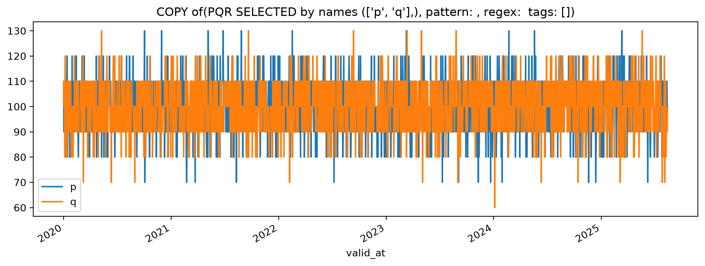
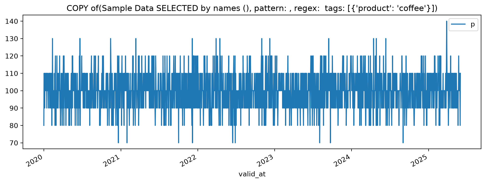
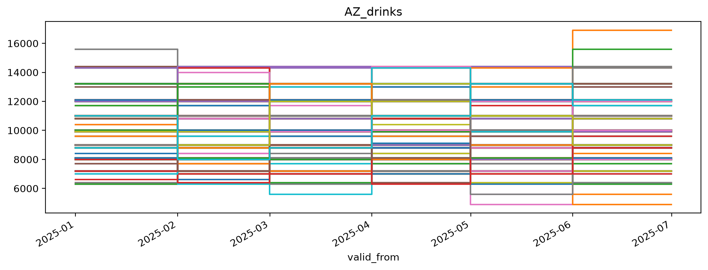

# Metadata fundamentals
<!---->
Scope
-----

This guide explains how metadata works in SSB Timeseries.
It covers key concepts like:

- [Repositories, Datasets and Series](#)
- the type system
- tag inheritance from `Dataset` to `Series` objects

It also touches ever so lightly some topics that deserve being covered in more depth:

- [search and filtering](meta-search-and-filtering) with tags
- [tag maintenance](meta-tag-maintenance)
- consuming taxonomies
- calculations with metadata
<!---->
Prerequisites
-------------

``` {note}
The guide assumes that the SSB Timeseries library is installed and that a working configuration is active.
See [the quickstart guide](quickstart) for instructions to that.
```

```python {.marimo}
from ssb_timeseries.config import Config

Config.active().is_valid
```

<!-- @output:lEQa -->

<pre style="white-space: pre-wrap; overflow-wrap: break-word;">True</pre>

Repositories, Datasets and Series
---------------------------------

Repositories, Datasets and Series are the building blocks of a hierarchy.
`Repositories` are unique within the universe held within a [configuration](..configuring-io).
Repositories contain `Datasets`.
Datasets must be uniquely identified within their repository.
Similarly, `Series` must be uniquely identified within the Datasets they are part of.

Their *names* are unique identifiers within the scope of their parent.
That means that it is possible to have:

```
Repository A
    Dataset PQR
      Series P
      Series Q
      Series R
    Dataset XYZ-1
        Series X
        Series Y
        Series Z
    Dataset XYZ-2
        Series X
        Series Y
        Series Z
Repository B
    Dataset PQR
        Series P
        Series Q
        Series R
```

This scoping provides flexibility.
It allows the same logic for different datasets.
Creating a new dataset with *almost* identical content makes sense and allows easy transitions and comparisons in cases of changing methodologies or classifications.
It also creates a potential for confusion.

`Datasets` and `Series` are also associated with both technical and purely descriptive metadata via `tags`.
While the "long name" `Repository/Dataset/Series` carries the identity of an individual series, its `tags` defines its meaning.
If two complete sets of descriptions (tags) are identical, that implies identity.
If there is a "real" difference (as opposed to merely a copy existing) it should show up in the metadata.
<!---->
The type system
---------------

<!-- @output:SFPL -->

SeriesTypes are defined by combinations of attributes that have technical implications for time series datasets.

Notable examples are Versioning and Temporality, but a few more may be added later.

 - Versioning refers to how revisions of data are identified (named).
 - Temporality describes the time dimensionality of each data point; notably duration or lack thereof.

```python {.marimo}
from ssb_timeseries.dataset import Dataset
from ssb_timeseries.types import SeriesType, Versioning, Temporality
```

Creating a Dataset
------------------

```python {.marimo}
some_data = dataframe_like_data_from_file_or_query()
```

When creating a `Dataset` for the first time, a `name`, a `type` and some data are required.

Specifying a `repository` is optional.
If not specified, the configuration will determine which one is used, if there is more than one.

```python {.marimo}
sample_set = Dataset(
    name = 'Sample Data',
    data_type = SeriesType(Versioning.NONE, Temporality.AT),
    data = some_data,
)
sample_set.save()
```

```python {.marimo}
print(repr(sample_set))
```

<!-- @output:ZHCJ -->

<pre style="white-space: pre-wrap; overflow-wrap: break-word;">Dataset(name=&quot;Sample Data&quot;, repository=&quot;tutorials&quot;, data_type=SeriesType(Versioning.NONE,Temporality.AT), as_of_tz=None)
</pre>

These attributes are technically significant.
If any of them are changed, it changes *where* or *how* the data is stored, and how it may be used.

The technical attributes are both object properties and reflected in `Dataset.tags`. This minimal amount of mandatory metadata is applied creation time and can not be changed without running the risk of breaking functionality.

```python {.marimo}
sample_set.tags
```

<!-- @output:qnkX -->

<pre style="white-space: pre-wrap; overflow-wrap: break-word;">{&#x27;name&#x27;: &#x27;Sample Data&#x27;,
 &#x27;product group&#x27;: &#x27;essential&#x27;,
 &#x27;repository&#x27;: &#x27;tutorials&#x27;,
 &#x27;series&#x27;: {&#x27;p&#x27;: {&#x27;dataset&#x27;: &#x27;Sample Data&#x27;,
                  &#x27;name&#x27;: &#x27;p&#x27;,
                  &#x27;product&#x27;: &#x27;coffee&#x27;,
                  &#x27;product group&#x27;: &#x27;essential&#x27;,
                  &#x27;repository&#x27;: &#x27;tutorials&#x27;,
                  &#x27;temporality&#x27;: &#x27;AT&#x27;,
                  &#x27;variable&#x27;: &#x27;price&#x27;,
                  &#x27;versioning&#x27;: &#x27;NONE&#x27;},
            &#x27;q&#x27;: {&#x27;dataset&#x27;: &#x27;Sample Data&#x27;,
                  &#x27;name&#x27;: &#x27;q&#x27;,
                  &#x27;product&#x27;: &#x27;crispbread&#x27;,
                  &#x27;product group&#x27;: &#x27;essential&#x27;,
                  &#x27;repository&#x27;: &#x27;tutorials&#x27;,
                  &#x27;temporality&#x27;: &#x27;AT&#x27;,
                  &#x27;variable&#x27;: &#x27;price&#x27;,
                  &#x27;versioning&#x27;: &#x27;NONE&#x27;},
            &#x27;r&#x27;: {&#x27;dataset&#x27;: &#x27;Sample Data&#x27;,
                  &#x27;name&#x27;: &#x27;r&#x27;,
                  &#x27;product&#x27;: &#x27;brown cheese&#x27;,
                  &#x27;product group&#x27;: &#x27;essential&#x27;,
                  &#x27;repository&#x27;: &#x27;tutorials&#x27;,
                  &#x27;temporality&#x27;: &#x27;AT&#x27;,
                  &#x27;variable&#x27;: &#x27;price&#x27;,
                  &#x27;versioning&#x27;: &#x27;NONE&#x27;}},
 &#x27;temporality&#x27;: &#x27;AT&#x27;,
 &#x27;variable&#x27;: &#x27;price&#x27;,
 &#x27;versioning&#x27;: &#x27;NONE&#x27;}</pre>

Note how `Dataset.name` becomes `Series.dataset` in the tags, while the technical properties are inherited directly.
The datatype dimensions are reflected in both in `.versioning` and the single `valid_at` column in `.data`:

```python {.marimo}
sample_set.data
```

<!-- @output:Vxnm -->

| valid_at | p | q | r |
| --- | --- | --- | --- |
| 2019-12-31 23:00:00+00:00 | 80.0 | 100.0 | 100.0 |
| 2020-01-01 23:00:00+00:00 | 110.0 | 100.0 | 100.0 |
| 2020-01-02 23:00:00+00:00 | 100.0 | 90.0 | 120.0 |
| 2020-01-03 23:00:00+00:00 | 110.0 | 100.0 | 110.0 |
| 2020-01-04 23:00:00+00:00 | 90.0 | 100.0 | 90.0 |
| ... | ... | ... | ... |
| 2025-05-27 22:00:00+00:00 | 110.0 | 90.0 | 110.0 |
| 2025-05-28 22:00:00+00:00 | 110.0 | 70.0 | 100.0 |
| 2025-05-29 22:00:00+00:00 | 100.0 | 110.0 | 90.0 |
| 2025-05-30 22:00:00+00:00 | 80.0 | 100.0 | 100.0 |
| 2025-05-31 22:00:00+00:00 | 110.0 | 90.0 | 100.0 |

To apply more than the minimal set of technical tags, we need to "tag" the dataset and series.

```python {.marimo}
sample_set.tag_dataset(tags={'variable': 'price','product group': 'essential'})

sample_set.tag_series('p',tags={'product': 'coffee'})
sample_set.tag_series('q',tags={'product': 'crispbread'})
sample_set.tag_series('r',tags={'product': 'brown cheese'})

sample_set.save()
sample_set.tags
```

<!-- @output:ulZA -->

<pre style="white-space: pre-wrap; overflow-wrap: break-word;">{&#x27;name&#x27;: &#x27;Sample Data&#x27;,
 &#x27;product group&#x27;: &#x27;essential&#x27;,
 &#x27;repository&#x27;: &#x27;tutorials&#x27;,
 &#x27;series&#x27;: {&#x27;p&#x27;: {&#x27;dataset&#x27;: &#x27;Sample Data&#x27;,
                  &#x27;name&#x27;: &#x27;p&#x27;,
                  &#x27;product&#x27;: &#x27;coffee&#x27;,
                  &#x27;product group&#x27;: &#x27;essential&#x27;,
                  &#x27;repository&#x27;: &#x27;tutorials&#x27;,
                  &#x27;temporality&#x27;: &#x27;AT&#x27;,
                  &#x27;variable&#x27;: &#x27;price&#x27;,
                  &#x27;versioning&#x27;: &#x27;NONE&#x27;},
            &#x27;q&#x27;: {&#x27;dataset&#x27;: &#x27;Sample Data&#x27;,
                  &#x27;name&#x27;: &#x27;q&#x27;,
                  &#x27;product&#x27;: &#x27;crispbread&#x27;,
                  &#x27;product group&#x27;: &#x27;essential&#x27;,
                  &#x27;repository&#x27;: &#x27;tutorials&#x27;,
                  &#x27;temporality&#x27;: &#x27;AT&#x27;,
                  &#x27;variable&#x27;: &#x27;price&#x27;,
                  &#x27;versioning&#x27;: &#x27;NONE&#x27;},
            &#x27;r&#x27;: {&#x27;dataset&#x27;: &#x27;Sample Data&#x27;,
                  &#x27;name&#x27;: &#x27;r&#x27;,
                  &#x27;product&#x27;: &#x27;brown cheese&#x27;,
                  &#x27;product group&#x27;: &#x27;essential&#x27;,
                  &#x27;repository&#x27;: &#x27;tutorials&#x27;,
                  &#x27;temporality&#x27;: &#x27;AT&#x27;,
                  &#x27;variable&#x27;: &#x27;price&#x27;,
                  &#x27;versioning&#x27;: &#x27;NONE&#x27;}},
 &#x27;temporality&#x27;: &#x27;AT&#x27;,
 &#x27;variable&#x27;: &#x27;price&#x27;,
 &#x27;versioning&#x27;: &#x27;NONE&#x27;}</pre>

Initialising a variable for an existing `Dataset`, we retrieve the previously stored metadata.

```python {.marimo}
pqr = Dataset('Sample Data')
```

```python {.marimo}
pqr.tags
```

<!-- @output:ZBYS -->

<pre style="white-space: pre-wrap; overflow-wrap: break-word;">{&#x27;name&#x27;: &#x27;Sample Data&#x27;,
 &#x27;product group&#x27;: &#x27;essential&#x27;,
 &#x27;repository&#x27;: &#x27;tutorials&#x27;,
 &#x27;series&#x27;: {&#x27;p&#x27;: {&#x27;dataset&#x27;: &#x27;Sample Data&#x27;,
                  &#x27;name&#x27;: &#x27;p&#x27;,
                  &#x27;product&#x27;: &#x27;coffee&#x27;,
                  &#x27;product group&#x27;: &#x27;essential&#x27;,
                  &#x27;repository&#x27;: &#x27;tutorials&#x27;,
                  &#x27;temporality&#x27;: &#x27;AT&#x27;,
                  &#x27;variable&#x27;: &#x27;price&#x27;,
                  &#x27;versioning&#x27;: &#x27;NONE&#x27;},
            &#x27;q&#x27;: {&#x27;dataset&#x27;: &#x27;Sample Data&#x27;,
                  &#x27;name&#x27;: &#x27;q&#x27;,
                  &#x27;product&#x27;: &#x27;crispbread&#x27;,
                  &#x27;product group&#x27;: &#x27;essential&#x27;,
                  &#x27;repository&#x27;: &#x27;tutorials&#x27;,
                  &#x27;temporality&#x27;: &#x27;AT&#x27;,
                  &#x27;variable&#x27;: &#x27;price&#x27;,
                  &#x27;versioning&#x27;: &#x27;NONE&#x27;},
            &#x27;r&#x27;: {&#x27;dataset&#x27;: &#x27;Sample Data&#x27;,
                  &#x27;name&#x27;: &#x27;r&#x27;,
                  &#x27;product&#x27;: &#x27;brown cheese&#x27;,
                  &#x27;product group&#x27;: &#x27;essential&#x27;,
                  &#x27;repository&#x27;: &#x27;tutorials&#x27;,
                  &#x27;temporality&#x27;: &#x27;AT&#x27;,
                  &#x27;variable&#x27;: &#x27;price&#x27;,
                  &#x27;versioning&#x27;: &#x27;NONE&#x27;}},
 &#x27;temporality&#x27;: &#x27;AT&#x27;,
 &#x27;variable&#x27;: &#x27;price&#x27;,
 &#x27;versioning&#x27;: &#x27;NONE&#x27;}</pre>

## Selecting series

Series can be selected from the dataset by name, regex patterns or tags.

```python {.marimo}
pqr['p','q'].plot()
```

<!-- @output:nHfw -->



And tags as well:

```python {.marimo}
pqr[{'product': 'coffee'}].plot()
```

<!-- @output:AjVT -->



With the simple "XYZ" dataset this is not so exciting.
However, selection by tags becomes very powerful for bigger datasets.

```python {.marimo}
bigger_data = mock_interval_data_from_file_or_query(start='2025-01-01', end='2025-06-01')
```

```python {.marimo}
az = Dataset(
    name = 'AZ_drinks',
    data_type = SeriesType('NONE', 'FROM_TO'),
    data = bigger_data,
    attributes=['store','variable','product', 'region'],
)
#az.save()
```

<!-- @output:TXez -->

The `az` set has 2080 series.

At this scale, it is not longer practical to deal with individual series:

```python {.marimo}
az.tags["series"]["a_price_coffee_NW"]
```

<!-- @output:wlCL -->

<pre style="white-space: pre-wrap; overflow-wrap: break-word;">{&#x27;dataset&#x27;: &#x27;AZ_drinks&#x27;,
 &#x27;name&#x27;: &#x27;a_price_coffee_NW&#x27;,
 &#x27;product&#x27;: &#x27;coffee&#x27;,
 &#x27;region&#x27;: &#x27;NW&#x27;,
 &#x27;repository&#x27;: &#x27;tutorials&#x27;,
 &#x27;store&#x27;: &#x27;a&#x27;,
 &#x27;temporality&#x27;: &#x27;FROM_TO&#x27;,
 &#x27;variable&#x27;: &#x27;price&#x27;,
 &#x27;versioning&#x27;: &#x27;NONE&#x27;}</pre>

While one could do something like looping over name patterns, organising the data in subsets identified by tags is much more practical:

```python {.marimo}
prices = az[{'variable':'price'}]
volumes = az[{'variable':'volume'}]
```

Series in `prices`:

<!-- @output:dGlV -->

<pre style="white-space: pre-wrap; overflow-wrap: break-word;">a_price_beer_N a_price_beer_NE ... z_price_wine_SE z_price_wine_SW z_price_wine_W

 len(prices.series)=1040
</pre>

New objects and tag maintenance
-------------------------------

The selection returns new dataset instnances for which both the data and the metadata have been filtered to match the criteria.
The retrieved data is sorted to allow calculations to be performed without complicated matching.

```python {.marimo}
revenue = prices * volumes
```

(Explicit matching may still be required in some corner cases.)

After a calculations, the original metadata will rarely be accurate anymore. Some functions update the metadata automatically, but in general tags need to be updated after calculations.

```python {.marimo}
revenue.rename('AZ_drinks', ('prices', 'volumes'))
revenue.replace_tags(({'variable':'price'},{'variable':'revenue'}))
revenue.plot()
```

<!-- @output:fwwy -->



See [tag maintenance](meta-tag-maintenance) or [calculations with metadata](calc-with-metadata) for more about either topic.
<!---->
Formal taxonomies
-----------------

As seen in the code above, the SSB Timeseries library implements tags as key value pairs and handles them through Python dictionaries.
This is a very lightweight approach that provides a lot of flexibility.
Just about anything that fits into the key value structure goes.

A more formal approach will put some governance and standardisation on which attributes to use, how to name them, and which values are allowed.

Integrating with such formal structures - and metadata systems - through the `meta` module is in the shaping.
The design philosophy is to keep the integration lightweight and configurable.
At the core is the idea that `attributes` take their `values` defined in a `Taxonomy`.

The code snippet below shows how a taxonomy may be consumed from Statistics Norway's taxonomy system KLASS.

```python {.marimo}
from ssb_timeseries.meta import Taxonomy

klass157 = Taxonomy(klass_id=157)
klass157.print_tree()
```

<!-- @output:jxvo -->

<pre style="white-space: pre-wrap; overflow-wrap: break-word;">╙── 0
    ├─╼ 1
    │   ├─╼ 1.1
    │   │   ├─╼ 1.1.1
    │   │   ├─╼ 1.1.2
    │   │   └─╼ 1.1.3
    │   └─╼ 1.2
    ├─╼ 11
    │   ├─╼ 11.1
    │   └─╼ 11.2
    ├─╼ 12
    │   ├─╼ 12.1
    │   │   ├─╼ 12.1.1
    │   │   ├─╼ 12.1.10
    │   │   ├─╼ 12.1.11
    │   │   ├─╼ 12.1.12
    │   │   ├─╼ 12.1.13
    │   │   ├─╼ 12.1.2
    │   │   ├─╼ 12.1.3
    │   │   ├─╼ 12.1.4
    │   │   ├─╼ 12.1.5
    │   │   ├─╼ 12.1.6
    │   │   ├─╼ 12.1.7
    │   │   ├─╼ 12.1.8
    │   │   └─╼ 12.1.9
    │   ├─╼ 12.2
    │   │   ├─╼ 12.2.1
    │   │   ├─╼ 12.2.2
    │   │   ├─╼ 12.2.3
    │   │   ├─╼ 12.2.4
    │   │   └─╼ 12.2.5
    │   └─╼ 12.3
    │       ├─╼ 12.3.1
    │       ├─╼ 12.3.2
    │       ├─╼ 12.3.3
    │       └─╼ 12.3.4
    ├─╼ 13
    ├─╼ 14
    ├─╼ 15
    ├─╼ 2
    ├─╼ 3
    ├─╼ 4
    │   ├─╼ 4.1
    │   └─╼ 4.2
    ├─╼ 5
    ├─╼ 6
    ├─╼ 7
    │   ├─╼ 7.1
    │   ├─╼ 7.2
    │   ├─╼ 7.3
    │   ├─╼ 7.4
    │   ├─╼ 7.5
    │   └─╼ 7.6
    ├─╼ 8
    │   ├─╼ 8.1
    │   ├─╼ 8.2
    │   ├─╼ 8.3
    │   ├─╼ 8.4
    │   ├─╼ 8.5
    │   ├─╼ 8.6
    │   ├─╼ 8.7
    │   ├─╼ 8.8
    │   └─╼ 8.9
    └─╼ 9
</pre>

In this example the taxonomy has a hierarcical structure.
Hierarchical (or even graph) structures may be used for [calculations](calc-with-metadata), as long as the tag values match a taxonomy.

While features for [tag mainatenance](meta-tag-maintenance) allow fixing some mistakes after the fact,
attribute structures are important considerations that should not be taken lightly.
They are, after all, a subset of ["naming things"](https://martinfowler.com/bliki/TwoHardThings.html).
<!---->
Data catalog
------------

The SSB Timeseries library can be configured to deal with the metadata in more than one way.
The library configuration allows setting up metadata repositories independent of the data storage.
That allows multiple data repositories to share a single metadata repository.
At the most technical level, storage comes down to IO implementation, but the separate configurations allow the metadata to be stored more than once. It can be stored both near the actual data, say in header or footer fields of file based storage, and in a sentral repository accessed through an API.

Regardless of setup, multiple metadata repositories in a configuration can be treated as a single catalog.
Collecting structured metadata in one place makes it easier to search.

```python {.marimo}
from ssb_timeseries import get_catalog

our_timeseries_database = get_catalog()
all_the_datasets = our_timeseries_database.datasets()
```

```python {.marimo}
type(all_the_datasets)
```

<!-- @output:zlud -->

<pre style="white-space: pre-wrap; overflow-wrap: break-word;">&lt;class &#x27;list&#x27;&gt;</pre>

```python {.marimo}
type(all_the_datasets[0])
```

<!-- @output:tZnO -->

<pre style="white-space: pre-wrap; overflow-wrap: break-word;">&lt;class &#x27;ssb_timeseries.catalog.CatalogItem&#x27;&gt;</pre>

```python {.marimo}
[catalog_item.object_name for catalog_item in all_the_datasets]
```

<!-- @output:xvXZ -->

<pre style="white-space: pre-wrap; overflow-wrap: break-word;">&#91;&#x27;A Sample Dataset&#x27;,
 &#x27;ABC&#x27;,
 &#x27;PQR&#x27;,
 &#x27;Sample Data&#x27;,
 &#x27;XYZ&#x27;,
 &#x27;XYZ_01467351&#x27;,
 &#x27;XYZ_06690c35&#x27;,
 &#x27;XYZ_07f5ed8c&#x27;,
 &#x27;XYZ_08c7fb95&#x27;,
 &#x27;XYZ_0fb6f4d4&#x27;,
 &#x27;XYZ_10ef582f&#x27;,
 &#x27;XYZ_1296b25d&#x27;,
 &#x27;XYZ_133efd09&#x27;,
 &#x27;XYZ_138928c9&#x27;,
 &#x27;XYZ_14e25934&#x27;,
 &#x27;XYZ_15613b7d&#x27;,
 &#x27;XYZ_1d6fc3f3&#x27;,
 &#x27;XYZ_220102a7&#x27;,
 &#x27;XYZ_233799d2&#x27;,
 &#x27;XYZ_23b8cac9&#x27;,
 &#x27;XYZ_25920447&#x27;,
 &#x27;XYZ_2aee681a&#x27;,
 &#x27;XYZ_2d7ed423&#x27;,
 &#x27;XYZ_31438726&#x27;,
 &#x27;XYZ_314640b0&#x27;,
 &#x27;XYZ_3e58b0cf&#x27;,
 &#x27;XYZ_40ab339d&#x27;,
 &#x27;XYZ_42fc4770&#x27;,
 &#x27;XYZ_43610d5b&#x27;,
 &#x27;XYZ_4505f14b&#x27;,
 &#x27;XYZ_49aeace7&#x27;,
 &#x27;XYZ_4a31e811&#x27;,
 &#x27;XYZ_4bfeeaee&#x27;,
 &#x27;XYZ_4d66e72a&#x27;,
 &#x27;XYZ_5080ae0f&#x27;,
 &#x27;XYZ_56010127&#x27;,
 &#x27;XYZ_5933f406&#x27;,
 &#x27;XYZ_5bfe8212&#x27;,
 &#x27;XYZ_61bebb01&#x27;,
 &#x27;XYZ_63b8ac7f&#x27;,
 &#x27;XYZ_67e6d540&#x27;,
 &#x27;XYZ_684b4573&#x27;,
 &#x27;XYZ_68a63d13&#x27;,
 &#x27;XYZ_6a7c5747&#x27;,
 &#x27;XYZ_71ea833f&#x27;,
 &#x27;XYZ_7839a617&#x27;,
 &#x27;XYZ_7fb2ee25&#x27;,
 &#x27;XYZ_855ac680&#x27;,
 &#x27;XYZ_8732df60&#x27;,
 &#x27;XYZ_89e54dd5&#x27;,
 &#x27;XYZ_8a00e19f&#x27;,
 &#x27;XYZ_8c3febc7&#x27;,
 &#x27;XYZ_8d9c1f58&#x27;,
 &#x27;XYZ_8dda4e6e&#x27;,
 &#x27;XYZ_8f0ba191&#x27;,
 &#x27;XYZ_8fab22ec&#x27;,
 &#x27;XYZ_911f0d75&#x27;,
 &#x27;XYZ_924cd754&#x27;,
 &#x27;XYZ_9873e53b&#x27;,
 &#x27;XYZ_9aaaa640&#x27;,
 &#x27;XYZ_a99daba7&#x27;,
 &#x27;XYZ_ad11302a&#x27;,
 &#x27;XYZ_b75f01e2&#x27;,
 &#x27;XYZ_b79b51e6&#x27;,
 &#x27;XYZ_c390d6b5&#x27;,
 &#x27;XYZ_c6a9e589&#x27;,
 &#x27;XYZ_c7bd5e27&#x27;,
 &#x27;XYZ_cefe8091&#x27;,
 &#x27;XYZ_d2ed8629&#x27;,
 &#x27;XYZ_d769e1f0&#x27;,
 &#x27;XYZ_d84a3af2&#x27;,
 &#x27;XYZ_e3db372b&#x27;,
 &#x27;XYZ_e6d506f7&#x27;,
 &#x27;XYZ_e6da0e82&#x27;,
 &#x27;XYZ_e7444b5d&#x27;,
 &#x27;XYZ_e7b08061&#x27;,
 &#x27;XYZ_eba74d7d&#x27;,
 &#x27;XYZ_ec00eea1&#x27;,
 &#x27;XYZ_ec1374ea&#x27;,
 &#x27;XYZ_eec645de&#x27;,
 &#x27;XYZ_f0f8229a&#x27;,
 &#x27;XYZ_f451f31b&#x27;,
 &#x27;XYZ_f4cbeff3&#x27;,
 &#x27;XYZ_f8a209fc&#x27;,
 &#x27;XYZ_fac41f35&#x27;,
 &#x27;probe-pollution&#x27;,
 &#x27;x&#x27;&#93;</pre>

```python {.marimo disabled="true"}
import pandas as pd
pd.DataFrame(all_the_datasets )
```

The list above should correspond to what we find in our file based repository:

<!-- @output:cEAS -->

<pre style="white-space: pre-wrap; overflow-wrap: break-word;">timeseries/
├── archives/
│   ├── A Sample Dataset/
│   │   ├── A Sample Dataset_v1.parquet
│   │   └── A Sample Dataset_v2.parquet
│   ├── PQR/
│   │   └── PQR_v1.parquet
│   └── XYZ/
│       └── XYZ_v1.parquet
├── AS_OF_AT/
│   ├── ABC/
│   │   ├── ABC-as_of_2023-12-31T230000+0000-data.parquet
│   │   ├── ABC-as_of_2024-01-31T230000+0000-data.parquet
│   │   ├── ABC-as_of_2024-02-29T230000+0000-data.parquet
│   │   ├── ABC-as_of_2024-03-31T220000+0000-data.parquet
│   │   ├── ABC-as_of_2024-04-30T220000+0000-data.parquet
│   │   ├── ABC-as_of_2024-05-31T220000+0000-data.parquet
│   │   ├── ABC-as_of_2024-06-30T220000+0000-data.parquet
│   │   ├── ABC-as_of_2024-07-31T220000+0000-data.parquet
│   │   ├── ABC-as_of_2024-08-31T220000+0000-data.parquet
│   │   ├── ABC-as_of_2024-09-30T220000+0000-data.parquet
│   │   ├── ABC-as_of_2024-10-31T230000+0000-data.parquet
│   │   ├── ABC-as_of_2024-11-30T230000+0000-data.parquet
│   │   ├── ABC-as_of_2024-12-31T230000+0000-data.parquet
│   │   ├── ABC-as_of_2025-01-31T230000+0000-data.parquet
│   │   ├── ABC-as_of_2025-02-28T230000+0000-data.parquet
│   │   ├── ABC-as_of_2025-03-31T220000+0000-data.parquet
│   │   ├── ABC-as_of_2025-04-30T220000+0000-data.parquet
│   │   ├── ABC-as_of_2025-05-31T220000+0000-data.parquet
│   │   ├── ABC-as_of_2025-06-30T220000+0000-data.parquet
│   │   ├── ABC-as_of_2025-07-31T220000+0000-data.parquet
│   │   ├── ABC-as_of_2025-08-31T220000+0000-data.parquet
│   │   ├── ABC-as_of_2025-09-30T220000+0000-data.parquet
│   │   ├── ABC-as_of_2025-10-31T230000+0000-data.parquet
│   │   └── ABC-as_of_2025-11-30T230000+0000-data.parquet
│   ├── XYZ_01467351/
│   │   ├── XYZ_01467351-as_of_2023-12-31T230000+0000-data.parquet
│   │   ├── XYZ_01467351-as_of_2024-01-31T230000+0000-data.parquet
│   │   ├── XYZ_01467351-as_of_2024-02-29T230000+0000-data.parquet
│   │   ├── XYZ_01467351-as_of_2024-03-31T220000+0000-data.parquet
│   │   ├── XYZ_01467351-as_of_2024-04-30T220000+0000-data.parquet
│   │   ├── XYZ_01467351-as_of_2024-05-31T220000+0000-data.parquet
│   │   ├── XYZ_01467351-as_of_2024-06-30T220000+0000-data.parquet
│   │   ├── XYZ_01467351-as_of_2024-07-31T220000+0000-data.parquet
│   │   ├── XYZ_01467351-as_of_2024-08-31T220000+0000-data.parquet
│   │   ├── XYZ_01467351-as_of_2024-09-30T220000+0000-data.parquet
│   │   ├── XYZ_01467351-as_of_2024-10-31T230000+0000-data.parquet
│   │   ├── XYZ_01467351-as_of_2024-11-30T230000+0000-data.parquet
│   │   ├── XYZ_01467351-as_of_2024-12-31T230000+0000-data.parquet
│   │   ├── XYZ_01467351-as_of_2025-01-31T230000+0000-data.parquet
│   │   ├── XYZ_01467351-as_of_2025-02-28T230000+0000-data.parquet
│   │   ├── XYZ_01467351-as_of_2025-03-31T220000+0000-data.parquet
│   │   ├── XYZ_01467351-as_of_2025-04-30T220000+0000-data.parquet
│   │   ├── XYZ_01467351-as_of_2025-05-31T220000+0000-data.parquet
│   │   ├── XYZ_01467351-as_of_2025-06-30T220000+0000-data.parquet
│   │   ├── XYZ_01467351-as_of_2025-07-31T220000+0000-data.parquet
│   │   ├── XYZ_01467351-as_of_2025-08-31T220000+0000-data.parquet
│   │   ├── XYZ_01467351-as_of_2025-09-30T220000+0000-data.parquet
│   │   ├── XYZ_01467351-as_of_2025-10-31T230000+0000-data.parquet
│   │   └── XYZ_01467351-as_of_2025-11-30T230000+0000-data.parquet
│   ├── XYZ_06690c35/
│   │   ├── XYZ_06690c35-as_of_2023-12-31T230000+0000-data.parquet
│   │   ├── XYZ_06690c35-as_of_2024-01-31T230000+0000-data.parquet
│   │   ├── XYZ_06690c35-as_of_2024-02-29T230000+0000-data.parquet
│   │   ├── XYZ_06690c35-as_of_2024-03-31T220000+0000-data.parquet
│   │   ├── XYZ_06690c35-as_of_2024-04-30T220000+0000-data.parquet
│   │   ├── XYZ_06690c35-as_of_2024-05-31T220000+0000-data.parquet
│   │   ├── XYZ_06690c35-as_of_2024-06-30T220000+0000-data.parquet
│   │   ├── XYZ_06690c35-as_of_2024-07-31T220000+0000-data.parquet
│   │   ├── XYZ_06690c35-as_of_2024-08-31T220000+0000-data.parquet
│   │   ├── XYZ_06690c35-as_of_2024-09-30T220000+0000-data.parquet
│   │   ├── XYZ_06690c35-as_of_2024-10-31T230000+0000-data.parquet
│   │   ├── XYZ_06690c35-as_of_2024-11-30T230000+0000-data.parquet
│   │   ├── XYZ_06690c35-as_of_2024-12-31T230000+0000-data.parquet
│   │   ├── XYZ_06690c35-as_of_2025-01-31T230000+0000-data.parquet
│   │   ├── XYZ_06690c35-as_of_2025-02-28T230000+0000-data.parquet
│   │   ├── XYZ_06690c35-as_of_2025-03-31T220000+0000-data.parquet
│   │   ├── XYZ_06690c35-as_of_2025-04-30T220000+0000-data.parquet
│   │   ├── XYZ_06690c35-as_of_2025-05-31T220000+0000-data.parquet
│   │   ├── XYZ_06690c35-as_of_2025-06-30T220000+0000-data.parquet
│   │   ├── XYZ_06690c35-as_of_2025-07-31T220000+0000-data.parquet
│   │   ├── XYZ_06690c35-as_of_2025-08-31T220000+0000-data.parquet
│   │   ├── XYZ_06690c35-as_of_2025-09-30T220000+0000-data.parquet
│   │   ├── XYZ_06690c35-as_of_2025-10-31T230000+0000-data.parquet
│   │   └── XYZ_06690c35-as_of_2025-11-30T230000+0000-data.parquet
│   ├── XYZ_07f5ed8c/
│   │   ├── XYZ_07f5ed8c-as_of_2023-12-31T230000+0000-data.parquet
│   │   ├── XYZ_07f5ed8c-as_of_2024-01-31T230000+0000-data.parquet
│   │   ├── XYZ_07f5ed8c-as_of_2024-02-29T230000+0000-data.parquet
│   │   ├── XYZ_07f5ed8c-as_of_2024-03-31T220000+0000-data.parquet
│   │   ├── XYZ_07f5ed8c-as_of_2024-04-30T220000+0000-data.parquet
│   │   ├── XYZ_07f5ed8c-as_of_2024-05-31T220000+0000-data.parquet
│   │   ├── XYZ_07f5ed8c-as_of_2024-06-30T220000+0000-data.parquet
│   │   ├── XYZ_07f5ed8c-as_of_2024-07-31T220000+0000-data.parquet
│   │   ├── XYZ_07f5ed8c-as_of_2024-08-31T220000+0000-data.parquet
│   │   ├── XYZ_07f5ed8c-as_of_2024-09-30T220000+0000-data.parquet
│   │   ├── XYZ_07f5ed8c-as_of_2024-10-31T230000+0000-data.parquet
│   │   ├── XYZ_07f5ed8c-as_of_2024-11-30T230000+0000-data.parquet
│   │   ├── XYZ_07f5ed8c-as_of_2024-12-31T230000+0000-data.parquet
│   │   ├── XYZ_07f5ed8c-as_of_2025-01-31T230000+0000-data.parquet
│   │   ├── XYZ_07f5ed8c-as_of_2025-02-28T230000+0000-data.parquet
│   │   ├── XYZ_07f5ed8c-as_of_2025-03-31T220000+0000-data.parquet
│   │   ├── XYZ_07f5ed8c-as_of_2025-04-30T220000+0000-data.parquet
│   │   ├── XYZ_07f5ed8c-as_of_2025-05-31T220000+0000-data.parquet
│   │   ├── XYZ_07f5ed8c-as_of_2025-06-30T220000+0000-data.parquet
│   │   ├── XYZ_07f5ed8c-as_of_2025-07-31T220000+0000-data.parquet
│   │   ├── XYZ_07f5ed8c-as_of_2025-08-31T220000+0000-data.parquet
│   │   ├── XYZ_07f5ed8c-as_of_2025-09-30T220000+0000-data.parquet
│   │   ├── XYZ_07f5ed8c-as_of_2025-10-31T230000+0000-data.parquet
│   │   └── XYZ_07f5ed8c-as_of_2025-11-30T230000+0000-data.parquet
│   ├── XYZ_08c7fb95/
│   │   ├── XYZ_08c7fb95-as_of_2023-12-31T230000+0000-data.parquet
│   │   ├── XYZ_08c7fb95-as_of_2024-01-31T230000+0000-data.parquet
│   │   ├── XYZ_08c7fb95-as_of_2024-02-29T230000+0000-data.parquet
│   │   ├── XYZ_08c7fb95-as_of_2024-03-31T220000+0000-data.parquet
│   │   ├── XYZ_08c7fb95-as_of_2024-04-30T220000+0000-data.parquet
│   │   ├── XYZ_08c7fb95-as_of_2024-05-31T220000+0000-data.parquet
│   │   ├── XYZ_08c7fb95-as_of_2024-06-30T220000+0000-data.parquet
│   │   ├── XYZ_08c7fb95-as_of_2024-07-31T220000+0000-data.parquet
│   │   ├── XYZ_08c7fb95-as_of_2024-08-31T220000+0000-data.parquet
│   │   ├── XYZ_08c7fb95-as_of_2024-09-30T220000+0000-data.parquet
│   │   ├── XYZ_08c7fb95-as_of_2024-10-31T230000+0000-data.parquet
│   │   ├── XYZ_08c7fb95-as_of_2024-11-30T230000+0000-data.parquet
│   │   ├── XYZ_08c7fb95-as_of_2024-12-31T230000+0000-data.parquet
│   │   ├── XYZ_08c7fb95-as_of_2025-01-31T230000+0000-data.parquet
│   │   ├── XYZ_08c7fb95-as_of_2025-02-28T230000+0000-data.parquet
│   │   ├── XYZ_08c7fb95-as_of_2025-03-31T220000+0000-data.parquet
│   │   ├── XYZ_08c7fb95-as_of_2025-04-30T220000+0000-data.parquet
│   │   ├── XYZ_08c7fb95-as_of_2025-05-31T220000+0000-data.parquet
│   │   ├── XYZ_08c7fb95-as_of_2025-06-30T220000+0000-data.parquet
│   │   ├── XYZ_08c7fb95-as_of_2025-07-31T220000+0000-data.parquet
│   │   ├── XYZ_08c7fb95-as_of_2025-08-31T220000+0000-data.parquet
│   │   ├── XYZ_08c7fb95-as_of_2025-09-30T220000+0000-data.parquet
│   │   ├── XYZ_08c7fb95-as_of_2025-10-31T230000+0000-data.parquet
│   │   └── XYZ_08c7fb95-as_of_2025-11-30T230000+0000-data.parquet
│   ├── XYZ_0fb6f4d4/
│   │   ├── XYZ_0fb6f4d4-as_of_2023-12-31T230000+0000-data.parquet
│   │   ├── XYZ_0fb6f4d4-as_of_2024-01-31T230000+0000-data.parquet
│   │   ├── XYZ_0fb6f4d4-as_of_2024-02-29T230000+0000-data.parquet
│   │   ├── XYZ_0fb6f4d4-as_of_2024-03-31T220000+0000-data.parquet
│   │   ├── XYZ_0fb6f4d4-as_of_2024-04-30T220000+0000-data.parquet
│   │   ├── XYZ_0fb6f4d4-as_of_2024-05-31T220000+0000-data.parquet
│   │   ├── XYZ_0fb6f4d4-as_of_2024-06-30T220000+0000-data.parquet
│   │   ├── XYZ_0fb6f4d4-as_of_2024-07-31T220000+0000-data.parquet
│   │   ├── XYZ_0fb6f4d4-as_of_2024-08-31T220000+0000-data.parquet
│   │   ├── XYZ_0fb6f4d4-as_of_2024-09-30T220000+0000-data.parquet
│   │   ├── XYZ_0fb6f4d4-as_of_2024-10-31T230000+0000-data.parquet
│   │   ├── XYZ_0fb6f4d4-as_of_2024-11-30T230000+0000-data.parquet
│   │   ├── XYZ_0fb6f4d4-as_of_2024-12-31T230000+0000-data.parquet
│   │   ├── XYZ_0fb6f4d4-as_of_2025-01-31T230000+0000-data.parquet
│   │   ├── XYZ_0fb6f4d4-as_of_2025-02-28T230000+0000-data.parquet
│   │   ├── XYZ_0fb6f4d4-as_of_2025-03-31T220000+0000-data.parquet
│   │   ├── XYZ_0fb6f4d4-as_of_2025-04-30T220000+0000-data.parquet
│   │   ├── XYZ_0fb6f4d4-as_of_2025-05-31T220000+0000-data.parquet
│   │   ├── XYZ_0fb6f4d4-as_of_2025-06-30T220000+0000-data.parquet
│   │   ├── XYZ_0fb6f4d4-as_of_2025-07-31T220000+0000-data.parquet
│   │   ├── XYZ_0fb6f4d4-as_of_2025-08-31T220000+0000-data.parquet
│   │   ├── XYZ_0fb6f4d4-as_of_2025-09-30T220000+0000-data.parquet
│   │   ├── XYZ_0fb6f4d4-as_of_2025-10-31T230000+0000-data.parquet
│   │   └── XYZ_0fb6f4d4-as_of_2025-11-30T230000+0000-data.parquet
│   ├── XYZ_10ef582f/
│   │   ├── XYZ_10ef582f-as_of_2023-12-31T230000+0000-data.parquet
│   │   ├── XYZ_10ef582f-as_of_2024-01-31T230000+0000-data.parquet
│   │   ├── XYZ_10ef582f-as_of_2024-02-29T230000+0000-data.parquet
│   │   ├── XYZ_10ef582f-as_of_2024-03-31T220000+0000-data.parquet
│   │   ├── XYZ_10ef582f-as_of_2024-04-30T220000+0000-data.parquet
│   │   ├── XYZ_10ef582f-as_of_2024-05-31T220000+0000-data.parquet
│   │   ├── XYZ_10ef582f-as_of_2024-06-30T220000+0000-data.parquet
│   │   ├── XYZ_10ef582f-as_of_2024-07-31T220000+0000-data.parquet
│   │   ├── XYZ_10ef582f-as_of_2024-08-31T220000+0000-data.parquet
│   │   ├── XYZ_10ef582f-as_of_2024-09-30T220000+0000-data.parquet
│   │   ├── XYZ_10ef582f-as_of_2024-10-31T230000+0000-data.parquet
│   │   ├── XYZ_10ef582f-as_of_2024-11-30T230000+0000-data.parquet
│   │   ├── XYZ_10ef582f-as_of_2024-12-31T230000+0000-data.parquet
│   │   ├── XYZ_10ef582f-as_of_2025-01-31T230000+0000-data.parquet
│   │   ├── XYZ_10ef582f-as_of_2025-02-28T230000+0000-data.parquet
│   │   ├── XYZ_10ef582f-as_of_2025-03-31T220000+0000-data.parquet
│   │   ├── XYZ_10ef582f-as_of_2025-04-30T220000+0000-data.parquet
│   │   ├── XYZ_10ef582f-as_of_2025-05-31T220000+0000-data.parquet
│   │   ├── XYZ_10ef582f-as_of_2025-06-30T220000+0000-data.parquet
│   │   ├── XYZ_10ef582f-as_of_2025-07-31T220000+0000-data.parquet
│   │   ├── XYZ_10ef582f-as_of_2025-08-31T220000+0000-data.parquet
│   │   ├── XYZ_10ef582f-as_of_2025-09-30T220000+0000-data.parquet
│   │   ├── XYZ_10ef582f-as_of_2025-10-31T230000+0000-data.parquet
│   │   └── XYZ_10ef582f-as_of_2025-11-30T230000+0000-data.parquet
│   ├── XYZ_1296b25d/
│   │   ├── XYZ_1296b25d-as_of_2023-12-31T230000+0000-data.parquet
│   │   ├── XYZ_1296b25d-as_of_2024-01-31T230000+0000-data.parquet
│   │   ├── XYZ_1296b25d-as_of_2024-02-29T230000+0000-data.parquet
│   │   ├── XYZ_1296b25d-as_of_2024-03-31T220000+0000-data.parquet
│   │   ├── XYZ_1296b25d-as_of_2024-04-30T220000+0000-data.parquet
│   │   ├── XYZ_1296b25d-as_of_2024-05-31T220000+0000-data.parquet
│   │   ├── XYZ_1296b25d-as_of_2024-06-30T220000+0000-data.parquet
│   │   ├── XYZ_1296b25d-as_of_2024-07-31T220000+0000-data.parquet
│   │   ├── XYZ_1296b25d-as_of_2024-08-31T220000+0000-data.parquet
│   │   ├── XYZ_1296b25d-as_of_2024-09-30T220000+0000-data.parquet
│   │   ├── XYZ_1296b25d-as_of_2024-10-31T230000+0000-data.parquet
│   │   ├── XYZ_1296b25d-as_of_2024-11-30T230000+0000-data.parquet
│   │   ├── XYZ_1296b25d-as_of_2024-12-31T230000+0000-data.parquet
│   │   ├── XYZ_1296b25d-as_of_2025-01-31T230000+0000-data.parquet
│   │   ├── XYZ_1296b25d-as_of_2025-02-28T230000+0000-data.parquet
│   │   ├── XYZ_1296b25d-as_of_2025-03-31T220000+0000-data.parquet
│   │   ├── XYZ_1296b25d-as_of_2025-04-30T220000+0000-data.parquet
│   │   ├── XYZ_1296b25d-as_of_2025-05-31T220000+0000-data.parquet
│   │   ├── XYZ_1296b25d-as_of_2025-06-30T220000+0000-data.parquet
│   │   ├── XYZ_1296b25d-as_of_2025-07-31T220000+0000-data.parquet
│   │   ├── XYZ_1296b25d-as_of_2025-08-31T220000+0000-data.parquet
│   │   ├── XYZ_1296b25d-as_of_2025-09-30T220000+0000-data.parquet
│   │   ├── XYZ_1296b25d-as_of_2025-10-31T230000+0000-data.parquet
│   │   └── XYZ_1296b25d-as_of_2025-11-30T230000+0000-data.parquet
│   ├── XYZ_133efd09/
│   │   ├── XYZ_133efd09-as_of_2023-12-31T230000+0000-data.parquet
│   │   ├── XYZ_133efd09-as_of_2024-01-31T230000+0000-data.parquet
│   │   ├── XYZ_133efd09-as_of_2024-02-29T230000+0000-data.parquet
│   │   ├── XYZ_133efd09-as_of_2024-03-31T220000+0000-data.parquet
│   │   ├── XYZ_133efd09-as_of_2024-04-30T220000+0000-data.parquet
│   │   ├── XYZ_133efd09-as_of_2024-05-31T220000+0000-data.parquet
│   │   ├── XYZ_133efd09-as_of_2024-06-30T220000+0000-data.parquet
│   │   ├── XYZ_133efd09-as_of_2024-07-31T220000+0000-data.parquet
│   │   ├── XYZ_133efd09-as_of_2024-08-31T220000+0000-data.parquet
│   │   ├── XYZ_133efd09-as_of_2024-09-30T220000+0000-data.parquet
│   │   ├── XYZ_133efd09-as_of_2024-10-31T230000+0000-data.parquet
│   │   ├── XYZ_133efd09-as_of_2024-11-30T230000+0000-data.parquet
│   │   ├── XYZ_133efd09-as_of_2024-12-31T230000+0000-data.parquet
│   │   ├── XYZ_133efd09-as_of_2025-01-31T230000+0000-data.parquet
│   │   ├── XYZ_133efd09-as_of_2025-02-28T230000+0000-data.parquet
│   │   ├── XYZ_133efd09-as_of_2025-03-31T220000+0000-data.parquet
│   │   ├── XYZ_133efd09-as_of_2025-04-30T220000+0000-data.parquet
│   │   ├── XYZ_133efd09-as_of_2025-05-31T220000+0000-data.parquet
│   │   ├── XYZ_133efd09-as_of_2025-06-30T220000+0000-data.parquet
│   │   ├── XYZ_133efd09-as_of_2025-07-31T220000+0000-data.parquet
│   │   ├── XYZ_133efd09-as_of_2025-08-31T220000+0000-data.parquet
│   │   ├── XYZ_133efd09-as_of_2025-09-30T220000+0000-data.parquet
│   │   ├── XYZ_133efd09-as_of_2025-10-31T230000+0000-data.parquet
│   │   └── XYZ_133efd09-as_of_2025-11-30T230000+0000-data.parquet
│   ├── XYZ_138928c9/
│   │   ├── XYZ_138928c9-as_of_2023-12-31T230000+0000-data.parquet
│   │   ├── XYZ_138928c9-as_of_2024-01-31T230000+0000-data.parquet
│   │   ├── XYZ_138928c9-as_of_2024-02-29T230000+0000-data.parquet
│   │   ├── XYZ_138928c9-as_of_2024-03-31T220000+0000-data.parquet
│   │   ├── XYZ_138928c9-as_of_2024-04-30T220000+0000-data.parquet
│   │   ├── XYZ_138928c9-as_of_2024-05-31T220000+0000-data.parquet
│   │   ├── XYZ_138928c9-as_of_2024-06-30T220000+0000-data.parquet
│   │   ├── XYZ_138928c9-as_of_2024-07-31T220000+0000-data.parquet
│   │   ├── XYZ_138928c9-as_of_2024-08-31T220000+0000-data.parquet
│   │   ├── XYZ_138928c9-as_of_2024-09-30T220000+0000-data.parquet
│   │   ├── XYZ_138928c9-as_of_2024-10-31T230000+0000-data.parquet
│   │   ├── XYZ_138928c9-as_of_2024-11-30T230000+0000-data.parquet
│   │   ├── XYZ_138928c9-as_of_2024-12-31T230000+0000-data.parquet
│   │   ├── XYZ_138928c9-as_of_2025-01-31T230000+0000-data.parquet
│   │   ├── XYZ_138928c9-as_of_2025-02-28T230000+0000-data.parquet
│   │   ├── XYZ_138928c9-as_of_2025-03-31T220000+0000-data.parquet
│   │   ├── XYZ_138928c9-as_of_2025-04-30T220000+0000-data.parquet
│   │   ├── XYZ_138928c9-as_of_2025-05-31T220000+0000-data.parquet
│   │   ├── XYZ_138928c9-as_of_2025-06-30T220000+0000-data.parquet
│   │   ├── XYZ_138928c9-as_of_2025-07-31T220000+0000-data.parquet
│   │   ├── XYZ_138928c9-as_of_2025-08-31T220000+0000-data.parquet
│   │   ├── XYZ_138928c9-as_of_2025-09-30T220000+0000-data.parquet
│   │   ├── XYZ_138928c9-as_of_2025-10-31T230000+0000-data.parquet
│   │   └── XYZ_138928c9-as_of_2025-11-30T230000+0000-data.parquet
│   ├── XYZ_14e25934/
│   │   ├── XYZ_14e25934-as_of_2023-12-31T230000+0000-data.parquet
│   │   ├── XYZ_14e25934-as_of_2024-01-31T230000+0000-data.parquet
│   │   ├── XYZ_14e25934-as_of_2024-02-29T230000+0000-data.parquet
│   │   ├── XYZ_14e25934-as_of_2024-03-31T220000+0000-data.parquet
│   │   ├── XYZ_14e25934-as_of_2024-04-30T220000+0000-data.parquet
│   │   ├── XYZ_14e25934-as_of_2024-05-31T220000+0000-data.parquet
│   │   ├── XYZ_14e25934-as_of_2024-06-30T220000+0000-data.parquet
│   │   ├── XYZ_14e25934-as_of_2024-07-31T220000+0000-data.parquet
│   │   ├── XYZ_14e25934-as_of_2024-08-31T220000+0000-data.parquet
│   │   ├── XYZ_14e25934-as_of_2024-09-30T220000+0000-data.parquet
│   │   ├── XYZ_14e25934-as_of_2024-10-31T230000+0000-data.parquet
│   │   ├── XYZ_14e25934-as_of_2024-11-30T230000+0000-data.parquet
│   │   ├── XYZ_14e25934-as_of_2024-12-31T230000+0000-data.parquet
│   │   ├── XYZ_14e25934-as_of_2025-01-31T230000+0000-data.parquet
│   │   ├── XYZ_14e25934-as_of_2025-02-28T230000+0000-data.parquet
│   │   ├── XYZ_14e25934-as_of_2025-03-31T220000+0000-data.parquet
│   │   ├── XYZ_14e25934-as_of_2025-04-30T220000+0000-data.parquet
│   │   ├── XYZ_14e25934-as_of_2025-05-31T220000+0000-data.parquet
│   │   ├── XYZ_14e25934-as_of_2025-06-30T220000+0000-data.parquet
│   │   ├── XYZ_14e25934-as_of_2025-07-31T220000+0000-data.parquet
│   │   ├── XYZ_14e25934-as_of_2025-08-31T220000+0000-data.parquet
│   │   ├── XYZ_14e25934-as_of_2025-09-30T220000+0000-data.parquet
│   │   ├── XYZ_14e25934-as_of_2025-10-31T230000+0000-data.parquet
│   │   └── XYZ_14e25934-as_of_2025-11-30T230000+0000-data.parquet
│   ├── XYZ_15613b7d/
│   │   ├── XYZ_15613b7d-as_of_2023-12-31T230000+0000-data.parquet
│   │   ├── XYZ_15613b7d-as_of_2024-01-31T230000+0000-data.parquet
│   │   ├── XYZ_15613b7d-as_of_2024-02-29T230000+0000-data.parquet
│   │   ├── XYZ_15613b7d-as_of_2024-03-31T220000+0000-data.parquet
│   │   ├── XYZ_15613b7d-as_of_2024-04-30T220000+0000-data.parquet
│   │   ├── XYZ_15613b7d-as_of_2024-05-31T220000+0000-data.parquet
│   │   ├── XYZ_15613b7d-as_of_2024-06-30T220000+0000-data.parquet
│   │   ├── XYZ_15613b7d-as_of_2024-07-31T220000+0000-data.parquet
│   │   ├── XYZ_15613b7d-as_of_2024-08-31T220000+0000-data.parquet
│   │   ├── XYZ_15613b7d-as_of_2024-09-30T220000+0000-data.parquet
│   │   ├── XYZ_15613b7d-as_of_2024-10-31T230000+0000-data.parquet
│   │   ├── XYZ_15613b7d-as_of_2024-11-30T230000+0000-data.parquet
│   │   ├── XYZ_15613b7d-as_of_2024-12-31T230000+0000-data.parquet
│   │   ├── XYZ_15613b7d-as_of_2025-01-31T230000+0000-data.parquet
│   │   ├── XYZ_15613b7d-as_of_2025-02-28T230000+0000-data.parquet
│   │   ├── XYZ_15613b7d-as_of_2025-03-31T220000+0000-data.parquet
│   │   ├── XYZ_15613b7d-as_of_2025-04-30T220000+0000-data.parquet
│   │   ├── XYZ_15613b7d-as_of_2025-05-31T220000+0000-data.parquet
│   │   ├── XYZ_15613b7d-as_of_2025-06-30T220000+0000-data.parquet
│   │   ├── XYZ_15613b7d-as_of_2025-07-31T220000+0000-data.parquet
│   │   ├── XYZ_15613b7d-as_of_2025-08-31T220000+0000-data.parquet
│   │   ├── XYZ_15613b7d-as_of_2025-09-30T220000+0000-data.parquet
│   │   ├── XYZ_15613b7d-as_of_2025-10-31T230000+0000-data.parquet
│   │   └── XYZ_15613b7d-as_of_2025-11-30T230000+0000-data.parquet
│   ├── XYZ_1d6fc3f3/
│   │   ├── XYZ_1d6fc3f3-as_of_2023-12-31T230000+0000-data.parquet
│   │   ├── XYZ_1d6fc3f3-as_of_2024-01-31T230000+0000-data.parquet
│   │   ├── XYZ_1d6fc3f3-as_of_2024-02-29T230000+0000-data.parquet
│   │   ├── XYZ_1d6fc3f3-as_of_2024-03-31T220000+0000-data.parquet
│   │   ├── XYZ_1d6fc3f3-as_of_2024-04-30T220000+0000-data.parquet
│   │   ├── XYZ_1d6fc3f3-as_of_2024-05-31T220000+0000-data.parquet
│   │   ├── XYZ_1d6fc3f3-as_of_2024-06-30T220000+0000-data.parquet
│   │   ├── XYZ_1d6fc3f3-as_of_2024-07-31T220000+0000-data.parquet
│   │   ├── XYZ_1d6fc3f3-as_of_2024-08-31T220000+0000-data.parquet
│   │   ├── XYZ_1d6fc3f3-as_of_2024-09-30T220000+0000-data.parquet
│   │   ├── XYZ_1d6fc3f3-as_of_2024-10-31T230000+0000-data.parquet
│   │   ├── XYZ_1d6fc3f3-as_of_2024-11-30T230000+0000-data.parquet
│   │   ├── XYZ_1d6fc3f3-as_of_2024-12-31T230000+0000-data.parquet
│   │   ├── XYZ_1d6fc3f3-as_of_2025-01-31T230000+0000-data.parquet
│   │   ├── XYZ_1d6fc3f3-as_of_2025-02-28T230000+0000-data.parquet
│   │   ├── XYZ_1d6fc3f3-as_of_2025-03-31T220000+0000-data.parquet
│   │   ├── XYZ_1d6fc3f3-as_of_2025-04-30T220000+0000-data.parquet
│   │   ├── XYZ_1d6fc3f3-as_of_2025-05-31T220000+0000-data.parquet
│   │   ├── XYZ_1d6fc3f3-as_of_2025-06-30T220000+0000-data.parquet
│   │   ├── XYZ_1d6fc3f3-as_of_2025-07-31T220000+0000-data.parquet
│   │   ├── XYZ_1d6fc3f3-as_of_2025-08-31T220000+0000-data.parquet
│   │   ├── XYZ_1d6fc3f3-as_of_2025-09-30T220000+0000-data.parquet
│   │   ├── XYZ_1d6fc3f3-as_of_2025-10-31T230000+0000-data.parquet
│   │   └── XYZ_1d6fc3f3-as_of_2025-11-30T230000+0000-data.parquet
│   ├── XYZ_220102a7/
│   │   ├── XYZ_220102a7-as_of_2023-12-31T230000+0000-data.parquet
│   │   ├── XYZ_220102a7-as_of_2024-01-31T230000+0000-data.parquet
│   │   ├── XYZ_220102a7-as_of_2024-02-29T230000+0000-data.parquet
│   │   ├── XYZ_220102a7-as_of_2024-03-31T220000+0000-data.parquet
│   │   ├── XYZ_220102a7-as_of_2024-04-30T220000+0000-data.parquet
│   │   ├── XYZ_220102a7-as_of_2024-05-31T220000+0000-data.parquet
│   │   ├── XYZ_220102a7-as_of_2024-06-30T220000+0000-data.parquet
│   │   ├── XYZ_220102a7-as_of_2024-07-31T220000+0000-data.parquet
│   │   ├── XYZ_220102a7-as_of_2024-08-31T220000+0000-data.parquet
│   │   ├── XYZ_220102a7-as_of_2024-09-30T220000+0000-data.parquet
│   │   ├── XYZ_220102a7-as_of_2024-10-31T230000+0000-data.parquet
│   │   ├── XYZ_220102a7-as_of_2024-11-30T230000+0000-data.parquet
│   │   ├── XYZ_220102a7-as_of_2024-12-31T230000+0000-data.parquet
│   │   ├── XYZ_220102a7-as_of_2025-01-31T230000+0000-data.parquet
│   │   ├── XYZ_220102a7-as_of_2025-02-28T230000+0000-data.parquet
│   │   ├── XYZ_220102a7-as_of_2025-03-31T220000+0000-data.parquet
│   │   ├── XYZ_220102a7-as_of_2025-04-30T220000+0000-data.parquet
│   │   ├── XYZ_220102a7-as_of_2025-05-31T220000+0000-data.parquet
│   │   ├── XYZ_220102a7-as_of_2025-06-30T220000+0000-data.parquet
│   │   ├── XYZ_220102a7-as_of_2025-07-31T220000+0000-data.parquet
│   │   ├── XYZ_220102a7-as_of_2025-08-31T220000+0000-data.parquet
│   │   ├── XYZ_220102a7-as_of_2025-09-30T220000+0000-data.parquet
│   │   ├── XYZ_220102a7-as_of_2025-10-31T230000+0000-data.parquet
│   │   └── XYZ_220102a7-as_of_2025-11-30T230000+0000-data.parquet
│   ├── XYZ_233799d2/
│   │   ├── XYZ_233799d2-as_of_2023-12-31T230000+0000-data.parquet
│   │   ├── XYZ_233799d2-as_of_2024-01-31T230000+0000-data.parquet
│   │   ├── XYZ_233799d2-as_of_2024-02-29T230000+0000-data.parquet
│   │   ├── XYZ_233799d2-as_of_2024-03-31T220000+0000-data.parquet
│   │   ├── XYZ_233799d2-as_of_2024-04-30T220000+0000-data.parquet
│   │   ├── XYZ_233799d2-as_of_2024-05-31T220000+0000-data.parquet
│   │   ├── XYZ_233799d2-as_of_2024-06-30T220000+0000-data.parquet
│   │   ├── XYZ_233799d2-as_of_2024-07-31T220000+0000-data.parquet
│   │   ├── XYZ_233799d2-as_of_2024-08-31T220000+0000-data.parquet
│   │   ├── XYZ_233799d2-as_of_2024-09-30T220000+0000-data.parquet
│   │   ├── XYZ_233799d2-as_of_2024-10-31T230000+0000-data.parquet
│   │   ├── XYZ_233799d2-as_of_2024-11-30T230000+0000-data.parquet
│   │   ├── XYZ_233799d2-as_of_2024-12-31T230000+0000-data.parquet
│   │   ├── XYZ_233799d2-as_of_2025-01-31T230000+0000-data.parquet
│   │   ├── XYZ_233799d2-as_of_2025-02-28T230000+0000-data.parquet
│   │   ├── XYZ_233799d2-as_of_2025-03-31T220000+0000-data.parquet
│   │   ├── XYZ_233799d2-as_of_2025-04-30T220000+0000-data.parquet
│   │   ├── XYZ_233799d2-as_of_2025-05-31T220000+0000-data.parquet
│   │   ├── XYZ_233799d2-as_of_2025-06-30T220000+0000-data.parquet
│   │   ├── XYZ_233799d2-as_of_2025-07-31T220000+0000-data.parquet
│   │   ├── XYZ_233799d2-as_of_2025-08-31T220000+0000-data.parquet
│   │   ├── XYZ_233799d2-as_of_2025-09-30T220000+0000-data.parquet
│   │   ├── XYZ_233799d2-as_of_2025-10-31T230000+0000-data.parquet
│   │   └── XYZ_233799d2-as_of_2025-11-30T230000+0000-data.parquet
│   ├── XYZ_23b8cac9/
│   │   ├── XYZ_23b8cac9-as_of_2023-12-31T230000+0000-data.parquet
│   │   ├── XYZ_23b8cac9-as_of_2024-01-31T230000+0000-data.parquet
│   │   ├── XYZ_23b8cac9-as_of_2024-02-29T230000+0000-data.parquet
│   │   ├── XYZ_23b8cac9-as_of_2024-03-31T220000+0000-data.parquet
│   │   ├── XYZ_23b8cac9-as_of_2024-04-30T220000+0000-data.parquet
│   │   ├── XYZ_23b8cac9-as_of_2024-05-31T220000+0000-data.parquet
│   │   ├── XYZ_23b8cac9-as_of_2024-06-30T220000+0000-data.parquet
│   │   ├── XYZ_23b8cac9-as_of_2024-07-31T220000+0000-data.parquet
│   │   ├── XYZ_23b8cac9-as_of_2024-08-31T220000+0000-data.parquet
│   │   ├── XYZ_23b8cac9-as_of_2024-09-30T220000+0000-data.parquet
│   │   ├── XYZ_23b8cac9-as_of_2024-10-31T230000+0000-data.parquet
│   │   ├── XYZ_23b8cac9-as_of_2024-11-30T230000+0000-data.parquet
│   │   ├── XYZ_23b8cac9-as_of_2024-12-31T230000+0000-data.parquet
│   │   ├── XYZ_23b8cac9-as_of_2025-01-31T230000+0000-data.parquet
│   │   ├── XYZ_23b8cac9-as_of_2025-02-28T230000+0000-data.parquet
│   │   ├── XYZ_23b8cac9-as_of_2025-03-31T220000+0000-data.parquet
│   │   ├── XYZ_23b8cac9-as_of_2025-04-30T220000+0000-data.parquet
│   │   ├── XYZ_23b8cac9-as_of_2025-05-31T220000+0000-data.parquet
│   │   ├── XYZ_23b8cac9-as_of_2025-06-30T220000+0000-data.parquet
│   │   ├── XYZ_23b8cac9-as_of_2025-07-31T220000+0000-data.parquet
│   │   ├── XYZ_23b8cac9-as_of_2025-08-31T220000+0000-data.parquet
│   │   ├── XYZ_23b8cac9-as_of_2025-09-30T220000+0000-data.parquet
│   │   ├── XYZ_23b8cac9-as_of_2025-10-31T230000+0000-data.parquet
│   │   └── XYZ_23b8cac9-as_of_2025-11-30T230000+0000-data.parquet
│   ├── XYZ_25920447/
│   │   ├── XYZ_25920447-as_of_2023-12-31T230000+0000-data.parquet
│   │   ├── XYZ_25920447-as_of_2024-01-31T230000+0000-data.parquet
│   │   ├── XYZ_25920447-as_of_2024-02-29T230000+0000-data.parquet
│   │   ├── XYZ_25920447-as_of_2024-03-31T220000+0000-data.parquet
│   │   ├── XYZ_25920447-as_of_2024-04-30T220000+0000-data.parquet
│   │   ├── XYZ_25920447-as_of_2024-05-31T220000+0000-data.parquet
│   │   ├── XYZ_25920447-as_of_2024-06-30T220000+0000-data.parquet
│   │   ├── XYZ_25920447-as_of_2024-07-31T220000+0000-data.parquet
│   │   ├── XYZ_25920447-as_of_2024-08-31T220000+0000-data.parquet
│   │   ├── XYZ_25920447-as_of_2024-09-30T220000+0000-data.parquet
│   │   ├── XYZ_25920447-as_of_2024-10-31T230000+0000-data.parquet
│   │   ├── XYZ_25920447-as_of_2024-11-30T230000+0000-data.parquet
│   │   ├── XYZ_25920447-as_of_2024-12-31T230000+0000-data.parquet
│   │   ├── XYZ_25920447-as_of_2025-01-31T230000+0000-data.parquet
│   │   ├── XYZ_25920447-as_of_2025-02-28T230000+0000-data.parquet
│   │   ├── XYZ_25920447-as_of_2025-03-31T220000+0000-data.parquet
│   │   ├── XYZ_25920447-as_of_2025-04-30T220000+0000-data.parquet
│   │   ├── XYZ_25920447-as_of_2025-05-31T220000+0000-data.parquet
│   │   ├── XYZ_25920447-as_of_2025-06-30T220000+0000-data.parquet
│   │   ├── XYZ_25920447-as_of_2025-07-31T220000+0000-data.parquet
│   │   ├── XYZ_25920447-as_of_2025-08-31T220000+0000-data.parquet
│   │   ├── XYZ_25920447-as_of_2025-09-30T220000+0000-data.parquet
│   │   ├── XYZ_25920447-as_of_2025-10-31T230000+0000-data.parquet
│   │   └── XYZ_25920447-as_of_2025-11-30T230000+0000-data.parquet
│   ├── XYZ_2aee681a/
│   │   ├── XYZ_2aee681a-as_of_2023-12-31T230000+0000-data.parquet
│   │   ├── XYZ_2aee681a-as_of_2024-01-31T230000+0000-data.parquet
│   │   ├── XYZ_2aee681a-as_of_2024-02-29T230000+0000-data.parquet
│   │   ├── XYZ_2aee681a-as_of_2024-03-31T220000+0000-data.parquet
│   │   ├── XYZ_2aee681a-as_of_2024-04-30T220000+0000-data.parquet
│   │   ├── XYZ_2aee681a-as_of_2024-05-31T220000+0000-data.parquet
│   │   ├── XYZ_2aee681a-as_of_2024-06-30T220000+0000-data.parquet
│   │   ├── XYZ_2aee681a-as_of_2024-07-31T220000+0000-data.parquet
│   │   ├── XYZ_2aee681a-as_of_2024-08-31T220000+0000-data.parquet
│   │   ├── XYZ_2aee681a-as_of_2024-09-30T220000+0000-data.parquet
│   │   ├── XYZ_2aee681a-as_of_2024-10-31T230000+0000-data.parquet
│   │   ├── XYZ_2aee681a-as_of_2024-11-30T230000+0000-data.parquet
│   │   ├── XYZ_2aee681a-as_of_2024-12-31T230000+0000-data.parquet
│   │   ├── XYZ_2aee681a-as_of_2025-01-31T230000+0000-data.parquet
│   │   ├── XYZ_2aee681a-as_of_2025-02-28T230000+0000-data.parquet
│   │   ├── XYZ_2aee681a-as_of_2025-03-31T220000+0000-data.parquet
│   │   ├── XYZ_2aee681a-as_of_2025-04-30T220000+0000-data.parquet
│   │   ├── XYZ_2aee681a-as_of_2025-05-31T220000+0000-data.parquet
│   │   ├── XYZ_2aee681a-as_of_2025-06-30T220000+0000-data.parquet
│   │   ├── XYZ_2aee681a-as_of_2025-07-31T220000+0000-data.parquet
│   │   ├── XYZ_2aee681a-as_of_2025-08-31T220000+0000-data.parquet
│   │   ├── XYZ_2aee681a-as_of_2025-09-30T220000+0000-data.parquet
│   │   ├── XYZ_2aee681a-as_of_2025-10-31T230000+0000-data.parquet
│   │   └── XYZ_2aee681a-as_of_2025-11-30T230000+0000-data.parquet
│   ├── XYZ_2d7ed423/
│   │   ├── XYZ_2d7ed423-as_of_2023-12-31T230000+0000-data.parquet
│   │   ├── XYZ_2d7ed423-as_of_2024-01-31T230000+0000-data.parquet
│   │   ├── XYZ_2d7ed423-as_of_2024-02-29T230000+0000-data.parquet
│   │   ├── XYZ_2d7ed423-as_of_2024-03-31T220000+0000-data.parquet
│   │   ├── XYZ_2d7ed423-as_of_2024-04-30T220000+0000-data.parquet
│   │   ├── XYZ_2d7ed423-as_of_2024-05-31T220000+0000-data.parquet
│   │   ├── XYZ_2d7ed423-as_of_2024-06-30T220000+0000-data.parquet
│   │   ├── XYZ_2d7ed423-as_of_2024-07-31T220000+0000-data.parquet
│   │   ├── XYZ_2d7ed423-as_of_2024-08-31T220000+0000-data.parquet
│   │   ├── XYZ_2d7ed423-as_of_2024-09-30T220000+0000-data.parquet
│   │   ├── XYZ_2d7ed423-as_of_2024-10-31T230000+0000-data.parquet
│   │   ├── XYZ_2d7ed423-as_of_2024-11-30T230000+0000-data.parquet
│   │   ├── XYZ_2d7ed423-as_of_2024-12-31T230000+0000-data.parquet
│   │   ├── XYZ_2d7ed423-as_of_2025-01-31T230000+0000-data.parquet
│   │   ├── XYZ_2d7ed423-as_of_2025-02-28T230000+0000-data.parquet
│   │   ├── XYZ_2d7ed423-as_of_2025-03-31T220000+0000-data.parquet
│   │   ├── XYZ_2d7ed423-as_of_2025-04-30T220000+0000-data.parquet
│   │   ├── XYZ_2d7ed423-as_of_2025-05-31T220000+0000-data.parquet
│   │   ├── XYZ_2d7ed423-as_of_2025-06-30T220000+0000-data.parquet
│   │   ├── XYZ_2d7ed423-as_of_2025-07-31T220000+0000-data.parquet
│   │   ├── XYZ_2d7ed423-as_of_2025-08-31T220000+0000-data.parquet
│   │   ├── XYZ_2d7ed423-as_of_2025-09-30T220000+0000-data.parquet
│   │   ├── XYZ_2d7ed423-as_of_2025-10-31T230000+0000-data.parquet
│   │   └── XYZ_2d7ed423-as_of_2025-11-30T230000+0000-data.parquet
│   ├── XYZ_31438726/
│   │   ├── XYZ_31438726-as_of_2023-12-31T230000+0000-data.parquet
│   │   ├── XYZ_31438726-as_of_2024-01-31T230000+0000-data.parquet
│   │   ├── XYZ_31438726-as_of_2024-02-29T230000+0000-data.parquet
│   │   ├── XYZ_31438726-as_of_2024-03-31T220000+0000-data.parquet
│   │   ├── XYZ_31438726-as_of_2024-04-30T220000+0000-data.parquet
│   │   ├── XYZ_31438726-as_of_2024-05-31T220000+0000-data.parquet
│   │   ├── XYZ_31438726-as_of_2024-06-30T220000+0000-data.parquet
│   │   ├── XYZ_31438726-as_of_2024-07-31T220000+0000-data.parquet
│   │   ├── XYZ_31438726-as_of_2024-08-31T220000+0000-data.parquet
│   │   ├── XYZ_31438726-as_of_2024-09-30T220000+0000-data.parquet
│   │   ├── XYZ_31438726-as_of_2024-10-31T230000+0000-data.parquet
│   │   ├── XYZ_31438726-as_of_2024-11-30T230000+0000-data.parquet
│   │   ├── XYZ_31438726-as_of_2024-12-31T230000+0000-data.parquet
│   │   ├── XYZ_31438726-as_of_2025-01-31T230000+0000-data.parquet
│   │   ├── XYZ_31438726-as_of_2025-02-28T230000+0000-data.parquet
│   │   ├── XYZ_31438726-as_of_2025-03-31T220000+0000-data.parquet
│   │   ├── XYZ_31438726-as_of_2025-04-30T220000+0000-data.parquet
│   │   ├── XYZ_31438726-as_of_2025-05-31T220000+0000-data.parquet
│   │   ├── XYZ_31438726-as_of_2025-06-30T220000+0000-data.parquet
│   │   ├── XYZ_31438726-as_of_2025-07-31T220000+0000-data.parquet
│   │   ├── XYZ_31438726-as_of_2025-08-31T220000+0000-data.parquet
│   │   ├── XYZ_31438726-as_of_2025-09-30T220000+0000-data.parquet
│   │   ├── XYZ_31438726-as_of_2025-10-31T230000+0000-data.parquet
│   │   └── XYZ_31438726-as_of_2025-11-30T230000+0000-data.parquet
│   ├── XYZ_314640b0/
│   │   ├── XYZ_314640b0-as_of_2023-12-31T230000+0000-data.parquet
│   │   ├── XYZ_314640b0-as_of_2024-01-31T230000+0000-data.parquet
│   │   ├── XYZ_314640b0-as_of_2024-02-29T230000+0000-data.parquet
│   │   ├── XYZ_314640b0-as_of_2024-03-31T220000+0000-data.parquet
│   │   ├── XYZ_314640b0-as_of_2024-04-30T220000+0000-data.parquet
│   │   ├── XYZ_314640b0-as_of_2024-05-31T220000+0000-data.parquet
│   │   ├── XYZ_314640b0-as_of_2024-06-30T220000+0000-data.parquet
│   │   ├── XYZ_314640b0-as_of_2024-07-31T220000+0000-data.parquet
│   │   ├── XYZ_314640b0-as_of_2024-08-31T220000+0000-data.parquet
│   │   ├── XYZ_314640b0-as_of_2024-09-30T220000+0000-data.parquet
│   │   ├── XYZ_314640b0-as_of_2024-10-31T230000+0000-data.parquet
│   │   ├── XYZ_314640b0-as_of_2024-11-30T230000+0000-data.parquet
│   │   ├── XYZ_314640b0-as_of_2024-12-31T230000+0000-data.parquet
│   │   ├── XYZ_314640b0-as_of_2025-01-31T230000+0000-data.parquet
│   │   ├── XYZ_314640b0-as_of_2025-02-28T230000+0000-data.parquet
│   │   ├── XYZ_314640b0-as_of_2025-03-31T220000+0000-data.parquet
│   │   ├── XYZ_314640b0-as_of_2025-04-30T220000+0000-data.parquet
│   │   ├── XYZ_314640b0-as_of_2025-05-31T220000+0000-data.parquet
│   │   ├── XYZ_314640b0-as_of_2025-06-30T220000+0000-data.parquet
│   │   ├── XYZ_314640b0-as_of_2025-07-31T220000+0000-data.parquet
│   │   ├── XYZ_314640b0-as_of_2025-08-31T220000+0000-data.parquet
│   │   ├── XYZ_314640b0-as_of_2025-09-30T220000+0000-data.parquet
│   │   ├── XYZ_314640b0-as_of_2025-10-31T230000+0000-data.parquet
│   │   └── XYZ_314640b0-as_of_2025-11-30T230000+0000-data.parquet
│   ├── XYZ_3e58b0cf/
│   │   ├── XYZ_3e58b0cf-as_of_2023-12-31T230000+0000-data.parquet
│   │   ├── XYZ_3e58b0cf-as_of_2024-01-31T230000+0000-data.parquet
│   │   ├── XYZ_3e58b0cf-as_of_2024-02-29T230000+0000-data.parquet
│   │   ├── XYZ_3e58b0cf-as_of_2024-03-31T220000+0000-data.parquet
│   │   ├── XYZ_3e58b0cf-as_of_2024-04-30T220000+0000-data.parquet
│   │   ├── XYZ_3e58b0cf-as_of_2024-05-31T220000+0000-data.parquet
│   │   ├── XYZ_3e58b0cf-as_of_2024-06-30T220000+0000-data.parquet
│   │   ├── XYZ_3e58b0cf-as_of_2024-07-31T220000+0000-data.parquet
│   │   ├── XYZ_3e58b0cf-as_of_2024-08-31T220000+0000-data.parquet
│   │   ├── XYZ_3e58b0cf-as_of_2024-09-30T220000+0000-data.parquet
│   │   ├── XYZ_3e58b0cf-as_of_2024-10-31T230000+0000-data.parquet
│   │   ├── XYZ_3e58b0cf-as_of_2024-11-30T230000+0000-data.parquet
│   │   ├── XYZ_3e58b0cf-as_of_2024-12-31T230000+0000-data.parquet
│   │   ├── XYZ_3e58b0cf-as_of_2025-01-31T230000+0000-data.parquet
│   │   ├── XYZ_3e58b0cf-as_of_2025-02-28T230000+0000-data.parquet
│   │   ├── XYZ_3e58b0cf-as_of_2025-03-31T220000+0000-data.parquet
│   │   ├── XYZ_3e58b0cf-as_of_2025-04-30T220000+0000-data.parquet
│   │   ├── XYZ_3e58b0cf-as_of_2025-05-31T220000+0000-data.parquet
│   │   ├── XYZ_3e58b0cf-as_of_2025-06-30T220000+0000-data.parquet
│   │   ├── XYZ_3e58b0cf-as_of_2025-07-31T220000+0000-data.parquet
│   │   ├── XYZ_3e58b0cf-as_of_2025-08-31T220000+0000-data.parquet
│   │   ├── XYZ_3e58b0cf-as_of_2025-09-30T220000+0000-data.parquet
│   │   ├── XYZ_3e58b0cf-as_of_2025-10-31T230000+0000-data.parquet
│   │   └── XYZ_3e58b0cf-as_of_2025-11-30T230000+0000-data.parquet
│   ├── XYZ_40ab339d/
│   │   ├── XYZ_40ab339d-as_of_2023-12-31T230000+0000-data.parquet
│   │   ├── XYZ_40ab339d-as_of_2024-01-31T230000+0000-data.parquet
│   │   ├── XYZ_40ab339d-as_of_2024-02-29T230000+0000-data.parquet
│   │   ├── XYZ_40ab339d-as_of_2024-03-31T220000+0000-data.parquet
│   │   ├── XYZ_40ab339d-as_of_2024-04-30T220000+0000-data.parquet
│   │   ├── XYZ_40ab339d-as_of_2024-05-31T220000+0000-data.parquet
│   │   ├── XYZ_40ab339d-as_of_2024-06-30T220000+0000-data.parquet
│   │   ├── XYZ_40ab339d-as_of_2024-07-31T220000+0000-data.parquet
│   │   ├── XYZ_40ab339d-as_of_2024-08-31T220000+0000-data.parquet
│   │   ├── XYZ_40ab339d-as_of_2024-09-30T220000+0000-data.parquet
│   │   ├── XYZ_40ab339d-as_of_2024-10-31T230000+0000-data.parquet
│   │   ├── XYZ_40ab339d-as_of_2024-11-30T230000+0000-data.parquet
│   │   ├── XYZ_40ab339d-as_of_2024-12-31T230000+0000-data.parquet
│   │   ├── XYZ_40ab339d-as_of_2025-01-31T230000+0000-data.parquet
│   │   ├── XYZ_40ab339d-as_of_2025-02-28T230000+0000-data.parquet
│   │   ├── XYZ_40ab339d-as_of_2025-03-31T220000+0000-data.parquet
│   │   ├── XYZ_40ab339d-as_of_2025-04-30T220000+0000-data.parquet
│   │   ├── XYZ_40ab339d-as_of_2025-05-31T220000+0000-data.parquet
│   │   ├── XYZ_40ab339d-as_of_2025-06-30T220000+0000-data.parquet
│   │   ├── XYZ_40ab339d-as_of_2025-07-31T220000+0000-data.parquet
│   │   ├── XYZ_40ab339d-as_of_2025-08-31T220000+0000-data.parquet
│   │   ├── XYZ_40ab339d-as_of_2025-09-30T220000+0000-data.parquet
│   │   ├── XYZ_40ab339d-as_of_2025-10-31T230000+0000-data.parquet
│   │   └── XYZ_40ab339d-as_of_2025-11-30T230000+0000-data.parquet
│   ├── XYZ_42fc4770/
│   │   ├── XYZ_42fc4770-as_of_2023-12-31T230000+0000-data.parquet
│   │   ├── XYZ_42fc4770-as_of_2024-01-31T230000+0000-data.parquet
│   │   ├── XYZ_42fc4770-as_of_2024-02-29T230000+0000-data.parquet
│   │   ├── XYZ_42fc4770-as_of_2024-03-31T220000+0000-data.parquet
│   │   ├── XYZ_42fc4770-as_of_2024-04-30T220000+0000-data.parquet
│   │   ├── XYZ_42fc4770-as_of_2024-05-31T220000+0000-data.parquet
│   │   ├── XYZ_42fc4770-as_of_2024-06-30T220000+0000-data.parquet
│   │   ├── XYZ_42fc4770-as_of_2024-07-31T220000+0000-data.parquet
│   │   ├── XYZ_42fc4770-as_of_2024-08-31T220000+0000-data.parquet
│   │   ├── XYZ_42fc4770-as_of_2024-09-30T220000+0000-data.parquet
│   │   ├── XYZ_42fc4770-as_of_2024-10-31T230000+0000-data.parquet
│   │   ├── XYZ_42fc4770-as_of_2024-11-30T230000+0000-data.parquet
│   │   ├── XYZ_42fc4770-as_of_2024-12-31T230000+0000-data.parquet
│   │   ├── XYZ_42fc4770-as_of_2025-01-31T230000+0000-data.parquet
│   │   ├── XYZ_42fc4770-as_of_2025-02-28T230000+0000-data.parquet
│   │   ├── XYZ_42fc4770-as_of_2025-03-31T220000+0000-data.parquet
│   │   ├── XYZ_42fc4770-as_of_2025-04-30T220000+0000-data.parquet
│   │   ├── XYZ_42fc4770-as_of_2025-05-31T220000+0000-data.parquet
│   │   ├── XYZ_42fc4770-as_of_2025-06-30T220000+0000-data.parquet
│   │   ├── XYZ_42fc4770-as_of_2025-07-31T220000+0000-data.parquet
│   │   ├── XYZ_42fc4770-as_of_2025-08-31T220000+0000-data.parquet
│   │   ├── XYZ_42fc4770-as_of_2025-09-30T220000+0000-data.parquet
│   │   ├── XYZ_42fc4770-as_of_2025-10-31T230000+0000-data.parquet
│   │   └── XYZ_42fc4770-as_of_2025-11-30T230000+0000-data.parquet
│   ├── XYZ_43610d5b/
│   │   ├── XYZ_43610d5b-as_of_2023-12-31T230000+0000-data.parquet
│   │   ├── XYZ_43610d5b-as_of_2024-01-31T230000+0000-data.parquet
│   │   ├── XYZ_43610d5b-as_of_2024-02-29T230000+0000-data.parquet
│   │   ├── XYZ_43610d5b-as_of_2024-03-31T220000+0000-data.parquet
│   │   ├── XYZ_43610d5b-as_of_2024-04-30T220000+0000-data.parquet
│   │   ├── XYZ_43610d5b-as_of_2024-05-31T220000+0000-data.parquet
│   │   ├── XYZ_43610d5b-as_of_2024-06-30T220000+0000-data.parquet
│   │   ├── XYZ_43610d5b-as_of_2024-07-31T220000+0000-data.parquet
│   │   ├── XYZ_43610d5b-as_of_2024-08-31T220000+0000-data.parquet
│   │   ├── XYZ_43610d5b-as_of_2024-09-30T220000+0000-data.parquet
│   │   ├── XYZ_43610d5b-as_of_2024-10-31T230000+0000-data.parquet
│   │   ├── XYZ_43610d5b-as_of_2024-11-30T230000+0000-data.parquet
│   │   ├── XYZ_43610d5b-as_of_2024-12-31T230000+0000-data.parquet
│   │   ├── XYZ_43610d5b-as_of_2025-01-31T230000+0000-data.parquet
│   │   ├── XYZ_43610d5b-as_of_2025-02-28T230000+0000-data.parquet
│   │   ├── XYZ_43610d5b-as_of_2025-03-31T220000+0000-data.parquet
│   │   ├── XYZ_43610d5b-as_of_2025-04-30T220000+0000-data.parquet
│   │   ├── XYZ_43610d5b-as_of_2025-05-31T220000+0000-data.parquet
│   │   ├── XYZ_43610d5b-as_of_2025-06-30T220000+0000-data.parquet
│   │   ├── XYZ_43610d5b-as_of_2025-07-31T220000+0000-data.parquet
│   │   ├── XYZ_43610d5b-as_of_2025-08-31T220000+0000-data.parquet
│   │   ├── XYZ_43610d5b-as_of_2025-09-30T220000+0000-data.parquet
│   │   ├── XYZ_43610d5b-as_of_2025-10-31T230000+0000-data.parquet
│   │   └── XYZ_43610d5b-as_of_2025-11-30T230000+0000-data.parquet
│   ├── XYZ_4505f14b/
│   │   ├── XYZ_4505f14b-as_of_2023-12-31T230000+0000-data.parquet
│   │   ├── XYZ_4505f14b-as_of_2024-01-31T230000+0000-data.parquet
│   │   ├── XYZ_4505f14b-as_of_2024-02-29T230000+0000-data.parquet
│   │   ├── XYZ_4505f14b-as_of_2024-03-31T220000+0000-data.parquet
│   │   ├── XYZ_4505f14b-as_of_2024-04-30T220000+0000-data.parquet
│   │   ├── XYZ_4505f14b-as_of_2024-05-31T220000+0000-data.parquet
│   │   ├── XYZ_4505f14b-as_of_2024-06-30T220000+0000-data.parquet
│   │   ├── XYZ_4505f14b-as_of_2024-07-31T220000+0000-data.parquet
│   │   ├── XYZ_4505f14b-as_of_2024-08-31T220000+0000-data.parquet
│   │   ├── XYZ_4505f14b-as_of_2024-09-30T220000+0000-data.parquet
│   │   ├── XYZ_4505f14b-as_of_2024-10-31T230000+0000-data.parquet
│   │   ├── XYZ_4505f14b-as_of_2024-11-30T230000+0000-data.parquet
│   │   ├── XYZ_4505f14b-as_of_2024-12-31T230000+0000-data.parquet
│   │   ├── XYZ_4505f14b-as_of_2025-01-31T230000+0000-data.parquet
│   │   ├── XYZ_4505f14b-as_of_2025-02-28T230000+0000-data.parquet
│   │   ├── XYZ_4505f14b-as_of_2025-03-31T220000+0000-data.parquet
│   │   ├── XYZ_4505f14b-as_of_2025-04-30T220000+0000-data.parquet
│   │   ├── XYZ_4505f14b-as_of_2025-05-31T220000+0000-data.parquet
│   │   ├── XYZ_4505f14b-as_of_2025-06-30T220000+0000-data.parquet
│   │   ├── XYZ_4505f14b-as_of_2025-07-31T220000+0000-data.parquet
│   │   ├── XYZ_4505f14b-as_of_2025-08-31T220000+0000-data.parquet
│   │   ├── XYZ_4505f14b-as_of_2025-09-30T220000+0000-data.parquet
│   │   ├── XYZ_4505f14b-as_of_2025-10-31T230000+0000-data.parquet
│   │   └── XYZ_4505f14b-as_of_2025-11-30T230000+0000-data.parquet
│   ├── XYZ_49aeace7/
│   │   ├── XYZ_49aeace7-as_of_2023-12-31T230000+0000-data.parquet
│   │   ├── XYZ_49aeace7-as_of_2024-01-31T230000+0000-data.parquet
│   │   ├── XYZ_49aeace7-as_of_2024-02-29T230000+0000-data.parquet
│   │   ├── XYZ_49aeace7-as_of_2024-03-31T220000+0000-data.parquet
│   │   ├── XYZ_49aeace7-as_of_2024-04-30T220000+0000-data.parquet
│   │   ├── XYZ_49aeace7-as_of_2024-05-31T220000+0000-data.parquet
│   │   ├── XYZ_49aeace7-as_of_2024-06-30T220000+0000-data.parquet
│   │   ├── XYZ_49aeace7-as_of_2024-07-31T220000+0000-data.parquet
│   │   ├── XYZ_49aeace7-as_of_2024-08-31T220000+0000-data.parquet
│   │   ├── XYZ_49aeace7-as_of_2024-09-30T220000+0000-data.parquet
│   │   ├── XYZ_49aeace7-as_of_2024-10-31T230000+0000-data.parquet
│   │   ├── XYZ_49aeace7-as_of_2024-11-30T230000+0000-data.parquet
│   │   ├── XYZ_49aeace7-as_of_2024-12-31T230000+0000-data.parquet
│   │   ├── XYZ_49aeace7-as_of_2025-01-31T230000+0000-data.parquet
│   │   ├── XYZ_49aeace7-as_of_2025-02-28T230000+0000-data.parquet
│   │   ├── XYZ_49aeace7-as_of_2025-03-31T220000+0000-data.parquet
│   │   ├── XYZ_49aeace7-as_of_2025-04-30T220000+0000-data.parquet
│   │   ├── XYZ_49aeace7-as_of_2025-05-31T220000+0000-data.parquet
│   │   ├── XYZ_49aeace7-as_of_2025-06-30T220000+0000-data.parquet
│   │   ├── XYZ_49aeace7-as_of_2025-07-31T220000+0000-data.parquet
│   │   ├── XYZ_49aeace7-as_of_2025-08-31T220000+0000-data.parquet
│   │   ├── XYZ_49aeace7-as_of_2025-09-30T220000+0000-data.parquet
│   │   ├── XYZ_49aeace7-as_of_2025-10-31T230000+0000-data.parquet
│   │   └── XYZ_49aeace7-as_of_2025-11-30T230000+0000-data.parquet
│   ├── XYZ_4a31e811/
│   │   ├── XYZ_4a31e811-as_of_2023-12-31T230000+0000-data.parquet
│   │   ├── XYZ_4a31e811-as_of_2024-01-31T230000+0000-data.parquet
│   │   ├── XYZ_4a31e811-as_of_2024-02-29T230000+0000-data.parquet
│   │   ├── XYZ_4a31e811-as_of_2024-03-31T220000+0000-data.parquet
│   │   ├── XYZ_4a31e811-as_of_2024-04-30T220000+0000-data.parquet
│   │   ├── XYZ_4a31e811-as_of_2024-05-31T220000+0000-data.parquet
│   │   ├── XYZ_4a31e811-as_of_2024-06-30T220000+0000-data.parquet
│   │   ├── XYZ_4a31e811-as_of_2024-07-31T220000+0000-data.parquet
│   │   ├── XYZ_4a31e811-as_of_2024-08-31T220000+0000-data.parquet
│   │   ├── XYZ_4a31e811-as_of_2024-09-30T220000+0000-data.parquet
│   │   ├── XYZ_4a31e811-as_of_2024-10-31T230000+0000-data.parquet
│   │   ├── XYZ_4a31e811-as_of_2024-11-30T230000+0000-data.parquet
│   │   ├── XYZ_4a31e811-as_of_2024-12-31T230000+0000-data.parquet
│   │   ├── XYZ_4a31e811-as_of_2025-01-31T230000+0000-data.parquet
│   │   ├── XYZ_4a31e811-as_of_2025-02-28T230000+0000-data.parquet
│   │   ├── XYZ_4a31e811-as_of_2025-03-31T220000+0000-data.parquet
│   │   ├── XYZ_4a31e811-as_of_2025-04-30T220000+0000-data.parquet
│   │   ├── XYZ_4a31e811-as_of_2025-05-31T220000+0000-data.parquet
│   │   ├── XYZ_4a31e811-as_of_2025-06-30T220000+0000-data.parquet
│   │   ├── XYZ_4a31e811-as_of_2025-07-31T220000+0000-data.parquet
│   │   ├── XYZ_4a31e811-as_of_2025-08-31T220000+0000-data.parquet
│   │   ├── XYZ_4a31e811-as_of_2025-09-30T220000+0000-data.parquet
│   │   ├── XYZ_4a31e811-as_of_2025-10-31T230000+0000-data.parquet
│   │   └── XYZ_4a31e811-as_of_2025-11-30T230000+0000-data.parquet
│   ├── XYZ_4bfeeaee/
│   │   ├── XYZ_4bfeeaee-as_of_2023-12-31T230000+0000-data.parquet
│   │   ├── XYZ_4bfeeaee-as_of_2024-01-31T230000+0000-data.parquet
│   │   ├── XYZ_4bfeeaee-as_of_2024-02-29T230000+0000-data.parquet
│   │   ├── XYZ_4bfeeaee-as_of_2024-03-31T220000+0000-data.parquet
│   │   ├── XYZ_4bfeeaee-as_of_2024-04-30T220000+0000-data.parquet
│   │   ├── XYZ_4bfeeaee-as_of_2024-05-31T220000+0000-data.parquet
│   │   ├── XYZ_4bfeeaee-as_of_2024-06-30T220000+0000-data.parquet
│   │   ├── XYZ_4bfeeaee-as_of_2024-07-31T220000+0000-data.parquet
│   │   ├── XYZ_4bfeeaee-as_of_2024-08-31T220000+0000-data.parquet
│   │   ├── XYZ_4bfeeaee-as_of_2024-09-30T220000+0000-data.parquet
│   │   ├── XYZ_4bfeeaee-as_of_2024-10-31T230000+0000-data.parquet
│   │   ├── XYZ_4bfeeaee-as_of_2024-11-30T230000+0000-data.parquet
│   │   ├── XYZ_4bfeeaee-as_of_2024-12-31T230000+0000-data.parquet
│   │   ├── XYZ_4bfeeaee-as_of_2025-01-31T230000+0000-data.parquet
│   │   ├── XYZ_4bfeeaee-as_of_2025-02-28T230000+0000-data.parquet
│   │   ├── XYZ_4bfeeaee-as_of_2025-03-31T220000+0000-data.parquet
│   │   ├── XYZ_4bfeeaee-as_of_2025-04-30T220000+0000-data.parquet
│   │   ├── XYZ_4bfeeaee-as_of_2025-05-31T220000+0000-data.parquet
│   │   ├── XYZ_4bfeeaee-as_of_2025-06-30T220000+0000-data.parquet
│   │   ├── XYZ_4bfeeaee-as_of_2025-07-31T220000+0000-data.parquet
│   │   ├── XYZ_4bfeeaee-as_of_2025-08-31T220000+0000-data.parquet
│   │   ├── XYZ_4bfeeaee-as_of_2025-09-30T220000+0000-data.parquet
│   │   ├── XYZ_4bfeeaee-as_of_2025-10-31T230000+0000-data.parquet
│   │   └── XYZ_4bfeeaee-as_of_2025-11-30T230000+0000-data.parquet
│   ├── XYZ_4d66e72a/
│   │   ├── XYZ_4d66e72a-as_of_2023-12-31T230000+0000-data.parquet
│   │   ├── XYZ_4d66e72a-as_of_2024-01-31T230000+0000-data.parquet
│   │   ├── XYZ_4d66e72a-as_of_2024-02-29T230000+0000-data.parquet
│   │   ├── XYZ_4d66e72a-as_of_2024-03-31T220000+0000-data.parquet
│   │   ├── XYZ_4d66e72a-as_of_2024-04-30T220000+0000-data.parquet
│   │   ├── XYZ_4d66e72a-as_of_2024-05-31T220000+0000-data.parquet
│   │   ├── XYZ_4d66e72a-as_of_2024-06-30T220000+0000-data.parquet
│   │   ├── XYZ_4d66e72a-as_of_2024-07-31T220000+0000-data.parquet
│   │   ├── XYZ_4d66e72a-as_of_2024-08-31T220000+0000-data.parquet
│   │   ├── XYZ_4d66e72a-as_of_2024-09-30T220000+0000-data.parquet
│   │   ├── XYZ_4d66e72a-as_of_2024-10-31T230000+0000-data.parquet
│   │   ├── XYZ_4d66e72a-as_of_2024-11-30T230000+0000-data.parquet
│   │   ├── XYZ_4d66e72a-as_of_2024-12-31T230000+0000-data.parquet
│   │   ├── XYZ_4d66e72a-as_of_2025-01-31T230000+0000-data.parquet
│   │   ├── XYZ_4d66e72a-as_of_2025-02-28T230000+0000-data.parquet
│   │   ├── XYZ_4d66e72a-as_of_2025-03-31T220000+0000-data.parquet
│   │   ├── XYZ_4d66e72a-as_of_2025-04-30T220000+0000-data.parquet
│   │   ├── XYZ_4d66e72a-as_of_2025-05-31T220000+0000-data.parquet
│   │   ├── XYZ_4d66e72a-as_of_2025-06-30T220000+0000-data.parquet
│   │   ├── XYZ_4d66e72a-as_of_2025-07-31T220000+0000-data.parquet
│   │   ├── XYZ_4d66e72a-as_of_2025-08-31T220000+0000-data.parquet
│   │   ├── XYZ_4d66e72a-as_of_2025-09-30T220000+0000-data.parquet
│   │   ├── XYZ_4d66e72a-as_of_2025-10-31T230000+0000-data.parquet
│   │   └── XYZ_4d66e72a-as_of_2025-11-30T230000+0000-data.parquet
│   ├── XYZ_5080ae0f/
│   │   ├── XYZ_5080ae0f-as_of_2023-12-31T230000+0000-data.parquet
│   │   ├── XYZ_5080ae0f-as_of_2024-01-31T230000+0000-data.parquet
│   │   ├── XYZ_5080ae0f-as_of_2024-02-29T230000+0000-data.parquet
│   │   ├── XYZ_5080ae0f-as_of_2024-03-31T220000+0000-data.parquet
│   │   ├── XYZ_5080ae0f-as_of_2024-04-30T220000+0000-data.parquet
│   │   ├── XYZ_5080ae0f-as_of_2024-05-31T220000+0000-data.parquet
│   │   ├── XYZ_5080ae0f-as_of_2024-06-30T220000+0000-data.parquet
│   │   ├── XYZ_5080ae0f-as_of_2024-07-31T220000+0000-data.parquet
│   │   ├── XYZ_5080ae0f-as_of_2024-08-31T220000+0000-data.parquet
│   │   ├── XYZ_5080ae0f-as_of_2024-09-30T220000+0000-data.parquet
│   │   ├── XYZ_5080ae0f-as_of_2024-10-31T230000+0000-data.parquet
│   │   ├── XYZ_5080ae0f-as_of_2024-11-30T230000+0000-data.parquet
│   │   ├── XYZ_5080ae0f-as_of_2024-12-31T230000+0000-data.parquet
│   │   ├── XYZ_5080ae0f-as_of_2025-01-31T230000+0000-data.parquet
│   │   ├── XYZ_5080ae0f-as_of_2025-02-28T230000+0000-data.parquet
│   │   ├── XYZ_5080ae0f-as_of_2025-03-31T220000+0000-data.parquet
│   │   ├── XYZ_5080ae0f-as_of_2025-04-30T220000+0000-data.parquet
│   │   ├── XYZ_5080ae0f-as_of_2025-05-31T220000+0000-data.parquet
│   │   ├── XYZ_5080ae0f-as_of_2025-06-30T220000+0000-data.parquet
│   │   ├── XYZ_5080ae0f-as_of_2025-07-31T220000+0000-data.parquet
│   │   ├── XYZ_5080ae0f-as_of_2025-08-31T220000+0000-data.parquet
│   │   ├── XYZ_5080ae0f-as_of_2025-09-30T220000+0000-data.parquet
│   │   ├── XYZ_5080ae0f-as_of_2025-10-31T230000+0000-data.parquet
│   │   └── XYZ_5080ae0f-as_of_2025-11-30T230000+0000-data.parquet
│   ├── XYZ_56010127/
│   │   ├── XYZ_56010127-as_of_2023-12-31T230000+0000-data.parquet
│   │   ├── XYZ_56010127-as_of_2024-01-31T230000+0000-data.parquet
│   │   ├── XYZ_56010127-as_of_2024-02-29T230000+0000-data.parquet
│   │   ├── XYZ_56010127-as_of_2024-03-31T220000+0000-data.parquet
│   │   ├── XYZ_56010127-as_of_2024-04-30T220000+0000-data.parquet
│   │   ├── XYZ_56010127-as_of_2024-05-31T220000+0000-data.parquet
│   │   ├── XYZ_56010127-as_of_2024-06-30T220000+0000-data.parquet
│   │   ├── XYZ_56010127-as_of_2024-07-31T220000+0000-data.parquet
│   │   ├── XYZ_56010127-as_of_2024-08-31T220000+0000-data.parquet
│   │   ├── XYZ_56010127-as_of_2024-09-30T220000+0000-data.parquet
│   │   ├── XYZ_56010127-as_of_2024-10-31T230000+0000-data.parquet
│   │   ├── XYZ_56010127-as_of_2024-11-30T230000+0000-data.parquet
│   │   ├── XYZ_56010127-as_of_2024-12-31T230000+0000-data.parquet
│   │   ├── XYZ_56010127-as_of_2025-01-31T230000+0000-data.parquet
│   │   ├── XYZ_56010127-as_of_2025-02-28T230000+0000-data.parquet
│   │   ├── XYZ_56010127-as_of_2025-03-31T220000+0000-data.parquet
│   │   ├── XYZ_56010127-as_of_2025-04-30T220000+0000-data.parquet
│   │   ├── XYZ_56010127-as_of_2025-05-31T220000+0000-data.parquet
│   │   ├── XYZ_56010127-as_of_2025-06-30T220000+0000-data.parquet
│   │   ├── XYZ_56010127-as_of_2025-07-31T220000+0000-data.parquet
│   │   ├── XYZ_56010127-as_of_2025-08-31T220000+0000-data.parquet
│   │   ├── XYZ_56010127-as_of_2025-09-30T220000+0000-data.parquet
│   │   ├── XYZ_56010127-as_of_2025-10-31T230000+0000-data.parquet
│   │   └── XYZ_56010127-as_of_2025-11-30T230000+0000-data.parquet
│   ├── XYZ_5933f406/
│   │   ├── XYZ_5933f406-as_of_2023-12-31T230000+0000-data.parquet
│   │   ├── XYZ_5933f406-as_of_2024-01-31T230000+0000-data.parquet
│   │   ├── XYZ_5933f406-as_of_2024-02-29T230000+0000-data.parquet
│   │   ├── XYZ_5933f406-as_of_2024-03-31T220000+0000-data.parquet
│   │   ├── XYZ_5933f406-as_of_2024-04-30T220000+0000-data.parquet
│   │   ├── XYZ_5933f406-as_of_2024-05-31T220000+0000-data.parquet
│   │   ├── XYZ_5933f406-as_of_2024-06-30T220000+0000-data.parquet
│   │   ├── XYZ_5933f406-as_of_2024-07-31T220000+0000-data.parquet
│   │   ├── XYZ_5933f406-as_of_2024-08-31T220000+0000-data.parquet
│   │   ├── XYZ_5933f406-as_of_2024-09-30T220000+0000-data.parquet
│   │   ├── XYZ_5933f406-as_of_2024-10-31T230000+0000-data.parquet
│   │   ├── XYZ_5933f406-as_of_2024-11-30T230000+0000-data.parquet
│   │   ├── XYZ_5933f406-as_of_2024-12-31T230000+0000-data.parquet
│   │   ├── XYZ_5933f406-as_of_2025-01-31T230000+0000-data.parquet
│   │   ├── XYZ_5933f406-as_of_2025-02-28T230000+0000-data.parquet
│   │   ├── XYZ_5933f406-as_of_2025-03-31T220000+0000-data.parquet
│   │   ├── XYZ_5933f406-as_of_2025-04-30T220000+0000-data.parquet
│   │   ├── XYZ_5933f406-as_of_2025-05-31T220000+0000-data.parquet
│   │   ├── XYZ_5933f406-as_of_2025-06-30T220000+0000-data.parquet
│   │   ├── XYZ_5933f406-as_of_2025-07-31T220000+0000-data.parquet
│   │   ├── XYZ_5933f406-as_of_2025-08-31T220000+0000-data.parquet
│   │   ├── XYZ_5933f406-as_of_2025-09-30T220000+0000-data.parquet
│   │   ├── XYZ_5933f406-as_of_2025-10-31T230000+0000-data.parquet
│   │   └── XYZ_5933f406-as_of_2025-11-30T230000+0000-data.parquet
│   ├── XYZ_5bfe8212/
│   │   ├── XYZ_5bfe8212-as_of_2023-12-31T230000+0000-data.parquet
│   │   ├── XYZ_5bfe8212-as_of_2024-01-31T230000+0000-data.parquet
│   │   ├── XYZ_5bfe8212-as_of_2024-02-29T230000+0000-data.parquet
│   │   ├── XYZ_5bfe8212-as_of_2024-03-31T220000+0000-data.parquet
│   │   ├── XYZ_5bfe8212-as_of_2024-04-30T220000+0000-data.parquet
│   │   ├── XYZ_5bfe8212-as_of_2024-05-31T220000+0000-data.parquet
│   │   ├── XYZ_5bfe8212-as_of_2024-06-30T220000+0000-data.parquet
│   │   ├── XYZ_5bfe8212-as_of_2024-07-31T220000+0000-data.parquet
│   │   ├── XYZ_5bfe8212-as_of_2024-08-31T220000+0000-data.parquet
│   │   ├── XYZ_5bfe8212-as_of_2024-09-30T220000+0000-data.parquet
│   │   ├── XYZ_5bfe8212-as_of_2024-10-31T230000+0000-data.parquet
│   │   ├── XYZ_5bfe8212-as_of_2024-11-30T230000+0000-data.parquet
│   │   ├── XYZ_5bfe8212-as_of_2024-12-31T230000+0000-data.parquet
│   │   ├── XYZ_5bfe8212-as_of_2025-01-31T230000+0000-data.parquet
│   │   ├── XYZ_5bfe8212-as_of_2025-02-28T230000+0000-data.parquet
│   │   ├── XYZ_5bfe8212-as_of_2025-03-31T220000+0000-data.parquet
│   │   ├── XYZ_5bfe8212-as_of_2025-04-30T220000+0000-data.parquet
│   │   ├── XYZ_5bfe8212-as_of_2025-05-31T220000+0000-data.parquet
│   │   ├── XYZ_5bfe8212-as_of_2025-06-30T220000+0000-data.parquet
│   │   ├── XYZ_5bfe8212-as_of_2025-07-31T220000+0000-data.parquet
│   │   ├── XYZ_5bfe8212-as_of_2025-08-31T220000+0000-data.parquet
│   │   ├── XYZ_5bfe8212-as_of_2025-09-30T220000+0000-data.parquet
│   │   ├── XYZ_5bfe8212-as_of_2025-10-31T230000+0000-data.parquet
│   │   └── XYZ_5bfe8212-as_of_2025-11-30T230000+0000-data.parquet
│   ├── XYZ_61bebb01/
│   │   ├── XYZ_61bebb01-as_of_2023-12-31T230000+0000-data.parquet
│   │   ├── XYZ_61bebb01-as_of_2024-01-31T230000+0000-data.parquet
│   │   ├── XYZ_61bebb01-as_of_2024-02-29T230000+0000-data.parquet
│   │   ├── XYZ_61bebb01-as_of_2024-03-31T220000+0000-data.parquet
│   │   ├── XYZ_61bebb01-as_of_2024-04-30T220000+0000-data.parquet
│   │   ├── XYZ_61bebb01-as_of_2024-05-31T220000+0000-data.parquet
│   │   ├── XYZ_61bebb01-as_of_2024-06-30T220000+0000-data.parquet
│   │   ├── XYZ_61bebb01-as_of_2024-07-31T220000+0000-data.parquet
│   │   ├── XYZ_61bebb01-as_of_2024-08-31T220000+0000-data.parquet
│   │   ├── XYZ_61bebb01-as_of_2024-09-30T220000+0000-data.parquet
│   │   ├── XYZ_61bebb01-as_of_2024-10-31T230000+0000-data.parquet
│   │   ├── XYZ_61bebb01-as_of_2024-11-30T230000+0000-data.parquet
│   │   ├── XYZ_61bebb01-as_of_2024-12-31T230000+0000-data.parquet
│   │   ├── XYZ_61bebb01-as_of_2025-01-31T230000+0000-data.parquet
│   │   ├── XYZ_61bebb01-as_of_2025-02-28T230000+0000-data.parquet
│   │   ├── XYZ_61bebb01-as_of_2025-03-31T220000+0000-data.parquet
│   │   ├── XYZ_61bebb01-as_of_2025-04-30T220000+0000-data.parquet
│   │   ├── XYZ_61bebb01-as_of_2025-05-31T220000+0000-data.parquet
│   │   ├── XYZ_61bebb01-as_of_2025-06-30T220000+0000-data.parquet
│   │   ├── XYZ_61bebb01-as_of_2025-07-31T220000+0000-data.parquet
│   │   ├── XYZ_61bebb01-as_of_2025-08-31T220000+0000-data.parquet
│   │   ├── XYZ_61bebb01-as_of_2025-09-30T220000+0000-data.parquet
│   │   ├── XYZ_61bebb01-as_of_2025-10-31T230000+0000-data.parquet
│   │   └── XYZ_61bebb01-as_of_2025-11-30T230000+0000-data.parquet
│   ├── XYZ_63b8ac7f/
│   │   ├── XYZ_63b8ac7f-as_of_2023-12-31T230000+0000-data.parquet
│   │   ├── XYZ_63b8ac7f-as_of_2024-01-31T230000+0000-data.parquet
│   │   ├── XYZ_63b8ac7f-as_of_2024-02-29T230000+0000-data.parquet
│   │   ├── XYZ_63b8ac7f-as_of_2024-03-31T220000+0000-data.parquet
│   │   ├── XYZ_63b8ac7f-as_of_2024-04-30T220000+0000-data.parquet
│   │   ├── XYZ_63b8ac7f-as_of_2024-05-31T220000+0000-data.parquet
│   │   ├── XYZ_63b8ac7f-as_of_2024-06-30T220000+0000-data.parquet
│   │   ├── XYZ_63b8ac7f-as_of_2024-07-31T220000+0000-data.parquet
│   │   ├── XYZ_63b8ac7f-as_of_2024-08-31T220000+0000-data.parquet
│   │   ├── XYZ_63b8ac7f-as_of_2024-09-30T220000+0000-data.parquet
│   │   ├── XYZ_63b8ac7f-as_of_2024-10-31T230000+0000-data.parquet
│   │   ├── XYZ_63b8ac7f-as_of_2024-11-30T230000+0000-data.parquet
│   │   ├── XYZ_63b8ac7f-as_of_2024-12-31T230000+0000-data.parquet
│   │   ├── XYZ_63b8ac7f-as_of_2025-01-31T230000+0000-data.parquet
│   │   ├── XYZ_63b8ac7f-as_of_2025-02-28T230000+0000-data.parquet
│   │   ├── XYZ_63b8ac7f-as_of_2025-03-31T220000+0000-data.parquet
│   │   ├── XYZ_63b8ac7f-as_of_2025-04-30T220000+0000-data.parquet
│   │   ├── XYZ_63b8ac7f-as_of_2025-05-31T220000+0000-data.parquet
│   │   ├── XYZ_63b8ac7f-as_of_2025-06-30T220000+0000-data.parquet
│   │   ├── XYZ_63b8ac7f-as_of_2025-07-31T220000+0000-data.parquet
│   │   ├── XYZ_63b8ac7f-as_of_2025-08-31T220000+0000-data.parquet
│   │   ├── XYZ_63b8ac7f-as_of_2025-09-30T220000+0000-data.parquet
│   │   ├── XYZ_63b8ac7f-as_of_2025-10-31T230000+0000-data.parquet
│   │   └── XYZ_63b8ac7f-as_of_2025-11-30T230000+0000-data.parquet
│   ├── XYZ_67e6d540/
│   │   ├── XYZ_67e6d540-as_of_2023-12-31T230000+0000-data.parquet
│   │   ├── XYZ_67e6d540-as_of_2024-01-31T230000+0000-data.parquet
│   │   ├── XYZ_67e6d540-as_of_2024-02-29T230000+0000-data.parquet
│   │   ├── XYZ_67e6d540-as_of_2024-03-31T220000+0000-data.parquet
│   │   ├── XYZ_67e6d540-as_of_2024-04-30T220000+0000-data.parquet
│   │   ├── XYZ_67e6d540-as_of_2024-05-31T220000+0000-data.parquet
│   │   ├── XYZ_67e6d540-as_of_2024-06-30T220000+0000-data.parquet
│   │   ├── XYZ_67e6d540-as_of_2024-07-31T220000+0000-data.parquet
│   │   ├── XYZ_67e6d540-as_of_2024-08-31T220000+0000-data.parquet
│   │   ├── XYZ_67e6d540-as_of_2024-09-30T220000+0000-data.parquet
│   │   ├── XYZ_67e6d540-as_of_2024-10-31T230000+0000-data.parquet
│   │   ├── XYZ_67e6d540-as_of_2024-11-30T230000+0000-data.parquet
│   │   ├── XYZ_67e6d540-as_of_2024-12-31T230000+0000-data.parquet
│   │   ├── XYZ_67e6d540-as_of_2025-01-31T230000+0000-data.parquet
│   │   ├── XYZ_67e6d540-as_of_2025-02-28T230000+0000-data.parquet
│   │   ├── XYZ_67e6d540-as_of_2025-03-31T220000+0000-data.parquet
│   │   ├── XYZ_67e6d540-as_of_2025-04-30T220000+0000-data.parquet
│   │   ├── XYZ_67e6d540-as_of_2025-05-31T220000+0000-data.parquet
│   │   ├── XYZ_67e6d540-as_of_2025-06-30T220000+0000-data.parquet
│   │   ├── XYZ_67e6d540-as_of_2025-07-31T220000+0000-data.parquet
│   │   ├── XYZ_67e6d540-as_of_2025-08-31T220000+0000-data.parquet
│   │   ├── XYZ_67e6d540-as_of_2025-09-30T220000+0000-data.parquet
│   │   ├── XYZ_67e6d540-as_of_2025-10-31T230000+0000-data.parquet
│   │   └── XYZ_67e6d540-as_of_2025-11-30T230000+0000-data.parquet
│   ├── XYZ_684b4573/
│   │   ├── XYZ_684b4573-as_of_2023-12-31T230000+0000-data.parquet
│   │   ├── XYZ_684b4573-as_of_2024-01-31T230000+0000-data.parquet
│   │   ├── XYZ_684b4573-as_of_2024-02-29T230000+0000-data.parquet
│   │   ├── XYZ_684b4573-as_of_2024-03-31T220000+0000-data.parquet
│   │   ├── XYZ_684b4573-as_of_2024-04-30T220000+0000-data.parquet
│   │   ├── XYZ_684b4573-as_of_2024-05-31T220000+0000-data.parquet
│   │   ├── XYZ_684b4573-as_of_2024-06-30T220000+0000-data.parquet
│   │   ├── XYZ_684b4573-as_of_2024-07-31T220000+0000-data.parquet
│   │   ├── XYZ_684b4573-as_of_2024-08-31T220000+0000-data.parquet
│   │   ├── XYZ_684b4573-as_of_2024-09-30T220000+0000-data.parquet
│   │   ├── XYZ_684b4573-as_of_2024-10-31T230000+0000-data.parquet
│   │   ├── XYZ_684b4573-as_of_2024-11-30T230000+0000-data.parquet
│   │   ├── XYZ_684b4573-as_of_2024-12-31T230000+0000-data.parquet
│   │   ├── XYZ_684b4573-as_of_2025-01-31T230000+0000-data.parquet
│   │   ├── XYZ_684b4573-as_of_2025-02-28T230000+0000-data.parquet
│   │   ├── XYZ_684b4573-as_of_2025-03-31T220000+0000-data.parquet
│   │   ├── XYZ_684b4573-as_of_2025-04-30T220000+0000-data.parquet
│   │   ├── XYZ_684b4573-as_of_2025-05-31T220000+0000-data.parquet
│   │   ├── XYZ_684b4573-as_of_2025-06-30T220000+0000-data.parquet
│   │   ├── XYZ_684b4573-as_of_2025-07-31T220000+0000-data.parquet
│   │   ├── XYZ_684b4573-as_of_2025-08-31T220000+0000-data.parquet
│   │   ├── XYZ_684b4573-as_of_2025-09-30T220000+0000-data.parquet
│   │   ├── XYZ_684b4573-as_of_2025-10-31T230000+0000-data.parquet
│   │   └── XYZ_684b4573-as_of_2025-11-30T230000+0000-data.parquet
│   ├── XYZ_68a63d13/
│   │   ├── XYZ_68a63d13-as_of_2023-12-31T230000+0000-data.parquet
│   │   ├── XYZ_68a63d13-as_of_2024-01-31T230000+0000-data.parquet
│   │   ├── XYZ_68a63d13-as_of_2024-02-29T230000+0000-data.parquet
│   │   ├── XYZ_68a63d13-as_of_2024-03-31T220000+0000-data.parquet
│   │   ├── XYZ_68a63d13-as_of_2024-04-30T220000+0000-data.parquet
│   │   ├── XYZ_68a63d13-as_of_2024-05-31T220000+0000-data.parquet
│   │   ├── XYZ_68a63d13-as_of_2024-06-30T220000+0000-data.parquet
│   │   ├── XYZ_68a63d13-as_of_2024-07-31T220000+0000-data.parquet
│   │   ├── XYZ_68a63d13-as_of_2024-08-31T220000+0000-data.parquet
│   │   ├── XYZ_68a63d13-as_of_2024-09-30T220000+0000-data.parquet
│   │   ├── XYZ_68a63d13-as_of_2024-10-31T230000+0000-data.parquet
│   │   ├── XYZ_68a63d13-as_of_2024-11-30T230000+0000-data.parquet
│   │   ├── XYZ_68a63d13-as_of_2024-12-31T230000+0000-data.parquet
│   │   ├── XYZ_68a63d13-as_of_2025-01-31T230000+0000-data.parquet
│   │   ├── XYZ_68a63d13-as_of_2025-02-28T230000+0000-data.parquet
│   │   ├── XYZ_68a63d13-as_of_2025-03-31T220000+0000-data.parquet
│   │   ├── XYZ_68a63d13-as_of_2025-04-30T220000+0000-data.parquet
│   │   ├── XYZ_68a63d13-as_of_2025-05-31T220000+0000-data.parquet
│   │   ├── XYZ_68a63d13-as_of_2025-06-30T220000+0000-data.parquet
│   │   ├── XYZ_68a63d13-as_of_2025-07-31T220000+0000-data.parquet
│   │   ├── XYZ_68a63d13-as_of_2025-08-31T220000+0000-data.parquet
│   │   ├── XYZ_68a63d13-as_of_2025-09-30T220000+0000-data.parquet
│   │   ├── XYZ_68a63d13-as_of_2025-10-31T230000+0000-data.parquet
│   │   └── XYZ_68a63d13-as_of_2025-11-30T230000+0000-data.parquet
│   ├── XYZ_6a7c5747/
│   │   ├── XYZ_6a7c5747-as_of_2023-12-31T230000+0000-data.parquet
│   │   ├── XYZ_6a7c5747-as_of_2024-01-31T230000+0000-data.parquet
│   │   ├── XYZ_6a7c5747-as_of_2024-02-29T230000+0000-data.parquet
│   │   ├── XYZ_6a7c5747-as_of_2024-03-31T220000+0000-data.parquet
│   │   ├── XYZ_6a7c5747-as_of_2024-04-30T220000+0000-data.parquet
│   │   ├── XYZ_6a7c5747-as_of_2024-05-31T220000+0000-data.parquet
│   │   ├── XYZ_6a7c5747-as_of_2024-06-30T220000+0000-data.parquet
│   │   ├── XYZ_6a7c5747-as_of_2024-07-31T220000+0000-data.parquet
│   │   ├── XYZ_6a7c5747-as_of_2024-08-31T220000+0000-data.parquet
│   │   ├── XYZ_6a7c5747-as_of_2024-09-30T220000+0000-data.parquet
│   │   ├── XYZ_6a7c5747-as_of_2024-10-31T230000+0000-data.parquet
│   │   ├── XYZ_6a7c5747-as_of_2024-11-30T230000+0000-data.parquet
│   │   ├── XYZ_6a7c5747-as_of_2024-12-31T230000+0000-data.parquet
│   │   ├── XYZ_6a7c5747-as_of_2025-01-31T230000+0000-data.parquet
│   │   ├── XYZ_6a7c5747-as_of_2025-02-28T230000+0000-data.parquet
│   │   ├── XYZ_6a7c5747-as_of_2025-03-31T220000+0000-data.parquet
│   │   ├── XYZ_6a7c5747-as_of_2025-04-30T220000+0000-data.parquet
│   │   ├── XYZ_6a7c5747-as_of_2025-05-31T220000+0000-data.parquet
│   │   ├── XYZ_6a7c5747-as_of_2025-06-30T220000+0000-data.parquet
│   │   ├── XYZ_6a7c5747-as_of_2025-07-31T220000+0000-data.parquet
│   │   ├── XYZ_6a7c5747-as_of_2025-08-31T220000+0000-data.parquet
│   │   ├── XYZ_6a7c5747-as_of_2025-09-30T220000+0000-data.parquet
│   │   ├── XYZ_6a7c5747-as_of_2025-10-31T230000+0000-data.parquet
│   │   └── XYZ_6a7c5747-as_of_2025-11-30T230000+0000-data.parquet
│   ├── XYZ_71ea833f/
│   │   ├── XYZ_71ea833f-as_of_2023-12-31T230000+0000-data.parquet
│   │   ├── XYZ_71ea833f-as_of_2024-01-31T230000+0000-data.parquet
│   │   ├── XYZ_71ea833f-as_of_2024-02-29T230000+0000-data.parquet
│   │   ├── XYZ_71ea833f-as_of_2024-03-31T220000+0000-data.parquet
│   │   ├── XYZ_71ea833f-as_of_2024-04-30T220000+0000-data.parquet
│   │   ├── XYZ_71ea833f-as_of_2024-05-31T220000+0000-data.parquet
│   │   ├── XYZ_71ea833f-as_of_2024-06-30T220000+0000-data.parquet
│   │   ├── XYZ_71ea833f-as_of_2024-07-31T220000+0000-data.parquet
│   │   ├── XYZ_71ea833f-as_of_2024-08-31T220000+0000-data.parquet
│   │   ├── XYZ_71ea833f-as_of_2024-09-30T220000+0000-data.parquet
│   │   ├── XYZ_71ea833f-as_of_2024-10-31T230000+0000-data.parquet
│   │   ├── XYZ_71ea833f-as_of_2024-11-30T230000+0000-data.parquet
│   │   ├── XYZ_71ea833f-as_of_2024-12-31T230000+0000-data.parquet
│   │   ├── XYZ_71ea833f-as_of_2025-01-31T230000+0000-data.parquet
│   │   ├── XYZ_71ea833f-as_of_2025-02-28T230000+0000-data.parquet
│   │   ├── XYZ_71ea833f-as_of_2025-03-31T220000+0000-data.parquet
│   │   ├── XYZ_71ea833f-as_of_2025-04-30T220000+0000-data.parquet
│   │   ├── XYZ_71ea833f-as_of_2025-05-31T220000+0000-data.parquet
│   │   ├── XYZ_71ea833f-as_of_2025-06-30T220000+0000-data.parquet
│   │   ├── XYZ_71ea833f-as_of_2025-07-31T220000+0000-data.parquet
│   │   ├── XYZ_71ea833f-as_of_2025-08-31T220000+0000-data.parquet
│   │   ├── XYZ_71ea833f-as_of_2025-09-30T220000+0000-data.parquet
│   │   ├── XYZ_71ea833f-as_of_2025-10-31T230000+0000-data.parquet
│   │   └── XYZ_71ea833f-as_of_2025-11-30T230000+0000-data.parquet
│   ├── XYZ_7839a617/
│   │   ├── XYZ_7839a617-as_of_2023-12-31T230000+0000-data.parquet
│   │   ├── XYZ_7839a617-as_of_2024-01-31T230000+0000-data.parquet
│   │   ├── XYZ_7839a617-as_of_2024-02-29T230000+0000-data.parquet
│   │   ├── XYZ_7839a617-as_of_2024-03-31T220000+0000-data.parquet
│   │   ├── XYZ_7839a617-as_of_2024-04-30T220000+0000-data.parquet
│   │   ├── XYZ_7839a617-as_of_2024-05-31T220000+0000-data.parquet
│   │   ├── XYZ_7839a617-as_of_2024-06-30T220000+0000-data.parquet
│   │   ├── XYZ_7839a617-as_of_2024-07-31T220000+0000-data.parquet
│   │   ├── XYZ_7839a617-as_of_2024-08-31T220000+0000-data.parquet
│   │   ├── XYZ_7839a617-as_of_2024-09-30T220000+0000-data.parquet
│   │   ├── XYZ_7839a617-as_of_2024-10-31T230000+0000-data.parquet
│   │   ├── XYZ_7839a617-as_of_2024-11-30T230000+0000-data.parquet
│   │   ├── XYZ_7839a617-as_of_2024-12-31T230000+0000-data.parquet
│   │   ├── XYZ_7839a617-as_of_2025-01-31T230000+0000-data.parquet
│   │   ├── XYZ_7839a617-as_of_2025-02-28T230000+0000-data.parquet
│   │   ├── XYZ_7839a617-as_of_2025-03-31T220000+0000-data.parquet
│   │   ├── XYZ_7839a617-as_of_2025-04-30T220000+0000-data.parquet
│   │   ├── XYZ_7839a617-as_of_2025-05-31T220000+0000-data.parquet
│   │   ├── XYZ_7839a617-as_of_2025-06-30T220000+0000-data.parquet
│   │   ├── XYZ_7839a617-as_of_2025-07-31T220000+0000-data.parquet
│   │   ├── XYZ_7839a617-as_of_2025-08-31T220000+0000-data.parquet
│   │   ├── XYZ_7839a617-as_of_2025-09-30T220000+0000-data.parquet
│   │   ├── XYZ_7839a617-as_of_2025-10-31T230000+0000-data.parquet
│   │   └── XYZ_7839a617-as_of_2025-11-30T230000+0000-data.parquet
│   ├── XYZ_7fb2ee25/
│   │   ├── XYZ_7fb2ee25-as_of_2023-12-31T230000+0000-data.parquet
│   │   ├── XYZ_7fb2ee25-as_of_2024-01-31T230000+0000-data.parquet
│   │   ├── XYZ_7fb2ee25-as_of_2024-02-29T230000+0000-data.parquet
│   │   ├── XYZ_7fb2ee25-as_of_2024-03-31T220000+0000-data.parquet
│   │   ├── XYZ_7fb2ee25-as_of_2024-04-30T220000+0000-data.parquet
│   │   ├── XYZ_7fb2ee25-as_of_2024-05-31T220000+0000-data.parquet
│   │   ├── XYZ_7fb2ee25-as_of_2024-06-30T220000+0000-data.parquet
│   │   ├── XYZ_7fb2ee25-as_of_2024-07-31T220000+0000-data.parquet
│   │   ├── XYZ_7fb2ee25-as_of_2024-08-31T220000+0000-data.parquet
│   │   ├── XYZ_7fb2ee25-as_of_2024-09-30T220000+0000-data.parquet
│   │   ├── XYZ_7fb2ee25-as_of_2024-10-31T230000+0000-data.parquet
│   │   ├── XYZ_7fb2ee25-as_of_2024-11-30T230000+0000-data.parquet
│   │   ├── XYZ_7fb2ee25-as_of_2024-12-31T230000+0000-data.parquet
│   │   ├── XYZ_7fb2ee25-as_of_2025-01-31T230000+0000-data.parquet
│   │   ├── XYZ_7fb2ee25-as_of_2025-02-28T230000+0000-data.parquet
│   │   ├── XYZ_7fb2ee25-as_of_2025-03-31T220000+0000-data.parquet
│   │   ├── XYZ_7fb2ee25-as_of_2025-04-30T220000+0000-data.parquet
│   │   ├── XYZ_7fb2ee25-as_of_2025-05-31T220000+0000-data.parquet
│   │   ├── XYZ_7fb2ee25-as_of_2025-06-30T220000+0000-data.parquet
│   │   ├── XYZ_7fb2ee25-as_of_2025-07-31T220000+0000-data.parquet
│   │   ├── XYZ_7fb2ee25-as_of_2025-08-31T220000+0000-data.parquet
│   │   ├── XYZ_7fb2ee25-as_of_2025-09-30T220000+0000-data.parquet
│   │   ├── XYZ_7fb2ee25-as_of_2025-10-31T230000+0000-data.parquet
│   │   └── XYZ_7fb2ee25-as_of_2025-11-30T230000+0000-data.parquet
│   ├── XYZ_855ac680/
│   │   ├── XYZ_855ac680-as_of_2023-12-31T230000+0000-data.parquet
│   │   ├── XYZ_855ac680-as_of_2024-01-31T230000+0000-data.parquet
│   │   ├── XYZ_855ac680-as_of_2024-02-29T230000+0000-data.parquet
│   │   ├── XYZ_855ac680-as_of_2024-03-31T220000+0000-data.parquet
│   │   ├── XYZ_855ac680-as_of_2024-04-30T220000+0000-data.parquet
│   │   ├── XYZ_855ac680-as_of_2024-05-31T220000+0000-data.parquet
│   │   ├── XYZ_855ac680-as_of_2024-06-30T220000+0000-data.parquet
│   │   ├── XYZ_855ac680-as_of_2024-07-31T220000+0000-data.parquet
│   │   ├── XYZ_855ac680-as_of_2024-08-31T220000+0000-data.parquet
│   │   ├── XYZ_855ac680-as_of_2024-09-30T220000+0000-data.parquet
│   │   ├── XYZ_855ac680-as_of_2024-10-31T230000+0000-data.parquet
│   │   ├── XYZ_855ac680-as_of_2024-11-30T230000+0000-data.parquet
│   │   ├── XYZ_855ac680-as_of_2024-12-31T230000+0000-data.parquet
│   │   ├── XYZ_855ac680-as_of_2025-01-31T230000+0000-data.parquet
│   │   ├── XYZ_855ac680-as_of_2025-02-28T230000+0000-data.parquet
│   │   ├── XYZ_855ac680-as_of_2025-03-31T220000+0000-data.parquet
│   │   ├── XYZ_855ac680-as_of_2025-04-30T220000+0000-data.parquet
│   │   ├── XYZ_855ac680-as_of_2025-05-31T220000+0000-data.parquet
│   │   ├── XYZ_855ac680-as_of_2025-06-30T220000+0000-data.parquet
│   │   ├── XYZ_855ac680-as_of_2025-07-31T220000+0000-data.parquet
│   │   ├── XYZ_855ac680-as_of_2025-08-31T220000+0000-data.parquet
│   │   ├── XYZ_855ac680-as_of_2025-09-30T220000+0000-data.parquet
│   │   ├── XYZ_855ac680-as_of_2025-10-31T230000+0000-data.parquet
│   │   └── XYZ_855ac680-as_of_2025-11-30T230000+0000-data.parquet
│   ├── XYZ_8732df60/
│   │   ├── XYZ_8732df60-as_of_2023-12-31T230000+0000-data.parquet
│   │   ├── XYZ_8732df60-as_of_2024-01-31T230000+0000-data.parquet
│   │   ├── XYZ_8732df60-as_of_2024-02-29T230000+0000-data.parquet
│   │   ├── XYZ_8732df60-as_of_2024-03-31T220000+0000-data.parquet
│   │   ├── XYZ_8732df60-as_of_2024-04-30T220000+0000-data.parquet
│   │   ├── XYZ_8732df60-as_of_2024-05-31T220000+0000-data.parquet
│   │   ├── XYZ_8732df60-as_of_2024-06-30T220000+0000-data.parquet
│   │   ├── XYZ_8732df60-as_of_2024-07-31T220000+0000-data.parquet
│   │   ├── XYZ_8732df60-as_of_2024-08-31T220000+0000-data.parquet
│   │   ├── XYZ_8732df60-as_of_2024-09-30T220000+0000-data.parquet
│   │   ├── XYZ_8732df60-as_of_2024-10-31T230000+0000-data.parquet
│   │   ├── XYZ_8732df60-as_of_2024-11-30T230000+0000-data.parquet
│   │   ├── XYZ_8732df60-as_of_2024-12-31T230000+0000-data.parquet
│   │   ├── XYZ_8732df60-as_of_2025-01-31T230000+0000-data.parquet
│   │   ├── XYZ_8732df60-as_of_2025-02-28T230000+0000-data.parquet
│   │   ├── XYZ_8732df60-as_of_2025-03-31T220000+0000-data.parquet
│   │   ├── XYZ_8732df60-as_of_2025-04-30T220000+0000-data.parquet
│   │   ├── XYZ_8732df60-as_of_2025-05-31T220000+0000-data.parquet
│   │   ├── XYZ_8732df60-as_of_2025-06-30T220000+0000-data.parquet
│   │   ├── XYZ_8732df60-as_of_2025-07-31T220000+0000-data.parquet
│   │   ├── XYZ_8732df60-as_of_2025-08-31T220000+0000-data.parquet
│   │   ├── XYZ_8732df60-as_of_2025-09-30T220000+0000-data.parquet
│   │   ├── XYZ_8732df60-as_of_2025-10-31T230000+0000-data.parquet
│   │   └── XYZ_8732df60-as_of_2025-11-30T230000+0000-data.parquet
│   ├── XYZ_89e54dd5/
│   │   ├── XYZ_89e54dd5-as_of_2023-12-31T230000+0000-data.parquet
│   │   ├── XYZ_89e54dd5-as_of_2024-01-31T230000+0000-data.parquet
│   │   ├── XYZ_89e54dd5-as_of_2024-02-29T230000+0000-data.parquet
│   │   ├── XYZ_89e54dd5-as_of_2024-03-31T220000+0000-data.parquet
│   │   ├── XYZ_89e54dd5-as_of_2024-04-30T220000+0000-data.parquet
│   │   ├── XYZ_89e54dd5-as_of_2024-05-31T220000+0000-data.parquet
│   │   ├── XYZ_89e54dd5-as_of_2024-06-30T220000+0000-data.parquet
│   │   ├── XYZ_89e54dd5-as_of_2024-07-31T220000+0000-data.parquet
│   │   ├── XYZ_89e54dd5-as_of_2024-08-31T220000+0000-data.parquet
│   │   ├── XYZ_89e54dd5-as_of_2024-09-30T220000+0000-data.parquet
│   │   ├── XYZ_89e54dd5-as_of_2024-10-31T230000+0000-data.parquet
│   │   ├── XYZ_89e54dd5-as_of_2024-11-30T230000+0000-data.parquet
│   │   ├── XYZ_89e54dd5-as_of_2024-12-31T230000+0000-data.parquet
│   │   ├── XYZ_89e54dd5-as_of_2025-01-31T230000+0000-data.parquet
│   │   ├── XYZ_89e54dd5-as_of_2025-02-28T230000+0000-data.parquet
│   │   ├── XYZ_89e54dd5-as_of_2025-03-31T220000+0000-data.parquet
│   │   ├── XYZ_89e54dd5-as_of_2025-04-30T220000+0000-data.parquet
│   │   ├── XYZ_89e54dd5-as_of_2025-05-31T220000+0000-data.parquet
│   │   ├── XYZ_89e54dd5-as_of_2025-06-30T220000+0000-data.parquet
│   │   ├── XYZ_89e54dd5-as_of_2025-07-31T220000+0000-data.parquet
│   │   ├── XYZ_89e54dd5-as_of_2025-08-31T220000+0000-data.parquet
│   │   ├── XYZ_89e54dd5-as_of_2025-09-30T220000+0000-data.parquet
│   │   ├── XYZ_89e54dd5-as_of_2025-10-31T230000+0000-data.parquet
│   │   └── XYZ_89e54dd5-as_of_2025-11-30T230000+0000-data.parquet
│   ├── XYZ_8a00e19f/
│   │   ├── XYZ_8a00e19f-as_of_2023-12-31T230000+0000-data.parquet
│   │   ├── XYZ_8a00e19f-as_of_2024-01-31T230000+0000-data.parquet
│   │   ├── XYZ_8a00e19f-as_of_2024-02-29T230000+0000-data.parquet
│   │   ├── XYZ_8a00e19f-as_of_2024-03-31T220000+0000-data.parquet
│   │   ├── XYZ_8a00e19f-as_of_2024-04-30T220000+0000-data.parquet
│   │   ├── XYZ_8a00e19f-as_of_2024-05-31T220000+0000-data.parquet
│   │   ├── XYZ_8a00e19f-as_of_2024-06-30T220000+0000-data.parquet
│   │   ├── XYZ_8a00e19f-as_of_2024-07-31T220000+0000-data.parquet
│   │   ├── XYZ_8a00e19f-as_of_2024-08-31T220000+0000-data.parquet
│   │   ├── XYZ_8a00e19f-as_of_2024-09-30T220000+0000-data.parquet
│   │   ├── XYZ_8a00e19f-as_of_2024-10-31T230000+0000-data.parquet
│   │   ├── XYZ_8a00e19f-as_of_2024-11-30T230000+0000-data.parquet
│   │   ├── XYZ_8a00e19f-as_of_2024-12-31T230000+0000-data.parquet
│   │   ├── XYZ_8a00e19f-as_of_2025-01-31T230000+0000-data.parquet
│   │   ├── XYZ_8a00e19f-as_of_2025-02-28T230000+0000-data.parquet
│   │   ├── XYZ_8a00e19f-as_of_2025-03-31T220000+0000-data.parquet
│   │   ├── XYZ_8a00e19f-as_of_2025-04-30T220000+0000-data.parquet
│   │   ├── XYZ_8a00e19f-as_of_2025-05-31T220000+0000-data.parquet
│   │   ├── XYZ_8a00e19f-as_of_2025-06-30T220000+0000-data.parquet
│   │   ├── XYZ_8a00e19f-as_of_2025-07-31T220000+0000-data.parquet
│   │   ├── XYZ_8a00e19f-as_of_2025-08-31T220000+0000-data.parquet
│   │   ├── XYZ_8a00e19f-as_of_2025-09-30T220000+0000-data.parquet
│   │   ├── XYZ_8a00e19f-as_of_2025-10-31T230000+0000-data.parquet
│   │   └── XYZ_8a00e19f-as_of_2025-11-30T230000+0000-data.parquet
│   ├── XYZ_8c3febc7/
│   │   ├── XYZ_8c3febc7-as_of_2023-12-31T230000+0000-data.parquet
│   │   ├── XYZ_8c3febc7-as_of_2024-01-31T230000+0000-data.parquet
│   │   ├── XYZ_8c3febc7-as_of_2024-02-29T230000+0000-data.parquet
│   │   ├── XYZ_8c3febc7-as_of_2024-03-31T220000+0000-data.parquet
│   │   ├── XYZ_8c3febc7-as_of_2024-04-30T220000+0000-data.parquet
│   │   ├── XYZ_8c3febc7-as_of_2024-05-31T220000+0000-data.parquet
│   │   ├── XYZ_8c3febc7-as_of_2024-06-30T220000+0000-data.parquet
│   │   ├── XYZ_8c3febc7-as_of_2024-07-31T220000+0000-data.parquet
│   │   ├── XYZ_8c3febc7-as_of_2024-08-31T220000+0000-data.parquet
│   │   ├── XYZ_8c3febc7-as_of_2024-09-30T220000+0000-data.parquet
│   │   ├── XYZ_8c3febc7-as_of_2024-10-31T230000+0000-data.parquet
│   │   ├── XYZ_8c3febc7-as_of_2024-11-30T230000+0000-data.parquet
│   │   ├── XYZ_8c3febc7-as_of_2024-12-31T230000+0000-data.parquet
│   │   ├── XYZ_8c3febc7-as_of_2025-01-31T230000+0000-data.parquet
│   │   ├── XYZ_8c3febc7-as_of_2025-02-28T230000+0000-data.parquet
│   │   ├── XYZ_8c3febc7-as_of_2025-03-31T220000+0000-data.parquet
│   │   ├── XYZ_8c3febc7-as_of_2025-04-30T220000+0000-data.parquet
│   │   ├── XYZ_8c3febc7-as_of_2025-05-31T220000+0000-data.parquet
│   │   ├── XYZ_8c3febc7-as_of_2025-06-30T220000+0000-data.parquet
│   │   ├── XYZ_8c3febc7-as_of_2025-07-31T220000+0000-data.parquet
│   │   ├── XYZ_8c3febc7-as_of_2025-08-31T220000+0000-data.parquet
│   │   ├── XYZ_8c3febc7-as_of_2025-09-30T220000+0000-data.parquet
│   │   ├── XYZ_8c3febc7-as_of_2025-10-31T230000+0000-data.parquet
│   │   └── XYZ_8c3febc7-as_of_2025-11-30T230000+0000-data.parquet
│   ├── XYZ_8d9c1f58/
│   │   ├── XYZ_8d9c1f58-as_of_2023-12-31T230000+0000-data.parquet
│   │   ├── XYZ_8d9c1f58-as_of_2024-01-31T230000+0000-data.parquet
│   │   ├── XYZ_8d9c1f58-as_of_2024-02-29T230000+0000-data.parquet
│   │   ├── XYZ_8d9c1f58-as_of_2024-03-31T220000+0000-data.parquet
│   │   ├── XYZ_8d9c1f58-as_of_2024-04-30T220000+0000-data.parquet
│   │   ├── XYZ_8d9c1f58-as_of_2024-05-31T220000+0000-data.parquet
│   │   ├── XYZ_8d9c1f58-as_of_2024-06-30T220000+0000-data.parquet
│   │   ├── XYZ_8d9c1f58-as_of_2024-07-31T220000+0000-data.parquet
│   │   ├── XYZ_8d9c1f58-as_of_2024-08-31T220000+0000-data.parquet
│   │   ├── XYZ_8d9c1f58-as_of_2024-09-30T220000+0000-data.parquet
│   │   ├── XYZ_8d9c1f58-as_of_2024-10-31T230000+0000-data.parquet
│   │   ├── XYZ_8d9c1f58-as_of_2024-11-30T230000+0000-data.parquet
│   │   ├── XYZ_8d9c1f58-as_of_2024-12-31T230000+0000-data.parquet
│   │   ├── XYZ_8d9c1f58-as_of_2025-01-31T230000+0000-data.parquet
│   │   ├── XYZ_8d9c1f58-as_of_2025-02-28T230000+0000-data.parquet
│   │   ├── XYZ_8d9c1f58-as_of_2025-03-31T220000+0000-data.parquet
│   │   ├── XYZ_8d9c1f58-as_of_2025-04-30T220000+0000-data.parquet
│   │   ├── XYZ_8d9c1f58-as_of_2025-05-31T220000+0000-data.parquet
│   │   ├── XYZ_8d9c1f58-as_of_2025-06-30T220000+0000-data.parquet
│   │   ├── XYZ_8d9c1f58-as_of_2025-07-31T220000+0000-data.parquet
│   │   ├── XYZ_8d9c1f58-as_of_2025-08-31T220000+0000-data.parquet
│   │   ├── XYZ_8d9c1f58-as_of_2025-09-30T220000+0000-data.parquet
│   │   ├── XYZ_8d9c1f58-as_of_2025-10-31T230000+0000-data.parquet
│   │   └── XYZ_8d9c1f58-as_of_2025-11-30T230000+0000-data.parquet
│   ├── XYZ_8dda4e6e/
│   │   ├── XYZ_8dda4e6e-as_of_2023-12-31T230000+0000-data.parquet
│   │   ├── XYZ_8dda4e6e-as_of_2024-01-31T230000+0000-data.parquet
│   │   ├── XYZ_8dda4e6e-as_of_2024-02-29T230000+0000-data.parquet
│   │   ├── XYZ_8dda4e6e-as_of_2024-03-31T220000+0000-data.parquet
│   │   ├── XYZ_8dda4e6e-as_of_2024-04-30T220000+0000-data.parquet
│   │   ├── XYZ_8dda4e6e-as_of_2024-05-31T220000+0000-data.parquet
│   │   ├── XYZ_8dda4e6e-as_of_2024-06-30T220000+0000-data.parquet
│   │   ├── XYZ_8dda4e6e-as_of_2024-07-31T220000+0000-data.parquet
│   │   ├── XYZ_8dda4e6e-as_of_2024-08-31T220000+0000-data.parquet
│   │   ├── XYZ_8dda4e6e-as_of_2024-09-30T220000+0000-data.parquet
│   │   ├── XYZ_8dda4e6e-as_of_2024-10-31T230000+0000-data.parquet
│   │   ├── XYZ_8dda4e6e-as_of_2024-11-30T230000+0000-data.parquet
│   │   ├── XYZ_8dda4e6e-as_of_2024-12-31T230000+0000-data.parquet
│   │   ├── XYZ_8dda4e6e-as_of_2025-01-31T230000+0000-data.parquet
│   │   ├── XYZ_8dda4e6e-as_of_2025-02-28T230000+0000-data.parquet
│   │   ├── XYZ_8dda4e6e-as_of_2025-03-31T220000+0000-data.parquet
│   │   ├── XYZ_8dda4e6e-as_of_2025-04-30T220000+0000-data.parquet
│   │   ├── XYZ_8dda4e6e-as_of_2025-05-31T220000+0000-data.parquet
│   │   ├── XYZ_8dda4e6e-as_of_2025-06-30T220000+0000-data.parquet
│   │   ├── XYZ_8dda4e6e-as_of_2025-07-31T220000+0000-data.parquet
│   │   ├── XYZ_8dda4e6e-as_of_2025-08-31T220000+0000-data.parquet
│   │   ├── XYZ_8dda4e6e-as_of_2025-09-30T220000+0000-data.parquet
│   │   ├── XYZ_8dda4e6e-as_of_2025-10-31T230000+0000-data.parquet
│   │   └── XYZ_8dda4e6e-as_of_2025-11-30T230000+0000-data.parquet
│   ├── XYZ_8f0ba191/
│   │   ├── XYZ_8f0ba191-as_of_2023-12-31T230000+0000-data.parquet
│   │   ├── XYZ_8f0ba191-as_of_2024-01-31T230000+0000-data.parquet
│   │   ├── XYZ_8f0ba191-as_of_2024-02-29T230000+0000-data.parquet
│   │   ├── XYZ_8f0ba191-as_of_2024-03-31T220000+0000-data.parquet
│   │   ├── XYZ_8f0ba191-as_of_2024-04-30T220000+0000-data.parquet
│   │   ├── XYZ_8f0ba191-as_of_2024-05-31T220000+0000-data.parquet
│   │   ├── XYZ_8f0ba191-as_of_2024-06-30T220000+0000-data.parquet
│   │   ├── XYZ_8f0ba191-as_of_2024-07-31T220000+0000-data.parquet
│   │   ├── XYZ_8f0ba191-as_of_2024-08-31T220000+0000-data.parquet
│   │   ├── XYZ_8f0ba191-as_of_2024-09-30T220000+0000-data.parquet
│   │   ├── XYZ_8f0ba191-as_of_2024-10-31T230000+0000-data.parquet
│   │   ├── XYZ_8f0ba191-as_of_2024-11-30T230000+0000-data.parquet
│   │   ├── XYZ_8f0ba191-as_of_2024-12-31T230000+0000-data.parquet
│   │   ├── XYZ_8f0ba191-as_of_2025-01-31T230000+0000-data.parquet
│   │   ├── XYZ_8f0ba191-as_of_2025-02-28T230000+0000-data.parquet
│   │   ├── XYZ_8f0ba191-as_of_2025-03-31T220000+0000-data.parquet
│   │   ├── XYZ_8f0ba191-as_of_2025-04-30T220000+0000-data.parquet
│   │   ├── XYZ_8f0ba191-as_of_2025-05-31T220000+0000-data.parquet
│   │   ├── XYZ_8f0ba191-as_of_2025-06-30T220000+0000-data.parquet
│   │   ├── XYZ_8f0ba191-as_of_2025-07-31T220000+0000-data.parquet
│   │   ├── XYZ_8f0ba191-as_of_2025-08-31T220000+0000-data.parquet
│   │   ├── XYZ_8f0ba191-as_of_2025-09-30T220000+0000-data.parquet
│   │   ├── XYZ_8f0ba191-as_of_2025-10-31T230000+0000-data.parquet
│   │   └── XYZ_8f0ba191-as_of_2025-11-30T230000+0000-data.parquet
│   ├── XYZ_8fab22ec/
│   │   ├── XYZ_8fab22ec-as_of_2023-12-31T230000+0000-data.parquet
│   │   ├── XYZ_8fab22ec-as_of_2024-01-31T230000+0000-data.parquet
│   │   ├── XYZ_8fab22ec-as_of_2024-02-29T230000+0000-data.parquet
│   │   ├── XYZ_8fab22ec-as_of_2024-03-31T220000+0000-data.parquet
│   │   ├── XYZ_8fab22ec-as_of_2024-04-30T220000+0000-data.parquet
│   │   ├── XYZ_8fab22ec-as_of_2024-05-31T220000+0000-data.parquet
│   │   ├── XYZ_8fab22ec-as_of_2024-06-30T220000+0000-data.parquet
│   │   ├── XYZ_8fab22ec-as_of_2024-07-31T220000+0000-data.parquet
│   │   ├── XYZ_8fab22ec-as_of_2024-08-31T220000+0000-data.parquet
│   │   ├── XYZ_8fab22ec-as_of_2024-09-30T220000+0000-data.parquet
│   │   ├── XYZ_8fab22ec-as_of_2024-10-31T230000+0000-data.parquet
│   │   ├── XYZ_8fab22ec-as_of_2024-11-30T230000+0000-data.parquet
│   │   ├── XYZ_8fab22ec-as_of_2024-12-31T230000+0000-data.parquet
│   │   ├── XYZ_8fab22ec-as_of_2025-01-31T230000+0000-data.parquet
│   │   ├── XYZ_8fab22ec-as_of_2025-02-28T230000+0000-data.parquet
│   │   ├── XYZ_8fab22ec-as_of_2025-03-31T220000+0000-data.parquet
│   │   ├── XYZ_8fab22ec-as_of_2025-04-30T220000+0000-data.parquet
│   │   ├── XYZ_8fab22ec-as_of_2025-05-31T220000+0000-data.parquet
│   │   ├── XYZ_8fab22ec-as_of_2025-06-30T220000+0000-data.parquet
│   │   ├── XYZ_8fab22ec-as_of_2025-07-31T220000+0000-data.parquet
│   │   ├── XYZ_8fab22ec-as_of_2025-08-31T220000+0000-data.parquet
│   │   ├── XYZ_8fab22ec-as_of_2025-09-30T220000+0000-data.parquet
│   │   ├── XYZ_8fab22ec-as_of_2025-10-31T230000+0000-data.parquet
│   │   └── XYZ_8fab22ec-as_of_2025-11-30T230000+0000-data.parquet
│   ├── XYZ_911f0d75/
│   │   ├── XYZ_911f0d75-as_of_2023-12-31T230000+0000-data.parquet
│   │   ├── XYZ_911f0d75-as_of_2024-01-31T230000+0000-data.parquet
│   │   ├── XYZ_911f0d75-as_of_2024-02-29T230000+0000-data.parquet
│   │   ├── XYZ_911f0d75-as_of_2024-03-31T220000+0000-data.parquet
│   │   ├── XYZ_911f0d75-as_of_2024-04-30T220000+0000-data.parquet
│   │   ├── XYZ_911f0d75-as_of_2024-05-31T220000+0000-data.parquet
│   │   ├── XYZ_911f0d75-as_of_2024-06-30T220000+0000-data.parquet
│   │   ├── XYZ_911f0d75-as_of_2024-07-31T220000+0000-data.parquet
│   │   ├── XYZ_911f0d75-as_of_2024-08-31T220000+0000-data.parquet
│   │   ├── XYZ_911f0d75-as_of_2024-09-30T220000+0000-data.parquet
│   │   ├── XYZ_911f0d75-as_of_2024-10-31T230000+0000-data.parquet
│   │   ├── XYZ_911f0d75-as_of_2024-11-30T230000+0000-data.parquet
│   │   ├── XYZ_911f0d75-as_of_2024-12-31T230000+0000-data.parquet
│   │   ├── XYZ_911f0d75-as_of_2025-01-31T230000+0000-data.parquet
│   │   ├── XYZ_911f0d75-as_of_2025-02-28T230000+0000-data.parquet
│   │   ├── XYZ_911f0d75-as_of_2025-03-31T220000+0000-data.parquet
│   │   ├── XYZ_911f0d75-as_of_2025-04-30T220000+0000-data.parquet
│   │   ├── XYZ_911f0d75-as_of_2025-05-31T220000+0000-data.parquet
│   │   ├── XYZ_911f0d75-as_of_2025-06-30T220000+0000-data.parquet
│   │   ├── XYZ_911f0d75-as_of_2025-07-31T220000+0000-data.parquet
│   │   ├── XYZ_911f0d75-as_of_2025-08-31T220000+0000-data.parquet
│   │   ├── XYZ_911f0d75-as_of_2025-09-30T220000+0000-data.parquet
│   │   ├── XYZ_911f0d75-as_of_2025-10-31T230000+0000-data.parquet
│   │   └── XYZ_911f0d75-as_of_2025-11-30T230000+0000-data.parquet
│   ├── XYZ_924cd754/
│   │   ├── XYZ_924cd754-as_of_2023-12-31T230000+0000-data.parquet
│   │   ├── XYZ_924cd754-as_of_2024-01-31T230000+0000-data.parquet
│   │   ├── XYZ_924cd754-as_of_2024-02-29T230000+0000-data.parquet
│   │   ├── XYZ_924cd754-as_of_2024-03-31T220000+0000-data.parquet
│   │   ├── XYZ_924cd754-as_of_2024-04-30T220000+0000-data.parquet
│   │   ├── XYZ_924cd754-as_of_2024-05-31T220000+0000-data.parquet
│   │   ├── XYZ_924cd754-as_of_2024-06-30T220000+0000-data.parquet
│   │   ├── XYZ_924cd754-as_of_2024-07-31T220000+0000-data.parquet
│   │   ├── XYZ_924cd754-as_of_2024-08-31T220000+0000-data.parquet
│   │   ├── XYZ_924cd754-as_of_2024-09-30T220000+0000-data.parquet
│   │   ├── XYZ_924cd754-as_of_2024-10-31T230000+0000-data.parquet
│   │   ├── XYZ_924cd754-as_of_2024-11-30T230000+0000-data.parquet
│   │   ├── XYZ_924cd754-as_of_2024-12-31T230000+0000-data.parquet
│   │   ├── XYZ_924cd754-as_of_2025-01-31T230000+0000-data.parquet
│   │   ├── XYZ_924cd754-as_of_2025-02-28T230000+0000-data.parquet
│   │   ├── XYZ_924cd754-as_of_2025-03-31T220000+0000-data.parquet
│   │   ├── XYZ_924cd754-as_of_2025-04-30T220000+0000-data.parquet
│   │   ├── XYZ_924cd754-as_of_2025-05-31T220000+0000-data.parquet
│   │   ├── XYZ_924cd754-as_of_2025-06-30T220000+0000-data.parquet
│   │   ├── XYZ_924cd754-as_of_2025-07-31T220000+0000-data.parquet
│   │   ├── XYZ_924cd754-as_of_2025-08-31T220000+0000-data.parquet
│   │   ├── XYZ_924cd754-as_of_2025-09-30T220000+0000-data.parquet
│   │   ├── XYZ_924cd754-as_of_2025-10-31T230000+0000-data.parquet
│   │   └── XYZ_924cd754-as_of_2025-11-30T230000+0000-data.parquet
│   ├── XYZ_9873e53b/
│   │   ├── XYZ_9873e53b-as_of_2023-12-31T230000+0000-data.parquet
│   │   ├── XYZ_9873e53b-as_of_2024-01-31T230000+0000-data.parquet
│   │   ├── XYZ_9873e53b-as_of_2024-02-29T230000+0000-data.parquet
│   │   ├── XYZ_9873e53b-as_of_2024-03-31T220000+0000-data.parquet
│   │   ├── XYZ_9873e53b-as_of_2024-04-30T220000+0000-data.parquet
│   │   ├── XYZ_9873e53b-as_of_2024-05-31T220000+0000-data.parquet
│   │   ├── XYZ_9873e53b-as_of_2024-06-30T220000+0000-data.parquet
│   │   ├── XYZ_9873e53b-as_of_2024-07-31T220000+0000-data.parquet
│   │   ├── XYZ_9873e53b-as_of_2024-08-31T220000+0000-data.parquet
│   │   ├── XYZ_9873e53b-as_of_2024-09-30T220000+0000-data.parquet
│   │   ├── XYZ_9873e53b-as_of_2024-10-31T230000+0000-data.parquet
│   │   ├── XYZ_9873e53b-as_of_2024-11-30T230000+0000-data.parquet
│   │   ├── XYZ_9873e53b-as_of_2024-12-31T230000+0000-data.parquet
│   │   ├── XYZ_9873e53b-as_of_2025-01-31T230000+0000-data.parquet
│   │   ├── XYZ_9873e53b-as_of_2025-02-28T230000+0000-data.parquet
│   │   ├── XYZ_9873e53b-as_of_2025-03-31T220000+0000-data.parquet
│   │   ├── XYZ_9873e53b-as_of_2025-04-30T220000+0000-data.parquet
│   │   ├── XYZ_9873e53b-as_of_2025-05-31T220000+0000-data.parquet
│   │   ├── XYZ_9873e53b-as_of_2025-06-30T220000+0000-data.parquet
│   │   ├── XYZ_9873e53b-as_of_2025-07-31T220000+0000-data.parquet
│   │   ├── XYZ_9873e53b-as_of_2025-08-31T220000+0000-data.parquet
│   │   ├── XYZ_9873e53b-as_of_2025-09-30T220000+0000-data.parquet
│   │   ├── XYZ_9873e53b-as_of_2025-10-31T230000+0000-data.parquet
│   │   └── XYZ_9873e53b-as_of_2025-11-30T230000+0000-data.parquet
│   ├── XYZ_9aaaa640/
│   │   ├── XYZ_9aaaa640-as_of_2023-12-31T230000+0000-data.parquet
│   │   ├── XYZ_9aaaa640-as_of_2024-01-31T230000+0000-data.parquet
│   │   ├── XYZ_9aaaa640-as_of_2024-02-29T230000+0000-data.parquet
│   │   ├── XYZ_9aaaa640-as_of_2024-03-31T220000+0000-data.parquet
│   │   ├── XYZ_9aaaa640-as_of_2024-04-30T220000+0000-data.parquet
│   │   ├── XYZ_9aaaa640-as_of_2024-05-31T220000+0000-data.parquet
│   │   ├── XYZ_9aaaa640-as_of_2024-06-30T220000+0000-data.parquet
│   │   ├── XYZ_9aaaa640-as_of_2024-07-31T220000+0000-data.parquet
│   │   ├── XYZ_9aaaa640-as_of_2024-08-31T220000+0000-data.parquet
│   │   ├── XYZ_9aaaa640-as_of_2024-09-30T220000+0000-data.parquet
│   │   ├── XYZ_9aaaa640-as_of_2024-10-31T230000+0000-data.parquet
│   │   ├── XYZ_9aaaa640-as_of_2024-11-30T230000+0000-data.parquet
│   │   ├── XYZ_9aaaa640-as_of_2024-12-31T230000+0000-data.parquet
│   │   ├── XYZ_9aaaa640-as_of_2025-01-31T230000+0000-data.parquet
│   │   ├── XYZ_9aaaa640-as_of_2025-02-28T230000+0000-data.parquet
│   │   ├── XYZ_9aaaa640-as_of_2025-03-31T220000+0000-data.parquet
│   │   ├── XYZ_9aaaa640-as_of_2025-04-30T220000+0000-data.parquet
│   │   ├── XYZ_9aaaa640-as_of_2025-05-31T220000+0000-data.parquet
│   │   ├── XYZ_9aaaa640-as_of_2025-06-30T220000+0000-data.parquet
│   │   ├── XYZ_9aaaa640-as_of_2025-07-31T220000+0000-data.parquet
│   │   ├── XYZ_9aaaa640-as_of_2025-08-31T220000+0000-data.parquet
│   │   ├── XYZ_9aaaa640-as_of_2025-09-30T220000+0000-data.parquet
│   │   ├── XYZ_9aaaa640-as_of_2025-10-31T230000+0000-data.parquet
│   │   └── XYZ_9aaaa640-as_of_2025-11-30T230000+0000-data.parquet
│   ├── XYZ_a99daba7/
│   │   ├── XYZ_a99daba7-as_of_2023-12-31T230000+0000-data.parquet
│   │   ├── XYZ_a99daba7-as_of_2024-01-31T230000+0000-data.parquet
│   │   ├── XYZ_a99daba7-as_of_2024-02-29T230000+0000-data.parquet
│   │   ├── XYZ_a99daba7-as_of_2024-03-31T220000+0000-data.parquet
│   │   ├── XYZ_a99daba7-as_of_2024-04-30T220000+0000-data.parquet
│   │   ├── XYZ_a99daba7-as_of_2024-05-31T220000+0000-data.parquet
│   │   ├── XYZ_a99daba7-as_of_2024-06-30T220000+0000-data.parquet
│   │   ├── XYZ_a99daba7-as_of_2024-07-31T220000+0000-data.parquet
│   │   ├── XYZ_a99daba7-as_of_2024-08-31T220000+0000-data.parquet
│   │   ├── XYZ_a99daba7-as_of_2024-09-30T220000+0000-data.parquet
│   │   ├── XYZ_a99daba7-as_of_2024-10-31T230000+0000-data.parquet
│   │   ├── XYZ_a99daba7-as_of_2024-11-30T230000+0000-data.parquet
│   │   ├── XYZ_a99daba7-as_of_2024-12-31T230000+0000-data.parquet
│   │   ├── XYZ_a99daba7-as_of_2025-01-31T230000+0000-data.parquet
│   │   ├── XYZ_a99daba7-as_of_2025-02-28T230000+0000-data.parquet
│   │   ├── XYZ_a99daba7-as_of_2025-03-31T220000+0000-data.parquet
│   │   ├── XYZ_a99daba7-as_of_2025-04-30T220000+0000-data.parquet
│   │   ├── XYZ_a99daba7-as_of_2025-05-31T220000+0000-data.parquet
│   │   ├── XYZ_a99daba7-as_of_2025-06-30T220000+0000-data.parquet
│   │   ├── XYZ_a99daba7-as_of_2025-07-31T220000+0000-data.parquet
│   │   ├── XYZ_a99daba7-as_of_2025-08-31T220000+0000-data.parquet
│   │   ├── XYZ_a99daba7-as_of_2025-09-30T220000+0000-data.parquet
│   │   ├── XYZ_a99daba7-as_of_2025-10-31T230000+0000-data.parquet
│   │   └── XYZ_a99daba7-as_of_2025-11-30T230000+0000-data.parquet
│   ├── XYZ_ad11302a/
│   │   ├── XYZ_ad11302a-as_of_2023-12-31T230000+0000-data.parquet
│   │   ├── XYZ_ad11302a-as_of_2024-01-31T230000+0000-data.parquet
│   │   ├── XYZ_ad11302a-as_of_2024-02-29T230000+0000-data.parquet
│   │   ├── XYZ_ad11302a-as_of_2024-03-31T220000+0000-data.parquet
│   │   ├── XYZ_ad11302a-as_of_2024-04-30T220000+0000-data.parquet
│   │   ├── XYZ_ad11302a-as_of_2024-05-31T220000+0000-data.parquet
│   │   ├── XYZ_ad11302a-as_of_2024-06-30T220000+0000-data.parquet
│   │   ├── XYZ_ad11302a-as_of_2024-07-31T220000+0000-data.parquet
│   │   ├── XYZ_ad11302a-as_of_2024-08-31T220000+0000-data.parquet
│   │   ├── XYZ_ad11302a-as_of_2024-09-30T220000+0000-data.parquet
│   │   ├── XYZ_ad11302a-as_of_2024-10-31T230000+0000-data.parquet
│   │   ├── XYZ_ad11302a-as_of_2024-11-30T230000+0000-data.parquet
│   │   ├── XYZ_ad11302a-as_of_2024-12-31T230000+0000-data.parquet
│   │   ├── XYZ_ad11302a-as_of_2025-01-31T230000+0000-data.parquet
│   │   ├── XYZ_ad11302a-as_of_2025-02-28T230000+0000-data.parquet
│   │   ├── XYZ_ad11302a-as_of_2025-03-31T220000+0000-data.parquet
│   │   ├── XYZ_ad11302a-as_of_2025-04-30T220000+0000-data.parquet
│   │   ├── XYZ_ad11302a-as_of_2025-05-31T220000+0000-data.parquet
│   │   ├── XYZ_ad11302a-as_of_2025-06-30T220000+0000-data.parquet
│   │   ├── XYZ_ad11302a-as_of_2025-07-31T220000+0000-data.parquet
│   │   ├── XYZ_ad11302a-as_of_2025-08-31T220000+0000-data.parquet
│   │   ├── XYZ_ad11302a-as_of_2025-09-30T220000+0000-data.parquet
│   │   ├── XYZ_ad11302a-as_of_2025-10-31T230000+0000-data.parquet
│   │   └── XYZ_ad11302a-as_of_2025-11-30T230000+0000-data.parquet
│   ├── XYZ_b75f01e2/
│   │   ├── XYZ_b75f01e2-as_of_2023-12-31T230000+0000-data.parquet
│   │   ├── XYZ_b75f01e2-as_of_2024-01-31T230000+0000-data.parquet
│   │   ├── XYZ_b75f01e2-as_of_2024-02-29T230000+0000-data.parquet
│   │   ├── XYZ_b75f01e2-as_of_2024-03-31T220000+0000-data.parquet
│   │   ├── XYZ_b75f01e2-as_of_2024-04-30T220000+0000-data.parquet
│   │   ├── XYZ_b75f01e2-as_of_2024-05-31T220000+0000-data.parquet
│   │   ├── XYZ_b75f01e2-as_of_2024-06-30T220000+0000-data.parquet
│   │   ├── XYZ_b75f01e2-as_of_2024-07-31T220000+0000-data.parquet
│   │   ├── XYZ_b75f01e2-as_of_2024-08-31T220000+0000-data.parquet
│   │   ├── XYZ_b75f01e2-as_of_2024-09-30T220000+0000-data.parquet
│   │   ├── XYZ_b75f01e2-as_of_2024-10-31T230000+0000-data.parquet
│   │   ├── XYZ_b75f01e2-as_of_2024-11-30T230000+0000-data.parquet
│   │   ├── XYZ_b75f01e2-as_of_2024-12-31T230000+0000-data.parquet
│   │   ├── XYZ_b75f01e2-as_of_2025-01-31T230000+0000-data.parquet
│   │   ├── XYZ_b75f01e2-as_of_2025-02-28T230000+0000-data.parquet
│   │   ├── XYZ_b75f01e2-as_of_2025-03-31T220000+0000-data.parquet
│   │   ├── XYZ_b75f01e2-as_of_2025-04-30T220000+0000-data.parquet
│   │   ├── XYZ_b75f01e2-as_of_2025-05-31T220000+0000-data.parquet
│   │   ├── XYZ_b75f01e2-as_of_2025-06-30T220000+0000-data.parquet
│   │   ├── XYZ_b75f01e2-as_of_2025-07-31T220000+0000-data.parquet
│   │   ├── XYZ_b75f01e2-as_of_2025-08-31T220000+0000-data.parquet
│   │   ├── XYZ_b75f01e2-as_of_2025-09-30T220000+0000-data.parquet
│   │   ├── XYZ_b75f01e2-as_of_2025-10-31T230000+0000-data.parquet
│   │   └── XYZ_b75f01e2-as_of_2025-11-30T230000+0000-data.parquet
│   ├── XYZ_b79b51e6/
│   │   ├── XYZ_b79b51e6-as_of_2023-12-31T230000+0000-data.parquet
│   │   ├── XYZ_b79b51e6-as_of_2024-01-31T230000+0000-data.parquet
│   │   ├── XYZ_b79b51e6-as_of_2024-02-29T230000+0000-data.parquet
│   │   ├── XYZ_b79b51e6-as_of_2024-03-31T220000+0000-data.parquet
│   │   ├── XYZ_b79b51e6-as_of_2024-04-30T220000+0000-data.parquet
│   │   ├── XYZ_b79b51e6-as_of_2024-05-31T220000+0000-data.parquet
│   │   ├── XYZ_b79b51e6-as_of_2024-06-30T220000+0000-data.parquet
│   │   ├── XYZ_b79b51e6-as_of_2024-07-31T220000+0000-data.parquet
│   │   ├── XYZ_b79b51e6-as_of_2024-08-31T220000+0000-data.parquet
│   │   ├── XYZ_b79b51e6-as_of_2024-09-30T220000+0000-data.parquet
│   │   ├── XYZ_b79b51e6-as_of_2024-10-31T230000+0000-data.parquet
│   │   ├── XYZ_b79b51e6-as_of_2024-11-30T230000+0000-data.parquet
│   │   ├── XYZ_b79b51e6-as_of_2024-12-31T230000+0000-data.parquet
│   │   ├── XYZ_b79b51e6-as_of_2025-01-31T230000+0000-data.parquet
│   │   ├── XYZ_b79b51e6-as_of_2025-02-28T230000+0000-data.parquet
│   │   ├── XYZ_b79b51e6-as_of_2025-03-31T220000+0000-data.parquet
│   │   ├── XYZ_b79b51e6-as_of_2025-04-30T220000+0000-data.parquet
│   │   ├── XYZ_b79b51e6-as_of_2025-05-31T220000+0000-data.parquet
│   │   ├── XYZ_b79b51e6-as_of_2025-06-30T220000+0000-data.parquet
│   │   ├── XYZ_b79b51e6-as_of_2025-07-31T220000+0000-data.parquet
│   │   ├── XYZ_b79b51e6-as_of_2025-08-31T220000+0000-data.parquet
│   │   ├── XYZ_b79b51e6-as_of_2025-09-30T220000+0000-data.parquet
│   │   ├── XYZ_b79b51e6-as_of_2025-10-31T230000+0000-data.parquet
│   │   └── XYZ_b79b51e6-as_of_2025-11-30T230000+0000-data.parquet
│   ├── XYZ_c390d6b5/
│   │   ├── XYZ_c390d6b5-as_of_2023-12-31T230000+0000-data.parquet
│   │   ├── XYZ_c390d6b5-as_of_2024-01-31T230000+0000-data.parquet
│   │   ├── XYZ_c390d6b5-as_of_2024-02-29T230000+0000-data.parquet
│   │   ├── XYZ_c390d6b5-as_of_2024-03-31T220000+0000-data.parquet
│   │   ├── XYZ_c390d6b5-as_of_2024-04-30T220000+0000-data.parquet
│   │   ├── XYZ_c390d6b5-as_of_2024-05-31T220000+0000-data.parquet
│   │   ├── XYZ_c390d6b5-as_of_2024-06-30T220000+0000-data.parquet
│   │   ├── XYZ_c390d6b5-as_of_2024-07-31T220000+0000-data.parquet
│   │   ├── XYZ_c390d6b5-as_of_2024-08-31T220000+0000-data.parquet
│   │   ├── XYZ_c390d6b5-as_of_2024-09-30T220000+0000-data.parquet
│   │   ├── XYZ_c390d6b5-as_of_2024-10-31T230000+0000-data.parquet
│   │   ├── XYZ_c390d6b5-as_of_2024-11-30T230000+0000-data.parquet
│   │   ├── XYZ_c390d6b5-as_of_2024-12-31T230000+0000-data.parquet
│   │   ├── XYZ_c390d6b5-as_of_2025-01-31T230000+0000-data.parquet
│   │   ├── XYZ_c390d6b5-as_of_2025-02-28T230000+0000-data.parquet
│   │   ├── XYZ_c390d6b5-as_of_2025-03-31T220000+0000-data.parquet
│   │   ├── XYZ_c390d6b5-as_of_2025-04-30T220000+0000-data.parquet
│   │   ├── XYZ_c390d6b5-as_of_2025-05-31T220000+0000-data.parquet
│   │   ├── XYZ_c390d6b5-as_of_2025-06-30T220000+0000-data.parquet
│   │   ├── XYZ_c390d6b5-as_of_2025-07-31T220000+0000-data.parquet
│   │   ├── XYZ_c390d6b5-as_of_2025-08-31T220000+0000-data.parquet
│   │   ├── XYZ_c390d6b5-as_of_2025-09-30T220000+0000-data.parquet
│   │   ├── XYZ_c390d6b5-as_of_2025-10-31T230000+0000-data.parquet
│   │   └── XYZ_c390d6b5-as_of_2025-11-30T230000+0000-data.parquet
│   ├── XYZ_c6a9e589/
│   │   ├── XYZ_c6a9e589-as_of_2023-12-31T230000+0000-data.parquet
│   │   ├── XYZ_c6a9e589-as_of_2024-01-31T230000+0000-data.parquet
│   │   ├── XYZ_c6a9e589-as_of_2024-02-29T230000+0000-data.parquet
│   │   ├── XYZ_c6a9e589-as_of_2024-03-31T220000+0000-data.parquet
│   │   ├── XYZ_c6a9e589-as_of_2024-04-30T220000+0000-data.parquet
│   │   ├── XYZ_c6a9e589-as_of_2024-05-31T220000+0000-data.parquet
│   │   ├── XYZ_c6a9e589-as_of_2024-06-30T220000+0000-data.parquet
│   │   ├── XYZ_c6a9e589-as_of_2024-07-31T220000+0000-data.parquet
│   │   ├── XYZ_c6a9e589-as_of_2024-08-31T220000+0000-data.parquet
│   │   ├── XYZ_c6a9e589-as_of_2024-09-30T220000+0000-data.parquet
│   │   ├── XYZ_c6a9e589-as_of_2024-10-31T230000+0000-data.parquet
│   │   ├── XYZ_c6a9e589-as_of_2024-11-30T230000+0000-data.parquet
│   │   ├── XYZ_c6a9e589-as_of_2024-12-31T230000+0000-data.parquet
│   │   ├── XYZ_c6a9e589-as_of_2025-01-31T230000+0000-data.parquet
│   │   ├── XYZ_c6a9e589-as_of_2025-02-28T230000+0000-data.parquet
│   │   ├── XYZ_c6a9e589-as_of_2025-03-31T220000+0000-data.parquet
│   │   ├── XYZ_c6a9e589-as_of_2025-04-30T220000+0000-data.parquet
│   │   ├── XYZ_c6a9e589-as_of_2025-05-31T220000+0000-data.parquet
│   │   ├── XYZ_c6a9e589-as_of_2025-06-30T220000+0000-data.parquet
│   │   ├── XYZ_c6a9e589-as_of_2025-07-31T220000+0000-data.parquet
│   │   ├── XYZ_c6a9e589-as_of_2025-08-31T220000+0000-data.parquet
│   │   ├── XYZ_c6a9e589-as_of_2025-09-30T220000+0000-data.parquet
│   │   ├── XYZ_c6a9e589-as_of_2025-10-31T230000+0000-data.parquet
│   │   └── XYZ_c6a9e589-as_of_2025-11-30T230000+0000-data.parquet
│   ├── XYZ_c7bd5e27/
│   │   ├── XYZ_c7bd5e27-as_of_2023-12-31T230000+0000-data.parquet
│   │   ├── XYZ_c7bd5e27-as_of_2024-01-31T230000+0000-data.parquet
│   │   ├── XYZ_c7bd5e27-as_of_2024-02-29T230000+0000-data.parquet
│   │   ├── XYZ_c7bd5e27-as_of_2024-03-31T220000+0000-data.parquet
│   │   ├── XYZ_c7bd5e27-as_of_2024-04-30T220000+0000-data.parquet
│   │   ├── XYZ_c7bd5e27-as_of_2024-05-31T220000+0000-data.parquet
│   │   ├── XYZ_c7bd5e27-as_of_2024-06-30T220000+0000-data.parquet
│   │   ├── XYZ_c7bd5e27-as_of_2024-07-31T220000+0000-data.parquet
│   │   ├── XYZ_c7bd5e27-as_of_2024-08-31T220000+0000-data.parquet
│   │   ├── XYZ_c7bd5e27-as_of_2024-09-30T220000+0000-data.parquet
│   │   ├── XYZ_c7bd5e27-as_of_2024-10-31T230000+0000-data.parquet
│   │   ├── XYZ_c7bd5e27-as_of_2024-11-30T230000+0000-data.parquet
│   │   ├── XYZ_c7bd5e27-as_of_2024-12-31T230000+0000-data.parquet
│   │   ├── XYZ_c7bd5e27-as_of_2025-01-31T230000+0000-data.parquet
│   │   ├── XYZ_c7bd5e27-as_of_2025-02-28T230000+0000-data.parquet
│   │   ├── XYZ_c7bd5e27-as_of_2025-03-31T220000+0000-data.parquet
│   │   ├── XYZ_c7bd5e27-as_of_2025-04-30T220000+0000-data.parquet
│   │   ├── XYZ_c7bd5e27-as_of_2025-05-31T220000+0000-data.parquet
│   │   ├── XYZ_c7bd5e27-as_of_2025-06-30T220000+0000-data.parquet
│   │   ├── XYZ_c7bd5e27-as_of_2025-07-31T220000+0000-data.parquet
│   │   ├── XYZ_c7bd5e27-as_of_2025-08-31T220000+0000-data.parquet
│   │   ├── XYZ_c7bd5e27-as_of_2025-09-30T220000+0000-data.parquet
│   │   ├── XYZ_c7bd5e27-as_of_2025-10-31T230000+0000-data.parquet
│   │   └── XYZ_c7bd5e27-as_of_2025-11-30T230000+0000-data.parquet
│   ├── XYZ_cefe8091/
│   │   ├── XYZ_cefe8091-as_of_2023-12-31T230000+0000-data.parquet
│   │   ├── XYZ_cefe8091-as_of_2024-01-31T230000+0000-data.parquet
│   │   ├── XYZ_cefe8091-as_of_2024-02-29T230000+0000-data.parquet
│   │   ├── XYZ_cefe8091-as_of_2024-03-31T220000+0000-data.parquet
│   │   ├── XYZ_cefe8091-as_of_2024-04-30T220000+0000-data.parquet
│   │   ├── XYZ_cefe8091-as_of_2024-05-31T220000+0000-data.parquet
│   │   ├── XYZ_cefe8091-as_of_2024-06-30T220000+0000-data.parquet
│   │   ├── XYZ_cefe8091-as_of_2024-07-31T220000+0000-data.parquet
│   │   ├── XYZ_cefe8091-as_of_2024-08-31T220000+0000-data.parquet
│   │   ├── XYZ_cefe8091-as_of_2024-09-30T220000+0000-data.parquet
│   │   ├── XYZ_cefe8091-as_of_2024-10-31T230000+0000-data.parquet
│   │   ├── XYZ_cefe8091-as_of_2024-11-30T230000+0000-data.parquet
│   │   ├── XYZ_cefe8091-as_of_2024-12-31T230000+0000-data.parquet
│   │   ├── XYZ_cefe8091-as_of_2025-01-31T230000+0000-data.parquet
│   │   ├── XYZ_cefe8091-as_of_2025-02-28T230000+0000-data.parquet
│   │   ├── XYZ_cefe8091-as_of_2025-03-31T220000+0000-data.parquet
│   │   ├── XYZ_cefe8091-as_of_2025-04-30T220000+0000-data.parquet
│   │   ├── XYZ_cefe8091-as_of_2025-05-31T220000+0000-data.parquet
│   │   ├── XYZ_cefe8091-as_of_2025-06-30T220000+0000-data.parquet
│   │   ├── XYZ_cefe8091-as_of_2025-07-31T220000+0000-data.parquet
│   │   ├── XYZ_cefe8091-as_of_2025-08-31T220000+0000-data.parquet
│   │   ├── XYZ_cefe8091-as_of_2025-09-30T220000+0000-data.parquet
│   │   ├── XYZ_cefe8091-as_of_2025-10-31T230000+0000-data.parquet
│   │   └── XYZ_cefe8091-as_of_2025-11-30T230000+0000-data.parquet
│   ├── XYZ_d2ed8629/
│   │   ├── XYZ_d2ed8629-as_of_2023-12-31T230000+0000-data.parquet
│   │   ├── XYZ_d2ed8629-as_of_2024-01-31T230000+0000-data.parquet
│   │   ├── XYZ_d2ed8629-as_of_2024-02-29T230000+0000-data.parquet
│   │   ├── XYZ_d2ed8629-as_of_2024-03-31T220000+0000-data.parquet
│   │   ├── XYZ_d2ed8629-as_of_2024-04-30T220000+0000-data.parquet
│   │   ├── XYZ_d2ed8629-as_of_2024-05-31T220000+0000-data.parquet
│   │   ├── XYZ_d2ed8629-as_of_2024-06-30T220000+0000-data.parquet
│   │   ├── XYZ_d2ed8629-as_of_2024-07-31T220000+0000-data.parquet
│   │   ├── XYZ_d2ed8629-as_of_2024-08-31T220000+0000-data.parquet
│   │   ├── XYZ_d2ed8629-as_of_2024-09-30T220000+0000-data.parquet
│   │   ├── XYZ_d2ed8629-as_of_2024-10-31T230000+0000-data.parquet
│   │   ├── XYZ_d2ed8629-as_of_2024-11-30T230000+0000-data.parquet
│   │   ├── XYZ_d2ed8629-as_of_2024-12-31T230000+0000-data.parquet
│   │   ├── XYZ_d2ed8629-as_of_2025-01-31T230000+0000-data.parquet
│   │   ├── XYZ_d2ed8629-as_of_2025-02-28T230000+0000-data.parquet
│   │   ├── XYZ_d2ed8629-as_of_2025-03-31T220000+0000-data.parquet
│   │   ├── XYZ_d2ed8629-as_of_2025-04-30T220000+0000-data.parquet
│   │   ├── XYZ_d2ed8629-as_of_2025-05-31T220000+0000-data.parquet
│   │   ├── XYZ_d2ed8629-as_of_2025-06-30T220000+0000-data.parquet
│   │   ├── XYZ_d2ed8629-as_of_2025-07-31T220000+0000-data.parquet
│   │   ├── XYZ_d2ed8629-as_of_2025-08-31T220000+0000-data.parquet
│   │   ├── XYZ_d2ed8629-as_of_2025-09-30T220000+0000-data.parquet
│   │   ├── XYZ_d2ed8629-as_of_2025-10-31T230000+0000-data.parquet
│   │   └── XYZ_d2ed8629-as_of_2025-11-30T230000+0000-data.parquet
│   ├── XYZ_d769e1f0/
│   │   ├── XYZ_d769e1f0-as_of_2023-12-31T230000+0000-data.parquet
│   │   ├── XYZ_d769e1f0-as_of_2024-01-31T230000+0000-data.parquet
│   │   ├── XYZ_d769e1f0-as_of_2024-02-29T230000+0000-data.parquet
│   │   ├── XYZ_d769e1f0-as_of_2024-03-31T220000+0000-data.parquet
│   │   ├── XYZ_d769e1f0-as_of_2024-04-30T220000+0000-data.parquet
│   │   ├── XYZ_d769e1f0-as_of_2024-05-31T220000+0000-data.parquet
│   │   ├── XYZ_d769e1f0-as_of_2024-06-30T220000+0000-data.parquet
│   │   ├── XYZ_d769e1f0-as_of_2024-07-31T220000+0000-data.parquet
│   │   ├── XYZ_d769e1f0-as_of_2024-08-31T220000+0000-data.parquet
│   │   ├── XYZ_d769e1f0-as_of_2024-09-30T220000+0000-data.parquet
│   │   ├── XYZ_d769e1f0-as_of_2024-10-31T230000+0000-data.parquet
│   │   ├── XYZ_d769e1f0-as_of_2024-11-30T230000+0000-data.parquet
│   │   ├── XYZ_d769e1f0-as_of_2024-12-31T230000+0000-data.parquet
│   │   ├── XYZ_d769e1f0-as_of_2025-01-31T230000+0000-data.parquet
│   │   ├── XYZ_d769e1f0-as_of_2025-02-28T230000+0000-data.parquet
│   │   ├── XYZ_d769e1f0-as_of_2025-03-31T220000+0000-data.parquet
│   │   ├── XYZ_d769e1f0-as_of_2025-04-30T220000+0000-data.parquet
│   │   ├── XYZ_d769e1f0-as_of_2025-05-31T220000+0000-data.parquet
│   │   ├── XYZ_d769e1f0-as_of_2025-06-30T220000+0000-data.parquet
│   │   ├── XYZ_d769e1f0-as_of_2025-07-31T220000+0000-data.parquet
│   │   ├── XYZ_d769e1f0-as_of_2025-08-31T220000+0000-data.parquet
│   │   ├── XYZ_d769e1f0-as_of_2025-09-30T220000+0000-data.parquet
│   │   ├── XYZ_d769e1f0-as_of_2025-10-31T230000+0000-data.parquet
│   │   └── XYZ_d769e1f0-as_of_2025-11-30T230000+0000-data.parquet
│   ├── XYZ_d84a3af2/
│   │   ├── XYZ_d84a3af2-as_of_2023-12-31T230000+0000-data.parquet
│   │   ├── XYZ_d84a3af2-as_of_2024-01-31T230000+0000-data.parquet
│   │   ├── XYZ_d84a3af2-as_of_2024-02-29T230000+0000-data.parquet
│   │   ├── XYZ_d84a3af2-as_of_2024-03-31T220000+0000-data.parquet
│   │   ├── XYZ_d84a3af2-as_of_2024-04-30T220000+0000-data.parquet
│   │   ├── XYZ_d84a3af2-as_of_2024-05-31T220000+0000-data.parquet
│   │   ├── XYZ_d84a3af2-as_of_2024-06-30T220000+0000-data.parquet
│   │   ├── XYZ_d84a3af2-as_of_2024-07-31T220000+0000-data.parquet
│   │   ├── XYZ_d84a3af2-as_of_2024-08-31T220000+0000-data.parquet
│   │   ├── XYZ_d84a3af2-as_of_2024-09-30T220000+0000-data.parquet
│   │   ├── XYZ_d84a3af2-as_of_2024-10-31T230000+0000-data.parquet
│   │   ├── XYZ_d84a3af2-as_of_2024-11-30T230000+0000-data.parquet
│   │   ├── XYZ_d84a3af2-as_of_2024-12-31T230000+0000-data.parquet
│   │   ├── XYZ_d84a3af2-as_of_2025-01-31T230000+0000-data.parquet
│   │   ├── XYZ_d84a3af2-as_of_2025-02-28T230000+0000-data.parquet
│   │   ├── XYZ_d84a3af2-as_of_2025-03-31T220000+0000-data.parquet
│   │   ├── XYZ_d84a3af2-as_of_2025-04-30T220000+0000-data.parquet
│   │   ├── XYZ_d84a3af2-as_of_2025-05-31T220000+0000-data.parquet
│   │   ├── XYZ_d84a3af2-as_of_2025-06-30T220000+0000-data.parquet
│   │   ├── XYZ_d84a3af2-as_of_2025-07-31T220000+0000-data.parquet
│   │   ├── XYZ_d84a3af2-as_of_2025-08-31T220000+0000-data.parquet
│   │   ├── XYZ_d84a3af2-as_of_2025-09-30T220000+0000-data.parquet
│   │   ├── XYZ_d84a3af2-as_of_2025-10-31T230000+0000-data.parquet
│   │   └── XYZ_d84a3af2-as_of_2025-11-30T230000+0000-data.parquet
│   ├── XYZ_e3db372b/
│   │   ├── XYZ_e3db372b-as_of_2023-12-31T230000+0000-data.parquet
│   │   ├── XYZ_e3db372b-as_of_2024-01-31T230000+0000-data.parquet
│   │   ├── XYZ_e3db372b-as_of_2024-02-29T230000+0000-data.parquet
│   │   ├── XYZ_e3db372b-as_of_2024-03-31T220000+0000-data.parquet
│   │   ├── XYZ_e3db372b-as_of_2024-04-30T220000+0000-data.parquet
│   │   ├── XYZ_e3db372b-as_of_2024-05-31T220000+0000-data.parquet
│   │   ├── XYZ_e3db372b-as_of_2024-06-30T220000+0000-data.parquet
│   │   ├── XYZ_e3db372b-as_of_2024-07-31T220000+0000-data.parquet
│   │   ├── XYZ_e3db372b-as_of_2024-08-31T220000+0000-data.parquet
│   │   ├── XYZ_e3db372b-as_of_2024-09-30T220000+0000-data.parquet
│   │   ├── XYZ_e3db372b-as_of_2024-10-31T230000+0000-data.parquet
│   │   ├── XYZ_e3db372b-as_of_2024-11-30T230000+0000-data.parquet
│   │   ├── XYZ_e3db372b-as_of_2024-12-31T230000+0000-data.parquet
│   │   ├── XYZ_e3db372b-as_of_2025-01-31T230000+0000-data.parquet
│   │   ├── XYZ_e3db372b-as_of_2025-02-28T230000+0000-data.parquet
│   │   ├── XYZ_e3db372b-as_of_2025-03-31T220000+0000-data.parquet
│   │   ├── XYZ_e3db372b-as_of_2025-04-30T220000+0000-data.parquet
│   │   ├── XYZ_e3db372b-as_of_2025-05-31T220000+0000-data.parquet
│   │   ├── XYZ_e3db372b-as_of_2025-06-30T220000+0000-data.parquet
│   │   ├── XYZ_e3db372b-as_of_2025-07-31T220000+0000-data.parquet
│   │   ├── XYZ_e3db372b-as_of_2025-08-31T220000+0000-data.parquet
│   │   ├── XYZ_e3db372b-as_of_2025-09-30T220000+0000-data.parquet
│   │   ├── XYZ_e3db372b-as_of_2025-10-31T230000+0000-data.parquet
│   │   └── XYZ_e3db372b-as_of_2025-11-30T230000+0000-data.parquet
│   ├── XYZ_e6d506f7/
│   │   ├── XYZ_e6d506f7-as_of_2023-12-31T230000+0000-data.parquet
│   │   ├── XYZ_e6d506f7-as_of_2024-01-31T230000+0000-data.parquet
│   │   ├── XYZ_e6d506f7-as_of_2024-02-29T230000+0000-data.parquet
│   │   ├── XYZ_e6d506f7-as_of_2024-03-31T220000+0000-data.parquet
│   │   ├── XYZ_e6d506f7-as_of_2024-04-30T220000+0000-data.parquet
│   │   ├── XYZ_e6d506f7-as_of_2024-05-31T220000+0000-data.parquet
│   │   ├── XYZ_e6d506f7-as_of_2024-06-30T220000+0000-data.parquet
│   │   ├── XYZ_e6d506f7-as_of_2024-07-31T220000+0000-data.parquet
│   │   ├── XYZ_e6d506f7-as_of_2024-08-31T220000+0000-data.parquet
│   │   ├── XYZ_e6d506f7-as_of_2024-09-30T220000+0000-data.parquet
│   │   ├── XYZ_e6d506f7-as_of_2024-10-31T230000+0000-data.parquet
│   │   ├── XYZ_e6d506f7-as_of_2024-11-30T230000+0000-data.parquet
│   │   ├── XYZ_e6d506f7-as_of_2024-12-31T230000+0000-data.parquet
│   │   ├── XYZ_e6d506f7-as_of_2025-01-31T230000+0000-data.parquet
│   │   ├── XYZ_e6d506f7-as_of_2025-02-28T230000+0000-data.parquet
│   │   ├── XYZ_e6d506f7-as_of_2025-03-31T220000+0000-data.parquet
│   │   ├── XYZ_e6d506f7-as_of_2025-04-30T220000+0000-data.parquet
│   │   ├── XYZ_e6d506f7-as_of_2025-05-31T220000+0000-data.parquet
│   │   ├── XYZ_e6d506f7-as_of_2025-06-30T220000+0000-data.parquet
│   │   ├── XYZ_e6d506f7-as_of_2025-07-31T220000+0000-data.parquet
│   │   ├── XYZ_e6d506f7-as_of_2025-08-31T220000+0000-data.parquet
│   │   ├── XYZ_e6d506f7-as_of_2025-09-30T220000+0000-data.parquet
│   │   ├── XYZ_e6d506f7-as_of_2025-10-31T230000+0000-data.parquet
│   │   └── XYZ_e6d506f7-as_of_2025-11-30T230000+0000-data.parquet
│   ├── XYZ_e6da0e82/
│   │   ├── XYZ_e6da0e82-as_of_2023-12-31T230000+0000-data.parquet
│   │   ├── XYZ_e6da0e82-as_of_2024-01-31T230000+0000-data.parquet
│   │   ├── XYZ_e6da0e82-as_of_2024-02-29T230000+0000-data.parquet
│   │   ├── XYZ_e6da0e82-as_of_2024-03-31T220000+0000-data.parquet
│   │   ├── XYZ_e6da0e82-as_of_2024-04-30T220000+0000-data.parquet
│   │   ├── XYZ_e6da0e82-as_of_2024-05-31T220000+0000-data.parquet
│   │   ├── XYZ_e6da0e82-as_of_2024-06-30T220000+0000-data.parquet
│   │   ├── XYZ_e6da0e82-as_of_2024-07-31T220000+0000-data.parquet
│   │   ├── XYZ_e6da0e82-as_of_2024-08-31T220000+0000-data.parquet
│   │   ├── XYZ_e6da0e82-as_of_2024-09-30T220000+0000-data.parquet
│   │   ├── XYZ_e6da0e82-as_of_2024-10-31T230000+0000-data.parquet
│   │   ├── XYZ_e6da0e82-as_of_2024-11-30T230000+0000-data.parquet
│   │   ├── XYZ_e6da0e82-as_of_2024-12-31T230000+0000-data.parquet
│   │   ├── XYZ_e6da0e82-as_of_2025-01-31T230000+0000-data.parquet
│   │   ├── XYZ_e6da0e82-as_of_2025-02-28T230000+0000-data.parquet
│   │   ├── XYZ_e6da0e82-as_of_2025-03-31T220000+0000-data.parquet
│   │   ├── XYZ_e6da0e82-as_of_2025-04-30T220000+0000-data.parquet
│   │   ├── XYZ_e6da0e82-as_of_2025-05-31T220000+0000-data.parquet
│   │   ├── XYZ_e6da0e82-as_of_2025-06-30T220000+0000-data.parquet
│   │   ├── XYZ_e6da0e82-as_of_2025-07-31T220000+0000-data.parquet
│   │   ├── XYZ_e6da0e82-as_of_2025-08-31T220000+0000-data.parquet
│   │   ├── XYZ_e6da0e82-as_of_2025-09-30T220000+0000-data.parquet
│   │   ├── XYZ_e6da0e82-as_of_2025-10-31T230000+0000-data.parquet
│   │   └── XYZ_e6da0e82-as_of_2025-11-30T230000+0000-data.parquet
│   ├── XYZ_e7444b5d/
│   │   ├── XYZ_e7444b5d-as_of_2023-12-31T230000+0000-data.parquet
│   │   ├── XYZ_e7444b5d-as_of_2024-01-31T230000+0000-data.parquet
│   │   ├── XYZ_e7444b5d-as_of_2024-02-29T230000+0000-data.parquet
│   │   ├── XYZ_e7444b5d-as_of_2024-03-31T220000+0000-data.parquet
│   │   ├── XYZ_e7444b5d-as_of_2024-04-30T220000+0000-data.parquet
│   │   ├── XYZ_e7444b5d-as_of_2024-05-31T220000+0000-data.parquet
│   │   ├── XYZ_e7444b5d-as_of_2024-06-30T220000+0000-data.parquet
│   │   ├── XYZ_e7444b5d-as_of_2024-07-31T220000+0000-data.parquet
│   │   ├── XYZ_e7444b5d-as_of_2024-08-31T220000+0000-data.parquet
│   │   ├── XYZ_e7444b5d-as_of_2024-09-30T220000+0000-data.parquet
│   │   ├── XYZ_e7444b5d-as_of_2024-10-31T230000+0000-data.parquet
│   │   ├── XYZ_e7444b5d-as_of_2024-11-30T230000+0000-data.parquet
│   │   ├── XYZ_e7444b5d-as_of_2024-12-31T230000+0000-data.parquet
│   │   ├── XYZ_e7444b5d-as_of_2025-01-31T230000+0000-data.parquet
│   │   ├── XYZ_e7444b5d-as_of_2025-02-28T230000+0000-data.parquet
│   │   ├── XYZ_e7444b5d-as_of_2025-03-31T220000+0000-data.parquet
│   │   ├── XYZ_e7444b5d-as_of_2025-04-30T220000+0000-data.parquet
│   │   ├── XYZ_e7444b5d-as_of_2025-05-31T220000+0000-data.parquet
│   │   ├── XYZ_e7444b5d-as_of_2025-06-30T220000+0000-data.parquet
│   │   ├── XYZ_e7444b5d-as_of_2025-07-31T220000+0000-data.parquet
│   │   ├── XYZ_e7444b5d-as_of_2025-08-31T220000+0000-data.parquet
│   │   ├── XYZ_e7444b5d-as_of_2025-09-30T220000+0000-data.parquet
│   │   ├── XYZ_e7444b5d-as_of_2025-10-31T230000+0000-data.parquet
│   │   └── XYZ_e7444b5d-as_of_2025-11-30T230000+0000-data.parquet
│   ├── XYZ_e7b08061/
│   │   ├── XYZ_e7b08061-as_of_2023-12-31T230000+0000-data.parquet
│   │   ├── XYZ_e7b08061-as_of_2024-01-31T230000+0000-data.parquet
│   │   ├── XYZ_e7b08061-as_of_2024-02-29T230000+0000-data.parquet
│   │   ├── XYZ_e7b08061-as_of_2024-03-31T220000+0000-data.parquet
│   │   ├── XYZ_e7b08061-as_of_2024-04-30T220000+0000-data.parquet
│   │   ├── XYZ_e7b08061-as_of_2024-05-31T220000+0000-data.parquet
│   │   ├── XYZ_e7b08061-as_of_2024-06-30T220000+0000-data.parquet
│   │   ├── XYZ_e7b08061-as_of_2024-07-31T220000+0000-data.parquet
│   │   ├── XYZ_e7b08061-as_of_2024-08-31T220000+0000-data.parquet
│   │   ├── XYZ_e7b08061-as_of_2024-09-30T220000+0000-data.parquet
│   │   ├── XYZ_e7b08061-as_of_2024-10-31T230000+0000-data.parquet
│   │   ├── XYZ_e7b08061-as_of_2024-11-30T230000+0000-data.parquet
│   │   ├── XYZ_e7b08061-as_of_2024-12-31T230000+0000-data.parquet
│   │   ├── XYZ_e7b08061-as_of_2025-01-31T230000+0000-data.parquet
│   │   ├── XYZ_e7b08061-as_of_2025-02-28T230000+0000-data.parquet
│   │   ├── XYZ_e7b08061-as_of_2025-03-31T220000+0000-data.parquet
│   │   ├── XYZ_e7b08061-as_of_2025-04-30T220000+0000-data.parquet
│   │   ├── XYZ_e7b08061-as_of_2025-05-31T220000+0000-data.parquet
│   │   ├── XYZ_e7b08061-as_of_2025-06-30T220000+0000-data.parquet
│   │   ├── XYZ_e7b08061-as_of_2025-07-31T220000+0000-data.parquet
│   │   ├── XYZ_e7b08061-as_of_2025-08-31T220000+0000-data.parquet
│   │   ├── XYZ_e7b08061-as_of_2025-09-30T220000+0000-data.parquet
│   │   ├── XYZ_e7b08061-as_of_2025-10-31T230000+0000-data.parquet
│   │   └── XYZ_e7b08061-as_of_2025-11-30T230000+0000-data.parquet
│   ├── XYZ_eba74d7d/
│   │   ├── XYZ_eba74d7d-as_of_2023-12-31T230000+0000-data.parquet
│   │   ├── XYZ_eba74d7d-as_of_2024-01-31T230000+0000-data.parquet
│   │   ├── XYZ_eba74d7d-as_of_2024-02-29T230000+0000-data.parquet
│   │   ├── XYZ_eba74d7d-as_of_2024-03-31T220000+0000-data.parquet
│   │   ├── XYZ_eba74d7d-as_of_2024-04-30T220000+0000-data.parquet
│   │   ├── XYZ_eba74d7d-as_of_2024-05-31T220000+0000-data.parquet
│   │   ├── XYZ_eba74d7d-as_of_2024-06-30T220000+0000-data.parquet
│   │   ├── XYZ_eba74d7d-as_of_2024-07-31T220000+0000-data.parquet
│   │   ├── XYZ_eba74d7d-as_of_2024-08-31T220000+0000-data.parquet
│   │   ├── XYZ_eba74d7d-as_of_2024-09-30T220000+0000-data.parquet
│   │   ├── XYZ_eba74d7d-as_of_2024-10-31T230000+0000-data.parquet
│   │   ├── XYZ_eba74d7d-as_of_2024-11-30T230000+0000-data.parquet
│   │   ├── XYZ_eba74d7d-as_of_2024-12-31T230000+0000-data.parquet
│   │   ├── XYZ_eba74d7d-as_of_2025-01-31T230000+0000-data.parquet
│   │   ├── XYZ_eba74d7d-as_of_2025-02-28T230000+0000-data.parquet
│   │   ├── XYZ_eba74d7d-as_of_2025-03-31T220000+0000-data.parquet
│   │   ├── XYZ_eba74d7d-as_of_2025-04-30T220000+0000-data.parquet
│   │   ├── XYZ_eba74d7d-as_of_2025-05-31T220000+0000-data.parquet
│   │   ├── XYZ_eba74d7d-as_of_2025-06-30T220000+0000-data.parquet
│   │   ├── XYZ_eba74d7d-as_of_2025-07-31T220000+0000-data.parquet
│   │   ├── XYZ_eba74d7d-as_of_2025-08-31T220000+0000-data.parquet
│   │   ├── XYZ_eba74d7d-as_of_2025-09-30T220000+0000-data.parquet
│   │   ├── XYZ_eba74d7d-as_of_2025-10-31T230000+0000-data.parquet
│   │   └── XYZ_eba74d7d-as_of_2025-11-30T230000+0000-data.parquet
│   ├── XYZ_ec00eea1/
│   │   ├── XYZ_ec00eea1-as_of_2023-12-31T230000+0000-data.parquet
│   │   ├── XYZ_ec00eea1-as_of_2024-01-31T230000+0000-data.parquet
│   │   ├── XYZ_ec00eea1-as_of_2024-02-29T230000+0000-data.parquet
│   │   ├── XYZ_ec00eea1-as_of_2024-03-31T220000+0000-data.parquet
│   │   ├── XYZ_ec00eea1-as_of_2024-04-30T220000+0000-data.parquet
│   │   ├── XYZ_ec00eea1-as_of_2024-05-31T220000+0000-data.parquet
│   │   ├── XYZ_ec00eea1-as_of_2024-06-30T220000+0000-data.parquet
│   │   ├── XYZ_ec00eea1-as_of_2024-07-31T220000+0000-data.parquet
│   │   ├── XYZ_ec00eea1-as_of_2024-08-31T220000+0000-data.parquet
│   │   ├── XYZ_ec00eea1-as_of_2024-09-30T220000+0000-data.parquet
│   │   ├── XYZ_ec00eea1-as_of_2024-10-31T230000+0000-data.parquet
│   │   ├── XYZ_ec00eea1-as_of_2024-11-30T230000+0000-data.parquet
│   │   ├── XYZ_ec00eea1-as_of_2024-12-31T230000+0000-data.parquet
│   │   ├── XYZ_ec00eea1-as_of_2025-01-31T230000+0000-data.parquet
│   │   ├── XYZ_ec00eea1-as_of_2025-02-28T230000+0000-data.parquet
│   │   ├── XYZ_ec00eea1-as_of_2025-03-31T220000+0000-data.parquet
│   │   ├── XYZ_ec00eea1-as_of_2025-04-30T220000+0000-data.parquet
│   │   ├── XYZ_ec00eea1-as_of_2025-05-31T220000+0000-data.parquet
│   │   ├── XYZ_ec00eea1-as_of_2025-06-30T220000+0000-data.parquet
│   │   ├── XYZ_ec00eea1-as_of_2025-07-31T220000+0000-data.parquet
│   │   ├── XYZ_ec00eea1-as_of_2025-08-31T220000+0000-data.parquet
│   │   ├── XYZ_ec00eea1-as_of_2025-09-30T220000+0000-data.parquet
│   │   ├── XYZ_ec00eea1-as_of_2025-10-31T230000+0000-data.parquet
│   │   └── XYZ_ec00eea1-as_of_2025-11-30T230000+0000-data.parquet
│   ├── XYZ_ec1374ea/
│   │   ├── XYZ_ec1374ea-as_of_2023-12-31T230000+0000-data.parquet
│   │   ├── XYZ_ec1374ea-as_of_2024-01-31T230000+0000-data.parquet
│   │   ├── XYZ_ec1374ea-as_of_2024-02-29T230000+0000-data.parquet
│   │   ├── XYZ_ec1374ea-as_of_2024-03-31T220000+0000-data.parquet
│   │   ├── XYZ_ec1374ea-as_of_2024-04-30T220000+0000-data.parquet
│   │   ├── XYZ_ec1374ea-as_of_2024-05-31T220000+0000-data.parquet
│   │   ├── XYZ_ec1374ea-as_of_2024-06-30T220000+0000-data.parquet
│   │   ├── XYZ_ec1374ea-as_of_2024-07-31T220000+0000-data.parquet
│   │   ├── XYZ_ec1374ea-as_of_2024-08-31T220000+0000-data.parquet
│   │   ├── XYZ_ec1374ea-as_of_2024-09-30T220000+0000-data.parquet
│   │   ├── XYZ_ec1374ea-as_of_2024-10-31T230000+0000-data.parquet
│   │   ├── XYZ_ec1374ea-as_of_2024-11-30T230000+0000-data.parquet
│   │   ├── XYZ_ec1374ea-as_of_2024-12-31T230000+0000-data.parquet
│   │   ├── XYZ_ec1374ea-as_of_2025-01-31T230000+0000-data.parquet
│   │   ├── XYZ_ec1374ea-as_of_2025-02-28T230000+0000-data.parquet
│   │   ├── XYZ_ec1374ea-as_of_2025-03-31T220000+0000-data.parquet
│   │   ├── XYZ_ec1374ea-as_of_2025-04-30T220000+0000-data.parquet
│   │   ├── XYZ_ec1374ea-as_of_2025-05-31T220000+0000-data.parquet
│   │   ├── XYZ_ec1374ea-as_of_2025-06-30T220000+0000-data.parquet
│   │   ├── XYZ_ec1374ea-as_of_2025-07-31T220000+0000-data.parquet
│   │   ├── XYZ_ec1374ea-as_of_2025-08-31T220000+0000-data.parquet
│   │   ├── XYZ_ec1374ea-as_of_2025-09-30T220000+0000-data.parquet
│   │   ├── XYZ_ec1374ea-as_of_2025-10-31T230000+0000-data.parquet
│   │   └── XYZ_ec1374ea-as_of_2025-11-30T230000+0000-data.parquet
│   ├── XYZ_eec645de/
│   │   ├── XYZ_eec645de-as_of_2023-12-31T230000+0000-data.parquet
│   │   ├── XYZ_eec645de-as_of_2024-01-31T230000+0000-data.parquet
│   │   ├── XYZ_eec645de-as_of_2024-02-29T230000+0000-data.parquet
│   │   ├── XYZ_eec645de-as_of_2024-03-31T220000+0000-data.parquet
│   │   ├── XYZ_eec645de-as_of_2024-04-30T220000+0000-data.parquet
│   │   ├── XYZ_eec645de-as_of_2024-05-31T220000+0000-data.parquet
│   │   ├── XYZ_eec645de-as_of_2024-06-30T220000+0000-data.parquet
│   │   ├── XYZ_eec645de-as_of_2024-07-31T220000+0000-data.parquet
│   │   ├── XYZ_eec645de-as_of_2024-08-31T220000+0000-data.parquet
│   │   ├── XYZ_eec645de-as_of_2024-09-30T220000+0000-data.parquet
│   │   ├── XYZ_eec645de-as_of_2024-10-31T230000+0000-data.parquet
│   │   ├── XYZ_eec645de-as_of_2024-11-30T230000+0000-data.parquet
│   │   ├── XYZ_eec645de-as_of_2024-12-31T230000+0000-data.parquet
│   │   ├── XYZ_eec645de-as_of_2025-01-31T230000+0000-data.parquet
│   │   ├── XYZ_eec645de-as_of_2025-02-28T230000+0000-data.parquet
│   │   ├── XYZ_eec645de-as_of_2025-03-31T220000+0000-data.parquet
│   │   ├── XYZ_eec645de-as_of_2025-04-30T220000+0000-data.parquet
│   │   ├── XYZ_eec645de-as_of_2025-05-31T220000+0000-data.parquet
│   │   ├── XYZ_eec645de-as_of_2025-06-30T220000+0000-data.parquet
│   │   ├── XYZ_eec645de-as_of_2025-07-31T220000+0000-data.parquet
│   │   ├── XYZ_eec645de-as_of_2025-08-31T220000+0000-data.parquet
│   │   ├── XYZ_eec645de-as_of_2025-09-30T220000+0000-data.parquet
│   │   ├── XYZ_eec645de-as_of_2025-10-31T230000+0000-data.parquet
│   │   └── XYZ_eec645de-as_of_2025-11-30T230000+0000-data.parquet
│   ├── XYZ_f0f8229a/
│   │   ├── XYZ_f0f8229a-as_of_2023-12-31T230000+0000-data.parquet
│   │   ├── XYZ_f0f8229a-as_of_2024-01-31T230000+0000-data.parquet
│   │   ├── XYZ_f0f8229a-as_of_2024-02-29T230000+0000-data.parquet
│   │   ├── XYZ_f0f8229a-as_of_2024-03-31T220000+0000-data.parquet
│   │   ├── XYZ_f0f8229a-as_of_2024-04-30T220000+0000-data.parquet
│   │   ├── XYZ_f0f8229a-as_of_2024-05-31T220000+0000-data.parquet
│   │   ├── XYZ_f0f8229a-as_of_2024-06-30T220000+0000-data.parquet
│   │   ├── XYZ_f0f8229a-as_of_2024-07-31T220000+0000-data.parquet
│   │   ├── XYZ_f0f8229a-as_of_2024-08-31T220000+0000-data.parquet
│   │   ├── XYZ_f0f8229a-as_of_2024-09-30T220000+0000-data.parquet
│   │   ├── XYZ_f0f8229a-as_of_2024-10-31T230000+0000-data.parquet
│   │   ├── XYZ_f0f8229a-as_of_2024-11-30T230000+0000-data.parquet
│   │   ├── XYZ_f0f8229a-as_of_2024-12-31T230000+0000-data.parquet
│   │   ├── XYZ_f0f8229a-as_of_2025-01-31T230000+0000-data.parquet
│   │   ├── XYZ_f0f8229a-as_of_2025-02-28T230000+0000-data.parquet
│   │   ├── XYZ_f0f8229a-as_of_2025-03-31T220000+0000-data.parquet
│   │   ├── XYZ_f0f8229a-as_of_2025-04-30T220000+0000-data.parquet
│   │   ├── XYZ_f0f8229a-as_of_2025-05-31T220000+0000-data.parquet
│   │   ├── XYZ_f0f8229a-as_of_2025-06-30T220000+0000-data.parquet
│   │   ├── XYZ_f0f8229a-as_of_2025-07-31T220000+0000-data.parquet
│   │   ├── XYZ_f0f8229a-as_of_2025-08-31T220000+0000-data.parquet
│   │   ├── XYZ_f0f8229a-as_of_2025-09-30T220000+0000-data.parquet
│   │   ├── XYZ_f0f8229a-as_of_2025-10-31T230000+0000-data.parquet
│   │   └── XYZ_f0f8229a-as_of_2025-11-30T230000+0000-data.parquet
│   ├── XYZ_f451f31b/
│   │   ├── XYZ_f451f31b-as_of_2023-12-31T230000+0000-data.parquet
│   │   ├── XYZ_f451f31b-as_of_2024-01-31T230000+0000-data.parquet
│   │   ├── XYZ_f451f31b-as_of_2024-02-29T230000+0000-data.parquet
│   │   ├── XYZ_f451f31b-as_of_2024-03-31T220000+0000-data.parquet
│   │   ├── XYZ_f451f31b-as_of_2024-04-30T220000+0000-data.parquet
│   │   ├── XYZ_f451f31b-as_of_2024-05-31T220000+0000-data.parquet
│   │   ├── XYZ_f451f31b-as_of_2024-06-30T220000+0000-data.parquet
│   │   ├── XYZ_f451f31b-as_of_2024-07-31T220000+0000-data.parquet
│   │   ├── XYZ_f451f31b-as_of_2024-08-31T220000+0000-data.parquet
│   │   ├── XYZ_f451f31b-as_of_2024-09-30T220000+0000-data.parquet
│   │   ├── XYZ_f451f31b-as_of_2024-10-31T230000+0000-data.parquet
│   │   ├── XYZ_f451f31b-as_of_2024-11-30T230000+0000-data.parquet
│   │   ├── XYZ_f451f31b-as_of_2024-12-31T230000+0000-data.parquet
│   │   ├── XYZ_f451f31b-as_of_2025-01-31T230000+0000-data.parquet
│   │   ├── XYZ_f451f31b-as_of_2025-02-28T230000+0000-data.parquet
│   │   ├── XYZ_f451f31b-as_of_2025-03-31T220000+0000-data.parquet
│   │   ├── XYZ_f451f31b-as_of_2025-04-30T220000+0000-data.parquet
│   │   ├── XYZ_f451f31b-as_of_2025-05-31T220000+0000-data.parquet
│   │   ├── XYZ_f451f31b-as_of_2025-06-30T220000+0000-data.parquet
│   │   ├── XYZ_f451f31b-as_of_2025-07-31T220000+0000-data.parquet
│   │   ├── XYZ_f451f31b-as_of_2025-08-31T220000+0000-data.parquet
│   │   ├── XYZ_f451f31b-as_of_2025-09-30T220000+0000-data.parquet
│   │   ├── XYZ_f451f31b-as_of_2025-10-31T230000+0000-data.parquet
│   │   └── XYZ_f451f31b-as_of_2025-11-30T230000+0000-data.parquet
│   ├── XYZ_f4cbeff3/
│   │   ├── XYZ_f4cbeff3-as_of_2023-12-31T230000+0000-data.parquet
│   │   ├── XYZ_f4cbeff3-as_of_2024-01-31T230000+0000-data.parquet
│   │   ├── XYZ_f4cbeff3-as_of_2024-02-29T230000+0000-data.parquet
│   │   ├── XYZ_f4cbeff3-as_of_2024-03-31T220000+0000-data.parquet
│   │   ├── XYZ_f4cbeff3-as_of_2024-04-30T220000+0000-data.parquet
│   │   ├── XYZ_f4cbeff3-as_of_2024-05-31T220000+0000-data.parquet
│   │   ├── XYZ_f4cbeff3-as_of_2024-06-30T220000+0000-data.parquet
│   │   ├── XYZ_f4cbeff3-as_of_2024-07-31T220000+0000-data.parquet
│   │   ├── XYZ_f4cbeff3-as_of_2024-08-31T220000+0000-data.parquet
│   │   ├── XYZ_f4cbeff3-as_of_2024-09-30T220000+0000-data.parquet
│   │   ├── XYZ_f4cbeff3-as_of_2024-10-31T230000+0000-data.parquet
│   │   ├── XYZ_f4cbeff3-as_of_2024-11-30T230000+0000-data.parquet
│   │   ├── XYZ_f4cbeff3-as_of_2024-12-31T230000+0000-data.parquet
│   │   ├── XYZ_f4cbeff3-as_of_2025-01-31T230000+0000-data.parquet
│   │   ├── XYZ_f4cbeff3-as_of_2025-02-28T230000+0000-data.parquet
│   │   ├── XYZ_f4cbeff3-as_of_2025-03-31T220000+0000-data.parquet
│   │   ├── XYZ_f4cbeff3-as_of_2025-04-30T220000+0000-data.parquet
│   │   ├── XYZ_f4cbeff3-as_of_2025-05-31T220000+0000-data.parquet
│   │   ├── XYZ_f4cbeff3-as_of_2025-06-30T220000+0000-data.parquet
│   │   ├── XYZ_f4cbeff3-as_of_2025-07-31T220000+0000-data.parquet
│   │   ├── XYZ_f4cbeff3-as_of_2025-08-31T220000+0000-data.parquet
│   │   ├── XYZ_f4cbeff3-as_of_2025-09-30T220000+0000-data.parquet
│   │   ├── XYZ_f4cbeff3-as_of_2025-10-31T230000+0000-data.parquet
│   │   └── XYZ_f4cbeff3-as_of_2025-11-30T230000+0000-data.parquet
│   ├── XYZ_f8a209fc/
│   │   ├── XYZ_f8a209fc-as_of_2023-12-31T230000+0000-data.parquet
│   │   ├── XYZ_f8a209fc-as_of_2024-01-31T230000+0000-data.parquet
│   │   ├── XYZ_f8a209fc-as_of_2024-02-29T230000+0000-data.parquet
│   │   ├── XYZ_f8a209fc-as_of_2024-03-31T220000+0000-data.parquet
│   │   ├── XYZ_f8a209fc-as_of_2024-04-30T220000+0000-data.parquet
│   │   ├── XYZ_f8a209fc-as_of_2024-05-31T220000+0000-data.parquet
│   │   ├── XYZ_f8a209fc-as_of_2024-06-30T220000+0000-data.parquet
│   │   ├── XYZ_f8a209fc-as_of_2024-07-31T220000+0000-data.parquet
│   │   ├── XYZ_f8a209fc-as_of_2024-08-31T220000+0000-data.parquet
│   │   ├── XYZ_f8a209fc-as_of_2024-09-30T220000+0000-data.parquet
│   │   ├── XYZ_f8a209fc-as_of_2024-10-31T230000+0000-data.parquet
│   │   ├── XYZ_f8a209fc-as_of_2024-11-30T230000+0000-data.parquet
│   │   ├── XYZ_f8a209fc-as_of_2024-12-31T230000+0000-data.parquet
│   │   ├── XYZ_f8a209fc-as_of_2025-01-31T230000+0000-data.parquet
│   │   ├── XYZ_f8a209fc-as_of_2025-02-28T230000+0000-data.parquet
│   │   ├── XYZ_f8a209fc-as_of_2025-03-31T220000+0000-data.parquet
│   │   ├── XYZ_f8a209fc-as_of_2025-04-30T220000+0000-data.parquet
│   │   ├── XYZ_f8a209fc-as_of_2025-05-31T220000+0000-data.parquet
│   │   ├── XYZ_f8a209fc-as_of_2025-06-30T220000+0000-data.parquet
│   │   ├── XYZ_f8a209fc-as_of_2025-07-31T220000+0000-data.parquet
│   │   ├── XYZ_f8a209fc-as_of_2025-08-31T220000+0000-data.parquet
│   │   ├── XYZ_f8a209fc-as_of_2025-09-30T220000+0000-data.parquet
│   │   ├── XYZ_f8a209fc-as_of_2025-10-31T230000+0000-data.parquet
│   │   └── XYZ_f8a209fc-as_of_2025-11-30T230000+0000-data.parquet
│   └── XYZ_fac41f35/
│       ├── XYZ_fac41f35-as_of_2023-12-31T230000+0000-data.parquet
│       ├── XYZ_fac41f35-as_of_2024-01-31T230000+0000-data.parquet
│       ├── XYZ_fac41f35-as_of_2024-02-29T230000+0000-data.parquet
│       ├── XYZ_fac41f35-as_of_2024-03-31T220000+0000-data.parquet
│       ├── XYZ_fac41f35-as_of_2024-04-30T220000+0000-data.parquet
│       ├── XYZ_fac41f35-as_of_2024-05-31T220000+0000-data.parquet
│       ├── XYZ_fac41f35-as_of_2024-06-30T220000+0000-data.parquet
│       ├── XYZ_fac41f35-as_of_2024-07-31T220000+0000-data.parquet
│       ├── XYZ_fac41f35-as_of_2024-08-31T220000+0000-data.parquet
│       ├── XYZ_fac41f35-as_of_2024-09-30T220000+0000-data.parquet
│       ├── XYZ_fac41f35-as_of_2024-10-31T230000+0000-data.parquet
│       ├── XYZ_fac41f35-as_of_2024-11-30T230000+0000-data.parquet
│       ├── XYZ_fac41f35-as_of_2024-12-31T230000+0000-data.parquet
│       ├── XYZ_fac41f35-as_of_2025-01-31T230000+0000-data.parquet
│       ├── XYZ_fac41f35-as_of_2025-02-28T230000+0000-data.parquet
│       ├── XYZ_fac41f35-as_of_2025-03-31T220000+0000-data.parquet
│       ├── XYZ_fac41f35-as_of_2025-04-30T220000+0000-data.parquet
│       ├── XYZ_fac41f35-as_of_2025-05-31T220000+0000-data.parquet
│       ├── XYZ_fac41f35-as_of_2025-06-30T220000+0000-data.parquet
│       ├── XYZ_fac41f35-as_of_2025-07-31T220000+0000-data.parquet
│       ├── XYZ_fac41f35-as_of_2025-08-31T220000+0000-data.parquet
│       ├── XYZ_fac41f35-as_of_2025-09-30T220000+0000-data.parquet
│       ├── XYZ_fac41f35-as_of_2025-10-31T230000+0000-data.parquet
│       └── XYZ_fac41f35-as_of_2025-11-30T230000+0000-data.parquet
├── metadata/
│   ├── A Sample Dataset-metadata.json
│   ├── ABC-metadata.json
│   ├── PQR-metadata.json
│   ├── probe-pollution-metadata.json
│   ├── Sample Data-metadata.json
│   ├── x-metadata.json
│   ├── XYZ-metadata.json
│   ├── XYZ_01467351-metadata.json
│   ├── XYZ_06690c35-metadata.json
│   ├── XYZ_07f5ed8c-metadata.json
│   ├── XYZ_08c7fb95-metadata.json
│   ├── XYZ_0fb6f4d4-metadata.json
│   ├── XYZ_10ef582f-metadata.json
│   ├── XYZ_1296b25d-metadata.json
│   ├── XYZ_133efd09-metadata.json
│   ├── XYZ_138928c9-metadata.json
│   ├── XYZ_14e25934-metadata.json
│   ├── XYZ_15613b7d-metadata.json
│   ├── XYZ_1d6fc3f3-metadata.json
│   ├── XYZ_220102a7-metadata.json
│   ├── XYZ_233799d2-metadata.json
│   ├── XYZ_23b8cac9-metadata.json
│   ├── XYZ_25920447-metadata.json
│   ├── XYZ_2aee681a-metadata.json
│   ├── XYZ_2d7ed423-metadata.json
│   ├── XYZ_31438726-metadata.json
│   ├── XYZ_314640b0-metadata.json
│   ├── XYZ_3e58b0cf-metadata.json
│   ├── XYZ_40ab339d-metadata.json
│   ├── XYZ_42fc4770-metadata.json
│   ├── XYZ_43610d5b-metadata.json
│   ├── XYZ_4505f14b-metadata.json
│   ├── XYZ_49aeace7-metadata.json
│   ├── XYZ_4a31e811-metadata.json
│   ├── XYZ_4bfeeaee-metadata.json
│   ├── XYZ_4d66e72a-metadata.json
│   ├── XYZ_5080ae0f-metadata.json
│   ├── XYZ_56010127-metadata.json
│   ├── XYZ_5933f406-metadata.json
│   ├── XYZ_5bfe8212-metadata.json
│   ├── XYZ_61bebb01-metadata.json
│   ├── XYZ_63b8ac7f-metadata.json
│   ├── XYZ_67e6d540-metadata.json
│   ├── XYZ_684b4573-metadata.json
│   ├── XYZ_68a63d13-metadata.json
│   ├── XYZ_6a7c5747-metadata.json
│   ├── XYZ_71ea833f-metadata.json
│   ├── XYZ_7839a617-metadata.json
│   ├── XYZ_7fb2ee25-metadata.json
│   ├── XYZ_855ac680-metadata.json
│   ├── XYZ_8732df60-metadata.json
│   ├── XYZ_89e54dd5-metadata.json
│   ├── XYZ_8a00e19f-metadata.json
│   ├── XYZ_8c3febc7-metadata.json
│   ├── XYZ_8d9c1f58-metadata.json
│   ├── XYZ_8dda4e6e-metadata.json
│   ├── XYZ_8f0ba191-metadata.json
│   ├── XYZ_8fab22ec-metadata.json
│   ├── XYZ_911f0d75-metadata.json
│   ├── XYZ_924cd754-metadata.json
│   ├── XYZ_9873e53b-metadata.json
│   ├── XYZ_9aaaa640-metadata.json
│   ├── XYZ_a99daba7-metadata.json
│   ├── XYZ_ad11302a-metadata.json
│   ├── XYZ_b75f01e2-metadata.json
│   ├── XYZ_b79b51e6-metadata.json
│   ├── XYZ_c390d6b5-metadata.json
│   ├── XYZ_c6a9e589-metadata.json
│   ├── XYZ_c7bd5e27-metadata.json
│   ├── XYZ_cefe8091-metadata.json
│   ├── XYZ_d2ed8629-metadata.json
│   ├── XYZ_d769e1f0-metadata.json
│   ├── XYZ_d84a3af2-metadata.json
│   ├── XYZ_e3db372b-metadata.json
│   ├── XYZ_e6d506f7-metadata.json
│   ├── XYZ_e6da0e82-metadata.json
│   ├── XYZ_e7444b5d-metadata.json
│   ├── XYZ_e7b08061-metadata.json
│   ├── XYZ_eba74d7d-metadata.json
│   ├── XYZ_ec00eea1-metadata.json
│   ├── XYZ_ec1374ea-metadata.json
│   ├── XYZ_eec645de-metadata.json
│   ├── XYZ_f0f8229a-metadata.json
│   ├── XYZ_f451f31b-metadata.json
│   ├── XYZ_f4cbeff3-metadata.json
│   ├── XYZ_f8a209fc-metadata.json
│   └── XYZ_fac41f35-metadata.json
└── NONE_AT/
    ├── A Sample Dataset/
    │   └── A Sample Dataset-latest-data.parquet
    ├── PQR/
    │   └── PQR-latest-data.parquet
    ├── probe-pollution/
    │   └── probe-pollution-latest-data.parquet
    ├── Sample Data/
    │   └── Sample Data-latest-data.parquet
    ├── x/
    │   └── x-latest-data.parquet
    └── XYZ/
        └── XYZ-latest-data.parquet

</pre>

See the guide to [search and filtering](meta-search-and-filtering) for more details on the `Catalog`.

```python {.marimo name="test_success"}
# @supress

def test_success():
    assert True
```

<!-- @output:EJmg -->

<pre style="white-space: pre-wrap; overflow-wrap: break-word;">&#91;32m.&#91;0m&#91;32m                                                                        &#91;100%&#93;&#91;0m
=================================== Overview ===================================
Passed Tests:
✓ notebooks/meta-basics.py::test_success

Summary:
Total: 1, Passed: 1, Failed: 0, Errors: 0, Skipped: 0
</pre>

```python {.marimo}
testing.run_and_report([test_success])
```
